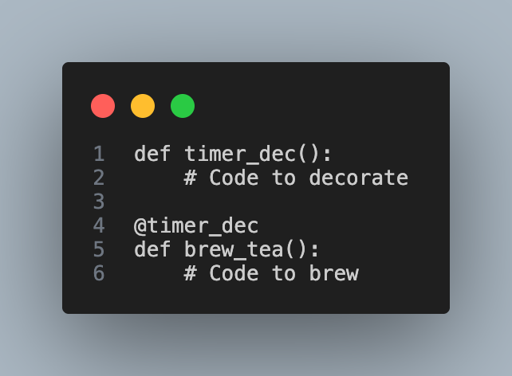

# Decorators Notes

1. Suppose, I have written the code as:

<!---->

```{python}
def timer_dec(base_fn):
    # Code to decorate
    return enhanced_fn
    
@timer_dec
def brew_tea():
    # Code to brew
    
```

Here, @timer_dec is a decorator syntax. timer_dec is a decorator. A decorator like timer_dec is itself a function. The purpose of this function is to decorate or enhance a base function "base_fn" that passed as an argument and return an enhanced function.

By writing @timer_dec on the top of the definition of brew_tea(), we tell python that the base function "brew_tea()" here must be enhanced by the decorator "timer_dec" before it is used.

After receiving base function "base_fn" as an input, the decorator bundles it with additional features without modifying the base function's original code. Once these new features are added, decorator returns the enhanced version of the function. This enhanced version of the function is what python will use when brew_tea() is called. This is how decorators work.

2. Why use decorators to add on extra code when we could simply include the additional operations in the original function definition ? 

It means we can also write extra code to add extra features for a function like:  

```{python}
def brew_tea():
    # Code
    # Code to brew
    # Code
```

Now, suppose, initially we have:
  
```{python}
import time
def brew_tea():
    print("Brewing Tea...")
    time.sleep(1)
    print("Tea is ready!")
brew_tea() # function is created for this purpose and it will take approx 1 sec
```

Now, if we add additional features in this function as:

```{python}
def brew_tea():
    start_time = time.time()
    print("Brewing Tea...")
    time.sleep(1)
    print("Tea is ready!")
    end_time = time.time()
    print(f"Task time: {end_time-start_time} seconds")
brew_tea() # function with additional feature to measure exact time
```

There are issues with this approach. The brew_tea() function violates the single responsibility principle by performing 2 different tasks i.e. brewing tea and timing the process. In programming, functions should focus on a single well-defined responsibility to make code reusable.

Suppose, we also have the matcha making function:

```{python}
def make_matcha():
    start_time = time.time()
    print("Making Macha...")
    time.sleep(1)
    print("Macha is ready!")
    end_time = time.time()
    print(f"Task time: {end_time-start_time} seconds")
make_matcha()
```

But duplicating code is not ideal since it make codebase repetitive and harder to maintain. Decorators offer a great solution to these problems.

3. 