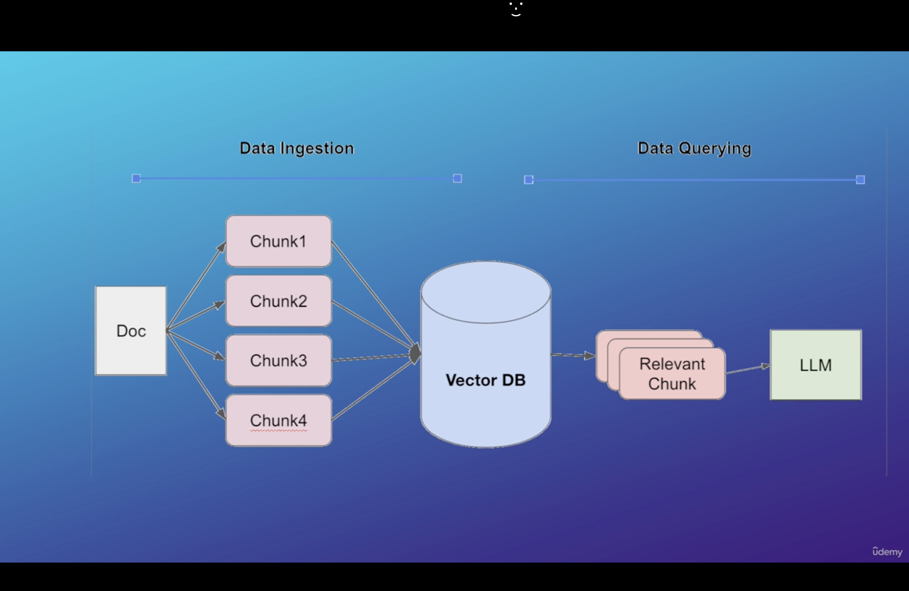
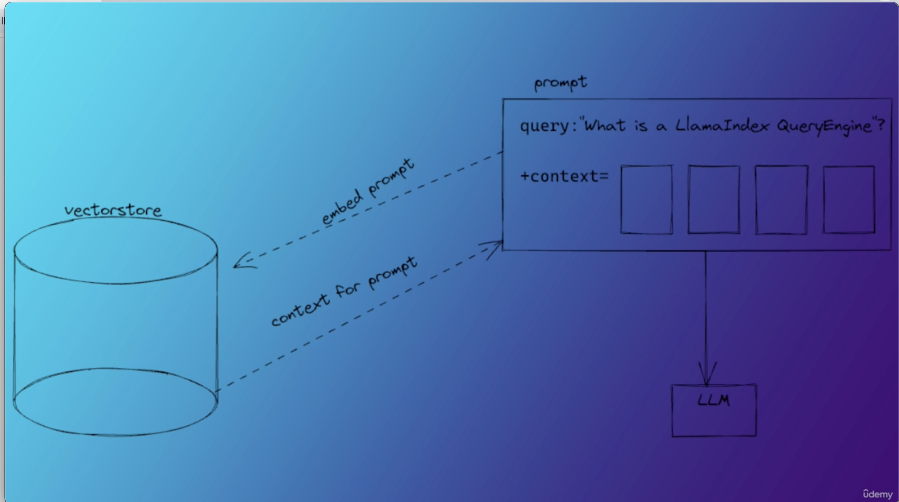

**1. Create virtual environment**

Create virtual environment in this directory using:

```
pipenv shell
```

---

**2. Install dependencies**

Install dependencies using:

```
pipenv install requests beautifulsoup4
```

---

**3. Download documentation**

Run the following command:

```
python download_docs.py
```

This downloads documentation from the provided URL.

This should download many `.html` files under:

```
llamaindex-docs/
```

(not just `sample.html`).

---

**4. Install ingestion libraries**

Run:

```
pipenv install python-dotenv llama-index
```

This installs required libraries for **local ingestion** (no paid APIs).

---

**5. Run ingestion**

Execute:

```
pipenv run python ingestion.py
```

This uses **local storage by default**:

```
INGEST_BACKEND=local
```

No **OpenAI** or **Pinecone keys** are required.

---

**6. Optional Pinecone backend**

If you explicitly want **Pinecone backend (without OpenAI)**, install extras:

```
pipenv install pinecone llama-index-vector-stores-pinecone
```

Then set in `.env`:

```
INGEST_BACKEND=pinecone
PINECONE_API_KEY
PINECONE_INDEX_NAME
```

Optional variables:

```
PINECONE_HOST
PINECONE_DIMENSION
```

Default dimension:

```
1536
```

---

**7. Pinecone index configuration**

If using Pinecone:

Create an index with metric:

```
cosine
```

The index dimension must match your **embedding dimension**:

```
PINECONE_DIMENSION
```

---

**8. Run chat UI**

Install Streamlit:

```
pipenv install streamlit
```

Run UI:

```
pipenv run streamlit run main.py
```

---

**9. Pinecone retrieval backend**

`main.py` defaults to **local retrieval backend** (no paid keys).

To explicitly use **Pinecone retrieval backend**, run:

```
QUERY_BACKEND=pinecone pipenv run streamlit run main.py
```

---

**10. Text chunking parameters**

Generally we use:

```
chunk size = 500
chunk overlap = 50
```

for text splitting.

These values can be adjusted in:

```
ingestion.py
```

---

**11. LlamaHub**

https://llamahub.ai/

---

**12. Pinecone Vector Store**

https://app.pinecone.io/organizations/-OmuNosr5h78t5A7BUd8/projects/81d4ac51-5036-45e0-8ec3-97d8ba909ca3/indexes/llamaindex-documentation-helper/browser

---

**13. RAG pipeline**

Find the below RAG pipeline which we are building here.

```

```

---

**14. Execution order**

Run the following commands in sequence:

```
pipenv run python download_docs.py
pipenv run python ingestion.py
pipenv run streamlit run main.py
```

---

**15. Retrieval Augmented Generation flow**

LlamaIndex takes the **original prompt (query)** and feeds it to the **Pinecone vector store**.

Pinecone finds **k-nearest neighbor vectors** to the prompt.

These neighbor vectors become the **context for the augmented prompt**.

This process is called:

- semantic search
- similarity search

This is the **key principle of retrieval augmentation**.

Pinecone returns those vectors and these vectors become the **context vectors for the prompt**.

```

```

After that, we take the **prompt and augment it with the context vectors**:

```

```

---

**16. Callbacks**

Concept

LlamaIndex provides callbacks to help **debug, track, and trace** the inner workings of the library.

Using the **callback manager**, multiple callbacks can be added.

In addition to logging event data, you can also track:

- duration of events
- number of occurrences of events

A **trace map of events** is also recorded.

Callbacks can use this data however they want.

Example:

The **LlamaDebugHandler** prints the trace of events after most operations.

---

**Callback Event Types**

Available events that can be tracked:

- **CHUNKING** → Logs for before and after text splitting.
- **NODE_PARSING** → Logs for documents and nodes created from them.
- **EMBEDDING** → Logs for number of texts embedded.
- **LLM** → Logs for template and response of LLM calls.
- **QUERY** → Tracks start and end of each query.
- **RETRIEVE** → Logs for nodes retrieved for a query.
- **SYNTHESIZE** → Logs results of synthesize calls.
- **TREE** → Logs summaries and summary levels generated.
- **SUB_QUESTION** → Logs generated sub-questions and answers.

---

**17. Streamlit**

https://docs.streamlit.io/get-started

https://github.com/streamlit/streamlit

---

**18.**