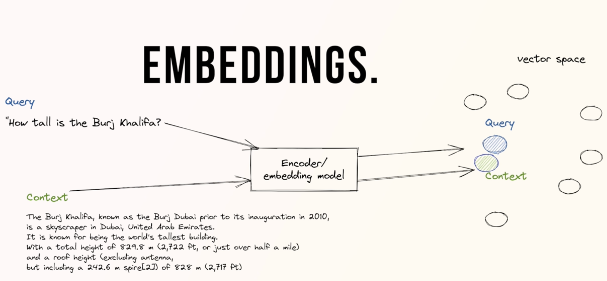
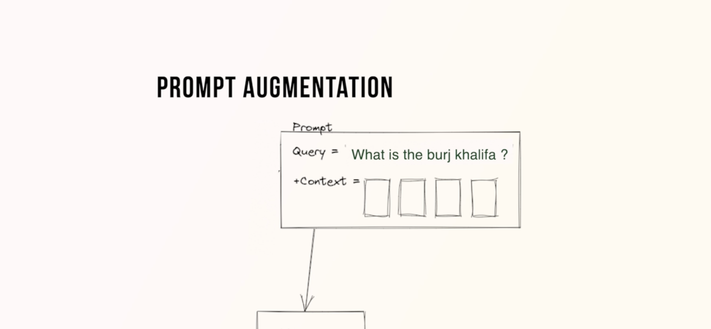
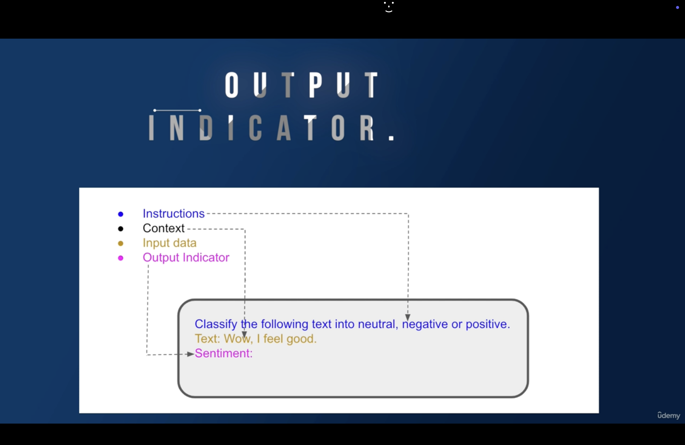
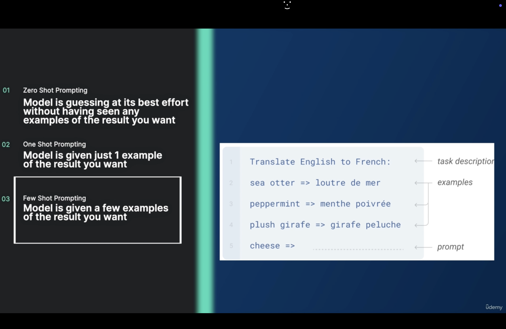
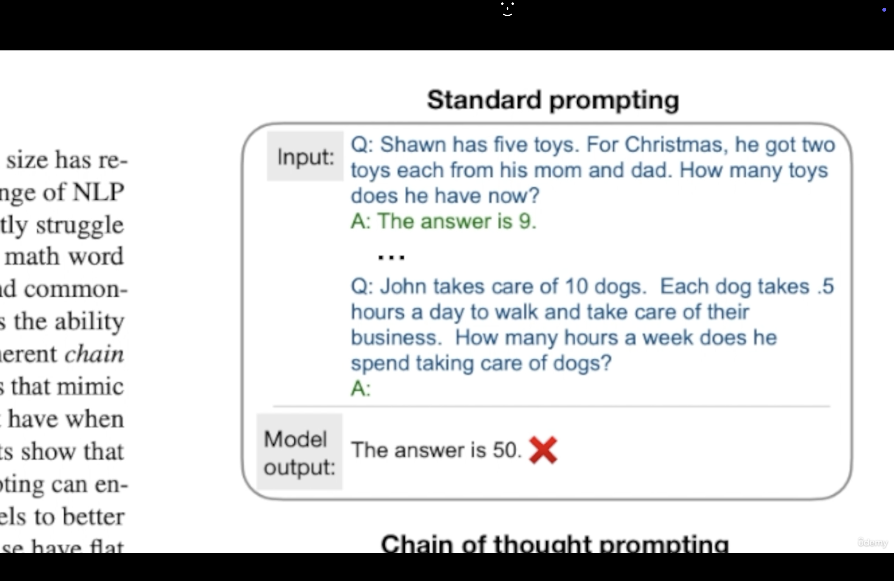
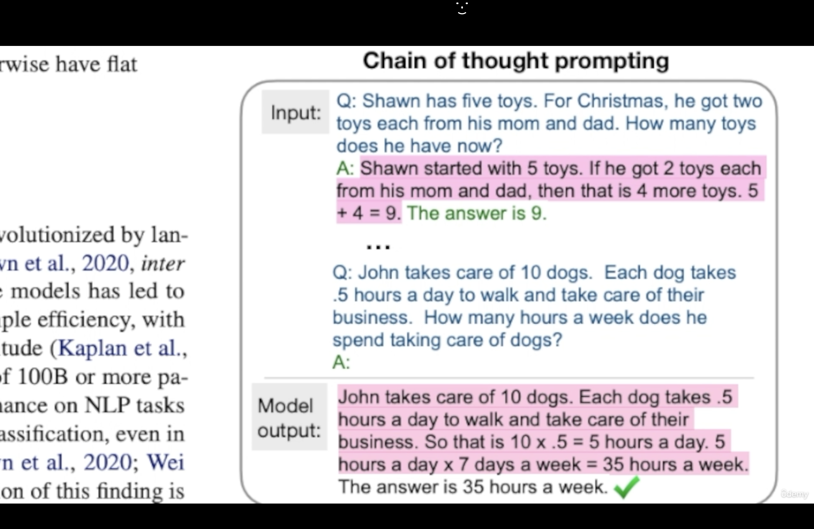

### LlamaIndex Udemy Course by Eden Marco

---

**1. Large Language Models are powerful however they have some limitations.**

For example, if I ask questions like **"How much did I pay in Serpapi in June ?"** to ChatGPT with GPT-3.5, it will not answer because it was not trained on this data but if I use GPT-4 and ask the question by attaching the invoice file, I will get the answer.

---

**2. LlamaIndex**

LlamaIndex is a powerful framework for developing LLM based applications. It is open source and very intuitive to use. On github, it has more popularity (based number of stars) than langchain (a framework to develop LLM based applications)

LlamaIndex is used to connect with our private data in:

- pdf  
- ppt  
- doc  
- image  
- audio  
- video  

as well as various data connectors API like:

- notion  
- salesforce data  
- discord  

as well as various databases like:

- snowflake  
- mongodb  
- postgresql  

LlamaIndex can also interact with vectorstores like **milvus** etc.

If we have a very large document then we have to do **chunking** and make various chunks because LLMs have token limits.

For a question, we might not need all the documents. We may get answer from:

- one specific chunk  
- or 2-3 chunks  

We only send these specific chunks as **context to LLM** then LLM will answer it.

We store these chunks into a **vector store/vector db** and retrieve relevant chunks based on the query/question.

---

**3. Data Connectors (LlamaHub)**

We have different data connectors (LlamaHub).

A **data connector (reader)** ingests data from different data sources and formats into a simple `Document` representation (text and simple data).

Once you have ingested your data, you can:

- build an `index`
- ask question using a `Query Engine`
- have a conversation using `Chat Engine`

---

**4. LlamaHub**

Our data connectors are offered through **LlamaHub**.

LlamaHub is an open source repository containing data loaders that you can easily plug and play into any LlamaIndex application.

---

**5. Documents / Nodes**

Document and Node objects are core abstractions within LlamaIndex.

**Document**

A `Document` is a generic container around any data source such as:

- PDF  
- API output  
- database data  

They can be constructed manually or created automatically via data loaders.

A Document stores:

- text  
- metadata (dictionary of annotations)  
- relationships (dictionary linking other Documents/Nodes)

---

**Node**

A `Node` represents a **chunk of a source document** whether it is:

- text chunk  
- image  
- other data

Similar to Documents they contain metadata and relationship information to other nodes.

**Node and chunk are same.**

Nodes are a **first-class citizen in LlamaIndex**.

You can either:

- define Nodes directly  
- parse documents into Nodes using `NodeParser`

By default every Node derived from a Document **inherits metadata** from that Document.

Example:

```
file_name
```

If it exists in Document metadata it will propagate to every Node.

---

**6. Node Parser**

Node parsers take a list of documents and **chunk them into Node objects**.

Each node has a **specific size**.

A node parser can configure:

- chunk size (tokens)
- overlap between chunked nodes

Chunking is done using:

```
TokenTextSplitter
```

Default values:

- chunk size = 1024
- chunk overlap = 20 tokens

---

**7. Indexes**

An `Index` is a data structure that allows us to quickly retrieve **relevant context** for a user query.

For LlamaIndex, it's the **core foundation for RAG use-cases.**

High-level structure:

```
Documents → Index → Query Engine / Chat Engine
```

Indices are built from `Documents`.

They are used to build:

- Query Engines
- Chat Engines

which enables question answering and chat over your data.

Under the hood:

Indices store data in `Node` objects and expose a **Retrieval interface** supporting automation and configuration.

---

**8. Query Engine**

Query engine is a generic interface that allows you to **ask questions over your data**.

A query engine:

- takes a natural language query
- returns a rich response

It is often built on one or many indices via Retrievals.

Multiple query engines can be composed for advanced capabilities.

---

**9. LlamaIndex Overview**

LlamaIndex is the leading framework for building LLM-powered agents over your data with LLMs and workflows.

Sections include:

- Introduction  
- Use cases  
- Getting started  
- LlamaCloud  
- Community  
- Related projects  

---

### Introduction

**What are agents?**

Agents are LLM-powered knowledge assistants that use tools to perform tasks like:

- research
- data extraction
- task execution

Agents range from simple question answering to systems that **sense, decide and take actions**.

LlamaIndex provides a framework for building agents including the ability to use **RAG pipelines as tools**.

---

**What are workflows?**

Workflows are multi-step processes that combine:

- agents
- data connectors
- tools

They are **event-driven systems** allowing complex applications with:

- reflection
- error correction
- reasoning

These workflows can be deployed as **production microservices**.

---

**What is context augmentation?**

LLMs are trained on large public datasets but not on **your private data**.

Your data may exist in:

- APIs
- SQL databases
- PDFs
- slide decks

Context augmentation makes your data available to the LLM.

The most popular example is:

**Retrieval Augmented Generation (RAG)**

which combines **context + LLM at inference time**.

---

**LlamaIndex provides tools such as**

Data connectors  
Data indexes  
Query engines  
Chat engines  
Agents  
Observability tools  
Workflows

---

### Use Cases

Popular use cases include:

- Question answering (RAG)
- Chatbots
- Document understanding
- Data extraction
- Autonomous agents
- Multimodal applications
- Model fine tuning

---

### Who is LlamaIndex for?

LlamaIndex provides tools for:

**Beginners**

Use high level APIs to ingest and query data in **5 lines of code**

**Advanced users**

Customize modules like:

- data connectors
- indices
- retrievers
- query engines
- reranking modules

---

### Getting Started

LlamaIndex is available in:

- Python
- TypeScript

---

**30 second quickstart**

Set environment variable:

```
OPENAI_API_KEY
```

Install library:

```bash
pip install llama-index
```

Example code:

```python
from llama_index.core import VectorStoreIndex, SimpleDirectoryReader

documents = SimpleDirectoryReader("data").load_data()
index = VectorStoreIndex.from_documents(documents)
query_engine = index.as_query_engine()

response = query_engine.query("Some question about the data should go here")

print(response)
```

---

### LlamaCloud

LlamaCloud is a managed service for:

- document parsing
- data extraction
- indexing
- retrieval

Website:

https://llamaindex.ai/enterprise

You can get **10,000 free credits per month**.

Services include:

Document Parsing (LlamaParse)  
Document Extraction (LlamaExtract)  
Indexing / Retrieval pipelines

---

### Community

Twitter  
Discord  
LinkedIn

---

**Library Links**

Python:

- https://github.com/run-llama/llama_index
- https://docs.llamaindex.ai/
- https://pypi.org/project/llama-index/

TypeScript:

- https://github.com/run-llama/LlamaIndexTS
- https://ts.llamaindex.ai/
- https://www.npmjs.com/package/llamaindex

---

**10. Documentation**

https://github.com/run-llama/llama_index

python-dotenv:

https://github.com/theskumar/python-dotenv

https://www.youtube.com/watch?v=8dlQ_nDE7dQ&t=210s

---

**11. Project Setup**

Use **Python 3.11** since it's the most stable for LlamaIndex.

Create project directory:

```bash
mkdir llamaindex-helloworld
cd llamaindex-helloworld
```

Install pipenv:

```bash
pip3 install pipenv
pipenv --version
```

Create virtual environment:

```bash
pipenv shell
```

Exit environment:

```
exit
```

---

If creating a fresh environment:

```bash
rm -f Pipfile Pipfile.lock

export PIPENV_NO_INHERIT=true
export PIPENV_IGNORE_REQUIREMENTS=true

pipenv --python 3.11

pipenv install llama-index python-dotenv

pipenv shell
```

Install packages:

```bash
pipenv install llama-index python-dotenv
pipenv install llama-index-readers-web html2text
```

Create files:

```bash
touch main.py .env
```

Run program:

```bash
pipenv run python main.py
```

---

**12. Retrieval Augmented Generation (RAG)**

Prompt = **Query + Context**

Large text (like books) must be **chunked** to avoid token limits.

Only relevant chunks are sent to the LLM.

This reduces unnecessary API costs.

---

**Embeddings**

Embeddings convert objects into **vectors**.

Objects may include:

- text
- audio
- image
- video

Similar semantic meanings produce **vectors close together in embedding space**.

Images:

```


```

---

**13. Language Modelling**

A language model is a probability distribution over sequences of words.

Formal definition:

Given sequence

```
x1, x2, x3 ... xt
```

Predict:

```
P(x(t+1) | x1,x2,...,xt)
```

Examples:

- search engines
- text suggestions

---

**14. Large Language Model (LLM)**

An LLM is simply a **language model trained on huge amounts of data**.

These models are very good at calculating probabilities.

---

**15. Composition of a Prompt**

A prompt is the **input given to a language model**.

Prompt components:

A. Instructions  
B. Context  
C. Input Data  
D. Output Indicator

Example diagram:

```

```

---

**16. Prompting Techniques**

Zero Shot Prompting

Model generates output without examples.

Example:

Write an image description with adjectives and nouns of a Yorkshire dog running in a winter landscape in Brazil.

---

One Shot Prompting

Model receives **one example**.

---

Few Shot Prompting

Model receives **multiple examples**, improving accuracy.

Image:

```

```

One shot prompting is a subset of few shot prompting.

---

**17. Chain of Thought Prompting**

Large LLMs still struggle with **multi-step reasoning problems**.

In 2022 Google researchers introduced **Chain of Thought (CoT)**.

It improves reasoning by breaking problems into **intermediate steps**.

---

Zero Shot CoT:

Prefix prompt with:

```
Let's think step by step.
```

Example:

```
I bought 10 apples.
Gave 2 to neighbor.
Gave 2 to repairman.
Bought 5 more.
Ate 1.

How many apples remain?

Let's think step by step.
```

---

Few Shot CoT

Provide examples of **step-by-step reasoning**.

Images:

```


```

---

**18. ReAct Prompt Engineering**

ReAct stands for:

```
Reason + Act
```

ReAct combines:

```
CoT + Actions
```

It integrates reasoning with actions and enables interaction with external environments.

It comes from a **2023 research paper** and forms the basis of **LangChain agents**.

---

**19.**