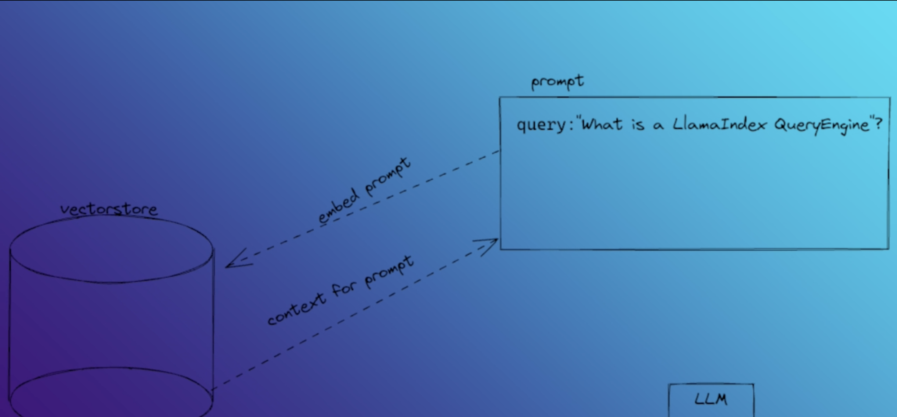

1. create virtual environment in this directory using `pipenv shell`
2. install dependencies using `pipenv install requests beautifulsoup4`
3. run `python download_docs.py` to download the documentation from the provided URL.
This should download many `.html` files under `llamaindex-docs/` (not just `sample.html`).
4. run `pipenv install python-dotenv llama-index` to install required libraries for local ingestion (no paid APIs).

5. Run `pipenv run python ingestion.py`
This uses local storage by default (`INGEST_BACKEND=local`) and does not require OpenAI or Pinecone keys.

6. Optional: if you explicitly want Pinecone backend (without OpenAI), install extras:
`pipenv install pinecone llama-index-vector-stores-pinecone`
and set in `.env`:
`INGEST_BACKEND=pinecone`, `PINECONE_API_KEY`, `PINECONE_INDEX_NAME`
(plus optional `PINECONE_HOST` and `PINECONE_DIMENSION`, default `1536`).

7. If using Pinecone, create an index with metric `cosine`. Use the same index dimension as your embedding dimension (`PINECONE_DIMENSION`).

8. To run the chat UI:
`pipenv install streamlit`
`pipenv run streamlit run main.py`

9. `main.py` defaults to local retrieval backend (no paid keys). To use Pinecone retrieval explicitly:
`QUERY_BACKEND=pinecone pipenv run streamlit run main.py`

10. Generally we use chunk size as 500 and chunk overlap as 50 for text splitting, but you can adjust these in `ingestion.py` if needed.

11. LlamaHub: https://llamahub.ai/

12. pinecode vectorstore: https://app.pinecone.io/organizations/-OmuNosr5h78t5A7BUd8/projects/81d4ac51-5036-45e0-8ec3-97d8ba909ca3/indexes/llamaindex-documentation-helper/browser

13. Find the bellow RAG pipeline which we are building here.

14. first run `pipenv run python download_docs.py` then `pipenv run python ingestion.py` and then `pipenv run streamlit run main.py`

15. Llamaindex takes the original prompt (query) and feed to pinecone vector store and then it finds k-nearest neighbors vectors to the prompt. These neighbor vectors are the context for the augmented prompt. This is called the semantic search or similarity search and this is the key principle of retrieval augmentation. 

Pinecone returns those vectors and these vectors becomes the context vectors for the prompt. 

and after this (we take the prompt and augment it with the context vectors):

16. Callbacks

Concept

LlamaIndex provides callbacks to help debug, track, and trace the inner workings of the library. Using the callback manager, as many callbacks as needed can be added.

In addition to logging data related to events, you can also track the duration and number of occurrences of each event.

Furthermore, a trace map of events is also recorded, and callbacks can use this data however they want. For example, the LlamaDebugHandler will, by default, print the trace of events after most operations.

⸻

Callback Event Types

While each callback may not leverage each event type, the following events are available to be tracked:
	•	CHUNKING → Logs for the before and after of text splitting.
	•	NODE_PARSING → Logs for the documents and the nodes that they are parsed into.
	•	EMBEDDING → Logs for the number of texts embedded.
	•	LLM → Logs for the template and response of LLM calls.
	•	QUERY → Keeps track of the start and end of each query.
	•	RETRIEVE → Logs for the nodes retrieved for a query.
	•	SYNTHESIZE → Logs for the result for synthesize calls.
	•	TREE → Logs for the summary and level of summaries generated.
	•	SUB_QUESTION → Log for a generated sub-question and answer.
 

17.  Streamlit: https://docs.streamlit.io/get-started and https://github.com/streamlit/streamlit

18.  
