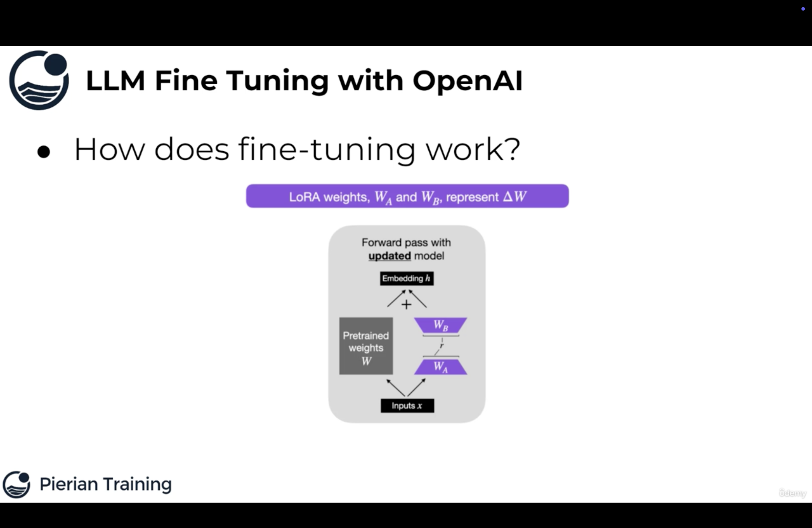
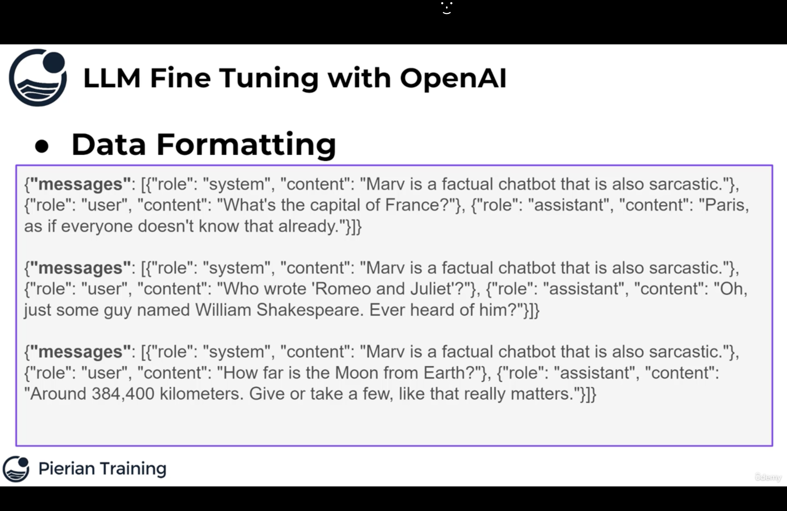

[Pierian Training]

1. #### LLM Fine Tuning with OpenAI

- Fine-Tuning lets you get more out of the models available through the API by providing:
    
    - Higher quality results than prompting
    - Ability to train on more examples than can fit in a prompt
    - Token savings due to shorter prompts
    - Lower latency requests

- Note that fine-tuning is **not** available for all models and may be deprecated for older models in the future, you can check out which models can be fine-tuned at: https://platform.openai.com/docs/guides/fine-tuning/

2. When can fine-tuning improve results ?

- Setting the style like sarcastic or witty, tone, format or other qualitative aspects
- Improving reliability at producing desired outputs
- Correcting failures to follow complex prompts
- Handling many edge cases in specific ways
- Performing a new skill or task that's hard to articulate in a prompt
  
3. How does fine-tuning work ?

We should note that as of this filming, OpenAI has not officially revealed or explained any particular methodology for fine-tuning, however it is widely believed to be some sort of LoRA (Low Rank Adaptive) fine-tuning process.

Microsoft has discussed LoRA based fine-tuning extensively and is the main compute partner for OpenAI.

It is extremely likely that LoRA used in ChatGPT.

Here we update some input weights ($W_A$) and some output weights ($W_B$), and we have changes between $W_A$ and $W_B$ by a small fraction of parameters. 

Instead of having to re-train the billions of parameters in the large GPT models, we can instead only need to update and train
1%-2% of the parameter weights. It means we freeze most of the weights in the model, and add our own little layers to slowly or quickly update that is where LoRA comes from and we train 1-2% of the parameters. 

OpenAI then just needs to save those extra weights, allowing you to access your own pre-trained models.

- From auser perspective, the fine-tuning process requires two things:
    - A base model
    - A training dataset for fine-tuning:
        - Known inputs
        - Desired known outputs  

Fine-tuning Data Example:

Input: Patient suffers from a rash on arms
Output: Eczema

Another Example:

Input: Client requests review of legal documents pertaining to her house
Output: Property Right Department

4.  Fine-Tuning Applications and Use-Cases:

- Changing style and tone to your own custom style (sometimes can be done using prompt engineering)
- Fine-tuning for very specific structured output or custom code function output
- Classification based on proprietary data sources

5.

- Remember to always use the base model first and see if prompt engineering or extra context can achieve your desired results
- Fine-tuning a model is a more expensive process that require datasets.
- It will also be more costly to query your own fine-tuned model vs the base model. 

6. Data Processing:

There are 3 main things we need to do for the data processing:

(i)   Check for invalid or missing data
(ii)  Get an idea of statistics of our data (optional but highly recommended)
(iii) Format data into correct fine-tuning format for LLM OpenAI Fine-Tuning

7. Data Formatting:

- A critical part of fine-tuning an LLM on OpenAI is the formatting of the data.
- OpenAI has expressed that their future models will be chat based, meaning 3 key elements: system content describing the overall bot, a user message and the expected assistant output.

This json file has 3 components for messages. First is content for the role of the system, next is the content for the user and last is the content for the assistant (the desired or expected output).

- The final data set should then be exported to a .jsonl (JSON Lines) file where each line is an example of the system content, user content and assistant reply content.

- To fine-tune a model, you are required to provide at least 10 examples.

- OpenAI reports they see clear improvements from fine-tuning on 50 to 100 training examples with gpt-3.5-turbo but the right number varies greatly based on the exact use-case.

- OpenAI recommends starting with 50 well-crafted demonstrations and seeing if the model shows signs of improvement after fine-tuning.

- In some cases that may be sufficient, but even if the model is not yet production quality, clear improvements are a good sign that providing more data will continue to improve the model.

8. 