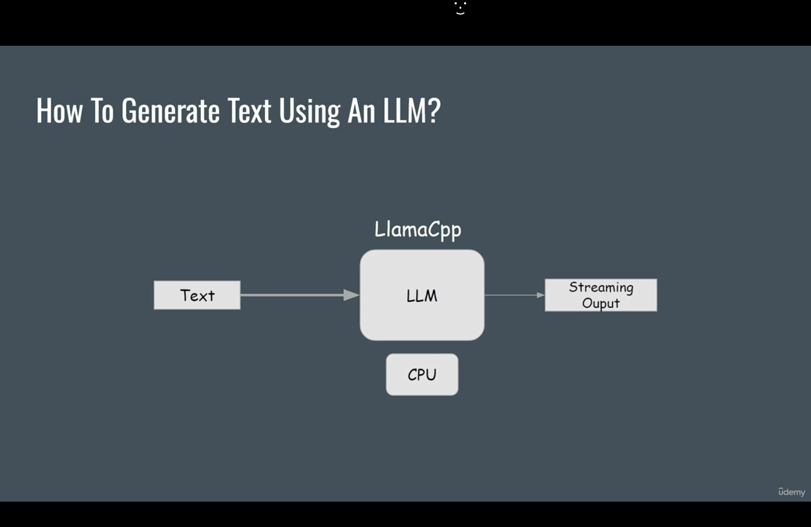
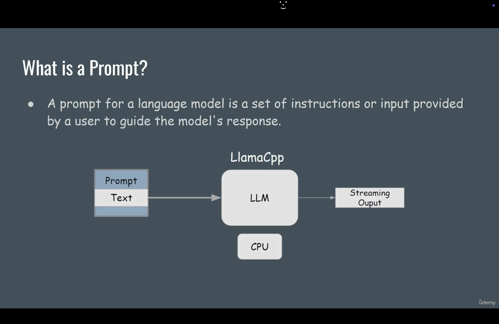
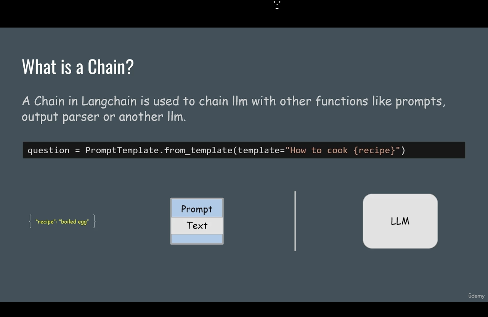
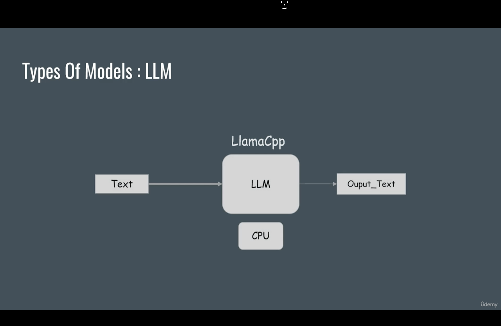
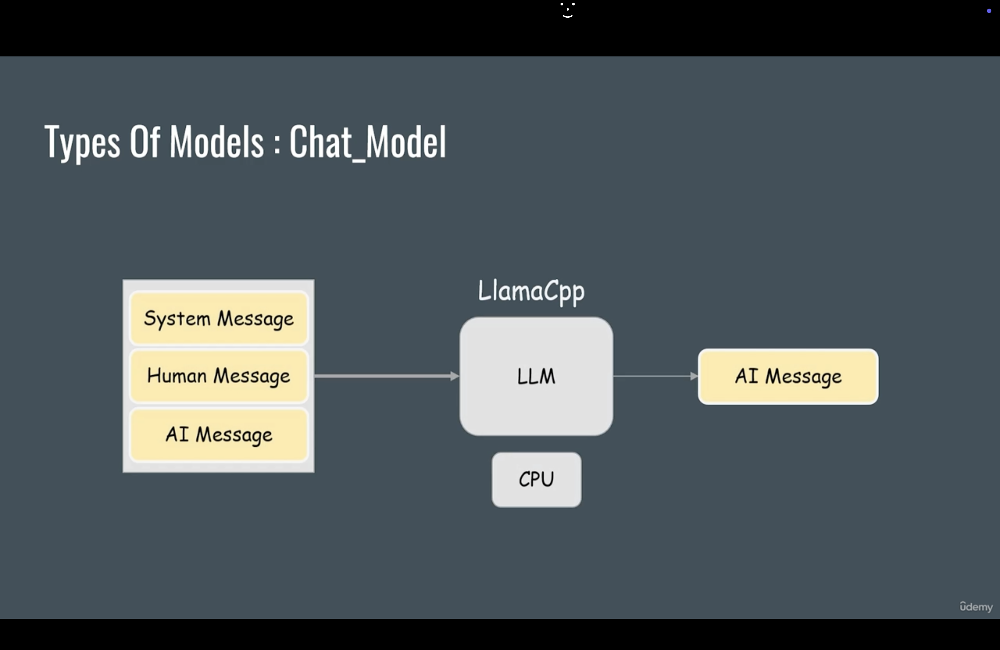
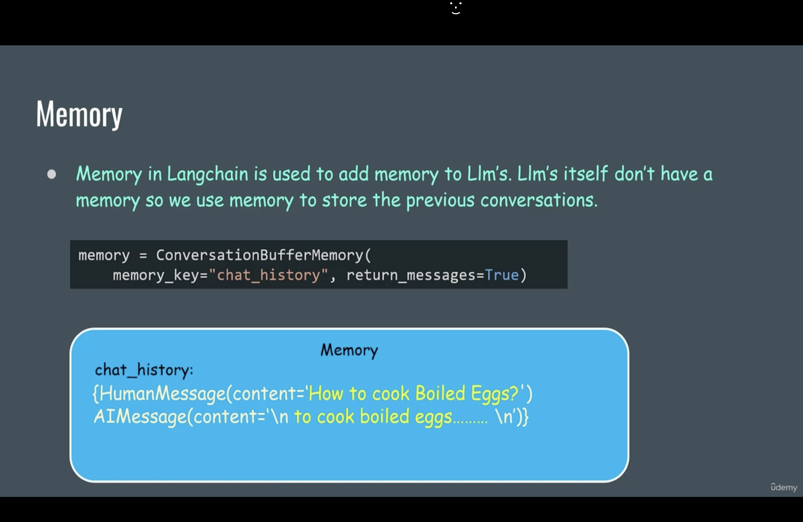
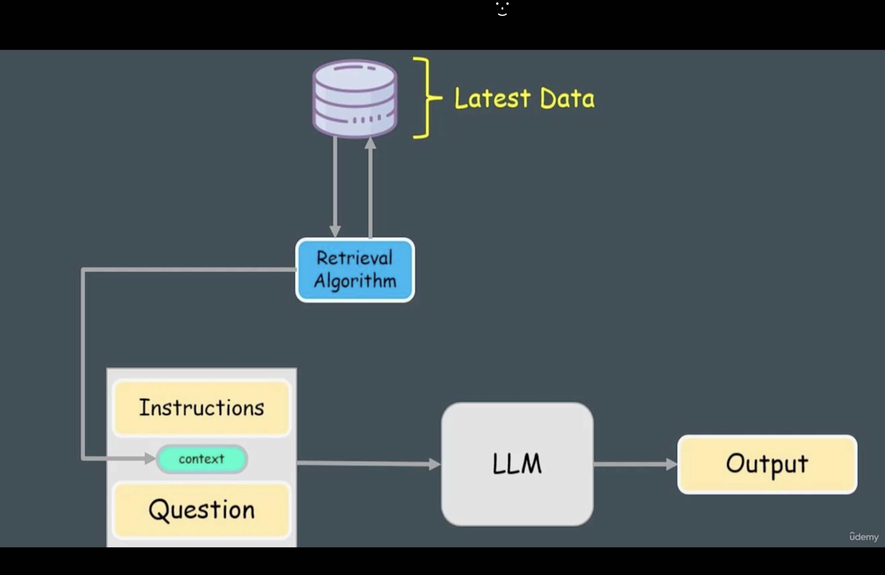

[Udemy Course]

## Introduction

1. In this course, we would discuss about LLMs, Chains, Prompts, Memory, RAG, Agents, tools and much more.

2. Here, we use Mistral and Llama2 models as LLMs and libraries we use as LlamaCpp for loading GGUF Quantized models and HuggingFace Transformers library for loading Original models.

3. LangChain was launched in October 2022 as an open source project by Haris and Chase. It is framework tailored to developing applications leveraging large language models (LLMs). It provides python and javascript libraries serving as a central hub for large language models (LLM) development. It is integrated with the external data sources like Pinecone, Chromadb and also it is integrated with various workflows. 

4. It is launched in October 2022 and became the fastest growing open source project on github (https://github.com/langchain-ai/langchain). By June 2023, it is playing a vital role in popularizing Generative AI alongside release of OpenAI's ChatGPT. LangChain supports various LLM use cases like grom chatbot to intelligent search and summarization services. 

5. How to Generate Text using an LLM:

here, we will be downloading open source GGUF models from HuggingFace and to load the models we will be using LlamaCpp. The reason to use GGUF models is that we can run the models on CPU.  



6. Now, go to 23.LangChain folder using `cd 23.LangChain` and then create and activate virtual environment using `pipenv install` and `pipenv shell`.

Now, install 2 libraries `pipenv install langchain llama-cpp-python`.

Here, we are using `Mistral-7B-v0.1-GGUF` model. There are various quantized models are there of this category in HF(HuggingFace) Hub.

Download one of the these models from HuggingFace Hub. You can download the model from this link https://huggingface.co/TheBloke/Mistral-7B-v0.1-GGUF/blob/main/mistral-7b-v0.1.Q8_0.gguf and put it in textgen folder.

You also have to download `https://huggingface.co/TheBloke/Llama-2-7B-Chat-GGUF/blob/main/llama-2-7b-chat.Q8_0.gguf` and `https://huggingface.co/TheBloke/Llama-2-7B-Chat-GGUF/blob/main/llama-2-7b-chat.Q5_K_M.gguf` later in this course.


7. Create textgen.py in Text_Gen folder and write the code as mentioned.    

## Prompts and Chains

8. What is Prompt ?

A prompt for a language model is a set of instructions or input provided by a user to guide the model's response.



Why use Prompts ?   

We use prompts because Prompt Templates allow for a dynamic generation of prompts by incorporating variables and placeholders. This enables the customization of prompts based on specific requirements and input data.

9. What is Chain ?

A chain in LangChain is used to chain llm with other functions like prompts, output parser and another llm.

For example, for the question:

```
question = PromptTemplate.from_template(template="How to cook {recipe}?")
```
We pass the input in dictionary format like `{recipe: "boiled egg"}` to the text+prompt with recipe's placeholder value. The prompt template will replace the placeholder with the actual value of recipe name i.e. `question = PromptTemplate.from_template(template="How to cook {boiled egg}?")`.



After that the updated text i.e. `How to cook boiled egg?` will be passed to the pipe (|) operator. The pipe operator will convert output of prompt template into input for the next function. In this case, the next function is the LLM. Then model will generate the text based on the input.

10. Langchain Expression Language(LEL):

- *invoke:* Single input into an output. Example: `chain.invoke({"recipe": "boiled egg"})`

- *batch:* multiple inputs into outputs. Example: `chain.batch([{"recipe": "boiled egg"}, {"recipe": "fried egg"}, {"recipe": "roasted egg"}])`

- *stream:* streams output from a single input as it's produced. 

```
for chunk in chain.stream({"recipe": "boiled egg"}):
    print(chunk, end="", flush=True)
``` 

All LEL objects implement the runnable objects interface which has methods such as `invoke`, `batch` and `stream` etc.

11. Till now, we have passed text directly to an LLM and LLM generates the answer without any specific answer or structure. It is called zero-shot prompting.

In one-shot prompting, we give example to the LLM. The LLM will use the example to generate the output. 

## Memory:

12. In LangChain, there are 2 types of models:

A. LLM:

It takes the string as input and generate the string as output.



B. Chat_Models:

It takes human messages as input and generate AI message.



There are 3 types of messages in Chat_Models:

(i) System Message

It is set by the developers to tell the model how it should answer the question like "Answer in 5 sentences only"

(ii) Human Message

Human Message are the questions asked by the user like "how to cook Boiled Egg ?".  

(iii) AI Message

It is the answer given by the LLM like "To cook boiled egg...."

Chat models are fine-tuned for chat purposes, so they are good fit for chat assistants and chatbots. 

13. If we want to build a chatbot with memory then we need chat models. 
 
Here, we use the Hugging Face TheBloke/LLama-2-7B-Chat-GGUF quantized model.

Download the model from `https://huggingface.co/TheBloke/Llama-2-7B-Chat-GGUF/blob/main/llama-2-7b-chat.Q8_0.gguf`.

14. Run the code of `chatbot1.py` and ask question as "how to cook boiled eggs ?" then ask any follow-up question, assistant will not answer.

15. To use memory, we have to import `ConversationBufferMemory` from `langchain.memory`.

Memory in LangChain is used to add memory to LLMs. LLMs itself don't have a memory so we use memory to store previous conversations.

```
memory = ConversationBufferMemory(memory_key="chat_history",return_messages=True)
```

This piece of code will create a variable `chat_history` in memory and store all type of messages. `return_messages=True` will ensure that all the messages will be stored in the messages format.



16.

`RunnableLambda` is used to run custom functions. Here we use `RunnableLambda(memory.load_memory_variables)` so here `memory.load_memory_variable` returned dictionary object as `{"chat_history": 'How to boiled eggs \n AI: to cook boiled eggs \n'}`  and now using pipe symbol it is passed to chat history using `itemgetter()` method because `itemgetter()` method is used to get values from dictionary. 

So, now we have `RunnablePassthrough.assign(chat_history="How to boiled eggs \n AI: to cook boiled eggs \n")`. 

Here, `RunnablePassthrough.assign()` is used to convert data into dictionary format and concatenated with the incoming input. 

So, finally, we will have the dictionary `{"question": "How many eggs ?", "chat_history":"How to boiled eggs \n AI: to cook boiled eggs \n"}` which will be passed to the prompt.

## RAG(Retrieval Augmentation Generation)

17. RAG is an AI framework that enhances the performance of Large Language Models(LLMs). It does this by retrieving and incorporating external data (not included in the models' training set) into generation process. This approach ensures that responses are mostly grounded in the most reliable and current facts. Thereby it improves the quality and accuracy of the output.



18. In RAG, first we load the documents (in txt, csv, pdf etc. format) then we split the documents then we generate the embeddings and after that we store the embeddings in the vector store (eg. chromadb) and then we can use the similarity search algorithm to find the most relevant documents and retrieve them. 

19. LangChain has several document loaders like textloaders, csvloaders, pdfloaders and much more.

For example, to load a text file, we can write code as:

```
from langchain_community.document_loaders import TextLoader
loader = TextLoader("/path/to/textfile.txt")
loader.load()
```

20. Document Splitting:

Langchain has several text splitters like code splitter, character splitter etc.

For example:

To split a text file when you encounter a new line, you can use the `CharacterTextSplitter` class as:

```
from langchain.text_splitter import CharacterTextSplitter
text_splitter = CharacterTextSplitter(
    separater = "\n",
    chunk_size  = 100, # maximum size of each chunk
    chunk_overlap = 50 # number of characters that are overlapping between chunks
)
```
    
21. The embedding algorithm which we are going to use is `all-MiniLM-L6-v2`[https://huggingface.co/sentence-transformers/all-MiniLM-L6-v2] from HuggingFace. It is an open source algorithm.

This algorithm maps the text to 384 dimensional vector space. It is used to compare the similarity of two sentences.

Example:

Source Sentence: That is a happy person.

Sentences to compare to:

i.   That is a happy dog.
ii.  That is a very happy person.
iii. Today is a sunny day.

Result we get after applying the algorithm as: Sentence 2 gives 0.9 similarity score, Sentence 1 gives 0.6 similarity score
and Sentence 3 gives 0.2 similarity score. 

We can use this algorithm as:

```
from langchain_community import HuggingFaceEmbeddings
embeddings = HugggingFaceEmbedding(model_name = "all-MiniLM-L6-v2")
```

We use the chroma db as the vector store. It is open source embedding database. We use to store embeddings in a database as:

```
from langchain_community.vectorstores import Chroma
# Storing in DB
db = Chroma.from_documents(
    splitted_text,
    embedding = embeddings,
    persist_directory = "path/to/StorageFolder"
)
```

```
# Loading data from existing DB
db = Chroma(
    persist_directory = "path/to/StorageFolder",
    embedding_function = embeddings,
)
```

22. to run the code in `db_init.py`, install libraries using `pipenv install chromadb sentence_transformers` and then run the file to initialize the database, loaded the documents, splitted the text, created embeddings and stored everything in the database. After that run the code in `rag.py`

23. For agents and tools, go to kaggle, create a new notebook and run the code in `agents.ipynb` file but upload the model file on kaggle as described in `agents.ipynb` file first.

24. 


