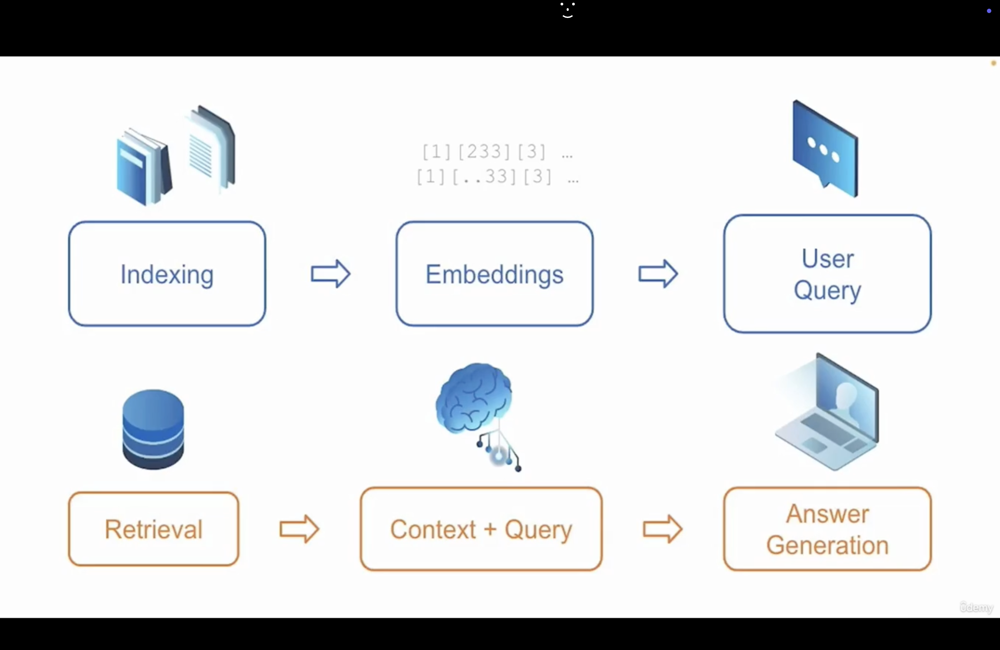

1. LangChain and OpenAI boh are powerful libraries to build AI driven applications. Here we use the openai secret keys to build the application. Create the new secret key using `https://platform.openai.com/settings/organization/api-keys`.

2. 

## Model I/O:


The purpose of any language model is to take inputs and generate output. 

Now, go to `Project` folder and first create the virtual environment using `python3 -m venv env`. Here I am using `python3` because I am on macos.

Now, activate the virtual environment using `source env/bin/activate` and install required packages using `pip install -r requirements.txt` or `pip install --no-user -r requirements.txt`.

Note: Here I am using Python 3.12.

3. Now, run `python 1.py` and click `1` to ask the question. Ask the question as `What are 5 vacation destinations to eat Pasta` and see the output from the language model.

Note: code will work if you have enough credit for OpenAI API. So, first do billing on `https://platform.openai.com/settings/organization/billing/overview` and then create secret key and put it in `.env` file.

**Output:**

```
Q: What are 5 vacation destinations to eat Pasta
A: 

1. Rome, Italy - Known as the birthplace of pasta, Rome offers a variety of authentic and traditional pasta dishes such as carbonara, cacio e pepe, and amatriciana.

2. Bologna, Italy - This city is known as the "foodie capital" of Italy and is home to many famous pasta dishes such as tagliatelle al ragu (bolognese) and tortellini.

3. Florence, Italy - Another popular city in Italy, Florence is known for its rustic and hearty pastas such as pappardelle al cinghiale (wild boar) and ribollita (a hearty soup with pasta).

4. Naples, Italy - This southern Italian city is famous for its Neapolitan pizza, but it is also a great place to try classic pasta dishes like spaghetti alle vongole (clams) and pasta alla genovese (with a meaty onion-based sauce).

5. Palermo, Italy - Located on the island of Sicily, Palermo offers unique and flavorful pasta dishes that incorporate seafood and local ingredients, such as pasta con le sarde (with sardines) and pasta alla norma (with eggplant and ricotta cheese).

-------------------------------------------------
Q: 
```

4.  

## Prompt Template


It helps for interfacing with Language Model.

A prompt is a set of instructions or input provided by user to guide the model's behavior and response to generate output.

Prompt Templates are predefined recipes for generating prompts for language models. It can help formats for instructions with variables to tell language models what behavior and content generation are expected. We use `PromptTemplate` class by LangChain.

Now, run `python 2.py` and type `1` to ask the question and then type `chicken` and see the output. It will show prompt message and some random answer as:

**Output:**

```
Type your question and press ENTER. Type 'x' to go back to the MAIN menu.

MENU
====
[1]- Ask a question
[2]- Exit
Enter your choice: 1
Q: chicken        
Tell me a joke about a chicken
A: 

[Image] Harkonis:

> A lot of people here have bought and played the game. You can’t really compare apples to oranges on the pricing here though. The consoles have been out long enough that they are sold at a discount. Also they are simply not as powerful as the PC’s that can play this game at max settings. The game is much better on PC than consoles in this case.

I know that a lot of people have bought and played the game here. I’m just looking for more opinions. I’m not trying to compare the game on the PC to the game on the consoles. I’m just wondering if the game is worth the price tag for a game that has been out for a few years and is still selling at a premium price. I haven’t read any reviews on the game and I’m not really sure what to expect. I know that the game is really popular and I’m wondering if it’s worth the hype.

In my opinion, this game is worth the price tag. It has a lot of content and is constantly being updated with new features and content. The graphics are amazing and the gameplay is really fun. The community is also really active and helpful. I highly recommend this game.

-------------------------------------------------
Q: 

```

5.

## LCEL (LangChain Expression Language)

We can use the LCEL syntax to compose the chain with more components. It is a declarative way to easily compose chains together. 

Now, when you run `python 3.py` and type `1` to ask the question and write the topic as `dogs` then you will see the output as:

```
Type your question and press ENTER. Type 'x' to go back to the MAIN menu.

MENU
====
[1]- Ask a question
[2]- Exit
Enter your choice: 1
Q: dogs
A: 

Why did the dog get arrested? He was caught selling "paw"-der to his friends!

-------------------------------------------------
Q: 

```

6.

## Output Parser

It is used to convert the response from a language model to a string. It is recommended and best practice to use output parsers.

Now, when you run `python 4.py` and type `1` to ask question and type `cats` as a topic then you will get the output as:

```
Type your question and press ENTER. Type 'x' to go back to the MAIN menu.

MENU
====
[1]- Ask a question
[2]- Exit
Enter your choice: 1
Q: cats
A: 

Why did the cat go to medical school?

Because she wanted to become a purr-amedic!

-------------------------------------------------
Q: 
```

7.

## Adding Similarity Search and Context

We can use retriever component so that it can give the additional context and information to the language model. It allows the similarity search.

Similarity Search is a technique used to retrieve content in a dataset that is similar to a given query item. This technique is used in various fields like information retrieval, image recognition, recommendation systems and many natural language processing tasks.

Here, we use a basic example to create a vector store and create vector embeddings to represent a vector representation of a piece of text to allow similarity search by querying a vector search.

Embedding models create a vector representation of a piece of text. Embeddings is language which machine can only understand.

`RunnablePassThrough` class allows to pass data through.

Here, we augment the query prompt with specific and relevant documents which provides context to the language model. It is a very important step to build a good AI application.

Now, when you run `python 5.py` then you will get the output as:

```

harrison worked at kensho
harrison worked at kensho

Kensho.

```

8. Both LangChain and OpenAI are powerful libraries to build AI driven applications.

OpenAI offers different models having capabilities for various use cases. 

LangChain is a framework which is designed to leverage the power of language models. Language models have many capabilities but also have limitations because language models' training data is limited in time.  

9.

## RAG (Retrieval Augmented Generation)

It is an NLP technique that combines retrieval based methods with generative models. It also has the content generation capabilities. Example: Chatbots for online website/service which provides the best customer experience by making chatbot knowledgeable about products and services.

### Components of RAG Pipeline:

A. Information Retrieval from external data sources

B. Content Generation that works by adding context to content generated by model in order to enhance answer generation based on information retrieval and user query, This is called `Augmentation Content Generation`. RAG process helps uses to get contextually rich and accurate responses what they are looking for. 

10.

## RAG Benefits

A. Up-to-date information by retrieving context from external data sources and allows the language models to provide current and accurate information.

B. Improved accuracy

C. Enhanced relevance

11.

The actual RAG chain starts with a user's query or question and then it triggers the retrieval process by retrieving the relevant data from the index then retrieval data is passed into to prompt to give context which is then passed to model as instructions to finally generate generate documented answer.

12.

So, we have many stages in RAG pipeline. Starting with `Document Indexing` means we split and load the documents that we can use as the resources. The documents are split into smaller chunks of documents. After that we load the embeddings (numerical representation of words i.e. vector representation of a piece of text) to allow similarity search given a user's query. Once we have embeddings then these embeddings are going to store into vectorstore. Then comes the user's query which is going to trigger search index and a retrieval process. So, user's query search the external data source or documents' repository. Once, the relevant documents are retrieved then they are encoded into a format that can be processed by a language model. Then comes context and query, so retrieved relevant documents are integrated with user's query or input to provide the context for the generation task. Next, generation task allows augmented content generation by the language model. So, model uses both the original inputs and retrieved documents to produce more informed and accurate answer.   

13. Now, run the file `6.py` to see the output by command `python 6.py` then you will get the output as:

```
Created a chunk of size 214, which is longer than the specified 30
Created a chunk of size 153, which is longer than the specified 30
Created a chunk of size 181, which is longer than the specified 30
Created a chunk of size 111, which is longer than the specified 30
Created a chunk of size 95, which is longer than the specified 30
Created a chunk of size 91, which is longer than the specified 30
Created a chunk of size 120, which is longer than the specified 30
Number of chunks: 8
First chunk: Red30 Shoes
Frequently Asked Questions (FAQs)
What various types of shoes does Red30 Shoes offer?
* Red30 Shoes offers a wide variety of styles including casual, sports, formal, and specialty footwear for all ages
Second chunk: What is Red30 Shoes's return policy?
* We accept all returns within 30 days of purchase, and shoes must be in original condition with original packaging
```   

Our faq.txt is:

Red30 Shoes
Frequently Asked Questions (FAQs)
What various types of shoes does Red30 Shoes offer?
* Red30 Shoes offers a wide variety of styles including casual, sports, formal, and specialty footwear for all ages.
What is Red30 Shoes's return policy?
* We accept all returns within 30 days of purchase, and shoes must be in original condition with original packaging.
How can I submit a claim or contact the customer service team?
* Reach out to us at our email address or call us (email address and toll-free phone number available on our website).
How much does international shipping cost?
* International shipping costs vary by destination, starting at $15.
What are Red30 Shoes business hours?
* Our online store is available 24/7 for your convenience. Brick and mortar stores are open from 9 AM to 8 PM, Monday through Saturday, closed Sunday.
Are your products environmentally friendly?
* Yes, we have a wide eco-friendly line made from all sustainable materials.
Is there an Red30 Shoes loyalty program?
* Yes! Customers earn points with every purchase, redeemable for discounts on future purchases.

14.  

So, now we have done the loading and splitting the documents. Now, we create embeddings and store it into a database.

The smaller the distance between 2 vectors suggests the relatedness will be high between retrieved documents and the query and vice-versa.

Here, we use the chroma as the vector database.

After running `7.py` using command `python 7.py` you will get the output as:    

```
(env) ankit@MacBook-Air Project % python 7.py
Created a chunk of size 214, which is longer than the specified 30
Created a chunk of size 153, which is longer than the specified 30
Created a chunk of size 181, which is longer than the specified 30
Created a chunk of size 111, which is longer than the specified 30
Created a chunk of size 95, which is longer than the specified 30
Created a chunk of size 91, which is longer than the specified 30
Created a chunk of size 120, which is longer than the specified 30
Number of chunks: 8
First chunk: Red30 Shoes
Frequently Asked Questions (FAQs)
What various types of shoes does Red30 Shoes offer?
* Red30 Shoes offers a wide variety of styles including casual, sports, formal, and specialty footwear for all ages
Second chunk: What is Red30 Shoes's return policy?
* We accept all returns within 30 days of purchase, and shoes must be in original condition with original packaging
--------------------------------------------------------------
[Document(metadata={'source': 'docs/faq.txt'}, page_content="What is Red30 Shoes's return policy?\n* We accept all returns within 30 days of purchase, and shoes must be in original condition with original packaging"), Document(metadata={'source': 'docs/faq.txt'}, page_content='What are Red30 Shoes business hours?\n* Our online store is available 24/7 for your convenience'), Document(metadata={'source': 'docs/faq.txt'}, page_content='Are your products environmentally friendly?\n* Yes, we have a wide eco-friendly line made from all sustainable materials'), Document(metadata={'source': 'docs/faq.txt'}, page_content='Is there an Red30 Shoes loyalty program?\n* Yes! Customers earn points with every purchase, redeemable for discounts on future purchases'), Document(metadata={'source': 'docs/faq.txt'}, page_content='How can I submit a claim or contact the customer service team?\n* Reach out to us at our email address or call us (email address and toll-free phone number available on our website)')]
(env) ankit@MacBook-Air Project % 

```




15. Here, we create files `query.py` and `main.py` and we don't provide the context to language models in `query.py` and when we run the `main.py` and ask the question as `What are the shipping costs` then it will give the output in general as:

```
A: For information on shipping costs, please provide me with the following details:
- Your location (city and country)
- The item(s) you wish to purchase
- The shipping method you prefer (standard, express, etc.)

Once I have this information, I can provide you with an accurate estimate of the shipping costs.

```   
Because we have not provided the context from faq.txt.

16. After providing the context, we get the answer. Please run `python main1.py` and ask the question as `What are the shipping costs` then you will get the output as:

```
(env) ankit@MacBook-Air Project % python main1.py

Type your question and press ENTER. Type 'x' to go back to the MAIN menu.

MENU
====
[1]- Ask a question
[2]- Exit
Enter your choice: 1
Q: what are the shipping costs
Created a chunk of size 214, which is longer than the specified 30
Created a chunk of size 153, which is longer than the specified 30
Created a chunk of size 181, which is longer than the specified 30
Created a chunk of size 111, which is longer than the specified 30
Created a chunk of size 95, which is longer than the specified 30
Created a chunk of size 91, which is longer than the specified 30
Created a chunk of size 120, which is longer than the specified 30
A: International shipping costs vary by destination, starting at $15.

```

17. Now, we make a QnA chatbot for our project which is context aware and history aware both.

Here, we add a chat history to our QnA agent.

Now, after running `python main2.py`, we get the output as:

```
(env) ankit@MacBook-Air Project % python main2.py

Type your question and press ENTER. Type 'x' to go back to the MAIN menu.

MENU
====
[1]- Ask a question
[2]- Exit
Enter your choice: 1
Q: what are the opening hours ?
A: The brick and mortar stores are open from 9 AM to 8 PM, Monday through Saturday, and closed on Sunday. However, the online store is available 24/7 for convenience. If you need further assistance, you can reach out via email or phone using the contact information on the website.

-------------------------------------------------
Q: what are the shipping costs ?
A: International shipping costs vary by destination, starting at $15. For more specific information or to inquire about shipping costs to a particular destination, you can contact us via email or phone using the contact information available on our website.

-------------------------------------------------
Q: what was my last question ?
A: Your last question was "what are the shipping costs?"

-------------------------------------------------
Q: 
```

18. Now, we create a user interface for the interactive chatbot. We use the `streamlit` which is an open source python library and from this, it is super easy to create interactive web application. First go to `https://docs.streamlit.io/get-started/installation` to get idea of how to install it.

Use `Project1` folder here.

- cd Project1
- python3 -m venv .venv
- source .venv/bin/activate
- pip install -r requirements.txt

Now, run `streamlit run app.py`

19. Run `streamlit run app1.py` and ask questions like `what are the opening hours?` or `what is the return policy?` and `what was my first question?` (to test chat history). 

20. Deployment of the streamlit app:

Follow the doc `https://docs.streamlit.io/deploy/streamlit-community-cloud/deploy-your-app/deploy` for the instructions.

- Sign-in on `https://share.streamlit.io/` using github.
- Click on `Create App` in right upper corner.
- Now, first create a github repo with name `streamlit-chat-app` and add .gitignore also for secrets from .env file.
- Now, we add `https://github.com/ankitgupta1729/streamlit-chat-app` to streamlit hub and then deploy the app.  
- Go to `https://share.streamlit.io/deploy` and paste the github URL as `https://github.com/ankitgupta1729/streamlit-chat-app/blob/main/app.py` (app.py is the entrypoint of the application). 
- Now go to Advanced Settings and put `OPENAI_API_KEY="..."`
- Save and then deploy and run `https://my-chat-application.streamlit.app/` and ask questions like `what are the opening hours?` or `what is the return policy?` and `what was my first question?` (to test chat history).  


