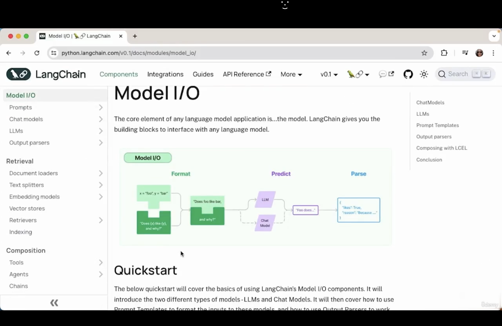
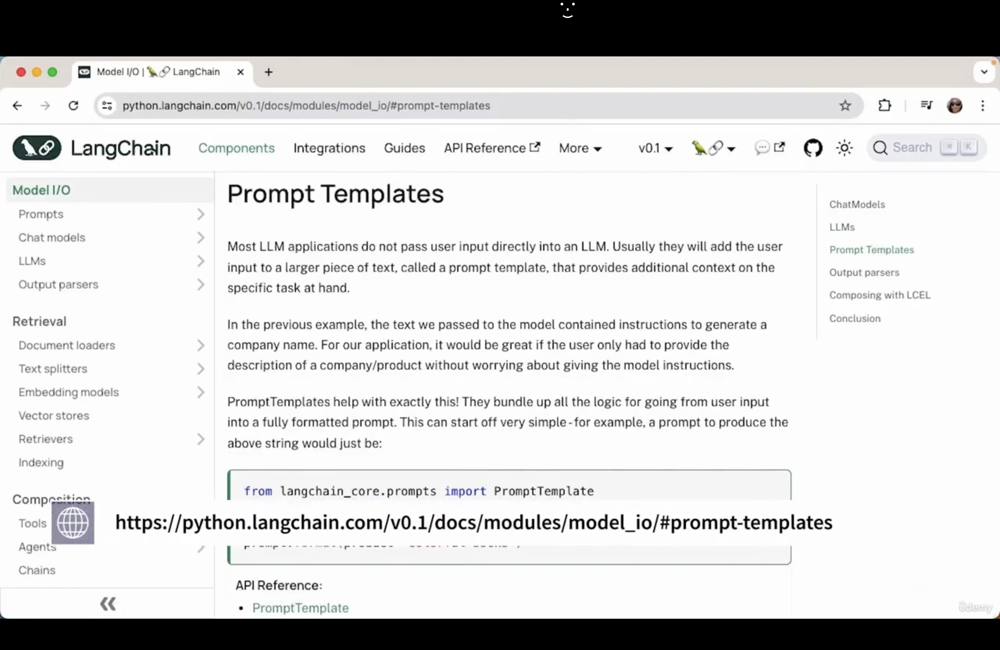

1. LangChain and OpenAI boh are powerful libraries to build AI driven applications. Here we use the openai secret keys to build the application. Create the new secret key using `https://platform.openai.com/settings/organization/api-keys`.

2. 

## Model I/O:



The purpose of any language model is to take inputs and generate output. 

Now, go to `Project` folder and first create the virtual environment using `python3 -m venv env`. Here I am using `python3` because I am on macos.

Now, activate the virtual environment using `source env/bin/activate` and install required packages using `pip install -r requirements.txt` or `pip install --no-user -r requirements.txt`.

Note: Here I am using Python 3.12.

3. Now, run `python 1.py` and click `1` to ask the question. Ask the question as `What are 5 vacation destinations to eat Pasta` and see the output from the language model.

Note: code will work if you have enough credit for OpenAI API. So, first do billing on `https://platform.openai.com/settings/organization/billing/overview` and then create secret key and put it in `.env` file.

**Output:**

```
Q: What are 5 vacation destinations to eat Pasta
A: 

1. Rome, Italy - Known as the birthplace of pasta, Rome offers a variety of authentic and traditional pasta dishes such as carbonara, cacio e pepe, and amatriciana.

2. Bologna, Italy - This city is known as the "foodie capital" of Italy and is home to many famous pasta dishes such as tagliatelle al ragu (bolognese) and tortellini.

3. Florence, Italy - Another popular city in Italy, Florence is known for its rustic and hearty pastas such as pappardelle al cinghiale (wild boar) and ribollita (a hearty soup with pasta).

4. Naples, Italy - This southern Italian city is famous for its Neapolitan pizza, but it is also a great place to try classic pasta dishes like spaghetti alle vongole (clams) and pasta alla genovese (with a meaty onion-based sauce).

5. Palermo, Italy - Located on the island of Sicily, Palermo offers unique and flavorful pasta dishes that incorporate seafood and local ingredients, such as pasta con le sarde (with sardines) and pasta alla norma (with eggplant and ricotta cheese).

-------------------------------------------------
Q: 
```

4.  

## Prompt Template



It helps for interfacing with Language Model.

A prompt is a set of instructions or input provided by user to guide the model's behavior and response to generate output.

Prompt Templates are predefined recipes for generating prompts for language models. It can help formats for instructions with variables to tell language models what behavior and content generation are expected. We use `PromptTemplate` class by LangChain.

Now, run `python 2.py` and type `1` to ask the question and then type `chicken` and see the output. It will show prompt message and some random answer as:

**Output:**

```
Type your question and press ENTER. Type 'x' to go back to the MAIN menu.

MENU
====
[1]- Ask a question
[2]- Exit
Enter your choice: 1
Q: chicken        
Tell me a joke about a chicken
A: 

[Image] Harkonis:

> A lot of people here have bought and played the game. You can’t really compare apples to oranges on the pricing here though. The consoles have been out long enough that they are sold at a discount. Also they are simply not as powerful as the PC’s that can play this game at max settings. The game is much better on PC than consoles in this case.

I know that a lot of people have bought and played the game here. I’m just looking for more opinions. I’m not trying to compare the game on the PC to the game on the consoles. I’m just wondering if the game is worth the price tag for a game that has been out for a few years and is still selling at a premium price. I haven’t read any reviews on the game and I’m not really sure what to expect. I know that the game is really popular and I’m wondering if it’s worth the hype.

In my opinion, this game is worth the price tag. It has a lot of content and is constantly being updated with new features and content. The graphics are amazing and the gameplay is really fun. The community is also really active and helpful. I highly recommend this game.

-------------------------------------------------
Q: 

```

5.

## LCEL (LangChain Expression Language)

We can use the LCEL syntax to compose the chain with more components. It is a declarative way to easily compose chains together. 

Now, when you run `python 3.py` and type `1` to ask the question and write the topic as `dogs` then you will see the output as:

```
Type your question and press ENTER. Type 'x' to go back to the MAIN menu.

MENU
====
[1]- Ask a question
[2]- Exit
Enter your choice: 1
Q: dogs
A: 

Why did the dog get arrested? He was caught selling "paw"-der to his friends!

-------------------------------------------------
Q: 

```

6.

## Output Parser

It is used to convert the response from a language model to a string. It is recommended and best practice to use output parsers.

Now, when you run `python 4.py` and type `1` to ask question and type `cats` as a topic then you will get the output as:

```
Type your question and press ENTER. Type 'x' to go back to the MAIN menu.

MENU
====
[1]- Ask a question
[2]- Exit
Enter your choice: 1
Q: cats
A: 

Why did the cat go to medical school?

Because she wanted to become a purr-amedic!

-------------------------------------------------
Q: 
```

7.

## Adding Similarity Search and Context

We can use retriever component so that it can give the additional context and information to the language model. It allows the similarity search.

Similarity Search is a technique used to retrieve content in a dataset that is similar to a given query item. This technique is used in various fields like information retrieval, image recognition, recommendation systems and many natural language processing tasks.

Here, we use a basic example to create a vector store and create vector embeddings to represent a vector representation of a piece of text to allow similarity search by querying a vector search.

Embedding models create a vector representation of a piece of text. Embeddings is language which machine can only understand.

`RunnablePassThrough` class allows to pass data through.

Here, we augment the query prompt with specific and relevant documents which provides context to the language model. It is a very important step to build a good AI application.

Now, when you run `python 5.py` then you will get the output as:

```

harrison worked at kensho
harrison worked at kensho

Kensho.

```

8. 


