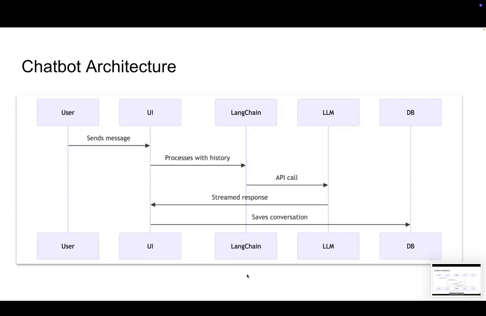

1. Environment Setup for building AI Chatbot:

- Use Python 3.10+
- Run `python3 -m venv .venv` to create a virtual environment on Mac/Linux and `python -m venv .venv` on Windows
- Activate the virtual environment using `source .venv/bin/activate` on Mac/Linux and `.\.venv\Scripts\activate` on Windows
- Run `pip install -r requirements.txt` to install the required packages

2. Chatbot Architecture:



3. Run the script `streamlit run chatbot.py` to start the chatbot. Before this put secrets.toml file in .streamlit folder and content of secrets.toml file is:

```toml
# Required only when you select OpenAI in the sidebar
OPENAI_API_KEY = "sk-..."

# Optional: required only if your Ollama server is running on a different URL
OLLAMA_BASE_URL = "http://localhost:11434"
```

4. LangSmith is a tool used for monitoring and observability of functioning of the chatbot.

For Setup:

- Login in LangSmith using Google credentials on `https://smith.langchain.com/` then select the recommended option and click on `Tracing` and then give the name of the project like `Scalable-ChatBot` and then select `LangChain` option and then generate the API key and put all the credentials in .env file here as:

```
LANGSMITH_TRACING="true"
LANGSMITH_ENDPOINT="https://api.smith.langchain.com"
LANGSMITH_API_KEY= ""
LANGSMITH_PROJECT="Scalable-ChatBot"
```

Also install libraries using `pip install -U langchain langchain_openai`

Now, open the chatbot and ask few questions and check it on langsmith dashboard in `Tracing` tab.

