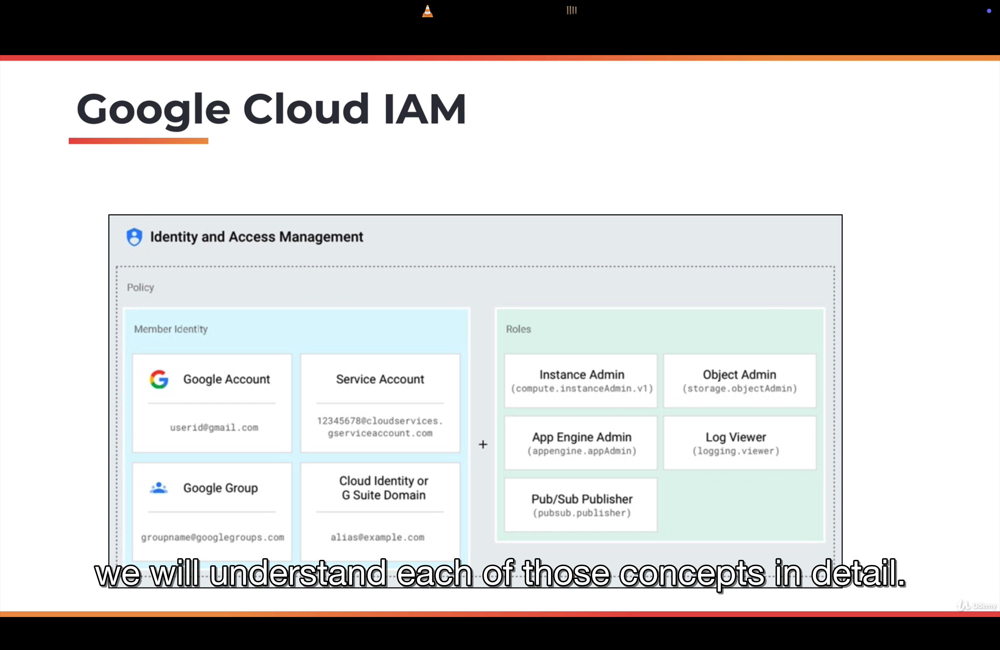

```

```

1. Big Picture of Google Cloud Platform(GCP):

Google is one of the hyper scale infrastructure providers. Its footprints spans multiple continents including Asia, Europe and the Americas.

Google has 20 regions, 61 zones, 134 network edge locations and available in 200+ countries and territories.

A region is a collection of multiple data centers. You can associate a zone with a data center. And, when Google launches a new region then it typically has at least 2 zones.

Zone provides high availability, reliability and redundancy to customers.

When customers launch applications they use more than one zone, making their own application highly available.

Network edge locations deliver static content which will enhance the user experience.

2. Building blocks of Google Cloud Platform(GCP):

Like most of the cloud providers, google has an expensive set of offerings. This building block of stack is is given below:

- Compute: It is most critical building block of cloud infrastructure.
- Storage: It provides durability and persistence to applications.
- Network: It enables communication across multiple applications and services offered by Google.

On top of these core foundational building blocks, we have additional services like databases that includes both NoSQL databases and relational databases followed by a set of data and analytical services that offers business intelligence and data warehouse in the cloud.

Google is known for its expertise in AI and Machine Learning, so, there are quite a few services that deliver machine learning and AI based services.

For enterprises, there are a set of services that make it possible to deploy hybrid and multi cloud capabilities, API management and even migrating workloads from on-premises to the cloud.

We then have security and DevOps that cuts across the stack because these are not specific to a layer, they are important for all the services and all the applications deployed on GCP, so they essentially cover the entire stack.

Finally we have management tools which deliver services through which customers can interact and manage their deployments and cloud infrastructure services.


3. Key GCP Services:

Here we will see the most critical and most building block services of GCP.

A. Compute:

It is one of the foundational aspects of the GCP. There are multiple services when it comes to compute.

- Compute Engine: It delivers infrastructure-as-a-service(IaaS).
- App Engine: It delivers platform-as-a-service(PaaS).
- Kubernetes Engine: Container has service and it is delivered by kubernetes.
- Container Registry: It manages docker container images.
- Cloud Functions: It delivers functions-as-a-service(FaaS).

B. Storage and Database Services:

It delivers persistence and durability. It includes:

- Cloud Storage:
- Cloud Bigtable:
- Cloud Datastore:
- Cloud SQL:
- Cloud Spanner:
- Persistence Disk

C. Network Services:

It provides connectivity and security for all the services and applications deployed on GCP. It includes

- Cloud Virtual Network: It provides hybrid and isolated network capabilities within the public cloud.
- Cloud load balancing routes to traffic across multiple instances of the application. Then there are additional services like Cloud CDN and a set of services that deliver hybrid capabilities like Cloud interconnect and Cloud DNS.

D. Security Services:

Security is critical and there are a set of services that enable customers to use the best practices of deploying secured applications. Services like Cloud IAM, Cloud Security Scanner, Cloud Resource Manager and Cloud Platform Security deliver critical security capabilities to customers.

E. AI and Machine Learning Services:

It provides some of the emerging set of tools and technologies to customers to build intelligent applications. These services include: Cloud Machine Learning, Vision API, Speech API, Natural Language API, Translation API, Jobs API etc.

F. DevOps Services:

DevOps tools provide automation capabilities to customers. Cloud is all about automation. When you want to do something repeatedly and consistently, you rely on devops tools. It includes: Cloud SDK, Deployment Manager, Cloud Source Repositories, Cloud tools for Android Studio, Cloud tools for IntelliJ, Cloud tools for Visual Studio, PowerShell Cloud tools, Plug-in for eclipse, cloud test lab etc.

G. Management Tools:

It provides insights into existing deployments and also extend the automation capabilities provided by basic devops tools. It includes Services like Stackdriver, Monitoring, Logging, Error Reporting, Trace, Debugger, Deployment Manager, Cloud Endpoints, Cloud Console, Cloud Shell, Cloud Mobile App, Billing App, Cloud APIs etc.

4. Apart from the key building block services that we discussed, Google has quite a few services that extend the capabilities. Services like API Analytics, IoT core, VPN, AutoML, Transfer Appliance, Beyond Corp, Deployment Manager, Filestore, Memorystore etc.
5. Getting Started with Google Cloud Platform:

The best thing about GCP is that it comes with a set of services that are always available for you for free. Beyond that GCP also gives you USD 300 credits to get started with the platform. While you can use and utilize all the credits that are available within the $300 credits limit. There are a set of services that are always free.

- First hit the link: https://cloud.google.com/free
- Sign-in on the platform to get free credits

6. In google cloud, anything or everything you launch results in the creation of a resource that includes VMs that you launch in Compute Engine, app instances you provision in the app engine, the topics that you created in pub/sub and storage bucket in the Google Cloud Storage, and so on.

Anything or everything you create is treated as resource. Over a period of time, if you create multiple resources then that need to be better organized. So, there is a hierarchy that you need to understand or how to structure these resources.

First thing is, resources belong to a project. In GCP, Project is the most critical element and entity(because it directly represents a billable unit), so when you create a project, you associate a credit card to it and any resource that you launch within the project will be directly billed as a part of that project. So, a project represents a billable unit. So, every resource that you launch belongs to a project.

A project may be organized into a folder. For example, you may have multiple projects under development and production environments. So, you may have more than one project under dev and more than one project under production. So, when you are dealing with all of them, it makes sense to create a folder and structure those projects that belong to dev and production into appropriate folders. Folders provide logical grouping of projects.

A folder may optionally belong to an organization. So, the organization is the top most entity in the resource hierarchy. You many not be able to see organization if you are not using G Suite. So, Google has mechanism for you to register your domain and create a corporate gmail account, google drive and a set of resources meant for businesses, So, only if you have a G Suite account, your GCP hierarchy will include an organization and also folders. If you are signing up an individual without a GSuite organization or G Suite account then you will have only access to projects and resources.


7. Interacting with GCP:


GCP has 4 different channels: Web Console, Cloud Shell/Cloud SDK, Mobile App and REST API.

Web Console: The moment you sign up with GCP, what you actually have is the web console. it is the front end and it is the gateway to dealing with variety of services.

For administrators and devops engineers, there is a cloud sheel and cloud sdk. Cloud SDK comes with a CLI(Command Line Interface) which can be used to launch a variety of resources and manage those resources.

In fact, everything that you can do with web console, that can also be done from command line. So, cloud sdk can be installed in linux, mac and windows machines. But one of the good thing about GCP is the availability of cloud shell. Cloud shell is a terminal, built right into the browser, so, without ever installing anything, you can quickly interact with GCP by clicking a button which is going to provision cloud shell for you.

Cloud shell comes with pre-configured environment, it has all the tools that you need to launch resources, manage resources and even some of the third party utilities like docker and so on.

Mobile app is useful to quickly access to GCP resources. There are applications available for Google and Apple play store.

REST API is meant for programmatic access.

The most popular and most convenient is the web console followed most powerful cloud shell/cloud sdk which is a command line followed by convenient mobile app followed by programmatic REST API.

8. Accessing GCP shell:

- An interactive shell environment for GCP.
- Now, without installing any CLI or utility, you can quickly get started and you can deal with launching, provisioning, managing and terminating resources.
- It's available from any web browser.
- This environment comes preloaded with an IDE, gcloud (command line utility for google cloud) sdk and other tools.
- This environment is fully backed by a fully fledged GCE virtual machine. So, you can imagine, when you are clicking button which is the cloud shell button, it is going to provision a VM for you that comes with a 5 GB of persistent disk storage and this helps to clone github repos, installing third party utilities, installing additional packages. It's basically a debian environment that's available for you. So, whatever you do with a typical debian or ubuntu flavoured linux environment, you can do that within the GCP cell.
- The best thing about cloud shell is the in-built web review functionality.

9. Demo:

First go to `https://cloud.google.com/free` and then sign-in and click on `console` option in top right corner.

You can click on Compute Engine and then click on VM Instances and explore things.

You can click on active cloud shell option from top right corner and explore it. This is almost being inside a virtual machine.

Now, in the cloud shell, run the command `gcloud compute regions list` and it will list all the available regions for our subscription for our project.

[Use ankitgupta89988@gmail.com for login]

10. Overview of GCP Compute Services:

For any cloud platform, cloud services are the critical component because this is where code is deployed and executed in one of the compute services.

GCP offers a wide range of compute choices:

- App Engine
- Compute Engine
- Kubernetes Engine
- Cloud Functions

App Engine is a platform-as-a-service(PaaS). So, in a platform-as-a-service(PaaS), developers typically bring their code and walk away with a URL that is running their application.

Compute Engine will give you a choice of virtual machines with a different set of configurations, where you take control by logging into the VM, installing the software of your choice and treating it like a machine that you have control over.

Kubernetes Engine is all about an orchestration platform. Virtual machines are now slowly getting replaced by containers. Kubernetes engines manages tens of thousands of containers that are deployed in the cloud.

Cloud functions represents function-as-a-service(FaaS). This is a serverless environment to execute code where you don't need to launch a VM or package your code as a container.

11. Google App Engine:

- It is one of the very first compute services from Google. (PaaS)
- Fully managed platform for deploying web apps at scale. It means developers don't have to deal with provisioning, configuring, scaling, managing and securing the platform or infrastructure. They just have to bring their code, deploy it and watch it scale. And that piece of code typically runs in the same context of Google's infrastructure. Now, when the traffic comes in and the number of requests increase, app engine will automatically scale the application. Similarly it applies the best practices to ensure the application is reliable, scalable and secure.
- It supports multiple languages (like from Java to Python to PHP), frameworks and libraries.
- App engine is available in 2 environments: Standard and Flexible. Application deployed in standard environment runs in sandbox.
- Flexible environment uses docker containers to deploy and scale apps.

12. Google Compute Engine:

- It enables Linux and Windows VMs to run on Google's global infrastructure (that runs Youtube, Google Search and rest of the services)
- VMs are based on machine types with varied CPU and RAM configurations. Just like when you invest in a server, depending on the configuration of number of CPU cores, memory and storage, you can choose a virtual machine that comes with different number of CPU cores, of course, they are virtual CPUs and RAM that is going to be different from each configuration. Virtual machines are typically ephemeral, it means if you start a VM and have a local disk attached to it, you install some software, you configure that and terminate it, you loose all the changes. If you want it to persist then you need to attach additional storage to the virtual machine and this is possible through a standard hard disk or an SSD (solid state drive that delivers better throughput).
- VMs are charged a minimum of 1 minute and they are billed at a one second increment after that.
- Google also offers a unique building mechanism called sustained use discounts. If you run a VM for the entire month, you automatically become eligible for the discount. This is what it is called sustained use discounts.

There is something called commited use discounts where if you are signing up for a long term contracts, you get a better deal. Your VMs are going to be much more cheaper if you commit to Google that you are going to run it for a period of one year or three years.

13. Google Kubernetes Engine(GKE):

It is a managed environment for deploying containerized applications managed by kubernetes. 

Kubernetes is the industry's most popular, most powerful container orchestration engine. It's an open source project that got originated at Google but now it's part of larger foundation called the Cloud-Native computing foundation. Google, as the original founders of Kubernetes, offers a very powerful, dynamic container managed environment called Google Kubernetes Engine (GKE).  

You can bring in your container images, package them as the kubernetes artifacts, deploy them and scale them through GKE. 

Kubernetes has a control plane and a worker node or multiple worker nodes. It's a typical distributed computing environment where you have a control plane and multiple worker nodes.

GKE provisions worker nodes as GKE VMs. So, when you launch a cluster in GKE, there are 2 elements, one is the control plane and the other is data plane which is typically delivered through the set of worker nodes.

Google takes care of control plane or the master nodes that are responsible for managing the entire cluster. Since google manages the control plane or worker nodes, it is called the managed environment.

A node pool is a collection of homogeneous VMs that deliver either high memory or high storage throughput or high CPU environment. You can create different node pools and plae GCE VMs in each of those node pools that offer unique capability, depending on your configuration. This choice makes it possible for you to segregate cluster environment into different capabilities and different nodes, depending on the configuration such as high memory, high CPU and high storage throughput environments. The service is tightly integrated with GCP resources such as networking, storage, and monitoring. 

GKE infrastructure is monitored by stack driver which is the built-in monitoring and tracing platform within google cloud. 

GKE delivers auto scaling, automatic upgrades and auto repairs of nodes.

14. Google Cloud Functions:

It is one of the recent additions to GCP.

- It is a serverless execution environment for building and connecting cloud services.
- Serverless computing environment is a mechanism where you don't have to provision and configure resources beforehand. This is fundamentally different way where you deal with App engine, compute engine and kubernetes engine. For those, you got to provision resources beforehand. You need to create app engine instances, you need to launch VMs, you need to create cluster or even before you can run your first line of code but that's very different when it comes to cloud functions. 
  
- In Cloud functions, you write code as a function which has a well-defined entry point and exit point and you deploy that with no changes. That's why it is called as serverless compute environment where you don't have to provision a virtual machine or container to run the code. Typically, serverless compute environments respond to events. So, instead of running this code forever, they get executed only when there is an external event. For example, adding a new object to a storage bucket or dropping a new message to the pub subqueue or invoking a http endpoint that will result in executing the serverless code, so any of those can be considered as external events responsible for triggering the code. 

You can write cloud functions in javascript, python3 and go. You don't have to package them in a specific format. At the most it's a zip file that gets into gcp environment and starts executing against events.          

GCP events fire a cloud function through a trigger. So, trigger is what connects the external resource to a cloud function. An example event could be adding a new object to a storage bucket. A classic use case or scenario is converting high resolution images uploaded to google cloud storage to thumbnails, so every time a new high resolution image is added to a storage bucket, a cloud function is triggered and the function converts the image to a thumbnail using image manipulation libraries and put in a different storage bucket. And this happens everytime a new high risk image is added to the storage bucket. This is one of the most efficient and economical way of running code in cloud.

Triggers connect events to the function. There is trigger, event and a function. So, you define an event and you connect it to a function and every time trigger takes place, it invokes the function via event. That's why it is called function-as-a-service(FaaS). 

15. Demo:

- Go to GCP Home page
- then go to compute engine and click on VM instances
- click on create instance button
- give the instance name like `instance-1`
- select machine type as `f1-micro` to be in free tier range
- select os image as ubuntu 20.04 LTS 
- In Firewall option, select `allow http traffic` option as it is very important to access web pages

After few seconds, instance will be up and running. Now, come back to cloud shell and type `gcloud compute instances list` then type `gcloud compute ssh instance-1 --zone asia-south1-a`. Then type `sudo apt-get update` to update packages. Then type `sudo apt-get install -y apache2` for configuring our machine for the web server.

Now, start the apache service by typing `sudo systemctl start apache2` and then type `sudo systemctl status apache2` to check if apache is running or not.

16. Overview of GCP Storage Services:

Storage services add persistence and durability to applications. When you are dealing with data, you got to store data in one of the 2 places:

- Traditional Databases: It forms the data services.
- We got to store it in storage services that provide persistence for both unstructured and structured data.

At high level, storage services are classified into 3 types:

- Object Storage
- Block Storage
- File System

GCP Storage services can be used to store:

- Unstructured data like images, pdfs, documents, HTML files and so on.
- Folders and files that e typically migrate from local on-prem data center environment to cloud

17. Google Cloud Storage:

- It's an unified object storage service for a variety of applications.
- Applications need to store and retrieve objects while dealing with the cloud and this typically happens through an API. That API is exposed by GCS or Google Cloud Storage.
- GCS can scale from one byte to exabytes of data. There is almost ability to store infinite amount of data.
- GCS is designed for 99.999999% durability which means the chance of losing data is almost nil.
- GCS can be used to store high frequency as well as low frequency access to data. 

GCS provides you an API driven object storage service that can be used by cloud applications. So, when you are storing data, you write and retrieve the data using APIs. This is the fundamental difference between dealing with file system and object storage.

- Data can be stored in single region, dual region or multi-region depending on your policy, compliance and regulatory information. 

18. Google Cloud Storage - Storage Classes:

There is `Standard` Storage Class (name of the class) which is the most common storage class used by developers. It is optimized for low latency and frequent access. So, if you are storing images that you are going to retrieve very often then you would want to choose this storage class which is called the `High Frequency Access`. And this is the most common storage class preferred by developers because it's very easy to use and comes with the standard ability of accessing the data very often.

But you may have data that you don't access very often. In that case, you can choose `low frequency access`  storage class called `Nearline`. It is meant for data access less frequently, typically chosen for data that is accessed less than once a month. 

You may also have certain type of data that has the lowest frequency access maybe once in a year and you maintain that kind of data primarily for archival purpose and you don't retrieve often.

19. Persistent Disks:

Object Storage provides API-driven access. Persistent disks give us reliable block storage for GCE VMs. Many times, you may want to have storage attached to compute, pretty much like direct-attached storage of your on-premise data center or the way you use the USB storage.

Persistent disks are essentially the block storage devices that can be attached to one of the Google Compute Engine instances or VMs. 

Disks are independent of compute engine VMs which means the life cycle of persistent disks is completely independent of compute engine VMs. You can create them outside of the context of a VM and retain it even after VM is terminated. That's what persistent disks are really durable and reliable. 

They also provide massive storage options to VMs. For example, each disk that you attached to VM can go up to 64TB in size. 

Persistent disks can have one writer and multiple readers. So, we can make one VM as writer and multiple VMs can be readers in distributed applications with centralized data access. 

Persistent disks can support both HDD and SDD. SDD offers the best throughput for I/O intensive applications like relational databases, NoSQL databases and so on.

Persistent Disks are available in 3 storage types: Zonal, Regional and Local.

20. Cloud Filestore:

So apart from object storage and block storage, GCP also has cloud file store which will mimic your local file system or the distributed file system you may be running in your data center. So it's a managed file storage service for traditional and legacy applications that need NAS-like file system access. So when you are moving an application from on-premises to the cloud, applications expect similar exposure to storage and block storage or object storage may not be sufficient because the traditional legacy applications might be dependent on NAS like file system. So when you're moving those applications to gcp Google Cloud file Store will help you emulate exactly the same environment like nas, but in the cloud. 

It's a centralized highly available file system for GOOGLE compute engine and Google Kubernetes engine. So file store exposes an NFS file share with fixed export settings and default Unix permissions. This compatibility makes applications think that they're actually running on-prem while they're still deployed in the cloud. 

File store File shares are available as mount points in GC VMs. So applications continue to work the same way they have been on the data center or the on-prem environment. So on-prem applications using NAS can take advantage of this service, call the Filestore. 

Like most of the other services Filestore has built-in zonal storage redundancy for high availability which means when you are writing data it is immediately replicated across multiple endpoints so that you have storage redundancy. And this ensures higher availability of data and file store also encrypts data while it is in transit. That means when you are writing data and data is in transit or in or addressed, it is always encrypted. And this ensures higher security for the data that is being used within the context of file store. 

So to quickly summarize Google Cloud file store emulates NAS-like environment in cloud enabling legacy applications to continue to run while moving from on-prem to the cloud. 

21. Demo - Storing Data in GCP:

All right, let's take a look at the demo that deals with storing data in GCP. All right, we are now looking at the dashboard page of GCP console. So we can launch the storage dashboard by typing storage and selecting this option. So, buckets are going to be the containers within which we are going to create folders and store objects. So we start by creating the bucket and this is the highest level container within the GCS hierarchy. So a bucket may contain a folder and a folder may contain a file.

So let's start creating the bucket. So we need to give a unique name, so I'm going to give my name followed by demo. So that's the name which is globally unique and I hope this is truly unique. So, let's click on continue to move to the next level. So, once we created the, or once we named the bucket then we need to choose where to store the data. And as we discussed in the section there is region where you have lowest latency but this is single region. You can choose multi-region that gives you highest availability across largest area.

So multi-region gives you options like US, multiple regions within US, multiple regions within Europe and Asia. It delivers highest availability across the largest area. But if you are very specific, you can actually choose dual-region with high availability and low latency across two regions. And here we have Americas where it is stored within two locations within US and then within Europe it is stored within Netherlands and Finland. So, your location type obviously impacts the cost. So if you look at the, I'm sorry, not exactly the cost but the available SLA.

So the region has 99.9% of availability while multi-region has slightly better and dual-region has exactly the same availability. But what really impacts the cost is going to be the storage class. So, let's choose region and click on continue. So here we have the storage classes, standard best for frequently access data, the data that is being written and read very often, nearline, which is best for backups and data accessed once in a month or or less. And as soon as we switch from standard to nearline, you notice that the cost involved in storage and retrieval is also changing.

Coldline is best for disaster recovery and data accessed once a year or less. So this is completely meant for archival and cold storage. So let's choose standard which is typically the option that the developers choose when they're storing regular objects within GCS. The next option is to apply permissions. You can choose object level or bucket level permissions and bucket level permissions, which means we are going to apply a policy that is going to be replicated or applied to all the objects within the bucket.

And then you can also get to choose how each object within the bucket is going to be accessed. So, we'll choose the default option here, set object level and bucket level permissions and advanced settings, we don't need to modify this. This is really how you enable encryption either through Google managed key or customer managed key. You can also define a retention policy that tells how long the object is going to be stored and when it's going to be deleted. For metadata you can add additional labels to the bucket.

Now, we are not going to change anything here. Let's go ahead and click on create. So this is going to take just a few seconds and our first bucket is going to be created. And there we go. So now the bucket is created. Let's create a folder within that. And I'm going to store images, so I'll call this folder as images. And once we create the folder, we can now upload files. So from my local file system I'm going to upload an image called flower.jpeg and this is going to be uploaded to my Google Cloud storage.

The bucket is configured for the standard storage class, and it is regional. That means if I have my application running in the same region, it gets the best possible performance and lowest possible latency. So, that was a quick walkthrough of how to create a bucket and what are the various choices you have in terms of the storage class, in terms of location. And remember all of them will impact the cost involved in storing the data. So that was a quick demo of dealing with Cloud storage within GCP.

22. GCP Network Services:

GCP network services. They're one of the key building blocks of GCP, and Google Cloud leverages Google's global network for connectivity. As we know, Google has a very expansive network to run some of their core services like Search, YouTube, Gmail, G Suite and so on. The advantage of using Google Cloud is that the customers will get to use the same global network that rest of the Google services rely on. And this gives unmatched network performance to applications running on GCP. To enable choice between choosing the premium backbone and the normal backbone, GCP offers standard and premium tiers.

So these tiers of network services will offer a trade-off between performance and cost. So if your application demands higher throughput and low latency, you can go for a premium tier that uses the same network as rest of the Google services, or you could use a standard tier that leverages selection of ISP-based internet backbone for connectivity. So once you have chosen the standard or premium tier, then you can start using some of the services, network services offered by GCP. Load balancers are very popular because they route the traffic evenly to multiple applications or multiple instances of the applications.

Virtual Private Cloud or VPC provides private and hybrid networking to applications and cloud-based deployments. Customers can extend their data center to GCP through hybrid connectivity. So let's understand each of those services in detail.

23. GCP Network Service Tiers:

Let's start this section by understanding more of Network Service Tiers. So, GCP offers two service tiers. There is a Premium Tier and there's a Standard Tier. Premium Tier delivers traffic via Google's premium backbone that powers rest of Google's services, like Google Search, G-Mail, G-Suite, YouTube, and so on. Standard Tier uses regular connectivity based on ISP networks. And because this is based on third-party connectivity and doesn't use the high throughput, high performance network backbone, Standard Tier is obviously cheaper.

GCP recommends using the Premium Tier as the default option. So, that is if you don't change any settings by launching a load balancer or creating any of the network services, by default Google uses Premium but you are free to switch from Premium to Standard Network Tier.

24. Load Balancers:

Within the network services, load balancers are the most popular services that are used by developers and DevOps teams. So load balancer distributes traffic across multiple GCE VMs in a single or multiple regions. Now this statement is pretty loaded. Let me demystify that for you. So a load balancer, when put in front of GCE VMs can route the traffic across multiple instances, assuming all of them run a homogeneous application, and manage the state in an external service like Google Cloud SQL or Google Cloud storage.

So when the traffic gets routed to one of the stateless services, the requests are evenly distributed across multiple endpoints or multiple instances of the applications. Now, the advantage of using Google Cloud load balancing is that you can actually route the traffic, not just to the instances running in the same zone or same region, but even across multiple regions. So you can deploy an application across the globe and front end that with a Google Cloud load balancer. So there are two types of load balancer.

One is the HTTP or HTTPS load balancer and then there is a network load balancer. So HTTPS load balancer provides global load balancing. And as you can understand, this is typically meant for routing traffic to web apps that are deployed in more than one zone or more than one region. Network load balancer is routing the traffic across multiple TCP and UDP endpoints but within the same region. So the bottom line here is HTTP load balancer is global. That means it can route the traffic to pretty much any instance deployed anywhere in the in the world, whereas network load balancer is confined to a region where it is deployed.

Apart from being global and local load balancers, these load balancers can be used as an internal or external load balancer. Now when do you use internal versus external? Well, let's take a look at an architectural diagram. So in this schematic that you see here, we have a mobile app or a web app that is actually using an external load balancer. So you have multiple users in US and Asia. So they are first hitting the external load balancer and from there, the traffic gets routed to one of the regions, there is us-central-1b and asia-east-1a.

So depending on where the user is coming from, the role of the HTTP load balancer is to route the traffic to an appropriate location. Now, once the traffic hits the web tier in one of the locations, then it needs to talk to the database via a set of app servers. And because there are multiple app servers, there is more than one app server that also needs to be front ended with a load balancer. So the web tier talks to the app tier, which is an internal tier, via a load balancer and that load balancer is called as an internal load balancer.

So you can use a combination of both external and internal to achieve maximum scalability and better performance. So this architectural diagram will help you visualize how and when internal and external load balancers are being used.


25. VPC(Virtual Private Cloud):

Applications deployed in the cloud demand higher level of security and isolation. And that's where we have Virtual Private Cloud. As the name suggests, it's a software defined network to enable private networking and private cloud within the public cloud. So when we deploy an application, it is possible for us to create a quadrant of space within the public cloud designated as a Virtual Private Cloud and deploy the applications and application resources within that quadrant of zone. And that quadrant of zone within the public cloud, that area is actually called as the Virtual Private Cloud.

So it's a software defined network that provides private networking for VMs. And this essentially isolates the VMs running inside the VPC with rest of the world. VPC network is a global resource with regional subnets. If you're familiar with networking concepts, you must know that it is possible to create multiple subnets as a part of VPC. So a VPC network is a global resource which means you create a VPC that is visible from any of the regions that that you have within GCP and beyond that you can create a subnet per region which is going to be attached to the same VPC.

And this gives a lot of flexibility, power and of course ease of use because you're not dealing with isolated, fragmented set of virtual private clouds but you have a concept of a global VPC but every region is treated as a subnet. Each VPC is logically isolated from each other. And this is one of the core requirements of Virtual Private Cloud or Hybrid Cloud. So, one VPC cannot see the resources deployed in another VPC because each VPC is completely running in its own isolated environment. And that is a sandbox that is within the GCP environment.

So even if you are creating multiple VPCs you need to explicitly allow communication between these VPCs by creating firewall rules. So firewall rules either allow or restrict traffic within subnets. So it is quite common for customers to create a public subnet and multiple private subnets and keep sensitive resources within the private subnets and private subnets are never exposed to the outside world. Only those resources deployed in the public subnet become visible to the outside world and they act as the channel to talk to the resources deployed within the private subnet.

And you use firewall rules to selectively route the traffic from the public subnet to one or more private subnets and that's how you create isolation. At the same time, high security by creating individual subnets that act as sandboxes to basically segregate resources into either private or public. Resources within a VPC communicate with standard IPV4 IP address and there is a DNS service within VPC that provides name resolution. VPC networks can be connected to other VPC networks through a concept called VPC peering.

So if you are running multiple VPCs and you may want to share resources among them you can create what is called as a VPC peer which will bring one or more VPCs together and it becomes a logical extension of the VPCs. So they, the resources deployed in each of these VPCs get to talk to each other. And VPC networks are the essential building blocks for configuring hybrid network. And this is possible when you use services like cloud VPN or Cloud Interconnect. So VPC is the basic requirement for enabling hybrid cloud connectivity between your On Prem Data center and GCP Public Cloud.

So by using the VPC networks through Cloud VPN or Cloud Interconnect you achieve a private communication between your data center and the resources running in the Public Cloud that is the GCP environment. 

26.  Hybrid Connectivity:

Google Cloud offers multiple mechanisms to extend your on-prem data center to the public cloud. And that's what is called as the hybrid connectivity. So it seamlessly and securely extends local data center to GCP infrastructure. There are three GCP services that enable hybrid connectivity. The first one is Cloud Interconnect, the second is Cloud VPN and finally, there is Peering. So Cloud Interconnect extends on-prem networks to GCP via Dedicated or Partner Interconnect. So when you are considering connecting your local data center to the cloud, you can choose between Google's own network, that is spread across the globe, or you could use one of the partners that Google designates for enabling the interconnectivity.

But irrespective of how you get connected, the objective is to extend the data center to the cloud. For example, you may be running a database on-prem which is too heavy to migrate to the cloud. For example, a decade-old SAP instance or an Oracle database that is very difficult to migrate to the cloud. So you might want to retain it within the on-prem environment, but you want to run some of the modern applications that talk to the SAP or Oracle database in the cloud. So in that case, you continue to run your database on-prem but use hybrid connectivity via Cloud Interconnect to extend your database to the public cloud where modern, elastic applications are running inside app engine or compute engine or Kubernetes engine.

So how you extend is based on either Dedicated or Partner Interconnect. But if you don't want to spend a lot on hybrid connectivity and you want to achieve basic secure connectivity, then you could choose Cloud VPN which connects on-prem environment to GCP over public internet. So this is very affordable, very economical mechanism to extend your data center because you're not using a dedicated network provided by Google or their partners. Instead, you choose public internet over VPN. So, this is the basic VPN connectivity that securely extends your on-prem data center to the cloud using public internet and a VPN appliance.

So this is the second option. Then there is Peering, which gives direct access to Google Cloud resources with reduced internet egress fee. Google has partnered with a lot of ISPs and data center providers, and by tapping into one of those partner networks, you can enable direct access. So when compared to Interconnect, Peering gives you much lower egress fee. Egress fee is the bandwidth that you are charged for outbound connectivity. So when you are making requests to the cloud from your data center via Peering, there is an egress fee but this is much lower when compared to Cloud Interconnect.

So you can choose from one of these depending on your use cases and scenarios.

27. Demo - Configuring HTTP Load Balancer:

All right, it's demo time and I am pretty excited to walk you through a comprehensive demo of using load balancing in GCP. All right, we are back at the GCP dashboard. Let's get onto the compute engine, instance templates. So the demo that we are going to configure is a couple of VMs deployed in a region connected to a load balancer where the traffic is routed evenly across the instances. So when we are launching the VMs instead of creating them independently and configuring them with exactly the same settings and same software, we can create what is called as an instance template.

So an instance template acts like a blueprint and this blueprint can be used to launch multiple GCE VMs at one go. So let's first create an instance template. Most of the settings that you see here are going to be similar to configuring an individual VM, but the only difference is this is going to be the blueprint or the quicker template to launch multiple VMs at one shot. So let's call this as web-template. And then we are going to choose f1-micro to make sure that we are within the limits of free tier.

And then we leave the OS image as this default one which is Debian. And enable HTTP traffic because we are actually going to run a web server. This is very important. and I want to introduce a technique where I'm going to launch the web server right at the boot. That is by passing what is called as the startup script. So I'm going to show you the script. This is exactly the same that we ran in one of the GCE demos. The only difference is we are now running this at the boot time so that Apache is installed as soon as the VM is up and running.

So we actually install Apache and then create a default index.html page that shows us, Hello from the host name. And because the host name is very unique it is going to display the host responsible for serving that page. So let's copy the script and paste it in the startup script text box. That's it. Now we are going to go ahead and create the template. And this template, as I mentioned, is responsible as for for creating multiple VMs of identical configuration. Each of them would be based on the same instance type and it is launched in, launched with the web server up and running.

So now the web template is created. We can launch an instance group from this template. So let's go to instance groups and create an instance group. And this group is going to be based on the, so let's call this as web-server. And it is going to be run across multiple zones. I'm going to choose asia-south1, which is the closest region for me. And here if you notice there is web-template, which is the template that we created in the previous step. And every configuration that we have used for this template will be automatically used by this group.

We don't need autoscaling. So we're going to set that to off, and we launch two instances. And we also enable redistribution of auto automatic deployment of instances across zones. So that means the instances that we are launching as a part of this group will be evenly spread across multiple availability zones. It's also a good idea to create a health check. So let's create a health check. Let's call this web-hc. And the protocol would be HTTP. Port is 80. The request path is root, and the check interval is 10 seconds.

Now what this means is every time the load balancer tries to send the traffic, it checks the health status and if the health check reports that there is a problem with the, with one of the web servers, the traffic will not be routed there. So this will ensure that the traffic is always routed to one of the healthy instances and avoids sending the traffic to a faulty instance which may result in errors. So we will configure this and add it to the instance group. So now if we have all the available configuration settings.

One thing that I I want to do is to reduce the initial delay for the first health check. 300 seconds is a lot, so we'll turn this to 60. So this will make sure that you know within the first one minute the health check is attempted and hopefully by then the web server is up and running so it sends a green signal for the load balancer to route the traffic. That's it. Let's go ahead and launch this. This is going to take a few minutes so let's come back when the instance group is ready. All right, so now the web server is up and running.

So we see that there are two instances. We can verify this by going to the VM instances section and we notice there are two web servers with unique identifiers added to them. This is an arbitrary string generated by GCE and appended to our instances. We didn't launch them directly. They are a part of the instance group based on the template that we configured in the previous step. These instances have default external IPs, the public IPs, and clicking on these will show us, Hello from the host name, which is the unique name assigned to each of the VMs.

So, now we notice that the output from each of these web servers is different and unique. So, when we configure the load balancer and start hitting the load balancer from a from a browser, we are going to see the traffic getting evenly sent to one of these web servers. So we'll see the, the output varying from, coming from the load balancer depending on which VM is responsible for serving that request. So now we have the GCE infrastructure in place. We have two instances running with two external IPs.

So let's go to the network section and create a load balancer. So we are currently at the networking services tab and let me launch load balancing. So we click on create load balancer. And choose HTTPS load balancing because we are talking to a web application backend. So we click on start configuration and here you choose whether you want to create an internal load balancer or external load balancer. Obviously the traffic is coming from internet to my VM so this is going to be an external load balancer.

We choose this and click on continue. And let's call this web-lb. So that's the name of the load balancer, and then we go through a different set of configurations to configure the HTTP load balancer. The first one is the backend configuration. So the backend configuration will ensure that we have a set of resources responsible for serving the traffic. So we create the backend service by selecting create a backend service and let's call this web-lb-be. So we can choose network endpoint groups. If you're running individual VMs, this is a good choice, but since we already have an instance group we choose the backend type as the instance group and choose the web server instance group we have launched in the previous step.

Port is 80. That is the default port on which Apache is listening. Balancing mode, this is very important. Whether you want to route the traffic based on CP utilization or the request per second. Now since we're not going to send a lot of traffic we choose rate and this will give us a good visual indication when the traffic is switched between one of the available instances. The maximum RPS that we are going to use per instance is say 100. Now this actually varies depending on your load conditions and your application configuration, but I'm giving an arbitrary number of 100.

So once we have this, we can create the backend. And then we associate this backend with the health check we created earlier. And this health check will be a checkpoint for the load balancer to decide whether to route the traffic to the instance or not. If the health check fails for one of the instances load balancer will gracefully send a request to the other instance and this will enhance the user experience where they only see only see the output coming from healthy instances. And this will definitely result in better user experience.

So we are now done with the backend configuration. Host and path rules, since we don't have multiple endpoints we leave that as the default. Front end configuration. The front end is basically how the consumer or the client of your application sees the endpoint. So we need to configure this. Let's start by giving it a name, web-lb-fe, front end. Protocol is HTTP. Premium, this is the network service there that we have discussed earlier. IPv4, it's an ephemeral IP address. We haven't attached static IP address, so this is fine.

Just leave the options as they are with the default settings and click on this and finally review all the settings. This is called the web-lb-be and responsible for sending the traffic to the web server instance group we created. The host and path rules, the front end, which is using an ephemeral IP address. Network tier is premium. So let's go ahead and create this. Now, this is going to take a couple of more minutes for the web server to be completely configured and the health check to pass. In about five minutes, the load balancer will be completely functioning, which means it will be able to route the traffic to one of the instances in the backend group, which is based on the instance template that we created.

So let's wait for a couple of minutes and come back and check the load balancer in action. So looks like the load balancer is fully configured and all the health checks have passed. So let's click on the load balancer link. And then we see that it's been assigned a public IP address and available on port 80. You can also see that the healthy status shows 2/2, which means both the web servers are now available and they are healthy. They have passed the health check. Now we can verify the functionality of this load balancer by copying this IP address and accessing it from the browser.

So one of the web servers is responding and you can notice that the host name is unique. Now as we start refreshing, we'll actually see that the traffic is evenly routed among these instances. So every time we refresh we may end up hitting a different web server. And this is indicated by the host name. So this is a fully fledged load balancer in action that is able to route the traffic across multiple instances. In this case, we have two instances deployed in two different availability zones, but the load balancer is able to evenly route the traffic to one of the instances.

So that is how you basically configure the load balancer pointing to a set of GCE VMs. To summarize what we have done so far, we first launched an instance template, configured the VM configuration, then from that instance we created a group and this group had two GCE VMs launched in two different availability zones. We also created a health check to make sure that the health is always checked periodically and reporting it back to the load balancer. So that was the configuration part done within the GCE environment.

Then we switch to network services and configured the load balancing. Within the load balancing, we have the backend, which is pointing to the instance group associated with the health check. Then we created the front end, which is nothing but the ephemeral IP address and the port that is exposing the load balancer. And we connected the front end to the back end after which the health check has been performed. And once everything is green we got the public IP address and when we access that, the traffic is evenly routed to one of the instances.

So that was the end to end configuration of load balancer talking to GCE VMs.

28. Overview of IAM(Identity and Access Management):

So after compute, storage, and network, Cloud IAM becomes one of the critical building block of GCP. 

So IAM or Identity and Access Management essentially controls access by defining "who" has "what" access to "which" resource? 

So the "who" defines the members, "what" defines the roles, and "which" defines the permissions. So IAM is all about connecting the dots across these entities, essentially enabling or disabling a resource from being accessed by a member who has an identity. 

So Cloud IAM is based on the principle of least privilege, which means, by default, all the resources are denied access and you are expected to open up access explicitly.

An IAM policy binds "identity" to "roles" which contain permissions. Now, this is the fundamental premise on which IAM is built. What it essentially means, is that there are a set of permissions, and these permissions are grouped together into a role, and that role is assigned to a member, and the member will automatically inherit all the permissions that are associated with the role. So the graphic here will establish this concept. So we have roles, and these roles are nothing but a collection of permissions, and these roles are applied to the members, the member identity, and the policy is what is binding the member identity and their role together.

So this is the premise on which IAM is built. You have permissions, you have roles, and you have member identity who are like users. 



29. Cloud IAM Identity

So in Cloud IAM, identity is typically associated with users or members. So users or members access the resources with a username and password and they're typically representing a human or a user who has either access or restricted access to the resources. 

A Google account is a Cloud IAM user so anyone with a Gmail account or a Google account will become visible as a cloud IAM user. 

A service account is a special type of user. It is not associated with a user or a member directly but it is meant for applications to talk to GCP resources.

A Google group is also a valid user or a member in Cloud IAM because it represents a logical entity that's a collection of users. So when you assign a role to a Google group all the users of that group all the members of that group will automatically inherit the permissions assigned to the role. So Google Group is a valid, legitimate user or a member of Cloud IAM. 

A G Suite domain, like your organization.com is also a valued user or a member. So you can assign fine grained permissions through a role to an entire G Suite domain.

Apart from G Suite, Google also has a concept of cloud identity domain. So if you're not a customer of G Suite and you want to create an organization you can use cloud identity service and a domain created within that can also be a Cloud IAM user. 

Then there are some implicit aliases or labels for "allauthenticated users". So if you want to provide a blanket access to all the resources for any authenticated user you can use this alias that says All authenticated users and any resource that has permission will automatically become available to any user who is authenticated by Google's authentication system.

If you want to go further and expose it to even anonymous users you can use the alias or the label, "allusers". Now this collection makes it very comprehensive in choosing who needs to be given access to the cloud resources.

30. Cloud IAM Permissions:

So, in the previous lecture we have looked at users and members. Now, let's understand what are permissions. Permissions determine the operations performed on a resource. Whether you can launch an instance or not, whether you can terminate an instance or not, whether you can create a storage bucket, can you upload an object into the storage bucket, all of those are the permissions associated with each of the GCP resource. And if you carefully analyze, they correspond to the REST API exposed by individual GCP resources.

Google Cloud Platform is based on a collection of APIs. So, every GCP resource has multiple APIs associated with it. Permissions simply map the actions to the REST APIs exposed by one of these GCP resources. So if you look at the APIs, for example, when you want to publish a topic. When you want to publish a message to the topic, you need to have a permission that says pubsub.topics.publish, so it is the API and the permission is directly associated with Publisher.Publish. So, this basically is a chain which ultimately translates to a REST API, and IAM permissions directly map to these APIs.

So permissions cannot be assigned directly to members, but they are always assigned to a role. So it's very important to understand that you cannot attach permissions directly to a member. So you cannot add permissions to an identity like a member or a user. Instead, you group multiple permissions into a role and you assign that role to individual users. And it's also important to understand that permissions are mapping to REST APIs exposed by GCP resources.
    

31. Cloud IAM Roles:

All right. Having looked at users and permissions, let's understand roles in detail. So roles can be of three types. And first of all, roles are nothing but a collection of permissions. It's a logical grouping of various permissions. So there could be three types of IAM roles. The first one is called as a primitive role. And a primitive role has three well-defined role definitions. An owner, who has 100% access to the resource type. Editor, who can modify and add additional permissions. Viewer will gain only read-only access to the resource.

So owner, editor, and viewer are the primitive roles offered by GCP. Then there are predefined roles that are very specific to the GCP resource. For example, pubsub.publisher, compute.admin, storage.objectAdmin, and so on. Now these are predefined roles that associate a set of operations typically related to a GCP service. For example, compute.admin is a role that has all the relevant permissions to manage Compute Engine instances. Similarly, storage.objectAdmin is a role that has all the relevant permissions to manage buckets and objects of Google Cloud storage.

An objectAdmin is specifically meant for managing the life cycle of an object. So every resource and every service in GCP has a set of predefined roles. So it is easy for you to quickly assign the role to a user, depending on his job function or his expected usage of GCP resources. Then there are custom roles, and obviously, custom roles are a collection of assorted set of permissions. So if you are not happy with the predefined roles and you want to mix and match a set of roles. For example, you may have a role that needs to handle both compute resources as well as storage resources.

And there is no predefined role that gives you a combination of compute plus storage. So in that case, you can create a custom role called compute storage admin and add all the permissions that are required for managing both compute and storage. And that becomes a custom role. So it provides very fine-grained access to resources, again, depending on the hierarchy of the user and the resources that he needs to have access to perform his function, his job function. So the combination of these roles will give you a lot of choice and flexibility in defining appropriate set of permissions to GCP users and GCP admins.

32. Key Elements of Cloud IAM:

Okay, I covered quite a bit of ground so far in this section, so let me make sure I bring all the concepts together for you to understand before we get into the demo and rest of the lectures in this section. So what we have discussed so far is that there is a resource which is the fine grained component or any resource in GCP context. Projects, Cloud Storage buckets, Compute Engine instances, Cloud SQL instances, all of them are resources. And this is where you start defining permissions. So permissions determine operations allowed on a specific resource and typically permissions are structured in the convention of service.resource.verb, For example, compute.instances.insert is meant to launch a new GC VM.

PUBSUB.subscriptions.consume is another permission to basically consume or to subscribe to a pub/sub topic. So that is how permissions are structured and that's the nomenclature that GCP uses. But ultimately, permissions will define what is allowed and what is not allowed. Then we have roles which is nothing but a logical collection of permissions. For example, Compute.instanceAdmin has all these set of permissions required to manage the life cycle of an instance, like starting the instance stopping the instance, deleting the instance, and so on.

Then we have Users who are ultimately the End Users of GCP platform. These are typically the administrators or DevOps engineers or SREs who are responsible for managing the GCP environment. So they represent an identity. And this identity can come from a Google account, a Google group G Suite Domain, Cloud Identity Domain, and so on. So it's very important for you to understand these building blocks of Cloud IAM resource permissions, roles and users. And this is very, very critical for your understanding and success of using GCP in your day to day job.

So make sure you spend time to ensure that all these concepts are very clear to you you're able to differentiate between users, roles, permissions and how they're all applied to a resource.

33. Demo - Members, Roles, Permissions:

Okay, so it's demo time and I am pretty excited to bring you this demo on exploring members, roles and permissions. Okay, so we are back at the GCP dashboard and let's access the IAM console by typing IAM in the search box, and this will take us to the IAM dashboard. So, here you actually notice there are members, but remember in Google Cloud IAM, members don't directly get permissions. Instead, they join or they become a part of an existing role and the role is going to be the logical group of permissions.

So, let's start by exploring the roles. So here we have multiple roles. There are many roles that are already available. So as we discuss roles can be of primitive, which is the editor viewer and owner, or it could be the predefined role where Google creates a set of roles based on well defined permissions. For example, compute engine admin or storage admin will automatically have all the required permissions to deal with the complete life cycle of compute engine and Google Cloud storage but you can also create custom roles.

So in this case, I have created a custom role called FinAdmin. And FinAdmin is the GCP administrator to deal with all the applications from finance department. And here I explicitly gave him permission to deal with certain compute engine resources like disks and instances. And of course he has full access to creating buckets so he can take backups and this makes him the compute plus storage admin for the finance department. Now, this role is still just a set of permissions. We didn't assign this to any specific member who is going to assume this role.

So let's go ahead and create a new user or the member who will become a part of the FinAdmin role. So we start by clicking on Add and let me use one of my Gmail IDs. And once we have the new member identity typed in, we can choose a role. So here you notice that there are primitive roles, for example, you can make this Gmail user a project owner and he will get all resource access within the project. And this is very dangerous if you're not sure what you're doing or if you don't trust the user completely, never make the user or the member a project owner.

He can completely take over the control and can create and delete and modify instances. So it's very, very dangerous. So instead, we want to make this user administrator for the finance applications. So, we chose FinAdmin role that we created earlier. It's a custom role, and if you want you can also add another role. But for now, let's make this Gmail user just the FinAdmin. Now, once you save, this actually shows up in the member list. And as you notice, this Gmail ID is a part of the FinAdmin role.

And when you click on roles, you notice that FinAdmin has just one user. So if you want to onboard additional users, you just got to repeat these steps, click on Add, enter their identity coming via Gmail or Google groups or a cloud identity entity and then make them a part of the role. And all the permissions that are assigned to this role will be inherited by members. And this is the key thing to understand. In GCP, you don't assign permissions to users directly. Instead, you assign permissions to a role and you make members a part of the role.

And this indirection and loosely coupled mechanism offers a lot of flexibility. So tomorrow, if you want to make this Gmail user part of a different group, all you got to do is remove him from FinAdmin and make him a part of HR admin, for example. And this user still remains the same, but his permissions will be dynamically modified depending on the role membership that he has. So this is a very powerful concept.

34. Service Accounts:

All right that was a comprehensive demo walkthrough of cloud IAM. Now it's time for us to understand more about IAM service accounts. So IAM Service account is a special Google account that belongs to an application or VM. So it doesn't represent a user, it doesn't represent an identity directly but this identity is enabling an application or VM to access Google Cloud resources. So imagine you have an application running inside GCE and that needs to programmatically create resources or talk to the Google Cloud platform API.

You still need permissions to do that and that's where a service account comes in very handy. So service account is identified by a unique email address assigned by GCP. You don't have control on how that is being created. It uses a combination of your project identifier followed by some of the predefined nomenclatures defined by GCP. So you don't have control on the unique email address but it is automatically created by GCP based on the service account name that you have chosen. Service accounts are associated with key pairs, used for authentication.

So when you are creating a service account it basically generates a key that you can use from your application. And this key is, is the token or the unique identifier that associates the resource like an application or a VM with rest of the GCP services. There are two types of service accounts. One is called user managed. The other one is Google managed. The moment you create a new project, there are a set of predefined service accounts that are essential for basic set of GCP resources to talk to the other resources.

And they are Google managed service accounts. You should not delete them because they enable the communication between services for example, like GCE and rest of the GCP services. So they are Google managed but you can also create custom service accounts and they're called user managed. And just like you define permissions, roles and members you create a user managed service account and then associate that with a role, which is already a collection of a set of permissions emissions. So each service account is associated with one or more roles.

For example, you want to programmatically deal with object storage. You might want to create a service account and assign storage admin role to the service account. And then that service account is programmatically used by an application running inside app engine or compute engine that is dealing with object storage. So this is basically how you associate cloud resources with the API end points and rest of the GCP services through service accounts. 

35. Demo - Cloud IAM Service Accounts:

So in this demo, we'll explore service accounts, by creating a new service account and associating an existing role to it. Okay, so when you're accessing the IAM admin dashboard you can actually access the service accounts link here. And a service account, as we discussed can have Google managed service accounts and user managed service accounts. The one you you see here is automatically created when you signed up for the GCP subscription and it automatically created this account, which is meant for compute engine default service account.

Now we'll create a custom service account for one of the applications in the HR department, that needs access to storage. So we'll create a service account and let's call this HRApps service account. And it automatically creates a service account ID based on the email ID. And if you notice there is the long project ID followed by dot IAM gservice account dot com. So once you give the name to the service account, click on create. And this is going to take us to the next step where we need to assign roles.

Remember, just like members we still need to assign the service account a specific role. So we are going to take this service account and then add storage admin which is going to give this service account full control of GCs resources. So the HR application is going to create buckets, create folders, upload objects, delete objects. So it needs to inherit all the permissions related to Google Cloud storage buckets. So we just added the storage admin role to this service account. And if you want, you can also add, set of another roles, but for now, this is all we we need to do.

So let's click on continue and this is going to update the policy. And next thing is to click on create key. So why do we need to create the key? Because HR applications that we are going to run within GC, VM, or App Engine, they need the service account key to programmatically access the Google Cloud storage resources. So we click on create key, and this is going to result in a JSON key type. So select JSON and click on create. This is going to generate a JSON file and gets automatically downloaded.

So when you open the JSON file in an editor you see that it has a private key and it has the complete identity information related to the service account. So Google exposes APIs for applications that can read this information and can use the private key available within the service account programmatically to talk to the resources. So that was about creating the service account. And once you click on done and go back to the dashboard, you will notice that the service account is also listed here.

For example, the HR apps service account. And it is a part of the storage admin. So when you go to roles and expand on storage admin, this is the association of HR app service account with the storage admin role. So this is how you basically create non-user specific roles meant for applications called service accounts.

36. When to use Cloud IAM:

All right, that was a quick walkthrough of the service accounts. Now let me wrap up this section with a quick discussion on the use cases and where exactly use IAM. So IAM is important when you want to share GCP resources with fine-grained control. With IAM, you can selectively allow or deny permissions to individual resources. You can define custom roles that are very specific to a team or organization, if you think you need to go beyond the primitive roles and the predefined roles offered by Google Cloud IAM.

Ultimately, IAM enables authentication of applications through normal users or through service accounts. So if you want to really enable authentication through applications and you want to provide programmatic access, you should configure service accounts. So that concludes this section on Cloud IAM. I will see you in the next section where we discuss database rated services of Google Cloud. Thanks for watching.

37. Overview of Database Services:

So in the previous sections, we looked at some of the core building blocks like compute, storage, networking, and identity management. After those critical building blocks, database services form the most important component of Google Cloud platform. So Google has managed relational and NoSQL database offerings. Traditional web applications and line-of-business applications may use RDBMS like PostgreSQL, MySQL, and Microsoft SQL Server. Some of the modern applications rely on schemaless NoSQL databases.

Apart from those, Google also has web-scale, distributed databases that span multiple regions. This is very useful for developing applications that are spread across multiple regions or multiple geographies. Finally, there is an in-memory database that's used to accelerate performance of applications by caching the most frequently accessed data. So those are the points we're going to discuss in detail in the upcoming lectures.

38. Google Cloud SQL:

Google Cloud SQL is one of the most commonly used services of GCP. It's a fully managed RDBMS service that simplifies setup, maintenance, management, and administration of databases. When you are using Google Cloud SQL, you don't need to deal with virtual machines where you are manually installing database software and trying to manage and maintain that. Instead, with a push off the button, you can set up a cluster of database servers that are going to be completely managed by Google, so you don't need to have a DBA exclusively designated to manage these database instances.

Cloud SQL supports three types of RDBMS, MySQL, PostgreSQL, and Microsoft SQL Server. This is currently in preview so your subscription may not actually have access to it. This is going to be made available to the public very soon. So this is a managed alternative to running relational database service in VMs. The advantage of Cloud SQL includes scalability, availability, security, and reliability of database instances. As I mentioned earlier, managing databases is quite a bit of a challenge. You have to ensure high availability, reliability, durability, and scalability of your database cluster.

In GCP managed databases world you'll be paid from performing all those tasks because you can provision a database server and let Google manage it completely. You can also launch a cloud SQL instance in a virtual private cloud for additional security. This will isolate your database instance from rest of the deployments and makes it more secure. So you may want to run this in a private subnet of a VPC while your front end is going to run in the public subnet with very limited access to the backend database resources.

So that's about Google Cloud SQL.

39. Google Cloud Bigtable:

So after Google Cloud SQL, Google Cloud Bigtable enjoys a lot of popularity. It's a petabyte-scale manage NoSQL database service. It is essential a sparsely populated table that can scale to billions of rows and thousands of columns. This is the storage engine for a lot of applications that require large-scale, low-latency data access. It is also ideal for throughput-intensive, data processing, and analytic work loads. This service forms as an alternative to running Apache HBase, which is a bunch of column-oriented database in virtual machines, and managing it all by yourself.

So Cloud Bigtable can actually replace an Apache HBase database cluster as manage offering. So it acts as a storage engine for MapReduce operations, stream processing, and also as a data store for machine-learning applications. So a lot of GCP customers rely on Cloud Bigtable as an alternative to running an Apache HBase database in the cloud. This is gaining a lot of attention because it is becoming the preferred database for running big-data and analytic work loads.

40. Google Cloud Spanner:

So Google Cloud Spanner is a very unique database from Google. It's also one of the key differentiating factors for GCP. It's a managed, scalable relational database service for regional and global application data. What differentiates Cloud Spanner from rest of the database offerings is its ability to horizontally scale across regions and continents. So you can technically set up a Cloud Spanner database that runs in multiple regions, that is technically multiple continents and your front-end application can be deployed in each of these regions that can talk to the instance which is a globally distributed database powered by Cloud Spanner.

Cloud Spanner brings best best of relational and NoSQL databases. Relational databases are known for their ability to scale up pretty fast. So if you want to add more power, you can throw in additional resources like CPU and memory and they'll start delivering additional throughput. And additional databases are also known to have highly transactional and highly consistent transaction support. Whereas NoSQL databases are known for their scale out ability. So you can very quickly add additional notes to an existing NoSQL database cluster and and gain higher availability and higher redundancy.

They also delivered more scale because you can keep scaling out the database instances. Now the best thing about Cloud Spanner is the ability to get the best of relational and NoSQL databases. So it can deliver highly consistent transactions that are asset complaint, and also support ANSI SQL queries. While it can scale out pretty much like a NoSQL database. So data is replicated synchronously with globally strong consistency. What this means is, if you are running two instances or three instances of Cloud Spanner across Asia, Europe and America, as soon as you write in, let's say Asia data becomes instantly available in Europe and America.

So this is a truly globally distributed database with strong consistency. So Cloud Spanner it, it supports one of the three region types. So typically when you are deploying Cloud Spanner, you're expected to have one of these roles of the Cloud Spanner instances. One is read-write. That is where you perform typical transactions and commit them. There is a read only region where you, you read the data that is written in one of the other regions, and this will increase the throughput because you don't have the burden of writing and replicating, synchronizing, and locking the data.

Then there is a witness region, that is essentially responsible for making sure that the data is synchronized and replicated in the most consistent form. So it keeps an eye on the other instances like the Read-Only instances, and ensures that the application is always reading from the most consistent and most healthy instance of the Cloud Spanner database instance. So that's about Cloud Spanner. You can read more about Cloud Spanner in the GCP documentation.

41. Google Cloud Memorystore

So after NoSQL and relational databases, in-memory databases are very important for accelerating the performance of your applications. And Cloud Memorystore is one of those in-memory database offerings from Google. So it's a fully managed in-memory data store service based on Redis protocol. So this is ideal for application caches that provides sub-millisecond data access. So Cloud Memorystore typically sits in-between your frontend application, that is querying data from the data store very often.

And every time you fetch the data, it gets cached within Memorystore. So subsequent retrieve operations or fetch operations won't go all the way to the database but instead they get picked up from the in-memory cache maintained by Memorystore. That's how it, it accelerates the performance by reducing the latency of data retrieval. Cloud Memorystore can support instances up to 300 GB and supports a network throughput of 12 Gbps. This is phenomenally powerful because it delivers unmatched performance of in-memory data store.

So it can store data up to 300 GB and it can perform a network throughput, it can deliver with a network throughput of 12 Gbps. So this is going to really help you cache frequently accessed datasets, even the large datasets, and avoid the roundtrip to the database. So this is fully compatible with Redis Protocol, which means any application that's currently talking to a Redis backend can be easily ported to Cloud Memorystore with almost no changes to the code. Google delivers an SLA of 99.9% availability with automatic failover, which means you never have to worry about high availability of your in-memory database.

Finally, Cloud Memorystore is tightly integrated with Stackdriver for monitoring and ensuring that the health of Memorystore is always monitored. So that's about Cloud Memorystore and in-memory cache based on Redis.

42. Demo - Provisioning Google Cloud SQL Instance:

All right, it's demo time and I'm going to show you how to provision a Cloud SQL database instance. So, let's jump to the demo. Okay, we are back at the GCP dashboard and let's type SQL in the search box to go to the SQL dashboard. So here, we can create instances. So let's go ahead and click on create instance and we see two choices. One is MySQL, the other one is PostgreSQL. So I'm going to choose MySQL and create a database instance for MySQL. So let's call this demo DB, that's the name of the instance.

Once you provide this, you cannot change, so you got to be careful when you're naming your database instance. Then you can generate a password. You can also choose no password, but that's not a good idea. So you generate a random password recommended by MySQL instance, and then keep it safe because you need it to connect to the database from your applications. Then you choose the location. Depending on where your, consumers are where your database clients are, you choose the location. In my case, I would actually choose Asia South 1 which represents Mumbai.

And you can launch it in a specific zone or leave it to Cloud SQL to figure that out. So choosing any will let the Cloud platform decide where the instance is scheduled. You can also choose between 5.6 and 5.7 and you can go for advanced configuration options here. So, if you are launching this on the public IP address this is going to be made available to your clients coming via the internet. So this is public IP, you can also launch it on a private IP and for that you need to enable service networking API.

So let's leave this with the default public IP and look at other options. So you can also configure the machine types. Just like GCVMs, you have a choice of creating the database instance type. It comes with a variety of VCPO cores and memory. Depending on your requirement, you got to make sure that you're choosing the right configuration. Now, you can auto enable backups and also choose a time window where the backups are performed. This will ensure that your database is automatically backed up at the given point of time.

You typically choose a time window that doesn't really clash with your peak application usage hours so that it doesn't interfere with the performance. You can add additional database flags. For example, if you are familiar with tuning MySQL database engine, you could pass some of those parameters as the database flags. You can also set up a maintenance schedule where upgrades take place and any patches that may be applied will happen during the maintenance window. Again, it's a good idea to basically choose a day and a time window that doesn't clash with your peak performance time.

So, that is going to enable maintenance schedule. And finally for some metadata you can add additional labels. So we haven't changed anything. So let's hide the configuration options and click on create. So, once you click on create it's going to take five to seven minutes for the SQL instance to become available. So to save time, I have gone ahead and created the instance. So here you see that the demo DB instance is already running with a green tick mark and it is based on MySQL second generation 5.7 type and here it is running in Asia South 1B.

So what we can do now is to switch to the Cloud shell window and use the command line to basically connect to this. So here, when I type GCloud SQL Connect demo DB, Demo DB is the name of the database that we have given. It's going to whitelist the IP address from which we are accessing this for about five minutes because this is not the expected way to connect your database. This is only meant for testing and maintenance of your database. Ideally, you actually use an application that uses the the MySQL libraries to talk to the database.

But when we are connecting interactively this is going to be whitelisted for about five minutes. So give it some time and after that you'll be prompted for the password. So, remember I mentioned you to save the password while you're creating the database instance that is required to get into the MySQL shell. So there we go. Now I entered the password that was given during the creation of the database instance and now we are inside the MySQL shell. That was a pretty smooth workflow to create MySQL database instance and accessing that from the command line.

So that concludes the demo, and I'll take you back to the slides where I wrap up this section by discussing the use cases.

43. Overview of Data and Analytics Services:

So with this lecture, I'm going to set the context for the Data and Analytics Services. Data analytics include ingestion, collection, processing, analyzing, and visualizing data. Each of those form a phase in the data processing pipeline and GCP has a comprehensive set of services for each of those stages of this pipeline. Cloud Pub/Sub is typically used for ingesting data at scale whether it is telemetry data coming from sensors or logs coming from your applications and infrastructure, Pub/Sub could be the conduit to Google Cloud.

The inbound data coming via Pub/Sub can be processed in real-time with data flow. It can also process historical data stored in Google Cloud storage buckets or other sources in batch mode. Dataproc is a big data service for running traditional Hadoop and Spark jobs. These are typically used with MapReduce with large data sets that form the big data stores with historical data or data stored in traditional databases. Then BigQuery is one of the most powerful data warehouses in the cloud. Lot of Google Cloud customers rely on BigQuery for analyzing historical data and deriving insights from that.

Finally, Cloud Datalab is meant for analyzing and visualizing data. So, as you can see, GCP has services that map to each of the stages of data processing pipeline. Now, in the subsequent lectures we will take a closer look at each of those services.

44. Google Cloud PubSub:

So Google Cloud Pub/Sub is a managed service to ingest data at scale. It is built using the published subscribe pattern where you have a set of publishers that send messages to a topic, and there are a set of subscribers that subscribe to the topic, and Pub/Sub provides the infrastructure for the publishers and subscribers to reliably exchange messages. Pub/Sub acts as a global entry point to GCP based analytics services. As I mentioned in the previous lecture, whether you are ingesting elementary data logs or any of the data that is ingested into the Cloud it is typically sent by a Cloud Pub/Sub.

It acts as a reliable and simple staging location for data though Pub/Sub is not meant to be a durable data store. It can be used for staging data as it enters the Cloud and is waiting to get processed by either Cloud Dataflow or data proc. In fact, Pub/Sub can deliver the data to a variety of destinations depending on how the subscribers are configured. This is tightly integrated with services such as Cloud storage and Cloud Dataflow, where you can use Pub/Sub to store inbound data through- for real time processing through Dataflow.

Or for historical dataset archival on Cloud storage. Cloud Pub/Sub supports at least once delivery with synchronous cross zone message replication. What this means is you actually get a highly reliable delivery mechanism based on Pub/Sub, and there is redundancy because of cross zone message replication. You don't lose messages when it is sent via Cloud Pub/Sub infrastructure. Unlike most of the services of Google Cloud platform this comes with end to end encryption, integration with identity and access management, and audit logging.

So all these capabilities give you additional mechanism to secure and also monitor the inbound data coming where Cloud Pub/Sub.

45. Google Cloud Dataflow:

So, Cloud Dataflow is meant for transforming and enhancing data, either coming via real-time streams or data stored in Cloud Storage, which is processed in batch mode. Cloud Dataflow is based on an open source project called Apache Beam. Google is one of the key contributors to Apache Beam open source project. And Cloud Dataflow is a commercial implementation of Apache Beam, and it supports a serverless approach, which automates provisioning and management. With serverless infrastructure and serverless computing, you don't need to provision resources and scale them manually.

Instead, you start streaming the data and connecting that to Dataflow, maybe via Pub/Sub. And it can automatically start processing the data and scales the infrastructure based on the inbound data stream. Incoming data can be queried, processed and extracted for target environment. So, Dataflow is typically used for manipulating data or pre-processing data as it comes into the cloud. The input for Dataflow could be Google Cloud Pub/Sub while the output of Dataflow could be written directly to BigQuery or Google Cloud storage, or to one of the manager database services like Cloud SQL.

So, Cloud Dataflow is tightly integrated with some of the other data and analytics services like Pub/Sub, BigQuery, and even Machine Learning. With the Kafka connector for Cloud Dataflow, customers can integrate Kafka streams with Dataflow. So, if you already have Kafka infrastructure, with the connector it is possible for you to bridge Kafka with Cloud Dataflow and get best of the both worlds, which is Kafka Streams and Cloud Dataflow, which is based on Apache Beam. This forms a critical component of data and analytics services of GCP because the data that is coming via either Pub/Sub or Google Cloud Storage is going to be pre-processed, manipulated, transformed with Dataflow.

46. Google Cloud Dataproc:

So Cloud Dataproc, as I mentioned earlier in the overview section. It's a managed Apache Hadoop and Apache Spark environment. So instead of setting up manual Apache Hadoop clusters or Apache Spark clusters, you could leverage Google Cloud Dataproc. And Dataproc delivers automated cluster management where clusters can be quickly created and resized from three to hundreds of nodes. And this capability makes cloud Dataproc very unique, because it can automatically scale your Big Data infrastructure.

So when you are moving your existing on prem Big Data Projects to GCP, you can leverage Dataproc without any change to your code or without performing redevelopment. Because most of your existing map reduce jobs that are targeting Hadoop or Spark can run seamlessly on Cloud Dataproc. Google frequently updates Spark, Hadoop, Pig, Hive, and other Hadoop components, other components of the Apache Hadoop ecosystem to maintain the platform with the latest updates and current updates. So this makes Cloud Dataproc very current, and also it matches the versions available in the Hadoop ecosystem.

Cloud Dataproc integrates with other GCP services like Cloud Dataflow and Big Query. So in the Dataproc sync pipeline, data enters through Pub/Sub, gets transformed through Dataflow, and gets processed with Dataproc. Typically in the form of a map reduce job, retain for Apache Hadoop or Apache Spark. And the output of Dataproc can be stored in Big Query, or it can go to Google cloud storage.

47. Google Cloud Datalab:

Presenter: So Google Cloud Datalab is an interactive tool for data exploration, analysis, visualization, and machine learning. This runs on Compute Engine, and may connect to multiple cloud services to extract the data or to pull the data. So Cloud Datalab is built on open source Jupyter Notebooks and JupyterHub platform, which is an industry standard for analyzing and visualizing data sets. So Cloud Datalab is an environment where you can interactively query process and visualize data. It enables data coming from BigQuery, Cloud ML Engine, and Cloud Storage for analysis.

So, irrespective of where the data is, you could integrate that with Cloud Datalab for quick analysis and visualization. Because this is based on the open source JupyterHub and Jupyter Notebook environment, it supports Python, SQL, and JavaScript languages. Even though it runs on Compute Engine, you don't need to provision a VM beforehand. As a part of the Google Cloud Datalab experience, Google will provision a GC-VM that runs a Jupyter Notebook environment. So once that is provisioned and it's up and running you can use that to talk to the data sources coming from BigQuery, or Cloud Storage, or Cloud SQL, and so on.

So this is an interactive tool for extracting, visualizing, analyzing, and querying data.

48. BigQuery:

So Google BigQuery is one of the early analytic services that got added to GCP. It's a very powerful, very popular service used by Enterprise customers to analyze data. It's a serverless, scalable cloud data warehouse. Because it's serverless you don't have to deal with infrastructure provisioning, configuration management, and scaling. You can ingest data into BigQuery and it automatically scales to support petabytes of data sets and data stores. It has an in-memory business intelligence engine and machine learning capabilities.

So as you query data from BigQuery you can apply machine learning algorithms that can perform predictive analytics right out of the box. And the best thing about BigQuery is the support for ANSI SQL dialect which means you don't need to learn new languages or domain specific languages to deal with BigQuery. You can use familiar SQL queries that support inner joins, outer joins, group by clauses and WHERE clauses to extract data and to analyze from existing data stores. It is also possible for you to federate queries from multiple data sources.

For example, data that is spread across Cloud Storage, Bigtable, and even spreadsheets that are processed in Google Drive can be used in federated queries. BigQuery can pull the data from all of these sources and can perform one single query that will automatically join and do group by clauses so you get a unified view of the dataset. BigQuery automatically replicates data to keep a seven-day history of changes so that means you can go back in time and look at some of the other queries and changes that were made to the original dataset.

BigQuery also supports integration with third-party business intelligence and analysis tools like Informatica and Talend. So BigQuery is a very powerful platform that delivers business intelligence and data warehouse capabilities in the cloud. It's one of the core services offered by Google and many Enterprise customers rely on this for running their analysis and queries in the cloud. So in the next lecture we are going to explore BigQuery through a demo. Stay tuned.

49. Demo - Analyzing Data with BigQuery:

All right, so it's demo time again. And this time we are going to analyze a data set provided by Stack Overflow to analyze the data. So we'll use Big query to load the data set coming from Stack Overflow and we'll perform certain inquiries. So let's get into the demo. Okay, let's start from the dashboard, the GCP dashboard. So I come to the search box and type big query and click on the very first link. And here we are within the Big Query environment. So you can look at the query history you can retrieve saved queries, look at the job history and and perform advanced analysis through the BI engine.

But the beauty of BigQuery is it comes with lot of public data sets. So what I'm going to do now is to look at the Stack Overflow dataset. So I click on Ad Data, explore public data sets and this opens up a searchable catalog of various data sets. And I type Stack Overflow. So we have a large data set that is extracted from Stack Overflow, that that has an archive of post towards tags and badges. So we're going to analyze this. So when we click on View Dataset, it opens up a new window. And this is where we are going to run our queries.

So this is the environment that we are going to use to perform queries. Now I'm going to run a simple SQL query which looks something like this. And if you notice, this is an SQL query with some joins and wear clauses, group B's and so on. What we are trying to retrieve with this query is the number of gold badges.. that gold- gold badges that were assigned to users. So Stack Outflow has a... a ranking system and a voting system where if you answer multiple questions in a span of time and they get up voted you automatically get gold badges.

So this query will help us understand how many users got those badges and how long it took them, and how many questions did they really answer. So we can get insights into that by running this slightly complex query. So let me copy this and paste it in the Big Query editor. So this is going to take a few seconds. So I'm going to click on Run, and this is going to process. You can notice that it is currently running across this large data set. It, it'll take a few seconds. And in just in 5.2 seconds, we are able to retrieve the results.

So let's look at this information. So here we are where we are able to see these are the badges, like famous Question, Fanatic, unsung Hero and so on. So there are very few users who got up to the Marshall status and they, they basically took 700 days to re-reach this level. So this is based on how many questions they answered and what was the star rating that other Stack Outflow users gave them. So this is helping us visualize how many got each of those badges and how long it took them to get there and how many users are there in each of these categories.

And as you notice this has been spread across 1.2 GB off database. And this is, this is not a, this is not a joke, you know it basically processed 1.2 GB of data in just 5.2 seconds and we are able to see this result. So this is Business Intelligence Data Warehouse as a service where you can query gigabytes and petabytes of data in a matter of seconds and minutes. And Big Query is giving a big competition tough competition to implement on-premise data warehouses because nothing can match the speed of BigQuery.

It can deal with large data sets in, in no time. So that is how you get get started With BigQuery. You can add data from the public data sets or you could actually create a connection and pull the data from an external data source. After that, you can run NC SQL queries that will help you retrieve the data and process the data. So that concludes the demo.

50. Use Cases for Data and Analytics Services:

Okay, I hope you found that demo useful. Now it's time for us to take a look at the use cases and scenarios for the data and analytics services. So we looked at Cloud Pub/Sub which is an ingestion service meant for ingesting high speed data to the cloud. So if you are ingesting telemetry data coming from sensors or logs coming from servers and applications Pub/Sub is the channel to ingest data. Cloud data flow takes the inbound stream coming via cloud Pub/Sub or historical data stored in GCS and performs ETL for business intelligence and machine learning.

So ETL stands for extract, transform, and load. So think of it as the immediate stage of the pipeline in the analytics pipeline where data comes via Pub/Sub and immediately hits cloud data flow where it gets processed. Then we have Dataproc that can run MapReduce jobs, typically targeting Apache Hadoop or Apache Park clusters. So if you're moving existing MapReduce jobs to GCP, you should look at Dataproc as the target environment. Cloud Datalab is based on Jupyter Notebooks and delivers interactive visualization and interactive analysis.

So if you're already using Jupyter Notebooks in your environment or you want to launch Jupyter Notebook environment against big data or one of the existing data sources of GCP, Datalab will act as the analysis and interactive environment to visualize data. Finally, BigQuery is a data warehouse in the cloud. You can query large data sets in a few seconds using ANSI SQL statements and it delivers business intelligence and data warehouse as a service. So those are the use cases of data and analytics services.

In the next section, we are going to take a look at the exciting set of AI and machine learning services offered by Google. I'll see you in the next section.

51.  Overview of AI and ML Services:

So Google Cloud has a comprehensive set of services catching to artificial intelligence and machine learning. AI building blocks provide artificial intelligence capabilities through simple rest APIs. You don't need to be a machine learning engineer or a data scientist to consume these APIs. We'll discuss more about that in the upcoming lecture. Cloud Auto ML enables training custom models with large data sets, or even medium size data sets, without writing complex code. AI platform provides end-to-end machine learning pipelines both on premises, as well as in the cloud. So customers can use AI platform to perform machine learning techniques, all the way from training the models, to touring the models to deploying the models. AI Hub is a Google hosted repository to discover, share, and deploy machine learning models. Think of it as a collection of artifacts and various resources that can be shared by teams or even in the public domain. So GCP offers comprehensive set of services for both beginners and advanced AI engineers. Now let's take a closer look at some of these service.

----------------------------------------

=== Google Cloud AI Building Blocks ===

-: GCP AI building blocks expose a set of APIs that can deliver AI capabilities without really training models or writing complex piece of code. So GCP AI building blocks are structured into site that deliver vision and video based intelligence. Conversation, which is all about text to speech and speech to text. It also includes dialogue flow, which is powering some of the capabilities that we see in Google Home, Google Assistant, and other conversational user experiences. Then there is language which is all about translation and natural language which deals with revealing the structure and meaning of text through machine learning. And finally, there is structure data that can be used to perform regression, classification, and prediction. So AutoML tables is a service that is meant for performing regression or classification on your structured data. Recommendations AI deliver personalized product recommendations at scale. And finally, Cloud Inference API is all about running large scale correlations over time series data sets. So, these are all techniques that can be used directly by consuming the APIs. For example, within vision, you can perform object detection or image classification by simply uploading the image or sending the image to the API. So when you upload an image or when you send the image to the vision API, it comes back with all the objects that are detected within that image or it can even classify the images that are shown in the input. Similarly, when you send text to the text to speech API it'll come back with an audio file that actually speaks out the text that is sent. Similarly, translation is all about translating text that is sent in one language to other. A Natural Language will extract intents and actions from plain clear text that is actually sent to the API. So these AI building blocks are very useful to infuse AI and intelligence into your applications. The best thing about this is the ability to call the API without learning the intricacies of machine learning or Artificial Intelligence. So if you're a developer you should certainly explore AI building blocks. And towards the end of this section I also have a demo where I'll show you how simple it is to get started with the AI building blocks.

----------------------------------------

=== 4 Google Cloud AutoML ===

Narrator: Okay, so the building blocks provide API's that you can invoke by sending data but that is one data point at a time. What if you want to train a custom model but do not want to write complex code about neural networks or artificial neural networks? Well, that's where the Google Cloud AutoML comes into picture. It enables training high quality models specific to a business problem without writing complex code or without creating complex neural networks. Behind the scenes, AutoML uses Google's state of the art machine learning algorithms. So, Auto ML provides services for site which includes vision and video intelligence, language for natural language understanding and translation services and finally you can also perform AutoML on structure tabular data. So, when do you use AutoML versus building blocks? Well, building blocks are like black boxes they cannot really perform classification or detection or language understanding on custom data sets, for example when you send an image of a dog to the building Block Vision API you get back a payload that says "it is an animal and it is a dog." But let's say you have a business problem where you need to identify a specific breed of the dog, Cloud Vision API or the Building Block API doesn't directly support that you need to train a custom model that can differentiate between one breed of the dog versus the other and assuming you have a large data set that is structured into a set of dogs based on the breed and and their differences you can take that data set and use AutoML to create a custom model. So, when you send a dog image to the custom model trained through AutoML it not only recognizes that as a dog but it also tells you which breed it is because it has been trained on a data set that had multiple breeds. So that's when you use AutoML and if you're not very specific about the breed or custom data types and custom metadata then you can actually use Vision API which will directly send you a payload as a part of the API invocation. So we'll discuss further during the use cases lecture towards the end of this section.

----------------------------------------

=== 5 Google Cloud AI Platform ===

Instructor: While the building block APIs and Auto ML deliver certain capabilities of training machine learning models, Google AI Platform is meant for advanced use cases and it targets data scientists and machine learning engineers who are actually creating custom machine learning models and leverage the pipeline that is provided by machine learning platforms. So Google AI Platform covers the entire spectrum of machine learning pipeline. It is built on an open source project called Kubeflow that runs on top of Kubernetes. So Google AI platform includes tools for data preparation, training, and inference. Just like a data processing pipeline, an ML processing pipeline is a comprehensive set of stages combined into a pipeline. And Kubeflow is a project that basically simplifies the process of creating these pipelines with multiple stages. And the cube Kubeflow pipeline would typically consist of phases that you see in this slide from ingesting the data to preparing the data sets, to pre-processing the data, discovering and exploring the data to developing and training machine learning models, testing them and tuning them, and finally deploying them. So each of these stages of the pipeline are very critical. And data scientists, ML engineers, DevOps teams, AI engineers spend a lot of time in one or more phases of this pipeline. So Google AI platform gives us scalable infrastructure and a framework to deal with this pipeline and multiple stages of this pipeline. The best thing about Google AI Platform is it's not just confined to cloud. Customers running on premises Kubernetes infrastructure can deploy AI platform on-prem and it can be seamlessly extended to the cloud which means they can train on-prem but deploy it in the cloud or train in the cloud, but deploy the models on-prem. So Kubeflow is the underlying framework and the infrastructure that supports the entire processing pipeline whether it is on-prem or in the public cloud.

----------------------------------------

=== 6 Google AI Hub ===

Instructor: All right. So Google Cloud AI Hub is one of the recent addition to the AI portfolio. It's a hosted repository of plug-and-play AI components. So during the development of ML models and AI models, there are lot of artifacts that get generated, from data sets to fully trained machine learning models, to Jupyter notebooks and artifacts that can be used for deployment and so on. So AI Hub acts as the single source of truth and it is the database for all those artifacts and entities generated during the development of machine learning models. And those artifacts can be shared in a collaborative fashion with AI hub. It makes it easy for data scientists and teams to collaborate. So when teams use cloud AI hub they can share the content privately. And certain artifacts that need to be shared to the public can be also put in the cloud AI hub and flagged as public content, which will become available to everyone using cloud AI hub. But teams can use it as a private repository to collaboratively work on machine learning projects. AI Hub currently includes a variety of components. For example, Kubeflow pipeline components that will fit into one of the stages that we discussed as a part of the AI platform in the previous lecture. Jupyter Notebooks that are persistent notebooks with Python or code written in other languages and these are ready to use. TensorFlow modules that can be plugged into neural networks and transfer learning models. VM images that are fully configured, virtual machine images for deep learning and performing machine learning training. Fully trained models that are ready for influencing. All of them are available in AI hub. So enterprises can use this as a collaborative platform to share a variety of artifacts generated during machine learning life cycle management. As I mentioned earlier, teams can use it as a private hub to share content within the teams and within the data science organization. Certain resources can also be shared with the outside world when it is flagged off as public content. But this is a collaborative platform to share a variety of artifacts and components relevant to machine learning and artificial intelligence domain.

----------------------------------------

=== 7 Demo - Image Recognition with Google Cloud Vision API ===

-: Okay, so the demo for this section is performing image recognition with Cloud Vision API. So we will upload an image, and let Cloud Vision API come back, with the annotation labels that explain what is actually inside the image. It's a pretty interesting mechanism to see AI in action. So let's switch to the demo. Okay so to access the Vision API, open a new tab and go to cloud.google.com/vision. And this is going to take us to the Vision AI page. And if you scroll down you can try the API without writing code. Of course, if you're a developer and you are interested in consuming it from your own application or a mobile app, you can always use the API. But we can use this webpage as the test bed to try out some sample scenarios. So I'm going to click on this and upload an image that has multiple fruits and vegetable images. So I'm going to try this API by uploading the image. And in just a few seconds we should be able to see all the fruits that are shown in this image being recognized. There we go. So now you also see bounding boxes. These green boxes are called bounding boxes. And as you hover the mouse on individual fruit, or the vegetable that actually gets highlighted. So it it's it's a it's a very very exciting technology. And as you notice it has been pretty smart in recognizing all the fruits and vegetables shown in this busy image. You know they're overlapping they're not clearly distinguished but still it is pretty accurate. You know if you actually look at it it's like more than 90% of fruits and vegetables shown here are recognized. So that is the beauty of using Vision AI Vision API. So you can actually include this in your own application and enable your customers or users to take advantage of these capabilities. It's not just these object detection tags that you're seeing. You can also look at the Jason. So this is the endpoint which which is exposing the API. And here this is the request that we have sent. And this is the response we get as a Jason object. And if you look at this Jason it is basically pointing us to the bounding boxes as well as the labels for each of the objects that are detected. So you can also look at this. So it has annotated this image with lot of tags. So natural food local food whole food. And these are basically the labels and annotations. These are the links directly to Google search. You can click on any of these and it'll take you to the Google search page. And it, it also recognized the colors. So because red is dominating. We have apples and carrots and so on. It actually figured out that you know this color is very dominating and it also shows us how it basically went about recognizing or detecting these objects. It is pretty comprehensive and the best thing is all of this is available to you as a developer through the API. So Vision AI is just an API building block that you can consume. Unfortunately, using auto ML or AI platform is out of this scope of this section or this course but you get an idea on what you can actually do with Google AI and ML services. So let me take you back to the slides and do a quick wrap up by talking to you about the use cases.

----------------------------------------

=== 8 Use cases for AI & ML Services ===

Narrator: That was a quick demo of using Cloud Vision API. Let me conclude this section with a discussion on the use cases of GCP, ML and AI services. So cloud building blocks expose simple REST API endpoint which can be used to infuse AI into applications with just one API call. It supports vision, language and data with REST API so you can very quickly integrate that with your existing or new applications. Cloud Auto ML is a no code approach to training high quality models. You bring your data and you walk away with the custom model that you can use in your applications. AI platform takes it to the next level by exposing the infrastructure to manage the end-to-end life cycle of machine learning models. It's an open and portable framework for developing machine learning models. It runs on prem as well as in the cloud. AI hub is a shareable repository of ML components. It's an artifact repository shared by data science teams for internal collaboration or even to share components and artifacts with the outside world with external users that don't belong to the team. And it's a great platform to reuse existing TensorFlow models that are built by others in a collaborative form. So that concludes the section on AI and ML. In the next section, we'll take a look at the DevOps tools and the developer tool support of GCP. Stay tuned.

----------------------------------------

52. Overview of Google Cloud DevOps and Developer Tools ===

Narrator: GCP DevOps services. They provide tools and frameworks for automation. So, if you're a developer or a DevOps engineer looking at using GCP for automation and integration, then DevOps Services will help you with both of those. Cloud Source Repositories is a service to store and track source code. So if you're familiar with GitHub, GitLab, or for that matter, any source code control management tool, you'll find Cloud Source reports to be compatible and also familiar. Cloud Build automates continuous integration and deployment. This is the CI CD service provided by Google. It can integrate with either cloud source repositories or third party repositories like GitHub and GitLab. Container Registry takes the source code packaged as Docker container images and stores them in the central repository. This is going to be the registry for building microservices and containerized applications with GKE or App Engine Flex environments. So irrespective of where you use containers, container registry is the centralized repository for GCP to store all things images. Container images. IDE and tools integration enables developer productivity. So, developers using mainstream ideas, like Visual Studio Intelligent, and Eclipse can install the plugins that make them more productive because the ideas will then get integrated with the SD case, APIs and tools provided by GCP.

----------------------------------------

=== 3 Google Cloud Source Repositories ===

-: Google cloud source repositories provide scalable private git repositories to developers and DevOps teams. The service extends standard Git workflow to Cloud Build, Cloud Pubs up and other Compute services. The advantage of using Google Cloud Source Repositories is to maintain the source code very close to your deployment target. That could be compute engine, app engine, functions, or kubernetes engine. Because the entire C I C D pipeline is within the cloud environment it is going to be fast with extremely low latency in terms of building the applications and deploying them. There are unlimited private Git repositories available to GCP developers that can mirror code even from third party repositories, like Github and Bitbucket. As soon as you commit code to cloud source reports it can trigger automatic build, test and deploy pipelines of the cloud build or even the other pipelines that are responsible for building and deploying code. One of the unique advantages of using this service is the integration of powerful regular expression based code search. So if you have lot of source code and many lines of source code stored and maintained in cloud source reports you can use regex based code search within the service. As I mentioned earlier, the advantage of using cloud source repos is to maintain single source of code repository for deployment across multiple compute functions provided by GCP. So you should consider cloud source repos when you want to manage the life cycle of an application within GCP, all the way from storing the code to deploying and iterating over your code multiple times.

----------------------------------------

=== 4 Google Cloud Build ===

Instructor: Google Cloud build is the CI/CD tool for building the code that is stored either in source code cloud repos, or an external Git repository. This service supports building software written in any language. And through the custom workflows, you can easily deploy an application across multiple target environments. That means with Cloud Build, you can take existing source code repositories, build them and package the code targeting virtual machines or containers or serverless functions. There is tight integration with Cloud Source Repo, GitHub and Bitbucket. Which is going to be the source for your code repositories and they act as the initial phase for triggering the entire CI/CD pipeline. Like other DevOps and Dev Tool services of GCP, Google Cloud build supports native Docker integration with automated deployment to Kubernetes and GKE. So if you're running GKE or a Kubernetes cluster on top of GCE, you can use cloud build to package and deploy containerized applications to one of these environments. Apart from packaging and deploying source code, the service can also identify vulnerabilities through efficient OS package scanning. So this will ensure that your source code is free of any vulnerabilities and threats and you can package the application that is free of any other vulnerabilities that are typically found with operating system packages or through the third party libraries. So bottom line, Google Cloud Build takes the source code stored either in source code repo of GCP or Bitbucket, GitLab or GitHub and creates the integration and deployment pipeline. The target and the destination environment could be any of the supported compute environments but this is the bridge between your source code repo and your deployment target.

----------------------------------------

=== 5 Google Container Registry ===

Instructor: So Google Cloud Source Code Reports will store your Source Code while Cloud Build is going to be responsible for building and packaging your applications. And Container Registry is going to store the Docker images and the artifacts in a centralized registry. So Container Registry happens to be the single location to manage container images and repositories. You can store images close to the compute that is GCE, GKE or Kubernetes clusters, which will reduce the time involved in pulling large images from container registries. Because the Container Registry is co-located with Compute it is going to be extremely fast. Container Registry is a secure, private scalable docker registry within GCP environment. It supports role-based access control, tightly integrated with IAM to enable permissions for accessing viewing and downloading images. The service detects vulnerabilities in early stages of software deployment. So when you are building images and storing them through container registry, as soon as you try to store container image in the registry it goes through a vulnerability scan. And if the service finds any of the threats or vulnerabilities, it's going to report to you. So this will ensure that your containerized applications are always secure and free of any vulnerabilities and known issues with dependencies and third party libraries. Supports automatic lockdown of vulnerable container images. So in case a vulnerability is found after the container image has been stored it can even be locked down to prevent it from getting into your production deployments. And this will isolate any identified container images with vulnerabilities or threats. Continued registry integrates with the cloud build pipelines where you can trigger the build process based on code or tag changes. So in the CICD pipeline you first have the source code repos then you have the build service, and the outcome of build typically ends up in the container registry. So cloud build might actually build docker image which is going to be stored in the centralized registry provided by Google Container Registry. And from there it finds its way to the target which could be one of the containerized compute environments like GCE, GKE or a custom Kubernetes cluster running within GCE.

----------------------------------------

=== 6 Google Cloud Developer Tools ===

Instructor: GCP Dev Tools integration is all about bringing some of the GCP capabilities right into the development tools or development environments. So, Google has built ID plugins for mainstream development tools like IntelliJ, Visual Studio, and Eclipse. This provides tight integration between IDEs and managed source core control management, build services, and some of the other DevOps tools. So once developers install the dev tools as a part of their IDs, they achieve automation for generating configuration files and deployment scripts. Because of the tight integration with SDKs and APIs, developers will get some of the advantages like auto-completion, and for Visual Studio they will achieve Intelli sense and so on. Which will ultimately make developers more productive in interacting with GCP. So this is one of the popular integration touchpoints that Google provides for mainstream development tools.

----------------------------------------

=== 7 Demo - Storing Containers Images in Google Container Registry ===

Instructor: So the demo for this section is storing images in Container Registry. We will take a Dockerfile, build the image and push it to Google Cloud Container Registry. So let's get to the demo. All right. We are back at the GCP dashboard and let's get to the Container Registry by searching for Container Registry in the search box. And here we notice there is this product called Container Registry. So currently we don't have any images stored in the repository because we haven't built a container yet, we haven't built a container image yet and we haven't pushed it to GCR which is Google Container Registry. So let's look at the set of commands that we need to execute to create a custom Docker image and store it in Container Registry. We start off by enabling the APIs. So every service that Google exposes as a part of GCP has an API associated with it. And even before we can use the command line tools against those services we need to enable the appropriate API. So we start off by enabling the Container Registry API. After that we initialize an environment variable and set it to the project ID. And in our case, the project ID as you see here, is black terminus followed by a number. Now this could be very different for your project. Don't forget to replace this with your appropriate project ID. After that, we use the docker pull command to basically pull the Tiny Linux image called busybox. We verify if the image is pulled with docker images command and then we go ahead and customize our image based on the busybox image that we pulled. So these two lines that go into the Dockerfile is all we need to build our image. And what this image does when we run it is to simply print the date. So we use the busybox that we just pulled as the baseline and then we add a command which is date. So every time we use docker run against this custom image it simply prints the date. So we go ahead and build that Docker image and after that we tag it appropriately based on the convention that GCP uses. So gcr.io, which is the prefix that we need to use when we are using Docker images stored within the Container Registry, followed by the project ID that we have initialized in the environment variable. And we are calling this as mybusybox and adding a tag called latest. So we rename it literally tagging is nothing but renaming. And then we test the local image that we have just built by running docker run followed by the same image name. And then we run this command called configure-docker and configure-docker associates the GCP credentials with Docker CLI so that we can directly use docker push against the Container Registry. So if you're not familiar with Docker, don't worry. These are very basic steps. You can read more about the Docker CLI and come back to this tutorial and run this command. So let's go ahead and run these set of commands inside the Google Cloud Shell. So we switch to the cloud shell and then execute each of those commands. So let's first enable the APIs and this would just take a minute or two, that's it. Now, once the API is enabled, we will initialize the project ID environment variable. Then we can pull the busybox. But before that, let's make sure that Docker is available within our cloud shell. So when you run docker version, it basically shows you that the Docker Engine is up and running. So there is Docker Engine, the client version as well as server, which indicates that the engine is installed. Now, we can also check if we have any images locally. So this is currently empty, we don't have any images. So now let's go ahead and pull the busybox image. So docker pull busybox would get us the busybox image locally. So now when we execute docker images again, we notice that busybox is now downloaded and available in our cloud shell environment. Now we are going to build the Dockerfile. So before that, let's use vim and create Dockerfile. And this is going to contain exactly two lines from busybox latest and then execute the command called date. So let's, let's go ahead and build this image. Again, we call that as mybusybox and after that we'll tag it. So this is going to take the busybox and build a custom image based on the Dockerfile that we have currently created. So this is going to take a minute and we'll end up seeing another image after this process. So docker images will show us busybox and mybusybox. So mybusybox is based on busybox but it prints the date when we execute it. Now we'll go ahead and tag it to make sure that we are following the convention expected by GCP Container Registry. So we are calling it with gcr.io and then the project ID that we have initialized earlier, mybusybox and the tag is latest. So when we tag this and check with docker images you notice that the same image has been tagged with the convention expected by GCP. So now we can also run this to check if everything is working the way we want it. So docker run, followed by the image name. This should just print the date and time. Perfect. So now the image is completely built. Now we will run this command called gcloud auth configure-docker. So this will basically wire the credentials of our Docker, I'm sorry, the GCP Container Registry with Docker so that we can continue to use the Docker CLI. In most of the cases it's already registered because as we discussed earlier, the Google Cloud Shell comes with preconfigured tools including Docker and its integration with GCloud. So it is already registered. Finally, we are going to run docker push command and docker push command will basically take our mybusybox image available in the environment and then pushes it to the Container Registry. So this is going to take a few seconds and then it just pushes the entire image to the Container Registry. We can come back and do a refresh on our Container Registry page and we will see mybusybox getting shown here. Perfect. So now we can actually look at multiple tags. So this is the latest tag. In case you modify and push another image and tag it differently, even that will show up here. So, once the image is stored in the Container Registry, you can pull this from a pod running in Kubernetes Engine or another the Docker application running inside Compute Engine. It doesn't matter where you're using this. But you can very quickly pull this from your applications like App Engine Flex or Kubernetes Engine or Compute Engine. So all these commands are going to be added to the resources section as a pdf. You can copy and paste these commands and run exactly the same demo in your environment. Let's switch back to the slides.

----------------------------------------

53. Google Cloud IoT Services ===

Narrator: Okay, Google Cloud IoT is a very exciting product from GCP. It has two essential services. The first one is IoT Core. Cloud IoT Core provides machine to machine communication, device registry and overall device management capabilities. So if you have multiple sensors, multiple actuators and multiple devices that need to be connected to the cloud you would use IoT core. So IoT Core provides authentication and authorization of devices. It also enables machines to talk to each other. And finally you can manage the entire life cycle of devices. Google Cloud IoT core is tightly integrated with cloud pub/sub, and cloud functions. So the telemetry, the sensor data that is sent to Cloud IoT Core goes by a pub/sub and you can take it to cloud functions and perform serverless rules and serverless execution of business logic based on the inbound telemetry. Edge TPU is a very interesting product. It is a hardware that is available to accelerate AI model standing at Edge. So if you are building a model using Google AI platform and you want to run it offline at the Edge. So Edge is essentially a device that can run in offline that can run business logic and even artificial intelligence models in offline mode. So when you are executing those models since they're not running on full-fledged hardware or full-fledged servers powered by GPUs, you still need to have additional hardware that can assist the CPU in speeding up inference and speeding up running the machine learning models. So Edge TPU plays the role...

----------------------------------------

=== 3 Google Cloud API Management ===

Instructor: So Google Cloud has comprehensive API management tools. The first one in that is the APG API platform which provides the capabilities for designing, securing, publishing, analyzing, and monitoring APIs. Developers can benefit from using the APG API platform for managing the end-to-end life cycle of APIs. API analytics provide end-to-end visibility across API programs with developer engagement and business metrics. Organizations using API analytics as a part of APG tool, APG platform can gain insights into API performance usage metrics like traffic trends, spikes, latency response times and other custom criteria. So this will help organizations deliver better developer experience and also gain insights into the analytics of using APIs. So this will help them take informed business decisions because they precisely know how their APIs are being used by developers and their partners. Finally, Google has Cloud endpoints, which is a service that is meant to develop, deploy, and manage APIs in the Google Cloud environment. It is based on an Nginx based proxy and it uses open API specification As the API framework.

----------------------------------------

=== 4 Google Cloud Hybrid and Multi-Cloud Services ===

Instructor: Google also has many hybrid and multi-cloud services. Some of the prominent ones are the traffic director that will route the traffic across virtual machines and containers deployed across multiple regions. Stackdriver is the observability platform for tracing, debugging, logging, and gaining insights into application performance and infrastructure monitoring. GKE On-Prem takes Google Kubernetes engine and runs...

----------------------------------------

=== 5 Anthos - NEW! ===

Instructor: Hello and welcome to this lecture on Anthos. So before I walk you through the details of Anthos, its architecture and even a very comprehensive demo, I want to set the context and help you understand, why Google has invested in a service like Anthos? And for that we need to have a decent understanding of Kubernetes. So let's spend a couple of minutes understanding the current infrastructure landscape, and how Kubernetes is exploding in its adoption within the enterprise. So Kubernetes is a distributed computing platform. Unlike any other distributed computing platform, it has a master, which is responsible for managing a set of worker nodes. And these worker nodes, in turn, run the actual application or the workload. That means when you deploy an application, you request the master to schedule that application, to basically run that application in one or more nodes. And that is the responsibility of the master. It takes the request from you, and then figures out which of the nodes are ready and capable of running your application. And it automatically schedules your application in one of these nodes. At a very high level, that is how Kubernetes operates, one or more masters, one or more worker nodes, and that's where your application is going to be deployed. And the Kubernetes master is also called as the control plane, because it is ultimately responsible for orchestrating the infrastructure that is a set of worker nodes and also orchestrating your application. So that is how Kubernetes is designed and architected. It's a distributed computing platform. And in the last few years, enterprises have been adopting Kubernetes. Today it's very common to see multiple Kubernetes clusters running within an enterprise. Apart from running it on premises, customers are also using managed Kubernetes services running in cloud environments, like Google Cloud platform, Azure, AWS and so on. So today when you look at the administrator, the infrastructure administrator, he is responsible for managing multiple Kubernetes clusters. If you take an enterprise, its dev test cluster, a Kubernetes cluster, could be running within the enterprise data center. The staging environment which is again, another Kubernetes cluster, is running in AWS. Now the user acceptability test or the test environment which is exposed to the customers, is running in Azure. And then the production Kubernetes cluster is running in Google Cloud platform, maybe on GKE, which is Google Kubernetes Engine. Now the administrator is responsible for managing all these clusters. He has to gain visibility into each of them and also ensure that each of those clusters run identical policies that adhere to the enterprise IT policy that is set centrally. Now it's also very common to see individual departments within an organization, within an enterprise use more than one cluster. For example, finance might be running multiple clusters on premises. HR could be running again, multiple clusters, within the enterprise data center on premises. But operations could be running a combination of on-prem clusters and some Kubernetes clusters running in AWS. And IT could be again, spanning both the data center as well as the public cloud, which is Google cloud platform and GKE, Google Kubernetes engine, as the preferred Kubernetes environment. Now when you consider an enterprise administrator's job in this context, he has to manage multiple Kubernetes clusters. They could range from a handful of clusters to hundreds and sometimes even thousands. Now this is going to be extremely challenging, and given the fact that Kubernetes is gaining so much acceptance in the enterprise, this is going to be one of the big challenges that the enterprise IT and the infrastructure administrator team would face. So, what's the solution? Well, we need something called as the Meta Control Plane. Remember I mentioned that Kubernetes master is also called as a control plane. Now what do you call the control plane of control planes? Well, it becomes the meta control plane, because it manages multiple control planes. And this meta control plane is going to become the entry point because it's going to take control of all the clusters registered with itself, with the meta control plane. Now through this, an IT administrator can perform cluster lifecycle, for example, he can launch new clusters, terminate existing clusters, upgrade them, and he can also push deployments. For example, there could be a common application, a common workload that need to run on multiple clusters. So instead of pushing your application to individual clusters, he would push that to the meta control plane, with a set of associated labels which will eventually get pushed to the target clusters. Similarly, configuration policies, for example, an enterprise IT team could have a policy that needs to be complied, that needs to be adhered by every cluster no matter where it runs. It could be on-prem, it could be in the cloud, it could be in hybrid environments, but the configuration and policy is something that needs to be enforced. And similarly there is a concept called observability, where you need to understand the insights coming from multiple clusters, multiple workloads, in an extremely federated and distributed environment. And finally, maintenance. How do you upgrade your workloads? For example, there is V1 running on hundred clusters and you want to upgrade that application from V1 to V2. Do you go to every cluster and upgrade them independently? Or, can you push that application to meta control plane, which will eventually gets upgraded on individual clusters? So that is the workload maintenance and upgrade policy. So the meta control plane is becoming extremely critical for the success of Kubernetes in the enterprise. Now looking at this as an opportunity, Google has created an offering, an enterprise service called Anthos. It is Google's multi-cloud and hybrid cloud platform. Obviously based on Kubernetes and Google Kubernetes engine. This is going to run in a variety of environments that's why it is called multi-cloud. More on this a bit later. It's also hybrid cloud because Anthos can manage Kubernetes clusters deployed within the enterprise data center on premises. So it enables customers to run and take control of multiple Kubernetes clusters deployed through Google's own managed Kubernetes service called GKE. I covered this in one of the earlier sections related to compute. So if you remember Kubernetes, Google Kubernetes engine is a managed service. So GKE is one of the most popular Kubernetes services available in the public cloud. Idea is, it can be easily considered as Google's flagship product, or a service. Now what Anthos does is it enables customers to take the most reliable, most secure, most proven Kubernetes platform called GKE, and run that in a variety of environments, which means Google is literally breaking the boundaries to make GKE run in multiple cloud platforms and multiple environments, not just its own cloud platform, which is Google cloud. So today, you can run Anthos, that is Google's Kubernetes engine in of course Google Cloud, but also vSphere, which is VMware's virtualization platform which is targeting on premises. You can also run Anthos in Amazon web services and Microsoft Azure. Now what this actually means is through Anthos, customers can get the power of GKE, not just in Google Cloud but even competing clouds of Google and even on premises through vSphere support. Non-GKE Kubernetes clusters, that means, what happens if I have a cluster that is not a part of Anthos, it's already running somewhere. I've already deployed some Kubernetes clusters on premises in AWS, in Azure, in a co-location facility and so on. Now even those Non-GKE Kubernetes clusters running outside of the context of Google Cloud and the supported environments can also be technically attached to Anthos and Anthos can partially manage them. Now this is very powerful because apart from launching and managing Kubernetes clusters through Anthos, you can also onboard and register clusters that were created outside of Anthos. A Kubernetes cluster running on your laptop, to a multi-node production grade cluster running in any environment can be registered with Anthos. I'm going to show you a demo which will drive this point across, stay tuned for that. What is the advantage customers get? Well, through Anthos, they get centralized management and operations for variety of Kubernetes clusters running in very diverse environments. So Anthos is like the gateway to managing multiple Kubernetes clusters, no matter where they run. And this is one of the first offerings in the industry to attack this problem. So it's also a problem that is often referred to as cluster sprawl. So cluster sprawl is you start with one cluster with few nodes, but eventually you end up creating so many clusters with so many nodes and it just becomes a mishmash architecture and that needs to be managed and the tool to manage that is Anthos. So, as I mentioned earlier, the Anthos control plane which is running in Google's cloud, can launch Kubernetes clusters in GCP, obviously that is the GKE, Google Kubernetes engine, on vSphere which is running on premises, Anthos on AWS, Anthos on Azure. Now all these are completely managed by Anthos, that's why they're called manager clusters. That means the life cycle of the cluster, all the way from provisioning it to terminating it can be managed through Anthos control plane. But as I mentioned earlier, you can also register clusters that are not created through Anthos, we can still manage them. So let's take a look at the big picture of Anthos. So as I mentioned, there are two clusters, two types of clusters. One is the managed GKE clusters that Anthos can natively manage. Then there are unmanaged Kubernetes clusters created outside of the realm of Anthos. For example, an upstream Kubernetes distribution that is running the open source version or you can actually attach an EKS cluster running in Amazon, Elastic Kubernetes Service, or an Azure Kubernetes Service, AKS, running in Azure, or IBM Kubernetes Service, IKS, running in IBM cloud. So you bring all these clusters irrespective of where they're running into the fold of Anthos...

----------------------------------------

=== 6 Demo - Anthos - NEW! ===

Instructor: All right, so let me walk you through the demo. So in this demo I'm going to show you how to register clusters with Anthos. We'll take two clusters one running within Google Cloud, which is GKE cluster and another cluster that is running in my laptop, in my MacBook. So we'll register these two clusters which is the first step in using Anthos. While the demonstration of Anthos Conflict Management and Service Mesh is out of the scope of this course. Understanding and learning how to register clusters will get you a good grip on what problems Anthos solves. So let's get started. So here is the lab guide. It's available to you under resources. So you can copy and paste those commands in your console and you should be able to pretty much run the same lab. So start by setting your project ID this is your GCP project ID and then set the region. I'm actually setting this to Asia South1 but feel free to use a region of your choice. Then I'm going to configure the project to the project ID that we initiated or populated. And then we also define the compute region so that we don't need to add this for every command. All right, so once we set the project and the compute regions then we need to enable a set of APIs. Remember Google Cloud is all about consuming APIs. So before we can use Anthos we need to make sure that certain APIs are enabled for our project. So I'm going to run this command it's going to take a minute but this is going to enable GKE, GKE Connect, GKE hub which are part of Anthos and cloud resource manager within your project. So this is successfully completed. Then the next step is to basically create a GKE cluster. So a GKE cluster is Google's managed Kubernetes platform. So it is going to give us a one note cluster to keep this simple, I'm not creating a multi node cluster. There's going to be a very simple GKE cluster with just one node. Now it'll take a few minutes maybe two to three minutes for you to create the cluster. So once you're done with this step, move to the next. All right, so now we have the GKE cluster created called the cloud cluster. We can also check this in the GCP console. So if you actually see this here there is cloud cluster with one node created in Asia south1-a. Perfect. So that's the first step. So now we have the GKE cluster. Then I'm going to use something called Minicube. So you can click on this link in the lab guide which will help you install Minicube. This is pretty straightforward if you're running Windows or Mac, you can download the installer and run Minicube. And once you have Minicube you can basically launch a Kubernetes cluster in your own machine, in your laptop. So I've already installed Minicube. You can do the same by referring to the docs. Now I'm going to start the Minicube cluster and this is going to take another couple of minutes but the idea is we are creating two Kubernetes clusters. One is running in the cloud as a part of the GKE environment and the other one is basically the minicube based cluster running in your own laptop. So by end of this step we actually have two Kubernetes clusters and our goal is to register both of them with Anthos. So let's wait for a few minutes for Minicube to start the cluster and then we'll proceed with the next steps. Perfect. So now we have Minicube installed on a machine. So we have two clusters, one cluster running in the cloud called the cloud cluster and the other cluster is basically running in our laptop which is Minicube. Before we go ahead and register our clusters we need to create a service account. Remember from the IAM section, a service account is a set of credentials associated with an application. So we'll go ahead and create a service account called Anthos Hub. All right, so now the service account is created let's go ahead and create the IAM policy binding and after that we will go ahead and download the JSON file which is the service account key associated with this. So this step is important because it's going to generate the JSON key file. Now at this point I have this anthos-hub-svc.json which is the key associated with the service account. Perfect. So now we have the service account and the key in place, it's time for me to create the actual URI and the details required to register the first cluster, which is the cloud cluster. So I grab the URI related to our GKE cluster and then I'm going to call this command. Now don't worry about the nitty gritty of this because these are just commands that are required to register clusters with Anthos. So I'm basically grabbing the GKE URI which is the unique resource identifier for our cluster giving it a name called cloud-cluster and then pointing that to the JSON file created in the previous step. So we'll simply run this command and all this does is to register our cluster with Anthos. So this is the first step you know where we are taking our G-cloud which is the GKE cluster and registering that with Anthos. Now once this is done we can go back and check the Anthos console to see if the cluster is registered there. So let's give it a minute or two. All right, so now it says finish registering the cluster. Let's go ahead and check this out in the Anthos console. So here you actually see there is Anthos so you can go ahead and search Anthos in the search box here and this is going to show us what are the clusters. So it is still registering, Oh it's actually registered. So now cloud cluster is a part of Anthos managed cluster. It is a managed cluster because it's running in Google cloud as a part of the GKE environment. Perfect. So now we are done with the first step where our GKE cluster is registered. We can also verify this from the command line. So when we actually run this it's going to show us the cloud cluster and its ID. Once that is done we'll also register our Minicube cluster running locally. So I'm going to run this command and I'm going to give this a label called local cluster and it is pointing to my Minicube context running locally. So let's go ahead and run this. Now it's again going to take a couple of minutes and this step will basically register our local Minicube cluster with Anthos and once that is done we can control this cluster from the Anthos control plane. That is the outcome of registering clusters with Anthos. So there we go. Now this is done, let's go back and refresh this. So when we actually refresh the Google cloud console particularly the Anthos section will actually see that the local cluster is registered and there is a cloud cluster. We can also find the same thing in our GKE console but here that actually says local cluster is registered but it cannot show us the details. For example, the cloud cluster is showing us the details like it has one VCPU, it has 3.75 GB of memory and so on. Now the local cluster's not able to show those details because we don't have the agent the permission for Anthos to grab those details. So in the next section we'll actually give those permissions to the Anthos agent running in Minicube cluster so that it can grab these details. So let's go ahead and do that. Now this is going to be slightly a longer process but again don't worry about this. What going to do is now that both the cloud cluster and local cluster are registered, we are going to...

----------------------------------------

=== 7 Google Cloud Migration Tools ===

Narrator: There are many tools that make it possible to migrate data and applications to Google Cloud. Some of the most popular ones used by GCP customers are the transfer appliances that provides bulk data transfer from your data center to the cloud based on a physical appliance. So you can request from Google for an appliance that is going to contain all the data and you can ship it to Google for ingesting that into cloud storage or any of the target sources. Migrate for Compute Engine is based on a tool called Illustrator that Google acquired last year and this provides the capability of migrating existing virtual machines or even physical machines into GCE VMs. And this tool makes it easy for converting existing workloads and applications into a format that can be easily deployed on GCP. Finally, Big Query Data transfer Service is a tool to run scheduled upload from third party SaaS tools and SaaS platforms into BigQuery data platform. When you have lot of third party SaaS applications that are generating data and you would want to ingest that into BigQuery you will use BigQuery data transfer. This is going to be the channel to bring in data from...

----------------------------------------

54. 