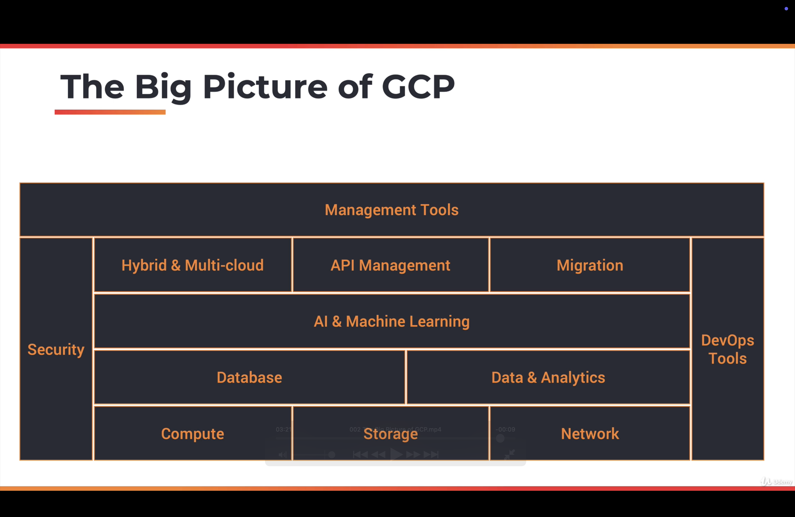
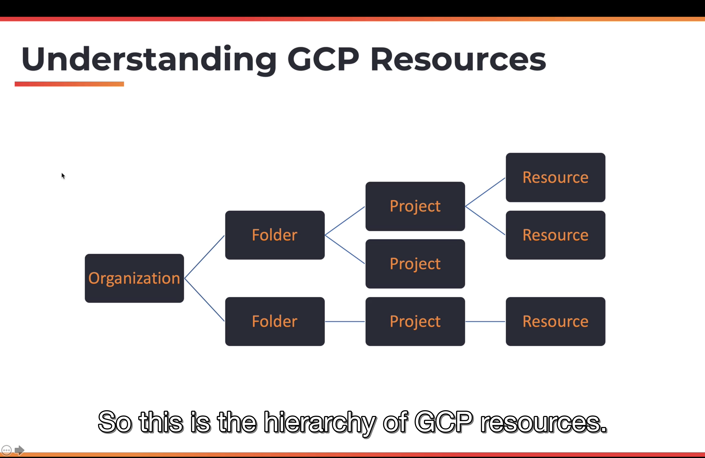
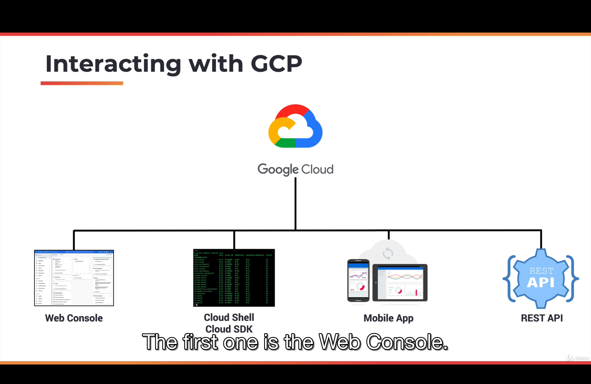

```

```

1. Big Picture of Google Cloud Platform(GCP):

Google is one of the hyper scale infrastructure providers. Its footprints spans multiple continents including Asia, Europe and the Americas.

Google has 20 regions, 61 zones, 134 network edge locations and available in 200+ countries and territories.

A region is a collection of multiple data centers. You can associate a zone with a data center. And, when Google launches a new region then it typically has at least 2 zones.

Zone provides high availability, reliability and redundancy to customers.

When customers launch applications they use more than one zone, making their own application highly available.

Network edge locations deliver static content which will enhance the user experience.

2. Building blocks of Google Cloud Platform(GCP):

Like most of the cloud providers, google has an expensive set of offerings. This building block of stack is is given below:

- Compute: It is most critical building block of cloud infrastructure.
- Storage: It provides durability and persistence to applications.
- Network: It enables communication across multiple applications and services offered by Google.

On top of these core foundational building blocks, we have additional services like databases that includes both NoSQL databases and relational databases followed by a set of data and analytical services that offers business intelligence and data warehouse in the cloud.

Google is known for its expertise in AI and Machine Learning, so, there are quite a few services that deliver machine learning and AI based services.

For enterprises, there are a set of services that make it possible to deploy hybrid and multi cloud capabilities, API management and even migrating workloads from on-premises to the cloud.

We then have security and DevOps that cuts across the stack because these are not specific to a layer, they are important for all the services and all the applications deployed on GCP, so they essentially cover the entire stack.

Finally we have management tools which deliver services through which customers can interact and manage their deployments and cloud infrastructure services.



3. Key GCP Services:

Here we will see the most critical and most building block services of GCP.

A. Compute:

It is one of the foundational aspects of the GCP. There are multiple services when it comes to compute.

- Compute Engine: It delivers infrastructure-as-a-service(IaaS).
- App Engine: It delivers platform-as-a-service(PaaS).
- Kubernetes Engine: Container has service and it is delivered by kubernetes.
- Container Registry: It manages docker container images.
- Cloud Functions: It delivers functions-as-a-service(FaaS).

B. Storage and Database Services:

It delivers persistence and durability. It includes:

- Cloud Storage:
- Cloud Bigtable:
- Cloud Datastore:
- Cloud SQL:
- Cloud Spanner:
- Persistence Disk

C. Network Services:

It provides connectivity and security for all the services and applications deployed on GCP. It includes

- Cloud Virtual Network: It provides hybrid and isolated network capabilities within the public cloud.
- Cloud load balancing routes to traffic across multiple instances of the application. Then there are additional services like Cloud CDN and a set of services that deliver hybrid capabilities like Cloud interconnect and Cloud DNS.

D. Security Services:

Security is critical and there are a set of services that enable customers to use the best practices of deploying secured applications. Services like Cloud IAM, Cloud Security Scanner, Cloud Resource Manager and Cloud Platform Security deliver critical security capabilities to customers.

E. AI and Machine Learning Services:

It provides some of the emerging set of tools and technologies to customers to build intelligent applications. These services include: Cloud Machine Learning, Vision API, Speech API, Natural Language API, Translation API, Jobs API etc.

F. DevOps Services:

DevOps tools provide automation capabilities to customers. Cloud is all about automation. When you want to do something repeatedly and consistently, you rely on devops tools. It includes: Cloud SDK, Deployment Manager, Cloud Source Repositories, Cloud tools for Android Studio, Cloud tools for IntelliJ, Cloud tools for Visual Studio, PowerShell Cloud tools, Plug-in for eclipse, cloud test lab etc.

G. Management Tools:

It provides insights into existing deployments and also extend the automation capabilities provided by basic devops tools. It includes Services like Stackdriver, Monitoring, Logging, Error Reporting, Trace, Debugger, Deployment Manager, Cloud Endpoints, Cloud Console, Cloud Shell, Cloud Mobile App, Billing App, Cloud APIs etc.

4. Apart from the key building block services that we discussed, Google has quite a few services that extend the capabilities. Services like API Analytics, IoT core, VPN, AutoML, Transfer Appliance, Beyond Corp, Deployment Manager, Filestore, Memorystore etc.
5. Getting Started with Google Cloud Platform:

The best thing about GCP is that it comes with a set of services that are always available for you for free. Beyond that GCP also gives you USD 300 credits to get started with the platform. While you can use and utilize all the credits that are available within the $300 credits limit. There are a set of services that are always free.

- First hit the link: https://cloud.google.com/free
- Sign-in on the platform to get free credits

6. In google cloud, anything or everything you launch results in the creation of a resource that includes VMs that you launch in Compute Engine, app instances you provision in the app engine, the topics that you created in pub/sub and storage bucket in the Google Cloud Storage, and so on.

Anything or everything you create is treated as resource. Over a period of time, if you create multiple resources then that need to be better organized. So, there is a hierarchy that you need to understand or how to structure these resources.

First thing is, resources belong to a project. In GCP, Project is the most critical element and entity(because it directly represents a billable unit), so when you create a project, you associate a credit card to it and any resource that you launch within the project will be directly billed as a part of that project. So, a project represents a billable unit. So, every resource that you launch belongs to a project.

A project may be organized into a folder. For example, you may have multiple projects under development and production environments. So, you may have more than one project under dev and more than one project under production. So, when you are dealing with all of them, it makes sense to create a folder and structure those projects that belong to dev and production into appropriate folders. Folders provide logical grouping of projects.

A folder may optionally belong to an organization. So, the organization is the top most entity in the resource hierarchy. You many not be able to see organization if you are not using G Suite. So, Google has mechanism for you to register your domain and create a corporate gmail account, google drive and a set of resources meant for businesses, So, only if you have a G Suite account, your GCP hierarchy will include an organization and also folders. If you are signing up an individual without a GSuite organization or G Suite account then you will have only access to projects and resources.



7. Interacting with GCP:



GCP has 4 different channels: Web Console, Cloud Shell/Cloud SDK, Mobile App and REST API.

Web Console: The moment you sign up with GCP, what you actually have is the web console. it is the front end and it is the gateway to dealing with variety of services.

For administrators and devops engineers, there is a cloud sheel and cloud sdk. Cloud SDK comes with a CLI(Command Line Interface) which can be used to launch a variety of resources and manage those resources.

In fact, everything that you can do with web console, that can also be done from command line. So, cloud sdk can be installed in linux, mac and windows machines. But one of the good thing about GCP is the availability of cloud shell. Cloud shell is a terminal, built right into the browser, so, without ever installing anything, you can quickly interact with GCP by clicking a button which is going to provision cloud shell for you.

Cloud shell comes with pre-configured environment, it has all the tools that you need to launch resources, manage resources and even some of the third party utilities like docker and so on.

Mobile app is useful to quickly access to GCP resources. There are applications available for Google and Apple play store.

REST API is meant for programmatic access.

The most popular and most convenient is the web console followed most powerful cloud shell/cloud sdk which is a command line followed by convenient mobile app followed by programmatic REST API.

8. Accessing GCP shell:

- An interactive shell environment for GCP.
- Now, without installing any CLI or utility, you can quickly get started and you can deal with launching, provisioning, managing and terminating resources.
- It's available from any web browser.
- This environment comes preloaded with an IDE, gcloud (command line utility for google cloud) sdk and other tools.
- This environment is fully backed by a fully fledged GCE virtual machine. So, you can imagine, when you are clicking button which is the cloud shell button, it is going to provision a VM for you that comes with a 5 GB of persistent disk storage and this helps to clone github repos, installing third party utilities, installing additional packages. It's basically a debian environment that's available for you. So, whatever you do with a typical debian or ubuntu flavoured linux environment, you can do that within the GCP cell.
- The best thing about cloud shell is the in-built web review functionality.

9. Demo:

First go to `https://cloud.google.com/free` and then sign-in and click on `console` option in top right corner.

You can click on Compute Engine and then click on VM Instances and explore things.

You can click on active cloud shell option from top right corner and explore it. This is almost being inside a virtual machine.

Now, in the cloud shell, run the command `gcloud compute regions list` and it will list all the available regions for our subscription for our project.

[Use ankitgupta89988@gmail.com for login]

10. Overview of GCP Compute Services:

For any cloud platform, cloud services are the critical component because this is where code is deployed and executed in one of the compute services.

GCP offers a wide range of compute choices:

- App Engine
- Compute Engine
- Kubernetes Engine
- Cloud Functions

App Engine is a platform-as-a-service(PaaS). So, in a platform-as-a-service(PaaS), developers typically bring their code and walk away with a URL that is running their application.

Compute Engine will give you a choice of virtual machines with a different set of configurations, where you take control by logging into the VM, installing the software of your choice and treating it like a machine that you have control over.

Kubernetes Engine is all about an orchestration platform. Virtual machines are now slowly getting replaced by containers. Kubernetes engines manages tens of thousands of containers that are deployed in the cloud.

Cloud functions represents function-as-a-service(FaaS). This is a serverless environment to execute code where you don't need to launch a VM or package your code as a container.

11. Google App Engine:

- It is one of the very first compute services from Google. (PaaS)
- Fully managed platform for deploying web apps at scale. It means developers don't have to deal with provisioning, configuring, scaling, managing and securing the platform or infrastructure. They just have to bring their code, deploy it and watch it scale. And that piece of code typically runs in the same context of Google's infrastructure. Now, when the traffic comes in and the number of requests increase, app engine will automatically scale the application. Similarly it applies the best practices to ensure the application is reliable, scalable and secure.
- It supports multiple languages (like from Java to Python to PHP), frameworks and libraries.
- App engine is available in 2 environments: Standard and Flexible. Application deployed in standard environment runs in sandbox.
- Flexible environment uses docker containers to deploy and scale apps.

12. Google Compute Engine:

- It enables Linux and Windows VMs to run on Google's global infrastructure (that runs Youtube, Google Search and rest of the services)
- VMs are based on machine types with varied CPU and RAM configurations. Just like when you invest in a server, depending on the configuration of number of CPU cores, memory and storage, you can choose a virtual machine that comes with different number of CPU cores, of course, they are virtual CPUs and RAM that is going to be different from each configuration. Virtual machines are typically ephemeral, it means if you start a VM and have a local disk attached to it, you install some software, you configure that and terminate it, you loose all the changes. If you want it to persist then you need to attach additional storage to the virtual machine and this is possible through a standard hard disk or an SSD (solid state drive that delivers better throughput).
- VMs are charged a minimum of 1 minute and they are billed at a one second increment after that.
- Google also offers a unique building mechanism called sustained use discounts. If you run a VM for the entire month, you automatically become eligible for the discount. This is what it is called sustained use discounts.

There is something called commited use discounts where if you are signing up for a long term contracts, you get a better deal. Your VMs are going to be much more cheaper if you commit to Google that you are going to run it for a period of one year or three years.

13. Google Kubernetes Engine(GKE):

It is a managed environment for deploying containerized applications managed by kubernetes. 

Kubernetes is the industry's most popular, most powerful container orchestration engine. It's an open source project that got originated at Google but now it's part of larger foundation called the Cloud-Native computing foundation. Google, as the original founders of Kubernetes, offers a very powerful, dynamic container managed environment called Google Kubernetes Engine (GKE).  

You can bring in your container images, package them as the kubernetes artifacts, deploy them and scale them through GKE. 

Kubernetes has a control plane and a worker node or multiple worker nodes. It's a typical distributed computing environment where you have a control plane and multiple worker nodes.

GKE provisions worker nodes as GKE VMs. So, when you launch a cluster in GKE, there are 2 elements, one is the control plane and the other is data plane which is typically delivered through the set of worker nodes.

Google takes care of control plane or the master nodes that are responsible for managing the entire cluster. Since google manages the control plane or worker nodes, it is called the managed environment.

A node pool is a collection of homogeneous VMs that deliver either high memory or high storage throughput or high CPU environment. You can create different node pools and plae GCE VMs in each of those node pools that offer unique capability, depending on your configuration. This choice makes it possible for you to segregate cluster environment into different capabilities and different nodes, depending on the configuration such as high memory, high CPU and high storage throughput environments. The service is tightly integrated with GCP resources such as networking, storage, and monitoring. 

GKE infrastructure is monitored by stack driver which is the built-in monitoring and tracing platform within google cloud. 

GKE delivers auto scaling, automatic upgrades and auto repairs of nodes.

14. Google Cloud Functions:

It is one of the recent additions to GCP.

- It is a serverless execution environment for building and connecting cloud services.
- Serverless computing environment is a mechanism where you don't have to provision and configure resources beforehand. This is fundamentally different way where you deal with App engine, compute engine and kubernetes engine. For those, you got to provision resources beforehand. You need to create app engine instances, you need to launch VMs, you need to create cluster or even before you can run your first line of code but that's very different when it comes to cloud functions. 
  
- In Cloud functions, you write code as a function which has a well-defined entry point and exit point and you deploy that with no changes. That's why it is called as serverless compute environment where you don't have to provision a virtual machine or container to run the code. Typically, serverless compute environments respond to events. So, instead of running this code forever, they get executed only when there is an external event. For example, adding a new object to a storage bucket or dropping a new message to the pub subqueue or invoking a http endpoint that will result in executing the serverless code, so any of those can be considered as external events responsible for triggering the code. 

You can write cloud functions in javascript, python3 and go. You don't have to package them in a specific format. At the most it's a zip file that gets into gcp environment and starts executing against events.          

GCP events fire a cloud function through a trigger. So, trigger is what connects the external resource to a cloud function. An example event could be adding a new object to a storage bucket. A classic use case or scenario is converting high resolution images uploaded to google cloud storage to thumbnails, so every time a new high resolution image is added to a storage bucket, a cloud function is triggered and the function converts the image to a thumbnail using image manipulation libraries and put in a different storage bucket. And this happens everytime a new high risk image is added to the storage bucket. This is one of the most efficient and economical way of running code in cloud.

Triggers connect events to the function. There is trigger, event and a function. So, you define an event and you connect it to a function and every time trigger takes place, it invokes the function via event. That's why it is called function-as-a-service(FaaS). 

15. Demo:

- Go to GCP Home page
- then go to compute engine and click on VM instances
- click on create instance button
- give the instance name like `instance-1`
- select machine type as `f1-micro` to be in free tier range
- select os image as ubuntu 20.04 LTS 
- In Firewall option, select `allow http traffic` option as it is very important to access web pages

After few seconds, instance will be up and running. Now, come back to cloud shell and type `gcloud compute instances list` then type `gcloud compute ssh instance-1 --zone asia-south1-a`. Then type `sudo apt-get update` to update packages. Then type `sudo apt-get install -y apache2` for configuring our machine for the web server.

Now, start the apache service by typing `sudo systemctl start apache2` and then type `sudo systemctl status apache2` to check if apache is running or not.

16. 