1. Model Serving:

Training a machine learning model is only the first part. You do need to make your model available to your end-users and you do this by either providing access to the model on your server.

Serving also includes the facility to deploy a model file to an application and this scenario is usually found with mobile ML.

When serving an ML model in a production environment, you should consider the 3 key components:

A. A model itself
B. An interpreter of its execution
C. input data

These components are used by an inference process which is aimed at getting the data ingested by a model in order to compute predictions.

2. ML Workflow:

- Model training
- Model serving

We take into consideration model training and model prediction while understanding the types of inference or prediction that you want to do with your model.

Model training is either performed with offline or online learning.

Offline learning is also known as batch or static learning where the model is trained on a set of already collected data. After deploying it to the production environment, the ML model remains constant until it's retrained because the model will see a lot of real life data and then it becomes stale quite quickly. This phenomenon is known as model decay and it's something that should be carefully monitored.

There is also online learning, also sometimes known as dynamic learning. Here the model is regularly being retrained as new data arrives, for example, as data streams. This is usually the case for ML systems that use time series data such as sensors or stock or anything like that and the idea is that to accomodate temporal effects in the ML model. Then when using your model for prediction, there is also 2 main types:

- The batch prediction: the deployed ML model makes a set of predictions based on historical input data. This is often sufficient for data that is not time dependent or when it's not critical to obtain real-time predictions as output or with real-time predictions also known as on-demand predictions, these predictions are generated in real-time using the input data that's available at the time of request.

3. Important Metrics:

When we talk about optimizing online inference, we need the important metrics such as latency, throughput and cost.

Latency is the delay between a user's action and the application's response to user's action. In the case of ML inference, it's the whole process of online inference, starting from sending data to server, performing inference using the model and then returning the response.

Most applications are user-facing, so minimal latency is a key requirement to maintaining your customer satisfaction. For example, your users might complain the app that suggests the hotels is too slow to refresh search results based on a user's input.

Throughput is the number of successful requests served per unit time say one second. In some applications, throughput is more important than latency. For example, if you want your models to process large amounts of data, for example video from security cameras at very high fidelity in order to assure that any security events are spotted quickly.

The cost associated with each inference should be minimized. Your serving infrastructure will always have associated costs. You should consider the cost for things like CPUs, Hardware accelerators like GPU, caching infrastructure for faster data retrieval.

Many customer facing application have the aim to minimizing latency and maximizing throughput.

Examples for Minimizing Latency: Airline Recommendation Service, Reduce latency for user's satisfaction
Examples for Maximizing throughput: Airline recommendation service faces high load of inference requests per second.

We can scale the infrastructure used to meet these thresholds of response time, throughput etc. but these can increase the cost proportionally. So, cost increases as infrastructure scales. So, this leads to play a balancing game costs and user's satisfaction. There is no perfect answer and there is always a trade-off but fortunately, there are tactics you can use to try to minimize any impact on your customer while you attempt to control cost. This may include like reducing costs by sharing assets like GPUs, using multiple models to increase the throughput and perhaps even exploring optimizing your models.

4. There are good reasons why models often become complex in an effort to find ways to increase accuracy.

As model complexity increases, cost increases also. As model becomes more complex, more features are included, the resource requirements increase for every part of the training and serving infrastructure, increase resource requirements mean increased costs and increased hardware requirements management of larger model registries and this results in a higher support and maintenance burden.

The key is to find the right balance i.e. balancing cost and complexity. So, the challenge for ML practitioners is to find the right balance between model complexity and cost.

There is a trade-off between model's predictive effectiveness and the speed of its prediction latency.

Depending on the use case, you need to decide on two metrics. There's the model's optimizing metric which reflects the model's predictive effectiveness and it includes things like accuracy,precision,recall and so on. And then there's model's satisficing(gating) metric like latency, model size, GPU load and so on, this reflects an operational constraint that model has to satisfy such as prediction latency. For example, you might set a latency threshold to a particular value such as 200 milliseconds and any model that doesn't meet this threshold is not going to be accepted.

Another example for gating metric is the size of the model. If you plan on deploying a model with too low spec hardware like mobile and embedded devices, this is of course very important.

One approach you can take is to specify the serving infrastructure, CPU, GPU and all that. And then start increasing your model complexity to improve your model's predictive power until you hit one or more of your gating metrics on that infrastructure. Then you can assess the results and either accept the model as it is or work to improve accuracy and or reduce complexity or make the decision to increase the specifications of the serving infrastructure

One of the factors to consider when designing your server and training infrastructure is the use of accelerators such as GPUs and TPUs. Now, each of these have different advantages but they also have costs and potentially limitations.

GPUs tend to be optimized for parallel throughput and they are often used in training infrastructure while TPUs as well as being useful in training have advantages for large complex models and large batch sizes, especially during inference.

These decisions can have a significant effect on your projects budget.

There is also a trade-off between applying a large number of less powerful accelerators and using a smaller number of more powerful accelerators. Often when working with a team or department, these choices will need to be made for a broad range of models. And not just for the new model that you are working on at this moment because there are always going to be shared resources.

The prediction request to your ML model might not provide all of the features required for the prediction. Some of the features may also need to be pre-computed or aggregated and then read in real time from a data store. Take for example for food delivery app that needs to predict the estimated time for an order delivery. Well this is based on a number of features like current traffic conditions. There are also some that can be read from a data store like the list of incoming orders, the number of outstanding orders per minute in the last hour and stuff like that.

You'll need powerful caches to retrieve this data with low latency since the delivery time has to be updated in real time. You can't wait many seconds for retrieving data from the database. And, of course this has cost implications. NoSQL databases are a good solution to implement caching and feature lookup. And there are various options available. If you need sub-milliseconds read latency on a limited amount of quickly changing data retrieved by a few 1000 clients. One good choice is Google Cloud MemoryStore. It's a fully managed version of latency in mem chache. And, of course there are very good open source options. If you need millisecond read latency on slowly changing data where the storage scales automatically, one good choices Google cloud Firestore. If you need millisecond read latency on dynamically changing data using a data that can scale linearly with heavy reads and writes, one good choice could be Google cloud Bigtable. Amazon's DynamoDB is also a good choice for scalable low read latency database with an in-memory cache. Adding caches speeds up feature lookup while reducing prediction retrieval latency.

5. Model Deployments:

Question: Where should I deploy my model ?

There are primarily two choices:

You can have a centralized model in a data center that's access via a remote call or you can distribute instances of your model to your users so that they can use it locally such as mobile or embedded system.

In data centers, cost and efficiency are important at any scale, even when you have large resources in huge data center. So, for example, large companies like Google constantly look for ways to improve resource utilization and reduce costs in applications in data centers using many of the same techniques and technologies that we will discuss.

But there are constraints in distributed environments like Mobile Phones: Androids and iOS. Let's take running a model on mobile phone and then take a look at hardware constraints that these devices can impose. In a mobile phone, the average GPU memory size (if you have) is much smaller than the one which you will find in a data center and often less than 4 GB.  You'll mostly have only one GPU which is shared by a number of applications. In most cases, you will be able to use the GPU for accelerated processing but that comes at a price. You have limited GPU available and using it can lead to your battery draining quickly. Your app will not be received well and could be reviewed poorly if it drains the battery too quickly or makes the phone too hot to touch because of complex operations in your ML model.

There is also the storage limitation since users don't appreciate large apps using high storage on your phone. You can rarely deploy a very large, complex model to a device like mobile phone. If it's too large, users just might not choose even install it because of the memory constraints. Since there are these constraints on memory processing power, battery usage and all that, there are many classes of models that we simply can't deploy to mobile phones or embedded systems. Instead, we may choose to deploy a model to a server and then expose it through a Rest API so that we can use it for inference in our app. But of course, this might also not be suitable. It might not be feasible to deploy a model to a server in environment where latency is super important or when a network connection may not be available. One example for this could be an object detection model deployed to an autonomous vehicle. It's critical in those applications that the system is able to take actions based on predictions made in near real-time and it can't wait for server round-trip.

As a general rule, you should always opt for minimize latency of inference wherever possible. This enhances the user experience by reducing the response time of your app but there are also exceptions:

Latency might not be as important where it's critical that the model is as accurate as possible for example, a disease diagnosis model.

6. Once you have selected or built a candidate model that might be right for your task. It's a good practice to profile and benchmark it. The TensorFlow Lite benchmarking tool has a built-in profile that can show per operator profiling characteristics. This can help understanding performance bottleneck and identifying which operator dominate the compute time. If a particular operator appears frequently in model and based on the profiling, you can find this operator consumes a lot of time and resource, you can look into optimizing it or using a different one.

Model optimization aims to create smaller models that are generally faster and more energy-efficient. This is specially important for deployments on mobile devices. TensorFlow Lite supports multiple optimizations techniques such as quantization etc. You can also increase the number of interpreter threads to speed up the execution of operators. However increasing the number of threads will also make your model use more resources and power. Foe some applications, latency might be more important than energy efficiency. Multi-threaded execution however also increase performance variability depending on what else is running concurrently. And, this is particularly the case for mobile apps. For example, some isolated tests could show a 2x speedup versus a single-threaded version but if another app is running at the same time, it could perform the worst performance than a single-threaded version. So, you really need to check it out.

If you go the other route and deploy a model to a server, there are some other considerations also for how to design it. The users of your model need a way to make requests and often this is through a web application. The model is wrapped as an API service in this approach and most serving infrastructure and languages have web frameworks that can help you to achieve this.

For example, Flask/FastAPI/Django is a very popular web framework and similarly Java also has many options like Apache Tomcat, Spring etc. Model servers can manage model deployment. For example, creating the server and managing it to serve prediction requests from clients. They eliminate the need for putting models into custom web applications. Deployment is just a few lines of code.

7. Clipper is a popular open-source model server developed at UC Berkeley Rise lab. Clipper helps you to deploy a wide range of models built-in frameworks like Cafe,TensorFlow, Scikit-learn etc. Its overall aim is to be model agnostic. Clipper includes a standard REST(RESTful API) interface and it makes you easy to integrate with production applications. Clipper wraps your models in docker containers if you want for cluster and resource management. It also helps you to set service level objectives for reliable latencies.
8. TensorFlow Serving is also an open-source model server which offers a flexible high-performance serving system for machine learning models designed for production environments.

TensorFlow serving makes it easy to deploy new algorithms in experiments while keeping the same server architecture and APIs. TensorFlow serving provides out of the box integration with TensorFlow models but it can also be extended to serve other types of models and data. It uses both REST and gRPC protocols. gRPC is often more efficient than REST. TensorFlow serving has demonstrated performance of upto 100,000 requests per second per core, making it more powerful applications for serving ML applications. It has a version manager that can easily load and rollback different versions of same models and it allows client to select which version to use for each request.

It also offers:

- Realtime endpoint for low-latency predictions for massive batches
- Deployment of models trained on premises or on the Google Cloud platform
- Scale automatically based on traffic
- Use GPUs/TPUs as accelerators for faster predictions

9. ML Infrastracture:

A. On Prem:

- Train and deploy on your own hardware infrastructure
- Manually procure (installing,configure and maintain) hardware like CPUs, GPUs, etc. which can be complex and costly
- Profitable for large companies running ML projects for longer time

B. On Cloud:

- Train and deploy on cloud choosing from several service providers-AWS, Azure, GCP etc. 

10. Model Serving:

A. On Prem:

- Manually installing, configure and maintain and Can use open-source, pre-built servers such as TF-Serving, KF(KubeFlow)-Serving, NVidia and more..

B. On Cloud:

- Create VMs and use same type of open source pre-built servers such as TF-Serving, KF(KubeFlow)-Serving etc.
- Use the provided ML workflow tools and services like AutoML of GCP or SageMaker and Autopilot of aws etc.

11. High Level Architecture of Model Servers:

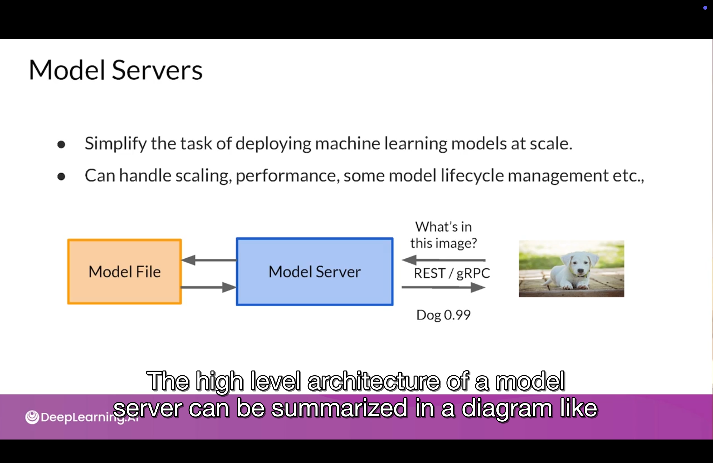

In Model file, your model is typically saved to the file system. You could also have the multiple versions of the same model, so you can try different ones. But ultimately, it's available to be read by the model server whose job is to instantiate the model and expose the methods on the model that you want to make available for clients. So, for example, if model is an image classifier then model server receives the data like in tensors in required shape and pass it to the model file and gets the inference back. It can also manage multiple model versions should you want to do things like A/B testing or have different users with different versions of the model. And the model server then exposes that API to the clients as we have mentioned previously like REST or gRPC interface that allows an image passed to the model.

12. TensorFlow Serving:

It supports many servables:

- TF Models
- Non-TF Models
- Word Embeddings
- Vocabularies
- Feature Transformations

Out of the box integrations with TF models:

- Batch and Real time inference - So, you can either get a bunch of inferences at the same time, which is useful if you are building something like a recommendation engine that requires a lot of predictions or a real-time inference if you want to answer to a single task back quickly and it is useful for example image classification.
- Multi-Model Serving - This allows multiple models for the same task and server chooses between them. This can be useful for like A/B testing, audience segmentation etc.
- Exposes gRPC and REST endpoints

13. TensorFlow Serving Architecture:

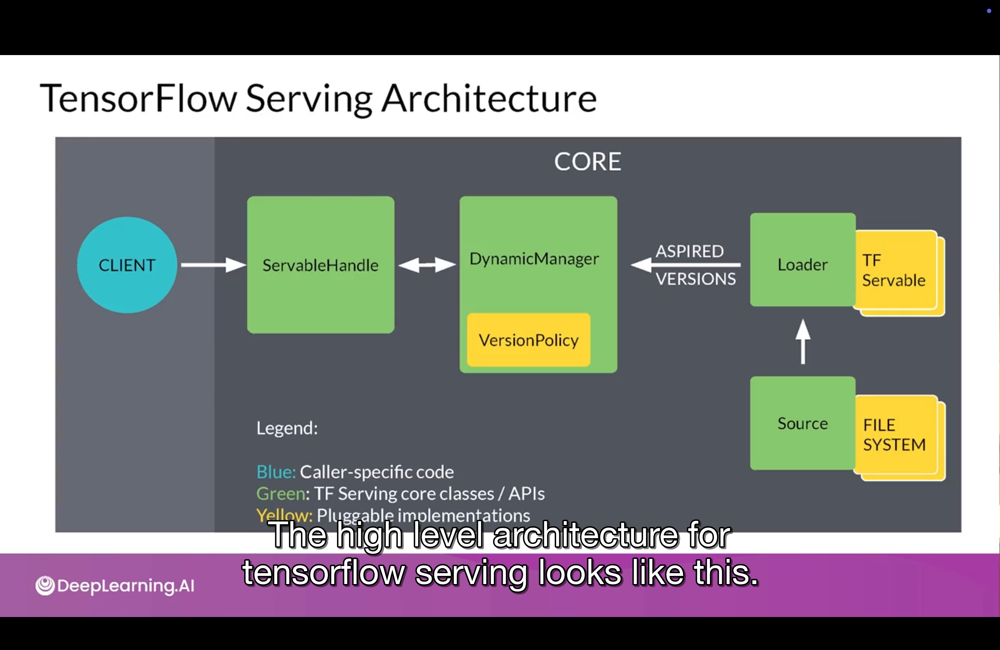

It's built around the core idea of servable which is the central abstraction in TF serving. These are the underlying objects that clients used to perform computation. For example, inference and look-ups. 

A typical servable is a tensorflow saved model but it could also be something like a lookup table for an embedding.

The loader manages the servable's lifecycle. The loader API enables common infrastructure independent from specific learning algorithms, data or whatever product use cases were involved. Specifically. loaders standardized the API is for loading and unloading servables. Together these produce aspired versions and these represent the set of servable versions that should be loaded and ready. Sources communicate this set of servable versions for a single servable stream at a time when a source gives a new list of aspired versions to the manager. It supersedes the previous list for that servable stream. The manager unloads any previously loaded versions that no longer appear in the list. The manager then handles full life cycle of the servables, including loading, serving and unloading the servable. 

Example: Say, a source represents a tensorflow graph with frequently updated model weights. The weights are stored in a file and a disk. The source detects a new version of the model weights. It creates a loader that contains a pointer to the model data on the disk. The source notifies the dynamic manager of the aspired version. The dynamic manager applies the version policy and decides to load new version. The dynamic manager tells the loader that is enough memory. The loader instantiates the tensorflow graph as a servable with these new weights. A client requests a handle to the latest version of the model and dynamic manager returns a handle to the new version of the servable. You can then run inference using that servable.

14. NVIDIA Triton Inference Server:

- Simplifies deployment of AI models at scale in production.
- Open source inference serving software.
- Deploy trained model from any framework:
  - TensorFlow, TensorRT, PyTorch, ONNX Runtime, or a custom framework
- Models can be stored on:
  - Local storage, AWS S3, GCP, Any CPU-GPU Architecture (cloud, data center or edge etc.)
  
HTTP REST or gRPC endpoints are supported.

Triton Inference Server Architecture supports:

- Single GPU using CUDA streams for multiple models from same or different frameworks concurrently
- Multi-GPU for same model:
  - can run instances of model on multiple GPUs for increased inference performance
- Support model ensembles

All of these increase your GPU utilization without any extra coding from the user. The inference server supports low-latency real-time inferencing with batch inferencing to maximize GPU and CPU utilization. It also has built-in support for streaming inputs if you want to do streaming inference. Users can use shared memory support for higher performance. Inputs and outputs need to be passed to and from Triton's inference server can be stored in the systems or the CUDA shared memory.

Triton inference server integrates with Kubernetes for orchestration, metrics and auto-scaling. It also integrates with KubeFlow and KubeFlow pipelines for end to end AI workflow.

The Triton Inference server exports Prometheus metrics for monitoring GPU utilization, latency, memory usage and inference throughput. It supports the standard HTTP gRPC interface to connect with other applications like load balancers. It can scale to any number of servers to handle increasing inference loads for any model. 

The Triton Inference Server supports tens or hundreds of models through the Model Control API. Models can be explicitly loaded and unloaded into and out of the inference server based on the changes made in the model control configuration to fit in the CPU or GPU memory. 

It supports heterogeneous cluster with both GPUs and CPUs and does help to standardize inference across these platforms. So, during peak loads, it can dynamically scale out to any CPU or GPU. 

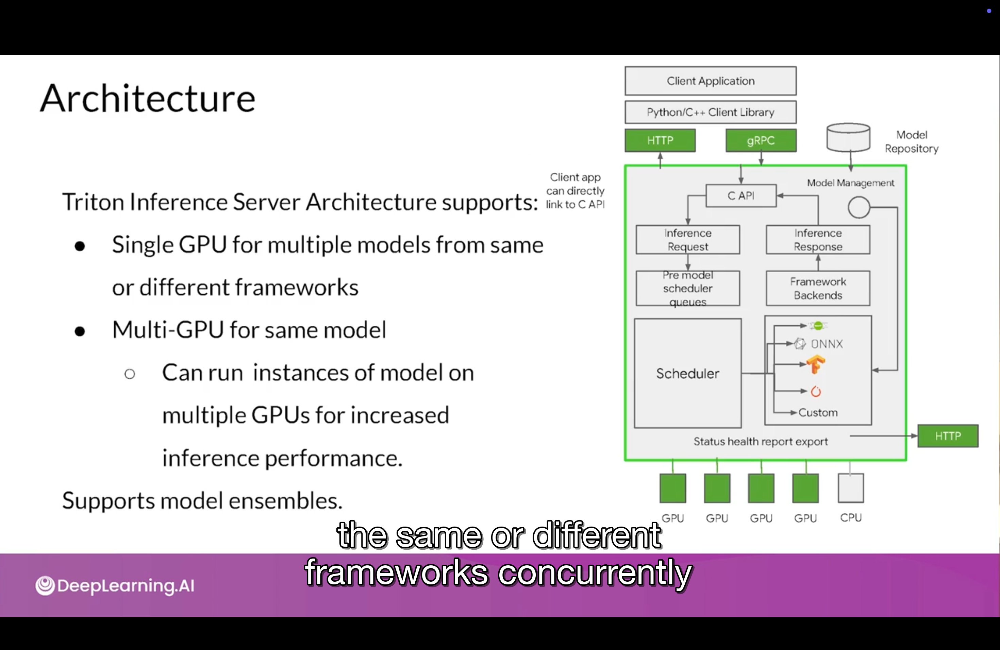

15.  TorchServe:

- Model serving framework for PyTorch models.
- Initiative from AWS and Facebook.

Here, you can serve multiple models simultaneously. You can have version production models for A/B testing. You can load and unload models dynamically and you can monitor detailed blogs and customizable metrics.

Best of all, TorchServe is an open source, hence it's extensible to fit your deployment needs. 

Here multiple workers can run simultaneously on TorchServe.

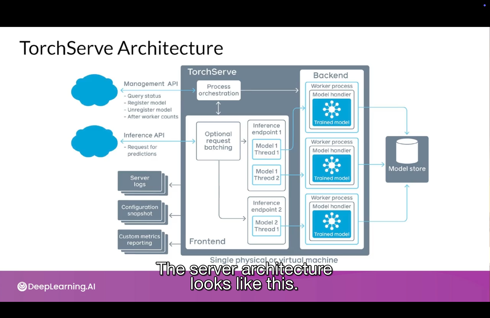

16. KF(KubeFlow)-Serving:

- Enables serverless inferencing on kubernetes
- Provides high abstraction interfaces for common ML frameworks like TensorFlow, PyTorch, scikit-learn etc.

17. Scaling Infrastructure:

Consider the costs of training deep neural networks with billions of operations on huge datasets. It could take days to complete training on a standard CPU or a single GPU. If you can scale out the hardware on which the training runs and then distribute the training across different items of hardware and maybe even distribute the data by sharding it across this hardware, you can make that training far more efficient. 

Similarly, you could also consider the cost of training a network beyond just the data. The larger and more sophisticated the network, the more parameters need to be tuned and fine-tuned. 

Consider what happens when you have deployed your model to a server. Huge volumes of requests to the server for inference can overwhelm it. So, the ability to scale the runtime inference as well as training is vital. 

There are 2 main ways to scale, horizontal and vertical scaling.

Let's start with vertical scaling. So, it's using bigger and more powerful hardware. It might be upgrading your CPU, adding more RAM, using new GPUs and other types of power. If your car could hold only 5 people and you need to move 100 people, you can get a bigger car that holds 10 people so that you can move twice as fast. 

Horizontal scaling means adding more devices to the network. It adds more CPUs/GPUs instead of bigger ones when load increases. So, instead of buying a bigger car, you can get 20 cars of same size and transport all 100 people at once. On this metaphor, you could just borrow the other 19 cars along with your own for the time that you need them.

That's basically the same concept with cloud computing where you can scale up to your need and scale right back down again when you don't need it anymore and pay only for what you use. 

I would generally recommend horizontal scaling for a variety of reasons. First of that is Elasticity. Like my 100 people in cars that fit 5 people scenario, instead of getting rid of your reliable car to get a bigger one and only chip away the problem, you could lease 19 cars just like your own and give them back when you are done. That way you don't have to continually maintain and ensure all the other cars etc. It's exactly the same in a scenario like this. Not only that, if you are scaling vertically, you generally have to take your app offline in order to upgrade the hardware resources. When it's elastic, you don't need to do this, you just spin up new ones. So, some frameworks such as Google's App engine are also really smart in using machine learning to predict usage patterns so that they can pretty warm up the machines before they are actually needed, reducing overall latency. Of course, there are limitations but they usually budgetary and not hardware. So, if you need more nodes then you can afford them, you can just go get them. 

There are lots of vendors offering cloud platforms that allow you to scale horizontally. 

Some questions: Can I manually scale ? What happens if I say I only want any instances of a VM, for example ? Can I autoscale ? What happens if I want my app to automatically spin up and down based on demand ? What does the latency and costs look like ? Finally, how aggressive is the system at spinning up and down based on my need ? Then next question arises, how can I manage my additional VMs to ensure that they have the content on them that I want. For machine learning, there might be a lot of dependencies, access to data, permissions and many other configurable items. If I am going to scale horizontally, I want new machines to be able to be up and running quickly. For that there is containerism. Containers like docker offers you a convenient way to do horizontal scaling.

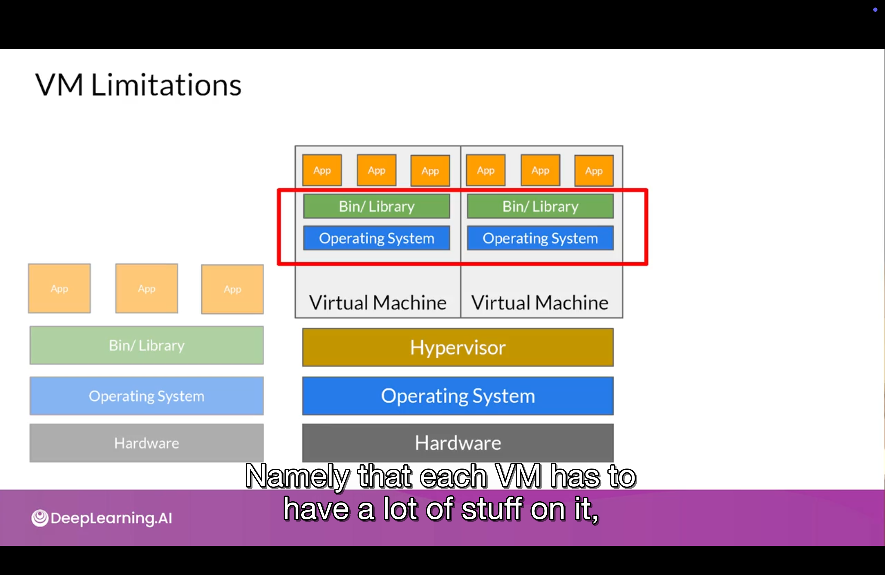
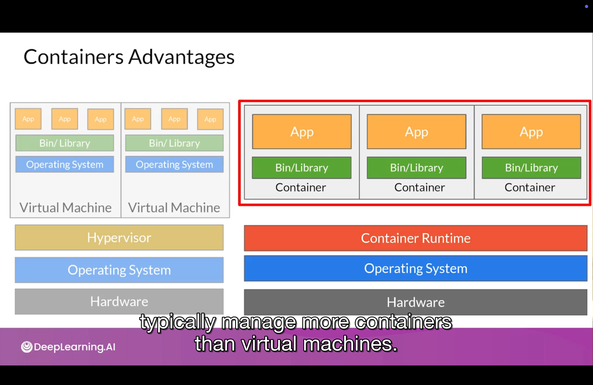
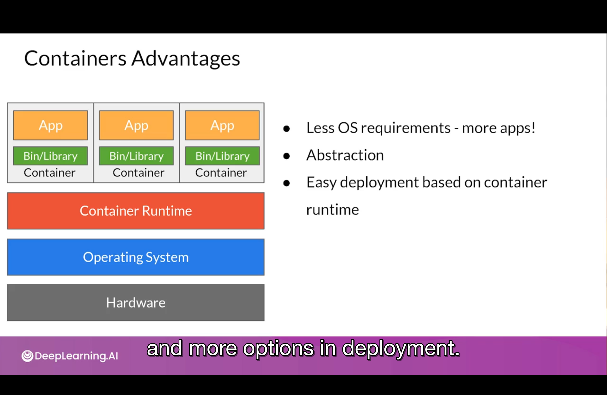
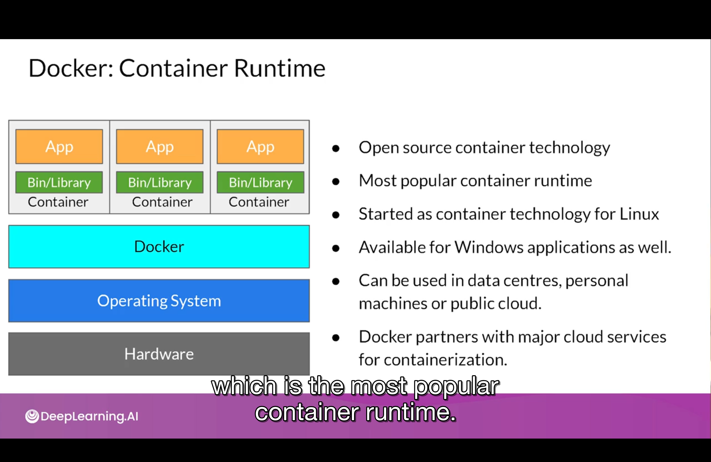
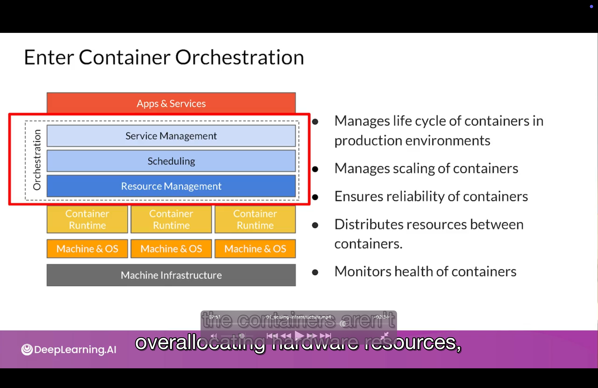
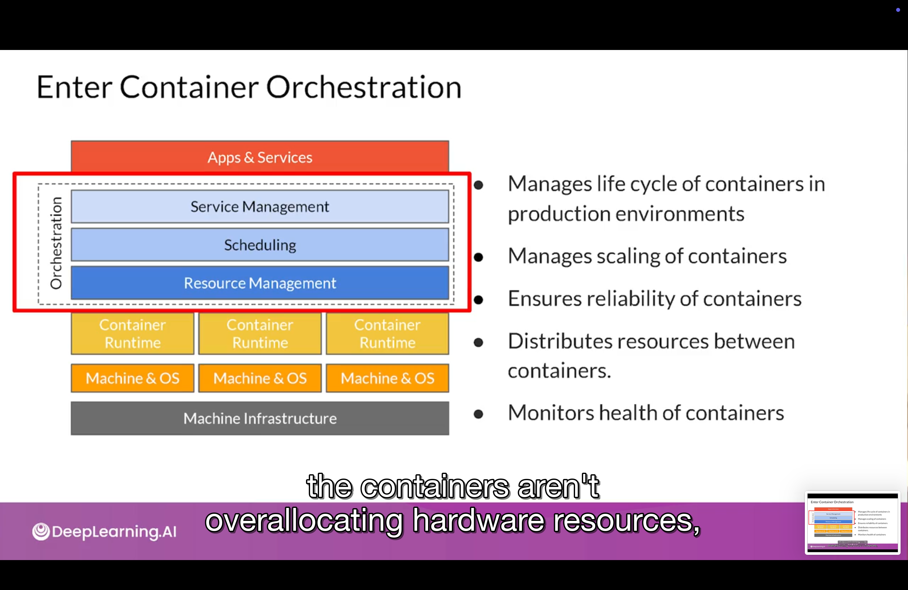
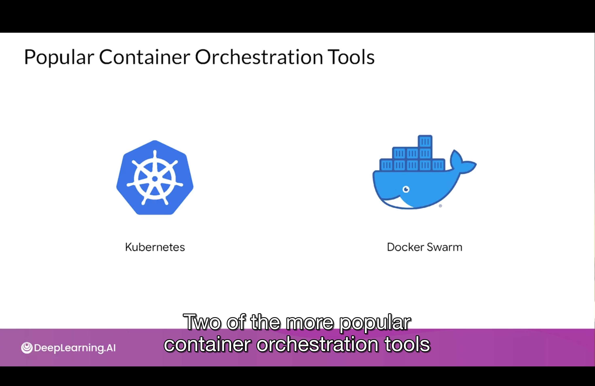

18. Online Inference:

A typical interaction between a model and a caller online looks a bit like this: The interface between the outside world and the caller is via the REST API. You will typically have some form of data about the user often called an `observation` upon which you want to get a prediction. This might be for example context about a customer that can be used to predict what type of purchases may be appropriate for them, so that you could have a recommendation list. Or perhaps it might be something like a smart reply generator where in a conversation, the text can be used to auto generate replies that the user can select. The observation is posted to the model via REST API and returned prediction is rendered. 

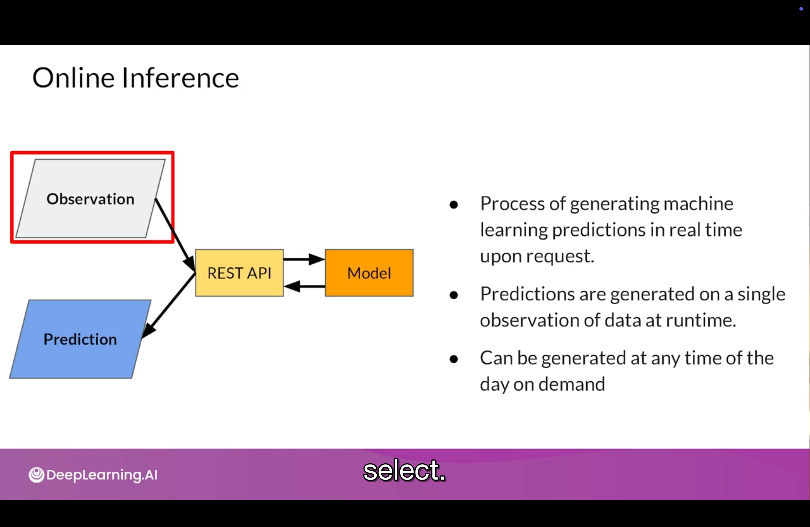

There are 3 main areas you can focus on if you want to optimize your inference. The first is the infrastructure used to serve the models and handle the user input and output. This can be scaled with additional or more powerful hardware as well as containerized a virtualized environments. 

The second, of course, is to understand your model architecture and the metrics was trained and tested with. Often there is a tradeoff between inference speed and accuracy. If a 99% accurate model is 10 times slower than a 98% accurate model, is it really worth the extra cost ? 

And the third is Model Compilation, if you know the hardware on which you are going to deploy the model. For example, a particular type of GPU, there is often a post training step that consists of creating a model artifact and model execution runtime, that's finally adapted to the underlying support hardware. You can refine your model graph and inference runtime to reduce memory consumption and latency.

Additionally, there are some applications which are performed on application layer. For example, consider the scenario where you are doing a shopping prediction, giving your customer a list of products that they might want to buy next. The app will receive details about the customer including some form of identifier, this data is used by the model to generate an inference. And the model will return a bunch of IDs of products that might suit that customer. So, the app has to look these up in a data store in order to get details about them which it then returns to the client as a prediction. 

An obvious optimization you can do is to consider common scenarios to be cached in something faster than a typical datastore. So, for example, if you have a number of hot popular products, these could be stored in faster data storage. Of course, the faster the data storage is, the more expensive it is. So, there is a tradeoff here. It may not be feasible for all your data to be in such a store. 

Fast data caching is usually achieved using NoSQL databases on memory caching. There are some products are there to handle is like Amazon DynamoDB, Google Cloud MemoryStore(Memcache), Google Cloud Bigtable, Google Cloud Datastore etc.

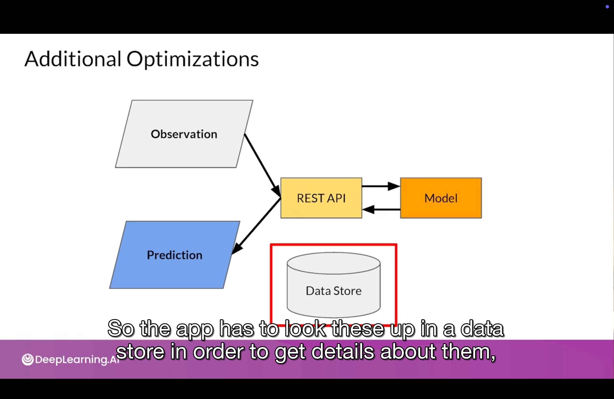

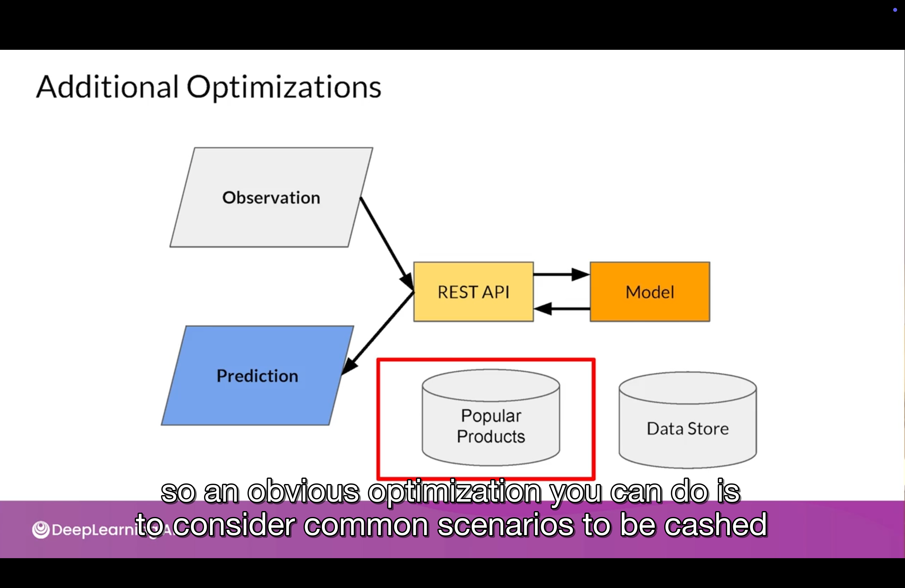

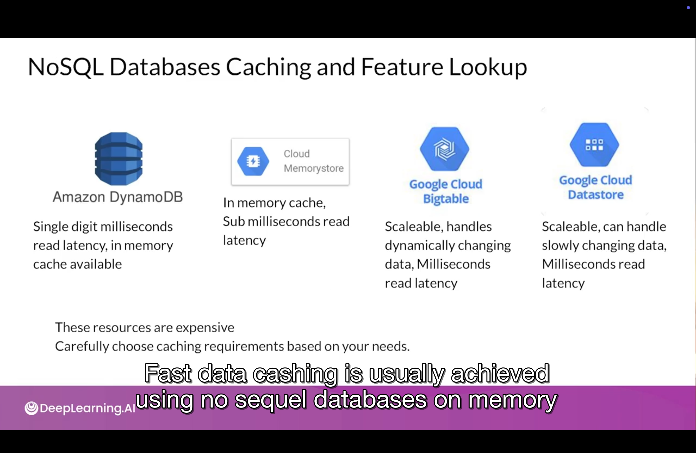

19. Data Preprocessing:

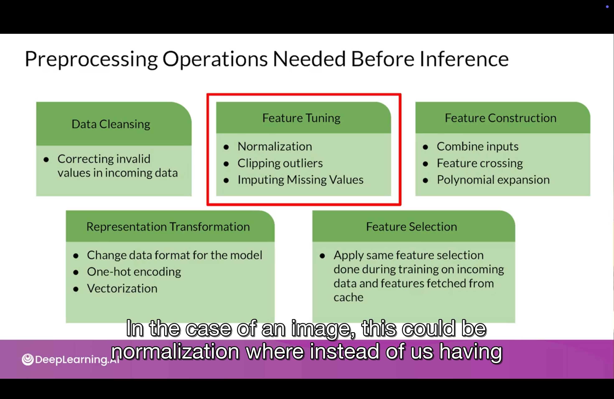

20. Batch Inference Scenarios:

Now, we consider the model performance and resource requirements for batch inference.

After you train, evaluate and tune a machine learning model, the model is deployed to production to generate predictions. An ML model can provide predictions in batches. Prediction on batch inference is when your ML model is used in a batch scoring job for a large number of data points where predictions are not required or not feasible to generate in real-time.

In batch recommendations, for example, you might only use historical information about customer item interactions to make the prediction without any need for real-time information. Batch recommendations are usually performed in retention campaigns for inactive customers that have a high propensity that churn or in promotion campaigns and stuff like that. Batch jobs for prediction are usually generated on some recurring schedule like daily, night or weekly. Predictions are usually stored in a database that can then be available to developers or end-users. 

Batch inferences has some important advantages. You can use complex machine learning models in order to improve the accuracy of your predictions since there is no constraint on inference time. Also, caching of predictions like this is usually not required. Employing a caching strategy for features needed for prediction will increase the overall cost of your ML system.   

The data retrieval can take some time if caching strategy is not used. Batch inference can also wait for data retrieval to make predictions since predictions are not available in real-time. 

However, batch inference also has few disadvantages: 

Predictions can't be available for real-time purposes. Update latency of predictions can be hours or sometimes even days. 

So, predictions are often made using old data. This is problematic in certain scenarios. Suppose a service like movie streaming where one generates recommendations at night. If a new user signs up they may not be able to see personalized recommendations right away. To get around this, the system is designed to show the recommendations from other users in a similar demographic like same age bracket or maybe the same geolocation as the new user. 

So, let's review few use cases of batch inference:

The most important metric to optimize while performing batch prediction is throughput. You should always aim to increase the throughput in batch predictions rather than the latency. When data is available in batches, the model should be able to process large volumes of data at a time. As throughput increases, the latency with which each prediction is generated, also increases. But this is not a big concern in batch prediction system since predictions need not be available immediately. Predictions are usually stored for later use and hence latency can be compromised. 

Throughput of an ML model or Production system processing data in batches can be increased by the usage of hardware accelerators like GPUs, TPUs etc. You can also increase the number of servers or workers in which the model is deployed. You can load several instances of the models on multiple workers to increase the throughput.

Let's look at some use cases of batch predictions:

A. Product Recommendations:

New product recommendations on an e-commerce website can be generated on a recurring schedule. Then caching these predictions for easy retrieval rather than generating them every time you use. This can save inference costs since you don't need to guarantee the same latency as real-time inference needs to have. You can also use more predictions to train more complex models since you don't have the constraint of prediction latency. This helps personalization to a greater degree but using delayed data that may not include new information about the user.

B. Sentiment Analysis:

Based on the user reviews usually in text format, you might want to predict if a review was positive, negative or neutral. Systems that analyze user sentiment for your products and services based on customer reviews, can make use of batch prediction on a recurring schedule. Some systems generate products sentiments on weekly basis, for example. Real-time prediction is not needed in this case since the customers and stakeholders are not waiting to complete an action in real-time based on the predictions. Sentiments prediction can be used for improvements of products or services over time. A CNN, RNN or LSTM based approach can be used for sentiment analysis. I tend to like LSTM. These models are more complex but they often provide higher accuracy. That makes it more cost-effective for you to use them with batch predictions.

C. Demand Forecasting:

You can use batch predictions for models that estimate the demand for your products perhaps on a daily basis for inventory and ordering optimization. It can be modeled as a time series problem since you are predicting the future demand based on the historical data. Since batch predictions have minimal latency constraints, time series models like ARIMA, SARIMA or an RNN can be used over approaches like linear regression for more accurate predictions. 

21. Data Processing: Batch and Streaming:

Data can be different types based on the source. Large volumes of batch data are available in data lakes from csv files, log files etc. 

Streaming data on the other hand, arrives in real-time. One example of such data could be data from sensors. 

Before data is used for making batch predictions, it has to be extracted from multiple sources like csv files, log files, APIs, other apps, streaming sources etc. 

The extracted data should be transformed so as to make ML predictions and then load into a database from where it can be sent in batches for predictions. The entire pipeline that prepares data is known as an ETL(extract, transform, load) pipeline.  

Extraction from data sources and transformation on data can be performed in a distributed manner. Data is split into chunks and then can be parallelly processed by multiple workers. The results of the ETL workflow are stored in a database and the results are lower latency and higher throughput of data processing. 

Various frameworks can be used for batch processing of data in ETL pipeline before they are sent for inference. Data can be come multiple sources like CSV, JSON, XML, APIs or data lakes like Google Cloud Storage etc. The ETL on data is performed by engines like Apache Spark, Google Cloud Dataflow with use of Apache Beam programming paradigm etc. The transformed data is stored in data warehouses like BigQuery, data mart, data lake etc. and sent back to data lakes like Google Cloud Storage before it is sent for batch predictions. 

Continuously updating data sources like sensors can be connected to Apache Kafka, Google Cloud Pub Sub etc.

Spark is used for processing streaming data. Apache Kafka can also be used as ETL engine for streaming data. 

22. ML Experiments Management and Workflow Automation:

Experiment Tracking:

Experiments are fundamental to data science and machine learning. ML in practice is more of an experimental science than a theoretical one. So, tracking the results of experiments especially in production environments is critical being able to make progress towards your goals. Debugging in ML is often fundamentally different than debugging in software engineering because it's often about a model and not converging or not generalizing instead like segmentation fault in a program. 

Keeping a clean record of changes of the model and data over time can be a big help when you are trying to hunt down the source of the problem. Even small changes like changing the width of a layer or learning rate can make a big difference in both model's performance and the resources required to train the model. Again, tracking even small changes is important. 

Don't forget that running experiments which means training your model again and again 