1. Model Serving:

Training a machine learning model is only the first part. You do need to make your model available to your end-users and you do this by either providing access to the model on your server.

Serving also includes the facility to deploy a model file to an application and this scenario is usually found with mobile ML.

When serving an ML model in a production environment, you should consider the 3 key components:

A. A model itself
B. An interpreter of its execution
C. input data

These components are used by an inference process which is aimed at getting the data ingested by a model in order to compute predictions.

2. ML Workflow:

- Model training
- Model serving

We take into consideration model training and model prediction while understanding the types of inference or prediction that you want to do with your model.

Model training is either performed with offline or online learning.

Offline learning is also known as batch or static learning where the model is trained on a set of already collected data. After deploying it to the production environment, the ML model remains constant until it's retrained because the model will see a lot of real life data and then it becomes stale quite quickly. This phenomenon is known as model decay and it's something that should be carefully monitored.

There is also online learning, also sometimes known as dynamic learning. Here the model is regularly being retrained as new data arrives, for example, as data streams. This is usually the case for ML systems that use time series data such as sensors or stock or anything like that and the idea is that to accomodate temporal effects in the ML model. Then when using your model for prediction, there is also 2 main types:

- The batch prediction: the deployed ML model makes a set of predictions based on historical input data. This is often sufficient for data that is not time dependent or when it's not critical to obtain real-time predictions as output or with real-time predictions also known as on-demand predictions, these predictions are generated in real-time using the input data that's available at the time of request.

3. Important Metrics:

When we talk about optimizing online inference, we need the important metrics such as latency, throughput and cost.

Latency is the delay between a user's action and the application's response to user's action. In the case of ML inference, it's the whole process of online inference, starting from sending data to server, performing inference using the model and then returning the response.

Most applications are user-facing, so minimal latency is a key requirement to maintaining your customer satisfaction. For example, your users might complain the app that suggests the hotels is too slow to refresh search results based on a user's input.

Throughput is the number of successful requests served per unit time say one second. In some applications, throughput is more important than latency. For example, if you want your models to process large amounts of data, for example video from security cameras at very high fidelity in order to assure that any security events are spotted quickly.

The cost associated with each inference should be minimized. Your serving infrastructure will always have associated costs. You should consider the cost for things like CPUs, Hardware accelerators like GPU, caching infrastructure for faster data retrieval.

Many customer facing application have the aim to minimizing latency and maximizing throughput.

Examples for Minimizing Latency: Airline Recommendation Service, Reduce latency for user's satisfaction
Examples for Maximizing throughput: Airline recommendation service faces high load of inference requests per second.

We can scale the infrastructure used to meet these thresholds of response time, throughput etc. but these can increase the cost proportionally. So, cost increases as infrastructure scales. So, this leads to play a balancing game costs and user's satisfaction. There is no perfect answer and there is always a trade-off but fortunately, there are tactics you can use to try to minimize any impact on your customer while you attempt to control cost. This may include like reducing costs by sharing assets like GPUs, using multiple models to increase the throughput and perhaps even exploring optimizing your models.

4. There are good reasons why models often become complex in an effort to find ways to increase accuracy.

As model complexity increases, cost increases also. As model becomes more complex, more features are included, the resource requirements increase for every part of the training and serving infrastructure, increase resource requirements mean increased costs and increased hardware requirements management of larger model registries and this results in a higher support and maintenance burden.

The key is to find the right balance i.e. balancing cost and complexity. So, the challenge for ML practitioners is to find the right balance between model complexity and cost.

There is a trade-off between model's predictive effectiveness and the speed of its prediction latency.

Depending on the use case, you need to decide on two metrics. There's the model's optimizing metric which reflects the model's predictive effectiveness and it includes things like accuracy,precision,recall and so on. And then there's model's satisficing(gating) metric like latency, model size, GPU load and so on, this reflects an operational constraint that model has to satisfy such as prediction latency. For example, you might set a latency threshold to a particular value such as 200 milliseconds and any model that doesn't meet this threshold is not going to be accepted.

Another example for gating metric is the size of the model. If you plan on deploying a model with too low spec hardware like mobile and embedded devices, this is of course very important.

One approach you can take is to specify the serving infrastructure, CPU, GPU and all that. And then start increasing your model complexity to improve your model's predictive power until you hit one or more of your gating metrics on that infrastructure. Then you can assess the results and either accept the model as it is or work to improve accuracy and or reduce complexity or make the decision to increase the specifications of the serving infrastructure

One of the factors to consider when designing your server and training infrastructure is the use of accelerators such as GPUs and TPUs. Now, each of these have different advantages but they also have costs and potentially limitations.

GPUs tend to be optimized for parallel throughput and they are often used in training infrastructure while TPUs as well as being useful in training have advantages for large complex models and large batch sizes, especially during inference.

These decisions can have a significant effect on your projects budget.

There is also a trade-off between applying a large number of less powerful accelerators and using a smaller number of more powerful accelerators. Often when working with a team or department, these choices will need to be made for a broad range of models. And not just for the new model that you are working on at this moment because there are always going to be shared resources.

The prediction request to your ML model might not provide all of the features required for the prediction. Some of the features may also need to be pre-computed or aggregated and then read in real time from a data store. Take for example for food delivery app that needs to predict the estimated time for an order delivery. Well this is based on a number of features like current traffic conditions. There are also some that can be read from a data store like the list of incoming orders, the number of outstanding orders per minute in the last hour and stuff like that.

You'll need powerful caches to retrieve this data with low latency since the delivery time has to be updated in real time. You can't wait many seconds for retrieving data from the database. And, of course this has cost implications. NoSQL databases are a good solution to implement caching and feature lookup. And there are various options available. If you need sub-milliseconds read latency on a limited amount of quickly changing data retrieved by a few 1000 clients. One good choice is Google Cloud MemoryStore. It's a fully managed version of latency in mem chache. And, of course there are very good open source options. If you need millisecond read latency on slowly changing data where the storage scales automatically, one good choices Google cloud Firestore. If you need millisecond read latency on dynamically changing data using a data that can scale linearly with heavy reads and writes, one good choice could be Google cloud Bigtable. Amazon's DynamoDB is also a good choice for scalable low read latency database with an in-memory cache. Adding caches speeds up feature lookup while reducing prediction retrieval latency.

5. Model Deployments:

Question: Where should I deploy my model ?

There are primarily two choices:

You can have a centralized model in a data center that's access via a remote call or you can distribute instances of your model to your users so that they can use it locally such as mobile or embedded system.

In data centers, cost and efficiency are important at any scale, even when you have large resources in huge data center. So, for example, large companies like Google constantly look for ways to improve resource utilization and reduce costs in applications in data centers using many of the same techniques and technologies that we will discuss.

But there are constraints in distributed environments like Mobile Phones: Androids and iOS. Let's take running a model on mobile phone and then take a look at hardware constraints that these devices can impose. In a mobile phone, the average GPU memory size (if you have) is much smaller than the one which you will find in a data center and often less than 4 GB.  You'll mostly have only one GPU which is shared by a number of applications. In most cases, you will be able to use the GPU for accelerated processing but that comes at a price. You have limited GPU available and using it can lead to your battery draining quickly. Your app will not be received well and could be reviewed poorly if it drains the battery too quickly or makes the phone too hot to touch because of complex operations in your ML model.

There is also the storage limitation since users don't appreciate large apps using high storage on your phone. You can rarely deploy a very large, complex model to a device like mobile phone. If it's too large, users just might not choose even install it because of the memory constraints. Since there are these constraints on memory processing power, battery usage and all that, there are many classes of models that we simply can't deploy to mobile phones or embedded systems. Instead, we may choose to deploy a model to a server and then expose it through a Rest API so that we can use it for inference in our app. But of course, this might also not be suitable. It might not be feasible to deploy a model to a server in environment where latency is super important or when a network connection may not be available. One example for this could be an object detection model deployed to an autonomous vehicle. It's critical in those applications that the system is able to take actions based on predictions made in near real-time and it can't wait for server round-trip.

As a general rule, you should always opt for minimize latency of inference wherever possible. This enhances the user experience by reducing the response time of your app but there are also exceptions:

Latency might not be as important where it's critical that the model is as accurate as possible for example, a disease diagnosis model.

6. Once you have selected or built a candidate model that might be right for your task. It's a good practice to profile and benchmark it. The TensorFlow Lite benchmarking tool has a built-in profile that can show per operator profiling characteristics. This can help understanding performance bottleneck and identifying which operator dominate the compute time. If a particular operator appears frequently in model and based on the profiling, you can find this operator consumes a lot of time and resource, you can look into optimizing it or using a different one.

Model optimization aims to create smaller models that are generally faster and more energy-efficient. This is specially important for deployments on mobile devices. TensorFlow Lite supports multiple optimizations techniques such as quantization etc. You can also increase the number of interpreter threads to speed up the execution of operators. However increasing the number of threads will also make your model use more resources and power. Foe some applications, latency might be more important than energy efficiency. Multi-threaded execution however also increase performance variability depending on what else is running concurrently. And, this is particularly the case for mobile apps. For example, some isolated tests could show a 2x speedup versus a single-threaded version but if another app is running at the same time, it could perform the worst performance than a single-threaded version. So, you really need to check it out.

If you go the other route and deploy a model to a server, there are some other considerations also for how to design it. The users of your model need a way to make requests and often this is through a web application. The model is wrapped as an API service in this approach and most serving infrastructure and languages have web frameworks that can help you to achieve this.

For example, Flask/FastAPI/Django is a very popular web framework and similarly Java also has many options like Apache Tomcat, Spring etc. Model servers can manage model deployment. For example, creating the server and managing it to serve prediction requests from clients. They eliminate the need for putting models into custom web applications. Deployment is just a few lines of code.

7. Clipper is a popular open-source model server developed at UC Berkeley Rise lab. Clipper helps you to deploy a wide range of models built-in frameworks like Cafe,TensorFlow, Scikit-learn etc. Its overall aim is to be model agnostic. Clipper includes a standard REST(RESTful API) interface and it makes you easy to integrate with production applications. Clipper wraps your models in docker containers if you want for cluster and resource management. It also helps you to set service level objectives for reliable latencies.
8. TensorFlow Serving is also an open-source model server which offers a flexible high-performance serving system for machine learning models designed for production environments.

TensorFlow serving makes it easy to deploy new algorithms in experiments while keeping the same server architecture and APIs. TensorFlow serving provides out of the box integration with TensorFlow models but it can also be extended to serve other types of models and data. It uses both REST and gRPC protocols. gRPC is often more efficient than REST. TensorFlow serving has demonstrated performance of upto 100,000 requests per second per core, making it more powerful applications for serving ML applications. It has a version manager that can easily load and rollback different versions of same models and it allows client to select which version to use for each request.

It also offers:

- Realtime endpoint for low-latency predictions for massive batches
- Deployment of models trained on premises or on the Google Cloud platform
- Scale automatically based on traffic
- Use GPUs/TPUs as accelerators for faster predictions

9. ML Infrastracture:

A. On Prem:

- Train and deploy on your own hardware infrastructure
- Manually procure (installing,configure and maintain) hardware like CPUs, GPUs, etc. which can be complex and costly
- Profitable for large companies running ML projects for longer time

B. On Cloud:

- Train and deploy on cloud choosing from several service providers-AWS, Azure, GCP etc. 

10. Model Serving:

A. On Prem:

- Manually installing, configure and maintain and Can use open-source, pre-built servers such as TF-Serving, KF(KubeFlow)-Serving, NVidia and more..

B. On Cloud:

- Create VMs and use same type of open source pre-built servers such as TF-Serving, KF(KubeFlow)-Serving etc.
- Use the provided ML workflow tools and services like AutoML of GCP or SageMaker and Autopilot of aws etc.

11. High Level Architecture of Model Servers:

In Model file, your model is typically saved to the file system. You could also have the multiple versions of the same model, so you can try different ones. But ultimately, it's available to be read by the model server whose job is to instantiate the model and expose the methods on the model that you want to make available for clients. So, for example, if model is an image classifier then model server receives the data like in tensors in required shape and pass it to the model file and gets the inference back. It can also manage multiple model versions should you want to do things like A/B testing or have different users with different versions of the model. And the model server then exposes that API to the clients as we have mentioned previously like REST or gRPC interface that allows an image passed to the model.

12. TensorFlow Serving:

It supports many servables:

- TF Models
- Non-TF Models
- Word Embeddings
- Vocabularies
- Feature Transformations

Out of the box integrations with TF models:

- Batch and Real time inference - So, you can either get a bunch of inferences at the same time, which is useful if you are building something like a recommendation engine that requires a lot of predictions or a real-time inference if you want to answer to a single task back quickly and it is useful for example image classification.
- Multi-Model Serving - This allows multiple models for the same task and server chooses between them. This can be useful for like A/B testing, audience segmentation etc.
- Exposes gRPC and REST endpoints

13. TensorFlow Serving Architecture:

It's built around the core idea of servable which is the central abstraction in TF serving. These are the underlying objects that clients used to perform computation. For example, inference and look-ups. 

A typical servable is a tensorflow saved model but it could also be something like a lookup table for an embedding.

The loader manages the servable's lifecycle. The loader API enables common infrastructure independent from specific learning algorithms, data or whatever product use cases were involved. Specifically. loaders standardized the API is for loading and unloading servables. Together these produce aspired versions and these represent the set of servable versions that should be loaded and ready. Sources communicate this set of servable versions for a single servable stream at a time when a source gives a new list of aspired versions to the manager. It supersedes the previous list for that servable stream. The manager unloads any previously loaded versions that no longer appear in the list. The manager then handles full life cycle of the servables, including loading, serving and unloading the servable. 

Example: Say, a source represents a tensorflow graph with frequently updated model weights. The weights are stored in a file and a disk. The source detects a new version of the model weights. It creates a loader that contains a pointer to the model data on the disk. The source notifies the dynamic manager of the aspired version. The dynamic manager applies the version policy and decides to load new version. The dynamic manager tells the loader that is enough memory. The loader instantiates the tensorflow graph as a servable with these new weights. A client requests a handle to the latest version of the model and dynamic manager returns a handle to the new version of the servable. You can then run inference using that servable.

14. NVIDIA Triton Inference Server:

- Simplifies deployment of AI models at scale in production.
- Open source inference serving software.
- Deploy trained model from any framework:
  - TensorFlow, TensorRT, PyTorch, ONNX Runtime, or a custom framework
- Models can be stored on:
  - Local storage, AWS S3, GCP, Any CPU-GPU Architecture (cloud, data center or edge etc.)
  
HTTP REST or gRPC endpoints are supported.

Triton Inference Server Architecture supports:

- Single GPU using CUDA streams for multiple models from same or different frameworks concurrently
- Multi-GPU for same model:
  - can run instances of model on multiple GPUs for increased inference performance
- Support model ensembles

All of these increase your GPU utilization without any extra coding from the user. The inference server supports low-latency real-time inferencing with batch inferencing to maximize GPU and CPU utilization. It also has built-in support for streaming inputs if you want to do streaming inference. Users can use shared memory support for higher performance. Inputs and outputs need to be passed to and from Triton's inference server can be stored in the systems or the CUDA shared memory.

Triton inference server integrates with Kubernetes for orchestration, metrics and auto-scaling. It also integrates with KubeFlow and KubeFlow pipelines for end to end AI workflow.

The Triton Inference server exports Prometheus metrics for monitoring GPU utilization, latency, memory usage and inference throughput. It supports the standard HTTP gRPC interface to connect with other applications like load balancers. It can scale to any number of servers to handle increasing inference loads for any model. 

The Triton Inference Server supports tens or hundreds of models through the Model Control API. Models can be explicitly loaded and unloaded into and out of the inference server based on the changes made in the model control configuration to fit in the CPU or GPU memory. 

It supports heterogeneous cluster with both GPUs and CPUs and does help to standardize inference across these platforms. So, during peak loads, it can dynamically scale out to any CPU or GPU. 

15.  TorchServe:

- Model serving framework for PyTorch models.
- Initiative from AWS and Facebook.

Here, you can serve multiple models simultaneously. You can have version production models for A/B testing. You can load and unload models dynamically and you can monitor detailed blogs and customizable metrics.

Best of all, TorchServe is an open source, hence it's extensible to fit your deployment needs. 

Here multiple workers can run simultaneously on TorchServe.

16. KF(KubeFlow)-Serving:

- Enables serverless inferencing on kubernetes
- Provides high abstraction interfaces for common ML frameworks like TensorFlow, PyTorch, scikit-learn etc.

17. Scaling Infrastructure:

Consider the costs of training deep neural networks with billions of operations on huge datasets. It could take days to complete training on a standard CPU or a single GPU. If you can scale out the hardware on which the training runs and then distribute the training across different items of hardware and maybe even distribute the data by sharding it across this hardware, you can make that training far more efficient. 

Similarly, you could also consider the cost of training a network beyond just the data. The larger and more sophisticated the network, the more parameters need to be tuned and fine-tuned. 

Consider what happens when you have deployed your model to a server. Huge volumes of requests to the server for inference can overwhelm it. So, the ability to scale the runtime inference as well as training is vital. 

There are 2 main ways to scale, horizontal and vertical scaling.

Let's start with vertical scaling. So, it's using bigger and more powerful hardware. It might be upgrading your CPU, adding more RAM, using new GPUs and other types of power. If your car could hold only 5 people and you need to move 100 people, you can get a bigger car that holds 10 people so that you can move twice as fast. 

Horizontal scaling means adding more devices to the network. It adds more CPUs/GPUs instead of bigger ones when load increases. So, instead of buying a bigger car, you can get 20 cars of same size and transport all 100 people at once. On this metaphor, you could just borrow the other 19 cars along with your own for the time that you need them.

That's basically the same concept with cloud computing where you can scale up to your need and scale right back down again when you don't need it anymore and pay only for what you use. 

I would generally recommend horizontal scaling for a variety of reasons. First of that is Elasticity. Like my 100 people in cars that fit 5 people scenario, instead of getting rid of your reliable car to get a bigger one and only chip away the problem, you could lease 19 cars just like your own and give them back when you are done. That way you don't have to continually maintain and ensure all the other cars etc. It's exactly the same in a scenario like this. Not only that, if you are scaling vertically, you generally have to take your app offline in order to upgrade the hardware resources. When it's elastic, you don't need to do this, you just spin up new ones. So, some frameworks such as Google's App engine are also really smart in using machine learning to predict usage patterns so that they can pretty warm up the machines before they are actually needed, reducing overall latency. Of course, there are limitations but they usually budgetary and not hardware. So, if you need more nodes then you can afford them, you can just go get them. 

There are lots of vendors offering cloud platforms that allow you to scale horizontally. 

Some questions: Can I manually scale ? What happens if I say I only want any instances of a VM, for example ? Can I autoscale ? What happens if I want my app to automatically spin up and down based on demand ? What does the latency and costs look like ? Finally, how aggressive is the system at spinning up and down based on my need ? Then next question arises, how can I manage my additional VMs to ensure that they have the content on them that I want. For machine learning, there might be a lot of dependencies, access to data, permissions and many other configurable items. If I am going to scale horizontally, I want new machines to be able to be up and running quickly. For that there is containerism. Containers like docker offers you a convenient way to do horizontal scaling.

18. Online Inference:

A typical interaction between a model and a caller online looks a bit like this: The interface between the outside world and the caller is via the REST API. You will typically have some form of data about the user often called an `observation` upon which you want to get a prediction. This might be for example context about a customer that can be used to predict what type of purchases may be appropriate for them, so that you could have a recommendation list. Or perhaps it might be something like a smart reply generator where in a conversation, the text can be used to auto generate replies that the user can select. The observation is posted to the model via REST API and returned prediction is rendered. 

There are 3 main areas you can focus on if you want to optimize your inference. The first is the infrastructure used to serve the models and handle the user input and output. This can be scaled with additional or more powerful hardware as well as containerized a virtualized environments. 

The second, of course, is to understand your model architecture and the metrics was trained and tested with. Often there is a tradeoff between inference speed and accuracy. If a 99% accurate model is 10 times slower than a 98% accurate model, is it really worth the extra cost ? 

And the third is Model Compilation, if you know the hardware on which you are going to deploy the model. For example, a particular type of GPU, there is often a post training step that consists of creating a model artifact and model execution runtime, that's finally adapted to the underlying support hardware. You can refine your model graph and inference runtime to reduce memory consumption and latency.

Additionally, there are some applications which are performed on application layer. For example, consider the scenario where you are doing a shopping prediction, giving your customer a list of products that they might want to buy next. The app will receive details about the customer including some form of identifier, this data is used by the model to generate an inference. And the model will return a bunch of IDs of products that might suit that customer. So, the app has to look these up in a data store in order to get details about them which it then returns to the client as a prediction. 

An obvious optimization you can do is to consider common scenarios to be cached in something faster than a typical datastore. So, for example, if you have a number of hot popular products, these could be stored in faster data storage. Of course, the faster the data storage is, the more expensive it is. So, there is a tradeoff here. It may not be feasible for all your data to be in such a store. 

Fast data caching is usually achieved using NoSQL databases on memory caching. There are some products are there to handle is like Amazon DynamoDB, Google Cloud MemoryStore(Memcache), Google Cloud Bigtable, Google Cloud Datastore etc.

19. Data Preprocessing:

20. Batch Inference Scenarios:

Now, we consider the model performance and resource requirements for batch inference.

After you train, evaluate and tune a machine learning model, the model is deployed to production to generate predictions. An ML model can provide predictions in batches. Prediction on batch inference is when your ML model is used in a batch scoring job for a large number of data points where predictions are not required or not feasible to generate in real-time.

In batch recommendations, for example, you might only use historical information about customer item interactions to make the prediction without any need for real-time information. Batch recommendations are usually performed in retention campaigns for inactive customers that have a high propensity that churn or in promotion campaigns and stuff like that. Batch jobs for prediction are usually generated on some recurring schedule like daily, night or weekly. Predictions are usually stored in a database that can then be available to developers or end-users. 

Batch inferences has some important advantages. You can use complex machine learning models in order to improve the accuracy of your predictions since there is no constraint on inference time. Also, caching of predictions like this is usually not required. Employing a caching strategy for features needed for prediction will increase the overall cost of your ML system.   

The data retrieval can take some time if caching strategy is not used. Batch inference can also wait for data retrieval to make predictions since predictions are not available in real-time. 

However, batch inference also has few disadvantages: 

Predictions can't be available for real-time purposes. Update latency of predictions can be hours or sometimes even days. 

So, predictions are often made using old data. This is problematic in certain scenarios. Suppose a service like movie streaming where one generates recommendations at night. If a new user signs up they may not be able to see personalized recommendations right away. To get around this, the system is designed to show the recommendations from other users in a similar demographic like same age bracket or maybe the same geolocation as the new user. 

So, let's review few use cases of batch inference:

The most important metric to optimize while performing batch prediction is throughput. You should always aim to increase the throughput in batch predictions rather than the latency. When data is available in batches, the model should be able to process large volumes of data at a time. As throughput increases, the latency with which each prediction is generated, also increases. But this is not a big concern in batch prediction system since predictions need not be available immediately. Predictions are usually stored for later use and hence latency can be compromised. 

Throughput of an ML model or Production system processing data in batches can be increased by the usage of hardware accelerators like GPUs, TPUs etc. You can also increase the number of servers or workers in which the model is deployed. You can load several instances of the models on multiple workers to increase the throughput.

Let's look at some use cases of batch predictions:

A. Product Recommendations:

New product recommendations on an e-commerce website can be generated on a recurring schedule. Then caching these predictions for easy retrieval rather than generating them every time you use. This can save inference costs since you don't need to guarantee the same latency as real-time inference needs to have. You can also use more predictions to train more complex models since you don't have the constraint of prediction latency. This helps personalization to a greater degree but using delayed data that may not include new information about the user.

B. Sentiment Analysis:

Based on the user reviews usually in text format, you might want to predict if a review was positive, negative or neutral. Systems that analyze user sentiment for your products and services based on customer reviews, can make use of batch prediction on a recurring schedule. Some systems generate products sentiments on weekly basis, for example. Real-time prediction is not needed in this case since the customers and stakeholders are not waiting to complete an action in real-time based on the predictions. Sentiments prediction can be used for improvements of products or services over time. A CNN, RNN or LSTM based approach can be used for sentiment analysis. I tend to like LSTM. These models are more complex but they often provide higher accuracy. That makes it more cost-effective for you to use them with batch predictions.

C. Demand Forecasting:

You can use batch predictions for models that estimate the demand for your products perhaps on a daily basis for inventory and ordering optimization. It can be modeled as a time series problem since you are predicting the future demand based on the historical data. Since batch predictions have minimal latency constraints, time series models like ARIMA, SARIMA or an RNN can be used over approaches like linear regression for more accurate predictions. 

21. Data Processing: Batch and Streaming:

Data can be different types based on the source. Large volumes of batch data are available in data lakes from csv files, log files etc. 

Streaming data on the other hand, arrives in real-time. One example of such data could be data from sensors. 

Before data is used for making batch predictions, it has to be extracted from multiple sources like csv files, log files, APIs, other apps, streaming sources etc. 

The extracted data should be transformed so as to make ML predictions and then load into a database from where it can be sent in batches for predictions. The entire pipeline that prepares data is known as an ETL(extract, transform, load) pipeline.  

Extraction from data sources and transformation on data can be performed in a distributed manner. Data is split into chunks and then can be parallelly processed by multiple workers. The results of the ETL workflow are stored in a database and the results are lower latency and higher throughput of data processing. 

Various frameworks can be used for batch processing of data in ETL pipeline before they are sent for inference. Data can be come multiple sources like CSV, JSON, XML, APIs or data lakes like Google Cloud Storage etc. The ETL on data is performed by engines like Apache Spark, Google Cloud Dataflow with use of Apache Beam programming paradigm etc. The transformed data is stored in data warehouses like BigQuery, data mart, data lake etc. and sent back to data lakes like Google Cloud Storage before it is sent for batch predictions. 

Continuously updating data sources like sensors can be connected to Apache Kafka, Google Cloud Pub Sub etc.

Spark is used for processing streaming data. Apache Kafka can also be used as ETL engine for streaming data. 

22. ML Experiments Management and Workflow Automation:

Experiment Tracking:

Experiments are fundamental to data science and machine learning. ML in practice is more of an experimental science than a theoretical one. So, tracking the results of experiments especially in production environments is critical being able to make progress towards your goals. Debugging in ML is often fundamentally different than debugging in software engineering because it's often about a model and not converging or not generalizing instead like segmentation fault in a program. 

Keeping a clean record of changes of the model and data over time can be a big help when you are trying to hunt down the source of the problem. Even small changes like changing the width of a layer or learning rate can make a big difference in both model's performance and the resources required to train the model. Again, tracking even small changes is important. 

Don't forget that running experiments which means training your model over and over again, can be very time consuming and expensive. This is specially true for large models and large datasets specially when you are using expensive accelerators like GPUs to speed things up. Making the maximum use of each experiment is important. 

First, you want to keep track of all the things which you need in order to duplicate a result. Some of us have had the unfortunate experience of getting a good result and then making a few changes that were may not be well tracked and then finding it hard to get back to the setup that produced that good result. Another important goal is being able to meaningfully compare the results. This helps guide you when you are trying to decide what to do next in your experiment. But without good tracking it can be hard to make comparisons of more than a small number of experiments. So, it's important to track and manage all of the things that go into each of your experiments, including your code. your hyperparameters, the execution environment (which includes versions of libraries, metrics you are measuring) etc. Of course, it helps to organize them in meaningful way.

Good tracking helps when you share your results with your team. 

In starting, most or all of your projects might be in a notebook. Notebook code is not usually promoted to production and is often not well-structured. One of the reasons that it is not usually promoted is that notebooks are not just product code, they often contains notebook magics, special annotations that only work in the notebook environment. When you are experimenting with notebooks, it is important to track those experiments and there are tools that help with that. These includes `nbconvert` (.ipynb to .py), `nbdime` (it enables diffing and merging of jupyter notebooks), `jupytext` (it converts and synchronizes the pairs of notebooks with a matching python file and much more), `neptune-notebooks` (it helps with versioning, diffing and sharing notebooks) etc.  

Command to extract python code from notebook: `jupyter nbconvert --to script train_model.ipynb python train_model.py`

For production:

- write modular code, not monolithic code.
- Collections of interdependent, reusable code and versioned files
- Directory hierarchies or monorepos
- config files

23. Tools for experiment tracking:

Data Versioning:

Experimental changes include changes in data. Just like when you make changes in code or your model or your hyperparameters, you need to track versions of your data. You might also change your feature vector as you experiment to add, delete or change features and that needs to be versioned. So, if you are going to be able to track, understand, compare and duplicate your experimental results, you need to version your data. 

Tools for data versioning:

- Neptune (It includes data versioning, experiment tracking and model registry)
- Pachyderm (It lets you continuously update your data in the master branch of your repo while experimenting with specific data commits in a separate branch(s))
- Delta Lake (It runs on top of your existing data lake and provide data versioning including rollbacks and full historical audit trails)
- Git LFS (It is extension to Git and replaces large files such as audio samples, videos, datasets and graphics with text pointers inside Git) 
- Dolt (It is a SQL database that you can fork, clone, branch, merge, push and pull just like a Git repository)
- lakeFS (It is a open source platform that provides a git like branching and committing model that scales to petabytes of data)
- DVC (It is an open source version control system for machine learning projects and run top of the Git)
- ML-Metadata (It is a library for recording and retrieving metadata associated with ML developer) and data scientist workflows including datasets. It is an integral part of TFX but it is designed so that it can also be used independently.

The typical ML workflow involves running lots of experiments. Most developers find that looking at the results in the context of other results is much more meaningful than looking at a single experiment alone. 

Tensorboard is an amazing tool for analyzing your training, which makes it very useful for understanding your experiments. For example, you can use a Tensorboard callback log metrics and logs the confusion matrix at the end of every epoch. When you display the results, you get a clear view of how your model is doing.

24. Data Scientist vs Software Engineer:

Data Scientist:

- Often work on fixed datasets
- Focused on model metrics such as accuracy while doing prototyping in notebooks
- Expert in modeling techniques and feature engineering
- Model size, cost, latency and fairness are often ignored

Software Engineer:

- Build a product
- Concerned about cost, performance, stability, maintainability and schedule etc. 
- Identify quality through customer satisfaction and recognize infrastructure needs such as scalability 
- They have a strong focus on quality, testing and detecting and mitigating errors
- Consider requirements for security, safety and fairness
- Maintain, evolve and extend the product over long periods

25. Growing need for ML in products and services:

- Large datasets
- Inexpensive on-demand compute resources
- Increasingly powerful accelerators for ML
- Rapid advances in many ML research fields (such as computer vision and natural language understanding and recommendation systems)
- Businesses are investing in their data science teams and ML capabilities to develop predictive models that can deliver business value to their customers

All of this drives an evolution of product focused engineering practices for ML, which is the basis for the development of MLOps.

26. Key problems affecting ML efforts today:

We've been here before:

- In the 90s, software engineering was siloed
- Weak version control, CI/CD didn't exist
- Software was slow to ship; now it ships in minutes
- Is that ML today ?

Today's perspective:

- Models blocked before deployment
- Slow to market
- Manual tracking
- No reproducibility or provenance
- Inefficient collaboration

DevOps is an engineering discipline which focuses on developing and managing software systems. Potential benefits of DevOps: reducing development cycles, increasing deployment velocity, and ensuring dependable releases of high quality software.

Like DevOps, MLOps is an ML engineering culture and practice that aims at unifying ML system development(dev) and ML system operation (Ops). Unlike DevOps, ML systems present unique challenges to core DevOps principles like continuous integration which for ML means you not only test and validate code and components but also do the same for data schemas and models.

Continuous delivery on the other hand, it is not just about deploying a single piece of software or service but as a system more precisely, an ML pipeline that deploys a model to a prediction service automatically. 

As ML emerges from research disciplines like software engineering, DevOps and ML need to converge forming MLOps. So, with that comes the need to employ a novel DevOps automation techniques dedicated for training and monitoring machine learning models. That includes `Continuous Training`, a new property that is unique to ML systems which automatically re-trains models for both testing and serving. 

And, once you have models in production, it's important to catch errors and monitor inference data and performance metrics with `Continuous Monitoring`.

27. ML Solution Lifecycle:

Usually a data scientist or an ML engineer start by shaping data and developing an ML model and continue by experimenting until you get results which meet your goals. After that, you typically go ahead and set-up pipelines for continuous training unless you already use the pipeline structure for your experimenting in model development, which I would encourage you to consider. Then you turn to model deployment, which involves more of the operations and infrastructure aspects of your production environment and processes. And then continuous monitoring of your model systems and data from your incoming requests. The data from those incoming requests will become the basis for further experimentation and continuous training.  

You need a DevOps engineer who understands ML deployment and monitoring. 

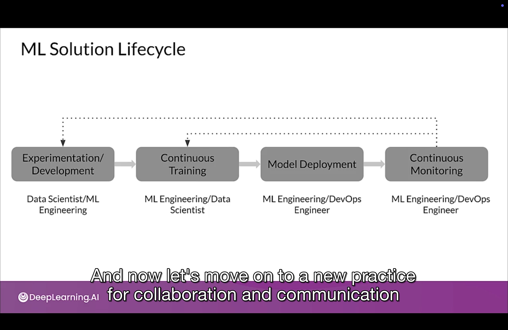

28. MLOps provides capabilities that will help you build, deploy and manage machine learning models that are critical for ensuring the integrity of business processes. It also provides a consistent and reliable means to move models from development to production by managing the ML lifecycle. Models generally need to iterated and versioned. To deal with an emerging set of requirements, the models change based on further training or real world data that's closer to the current reality. MLOps also includes creating versions of models as needed and maintaining model version history. And as the real world and its data continuously change, it's critical that you manage model decay. With MLOps, you can ensure that by monitoring and managing the model results continuously, you can make sure that accuracy, performance and other objectives and key requirements are acceptable. 

ML platforms also generally provide capabilities to audit compliance, access control, governance testing and validation and change and access logs. The logged information can include details related to access control like who is publishing models, why modifications are done and when models were deployed or used in production. You also need to secure your models from attacks and unauthorized access or corrupted by infected data.       

Once you have made sure that your models are secure, trustable and good to go, it's often a good practice to establish a platform where they can be easily discovered by your team. MLOps can do that by providing model catalogs for models produced as well as searchable model marketplace.

29. Fundamentally, the level of automation of the data, modeling, deployments and maintenance systems determines the maturity of the MLOps process. With increased maturity, the available velocity for the training and deployment of new models is also increased. The objective of an MLOps team is to automate the training and deployment of ML models into the core software system and provide the robust and comprehensive monitoring. Ideally, this means automating the complete ML workflow with as little manual intervention as possible.

Triggers for automated model training and deployment can be calendar events, messaging or monitoring events, as well as changes in the data, model training code and application code or detected model decay. Many data scientists and mL engineers build state-of-the-art models but their process for building and deploying ML models is entirely manual. This is considered the basic level of maturity or Level 0. 

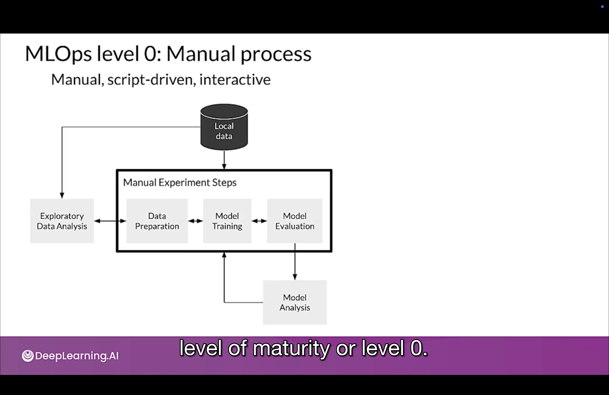

This is generally script or notebook driven for most part and every training step is manual including data analysis, data preparation, model training and validation. It requires manual execution of each step and manual transition from one step to another. 
This process is usually driven by experimental code that is written and executed in notebooks by data scientists interactively until a workable model is produced. This creates a disconnect between the ML and operations teams. 

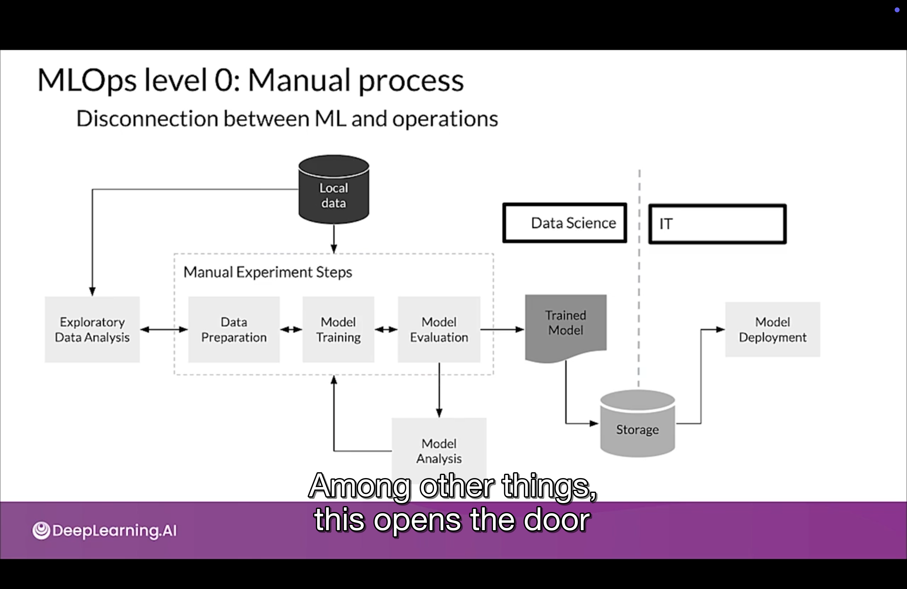

Among other things, it opens the door for potential training serving skew. To understand it better, let's assume data scientists hand over a trained model to the engineering team to deploy it on their infrastructure per serving or batch prediction. This form of manual handoff could include putting the trained model in a file system somewhere, checking the model object into a cache repository, or uploading it to a model registry. Then engineers, who deploy the model need to make the required input features available in production, potentially for low latency serving, which can lead to training serving skew. A level 0 process assumes that your data science team manages a few models that don't change frequently because of either changes in model implementation or retraining the model with new data, or both. A new model version is probably only deployed a couple of times a year. 

So, because of fewer code changes, continuous integration or CI and often even until unit testing is totally ignored. The scripts and notebooks that implement the experiment steps are often source controlled and they produce artifacts such as trained models, evaluation metrics and visualizations. Also, because there are not many model versions that need to be deployed, continuous deployment or CDs is not even considered. A level 0 process is concerned only with deploying the trained model as a prediction service. For example, a microservice with REST API, rather than deploying the entire ML system. Here you don't track or log the model predictions and actions which are required in order to detect model performance degradation and other model behavioral drifts.

MLOps level 0 is common in many businesses that are beginning to apply ML to their use cases. This manual data science driven process might be sufficient when models are rarely changed or retrained. In practice, models often break when they are deployed in real world. Models fail to adopt to changes in the dynamics of the environment or changes in the data that describes the environment. To address these challenges and to maintain your model's accuracy and prediction, you need first of all, to address the lack of active performance monitoring. In Active monitoring, your model lets you detect performance degradation and model decay. It acts as a cue that it's time for new experimentation and retraining of the model on new data. Then there's a problem of continuously adapting your model to latest trends. To overcome this, you need to retrain your production models often with the most recent data to capture the evolving and emerging patterns. For example, if your app recommends fashion products using ML, its recommendation should adapt to the latest trends and products. That requires new data and label it somehow. And, at level 0, those are usually manual processes.   

30. MLOps Level 1 and 2:

It introduces pipeline automation. One of the key goals of Level 1 is to perform continuous training of the model by automating the training pipeline. This lets you achieve the continuous delivery of the trained model to your model prediction service. 

To automate the process of using new data to retrain models in production, you need to introduce automated data and model validation steps to the pipeline, as well as pipeline triggers metadata management. There is a need to have repeatable training in your ML workflows. So, let's look at the some of the characteristics of pipeline automation.

Notice here that since the steps of the experimentation are orchestrated, the transition between steps is automated. That enables you to rapidly iterate on your experiments and makes it easier to move the whole pipeline to production. 

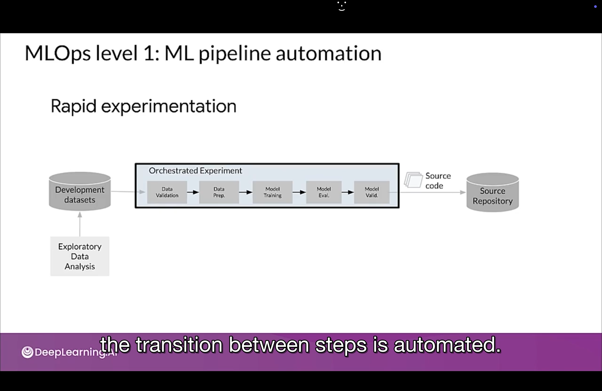

Now, let's expand this out a quite a bit to include the different environments: Dev, test, staging, pre-production, and production. 

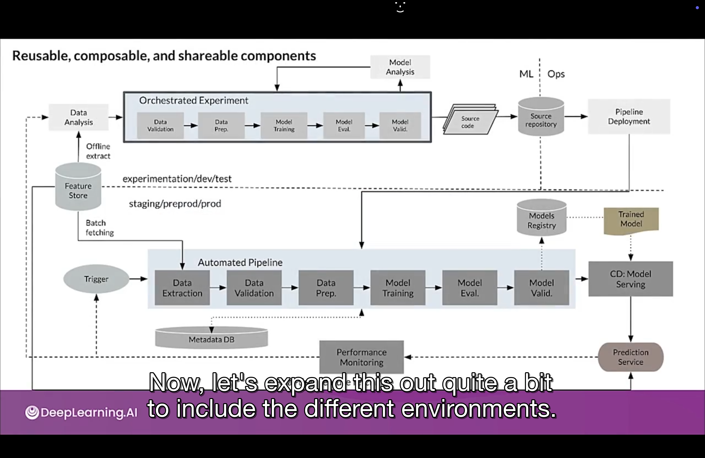

Note that architecture shown here is typical but different teams will implement this differently depending on their needs and infrastructure choices. In this architecture, models are automatically retrained using fresh data based on live pipeline triggers. The pipeline implementation that is used in the development or experimentation environment is also used in the pre-production and production environments which is a key aspect of MLOps practice for unifying the DevOps effort. To construct ML pipelines components need to be reusable, composable and potentially shareable across pipelines. Therefore, while exploratory data analysis code can still live in notebooks, the source code for components must be modularized. In addition, components should ideally be containerized. You do this in order to decouple the execution environment from the custom code runtime. It's also done to make code reproducible between development and production environments. This essentially isolates each component in the pipeline, making them their own version of runtime environment, and have different languages and libraries. Note if exploratory data analysis is done using production components and a production style pipeline, it greatly simplifies the transition of that code to production. 

An ML pipeline in production continuously delivers new models that are trained on new data to prediction services. Note that when I say continuously, I mean in an automated process, in which new models might be delivered on a schedule or based on a trigger. The model deployment step is automated, which delivers the trained and validated model for use by a prediction service for online or batch predictions. In level 0, you simple deployed the trained model to production. But here, you deploy a whole training pipeline, which automatically and recurrently runs to serve the train model as a prediction service. When you deploy your pipeline to production, one or more of the triggers automatically executes the pipeline. The pipeline expects new live data to produce a new model version that is trained on the new data. So, automated data validation and model validation steps are required in the production pipeline. 

First, let's talk about why data validation is necessary before model training to decide whether you should retrain the model or stop the execution of the pipeline. This decision is automatically made only if the data is deemed valid. For example, data schema skews are considered anomalies in the input data which means that the downstream pipeline steps including data processing and model training, receives data that does not comply with the expected schema. In this case, you should stop the pipeline and raise a notification so that the team can investigate. The team might release a fix or an update to the pipeline to handle these things in the schema. Schema skews include receiving unexpected features, not receiving all the expected features, or receiving features with unexpected values. Then there are data value skews which are significant changes in the statistical properties of the data and you need to trigger retraining of the model to capture these changes. Model validation is another step which runs after you successfully train the model given the new data. Here, you evaluate and validate the model before it's promoted to production. This offline model validation step may involve first producing evaluation metric values, using the train model on a test dataset to assess the model's predictive quality. Then, the next step would be to compare the evaluation metric values produced by your newly trained model to the current model. For example, the current production model or a baseline model or any other model which meets your business requirements. Here, you make sure that the new model performs better than the current model before promoting it to production. Also, you ensure that the performance of the model is consistent on various segments or slices of the data. 

Your newly trained customer churn model might produce an overall better predictive accuracy compared to the previous model, but the accuracy values per customer region might have a large variance. Finally, infrastructure compatibility and consistency with the prediction service API, are some other factors that you need to consider before finally deploying your models. In other words, will the new model actually run on the current infrastructure ? In addition to offline model validation, a newly deployed model undergoes online model validation in either a canary deployment or an AB testing setup during the transition to serving prediction for online traffic. 

An optional additional component for Level 1 MLOps is a feature store. A feature store is a centralized repository where you standardize the definition, storage and access of features for training and serving. Ideally a feature store will provide an API for high throughput batch serving and low latency, real time serving for the feature values and support both training and serving workloads. A feature store helps you in many ways. First of all, it lets you discover and reuse available feature sets instead of recreating the same or similar feature sets, avoiding having similar features that have different definitions by maintaining features and their related metadata. 

Moreover, you can potentially serve up-to-date feature values from the feature store and avoid training serving skew by using the feature store as a source for experimentation, continuous training, and online serving. This approach makes sure that the feature used for training are the same ones used during serving. For example, when it comes to experimentation, data scientists can get an offline extract from feature store to run their experiments. For continuous training, the automated training pipeline can fetch a batch of up-to-date feature values of the dataset. For online prediction, the prediction service can fetch feature values such as customer demographic features, product features and current session aggregation features.

Another key component is the metadata store where information about each execution of the pipeline is recorded in order to help with data and artifact lineage, reproducibility and comparisons. It also helps you to debug errors and anomalies. Each time you execute the pipeline, the metadata store tracks information such as pipeline and component versions which were executed, the start and end time and date and how long the pipeline took to complete each of the steps, and the input and output artifacts from each step and more. Basically what it means is that you could rely on pointers to the artifacts produced by each step of the pipeline, like the location of the prepared data or the validation anomalies, computed statistics, etc. to seamlessly resume execution in case of an interruption. So, tracking these intermediate outputs, helps you resume the pipeline from the most recent step if the pipeline stopped due to a failed step without having to restart the pipeline as a whole. 

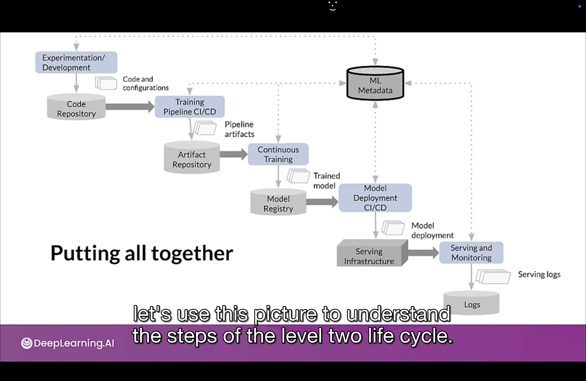

This picture is used to understand the steps of the level 2 life cycle.

First, you have experimentation and development. This is where you iteratively try out new algorithms and new modelling and the experiment steps are orchestrated. The output of this stage is the source code of the ML pipeline steps that are then push to a source repository. Next, comes the CI/CD stage for the training of the pipeline itself or for the training pipeline itself, rather. Here, you build the source code and run various tests. The outputs of this stage, our pipeline entitles like software packages, executables and artifacts to be deployed in the later stage. The output of this stage is the deployed pipeline with a new implementation of the model. Then you train your models. Here, the pipeline is automatically executed in production based on a schedule or in response to a trigger. The output of this stage is a trained model and then that is pushed to the model registry. Once the model has been trained, the goal of the pipeline is now to deploy the model using continuous delivery. You do this by serving the train model as the prediction service for predictions. The output of this stage is a deployed model prediction service. Finally once all of your models have been trained and reployed is the role of monitoring service to collect statistics on the model performance based on live data. The output of this stage is the data collected in logs from the operation of the serving infrastructure, including the prediction request data which will be used to form the new dataset and retrain your model.

31. One of the key parts of an MLOps infrastructure is the training pipeline. Let's look at developing training pipelines using TFX, including ways to adapt your pipelines to meet your needs with custom components. 

TFX is an open source framework that you can use to create ML pipelines. TFX enables you to implement your model training workflow in a variety of execution environments, including containerized environments like kubernetes. TFX pipelines organize your workflow into a series of components where each component performs a step in your ML workflow. 

TFX standard components provide proven functionality to help you get started building in ML workflow easily. You can also include custom components in your workflow, including creating components which run in containers and can use any language or library that you can run in container such as performing data analysis using R. Custom components let you extend your ML workflow by creating components that are tailored to meet your needs such as data augmentation, upsampling or downsampling, anomaly detection based on confidence intervals or autoencoders reproduction error or interfacing with external systems such as help desks for alerting, monitoring and much more etc.

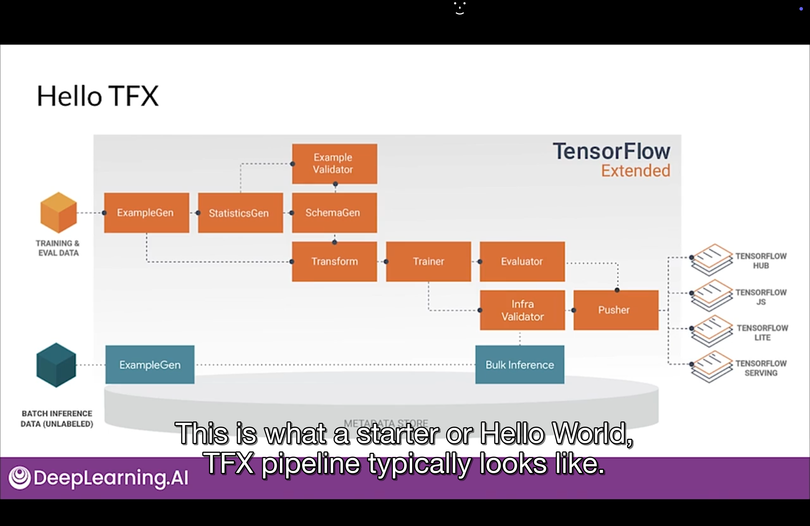

This is what a starter or hello world and TFX pipeline typically look like this.

The things in orange and green are components here. In this case, these are standard components which come with the TFX out of the box but they could just as easily be custom components that you created. The components in orange are a training pipeline and the ones in green are an inference pipeline for doing batch inference. So, by mixing standard components and custom components you can build an ML workflow that meets your needs while taking advantage of the best practices built into the TFX standard components. Now, let's take a look at how TFX components are put together. They are essentially composed of a component specification and executor class which are packaged in a component class. The specification here defines the components, input and output contract. This contract specifies the components, input and output artifacts and the parameters that are used for the component execution.

A component executor class provides the implementation for the work performed by the component. It's the main code for a component. Finally, we have a component class which combines the component specification with the executor for use as a component in a TFX pipeline.

Note that this is the implementation style used by TFX standard components and full custom style components but there are also two other styles of components for creating custom components which I will discuss next.

When a pipeline runs a TFX component, the component is executed in 3 phases.

First, the driver uses the component specification to retrieve the required artifacts from the metadata store and pass them into the component. Next, the executor performs the components work. Finally, the publisher uses the component specification and the results from the executor to store the component's output in the metadata store.

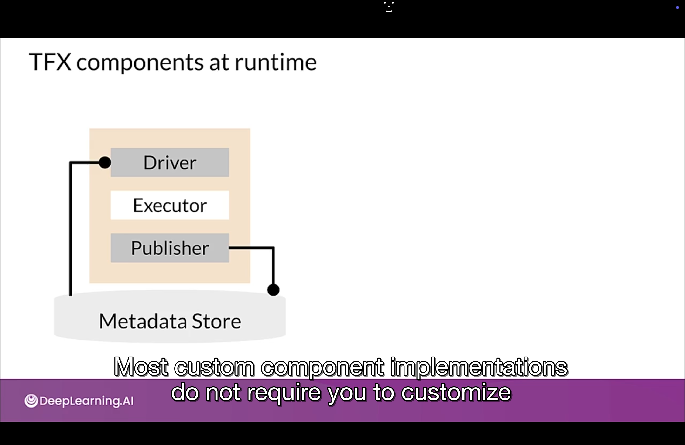

Most custom component implementations do not require you to customize the driver with the publisher. Typically modification to the driver and publisher should only be necessary if you want to change the interaction between your pipeline components and the metadata store. 

If you only want to change the inputs, outputs or parameters for your component, you only need to modify the component specification.

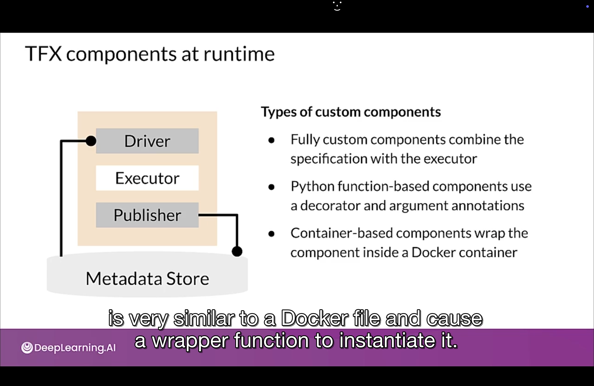

There are 3 types of custom components:

- Python function based custom components
- Container based custom components
- Fully custom components

Fully custom components which were discussed in the previous slides, lets you build components by defining the component specification, executer and component interface classes. This approach lets you reuse and extend a standard component to meet your needs. 

A python function based component, those are the easiest to build and they're easier than container based components or fully custom components. They only require Python function for the executor with a decorator and annotations.

On the other hand, container based components provide the flexibility to integrate code written in any language into your pipeline, assuming that you can execute that code in a docker container. To create a container based component, you create a component definition that is very similar to a Docker file and cause a wrapper function to instantiate it. 

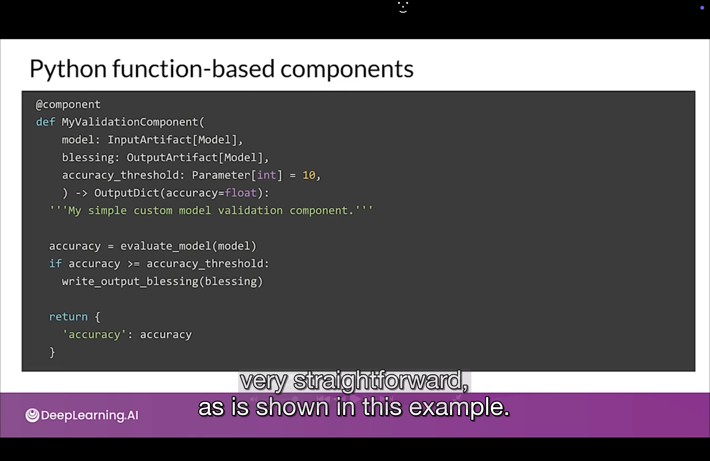

The Python function-based components style makes it easy for you to create TFX custom components by saving you the effort of defining component specification class, executive class and component interface class.

In this style you write a function that is decorated and annotated with type hints. The type hints describe the InputArtifacts, OutputArtifacts and parameters of your component. Writing a custom component for simple model validation in this style is very straightforward, as is shown in this example. The component specification is defined in the Python functions, arguments using type annotations that describe if an argument is an InputArtifact, OutputArtifact or a Parameter.

The function body defines the components executor. The component interfaces defined by add the component decorator to your function. By decorating your function with the component decorator and defining the function arguments we type annotations, you could create a component without the complexity of building a component specification and executor and a component interface. 

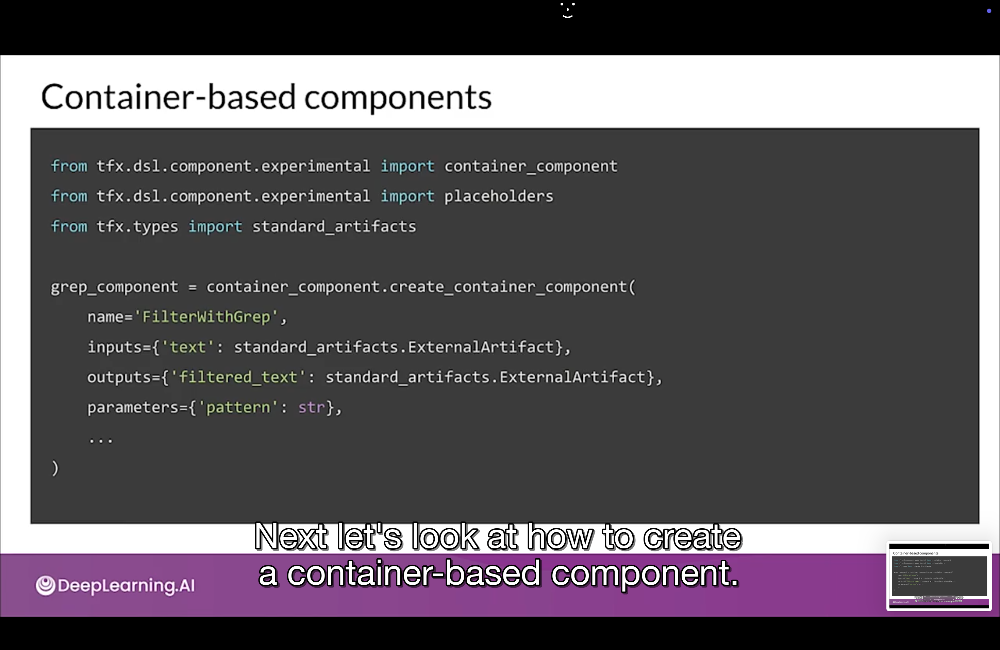

Container-based components are backed by containerized command line arguments or programs rather. And in some ways are similar to creating a Docker file. To create one, you need to specify a Docker container image that includes your components dependencies. Then you call the create container component function and pass the component definition, including the components, inputs, outputs and parameters.

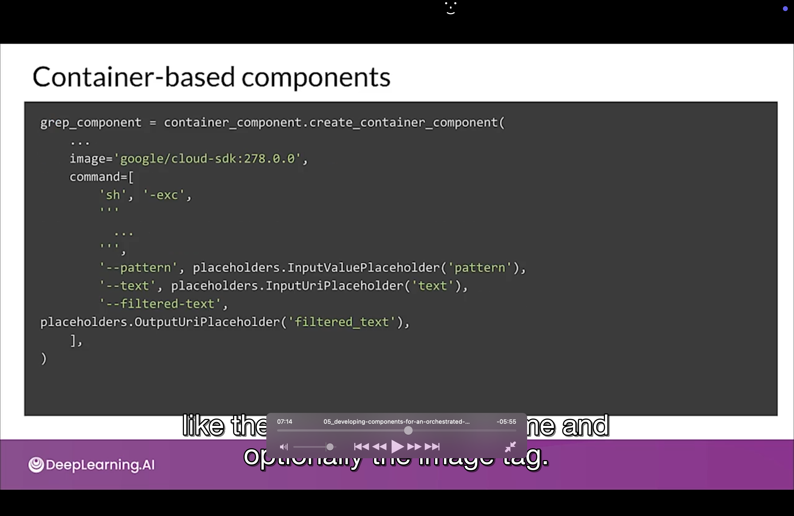

There are other parts of the configuration, like the container image name and optionally the image tag. Finally, for the body of the component, you have the command parameter which defines the container entry point command line. As with docker files this isn't executed within a shell unless you specify that in your command line. The command line can use placeholder objects that are replaced at compilation time with the input, output or parameters.

The placeholder objects can be imported from tfx.dsl.component.experimental.placeholders. And in this example the component code uses GacUtil to upload the data to Google Cloud storage so the container image needs to have GacUtil installed as and configured that's a dependency here. This approach is more complex than building a python function-based component, since it requires packaging your code as a container image. This approach is the most suitable for including non-python code in your pipeline or for building Python components with complex runtime environments or dependencies.

Returning to fully custom components this style lets you build components by directly defining the component specification, executor class and component class.

This approach also lets you reuse and extend a standard component or other pre existing component to meet your needs. For example, if an existing component, which could be a custom component is defined with the same inputs and outputs as the custom component that you're developing, you can simply override the executor class of the existing component. This means that you can reuse a component specification and implement a new executor that derives from an existing component. In this way you can reuse functionality built into existing components and implement only the functionality that is required.

The primary use of this component style is to extend existing components. Otherwise, if you don't need a containerized component, you should probably use the Python function style instead. However, developing a good understanding of this style of the fully custom component will help you to better understand all TFX components. So let's take a closer look at how to create a fully custom component.

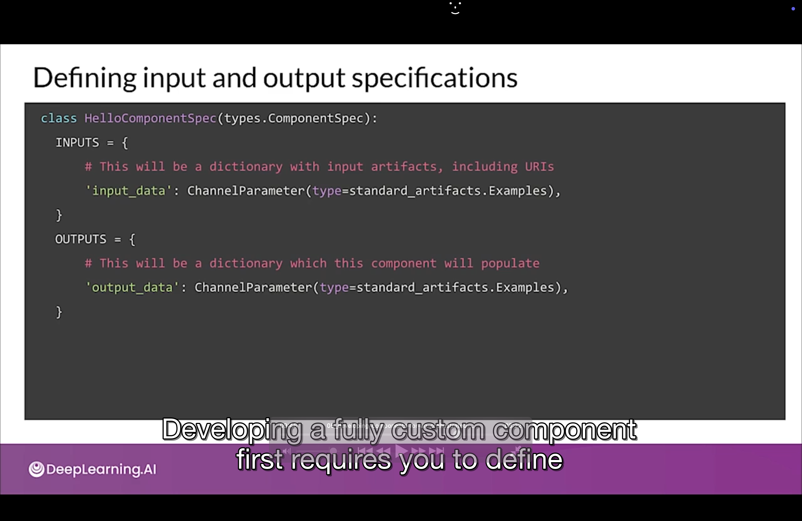

Developing a fully custom component first requires you to define a component's back which contains a set of input and output artifacts specifications for the new component.

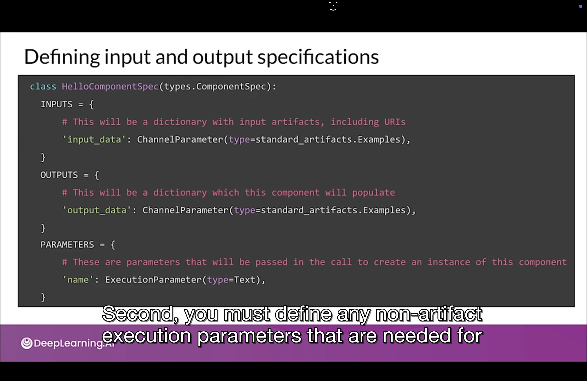

Second, you must define any non-artifact execution parameters that are needed for the new component. So there are three main parts of the component specification the inputs, outputs and parameters. Inputs and outputs are wrapped in channels essentially dictionaries of typed parameters for the input and output artifacts. The parameters is a dictionary of additional execution parameter items which are passed into the executor and are not metadata artifacts.

Next, well you need to create an executor class basically this is a subclass of base_executor.BaseExecutor with its do function overridden. In the do function, the arguments input_dict, output_dict and exact properties are passed in and those map to the inputs outputs and parameters that are defined in the components back for exact properties. The values can be fetched directly through a dictionary look up. 

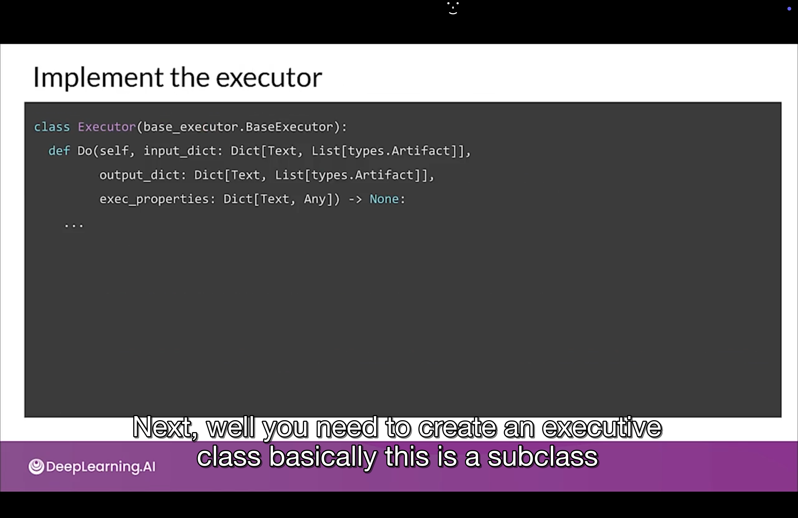

Continuing with implementing the executor for artifacts in the input_dict and output_dict, there are convenient functions available in the artifact utilities class of TFX that can be used to fetch and artifacts instance or it's URI.

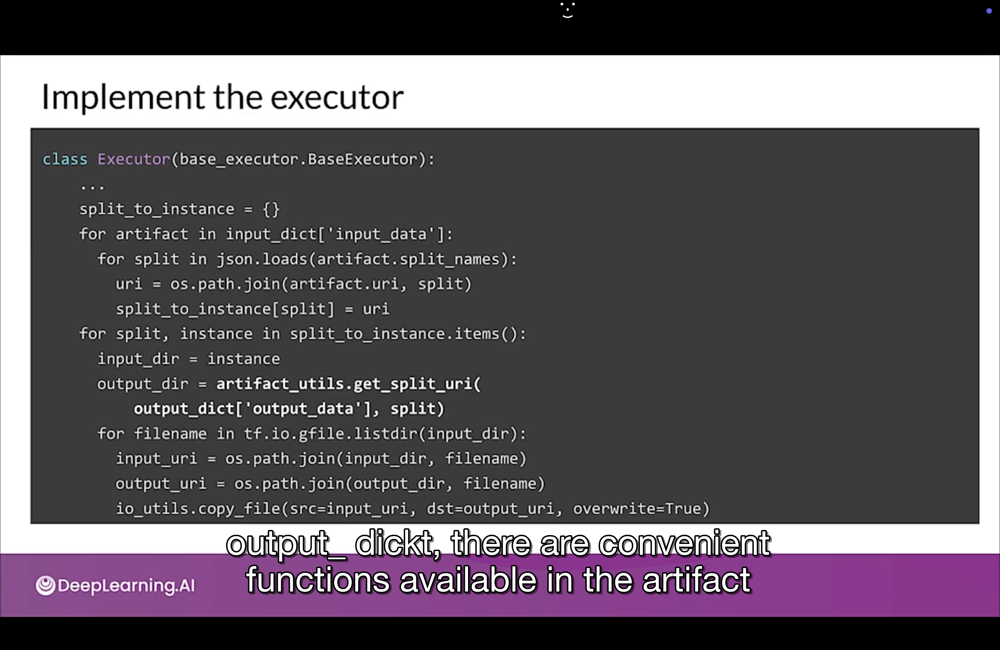

Now that the most complex part is complete the next step is to assemble these pieces into a component class to enable the component to be used in a pipeline. There are several steps. 

First you need to make the component class a subclass of base_component.BaseComponent or a different component if you're extending an existing component. And next you assign class variables, SPEC_CLASS and executor spec with a component spec and executor classes respectively, that you just defined. 

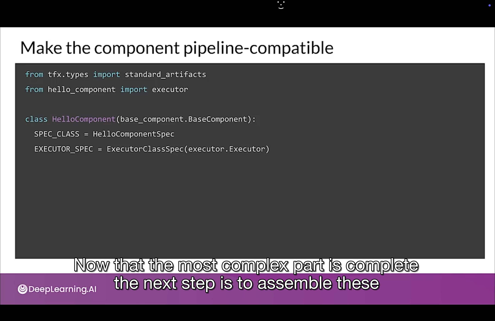

The final step to completing the custom component is to finish implementing the init, which will initialize the component.

Here you define the constructor function by using the arguments to the function to construct an instance of the component spec class and invoke the super function with that value along with an optional name. When an instance of the components created type checking logic in the base_component.BaseComponent class will be invoked to ensure that the arguments which were passed in are compatible with the types to find in the component spec class. 

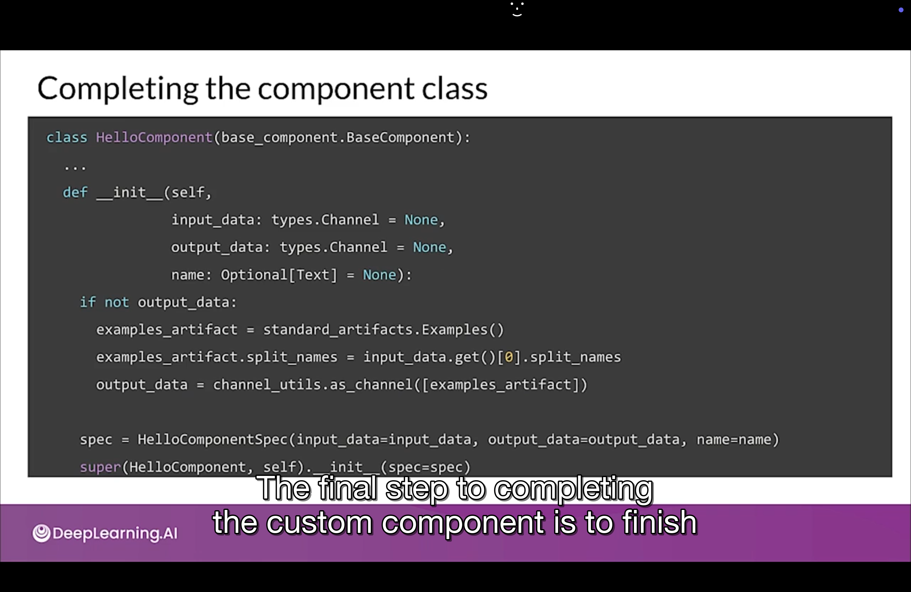
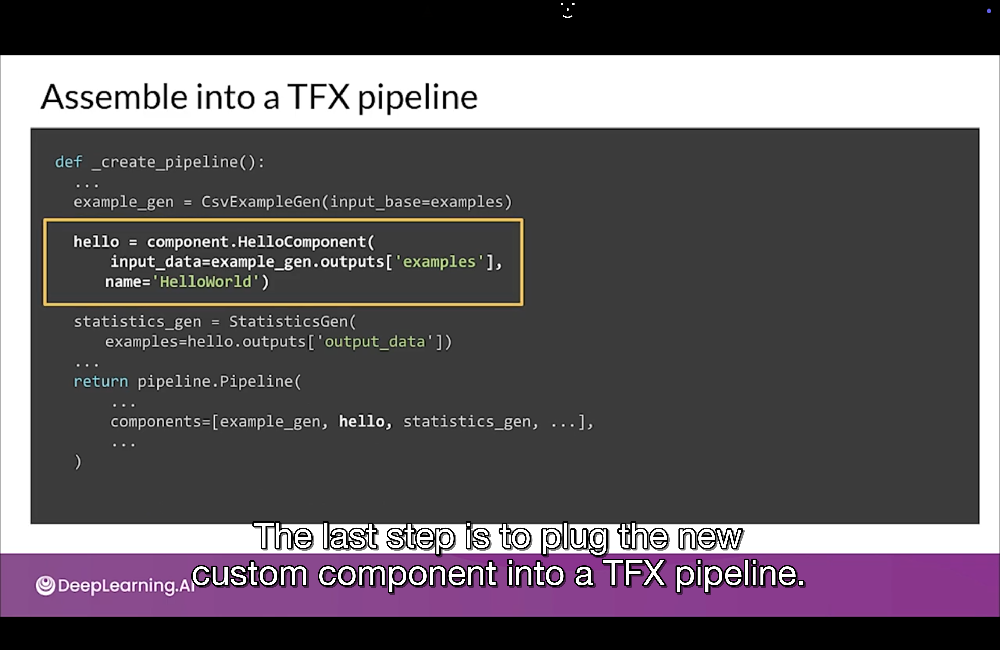
The last step is to plug the new custom component into a TFX pipeline.

Besides adding an instance of the new component, you need to wire the upstream and downstream components to it. You can generally do this by referencing the outputs of the upstream components in the new component and referencing the outputs of the new component in the downstream components. Also another thing to keep in mind is that you need to add the new component instance to the components list when constructing the pipeline.

32. Managing Model Versions:

Let's look now at why version control is so important and some of the challenges of versioning models. In normal software development, especially with teams, organizations rely on version control software to help teams manage and control changes to their code. But imagine if you didn't have that.

How would you enable multiple developers to stay in sync? How do you roll back when there are problems? How would you do continuous integration? Well, just like with software development, when you're developing models, you have all of these needs and more.

Generating models is an iterative process. During development, you typically generates several models and compare one against the other to evaluate the performance of each model. Each model version may have different code, data, and configuration. You need to keep track of all of this to properly reproduce results.

This is where model versioning is important. Versioning will improve collaboration at different levels, from individual developers, to Teams, all the way up to organizations. How should you version your models? First, let's think about how you version software.

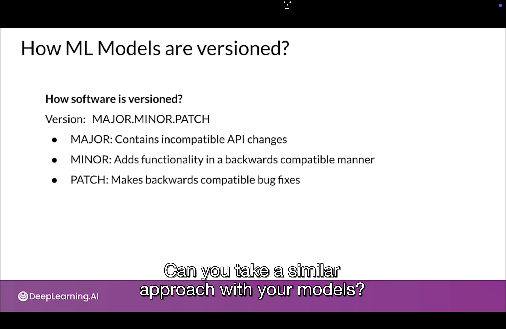

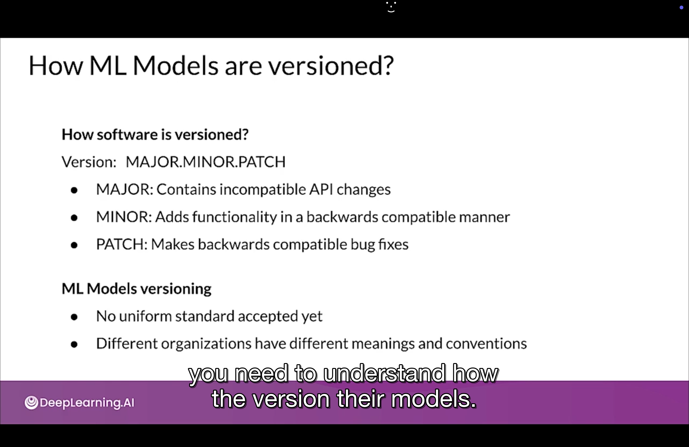

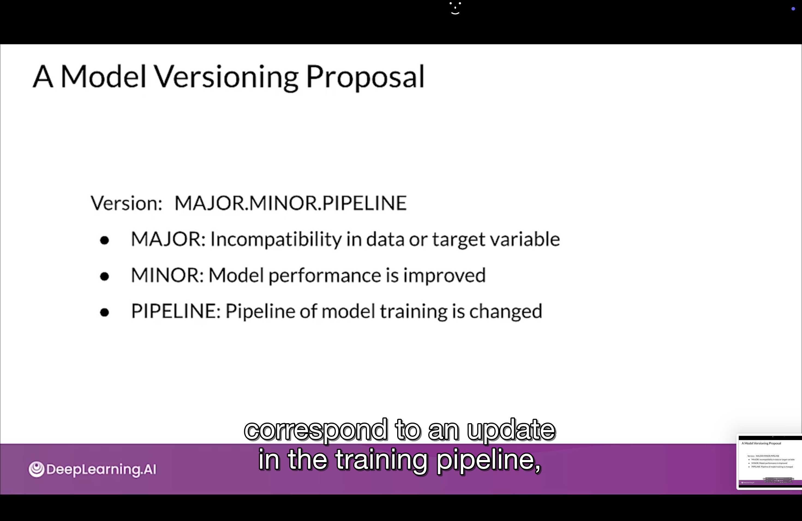

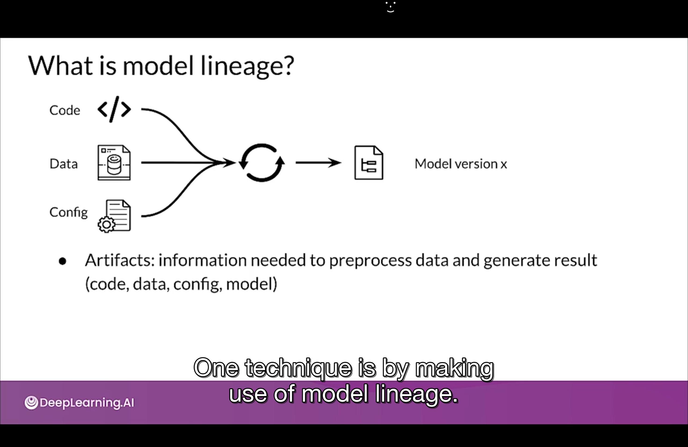

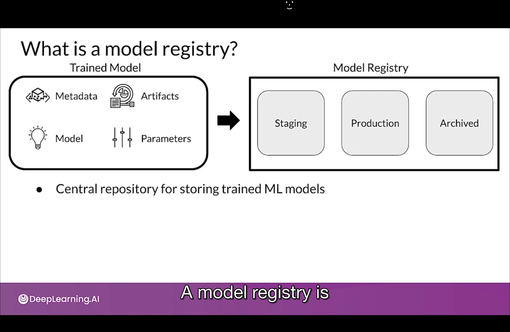

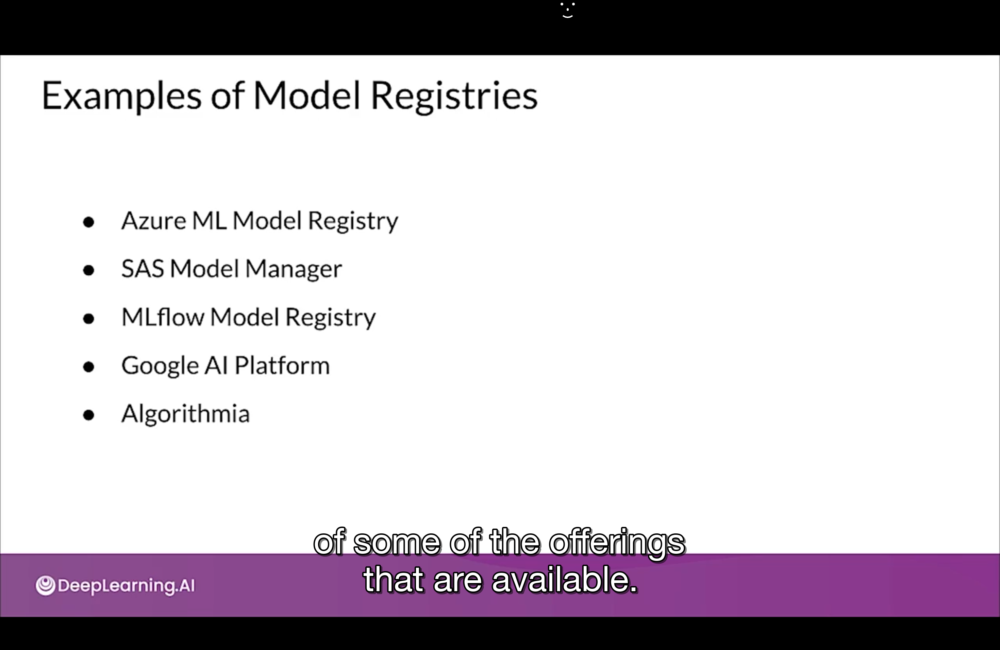

In most cases, you version software with a combination of three numbers. These numbers are the major version, the minor version, and a patch number of the release. The major version usually increases when you make incompatible API changes. The minor version number is increased when you add functionality in a backwards compatible way and the patch number is increased when you make backward-compatible bug fixes.

Can you take a similar approach with your models? As of now, there's no uniform standard which is widely accepted across the industry diversion models.

Different companies have adopted their own conventions for versioning. As a developer in their organization, you need to understand how the version their models. Here's one possible approach that I'd like to propose, which is simple to understand and is in line with normal software versioning.

Let's use a combination of three numbers and to note these as major, minor, and pipeline versions. Does this sound familiar? The major version will increment when you have an incompatible data change, such as a schema change or target variable change that can render the modeling compatible with it's prior versions when it's used for predictions. The minor version will increment when you believe that you've improved or enhanced the model's output.

Finally, the pipeline version will correspond to an update in the training pipeline, but it need not improve or even change the model itself. Other versioning styles include arbitrary grouping, black-box functional models, and pipeline execution versioning, but will not discuss them here. Rather, I'd like to focus on how to retrieve older models, leverage model lineage, and use model registries to simplify production workflow.

One way to test a versioning style is to ask, can you leverage a model's frameworks capability to retrieve previously trained models? You may have an intuition that for an ML framework to retrieve older models, the framework has to be internally versioning the models through some versioning technique. Different ML frameworks may use different techniques to retrieve previously trained models. One technique is by making use of model lineage.

Model lineage is a set of relationships among the artifacts that resulted in the trained model. To build model artifacts, you have to be able to track the code that builds them and the data, including pre-processing operations that the model was trained and tested with. ML orchestration frameworks like TFX will store this model lineage for many reasons including recreating different versions of the model when necessary. Note that model lineage usually only includes those artifacts and operations that were part of model training.

Post-training artifacts and operations are usually not part of the lineage. Now let's take a look at model registries.

A model registry is a central repository for storing trained models. Model registries provide an API for managing train models throughout the model development lifecycle. Model registries are essential in supporting model discovery, model understanding, and model reuse, including in large-scale environments with hundreds or thousands of models. As a result, model registries have become an integral part of many open source and commercial ML platforms.

Next, let's look at the metadata which is stored in most of the open-source and commercial model registries. Metadata usually includes the different model versions available. Some model registries provides storage for serialized model artifacts. In order to improve the model discoverability within the model registry, it's important to store some free text annotations and other structured or searchable properties of the models.

In order to promote the model lineage, registry sometimes include links to other MO artifact and metadata stores. Model registries are really very useful things to have. Model registries promote model search and discoverability within your organization and that can help improve the understanding of the model among your team.

Model registries can help enforce a set of approval guidelines which need to be followed when uploading models, which can help improve governance. By sharing models with your team, you're improving the chances of collaboration among your co-workers. Model registries can also help streamline deployments. Model registries can even provide a platform for continuous evaluation, monitoring, and staging, and promotions.

Here's a list of some of the currently available model registries.

As you can see there are quite a few and each has somewhat different feature sets. I won't do a comparison here. This is really just to make you aware of some of the offerings that are available. For example, there's Azure ML model registry, SAS Model Manager, MLflow Model Registry, the Google AI platform, and Algorithmia.

33. ROBUST DEPLOYMENT USING CONTINUOUS DELIVERY
=======================================================

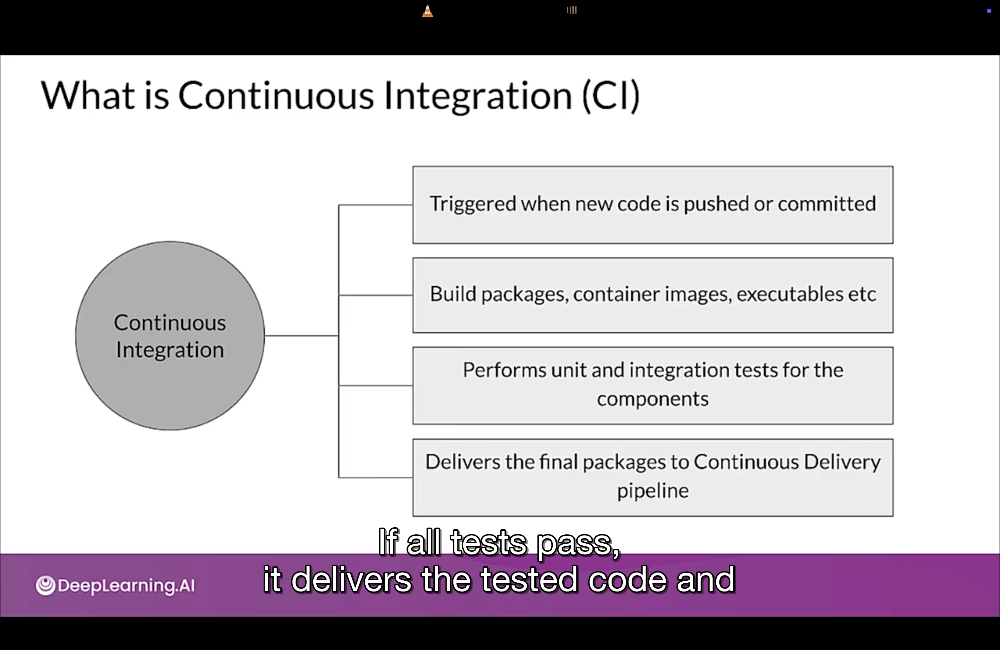

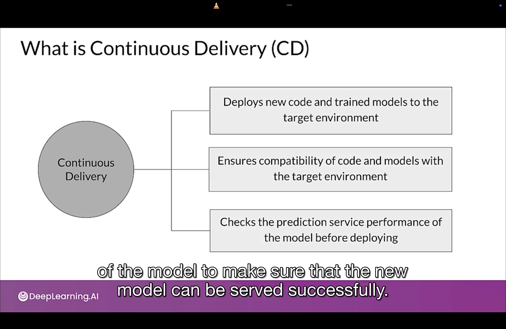

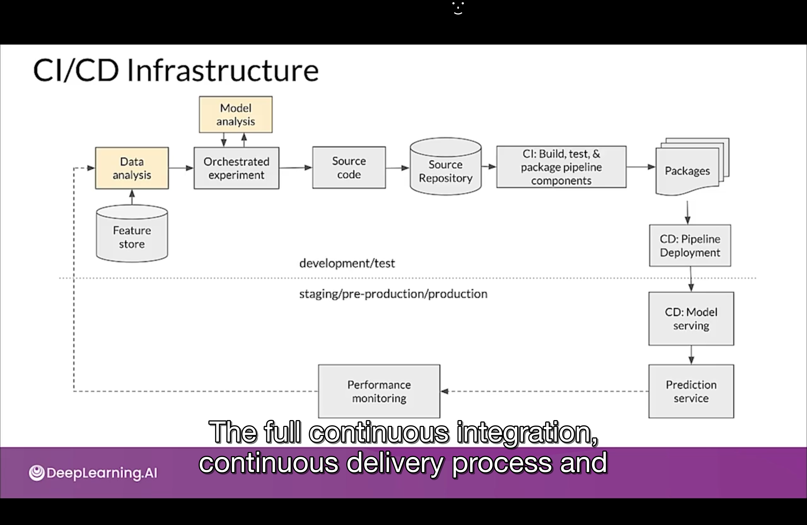

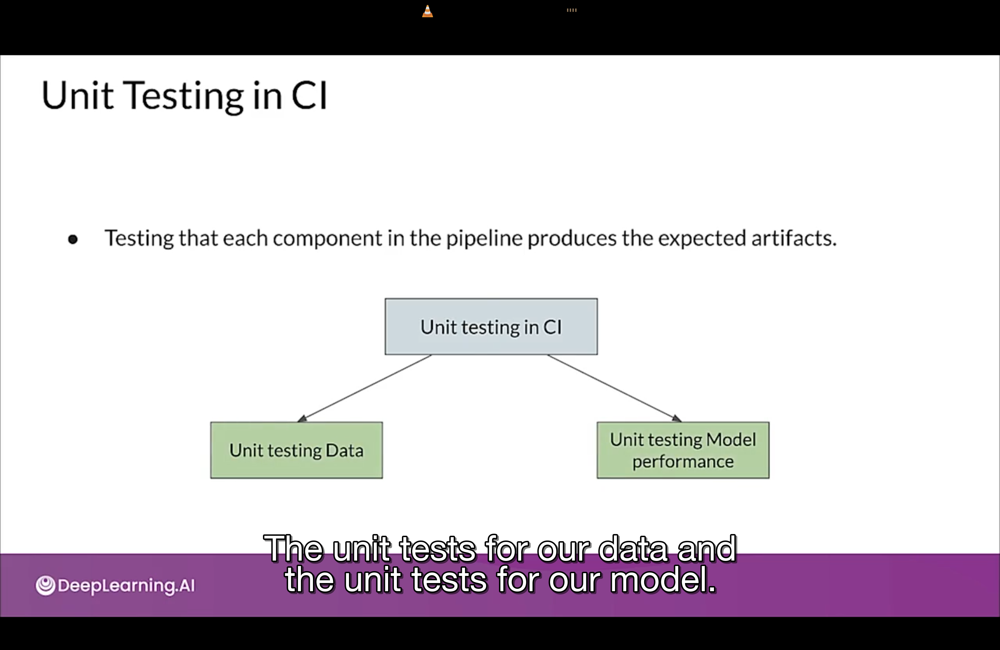

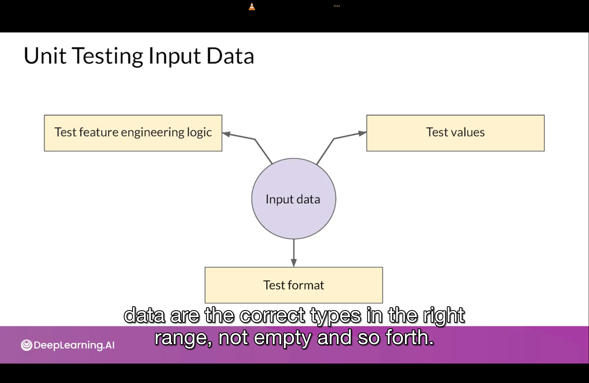

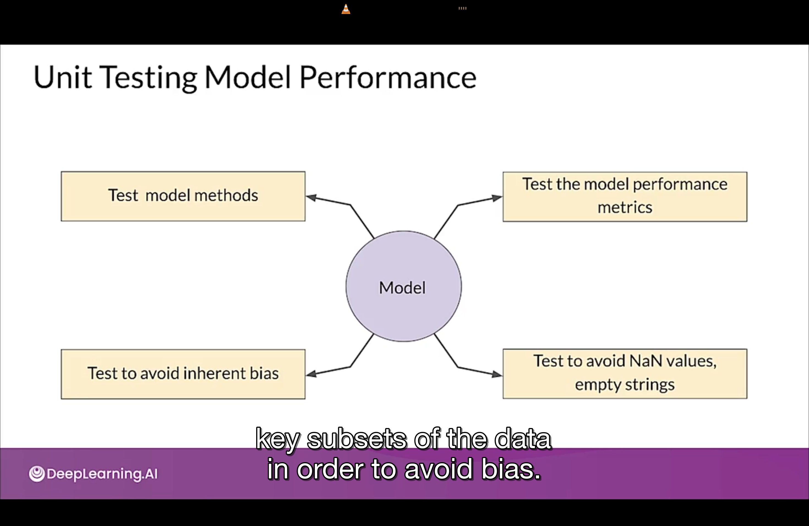

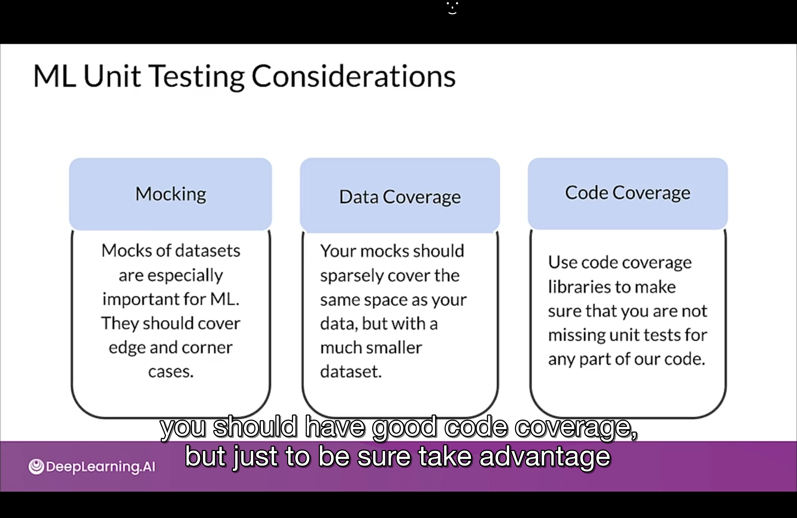

In more mature MLOPs processes and where more than a few models need to be managed. It's important to implement a robust deployment process. This is especially true when model predictions are served online as part of a user facing application. Let's discuss robust deployment using continuous delivery now.

First, before deploying you need to make sure that your code works which you should determine through comprehensive unit testing. This is automated with continuous integration or CI. CI triggers whenever new code is committed or pushed to your source code repository. It mainly performs building, packaging and testing for the components.

The quality of the testing will be determined by the coverage and quality of your unit test suite. If all tests pass, it delivers the tested code and packages to a continuous delivery pipeline. Next, continuous delivery or CD deploys new code and trained models to the target environment. It also ensures compatibility of code and models with the target environment.

And for an ML deployment it should check the prediction service performance of the model to make sure that the new model can be served successfully. The full continuous integration, continuous delivery process and infrastructure is referred to as CI/CD. It includes two different forms of data analysis and model analysis. During experimentation data analysis and model analysis are usually manual processes which are performed by data scientists.

Once a model and code have been promoted to a production training pipeline data and model analysis should be performed automatically. As part of the promotion of the code to production source code is committed to a source code control and CI is initiated. CD, then deploys the production code to a production training pipeline and models are trained. Train models are then deployed to an online serving environment or batch prediction service.

During serving the performance monitoring collects the performance metrics of the model from live data. Let's look at the two main tests that are performed during continuous integration.

Unit testing and integration testing. In unit testing you test each component to make sure that they're producing correct outputs. In addition, to unit testing our code, which follows the standard practice for software development. There are two additional types of unit tests when doing CI for machine learning.

The unit tests for our data and the unit tests for our model. Unit testing for data is not the same as performing data validation on your raw features. It's primarily concerned with the results of your feature engineering. You can write unit tests to check if engineered features are calculated correctly.

It includes tests to check whether they are scaled or normalized correctly. One hot vector values are correct and embedding are generated and used correctly, etc. And you will also do tests to confirm if columns and data are the correct types in the right range, not empty and so forth. Your modelling code should also be written in a modular way which allows it to be testable.

You need to write unit tests for the functions you use inside your modeling code to check if the functions return their output in the correct shape and type. Which for numerical features includes testing for NaN or not a number and for string features includes testing for empty strings and so forth. You also need to add tests to make sure that the accuracy, error rates, AUC ROC etc are above a performance baseline that you specify. Even if the trained model has acceptable accuracy you need to test it against data slices to make sure that the model is accurate for key subsets of the data in order to avoid bias.

Why you should perform standard unit testing of your code. There are some additional considerations for ML, these include the design of your mocks which is especially important for ML unit testing. They should be designed to cover your edge and corner cases which requires you to think about each of your features and your domain and identify where those edge and corner cases are. Ideally, your mock should occupy roughly the same region of your feature space as your actual data would but much more sparsely.

Of course since your mock data set should be much smaller than your actual data set in most cases. If you've created good mocks and good tests, you should have good code coverage, but just to be sure take advantage of one of the available libraries to test and track your code coverage. Infrastructure validation acts as an early warning layer before pushing a model into production to avoid issues with models that might not run or might perform badly when actually serving requests in production.

It focuses on the compatibility between the model server binary and the model which is about to be deployed. It's a good idea to include infrastructure validation in your training pipeline so that as you train models, you can avoid problems early. You can also run it as part of your CI/CD workflow, which is especially important if you didn't run it during model training. Let's take a look at an example of running infrastructure validation as part of a training pipeline.

In a TFX pipeline the infraValidator component takes the model launches a sandbox model server with the model and sees if it can successfully be loaded and optionally queried.

If the model behaves as expected, then it is referred to as blessed and considered ready to be deployed. InfraValidator focuses on the compatibility between the model server binary. For example, tensorflow serving and the model to deploy despite the name infraValidator, it is the user's responsibility to configure the environment correctly. And intraValidator only interacts with the model server in the user configured environment to see if it works as expected.

Configuring this environment correctly will ensure that your inferred validation passing or failing will be indicative of whether the model would be survivable in the production serving environment.

34. Progressive Delivery:

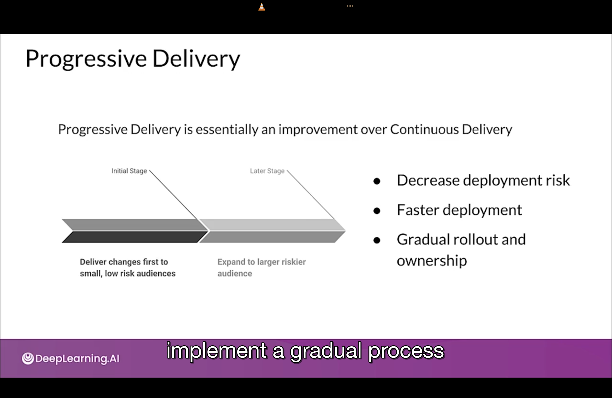

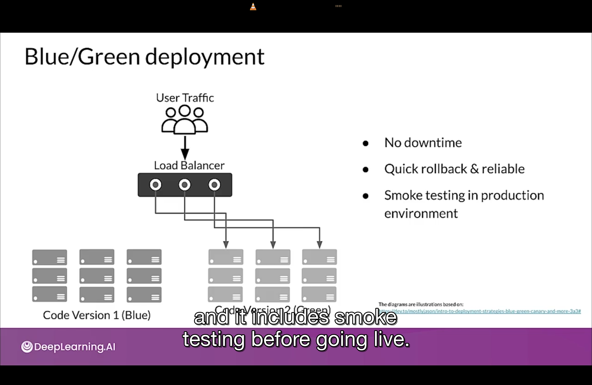

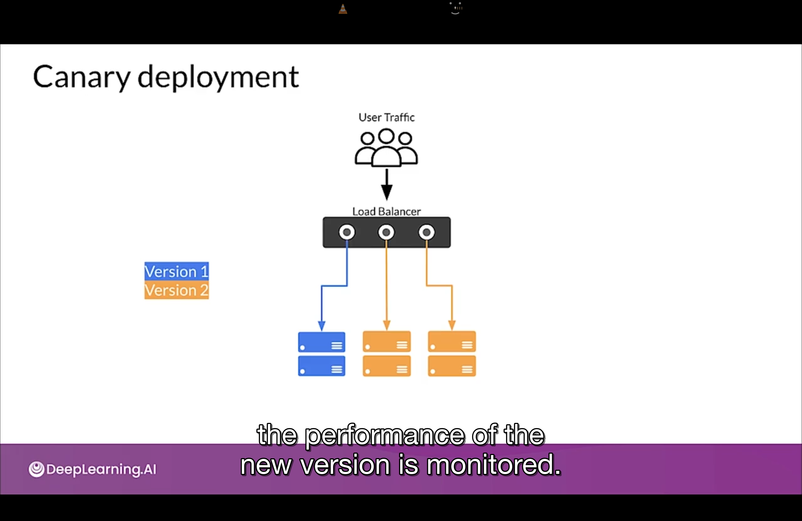

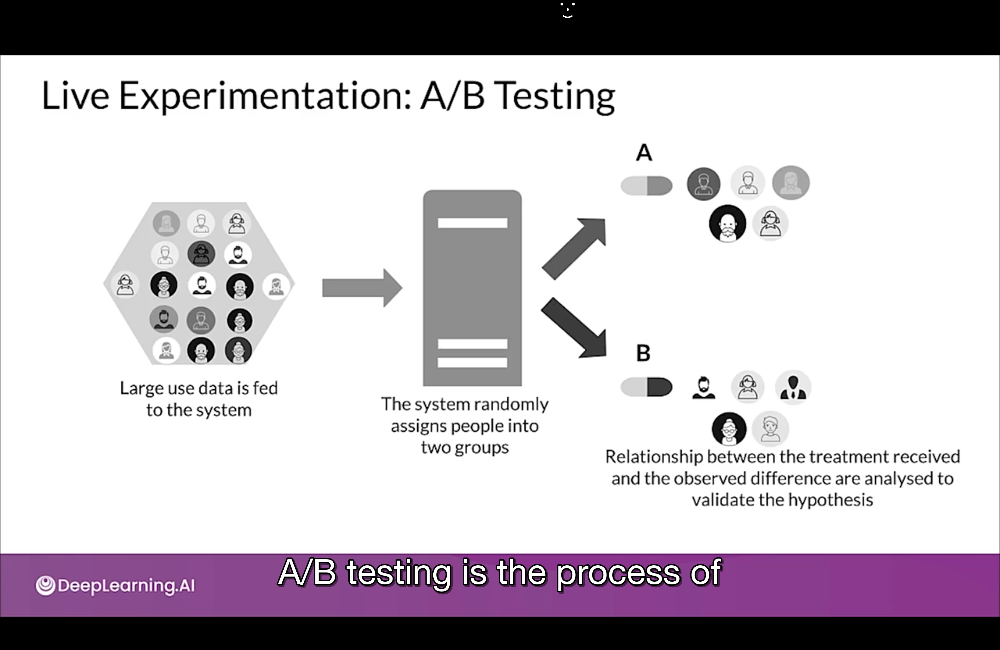

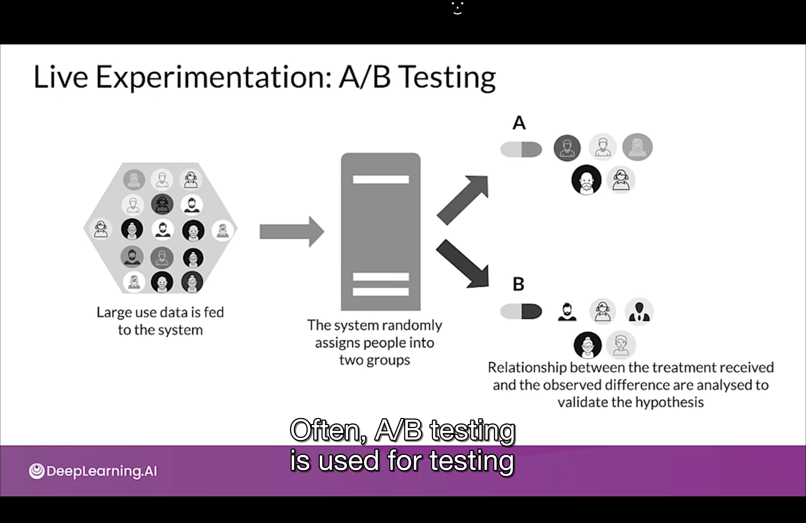

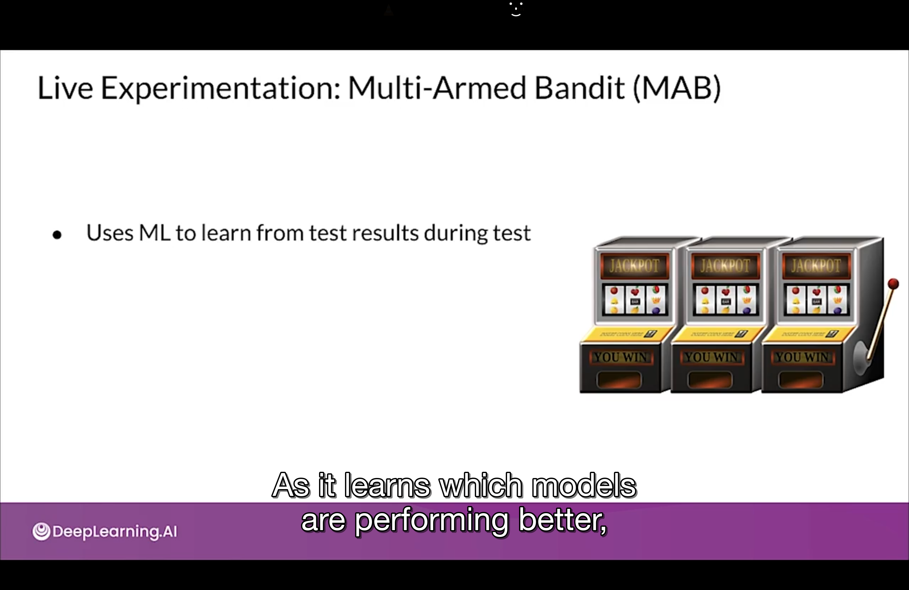

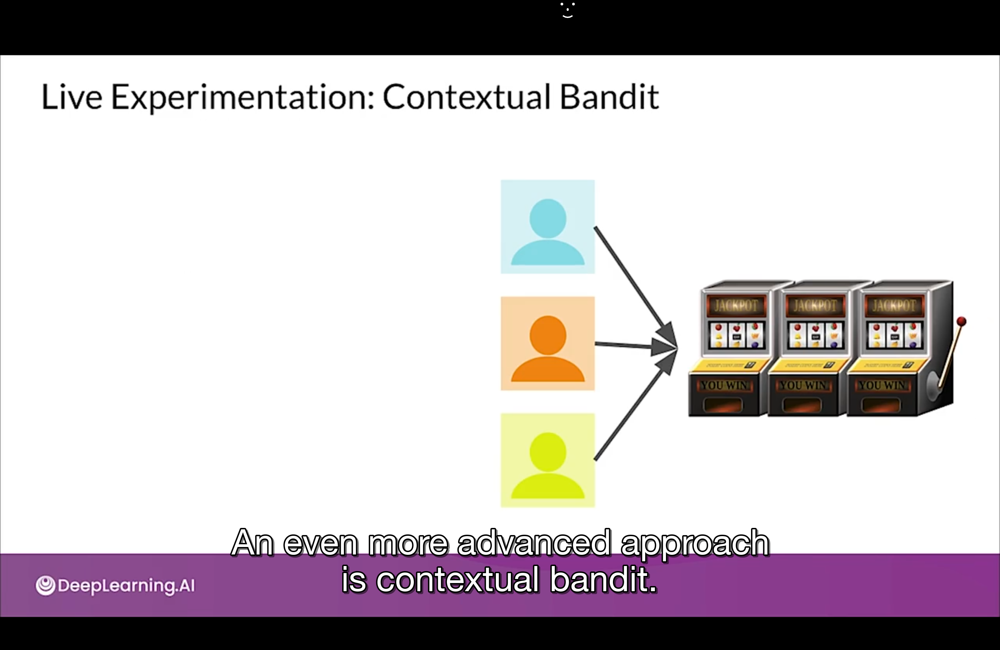

Now let's take the next step and look at an even more advanced style of deployment, progressive delivery. Progressive delivery is a software development process that is built upon the core tenets of continuous integration and continuous delivery, but is essentially an improvement over CI/CD. It includes many modern software and development processes including canary deployments, A/B testing, bandits, and observability. It focuses on gradually rolling out new features in order to limit potential negative impact and gauge user response to new product features.

The process involves delivering changes first to small, low-risk audiences, and then expanding to larger and riskier audiences thereby validating the results. The benefits of progressive delivery include, well, it offers controls and safeguards like feature flags to increase speed and decrease deployment risk. This can often lead to faster deployments and implement a gradual process for both rollout and ownership. Progressive delivery usually involves having multiple versions deployed at the same time so that comparisons in performance can be made.

This practice comes from software engineering, especially for online services. Each of the models performs the same tasks so that they can be compared. That includes deploying competing models as in A/B testing, which I'll discuss shortly, and deploying to shadow environments to limit the deployment risk as in canary testing, which I'll also be discussing soon.

A simple form of progressive delivery is blue/green deployment where there are two production serving environments. Requests flow through a load balancer which directs traffic to the currently live environment which is called blue. Meanwhile, a new version is deployed to the green environment which acts as a staging setup where a series of tests are conducted to ensure performance and functionality. After passing the tests, traffic is directed to the green deployment.

If there are any problems, traffic can be moved back to blue. This means that there's no downtime during deployment, rollback is easy, and there is a high degree of reliability, and it includes smoke testing before going live.

A canary deployment is similar to a blue/green deployment, but instead of switching the entire incoming traffic from blue to green all at once, traffic is switched gradually. As traffic begins to use the new version, the performance of the new version is monitored. If necessary, the deployment can be stopped and reversed with no downtime and minimal exposure of users to the new version. Eventually, all the traffic is being served using the new version.

Progressive deployment is closely related to live experimentation. Live experimentation is used to test models to measure the actual business results delivered or data as closely associated with business results as you can actually measure. This is necessary because model metrics which you use to optimize your models during training are usually not exact matches for business objectives. For example, consider recommender systems.

You train your model to maximize the click-through rate which is how your data is labeled. But what the business actually wants to do is maximize profit. This is closely related to click-through but it's not an exact match since some clicks will result in more profit than others. For example, different products have different profit margins.

One simple form of live experimentation is A/B testing. In A/B testing, you have at least two different models or perhaps n different models and you compare the business results between them to select the model that gives the best business performance. You do that by dividing users into two or n groups and you route users to a randomly selected model. Notice that it's important here that the user continues to use the same model for their entire session if they make multiple requests.

You then gather the results from each model to select the one that gives the best results. This is actually a widely used tool in many areas of science, not just machine learning. A/B testing is the process of comparing two variations of the same system usually by testing the response to variant A versus variant B and concluding which of the two variants is more effective. Often, A/B testing is used for testing medicines with one of the variants being a placebo.

An even more advanced approach is multi-armed bandits. The multi-armed bandit approach is similar to A/B testing but uses ML to test or to learn rather from test results which are gathered during the test. As it learns which models are performing better, it dynamically routes more and more requests to the winning models. What this means is that eventually, all of the requests will be routed to a single model or smaller group of similarly performing models.

One of the major benefits of that is that it minimizes the use of low-performing models by not waiting for the end of the test to select the winner. The multi-arm bandit approach is a reinforcement learning architecture which balances exploration and exploitation.

An even more advanced approach is contextual bandit. The contextual bandit algorithm is an extension of the multi-arm bandit approach where you also factor in the customer's environment or other context of the request when choosing a bandit. The context affects how reward is associated with each bandit, so as contexts change, the model should learn to adapt its bandit choice. For example, consider recommending clothing choices to people in different climates.

A customer in a hot climate will have a very different context than a customer in a cold climate. Not only do you want to find the maximum reward, you also want to reduce the reward loss when you're exploring different bandits.

When judging the performance of a model, the metric that measures the reward loss is called regret which is the difference between the cumulative reward from the optimal policy and the model's cumulative sum of rewards over time. The lower the regret, the better the model. Contextual bandits helps with minimizing regret.

Well, it's been quite a week, hasn't it? I especially like the discussion of progressive delivery which I find fascinating. Of course, having a good understanding and developing pipeline components is really important. I hope you enjoyed it too, and until next time, keep learning.

35.  WHY MODEL MONITORING MATTERS
=========================================

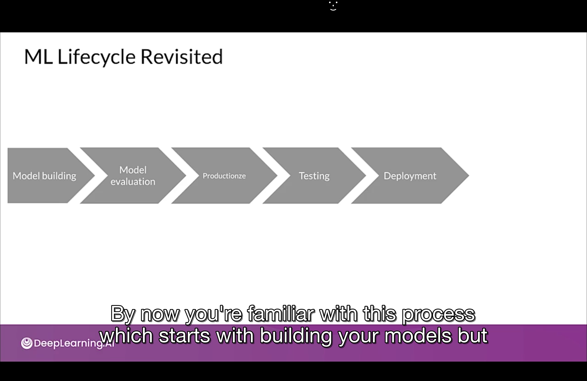

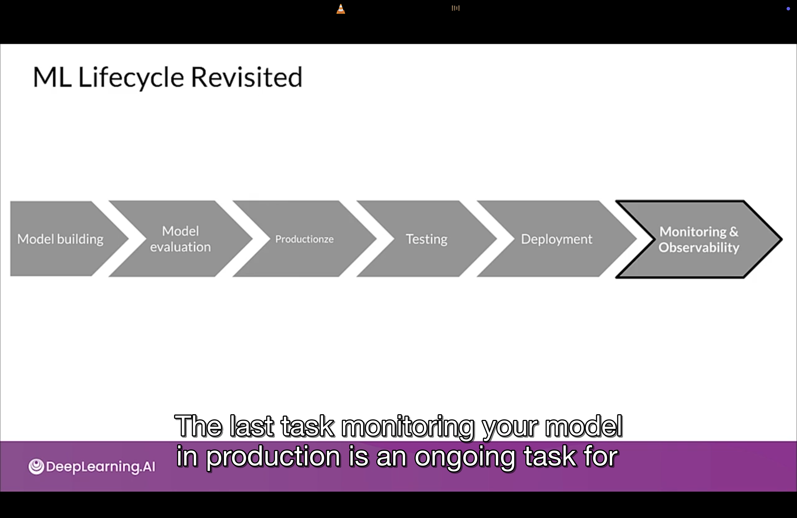

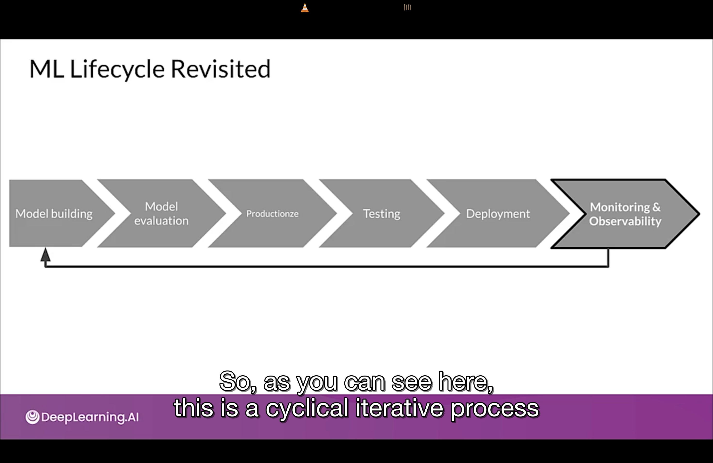

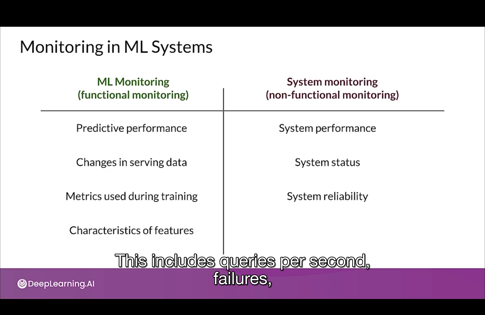

Welcome back, this week we have a lot of great stuff to explore, really focusing this week on some topics that are at the intersection of machine learning and DevOps. After all, MLOps is a big part of what we're covering in this course and things like this become very important to actual implementation of MLOps for production ML, especially in a business environment. We'll start with a discussion of model monitoring, including observability, logging and tracing, detecting model decay and mitigating model decay. Then we'll dive into responsible AI and discuss some advanced topics including legal requirements, anonymization and pseudonymization, GDPR and the right to be forgotten, there's a lot to cover, so let's get started.

Welcome back, this week starts with a discussion of monitoring your models in production, beginning with a look at why monitoring matters, let's get started. By now you're familiar with this process which starts with building your models but doesn't end with deployment. The last task monitoring your model in production is an ongoing task for as long as your model is in production. The data that you gather by monitoring will guide the building of the next version of your model and make you aware of changes in your model performance.

So, as you can see here, this is a cyclical iterative process which requires the last step monitoring in order to be complete. You should note here that this diagram is only looking at monitoring which is directly related to your model performance. But, you will also need to include monitoring of the systems and infrastructure which are included in your entire product or service such as databases and web servers. That kind of monitoring is only concerned with the basic operation of your product or service and not the model itself, but is critical to your users experience.

Basically, if the system is down, it really doesn't matter how good your model is. Benjamin Franklin once wrote, an ounce of prevention is worth a pound of cure, or in metric terms maybe, a gram of prevention is worth a kilo of cure. In 1733 he visited Boston and was impressed with the fire prevention measures that the city had established. So when he returned home to Philadelphia, he tried to get his city to adopt similar measures, Franklin was talking about preventing actual fires.

But in our case you might apply this same idea to preventing fire drills, the kind of fire drills where your system is performing badly and it's suddenly an emergency to fix it. It's these kinds of fire drills that can happen if you don't monitor your model performance. If your training data is too old, even when you first deploy a new model, it can have immediate data skews. Without monitoring right from the start, you may easily be unaware of the problem and your model will not be accurate even when it's new.

Of course, as previously discussed models will also become stale or inaccurate because the world constantly changes and the training data you originally collected might no longer reflect the current state. Again, without monitoring you are unlikely to be aware of the problem. You can also have negative feedback loops, this turns out to be a more complex issue that arises when you automatically train your models on data collected in production. If this data is biased or corrupted in any way, then the models trained on that data will perform poorly.

Monitoring is important even for automated processes because they too can have problems. ML monitoring or functional monitoring, deals with keeping an eye on model predictive performance and changes in serving data. These include the metrics, the model optimized during training and the distributions and characteristics of each feature in the serving data. System monitoring or non functional monitoring refers to monitoring the performance of the entire production system, the system status and the reliability of the serving system.

This includes queries per second, failures, latency, resource utilization etcetera. You may ask yourself, why is ML monitoring different than software monitoring. Unlike a pure software system, there are two additional components to consider in an ML system, the data and the model. Unlike in traditional software systems, the accuracy of an ML system depends on how well the model reflects the world it is meant to model which in turn depends on the data used for training and on the data that it receives while serving requests.

It's not simply a matter of monitoring for system failures like SEG faults and out of memory or network issues, the model and the data require additional, very specialized monitoring as well. Code and config also take on additional complexity and sensitivity in an ML system due to two aspects, entanglement and configuration.

Entanglement, and no, I'm not referring here to quantum entanglement, refers to the issue where changing anything, changes everything. Here, you need to be careful with feature engineering and features selection and understand your model sensitivity. Configuration can also be an issue because model hyper parameters, versions and features are often controlled in a system config and the slightest error here can cause radically different model behavior that won't be picked up with traditional software tests. Again, requiring additional very specialist monitoring.

36. Observability measures how well you can infer the internal states of a system by just knowing the inputs and outputs. For ML, this means monitoring and analyzing the prediction requests and the generated predictions from your models. Observability isn't a new concept, it actually comes from control system theory where it has been well established for decades.

In control system theory, observability and controllability are closely linked. You can only control a system to the extent that you can observe it. Looking at an ML-based product or service, this maps to the idea that controlling the accuracy of the results overall, usually across different versions of the model, requires observability. This also adds to the importance of model interpretability.

In ML systems, observability becomes a more complex problem since you need to consider multiple interacting systems and services such as cloud deployments, containerized infrastructure, distributed systems, and microservices. This generally means that there are a substantial number of systems which you need to monitor and aggregate. This often means relying on vendor monitoring systems to collect and sometimes aggregate data because the observability of each instance can be limited. For example, monitoring CPU utilization across an autoscaling containerized application is much different than simply monitoring CPU usage on a single server.

Observability is about making measurements. Just like when you're analyzing your model performance during training, measuring top-level metrics is not enough and will provide an incomplete picture. You need to slice your data to understand how your model performs for various data subsets. For example, in an autonomous vehicle, you need to understand performance in both rainy and sunny conditions and measure them separately.

More generally speaking, data slices provide a useful way to analyze different groups of people or different types of conditions. This means that domain knowledge is important in observing and monitoring your systems and production just like it is when you're training your models. In general, it's your domain knowledge that will guide how you slice your data. The TFX framework and TensorFlow model analysis are very powerful tools and include functionality for doing observability analysis on multiple slices of data for your deployed models.

This is true for both supervised and unsupervised monitoring of your models. In a supervised setting, the true labels are available to measure the accuracy of your predictions. In contrast, in an unsupervised setting, you'll monitor for things like the means, medians, ranges, and standard deviations of each feature. In both supervised and unsupervised settings, you need to slice your data to understand how your system behaves for different subsets.

Going back to the autonomous vehicle example, slicing by weather condition is important to avoid things like making poor driving decisions in the rain. The main goal of observability in the context of monitoring is to prevent or act upon system failures. For this, the observations need to provide alerts when a failure happens, and ideally provide recommended actions to bring the system back to normal behavior. More specifically, a alertability refers to designing metrics and thresholds that make it very clear when a failure happens.

This may include defining rules to link more than one measurement to identify a failure. Knowing that your system is failing is a good start, but an actionable recommendation based on the nature of the failure is way more helpful to correct this behavior. Actionable alerts clearly define the root cause of the system's failure. At a bare minimum, your system should gather sufficient information to enable root cause analysis.

Both alertability and actionability are goals, and the effectiveness of your system is a reflection of how well it achieves these goals.

37.

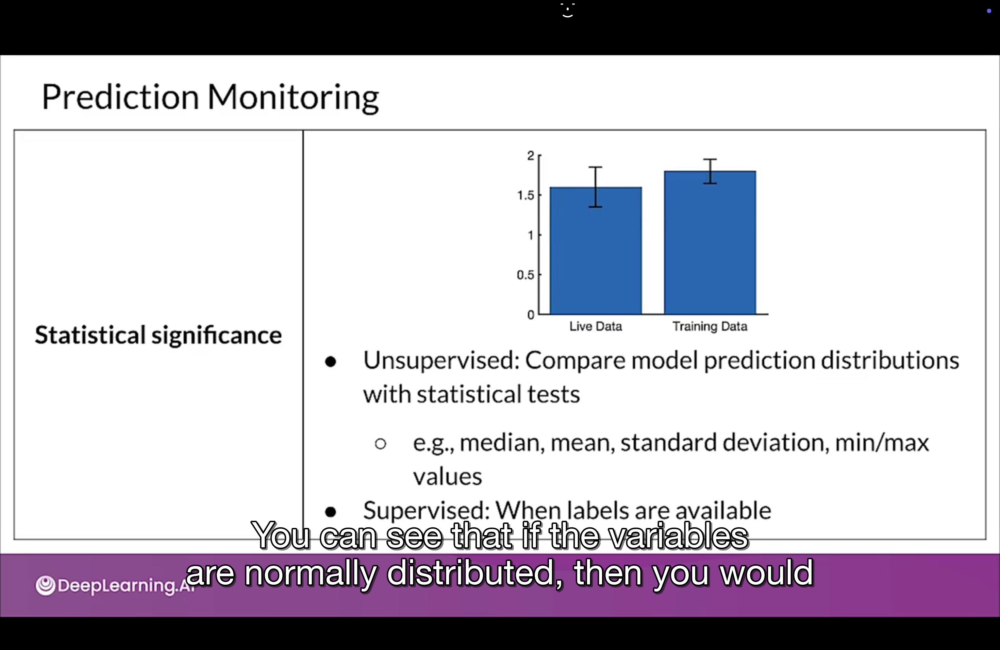

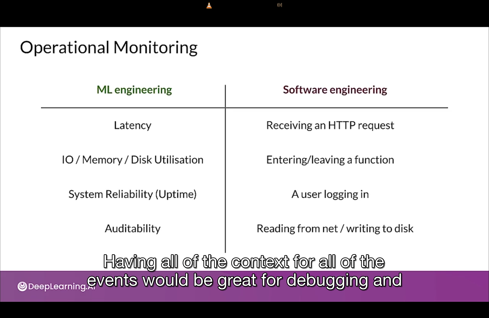

Let's look now at the kind of things that you can actually observe and monitor in ML system. Starting with the basics, you can monitor the inputs and outputs of your system. The inputs in a deployed system are the prediction requests, each of which is a feature vector. You can use statistical measures of each feature, including their distributions and look for changes that may be associated with failures.

Again, this should not be just top level measurements, but measurements of slices that are relevant to your domain. The outputs are the model's predictions which you can also monitor and measure. This should include an understanding of the deployment of different model versions to help you understand how different versions perform. You should also consider performing correlation analysis to understand how changes in your inputs affect your model outputs.

And again, this should be done on slices of your data, for example, correlation analysis can help you detect how seemingly harmless changes in your inputs cause prediction failures. The prediction requests, whether you're doing real time or batch predictions form a large part of the observable data that you have for a deployment for each feature. You should monitor for errors such as values falling outside and allowed range or a set of categories where these air conditions are often defined based on domain knowledge. You should also monitor how each feature distribution changes over time and compare those to the training data, monitoring for errors and changes is better done with sliced data so that you can better understand and identify potential system failures.

Statistical testing and comparisons are the basic tools that you can use to analyze your data. Typical descriptive statistics include median mean standard deviation and range values for monitoring model predictions. You can also use statistical testing and sometimes in scenarios such as predicting, click through where labels are available. You can also do comparisons between known labels and model predictions in this figure.

You can see that if the variables are normally distributed, then you would expect the mean values to be within the standard error of the mean interval. It's also important to consider that if you have altered the distributions of the training data to correct for things like class imbalance or fairness issues. Then you need to take that into account when comparing to the distributions of the input data that gathered through that is gathered through the monitoring prediction requests, monitoring in the realm of software engineering is far more well established. So the operational concerns around our ml system may include monitoring system performance in terms of measures like latency or IO and memory or disk utilization or system reliability in terms of up time and monitoring can even happen while taking audit ability into account.

In software engineering, talking about monitoring is strictly speaking, talking about events, events can be almost anything ranging from receiving an http request entering or leaving a function which may or may not contain ml code or not.

A user logging in reading from network or writing to the disk and so on, all of these events listed here have some context. Having all of the context for all of the events would be great for debugging and understanding how your systems perform in both technical and business terms. But collecting all the context information is often not practical, as the amount of data to process and store could be very large, so it's important to understand the most relevant context and try to gather that information.

38. Logging is almost always the basis for collecting the data that you will use to monitor your models and systems.

A log is an immutable time stamped record of discrete events that happened over time for your ML system along with additional information.

Let's take a deeper look at logging to avoid making the same mistake twice. It's important to learn from history. For ml systems the same logic applies. This is where logging becomes really handy and more so when building observability.

Let's explore how to do that. You can start with the out of the box, logs and metrics. These will usually give you some basic overall monitoring capabilities, which you can then add to. For example, in google's compute engine platform.

If you need additional application logs, you can install agents to collect those logs. Cloud monitoring collects metrics from all of the cloud services by default which you can then use to build dashboards. When you need additional application or business level metrics. You can use those custom metrics to monitor over time.

Then using aggregate sinks and workspaces allows you to centralize your logs from many different sources or services in order to create a unified view of your application. To clarify exactly what I mean a log is an immutable time stamped record of discrete events that happened over time. This also includes debugging or profiling messages that are printed to the log from your application, as well as automatically generated warning errors and debug messages. Depending on the verbosity settings for your logging.

Cloud providers also offer managed services for logging of cloud based distributed services. These include google cloud monitoring, Amazon, Cloudwatch and as your monitor as well as several managed offerings from 3rd parties. Log messages are very easy to generate since it is just a string, a blob of json or typed key value pairs. Event logs provide valuable insight along with context providing detail that averages and percentiles don't surface.

However, it's not always easy to provide the right level of context without obscuring the really valuable information in too much extraneous detail. While metrics show the trends of a service or an application, logs focus on specific events. This includes both log messages printed from your application as well as warnings, errors or debug messages which are generated automatically. The information logs can be used to investigate incidents and to help with root cause analysis.

But logging isn't perfect. For example, excessive logging can negatively impact system performance. As a result of these performance concerns aggregation operations on logs can be expensive and for this reason alerts based on logs should be treated with caution. On the processing side, raw logs are almost always normalized, filtered and processed by a tool like log stash or fluent D or scribe or eca.

Before there persisted in a data store like elastic search or big query. Setting up and maintaining this tooling carries with it a significant operational cost. One of the key advantages of managed services is that they remove this cost. Much of the discussion so far has centered around how you could use metrics to monitor your input data and predictions in an Ml system.

This is usually the basic way to collect data to monitor an application. Some of the red flags to watch out for may include basic things like a feature becoming unavailable. Especially when you're including historical data in your prediction requests which needs to be retrieved from a data store. In other cases, notable shifts in the distribution of key input values are important.

For example, a categorical value that was relatively rare in the training data becomes more common. pattern specific to your model for example, in an NLP scenario, a sudden rise in the number of words not seen in the training data. That can also be another sign of a potential change which can lead to problems. How you store your log data can have a significant impact on how easily it can be queried for analysis.

At this point, you should consider parsing out and storing your input and prediction data along with any labels that you're able to gather in aquariable data store. Such as a database or a search engine based tool like elastic search. This enables analysis for things like generating the distributions and statistics of your features which can be tracked and compared over time. By associating each item with a time stamp you can also order the data which is important for identifying trends and seasonality.

In addition, by identifying the systems involved, you can help with root cause analysis of system failures. Having this data in aquarium bill data store also enables offline automated reporting dashboards and alerting. Log data is of course also the basis for your next training data set. At the very least, collecting prediction requests should provide the feature vectors that are representative of the current state of the world that your application lives in.

So this data is very valuable. Let's consider labeling issues and labeling techniques for a moment.

If you're lucky in your domain, you'll be able to use direct labelling. For example for recommend systems you can usually capture the user behavior after a recommendation is made to determine if the right options were recommended. In other cases you will need to use manual labeling which can be slow and expensive but is also sometimes the only viable option. Using techniques like active learning can help reduce the cost by only selecting the most important examples to label.

And that includes shaping your data set for issues like class imbalance and fairness. And finally, weak supervision is a powerful technique with significant advantages but also some challenges. What's most important here is that you capture this valuable data so that you can keep your model in sync with a changing world.

39. 
    
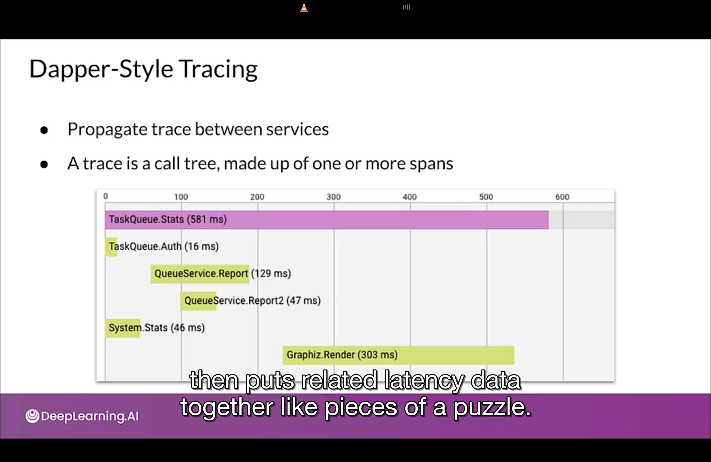

Tracing focuses on monitoring and understanding system performance, especially for microservice-based applications. Things get more interesting when considering distributed systems. Suppose you're trying to troubleshoot a prediction latency problem, suppose your system is made of many independent services and the prediction is generated through many downstream services, you have no idea which of those services are causing the slowdown. You have no clear understanding of whether it's a bug and integration issue, a bottleneck due to a poor choice of architecture or poor networking performance.

In monolithic systems, it's relatively easy to collect diagnostic data from different parts of a system. All the modules might even run within one process and share common resources for logging. Solving this problem becomes even more difficult if your services are running as separate processes in a distributed system. You can't depend on the traditional approaches that help diagnose monolithic systems.

You need to have finer grained visibility into what's going on inside each service and how they interact with one another over the lifetime of a user request. It becomes harder to follow a call starting from the front-end web server to all of its back-ends until the prediction is returned back to the user and you'll notice here that we're really focusing on online serving. To properly inspect and debug issues with latency for requests in distributed systems, you need to understand the sequencing and parallelism of the services and the latency contribution of each to the final latency of the system.

To address this problem, Google developed the distributed tracing system, Dapper to instrument and analyze its production services. The Dapper paper has inspired many open source projects, such as Zipkin and Jaeger and Dapper style tracing has emerged as an industry wide standard.

In service based architectures, Dapper style tracing works by propagating tracing data between services. Each service annotate the trace with additional data and passes the tracing header to other services until the final request completes. Services are responsible for uploading their traces to a tracing back-end. The tracing back-end, then puts related latency data together like pieces of a puzzle.

Tracing back-ends also provide UIs to analyze and visualize traces. Each trace is a call tree, beginning with the entry point of a request and ending with the server's response including all of the RPCs along the way. Each trace consists of small units called spans.

40. 

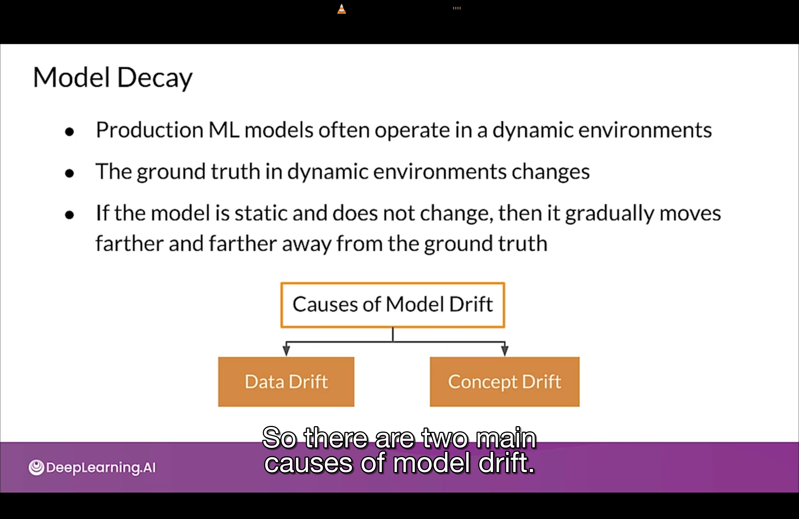

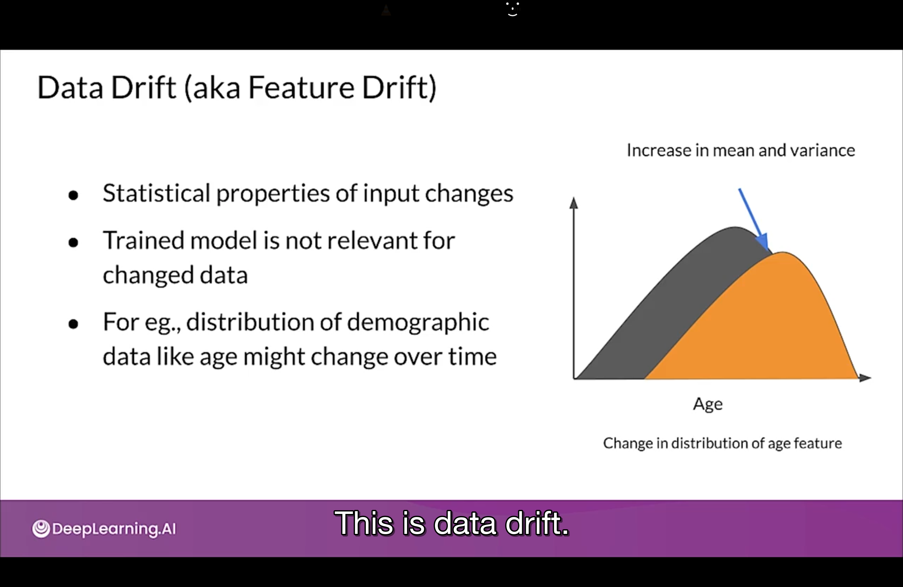

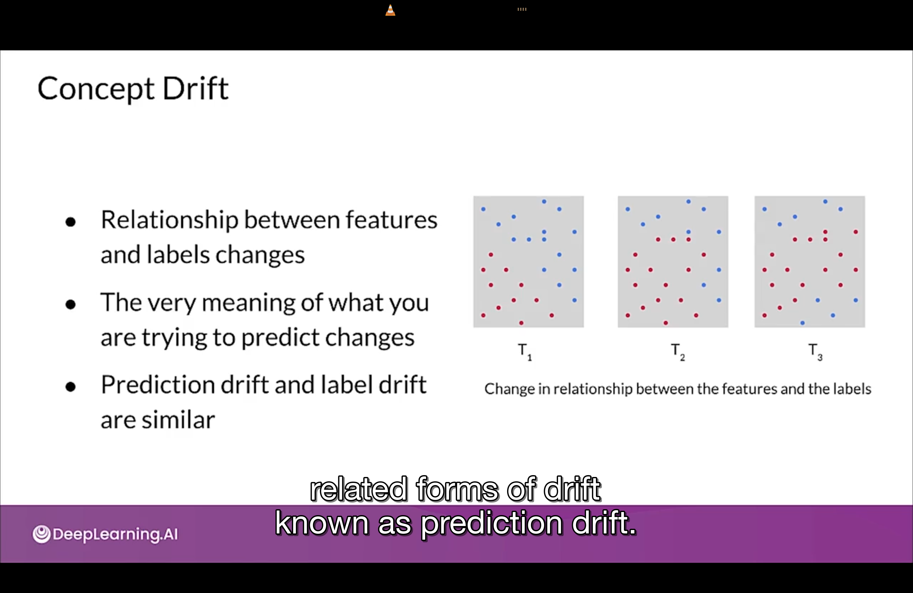

One of the key problems in many domains is model decay. Let's explore this briefly now to get a better understanding of why this might happen and how to prevent it. Production ML models often operate in dynamic environments. Over time, dynamic environments change.

That's what makes them Dynamic. Think of a recommender system, for example, that is trying to recommend which music to listen to. Music changes constantly, with new music becoming popular and taste changing. If the model is static and continues to recommend music that has gone out of style, then the quality of the recommendations will decline.

The model is moving away from the current ground truth. It doesn't understand the current styles because it hasn't been trained for them. So there are two main causes of model drift. Data drift and concept drift.

Let's talk about each of them. Data drift occurs when statistical properties of the input, the features, changes. As the input changes, the prediction requests, the input moves farther away from the data that the model was trained with, and model accuracy suffers. Changes like these often occur in demographic features like age, which may change over time.

The graph on the right shows how there is an increase in mean and variance for the age. This is data drift. Concept drift occurs when the relationship between the features and the labels changes. When a model is trained, it learns a relationship between the inputs and ground truth or labels.

If the relationship between the inputs and the labels changes over time, it means that the very meaning of what you are trying to predict changes. The world has changed, but our model doesn't know it. For example, take a look at the graph on the right side. You can see that the distribution of the features for the two classes, the blue and red dots, changes over time intervals, T1, T2, and T3.

If your model is still predicting for T1 when the world has moved to T3, many of its predictions will be incorrect. I should also mention here that there are related forms of drift known as prediction drift. Where drifts solely in your model's predictions and labeled drift, but I won't be discussing them in detail in this course. If you don't plan ahead for drift, it can slowly creep into your system over time.

How fast your system drifts depends on the nature of the domain that you're working in. Some domains like markets can change within hours or even minutes. Others change more slowly. If drift, either data drift or concept drift or both, is not detected, then your model accuracy will suffer and you won't be aware of it.

This can lead to emergency retraining of your model, which is something to avoid. So monitoring and planning ahead are important. Knowing that you've planned ahead and have systems in place just might make it easier for you to sleep at night.

41. 

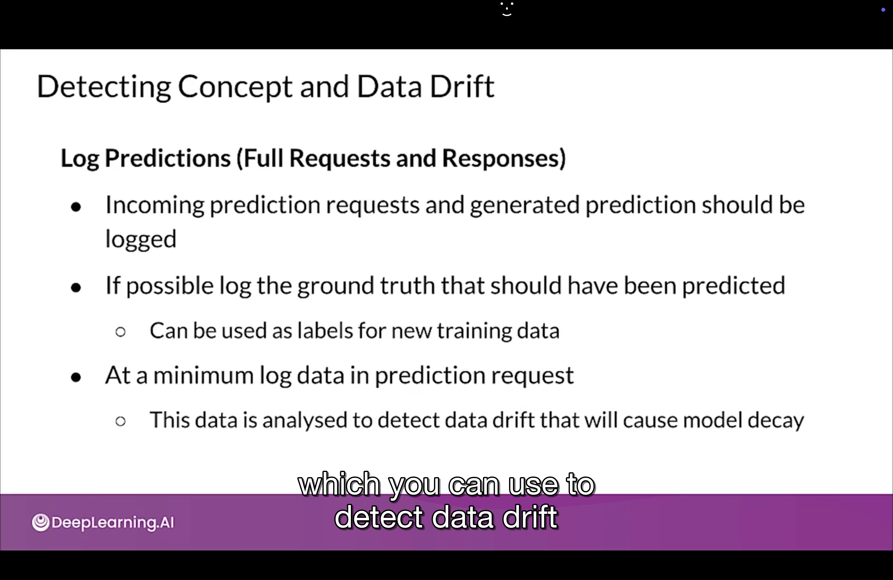

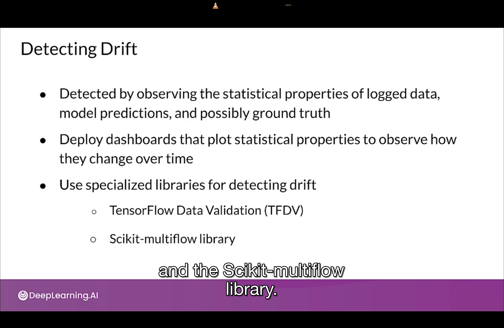

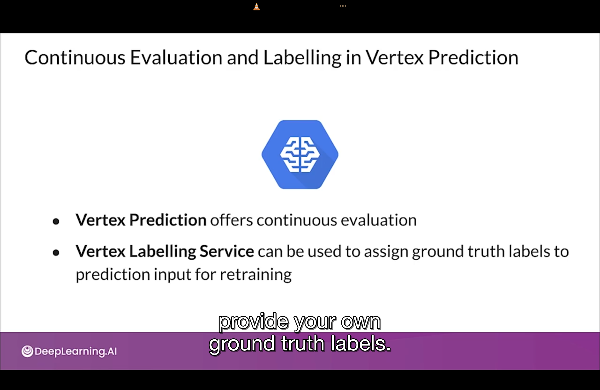

So far you've seen that model decay is a problem, but how do you detect it? Well, I'm glad you asked. Let's talk about that now. Detecting drift, whether it's data drift or concept drift or both starts with collecting current data.

You should collect all of the data in the incoming prediction request to your model, along with the predictions that your model makes. If it's possible in your application, also collect the correct label or ground truth that your model should have predicted. This is also extremely valuable for retraining your model, but at a minimum, you should capture the prediction request data, which you can use to detect data drift using unsupervised statistical methods. The process is really straightforward.

Once you're set up to continuously monitor and log your data, you employ tools which use well-known statistical methods to compare your current data with your previous training data. You also use dashboards to monitor for trends and seasonality over time. Essentially, you'll be working with time series data since you have an ordered data that is associated with a time component. You don't have to reinvent the wheel here, there are good tools and libraries available to help you do this kind of analysis.

These include TensorFlow Data Validation or TFDV, and the Scikit-multiflow library. Cloud providers, including Google, offer managed services such as Google's Vertex Prediction, that help you perform continuous evaluation of your prediction requests. Continuous evaluation regularly sample's prediction input and output from trained machine learning models that you've deployed to Vertex prediction. Vertex data labeling service then assigns human reviewers to provide ground truth labels to your prediction input, or alternatively, you can provide your own ground truth labels.

The data labeling service compares your model's predictions with the ground truth labels to provide continual feedback on how well your model is performing over time. Azure, AWS, and other cloud providers offer similar services.

42.  

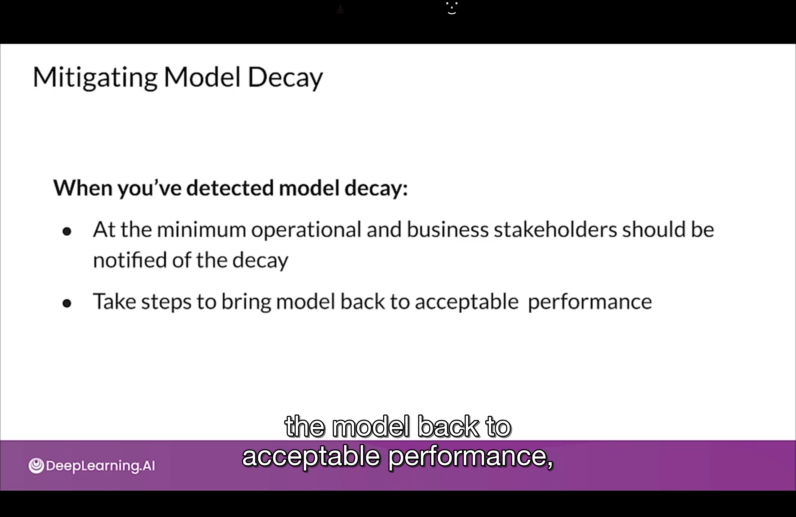

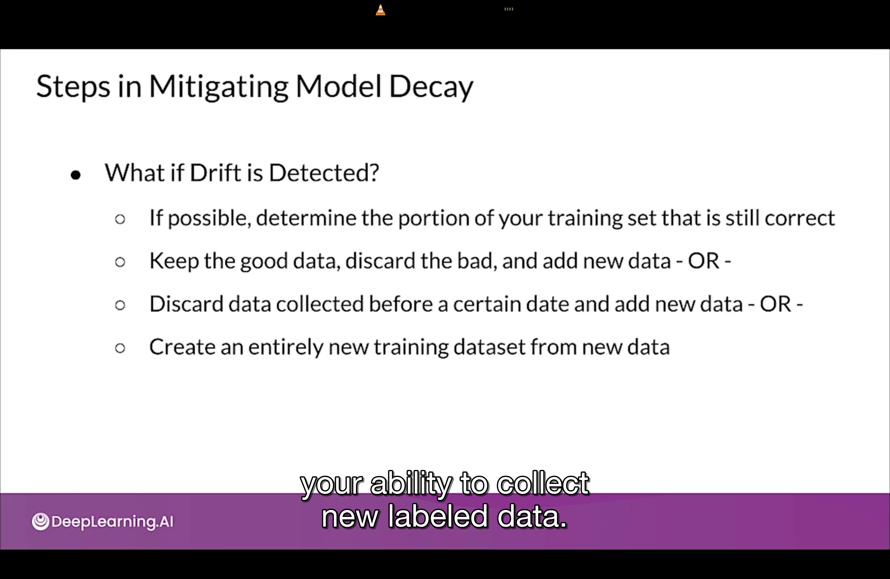

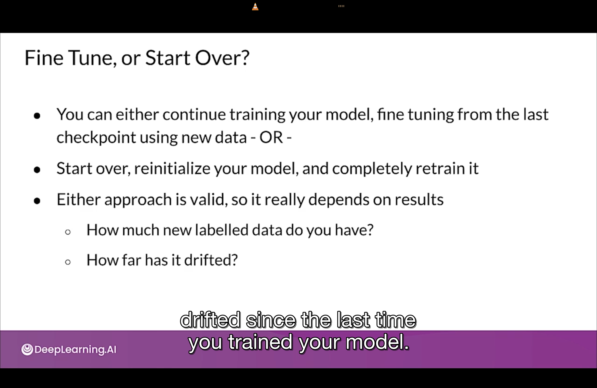

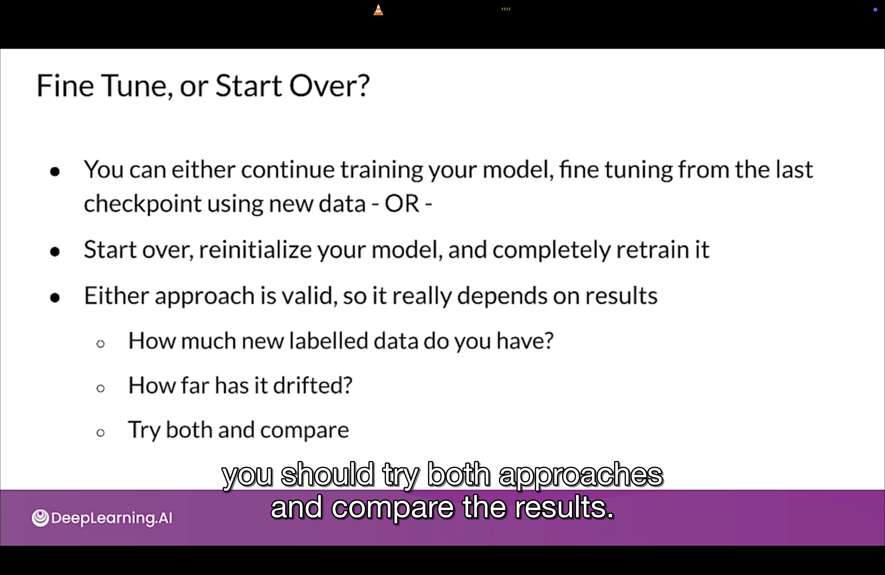

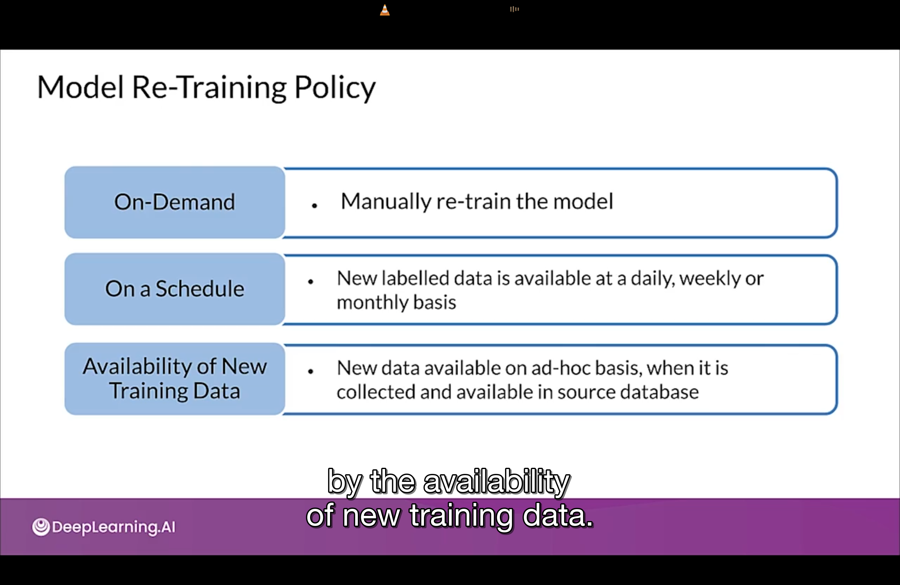

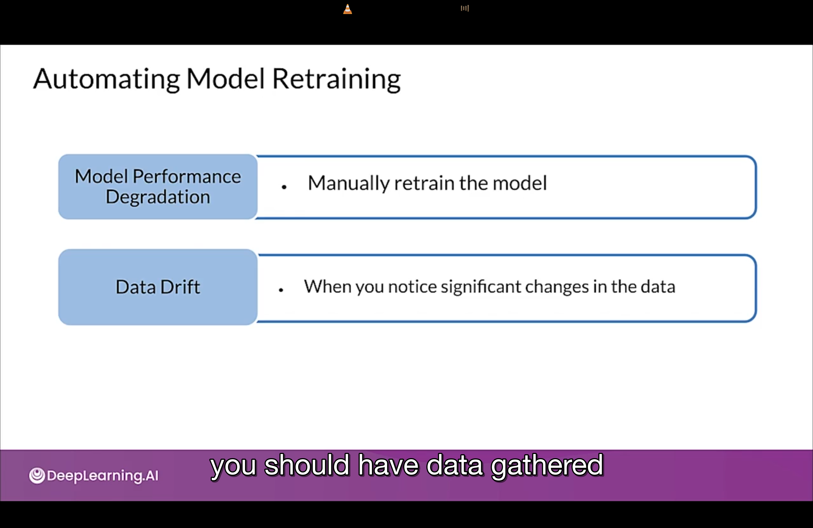

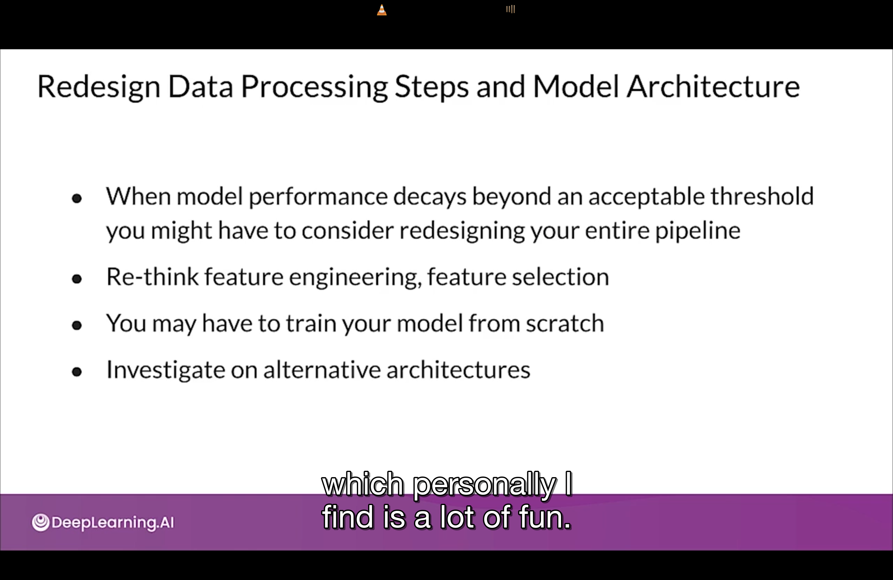

Now you've detected drift, which has led to model decay, so what can you do about it? Well, let's discuss that now. First, the basics. When you detect model decay you need to let others know about it.

That means informing your operational and business stakeholders about the situation, along with some idea about how severe you think the drift has become. Then you work on bringing the model back to acceptable performance, which is what I'll discuss now. Now that you've detected drift, what can you do about it? Well, first, try to determine which data in your previous training data set is still valid by using unsupervised methods, such as clustering or statistical methods that look at divergence.

Many options exist, including Kullback-Leibler or KL divergence, Jensen-Shannon or JS divergence or the Kolmogorov-Smirnov or K-S test. This step is optional, but especially when you don't have a lot of new data, it can be important to try to keep as much of your old data as possible. Another option is to simply discard that part of your training data set that was collected before a certain date and add your new data. Or if you have enough newly labeled data then you can just create an entirely new data set.

The choice between these options will probably be dictated by the realities of your application and your ability to collect new labeled data. Now that you have a new training data set, you've basically two choices for how to train your model, fine tuning or starting over. You can either continue training your model, fine tuning it from the last checkpoint using your new data, or start over by re-initializing your model and completely retraining it. Either approach is valid and the choice between these two options will largely be dictated by the amount of new data that you have and how far the world has drifted since the last time you trained your model.

Ideally, if you have enough new data, you should try both approaches and compare the results. It's usually a good idea to establish policies around when you're going to retrain your model. There's really no right or wrong answer here, so it will depend on what works in your particular situation. You could simply choose to retrain your model whenever it seems to be necessary.

That includes situations where you detect a drift, but it also includes situations where you may need to add or remove class labels or features, for example. You could also always retrain your model according to a schedule, whether it needs it or not. In practice, this is what many people do because it's simple to understand and in many domains it works fairly well. It can, however, incur higher training and data gathering costs unnecessary, or alternatively, it can allow for greater model decay that might be ideal depending on whether your schedule has your model training too often or not often enough.

Finally, you might be limited by the availability of new training data. This is especially true in circumstances where labeling is slow and expensive. As a result, you may be forced to try to retain as much of your old training data as possible for as long as possible, and avoid fully retraining your model. If you can automate the process of detecting the conditions which require model retraining, that's ideal.

That includes being able to detect model performance degradation and triggering retraining, or when you detect significant data drift. In both cases, in order to automate retraining, you should have data gathered and labeled automatically using a separate process and only retrain when sufficient data is available. Ideally, you also have continuous training, integration and deployment setup as well, to make the process fully automated. For some domains where change is fast and frequent retraining is required, these automated processes become requirements instead of luxuries.

When your model decay is beyond an acceptable threshold, or when the meaning of the variable you are trying to predict deviates significantly, or you need to make changes like adding or removing features or class labels, you might have to redesign your data pre-processing steps and model architecture. I like to think of this as an opportunity to make improvements. You may have to rethink your feature engineering, feature selection, and so forth, in order to make your model work with current data, and retrain your model from scratch rather than applying fine tuning. You might have to investigate other potential model architectures, which personally I find is a lot of fun.

The point here is that no model lives forever, and periodically, you need to go back to the drawing board and start over, applying what you've learned since the last time you updated your model.

43.   

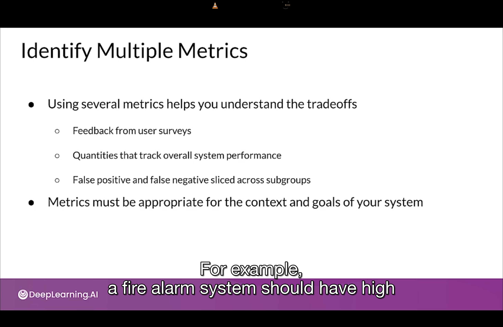

Now let's look into some of the emerging issues concerning responsible AI and what you as a developer can do to ensure that your models and applications are as responsible as possible. The development of AI is creating new opportunities to improve the lives of people around the world from business to health care to education and beyond. But at the same time it's also raising new questions about the best way to build fairness, interpret ability, privacy and security into these systems. These questions are far from solved and are extremely active areas of research and development. I encourage you to commit to following the development of this field and working to make sure that your models and applications are as responsible as you can make them.

They will never be perfect, but there is already a lot that you can do with more tools and techniques being developed constantly.

The way actual users experience your system is essential to assessing the true impact of its predictions, recommendations and decisions. For example, you should design your features with appropriate disclosures, built in clarity and control is crucial to a good user experience. Often it's also a good idea to consider augmentation and assistance, producing a single answer can be appropriate where there is a high probability that the answer satisfies a diversity of users and use cases but in other cases it may be better for your system to suggest a few options to the user. In fact it can even be easier since it's often much more difficult to achieve good precision at one answer top one versus precision and a few answers Maybe top three. Try to plan for modeling potential adverse feedback early in the design process followed by specific live testing and iteration for a small fraction of traffic before full deployment.

And finally engage with a diverse set of users and different use case scenarios and incorporate that feedback both before and throughout your project development. This will build a rich variety of user's perspectives into the project and increase the number of people who benefit from the technology and help you catch potential issues early.

A fairly simple technique is to use several metrics rather than a single one, which can help you understand trade offs between different kinds of errors and experiences. Consider metrics including feedback from users surveys, quantities that track overall system performance, and short and long term product health for example, click through rate and customer lifetime value respectively and false positive and false negative rates sliced across different subgroups. Of course the metrics that you select are important, you should try to ensure that your metrics are appropriate for the context and goals of your system. For example, a fire alarm system should have high recall even if that means the occasional false alarm.

Of course, as always it all comes back to the data ML models will reflect the data that they're trained on. So analyze your raw data carefully to ensure you understand it in cases where this is not possible. For example with sensitive raw data, understand your input data as much as possible while respecting privacy. consider whether your data was sampled in a way that represents your users. For example, if your application will be used by people of all ages, but you only have training data from senior citizens, it might not work that well for other age groups.

Imagine doing music recommendations when all of your data is from senior citizens.

My guess is that it might not perform that well for twins, sometimes you're using your model to predict a proxy label for the actual target that you're interested in because labelling for the actual target is difficult or impossible. In these cases consider the relationship between the data labels that you have and the actual thing that you're trying to predict. Are there problematic gaps? For example, if you're using data label X as a proxy to predict target Y, in which case is is the gap between X and Y problematic.

44.  

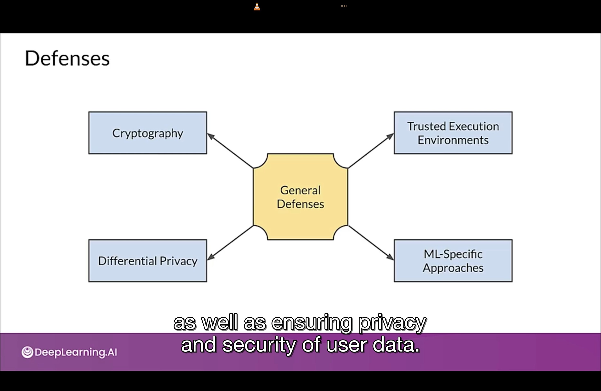

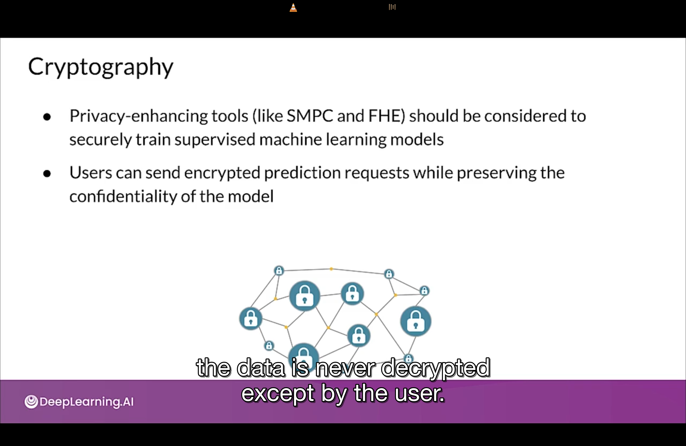

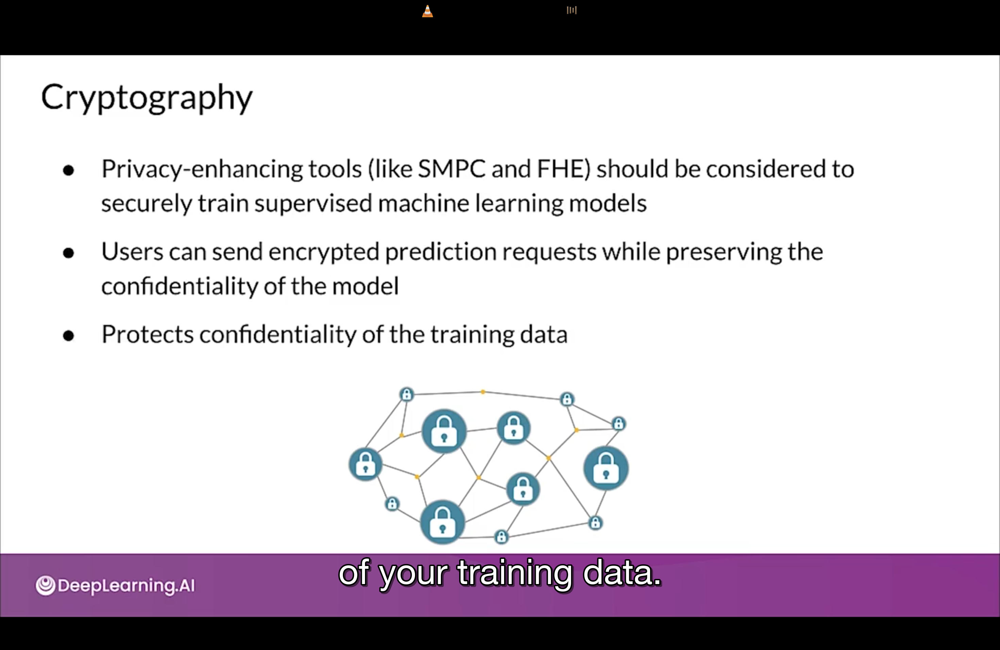

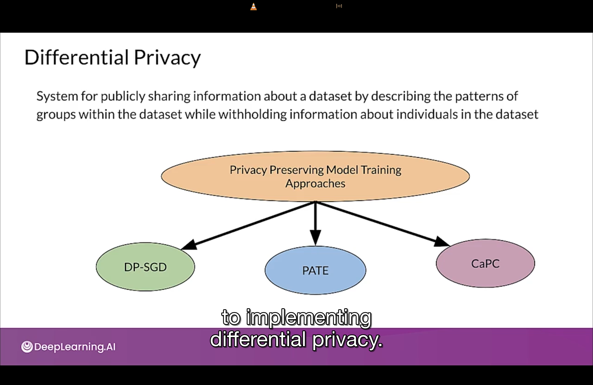

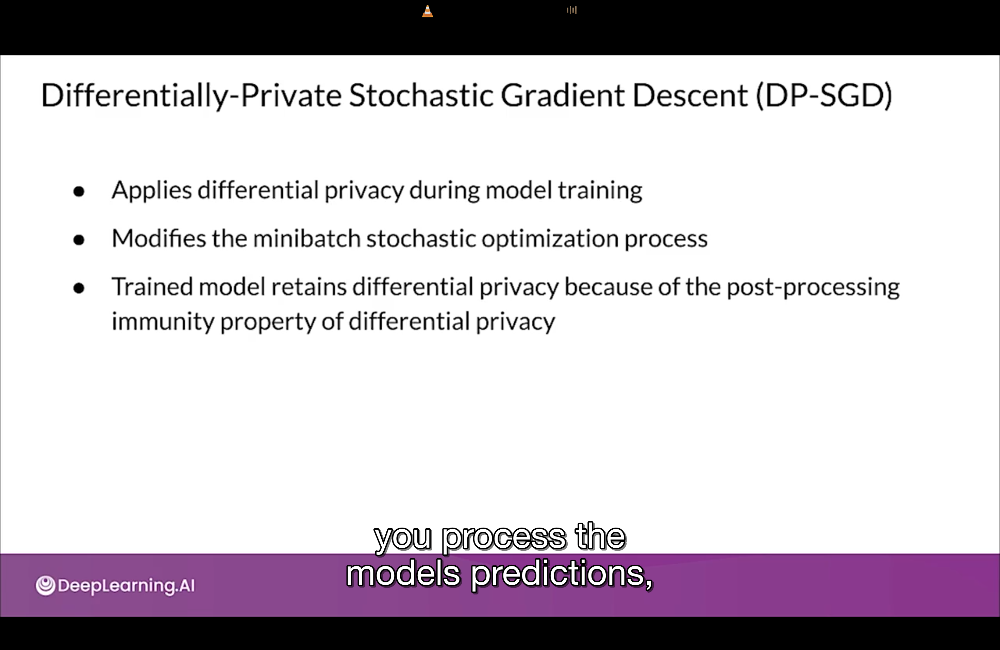

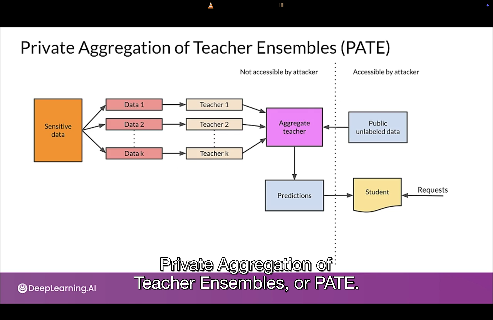

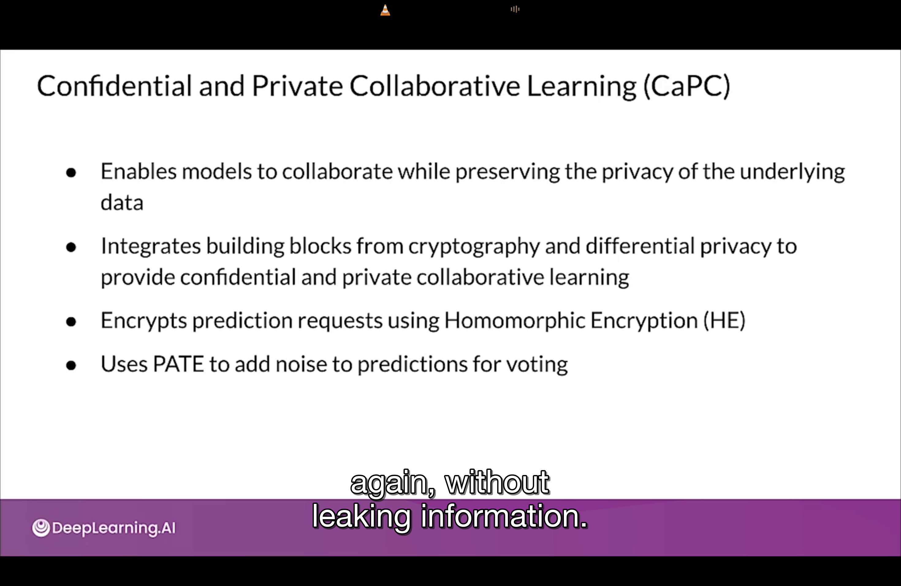

A legal side to practicing responsible AI. They are already a legal requirements in some countries and regions, and this trend is growing. Exposure to civil liability is another concern. Let's explore some of the issues now.

Training data, prediction requests, or both, can contain very sensitive information about people. For prediction request, those people are your users. Privacy of sensitive data should be protected. This includes not only respecting the legal and regulatory requirements, but also considering social norms and typical individual expectations.

What safeguards do you need to put in place to ensure the privacy of individuals considering that ML models may remember or reveal aspects of the data that they've been exposed to? What steps are needed to ensure users have adequate transparency and control of their data? It's not just up to you to decide what is required. In Europe, for example, you need to comply with the General Data Protection Regulations, or GDPR, and in California, you need to comply with the California Consumer Privacy Act, or CCPA. The General Data Protection Regulation, or GDPR, was enacted by the EU in 2016 and became a model for many national laws outside the EU, including Chile, Japan, Brazil, South Korea, Argentina, and Kenya.

It regulates the data protection and privacy in the European Union and the European Economic Area. The GDPR gives individuals control over their personal data and requires that companies should protect the data of employees and consumers. When data processing is based on consent, the data subject, usually an individual person, has the right to revoke their consent at any time. In California, Consumer Privacy Act, or CCPA, was modeled after the GDPR and has similar goals, including enhancing the privacy rights and consumer protections for residents of California. It states that users have the right to know what personal data is being collected about them, including whether the personal data is sold or disclosed in some way, who supplied their data and who received their data.

Users can access the personal data which a company has for them, block the sale of their data, and request a business to delete their data. Security and privacy are closely linked for some problems or harms and machine learning. Informational harms are caused when information is allowed to leak from the model. There are at least three different types of informational harms, including membership inference, where an attacker can determine whether or not an individual's data was included in the training set. Model inversion, where the attackers actually able to recreate the training set, and model extraction, where an attacker is able to recreate the model itself.

Behavioral harms are caused when an attacker is able to change the behavior of the model itself. This includes poisoning attacks, where the attacker is able to insert malicious data into the training set, and evasion attacks where the attacker makes small changes to prediction requests to cause the model to make bad predictions.

It's important to defend your model against attacks, as well as ensuring privacy and security of user data. Let's discuss a few approaches for defending against attacks. You should consider privacy enhancing technologies such as Secure Multi-Party Computation, or SMPC, or Fully Homomorphic Encryption, or FHE, when training and serving your models. Briefly, SMPC enables multiple systems to collaborate securely to train and/or serve a model while keeping the actual data secure through the use of shared secrets. FHE, on the other hand, enables developers to train their models on encrypted data without decrypting it first.

FHE in particular allows users to send an encrypted prediction requests and receive back an encrypted results. During the entire process, the data is never decrypted except by the user. However, you should be aware that currently, FHE is very computationally expensive. The goal here is that using cryptography, you can protect the confidentiality of your training data. Roughly, a model is differentially private if an attacker seeing its predictions cannot tell if a particular user's information was included in the training data.

By implementing differential privacy, you can responsibly train models on private data. It provides provable guarantees of privacy, mitigating the risk of exposing sensitive training data. Let's briefly discuss three different approaches to implementing differential privacy. Differentially-Private Stochastic Gradient Descent , or DP-SGD, Private Aggregation of Teacher Ensembles or PATE, and Confidential and Private Collaborative learning, or CaPC. If an attacker is able to get a copy of a normally trained model, then they can use the weights to extract private information.

Differentially-Private Stochastic Gradient Descent, or DP-SGD, eliminates that possibility by applying differential privacy throughout training. It does that by modifying the minibatch stochastic optimization process by adding noise. The result is a trained model which retains differential privacy because of the post-processing immunity property of differential privacy. Post-processing immunity is a fundamental property of differential privacy. It means that regardless of how you process the models predictions, you can't affect their privacy guarantees.

Next, let's take a look at Private Aggregation of Teacher Ensembles, or PATE. PATE begins by dividing up sensitive data into k partitions with no overlaps. It then trains k models on that data separately as teacher models, and then aggregates the results in an aggregate teacher model. This is the same teacher-student used for knowledge distillation. During the aggregation for the aggregate teacher, you will add noise to the output in a way that won't affect the resulting predictions.

All of these models and the sensitive data are not available to end users, including attackers. For deployment, you will create a student model. To train the student model, you'll take unlabeled public data and feed it to the aggregate teacher model. The output of this process is labeled data, which maintains privacy. You use this data as the training set for the student model.

After training, you will discard everything on the left side of this diagram and deploy only the student model for use. Confidential and Private Collaborative learning, or CaPC, enables multiple developers using different data to collaborate to improve their model accuracy without sharing information. This preserves both privacy and confidentiality. To do that, it applies techniques and principles from both cryptography and differential privacy. This includes using Homomorphic Encryption, or HE, to encrypt the prediction requests that each collaborating model receives so that information in the prediction request is not leaked.

It then uses PATE to add noise to the predictions from each of the collaborating models and uses voting to arrive at a final prediction, again, without leaking information. A great example of how CaPC can be used is to consider a group of hospitals who want to collaborate to improve each other's models and predictions. Because of healthcare privacy laws, they can't share information directly. But using CaPC, they can achieve better results while preserving the privacy and confidentiality of their patients.

45.  

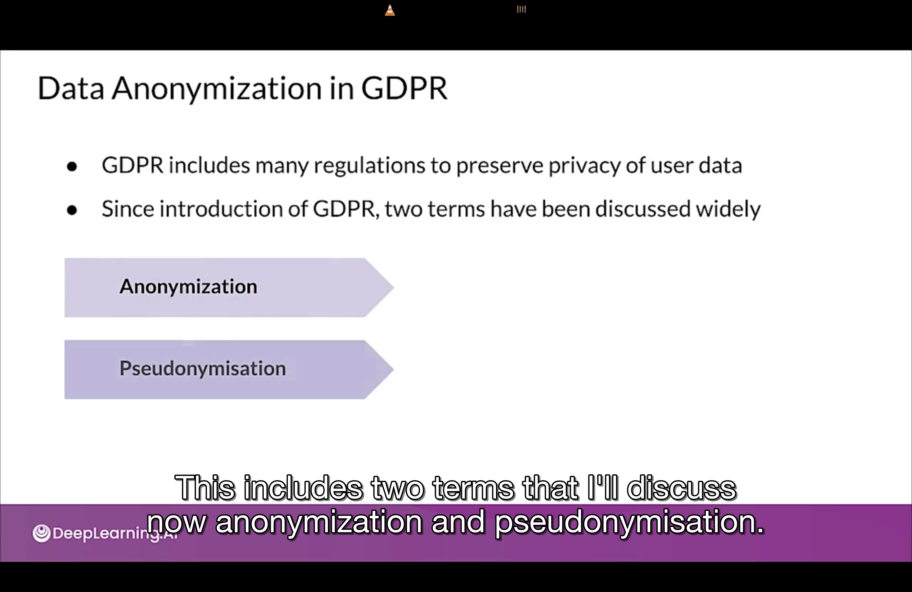

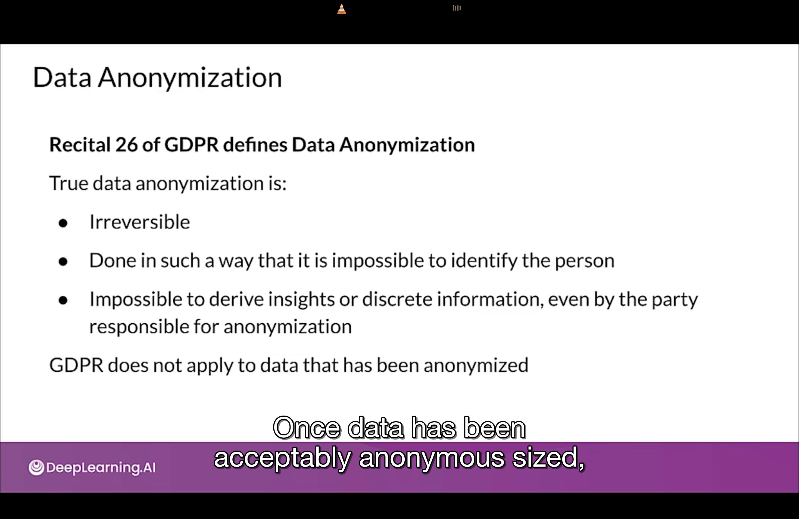

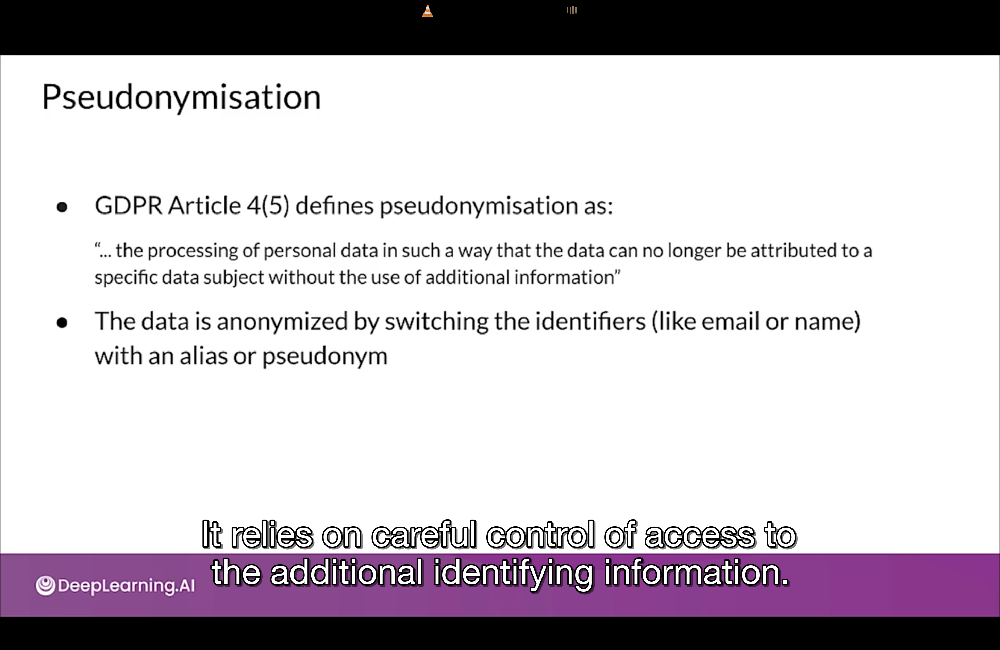

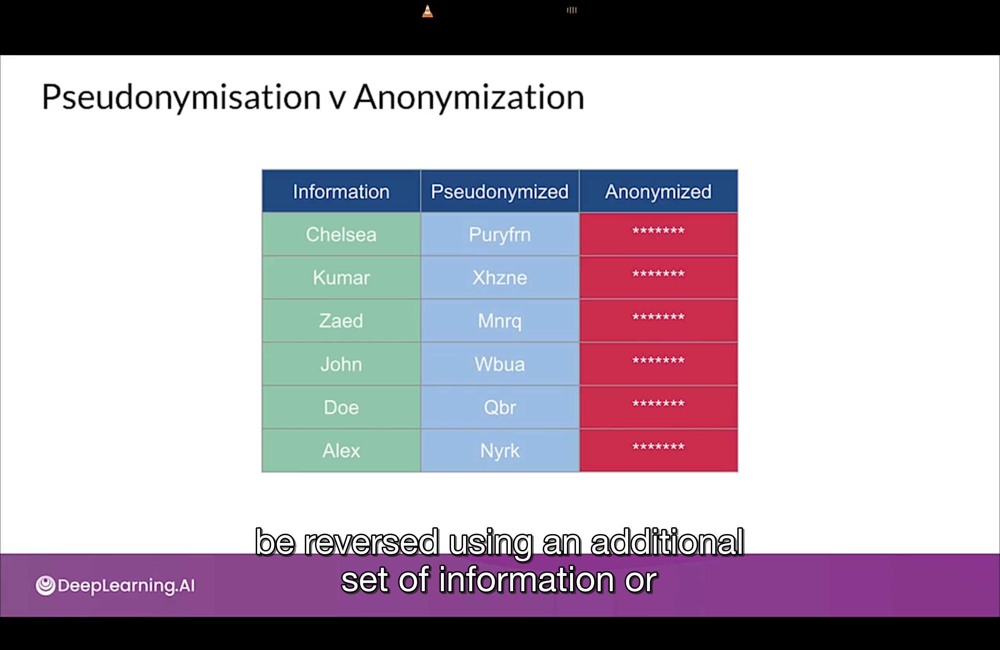

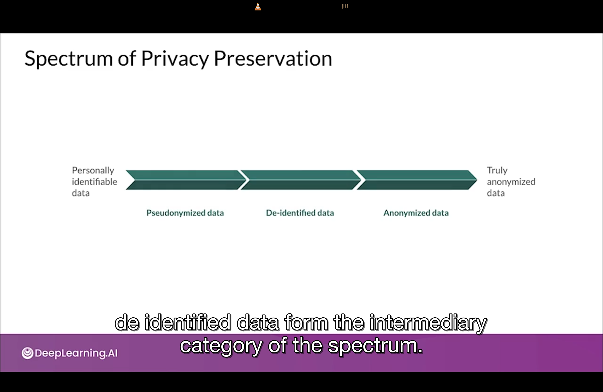

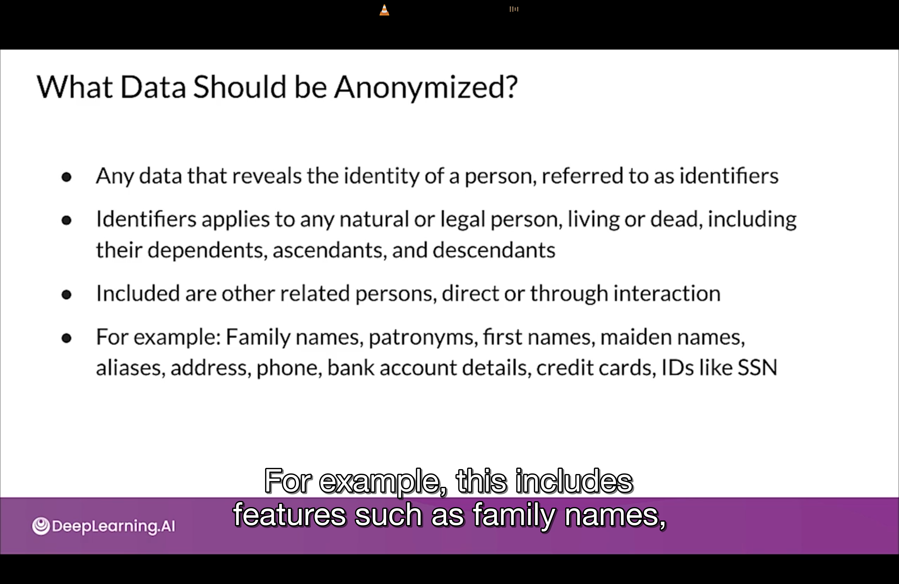

Anonymization and pseudonymisation are some of the most well established ways of protecting privacy. So let's discuss them now, the GDP are includes many regulations to preserve privacy of user data and includes the definitions of many of the terms that it uses. This includes two terms that I'll discuss now anonymization and pseudonymisation. Anonymization removes personally identifiable information or PII from data sets so that people who the data describes remain anonymous for the GDPR.

Recital 26 defines acceptable data anonymous station to be irreversible and done in such a way that is impossible to identify the person. It's impossible to derive insights or discrete information even by the party responsible for anonymization. Once data has been acceptably anonymous sized, the GDP are no longer applies to that data. Pseudonymisation is a bit different. This is a reversible process, meaning that it's still possible to identify the individual if the right additional information is included.

Pseudonymisation can be implemented with data masking or encryption or tokenization. It relies on careful control of access to the additional identifying information. So to be clear the biggest difference between anonymization and pseudonymisation is that pseudonymized data can be reversed using an additional set of information or an encryption key while anonymization is irreversible. A lot of methods, mechanisms and tools have been developed over the years that produce data with various levels of both anonymity and the capability of being identified. It ranges from personally identifiable to truly anonymous data, personally identifiable data contains name, address, phone, email etc.

While data which is purely anonymous and in accordance with GDP are guidelines does not include personally identifiable information or PI and cannot be connected to PII. Even with additional information, pseudonymized and de-identified data form the intermediary category of the spectrum. They are indeed a way of preserving certain aspects of data privacy but not to the level of truly anonymous data. Note however, that the difference between de identified data and pseudonymized data is not well defined and many discussions will group them together as one thing.

So what part of your data should you anonymized basically everything that is part of PII that includes any data that reveals the identity of a person which are known as identifiers and with the term identifiers.

I mean any natural or legal person living or dead including their dependents, their ascendance and descendants. This also includes other related persons who might be identifiable through either direct or indirect relationships. For example, this includes features such as family names, patron names first names, maiden names, aliases, address phone, bank account details, credit cards, tax IDs and so forth.

46.  

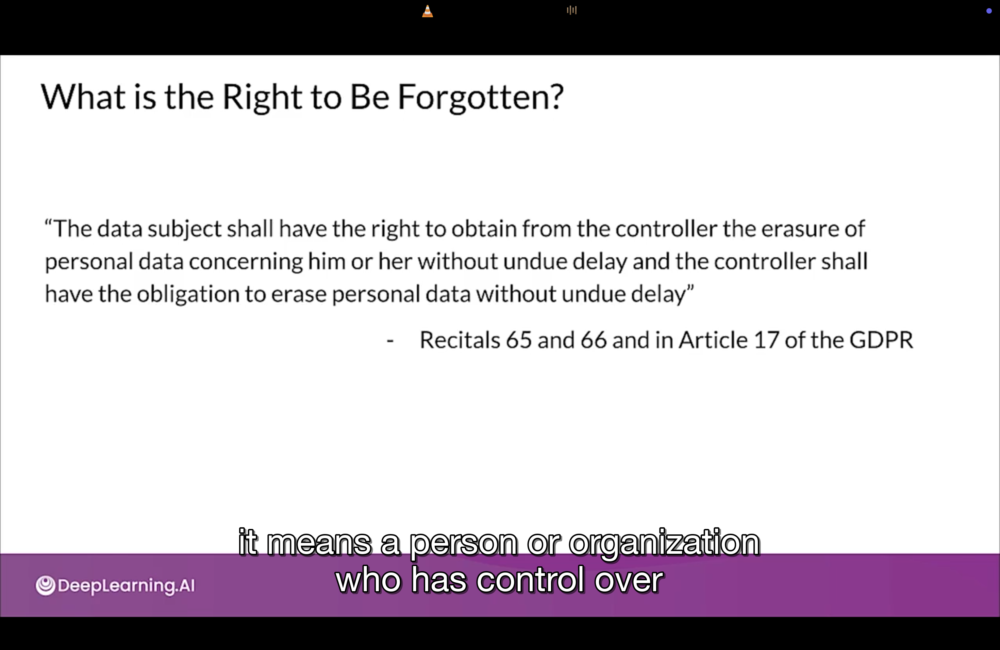

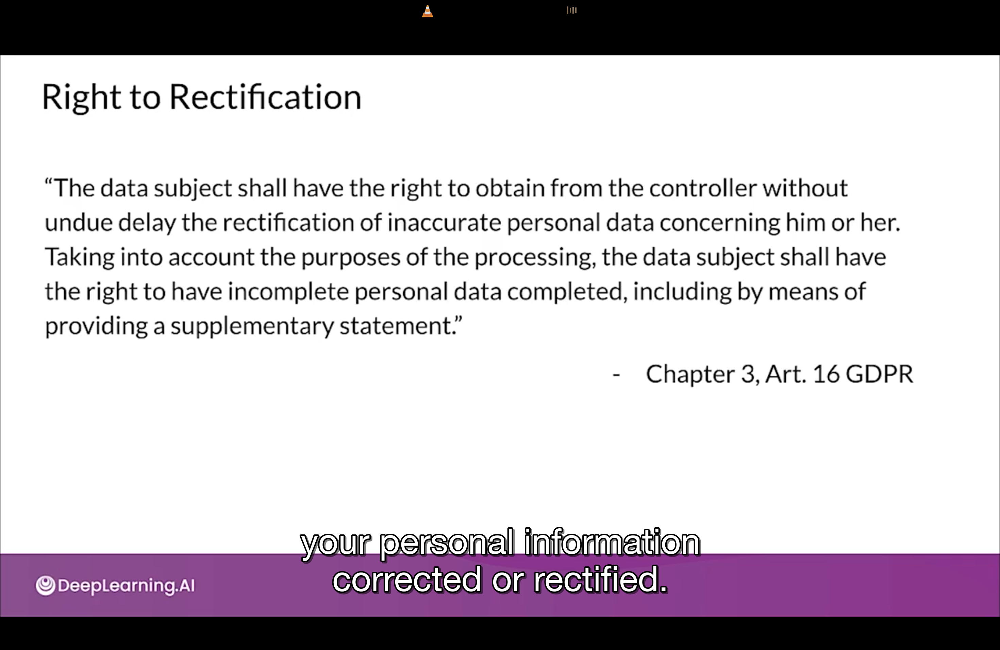

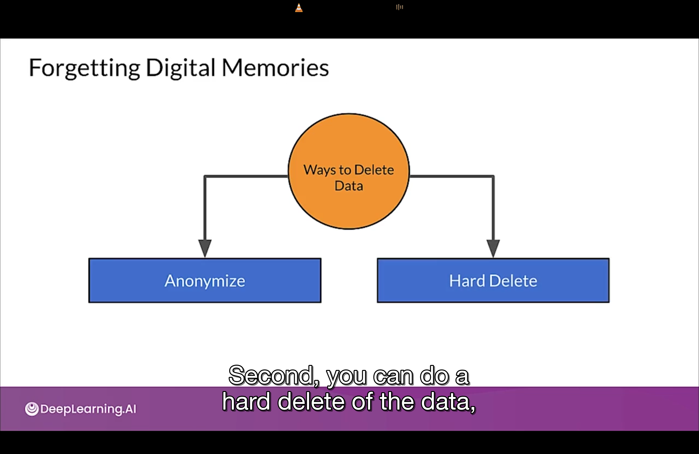

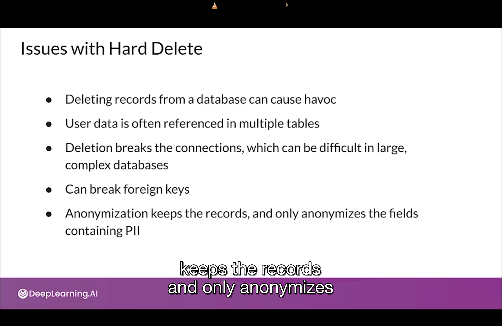

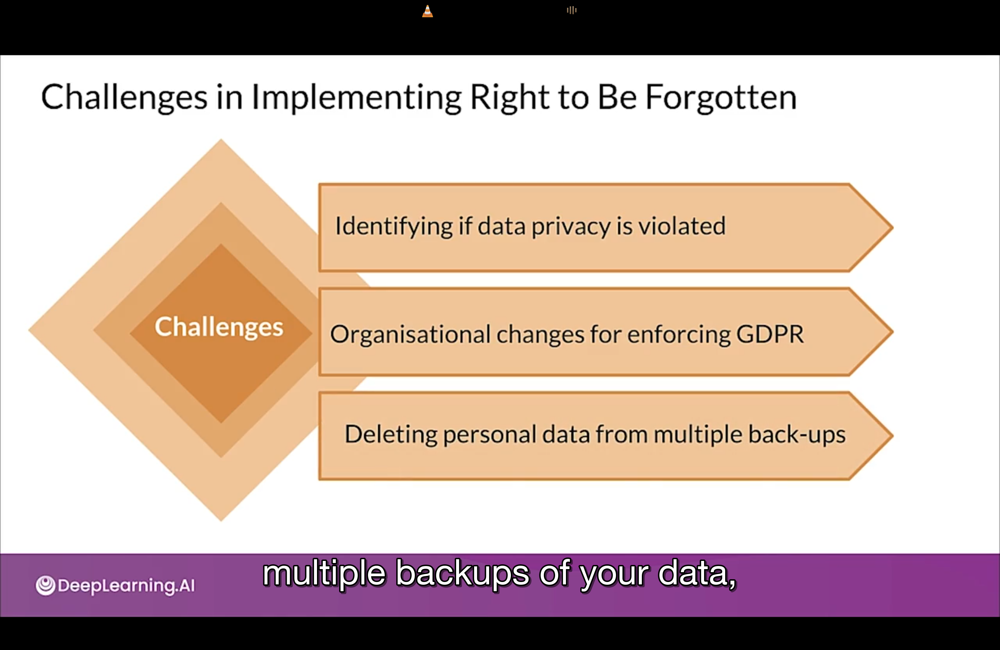 

I'm sorry, who are you again? Never mind. Anyway, it turns out that you have a right to be forgotten. Let's discuss that now, shall we?

First, some clarification of terms. When the GDPR refers to a data subject, it means a person, and when it refers to a controller, it means a person or organization who has control over a dataset containing Personally Identifiable Information or PII. Now that we've got that out of the way, let's ask the question. When does a person have the right to be forgotten? Well, there's a fairly long list of reasons for why an individual has the right to have their personal data erased.

Rather than trying to remember these, I encourage you to refer to the GDPR. The list includes the personal data is no longer necessary for the purpose an organization originally collected it or processed it, or an organization is relying on individual's consent as the lawful basis for processing the data and that individual withdraws their consent, or an organization is relying on legitimate interests as its justification for processing an individual's data and the individual objects to this processing, and there is no overriding legitimate interest for the organization to continue with the processing, or an organization is processing personal data for direct marketing purposes and the individual objects to this processing, or an organization processed an individual's personal data unlawfully, or an organization must erase personal data in order to comply with a legal ruling or obligation, or an organization has processed a child's personal data to offer them information society services, an information society might be a social network, for example. If any of those conditions are met, you must delete the person's data. In general, these are mostly common sense. However, in some cases, an organization's right to process someone's data might override their right to be forgotten.

Here are the reasons cited in the GDPR that override the right to be forgotten. The data is being used to exercise the right of freedom of expression and information, or the data is being used to comply was a legal ruling or obligation, or the data is being used to perform a task that is being carried out in the public interest or when exercising an organization's official authority, or the data being processed is necessary for public health purposes and serves in the public interest, or the data being processed is necessary to perform a preventative or occupational medicine, this only applies when the data is being processed by a health professional who is subject to a legal obligation of professional secrecy, or the data represents important information that serves the public interest, scientific research, historical research, or statistical purposes where the eraser of the data would be likely to impair or halt progress towards the achievement that was the goal of the processing, or the data is being used for the establishment of a legal defense or in the exercise of other legal claims. Furthermore, an organization can request a reasonable fee or deny a request to erase personal data if the organization can justify that the request was unfounded or excessive. But, in general, you should avoid overriding an individual's right to be forgotten unless you strongly meet one of these conditions. When in doubt err on the side of privacy.

You also have the right to have your personal information corrected or rectified. This might be important in situations like your credit history, health history, or employment history. The GDPR also defines a number of other rights which people or data subjects have. These include the right of access by the data subject, the right to restriction of processing, the right to data portability, and the right to object. As a general rule, it's best to err on the side of privacy and consider any personal information that you have in your data as sensitive.

You should restrict access to it and keep it safe. Above all, you should think of it as the property of the person whose information it is and honor their wishes. When you receive a valid request to have personal information deleted, you need to identify all of the information related to the content requested to be removed, you also need to identify and remove all of the metadata associated with that person. If you've run any analysis or trained any models, the derived data and logs, and models must also be removed or corrected. The goal here is as much as possible to make it as if you never had their data.

There are basically two ways to delete data which will satisfy the requirements of the GDPR: First, you can anonymize the data, which as you saw previously, will make it non personally identifiable under the terms of the GDPR, and the GDPR will no longer apply to anonymize data. Second, you can do a hard delete of the data, meaning actually delete the data, including any rows in your database which might contain it. Normally, your first impulse might be to always just do a hard delete, but often there are issues with that. Anonymization is another option. In a database or any other similar relational datastore, deleting records can cause havoc.

Part of this is because user data is often referenced in multiple tables, so deleting those records breaks the connections, which can be difficult, especially in large complex databases. For example, it can break foreign keys. On the other hand, anonymization keeps the records and only anonymizes the fields containing PII while still satisfying the requirements of the GDPR. There are several challenges in implementing the right to be forgotten: The process of identifying whether or not data privacy has been violated is itself a challenging task, in order to enforce the GDPR, several organizational changes are needed, including policy changes and training employees in how to enforce the right to be forgotten, and one last consideration, that can be tricky; if your organization maintains multiple backups of your data, which actually you should, making sure that your personal data has been deleted from all of your backups is challenging. You might very well have to change your data storage and backup implementation to maintain compliance with a GDPR.

Issues like GDPR and the right to be forgotten are already important to operating in a business environment. Understanding the machine learning issues around them will only get increasingly important. We've given you a basic understanding of today's reality in this area, but I strongly encourage you to keep watching for new developments. Also, I think it's always important to respect the privacy of your customers and treat any information or PII that you have with great care, and I strongly encourage you to do so.

47. 