1.  

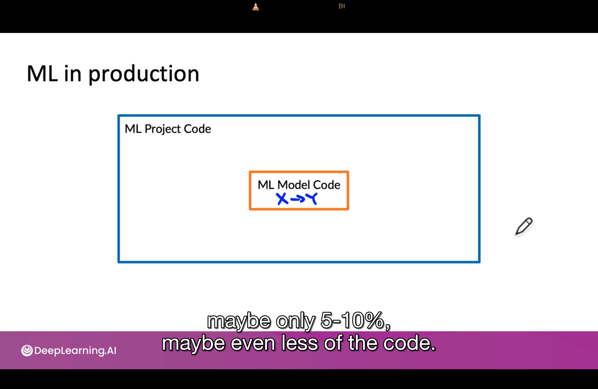

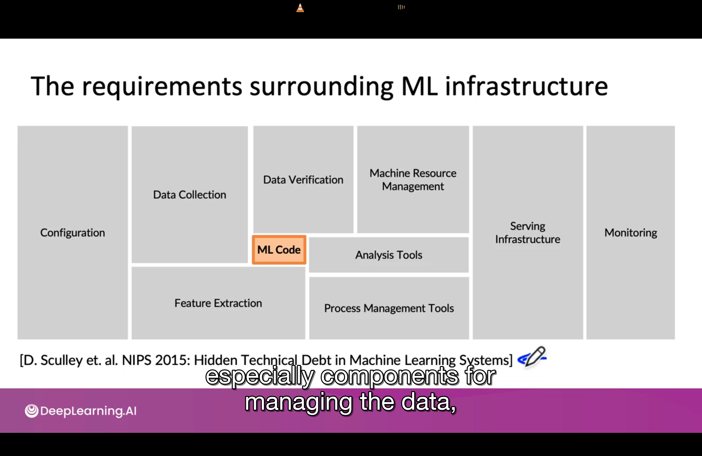

Hi and welcome to machine learning engineering for production. A lot of learners have asked, Hey Andrew, I've learned to train a machine learning model, now what do I do? Machine learning models are great, but unless you know how to put them into production, it's hard to get them to create the maximum amount of possible value. Or for those of you that may be looking for a position in machine learning, many interview as well, Have you ever deployed a machine learning algorithm production. In this four course specialization, the first course taught by me, the 2nd, 3rd and 4th causes taught by Robert.

Crowe is an expert at this from google. We hope to share with you to practical hands on skills and techniques. You need to not just build a machine learning model, but also to put them into production. And so by the end of this first course and by the end of this specialization, I hope you have a good sense of the entire life cycle of machine learning project. From training model to put into production and really how to manage the entire machine learning project.

Let's jump in. Let's start with an example, let's say you're using computer vision to inspect phones coming off a manufacturing line to see if there are defects on them. So this phone shown on the left doesn't have any stretches on it. But if there was a stretch of crack or something, a computer vision algorithm would hopefully be able to find this type of stretch, or defect. And maybe put the bounding box around it as part of quality control.

If you get a data set of scratched phones you can train a computer vision algorithm maybe in your network to detect these types of defects. But what do you now need to do in order to put this into production deployment? This would be an example of how you could deploy a system like this. You might have an edge device. By edge device, I mean a device that is living inside the factory that is manufacturing these smartphones.

And that edge device would have a piece of inspection software whose job it is to take a picture of the phone, see if there's a stretch and then make a decision on whether this phone is acceptable, or not. This is actually commonly done in factories is called automated visual defect inspection. What the inspection software does is it will control camera that will take a picture of the smartphone as it rolls off the manufacturing line. And it then has to make an API call to pass this picture to a prediction server. And the job of the prediction server is to accept these API calls, receive an image, make a decision as to whether or not this phone is defective and return this prediction.

And then the inspection software it can make the appropriate control decision whether to let it still move on in the manufacturing line. Or whether to shove it to a side, because it was defective and not acceptable. So after you have trained a learning algorithm, maybe train the neural network to take as input X, pictures of phones. And map down to y predictions about whether the phone is defective or not. You still have to take this machine learning model.

Put it in a production server, setup API interfaces and really write all of the rest of the software. In order to deploy this learning algorithm into production. This prediction server is sometimes in the cloud and sometimes the prediction server is actually at the edge as well. In fact in manufacturing we use edge deployments a lot, because you can't have your factory go down every time your internet access goes down. But cloud deployments with prediction server, is a server in the cloud, is also used for many applications.

Let's say you write all the software. What could possibly go wrong? It turns out that just because you've trained a learning algorithm that does well on your test set, which is to be celebrated. It's great when you do well when you hold a test set. Unfortunately reaching that milestone doesn't mean you're done.

There can still be quite a lot of work and challenges ahead to get a valuable production deployment running. For example, let's say your training sets has images that look like this. There's a good phone on the left, the one in the middle, it has a big scratch across it and you've trained your learning algorithm to recognize that phones like this on the left are okay. Meaning that no defects and maybe draw bounding boxes around scratches or other defects that finds and films. When you deploy it in the factory, you may find that the real life production deployment gives you back images like this much darker ones.

Because the lighting factory, because the lighting conditions in the factory have changed for some reason compared to the time when the training set was collected. This problem is sometimes called concept drift or data drift. You learn more about these terms later in this week. But this is one example of the many practical problems that we, as machine learning engineers should step up to solve if we want to make sure that we don't just do well on the holdout test set. But that our systems actually create value in a practical production deployment environment.

I've worked on quite a few projects where my machine learning team and I would successfully knew a proof of concept. And by that I mean we train a model in Jupiter notebook and it will work great and we will celebrate that. You should celebrate it when you have a learning, algorithm worked well in Jupiter notebook in a development environment. But it turns out that sometimes I'll see many projects where that success, which is a great success to the practical deployment is still maybe another six months of work. And this is just one of many of the practical things that a machine learning team has to watch out for and handle in order to actually deploy these systems.

Some machine learning engineers will say is not a machine learning problem to address these problems. The dataset changes. Some machine engineers think well, is that the machine learning problem? My point of view is that our job is to make these things work. And so if the data set has changed is I think of it as my responsibility when I work on a project to step in and do what I can to access the data distribution as it is rather than as I wish it is.

So this specialization will teach you about a lot of these important practical things for building machine learning systems that work not just in the lab, not just in the Jupiter notebook, but in a production deployment environment. A second challenge of deploying machine learning models and production is that it takes a lot more than machine learning code. Over the last decade there's been a lot of attention on machine learning models. So your neural network or other algorithm that learns a function mapping from some input to some output. And that's been amazing progress in machine learning models.

But it turns out that if you look at a machine learning system in production, if this little orange rectangle represents the machine learning code, the machine learning model code. Then this is all the codes you need for the entire machine learning project. I feel like for many machine learning projects, maybe only 5-10%, maybe even less of the code. Machine learning code. And I think this is one of the reasons why when you have a proof of concept model working maybe Jupiter notebook.

It can still be a lot of work to go from that initial proof of concept to the production deployment. So sometimes people refer to the POC. Or the proof of concept to production gap. And a lot of that gap is sometimes just the sheer amount of work it is to also write all of this code out here beyond the initial machine learning model code. So what is all this other stuff?

This is a diagram that have adapted from a paper by D Scully and others. Beyond the machine learning codes there are also many components, especially components for managing the data, such as data collection, data verification, feature extraction. And after you are serving it, how to monitor the system will monitor the data comes back, help you analyze it. But there are often many other components that need to be built to enable a working production deployment. So in this course you learn what are all of these other pieces of software needed for a valuable production deployment.

But rather than looking at all of these complex piece is one of the most useful frameworks are found for organizing. The workflow of a machine learning project is to systematically plan out the life cycle of a machine learning project. Let's go to the next video to dive into what is the full life cycle of a machine learning project. And I hope this framework will be very useful for all of your machine learning projects that you plan to deploy in the future. Let's go to the next video.

2.   

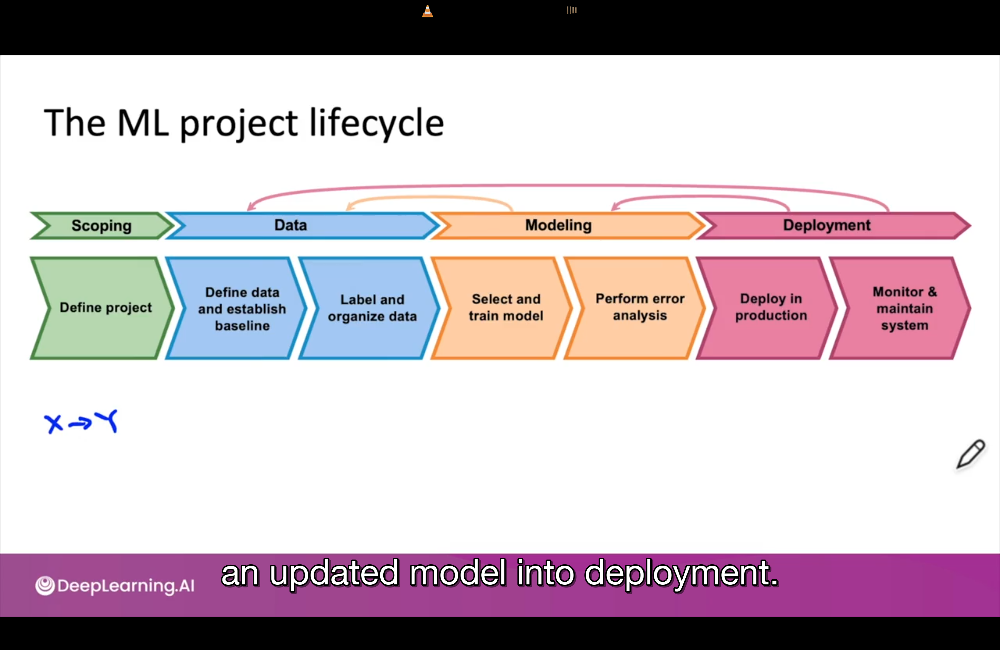
  
When I'm building a machine learning system, I've found that, thinking through the Machine Learning project lifecycle is a effective way for me to plan out all the steps that I need to work on. When you are working on Machine Learning system, I think you'll find too that this framework allows you to plan out all the important things you need to do in order to get the system to work and also to minimize surprises. Let's dive in.

These are the major steps of a Machine Learning project.

First is scoping, in which you have to define the project or decide what to work on. What exactly do you want to apply Machine Learning to, and what is X and what is Y. After having chosen the project, you then have to collect data or acquire the data you need for your algorithm. This includes defining the data and establishing a baseline, and then also labeling and organizing the data.

There are some best practices for this that are non-intuitive that you learn more about later in this week. After you have your data, you then have to train the model. During the model phase, you have to select and train the model and also perform error analysis. You might know that Machine Learning is often a highly iterative task.

During the process of error analysis, you may go back and update the model, or you may also go back to the earlier phase and decide you need to collect more data as well. As part of error analysis before taking a system to deployments, I'll often also carry out a final check, maybe a final audit, to make sure that the system's performance is good enough and that it's sufficiently reliable for the application. Sometimes, an engineer thinks that when you deploy a system, you're done. I now tell most people, when you deploy a system for the first time, you are maybe about halfway to the finish line, because it's often only after you turn on live traffic that you then learn the second half of the important lessons needed in order to get the system to perform well.

To carry out the deployment step, you have to deploy it in production, write the software needed to put into production, Then also monitor the system, track the data that continues to come in, and maintain the system. For example, if the data distribution changes, you may need to update the model. After the initial deployment, maintenance will often mean going back to perform more error analysis and maybe retrain the model, or it might mean taking the data you get back. Now that the system is deployed and is running on live data, and feeding that back into your dataset to then potentially update your data, retrain the model, and so on until you can put an updated model into deployment.

I found this framework useful for a very large variety of Machine Learning projects. From computer vision, to audio data, to structure data, to many other applications. Feel free to take a screenshot of this image and use it with your friends or by yourself to plan out your Machine Learning project as well. Thanks also to learning AIs, Steven Layett and Daniel Pipryata, who were instrumental to developing this diagram.

In this video, we quickly went through the machine learning project lifecycle in order to deepen our understanding of this project lifecycle or be useful to walk through a concrete example. In the next video, let's step through what these different steps of machine learning project lifecycle look like in the context of a speech recognition application. Let's go on to the next video.

3.   

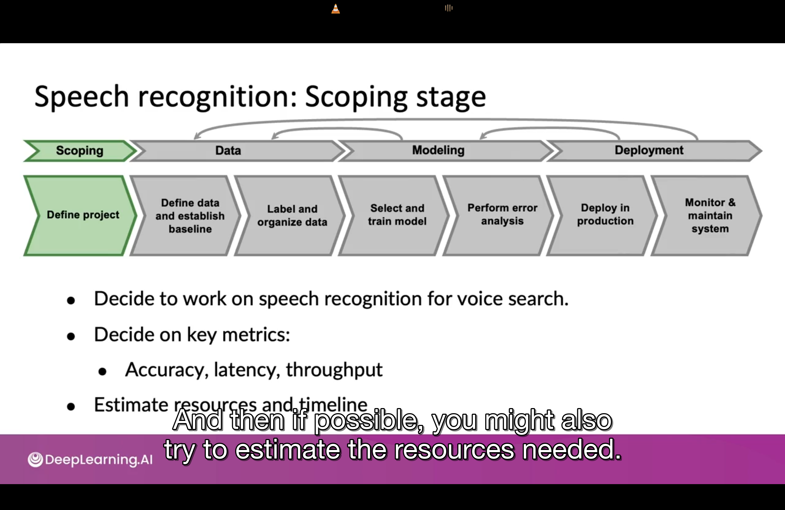

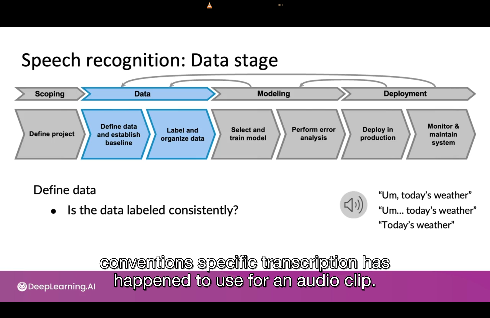

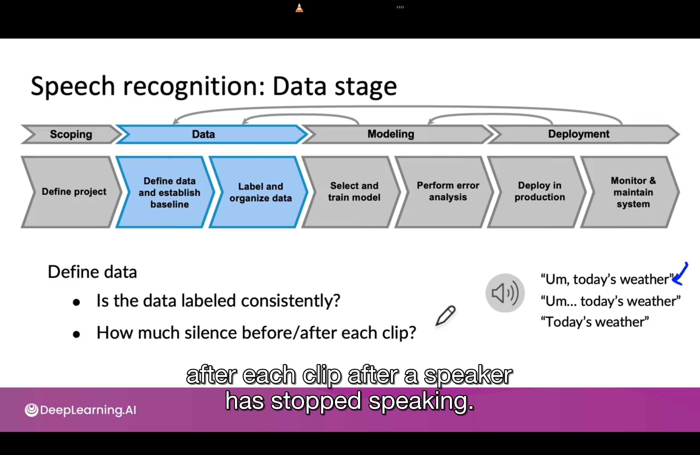

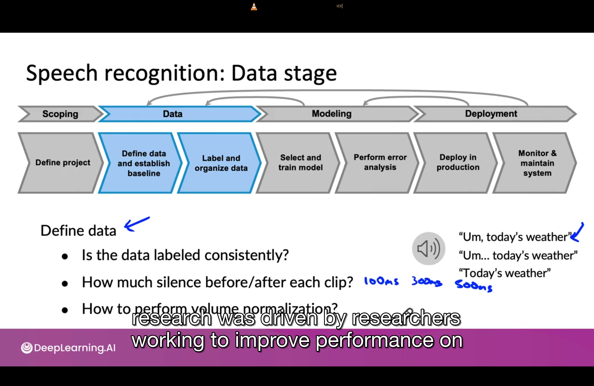

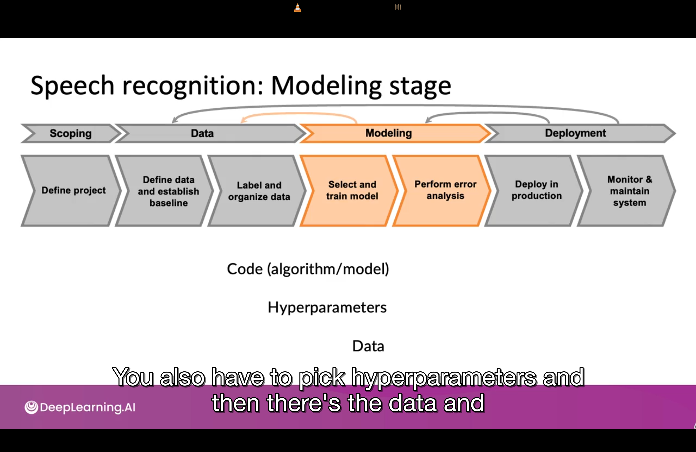

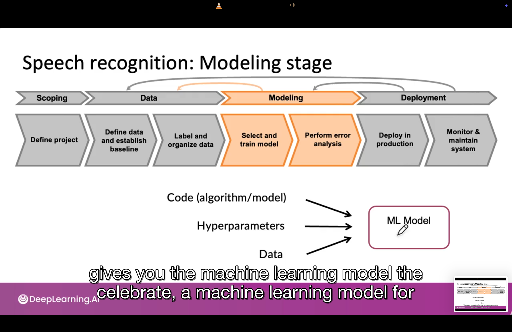

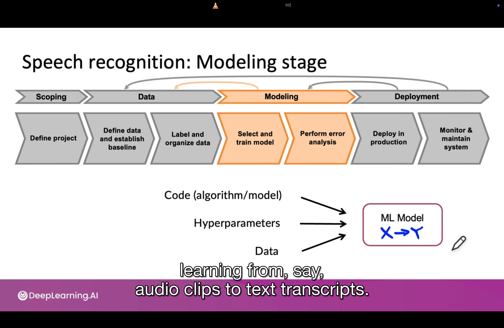

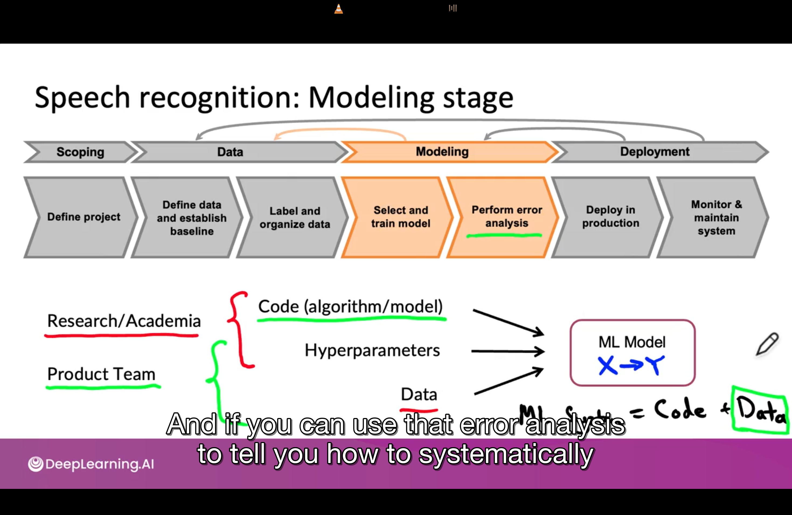

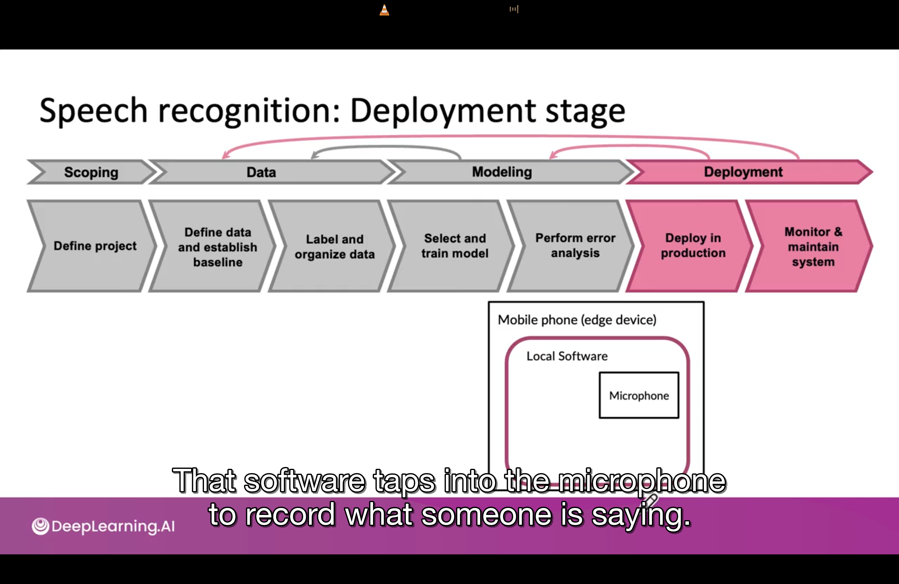

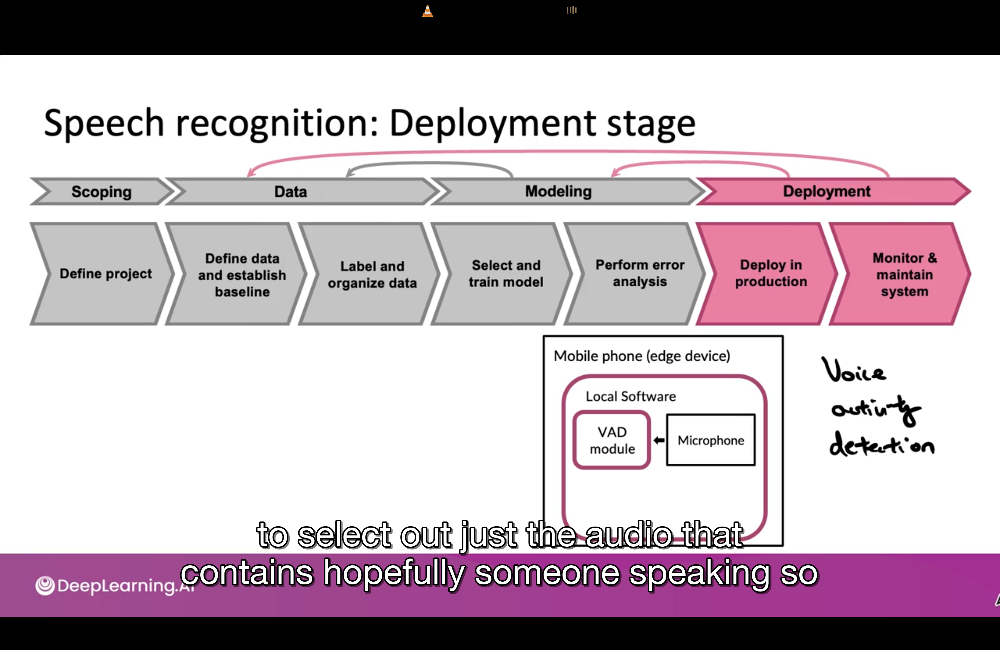

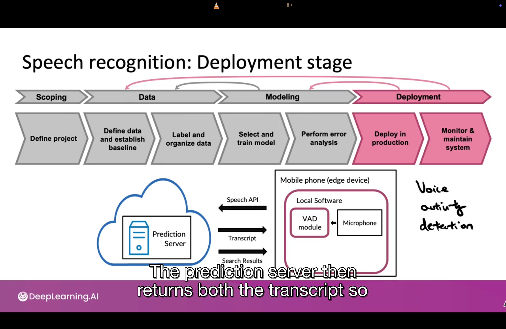

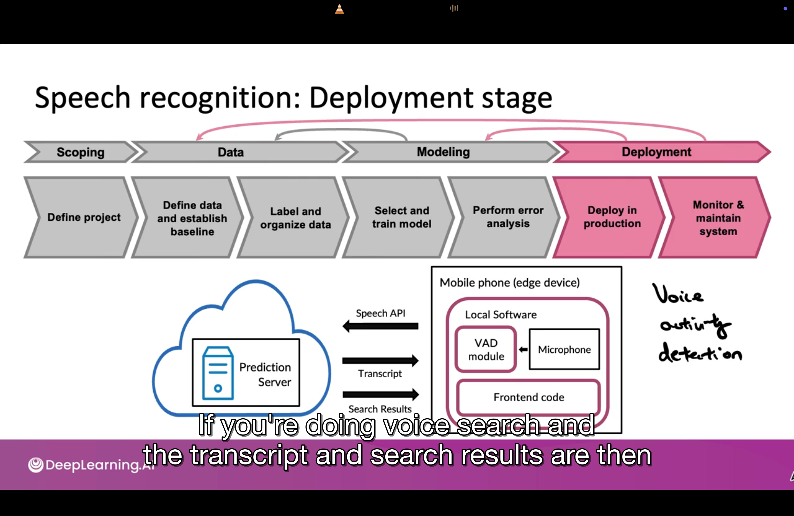

One of the successes of deep learning has been speech recognition. Deep learning has made speech recognition much more accurate than maybe a decade ago. And this is allowing many of us to use speech recognition in our smart speakers on our smartphones for voice search and in other context. You may have heard occasionally about the research work that goes into building better speech models. But what else is needed to actually build a valuable production deployment speech recognition system.

Let's use the machine learning project life cycle to set through a speech recognition example so you can understand all the steps needed to actually build and deploy such a system. I've worked on speech recognition systems in a commercial context before and so the first step of that was scoping have to first define the project and just make a decision to work on speech recognition, say for voice search as part of defining the project. That also encourage you to try to estimate or maybe at least estimate the key metrics. This will be very problem dependence. Almost every application will have his own unique set of goals and metrics.

But the case of speech recognition, some things I cared about where how accurate is the speech system was the latency? How long does the system take to transcribe speech and what is the throughput? How many queries per second we handle. And then if possible, you might also try to estimate the resources needed. So how much time, how much compute how much budget as well as timeline.

How long will it take to carry out this project? I'll have a lot more to say on scoping in week three of this course. So we'll come back to this topic and describe this in greater detail as well. The next step is the data stage where you have to define the data and establish a baseline and also label and organize the data. What's hard about this?

One of the challenges of practical speech recognition systems is the data label consistently, here's an audio clip of a fairly typical recording you might get if you're working on speech recognition for voice search, let me play this audio clip, And the question is given this audio clip that you just heard "Um today's whether", would you want to transcribe it like that? Which if you have transcriptionist label the data, this would be a perfectly reasonable transcription. Or would you want to transcribe it like that? Which is also a completely reasonable transcription or should the transcriptionist say, well there's often a lot of noise and audio, you know, maybe there's a sound of a conclave, something fell down and you don't want to transcribe noise. So maybe it's just noise and you should transcribe it like that.

It turns out that any of these three ways of transcribing the audio is just fine. I would probably prefer either the first or the second, not the third. But what what hurts your learning algorithm's performance is if one third of the transcription is used the first, one third, the second and one third third way of trans driving. Because then your data is inconsistent and confusing for the learning algorithm, because how is the learning algorithm supposed to guess which one of these conventions specific transcription has happened to use for an audio clip. So Spotting correcting consistencies like that.

Maybe just asking everyone to standardize on this first convention that can have a significant impact on your learning algorithm’s performance. So we'll come back later in this course to dive into some best practices for how to spot inconsistencies and how to address them. Other examples of data definition questions for an audio clip like today's whether, how much silence do you want before and after each clip after a speaker has stopped speaking. Do you want to include another 100 milliseconds of silence after that? Or 300 milliseconds or 500 milliseconds, half a second?

Or how do you perform volume normalization? Some speakers speak loudly, some are less loud and then there's actually a tricky case of if you have a single audio clip with some really loud volume and some really soft volume, all within the same audio clip. So how do you perform volume normalization. questions like all of these are data definition questions. A lot of progress in machine learning.

That is a lot of machine learning research was driven by researchers working to improve performance on benchmark data set. In that model, researchers might download the data set and just work on that fixed data set. And this mindset has led to tremendous progress in machine learning so no complaints at all about this mindset, but if you are working on a production system then you don't have to keep the data set fix. I often edit the training set or even at the test set if that's what's needed in order to improve the data quality to get a production system to work better. So what are practical ways to do this effectively not an ad hoc way, but systematic frameworks for making sure you have high quality data.

You learn more about this later in this course and later in the specialization as well. After you've collected your data set, the next step is modeling, in which you have to select and train the model and perform error analysis. The three key inputs that go into training a machine learning model are the code that is the algorithm or the neural network model architecture that you might choose. You also have to pick hyperparameters and then there's the data and running the code with your hyperparameters on your data gives you the machine learning model the celebrate, a machine learning model for learning from, say, audio clips to text transcripts. I found that in a lot of research work or academic work you tend to hold the data fixed and vary the code and may be vary the hyperparameters in order to try to get good performance.

In contrast, I found that for a lot of product teams, if your main goal is to just build and deploy a working valuable machine learning system, I found that it can be even more effective to hold the code fixed and to instead focus on optimizing the data and maybe the hyperparameters, In order to get a high performing model, A machine learning system includes both codes and data and also hyperparameters that there maybe a bit easier to optimize than the code or data. And I found that rather than taking a model-centric view of trying to optimize the code to your fixed data set for many problems, you can use an open source implementation of something you download of Git-hub and instead just focus on optimizing the data. So during modeling, do you have to select and train some model architecture. Maybe some neural network architecture error analysis can then tell you where your model still falls short. And if you can use that error analysis to tell you how to systematically improve your data, maybe improve the code too.

That's okay. But often if error analysis can tell you how to systematically improve the data, that can be a very efficient way for you to get to a high accuracy model. And part of the trick is you don't want to just feel like you need to collect more data all the time because we can always use more data. But rather than just trying to collect more and more and more data, which is helpful but can be expensive if their analysis can help you be more targeted in exactly what data to collect, that can help you'd be much more efficient in building an accurate model. Finally, when you have trained the model and when error analysis seems to suggest is working well enough, you're then ready to go into deployment, Check speech recognition.

This is how you might deploy a speech system. You have a mobile phone. This would be an edge device with software running locally on your phone. That software taps into the microphone to record what someone is saying. Maybe for voice search and in a typical implementation of speech recognition, you would use a VAD module.

VAD stands for a voice activity detection. Yeah. And it's usually a relatively simple algorithm. Maybe a learning algorithm and the job of the VAD allows the smartphone to select out just the audio that contains hopefully someone speaking so that you can send only that audio clip to your prediction server. And in this case maybe the prediction server lives into cloud.

This would be a common deployment pattern. The prediction server then returns both the transcript so the user, so you can see what the system thinks you said. And it also returns to search results. If you're doing voice search and the transcript and search results are then displayed in the front and code running on your mobile phone. So implementing this type of system would be the work needed to deploy a speech model in production even after it's running though you still have to monitor and maintain the system.

So here's something that happened to me once my team had built a speech recognition system and it was trained mainly on adult voices. We pushed into production, random production and we found that over time more and more young individuals, kind of teenagers, you know, sometimes even younger seem to be using our speech recognition system and the voices are very young individuals just sound different. And so my speech systems performance started to degrade. We just were not that good at recognizing speech as spoken by younger voices. And so he had to go back and find a way to collect more data are the things in order to fix it.

So one of the key challenges when it comes to deployment is concept drift or data drift, which is what happens when the data distribution changes, such as there are more and more young voices being fed to the speech recognition system. And knowing how to put in place appropriate monitors to spot such problems and then also how to fix them in a timely way is a key skill needed to make sure your production deployment creates a value you hope it will. To recap in this video. You saw the full life cycle of a machine learning project using speech recognition as the running example. So from scoping to data to modeling to deployment.

Next I want to briefly share review the major concepts and sequencing you learn about in this course. So come with me to the next video.

4.   
  
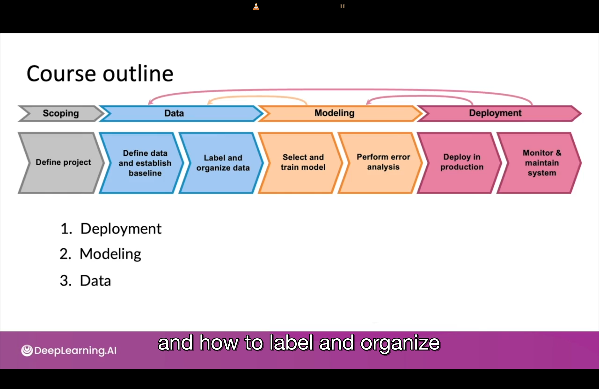

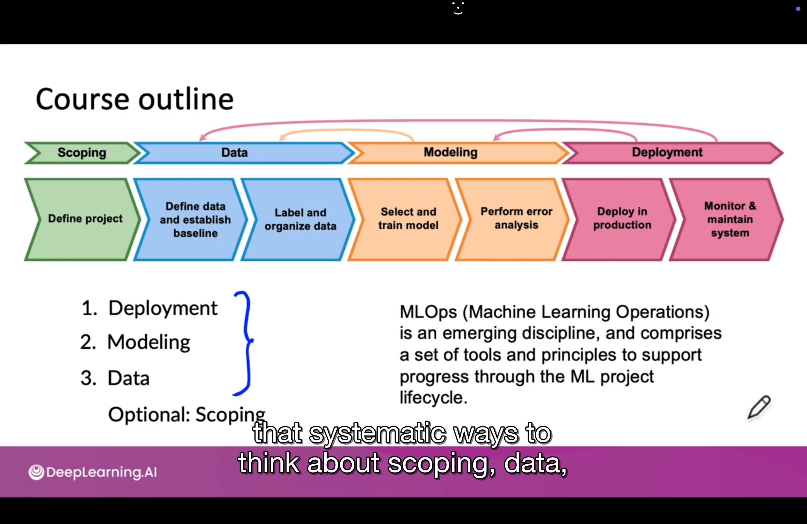

You've seen the machine learning project life cycle. Let's briefly go over what you'll learn in the rest of this course.

Even though I presented the life cycle going from left to right, I found that for learning these materials, it will be more efficient for you to start at the end goal, and start from deployment, and then work backwards to modeling data and then scoping. In the rest of this week, starting with the next video, you'll learn about the most important ideas in Deployment. Next week, in Week 2, you'll learn about modeling. You may have learned about how to train a machine learning model from other courses. In this video, I'll share some new ideas that you may not have heard before of how to systematically use a data-centric approach to be more efficient in how you improve the performance of your model.

Then in the third, and final week of this course, you'll learn about data. How to define data and establish a baseline, and how to label and organize your data in a way that is systematic. Not Ad hoc, not hacking around in the Jupyter notebook in the hope that you stumble onto the right insights, but in a more systematic way that helps you be more efficient in defining the data that will help the modeling to help you get to deployment. Then finally, in Week 3 we'll also have an optional section on scoping. In which I hope to share with you some tips I've learned on how to define effective machine learning projects.

Throughout this course, you'll also learn about MLOps, or machine learning operations. Which is an emerging discipline that comprises a set of tools and principles to support progress through the machine ML project life cycle, but especially these three steps. For example, at Landing AI, where I'm CEO, we used to do a lot of these steps manually, which is okay, but slow. But after building an MLOps tool called LandingLens for computer vision applications, all these steps became much quicker.

The key idea in MLOps is that systematic ways to think about scoping, data, modeling, and deployment, and also software tools to support the best practices. That's it. In this course, we're going to start at the end goal, start from deployment, and then work our way backwards. As you already know, being able to deploy system is one of the most important, and valuable skills in Machine Learning today. Let's go on to the next video where we'll dive deep into the most important ideas needed to deploy machine learning systems.

I will see you in the next video.

5.   
  

One of the most exciting moments of any machine learning project is when you get to deploy your model, but what makes deployment hard? I think there are two major categories of challenges in deploying a machine learning model. First, are the machine learning or the statistical issues, and second, are the software engine issues. Let's start with both of these so that you can understand what you need to do to make sure that you have a successful deployment of your system. One of the challenges of a lot of deployments is, concept drift and, data drift.

Loosely, this means what if your data changes after your system has already been deployed? I had previously given an example from manufacturing where you might have trained a learning algorithm to detect scratches on smartphones under one set of lighting conditions, and then maybe the lighting in the factory changes. That's one example of the distribution of data changers. Let's walk through a second example using speech recognition. I train a few speech recognition systems, and when I built speech systems, quite often I would have some purchased data.

This would be some purchased or licensed data, which includes both the input x, the audio, as well as the transcript y that the speech system supports it's output. In addition to data that you might purchase from a vendor, you might also have historical user data of user speaking to your application together with transcripts of that raw user data. Such user data, of course, should be collected with very clear user opt-in permission and clear safeguards for user privacy. After you've trained your speech recognition system on a data set like this, you might then evaluate it on a test set, but because speech data does change over time, when I build speech recognition systems, sometimes I would collect a dev set or hold out validation set as well as test set comprising data from just the last few months. You can test it on fairly recent data to make sure your system works, even on relatively recent data.

After you push the system to deployment, the question is, will the data change or after you've run it for a few weeks or a few months, has the data changed yet again? Because the data has changed, such as the language changes or maybe people are using a brand new model of smartphone which has a different microphone, so the audio sounds different, then the performance of a speech recognition system can degrade. It's important for you to recognize how the data has changed, and if you need to update your learning algorithm as a result. When data changes, sometimes it is a gradual change, such as the English language which does change, but changes very slowly with new vocabulary introduced at a relatively slow rate. Sometimes data changes very suddenly where there's a sudden shock to a system.

For example, when COVID-19 the pandemic hit, a lot of credit card fraud systems started to not work because the purchase patterns of individuals suddenly changed. Many people that did relatively little online shopping suddenly started to use much more online shopping. So the way that people were using credit cards changed very suddenly, and his actually tripped up a lot of anti fraud systems. This very sudden shift to the data distribution meant that many machine learning teams were scrambling a little bit at the start of COVID to collect new data and retrain systems in order to make them adapt to this very new data distribution. Sometimes the terminology of how to describe these data changes is not used completely consistently, but sometimes the term data drift is used to describe if the input distribution x changes, such as if a new politician or celebrity suddenly becomes well known and he's mentioned much more than before.

The term concept drift refers to if the desired mapping. From x to y changes such as if, before COVID-19. Perhaps for a given user, a lot of surprising online purchases, should have flagged that account for fraud. After the start of COVID-19, maybe those same purchases, would not have really been any cause for alarm, in terms of flagging. That the credit card may have been stolen.

Another example of Concept drift, let's say that x is the size of a house, and y is the price of a house, because you're trying to estimate housing prices. If because of inflation or changes in the market, houses may become more expensive over time. The same size house, will end up with a higher price. That would be Concept drift. Maybe the size of houses haven't changed, but the price of a given house changes.

Whereas data drift would be if, say, people start building larger houses, or start building smaller houses and thus the input distribution of the sizes of houses actually changes over time. When you deploy a machine learning system, one of the most important tasks, will often be to make sure you can detect and manage any changes. Including both Concept drift, which is when the definition of what is y given x changes. As well as Data drift, which is if the distribution of x changes, even if the mapping from x or y does not change. In addition to managing these changes to the data, a second set of issues, that you will have to manage to deploy a system successfully, are software engineering issues.

You are implementing a prediction service whose job it is to take queries x and output prediction y, you have a lot of design choices as to how to implement this piece of software. Here's a checklist of questions, that might help you with making the appropriate decisions for managing the software engineering issues. One decision you have to make for your application is, do you need Real time predictions or are Batch predictions? For example, if you are building a speech recognition system, where the user speaks and you need to get a response back, in half a second, then clearly you need real time predictions. In contrast, I have also built systems, for hospitals that take patient records.

Take electronic health records and run an overnight batch process to see if there's something associated with the patients, that we can spot. So in that type of system, it was fine if we just ran it, in a batch of patient records once per night. Whether you need to write real time software, they can respond within hundreds of milliseconds or whether you can write software that just does a lot of computation overnight, that will affect how you implement your software. By the way, later this week, you also get to step through an optional programming exercise, where you get to implement a real time prediction service, on your own computer. You see that at the optional exercise at the end of this week.

Second question you need to ask is, does your prediction service run into clouds or does it run at the edge or maybe even in a Web browser? Today there are many speech recognition systems that run in the cloud, because having the compute resources of the cloud, allows for more accurate speech recognition. There are also some speech systems, for example, a lot of speech systems within cars, actually run at the edge. There are also some mobile speech recognition systems that work, even if your Wi-Fi is turned off. Those would be examples of speech systems that run at the edge.

When I am deploying visual inspection systems in factories, I pretty much almost always run that at the edge as well. Because sometimes unavoidably, the Internet connection between the factory, and the rest of the Internet may go down. You just can't afford to shut down the factory, whenever its Internet connection goes down, which happens very rarely but maybe sometimes does happen. With the rise of modern Web browsers, there are better tools, for deploying learning algorithms, right there within a Web browser as well. When building a prediction service, it's also useful to take into account, how much computer resources you have.

There have been quite a few times where I trained a neural network on a very powerful GPU, only to realize that I couldn't afford an equally powerful set of GPUs for deployments, and wound up having to do something else to compress or reduce the model complexity. So if you know how much CPU or GPU resources and maybe also how much memory resources you have for your prediction service, then that could help you choose the right software architecture. Depending on your application especially if it's real-time application, latency and throughputs such as measured in terms of QPS, queries per second, will be other software engineering metrics you may need to hit. In speech recognition is not uncommon to want to get an answer back to the user, within half a second or 500 milliseconds. Of this 500 millisecond budget you may be able to allocate only say, 300 milliseconds to your speech recognition.

So that gives a latency requirement for your system. Throughput refers to how many queries per second do you need to handle given your compute resources, maybe given a certain number of Cloud Service. For example, if you're building a system that needs to handle 1000 queries per second, it would be useful to make sure to check out your system so that you have enough computer resources, to hit the QPS requirement. Next is logging, when building your system it may be useful to log as much of the data as possible for analysis and review as well as to provide more data for retraining your learning algorithm in the future. Finally, security and privacy, I find it for different applications the required levels of security and privacy can be very different.

For example, when I was working on electronic health records, patient records, clearly the requirements for security and privacy were very high because patient records are very highly sensitive information. Depending on your application you might want to design in the appropriate level of security and privacy, based on how sensitive that data is and also sometimes based on regulatory requirements. If you save this checklist somewhere, going through this when you're designing your software might help you to make the appropriate software engine choices when implementing your prediction service. To summarize, deploying a system requires two broad sets of tasks: there is writing the software to enable you to deploy the system in production. There is what you need to do to monitor the system performance and to continue to maintain it, especially in the face of concepts drift as well as data drift.

One of the things you see when you're building machine learning systems is that the practices for the very first deployments will be quite different compared to when you are updating or maintaining a system that has already previously been deployed. I know that to some engineers that view deploying the machine learning model as getting to the finish line. Unfortunately, I think the first deployment means you may be only about halfway there, and the second half of your work is just starting only after your first deployment, because even after you've deployed there's a lot of work to feed the data back and maybe to update the model, to keep on maintaining the model even in the face of changes to the data. One of the things we touch on the later videos is some of the differences between the first deployment, such as if your product never had the speech recognition system. But you've trained the speech recognition system and you're deploying for the first time, versus you already have had the learning of running for some time and you want to maintain or update that implementation.

To summarize, in this video, you saw some of the machine learning or statistical related issues such as concept drift and data drift. As well as some of the software engineering-related issues such as, whether you need a batch or real-time prediction service, and whether the compute and memory requirements you have to take into account. Now, it turns out that when you're deploying a machine learning model, there are a number of common design patterns, a common deployment patterns that are used in many applications across many different industries. In the next video, you'll see what are some of the most common deployment patterns, so that you can hopefully pick the right one for your application. Let's go on to the next video.

6. 
    
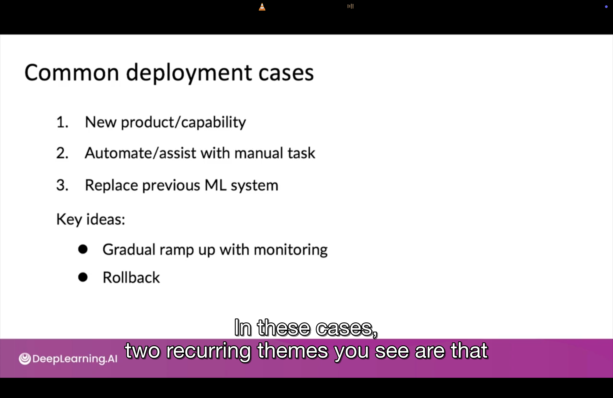

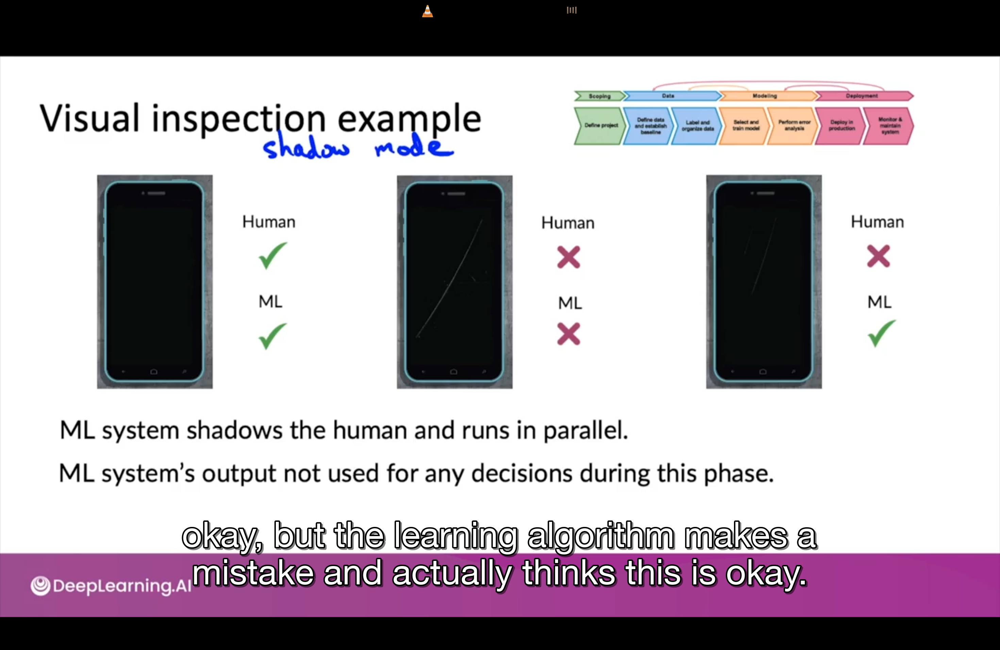

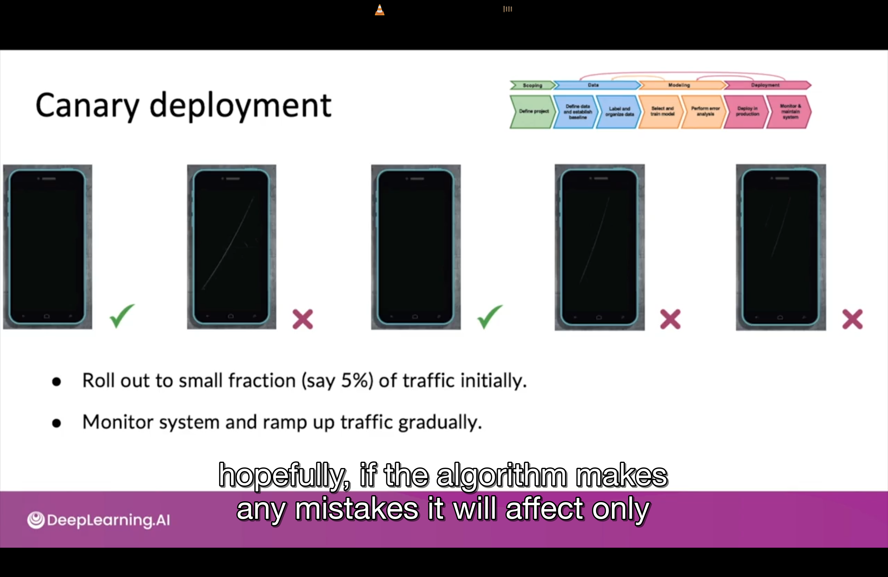

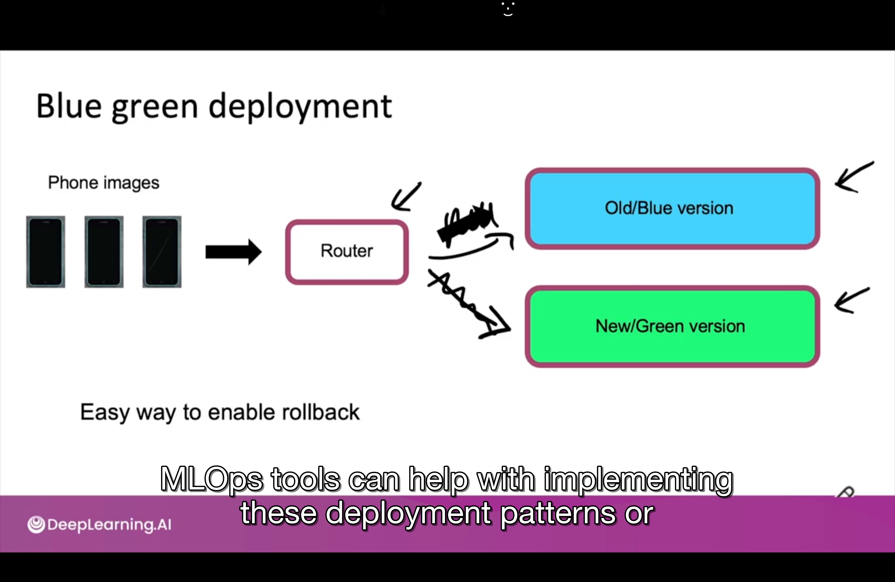

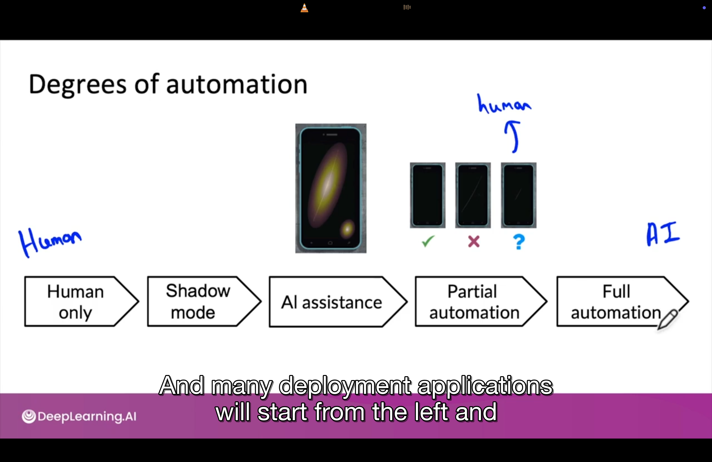
   

When you train the learning algorithm, the best way to deploy it is usually not to just turn it on and hope for the best because, well, what if something goes wrong? When deploying systems are a number of common use cases or types of use cases as well as different patterns for how you deploy depending on your use case. Let's go through that in this video. In the last video, I alluded to some of the differences between a first deployment versus a maintenance and update deployment. Let's flesh this out into a little bit more detail.

One type of deployment is if you are offering a new product or capability that you had not previously offered. For example, if you're offering a speech recognition service that you have not offered before, in this case, a common design pattern is to start up a small amount of traffic and then gradually ramp it up. A second common deployment use case is if there's something that's already being done by a person, but we would now like to use a learning algorithm to either automate or assist with that task. For example, if you have people in the factory inspecting smartphones scratches, but now you would like to use a learning algorithm to either assist or automate that task. The fact that people were previously doing this gives you a few more options for how you deploy.

And you see shadow mode deployment takes advantage of this. And finally, a third common deployment case is if you've already been doing this task with a previous implementation of a machine learning system, but you now want to replace it with hopefully an even better one. In these cases, two recurring themes you see are that you often want a gradual ramp up with monitoring. In other words, rather than sending tons of traffic to a maybe not fully proven learning algorithm, you may send it only a small amount of traffic and monitor it and then ramp up the percentage or amount of traffic. And the second idea you see a few times is rollback.

Meaning that if for some reason the algorithm isn't working, it's nice if you can revert back to the previous system if indeed there was an earlier system. Let's start with an example in visual inspection where perhaps you've had human inspectors inspect smartphones for defects for scratches. And you would now like to automate some of this work with a learning algorithm. When you have people initially doing a task, one common deployment pattern is to use shadow mode deployment. And what that means is that you will start by having a machine learning algorithm shadow the human inspector and running parallel with the human inspector.

During this initial phase, the learning algorithms output is not used for any decision in the factory. So whatever the learning algorithm says, we're going to go the human judgment for now. So let's say for this smartphone the human says it's fine, no defect. The learning algorithm says it's fine. Maybe for this example of a big stretch down the middle, person says it's not okay and the learning algorithm agrees.

And maybe for this example with a smaller stretch, maybe the person says this is not okay, but the learning algorithm makes a mistake and actually thinks this is okay. The purpose of a shadow mode deployment is that allows you to gather data of how the learning algorithm is performing and how that compares to the human judgment. And by something the output you can then verify if the learning algorithm's predictions are accurate and therefore use that to decide whether or not to maybe allow the learning algorithm to make some real decisions in the future. So when you already have some system that is making good decisions and that system can be human inspectors or even an older implementation of a learning algorithm. Using a shadow mode deployment can be a very effective way to let you verify the performance of a learning algorithm before letting them make any real decisions.

When you are ready to let a learning algorithm start making real decisions, a common deployment pattern is to use a canary deployment. So there's a phone, algorithm says it's okay, rejects that, says that's okay, rejects that, rejects that. And in a canary deployments you would roll out to a small fraction, maybe 5%, maybe even less of traffic initially and start let the algorithm making real decisions. But by running this on only a small percentage of the traffic, hopefully, if the algorithm makes any mistakes it will affect only a small fraction of the traffic. And this gives you more of an opportunity to monitor the system and ramp up the percentage of traffic it gets only gradually and only when you have greater confidence in this performance.

The phrase canary deployment is a reference to the English idiom or the English phrase canary in a coal mine, which refers to how coal miners used to use canaries to spot if there's a gas leak. But with canary the deployment, hopefully this allows you to spot problems early on before there are maybe overly large consequences to a factory or other context in which you're deploying your learning algorithm. Another deployment pattern that is sometimes used is a blue green deployment. Let me explain with the picture. Say you have a system, a camera software for collecting phone pictures in your factory.

These phone images are sent to a piece of software that takes these images and routes them into some visual inspection system. In the terminology of a blue green deployments, the old version of your software is called the blue version and the new version, the Learning algorithm you just implemented is called the green version. In a blue green deployment, what you do is have the router send images to the old or the blue version and have that make decisions. And then when you want to switch over to the new version, what you would do is have the router stop sending images to the old one and suddenly switch over to the new version. So the way the blue green deployment is implemented is you would have an old prediction service may be running on some sort of service.

You will then spin up a new prediction service, the green version, and you would have the router suddenly switch the traffic over from the old one to the new one. The advantage of a blue green deployment is that there's an easy way to enable rollback. If something goes wrong, you can just very quickly have the router go back reconfigure their router to send traffic back to the old or the blue version, assuming that you kept your blue version of the prediction service running. In a typical implementation of a blue green deployment, people think of switching over the traffic 100% all at the same time. But of course you can also use a more gradual version where you slowly send traffic over.

As you can imagine, whether use shadow mode, canary mode, blue green, or some of the deployment pattern, quite a lot of software is needed to execute this. MLOps tools can help with implementing these deployment patterns or you can implement it yourself. One of the most useful frameworks I have found for thinking about how to deploy a system is to think about deployment not as a 0, 1 is either deploy or not deploy, but instead to design a system thinking about what is the appropriate degree of automation. For example, in visual inspection of smartphones, one extreme would be if there's no automation, so the human only system. Slightly mode automated would be if your system is running a shadow mode.

So your learning algorithms are putting predictions, but it's not actually used in the factory. So that would be shadow mode. A slightly greater degree of automation would be AI assistance in which given a picture like this of a smartphone, you may have a human inspector make the decision. But maybe an AI system can affect the user interface to highlight the regions where there's a scratch to help draw the person's attention to where it may be most useful for them to look. The user interface or UI design is critical for human assistance.

But this could be a way to get a slightly greater degree of automation while still keeping the human in the loop. And even greater degree of automation maybe partial automation, where given a smartphone, if the learning algorithm is sure it's fine, then that's its decision. It is sure it's defective, then we just go to algorithm's decision. But if the learning algorithm is not sure, in other words, if the learning algorithm prediction is not too confident, 0 or 1, maybe only then do we send this to a human. So this would be partial automation.

Where if the learning algorithm is confident of its prediction, we go the learning algorithm. But for the hopefully small subset of images where the algorithm is not sure we send that to a human to get their judgment. And the human judgment can also be very valuable data to feedback to further train and improve the algorithm. I find that this partial automation is sometimes a very good design point for applications where the learning algorithms performance isn't good enough for full automation. And then of course beyond partial automation, there is full automation where we might have the learning algorithm make every single decision.

So there is a spectrum of using only human decisions on the left, all the way to using only the AI system's decisions on the right. And many deployment applications will start from the left and gradually move to the right. And you do not have to get all the way to full automation. You could choose to stop using AI assistance or partial automation or you could choose to go to full automation depending on the performance of your system and the needs of the application. On this spectrum both AI assistance and partial automation are examples of human in the loop deployments.

I find that the consumer Internet applications such as if you run a web search engine, write online speech recognition system. A lot of consumer software Internet businesses have to use full automation because it's just not feasible to someone on the back end doing some work every time someone does a web search or does the product search. But outside consumer software Internet, for example, inspecting things and factories. They're actually many applications where the best design point maybe a human in the loop deployments rather than a full automation deployment. In this video, you saw a few patterns of deployments, such as a shadow mode deployment, canary deployment, blue green deployment.

And you also saw how you can pick the most appropriate degree of automation depending on your application, which could be a human in the loop deployments or full automation. As we went through these ideas, you heard me mention a few times the importance of monitoring to help you spot problems if any so they can address them. Let's dive into the details of how to monitor the system in the next video.

7.   
   
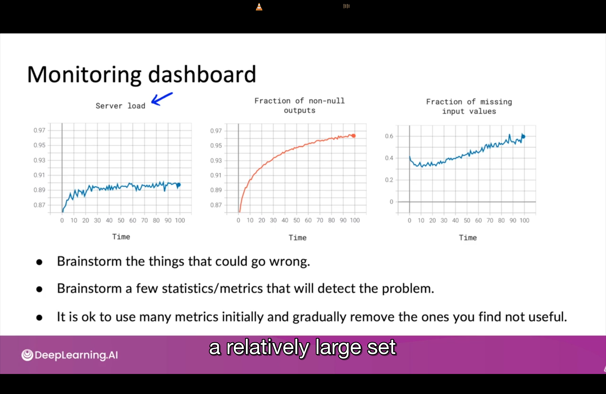

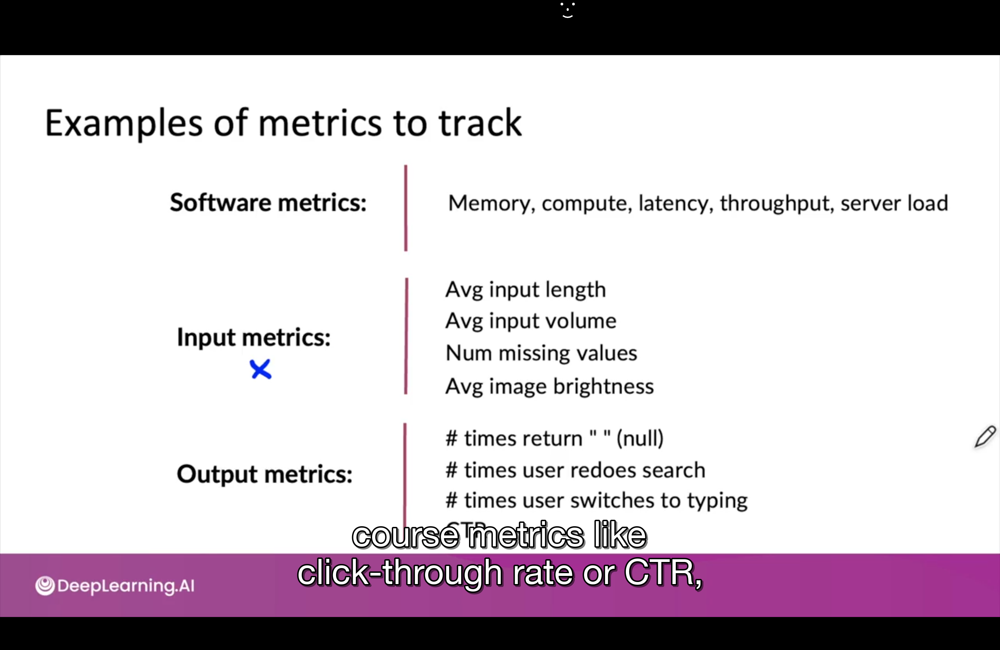

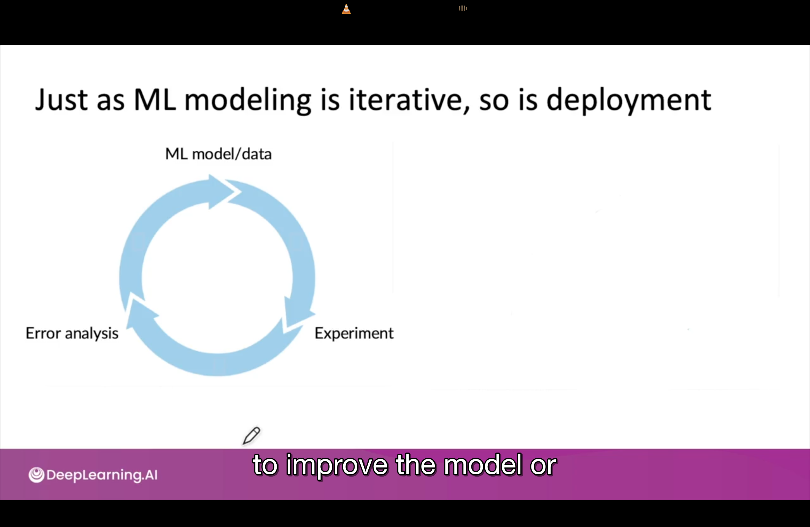

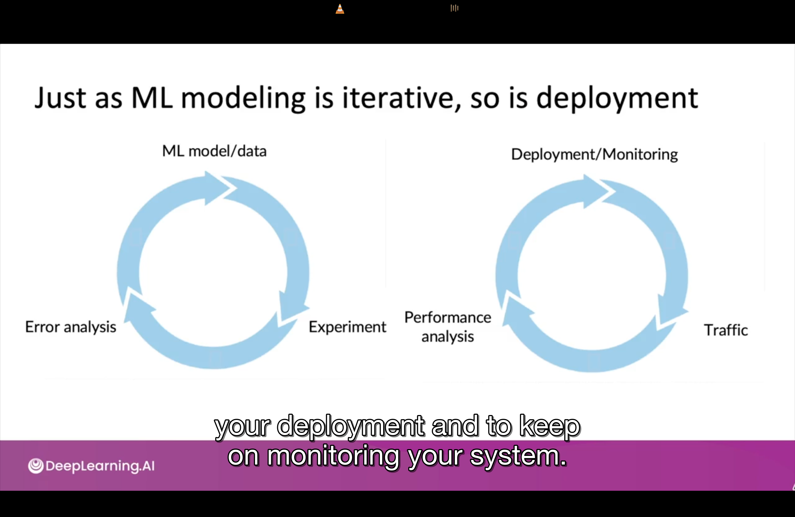

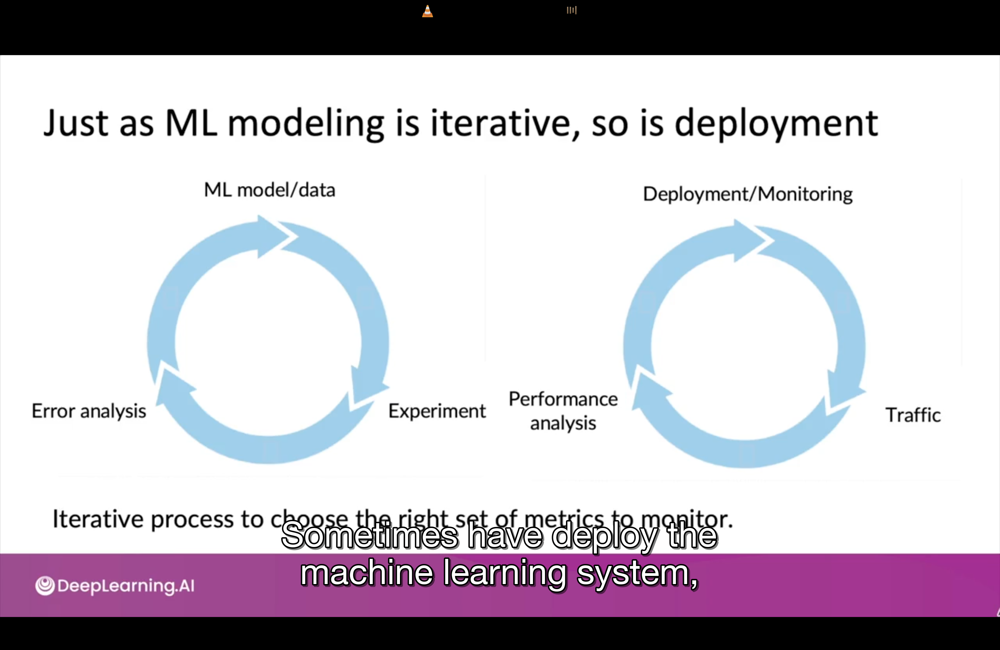

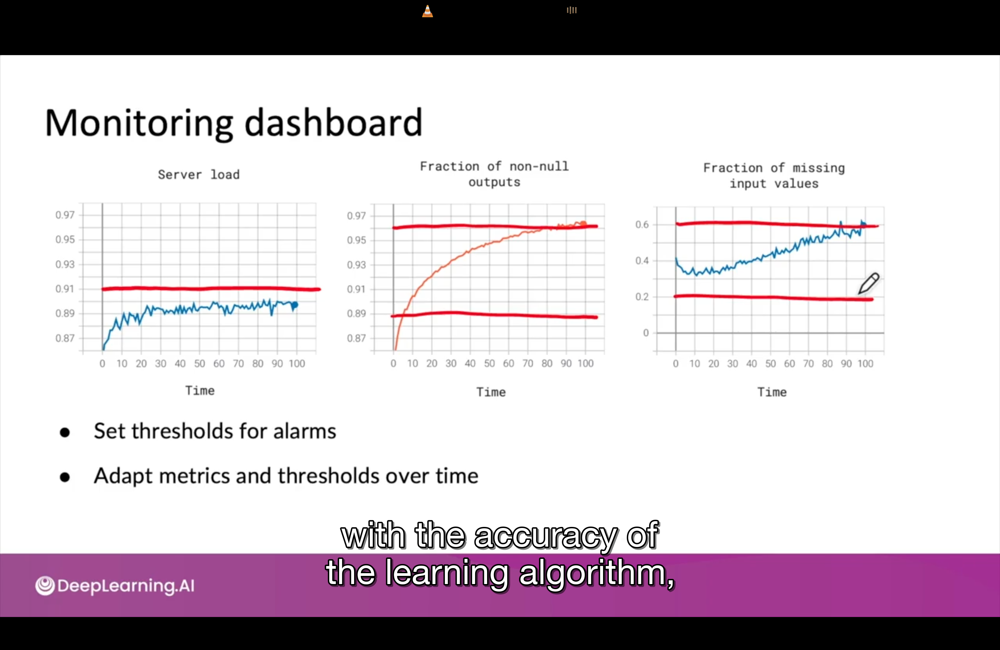

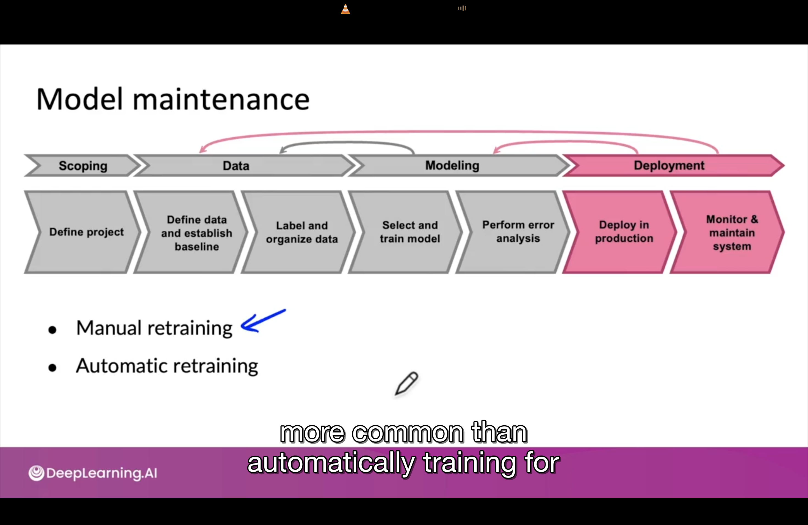

How can you monitor a machine learning system to make sure that it is meeting your performance expectations? In this video, you'll learn about best practices for monitoring deployed machine learning systems. The most common way to monitor a machine learning system is to use a dashboard to track how it is doing over time. Depending on your application, your dashboards may monitor different metrics.

For example, you may have one dashboard to monitor the server load, or a different dashboards to monitor diffraction of non-null outputs. Sometimes a speech recognition system output is null when the things that users didn't say anything. If this changes dramatically over time, it may be an indication that something is wrong, or one common one I've seen for a lot of structured data task is monitoring the fraction of missing input values. If that changes, it may mean that something has changed about your data.

When you're trying to decide what to monitor, my recommendation is that you sit down with your team and brainstorm all the things that could possibly go wrong. Then you want to know about if something does go wrong. For all the things that could go wrong, brainstorm a few statistics or a few metrics that will detect that problem. For example, if you're worried about user traffic spiking, causing the service to become overloaded, then server loads maybe one metric, you could track and so on for the other examples here.

When I'm designing my monitoring dashboards for the first time, I think it's okay to start off with a lot of different metrics and monitor a relatively large set and then gradually remove the ones that you find over time not to be particularly useful. Here are some examples of metrics our views or I've seen others use on a variety of projects. First are the software metrics, such as memory, compute, latency, throughput, server load, things that help you monitor the health of your software implementation of the prediction service or other pieces of software around your learning algorithm. But these software metrics will help you make sure that your software is running well.

Many MLOps tools will come over the bouts already tracking these software metrics. In addition to the software metrics, I would often choose other metrics that help monitor the statistical health or the performance of the learning algorithm. Broadly, there are two types of metrics you might brainstorm around. One is input metrics, which are metrics that measure has your input distribution x change.

For example, if you are building a speech recognition system, you might monitor the average input length in seconds of the length for the audio clip fed to your system. You might monitor the average input volume. If these change for some reason, that might be something you'll once to take a look at just to make sure this hasn't hurt the performance of your algorithm. I mentioned just now, number or percentage of missing values is a very common metric.

When using structured data, some of which may have missing values, or for the manufacturing visual inspection example, you might monitor average image brightness if you think that lighting conditions could change, and you want to make sure you know if it does, so you can brainstorm different metrics to see if your input distribution x might have changed. A second set of metrics that help you understand if your learning algorithm is performing well are output metrics. Such as, how often does your speech recognition system return null, the empty string, because the things the user doesn't say anything, or if you have built a speech recognition system for web search using voice, you might decide to see how often does the user do two very quick searches in a row with substantially the same input. That might be a sign that you misrecognize their query the first time round.

It's an imperfect signal but you could try this metric and see if it helps. Or you could monitor the number of times the user first try to use the speech system and then switches over to typing, that could be a sign that the user got frustrated or gave up on your speech system and could indicate degrading performance. Of course, for web search, you would also use maybe very course metrics like click-through rate or CTR, just to make sure that the overall system is healthy. These output metrics can help you figure out if either your learning algorithm, output y has changed in some way, or if something that comes even after your learning algorithms output, such as the user's switching over to typing has changed in some significant way.

Because input and output metrics are application specific, most MLOps tools will need to be configured specifically to track the input and output metrics for your application. You may already know that machine learning modeling is a highly iterative process, so as deployment. Take modeling, you would come up with a machine learning model and some data, train the model, that's an experiment. Then do error analysis and use the error analysis to go back to figure out how to improve the model or your data and is by iterating through this loop multiple times that you then hopefully gets a good model.

I encourage you to think of deployments as an iterative process as well. When you get your first deployments up and running and put in place a set of monitoring dashboards. But that's only the start of this iterative process. A running system allows you to get real user data or real traffic.

It is by seeing how your learning algorithm performs on real data on real traffic that, that allows you to do performance analysis, and this in turn helps you to update your deployment and to keep on monitoring your system. In my experience, it usually takes a few tries to converge to the right set of metrics to monitor. Sometimes have deploy the machine learning system, and it's not uncommon for you to deploy machine learning system with an initial set of metrics only to run the system for a few weeks and then to realize that something could go wrong with it that you hadn't thought of before and into pick a new metric to monitor. Or for you to have some metric that you monitor for a few weeks and then decide they're just metric, hardly ever changes in does is inducible, and to get rid of that metric in favor of focusing attention on something else.

After you've chosen a set of metrics to monitor, common practice would be to set thresholds for alarms. You may decide based on this set, if the server load ever goes above 0.91, that may trigger an alarm or a notification to let you know or let the team know to see if there's a problem and maybe spin up some more servers. Or if the fashion of non-null plus goals above or beyond certain thresholds that might trigger an alarm. Or if they're not, fraction of missing values goes above or below some set of thresholds, maybe that should trigger an alarm, and it is okay if you adapt the metrics and the thresholds over time to make sure that they are flagging to you the most relevant cases of concern.

If something goes wrong with your learning algorithm, if is a software issue such as server load is too high, then that may require changing the software implementation, or if it is a performance problem associated with the accuracy of the learning algorithm, then you may need to update your model. Or if it is an issue associated with the accuracy of the learning algorithm, then you may need to go back to fix that that's why many machine learning models will need a little bit of maintenance or retraining over time. Just like almost all software needs some level of maintenance as well. When a model needs to be updated, you can either retrain it manually, where in Engineer, maybe you will retrain the model perform error analysis and the new model and make sure it looks okay before you push that to deployment.

Or you could also put in place a system where there is automatic retraining. Today, manual retraining is far more common than automatically training for many applications developers are reluctant to learning algorithm be fully automatic in terms of deciding to retrain and pushing new model to production, but there are some applications, especially in consumer software Internet, where automatically training does happen. We'll talk more about retraining and how to vet or verify a model's performance before pushing a new model out to production in next week's videos. But the key takeaways are that it is only by monitoring the system that you can spot if there may be a problem that may cause you to go back to perform a deeper error analysis, or that may cause you to go back to get more data with which you can update your model so as to maintain or improve your system's performance.

You learn more about how to update models in the next two weeks Materials as well. In this video, you'll learn how to monitor the performance of the machine learning system, so that in case something needs to be maintained or fixed, you can be alerted so they can take the appropriate action. We've talked about how to monitor the performance of a single machine learning model. One of the most useful concepts is for more complex systems, where you don't have just one model with a more complex machine learning pipeline, how do you monitor the performance of that?

You'll learn about that in the next video.

8.   

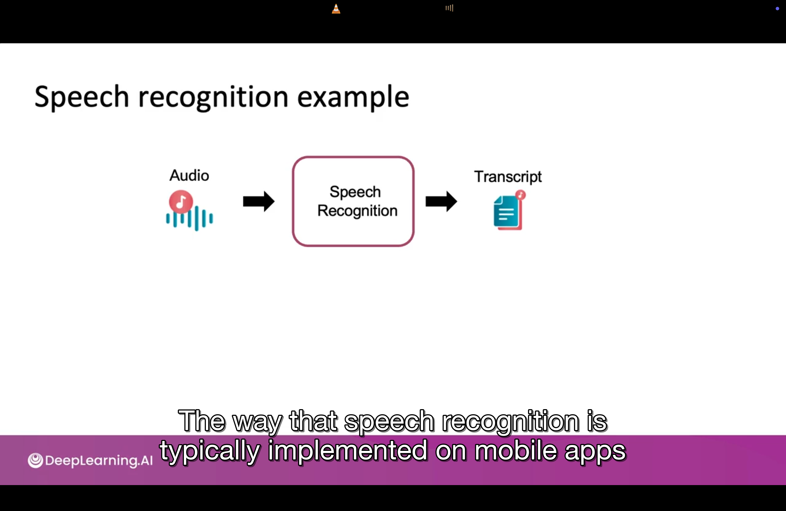

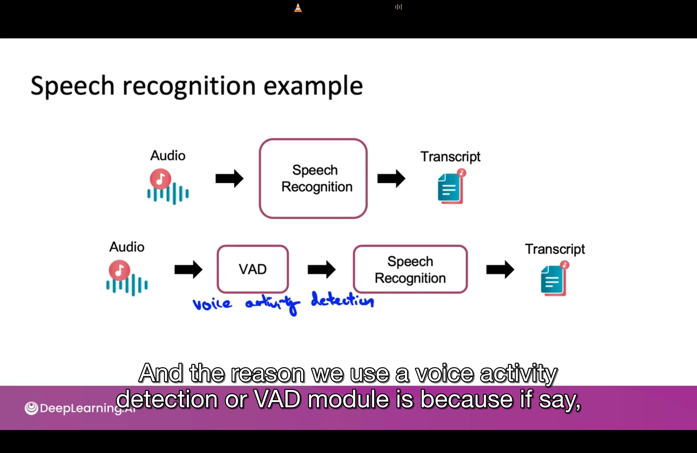

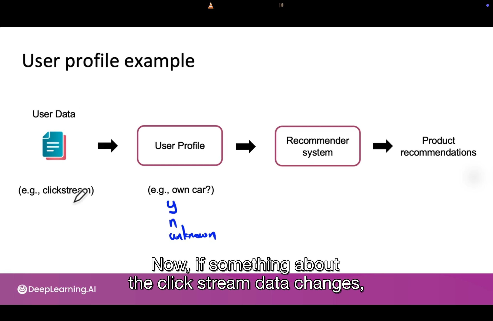

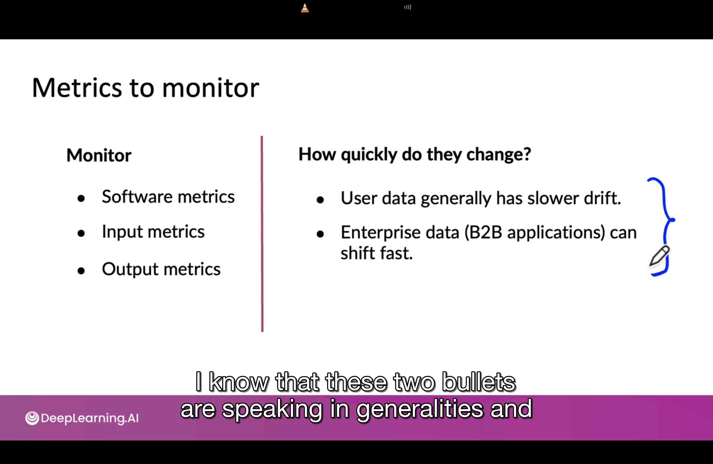

Many AI systems are not just a single machine learning model running a prediction service, but instead involves a pipeline of multiple steps. So what a machine learning pipelines and how do you build monitoring systems for that? Let's learn about that in this video. Let's continue with our speech recognition example, you've seen how a speech recognition system may take as input audio and output a transcript.

The way that speech recognition is typically implemented on mobile apps is not like this, but instead is a slightly more complex pipeline. Where the audio is fed to a module called a VAD or a voice activity detection module, whose job it is to see if anyone is speaking. And only if the VAD module, the voice activity detection module thinks someone is speaking, does it then bother to pass the audio on to a speech recognition system whose job it is to then generate the transcript. And the reason we use a voice activity detection or VAD module is because if say, your speech recognition system runs in the cloud.

You don't want to stream more bandwidth than you have to to your cloud server. And so the voice activity detection module looks at the long stream of audio on your cell phone and clips or shortens the audio to just the part where someone is talking and streams only that to the cloud server to perform the speech recognition. So this is an example of a machine learning pipeline where there is one step usually done by learning algorithm as well to decide if someone is talking or not. And then the second step, also done by a learning algorithm to generate the text transcript.

When you have two learning algorithms, one does learn to detect someone's talking and one does learn to transcribe speech. When you have two such modules working together, changes to the first module may affect the performance of the second module as well. For example, let's say that because of the way a new cell phone's microphone works. The VAD module ends up clipping the audio differently.

Maybe it leaves more silence at the start or end or less silence at the start or end. And does if the VAD's output changes, that will cause the speech recognition systems input to change. And that could cause degraded performance of the speech recognition system. Let's look an example involving user profiles.

Maybe I've used the data such as clickstream data showing what users are clicking on. And this can be used to build a user profile that tries to capture key attributes or key characteristics of a user. For example, I once built user profiles that would try to expect many attributes of users including whether or not the user seemed to own a car. Because this would help us decide if it was worth trying to offer car insurance office to that user.

And so whether the user owns a car could be yes or no or unknown, or maybe other final graduations and these. And the typical way that the user profile is built is with a learning algorithm to try to predict if this user of the car. This type of user profile, which can have a very long list of predicted attributes, can then be fed to recommend a system. Another learning algorithm that then takes this understanding of the user to try to generate product recommendations.

Now, if something about the click stream data changes, maybe this input distribution changes, then maybe over time if we lose our ability to figure out if a user owns a car, then the percentage of the unknown tag here may go up. And because the user profiles output changes, the input to the recommended system now changes and this might affect the quality of the product recommendations. When you have a machine learning pipelines, these cascading effects in the pipeline can be complex to keep track on. But if the percentage of unknown labels does go up, this could be something that you want to be alerted to so that you can update the recommend the system if needed to make sure you continue to generate high quality product recommendations.

So when building these complex machine learning pipelines, which can have machine learning based components or non-machine learning based components throughout the pipeline. I find it useful to brainstorm metrics to monitor that can detect changes including concept drift or data driven or both, and multiple stages of the pipeline. So, metrics to monitor include software metrics for perhaps each of the components in the pipeline, or perhaps for the overall pipeline as a whole. As well as input metrics and potentially output metrics for each of the components of the pipeline.

And by brainstorming metrics associated with individual components of the pipeline as well. This could help you spot problems such as the voice activity detection system of putting longer or shorter audio clears over time or the user profile system suddenly having more unknown attributes for whether the user owns a car. And thereby alert you to changes in the data that may require you to take action to maintain the model. But the principle that you saw in the last video of brainstorm all the things that could go wrong, including things that could go wrong with individual components of the pipeline and design metrics to track those.

That principle still applies only now you're looking at multiple components in the pipeline. Finally, how quickly does data change? The rate at which data changes is very problem dependent. For example, let's see it built to face recognition system.

Then the rate at which people's appearances changes usually isn't that fast. People's hairstyles and clothing does change with fashion changes. And as cameras get better, we've been getting higher and higher resolution pictures of people over time. But for the most part, people's appearances don't change that much.

But there are sometimes things that can change very quickly as well, such as if a factory gets a new batch of material for how they make cell phones and so all the cell phones not to change in appearance. So some applications will have data that changes over the time scale of months or even years. And some applications with data that could suddenly change in a matter of minutes. Speaking in very broad generalities, I find that on average, user data generally changes relatively slowly.

If you run a consumer facing business with a very large numbers of users, then it is quite rare for millions of users to all suddenly change their behavior all at the same time. And so user data, if a large number of users will usually change relatively slowly. There are a few exceptions, of course, COVID-19 being one of them were a shock to society actually cause a lot of people's behavior that all change at the same time. And if you look at web search traffic, you will see trends maybe a holiday or a new movie and people start searching for something new.

They just became popular. So there are exceptions, but on average, if you have a very large group of users, there are only a few forces. They can simultaneously change the behavior of a lot of people or at the same time. In contrast, if you work on a B2B or business to business application, I find an enterprise data or business data can shift quite quickly.

Because the factory making cellphones may suddenly decide. So use a new coating for the cell phones and suddenly the entire dataset changes because the cell phones suddenly all look different. But if you're providing a machine learning system to a company, then sometimes if the CEO of that company decides to change the way that business operates, all of that data can shift very quickly. I know that these two bullets are speaking in generalities and there are certain exceptions to both of these.

But maybe this will give you a way of thinking about how quickly your data is likely to change or not change. So that's it, congratulations on making it to the end of this first weeks videos. I hope you also take a look at the practice quizzes which will let you practice all of these concepts and make sure you deeply understand them. And if you want, you can also take a look at this week's optional programming exercise which will let you deploy a machine learning model on your own computer.

And I also look forward to seeing you in next week's videos where we'll dive together much more deeply into the modeling part of the full cycle of machine learning project. I look forward to seeing you next week.

9.   
 
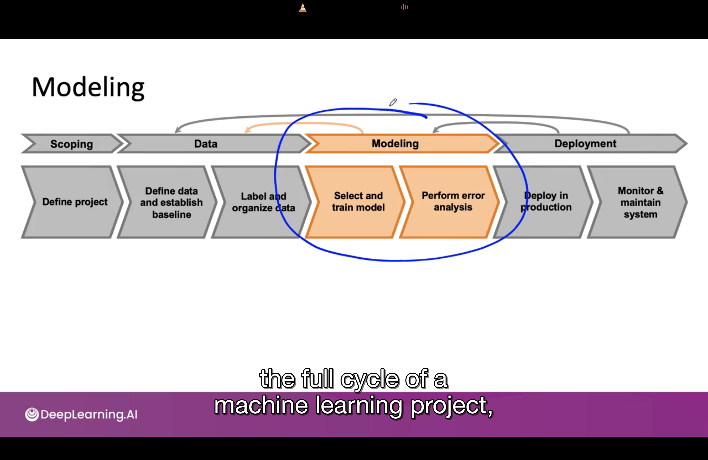  
  
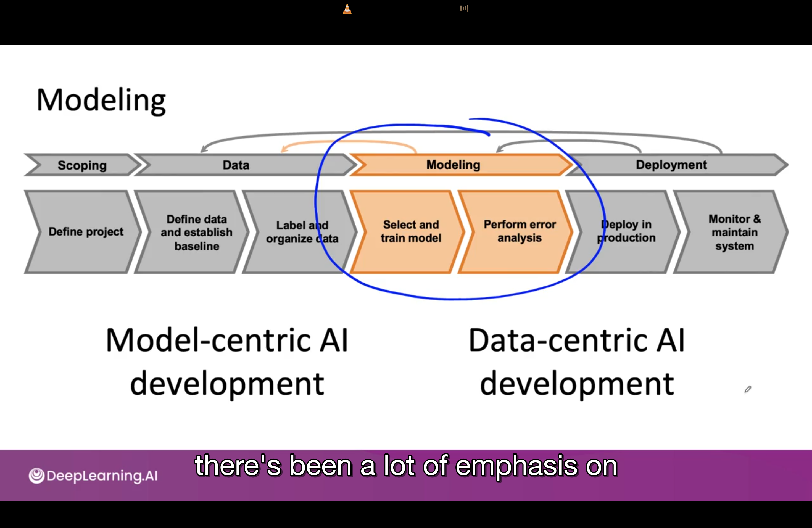
    
Hi, welcome back. In this week, you learn about some best practices for building a machine learning model that is worthy of a production deployment. One of my friends, Adam Cotes joke that the way he listened to me give advice to machine learning teams, he felt the way I get advice was quite consistent from project to project, so that he could almost replace me with an if then else sequence of statements. I found too when several senior machinery engineers look at the project, the advice they tend to give is also remarkably consistent. What you learned in this week is whether some of the key challenges of trying to build a production-ready machine learning model, things like how do you handle new datasets? Or what if you do well in the test set, but for some reason, that still isn't good enough for your actual application? I hope that after this week's materials, you'll be able to very efficiently know how to improve your machine learning model, to solve the most important problems that then make it deployment's ready. Let's dive in. This week, our focus will be on the modeling part of the full cycle of a machine learning project, and you learn some suggestions for how to select and train the model, and how to perform error analysis, and use that to drive model improvements. One of the themes you hear me refer to multiple times is model-centric AI development versus data-centric AI development. The way that AI has grown up, there's been a lot of emphasis on how to choose the right model, such as maybe how to choose the right neural network architecture. I found that for practical projects, it can be even more useful to take a more data-centric approach, where you focus not just on improving the neural network architecture, but on making sure you are feeding your algorithm high-quality data. That ultimately lets you be more efficient in getting your system to perform well. But the way I engage in data-centric AI development is not to just go and try to collect more data, which can be very time-consuming, but to instead use tools to help me improve the data in the most efficient possible way. You'll learn some ways for how to do that in this week. I'm excited to go through this week's materials with you on training models. But first, let's look at some key challenges that many fields face when building machine learning models. By understanding these key challenges, you'd be better able to spot them ahead of time, and adjust them more efficiently for your projects. Let's go on to the next video.

10.   
   
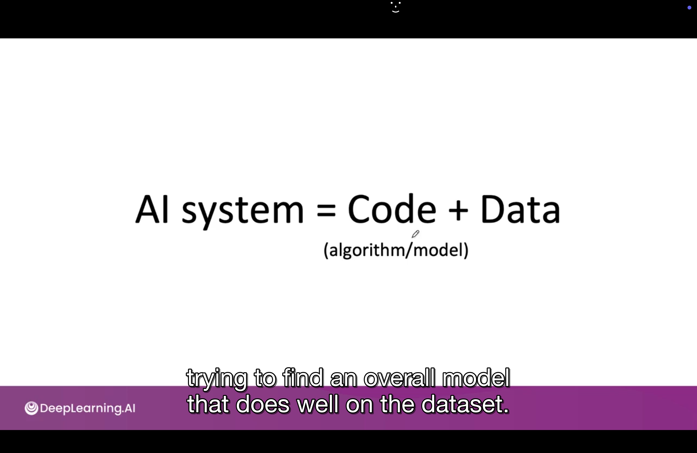
  
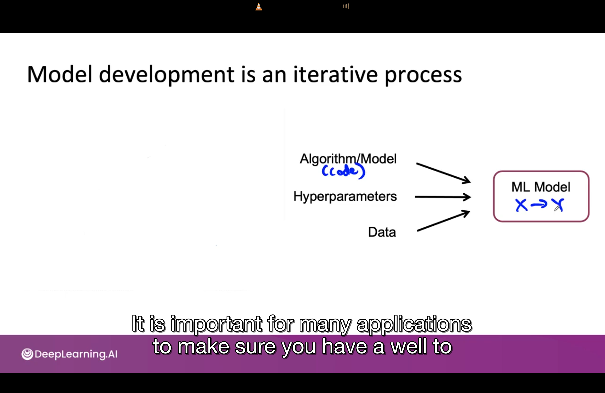

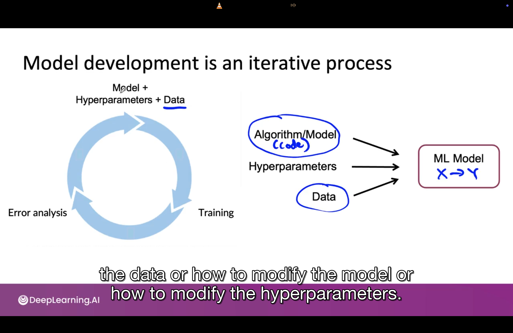

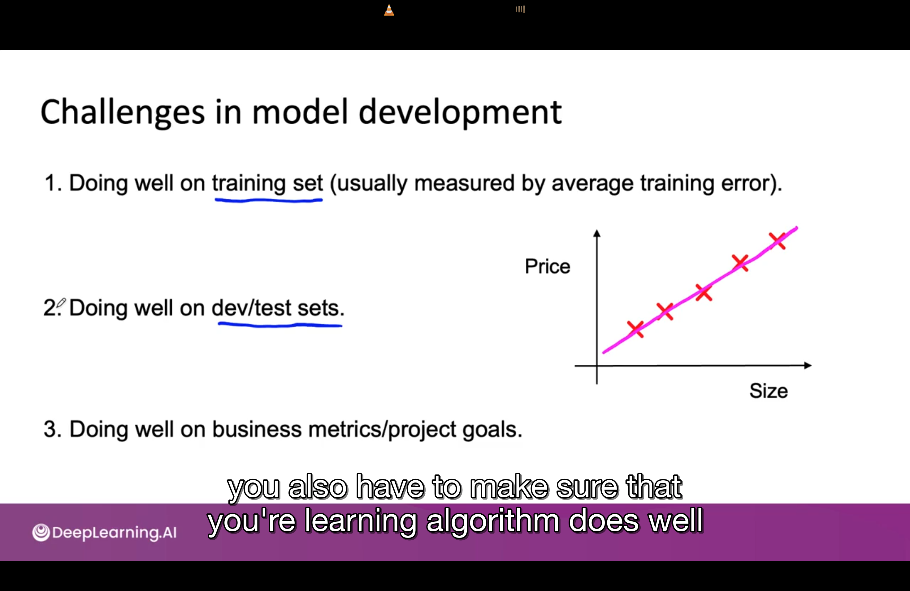

What is hard about training machine or any model that does well? Let's look at some key challenges. One framework that I hope you keep in mind when developing machine learning systems is that, AI systems of machine learning systems comprise both code, meaning the algorithm or the model as well as data. There's been a lot of emphasis in the last several decades on how to improve the code.

In fact a lot of AI research had grown up by researchers downloading data sets and trying to find an overall model that does well on the dataset. But for many applications, you have the flexibility to change the data if you don't like the data. And so, there are many projects where the algorithm or model is basically a solved problem. Some model you download off Github will do well enough, and they'll be more efficient to spend a lot of your time improving the data because the data usually has been much more customized to your problem.

This is a view that will carry throughout this week and next week's materials. Diving into more detail, when building a machine learning system, you may have an algorithm or a model, this would be your code and some data. And it's by training your algorithm on the data that you then have your machine learning model that can make predictions. And of course hyperparameters are an additional input to this process.

It is important for many applications to make sure you have a well to learning rates and regularization parameter and maybe a few other things. The hyperparameters are important, but because the space of hyperparameters is usually relatively limited, I'm going to spend more of our time focusing on the code and on the data. So model development is a highly iterative process. You usually start off with some model and hyperparameters and data training model, and then take the model to carry error analysis, and use that to help you decide how to improve the model or the hyperparameters or the data.

Because machine learning it's such an empirical process, being able to go through this loop many times very quickly, is key to improving performance. But one of the things that will help you improve performance to is, each time through the loop, being able to make good choices about how to modify the data or how to modify the model or how to modify the hyperparameters. After you've done this enough times and achieve a good model, one last step that's often useful is to carry out a richer error analysis and have your system go through a final audit to make sure that it is working before you push it to a production deployment. So why is model development hard?

When building a model, I think there are three key milestones that most projects should aspire to accomplish. First is you probably want to make sure you do well, at least on the training set. So, if you're predicting housing prices as a function of the size of a house, are you at least able to fit a line that is your training set quite well? After you've done well on the training set, you then have to ask if your algorithm does well on the development set or the holdout cross validation set, and then also the test set.

If your algorithm isn't even doing well on the training set, then it's very unlikely to do well on the dev set or the test set. So I think of step one as something you have to do first as a milestone on your way towards achieving step two. And then after you do well on the dev set or test set, you also have to make sure that you're learning algorithm does well according to the business metrics or according to the project's goals. Over the last several decades, a lot of machine learning development, was driven by the goal of doing well on the dev set or test set.

Unfortunately for many problems, having a high test set accuracy is not sufficient for achieving the goals of the project. And this has led to a lot of frustration and disagreements between the machine learning team, which is very good at doing this and business teams which care more about the business metrics or some other goals of the project. So you may be wondering: "Hey Andrew, how is it possibly true that achieving low average test set error isn't good enough for a project?" There are few common patterns that I've seen across many projects where you need something beyond low average test set error, and people spot these issues will help you be more efficient in addressing them. Let's dive more into this topic in the next video.

11.   
   
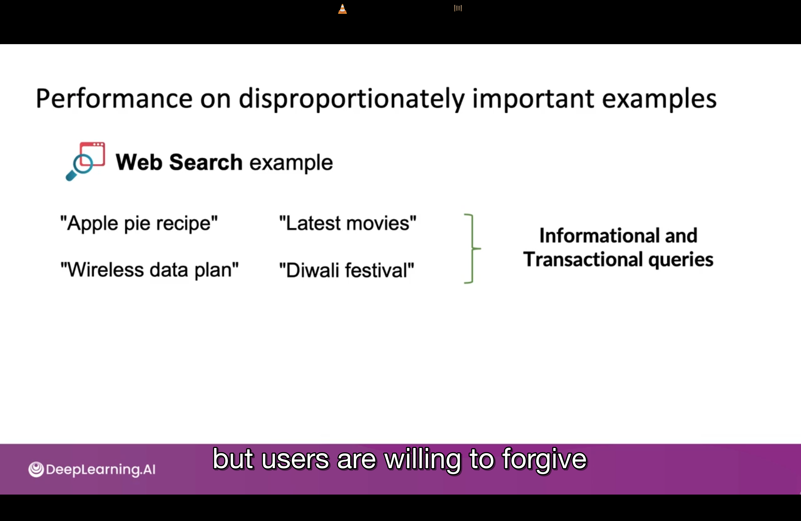

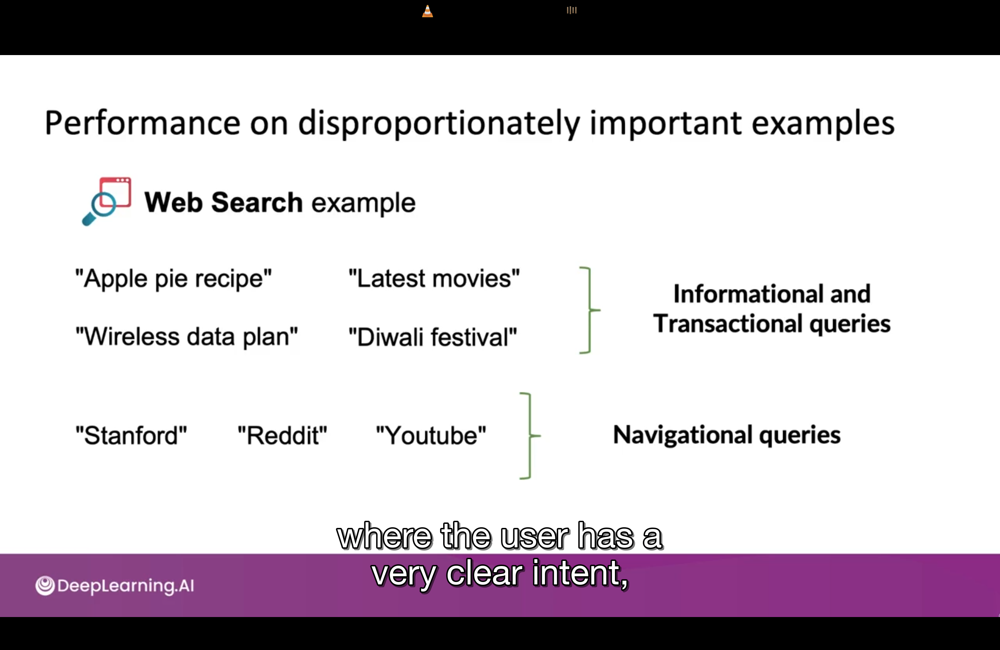

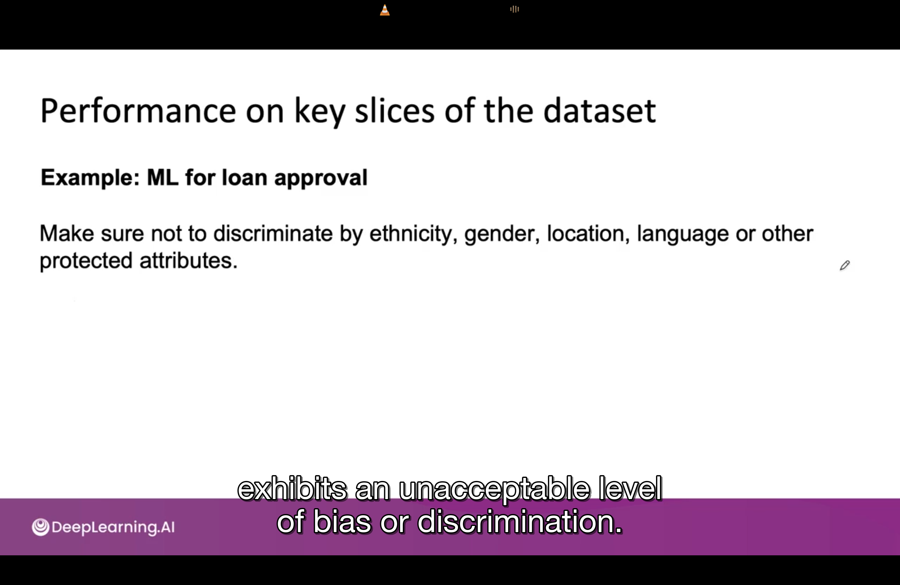

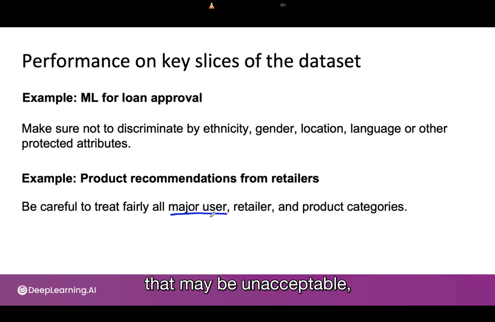

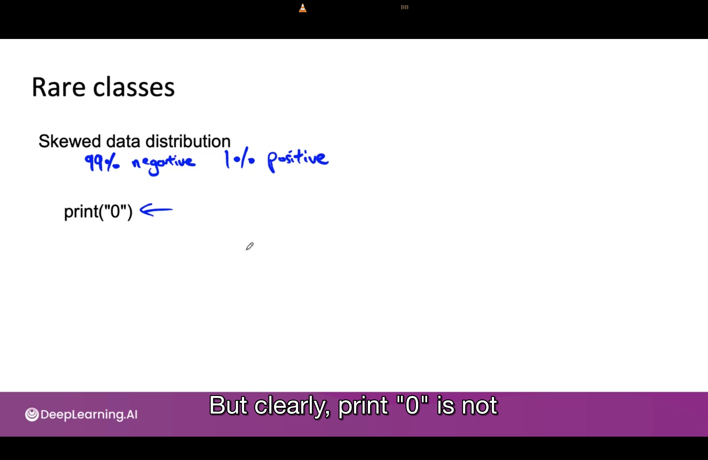

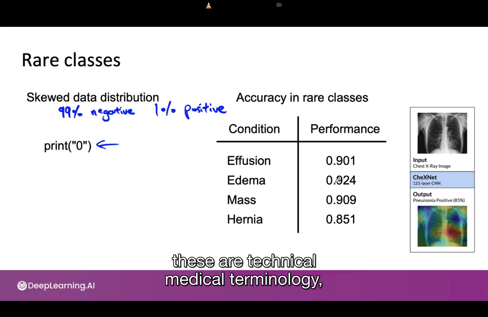

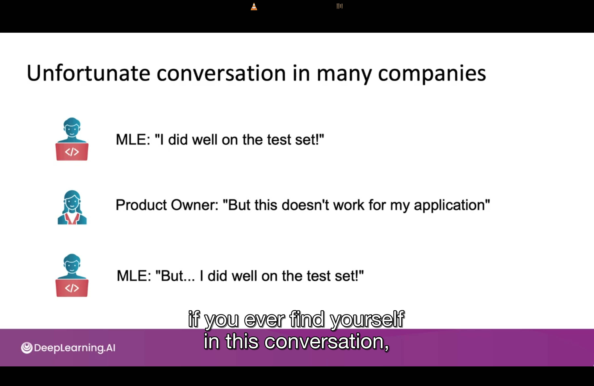

The job of a machine learning engineer would be much simpler if the only thing we ever had to do was do well on the holdout test set. As hard as it is to do well in the holdout test set, unfortunately, sometimes that isn't enough. Let's take a look at some of the other things we sometimes need to accomplish in order to make a project successful. We've already talked about concept drift and data drift last week, but here are some additional challenges we may have to address for a production machine learning project.

First, a machine learning system may have low average test set error, but if its performance on a set of disproportionately important examples isn't good enough, then the machine learning system will still not be acceptable for production deployment. Let me use an example from Web search. There are a lot of web search queries like these: Apple pie recipe, latest movies, wireless data plan, I want to learn about the Diwali Festival. These types of queries are sometimes called informational or transactional queries, where I want to learn about apple pies or maybe I want to buy a new wireless data plan and you might be willing to forgive a web search engine that doesn't give you the best apple pie recipe because there are a lot of good apple pie recipes on the Internet.

For informational and transactional queries, a web search engine wants to return the most relevant results, but users are willing to forgive maybe ranking the best result, Number two or Number three. There's a different type of web search query such as Stanford, or Reddit, or YouTube. These are called navigational queries, where the user has a very clear intent, very clear desire to go to Stanford.edu, or Reddit.com, or YouTube.com. When a user has a very clear navigational intent, they will tend to be very unforgiving if a web search engine does anything other than return Stanford.edu as the Number one ranked results and the search engine that doesn't give the right results will quickly lose the trust of its users.

Navigational queries in this context are a disproportionately important set of examples and if you have a learning algorithm that improves your average test set accuracy for web search but messes up just a small handful of navigational queries, that may not be acceptable for deployment. The challenge, of course, is that average test set accuracy tends to weight all examples equally, whereas, in web search, some queries are disproportionately important. Now one thing you could do is try to give these examples a higher weight. That could work for some applications, but in my experience, just changing the weights of different examples doesn't always solve the entire problem.

Closely related to this is the question of performance on key slices of the data set. For example, let's say you've built a machine learning algorithm for loan approval to decide who is likely to repay a loan and thus to recommend approving certain loans for approval. For such a system, you will probably want to make sure that your system does not unfairly discriminate against loan applicants according to their ethnicity, gender, maybe their location, their language, or other protected attributes. Many countries also have laws or regulations that mandates that financial systems and loan approval processes not discriminate on the basis of a certain set of attributes, sometimes called protected attributes.

Even if a learning algorithm for loan approval achieves high average test set accuracy, it would not be acceptable for production deployment if it exhibits an unacceptable level of bias or discrimination. Whereas the A.I. community has had a lot of discussion about fairness to individuals, and rightly so because this is an important topic we have to address and do well on, the issue of fairness or performance of key slices also occurs in other settings. Let's say you run an online shopping website, so an e-commerce website where you advocate and sell products from many different manufacturers and many different brands of retailers.

You might want to make sure that your system treats fairly all major user, retailer, and product categories. For example, even if a machine learning system has high average test set accuracy, maybe it recommends better products on average. If it gives really irrelevant recommendations to all users of one ethnicity, that may be unacceptable, or if it always pushes products from large retailers and ignores the smaller brands, that could also be harmful to the business because you may then lose all the small retailers and it would also feel unfair to build a recommender system that only ever recommends products from the large brands and ignores the smaller businesses or it had a product recommender that gave highly relevant recommendations, but for some reason would never recommend electronics products, then maybe the retailers that sell electronics would be quite reasonably upset and this may not be the right thing for the retailers on your platform or for the long term health of your business even if the average test set accuracy shows that by not recommending electronics products, you're showing slightly more relevant results to your users for some reason. One thing you'll learn later this week is how to carry out analysis on key slices of the data to make sure that you spot and address potential problems like these.

Next is the issue of rare classes and specifically of skewed data distributions. In medical diagnosis, it's not uncommon for many patients not to have a certain disease, and so if you have a data set which is 99 percent negative examples because 99 percent of the population doesn't have a certain disease but one percent positive. Then you can achieve very good test set accuracy by writing a program that just says print "0". Don't need a learning algorithm.

Just write this one line of code and you have 99 percent accuracy on your dataset. But clearly, print "0" is not a very useful algorithm for disease diagnosis. By the way, this actually did happen to me once where my team had trained a huge neural network found we had 99 percent average accuracy and we found and achieved it by printing "0" all the time, so we basically trained a giant neural network that did exactly the same thing as print "0", and of course, when we discovered, we then went back to fix the problem. Hopefully this won't happen to you.

Closely related to the issue of skewed data distributions which is often a discussion of positive and negatives is accuracy on rare classes. I was working with my friend Pranav Ross Baker and others on diagnosis from chest X-rays and we were diagnosing causes and we were working on deep learning to spot different conditions. There were some relatively common conditions, these are technical medical terminology, but for a medical condition called effusion, we had about 10,000 images and so we were able to achieve a high level of performance, whereas for much rarer condition hernia, we had about a hundred images and so performance was much worse. It turns out that from a medical standpoint is not acceptable for diagnosis system to ignore obvious cases of hernia.

If a patient shows up and an X-ray clearly shows they have hernia, a learning algorithm that misses that diagnosis would be problematic, but because this was a relatively rare class, the overall average test set accuracy of the algorithm was not that bad, and in fact the algorithm could have completely ignored all cases of hernia and it would have had only a modest impact on this average test accuracy, because cases of hernia were rare and the algorithm could pretty much ignore it without hurting this average test set accuracy that much if average test set accuracy gives equal weight to every single example in the test set. I have heard pretty much this exact same conversation too many times in too many companies and the conversation goes like this, a machine learning engineer says, "I did well in the test set!", "This works! Let's use it!" and a private owner or business owner says, "but this doesn't work for my application" and the machine that the engineer replies, "but I did well on the test set!" my advice to you, if you ever find yourself in this conversation, is don't get defensive. We as a community have built lots of tools for doing well on the test set, and that's to be celebrated.

I think it's great, but we often need to go beyond that because just doing well on the test set isn't enough for many production applications. When I'm building a machine learning system, I view it as my job not just to do well on the test set, but to produce a machine learning system that solves the actual business or application needs, and I hope you take a similar view as well. Later this week, we'll go through some techniques, usually involving error analysis, maybe error analysis on slices of the data that will allow you to spot some of these issues that require going beyond average test set accuracy and help you with tools to tackle these broader challenges as well.

12.  
  
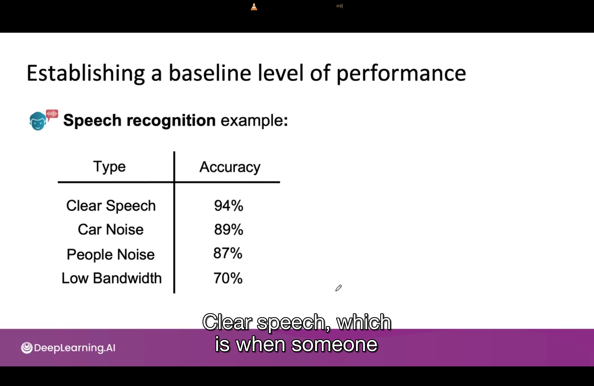

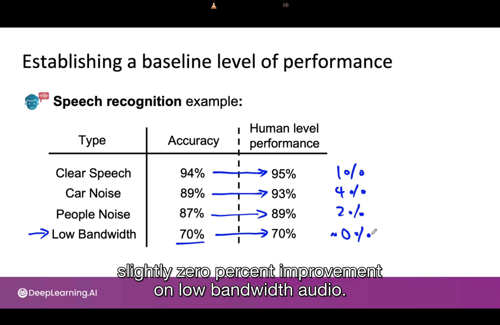

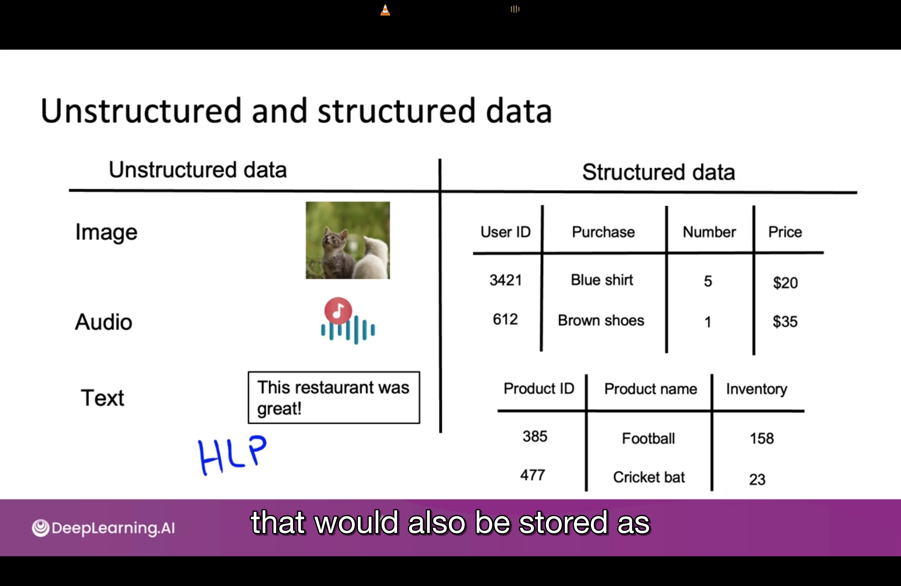

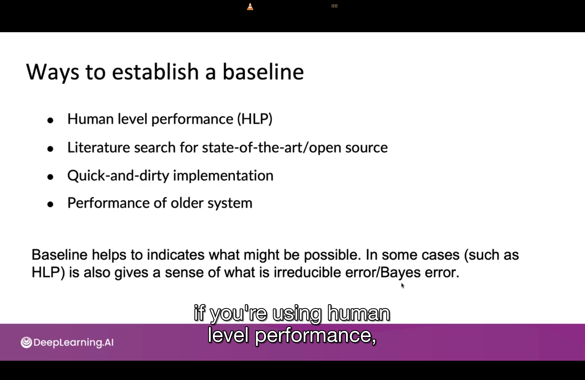

When starting work on a machine learning project, one of the most useful first step to take is to establish a baseline and is usually only after you've established a baseline level of performance that you can then have tools to efficiently improve on that baseline level. Let's dive into some best practices for quickly establishing that base. Let me use the speech recognition example. Let's say you've established that there are four major categories of speech in your data.

Clear speech, which is when someone speaks without much background noise. Speech with car noise in the background as if they were in a car when they use your speech recognition system. Speech with people noise in the background so that they're outdoors with other people's out in the background or speech on a low bandwidth connection, what it sounds like if you're using a cell phone with a very bad cell phone connection. If your accuracy on these four categories of speeches, 94, 89, 87, and 70 percent accuracy, you might be tempted to say, well, it does worse on low bandwidth audio, so let's focus our attention on that.

But before leaping to that conclusion, it'd be useful to establish a baseline level of performance on all four of these categories. You can do that by asking some human transcriptionists to label your data and measuring their accuracy. What is human level performance on these four categories of speech? In this example, we find that if we can improve our performance on clear speech up to human level performance, looks like there's a potential for a one percent improvement there.

If we can raise our performance up to human level performance on audio of car noise in the background, maybe four percent improvement, two percent improvement and slightly zero percent improvement on low bandwidth audio. Whereas we had previously said without the human level of performance, we may have thought working on low bandwidth audio was most promising. With this analysis, we realized that maybe the low bandwidth audio was so garbled. Even people, humans can't recognize what was said and it may not be that fruitful to work on that.

Instead, it may be more fruitful to focus our attention on improving speech recognition with car noise in the background. In this example, using human level performance, which are sometimes abbreviated to HLP, Human Level Performance, gives you a point of comparison or a baseline that helps you decide where to focus your efforts on car noise data rather than on low bandwidth data. It turns out the best practices for establishing a baseline are quite different, depending on whether you're working on unstructured or structured data. Unstructured data refers to data sets like images, maybe pictures of cats or audio, like our speech recognition example or natural language, like text from restaurant reviews.

Unstructured data tends to be data that humans are very good at interpreting. In fact, humans evolve to be very good at understanding images and audio and maybe language as well. Because humans are so good at unstructured data tasks, measuring human level performance or HLP, is often a good way to establish a baseline if you are working on unstructured data. In contrast, structured data are the giant databases or the giant Excel spreadsheets you might have, such as if you run an eCom website, the data showing which user purchased at what time and for what price, that will be stored in a giant database.

This type of data stored in a giant Excel spreadsheet or some more robust database would be an example of structured data or your product and inventory data that would also be stored as structured data. Because humans are not as good at looking at data like this to make predictions. We certainly didn't evolve to look at giant spreadsheets. Human level performance is usually a less useful baseline for structured data applications.

I find that machine learning developments best practice is quite different, depending on whether you're working on an unstructured data or structured data problem. Keeping in mind this difference, let's take a look at some ways to establish baselines for both of these types of problems. We've already talked about human level performance as a baseline, particularly for unstructured data problems. Another way to establish a baseline is to do a literature search for state-of-the-art or look at open source results to see what others reports they are able to accomplish on this type of problem.

For example, if you're building a speech recognition system and others report a certain level of accuracy on data that's similar to yours, then that may give you a starting point. Using open-source, you may also consider coming out with a quick-and-dirty implementation. Now, this is going to the system, but just a quick-and-dirty implementation that could start to give you a sense of what may be possible. Finally, if you already have a machine learning system running for your application, then the performance of your previous system, performance of your older system can also help you establish a baseline that you can then aspire to improve on.

What a baseline system or a baseline level of performance does is it helps to indicate what might be possible. In some cases, such as if you're using human level performance, especially on unstructured data problems, this baseline can also give you a sense of what is the irreducible error or what is Bayes error. In other words, what is the best that anyone could possibly hope for in terms of performance on this problem, such as helping us realize that maybe the low bandwidth audio is so bad that is just not possible to have more than 70 percent accuracy, as in our earlier example. By helping us to get a very rough sense of what might be possible, it can help us be much more efficient in terms of prioritizing what to work on.

Sometimes I've seen some business teams push a machine learning team to guarantee that the learning algorithm will be 80 percent accurate or 90 percent or 99 percent accurate before the machine learning team has even had a chance to establish a rough baseline. This, unfortunately, puts the machine learning team in a very difficult position. If you are in that position, I would urge you to consider pushing back and asking for time to establish a rough baseline level of performance before giving a more firm prediction about how accurate the machine learning system can eventually get to be. It helps you to make your case, feel free to tell them that I asked you to do so.

I think establishing that baseline first will help set you and your team up better for long-term success. Now to tell us about the importance of baseline, there are few additional tips I want to share with you about how to get started quickly on the machine learning project. Let's go on to the next video to take a look at some of these tips.

13.      
   
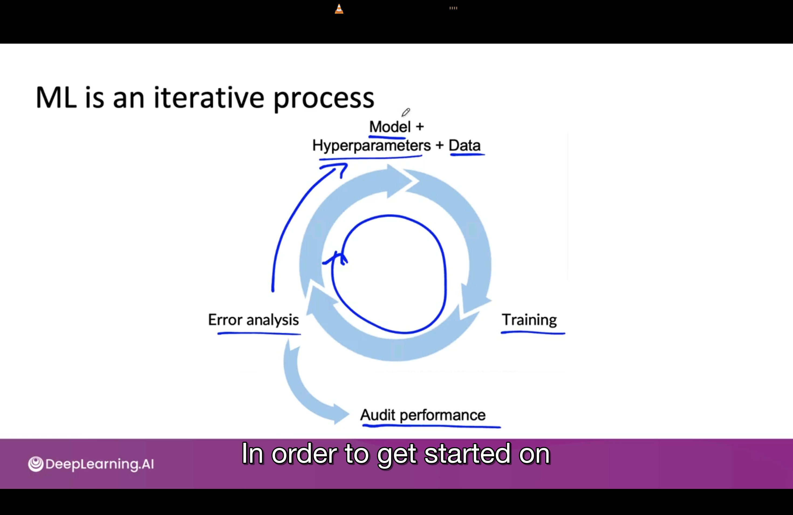

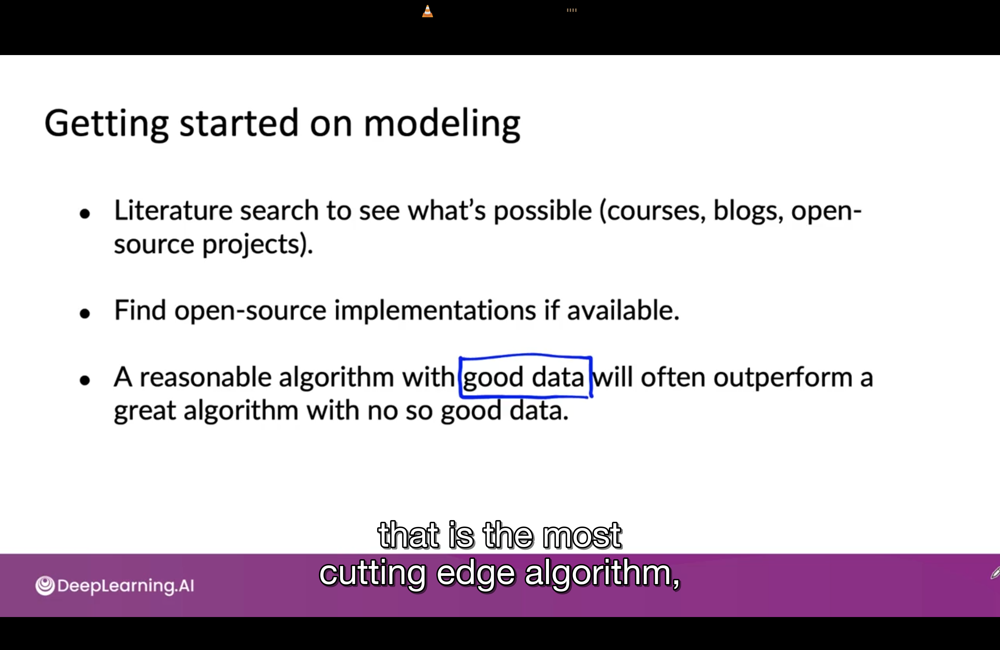

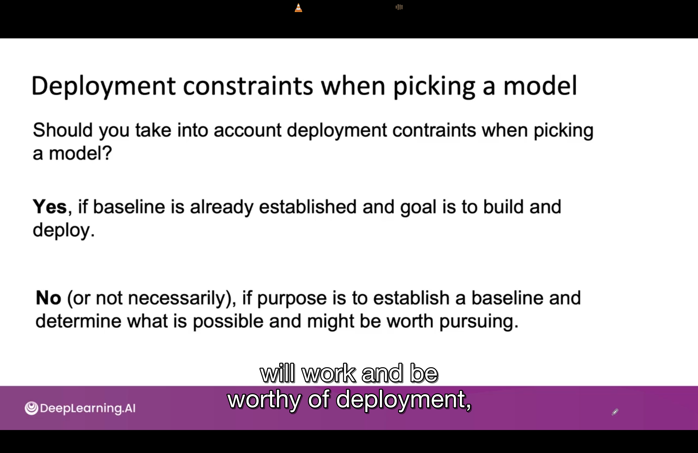

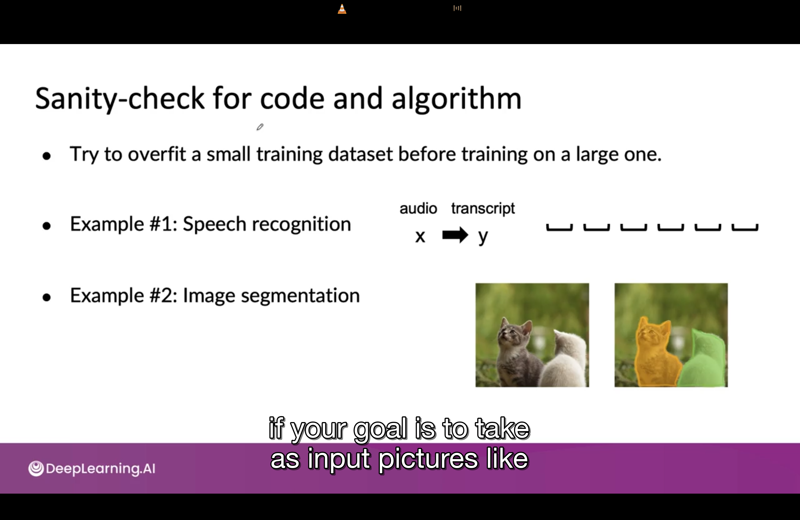

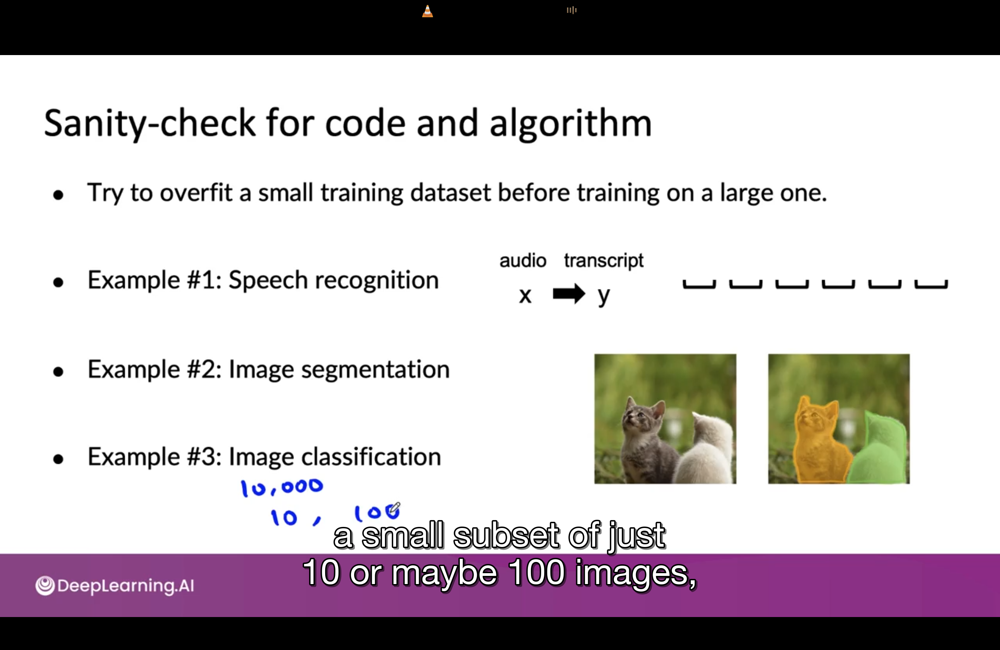

Let me share with you a few tips for getting started on machine learning project. This video will be a little bit of a grab bag of different ideas, but I hope nonetheless many of these ideas will be useful to you. We've talked about how machine learning is an iterative process where you start with a model, data, hyperparameters, training model, carry out error analysis, and then use that to drive further improvements. After you've done this a few times, gone around the loop enough times, when you have a good enough model, you might then carry out a final performance audit before taking it to production. In order to get started on this first step of coming of the model, here are some suggestions.

When I'm starting on a machine learning project, I almost always start with a quick literature search to see what's possible, so you can look at online courses, look at blogs, look at open source projects. My advice to you if your goal is to build a practical production system and not to do research is, don't obsess about finding the latest, greatest algorithm.

Instead, spend half a day, maybe a small number of days reading blog posts and pick something reasonable that lets you get started quickly, if you can find an open source implementation, that can also help you establish a baseline more efficiently. I find that for many practical applications, a reasonable algorithm with good data will often do just fine and will in fact outperform a great algorithm with not so good data. Don't obsess about taking the algorithm that was just published in some conference last week, that is the most cutting edge algorithm, instead find something reasonable, find a good open source implementation and use that to get going quickly. Because being able to get started on this first step of this loop, can make you more efficient in iterating through more times, and that will help you get to good performance more quickly. Second question I have often been asked , is, "Hey Andrew, do I need to take into account deployment constraints such as compute constraints when picking a model?" My answer is, yes you should take deployment constraints such as compute constraints into account, if the baseline is already established and you're relatively confident that this project will work and thus your goal is to build and deploy a system.

But if you have not yet even established a baseline, or if you're not yet sure if this project will work and be worthy of deployment, then I will say no, or maybe not necessarily. If you are in a stage of the project where your first goal is to just establish a baseline and determine what is possible and if this project is even worth pursuing for the long term, then it might be okay to ignore deployment constraints and just find some open source implementation and try it out to see what might be possible, even if that open source implementation is so computationally intensive that you know you will never be able to deploy that. Of course, no harm taking deployment constraints into account as well at this phase of the project, but it might also be okay if you don't and focus on more efficiently establishing the baseline first. Finally, when trying out a learning algorithm for the first time, before running it on all your data, I would urge you to run a few quick sanity checks for your code and your algorithm.

For example, I will usually try to overfit a very small training dataset before spending hours or sometimes even overnight or days training the algorithm on a large dataset. Maybe even try to make sure you can fit one training example, especially, if the output is a complex output. For example, I was once working on a speech recognition system where the goal was to input audio and have a learning algorithm output a transcript. When I trained my algorithm on just one example, one audio clip, when I trained my speech recognition system on just one audio clip on the training set, which is just one audio clip, my system outputs this, it outputs space, space, space, space, space, space. Clearly it wasn't working and because my speech system couldn't even accurately transcribe one training example, there wasn't much point to spending hours and hours training it on a giant training set.

Or for image segmentation, if your goal is to take as input pictures like this and segment out the cats in the image, then before spending hours training your system on hundreds or thousands of images, a worthy sanity check would be to feed it just one image and see if it can at least overfit that one training example before scaling up to a larger dataset. The advantage of this is you may be able to train your algorithm on one or a small handful of examples in just minutes or maybe even seconds and this lets you find bugs much more quickly. Finally, for image classification problems, even if you have 10,000 images or 100,000 images or a million images in your training set, it might be worthwhile to very quickly train your algorithm on a small subset of just 10 or maybe 100 images, because you can do that quickly.

If your algorithm can't even do well on 100 images, well, then it's clearly not going to do well on 10,000 images, so this would be another useful sanity check for your code. Now, after you've trained a machine learning model, after you've trained your first model, one of the most important things is, how do you carry out error analysis to help you decide how to improve the performance of your algorithm? Let's go on to the next video to dive into error analysis and performance auditing.

14.   
  
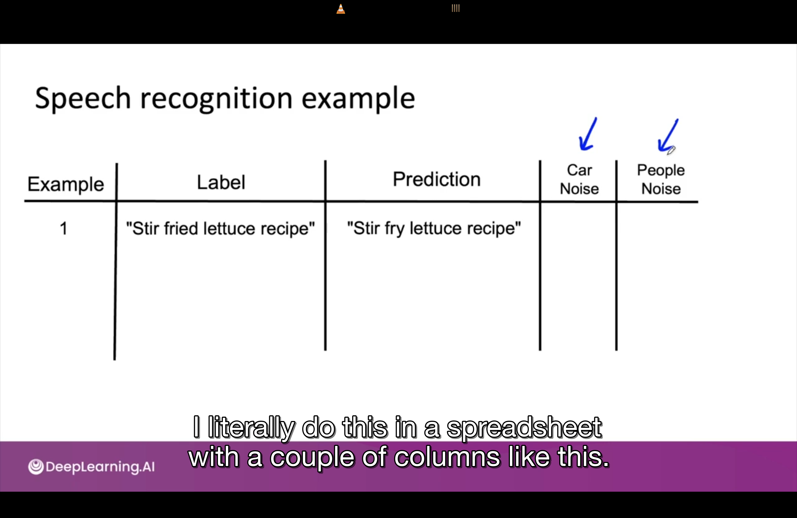

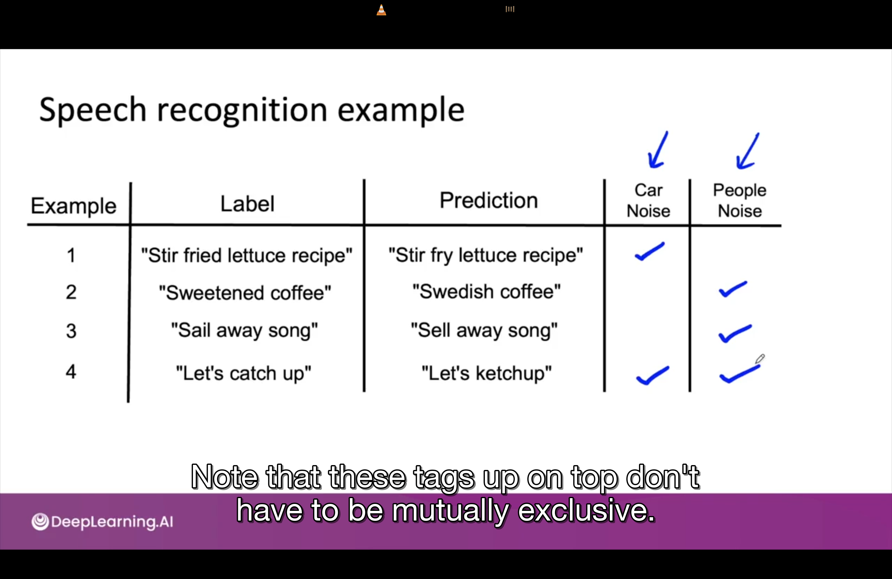

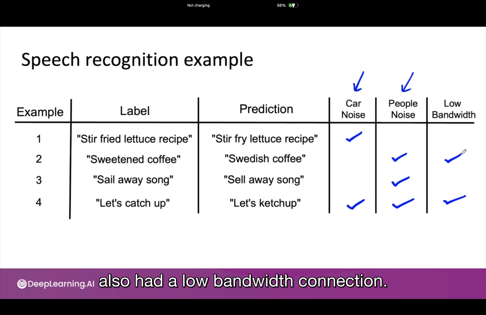

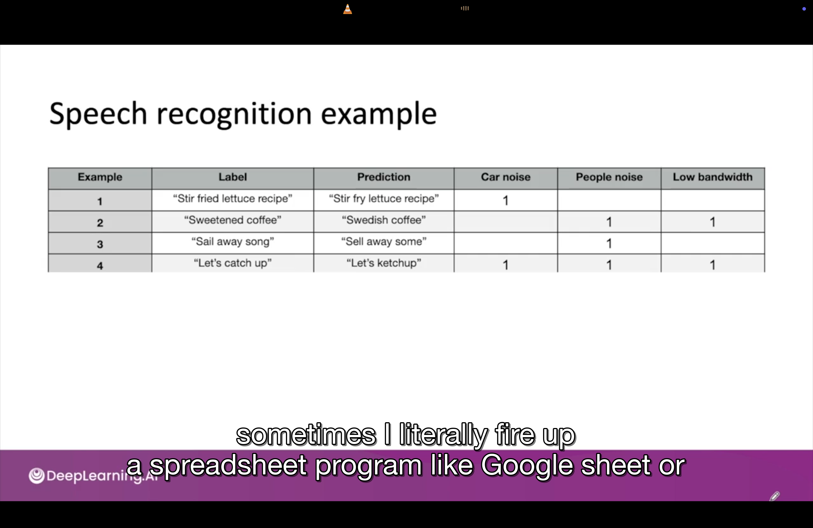

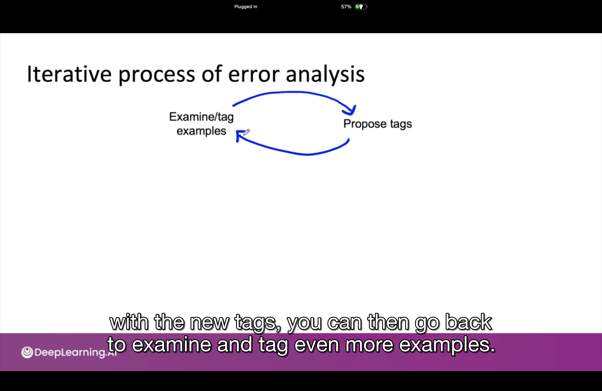

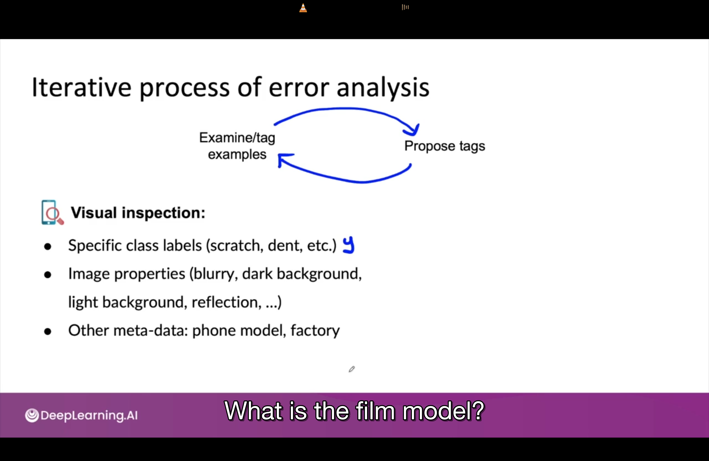

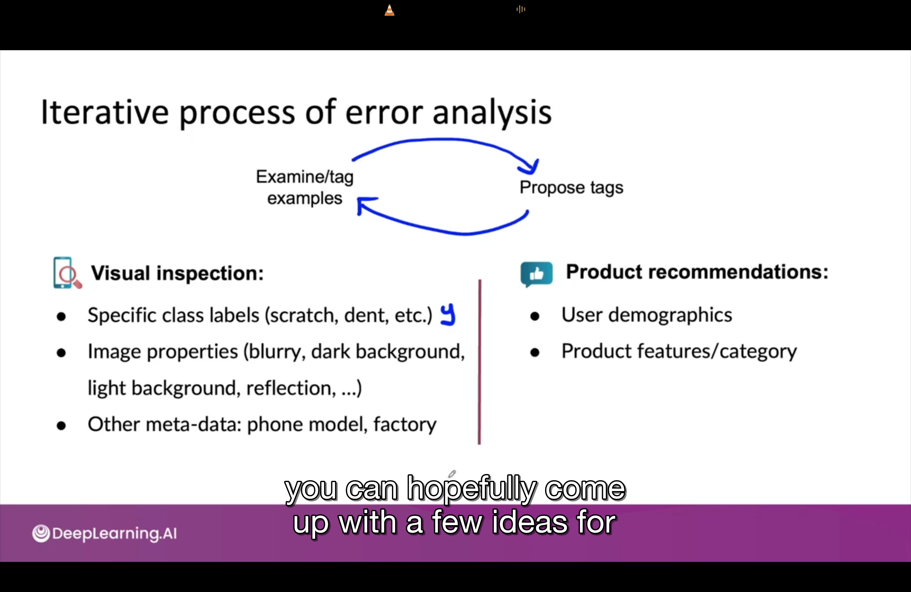

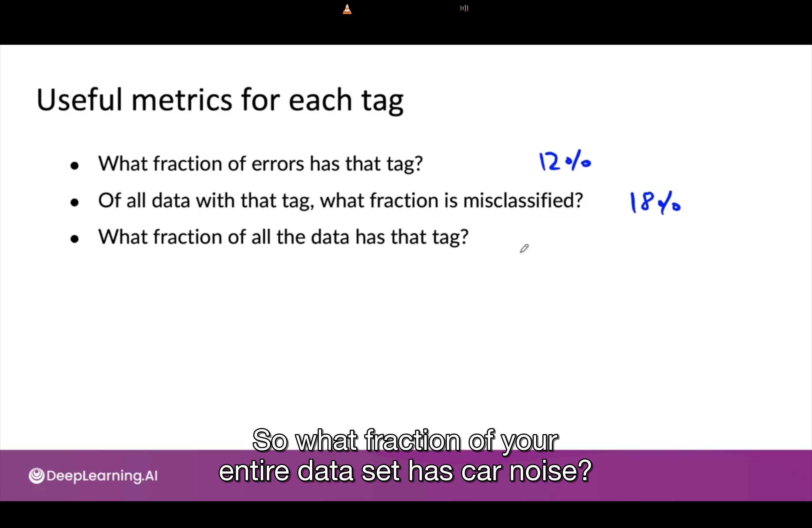

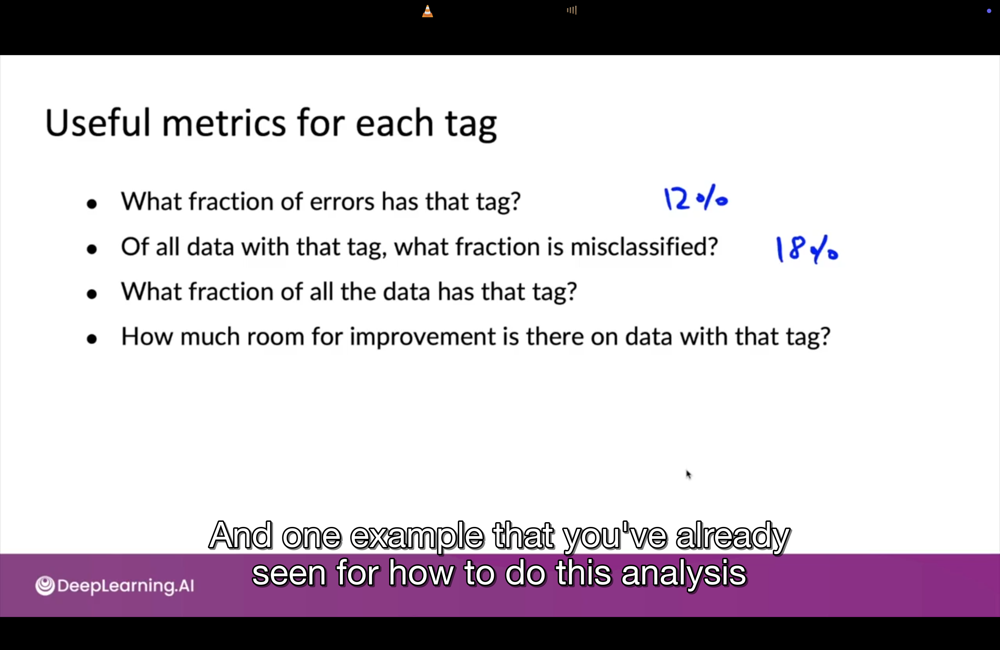

The first time you train a learning algorithm, you can almost guarantee that it won't work not the first time out. So I think of the heart of the machine learning development process as error analysis, which if you do it well, I can tell you what's the most efficient use of your time in terms of what you should do to improve your learning algorithm's performance. Let's start with an example. Let me walk through an error analysis example using speech recognition.

When I'm carrying out error analysis, this is pretty much what I would do myself in a spreadsheet to get a handle on whether the errors of the speech system. You might listen to maybe 100 mislabeled examples from your dev set from the development set. So let's say the first example was labeled with the ground truth label "stir fried lettuce recipe". But you're learning algorithm's prediction was "stir fry letters recipe".

If you have a couple of hypothesis, but what are the major types of data in your dataset? Maybe you think some of the data has car noise, some of the data has people noise. Then you can build a spreadsheet and I literally do this in a spreadsheet with a couple of columns like this. And when you listen to this example, if this example has car noise in the background, you can then make a check mark or other annotation in your spreadsheet to indicate that this example had car noise.

Then you listen to the second example, maybe sweeten coffee caught mis-transcribed as Swedish coffee and maybe this example had people noise in the background. And maybe one example with sail away song was mis transcribed sell away song and this again had people noise and let's catch up with trans drivers. Let's catch up. And maybe this example had both car noise and people noise.

Note that these tags up on top don't have to be mutually exclusive. During this process of error analysis, as you listen to audio clips, you may come up with ideas for additional tags. Let's say this for for example, had a very low bandwidth connection and reflecting on the areas you're spotting you remember. Maybe quite a few of the audio clips have a low bandwidth connection, at this point you may decide to add a new column to your spreadsheet with one more tag that says low bandwidth.

And check that and maybe go back to see if some of the other examples also had a low bandwidth connection. So even though I went through this example using a slide when I'm doing error analysis myself, sometimes I literally fire up a spreadsheet program like Google sheet or Excel or on a Mac, the numbers program and do it like this in the spreadsheet. This process hopes you understand whether the categories as denoted by tags that may be the source of more of the errors and does may be worthy of further effort and attention. Until now, error analysis has typically been done via a manual process, say, in the Jupiter notebook or tracking errors in spreadsheet.

I still sometimes do it that way and if that's how you're doing it too, that's fine. But there are also emerging MLOps tools that making this process easier for developers. For example, when my team Landing AI works on computer vision applications, the whole team now uses LandingLens, which makes this much easier than the spreadsheet. You've heard me say that training a model is an iterative process, deploying a model is an iterative process.

Maybe it should come as no surprise that error analysis is also an iterative process where what a typical process would be is you might examine and tag some set of examples with an initial set of tags such as car noise and people noise. And based on examining this initial set of examples, you may come back and say you want to propose some new tags. with the new tags, you can then go back to examine and tag even more examples. Let me step through a few other examples of what such tags could be.

Take visual inspection. You know, the problem of finding defects in smart phones. Some of the tags could be specific class labels, such as this is going to have a scratch or does evident and so on. So it's fine if some of these tags are associated with specific class labels y or some of the tax could be image properties.

Is this picture of the phone blurry? Is it against the dark background or a light background? Is there a unwanted reflection in this picture? The tags could also come from other forms of metadata.

What is the film model? What is the factory which is the manufacturing line that captured the specific image? And the goal of this type of process where you come over tag label. More data come over tag, is to try to come up with a few categories where you could productively improve the algorithm such as in our earlier speech example deciding to work on speech with car noise in the background.

Let me step through just one more example, product recommendations for an online e commerce site. You might look at what products a system is recommending to users and find the clearly incorrect or irrelevant recommendations. And try to figure out if there are specific user demographics such as are we really badly recommending products to younger women or to older men or to something else? Or are there specific product features or specific product categories where the recommendations are particularly poor.

And by alternatively brainstorming and applying such tags, you can hopefully come up with a few ideas for categories of data that we're trying to improve your algorithm's performance on. As you go through these different tags here are some useful numbers to look at. First what fraction of errors have that tag?

For example, if you listen to 100 audio clips and find that 12% of them were labeled with the car noise type, then that gives you a sense of how important is it to work on car noise. It tells you also that even if you fix all of the car noise issues, the performance may improve only by 12%, which is actually not bad. Or you can ask all the data with that tag what fraction is misclassified? So far we've only talked about tagging the mislabeled examples for time efficiency.

You might focus your attention on tagging the mislabeled, the misclassified examples. But if this tag you can apply to both correctly labeled and two mislabeled examples, then you can ask of all the data of that tag, what fraction is misclassified? So for example, if you find that of all the data with car noise, 18% of it is mistranscribed, then that tells you that the performance on data with this type of tag has only a certain level of accuracy and tells you how hard these examples with car noise really are. You might also ask what fraction of all the data has that tag.

This tells you how important relative to your entire data set are examples with that tag. So what fraction of your entire data set has car noise? And then lastly, how much room for improvement is there on data with that tag? And one example that you've already seen for how to do this analysis is to measure human level performance on data with that tag.

So by brainstorming different tags, you can segment your data into different categories and then use questions like these to try to decide what to prioritize working on. Let's dive more deeply into an example of doing this in the next video.

15.      

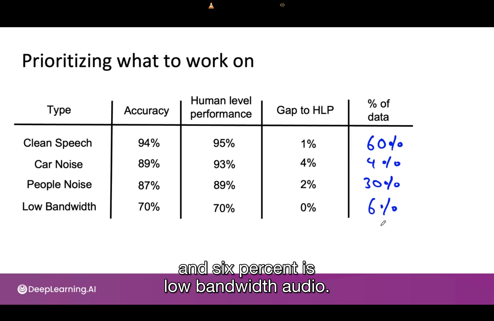

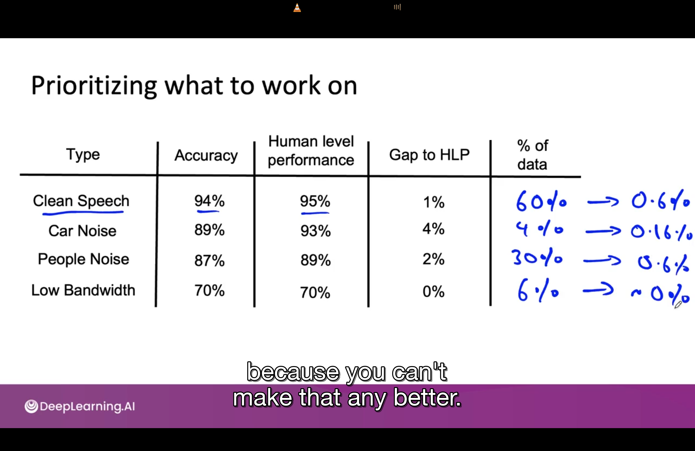

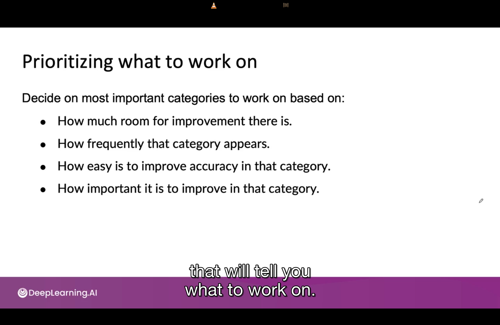

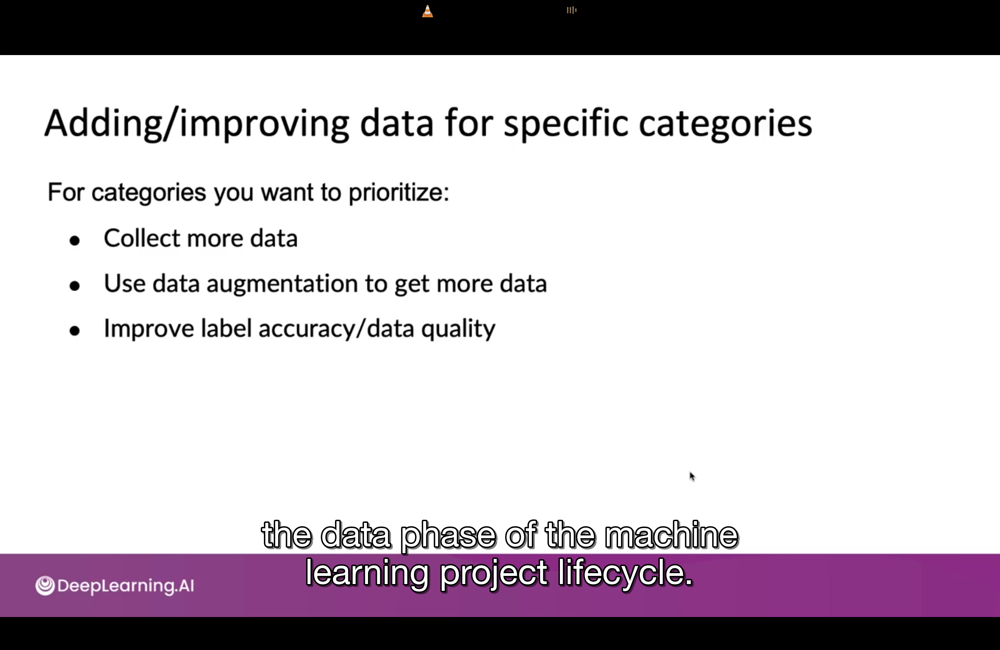

In the last video, you learned about brainstorming and tagging your data with different attributes. Let's see how you can use this to prioritize where to focus your attention.

Here's the example we had previously with four tags and the accuracy of the algorithm, human level performance and what's the gap between the current accuracy and human level performance. Rather than deciding to work on car noise because the gap to HLP is bigger, one other useful factor to look at is what's the percentage of data with that tag? Let's say that 60 percent of your data is clean speech, four percent is data with car noise, 30 percent has people noise, and six percent is low bandwidth audio. This tells us that if we could take clean speech and raise our accuracy from 94-95 percent on all the clean speech, then multiplying one percent with 60 percent just tells us that, if we can improve our performance on clean speech, the human level performance, our overall speech system would be 0.6 percent more accurate, because we would do one percent better on 60 percent of the data.

This will raise average accuracy by 0.6 percent. On the car noise, if we can improve the performance by four percent on four percent of the data, multiplying that out, that gives us a 0.16 percent improvement and multiply these out as well, we get 0.6 percent and well, this is essentially zero percent because you can't make that any better. Whereas previously, we had said there's a lot of room for improvement in car noise, in this slightly richer analysis, we see that because people noise accounts for such a large fraction of the data, it may be more worthwhile to work on either people noise, or maybe on clean speech because there's actually larger potential for improvements in both of those than for speech with car noise. To summarize, when prioritizing what to work on, you might decide on the most important categories to work on based on, how much room for improvement there is, such as, compared to human-level performance or according to some baseline comparison.

How frequently does that category appear? You can also take into account how easy it is to improve accuracy in that category. For example, if you have some ideas for how to improve the accuracy of speech with car noise, maybe your data augmentation, that might cause you to prioritize that category more highly than some other category where you just don't have as many ideas for how to improve the system. Then finally, how important it is to improve performance on that category.

For example, you may decide that improving performance with car noise is especially important because when you're driving, you have a stronger desire to do search, especially search on maps and find addresses without needing to use your hands if your hands are supposed to be holding the steering wheel. There is no mathematical formula that will tell you what to work on. But by looking at these factors, I hope you'd be able to make more fruitful decisions. Once you've decided that there's a category, or maybe a few categories where you want to improve the average performance, one fruitful approach is to consider adding data or improving the quality of that data for that one, or maybe a small handful of categories.

For example, if you want to improve performance on speech with car noise, you might go out and collect more data with car noise. Or if you have a way of using data augmentation to get more data from data category, that will be another way to improve your algorithm's performance. One topic that we'll discuss next week is how to improve label accuracy or data quality. You'll learn more about this when we talk about the data phase of the machine learning project lifecycle.

In machine learning, we always would like to have more data, but going out to collect more data generically, can be very time-consuming and expensive. By carrying out an analysis like this, when you are then going through this iterative process of improving your learning algorithm, you can be much more focused in exactly what types of data you collect. Because if you decide to collect more data with car noise or maybe people noise, you can be much more specific in going out to collect more of just that data or using data augmentation without wasting time trying to collect more data from a low bandwidth cell phone connection. This focus on improving your data on the tags that you have determined are most fruitful for you to work on, that can help you be much more efficient in how you improve your learning algorithm's performance.

I found this type of error analysis procedure very useful for many of my projects and I hope it will help you too in building production-ready machine learning systems. Next, one of the most common challenges we run into is skewed datasets. Let's go on to the next video to go through some techniques for managing skewed datasets.

16.  
    
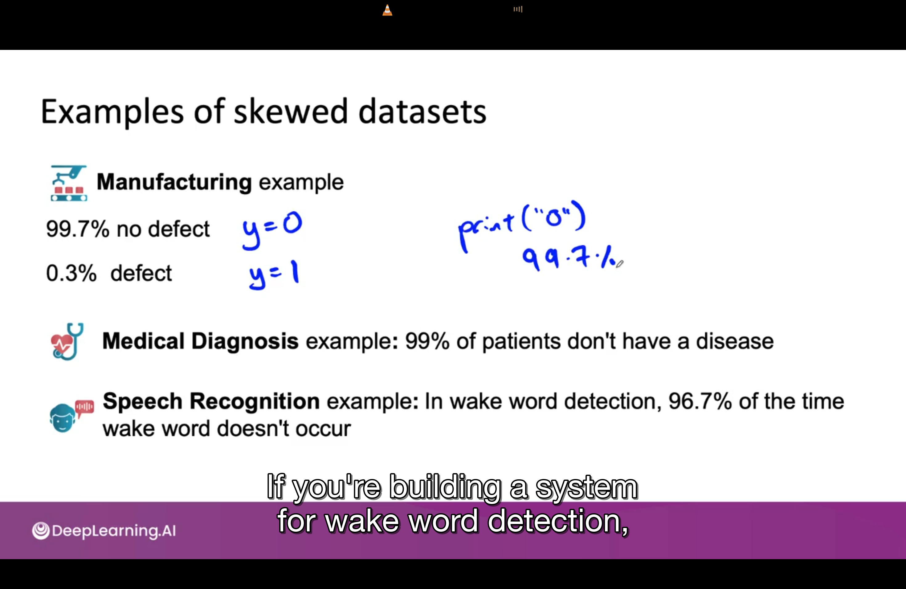 

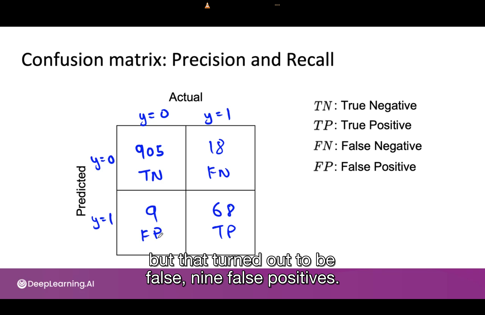

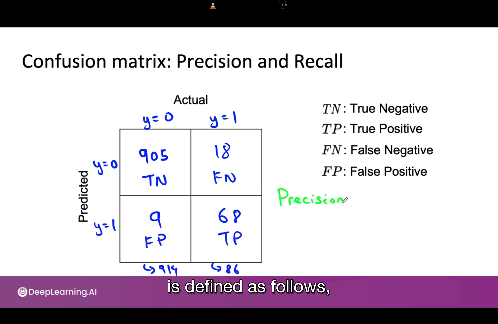

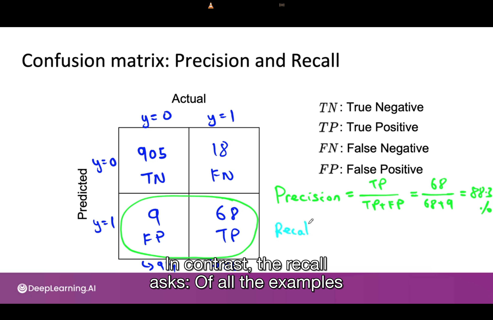

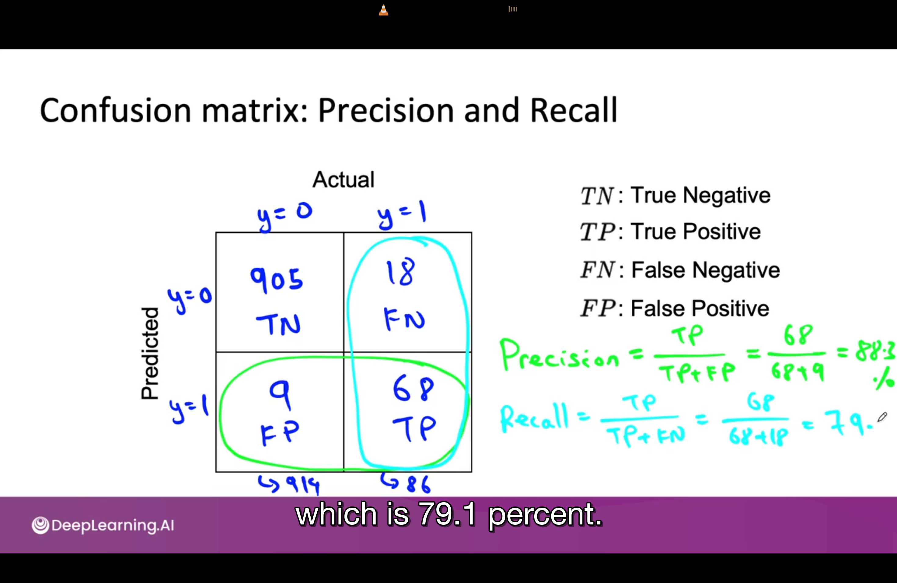

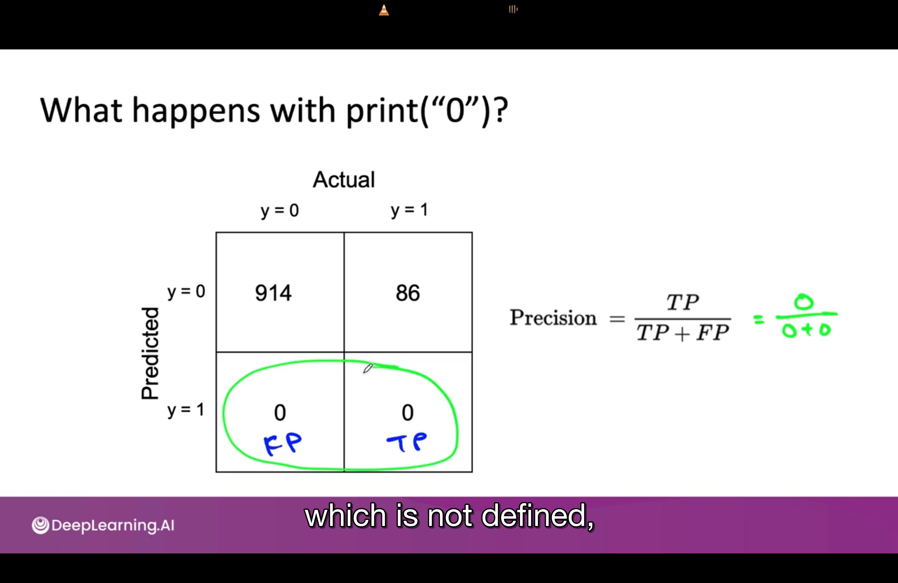

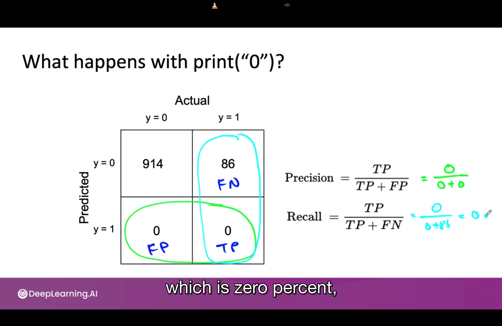

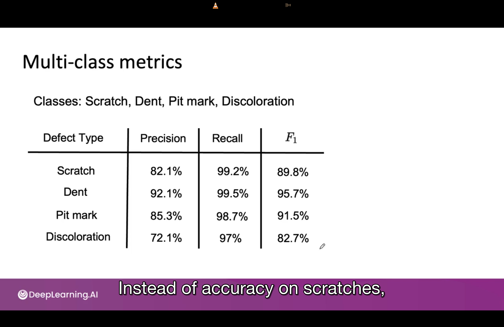

Data sets where the ratio of positive to negative examples is very far from 50-50 are called skewed data sets.

Let's look at some special techniques for handling them. Let me start with a manufacturing example.

If a manufacturing company makes smartphones, hopefully, the vast majority of them are not defective. If 99.7 percent have no defect and are labeled y equals 0 and only a small fraction is labeled y equals 1, then print 0, which is not a very impressive learning algorithm. We achieve 99.7 percent accuracy. For medical diagnosis, which was the example we went through in an earlier video, if 99 percent of patients don't have a disease, then an algorithm that predicts no one ever has a disease will have 99 percent accuracy or speech recognition.

If you're building a system for wake word detection, sometimes also called trigger word detection, these are systems that listen and see if you say a special word like Alexa or Okay Google or Hey Zoe, most of the time that special wake word or trigger word is not being spoken by anyone at that moment in time. When I had built wake word detection systems, the data sets were actually quite skewed. One of the data sets I used had 96.7 percent negative examples and 3.3 percent positive examples. When you have a very skewed data set like this, low accuracy is not that useful a metric to look at because print zero can get very high accuracy.

Instead, it's more useful to build something called the confusion matrix. A confusion matrix is a matrix where one axis is labeled with the actual label, is the ground truth label, y equals 0 or y equals 1 and whose other axis is labeled with the prediction. Was your learning algorithms prediction y equals 0 or y equals 1? If you're building a confusion matrix, you fill in with each of these four cells, the total number of examples say the number of examples in your dev set in your development set to fell into each of these four buckets.

Let's say that 905 examples in your development set had a ground-truth label of y equals 0 and then you might write 905 there. These examples are called true negatives because they were actually negative and your algorithm predicted they were negative. Next, lets fill in the true positives, which are the examples where the actual ground truth of the label is one and the prediction is one, maybe there are 68 of them, true positives. The false negatives are the examples where your algorithm thought it was negative, but it was not.

The actual label is positive, these are false negatives. The 18 of that and lastly, false positives are the ones where your algorithm thought it was positive, but that turned out to be false, nine false positives. The precision of a learning algorithm, if I sum up over the columns, 905 plus 9 is 914 and 18 plus 68 is 86. This is indeed a pretty skewed data set where out of 1000 examples there were 940 negative examples and just 86 positive examples, 8.6 percent positive, 91.4 percent negative.

The precision of your learning algorithm is defined as follows, it asks of all the examples that the algorithm thought were positive examples, what fraction did they get?

Precision is defined as true positives divided by true positives plus false positives. In other words, it looks at this row. Of all the examples that your algorithm thought had a label of one, which is 68 plus 9 of them, 68 of them were actually right. The precision is 68 over 68 plus 9, which is 88.3 percent.

In contrast, the recall asks: Of all the examples that were actually positive, what fraction did your algorithm get right?

Recall is defined as true positives divided by true positives plus false negatives, which in this case is 68 over 68 plus 18, which is 79.1 percent. The metrics are precision and recall are more useful than raw accuracy when it comes to evaluating the performance of learning algorithms on very skewed data sets. Let's see what happens if your learning algorithm outputs zero all the time. It turns out it won't do very well on recall.

Taking this example of where we had 914 negative examples and 86 positive examples, if the algorithm outputs zero all the time. This is what the confusion matrix will look like, 914 times it'll output zero with a grand total of zero, and 86 times it'll output zero with a ground truth of one. Precision is true positives divided by true positives plus false positives, which in this case turns out to be zero over zero plus zero, which is not defined, and unless your algorithm actually outputs no positive labels at all, you get some of the number that hopefully isn't zero over zero. But more importantly, if you look at recall, which is true positives over true positives plus false negatives, this turns out to be zero over zero plus 86, which is zero percent, and so the 0.0 algorithm achieves zero percent recall, which gives you an easy way to flag that this is not detecting any useful, positive examples.

The learning algorithm with some precision, even the high value of precision is not that useful usually if this recall is so low. The standard metrics when I look at when comparing different models on skewed data sets are precision and recall. Where looking at these numbers helps you figure out and of all the examples that are truly positive examples, what fraction did the algorithm manage to catch? Sometimes you have one model with a better recall and a different model with a better precision.

How do you compare two different models? There's a common way of combining precision and recall using this formula, which is called the F_1 score. One intuition behind the F_1 score is that you want an algorithm to do well on both precision and recall, and if it does worse on either precision or recall, that's pretty bad. F_1 is a way of combining precision and recall that emphasizes whichever of P or R precision or recall is worse.

In mathematics, this is technically called a harmonic mean between precision and recall, which is like taking the average but placing more emphasis on whichever is the lower number. If you compute the F_1 score of these two models, it turns out to be 83.4 percent using the formula below here. Model 2 has a very bad recall, so its F_1 score is actually quite low as well and this lets us tell, maybe more clearly that Model 1 appears to be a superior model than Model 2. For your application, you may have a different weighting between position and recall, and so F_1 isn't the only way to combine precision and recall, it's just one metric that's commonly used for many applications.

Let me step through one more example where precision and recall is useful. So far, we've talked about the binary classification problem with skewed data sets. It turns out to also frequently be useful for multi-class classification problems. If you are detecting defects in smartphones, you may want to detect scratches on them or dents or pit marks.

This is what it looks like if someone took a screwdriver and poked their cell phone, or discoloration of the cell phone's LCD screen or other material. Maybe all four of these defects are actually quite rare that you might want to develop an algorithm that can detect all four of them. One way to evaluate how your algorithm is doing on all four of these defects, each of which can be quite rare, would be to look at precision and recall of each of these four types of defects individually. In this example, the learning algorithm has 82.1 percent precision on finding scratches and 99.2 percent recall.

You find in manufacturing that many factories will want high recall because you really don't want to let the phone go out that is defective. But if an algorithm has slightly lower precision, that's okay, because through a human re-examining the phone, they will hopefully figure out that the phone is actually okay, so many factories will emphasize high recall. By combining precision and recall using F_1 as follows, this gives you a single number evaluation metric for how well your algorithm is doing on the four different types of defects and can also help you benchmark to human-level performance and also prioritize what to work on next. Instead of accuracy on scratches, dents, pit marks, and discolorations, using F_1 score can help you to prioritize the most fruitful type of defect to try to work on.

The reason we use F_1 is because, maybe all four defects are very rare and so accuracy would be very high even if the algorithm was missing a lot of these defects. I hope that these tools will help you both evaluate your algorithm as well as prioritize what to work on, both in problems with skewed data sets and for problems with multiple rare classes. Now, to wrap up the section on Error Analysis, there's one final concept I hope to go over with you, which is Performance Auditing. I found for many projects this is a key step to make sure the learning algorithm is working well enough before you push it out to a production deployment.

Let's take a look at Performance Auditing.

17.  

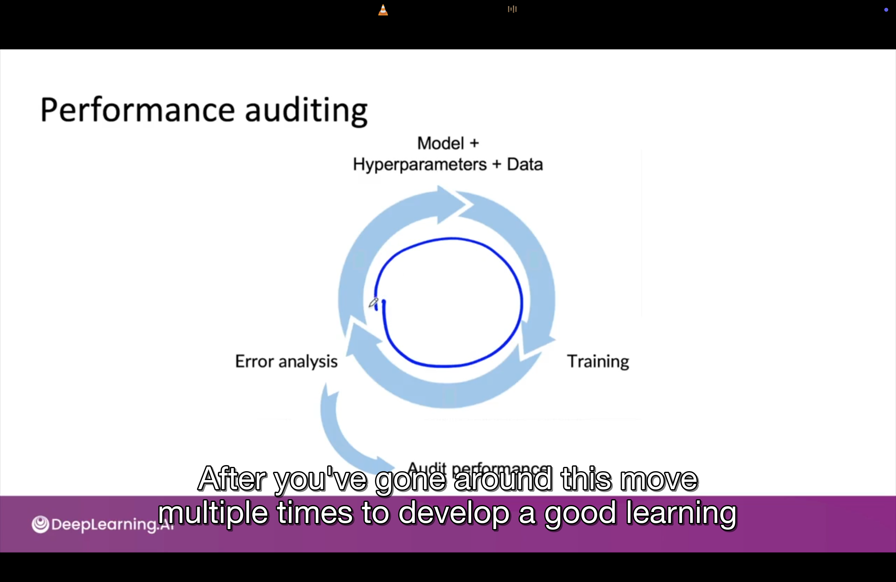  

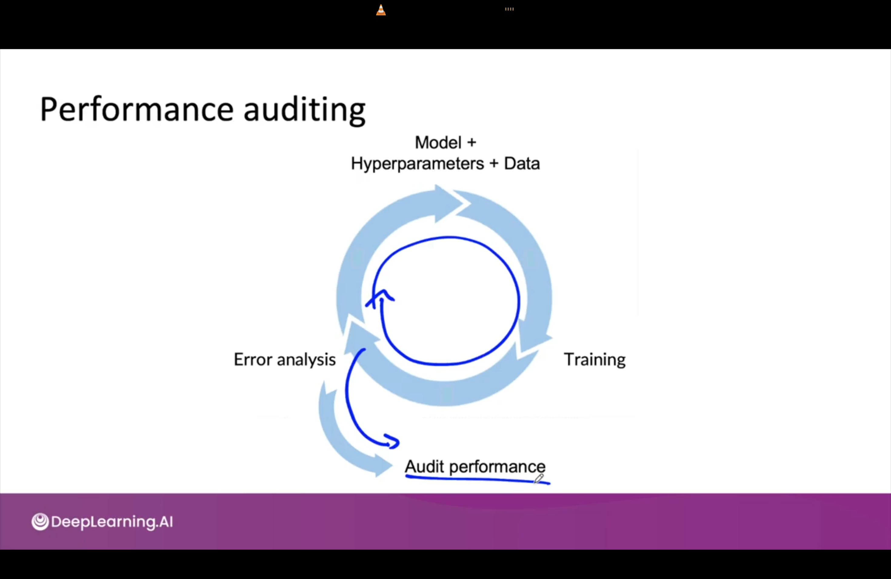

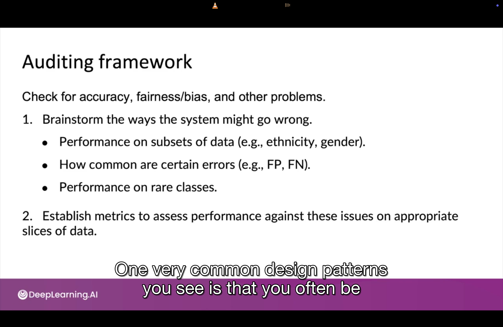

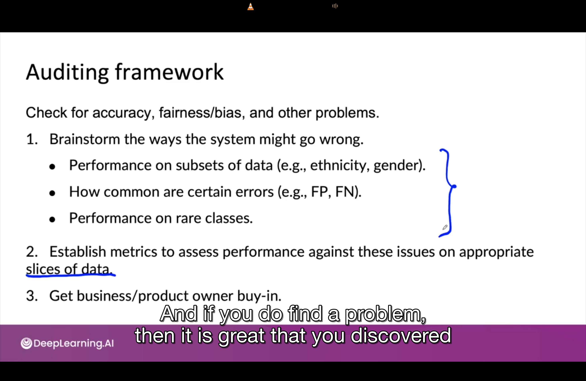

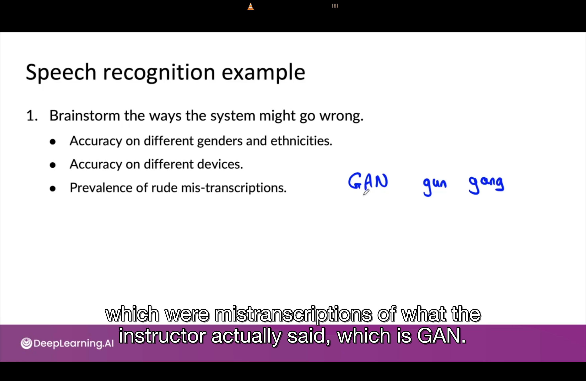

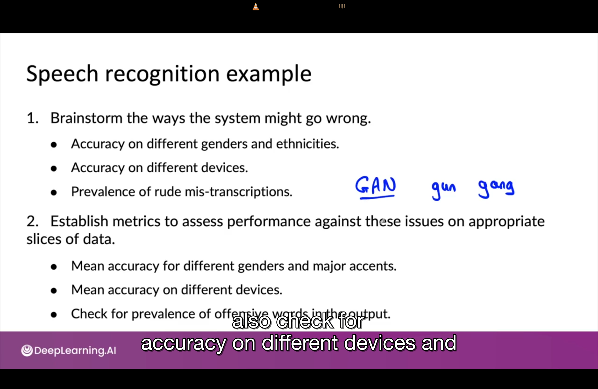

Even when your learning algorithm is doing well on accuracy or F1 score or some appropriate metric. It's often worth one last performance audit before you push it to production. And this can sometimes save you from significant post deployment problems. Let's take a look.

You've seen this diagram before. After you've gone around this move multiple times to develop a good learning algorithm. It's worthwhile auditing this performance one last time. Here's a framework for how you can double check your system for accuracy for fairness/bias and for other possible problems.

Step one is brainstorm the different ways the system might go wrong. For example, does the algorithm perform sufficiently well on different subsets of the data? Such as individuals of a certain ethnicity or individuals of different genders? Or does the algorithm make certain errors such as false positives and false negatives which you might worry about in skewed datasets or how does it perform on certain rare and important classes.

So the types of issues we talked about in the key challenges video earlier this week. Any of them that concern you, You might include them in this brainstormed ways that the system might go wrong for all the ways that you're worried about the system going wrong. You might then establish metrics to assess the performance of your algorithm against these issues. One very common design patterns you see is that you often be evaluating performance on slices of the data.

So rather than evaluating performance on your entire dev set, you may be taking out all of the individuals of a certain ethnicity, all the individuals of a certain gender or all of the examples where there is a scratch defect on the smartphone but to take a subset of the data. Also called a slice of the data to analyze performance on those slices in order to check against these things that may the problems. >> After establishing appropriate metrics, MLOps tools can also help trigger an automatic evaluation for each model to audit this performance. For instance, tensorflow has a package for tensorflow model analysis or TFMA that computes detailed metrics on new machine learning models, on different slices of data.

You learn more about this too in the next course. >> And as part of this process, I would also advise you to get buy-in from the business of the product owner that these are the most appropriate set of problems to worry about and a reasonable set of metrics to assess against these possible problems. And if you do find a problem, then it is great that you discovered this problem before pushing your system to production and you can then go back to update the system to address it before deploying a system that may cause problems downstream. Let's walk through this framework with an example, I'm going to use speech recognition again, if you build a speech recognition system, you might then brainstorm the way the system might go wrong.

So one thing I've looked at the fall for systems I worked on was accuracy on different genders and different ethnicities. For example, a speech system that does poorly on certain genders may be problematic or also ethnicities. One type of analysis I've done before is to carry out analysis of our accuracy depending on the perceived accent of the speaker because we want to understand if the speech systems performance was a huge function of the accent of the speaker or you might worry about the accuracy on different devices because different devices may have different microphones. And so if you do much worse on one brand of cell phones so that if there is a problem, you can proactively fix it.

Or finally, this might not be an example you would have thought of but prevalence of rude mis-transcriptions. Here's one example of something that actually happened to some of deeplearning.ai's courses. One of our instructors, Laurence Maroney was talking about GANs, generative adversarial networks, but because the transcription system was mistranscribing GANs because this unfortunately is not a common word in english language. And so, the subtitles had a lot of references to gun and gang, which were mistranscriptions of what the instructor actually said, which is GAN.

So it made it look like there's a lot of gun violence in that deeplearning.ai course and we actually had to go in to fix it because we didn't want that much gun gang violence in the subtitles. It turns out more generally that mistranscribing someone's speech into a rude word or a swear word that's perceived much more negatively than a more neutral mis transcription. And so I've built speech systems as well where we pay special attention to avoiding mis transcriptions that resulted in the speech system thinking someone said a swear word when maybe they didn't actually say that swear word. Based on this list of brainstorm ways that the speech system might go wrong, you can then establish metrics to assess performance against these issues on the appropriate slices of data.

For example, you can measure the mean accuracy of the speech system for different genders and for different accents represented in the data set and also check for accuracy on different devices and check for offensive or rude words in the output. I find that the ways a system might go wrong turns out to be very problem dependent. Different industries, different tasks will have very different standards and in fact today our standards in A I for what to consider an unacceptable level of bias or what is there and what is not there. Those standards are still continuing to evolve in AI and in many specific industries.

So I would advise you to do a search for your industry to see what is acceptable and to keep current with standards of fairness and all of our growing awareness for how to make our systems more fair and less biased. One last tip, I find that rather than just one person trying to brainstorm what could go wrong for high stakes applications if you can have a team or sometimes even external advisors help you brainstorm things that you want to watch out for that can reduce the risk of you or your team being caught later by something that you hadn't thought of.

I know that standards are still evolving for what we consider fair and sufficiently biased in many industries, but this is one of the topics I think would be good for us to get ahead of and to proactively try to identify, measure against and solve problems rather than deploy a system to be surprised much later by some unexpected consequences. So that's it for performance auditing. With this, I hope you have higher confidence in your learning algorithm when you go out to push it to production.

18.  

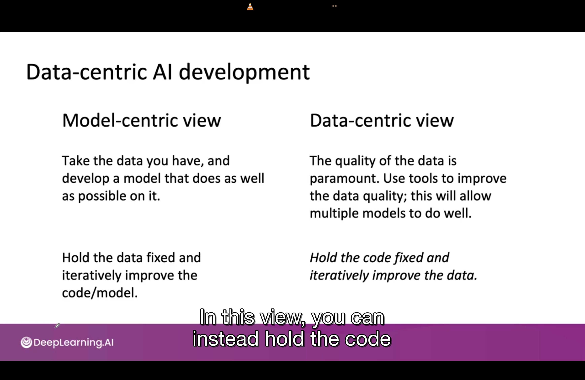

Let's say that error analysis has caused you to decide to focus on improving your learning algorithm's performance on data with a certain category or tag, say speech with car noise in the background. Let's take a look at how you can take a data centric approach to improving your learning algorithm's performance.

You've heard me speak before about model centric versus data centric AI development. Here's a little more detail on what I mean. With a model centric view of AI developments, you would take the data you have and then try to work really hard to develop a model that does as well as possible on the data. Because a lot of academic research on AI was driven by researchers downloading a benchmark data set and trying to do well on that benchmark, most academic research on AI is model centric, because the benchmark data set is a fixed quantity. In this view, model centric development, you would hold the data fixed and iteratively improve. In this model centric view, you would hold the data fixed and iteratively improve the code or the model.

There's still an important role to play in trying to come up with better models, but that's a different view of AI developments which I think is more useful for many applications. Which is to shift a bit from a model centric to more of a data centric view. In this view, we think of the quality of the data as paramount, and you can use tools such as error analysis or data augmentation to systematically improve the data quality. For many applications, I find that if your data is good enough, there are multiple models that will do just fine. In this view, you can instead hold the code fixed and iteratively improve the data.

There's a role for model centric development, and there's a role for data centric development. If you've been used to model centric thinking for most of your experience with machine learning, I would urge you to consider taking a data centric view as well, where when you're trying to improve your learning outcomes performance, try asking how can you make your data set even better? One of the most important ways to improve the quality of a data set is data augmentation. Let's go on to the next video where we'll start to take a look at data augmentation.   

19.  
   
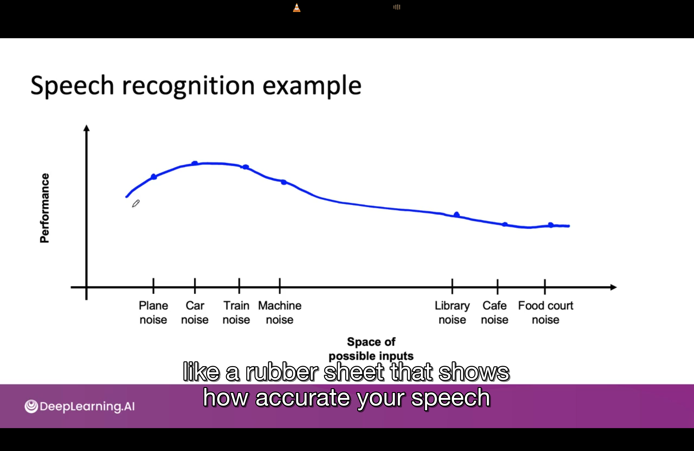

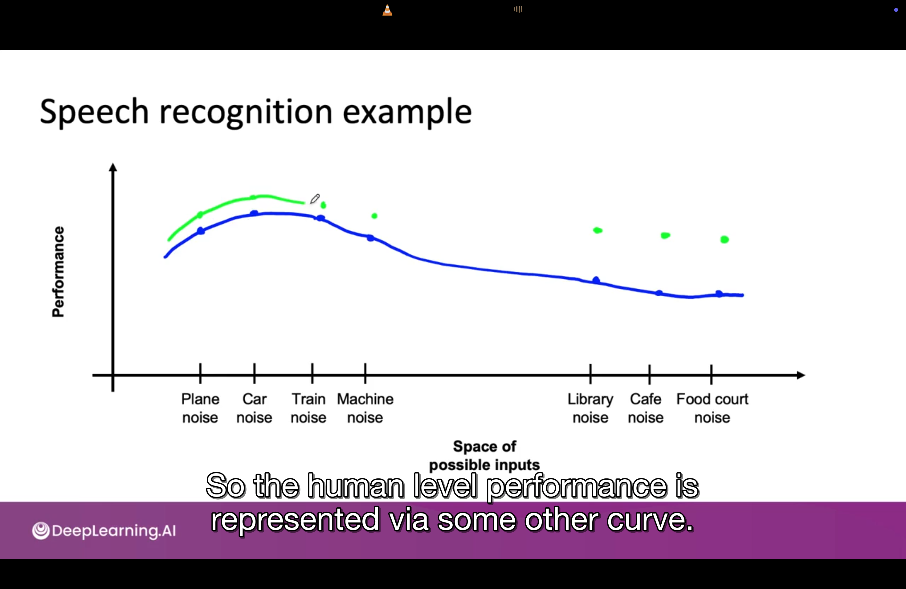

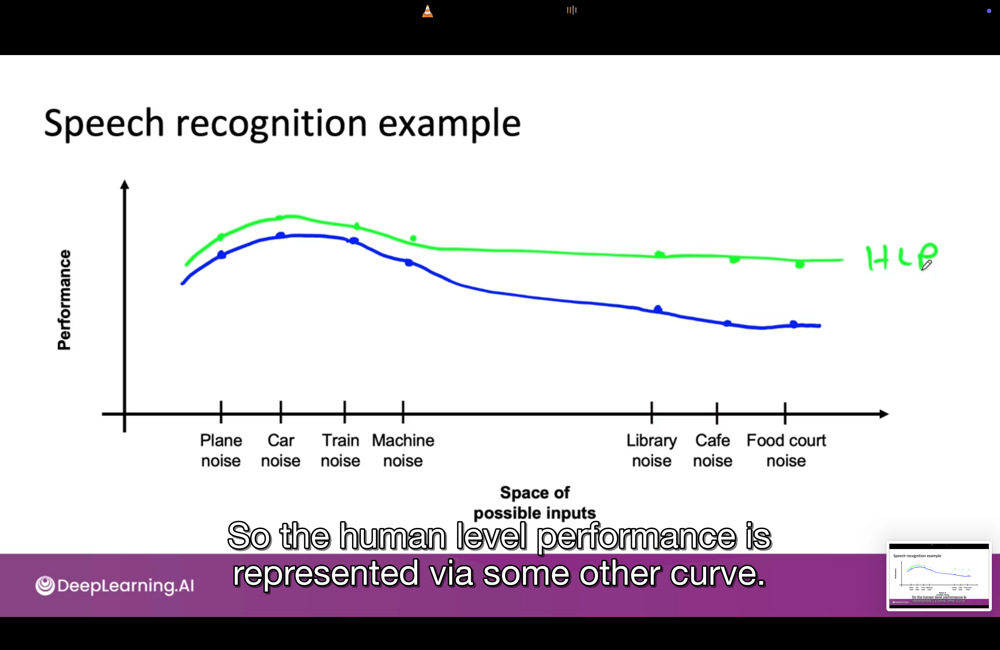

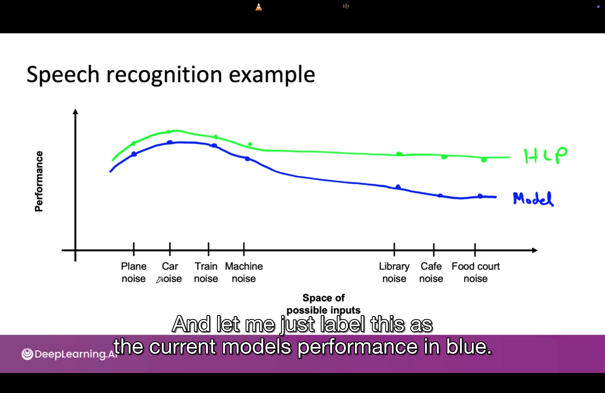

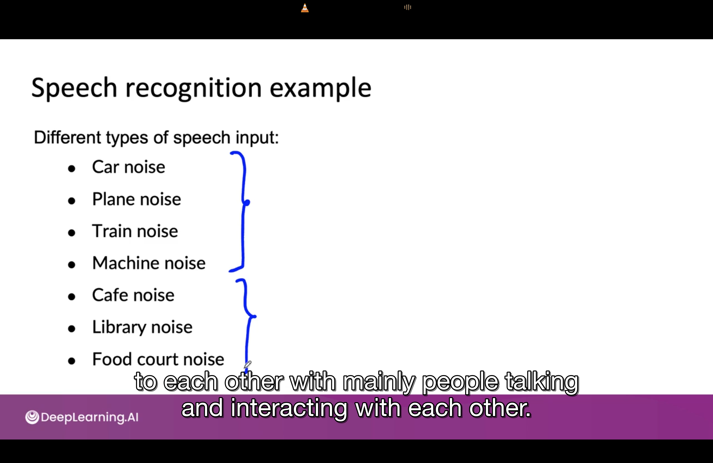

There's a picture, a conceptual picture that I found useful for thinking about data augmentation and how this can help the performance of a learning algorithm. Let me share this picture of you since I think you find it useful to when trying to decide whether to use data augmentation.

Take speech recognition. There could be many different types of noise in speech input such as car noise, play noise, train noise, machine noise, cafe noise or library noise, which isn't that loud or food court noise. Maybe these types of noises are more similar to each other because they're all mechanical types of noise and these types of noise maybe a little bit more similar to each other with mainly people talking and interacting with each other. So let me share of your picture that I keep in mind when I'm planning out my activities on getting more data through data augmentation or through actual data collection of any of these types of data.

In this diagram, the vertical axis represents performance, say accuracy. And on the horizontal axis, and this is a conceptual kind of a thought experiment type of access. I'm going to represent the space of possible inputs. So for example there speech with car noise and plane noise and train noise sound a bit like car noise.

So they're quite similar and machine noise a little bit further away, by machine noise, I'm picturing the sounds of a washing machine or a very loud air conditioners. Then you may have speech with cafe noise, library noise or food court ,and those are maybe more similar to each other. Then to these types of mechanical noise. Your system will have different levels of performance on these different types of input.

Let's say the performance is this for data of play noise, that of car noise, train noise, machine noise. And it does worse on data with library noise, cafe noise, food court noise. And so I think of their as being a curve. Or maybe think of this like a one dimensional piece of rubber band or like a rubber sheet that shows how accurate your speech system is as a function of the type of input it gets.

A human will have some other level of performance on these different types of data. So maybe a human is a bit better, will play noise bit better in car noise, and so on and maybe they are much better then your algorithm on library noise, cafe noise and food court noise. So the human level performance is represented via some other curve. And let me just label this as the current models performance in blue.

So this gap represents an opportunity for improvement. Now, what happens if you use data augmentation or maybe not data augmentation but go out to a bunch of actual cafes, to collect a lot more data with cafe noise in the background. What you'll do is, you'll take this point imagine grabbing a hold of this blue rubber bands or this rubber sheet, and pulling it upward like so. That's what you're doing if you collect or somehow gets more data with cafe noise and add that your training set, you're pulling up the performance of the algorithm on inputs with cafe noise.

And what that will tend to do, is pull up this rubber sheet in the adjacent region as well. So if performance on cafe noise goes up, probably performance on the nearby points will go up too and performance on far away. Points may or may not go up as much. It turns out that for unstructured data problems, pulling up one piece of this rubber sheet is unlikely to cause a different piece of the rubber sheet to dip down really far below.

Instead, pulling up one point causes nearby points to be pulled up quite a lot and far away points may be pulled up a little bit, or if you're lucky, maybe more than a little bit. But when I'm planning how to improve my learning algorithm's performance and where I hope to get it to, and getting more data in those places to iteratively pull up with those pieces or those parts of the rubber sheet to get them closer to human level performance. And when you pull up part of the rubber sheet, the location of the biggest gap may shift to somewhere else. And error analysis will tell you what is the location of this new biggest gap, that may then be worth your effort, to collect more data on and therefore to try to pull up one piece at a time.

And this turns out to be a pretty efficient way to decide where on the blue rubber sheet to pull up next to try to get performance closer to, say human level performance. I hope this analogy of a rubber band or rubber sheet and repeatedly pulling up a point on this rubber sheet will help you predict the effects of collecting more data that's associated with a specific category or a specific tag. How do you get more of this data? Let's take a look at how you can perform data augmentation and some best practices doing so in the next video.

20.   
    

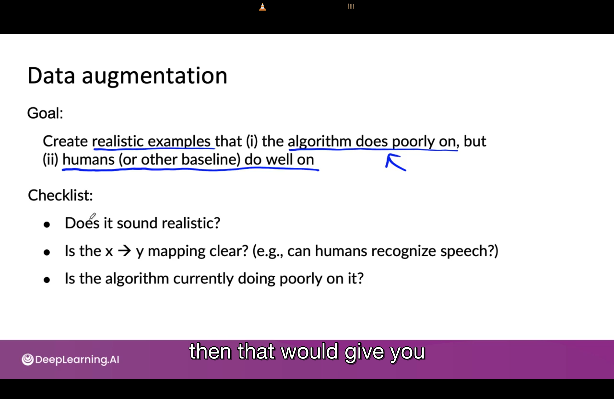

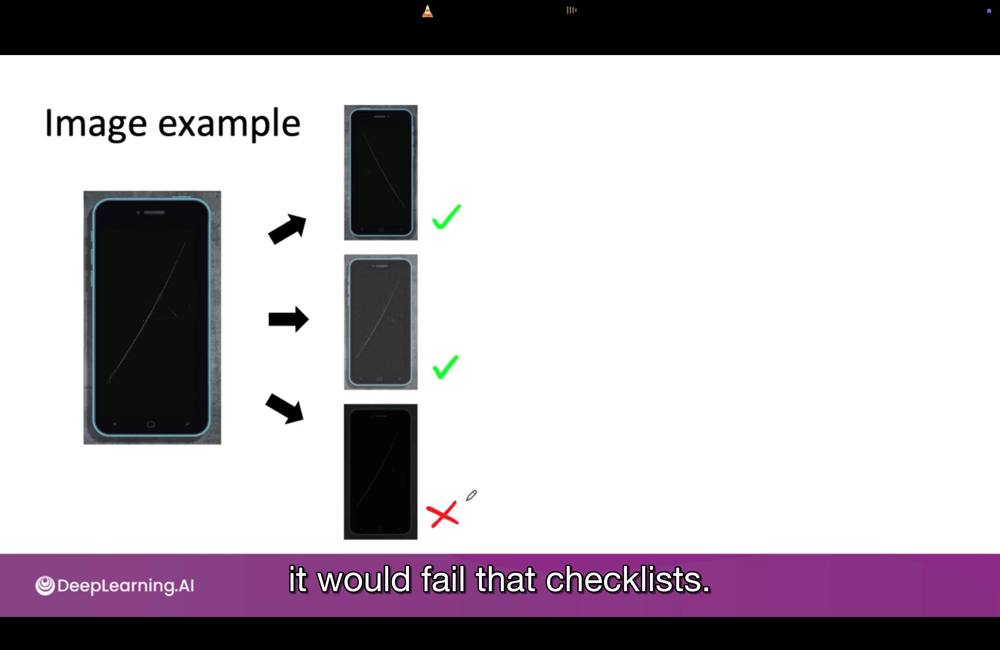

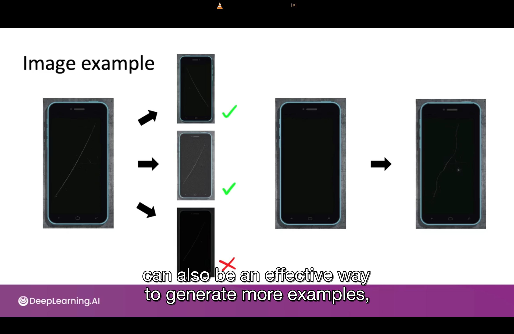

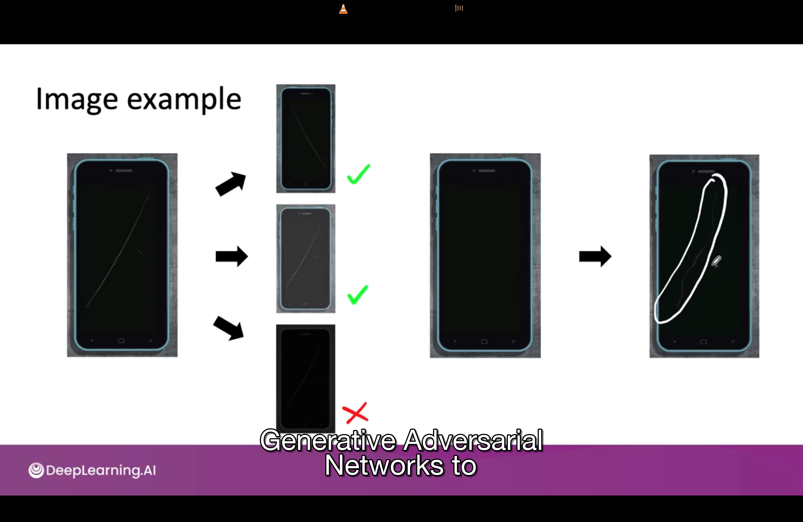

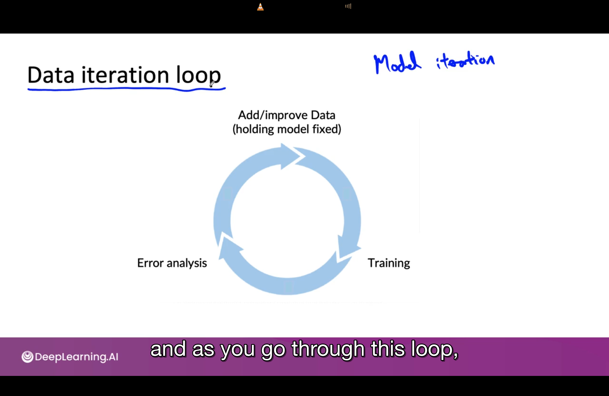

Data augmentation can be a very efficient way to get more data, especially for unstructured data problems such as images, audio, maybe text. But when carrying out data augmentation, there're a lot of choices you have to make. What are the parameters? How do you design the data augmentation setup?

Let's dive into this to look at some best practices.

Take speech recognition. Given an audio clip like this, ''AI is the new electricity''. If you take background cafe noise that sounds like this [NOISE] and add these two audio clips together. Literally, take the two waveforms and sum them up, then you can create a synthetic example that sounds like this, ''AI is the new electricity''.

Sounds like someone saying, AI is the new electricity in a noisy cafe. This is one form of data augmentation that lets you efficiently create a lot of data that sounds like data collected in the cafe. Or if you take the same audio clip, ''AI is the new electricity'', and add it to background music [MUSIC], that it sounds like someone saying it with maybe the radio on in the background. ''AI Is the new electricity''.

Now when carrying out data augmentation, there're a few decisions you need to make. What types of background noise should you use and how loud should the background noise be relative to the speech. Let's take a look at some ways of making these decisions systematically. The goal of data augmentation, is to create examples that your learning algorithm can learn from.

As a framework for doing that, I encourage you to think of how you can create realistic examples that the algorithm does poorly on, because if the algorithm already does well in those examples, then there's less for it to learn from. But you want the examples to still be ones that a human or maybe some other baseline can do well on, because otherwise, one way to generate examples that the algorithm does poorly on, would be to just create examples that are so noisy that no one can hear what anyone said, but that's not helpful. You want examples that are hard enough to challenge the algorithm, but not so hard that they're impossible for any human or any algorithm to ever do well on. That's why when I'm generating new examples using data augmentation, I try to generate examples that meets both of these criteria.

Now, one way that some people do data augmentation is to generate an augmented data set, and then train the learning algorithm and see if the algorithm does better on the dev set. Then fiddle around with the parameters for data augmentation and change the learning algorithm again and so on. This turns out to be quite inefficient because every time you change your data augmentation parameters, you need to train your new network or train your learning algorithm all over and this can take a long time. Instead, I found that using these principles, allows you to sanity check that your new data generated using data augmentation is useful without actually having to spend maybe hours or sometimes days of training a learning algorithm on that data to verify that it will result in the performance improvement.

Specifically, here's a checklist you might go through when you are generating new data. One, does it sound realistic. You want your audio to actually sound like realistic audio of the sort that you want your algorithm to perform on. Two, is the X to Y mapping clear?

In other words, can humans still recognize what was said? This is to verify point two here. Three, is the algorithm currently doing poorly on this new data. That helps you verify point one.

If you can generate data that meets all of these criteria, then that would give you a higher chance that when you put this data into your training set and retrain the algorithm, then that will result in you successfully pulling up part of this rubber sheet. Let's look at one more example, using images this time. Let's say that you have a very small set of images of smartphones with scratches. Here's how you may be able to use data augmentation.

You can take the image and flip it horizontally. This results in a pretty realistic image. The phone buttons are now on the other side, but this could be a useful example to add to your training set. Or you could implement contrast changes or actually brighten up the image here so the scratch is a little bit more visible.

Or you could try darkening the image, but in this example, the image is now so dark that even I as a person can't really tell if there's a scratch there or not. Whereas these two examples on top would pass the checklist we had earlier, that the human can still detect the scratch well, this example is too dark, it would fail that checklists. I would try to choose the data augmentation scheme that generates more examples that look like the ones on top and few of the ones that look like the ones here at the bottom. In fact, going off the principle that we want images that look realistic, that humans can do well on and hopefully the algorithm does poorly on, you can also use more sophisticated techniques such as take a picture of a phone with no scratches and use Photoshop in order to artificially draw a scratch.

This technique, literally using Photoshop, can also be an effective way to generate more examples, because this example of a scratch here, you may or may not be able to see it depending on the video compression and image contrast where you're watching this video, but with a scratch here, this looks like a pretty realistic scratch that's actually generated with Photoshop. I as a person can recognize the scratch and so if the learning algorithm isn't detecting this right now, this would be a great example to add. I've also used more advanced techniques like GANs, Generative Adversarial Networks to synthesize scratches like these automatically, although I found that techniques like that can also be overkill, meaning that there're simpler techniques that are much faster to implement that work just fine without the complexity of building a GAN to synthesize scratches. You may have heard of the term model iteration, which refers to iteratively training a model using error analysis and then trying to decide how to improve the model.

Taking a data-centric approach AI development, sometimes it's useful to instead use a data iteration loop where you repeatedly take the data and the model, train your learning algorithm, do error analysis, and as you go through this loop, focus on how to add data or improve the quality of the data. For many practical applications, taking this data iteration loop approach, with a robust hyperparameter search, that's important too. Taking of data iteration loop approach, results in faster improvements to your learning algorithm performance, depending on your problem. When you're working on an unstructured data problem, data augmentation, if you can create new data that seems realistic, that humans can do quite well on, but the algorithm struggles on, that can be an efficient way to improve your learning algorithm performance.

If you fall through error analysis, that your learning algorithm does poorly on speech with cafe noise, data augmentation to generate more data with cafe noise could be an efficient way to improve your learning algorithm performance. Now, when you add data to your system, the question I've often been asked is, can adding data hurt your learning algorithm's performance? Usually, for unstructured data performance, the answer is no, with some caveats, but let's dive more deeply into this in the next video.

21.  
   
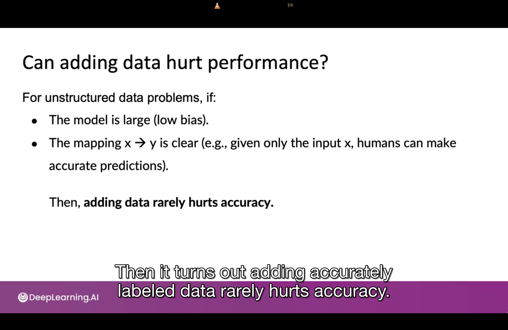

  

  

  
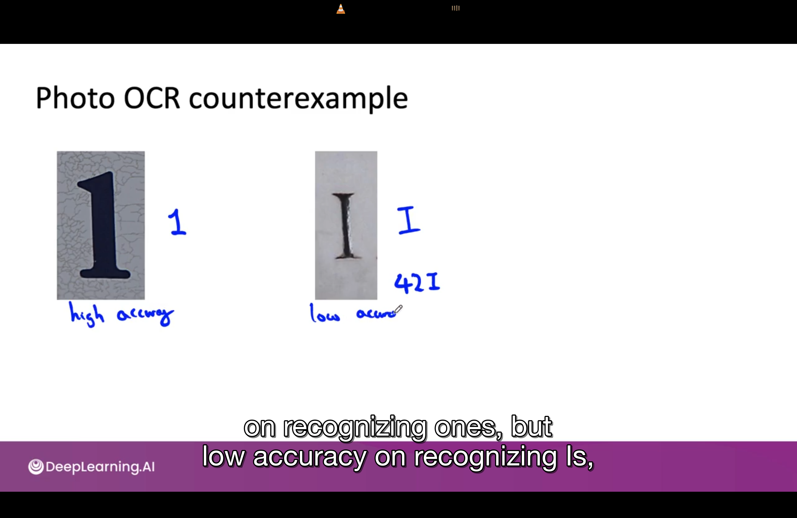

  
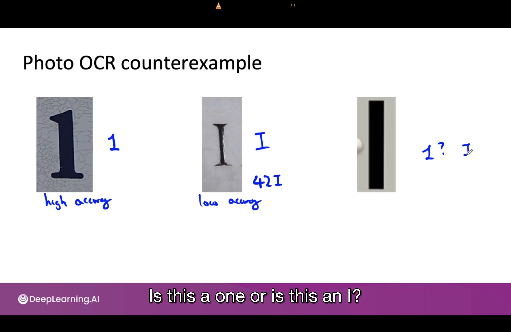

  
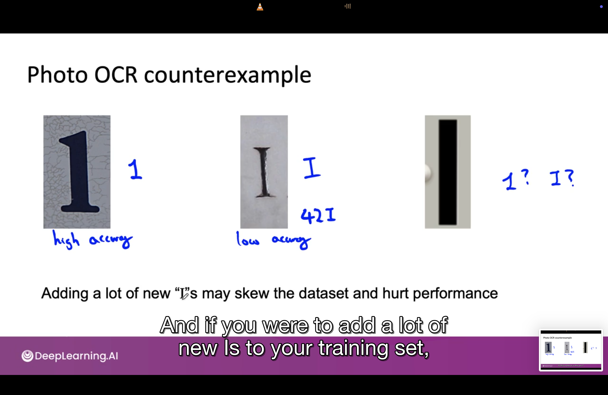

  
For a lot of machine learning problems, training sets and dev and test set distribution start at being reasonably similar. But, if you're using data augmentation, you're adding to specific parts of the training set such as adding lots of data with cafe noise.

So now you're training set may come from a very different distribution than the dev set and the test set. Is this going to hurt your learning algorithm's performance? Usually the answer is no with some caveats when you're working on unstructured data problems.

But let's take a deeper look at what that really means. If you are working on an unstructured data problem and if your model is large, such as a neural network that is quite large and has a large capacity and does low bias. And if the mapping from x to y is clear and by that I mean given only the input x, humans can make accurate predictions. Then it turns out adding accurately labeled data rarely hurts accuracy.

This is an important observation because adding data through data augmentation or collecting more of one type of data, can really change your input data distribution to probability of x. Let's say at the start of your problem, 20% of your data had cafe noise. But using augmentation, you added a lot of cafe noise. So now this is 50 of your data is data of cafe noise in the background.

It turns out that so long as your model is sufficiently large, then it won't stop it from doing a good job on the cafe noise data as well as doing a good job on non cafe noise data. In contrast, if your model was small, then changing your input data distribution this way may cause it to spend too much of its resources modeling cafe noise settings. And this could hurt this performance on non cafe noise data. But if your model is large enough, then this isn't really an issue.

The second problem that could arise is if the mapping from x to y is not clear, meaning given x, the true label of y is very ambiguous. This doesn't really happen much in speech recognition, but let me illustrate this with an example from computer vision. This is very rare, so it's not something I would worry about the most practical problems, but let's see why this is important. One of the systems I had worked on many years ago use Google street view images to read host numbers in order to more accurately clear locate buildings and houses in Google maps.

So one of the things that system did was take us input pictures like this and figure out what is this digit. So clearly this is a one and this is a alphabet I. You don't see a lot of I's in street view images, but there are some building. You may see a sign that says navigate to house number 42 I, but house numbers really rarely have an alphabet I in it.

Now, if you find that your algorithm has very high accuracy on recognizing ones, but low accuracy on recognizing Is, one thing you might do is add a lot more examples of Is in your training set. And the problem, and this is a rare problem is there are some images that are truly ambiguous. Is this a one or is this an I? And if you were to add a lot of new Is to your training set, especially ambiguous examples like these, then that may skew the data sets to have a lot more Is and hurt performance.

Because we know that there are a lot more ones than Is on house numbers. If the Sees a picture like this, it would be safer to guess that this is a one rather than that this is an I. But if data augmentation skews the data set in the direction of having a lot more Is rather than a lot of ones, that may cause the algorithm to guess poorly on an ambiguous example like this. So this is one rare example where adding more data could hurt performance and this example of one versus I is one that contradicts the second bullet because for some images the mapping from x to y is not clear.

In particular given only an image like this on the right, even a human can't really tell what this is.

Just to be clear, the example that we just went through together is a pretty rare almost corner case and it's quite unusual for data augmentation or adding more data to hurt the performance of your learning algorithm.

So long as your model is big enough, maybe a neural network is big enough to learn from diverse set of data sources. But I hope that understanding this rare case where it could hypothetically hurt gives you more comfort with using data augmentation or collecting more data to improve the performance of your algorithm, even if it causes your training set distribution to become different from your dev set and test set distribution. So far, our discussion has focused on unstructured data problems. How about structured data problems?

It turns out there's a different set of techniques that's useful for structured data. Let's take a look at that in the next video.  
   

22.   

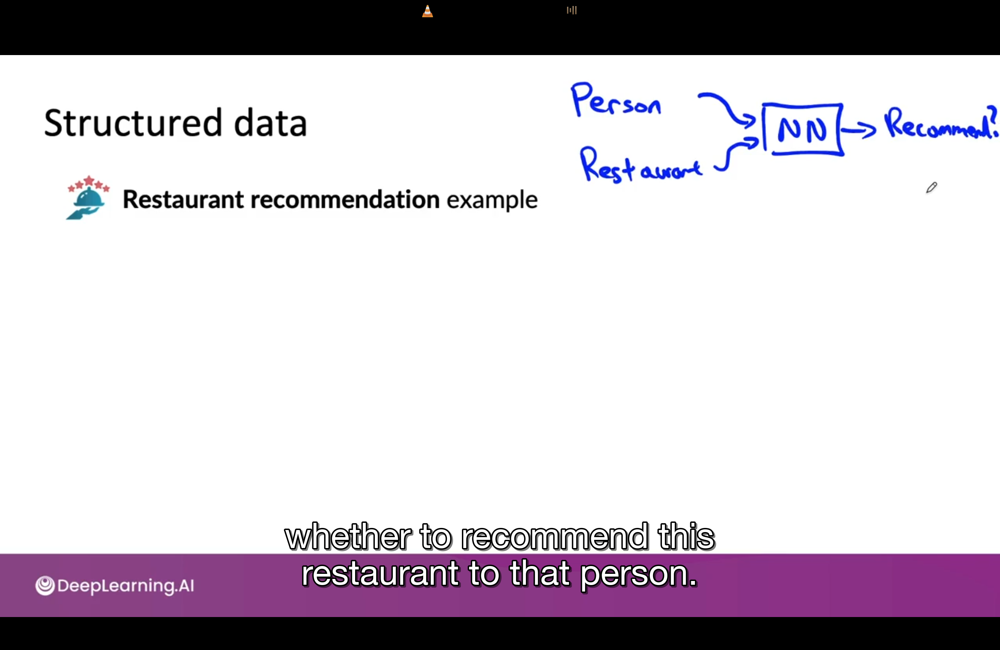

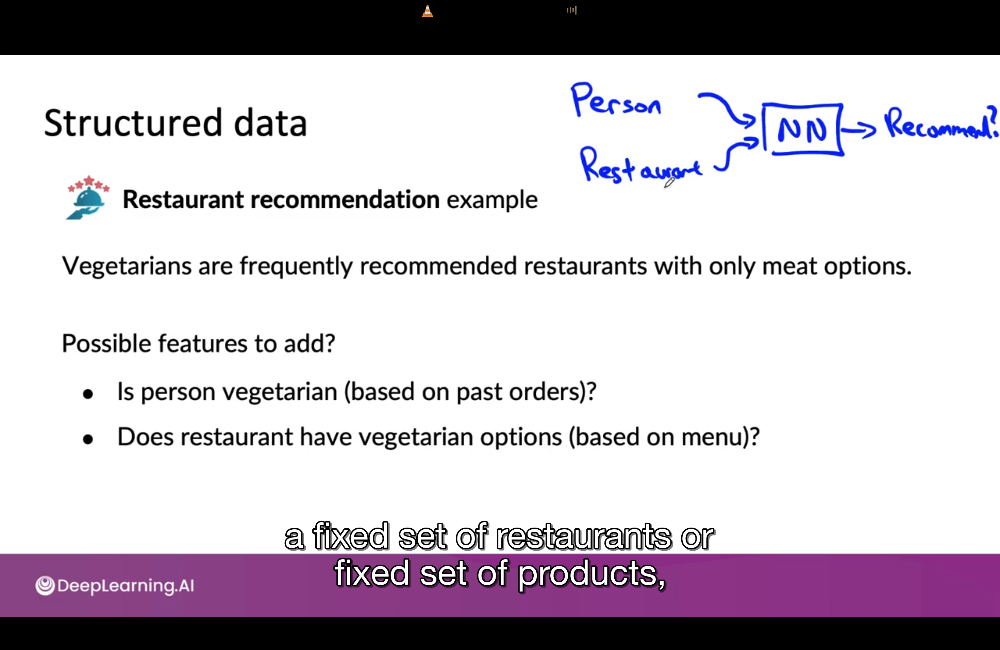

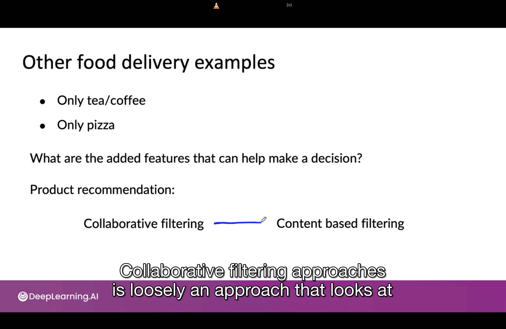

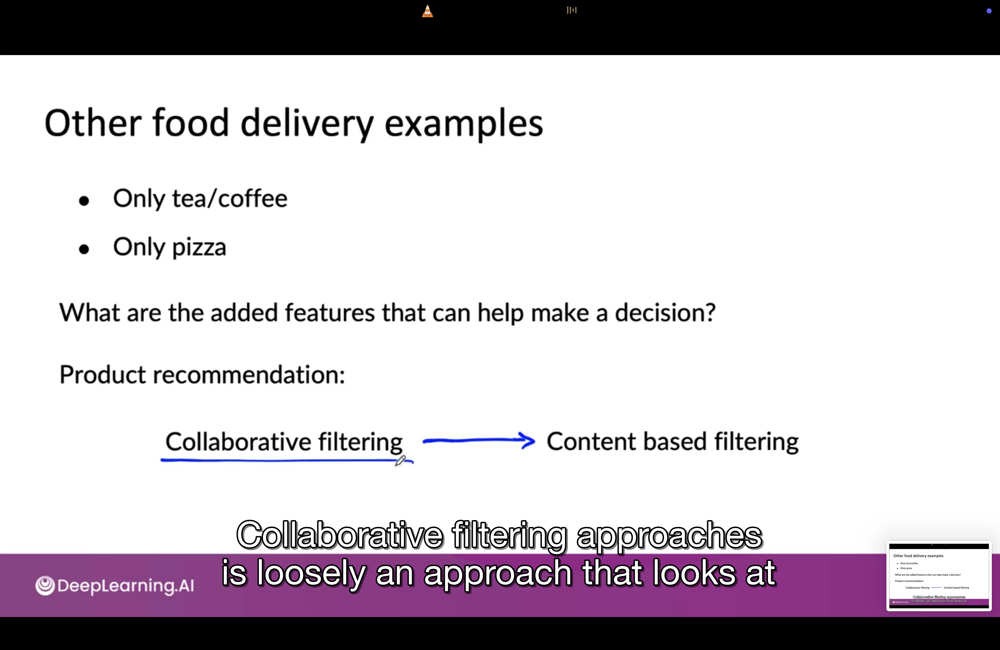

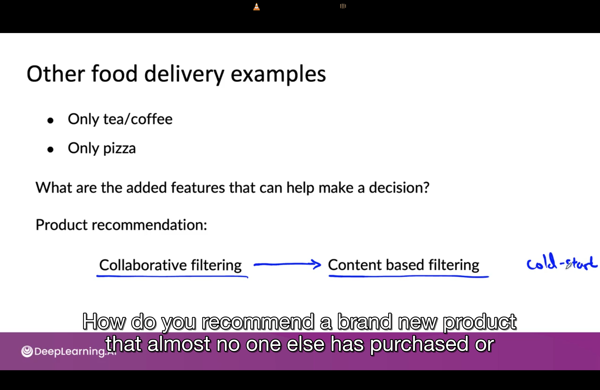

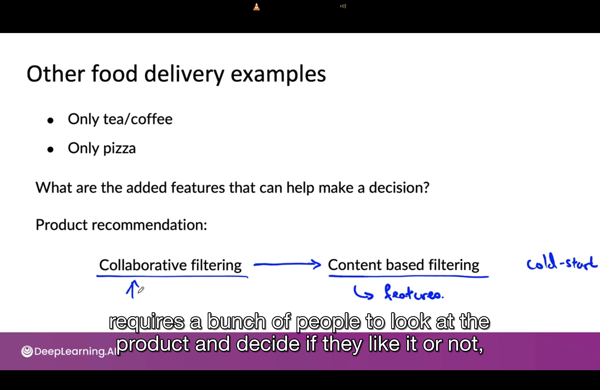

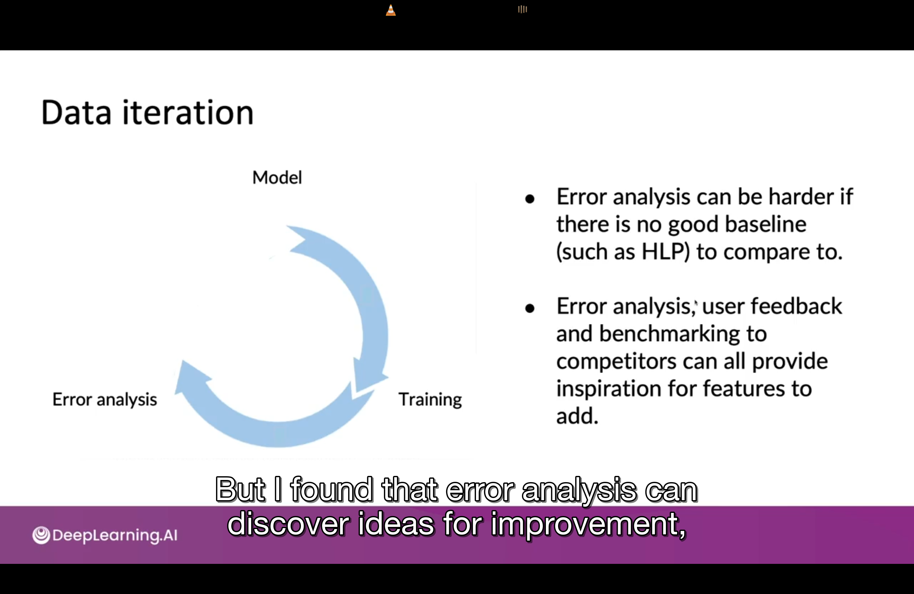

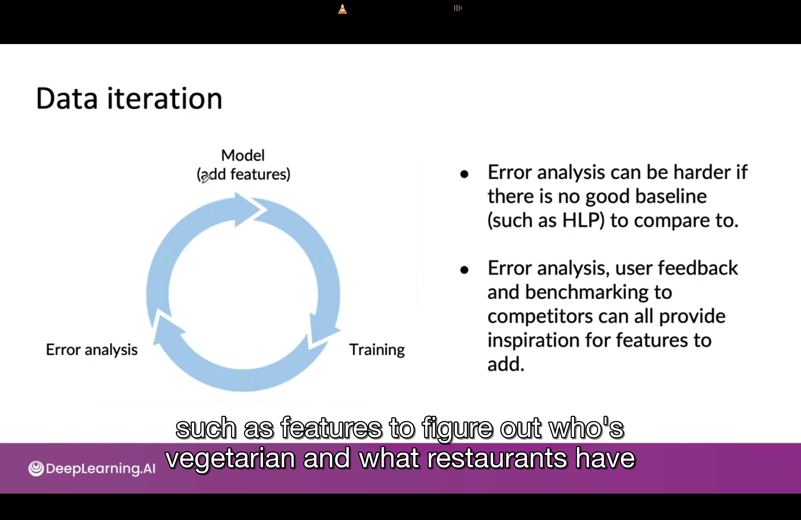
  

For many structured data problems. It turns out that creating brand new training examples is difficult, but there's something else you could do which is to take existing training examples and figure out if there are additional useful features you can add to it. Let's take a look at an example. Let me use an example of restaurant recommendations where if you're running an app that has to recommend restaurants to users that may be interested in checking out certain restaurants.

One way to do this would be to have a set of features for each user of each person, and a set of features for each restaurant that then get fed into some learning algorithms, say a neural network and then your network, whose job it is to predict whether or not this is a good recommendation, whether to recommend this restaurant to that person. In this particular example, which is a real example, error analysis showed that the system was unfortunately frequently recommending to vegetarians restaurants that only had meat options. There were users, they were pretty clearly vegetarian based on what they had ordered before and the system was still sending to them maybe a hot new restaurant that they recommended because there's a hot new restaurant, but it didn't have good vegetarian options. So this wasn't a good experience for anyone and there was a strong desire to change this.

Now, I didn't know how to synthesize new examples of users or new examples of restaurants because this application had a fixed pool of users and there are only so many restaurants. So rather than trying to use data augmentation to create brand new people or restaurants to feed to the training set, I thought it was more fruitful to see if there were features to add to either the person inputs or to the restaurant inputs. Specifically one feature you can consider adding is a feature that indicates whether this person appears to be vegetarian. And this doesn't need to be a binary value feature 0 or 1.

It could be soft features such as a percentage of fruit order that was vegetarian or some other measures of how likely they seem to be vegetarian. And a feature to add on the restaurant side would be. Does this restaurant have vegetarian options or good vegetarian options based on the menu. For structure data problems, usually you have a fixed set of users or a fixed set of restaurants or fixed set of products, making it hard to use data augmentation or collect new data from new users that you don't have yet on restaurants that may or may not exist.

Instead, adding features, can be a more fruitful way to improve the performance of the algorithm to fix problems like this one, identify through error analysis. Additional features like these, can be hand coded or they could in turn be generated by some learning algorithm, such as having a learning algorithm that try to read the menu and classify meals as vegetarian or not, or having people code this manually could also work depending on your application. Some other food delivery examples, we found that there were some users that would only ever order a tea and coffee and some users are only ever order pizza. So if the product team wants to improve the experience of these users, a machine learning team might ask what are the additional features we can add to detect who are the people that only order tea or coffee or who are the people that only ever or the pizza and enrich the user features.

So as the hope the learning algorithm make better recommendations for restaurants that these users may be interested in. Over the last several years, there's been a trend in product recommendations of a shift from collaborative filtering approaches to what content based filtering approaches. Collaborative filtering approaches is loosely an approach that looks at the user, tries to figure out who is similar to that user and then recommends things to you that people like you also liked. In contrast, a content based filtering approach will tend to look at you as a person and look at the description of the restaurant or look at the menu of the restaurants and look at other information about the restaurant, to see if that restaurant is a good match for you or not.

The advantage of content based filtering is that even if there's a new restaurant or a new product that hardly anyone else has liked by actually looking at the description of the restaurant, rather than just looking at who else like the restaurants, you can more quickly make good recommendations. This is sometimes also called the Cold Start Problem. How do you recommend a brand new product that almost no one else has purchased or like or dislike so far? And one of the ways to do that is to make sure that you capture good features for the things that you might want to recommend.

Unlike collaborative filtering, which requires a bunch of people to look at the product and decide if they like it or not, before it can decide whether a new user should be recommended the same product. So data iteration for structured data problems may look like this. You start out with some model, train the model and then carry out error analysis. Error analysis can be harder on structured data problems if there is no good baseline such as human level performance to compare to, and human level performance is hard for structured data because it's really difficult for people to recommend good restaurants even to each other.

But I found that error analysis can discover ideas for improvement, so can user feedback and so can benchmarking to competitors. But through these methods, if you can identify a academy or a certain type of tag associated your data that you want to drive improvement, then you may be able to go back to select some features to add, such as features to figure out who's vegetarian and what restaurants have good vegetarian options that would help you to improve your model. And because the specific application may have only a finite list of users and restaurants, the users and restaurants you have maybe all the data you have, which is why adding features to the examples. You have maybe a more fruitful approach compared to trying to come up with new users or new restaurants.

And of course I think features are a form of data to which is why this form of data iteration where error analysis helps you decide how to modify the features. That can be an efficient way as well of improving your learning algorithm's performance. I know that many years ago before the rise of deep Learning, part of the hope for deep learning was that you don't have to hand design features anymore. I think that has for the most part come true for unstructured data problems.

So I used to hand design features for images. I just don't do that anymore. Let the learning I won't figure it out. But even with the rise of modern deep learning, if your dataset size isn't massive, there is still designing of features driven by error analysis that can be useful for many applications today.

The larger data set, the more likely it is that a pure end-to-end deep learning algorithm can work. But for anyone other than the largest tech companies and sometimes even them for some applications, designing features, especially for structured data problems can still be a very important driver of performance improvements. Maybe just don't do that for unstructured data nearly as much because learning algorithms are very good at learning features automatically for images, audio and for text maybe. But for structured data, it's okay to go in and work on the features. 

23.  

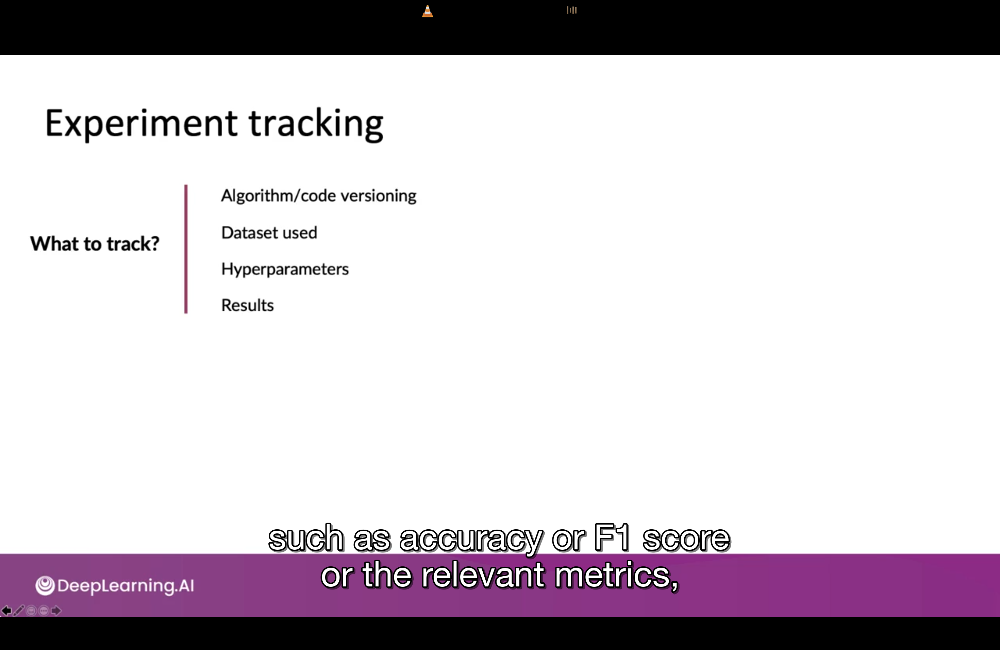

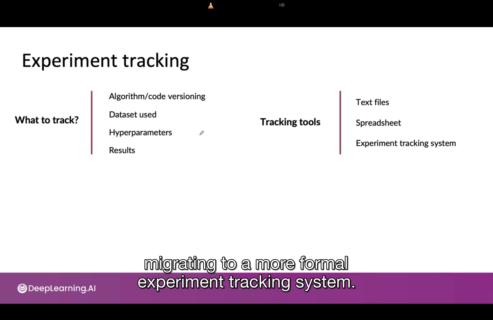

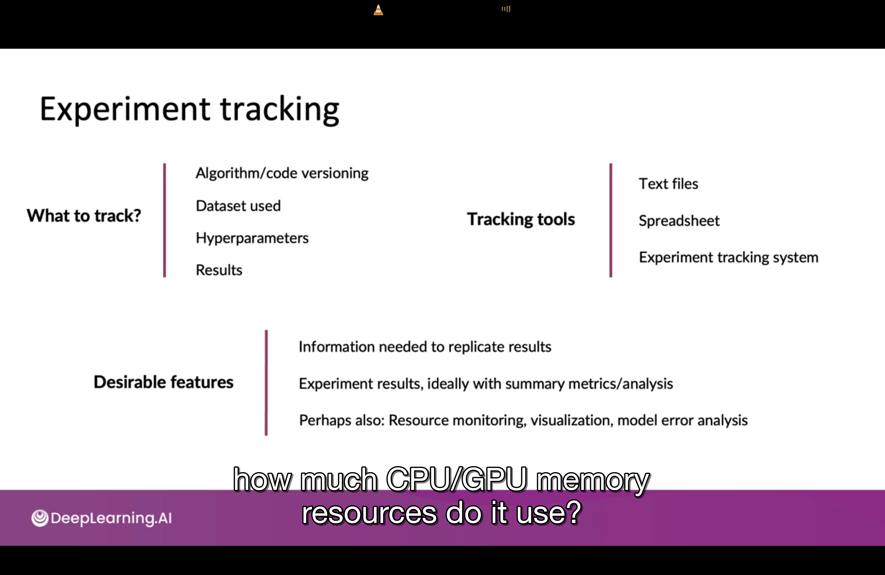    

   
As you're working to iteratively improve your algorithm. One thing, that'll help you be a bit more efficient is to make sure that you have robust experiment tracking. Let's take a look at some best practices. When you're running dozens or hundreds or maybe even more experiments, it's easy to forget what experiments you have already run.

Having a system for tracking your experiments can help you be more efficient in making the decisions on the data or the model or hyperparameters to systematically improve your algorithm's performance. When you are tracking the experiments you've run, meaning the models you've trained, here are some things I would urge you to track. One, is to keep track of what algorithm you're using and what version of code. Keeping a record of this will make it much easier for you to go back and replicate the experiment you had run maybe two weeks ago and whose details you may not fully remember anymore.

Second, keep track of the data set you use. Third, hyperparameters and fourth, save the results somewhere. This should include at least the high level metrics such as accuracy or F1 score or the relevant metrics, but if possible, it'd be useful to just save a copy of the trained model. How can you track these things?

Here are some tracking tools you might consider. A lot of individuals and sometimes even teams will start off with text files. When I'm running experiment by myself, I might use a text file to just make a note with a few lines of text per experiment to note down what I was doing. This does not scale well, but it may be okay for small experiments.

A lot of teams then migrate from text files to spreadsheets, especially shared spreadsheets, if you're working in a team where different columns of a spreadsheet could keep track of the different things you want to track for the different experiments you're running. Spreadsheets actually scale quite a bit further, especially shared spreadsheets that multiple members of a team may be able to look at. But beyond a certain point, some teams will also consider migrating to a more formal experiment tracking system. The space of experiment tracking systems is still evolving rapidly, and so does a growing set of tools out there.

But some examples include Weight &Biases, Comet, MLflow, Sage Maker Studio. Landing.AI where I am CEO also has its own experiment tracking tool focusing on computer vision and manufacturing applications. When I'm trying to use a tracking tool, whether a text file or a spreadsheet or some larger system, here are some of things I look at. First is, does it give me all the information needed to replicate the results?

In terms of replicability, one thing to watch out for is if your learning algorithm pulls data off the Internet. Because data off the Internet can change, that can decrease replicability unless you're careful in how your system is implemented. Second, tools that help you quickly understand the experimental results of a specific training run, ideally with useful summary metrics and maybe even a bit of a in-depth analysis, can help you more quickly look at your most recent experiments or even look at older experiments and remember what had happened. Finally, some other features to consider, resource monitoring, how much CPU/GPU memory resources do it use?

Or tools to help you visualize the trained model or even tools to help you with a more in-depth error analysis. I've found all of these to sometimes be useful features of experiment tracking frameworks. Rather than worrying too much about exactly which experiment tracking framework to use though, the number one thing I hope you take away from this video is, do try to have some system, even if it's just a text file or just a spreadsheet for keeping track of your experiments and include as much information as is convenient to include. Because later on, if you try to look back, remember how you had generated a certain model, having that information would be really useful for helping you to replicate your own results.   

24.     
   
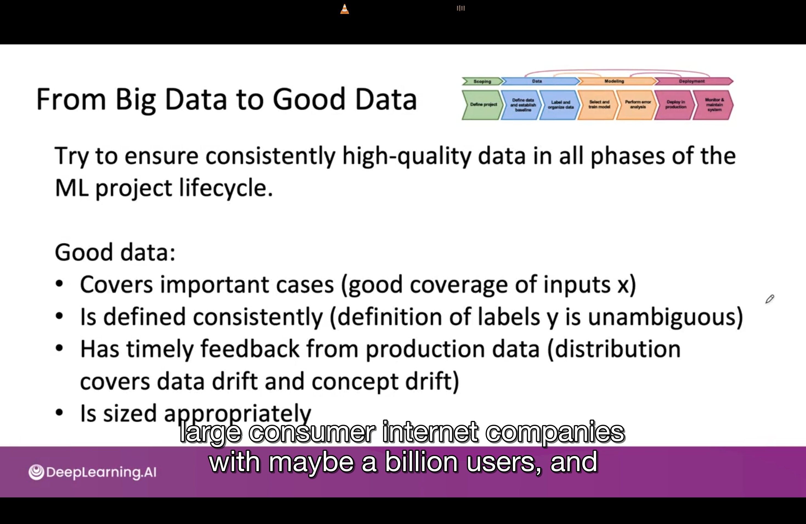

You've learned about taking a data centric approach to AI development. In this last video for this week, I'd like to leave you with a thought on shifting from big data to good data. Here's what I mean, a lot of modern AI had grown up in large consumer internet companies with maybe a billion users, and does companies like that have a lot of data on their users. If you have big data like that, by all means it could help the performance of your algorithm tremendously.

But both software consumer internet but equally importantly for many other industries, there's just isn't a billion data points.

And I think it may be even more important for those applications to focus not just on big data but on good data. I found that if you are able to ensure consistently high quality data in all phases in the machine learning project life cycle, that is key to making sure that you have a high performance and reliable machine learning deployment. What I mean by good data, I think good data covers the important cases, so you should have good coverage of different inputs x. And if you find out that you don't have enough data with speech, with cafe noise, data augmentation can help you get more data, get more diverse inputs x, to give you that coverage.

So, we spent quite a bit of time talking about this in this week's material. Good data is also defined consistently with definition of labels y that's unambiguous. We haven't talked about this yet but we'll go into much greater depth on this next week. Good data also has timely feedback from production data.

We actually talked about this last week when we were covering the deployment section in terms of having monitoring systems to track concept drift and data drift. And finally, you do need a reasonable size data set. So to summarize during the machine learning project lifecycle, we've talked about during the deployment phase last week how to make sure you have timely feedback this week. As we talked about modeling, we also included in our discussion how to make sure you have, hopefully good coverage of important cases.

Next week, when we dive into data definition, we'll spend much more time to talk about how to make sure your data is defined consistently.

And I hope that with the ideas conveyed last week, this week, and next week you'll be armed with the tools you need to give your learning algorithm good data through all phases of the machine learning project life cycle.

So, that's it. Congratulations on getting to the end of this week's videos on modeling. I look forward to diving more deeply with you into the data part of the full cycle of a machine learning project. And next week, we'll also have a short optional section on scoping machine learning projects.

I look forward to see you next week. 
 

25.  

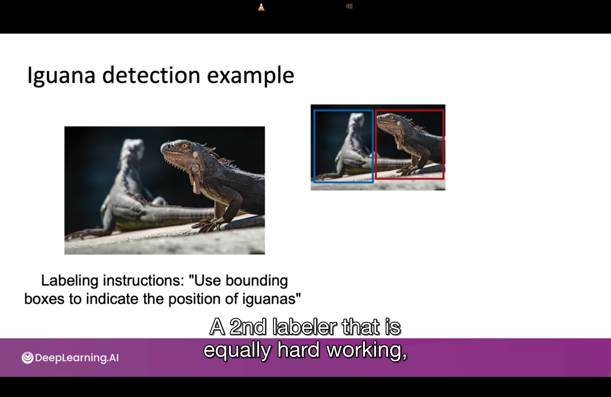

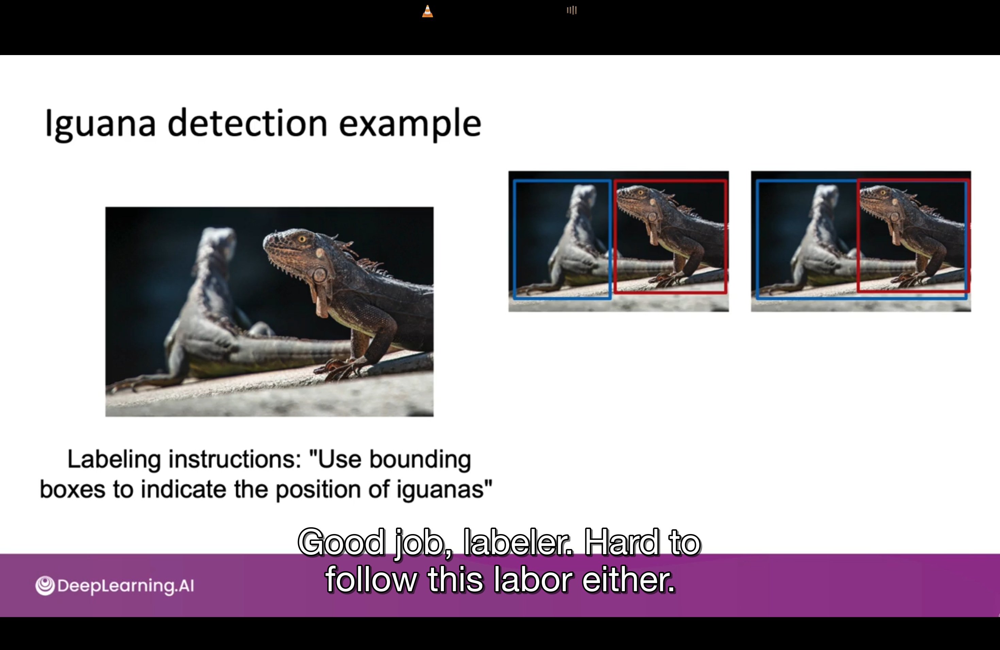

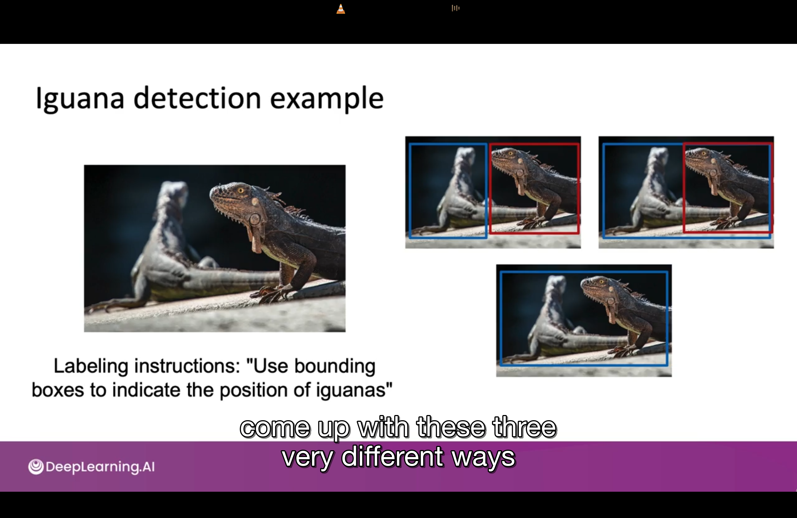

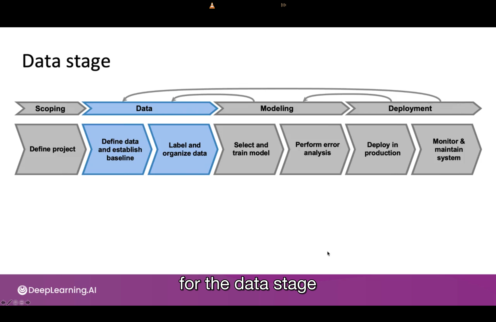

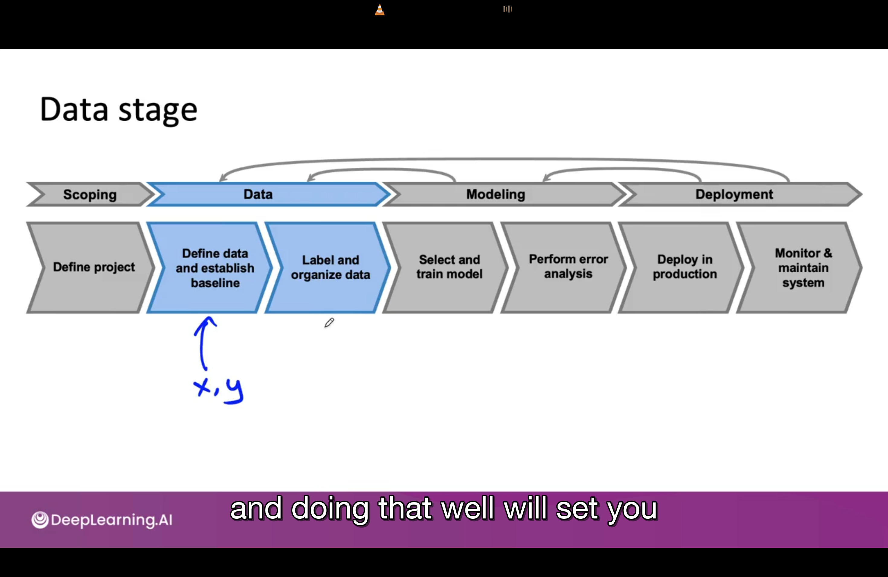

Welcome back. You're now in the 3rd and final week of this course, just one more week, and then you'll be done with this 1st course of the specialization. In this week we dive into data. How do you get data that sets up your training, your modeling for success?

But first, why is defining what data to use even hard? Let's look at an example. I'm going to use the example of detecting Iguanas. One of my friends, [inaudible] really likes Iguanas, so I have a bunch of iguana pictures floating around.

Let's say that you've gone into the forest and collected hundreds of pictures like these and you send these pictures to labelers with the instructions, "Please use bounding boxes to indicate the position of Iguanas.'' One labeler, may label it like this and say, one iguana, two Iguanas. This labeler did a good job. A 2nd labeler that is equally hard working, equally diligent may say, look, the iguana on the left has a tail that goes all the way to the right to this image. The 2nd labeler may say one iguana, two iguanas.

Good job, labeler. Hard to follow this labor either. A 3rd labeler may say, well, I'm going to look through all hundreds of images and label them all, and I'm going to use bounding boxes, and so let me indicate the position iguanas and draw a bounding box like that. Three diligent, hard working labelers can come up with these three very different ways of labeling iguanas, and maybe any of these is actually fine.

I would prefer the top two rather than the 3rd one. But any of these labeling conventions could result in your learning algorithm learning a pretty good iguana detector. But what is not fine is if 1/3 of your labelers use the 1st and 1/3 the 2nd, and 1/3, the 3rd labeling convention, because then your labels are inconsistent, and this is confusing to the learning algorithm. While, the iguana example was a fun one.

You see this type of effect in many practical computer vision problems as well. Let's use the phone defect detection example. If you ask a labeler to use bounding boxes to indicate significant defects, maybe one labeler will look and then go, ''Well, clearly the scratch is the most significant defect. Let me draw a bounding box on that.'' A 2nd labeler may look at his phone and say, "There are actually two significant defects.

There's a big scratch, and then there's that small mark there,'' it's called a pit mark, like if someone poked a phone with a sharp screwdriver. I think the 2nd labeler probably did a better job. But then a 3rd labeler may look at this and say, well, here's a bounding box that shows you where the defects are. Between these three labels, probably the one in the middle would work the best.

But this is a very typical example of inconsistence labeling that you will get back from a labeling process with even slightly ambiguous labeling instructions, and if you can consistently label the data with one convention, maybe the one in middle, you're learning algorithm will do better. What we would do in this week is dive into best practices for the data stage of the full cycle of a machine learning project. Specifically, we'll talk about how to define what is the data, what should be x and what should be y and establish a baseline and doing that well will set you up to label and organize the data well, which would give you a good data set for when you move into the modeling phase, which you already saw last week. Many machine learning researchers and many machine learning engineers had started off downloading data off the Internet to experiment with models, so using data prepared by someone else.

Nothing at all wrong with that, and for many practical applications, the way you prepare your data sets will have a huge impact on the success of your machine learning projects. In the next video, we'll take a look at some more examples of how data can be ambiguous, so that this will set us up later this week for some techniques for improving the quality of your data. Let's go on to the next video.

26. 

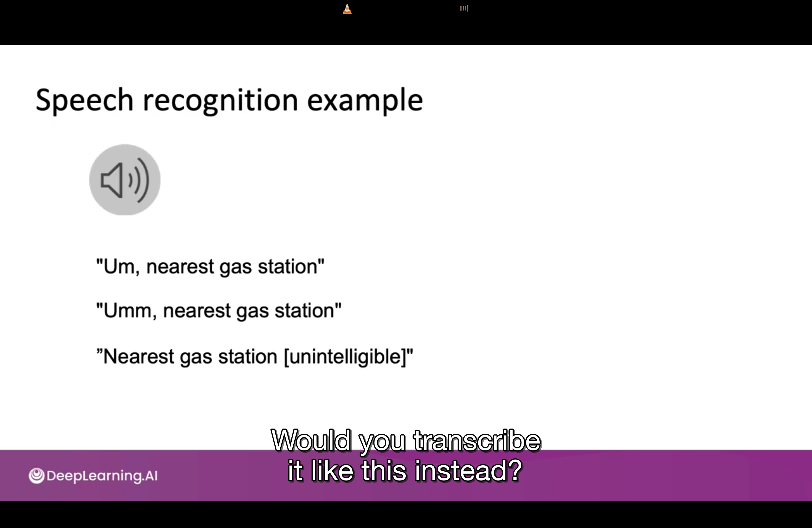     

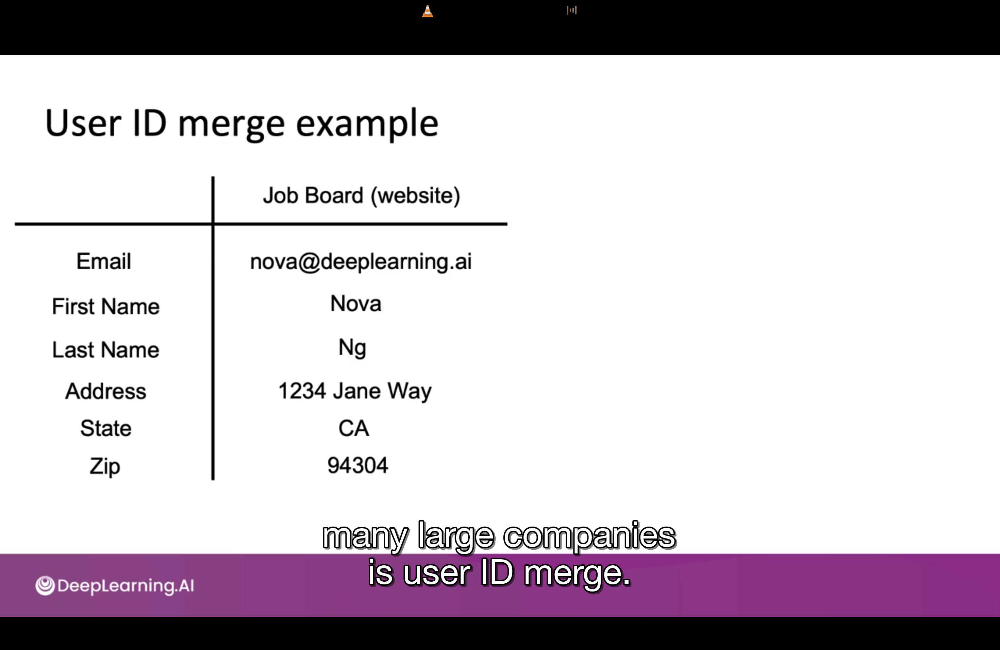

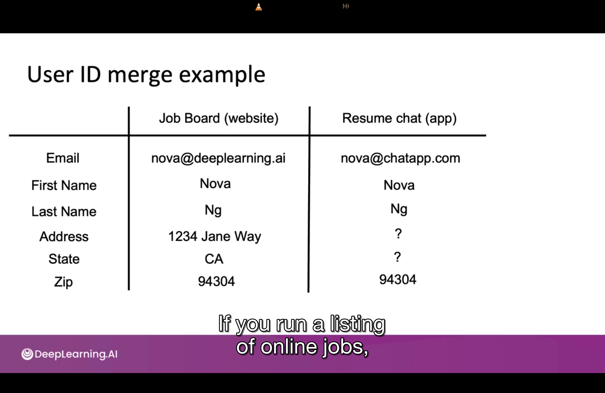

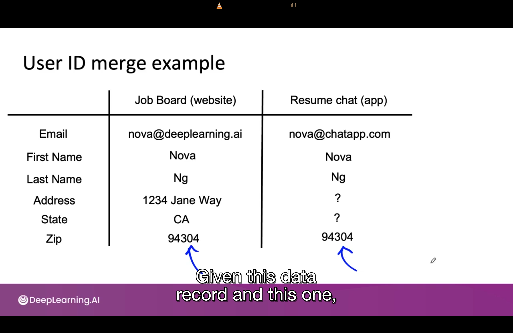

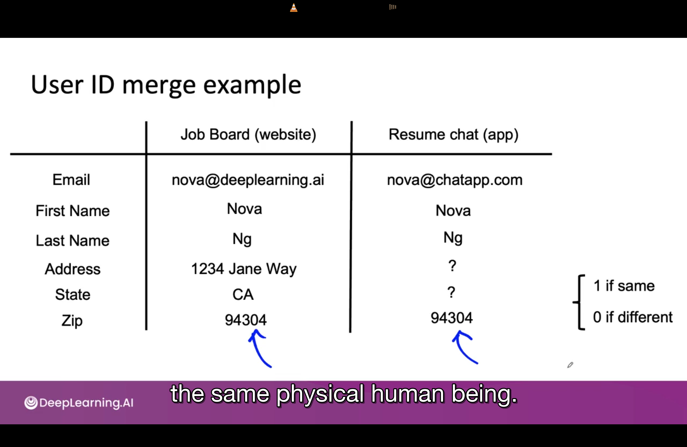

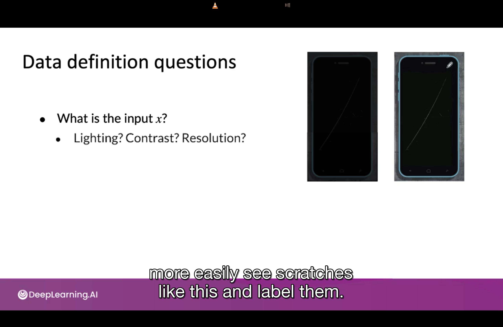

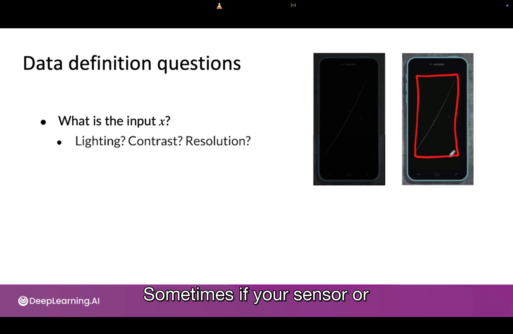

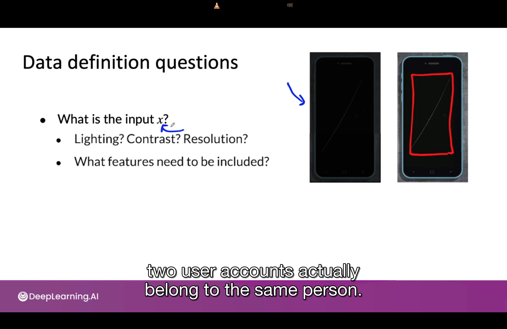

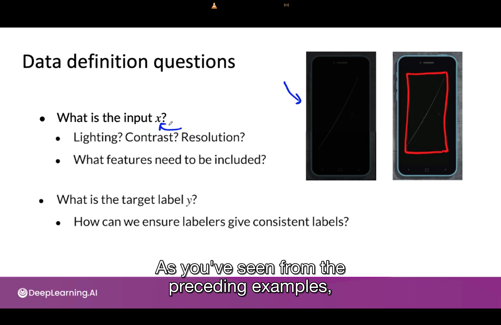

In the last video, you saw how the right bounding boxes for an image can be ambiguous. Let's take a look at some more label ambiguity examples. We briefly touched on speech recognition in the first week of this course. Here's another example.

Given this audio clip, sounds like someone was standing on a busy road side asking for the nearest gas station and then a car drove past. Did they say something right after that? I don't know. One way to transcribe this would be "Um, nearest gas station." In some places, people spell "um" with two m's.

That would be a different way to spell it. We could have used dot-dot-dot or ellipses instead of the comma as well, which would be another ambiguity. Or given the audio had noise after the last words. Nearest gas station.

Did they say something after nearest gas station? I'm not sure actually. Would you transcribe it like this instead? There are combinatorially many ways to transcribe this.

With one M or two M's, comma or ellipses, whether to write unintelligible at the end of this. Being able to standardize on one convention will help your speech recognition algorithm. Let's also look an example of structured data. A common application in many large companies is user ID merge.

That's when you have multiple data records that you think correspond to the same person and you want to merge these user data records together. For example, say you run a website that offers online listings of jobs. This may be one data record that you have from one of your registered users with the email, first name, last name and address. Now, say your company acquires a second company that runs a mobile app that allows people to login, to chat and get advice from each other about their resumes.

It seems synergistic for your business. If you run a listing of online jobs, maybe you merge or acquire a second company that runs a mobile app that lets people chat about their resumes and from this mobile app, you have a different database of users. Given this data record and this one, do you think these two are the same person? One approach to the User ID merge problem, is the use of supervised learning algorithm that takes as inputs to user data records and tries to outputs either one or zero based on whether it thinks these two are actually the same physical human being.

If you have a way to get ground true data records, such as if a handful of users are willing to explicitly link the two accounts, then that could be a good set of labeled examples to train an algorithm. But if you don't have such a ground true set of data, what many companies have done is ask human labors, sometimes a product management team to just manually look at some pairs of records that have been filtered to have maybe similar names or similar ZIP codes, and then to just use human judgment to determine if these two records appear to be the same person. Because whether these two records really is the same person, is genuinely ambiguous. They may and they may not be different people will label these records inconsistently.

If there's a way to just get them to label the data a little more consistently, you see some examples of how to do this later even when the ground truth is ambiguous, then that can help the performance of your learning algorithm. User ID merging is a very common function in many companies. Let me just ask you to please do this only in ways that are respectful of the users data and their privacy and only if you're using the data in a way, consistence with what they have given you permission for. User privacy is really important.

A few other examples from structured data. If you are trying to use the learning algorithm to look at the user account like this and predict is it a bot or a spam account? Sometimes that can be ambiguous. Or if you look at a online purchase, is this a 40-length transaction?

Has someone stolen accounts and is using stolen accounts to interact with your websites or to make purchases? Sometimes that too is ambiguous. Or if you look at someone's interactions with your website and you want to know, are they looking for a new job at this moment in time based on how someone behaves on a job board website or a resume chat app, you can sometimes guess if they're looking for a job, but it's hard to be sure. That's also a little bit ambiguous.

In the face of potentially very important and valuable prediction tasks like these, the ground truth can be ambiguous. If you ask people to take their best guess at the ground truth label for tasks like these, giving labeling instructions that results in more consistent and less noisy and less random labels will improve the performance of your learning algorithm. When defining the data for your learning algorithm, here are some important questions. First, what is the input x?

For example, if you are trying to detect defects on smart phones, for the pictures you're taking, is the lighting good enough? Is the camera contrast good enough? Is the camera resolution good enough? If you find that you have a bunch of pictures like these, which are so dark, it's hard even for a person to see what's going on.

The right thing to do may not be to take this input x and just label it. It may be to go to the factory and politely request improving the lighting because it is only with this better image quality that the labor can then more easily see scratches like this and label them. Sometimes if your sensor or your imaging solution or your audio recording solution is not good enough, the best thing you could do is recognize that if even a person can't look at the input and tell us what's going on, then improving the quality of your sensor or improving the quality of the input x, that can be an important first step to ensuring your learning algorithm can have reasonable performance. For structured data problems, defining whether the features to include can have a huge impact on your learning algorithm's performance.

For example, for user ID merge, if you have a way of getting the user's location, even a rough GPS location. If you have permission from the user to use that, can be a very useful tool for deciding whether two user accounts actually belong to the same person. Of course, please do this type of thing only if you have permission from the user to use their data this way. In addition to defining the input x, you also have to figure out what should be the target label y.

As you've seen from the preceding examples, one key question is, how can we ensure labels give consistent labels? In the last video and this video, you saw a variety of problems with the labels being ambiguous or in some cases, the input x not being sufficiently informative, such as an image is too dark. Let's take these data issues and put them into more systematic framework. That will allow us to devise solutions in a more systematic way.

Let's go on to the next video to take a look.

27. 

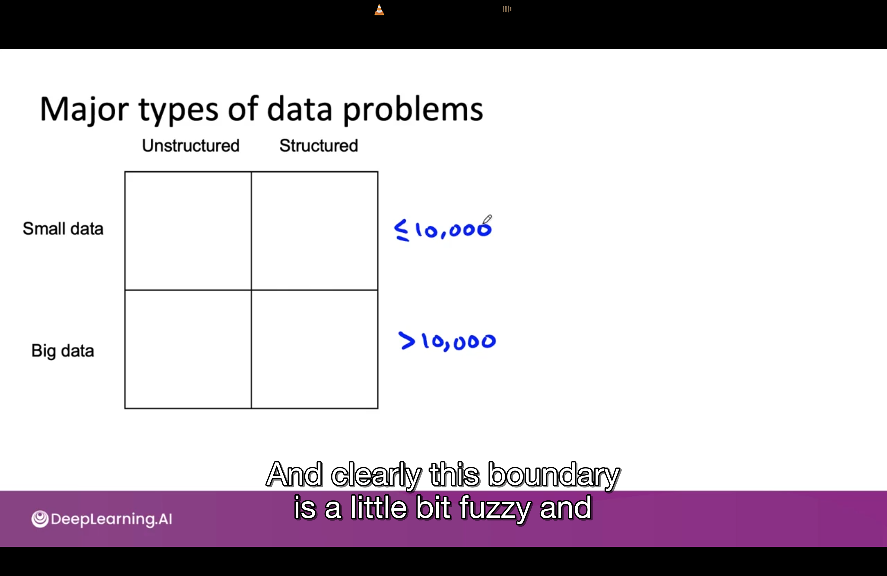

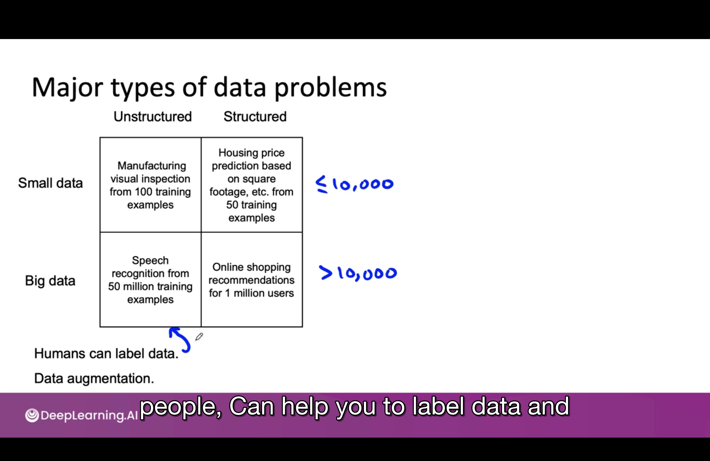

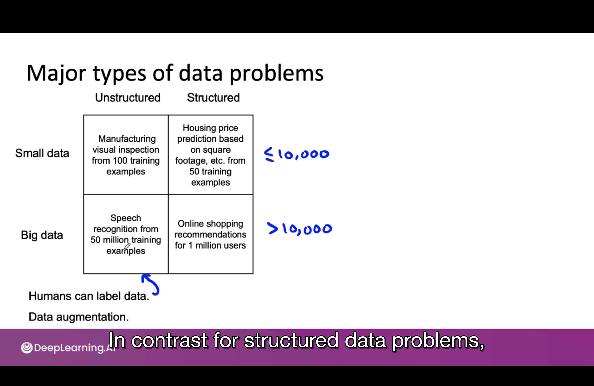

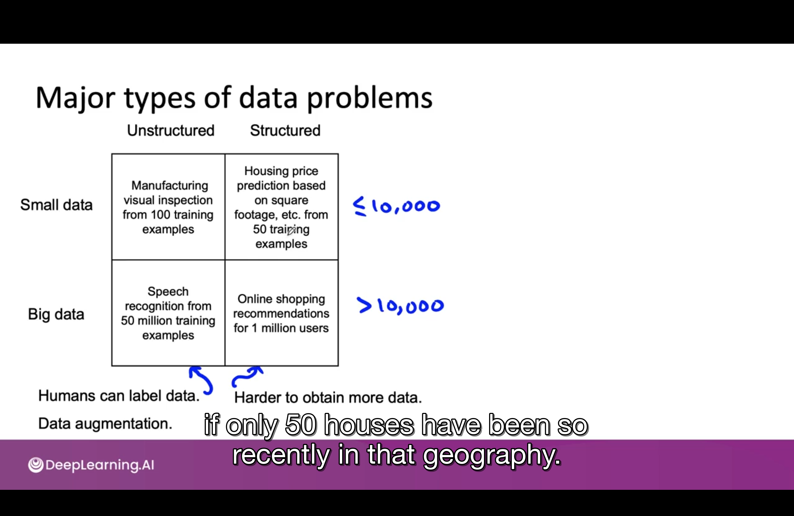

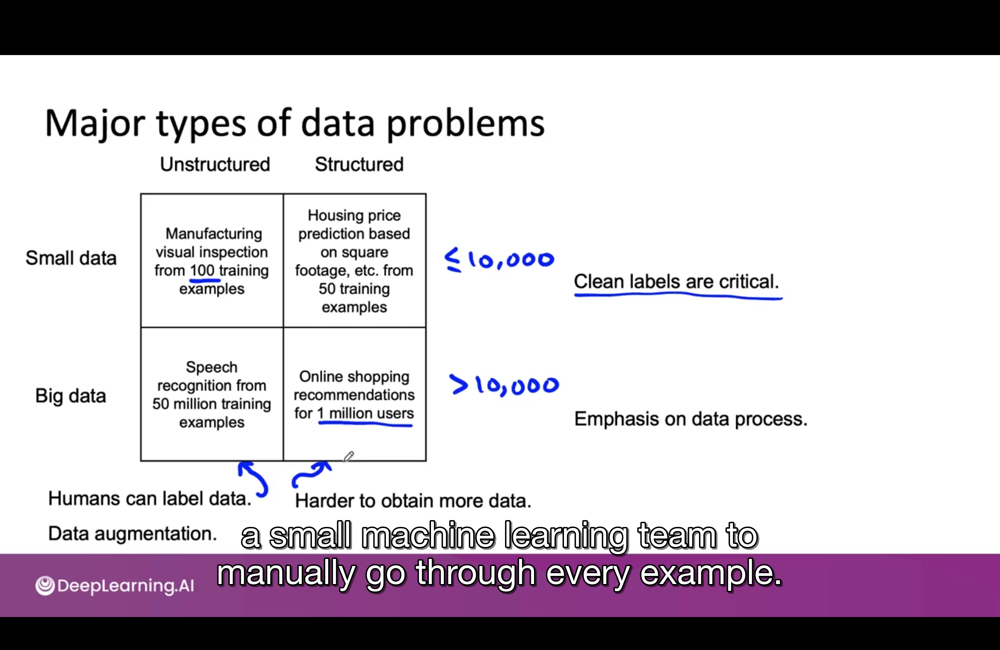

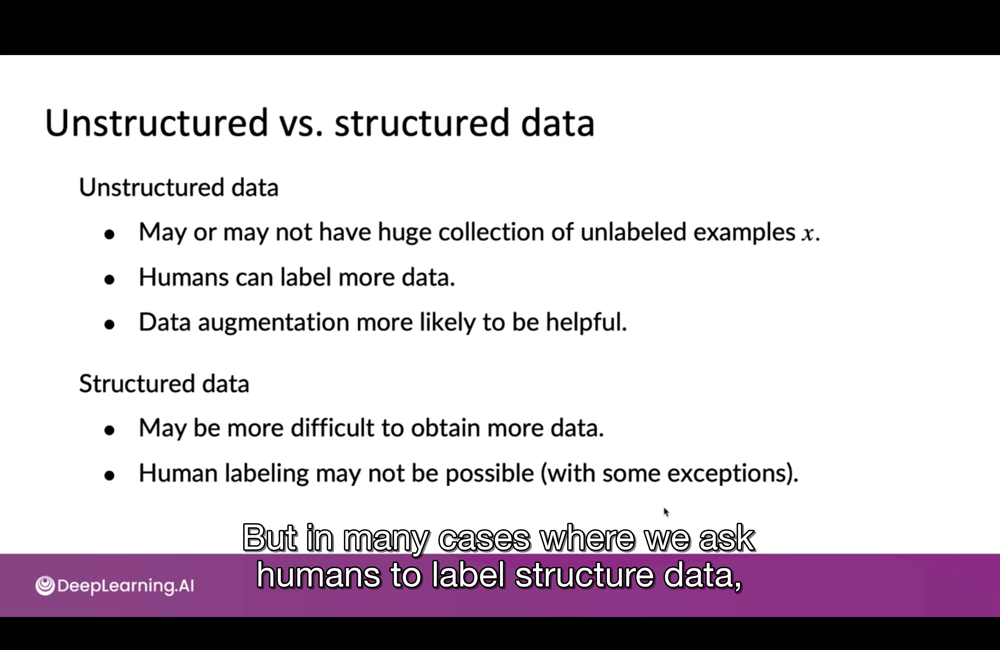

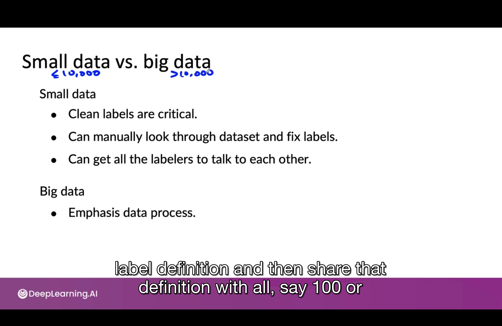

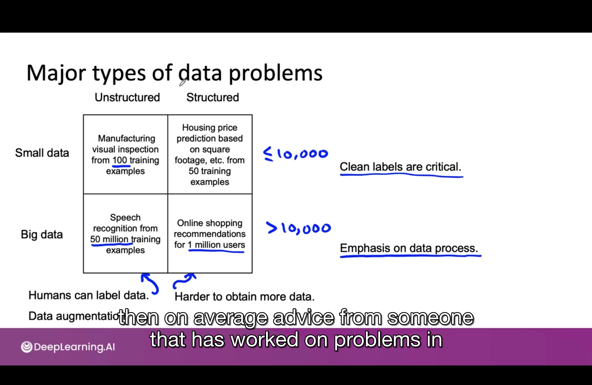

I'd like to share with you a useful framework for thinking about different major types of machine learning projects. It turns out that the best practices for organizing data for one type can be quite different than the best practices for totally different types. Let's take a look at whether these major types of machine learning projects. Let's fall in this two by two grid.

One axis will be whether your machine learning problem uses unstructured data or structured data. I found that the best practices for these are very different, mainly because humans are great at processing unstructured data, the images and audio and text, and not as good at processing structured data like database records. The second axis is the size of your data set. Do you have a relatively small data set?

or do you have a very large data set? There is no precise definition of what exactly is small and what is large? But I'm going to use as a slightly arbitrary threshold, whether you have over 10,000 examples or not. And clearly this boundary is a little bit fuzzy and the transitions from small to big data sets is a gradual one.

But I found that best practices if you have, say 100 or 1000 examples, smaller data sets is pretty different than we have a very large data set. And the reason I chose the number 10,000 is that's roughly the size beyond which it becomes quite painful to examine every single example yourself. If you have 1000 examples, you could probably examine every example yourself. But when you have, 10,000, 100,000, million examples, it becomes very time consuming for you as an individual or maybe a couple of machinery and engineers to manually look at every example.

So that affects the best practices as well. Let's look at some examples. If you are training a manufacturing visual inspection from just 100 examples of stretch phones, that's unstructured data because this is image data and it's pretty small data set. If you are trying to predict housing prices based on the size of the halls and other features of the house, from just 52 examples, then there's a structured data set.

We've just real value features and a relatively small data sets. If you are carrying out speech recognition from 50 million train examples, that's unstructured data. But you have a lot of data or if you are trying to recommend products. So online shopping recommendations and you have a million users in your database, then that's a structured problem with relatively large amount of data.

For a lot of unstructured data problems, people, Can help you to label data and data augmentation such as synthesizing new images or synthesizing new audio. And there's some emerging techniques for synthesizing new text as well, but data augmentation can help. So for manufacturing vision inspection, you can use data augmentation to maybe generate more pictures of smart films or for speech recognition. Data augmentation can help you synthesize audio clips with different background noise.

In contrast for structured data problems, it can be harder to obtain more data and also harder to use data augmentation, if only 50 houses have been so recently in that geography. Well, it's hard to synthesize new houses that don't exist or if you have a million users in your database, again, it's hard to synthesize new users that don't really exist. And it's also harder not impossible, still worth trying, but it may or may not be possible to get humans to label the data. So I find that the best practices for unstructured versus structured data are quite different.

The second axis is the size of your data set. When you have a relatively small data set, having clean labels is critical. If you have 100 training examples, then if just one of the examples is mislabeled, that's 1% of your data set. And because the data set is small enough for you or a small team to go through it efficiently, it may well be aware of your while to go through that 100 examples.

And make sure that every one of those examples is labelled in a clean and consistent way, meaning according to a consistent labeling standard. In contrast, if you have a million data points, it can be harder. Maybe impossible for a small machine learning team to manually go through every example. Having clean labels is still very helpful, don't get me wrong.

Even when you have a lot of data, clean labels is better than non clean ones. But because of the difficulty of having the machine learning and jointly go through every example, the emphasis is on data processes. In terms of how you collect, install the data, the labeling instructions you may write for a large team of crowdsource labelers. And once you have executed some data process, such as asked a large team of laborers to label a large set of audio clips, it can also be much harder to go back and change your mind and get everything relabeled.

So let's summarize or unstructured data problems. You may or may not have a huge collection of unlabeled examples x. Maybe in your factory, you actually took many thousands of images of smartphones, but you just haven't bothered to label all of them yet. This is also common in the self driving car industry, where many self driving car companies have collected tons of images of cars driving around, but just have not yet caught in that data labeled.

For these structured data problems, you can sometimes get more data by taking your unlabeled data x, and asking humans to just label more of it. This doesn't apply to every problem, but for the problems where you do have tons of unlabeled data, this can be very helpful. And as we have already mentioned, data augmentation can also be helpful. For structured data problems, is usually harder to obtain more data because you only have so many users or only so many houses were so that you can collect data from.

And human labeling on average is also harder, although there are some exceptions, such as in the Lost Video where you saw that we could try to ask people to label examples for the user ID merge problem. But in many cases where we ask humans to label structure data, even when there's a completely worthwhile to ask people to try to label if two records are the same person, there's more likely to be a little bit more ambiguity. But even the human labor sometimes finds it hard to be sure what is the correct label. Lastly, let's look at small versus big data where I used to slightly arbitrary threshold of whether you have more or less than say 10,000, they put training examples.

For small data sets, clean labels are critical and the data set may be small enough for you to manually look through the entire data set and fix any inconsistent labels. Further, the labeling team is probably not that large, it maybe one or two or just a handful of people that created all the labels. So if you discover an inconsistency in the labels, say one person label Iguanas one way and the different person labeled Iguanas a different way. You can just get the two or three labels together and have them talk to each other and hash out and agree on one labeling convention.

For the very large data sets, the emphasis has to be on data process. And if you have a 100 labelers or even more, it's just harder to get 100 people into a room to all talk to each other and hash out the process. And so you might have to rely on a smaller team to establish a consistent label definition and then share that definition with all, say 100 or more labelers and ask them to all implement the same process. I want to leave you with one last thought, which is that I found this categorization of problems into unstructured versus structured, small versus big data.

I found this to be helpful for predicting not just whether data processes generalize from one to another problem, but also whether other machine learning idea is generalized from one to another. So one tip, if you are working on a problem from one of these four quadrants, then on average advice from someone that has worked on problems in the same quadrants will probably be more useful than advice from someone that's worked in a different quadrant. I found also in hiring machine learning engineers, someone that's worked in the same quadrant as the problem I'm trying to solve will usually be able to adapt more quickly to working on other problems in that quadrant. Because the instincts and decisions are more similar within one quadrant than if you shift to a totally different quadrants in discharge.

I've sometimes heard people give advice like if you are building a computer vision system always get at least 1000 labor examples. And I think people that give advice like that are well meaning and I appreciate that they're trying to give good advice, but I found that advice to not really be useful for all problems. Machine learning is very diverse and it's hard to find one size fits all advice like that. I've seen computer vision problems built with 100 examples or 100 examples for a class, screen systems built with 100 million examples.

And so if you are looking for advice on a machine learning project, try to find someone that's worked in the same quadrant as the problem you are trying to solve. Now we talked about one formulation of different types of machine learning problems. There's one aspect I would like to dive into with you in the next video, which is how for small data problems, having clean data is especially important. Let's take a look at the next video of why it is true.

28. 
 
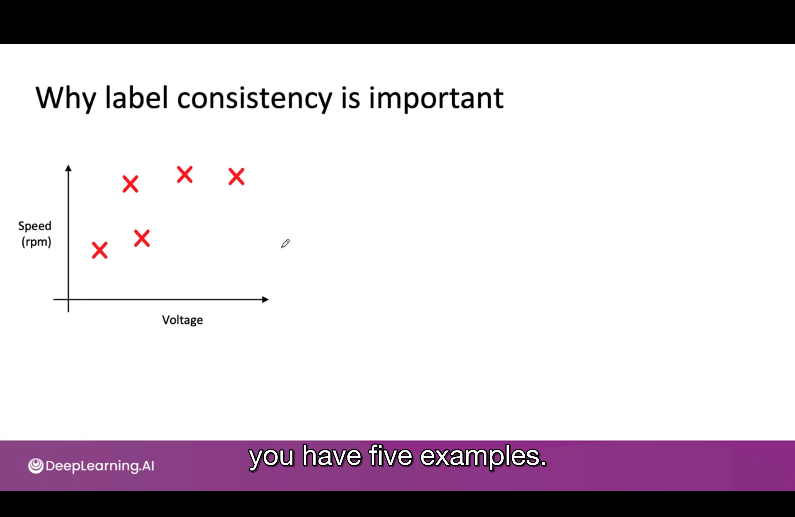

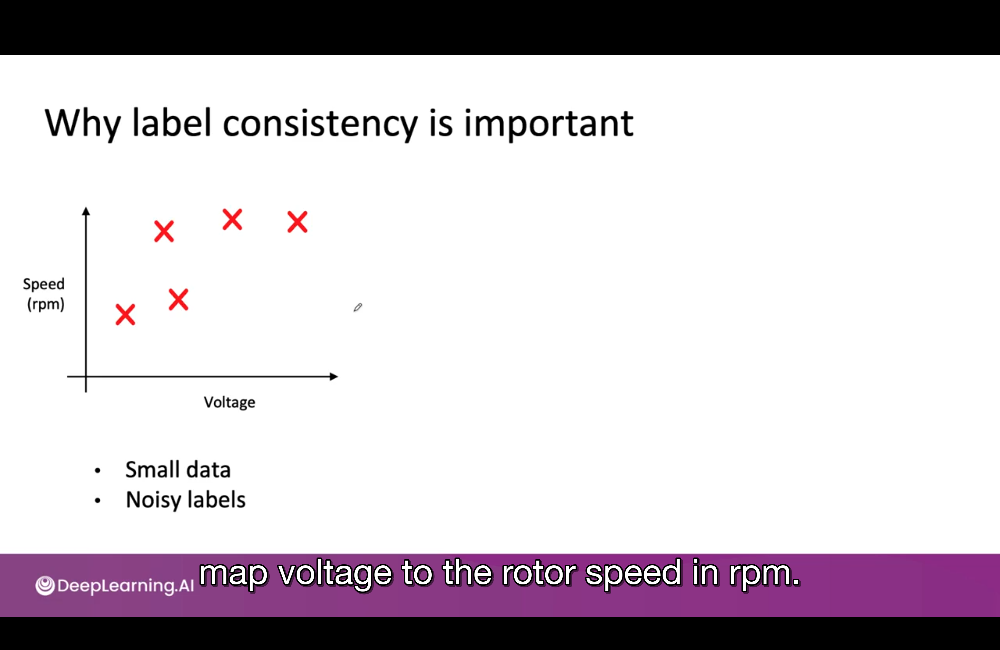

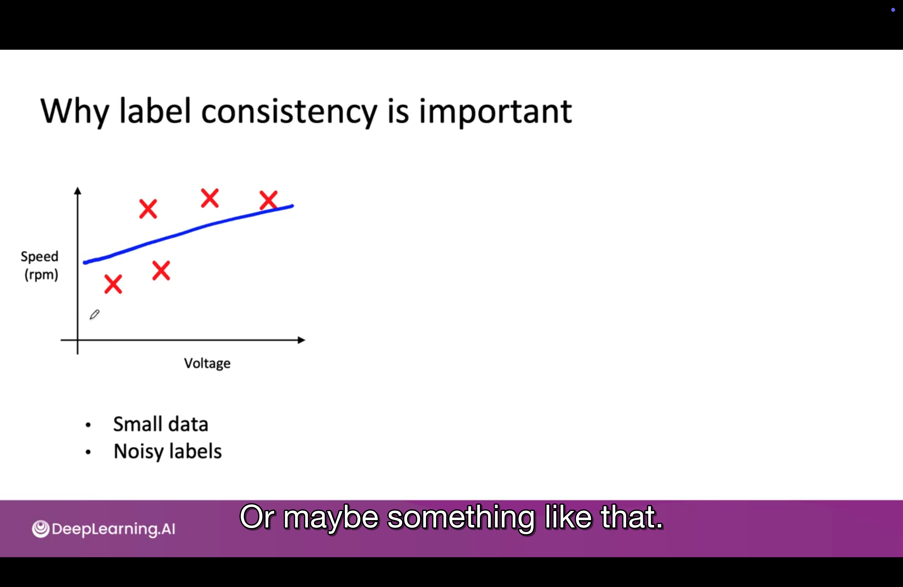

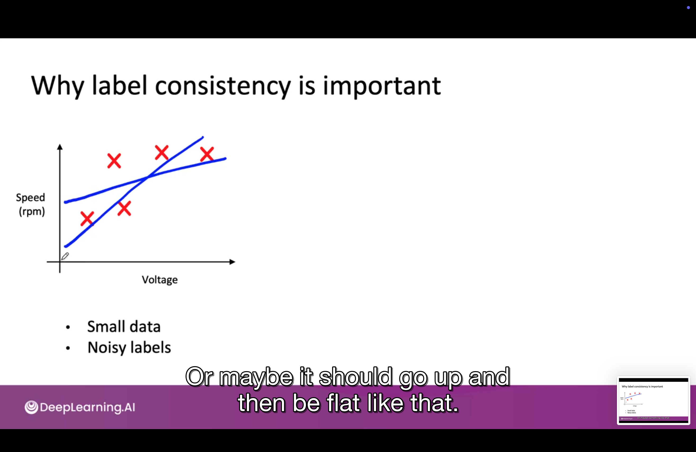

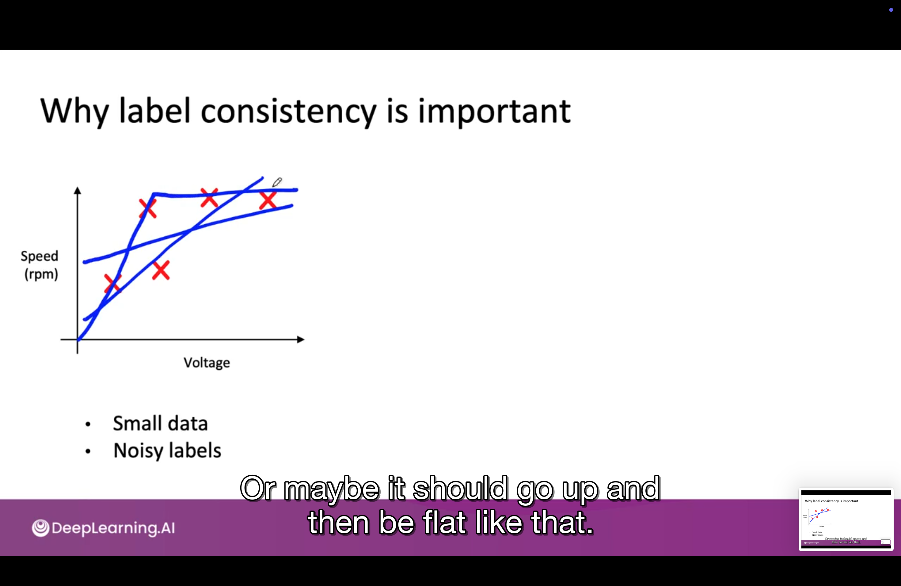

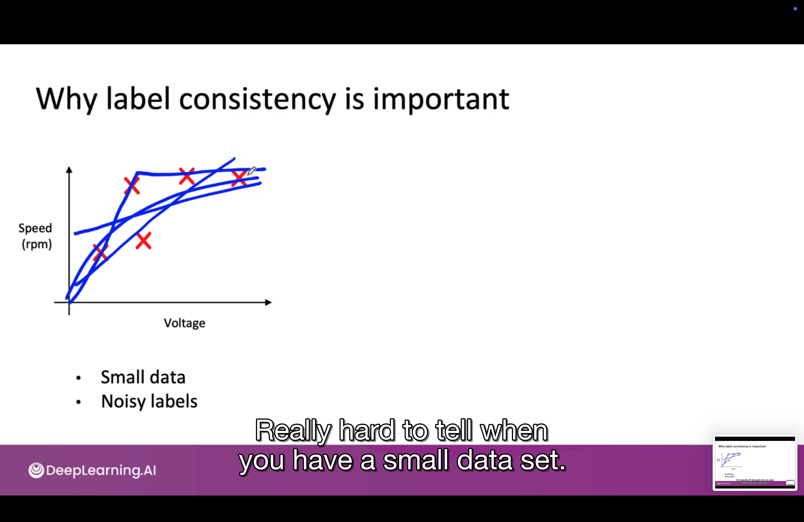

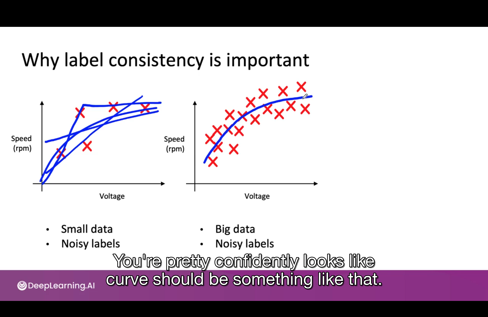

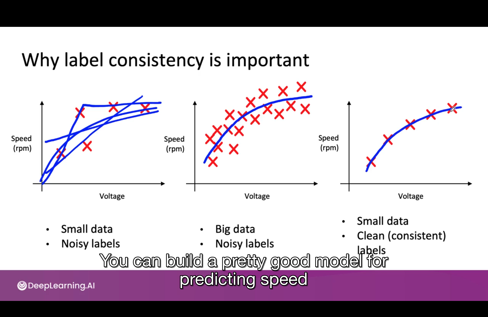

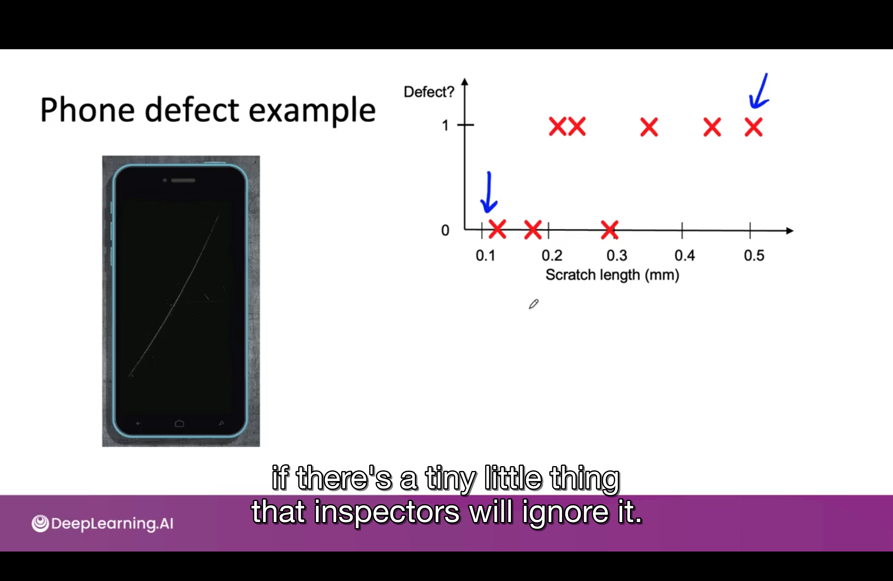

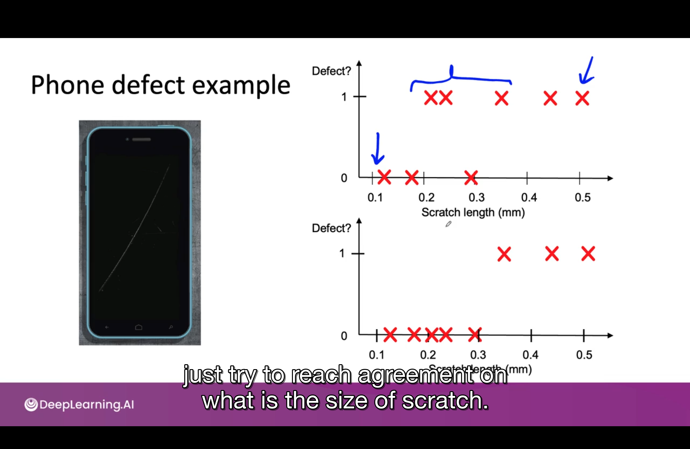

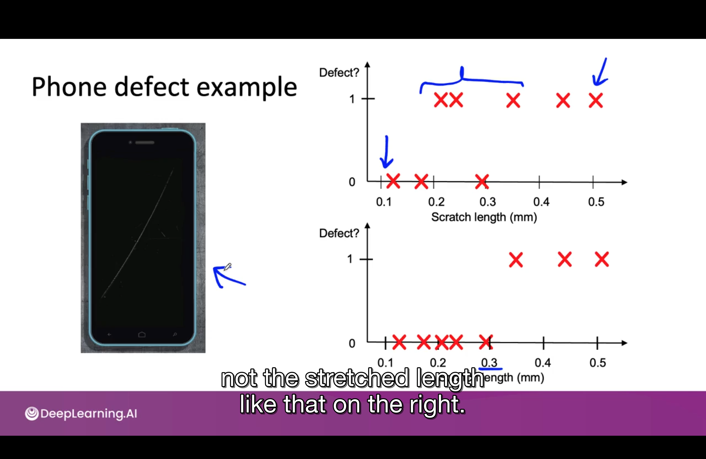

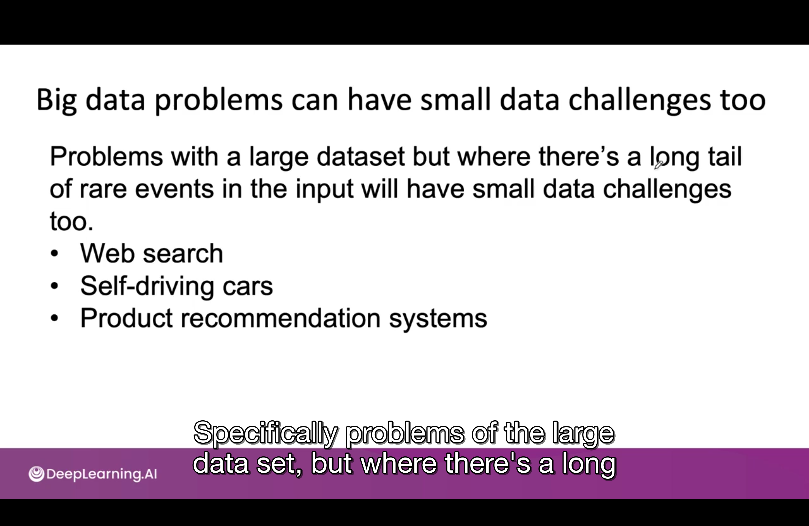

In problems of a small dataset. Having clean and consistent labels is especially important. Let's start with an example. One of the things I used to do is use machine learning to fly helicopters.

One things you might want to do is take us input the voltage apply to the motor or to the helicopter rotor and predict what's the speed of the rotor. You can have this type of problem, not just to find helicopters before other control problems with controlling the speed of the motor. So let's say you have a data set that looks like this where you have five examples. So a pretty small data set because this data set that is the output Y is pretty noisy, It is difficult to know what is the the function you should use to map voltage to the rotor speed in rpm.

Maybe it should be a straight line, something like that. Or maybe something like that. Or maybe it should go up and then be flat like that. Or maybe it should be a curve like that.

Really hard to tell when you have a small data set. five examples in noisy labels. It's difficult to fit a function confidently. Now, if you had a ton of data, this data set is equally noisy as the one on the left, but you just have a lot more data.

Then the learning algorithm can average over the noisy data sets and you can now fill a function. You're pretty confidently looks like curve should be something like that. A lot of AI had recently grown up in large consumer Internet companies which may have 100 million users or billion users and does very large data sets. And so, I think some of the practices for how to deal with small data sets have not been emphasized as much as would be needed to tackle problems where you don't have 100 million examples, but only 1000 or even fewer.

So to me, the interesting case is what if you still have a small data set? Five examples same as the example on the left. But you now have clean and consistent labels. In this case you can pretty confidently fit a function through your data and with only five examples.

You can build a pretty good model for predicting speed as a function of the input voltage of trained computer vision systems with just 30 images and had to work just fine. And the key is usually to make sure that the labels are clean and consistent. Let's take a look at another example of phone defect inspection, the tosses, the tickets, input pictures like these and to decide whether there is a defect or not on the phone. Now, if labeling instructions are initially unclear, then labors will label images inconsistently.

It may be that when there's a giant scratch, sufficiently large one that everyone will agree as a defect, and if there's a tiny little thing that inspectors will ignore it. But there's this region of ambiguity where different inspectors will label different scratches with a length between 0.2 and 0.4 in slightly inconsistent ways. So one solution to this would be to say, why don't we try to get a lot more pictures of phones and scratches. And then see what the inspectors do and then maybe eventually we can train a neural network.

They can figure out from the image what is and what isn't a scratch on average. Maybe that approach could work, but it'd be a lot of work and require collecting a lot of images. I found that it can be more fruitful to ask the inspectors to sit down and just try to reach agreement on what is the size of scratch. That would cause them to label a scratcher of a bounding box versus decide is too small and not worth bothering labeling.

So in this example, if the labelers can agree that the point of transition from where little ding becomes a defect. Is a length of 0.3, then the way they label the images becomes much more consistent. And it becomes much easier for learning algorithm to take as input images like this and consistently decide whether something is a scratch of the effect.. Just to be clear.

In this example, the input to the learning algorithm is images like that on the left, not the stretched length like that on the right. But the point is, if you can get inspectors to agree what is a scratch and what is in the scratch. And to define The task as putting bounding boxes around defects are over 0.3 mm in length. Then that will cause your images to be labeled more consistently and allow your learning algorithm to achieve higher accuracy.

Even when your data set isn't that big. So you see the couple examples now of how label consistency helps a learning algorithm. I want to wrap up this video with one more thought, which is that big data problems can have small data challenges too. Specifically problems of the large data set, but where there's a long tail of rare events in the input will have small data challenges too.

For example, the large web search engine companies all have very large data sets of web search queries, but many web queries actually very rare. And so the amount of click stream data for the rare queries is actually small or take self-driving cars. Self-driving car companies tend to have very large data sets, collected from driving hundreds of thousands or millions of hours or more. But there are rare occurrences that are critical to get right to make sure a self-driving car is safe.

Such as that very rare occurrence of a young child running across the highway, or that very rare occurrence of a truck parked across the highway. So even if a self driving car has a very large data set, the number of examples that may have of these rare events is actually very small. And so ensuring label consistency in terms of how these rare events are detective and labels is still very helpful for improving self-driving cars or product recommended systems. If you have a catalog of hundreds of thousands, or millions or more items or product recommendation systems.

If you have an online catalog of anywhere from thousands to hundreds of thousands to sometimes even millions of catalogs to sometimes even millions of items. Then you will have a lot of products where the number sold of that item is quite small. And so the amount of data you have of users interacting with the items in the long tail is actually small. And if there's a way which is not easy, but there's a way to make sure that data is clean and consistent, then that too will help you learning algorithm.

In terms of how it recommends or doesn't recommend items in the long tail where the amount of data per item will tend to be low. So when you have a small dataset label consistency is critical. Even when you have a big data set, label consistency can be very important. It's just that found it easier, on average to get to label consistency on smaller data sets than on very large ones.

In the next video, we'll look at some concrete ideas and best practices for improving your data, says label consistency. Let's go on to the next video.

29.   

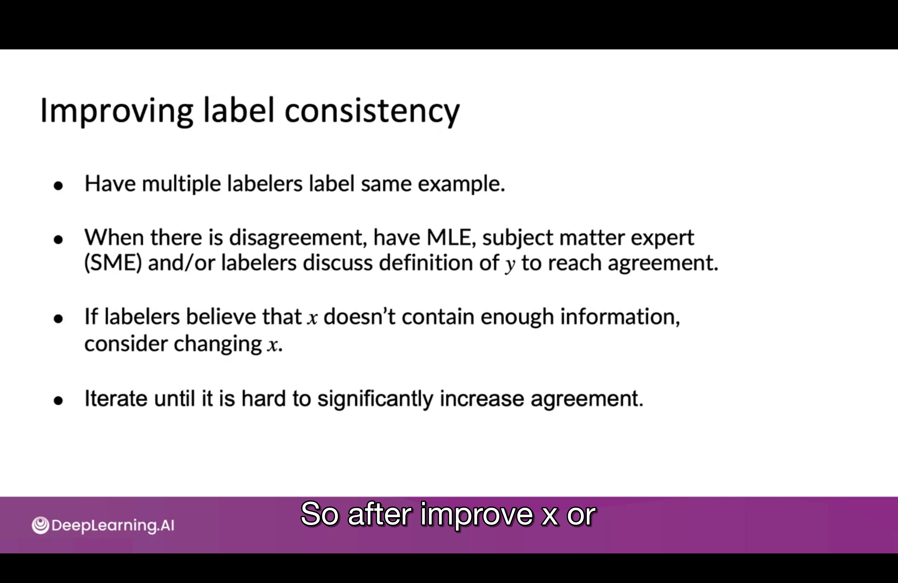

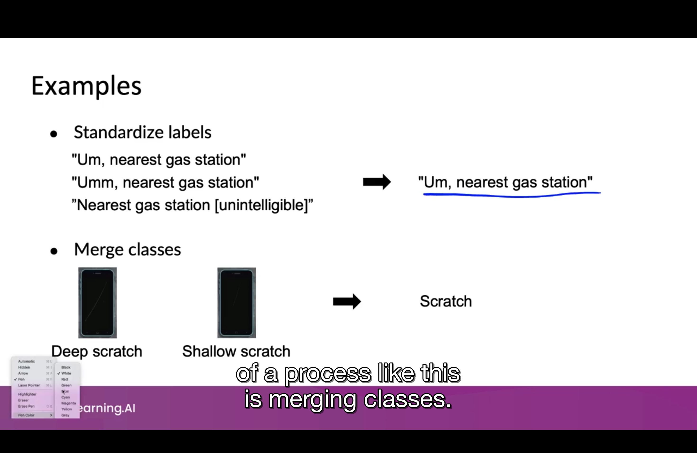

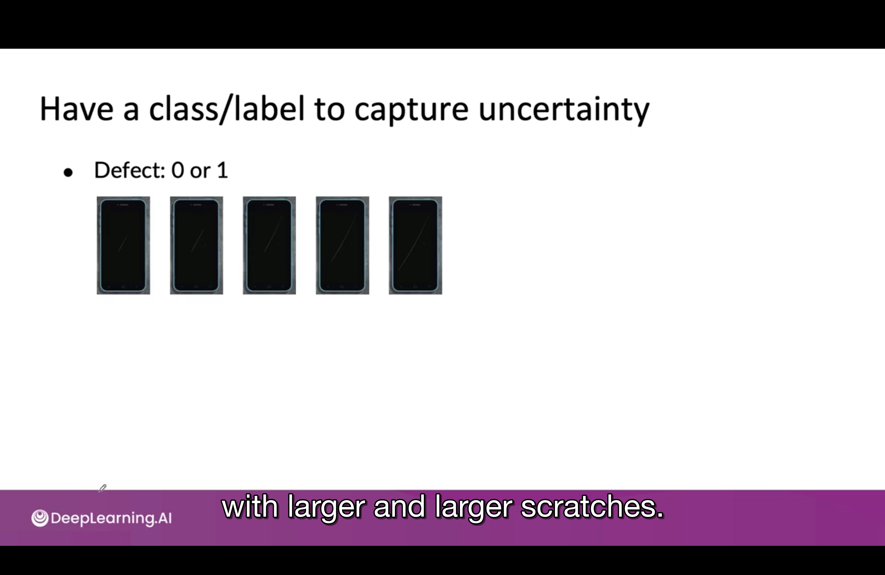

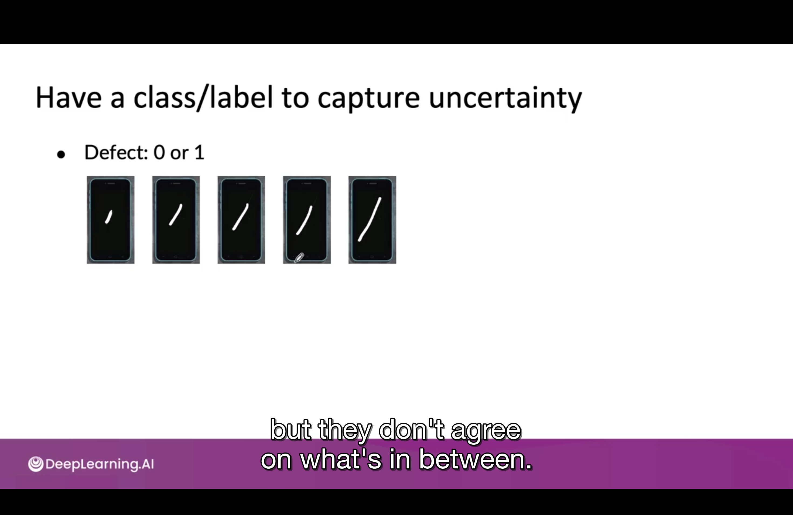

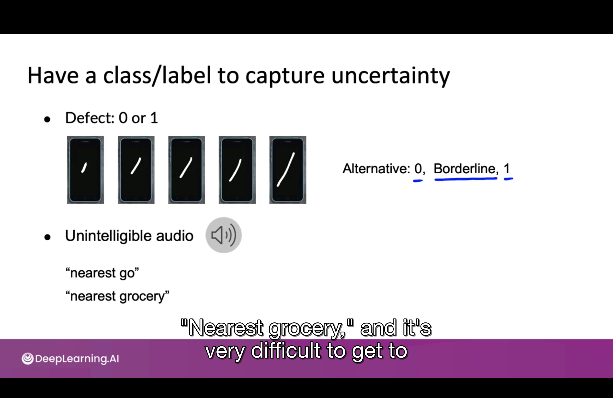

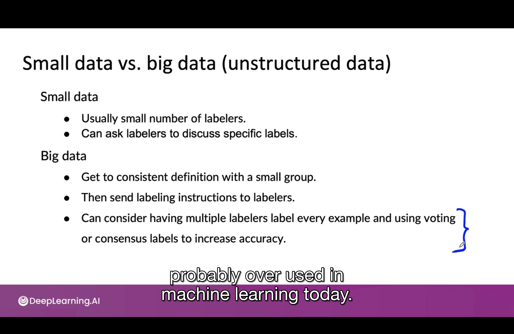

Let's take a look at some ways to improve the consistency of your labels. Here's a general process you can use. If you are worried about labels being inconsistent, find a few examples and have multiple labelers label the same example. In some cases you can also have the same labeler label an example, wait a while until they have hopefully forgotten or technical term is wash out, but have them take a break and then come back and re-label it and see if they're even consistent with themselves.

When you find that there's disagreements, have the people responsible for labeling, this could be the machine learning engineer, it could be the subject matter expert, such as the manufacturing expert that is responsible for labeling what is a stretch and what isn't a stretch, and/or the dedicated labelers, discuss together what they think should be a more consistent definition of a label y, and try to have them reach an agreement. Ideally, also document and write down that agreement, and this definition of y can then become an updated set of labeling instructions that they can go back to label new data or to relabel old data. During this discussion, in some cases the labelers will come back and say they don't think the input x has enough information. If that's the case, consider changing the input x.

For example, when we saw the pictures of phones, they were was so dark that we couldn't even tell what was going on, that was a sign that we should consider increasing the illumination, the lighting with which the pictures were taken. But of course, I know this isn't always possible, but sometimes this can be a big help. Then all this is an iterative process. So after improve x or after improving the label instructions, you will ask the team to label more data.

If you think there are still disagreements, then repeat the whole process of having multiple labelers label the same example, major disagreement and so on. Let's look at some examples. One common outcome of this type of exercise is to standardize the definition of labels. Between these ways of labeling the audio clip you heard on the earlier video, perhaps the labelers will standardize on this as the convention, or maybe they'll pick a different one and that could be okay too.

But at least this makes the data more consistent. Another common decision that I've seen come out of a process like this is merging classes. If in your labeling guidelines you asked labelers to label deep scratches on the surface of the phone, as well as shallow scratches on the surface of the phone, but if the definition between what constitutes a deep scratch versus a shallow scratch, barely visible here I know, is unclear, then you end up with labelers very inconsistently labeling things as deep versus shallow scratches. Sometimes the factory does really need to distinguish between deep versus shallow scratches.

Sometimes factories need to do this to figure out what was the cause of the defect. But sometimes I found that you don't really need to distinguish between these two classes, and you can instead merge the two classes into a single class, say, the scratch class, and this gets rid of all of the inconsistencies with different labelers labeling the same thing deep versus shallow. Merging classes isn't always applicable, but when it is, it simplifies the task for the learning algorithm. One of the technique I've used is to create a new class, or create a new label to capture uncertainty.

For example, let's say you asked labelers to label phones as defective or not based on the length of the scratch. Here's a sequence of smartphones with larger and larger scratches. Not sure if you can see these on your display, but let me just make them a little bit more visible here. I know that all of these are really large scratches if this is a real phone you're buying.

This is just for illustrative purposes. Maybe everyone agrees that the giant scratch is a defect, a tiny scratch is not a defect, but they don't agree on what's in between. If it was possible to get them to agree, then that would be one way to reduce label ambiguity. But if that turns out to be difficult, then here's another option; which is to create a new class where you now have three labels.

You can say, it's clearly not a defect, or clearly a defect, or just acknowledge there's some examples are ambiguous and put them in a new borderline class. If it becomes easier to come up with consistent instructions for this three class problem, because maybe some examples are genuinely borderline, then that could potentially improve labeling consistency. Let me use speech illustration to illustrate this further. Given this audio clip, [inaudible] I really can't tell what they said.

[inaudible] If you were to force everyone to transcribe it, some labelers would transcribe, "Nearly go." Some maybe they'll say, "Nearest grocery," and it's very difficult to get to consistency because the audio clip is genuinely ambiguous. To improve labeling consistency, it may be better to create a new tag, the unintelligible tag, and just ask everyone to label this as nearest [inaudible] unintelligible. This can result in more consistent labels than if we were to ask everyone to guess what they heard when it really is unintelligible. Let me wrap up with some suggestions for working with small versus big datasets to improve label consistency.

We've just been talking about unstructured data or problems where we can count on people to label the data. For small datasets there's usually a small number of labelers. So when you find an inconsistency, you can ask the labelers to sit down and discuss a specific image or a specific audio clip, and try to drive to an agreement. For big datasets, it would be more common to try to get to consistent definition with a small group, and then send the labeling instructions to a larger group of labelers.

One other technique that is commonly used, but I think overused in my opinion, is that you can have multiple labelers label every example and then let them vote. Voting is sometimes called consensus labeling, in order to increase accuracy. I find that this type of voting mechanism technique, it can work, but it's probably over used in machine learning today. Where what I've seen a lot of teams do is have inconsistent labeling instructions, and then try to have a lot of labelers and then voting, to try to make it more consistent.

But before resorting to this, which I do use, but more of a last resort, I would use the first, try to get to more consistent label definitions, to try to make the individual labelers choices less noisy in the first place, rather than take a lot of noisy data and then try to use voting to reduce the noise. I hope that the tools you just learnt for improving label consistency will help you to get better data for your machine learning task. One of the gaps I see in the machine learning world today is that there's still a lack of tools, and there are also machine learning ops tools for helping teams to carry out this type of process more consistently and repeatedly. It's not us trying to figure this out in the Jupyter Notebook, but instead to have tools help us to detect when labels are inconsistent and to help facilitate the process in improving the quality of the data.

This is something I look forward to hopefully our community working on and developing. In terms of improving label quality, one of the questions that often comes up is: What is human level performance on the task? I find human level performance to be important and sometimes misused concept. Let's take a deeper look at this in the next video.

30. 

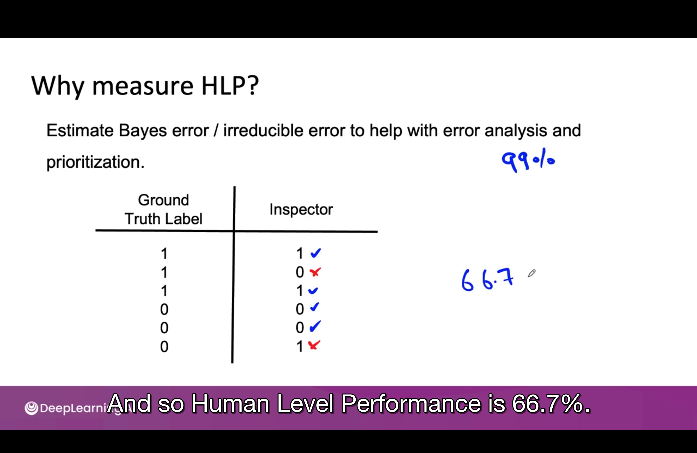    

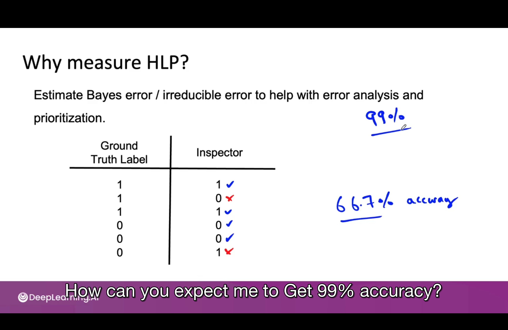

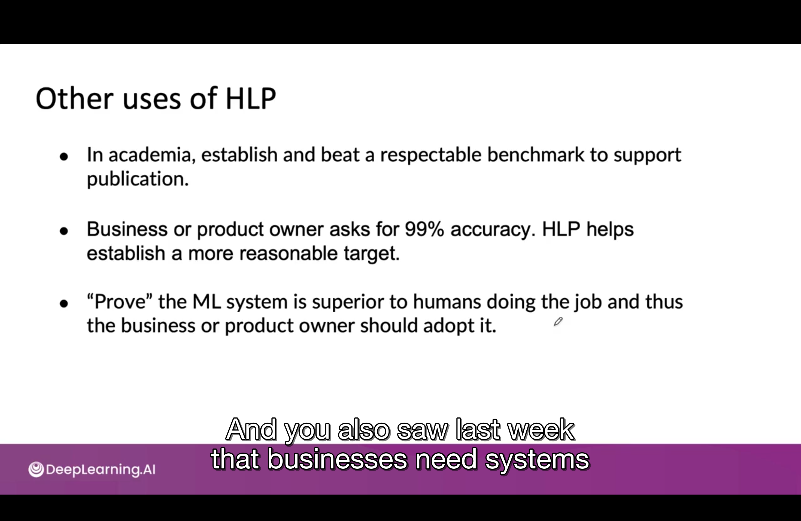

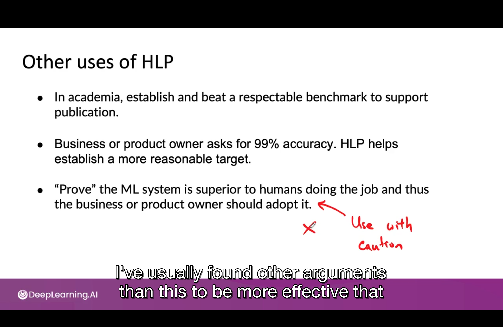

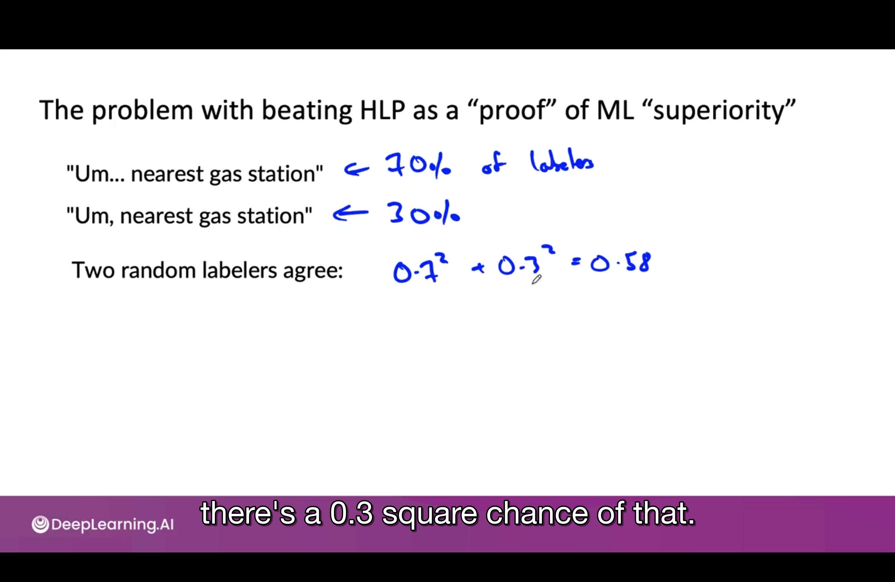

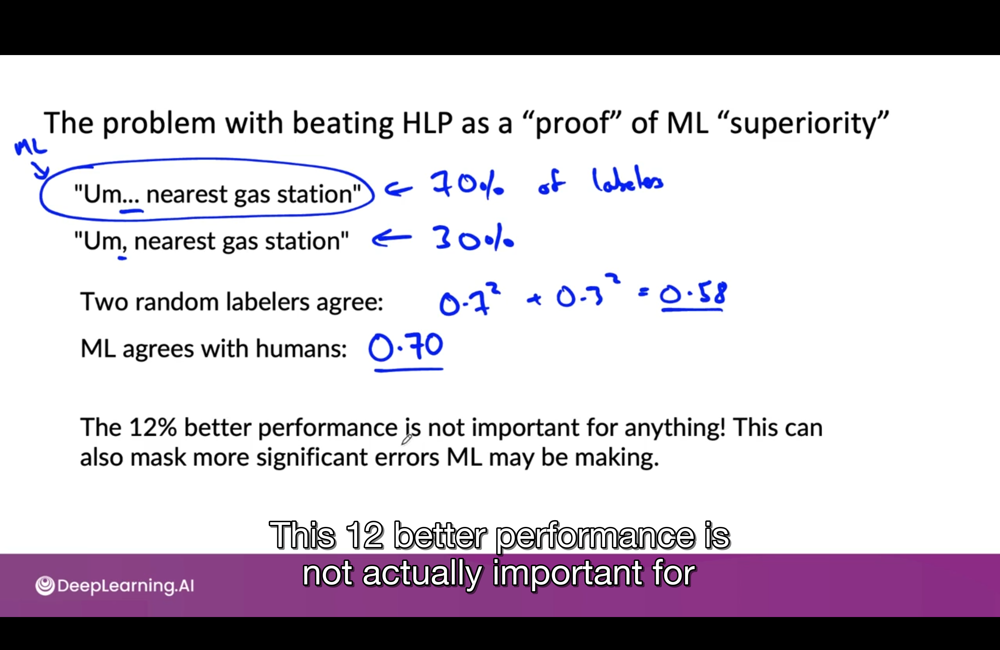

Some machine learning tasks are trying to predict an inherently ambiguous output and Human Level Performance can establish a useful baseline of performance as a reference. But Human Level Performance is also sometimes misuse. Let's take a look. One of the most important users of measuring Human Level Performance or HLP is to estimate bayes error or irreducible error.

Especially on unstructured data tasks in order to help with their analysis and prioritization and just establish what might be possible. Take a visual inspection tasks. This may have happened to you before, but I have gotten requests from business owners saying, hey Andrew, can you please build a system that's 99% accurate or maybe 99.9% accurate. So one way to establish what might be possible would be to take a data set and look at the Ground Truth Data.

Say you have six examples where the Ground Truth Label is these, and then to answer human inspector to label the same data blinded to the Ground Truth Label of course and see what they come up with. And if they come up with these you would say this inspector agreed to the ground truth on four other six examples and disagreed on two out of six. And so Human Level Performance is 66.7%. And so this would let you go back to the business owner and say look, even your inspector is only 66.7% accuracy.

How can you expect me to Get 99% accuracy? So HLP is useful for establishing a baseline in terms of what might be possible. There's one question that is often not asked, which is what exactly is this Ground Truth Label? Because rather than just measuring how well we can do compared to some Ground Truth Label, which was probably written by some other human.

Are we really measuring what is possible or are we just measuring how well two different people happen to agree with each other? When the Ground Truth Label is itself determined by a person. There's a very different approach to thinking about Human Level Performance which I want to share of you in this and the next video. Beyond this purpose of estimating Bayes error and establishing what's possible using that to help with their analysis and prioritization.

Here are some other users of Human Level Performance. In academia, HLP is often used as a respectable benchmark. And so when you establish that people are only 92% accurate or some of the number on a speech recognition data set. And if you can beat human level performance, then that establishes then that helps you to quote proof that you're learning algorithm is doing something hard and helps get the paper published.

I'm not saying this is a great use of HLP, but in academia showing you can beat HLP maybe for the first time has been a tried and true formula for establishing the academic significance of a piece of work and helps with getting something published. We discussed briefly on the last slide what to do if a business of product owner asked for 99% accuracy and if you think that's unrealistic, then measuring HLP may help you to establish a more reasonable target. That's one of the use of HLP that you might hear about. Do not be cautious about which is, I've seen many projects with the machine learning team, wants to use HLP or beating HLP.

To prove that the Machine Learning System is superior to the human is doing the job. And as tempting as it is to go to someone and says look, I've proved that my machinery system is more accurate than humans inspecting the phones or the radiologist reading X-rays or something. And now that I've mathematically proved the superiority of my learning algorithm, you have to use it right? I know the logic of that is tempting, but as a practical matter, this approach rarely works.

And you also saw last week that businesses need systems that do more than just doing well on average test set accuracy. So if you ever find yourself in this situation, I would urge you to just use this type of logic with caution or maybe even more preferably just don't use these arguments. I've usually found other arguments than this to be more effective that working with the business to see if they should adopt a Machine Learning System. The problem with beating Human Level Performance as proof of machine learning superiority is multi fold.

Beyond the fact that most applications require more than just high average tested accuracy, one of the problems with this metric is that it sometimes gives a learning algorithm an unfair advantage when labeling instructions are inconsistent. Let me show you what I mean. If you have inconsistent labeling instructions so that when an audio clip says nearest gas station, let's say 70% of labelers, uses label convention and 30 percent of labelers uses label convention. Neither one is the superiors transcript to the other both seemed completely fine.

But just by luck of the draw, 70% of labelers choose the first one, 30% choose the second one. So if the ground truth is established by a labelers, maybe just a laborer with a slightly bigger title, but really by one labelers. Then the chance that two random labeler will agree will be 0.7 squared plus 0.3 squares, which is 0.58. So if you had two labelers use the first convention, there's a 0.7 square chance of that.

Or if both of your random labelers use the second convention, there's a 0.3 square chance of that. Then the two of them will agree. So the chances to labelers agreeing 0.58. And in the usual way of measuring Human Level Performance, you will conclude that Human Level Performance is 0.58.

But what you're really measuring is the chance of two random labelers agreeing. This is where the machine learning our room has an unfair advantage. I think either of these labeling conventions is completely fine. But the learning algorithm is a little bit better at gathering statistics of how often ellipses versus commas are used in such a context than the learning algorithm may be able to always use the first labeling convention.

Because it knows that statistically, it has a 70% chance of getting it right if it uses ellipses or dot dot dot. So a learning algorithm will agree with humans 70% of the time, just by choosing the first lebeling convention. But this 12% improvement in performance, whereas Human Level Performance is 58% and your learning algorithm is 12% better is 0.70. This 12 better performance is not actually important for anything between these two equally good, slightly arbitrary choices.

The learning algorithm just consistently picks the first one so it gains what seems like a 12% advantage on this type of query, but it's not actually outperforming any human in any way that a user would care about. And one side effect of this is that, if you're speech recognition tool has multiple types of audio. For some, there's this dot dot dot or ellipses versus common ambiguity and learning algorithm does 12% better on this. If you're learning algorithm makes some more significant errors on other types of input audio, then when its performance where it actually does worse could be averaged out by queries like these where kind of fake looks like it's doing better.

And this will therefore mask or hide the fact that you're learning algorithm is actually creating worse transcripts than humans actually are. And what this means is that a machine learning system can look like it's doing better than HLP. But actually be producing worse transcripts than people because it's just doing better on this type of problem which is not important to do better on while potentially actually doing worse on some other types of input audio. Given these problems with Human Level Performance, what are we supposed to do?

Measuring Human Level Performance is useful for establishing a baseline using that to drive error analysis and prioritization. But using it to benchmark machines and humans sometimes runs into problematic cases like this. I found that when my goal is to build a useful application, not publish a paper, you publish a paper, let's prove we can outperform people that helps published paper.

But found that when my goal is to build a useful application rather than trying to beat Human Level Performance, I found it's often useful to instead try to raise Human Level Performance because we raise Human Level Performance by improving label consistency and that ultimately results in better learning outcomes performance as well. Let's take a deeper look at this in the next video.

31. 

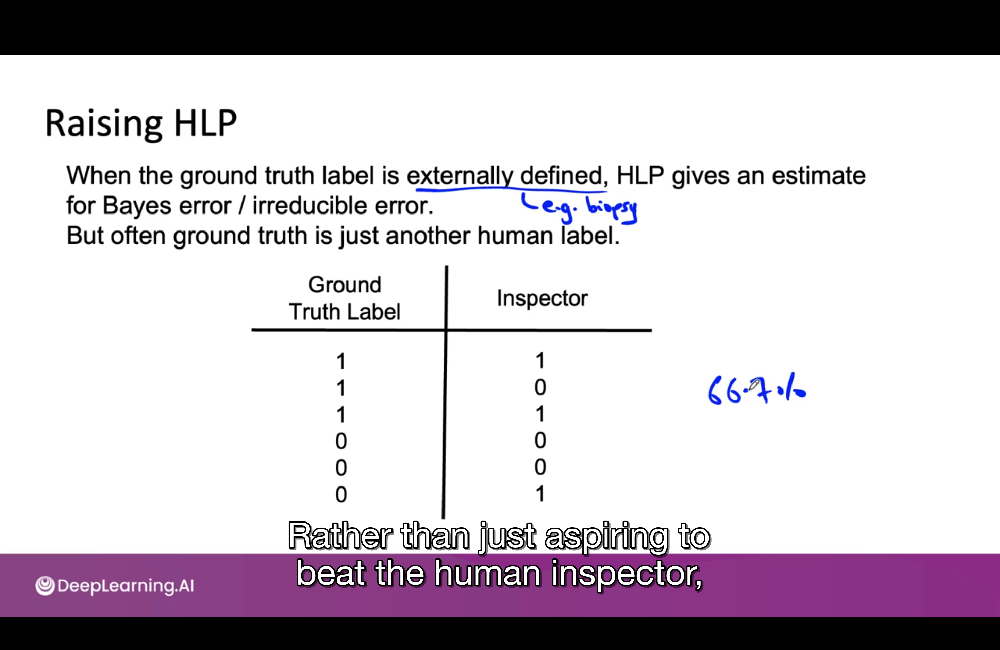

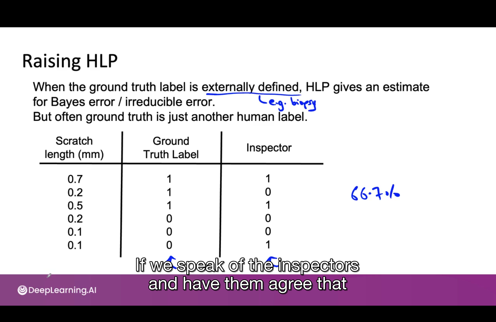

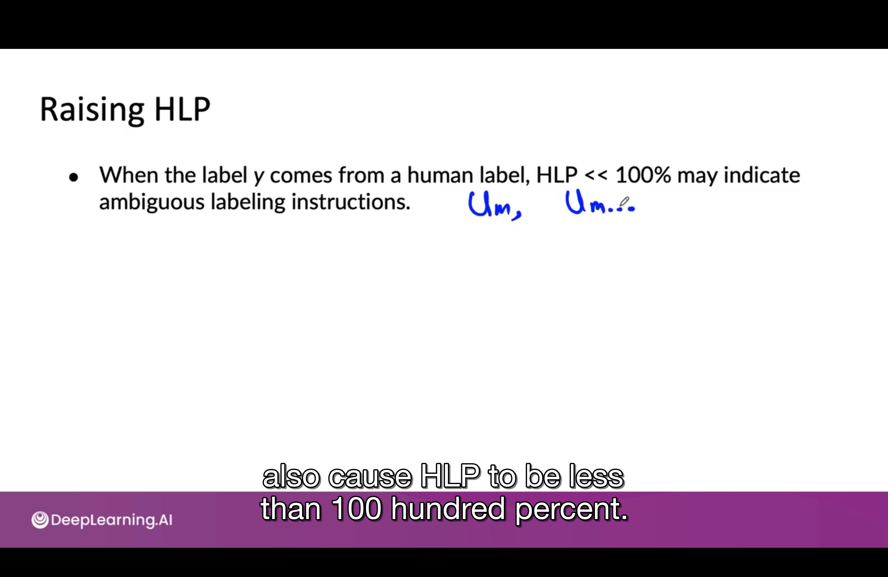

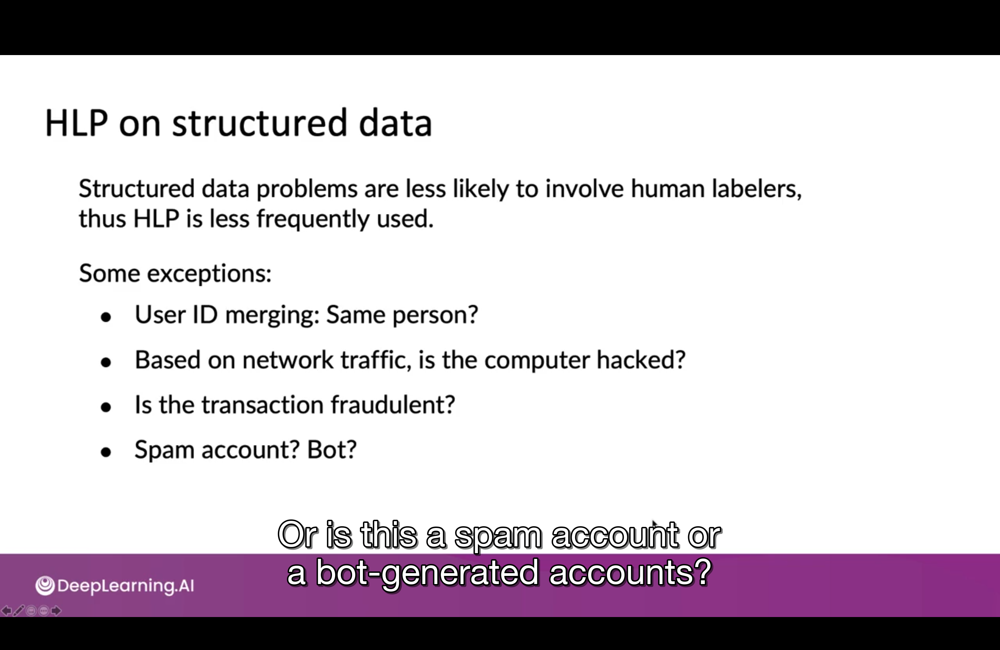

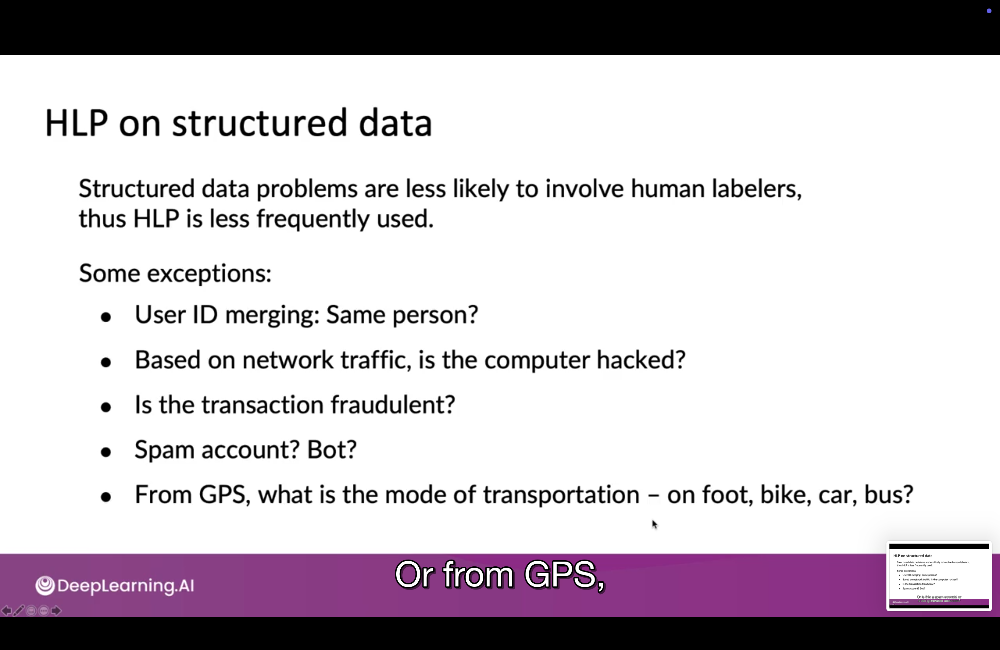

I think the use of HLP in machine learning has taken off partly because it helped people get papers published to show they can beat HLP. There's also been a bit misused in settings where the goal was to build a valuable application, not just to publish a paper. When the ground truth is externally defined, then there are fewer problems with HLP when the drought really is some real drought-proof.

For example, I've done a lot of work on medical imaging, working on your AI for diagnosing from X-rays or things like these. Given an X-ray image, if you want to predict a diagnosis, if the diagnosis is defined according to, say, a biopsy, so your biological or medical tests, then HLP helps you measure how well does a doctor versus a learning algorithm predict the outcome of a biopsy or a biological medical tests. I find that to be really useful. But when the ground truth is defined by a human, maybe even a doctor labeled an X-ray image, then HLP is just measuring how well can one doctor predict another doctor's label versus how well can one learning algorithm predict another doctor's label.

That too is useful, but it's different than if you're measuring how well you versus a doctor are predicting some ground truth outcome from a medical biopsy. To summarize, when the ground truth label is externally defined, such as the medical biopsy, then HLP gives an estimate for base error and irreducible error in terms of predicting the outcome of that medical test, the biopsy. But there are also a lot of problems with the ground truth is just another human label. The visual inspection example we had from the previous video showed this, where the inspector had 66.7 percent accuracy.

Rather than just aspiring to beat the human inspector, it may be more useful to see why the ground truth, which is just some other inspector compared to this inspector don't agree. For example, if we look at the length of the different scratches that they labeled, say, on these six examples, these were the length of the scratches. If we speak of the inspectors and have them agree that 0.3 mm is the threshold above which a stretch becomes a defect, then what we realize is that for the first example, both label that one totally appropriately. For the second example, the ground truth here is one but is less than 0.3, so we really should change this to zero, then 0.5 guess 1 1, 0.2 000.1.

This example has a stretch of 0.1, but really this should have been a zero. If we go through this exercise of getting the ground truth label and this inspector to agree, then we actually just raise human-level performance from 66.7 percent to 100 percent, at least as measured on these six examples. But notice what we've done, by raising HLP to 100 percent we've made it pretty much impossible for learning algorithm to beat HLP, so that seems terrible. You can't tell the business owner anymore, you beat HLP, and thus they must use your system.

But the benefit of this is you now have much cleaner, more consistent data, and that ultimately will allow your learning algorithm to do better. When you go is to come up with a learning algorithm that actually generates accurate predictions rather than just proof for some reason that you can beat HLP. I find this approach of working to raise HLP to be more useful. To summarize, when the ground truth label y comes from a human, HLP being quite a bit less than 100 percent may just indicate that the labeling instructions or labeling convention is ambiguous.

On the last slide, you saw an example of this in visual inspection. You also see this in speech recognition where the camera versus ellipses..., that type of ambiguous labeling convention will also cause HLP to be less than 100 hundred percent. Improving label consistency will raise human-level performance. This makes it harder, unfortunately for your learning algorithm to beat HLP by the more consistent labels who raise your machine learning album performance, which is ultimately likely to benefit the actual application.

Far we've been discussing HLP on unstructured data, but some of these issues apply to structure data as well. You already know that structured data problems are less likely to involve human labors and thus HLP is less frequently use. But there are exceptions. You saw previously the user ID emerging example, where you might have a human label, where the two records belong to the same person.

I've worked on projects where we will look at network traffic into a computer to try to figure out if the computer was hacked, and we as human IT experts to provide labels for us. Sometimes it's hard to know if a transaction is fraudulent and you just ask a human to label that. Or is this a spam account or a bot-generated accounts? Or from GPS, what is the mode of transportation is this person on foot, or on a bike, or in the car, or the bus.

It turns out buses stop at bus stops, and so you can actually tell if someone is in a bus or in a car based on the GPS trace. For problems like these, it would be quite reasonable to ask a human to label the data, at least on the first pass for a learning algorithm to make such predictions as these. When the ground truth label you're trying to predict comes from one human, the same questions of what does HLP mean?

It is a useful baseline to figure out what is possible. But sometimes when measuring HLP, you realize that low HLP stems from inconsistent labels, and working to improve HLP by coming up with a more consistent labeling standard will both raise HLP and give you cleaner data with which to improve your learning experience performance. Here's what I hope you take away from this video. First, HLP is important for problems where human-level performance can provide a useful reference.

I do measure it and use it as a reference for what might be possible and to drive error analysis and prioritization. Having said that, when you're measuring HLP, if you find the HLP is much less than 100 percent, also ask yourself if some of the gap between HLP and complete consistency is due to inconsistent labeling instructions. Because if that turns out to be the case, then improving labeling consistency will raise HLP and also give cleaner data for your learning algorithm, which will ultimately result in better machine-learning algorithm performance. Guess what I hope you take away from this video.

HLP is useful and important for many applications. For problems where I think how well humans perform is a useful reference, I do measure HLP and I use that to get a sense of what might be possible, and also use HLP to drive error analysis and preservation. Having said that, if, in the process of measuring HLP, you find that HLP is much less than perfect performance, much lower than 100 percent. This is also worth asking yourself, if that gap between HLP and 100 percent accuracy may be due to inconsistent labeling instructions.

Because if that's the case, then improving labeling consistency will both raise HLP, but more importantly help you get cleaner and more consistent labels which will improve your learning algorithm's performance.

32. 

