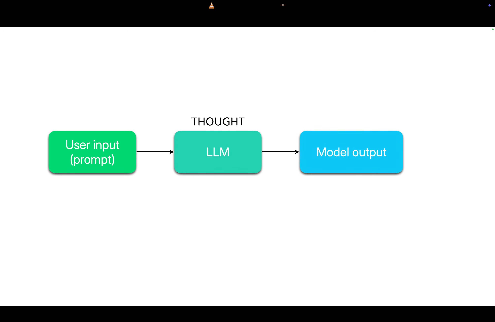
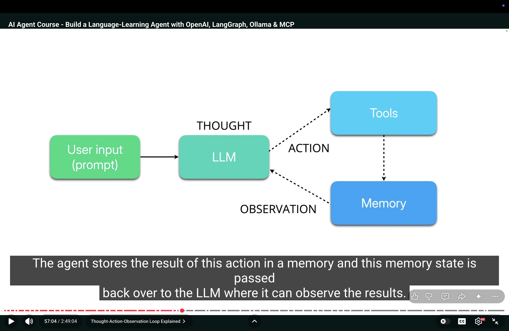
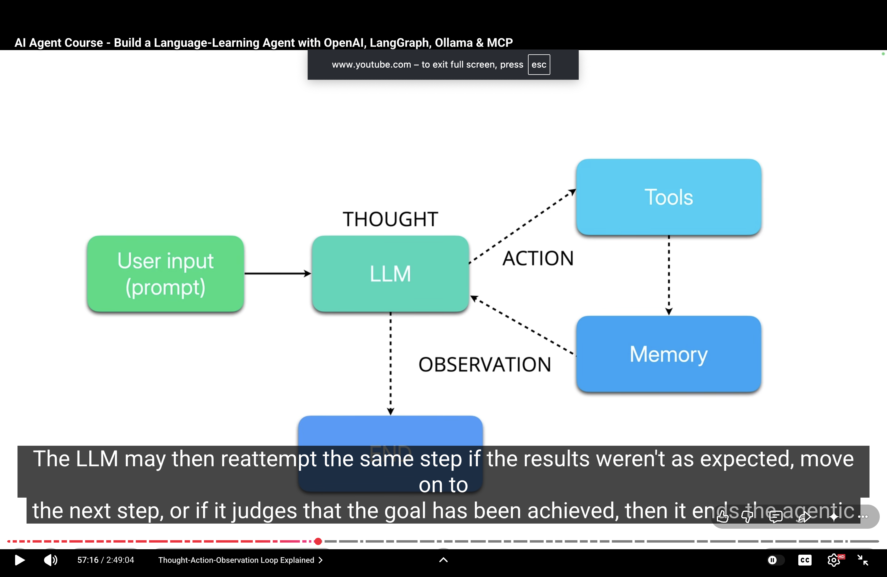
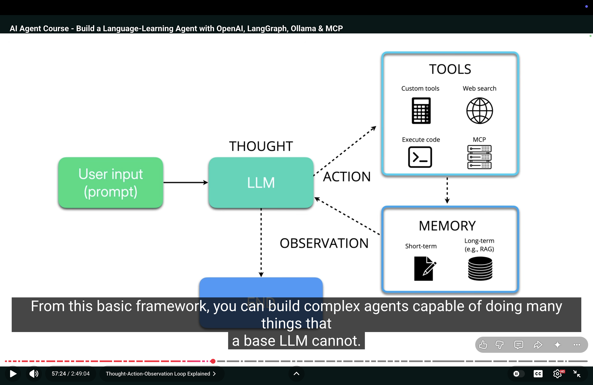
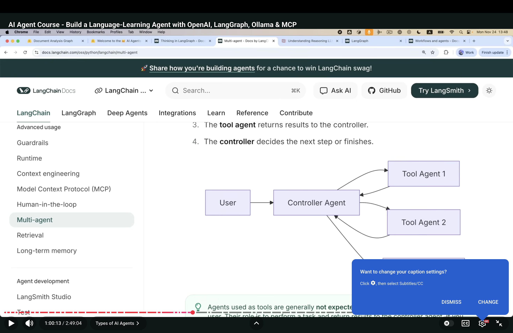
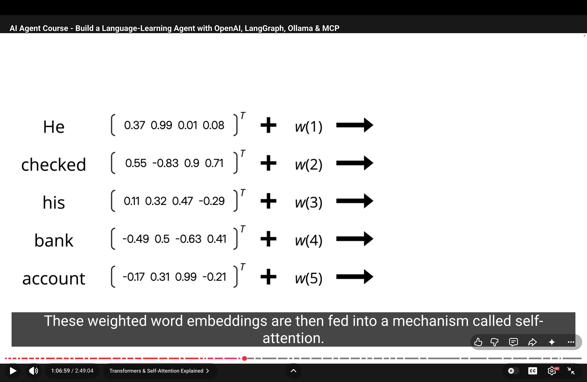
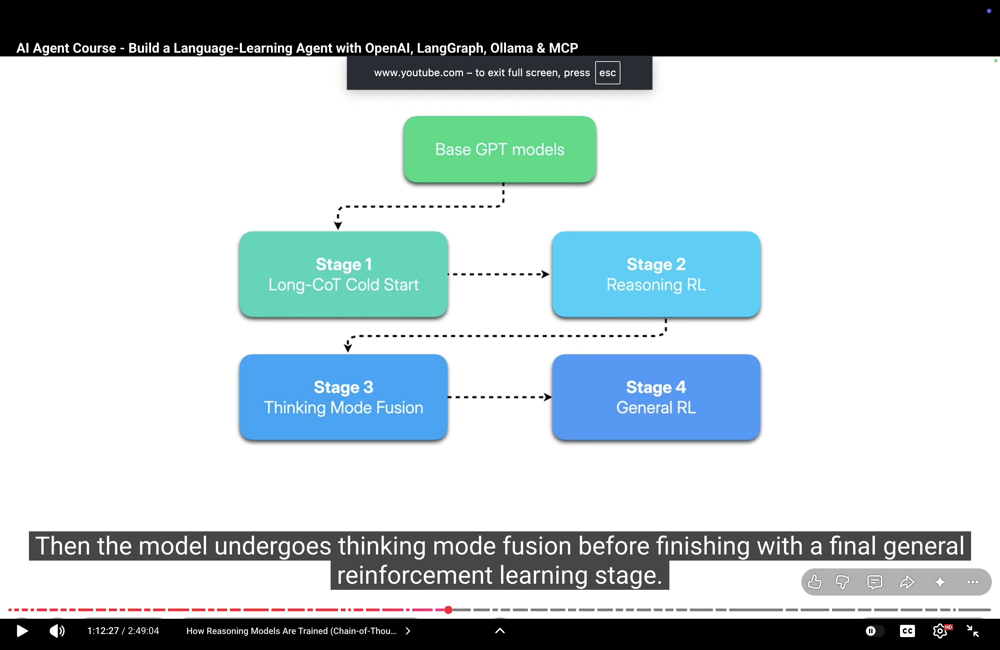
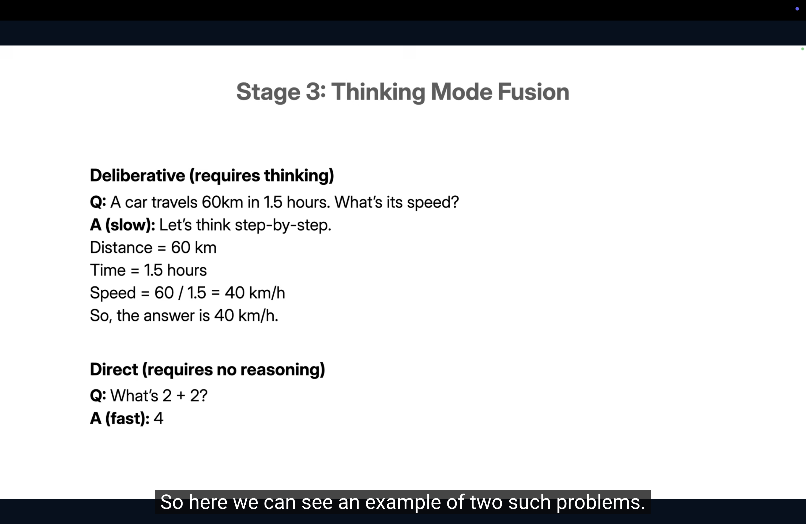
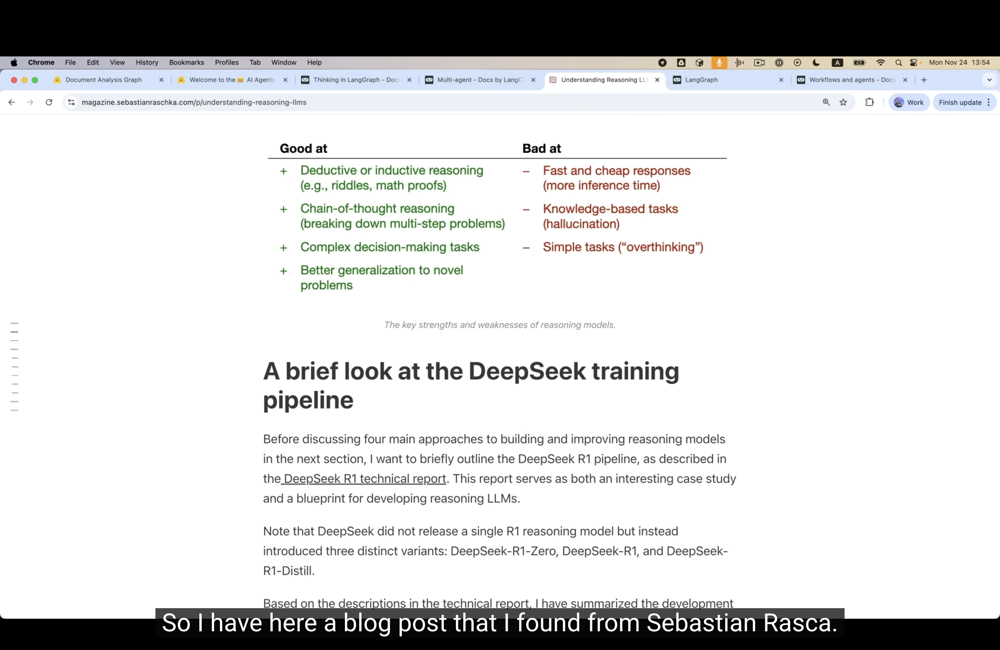

1. First create a virtual environment with python 3.13 using `uv python install 3.13` and `uv init`.

2. Use the `https://github.com/eymenefealtun/all-words-in-all-languages` repo for data.  You can use the kaggle datasets or UC Irvine datasets(https://archive.ics.uci.edu/datasets) also. 

3. Create a folder `intelligent-learning-agent` and in that run `mkdir raw-word-lists` to create the folder.

Run the following code to copy the data.

```
cd "40.AI-Agent-Course-Build-a-Language‑Learning-Agent-with-OpenAI-LangGraph-Ollama-MCP/language-learning-agent"
mkdir -p raw-word-lists
cp -r ../all-words-in-all-languages/{Catalan,Croatian,Danish,Dutch,English,Finnish,French,German,Greek,Italian,Polish,Portuguese,Romanian,Russian,Slovenian,Spanish,Swedish,Ukranian} raw-word-lists/
```

4. Install packages using `uv add pandas ipywidgets spacy spacy-transformers wordfreq python-dotenv typing-extensions langchain langchain_core langgraph langchain-openai langchain-ollama langchain-mcp-adapters matplotlib` in terminal under the `language-learning-agent` folder.

5.  

First, run the code from clean-word-lists.ipynb to clean the data. Spacy is a family of libraries to process text data in natural languages like english. Here we use lemmatization. Spacy supports some languages which can be checked here `https://spacy.io/models` that's why we use some languages in above `cp` command.

Select the accurate model instead of efficient from here `https://spacy.io/models` because here accuracy matters.

We use zipf's law to find rare words and use wordfreq library to find rare words.

6. ReAct agent basics:
   
   
Here, we use English, Spanish and German laguages for ReAct agent. Here we start to build language learning agent. Here, we build the langgraph react agent. Here we build the basic agent which take the prompt and return the list of random words. 

7. What actually is an AI agent ?

An agent is essentially an LLM that has the ability to carry out multi-step processes and use tools to extend the capability of LLMs Basically LLM is only capable of input-output flow. We input a prompt and get a single output. 

 

Agents extend this using what is called thought-action-observation cycle which allows LLMs to take more complex problems and solve them step by steps.

Agentic workflow start in a similar way to regular LLM use, in that users input a prompt. In the case of agents, this is usually a moderately complex problem or task. LLMs take the input and starts decomposing the problem into a series of smaller steps. The agent then works through each of these steps using the thought-action-observation workflow. For each step, LLM will think about what it could do to solve a problem, potentially using a variety of tools to achieve this. 

Then it carries out an action. The agents store the results of this action in a memory and this memory state is passed back over to the LLM where it can observe the results. 



The LLM may then reattempt the same step if the results were not as expected means move on to the next step or if it judges that the goal has been achieved then it ends the agentic workflow.



From this basic framework, you can build complex agents capable of doing many things that a base LLM can't.



For example, you can give the LLM access to a wide variety of tools, which greatly expands what your agent can achieve. You can also create your own custom tools (for example, tools for performing calculations and we will build tools like this later on), you can give agent access to the web search, enabling them to retrieve up-to-date information. Also, they can interact with code execution environments in a controlled way. And agents can integrate with MCP servers via model context protocol (a standardize interface that lets them interact with many external tools and services in a consistent way). 

Here, we are going to build a ReAct agent. React is short for Reasoning and acting and this type of LLM allows the LLM to decide which tool to use and in which order to carry out a goal. They tend to be suitable when an agent needs flexibility. 

There are multiple different types of user requests coming in and agent can establish its own workflows using the available tools. Because getting an LLM to do problem decomposition and create an appropriate workflow is a complex task, React agents tend to work better for smaller and more focused use cases. 

It is also possible to build much more structured agents. 

Finally when you need an agent to do something really complex, you can consider building a multi-agent application. This allows you to build multiple smaller agents focused on more speciific tasks and orchestrate them using a controlling agent. 



Multiagent applications can also help increase the security of your agentic applications.

So, Agent is a term used for a very broad family of applications that uses one or more LLMs to breakdown problems and use a huge variety of potential tools to carry out user tasks. 

8. An LLM is basically a neural network that learned a lot about how language functions. For context based embeddings then advanced models come in which are based on transformers.



We make the weighted word embeddings by adding embeddings to positional weights like this is the first word(w(1)) and so on and then fed into self-attention mechanism. Self-attention basically uses the information from the weighted word embeddings to understand how much attention it needs to pay to other words in the sentence in order to get the meaning of that word.

The process of generating self-attention vectors and then normalizing them is called an encoder block. 

9. GPT models are decoder based models. The most suitable LLMs for agents are reasoning models. So, how do we transform our base GPT models into one of these ?

There are multiple different ways of doing this but the explanation I will give here is how the Qwen3 reasoning models were trained. The base LLM goes through 4 post-training steps. 

The first is called `Long chain-of-thought(CoT) Cold Start` training. The next stage is `Reasoning Reinfocement Learning(RL)`. Then the model undergoes `Thinking Mode Fusion` before finishing with a final `General Reinforcement Learning(RL)` stage.  



10. 

Stage 1: Long chain-of-thought(CoT) Cold Start training:

When a GPT model is first trained, all it can do is generate natural text. It doesn't have any framework for problem decomposition that is taking a problem that requires multiple steps and breaking it down. So, this stage is about bootstrapping reasoning from scratch.  

To do this, researchers create datasets where chain of thought reasoning is used to solve problems.

Example:

So, let's say we have a prompt:

Prompt:

Alice, Bob and Carol are sitting in a row.
Alice is not next to Carol.
Bob is not either end.
Who sits in the middle ?

Long-CoT:

There are 3 seats: Left, Middle, Right.
Bob is not either end --> Bob must be in the middle.
Now, check the constraint: "Alice is not next to Carol".
If Bob is in the middle, Alice and Carol must occupy the ends.
That satisfy the constraint automatically.
Therefore, Bob sits in the middle.

-- You can see how this is teaching the model to reason through each step of the problem to be more likely to reach a correct answer. Each example in the dataset is like this. All problems include a question and a detailed reasoning trace before the final answer.

The base GPT model is now further trained on this specific dataset, teaching it to output answers more like this. 

This supervised fine-tuning stage is what gives the model its first thinking habit. It is still predicting the next token in these reasoning sequences but now it begins to internalize the structure of logical thought. 

However, there is no guarantee that the conclusion it comes to are correct at this stage ot it will not get caught in a type of circular reasoning. So, the next stage is to teach it how to reason well. This is stage 2.

11.  

Stage 2: Reasoning Reinfocement Learning(RL):

So, our fine-tuned model is: given a fresh set of problems and it generates multiple reasoning paths for each one. Some correct, some wrong like "who sits in the middle?" question, it can answer Alice. And these answers are used to train a separate reward model, which is able to predict things like the correctness, the logical consistency and the clarity of an answer. 

So, once the reward model is trained, it can calculate an advantage signal for each new answer from the fine-tuned LLM. The advantage signal is how much better or worse than the expected answer, the predicted answer was. It then updates the weights of the LLM, pushing it closer to more correct and high quality answers and further away from incorrect, confusing or overly long answers. 

Now, we have a model which is very strong in reasoning but not every problem requires deep, slow thinking. 

So, in order to make the model more flexible, stage 3 i.e. Thinking mode fusion teaches it to distinguish problems that require deliberation (requires thinking) and those that can be solved directly (requires no reasoning).

12.   

Stage 3: Thinking Mode Fusion:

Example:



The first requires the chain of thought reasoning that the model has been taught so far. The second problem can be solved directly, meaning that applying deeper reasoning to solve it would be both a waste of time and compute. Keep in mind tha chain of thought reasoning uses many many more tokens than a direct problem solving. 

There are a few different ways of doing thinking mode fusion, one is further fine-tuning the model. The dataset with a mixture of deep and direct problems is created and the model is trained to distinguish between when fast and slow reasoning is required. 

13.  
 
Stage 4: General Reinforcement Learning(RL):

And now the final step, general reinforcement learning. So, what we now have is a model that is highly specialized in reasoning but that's really all it can do. If you want to use it in a normal chat, it's likely to be unpolished, maybe even confusing and it's unable to do other important NLP tasks like summarizing documents and therefore final step uses reinforcement learning again to now teach the model to only apply reasoning when needed.  

The model (qwen3) developers developed yet another dataset. This one containing a mixture of reasoning problems and other tasks such as instruction following, factual question and answering and creative writing. 

As with the previous reinforcement learning step in stage 2, the LLM is given the same prompt from this dataset multiple times. This time, answers are scored based on their quality, a mixture of things like helpfulness, relevance, honesty, conciseness and reasoning quality. These ratings are done even by human raters or a more powerful LLM in a process called LLM-as-a-judge. And as with the last reinforcement learning step, these answer score pairs are used to train a second reward model, which can predict the overall quality of answers given by the model, not just its reasoning abilities. These scores are again used to update the model weights and answers that produce higher advantage signals. 

14.  

So, after all that work, pre-training, fine-tuning and refining through reinforcement learning, we now have a model that is good at breaking down problems and working through them step by step and being flexible enough to do other things as well. 

But are these models the best models ? Should we use them now for everything ? 

Well, actually, No. 

All of these post-training steps have forced the model into specializing in problem solving, meaning that it might not actually be the best model to use outside of settings where this is really important. 



15. We can build many types of agents using LangGraph. You can build those more structured agents which require the LLM to only sort of make decisions at certain points. You can build multi-agent applications. Here, we build the ReAct agent.

Now, see the code of main.py.