1. 

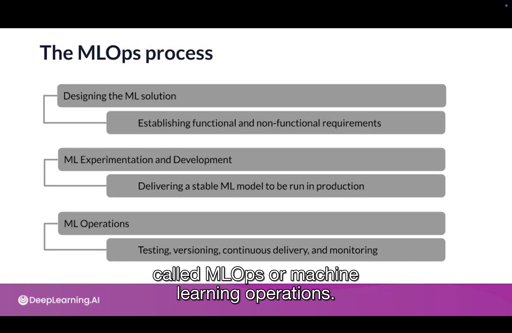   
   
Hi, welcome to this specialization on Machine Learning Engineering for production, MLOps. Say you've trained an accurate machine learning model in the Jupiter Notebook, you celebrate that and you might now be wondering, now what do I do. After reaching the milestone of developing a good model, actually putting your model into production. They have a working system that is making useful predictions. That's still requires much more. This specialization will teach you the skills you need to build and deploy production machine learning systems. You learned about the full machine learning process lifecycle from scoping out your project, to data, to modeling through deployment. You're better execute the machine learning project all the way from start to finish. One common misconception is that the only difference between developing model that you fit the notebook on your local machine and deploy that model into production is literally just the deployment piece, maybe just a bunch of software engineering. But that's not true, it's not just a bunch of software engineering. There are machine learning challenges to production as well that on edges in the process of developing a model into Jupiter notebook. This discipline of building and maintaining production systems, that is the processes in tools for doing all this is sometimes called MLOps or machine learning operations. You'll learn about that too. I'm thrilled to be bringing you this new specialization with two fantastic instructors from the google TensorFlow team, Robert Crowe and Laurence Moroney. Robert Crowe is it TensorFlow developer, Engineer at Google, a Data Scientists and TensorFlow advocate. Robert has a passion for helping developers quickly learn what they need, hopefully what you need to be productive. Lawrence Moroney, these AI advocacy at google and is also instructor of three other TensorFlow specializations with deep learning AI and is also the book, AI and machine learning, if we call this. Glad to have both of you with us for the specialization. I'm delighted to work with you again, it's always a pleasure. As you said Andrew, in addition to building a first working model, in a production system, you need to handle a whole range of issues, including things like data drift, where the distribution of the data you trained on maybe eventually become very different from the distribution of the data that you're running inference on. A key topic that we'll discuss is change. The world changes and your model needs to be aware of that change. In this specialization, we'll also introduce you to several related topics outside of machine learning. You can look at Production Machine Learning as both machine learning itself and the knowledge and skills required in modern software development. If you're working on a machine Learning Team and industry, you really need expertise in both machine learning and software to be successful. This is because your team will not just be producing a single result. You'll be developing a product or service that will operate continuously and maybe a mission critical part of your company's work. That's right. I can say from my own experience that oftentimes the most challenging aspects of building machine learning systems turn out to be the things that you least expected like deployment. It's all very well being able to build a model, but getting that into people's hands and seeing how they use it can be very eye-opening. You might think you have the perfect model for the perfect scenario, but your users could have different opinions and it's always really good to learn from them. They might be, for example, okay, with a round robin trip to a server for a frequently updated model. Or they might insist that their data never leaves their device. So you need to know the best ways to keep their on-device models really fresh. This specialization contains four causes that provide you with the knowledge and hands-on practice to get a Production Machine Learning system up and running. In the first course which I teach, you see an overview of the entire life cycle of a production machine learning project, from the scoping to getting data, to modeling, to deployment. The second course is all about data and how it evolves over time. With this course, you'll build data pipelines by gathering, cleaning, and validating data sets using TensorFlow extended or TFX and the TFX family of Libraries. To understand your data evolution, you'll track changes with ML metadata using data provenance as a conceptual framework. The third course is focused on machine learning modeling pipelines in production. In this course, you'll learn how to manage modeling resources to best serve inference requests and minimize costs. You'll also use analytics to address model fairness, explain-ability issues, and mitigate bottlenecks. Course 4 is all about deployment. This means of course that you want to get ready to serve your users requests. Now this can be exciting and challenging all at the same time. In course 4, you'll deliver deployment pipelines from model serving that might require many different infrastructures. You'll also apply best practices to maintain a continuously operating production system that stays up to date and importantly keeps your users needs front of mind. As a learner in this specialization, we're assuming that you're comfortable with Python programming and Machine Learning and that you have some familiarity with one of the deep-learning frameworks in Python, like TensorFlow, keras, or PyTorch. If you've completed the deep learning specialization offered by deep-learning data AI, you should be in great shape to start this specialization. Alternatively, of course, if you've completed the deep learning data AI TensorFlow developer certificate program, you'll be really well-prepared to start the specialization. Great. Well with that, let's get started. That sounds great to me. Sounds good. Let's do it.

2.  

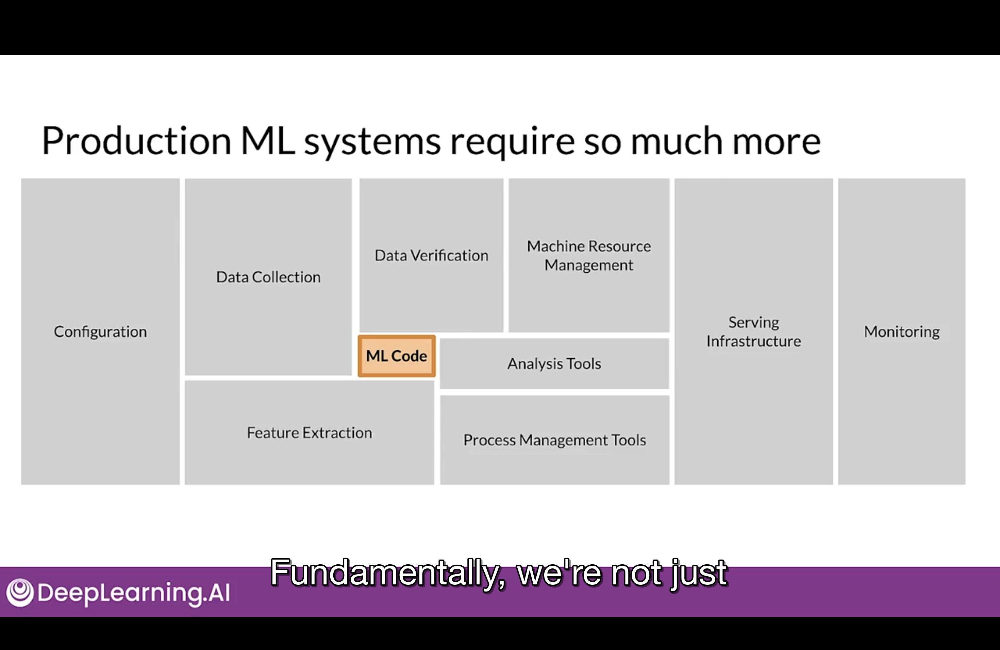

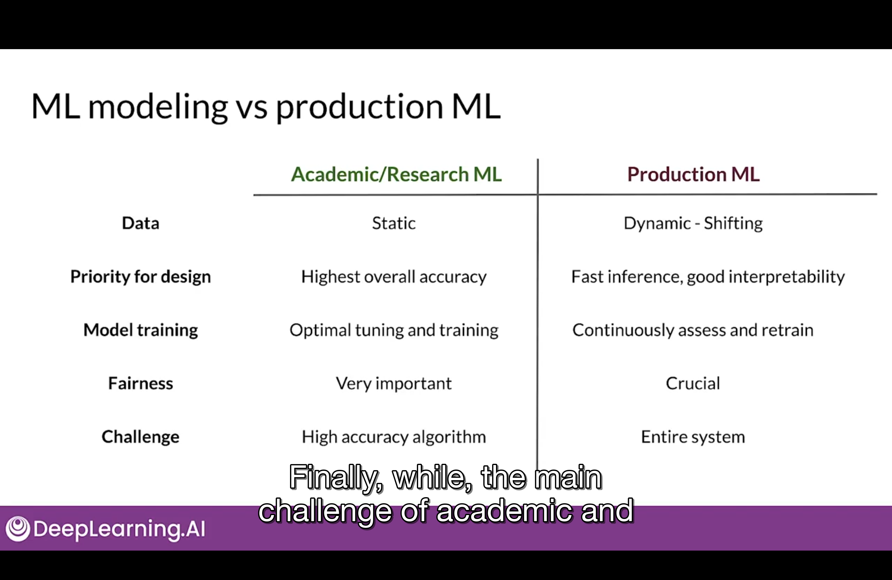

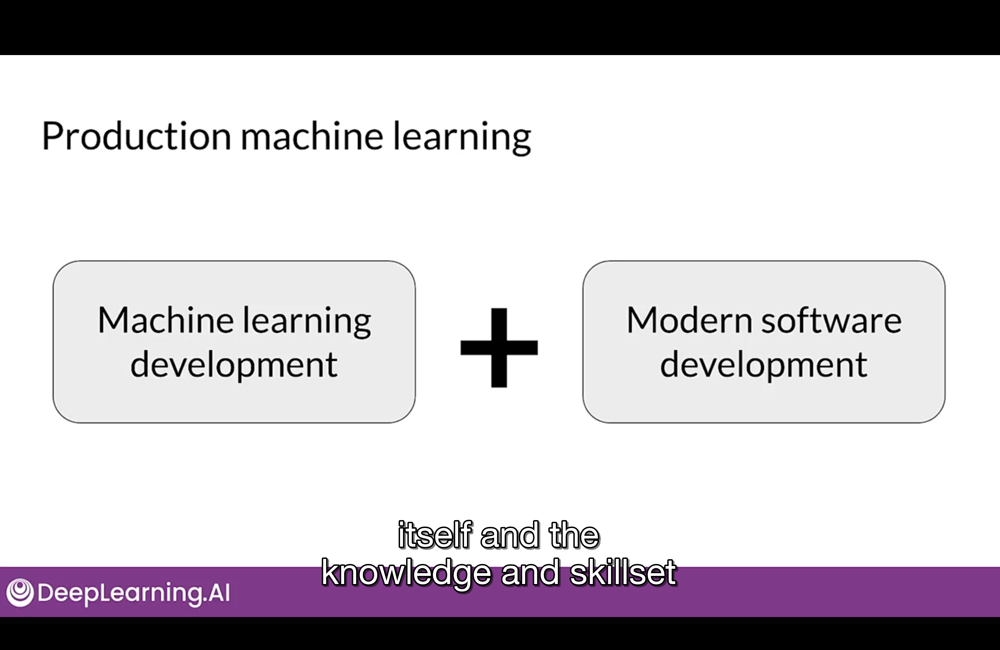

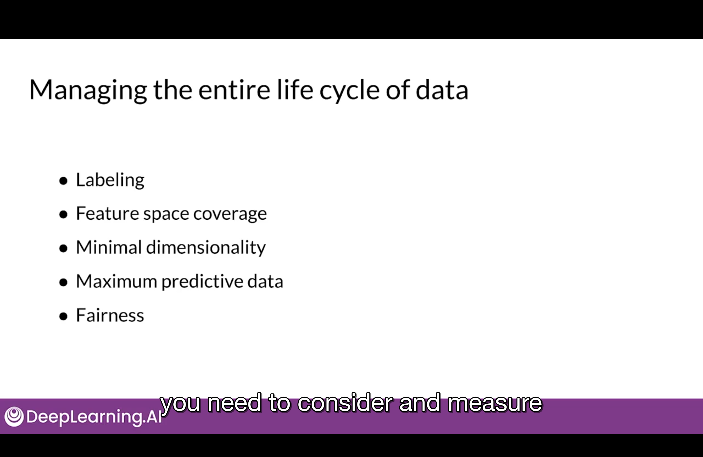

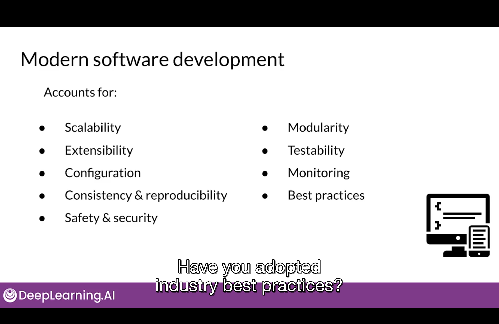

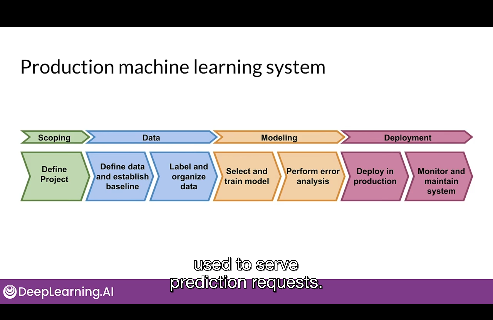

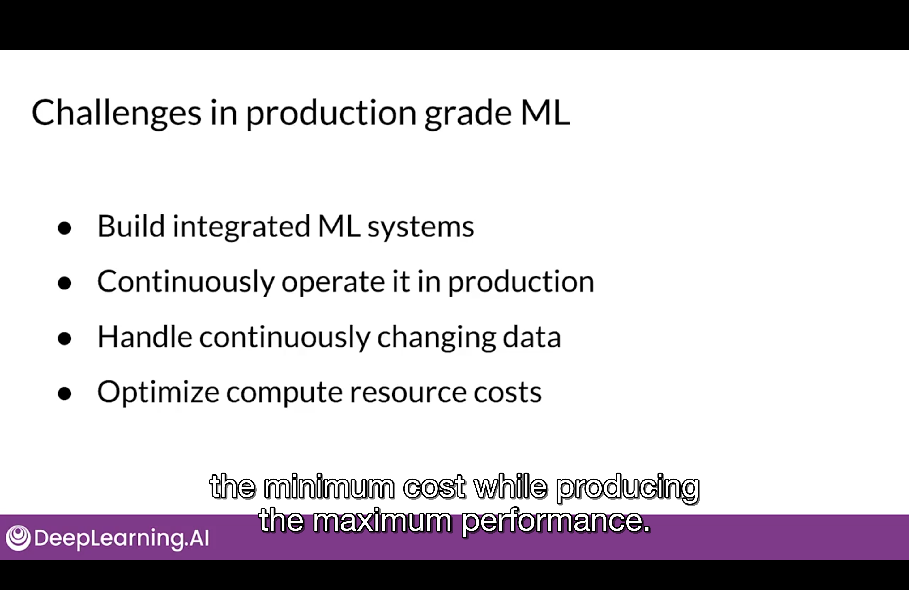

Hey, and welcome to collecting, labeling, and validating data. This course is all about data and not just data, but data in a production machine learning setting, you'll discover that there are quite a few differences between production data and data that you might have been using in, an academic or research environment and that's what this course is all about. I'm really excited to get started, so let's get going. We've got some really important stuff to talk about this week. This week is all about data, collecting our data, labeling it, and validating it. Let's get started before we jump in. I know there maybe some of you who are coming from a more academic or research setting who might be thinking data? I already know all about data what am I going to learn here? Well, in production environments, you discover some interesting things about the importance of data. Hear two quotes from ML practitioners had businesses where Data and ML is mission-critical. Talking about how they view the importance of data. First, from Uber, Data is the hardest part of ML and the most important piece to get right. Broken data is the most common cause of problems in production ML Systems and next from Gojek, no other activity in the machine learning lifecycle has a higher return on investment than improving the data a model has access to. The truth is that if you go to just about any production ML team and ask them about the importance of data. You'll get similar answers. So that's why we're talking about data because it's incredibly important to success and the issues for data in production environments are very different from the academic or research environments that you might be familiar with. Okay, now that we've got that out of the way, let's dive in. So this is our Introduction to Machine Learning for production and we're going to start with an overview. Let's get started by establishing what Machine Learning and Production is? And how you can view Production ML really as a combination of ML development and modern software development practices? We'll also discuss some of the challenges that are unique to Production ML. In an academic or research setting, modeling is really fairly simple. Well, maybe not simple, but perhaps less complicated. Anyway, typically you have some dataset, often standard dataset that supplied to you and already cleaned and labeled and you're going to use that to train your model and evaluate the results. The end result is a model that makes good predictions. So you'll probably go through a few iterations to fully optimize the model. Once you're satisfied with the results, then typically you're done. Production ML requires a lot more than just a model. We found that the model is typically about 5 percent of the code required to put an ML application into production. Take a look at all the other boxes that are in this diagram and you'll get some idea about what we're going to be talking about. Fundamentally, we're not just talking about machine learning and modeling. We're talking about Production ML applications and what it takes to create them, deploy them, maintain them, and improve them so that you can make them available to your users and your business or your organization if you're doing something like a non-profit. Let's compare some of the differences between ML modeling in a researcher, academic setting and real production ML. To start with, in an academic or research environment, you're typically using a static dataset for Production ML real-world data is used, which is dynamic and usually shifting. The design priority for academic or research ML is usually the highest accuracy over the entire training set but the design priority for Production ML is fast inference and good interpretability and of course, accuracy and cost. Model training for research ML is based on a single optimal result and the tuning and training necessary to achieve it. Production ML requires continuous monitoring, assessment, and retraining. Interpretability and fairness is very important for any ML modeling, but it's absolutely crucial for Production ML. Finally, while, the main challenge of academic and research ML is finding intuiting, a high-accuracy model. For production ML the challenge is that plus everything else, the entire system. It would be fair to say that you can look at Production Machine Learning as both machine learning itself and the knowledge and skillset required and modern software development. It really requires expertise in both areas to be successful, because you're not just producing a single result, you're developing a product or service that is often a mission critical part of your offering. ML development itself focuses on specific issues related with the data and the quality of predictions. For example, assuming that you're doing supervised learning, then you need to make sure that your labels are accurate, and you also need to make sure that your training dataset has examples which cover the same feature space as the request that your model will receive. You also want to reduce the dimensionality of your feature vector to optimize your system performance, while retaining or enhancing the predictive information on your data. Throughout all of this, you need to consider and measure the fairness of your data and model, especially for rare conditions, for example, in domains such as health care, where rare but important conditions may be absolutely critical to success. But on top of all of that, you're putting a piece of software into production that requires a system design, that includes all of the things that are required for any production software deployment. Of course, this deployment has to be focused on ML and your application. Is your system scalable? Can you scale it both up and down? Can you extend it cleanly to add new stuff when you need to? Does it have a clear, well-defined configuration? Is it consistent? Can you reliably reproduce results? Is it hardened against attacks? Is the design modular? Following modern software development principles. Can you test individual units? Can you do end-to-end testing? Can you continuously monitor the health and performance of your system and be alerted when there are problems? Have you adopted industry best practices? Using a model in real-world applications requires much more than just an understanding of machine learning algorithms. The first step is scoping, which focuses on defining the project needs and goals and the resources required to achieve them. Next, you start working on your data, which defining the features that you're going to use well as organizing and labeling your data. That may sometimes include measuring human level performance to set a baseline for comparison. Then you design and train a model. In this phase, error analysis will help you refine your model to suit your project's needs. After training your model, you deploy it so that it can be used to serve prediction requests. You might deploy your model on mobile devices, on a Cloud, or in IoT devices, or even in a web browser. Over time, real-world data continuously changes, which can result in a degradation of your model performance. You need to continuously monitor the performance of your model, and if you measure a drop in performance, you need to go back to model retraining and tuning, or revise your data. During deployment, new data may affect your project design either positively or negatively and risk coping might be necessary. Ultimately, all these steps create your production ML system, which needs to run automatically such that you're continuously monitoring your model performance, ingesting new data, and retraining as needed, and then redeploying to maintain or improve your performance. The challenges when doing production ML are very different than academic or research ML, or in some sense they're the same but include a lot more. You're going to be building an integrated system specifically focused on ML use cases. You need to think about operating it continuously in production, and for online use cases, that means it has to stay available 24/7. You've got to think about and put systems in place, to handle a changing world and changing data, and of course, like any production system, you need to try to do all of this at the minimum cost while producing the maximum performance. It might seem daunting, but the good news is that there are well-established tools and methodologies for doing this, and we'll be covering many of those in this course.
   

3.    

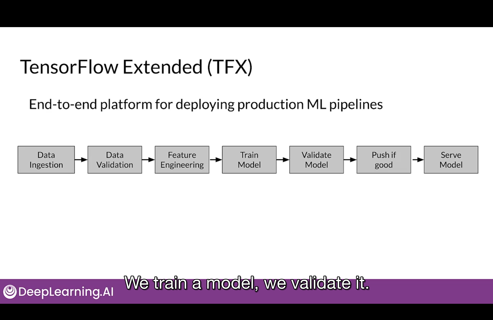

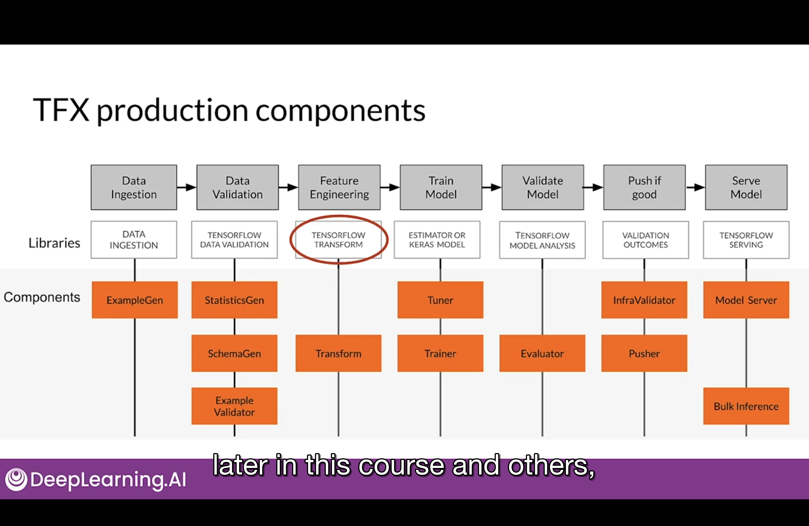

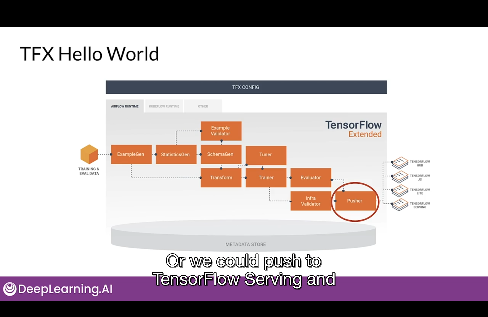

Welcome back. This next section is all about ML Pipelines. No, not those kind of pipelines. Machine Learning Pipelines. ML Pipelines are the heart of any Production ML system. You're going to learn all about them right now. In this lesson, we'll begin to introduce ML Pipelines and the concept of MLOps. Now allow us to see how pipeline orchestrators sequence and schedule ML tasks to implement the entire ML training process. We'll then look at the example of TensorFlow Extended or TFX, which is a widely adopted framework for creating ML Pipelines. What do we mean by the phrase ML Pipeline? Well, remember the iterative ML workflow that we talked about previously. ML Pipeline is a software architecture to implement exactly that. Automating, monitoring, and maintaining this ML workflow from data to a trained model. ML Pipelines form a key component of MLOps architectures. This slide shows one version of what an ML Pipeline looks like, which was put together by an industry group, the CD Foundation. There are some differences between different pipeline architectures, but in general they look something like this. You'll notice that they basically mirror the ML development process. Starting with data ingestion and ending with a trained model. That's by design since they need to encapsulate and formalize that process. ML Pipelines are almost always directed cyclic graph or DAGs. Although in some advanced cases they can sometimes includes cycles. A DAG is a collection of all the tasks you want to run sequenced in a way that reflects their relationships and dependencies. Notice that in this graph the edges are directed and there are no cycles. That makes this graph a DAG. Orchestrators are responsible for scheduling the various components in an ML Pipeline based on dependencies defined by a DAG. Orchestrators help with pipeline automation. Examples include Argo and Airflow, and Celery and Luigi and Kubeflow. TFX is an open-source end to end Machine Learning platform, and it's what we use at Google. A TFX Pipeline is a sequence of scalable components that can handle large volumes of data. Starting on the left, we ingest data and then we move to Data Validation and we do some feature engineering. We train a model, we validate it. If it's better than what we already have in production, we're going to push it to production. Finally, we're serving predictions. The sequence of components are designed for scalable high performance Machine Learning tasks. In this course, you'll be using TFX to implement real ML Pipelines exactly as you would for Production Systems. TFX in production components are built on top of open-source libraries, such as Tensorflow Data Validation, which you'll also learn about later this week. Tensorflow Transform. We shall also be working with extensively later in this course and others, like Tensorflow Model Analysis. Components in the orange here, leverage those Libraries and form your DAG as you sequence these components and set up the dependency between them, you create your DAG, which is your ML Pipeline. This is what we refer to as the Hello World of TFX. We start on the left with our data and we're going to ingest our data with a TFX component called ExampleGen. All the boxes in orange that you see here are TFX components. In fact, these are components that come with TFX when you just do a PIP install. Next, we generate statistics for our data. We want to know the ranges of our features, if they're numerical features, if they're categorical features, we want to know what are the valid categories and so forth. What are the types of our features? Example Validator is used to look for problems in our data. SchemaGen is used to generate a schema for our data across our feature vector. Transform will do feature engineering. Tuner and Trainer are used to train a model and to tune the hyper-parameters for that model. Evaluator is used to do deep analysis of the performance of our model. We'll talk about what we mean by deep analysis a little bit later. Infra Validator is used to make sure that we can actually run predictions using our model on the infrastructure that we have. For example, do we have enough memory? If all of that passes and the model actually performs better than what we might already have in production. Then Pusher pushes the model to Production. What does that mean? Well, we might be pushing to a repository like Tensorflow HUB and then using our model later for maybe transfer learning. We're generating Embeddings. We could be pushing to TensorFlow JS. If we're going to be using our model in a web browser or a Node.js application. We could push to TensorFlow Lite and use our model in a mobile application or on an IOT device. Or we could push to TensorFlow Serving and UserModel on a server or maybe a serving cluster. The key points here, first of all, Production ML Pipelines are more than just ML code. They're ML development and software development and a formalized process for running that sequence of tasks end to end, in a maintainable and scalable way. TFX is an open-sourced end to end ML platform that we'll be using in this course.

4.   

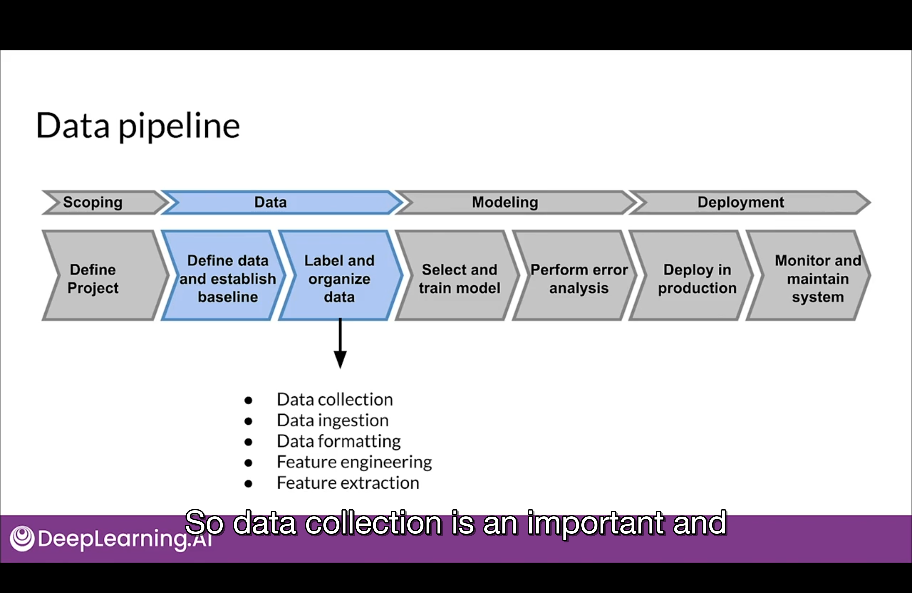

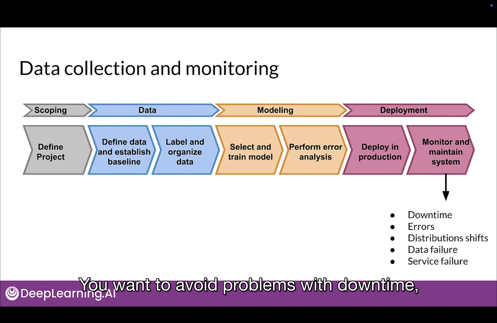

Hi and welcome back, well to actually do any machine learning, you need to have some data. Where do you get that data, well in production ML it turns out you usually have to find ways to collect that data, and we'll talk all about that right now. Now let's discuss collecting data and a little bit about the importance of data, to first let me tell you a story about an application that I was involved in. We were asked to create a model to predict the amount of time that it would take to get through an airport security checkpoint on different days at different times with different lines of different lengths and so forth. So we need a data, and how are we going to get that data, well we had to measure how long it took people to get through security checkpoints. How are we going to measure that, well, what it came up with is we had to actually go to the airport, we had to get someone cleared through security because anything you do in an airport has to be approved by the security. We had one person standing at the beginning of the line to get into a security checkpoint and they would record the time that somebody entered. And then we had another person standing at the other end, the exit of the checkpoint, and actually they were far enough away from each other. They couldn't even see each other, and they would record the time that each person left. And in that way we would gradually build up a data set of labeled data that gave us the amount of time that people took to get through an airport security checkpoint. Well, as you can imagine, it was incredibly painful, we had to develop applications just to support being able to do that. And it was incredibly expensive, we had to pay people they had to be cleared through security and so forth. So when we talk about collecting data in the real world, hopefully you're not going to deal with a situation like that. But it will be a real world situation where you need to think about how you're going to get the data you need unless, you're very lucky and somebody already has the data for you, which is great. And if that's the case, that's wonderful, so let's start by discussing the importance of data and the importance of data quality. It's your your data and your model is only going to be good as good as the quality of your data. If there's a lot of noise in your data, then you need to try to deal with that, if the labels especially are noisy, then there you have to find ways to try to clear up that signal. We're going to be using data pipelines almost exclusively because remember we need to automate these processes. So we're going to need data collection and then in our pipeline we're going to ingest and prepare. Our data has sequenced automated tasks, and we're going to need to monitor data collection. So remember for most applications, you don't just collect data once you are going to collect data throughout the lifetime of that application. As we've seen, data is the hardest part of ML and the most important piece to get right. This is a quote from Uber, broken data is the most common cause of problems in production ML systems. Well, i hope you never have to learn that the hard way, Gojek has similar feelings about that. And really if you go to just about any production machine learning team, they'll tell you stories about collecting data and and how important it is to get the data right. In programming language design, a first called citizen is a in a given programming language is an entity which supports all the operations generally available to other entities, and an ML data is a first class citizen. So software one data was all about code, it's it's really just, the instructions for the computer, in software two dato, we need to specify a goal and for the behavior of the program, the code is important, but not the only thing that we worry about, optimization is really the driving force here. So optimization in a lot of different directions. So we want to optimize for performance, obviously what we want to optimize for maintain ability and scalability as well. And for ML data is data quality is really critical for success, so in some ways you could look at it as, data is is almost like the software almost like a code in a software window application. Data is sort of a similar sort of player in an ML application. So the cartoon on the right shows one way to look at this, you I'll let you read there by yourself, but models aren't magic. So it's good for you to know that the data that you have, you could have mountains of data, but if it if it doesn't have predictive content, then, you're just not going to be able to create a predictive model with it. So there's a couple things here, you you want to remove information from your model and features from your model that aren't predictive, because they're going to cause problems are certainly going to take a lot of compute resources that you don't want to be spending on that. And you need to make sure supervised learning case or even unsupervised learning, that your training data is really covering the same feature space as the as the prediction requests that you'll get when you put your model into production. You need to cover that same space so that your model has good information about the regions of that space to make predictions and, just like anything, it's garbage in and garbage out. So if your data is garbage, if your data quality is low your model and your application will, be low quality. The good news actually for ML is that we can measure that in a lot of software applications. You, it might not be as easy to measure how bad your solution or good your solution is doing, but in the end well it's it's pretty easy to measure that. So data collection is an important and critical first step to building ml systems and data. You want to avoid problems with downtime, you need to make sure that your training a model that you can scale, that you can serve predictions and you need to think about, especially for things like time series, you have things like seasonality and trends. You need to think about different kinds of errors and what we'll talk about all of these. But it's this whole picture that you need to sort of keep in your mind when you're you're developing things that it's going to be an entire process, from ingestion through serving and that all has to be automated. It all has to be testable and maintainable and scale well and so forth, so you need to understand your users and you need to make sure that you're translating the user needs into data problems. You don't want to just do the model that you happen to have if it doesn't meet the needs of the user. You need to make sure that your data covers the same region of your feature space as the prediction request that you'll get your training data and you want to make sure that you've really maximize the predictive signal in that data. And you need to worry about the data quality not just at the beginning but throughout the life of the application. So part of that is making sure that your sourcing data responsibly and you're thinking about things like bias and fairness, which we will talk about later on in this course.

  
5.   

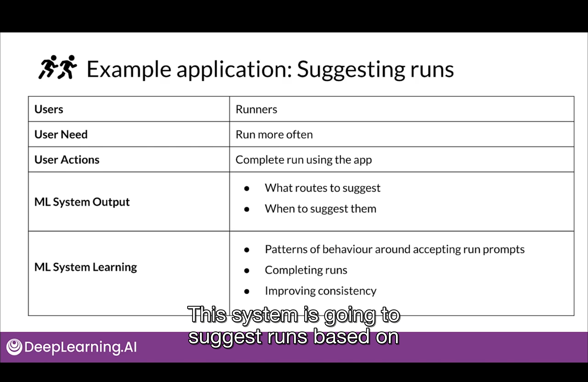

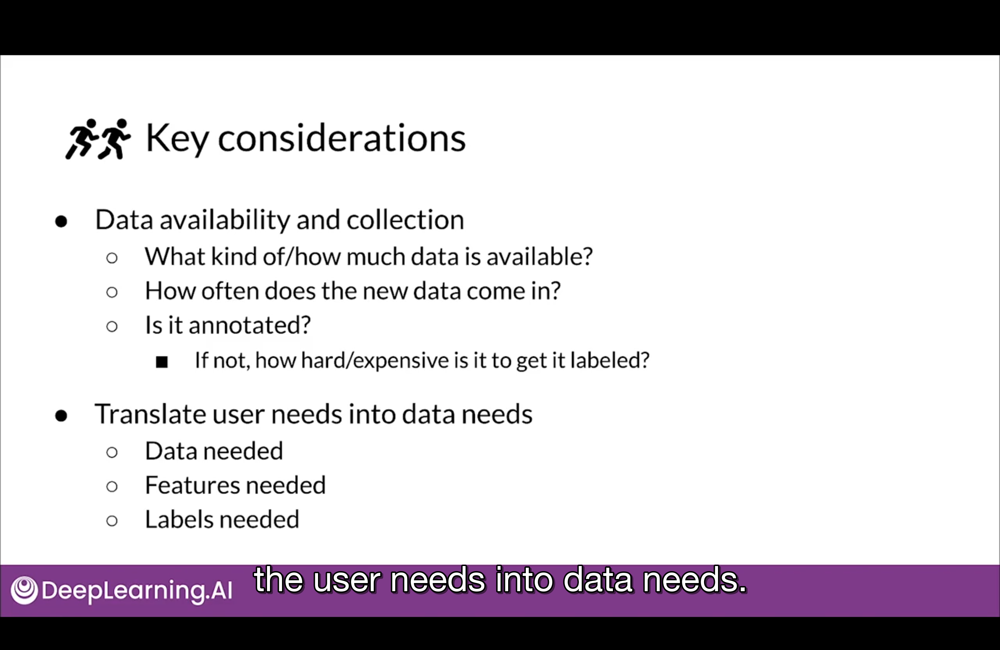

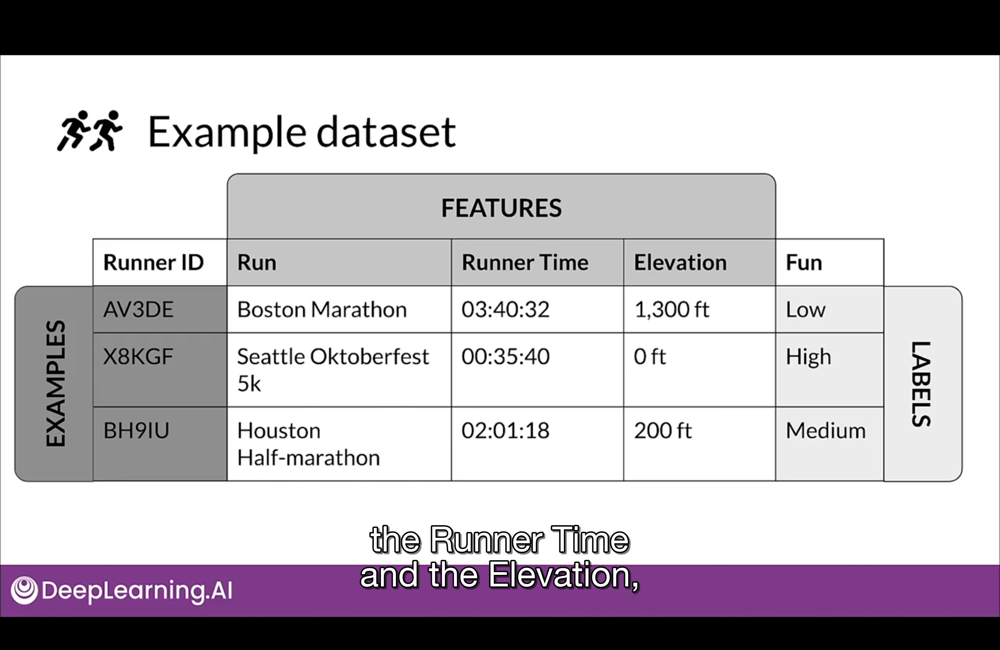

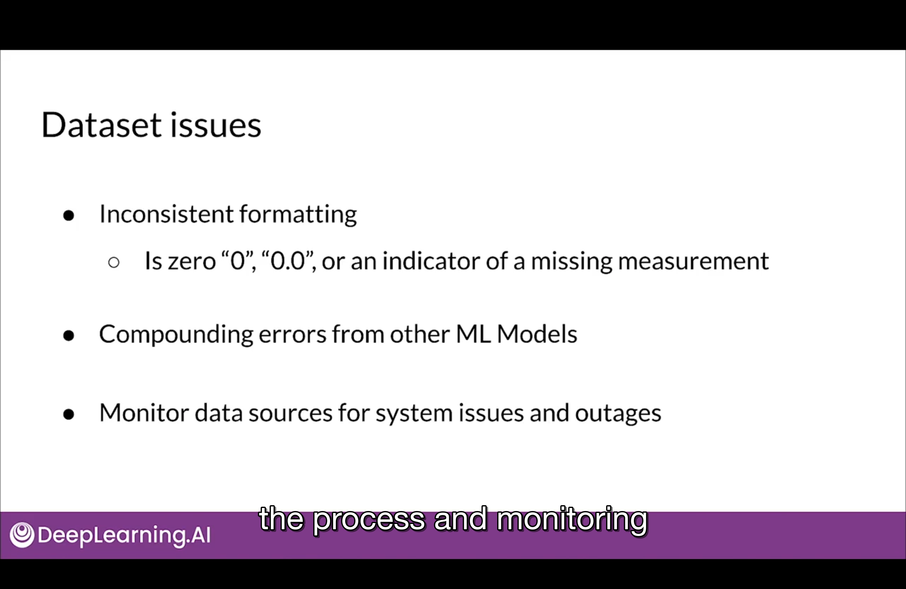

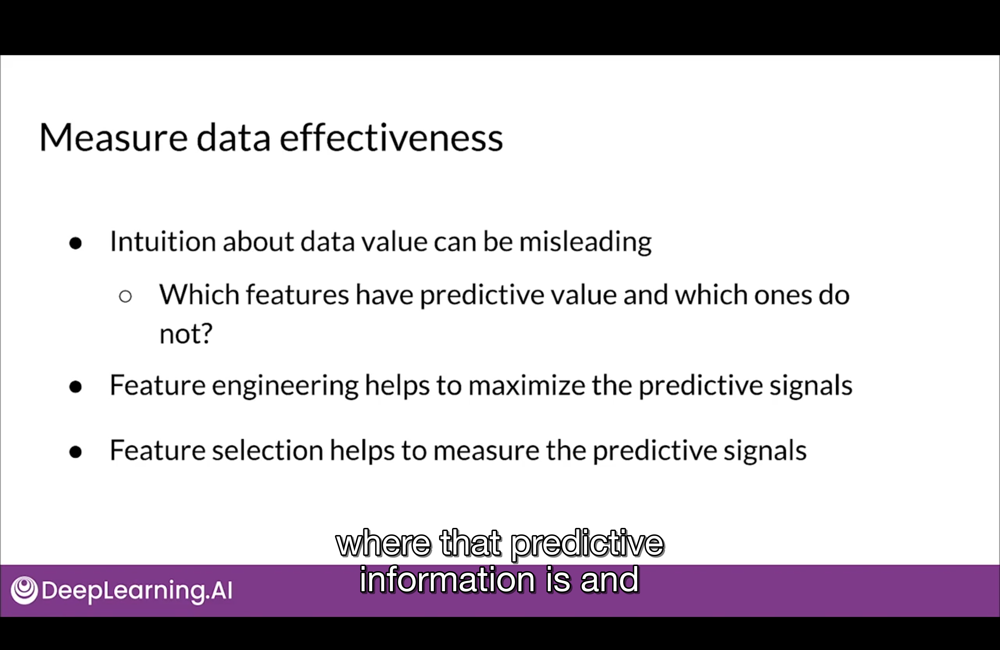

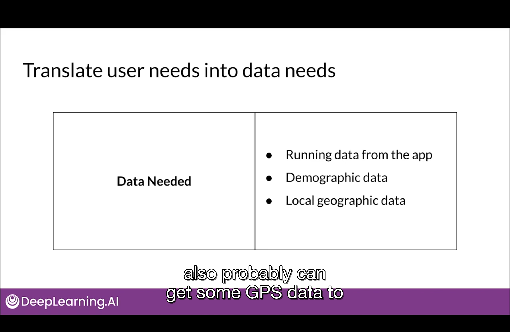

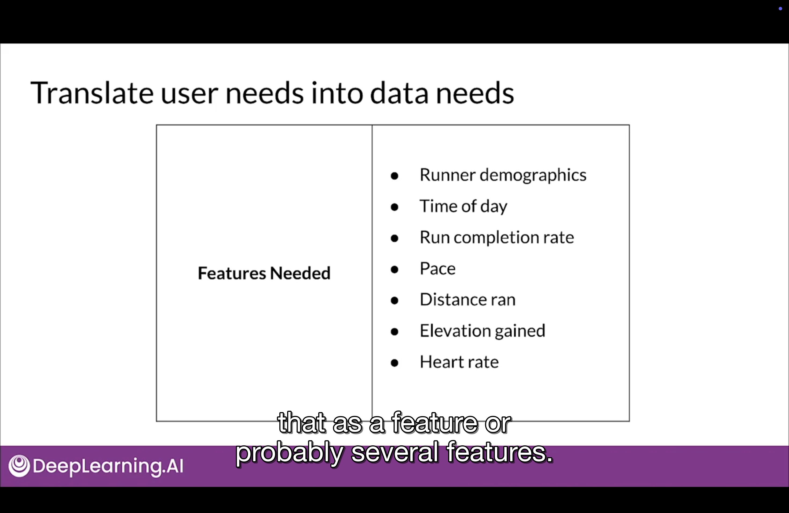

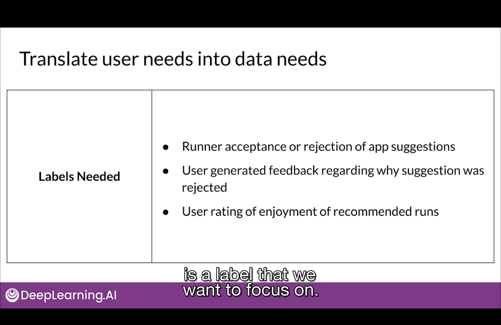

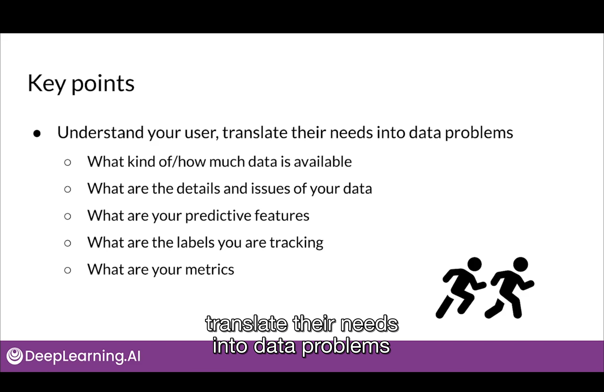

Now let's talk about collecting data and look at an example application. For this example, we're going to be looking at an application that suggests runs to runners. There's different runners with different level of fitness. The first step is really to try to understand the users as we've discussed. This system is going to suggest runs based on the user's behavior and by leveraging observed patterns and preferences. The goal is to improve the consistency of running and for runners to complete those runs and to really be happy about that. Some key considerations. First of all, you need to consider data quality and data collection. What kind of data and how much data do you need? How often do you need new data? When do you expect things to change? Is that data annotated? You also need to translate the user needs into data needs. Understand the user's grade but at the end of the day we do need features and data. We need to first understand the user because otherwise we run the risk of collecting a bunch of data that is really just garbage. But once we understand the user, then we need to translate the user needs into data needs. We're going to do that with identifying what the data is, what the features are and what the labels are. Here's an example data set. We've got three different examples here for three different kinds of runs and we've got some features. The examples here are the Boston Marathon, the Seattle Oktoberfest 5K and the Houston Half-marathon. The 5K sounds good to me, I'm that kind of a runner. The features well, the Run itself, the Runner Time and the Elevation, which is also important. Then the labels here are just going to be how the runner rates the fun level of those runs. It looks like they agree with me that the 5K sounds like it'd be a lot of fun. Get to know your data. You need to identify the data sources that you're going to use, where are you going to get this data and not just the first time but on an ongoing basis? It's not just the training but you need to collect that same data, for you not to do inference when you want to create a prediction. You need to think about, how often do I need to refresh my trainings at? Along the way when you're working with your data, you need to make sure that there's actually predictive value, in your data. Anyone trying to make sure that you've eliminated features and data that does not have predictive value. But there's also some more basic things like, is the data consistent? When you're expecting, say a float do you always get a floater or is it mixed? Looking for things like outliers too or just errors. Because remember, you're dealing with systems you could have a sensor that goes bad and then you got an error. There could be data issues coming from different measurements, different types and also simple things like the difference between an end to the float or how missing value is encoded, that can all cause problems. In this example data set, if the elevation is zero feet, does that really mean that we're at sea level or does it mean that we don't have any elevation data for that record? If the output is coming from other ML models maybe if you're using an ensemble. If there's errors in those, then you can compound those errors when you try to use it in a downstream model. You also want to make sure that you're looking for errors and issues early in the process and monitoring the data sources for system issues and outages. Because remember, we're operating this thing, could be 24-7 easily, a lot of things are. Also, you need to expect to have system issues and outages. What if the app was offline for a while and the recorded runner time is wrong for some number of users, do you have ways to deal with that? Measuring the data effectiveness, you need some intuition about the data value, but your intuition can be misleading. You really need to make sure that you're looking at which data is really giving you the most information. Feature selection and feature engineering are really critical to shaping your data to be what you need it to be. The feature engineering will help you maximize the predictive signals once you've really identified where those are. Feature selection, that helps you measure where that predictive information is and really focus in on those features that give you the most value and help your model the most. Again, user needs. You need to understand the user and the application and in this case, we're looking at running data from an app. We can get demographic data when the user fills out their profile and we also probably can get some GPS data to give us some local geographic information. At high level that helps us understand the user. Then we need to translate that into features. The runner demographics, we need to express that as a feature or probably several features. Things like the time of day, how long it takes them to complete a run, their pace during the run, the distance and so forth, the elevation and if we're working with an app that has some sensors like a heart rate monitor, that's great information to have to really feed into this app, probably has some predictive information. But again, we need to test that. What our labels going to be? Runner acceptance in this case is a label that we want to focus on. Runners that take our suggestions and use them. That tells us that the app successfully gave them a run that they wanted to do and conversely, if they rejected it. User-generated feedback. You need to think about, first of all, how they're going to give you that feedback in a structured way that you can use to help with training your model. Then you know things like user rating. In this case of the enjoyment of the recommended runs. Again, it needs to be in a form that we can use. It can't just be free form unless you're going to do NLP to try to understand their paragraph of feedback but typically you're not going to do that. But anyway, the point here is that you need to understand the data and your user and how you're going to apply the labels. Key points: understand your user or your application, if there is no user, translate their needs into data problems and well-defined features that give you predictive information. What kind of data can you get? What's available? What are the details and issues for your data? Things like sensors. How reliable are they? Where's the predictive information in your data? It may not be where you think it is, it sometimes isn't. What are the labels? We need to make sure that we're training a model to predict the right thing. We need to make sure our labels are the correct ones for our goals. That's going to get to the metrics. What are the metrics that we're going to use to measure the performance of our model?
   

6.   

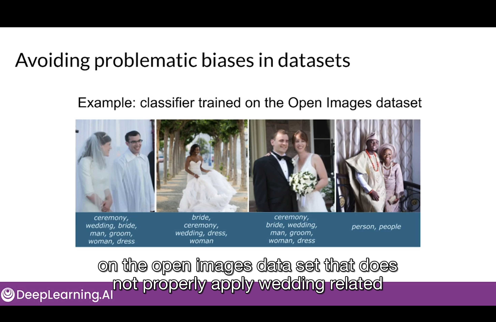

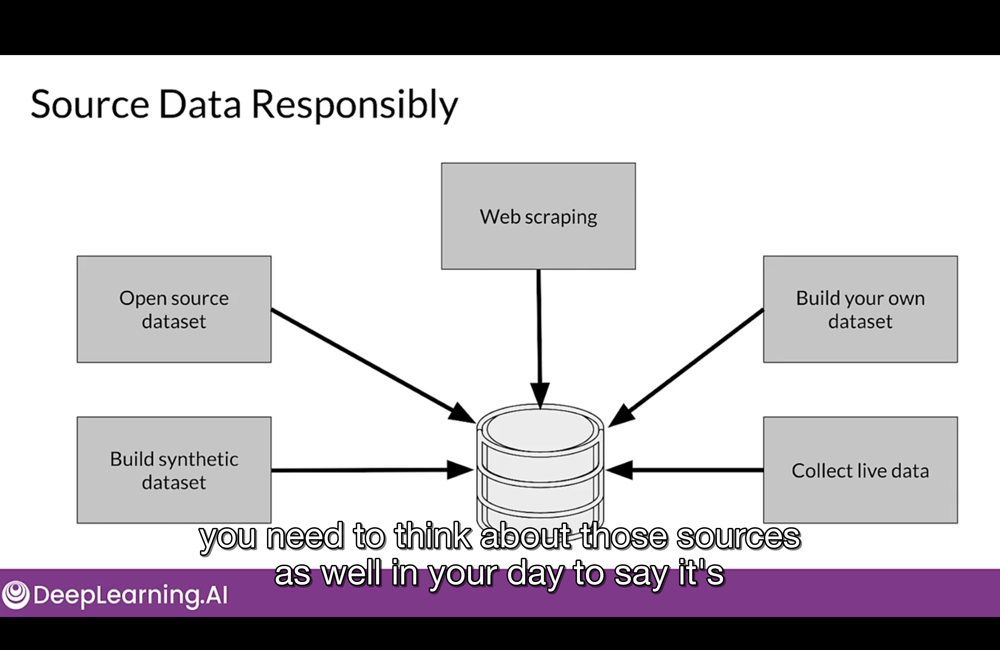

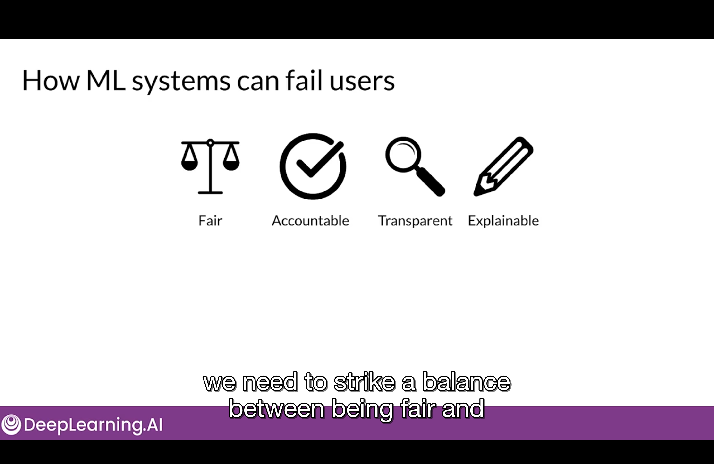

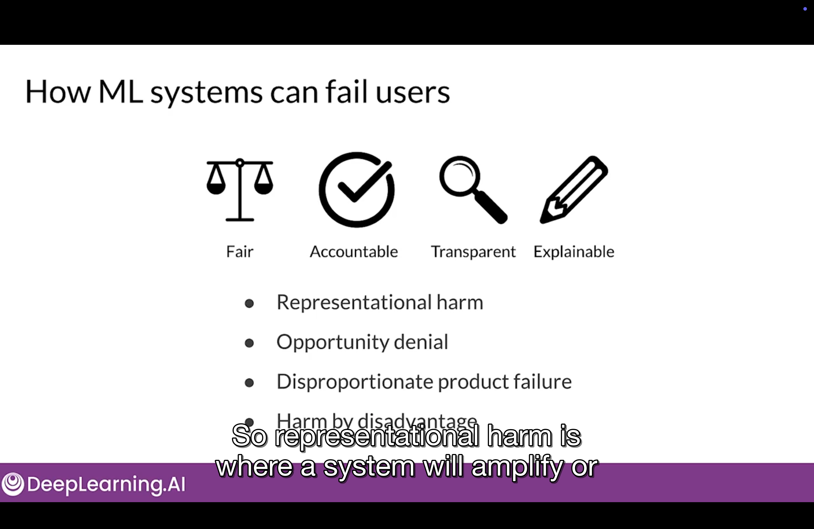

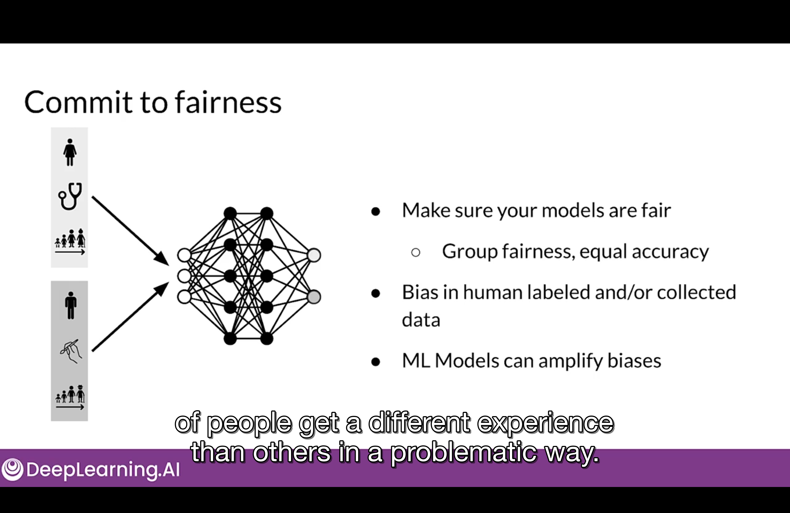

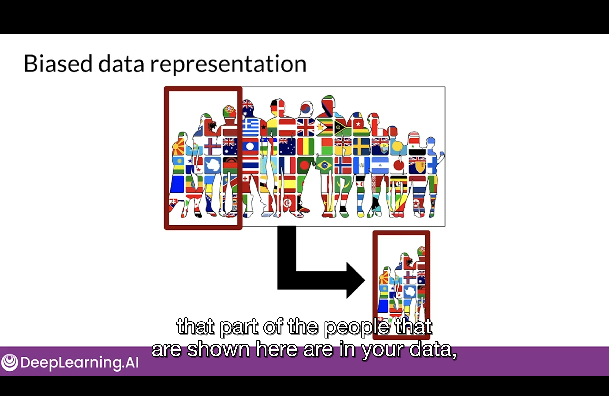

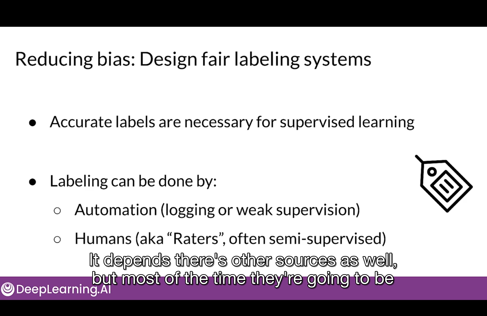

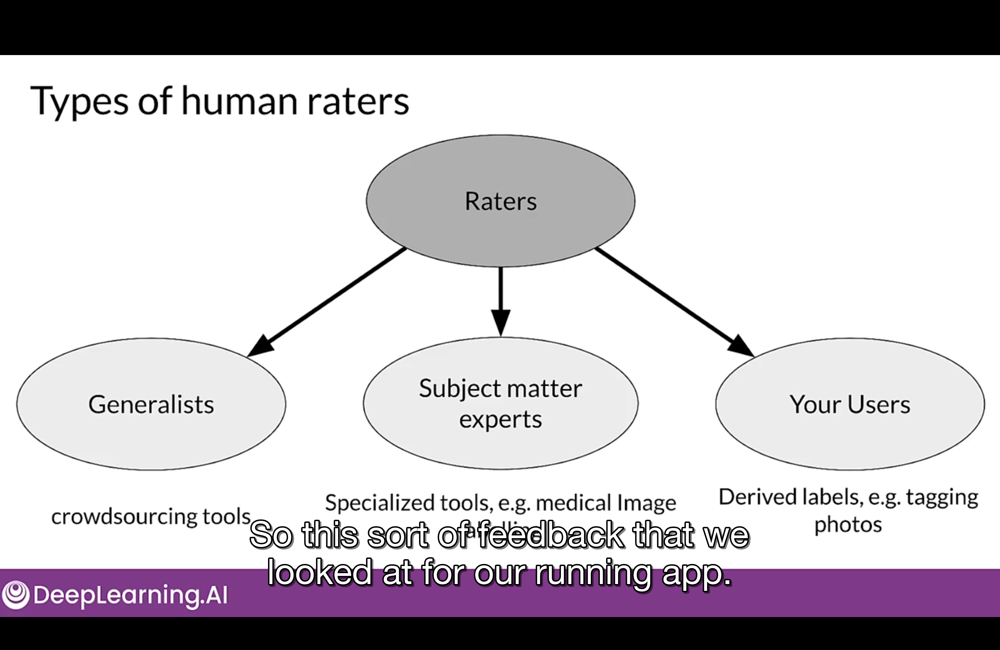

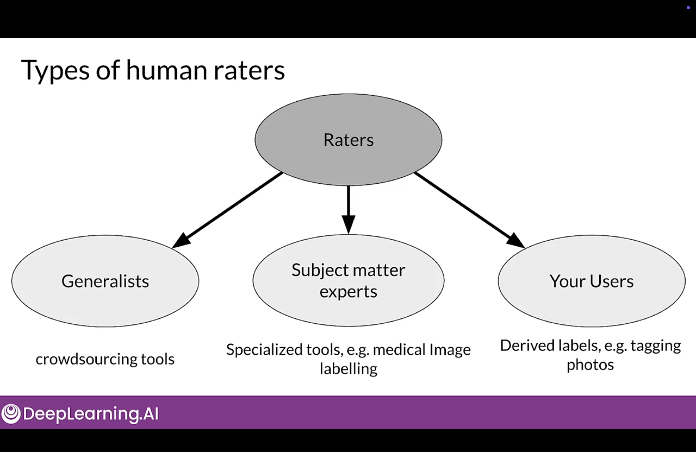

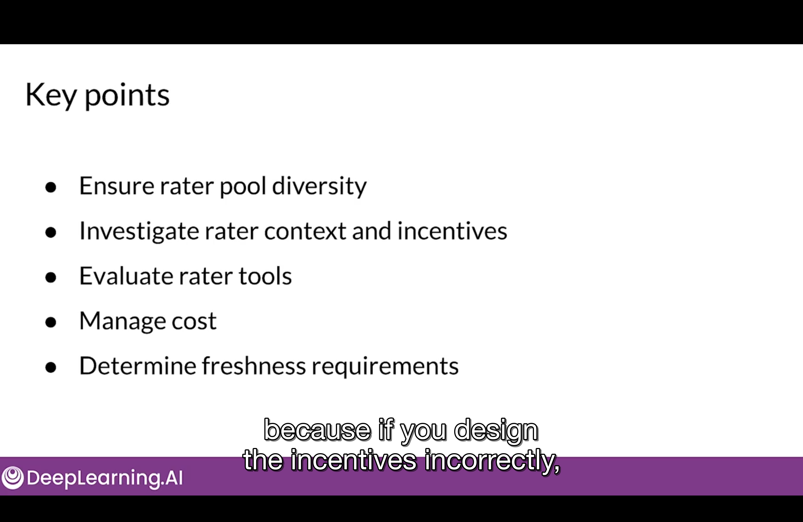

One of the key aspects of collecting data is to make sure that you're collecting it responsibly and paying attention to things like security, privacy and fairness. Let's talk about that now. So we're going to be looking at how to responsibly sourced data and ensure that our data is secure and that we're managing user privacy correctly. We need to know how to check for and ensure fairness and we need to design labelling systems that will mitigate bias. So here's an example. These images here show one standard open source image classifier trained on the open images data set that does not properly apply wedding related labels to images of wedding traditions from different parts of the world. On the far left, the classifiers, label prediction is recorded as ceremony, Wedding, bride, man, group, woman, dress. So that's pretty correct. The next one is bride ceremony, wedding, dress and woman. Again we know that's correct at least in the west, that's what a bride typically looks like. The next one over is good as well. So it's ceremony and bride and wedding, man, groom, woman, dress again, gets it right. But the one on the end, the one on the right. Well, that's for an African wedding ceremony, but it's incorrectly labeled as simply person or people. Well, it is person your people, but it's also a ceremony and there's a bride and a groom and address and so forth. So this is a classic case it's an example it's often cited of a problem with bias in the data set. So an ML system, the data may come from different sources and you need to think about those sources as well in your day to say it's not just the data that you have but where did you get it from? So you might be building synthetic data, you might be doing web scraping your often collecting live data, especially when you're running inference. You're often almost always really going to be building your own data set, although sometimes you can be using an open source data set. It just depends on what's available and what you need. But data security and privacy or key, they're always going to be important. Data security that really refers to the policies and methods and means to secure personal data or what's often referred to as PII, Personally Identifiable Information. Data privacy is about proper usage, collection retention, deletion and storage of that data. So data collection is not just about your model. You need to think about your users and treat that data as something that has been given to you to be a steward of your taking care of that data you need to manage it responsibly. Users really should have control over which data is being collected. And it's important to establish mechanisms to prevent your system revealing a user's data inadvertently or even through a tax. So how you handle your data privacy and data security depends on the nature of your data as well as the operating conditions and regulations and policies, things like GDP are very important here. Users privacy is also really key. So you need to protect personally identifiable information or data. Well, there's different ways to do that. Aggregation really helps with that if you can aggregate the data so that you can identify individual people within it, anonymous, rising it and giving users control over what data they share. Also, a good good way to deal with that. You need to consider any laws or regulations regarding user privacy that might be affecting in the places where you're going to be using your model and redaction. So in a lot of cases you need to give users a way to remove some of the data, which will create a less complete picture but is part of being responsible with your data. So ML Systems can fail users in a lot of different ways and we need to strike a balance between being fair and accurate and transparent and explainable. Some of the ways that ML Systems can fail are through things like representational harm. So representational harm is where a system will amplify or reflect a negative stereotype about particular groups. Opportunity denial is when a system makes predictions that have negative real life consequences that could result in lasting impacts. Disproportionate product failure is where the effectiveness of your model is really skewed so that the outputs happen more frequently for particular groups of users, you get skewed outputs more frequently essentially can think of as errors more frequently. Harm by disadvantage is where a system will infer disadvantageous associations between different demographic characteristics and the user behaviors around that. So fairness is important and you should really commit to it from the beginning. So what does it mean? Well, being fair means that you're going to identify if some groups of people get a different experience than others in a problematic way. So for instance, let's assume particular gender or occupation or age fields or part of your data and that you use it to train a model that predicts whether someone would be a reliable new employee. So it's involved in hiring. You need to really check to make sure that your model does not consistently predict different experiences for some groups in a problematic way by ensuring group fairness. So what that means is demographic parody and that things are equalized across different groups. And you need to make sure the accuracy as well is equal or or as close as you can get it. The data collected and labeled by humans will reflect their biases in many cases and their personal experiences so you have to account for that. Diversifying your user base is a good way to move towards fairness, but it's not a guarantee. So ML Systems can amplify biases. You need to be aware of that and be careful about it and you really what you want to do is deploy fair models. Biases can also arise when you have disproportionate representation of some groups within your data or no representation at all. So looking at the graphic here, what we're trying to show is that part of the people that are shown here are in your data, but there's a whole lot of other people who are not. So those groups might be stereotyped the ones that are not in your data or they might just be presented in a less positive way, or they may just get a bad experience a lot more often. So to reduce bias for supervised learning, you need accurate labels to train your model and serve predictions. The labels are usually coming from two broad sources. It depends there's other sources as well, but most of the time they're going to be coming from automated systems or human Raters, and we'll talk about both. Humans are able to label data in different ways. And the more complicated the data is, the more you may require an expert to look at that data and we'll talk about that in a bit. So humans that label data are referred to as Rater's. So who are raters? Well, they could be generalists and these are people who just pretty average people who are going to be adding labels through a variety of crowdsourcing tools. And these are cases where it's fairly easy for people to recognize the correct label. So for example, if you want a human to recognize the difference between a cat and a dog, that's something most people can do by looking at the image. But in some cases you really need a subject matter expert. So in those cases you're often using specialized tools and an example of that is is looking at X rays for diagnosis. It's not something that just anyone can do. You need to make sure that you're working with an expert and that labelling tends to get pretty expensive. So a subject matter expert or domain expert, this is something that you need in certain cases. You can also use your users. So this sort of feedback that we looked at for our running app. This can often be very valuable if you can find a way to work without in your application and it's going to give you this ongoing stream of labels for your data if you can make that work. So key points, first of all, always account for fair Raters and fair representation in your data set to avoid potential biases. And take into account who those labelers are and what their incentives are, because if you design the incentives incorrectly, you could get a lot of garbage in your data. The cost is certainly always going to be an important consideration. So if you can find a way to do it with a high level of quality but at less cost, that's great. But you need enough data. You need to find a way to do that. It's one of the challenges of production applications and finally data freshness too. You're going to be working with data and depending on how the world changes around the application and the data that you have, you're going to need to refresh that data on some regular basis and detect when you need to do that. So those are all issues you need to think about to really manage collection of data and to do it in a responsible way.
  

7.   

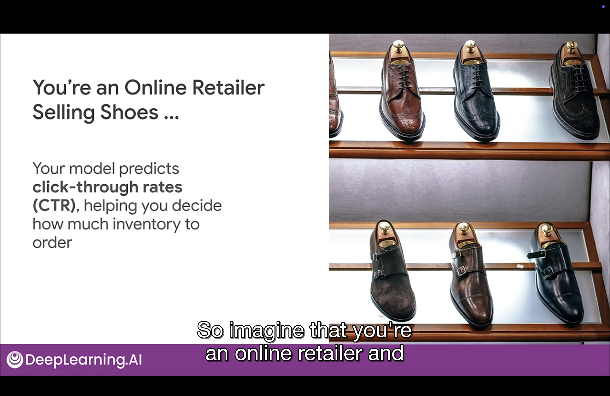 

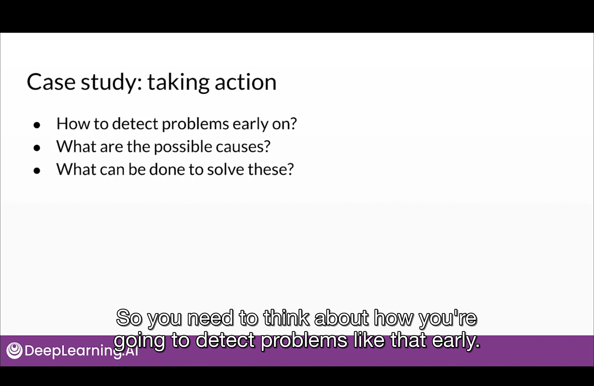

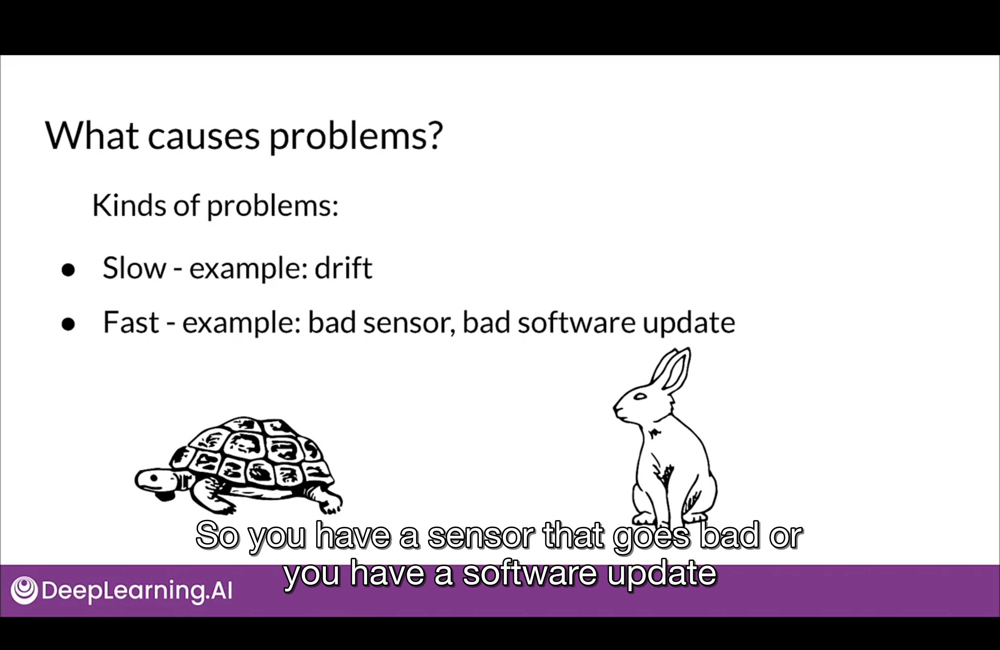

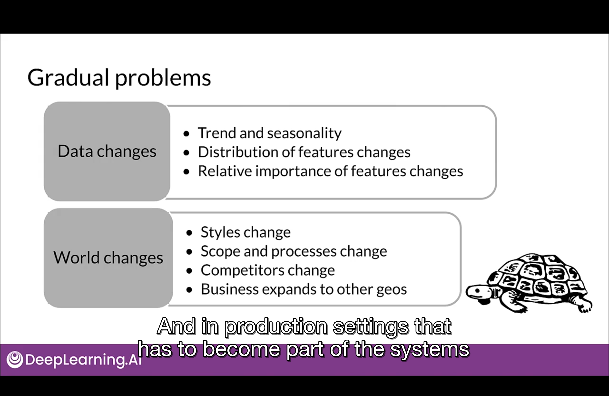

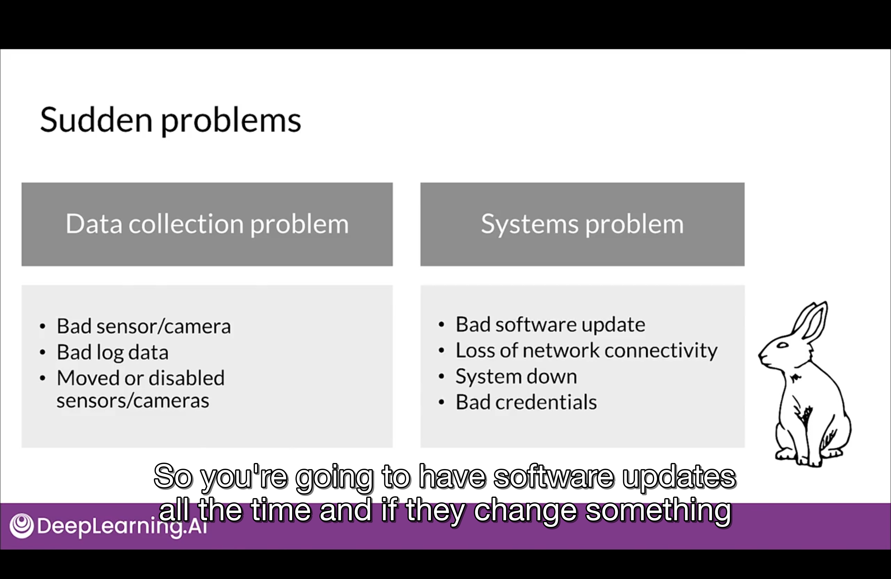

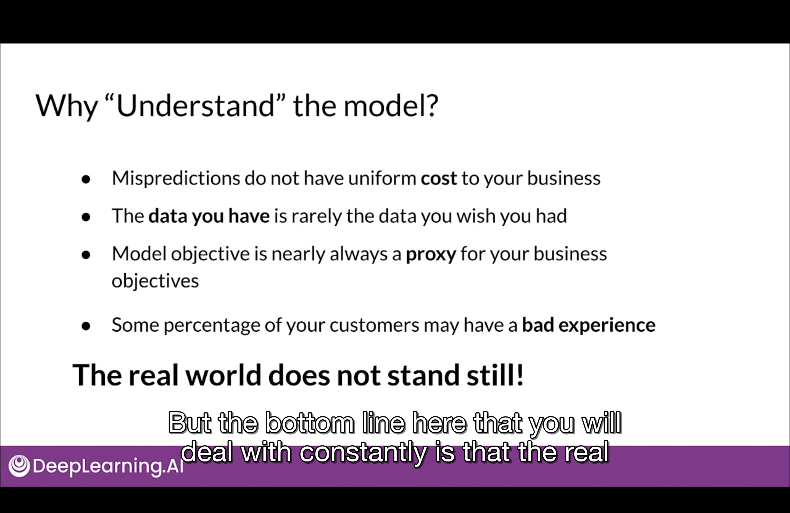

Welcome back. The only constant in the universe is change. That quote is actually attributed to Heraclitus of a thesis in 500 BC. And I think it's fairly safe to say that it's still true today and it affects production amount. So for example if you had trained a model a few years ago to recognize what a book looks like, it might have looked like this. If you train a model today, you'd also want to include books that look like this. Let's find out more now. To illustrate some of the issues with labeled data in performance settings, let's take a look at a case study. So imagine that you're an online retailer and you're selling shoes and you have a model that predicts click through rates which helps you to decide how much inventory to order. And suddenly the AUC and prediction accuracy have dropped not on everything but on a particular part of your inventory. Men's dress shoes. Okay. Why? You trained your model? You did fairly well in your metrics and so forth. Why is it different? What changed? Why does your model not predict men's dress shoes well now? And perhaps more importantly, how do you even know that you have a problem? Your models still running? It's still giving predictions. You're still ordering inventory. How do you know that the orders that you're making and the predictions that your model is giving you are not as good as they used to be? Well, unfortunately, if you don't put good practices into place in the production setting, you're probably going to find out either when you order way too many shoes or not enough shoes. And that's not a situation that you want to be in in a business. This is going to cost you money. So you need to think about how you're going to detect problems like that early. And what the possible causes are so that you can look for those and monitor your system. And then try to have methods systems in place to deal with those problems when they happen because they probably will happen at some point. But what kinds of problems? Well, there's different kinds and they tend to fall into two different categories. There are slow problems. So for example, your data will drift over time as the world changes and seasons pass and you have holidays and competitors enter or change what have you. And then you have fast problems that are really part of your system. So you have a sensor that goes bad or you have a software update that gets applied and suddenly things are wonky. So you need to really be monitoring your system well and looking for both of those problems and thinking about remediation in both cases. For gradual problems, they tend to fall into two groups really, but they're interrelated too so it's not like there's a hard line between them. Trend and seasonality for example, especially in time series you will have trends and you will have seasonality in most cases and you could argue about whether that's really a change in data or a change in the world. Same thing with the distribution of the features. Again, it's something that you see in your data. And the relative importance of features can change too as the relative importance changes, if you haven't retrained your model accuracy starts to decay. The world also changes constantly. And in production settings that has to become part of the systems that you design and the processes that you have in place. Things like, well, if we're working in retail and we're just looking at an example with shoes, styles change. So, maybe last year black shoes were really fashionable for men's dress shoes and now it's brown shoes or what have you. The scope and the processes change. So your understanding of those processes and how they happen in the world will affect how your model views the results of those processes. Competitors change and your business also changes. So you may take on new products, you may end of life other products you may have new competitors, you may expand into other geography ease or you may move out of geography, ease prices from suppliers change, prices on the open market, change all of that affects how your model needs to adapt to the world. And this tends to be very domain specific, but in general, in nearly all domains, changes in the world affect your model performance. So for sudden problems, there's things that you're probably familiar with. So data collection problems, things like a bad sensor or bad camera, the log data suddenly changes and you have a different format or the logs themselves are may be rotated differently, you can have a sensor or a camera that doesn't really change, but it moves. Maybe it gets bumped or maybe someone decided it should be in a different spot. I personally have seen that happen where we had cameras that someone decided that they should be moved and didn't tell us about that. [LAUGH]. Systems problems. So you're going to have software updates all the time and if they change something significant that you weren't aware of, that can be a real problem. Network connectivity. No, no, the network never goes down, does it? Well, maybe sometimes it does. Systems too. Whole systems can go down. So be aware of that. [LAUGH]. And bad credentials, you sign credentials and often they time out or something changes about them, all those things can cause a sudden problem that all of a sudden it's a fire drill and you need to deal with it. So part of this is really trying to understand your model and how it's sensitive to different changes in the world. A big issue here is that miss predictions don't have uniform cost to your business. Some miss predictions will have very little effect on your business. Other miss predictions could have huge effects. So understanding that and really as you're monitoring things, looking for things that have larger impacts is important. The data you have as you collect data is rarely the data that you wish you had. So I've personally seen cases where we were using sensor data from wifi devices and it was not great data. It was really noisy and but it was all we had. It was all we could have. So we had to work with what we had. The model objective is almost always a proxy for what you're really trying to get to. In many cases, sometimes you can design a model and you have the data to design a model for exactly the thing that you're trying to attack. But often, as in the case of the shoes that we just looked at, we were predicting click through rates as a proxy for deciding how much inventory to order. Some percentage of your customers will have a bad experience. You want that percentage to be as small as possible and as much as possible, you want to understand which customers those are going to be, so that you can try to design ways to mitigate that and improve the situation for all of your customers. But the bottom line here that you will deal with constantly is that the real world does not stand still. The one constant in the world is change.

8.   

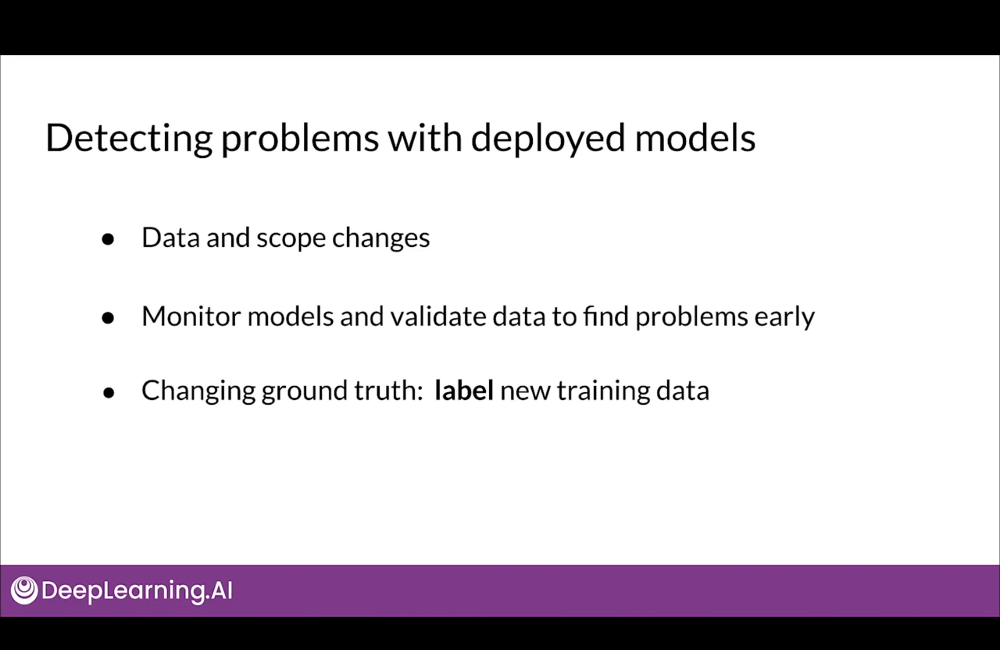

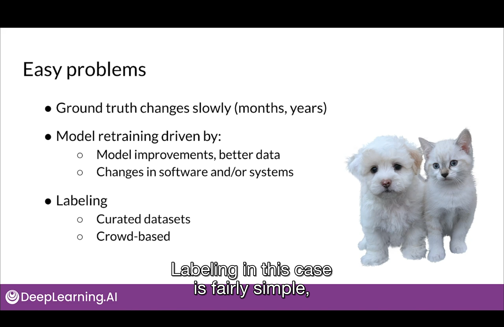

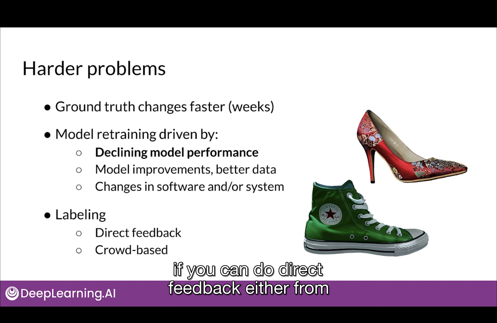

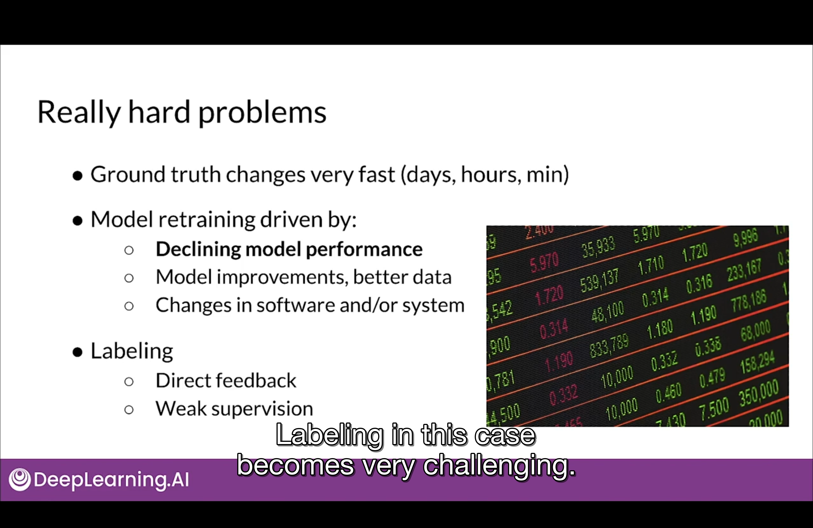

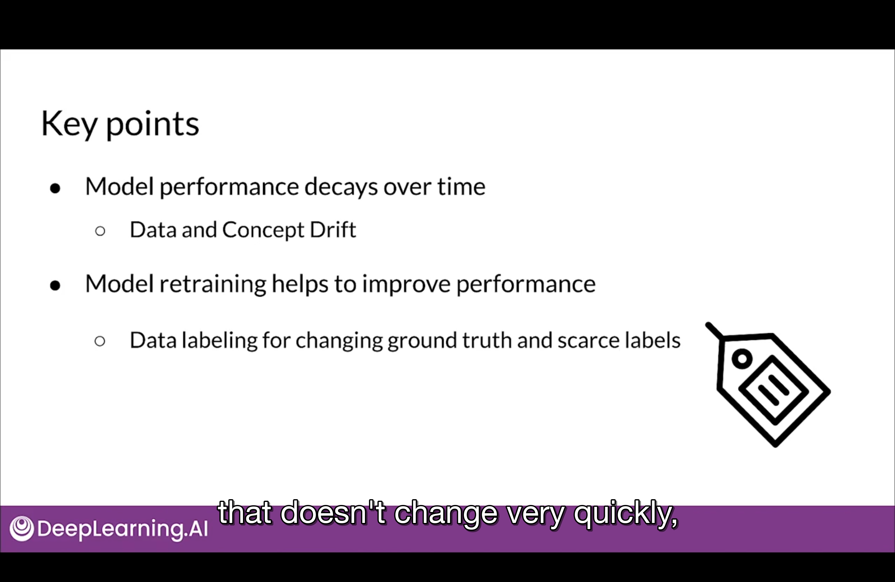
   
In our discussion of labeling data, let's take a look at data and concept change in production ML. We're going to be talking about detecting problems with deployed models. Really that focuses on two things, data change and concept change or world change. There's different kinds of this. We've talked about a little bit of this, we'll get into it some more. There are different kinds of changing ground truth. There's easy problems, there's harder problems, and then you get really hard problems and you need different approaches to deal with these. Let's look at them. Detecting problems with deployed models, you can look at the data and the scope of the data and the world in a couple of different ways, but fundamentally, you need to monitor your models and you need to validate the results and the data of your models to find problems. You want to try to find problems early especially with system problems that happen quickly like a bad sensor or things like that, that we've discussed. But a fundamental issue is changing ground truth. What that means is that you need to label new data over the life of your application. It depends on really the domain that you're working in and the kinds of problems that you're trying to solve as far as what approaches are really feasible for doing that. There are easy problems. Things like, trying to recognize images of cats and dogs. In this case, the ground truth really changes pretty slowly. Model retraining in those cases is usually driven by model improvements, you are better at recognizing cats or dogs, or whatever it is that you're doing. You could have changes in software too. You could be upgrading things or using a different library, that kind of thing, or systems. Labeling in this case is fairly simple, you're going to work with maybe a curated dataset that you're getting from some public domain source or a source that your organization has been using for awhile or you could look at crowd-based as well. If it tends to be fairly simple, things like feedback, of course, if you have those available, great, use them. Use what you can. Then we get into a little harder problems where the ground truth really changes faster. Things like styles. We looked at shoes, but there's a lot of things where styles. The world changes on a matter of maybe weeks, that kind of thing. Model retraining in that case is usually driven by declining model performance, which you need to measure if you're going to be aware of. You can also have model improvements, you can also have better data and of course, the software and systems you're running on can also change. But as these things get harder, you get more things and declining model performance is one of those. Labeling in this case, if you can do direct feedback either from your systems or from your users, that's great. Crowd-based human labeling is another feasible way of doing this, since you do have probably weeks to respond. You can take a pass through human raters to do that. Really hard problems though, it becomes well, really hard. In this case, ground truth changes very fast, like on order of days or hours or even minutes. Things like markets really fall into this category, they change very quickly. In this case, declining model performance is definitely going to be a driver for when you need to retrain your model. You can also have things like model improvements and changes in software and so forth, but those tend to be things that you'll be working on offline while you're keeping your application running. It's really model performance where you really need well-defined processes to deal with those changes. Labeling in this case becomes very challenging. Direct feedback is great if you can do it in your domain. If not, you need to look at things like week supervision that we'll talk about. But it's really challenging in these kinds of domains. They tend to be high-value domains. Things like predicting markets where there's significant incentive to doing these predictions. The key points of what we're talking about here, model performance decays over time. It may decay slowly over time, in things like cats and dogs, that doesn't change very quickly, or it may change very fast, things like markets. Model retraining will help you improve or maintain your performance. Certainly as your model performance decays, it'll help you do that. Data labeling, assuming you're doing supervised learning, which is pretty common, data labeling is a key part of that. You really need to think about how you're going to approach that in your particular problem, in your particular domain and with the systems that you have available to you.
   

9.    

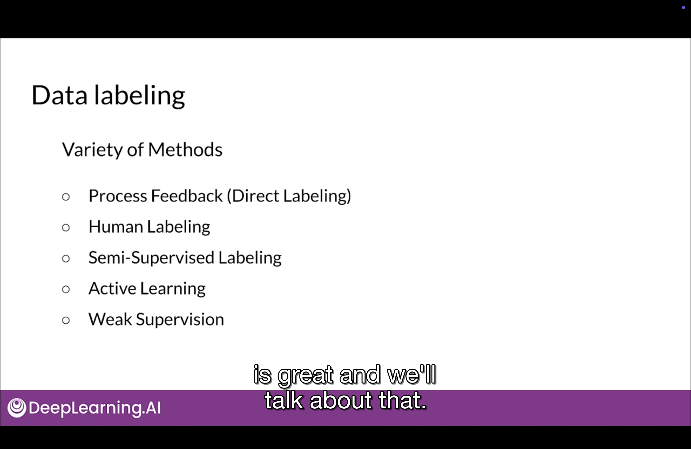

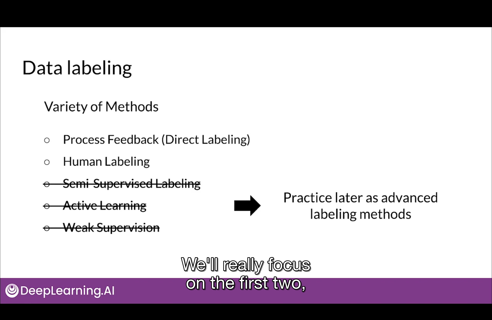

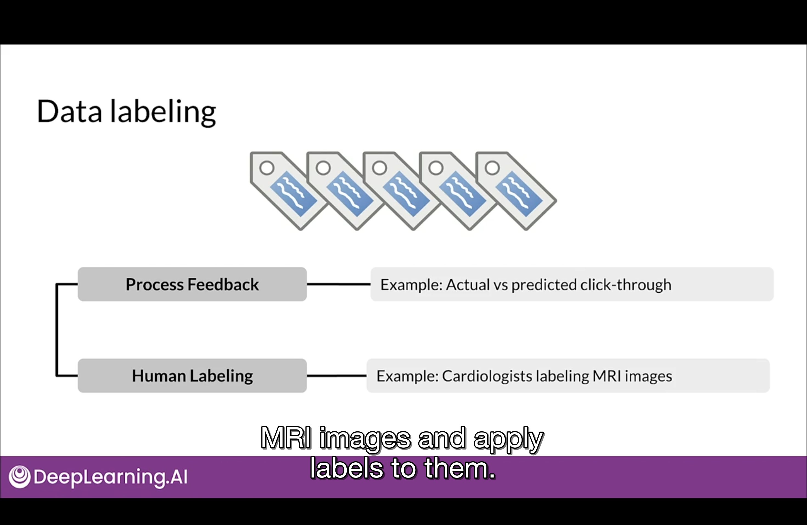

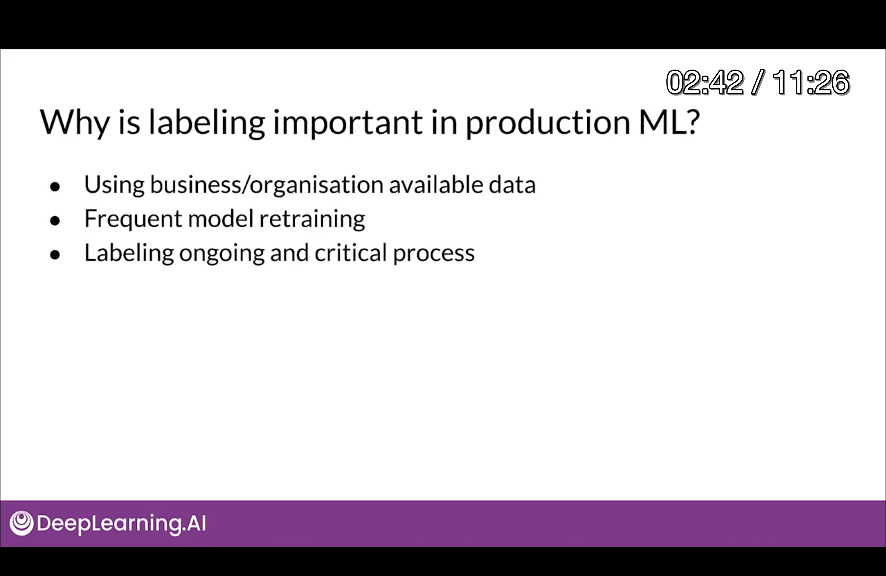

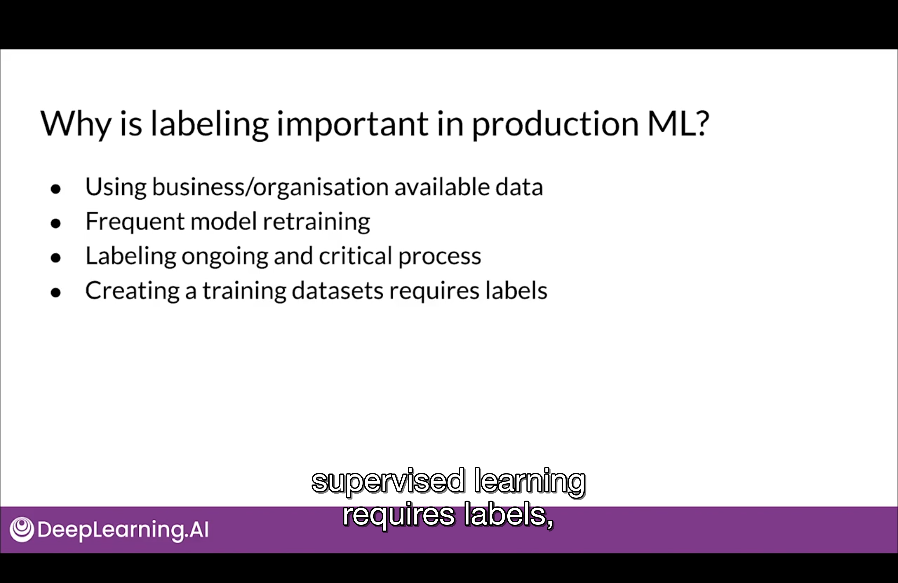

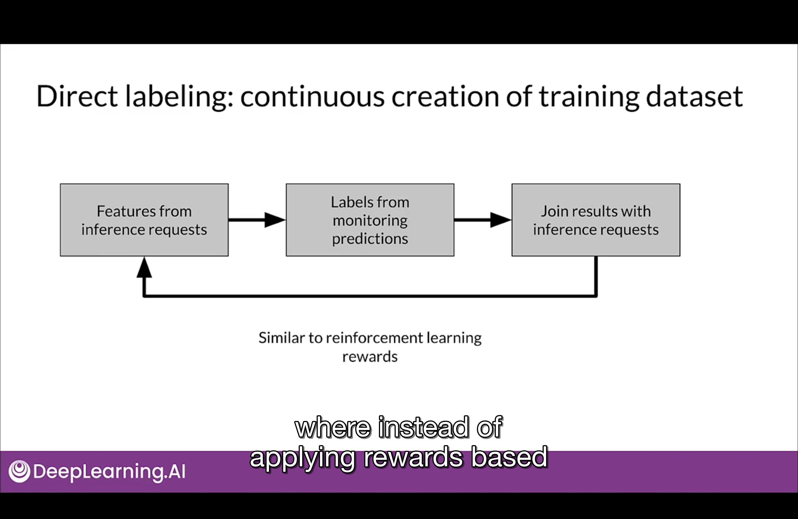

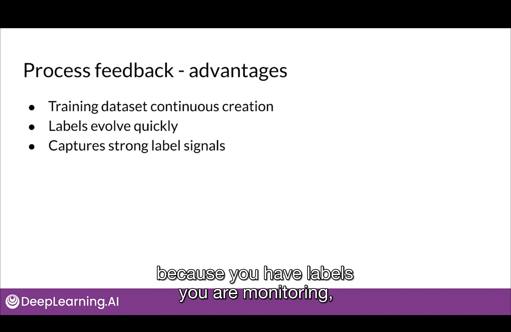


Let's look at some ways to generate labels for your data. We're going to focus on two of the most common methods. That's process feedback or direct labeling and human labeling. There's a variety of methods, process feedback or direct labeling is great and we'll talk about that. Human labeling as well as a very common method is applied to create labels. But you should also be aware and we'll talk about later some other more advanced methods, semi-supervised labeling, where we label part of our data set, active learning where we really try to focus on the part that is most important. Weak supervision which is a programmatic way of creating labels. But we won't be talking about that in this module. We'll really focus on the first two, which are the most common, process feedback or direct labeling and human labeling. You need labels if you're going to do supervised learning, you need labels for your data. Two simple ways of doing that are processed feedback and human labeling. But what does that mean? Let's look at some examples, for process feedback, a very typical example is click-through rates. Actual versus predicted click-through rates. Suppose you have recommendations that you are giving to a user, did they actually click on the things that you recommend? If they did, you can label it positive, if they didn't you can label it negative. Human labeling, you can have humans look at data and apply labels to them. For example, you can ask cardiologists to look at MRI images and apply labels to them. Why is labeling important in production ML? Most businesses and organizations have a bunch of data, but if it's not labeled, you can't use it for supervised learning. If you can apply unsupervised techniques and get good results, that's great. But in many cases you really need to provide learning to solve the problems that you're trying to solve. What that means is that in most domains you're going to need to retrain at some point. It will depend as we've talked about on the domain that you're working in and the type of problem. Some you will just need to retrain on a very infrequent basis, and some, you might need to retrain several times per day. Labeling is an ongoing and often critical process in your application and your business. But at the end of the day, creating a training data set for supervised learning requires labels, you need to think about how you're going to do that. Direct labeling, which we'll talk about first or process feedback, is a way of continuously creating new training data that you're going to use to retrain your model. You're taking the features themselves from the inference requests that your model is getting. The predictions that your model is being asked to make and the features that are provided for that. You get labels for those inference requests by monitoring systems and using the feedback from those systems to label that data. One of the things that you need to solve there is to join the results that you get from monitoring those systems with the original inference request which could be hours or days apart. You might've run batches on Monday and you're getting feedback on Friday. You need to make sure that you can do those joins to apply those labels. In some ways you can think about this as similar to reinforcement learning, where instead of applying rewards based on action you're applying labels based on a prediction. It's a similar feedback loop. The advantages, well process feedback or direct labeling is great. If your system and your domain is set up in a way that you can do that. It's often the best answer because you have labels you are monitoring, constantly getting new training data. The signals that you get from your labels are really strong. You're getting for click-throughs, if the user clicked or didn't click, it's a very strong signal. Disadvantages, unfortunately, in many domains for many problems, it's just isn't possible. Personally, in the problems I've been asked to solve, I found very few or I've been able to do that, so that's an issue. The other big thing is that it tends to be very custom-designed. Your systems will be unique. Your problem is unique, and you're doing custom design, which isn't the end of the world, but it'd be great if it was a little bit more off the shelf. One of the tools that you can apply is log analysis tools. Because often when you're doing process feedback, the data is coming from the log files. You're monitoring systems and populating log files. One good open source tool for doing that is Logstash. You can ingest from multiple sources for collecting and parsing and storing logs. You can index them in ElasticSearch. You can push them to storage, it takes inputs from a variety of different sources and databases and so forth. Great tool and it's open source too. Fluentd is another good open source tool you can use to collect and parse. Fluentd comes from the Cloud Native Computing Foundation and it connects to a lot of different platforms. Again, another great tool. When you're working on the Cloud, there's Cloud tools that are available, as well. If you're working on the Google Cloud, Google Cloud logging is a great tool to be able to log your data, either coming from Google Cloud or from AWS. Bind plane is great for applying on-premise or hybrid cloud systems. It's a very powerful service that's available. For AWS, their version of Elasticsearch is available, so you can apply that. It's not really strictly a log analytics tool but you can apply it for login analytics. For Azure, you have Azure monitors, so regardless of which Cloud you're working on, there's probably log analytics tooling that you can use to do log analysis. Now, let's turn to human labeling. In human labeling, you have people, humans and we refer to those as raters. We ask them to examine data and assign labels to it. It sounds simple, it sounds like it might be painful but it's the way that a lot of data is generated and labeled. You start with raw data and you give it to people and you ask them to apply labels to it. That's the way that you create a training data set that you're going to use to train or retrain your model. You started with unlabeled data and then you need to recruit human raters or there are several services that you can go to where they have pools of human raters that have already been recruited. You need to provide them with instructions. Even if it's very simple, you need to still tell them what labels they should apply and what to look for to decide which label to apply. The data's then divided among different raters in the pool. Often you send the same examples to multiple raters, so that when there's disagreements you're aware of that and you can work to resolve them. Then you collect the data and any of those conflicts that you have are resolved. Advantages of the human labeling. Well, they're labels which, it's what you're trying to do. You're trying to generate labels which you need for supervised learning. It's a way to do that and it's actually a very common way to do that. One disadvantage, one issue here is that depending on the data that you have it can be very complex for a human to look at it and decide what the label should be. Something like this we might need a radiologist to look at this and tell us what the right labels should be which can be very expensive. But if you're also talking about situations where you have high dimensional data, it's very difficult for humans to look at say, 100 different features and decide with the label is. There's some disadvantages to human labeling. You can have quality problems where different humans disagree on what the label should be. It can be very slow. You're asking people to look at each individual example and it can take a while to do that. In cases where the data's changing quickly, it is often just simply not feasible. Again, it can be very expensive even if you're using generalists to look at very simple data, you're still employing people but in cases where you're asking experts to look at data then it gets very expensive. Often what that means is that you end up with small data sets because the cost and the time involved results in difficult to get a very large data set. It can be slow, it can be difficult, it can be expensive. If you're doing something like an MRI and you've got a specialist looking at it again, a problem. A single rater can only do a certain number of examples per day, so you need to have a fairly large pool compared to the number of examples that you're trying to label and that means that recruitment can be slow and expensive. Unfortunately, there are several disadvantages. Key points here, there's various methods of doing labeling and you really need to think about the problem that you're trying to solve, the data that you have and how frequently you need retraining data and how much data you need and the costs involved. There are advantages and disadvantages to both process feedback in human labeling and there's other techniques, as well that we'll talk about later.

10.   


Hello and welcome back. You've probably heard the phrase garbage in, garbage out. Well, that's very true for Production ML. You can have a live data. But if your data isn't good, well it's not good for ML either. How do you know? How do you know your data is good or isn't good? Let's find out right now. Now let's look at validating data and detecting data issues and really look at trying to understand what issues we need to deal with. We need to detect data issues, and we often talk about drift and skew. We're going to be discussing Data and concept Drift and Schema Skew and Distribution Skew, and how to go about conceptually detecting data issues. First of all, let's get some definitions out of the way, drift and skew. Drift is changes in data over time. For example, data collected once a day over time, maybe a week later, a month later, there are changes that data has drifted. Skew is the difference between two static versions from different sources of conceptually the same dataset. For example, it could be the difference between your training set and the data that you're getting for prediction requests, your serving set. Those differences are referred to as skew. In a typical ML pipeline, this shows batch processing, but it could also be online processing. You'll have different sources of data that are conceptually the same. They have the same feature vector, but over time they will change. That means that model performance can either drop quickly due to things like system failure or can decay over time due to changes in the data and things like changes in the world. We're going to focus on performance decay over time that arises due to issues between training and serving data. There's really two main reasons for that. There's Data drift, which are changes in the data between training and serving typically and Concept drift, which are changes in the world changes in the ground truth. To understand model decay over time, an ML model will start to perform poorly in many cases and we refer to this as model decay. That's usually or often caused by drift, which is changes in a conceptual way. There is changes in the statistical properties of the features. It's sometimes due to things like seasonality or trend or unexpected events, or just changes in the world. This example here, we're looking at an app that during training the app classified as a spammer, any user who is sending 20 or more messages per minute. We classified anybody like that as a spammer. But after a system update which you see as labeled on the chart there, both spammers and non-spammers start to send more messages. In this case, the data, the world has changed and that causes unwanted misclassification. We have all of our users are classified as spammers which they probably won't like. Concept drift is a change in the statistical properties of the labels over time. At training, an ML model learns a mapping between the features and the labels. In a static world that's fine, that won't change. But in real-world, distribution and the labels meaning will change. The model needs to change as well as the mapping found during training will no longer be valid. As you previously see, there are many factors that cause changes over time including upstream data changes and seasonality and evolving business processes. Schema skew occurs when the training and scheming as serving data do not conform to the same schema, which you might think could never happen but actually it can because you're collecting data and things change and suddenly you're getting an integer where are you expecting a float. Or you're getting a string where you are expecting a category. Distributions skew is a divergence of training and serving data sets. The data set shift can be really manifested by covariant and concept and other types of shifts. We'll talk about that in a second. Skew detection involves continuous evaluation of data coming to your server once you train your model. To detect these changes, you need continuous monitoring and evaluation of the data. Let's take a look at a more rigorous definition of the drift and skew that we're talking. Dataset shift occurs when the joint probability of x are features and y are labels is not the same during training and serving. The data has shifted over time. Covariate shift refers to the change in distribution of the input variables present in training and serving data. In other words, it's where the marginal distribution of x are features is not the same during training and serving, but the conditional distribution remains unchanged. Concept shift refers to a change in the relationship between the input and output variables as opposed to the differences in the Data Distribution or input itself. In other words, it's when the conditional distribution of y are labels given x are features is not the same during training and serving, but the marginal distribution of x are features remains unchanged. There's a straightforward workflow to detect data skew. The first stage is looking at training data and computing baseline statistics and a reference schema. Then you do basically the same with your serving data, you're going to generate the descriptive statistics. Then you compare the two. You compare your serving baseline statistics and instances. You check for differences between that and your training data. You look for skew and drift. Significant changes become anomalies and they'll trigger an alert. That alert goes to whoever's monitoring system, that can either be a human or another system to analyze the change and decide on the proper course of action. That's got to be the remediation of the way that you're going to fix and react to that problem.

11.   


Now that you've seen some of the data issues and detection workflows and got an idea of the importance of productions scale data validation. Let's take a look at TensorFlow Data Validation, which is a library from Google as part of the TFX Ecosystem. It'll allow you to do data validation using Python and we'll do an exercise doing that. TensorFlow Data Validation or TFDV, helps developers understand, validate, and monitor their ML data at scale. TFDV is used to analyze and validate petabytes of data at Google every day across hundreds or thousands of different applications that are currently in production. TFDV helps TFX users maintain the health of their ML pipelines. TFDV helps generate data statistics and provides browser visualizations. It also helps infer the schema for your data, but you will need to make sure that that schema makes sense. It'll do an inference that is best effort. Once it has these statistics and schema, it can look for problems are anomalies in your data. Then it will look at the training serving skew by comparing the data in your training and your serving datasets. One of the common use cases is continuously checking newly arriving data by validating it against the expectations which you have in the reference schema that you generated from your training data. The typical setup uses the schema, which is maintained over time, and the statistics are computed over new data and those statistics are used to validate the data against the original schema. Remember, we talked about skew detection and with TFDV you can easily detect three different types of skew, schema skew, feature skew, and distributions skew. TFDV performs skew or drift detection on categorical features and skew is expressed in terms of an L-infinity distance, which is also known as Chebyshev distance. If you think of a chessboard, it's the distance metric that is the maximum absolute distance in one-dimension of two n-dimensional points. You can set thresholds so that you'll receive warnings when the drift is higher than what you think is acceptable. Schema skew occurs when the serving and training data don't conform to the same schema. For example, it could be a change in type, an int, where you're expecting a float, which could be a change in the feature itself. Feature skew are changes in the feature values between training and serving. It could happen as the system uses different data sources during training and serving or things change or of course, things like seasonality and trend as well. Sometimes that simply because you have two different code paths and you're trying to do the same transformations, both when you trained your model and when you're serving your model using two different code paths and you're getting different results as a consequence. There's ways to avoid doing that and we'll talk about that later. Distribution skew is changes in the distribution of individual features in the dataset. Features that's in training might have a range of 0-100 when you're training it and then at serving time, you're seeing data between 5-600. That would be a change in the distribution for that feature. You got to have things like changes is the mean or the median or the standard deviation changes, all of those are changes in distribution. Depending on how severe it is, it may or may not be a problem. The question is, does it affect your model performance enough that you need to make changes to try to account for it? TFDV provides you with descriptive statistics at scale. Remember, we could be working with petabytes of data. It provides some visualizations as well to help you monitor and really understand that data. Trying to understand the underlying statistics for your data and do comparisons. How does your training and evaluation and serving datasets compare? Just in terms of statistics, for example, do they have the same mean? How can you calculate and fix or detect rather and fix data anomalies. We did a lot here. Just to wrap up, this week, you saw differences between ML modeling in academic or research environments and production ML systems. We discussed responsible data collection and how to really approach building a fair production ML system. We learned about process feedback and direct labeling and also human labeling. We looked at some of the issues that you can have with data and how to identify and detect those issues. Now, we're going to be practicing Data Validation with TFDV, TensorFlow Data Validation in this week's exercise notebook. You'll be testing your skills with the programming assignment by generating datasets, statistics, and creating and comparing and updating data schemas. Good luck.
 

12.   


 
Hello and welcome to feature engineering, transformation and selection. Now, some of this material may seem like it's review, especially from earlier courses or if you've worked in an academic or research setting. But here, we're going to be focusing on production issues, one of which means being able to do all of this at scale in a reproducible and consistent way, so let's get started. Welcome to feature engineering, transformation and selection, we'll start with an introduction to pre-processing. There's a quote from Andrew Ng, coming up with features is difficult, time consuming and requires expert knowledge. Applied machine learning often requires careful engineering of the features and data set. So now let's take a look at what we're going to be talking about, first, we're going to look at how to get the most out of our data and we'll take a look at the art and it really, it is an art of feature engineer. We'll look at the future engineering process itself and how feature engineering is done in a typical ML pipeline. So let's start with how we're going to squeeze information really out of our data. So, Emma models usually require some data pre processing to improve training and you should probably by now have been training models that this is very familiar to you. What may not be quite so familiar are some of the issues that are involved in production environments, so that's where we'll focus. The way that data is represented can really have a big influence on how a model is able to learn from it. For example, models tend to converge much faster and more reliably when numerical data has been normalized. So techniques for selecting and transforming the input data are key to increase the predictive quality of the models and dimensionality reduction is recommended whenever possible. So that the most relevant information is preserved, while both the representation and prediction ability are enhanced and the required compute resources are reduced. Remember, in production ML compute resources are a key contributor to the cost of running a model, so let's kind of take a conceptual look at feature engineering here. The art of feature engineering tries to improve your model's ability to learn while reducing if possible, the compute resources it requires, it does this by transforming and projecting, eliminating and or combining the features in your raw data to form a new version of your data set. So typically across the ML pipeline, you incorporate the original features often transformed or projected to a new space and or combinations of your features. Objective function must be properly tuned to make sure your model is heading in the right direction and that is consistent with your feature engineering. You can also update your model by adding new features from the set of data that is available to you unlike many things in ML, this tends to be an iterative process that gradually improves your results as you iterate or you hope it does. You have to monitor that and if it's not improving, maybe back up and take another approach. Feature engineering is usually applied in two fairly different ways, during training, you usually have the entire data set available to you. So you can use global properties of individual features in your feature engineering transformations. For example, you can compute the standard deviation of a feature and then use that to perform normalization. However, when you serve your trained model, you must do the same feature engineering so that you give your model the same types of data that it was trained on. For example, if you created a one hot vector for a categorical feature when you trained, you need to also create an equivalent one hot vector when you serve your model. However, during training and serving, you typically process each request individually, so it's important that you include global properties of your features, such as the standard deviation. If you use it during training include that with the feature engineering that you do when serving, failing to do that right is a very common source of problems in production systems, and often these errors are difficult to find. So to review some key points, as the quote from Andrew Ng demonstrates, feature engineering can be very difficult and time consuming but it is also very important to success. You want to squeeze the most out of your data and you do that using feature engineering, by doing that, you enable your models to learn better. You also want to make sure that you concentrate predictive information, your data into as few features as possible to make the best and least expensive use of your compute resources. And you need to make sure that you apply the same feature engineering during serving as you applied during training.

13.   


  

Now let's talk specifically about some of the preprocessing Operations that are used for Feature Engineering. Let me tell you a story. Once when I was first starting out, I was in a hurry and I got the idea, well, I can just skip normalizing my data. I did that. I trained my Model and gosh, it wasn't converging. I tried like adjusting hyperparameters and changing the layers of the Model and looking for issues with the data. It took me a while to remember. Oh yeah, I didn't normalize. Meaning that had an impact. Well, I haven't made that particular mistake again, but, I've made other mistakes instead. Let's hope you don't. First, let's go over what we're going to be talking about. We're going to be going into the main Preprocessing Operations. Obviously this is not going to be an exhaustive list. There's a lot of things you can do to data, but we'll cover some of the main ones anyway. It's going to start, of course, with Mapping raw data into features. Then we're going to look at different features like numerical features and categorical feature. Trying to understand how our knowledge of the data helps guide the way that we transform our features and Engineer better features. Here's some of the main Preprocessing Operation. One of the most important Preprocessing Operations is Data cleansing, which in broad terms consists in eliminating or correcting erroneous data. You'll often need to perform transformations on your data, so scaling or normalizing your numeric values, for example. Since models, especially neural networks, are sensitive to the amplitude or range of numerical features, data preprocessing helps Machine Learning build better predictive Models. Dimensionality reduction involves reducing the number of features by creating lower dimension and more robust data represents. Feature construction can be used to create new features by using several different techniques, which we'll talk about some of them. This is an example of data that we have. We're looking at a house. This is data from a house, but this is only what we start with. The raw data. Feature Engineering because it's in performing an analysis of the raw data and then creating a feature vector from it. For example, integer data can be mapped to floats, and numerical data can be normalized. One-hot vectors can be created from categorical values. Feature Engineering creates features from raw data and you're probably familiar with this. In this example, we're going to take a categorical feature called Street name. We're going to one-hot encoded as a way to make it better for a Model to learn from. We're going to take that string feature, one-hot encoded through Feature Engineering and we get that feature of our Feature Vector through one-hot encoding. But creating a vocabulary is another way to do that. There's a couple of different ways. Tensorflow provides three different functions for creating columns of categorical vocabulary and other frameworks do very similar things. Categorical column with vocabulary lists maps each string to an integer based on an explicit vocabulary lists. Feature name is a string which corresponds to the categorical feature and vocabulary list is an ordered list that defines vocabulary. Feature or categorical column with vocabulary file very similar from a file is used when you have two long list and this function allows you to put the words in a separate file. In this case, vocabulary list is defined as a file that will you define the list of words. This is very typical for working with vocabularies. But you also know some things about your data and part of that might be domain knowledge of the domain you're working in, or just knowledge of how to work with different data. There's very different operations and preprocessing techniques that can help you increase the predictive information in say, text data. For text, we have things like stemming and lemmatization and normalization techniques like TF-IDF and n-grams, embeddings and that really focuses on the semantic value of the words. That's something we know as data scientists or Machine Learning Engineers about working with data. Images are similar. There's things that we will know about how we can improve the predictive qualities of images. Things like clipping them, resizing them, cropping them, blurring them can often help using filters like Canny filters or Sobel filters or other photometric distortions. All these things can really help us work with image data to improve its predictive quality. Key points. Data preprocessing is a technique that's used to transform raw data into useful data for training the Model. Feature Engineering consists in mapping raw input data and creating a feature vector from it using different techniques with different kinds of data. It can also include things like mapping data from one space into a different space, which depending on the characteristics of a Model, say a linear Model versus a neural network can have a big difference in how well the Model can learn from it.

14.   


Now let's review some Feature Engineering techniques. Here's what we're going to talk about. There's basic feature scaling, usually, especially with numerical data, where you're really doing is scaling the numerical features in different ways. We'll talk about some of the basics of these like normalization and standardization. You can also do bucketizing or binning and we'll talk about that. That's a useful technique as well. Then some other techniques like dimensionality reduction for example. Let's get started. Feature Engineering takes a variety of forms, normalizing, and scaling features, and coding categorical values and so forth. We have scaling and normalizing and standardizing. We can also do groupings, so that could be bucketizing. Where things like for text, we could do a bag of words. This is going to be very dependent on the particular algorithm that you're going to use. You have to understand the connection between the kinds of scaling or grouping that you do and the algorithms that are going to be using with it. Scaling converts to standard range and different techniques to it differently. For example, a gray-scale image pixel intensity is typically expressed in the raw data as a number between 0-255, and then that's usually re-scale to negative one to one. Here's some Python, for example, for doing that. The benefits of that are, it helps the neural network to converge faster or maybe converge at all. It does away with a lot of the problems with not a number errors during training. For each feature the model is really trying to learn the right way, and having them in the right numerical range, helps a lot with that. Here's the standard formula for normalizing something. It's also called min-max. You're taking your X, you're subtracting the minimum value of that feature. You have to make a full pass over your data set to get that minimum value, and then you subtract that and then you divide by the maximum value minus the minimum value. You're going to need to make a full pass to get those numbers. Then it gives you a number that is between 0-1. Normalizations are usually good if you know that the distribution of your data is not Gaussian. Doesn't always have to be true, but typically that's a good assumption to start with. A good rule of thumb. If you're working with data that you know is not Gaussian, or a normal distribution, then normalization is a good technique to start with. Normalization is widely used for scaling, you have a numerical feature that might start out like this, where numbers are falling and there is a kind of a range. You're going to transform that to the normalized version of that, which is bounded in a range between 0-1. That's normalization. You're probably familiar with this although you may not have thought of some of the production implications like the fact that you need to make a full past career data set in order to get the numbers that you're going to need to perform normalization. The scales here are again, between 0-1 and whatever the original was. Standardization, which is often using a Z-score, is a different technique. It's a way of scaling using the standard deviation. It's looking at the distribution itself and trying to scale relative to that. The example here is using, , and you're going to subtract the mean and divide by the standard deviation. That gives you the Z- score or the standardized value of X. Which is somewhere between zero and the standard deviation. This is how that's expressed, actually between some multiple of the standard deviation. But it's centered around the mean of the data. If the original looked like this, again, a standardized value of that might look like this. Notice that this score is centered on zero, so the mean is translated to zero. But you can have negative values and positive values that are beyond one. It's a little bit less bounded transformation than a normalization is. But there are some advantages to it, that your data is a normal distribution, then a standardization technique is a good place to start, it's a good rule of thumb to start with for your numerical features. But I encourage you to try both standardization and normalization and compare the results. Because sometimes it doesn't make much of a difference. Sometimes it can make a substantial difference. It's good to try both. Moving on into bucketizing and binning. We're going to take a look at an example where we have a house that was built in a particular year and we're going to bucketize that. Often you don't want to enter a number directly into a model. Instead, you want to encode it as a category by grouping it into buckets. You notice how we've taken our number, our year, and we've created a one-hot encoding of that that helps us learn from that number in a more really relevant way because the difference between 1960 and 61 isn't nearly as important as the difference between 1960 and 1970 in terms of the value that this feature contained. Looking at how it gets binned into one-hot encoded vector, you can see it's put it into different buckets. We can also look at that using facets, which is a nice visualization tool to help us look at that. This really demonstrates some of the value of bucketizing and binning, but it also is a good way to look at your data and try to understand it. Which is an important part anytime you're working with data, is making sure that you really have a good solid understanding of what's happening in your data and develop an intuitive sense for it. This kind of visualization can really help you do that. Some other techniques. There's dimensionality reduction techniques, for example, that you can do. There's PCA, which is going to project your data along the principal components in order to reduce the dimensionality of it. There's t-SNE, which is an important technique for embeddings, often very useful. Uniform manifold approximation and projection is a less well-known technique, but interesting and has some interesting aspects. We won't really go into that in detail. Then feature crossing as well. One of the things that you can use when you're working with embeddings is an embedding projector, like the TensorFlow embedding projector that we're looking at here. You can quickly get an idea of what your data looks like at a particular space. That again, is helping you to develop that intuitive sense of your data. You can already see just looking at it, you can get a feel for how it's clustered. You can see where different types of data land in that space. That understanding is very important to help you work with your data. This is really where some of the art of feature engineering comes into play, where you as a developer developed this understanding of your data. As an intuitive exploration, really important for high-dimensional data because we as humans can visualize maybe three dimensions and then it gets really weird. Even four is hard and 20 is impossible. Visualizing it and analyzing it is important. There's different techniques for doing that or for doing dimensionality reduction along that to help you understand that. PCA that you're probably familiar with principal component analysis and t-SNE and UMAP that we just talked about a little bit. Then there's other custom linear projections as well. That TensorFlow embedding projector is available. It's free, you can go play with it. It's actually a lot of fun, but it's also a great tool to really help you understand your data. There's the address for it if you want to learn more. Key points for this particular section, feature engineering. It's going to prepare and tune and transform and extract and construct features where we're going to work with features and change them starting with our raw data through to the data that we're going to give to our model. Feature engineering is very important for model refinement. Really, it can make the difference between successfully modeling something and not. Feature engineering really helps with ML Analysis and really developing that intuitive understanding of our data.

15.   
 


  
   
Now let's take a look at Feature Crosses. Feature Crosses is the main thing that we're going to be talking about in this section. We're also going to take a quick look at encoding features. What are Feature crosses? Well, they combine multiple features together into a new feature. That's fundamentally what a feature across. It encodes non-linearity in the feature space, or encodes the same information and fewer features. We can create many different kinds of feature crosses and it really depends on our data. It requires a little bit of imagination to look for ways to try to do that, to combine the features that we have. For example, if we have numerical features, we could multiply two features and produce one feature that has an expression of those two features. X number of features, we could multiply them all together if there are numerical features and then end up with one feature instead of say five. That's great. We can also take categorical features or even numerical features and combine them in ways that make a semantic sense. Taking the day of the week and hour, if those are two different features that we have, putting those together, we can express that as the hour of the week and we have the same information in one feature. To encode features, well, let's look at some examples. Suppose we have a data-set that's looking at healthy trees and sick tree. We're going to use a scatter-plot to try to understand our data. We're looking at the scatter plot and we use some visualization tools, and we ask ourselves, can we draw a line to separate these two groups, these two clusters? If we can use a line to create the decision boundary, then we know that we can use a linear model. That's great. In this case, looking at this, we could use a line to do that separation. That's great. Linear models are very efficient. We love that, but let's suppose the data looks like this. Not so easy anymore. This becomes a non-linear program. Then the question is, can we project this data into a linear space and use it with a linear model, or do we have to use a non-linear model to work with this data? Because if we try to draw just a linear classification boundary with a data as is, it doesn't really work too great. Again, we can use visualization tools to help us understand this. Looking at our data really helps inform us and guide the choices that we make as developers about what kind of models we choose and what feature engineering we apply. Key points here, Feature Crossing as a way to create synthetic features, often encoding non-linearity in the features space. We're going to transform both categorical and numerical. We could do that in, into either continuous variables or the other way around.

16.   


 

We've probably all done feature engineering before, but it's one thing to do it in a notebook with maybe a few 100 megabytes of data. And quite another thing to do it in a production environment with maybe a couple of terabytes of data in a repeatable automated process. Let's take a look now at how to do feature engineering at scale, okay? So it's one thing to do transformations and feature engineering on a one off basis saying a notebook. But it's another thing to do it at scale in a production environment in a reproducible and repeatable and consistent way. So let's take a look now at pre processing data at scale. So first let me tell you a story. I once worked as a data scientist in a production environment where we were deploying our workloads are production workloads on Apache Storm and it it was a nice platform. The performance was was pretty good on it. We as data scientists created our models in notebooks and then deployed them into Apache Storm. Well it wasn't quite that simple. We were developing our notebooks in python and then when we deployed into storm we had to translate all of the feature engineering that we did into java. Well, as you can imagine, that was not ideal and there were little weird problems that cropped up often very difficult to find doing that transformation. This is not an ideal way to do production machine learning. So what is much better technique is to use a pipeline, a unified framework where you can both train and deploy with consistent and reproducible results. So we'll be learning about that in this course. Let's take a look now at some of the issues of doing feature engineering at scale. So here's what we're going to be talking about inconsistencies in feature engineering very important. Preprocessing granularity. Also an interesting issue, working in production environment. Preprocessing the training data set is one thing and optimizing the instance level transformations for that is, something kind of different. But there's a number of challenges that you need to deal with. So to preprocessed data at scale, we start with real world models and these could be terabytes of data. So when you're doing this kind of kind of work, you want to start with a subset of your data work out. As many issues as you can think about how that's going to scale up to the terabytes that you you need to actually work with your whole dataset. Large scale data processing frameworks are no different than what you're going to use, on your laptop or in a notebook or what have you. So you need to start thinking about that from the beginning of the process, how this is going to be applied and the earlier you can start working with those frameworks. The more you work out the issues early with smaller datasets and quicker turnaround time, consistent transformations between training and serving are incredibly important. If you do different transformations when you're serving your model than you did when you were training, your model, you are going to have problems and often those problems are very hard to find. So inconsistencies and feature engineering the training and serving code paths. When you are training your model, you have code that you're using for training. If you're using different code, like we were we were using python for training and java for serving, that's a potential source of problems. So, and you could have different deployment scenarios. You you might be deploying your model for in different environments. You you could be using the same model, say, in a servant cluster and using it on an IOT device as well. So there's different deployment targets and you need to think about those and what are the CPU resources or the compute resources that you have available on those targets. So mobile, for example, very tight compute resources, servers, you have more luxury, but again, cost is a big factor and in a web browser, that could be deployed on different clients. So you need to think about that as well. You don't want to be too heavy. Though, there's risks in introducing training, serving skews. So that's what happens because of those different code paths between training and serving. If you don't have exactly the same transformation is happening between the two and the best way to do that is used exactly the same code. Then you have a potential problem and that's going to lower the performance of your model. So your model may, completely just error out or give wacky results or it may be just slightly off in certain circumstances and display sensitivity around certain things. Those things are much harder to detect. So there is a notion of the granularity at which you're doing preprocessing. So you need to think about this, you're going to do transformations, both the instance level and a full pass over your data. And depending on the transformation that you're doing, you may be doing it in one or the other. You can usually always do instance level. But full path requires that you have the whole dataset. So for clipping, even for clipping, you need to set clipping boundaries. If you're not doing that through some arbitrary setting of those boundaries, if you're using the data set itself to determine how to clip, then you're going to need to do a full pass. So min max for clipping is is going to be important. Doing a multiplication at the instance level is fine, but scaling well now I'm going to need probably the standard deviation and maybe the min and max. Bucketizing similarly, unless I know ahead of time what buckets are going to be, I'm going to need to do a full pass to find what buckets makes sense. Expanding features I can probably do that at the instance level. So these two things are different at training time. I have the whole dataset so I can do a full pass, although it can be expensive to do that. At serving time, I get individual examples, so I can only really do instance level. So anything I need to do that requires characteristics of the whole dataset. I need to have that saved off so I can use it at serving time. So when do you transform, you're going to pre-process your training dataset and there's pros and cons in how you do that. First of all, you you don't you only run once per training session, so that's cool. And you're going to compute it on the entire dataset, but but only once, for each training session. The Collins well, you're going to have to reproduce all those transformations that serving or save off the information that you learned about the data, like the standard deviation. So that you can use that later while you're serving. And there's, slower iterations around this. Each each time you make a change, you've got to make a full pass over the dataset. So you can do this within the model. Transforming within the model has some nice features to there are cons as well. First of all it makes iteration somewhat easier because it's embedded as part of your model and there's guarantees around the transformation that you're doing. But the cons are it can be expensive to do those transforms, especially when, your compute resources are limited. And think about when you do a transform within the model, you're going to do that same transform at serving time. So you may have say GPUs or TPUs when you're training, you may not when you're serving. So there's long model latency, that's when you're serving your model, if you're doing a lot of transformation with it that can slow down the response time for your model and increase latency. And, you can have transformations per batch that that skew that we talked about. If you haven't saved those constants that you need, that could be an issue. You can also transform per batch instead of for the entire dataset. So you could for example, normalize features by their average within the batch. That only requires you to make a pass over each batch and not the full data set, which when you're working with terabytes of data. That can be a significant advantage in terms of processing. And there's ways to normalize per batch as well. So you can compute an average and use that and normalization per batch and then do it again for the next batch there will be differences batch to batch. Sometimes that's good in cases. So for example where you have changes over time in a time series, that can be a good thing but you need to consider that. So normalizing by the average per batch, precompeting the average and using it during normalization, you can use it for multiple batches for example. So this is different ways to try to think about how to work with your data when you, especially when you have a large dataset. You need to think about optimizing the instance level transformations as well because this is going to affect both the training efficiency and you're serving efficiency. So you're going to have accelerators that you need to consider. They may be sitting idle while your CPU is doing transforms. That's something that you want to try to avoid because accelerators tend to be expensive. So as a solution you can prefetch your your transformations and use your accelerators more efficiently. So by prefetching you can prefetch with your CPU feed your your accelerator your GPU or CPU and try to paralyze that processing. So again this all gets down to cost and how much it costs to train and and the time required as well to train your model and how efficient it is. So to summarize the challenges we have to balance the predictive performance of our model and the requirements for it. Making folks passed transformations on the training data is one thing. If we're going to do that then we need to think about how that works when we serve our model as well and save those constants. And we want to optimize the instance level transformations for better training efficiency. So things like prefetching can really help with that. So key points, inconsistent data affects the accuracy of the results. So scalable data processing frameworks allows to process large datasets and distributed inefficient ways. But we also need to think about how that gets applied in serving.

17.   
   


To do pre-processing at scale, we need good tools. TensorFlow Transform is one of the best tools available today. Let's take a look. First of all, here's what we're going to be talking about. We are going to go a bit deeper into how transform works, what it does, and why it does it. We are going to look at the benefits of using TensorFlow Transform and how it applies feature transformations, and we are going to look at some of the analyzers, and the role they play in doing pre-processing. Let's talk about transform. First off, it does what you might think it would do, it takes Training Data, and it's going to process it. The end result is going to be deployed into the Serving System. In the middle, there's a PIPELINE that is used, and there is METADATA that forms a key role in organizing and managing the artifacts that are produced as data is transformed. One of the reasons that's important, is because, we want to understand the lineage or provenance of those artifacts, and be able to connect them, and find the chain of operations that generated each of them. We have our Training Data, that is the input data into the system that forms an artifact, we give that to Transform and it transforms our data. It's going to take our raw data and move it into the form that we're actually going to use at our feature engineering. That's given to the Trainer which is going to do training. Transform and Trainer here are both components in a ML pipeline, specifically a TFX ML pipeline. These are the Trainer, of course as a Trained Model, that is also an artifact. That gets delivered to the serving system or whatever system we're using, where it's going to be used to run inference. Looking at this a little differently, we're starting with our training and eval data. We've actually split our dataset. We split it with ExampleGen, so ExampleGen does that split. Those get fed to StatisticsGen. These are both TFX components within a TFX pipeline, so ExampleGen is component, StatisticsGen is a component. StatisticsGen calculates statistics for our data. For each of the features, if they're numeric features, for example, what is the mean of that feature value? What is the standard deviation? The min, the max, so forth. Those statistics get fed to SchemaGen which infers the types of each of our features. That creates a schema that is then used by downstream components including Example Validator, which takes those statistics and that schema, and it looks for problems in our data. We won't go into great detail here about the things that it looks for, but if we have examples that are the wrong type in a particular feature, so maybe we have an integer where we expected a float. Now, we're getting into transform. Transform is going to take the schema that was generated on the original split dataset, and it's going to do our feature engineering. Transform is where the feature engineering happen. That gets given the Trainer, there's Evaluator that evaluates the results, a set of Pusher that pushes it to our deployment targets which is, however we're serving our models, so TENSORFLOW SERVING, or JS, or LITE, wherever it is that we're serving our model. Internally, if we want to look at the transform component, it's getting inputs from, as we saw, ExampleGen and SchemaGen. That is the data that was originally split by Example Gen, and the schema that was generated by SchemaGen. That schema, by the way, may very well have been reviewed and improved by a developer who knew more about what to expect from the data than can be really inferred by SchemaGen. That's referred to as curating the schema. Transform gets that and it also gets a lot of user code because we need to express the feature engineering we want to do. If we're going to normalize a feature, we need to give it user code to tell transform to do that. The result is a TensorFlow graph, which were referred to as the transform graph and the transform data itself. The graph expresses all of the transformations that we are doing on our data, has a TensorFlow graph. The transform data is simply the result of doing all those transformations. Those are given to trainer, which is going to use the transformed data for training and it's going to include the transform graph and we'll take a look at that in a second. We have a user provided transform component and we have a schema for it. We apply our transformations during training and as we'll see later, we also apply those transformations at serving time. There's a lot of perform optimizations that we apply as well, and we'll take a look at that in a second. Continuing a little deeper here, we have our raw data and we have our transform component. It produces a TensorFlow graph. The result of running that graph is processed data, it's been transformed. That gets given in model training, as processed data is given to our trainer component, where we use it for training our model. Training our model creates a TensorFlow graph. Notice now we have two different graphs. We have a graph here from transform and a graph here from training. Using the Tf Transform API, we expressed the feature engineering that we want to do and we give that code, or rather the transform component gives that code to a Apache Beam distributed processing cluster. That way we can do, and remember this is all designed to work with potentially terabytes of data. That could be quite a bit of processing to do all of that transformation using a distributed processing cluster by using Apache Beam gives us the capacity to do that. The result is a saved model. Saved model is just a format that expresses a trained model as saved model. That gets included, we have both the transform graph and the training graph. Those are given to our serving infrastructure. Now we have both of those graphs, the feature engineering that we did, and the model itself, the trained model and those are used when we serve requests. Looking at this a little differently, we have analyzers. Again, we're using TensorFlow and we're using the TensorFlow Transform API. We're using TensorFlow Ops and a big part of what they do, what an analyzer does is it makes a full pass over our dataset in order to collect constants that we're going to need when we do feature engineering. For example, if we're going to do a min-max, well, we need to make a full pass through our data to know what the min and the max are for each feature that we're using for that. Those are constants that we need to express. We're going to use an analyzer to make that pass over the data and collect those constants. It's also going to express the operations that we're going to do. They behave like TensorFlow Ops, but they only were on once during training and then they're saved off as a graph. For example, if we're using the tft.min, which is one of the methods in the transform STK, it'll compute the minimum of a tensor over the training dataset. Looking at how that gets applied, we have the graph that is our feature engineering. We run an analysis across our dataset to collect the constants that we need. Really what we're doing is we're enabling us later to apply these into our Transform graph, so that we can transform individual examples without making a pass over our entire dataset. That gets applied during training, and the same exact graph gets applied during serving. There is no potential here for training and serving skew or having different code paths when we train our model versus when we serve our model that cause problems and those not be equivalent. We're using exactly the same graph in both places, so there is no potential for doing that. What is the benefits of that? Well, the emitted graph that Transform emits is it has all necessary constants and transformations that we're going to need. The focus is on data pre-processing only at training time. It's doing that processing as well as generating that graph. Have works in-line during both training and serving, we prepend it to our trained model. There's really no need for pre-processing code at serving time. It consistently applies those transformations irrespective of the deployment platform. Remember, we could be deploying our model to a TensorFlow server or a mobile device using TensorFlow Lite or a web browser using TensorFlow Jazz. Using the same TensorFlow graph in all places, we're going to get exactly the same transformations. The Analyzers framework itself has some different aspects. First of all, you can do scaling. Things like scaling with a z-score or just scaling between zero and one, bucketizing. We're going to bucketize the quantiles, for example. We're going to set up a set of buckets and then we're going to take those values that we have and assign them to the bucket so that we have categorical values for numerical ranges of value or vocabularies. Things like running [inaudible] for example, bag of words or n-grams. Intact processing need to work with vocabulary. You could do dimensionality reduction too. You can do a PCA Transform to reduce the dimensionality of your data. Now let's look at some code. We're going to create a pre-processing function. This is the entry point that we're going to use to define the user code that expresses the feature engineering they're going to do. For example, we may make a pass over our data to look for floats. For our floats, we're going to scale those using a z-score. This is just an example. You're going to do whatever feature engineering you have to do, but it's this style of code that you're working with, and this is of course, Python. A vocabulary very similar. If we have vocabulary features or that we want to use with vocabulary, we would do this thing. These constants here are lists of the keys for each of the features that we want a grip into that particular transformation. Bucket features, exactly the same thing. That bucket feature key is constant, is just a list of the keys for the features that we want to bucketize. Imports, well, you're going to import TensorFlow, obviously. Apache Beam, you're going to need that because remember, Transform is going to use Apache Beam to distribute processing across a cluster. Now you can also just use Beam on a single system or you can just run it on your laptop. It has something called the DirectRunner. You don't need to actually set up a cluster. You can just run it, and there's nothing to move infrastructure to setup. In development that's pretty useful. In a deployment, unless you're working with a small amount of data, you probably want more compute horsepower than that, apache_beam.io.iobase is part of that. It helps us with IO in different formats and different ways reading and writing. TensorFlow Transform itself, obviously. Often we use the abbreviation of TFT for that. Then Transform itself has a Beam part of its modules. It's often nice to pull out separately and work with. Those are usually the basic imports that we need to work with Transform.

18.   
  


   
Now let's put this all together and look at a Hello world example with tensorflow Transform. So here's what we're going to do. We're going to collect some raw data and we're going to define the metadata around that data. Then we're going to run transform to transform the that raw data into features and that's going to produce a graph and we're going to in the background, we're going to be running analyzers and using tf.Transform. So we start with collecting our raw data which in this case is very simple, it's just some static data that we've created for the example. So we have three different features here, x, y and s. So we express the types of those features and information about them as metadata. So we're going to import the metadata module with intensive transform and we're going to express that metadata using a feature spe. So we can create a feature spec that expresses some information about our our feature. So this is telling us that, why is afloat feature first of all, and then it's a fixed length feature. So this is not a for example a sparse feature or ragged tensor, it's fixed length feature. So both y and x, or fixed length float features and then s, is a string feature also fixed length. So now we go this is our preprocessing function. This is where our user code is going to go. It's the entry point for our user code anyway, so you can see here we're pulling the values for x y and s from our inputs and then we're going to do some transformations. These are very simple transformation. So going to center x and that's going to require the mean. So that in the background without us thinking about it really is going to make a pass over the data or as it makes the pass, it's going to collect that means so we can use it here. We're also going to do a normalization using very simple scale to between zero and one. So that's our y normalize again going to need a pass over the data to do that. That's going to be the same pass, it only does one pass. And then we're going to take that string feature that we have s and we're going to create a vocabulary for it and apply it so that we get an integer value for for s, a vocabulary. And then we create a feature cross, so this is purely synthetic feature. So we're using our value for x, that we've centered in our value for y that we've normalized. And we're creating a synthetic feature called appropriately x centered times y normalized which is verbose but accurate. Okay, and then that's going to return well, the values that we just created so that's our feature engineering. We took in raw data and here are transformed features that we've created. We've engineered these features. So again we took tensors in, so for x we took integer values and for s we took strings and for y we also took integer values. Those passed through the code that we wrote to express our feature engineering. The entry point of that was the pre processing function. And coming out of that we get our engineered features including the vocabulary version of our string feature that we have created vocabulary for. So now we're going to run our code to do the processing that requires us to create a main in this case because we're just using pure tensorflow transform as a library to run our feature engineering. I want to point out though typically you would often be doing this in a TFX pipeline using a transform component. The code is really the same in the preprocessing function that we just looked at. But here it's a little bit different because we're running in tensorflow transform and not in a transform component in a TFX pipeline. So this is one of the ways that you can run transform. I just want to make you aware that this part that we're looking at here is not how it looks, when you run it in TFX. So here we're using we're just running it inside a main function and we're going to do that using Apache beam. That's going to require us to establish a context for Apache beam. And then we're going to define a beam pipeline using the beam python syntax, which is a little bit different than you might expect. One of the things to get used to here is the pipe operator. So what that says is I'm going to run tft beam. I've established that in the context, I'm going to use the analyze and transform data set to run my preprocessing function. That's going to return a result actually in this case is a tuple result. So it's going to return both the raw data and the raw data metadata. So this python syntax is a little bit different than what you might be used to for python that is specific to Apache be. So we have our transformed data, we have our transform metadata and we get that from our transformed data set. So we can print out the raw data and the transform data and run our main so before we ran transform we had features like this. After running transform we have features like this. So that's our transformation, we've we've transformed between our raw data and our engineer data. Yeah so, key points on this Hello world example of using tensorflow transform actually outside of tfx, although you would often be running this as part of the tfx transform component, it allows preprocessing on the input data and creating the features. Well, that's what transform is for. It's the feature engineering that we're going to do. It allows defining preprocessing pipelines that are going to run and and do their execution on large scale data processing frameworks using Apache beam. Apache beam runs on top of other frameworks like spark or flank or google cloud data flow or actually just on your laptop, using what's called the direct runner. In a tfx pipeline the transform component implements feature engineering using tensorflow transform. So the transform component is built using the transformed library, the tensorflow transformed library.
  
19.   
   


What are the important aspects of shaping your data is to consider the feature space that your data covers? Let's take a look. So here's what we're going to be talking about. First of all just an introduction to feature spaces and then an introduction to feature selection as well. We'll talk about filter methods and wrapper methods and embedded methods. Those are methods of feature selection. In this first section, we're really just looking at feature spaces. So what are feature spaces? Well, a feature space is defined by the n dimensional space that your features defined. So if you have two features, a feature space is two dimensional. If you have three features, its three dimensional and so forth, it does not include the target label. So that we're just talking about your features. So if this is your feature factor, you have future vector X. And it has values from zero to D. Here. That's the dimensionality of that vector. And that defines a space. So in this case that's a three D space. We have three features. We have a 3D. Space, or if we're looking at it in a 2D space with with a two dimensional feature vector, we could express it as a scatter plot with a 2D space. Those are fairly easy for us as humans to imagine. So looking at it a little differently. Here's an example using features that you might have for a house, so the number of rooms for the house or actually any kind of building really the square footage of it where it's located in a price. So maybe we're trying to figure out how sales. So in this case, the F is your model and it's acting in your feature space and it's going to produce a result Y, looking at a classification situation or problem we have again. So this is going to be a two dimensional space. We have different distributions of the examples within our feature space. In an ideal case, they're easy separable, ideally with a linear function in a realistic case. Well, maybe we can do that with a linear function if we sort of fudge around some of the some of the examples and then we have, poor examples where it's difficult to do with a linear function. We're working in a non linear feature space and and, maybe we can use a projection to help with that. Or maybe we just have to use a non-linear model, but we're, what we're going to try to do is draw a boundary within that feature space. So, here's a case where we're drawing, maybe a parametric boundary. But the model is going to try to learn that decision boundary. The boundary is used to classify the data points. So that's what our model is learning as a result of knowing where that boundary is. It can take an example that is given to it and decide in this case which class it falls into. So feature space coverage is important. The examples that you give to your data to your model rather to train and for evaluation have to be representative of the examples that you're going to see when you serve your model. In other words, the requests that are going to be given to your model and where they fall in your feature space, that region of your feature space has to be covered when you train and evaluate your model as well. So that means the same numerical ranges were for classes the same classes and you need similar characteristics for image data as well. So it's not quite so, numerical but it's still expressing a space and similarly for vocabulary. In this case we have syntax and semantics that we have to consider as well for natural language problems. So we need to ensure that we covered the same space. If we're doing time series problem, we need to consider seasonality trend and drift. And that includes for the serving data, we may have new values that we find in new labels that's going to influence the concept drift as as we've talked about previously, so we need to be aware of that and design processes to deal with that. That means we need continuous monitoring, which is going to be a key for success in these situations. Remember as we've talked about before, the world changes and our model only learns one version of the world. So when the world has changed, we need to update our model to the new world.

20.   


Now, let's talk about feature selection. What is feature selection? Well, we have a number of features and as it turns out, we may need some of them and perhaps not all of them. So we try to select which features we actually, need and eliminate the features that we don't need. So that gives us a smaller set of features, which are useful features. The ones that we have selected. Feature selection identifies the features that best represent the relationship between the features, and the target that we're trying to predict. So, it removes features that don't influence the outcome. That reduces the size of the feature space. So remember, depending on the number of features in the feature vector, that defines the size of a space. Every time we add a feature, the space increases exponentially. So we want to try to reduce the number of features. That reduces the resource requirements for processing our data, and the model complexity as well. So why is feature selection needed? Well, we want to reduce storage and I/O requirements, that's part of it. Less features means smaller data. And we want to minimize the training, and inference costs. Especially in many cases the inference costs, because we may be serving millions of requests with once we have trained our model, and each one of those costs a certain amount to serve. So, there's different ways to do feature selection. First of all, you can do unsupervised feature selection, meaning you don't have to or doesn't account really for the labels, or supervised feature selection. So, it is going to use the information in the labels. So for unsupervised feature selection it takes the features, and the target variable relationship is not considered. It removes the redundant features which in unsupervised, really means looking for correlation. When you have two features or more than two features that are highly correlated, you really only need one of those, and you're going to select the one that probably gives you the best result. For supervised feature selection, it is going to use the target relationship. So the relationship between each of the features, and the target or label. So it's going to select those features, that contribute most to correctly predicting the target. So let's take a look at some supervised methods. We're going to use feature selection, and there's different methods to do that filter methods, wrapper methods, and embedded methods. For a practical example, we're going to work with a dataset from breast cancer diagnostic. So this is going to be the data set we're going to use for looking at several different kinds of feature selection, but this is going to be our example. So we're going to try to predict whether the tumor is benign or malignant, and that gives you some notion of how cancer reproduces. This is our feature list, and as you can see we've created and assigned an id for our example. And we also have an irrelevant feature that's been added here, so that we have something there. This is just an example, usually it's not quite so obvious as something named unnamed 32, but you do often see not a number of values. So that's often a clue or missing values, that's often a clue that you have an irrelevant feature. And for performance evaluation, will start as a baseline value. We're going to use a random forest classifier, using sklearn to work with our selected features. And we're going to use some metrics for that. So that's going to include the accuracy score, the AUC score, the precision, recall, and F1. So, this is our baseline here with all 30 features. It gives us for each of those metrics, the values that we get for all 30 features

21.   


Let's start with filter methods. Filter methods are one of the supervised methods of doing feature selection, which includes wrapper methods and embedded methods also. But for filter methods, we're primarily using correlation to look for the features that contain the information that we're going to use to predict our target. Univariate feature selection is also very often used for efficiency really. Let's take a look at some filter methods. Correlated features are usually redundant as we just talked about. When you have to features that are highly correlated with each other, that usually is an indicator that they're redundant. You want to choose one of those so you remove the other one. Popular filter methods include Pearson correlation. These are different ways to do correlation. Pearson correlation is one. That's correlation between features and between the features and the label. That's why it's a supervised method. You can also do univariate feature selection which is very common. Filter methods; well, we are going to start with all of the features and we're going to select the best subset and we're going to give those to our model and that's going to give us our performance for the model with this subset of our features. One of the ways to visualize this is really correlation matrix. We can look for features where we can see that there is a correlation between two or more of our features. It helps show how features are related, both to each other and with the target variable and to emphasize that, when they're unrelated to each other, that's bad. You only want one of those and of course, you do want it correlated with a target. That's going to fall in a range of correlation between negative 1 and one and one is highly positive correlation and negative 1 is highly negative correlation. Comparing the different tests, you have Pearson's correlation for linear relationships. That's by far I think the most common. Kendall Tau is a rank correlation coefficient, looks at monotonic relationships, and it's usually used with a fairly small sample size for efficiency. Spearman's is another one. It's also rank correlation and it also is looking at monotonic relationship. Other methods; well, there's mutual information. Mutual information has some nice characteristics to it. F-test, that's another fairly common one and chi-squared. Chi-square is also a fairly common one. Looking at how we would do this in code, let's just take a look using Pearson's correlation. This is going to use pandas. We have a data frame and we're using the Pearsoncorrelation.cor method. That gives us our correlation and we can then draw our heat map with seaborn and that's what that's going to look like. That gives us our correlation matrix. Looking at it again, we've got the absolute value of that and we can select our target. That gives us our result with a subset of our features that we've selected. In this case, we've eliminated seven features because they were correlated. Now, we have instead of 30, we have 21 features in our feature vector. The accuracy is actually better, the AUC is actually better, precision is actually better and recall is exactly the same. At least have five decimal places. The F1 score is a little better. Removing features, mostly almost all our metrics improved. That also goes along with the improvements that we made in the compute resources that are required to process 21 features instead of 30. That's our best result so far. Let's look at univariate feature selection. Univariate feature selection and we're going to do that using Sci-kit learn. There's SelectKBest, there's SelectPercentile, GenericUnivariateSelect, which is fairly generic I assume. Some statistical tests we can use with that, there's mutual information and F-tests for regression problems. For classification, we have chi-squared and there's a version of the F-test for classification and similarly for mutual information, there's a version of that for classification. Let's look at how that gets implemented in code. We've got a function that we're going to define for univariate selection. It's going to take our test set, actually our training set has been split for both training and test and then that's going to be scaled with a standard scalar and we're going to use the MinMaxScalar as well to give us a scaled x and then our selector we're going to use is the SelectKBest and we're going to use that with the chi-squared test and that's going to look for the 20 best features here. We're going to fit that transform, we're going to get the features that it selects and we're going to drop the other features in our original data set. That gives us the feature names of the features that we've selected. How does that perform? Well, a univariate test using chi-squared, we asked for 20 features, so it gave us 20 features. The accuracy dropped a little bit, so did the AUC, so did the precision, but recall interestingly did not, its still exactly the same and the F1 score is unfortunately a little bit lower. The correlation is still our best result. It's one more feature, but it's still our best result.

22.   


Let's look at some wrapper methods. Wrapper methods work all differently. It stores supervised method, but we're going to use this with a model and there's different ways to do it. But basically you're iterating through, it's a search method against the features that you have using a model as the measure of their effectiveness. We can do it through forward elimination and we'll talk about this in a second. Forward elimination, backward elimination or recurrent feature elimination. Let's take a look at these. We start with all of our feature, regenerate a subset of those features, and we'll talk about how that gets generated, that gets given to our model. The results that is generated from that model is then used to generate the next subset. That becomes this feedback loop to select the best subset of our features using our model as a measure. That gives us the performance of the final best subset that is selected. There's different wrapper methods, forward selection and backwards selection and recursive feature selection or recursive feature elimination rather, these can all be used to select a subset that we just looked at through each iteration of that feedback loop. For forward selection it's an iterative, greedy method. We start with one feature, it's greedy, and then we evaluate the model performance and we add one at a time features. We're adding, we're gradually building up this feature vector, one feature at a time, starting with just one feature. We try to add the next feature that gives the best performance, but we're going to measure that to see what the result is. We keep repeating this until there's no improvement and then we know that we've generated the best subset of our feature. Backward elimination, well, if you think about it, we just looked at forward elimination. Backward elimination starts with all of the features and evaluates the model performance when removing feature. It's exactly what you might think from the name one at a time. We remove the next feature, trying to get to better performance with less features and we keep doing that until there's no improvement. Recursive feature elimination, we select a model to use for evaluating feature importance. We select the desired number of features and we fit them up. We rank the features by importance. We need to have a method of assigning importance to those features and then we discard the least important features. We keep doing that until we get down to the number of features that we're looking to target. An important aspect of this is that we need to have a measurement of feature importance in our model and not all models are able to do that. For recursive feature elimination, this is what the code might look like. Again, we're pulling in our data and splitting it with train and test, and pulling out the labels from our data as well. We have X and Y, why you're going to scale it because it's always a good idea. Then we're going to use a random forest classifier. A random forest classifier is one of the model types where we can get the feature importance. In this case we're using entropy as the metric and we're initializing it with a random state. We're going to apply our random feature elimination trying to get to 20 features with our model that gets fitted. That's going to do that elimination and that results in the list of features that we've selected. Those are the names of the features that we've selected, the 20 features that we were looking for to eliminate all but 20 of our features. Then we're going to use that to do the evaluation to get the final value. How does that look compared to our other examples? Well, so recursive feature elimination also got two of our 20 features. The accuracy was quite a bit better than it was for univariate, in fact, it's as good as correlation. The AUC also as good as correlation, which is great. The precision also as good, I would say as correlation, it doesn't go quite so far out, but that's for precision. For recall, exactly the same, for the F1 score is actually slightly better. I mean, just barely, but slightly better. We've gotten to fewer features, we did it with 20 features instead of 21 for correlation. That recursive feature elimination is now our best result.

23.   


Now let's look at some Embedded Methods. So, what are embedded methods? Well, it's a again, a supervised method of Features Selection. And we've looked at Filter Methods. We've looked at Wrapper Methods. Let's look at Embedded Methods. So L1 or L2 regularization is essentially an embedded method for doing feature selection. Feature importance is another method. Both of these are highly connected to the model that you're using. So these both L1 regularization and feature importance really sort of an intrinsic characteristic of the model that you're working with. So it assigns scores. And for regularization really, we're talking about waiting for each feature in the data. And it discards features often by by setting those weights to zero or near zero. And that's going to eliminate the features that we're talking about based on the feature essentially the feature important. So look at that in SKLearn, if we look at Feature Importance class, that's built into the Tree Based Model. So, again, we're still using the RandomForestClassifier that we've been using all along. That's one of the model types that does include feature importance. It's available as a property of that model, the feature importances. And we can use SelectFromModel to select the features from the train model based on the assigned feature importances. So again, working with the model, it's really a characteristic of the model. How does that look in code? Well, we're going to define a function. Feature importance is from Tree Based Model and here's our data, it's been split into training and test and we've separated our labels. We're going to use our RandomForestClassifier as our model and we're going to fit it. And then we're going to pull out the feature importances here. That's going to give us a series that we're going to use a Panda series. That Panda series, we're going to select the 10 best. So the 10 highest feature importances and show that. So if we do that, this is the visualization that we get and we can see the 10 best features that we have based on the feature importance that was calculated in the model. So using that to select those features, we're going to go back and select from our model. That's going to give us our model and we're going to get support to get the indexes for those features. And then we're going to drop the other features from our feature vector. And that's going to give us the names of the features that we're keeping. So tying those together, we've got feature important from tree based model that that's going to give us the feature importances and plot them. Then we're going to select the features that we're going to keep and that's going to give us our performance. So in this case we've selected 14 features and looking at the metrics for them, they're actually not quite as good but they're pretty good. So accuracy. It's now down a little bit. The ROC is up a little bit. It's kind of back to what it was with all features are almost there. Precision is down a little bit but still I mean it's down a little bit. Recall is not bad really because pretty much the same. It is the same and the F1 Score is back to what it was with all of the features. So Recursive Feature Elimination is really still our best result. Although with Feature Importance we were able to get down to 14 features. So this is a question where we need to consider the importance of our metrics versus the importance of reducing our compute resources. If it's really important, that compute resources, we may want to do that with the 14 features that were selected with Feature Importance. But if we're really interested in maintaining those metrics were improving them, then Recursive Feature Elimination is still the best result. Such review. We've covered a lot this week, we started out with an Introduction to Preprocessing. We talked at some length about Feature Engineering and why it's so important to doing machine learning, especially in production settings. We looked at Preprocessing Data at Scale, which is going to be important whenever you're working with large amounts of data or large models and specifically at TensorFlow Transform. We also looked at Feature Spaces and understanding how Feature Spaces work and and why we need to consider that as we do Feature Selection. And we looked at different kinds of Feature Selection. So Filter Methods and Wrapper Methods and Embedded Methods. We've covered a lot about working with our data and doing feature engineering. This has been quite a week so far.

24.   


Hello, and welcome to our continuing saga of data. This week, we'll be talking about several data related topics, including metadata, which is important for understanding our data over time and are training runs. Will also talk about schemas which helped describe our Data. We'll look at some places where we might want to store our data to make it easier to work with. It's a lot to cover. Let's get started. Welcome to Data journey and Data Storage. Let's begin with the Data journey and all it takes to understand this important process. Understanding data provenance requires understanding the Data journey throughout the life cycle of the production pipeline. More specifically, accounting for the evolution of data and models throughout the process. ML metadata is a versatile library to address these challenges, which helps with debugging and reproducibility. Concretely, it allows us to revisit and track data and model changes as they occur during training. Trying to understand data provenance begins with the Data journey. The journey starts with raw features and labels from whatever sources that we have. The Data describes a function that maps the input in the training set to the labels that we're trying to predict. During training, the model learns the functional mapping from the input to the labels so as to be as accurate as possible. The Data transforms and changes as part of this training process. As the Data flows through the process it transforms. Examples of this are, are changing data formats, applying feature engineering and training the model to make predictions. There's a dual connection between understanding these data transformations and interpreting the model's results. Therefore, it's important to track and document these changes closely. Data artifacts are created as pipeline components execute. What exactly is an artifact? Each time a component produces a result, it generates an artifact. This includes basically everything that is produced by the pipeline, including the data in different stages of transformation, often as a result of feature engineering and the model itself and things like the schema, and metrics and so forth. Basically, everything that's produced, every result that is produced as an artifact. The terms data provenance and data lineage are basically synonyms and they're used interchangeably. Data provenance or lineage is a sequence of the artifacts that are created as we move through the pipeline. Those artifacts are associated with a code and components that we create. Tracking those sequences is really key for debugging and understanding the training process and comparing different training runs that may happen months apart. Data provenance matters a great deal and it helps us to understand the pipeline and to perform debugging. Debugging and understanding requires inspecting those artifacts at each point in the training process, which can help us understand how those artifacts were created and what the results actually mean. Provenance will also allow you to track back through a training run from any point in the process. Also, provenance makes it possible to compare training runs, and understand why they produce different results. Under GDPR or the general data protection regulation, organizations are accountable for the origin, changes and location of personal data. Personal data is highly sensitive, so tracking the origins and changes along the pipeline are key for compliance. Data lineage is a great way for businesses and organizations to quickly determined how the Data has been used and which Transformations were performed as the Data moved through the pipeline. Data provenance is key to interpreting model results. Model understanding is related to this, but it's only part of the picture. The model itself is an expression of the data in the training set. In some sense, we can look at the model as a transformation of the Data. Provenance also helps us understand how the model evolves as it is trained and perhaps optimized. Let's add an important ingredient here, tracking different Data versions. Managing a data pipelines is a big challenge as data evolves through the natural life cycle of a project, over many different training runs. A Machine learning when it's done properly, should produce results that can be reproduced fairly consistently. There will naturally be some variance, but the results should be closed. Code version control is probably something you're familiar with. GitHub is one of the most popular cloud-based code repositories, and there are others as well. Environment versioning is also important. Tools like Docker and terraform help us create repeatable environments and configuration. However, data versioning is also important, and plays a significant role for tracking provenance and lineage data versioning. It's essentially version control for data files so that you can trace changes over time and restore previous versions early. But the tools are somewhat different. For one thing, because of the size of files that we deal with, which are typically or can be any way, much larger than a code file would ever be. Tools for data versioning are just starting to become available. These include DVC and Git LFS. LFS for large files Storage.

25.   
  


Now we're going to discuss metadata. Something to think about as we discuss this topic are the legal and regulatory considerations. As machine learning becomes increasingly used to make important business decisions, healthcare decisions and financial decisions, legal liability becomes a factor. Being able to interpret a model and being able to trace back the lineage or provenance of the data that was used to train the model become increasingly important to limiting exposure. Okay, let's go ahead and get started. Now let's start exploring how ML metadata or MLMD can help you with tracking artifacts and pipeline changes during a production life cycle. Every run of a production ML pipeline generates metadata containing information about the various pipeline components and their executions or training runs and the resulting artifacts. For example, trained models. In the event of unexpected pipeline behavior or errors, this metadata can be leveraged to analyze the lineage of pipeline components and to help you debug issues. Think of this metadata as the equivalent of logging in software development. MLMD helps you understand and analyze all the interconnected parts of your ML pipeline, instead of analyzing them in isolation. Now consider the two stages in ML engineering that you've seen so far. First you've done data validation, then you've passed the results onto data transformation or feature engineering. This is the first part of any model training process. But what if you had a centralized repository where every time you run a component, you store the result or the update or any other output of that stage into a repository. So whenever any changes made, which causes a different result, you don't need to worry about the progress you've made so far getting lost. You can examine your previous results to try to understand what happened and make corrections or take advantage of improvements. Let's take a closer look. In addition to the executor where your code runs, each component also includes two additional parts, the driver and publisher. The executor is where the work of the component is done and that's what makes different components different. Whatever input is needed for the executor, is provided by the driver, which gets it from the metadata store. Finally, the publisher will push the results of running the executor back into the metadata store. Most of the time, you won't need to customize the driver or publisher. Creating custom components is almost always done by creating a custom executor. Now, let's look specifically at ML Metadata or MLMD. MLMD is a library for tracking and retrieving metadata associated with ML developer and data scientist workflows. MLMD can be used as an integral part of an ML pipeline or it can be used independently. However, when integrated with an ML pipeline, you may not even explicitly interact with MLMD. Objects which are stored in MLMD are referred to as artifacts. MLMD stores the properties of each artifact in a relational database and stores large objects like data sets on disc or in a file system or block store. When you're working with ML metadata, you need to know how data flows between different successive components. Each step in this data flow is described through an entity that you need to be familiar with. At the highest level of MLMD, there are some data entities that can be considered as units. First, there are artifacts. An artifact is an elementary unit of data that gets fed into the ML metadata store and as the data is consumed as input or generated as output of each component. Next there are executions. Each execution is a record of any component run during the ML pipeline workflow, along with its associated runtime parameters. Any artifact or execution will be associated with only one type of component. Artifacts and executions can be clustered together for each type of component separately. This grouping is referred to as the context. A context may hold the metadata of the projects being run, experiments being conducted, details about pipelines, etc. Each of these units can hold additional data describing it in more detail using properties. Next there are types, previously, you've seen several types of units that get stored inside the ML metadata. Each type includes the properties of that type. Lastly, we have relationships. Relationships store the various units getting generated or consumed when interacting with other units. For example, an event is the record of a relationship between an artifact and an execution. So, ML metadata stores a wide range of information about the results of the components and execution runs of a pipeline. It stores artifacts and it stores the executions of each component in the pipeline. It also stores the lineage information for each artifact that is generated. All of this information is represented in metadata objects and this metadata is stored in a back end storage solution. Let's take a look at the architecture of ML metadata or MLMD. On the top are the various components present in any ML pipeline. All of these components are individually connected to a centralized metadata store of ML metadata, so that each component can independently access the metadata at any stage of the pipeline. An ML pipeline may optionally have a GUI console that can access the data from the metadata store directly to track the progress of each component. At the heart of the metadata store is the artifact which is described by its corresponding artifact type. Artifacts become the inputs to any pipeline components which depend on them. And the corresponding use of artifacts by components is recorded in executions. The input of an artifact into a component is described by an input event and the corresponding output of a new artifact from the component is described by an output event. This interaction between artifacts and executions is represented by context through the relationships of attribution and association. Lastly, all of the data generated by the metadata store is stored in various types of back end storage like SQLite and MySQL and large objects are stored in a file system or block store. Let's review. You learned a lot about the architecture and nomenclature of ML metadata or MLMD and the artifacts and entities which it contains. This should give you some idea of how you can leverage MLMD to track metadata and the results flowing through your pipeline to better understand your training process, both now and in previous training runs of your pipeline.

26.   
  


Now, let's take a look at using ML Metadata with a coding example. Besides data lineage and provenance tracking, you get several other benefits through ML Metadata. This includes the ability to construct a directed acyclic graph or DAG, of the component executions occurring in a pipeline, which can be useful for debugging purposes. Through this, you can verify which inputs have been used in an execution. You can also summarize all the artifacts belonging to a specific type generated after a series of experiments. For example, you can list all of the models that have been trained. You can then compare them to evaluate your various training runs. Now, let's get started with writing code for ML Metadata. You may have to install ML Metadata, which you can do using PIP as shown here. Then there are two imports from ML Metadata which are used frequently, the ML Metadata store itself and the ML Metadata store PB2, which is a protocol buffer or protobuf. Start by setting up the storage backend. ML Metadata store is the database where ML Metadata registers all of the metadata associated with your project. ML Metadata provides APIs to connect with a fake database for quick prototyping, SQLite and MySQL. We also need a block store or file system where ML Metadata stores large objects like datasets. Let's quickly explore the first three options. For any storage backend, you'll need to create a connection config object using the metadata store PB2 protobuf. Then, based on your choice of storage backend, you need to configure this connection object. Here you're signaling that your fake database is in parent, which is the primary memory of the system on which it's running. Finally, you create the store object passing in the connection config. Regardless of what storage or database you use, the store object is a key part of how you interact with ML Metadata. To use SQLite, you start by creating a connection config again then you configure the connection config object with the location of your SQLite file. Make sure to provide that with the relevant read and write permissions based on your application. Finally, you create the store object passing in the connection config. As you might imagine, using MySQL is very similar, you start by creating a connection config. Your connection config object should be configured with the relevant host name, the port number, the database location, username, and password of your MySQL database user and that's shown here. Finally, you create the store object passing in the connection config. Now, that the storage backend is configured, it's time to use ML Metadata to solve a problem. Let's go over a workflow using TFTV. We're going to use that in conjunction with ML Metadata. The choice here is a tabular dataset containing many features. In the lab, ML Metadata is explicitly programmed because in a full-fledged ML Pipeline, ML Metadata is intrinsically capable enough to understand the flow of data between various components and perform its necessary duties. To help you better understand ML Metadata, you'll be using it outside of a pipeline. The lab also shows ML Metadata integration with TensorFlow Data Validation or TFTP. By the end of the lab, you should have some intuition about how ML Metadata can keep track of progress and how you can use ML Metadata to track your training process and pipeline. Let's review the key points which we covered in this lesson. First, you learned about data lineage and provenance to address data evolution over the ML Pipeline lifecycle. Then you went over metadata for tracking those data changes. Then you inspected the architecture of the ML Metadata library. Finally, in the ungraded lab, you read an example to register artifacts, executions, and contexts.

27.   


Now let's discuss schema development. In this lesson on evolving data, you'll learn about developing enterprise schema environments and how to iteratively create and maintain enterprise data schemas. You'll be using schemas quite extensively. Let's quickly review what a schema is and how helpful they are in the context of production ML. Schemas are relational objects summarizing the features in a given dataset or project. They include the feature name, the feature of variable type. For example, an integer, float, string or categorical variable. Whether or not the feature is required. The valency of the feature, which applies to features with multiple values like lists or array features, and expresses the minimum and maximum number of values. Information about the range and categories and feature default values. Schemas are important, as your data and feature set evolves over time. From your experience, you know that data keeps changing and this change often results in change distributions. Let's focus on how to observe data that has changed as it keeps evolving. Changing data often results in a new schema being generated. However, there are some special use cases. Imagine that even before you assess the dataset, you have an idea or information about the expected range of values for your features. The initial dataset that you've received is covering only a small range of those values. In that case, it makes sense to adjust or create your schema to reflect the expected range of values for your features. A similar situation may exist for the expected values of categorical features. Besides that, your schema can help you find problems or anomalies in your dataset, such as missing required values or values of the wrong type. All these factors have to be considered when you're designing the schema of your ML pipeline. As data keeps evolving, there are some requirements which must be met in production deployments. Let's consider some important ones. The first factor is reliability. The ML platform of your choice should be resilient to disruptions from inconsistent data. There's no guarantee that you'll receive clean and consistent data every time. In fact, I can almost guarantee you that you won't. Your system needs to be designed to handle that efficiently. Also, your software might generate unexpected runtime errors and your pipeline needs to gracefully handle that also. Problems with misconfiguration should be detected and handled gracefully. Above all, the orchestration of execution among different components in the pipeline should happen smoothly and efficiently. Another factor to consider in your ML pipeline platform is scalability during data evolution. During training, your pipeline may need to handle a large amount of training data well, including keeping expensive accelerators like GPUs and TPUs busy. When you serve your model, especially in online scenarios such as running on a server, you'll almost always have varying levels of request traffic. Your infrastructure needs to scale up and down to meet those latency requirements while minimizing the cost. If your system isn't designed to handle data evolution, it will quickly run into problems. These include the introduction of anomalies in your dataset. Will your system detect those anomalies? Your system and your development process should be designed to treat data errors as first-class citizens in the same way that bugs in your code are treated. In some cases, those anomalies are alerting you that you need to update the schema and accommodate valid changes in your data. The evolution of your schemas can be a useful tool to understand and track the evolution of your data. Also, schemas can be used as key inputs into automated processes that work with your data like automatic feature engineering.

28.   


Let's discuss schema environments. Your business and data will evolve throughout the lifetime of your production pipeline. It's often the case that as your data evolves, your schema evolves also. As you're developing your code to handle changes in your schema, you may have multiple versions of your schema all active at the same time. You may have one schema being used for development, one currently in test, and another currently in production. Having version control for your schemas, just like you do for your code, helps make this manageable. In some cases, you may need to have different schemas to support multiple training and deployment scenarios for different data environments. For example, you may want to use the same model on a server and in a mobile application but imagine that a particular feature is different in those two environments. Maybe in one case it's an integer and the other case it's a float. You need to have a different schema for each to reflect the difference in the data. Along with that, your data's evolving. Potentially, in all your different data environments at once. But at the same time you also needed to check your data for problems or anomalies, and schemas are a key part of checking for anomalies. Let's look at an example of how a schema can help you detect errors in your serving request data and why multiple versions of your schema are important. We'll start by inferring the serving schema and we'll use TensorFlow Data Validation or TFTV to do that. Then we're going to generate statistics for the serving dataset. Then we'll use TFTV to find if there are any problems with this data and visualize the result in a notebook. Look at that. TFTV reports back that there are anomalies in the serving data. Since this is a dataset that contains prediction requests, that's actually not surprising. The label which is cover type is missing, but the schema is telling TFTV that the cover type feature is required. So it's flagging this as an anomaly. How do we fix this problem? In scenarios where you need to maintain multiple types of the same schemas, you often need to keep the schema environment. This is most commonly true of the difference between training and serving data. You can choose to customize your schema based on the situation you're going to handle. For example, in this case, the setup is to maintain two schemas. One for training data, where the label is required and the other for serving where we know we won't have the label. The code for multiple schema environments is fairly straightforward. In our existing environment, we already have a schema for training. We then create two named environments called training and serving. We modify our serving environment by removing the cover type feature. Since we know that in serving, we won't have that in our feature set. Lastly, the code sets up the serving environment and uses it to validate the serving data. Now, there are no anomalies found since we're using the correct schema for our data. Let's review. First we discussed how to iteratively update and fine tune your schema to adapt to evolving data. Then we focused on reliability and scalability during the evolution cycle of data. Then you implemented schema environments to deal with anomalies in your serving data.

29.   


In these next three topics will be talking about data storage. Now there are no assignments for you to turn in for these three segments, but I highly encourage you to take a look. There's some great information here and it's becoming increasingly important, especially the part about feature stores. But depending upon where you are and what you already have, you may have a data warehouse or data lake that you want to leverage. So understanding those becomes important. Okay, let's get started. Now let's turn to the question of where we should store our data. We'll start with a discussion of feature stores. A feature store is a central repository for storing documented, curated and access controlled features. Using a feature store enables teams to share, discover and use highly curated features. A feature store makes it easy to discover and consume that feature and that can be both online or offline for both serving and training. But people often discover is that many modeling problems use identical or similar features. So often the same data is used in multiple modeling scenarios. In many cases, a feature store can be seen as the interface between feature engineering and model development. Feature stores are valuable centralized feature repositories that reduce redundant work. They are also valuable because they enable teams to share data and discover data that is already available. You may have different teams in an organization with different business problems that they're trying to solve. But they're using identical data or data that's very similar. For these reasons, feature stores are becoming the predominant choice for enterprise data storage. For machine learning, for large projects and organizations. Feature stores often allow transformations of data so that you can avoid duplicating that processing in different individual pipelines. The access to the data in feature stores can be controlled based on role based permissions. The data in the feature stores can be aggregated to form new features. It can also be anonymous sized and even purged for things like wipeouts For GDP our compliance, for example. Feature stores typically allow for feature processing offline that can be on a regular basis, maybe on a cron job, for example. Imagine that you're going to run a job to ingest data. And then maybe do some feature engineering on it and produce additional features from it. Maybe for feature crosses, for example, these new features will also be published to the Feature store. You can also integrate that with monitoring tools as your processing and adjusting your data. You could be running monitoring again offline. Those processed features are stored for offline use. They can also be part of a prediction request. But doing a join with the data provided in the prediction request to pull in additional information. Feature metadata allows you to discover the features that you need. The metadata that describes the data that you are keeping is a tool. And often the main tool for trying to discover the data that you're looking for. For online feature usage where predictions must be returned in real time. The latency requirements are typically fairly strict. You're going to need to make sure that you have fast access to that data. If you're going to do a join, for example, maybe with user account information along with individual requests. That join has to happen quickly. That's good, but it's often difficult to compute some of those features in a performant manner online. So having pre computed features is often a good idea. If you pre compute and store those features then you can use them later. And typically that's at fairly low latency. You can also do this in a batch environment. Again, you don't want the latency to be too long, but it probably isn't as strict as an online request. For pre computing and loading, especially things like historical features, it tends to be fairly simple. For historical features in a badger environment, it's also usually straightforward. However, when you're training your model, you need to make sure that you only include data that will be available at the time that a serving request is made. Including data that is only available at some time after a serving request is referred to as time travel. And many feature stores include safeguards to avoid that. Besides it violates the laws of physics and we don't want to do that. You might do pre computing on a clock every few hours or once a day. You're going to use of course, that same data for both training and serving in order to avoid training, serving skew. The goals of most feature stores are providing a unified means of managing featured data. They can scale from a single person up to large enterprises. It needs to be performant and you want to try to use that same data, both when you're training and serving your models. You want consistency and also point in time correct access to feature data. You want to avoid making a prediction, for example, using data that will only be available in the future when you're serving your model. In other words, if you're trying to predict something that will happen tomorrow. You want to make sure that you are not including data from tomorrow. It should only be data from before tomorrow. Most feature stores provide tools to enable discovery and to allow you to document and provide insights into your features.

30.   
 


 
  
Now we're going to discuss data warehouses. Fun fact. I once worked in a warehouse, but it wasn't a data warehouse. It was an industrial tool warehouse. Anyway, let's get started. Data warehouses. Now let's discuss another popular enterprise data storage solution. Data warehouses. Data warehouses were originally developed for big data and business intelligence applications, but they're also valuable tools for production ML. A data warehouse is a technology that aggregates data from one or more sources so that it can be processed and analyzed. A data warehouse is usually meant for long running batch jobs and their storage is optimized for read operations. Data entering into the warehouse may not be in real time. When you're storing data in a data warehouse, your data needs to follow a consistent schema. Let's look at some key features of data warehouses. A data warehouse is subject oriented and the information that's stored in it revolves around a topic. For example, data stored in a data warehouse may be focused on the organization's customers or vendors, or etc. The data in data warehouse may be collected from multiple types of sources, such as relational databases or files and so forth. The data collected in a data warehouse is usually timestamped to maintain the context of when it was generated. Data warehouses are nonvolatile, which means the previous versions of data are not erased when new data is added. That means that you can access the data stored in a data warehouse as a function of time and understand how that data has evolved. Let's look at some advantages of data warehouses. First, data warehouses offer enhanced ability to analyze your data by time stamping your data. A data warehouse can help maintain contexts. When you store your data in a data warehouse, it follows a consistent schema and that helps improve the data quality and consistency. Studies have shown that the return on investment for data warehouses tend to be fairly high for many use cases. Lastly, the read and query efficiency from data warehouses is typically high, giving you fast access to your data. You're probably familiar with databases. A natural question is, what's the difference between a data warehouse and a database? Here are some comparisons. Data warehouses are meant for analyzing data, whereas databases are often used for transaction purposes. Inside a data warehouse, there may be a delay between storing the data and the data getting reflected in the system. But in a database, data is usually available immediately after it's stored. Data warehouses store data as a function of time, and therefore, historical data is also available. Data warehouses are typically capable of storing a larger amount of data compared to databases. Queries in data warehouses are complex in nature and tend to run for a long time. Whereas queries in database are simple and tend to run in real time. Normalization is not necessary for data warehouses, but it should be used with databases.

31.   
 


Now, let's discuss another popular enterprise storage solution, data lakes. A data lake is a system or repository of data stored in its natural and raw format, which is usually in the form of blobs or files. A data lake, like a data warehouse, aggregates data from various sources of enterprise data. A data lake can include structured data like racial databases or semi-structured data like CSV files, or unstructured data like a collection of images or documents, and so forth. Since data lake store data in its raw format, they don't do any processing, and they usually don't follow a schema. How does a data lake differ from a data warehouse? Let's compare the two. The primary difference between them is that in a data warehouse, data is stored in a consistent format which follows a schema, whereas in data lakes, the data is usually in its raw format. In data lakes, the reason for storing the data is often not determined ahead of time. This is usually not the case for a data warehouse, where it's usually stored for a particular purpose. Data warehouses are often used by business professionals as well, whereas data lakes are typically used only by data professionals such as data scientists. Since the data in data warehouses is stored in a consistent format, changes to the data can be complex and costly. Data lakes however are more flexible, and make it easier to make changes to the data. Let's review our discussion of enterprise data storage. First, you learned about feature stores, which are repositories for highly curated feature data, specifically for use in machine learning. You learned about subject-oriented read-optimized data repositories, known as data warehouses. Finally, you explored data lakes, which are repositories for raw and unprocessed data. We've come to the end of another week and we talked about a lot of great stuff this week. ML metadata, working with storage for features stores, schemas, data lakes, and data warehouses. I hope you had fun. I sure did. We'll see you next time.

32.   

Hello and welcome to Advanced Labeling Data Augmentation and Data Pre-processing. This is a lot of great stuff this week so I hope you enjoy it. Welcome back. This week we're going to be talking about Advanced Labeling Techniques, some data augmentation, and more on data pre-processing. Let's get started. We'll start with a discussion of semi-supervised labeling. Let's address an important question first. How can we assign labels in other ways other than going through each example manually? In other words, can we automate the process even at the expense of maybe introducing inaccuracies in the labeling process? This lesson is all about exploring some powerful advanced labeling techniques. The first stop in this journey is exploring how semi-supervised labeling works and how you can use it to improve your model's performance by expanding your labeled dataset. The next stop is active learning, which uses intelligence sampling to assign labels based on the existing data to unlabeled data. The last stop is weak supervision, which is a way to programmatically labeled data, typically by going or using heuristics which are designed by subject matter experts. Snorkel is a friendly framework for applying weak supervision. Let's get started with semi-supervised learning. First, why is advanced labeling important? Well, machine learning is growing everywhere and machine learning requires training data, labeled data, at least if you're doing supervised learning. That means we need labeled training sets. But manually labeling data is often expensive and difficult, while unlabeled data is typically pretty cheap and easy to get. An unlabeled data contains a lot of information that can help improve our model. Advanced labeling techniques help us reduce the cost of labeling data while leveraging the information in large amounts of unlabeled data. With Semi-supervised labeling, you start with a relatively small dataset that's been labeled by humans. Then you'll combine that labeled data with a large amount of unlabeled data, where you'll infer the labels for the unlabeled data by looking at how the different human labeled classes are clustered or structured within the feature space. Then you'll train your model using the combination of the two datasets. This method is based on the assumption that different label classes will cluster together or have some recognizable structure within the feature space. Using Semi-supervised labeling is advantageous for really two main reasons, combining labeled and unlabeled data can improve the accuracy of machine learning models. Getting unlabeled data is often very inexpensive, since it doesn't require people to assign labels. Often unlabeled data is easily available in large quantities. Label propagation is an algorithm that assigns labels to previously unlabeled examples. This makes it a semi-supervised algorithm where a subset of the data points have labels. The algorithm propagates the labels to data points without labels. It does that based on the similarity or community structure of the labeled data points and the unlabeled data points. This similarity or structure is used to assign labels to the unlabeled data. For example, there's graph-based and in this figure you can see some labeled data, the red, blue, and green triangles here, and a lot of unlabeled data, which are the gray circles. With this method, you assign labels to the unlabeled examples based on their neighbors. The labels are then propagated to the rest of the clusters as shown here by the colors. We should mention that there are many different ways to do label propagation. Graph-based label propagation is only one of several techniques. Label propagation itself is considered transductive learning, meaning that we're mapping from the examples themselves without learning a function for the mapping.

33.   

Now let's explore active learning. Active learning is a way to intelligently sample your data. The intelligent sampling selects the unlabeled points that would bring the most predictive value to your model. This is very helpful in a variety of contexts: First of all, limited data budget. It caused money to label data, especially when you're using human experts to look at the data and assign a label to it. For example, maybe in healthcare, active learning helps offset this cost and burden. If you have an imbalanced dataset, active learning is an efficient way to select rare classes at the training stage. If standard sampling techniques don't help with improving accuracy and other target metrics, active learning can find ways to achieve or help achieve the desired accuracy. Active learning strategy works by selecting labeled examples that will best help the model learn. In a fully supervised setting, the training dataset consists of only the examples that you've labeled. In a semi-supervised setting, you leverage those examples to perform some labeled propagation, so that's in addition to active learning. This is the typical active learning lifecycle: you start with a pool of unlabeled data, and then active learning selects a few examples using intelligent sampling, and we'll talk about what intelligent sampling is in a second, and then you annotate the data with human annotators or by leveraging some other technique. This annotation or labeling procedure generates up labeled training dataset. Finally, you use this labeled data to train a model and make predictions. The cycle goes on, but this begs the question, how do we do intelligent sampling? Margin sampling is one widely used technique for doing intelligent sampling. In this example, the data belong to two classes, additionally, they're unlabeled data points. In this setting, the simplest strategy is, we're just going to train a binary linear classifier model that just makes it simple. We're going to just use a linear model for the example. We're going to train that on the labeled data and that's going to give us a decision boundary. Now, among the unlabeled data, the most uncertain point is the one that is closest to the decision boundary. With active learning, you'll select that most uncertain point to be labeled next and added to the dataset. Now, using this new labeled data point as part of the dataset, you retrain the model to learn a new classification boundary. Moving the boundary, the model learns a bit better to separate those classes. Next, you find the most uncertain data point, again, and repeat the process until the model doesn't improve. This plot shows model accuracy as a function of the number of training examples for sampling techniques. The red line shows the results of just selecting points at random to label. The blue and green line shows the performance of two margins sampling algorithms using active learning. As you can see, the margin sampling methods achieve a higher accuracy with fewer training examples than the random sampling technique. But of course, eventually, as a higher percentage of the unlabeled data is labeled with even using random sampling, it will catch up to margin sampling, as we see here, but it requires a lot more data to be labeled. There are several common active learning sampling techniques. With margin sampling, as we just saw, you assign labels to the most uncertain points based on their distance from the decision boundary. With cluster-based sampling, you select a diverse set of points by using clustering methods over your feature space. With query-by-committee, you train several models and select the data points with the highest disagreement among those models. Finally, region-based sampling is a relatively new algorithm. At a high level, this algorithm works by dividing the input space into separate regions and running an active learning algorithm in those regions.

34.   

Now, let's get started with weak supervision. The final advanced labeling technique that we'll be covering. This is a quote from Jeff Dean, who leads the machine learning research group at Google. He's commenting on the cost in terms of both time and labor, of labeling data. He's also commenting specifically on the work to create algorithmic approaches the labeling data. That rely on other sources of information, to produce noisy labels. Weak supervision which we'll discuss now, is the primary way of doing this kind of labeling. So, what is weak supervision? Well, weak supervision is a way to generate labels using information from one or more sources. Usually these are subject matter experts, and usually they're designing heuristics. The resulting labels are noisy rather than the deterministic labels that we're used to. More specifically weak supervision comprises one or more noisy conditional distributions over unlabeled data. And the main objective, is to learn a generative model that determines the relevance of each of these noisy sources. So, you start with unlabeled data for which you don't know the true labels. Then you add to the mix one or more weak supervision sources. These sources are a list of heuristic procedures that implement noisy, and imperfect automated labeling. Subject matter experts are the most common sources for designing these heuristics. Which typically consists of a coverage set, and an expected probability of the true label over the coverage set. By noisy we mean that the label has a certain probability of being correct. Rather than the 100 certainty that were used to, for labels in our labeled data. The main goal is to learn the trustworthiness of each supervision source, and this is done by training a generative model. The Snorkel framework came out of Stanford in 2016 and is the most widely used framework for implementing weak supervision. It doesn't require manual labeling, so the system programmatically builds and manages training data set. Snorkel provides tools to clean model and integrate the resulting training data rising through the weak supervision pipeline. Snorkel uses a novel theoretically grounded techniques, to get the job done promptly and efficiently. And in addition, Snorkel also offers data augmentation and slicing. With Snorkel, you'll start with unlabeled data and apply labeling functions. Which are the heuristics which are designed by subject matter experts, to generate noisy labels. You'll then use a generative model to de-noise the noisy labels, and assign importance weights to the different labeling functions. Finally, you'll train a discriminative model, your model with a de-noise labels. So let's take a look at what a couple of simple labeling functions might look like in code. Here I'll show a simple way to create functions to label spam using snorkel. The first step is to import the labeling function from snorkel. And then with this functional label messages spam, if it contains the word my. This is just an example it's an easy example to show, so messages with my don't have to be spam. Otherwise the function returns abstained, which means that it has no opinion on what the labels should be. The second function labels a message spam if it's longer than five words. So what we're showing here is you were using multiple labeling functions, to try to arrive at what the label should be. So let's review a few of the key points of advanced labeling techniques. Supervised learning requires labeled data, but labeling data is often an expensive, difficult, and slow process. Semi-supervised learning is one possible way to add labels to unlabeled data. So this method falls between unsupervised learning and supervised learning. It works by combining a small amount of labeled data with a large amount of unlabeled data. And this improves learning accuracy. Active learning is another advanced labeling method. It relies on intelligence sampling techniques, that select the most important examples the label and add to the data set. Active learning improves predictive accuracy while minimizing labeling cost. The last method you explored was weak supervision. Weak supervision leverages noisy, limited, or inaccurate label sources. Inside a supervised learning environment, to test labeling accuracy. Snorkel is a compact and user friendly system to manage all these operations for weak supervision. And establish training data sets using weak supervision.

35.   

Now let's get started with data augmentation. In this video I'll talk a bit about generating synthetic data and then I'll walk through an example of augmenting images using the CIFAR-10 dataset. And finally I'll mention a few other advanced techniques for data augmentation. Previously you explored methods for getting more labeled data by labeling unlabeled data. But another method is to augment your existing data to create more labeled examples. With data augmentation you expand the dataset by adding slightly modified copies of existing data or create new synthetic data from your existing data. With the existing data, it is possible to create more data by making minor alterations or perturbations in the existing samples. Simple tasks like flips or rotations and images are an easy way to double or triple the number of images in a dataset. Here's an example of these kinds of transformations. Data augmentation is a way to improve your model's performance, add new valid examples that fall into regions of the future space that aren't covered by your real examples and add valid examples in this way, improves coverage of your feature space. Keep in mind that if you add invalid examples, you run the risk of learning the wrong answer or at the very least of introducing unwanted noise. So be careful to only augment your data in valid ways. CIFAR-10, the CIFR-10 dataset, CIFAR is the Canadian Institute for Advanced Research, is a collection of images commonly used to train machine learning models and computer vision models. It's one of the most widely used datasets for machine learning research. CIFAR-10 contains 60,000 32 by 32 color images. There's 10 different classes with 6000 images in each class. So let's take a practical look at data augmentation with the CIFAR-10 dataset. Will add a border padding the image and that new example is perfectly valid. Will crop the padded images to a 32 x 32 image and will flip or rotate the padded and cropped images based on a coin toss or random variable. So the model is not overfitting to particular rotations or scales. Since color images are tensors, tensorflow provides very useful functions to perform augmentations on image datasets. Let's look at a chunk of code that encapsulates the steps for doing a left, right flip. First we define a function that will use to augment image datasets. Then we'll use tf.image.resize with crop_or_pad which allows you to resize or crop the image. In this case we're going to pad. Tf.image.random crop generates a crop of size height by width across all channels. And then tf.image.random flip left, right does the same thing with rotations like flipping left or right. So the function returns the altered image to be appended to the dataset. Here's some examples after applying the padding, cropping and left, right flip. Apart from simple image manipulation, there are other advanced techniques for data augmentation, such as semi supervised data augmentation such as the unsupervised data augmentation or UDA. Or other methods using policy based data augmentation like AutoAugment. On the right, there's an example of a movie review. And then using policy augmentation, we generate a variant example. So we have a new example perfectly valid that we've been able to generate with augmentation. And we can do it again, we can generate another one. So in summary data augmentation is a great way to increase the number of labeled examples in your dataset. It increases the size of your dataset and the sample diversity, which results in better feature space coverage. Data augmentation can reduce overfitting and increase the ability of your model to generalize well.

36.  

Now, let us look at a time series problem using data from sensors. First, let us briefly mention some different types of data depending on the problem that you are working on in the data that you have. You might be working with different types of data, each of which require different pre processing and in some cases different modeling techniques. For example, you might be working with images or video or text or audio or time series data. There are too many different types of data like this to discuss thoroughly in this class. So we have provided some optional materials for you to explore some of these on your own. There is an optional notebook to work with for the CFR tend image data set, and there's two other notebooks to work on with time series data. One data is on weather data and the other contains data from an accelerometer, and other sensors available on most cell phones. Of all the data types listed here, time series is probably the one that most developers are the least familiar with. So let us get started by reviewing the key aspects of time series. Time series are a sequence of data points in time, often from recorded events where the time dimension indicates when the event occurred. They may or may not be ordered in the raw data, but you almost always want them to be in order by time for modeling. We want to predict the value in a typical situation. We want to predict the value of why at time t sometime in the future based on previous measurements. The goal is to train a model that predicts future outputs with acceptable accuracy. Carl Christian Steinicky pointed out that it's difficult to make predictions, especially about the future. The corollary to this of course is that it is relatively easy to make predictions about the past since that is already happened. I do not know about you but I tend to find that is true. Time series forecasting does exactly that it tries to predict the future. It does it by analyzing data from the past. This requires time index data for example, to predict future temperature at a given location. We could use other meteorological variables such as atmospheric pressure, wind, direction and velocity, et cetera, that have been recorded previously at some time in the past. Let us look at a concrete example of making weather predictions. In this example, you are going to be working with a time series data set that was recorded by the MAX Plank Institute for bio geochemistry. This dataset contains 14 different features including air temperature, atmospheric pressure and humidity. They were recorded every 10 minutes beginning in 2003. Your job is to pre process the features with the TF X pipeline, and convert the data into time sequences. This format is required to train recurrent neural networks such as long, short term memory models or L S D M s. Let us take a closer look at how the data is organized and collected. There are 14 variables, including measurements related to humidity, wind, direction and velocity, temperature and atmospheric pressure. The target for prediction is the Temperature. The sampling rate is one observation every 10 minutes. So, you have six observations per hour and 100 and 44 in a given Day. In other words, six times 24. These are plots for a few of the features over time, and the target variable T, which is temperature. You can see that there is a pattern to this which repeats over specific intervals of time. There is clear seasonality here, which we need to consider when doing feature engineering for this data. We should consider doing seasonal decomposition, but to keep things simple in this example, we would be doing that. The data exhibits clear periodicity or seasonality, which in this case is actually most likely due to the typical seasonal progression over the year. But remember seasonality as a characteristic of data often has nothing to do with the actual seasons of the year. It is really about periodicity. Using a windowing strategy to look at dependencies with the past data seems a natural past the take. And luckily DFX has this functionality already built in in the notebook. You will see that the window function of T F. Data and we'll use that to group the data set into windows. So let us see exactly how this actually works. Using weather data as an example. Windowing strategies in time series become pretty important, and they are kind of unique to time series and similar types of sequence data. In this example, you have a model that you can use to make a prediction one hour into the future and given a history of six hours, we will use a sliding window with a window size of six and an offset of one. So the total window sizes 7, 6 plus one. In another example, suppose you make a prediction 24 hours into the future given 24 hours of history. So that in that case your history size is 24, the offset size is also 24. So you could use a total window size of 48 which would be the history plus the output offset. It is also important to consider when now is, and not include data in the future which is referred to as time travel. In this example, if now is at T equals 24 then we need to be careful not to include the data from T equals 25 2 T equals 47 in our training data. We could do that in feature engineering or by reducing the window to include only the history and the label. Let us talk about the sampling strategy. You already know that there are six observations per hour. In our example, one observation Every 10 minutes in a day, there is going to be 144 observations. If you take five days of past observations and make a prediction six hours into the future. That means that our history size will be five times 144 or 720 observations, and the output offset will be 12 times six or 72. So the total window size in time is 792 since observations in an hour are unlikely to change too much. Let us sample one observation per hour. So instead of one every 10 minutes we are going to go to one per hour. So say we could take the first observation in the hour as the sample or even better. You can take the median of the observations in each our then our history size becomes five times 24 times one or 120 and our output offset will be six. So our total window size becomes 126. So we have reduced the size of our feature vector from 792 To 126 by either sampling within each hour or aggregating the data for each hour by taking the median. So I know the numbers might be a little confusing here, but the important point is to think about how we are treating the data in our window. So what will you do in the optional notebook? Well, in that notebook, you are going to start with pre processing the weather, time series data set using TFX. And you will use TF.data.dataset Stop Window to create the windows that you will be using to build your examples, and you'll save the transform and pre processed data in TF record format. And finally, you will create training and test data sets in a way that the features can be easily used to train an L S t M model using either tensor flow or keras with windowing strategies or in some other framework. The training is not implemented in the notebook since we are focusing on the data itself.

37.  

Let's review sensor generated data which is often referred to as signals. Let's start by defining important terminology by means of an example using a collected accelerometer data from smartphones. The accelerometer is a sensor signals are sequences of data collected by a sensor In real time data points are indexed by time stamps. So therefore this is a time series, this is time series data and we're going to use time series analysis. So let's look at a concrete problem, human activity recognition or HAR, can we infer the activity from the accelerometer patterns in time? Let's look at some of the challenges of activity recognition. Properly segmenting the sensor data is key to successful activity recognition. This is similar to the windowing strategy that we just discussed for weather data. Inertial data like this fluctuates greatly over time, so segmentation is key to detecting proper activity chunks. The raw time dependent acceleration data set is separated into segments during the data segmentation process. All of the following HAR related operations, including feature extraction, classification and validation etcetera are based on these segments. The length of the segments depends on the application context and sampling rate of the sensors, segments for HAR are typically 1- 10 seconds long. Now that the data is segmented, let's talk about typical transformations. The segment of data should be transformed for modeling because it helps with model accuracy and performance, there are different ways to go about transforming your data. A spectrogram of an inertial signal is a new representation of the signal as a function of frequency and time. Spectrogram representation is a powerful method for extracting interpretable features that represent the intensity differences among different inertial data points. Other options include normalization and encoding, multichannel processing and applying a fourier transform. Let's go over what you will do in the optional notebook, you will try to recognize human activities from sensor data. The wireless sensor data mining data set contains data which was collected through controlled laboratory conditions. The data set is a test bench for activity recognition using cell phone accelerometer data, In this notebook, you'll pre process the data within a TFX pipeline. There, you will use tf.data.Dataset.window to group the data into windows, which can be used with an R N N or similar model. The training and model development is not implemented on the notebook since we're focusing here on the data itself.

38.   

