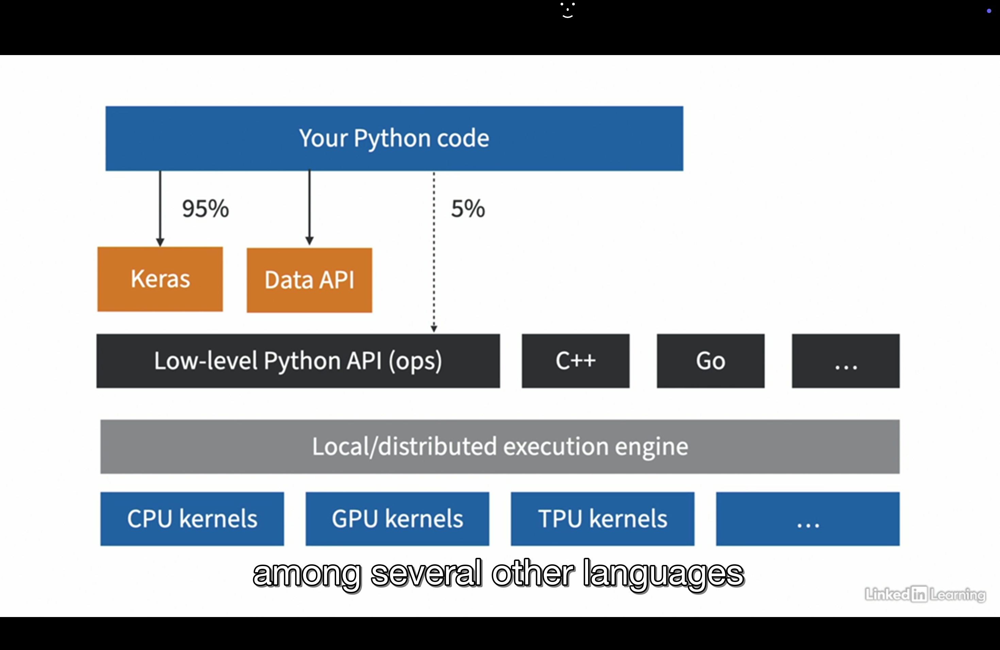
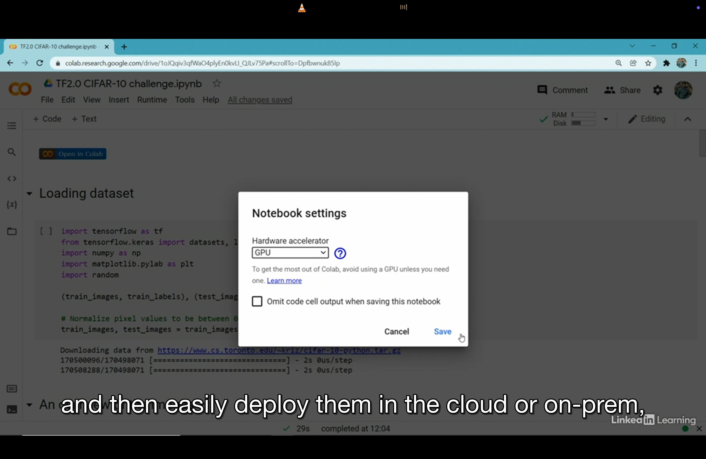
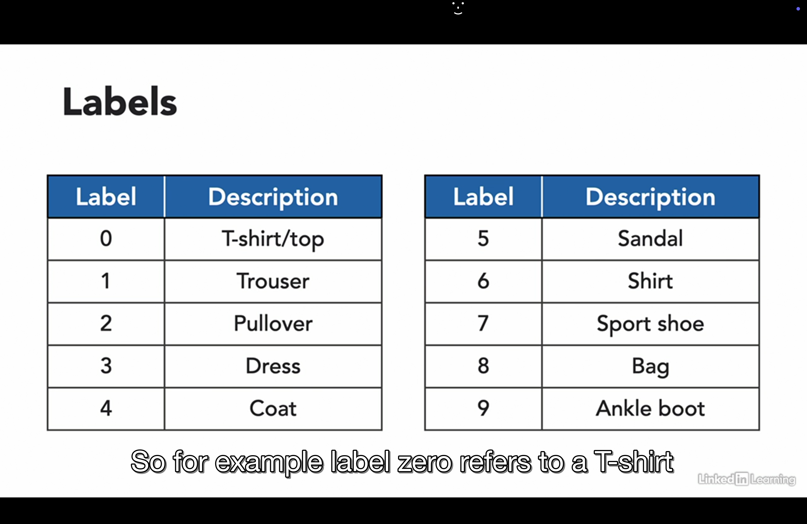
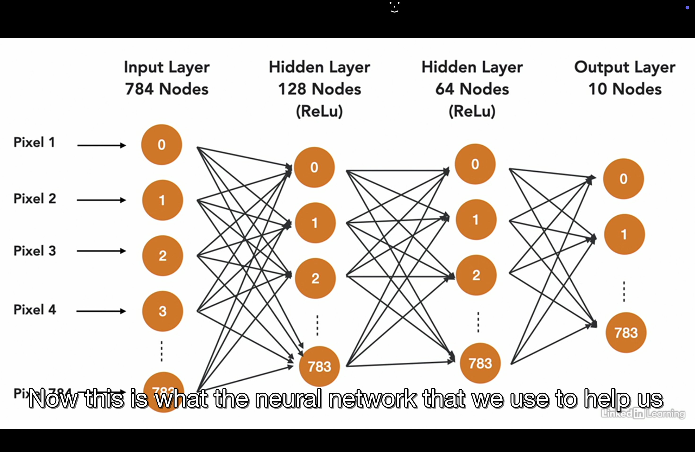

1. Tensorflow is one of the most popular deep learning framework. You can develop and train models using Python and several other languages.



Then easily deploy them in cloud or on-prem, in browser or on mobile devices, no matter what language you use. 



2. Tensorflow is a powerful machine learning library that is developed by Google Brain team and it powers many google services like google search. 

At its core, it is very similar to Numpy but with GPU support. It supports distributive computing across multiple devices and servers.

It also includes a Just-In-Time Compiler (JIT) compiler to create computational graph. It does this by extracting the computation graph from a python function and then running independent operations in parallel. These computation graphs can be exported to a portable format. This means, we can train a tensorflow model in one environment like use python on windows machine can also be run on android device using java. 

Most of the time, we will use high level APIs like Keras but when you need more flexibility, you will use the low-level Python API handling tensors directly. 

Tensorflow runs not only on Windows, Linux and Mac but also on mobile devices using tensorflow lite, including Android and iOS both.

If you don't want to use python API then you can use C++, Java, Go and swift APIs. There is even a Javascript implementation called TensorFlow.js which can be used in the browser by running the tensorflow model in the browser directly. Tensorflow lite can be used for android and iOS.

There is tensorflow extended which is a set of libraries built by google to productionize tensorflow projects. So, this includes tools for data validation, pre-processing, model analysis and you can save these models using REST APIs using tensorflow serving. 

Tensorflow serving is very important because it is very easy to create ML solutions that have one or two users but what happens when you scale to a hundreds of thousands of users ? Then there is tensorboard which is great for visualization.

Finally, Tensorboard Hub provides to easily download and reuse pretrained models.

3. Neural Networks and Images:

Let's see Fashion-MNIST dataset. It is made up of Zalando's images. It contains a training set of 60,000 images and a test set of 10,000 images. Each image is 28x28 pixels and the images are in grayscale, associated with the labels from 10 classes.  

Each training and test example assigned to one of the following labels.



Now, this is what the neural network that we use to help us classify the 10 categories of the FASHION-MNIST dataset looks like. 



We had 784 input nodes and each of these node corresponds to a pixel of that image. We then have two hidden layers with 128 and 64 nodes. The output layer has 10 nodes corresponding to the 10 different categories. You have to find which class has the highest probability so that more likely the image belongs to that class.

Check the notebook `1.ipynb` for the code.

4.  The CIFAR dataset has the classes as airplane, automobile, bird, cat, deer, dog, frog, horse, ship etc. Here in this dataset, images are of size 32x32x3. Here, 32x32 is the height and width of the image in pixels and 3 is the number of color channels(red, green and blue).

Check the notebook `2.ipynb` for the code.

As we can see in this notebook that this neural network does not well for CIFAR-10 dataset. 

So, we can do few things:

- Add two more inner layers to the neural network, one with 1024 nodes and one with 512 nodes.
  Input Layer : 32x32x3 = 3072 pixels
  Now, we gradually reduce from 3072 pixels to 1024 and then 512 nodes. This might help us better accuracy.
- We see that neural networks works well for fashion-mnist dataset which has grayscale images but cifar-10 has color images which
  has red,blue and green channels. What if we extract only red channel as input to the neural network instead of all three channels.
  With a single channel, we are closer to the single grayscale image that fashion-mnist dataset had and perhaps it will work better.

See the notebook `3.ipynb` for the code.

After including, 

```
tf.keras.layers.Dense(1024, activation='relu'),
tf.keras.layers.Dense(512, activation='relu'),
```
we now got the accuracy as 51.2% compared to previous 42.7% accuracy. So it got improved.

Now, make changes in `4.ipynb` as 

```
train_dataset = tf.data.Dataset.from_tensor_slices((train_images[:,:,:,0], train_labels))
validation_dataset = tf.data.Dataset.from_tensor_slices((test_images[:5000][:,:,:,0], test_labels[:5000]))
test_dataset = tf.data.Dataset.from_tensor_slices((test_images[5000:][:,:,:,0], test_labels[5000:]))
tf.keras.layers.Flatten(input_shape=(32, 32)),
```
But now accuracy dropped to 35.8% compared to previous 42.7% accuracy.

5. Why did our neural network performed so poorly on CIFAR-10 dataset ?

- The neural network does not take the spatial structure of the image. If we flatten the image at the start then details about like pair of eyes, ears etc. details are not captured. 
- There are some complexities between Fashion-MNIST dataset and cifar-10 dataset like in Fashion-MNIST dataset, each image contains a single object only and all objects are in the center of the image. The cifar-10 dataset is more realistic and all images are colored with other items which are also part of the image and not all the images have main object in the center. Input nodes in cifar-10 dataset are 32*32*3 = 3072 and in fashion-mnist (gray scale images), it is 784 (lesser than cifar-10). 

6. Historically deep learning engineers worked with complex models and trained them on large amounts of data, meaning a significant cost involved in compute and in training of these models. So, how can we use their work ? Tensorflow Hub is designed to solve this problem. It enables transfer learning by making a variety of ML models freely available as libraries or web API calls. 

Anyone can write a single line of code to load a model and all models can be invoked via a simple web call and then the entire model can be downloaded to your source code runtime. And you don't need to build a model yourself. This definitely saves development and training time. It also allows users to try out different models and build their own applications more quickly.

Another benefit of transfer learning is that since you are not training the whole model from the scratch, you may be able to get away with fewer and smaller GPUs created by Nvidia or TPU(Tensor Processing Unit) developed by Google. 

So, Tensorflow Hub is a repository of machine learning models. And here you can find models trained on specific datasets or you can also create models for your use case. Here problem domains are broken down into text,images, audio and video.

Explore `https://www.tensorflow.org/hub`

7. Transfer Learning:

It is made up of 2 components: 

Pre-training and fine-tuning.

- Pre-training involves training a model from scratch. So, this means model weights are randomly initialized. The model is of no use at this point. The model is then trained on thousands of images and becomes useful for computer vision tasks such as image classification etc. You can use it for video, audio, text etc. We need both a lot of data and a lot of compute power. 

For the imagenet challenge (https://www.image-net.org/),computer vision models has to distinguish between 1,000 different categories of images. This means that these deep learning networks learn a whole lots of features such as edges and corners and texture of images in the process.  

There are many well-known pre-trained models that performed very well on this datasets like models as VGG-16, VGG-19, ResNet-50, Inception v2, Inception v3 etc. Researchers who created these models make them available for download and download their weights as well. 

8. Benefits of transfer learning:

- Faster development: It takes much less time to train a fine-tuned model, usually minutes. You might only need to run between 5 to 15 epochs through your entire dataset. This is in contrast to a couple of hours required for pre-training from scratch using several powerful GPUs.  
- Less data to fine-tune: We don't need as many images when fine-tuning the model. You can use as many as 20,30 or 50, depending on the accuracy you are looking for. This is in contrast to when training on imagenet where more than 1000 images are available for each category. And quite remarkably, with this combination of pre-training and fine-tuning, you are able to achieve excellent results.

Check the notebook `5.ipynb` for the code.  

9. So, can we use tensorflow hub for cifar-10 dataset ?

`https://www.kaggle.com/models/deepmind/ganeval-cifar10-convnet` model from tensorflow hub works pretty well for cifar-10 dataset. So, let's use it.

Check the notebook `6.ipynb` for the code.

10. Monitoring the training process:

Considerations during model training:

- How can I determine the epoch which gives me the best model performance before over-fitting occurs?
- How can I stop training if the model is not improving or is over-fitting?
- How often should I save the model during the training process?
- Is there a way to visualize the model's training process ?

Tensorflow's solution to these questions is callback functions. We'll be looking at 3 of the most used classes which are ModelCheckpoint, EarlyStopping and TensorBoard.

11.  