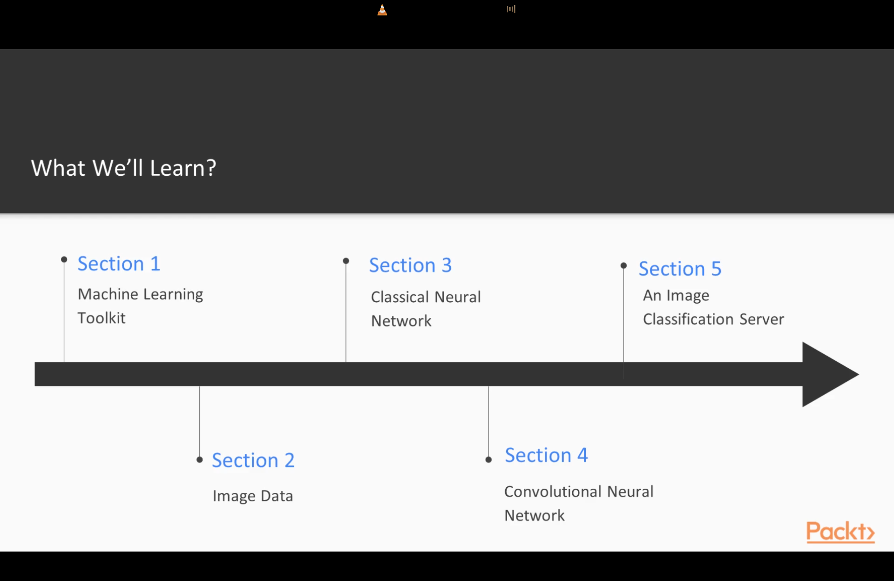
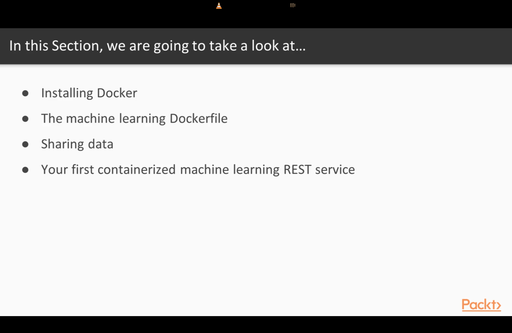

1. 

2. Install Docker:

- Download and install Docker Desktop from `https://docs.docker.com/desktop/setup/install/mac-install/`.
  

3. Setup Cuda and cudnn equivalent for Mac:

Check the pdf file for the steps in AI-ML-DS repo.

4. Preparation of Machine Learning Dockerfile:

