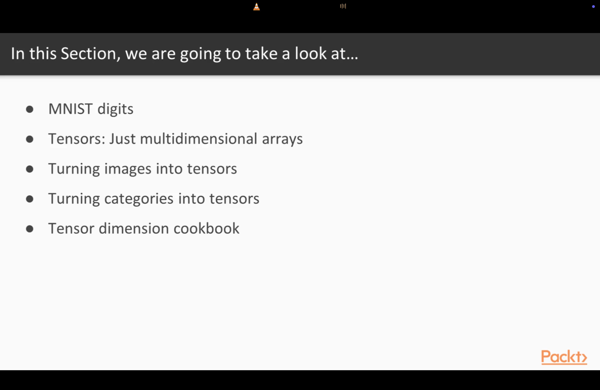
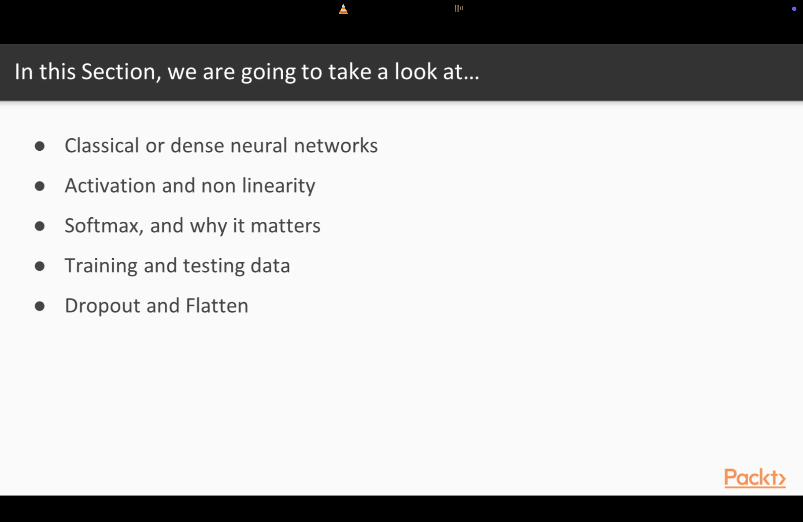

1. 


2. Install Docker:

- Download and install Docker Desktop from `https://docs.docker.com/desktop/setup/install/mac-install/`.
  

3. Setup Cuda and cudnn equivalent for Mac:

Check the pdf file for the steps in AI-ML-DS repo.

4. clone the repo `https://github.com/wballard/kerasvideo` as `kerasvideos` folder locally.

5.  



check the notebook `1.ipynb` for the code.

6.   

Multidimensional arrays are also called tensors. Tensor shape is just the number of dimensions. 

7. Turning images into tensors:

Questions:

- Why are we working with floating point numbers?

Machine Learning is numerical optimization or a math optimization problem. When we are working with floating point numbers, computer is trying to optimize a series of mathematical relationships to find learned functions that can predict the output. So, preparing the data for machine learning does involve reformatting normal binary data such as image into a series of floating point numbers.   

- Difference between samples and data points?

By convention, samples are always first dimensional data into our multidimensional array. We have multiple samples because machine learning fundamentally works with wide array of multiple data points across wide array of different samples. Each image into multiple trained images is a sample.  

- why are we normalizing data for machine learning?

it is needed for numerical stability in machine learning algorithms and it converges faster.

8. Classical Neural Network:



See the notebook `2.ipynb` for the code.

9.  Convolutional Neural Network:

See the notebook `3.ipynb` for the code.

10. Deep Neural Network:

See the notebook `4.ipynb` for the code.

11. An image Classification Server:

We use REST services for image classification. 

First clone the repo `https://github.com/wballard/kerasvideo-server.git`. Then go to the folder by running the command: `cd kerasvideo-server`.

Now, open the `models.yaml` which is a swagger API/OpenAPI definition. Now, open `server.py`, this is the actual code to use to serve the yaml configuration (which is in .yaml file) as a rest service. 

Docker makes your trained model portable. Docker combines the server with trained model and makes a fully runnable solution. Docker containers are highly portable across AWS, GCP, Azure, Kubernetes, etc.

Now, run the following commands:

-  

```
cd 52-Packt-Tensorflow-Deep-Learning-Solutions-for-Images-Will-Ballard/kerasvideo-server
```

- # build: installs deps, trains, bakes samples in. ~10 min first time (TF wheel is ~250MB)

```
docker build -t kerasvideo-server .
```

# faster iteration: docker build --build-arg EPOCHS=1 -t kerasvideo-server .


- # run

```
docker run --rm -d --name kerasvideo -p 5001:5000 kerasvideo-server
```

```
docker logs -f kerasvideo      
```

Now, open the link `http://localhost:5001/ui` in browser and click on list operations and then click on classify digits and then upload image from var/data folder location and then try it out.

- Using terminal, run commands:

```
mkdir -p var/data && docker cp kerasvideo:/src/var/data/. var/data/
```

then run:

```
curl -F file=@var/data/sample-7.png http://localhost:5001/mnist/classify
```
