1.   

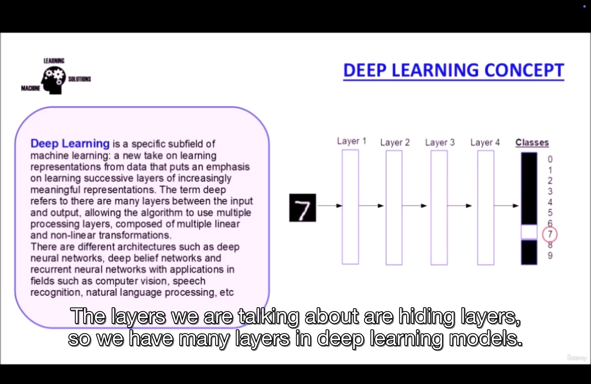

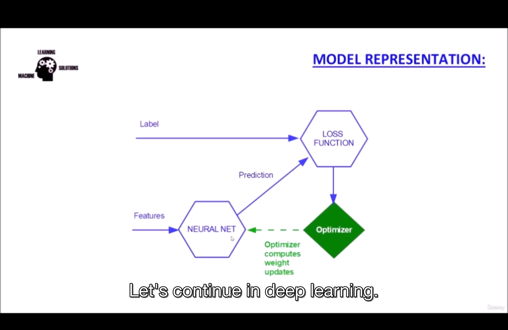
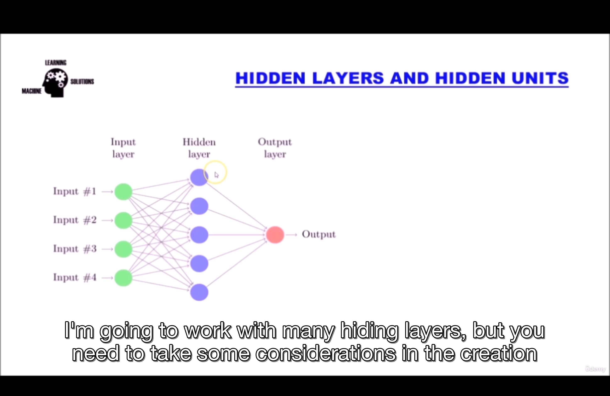
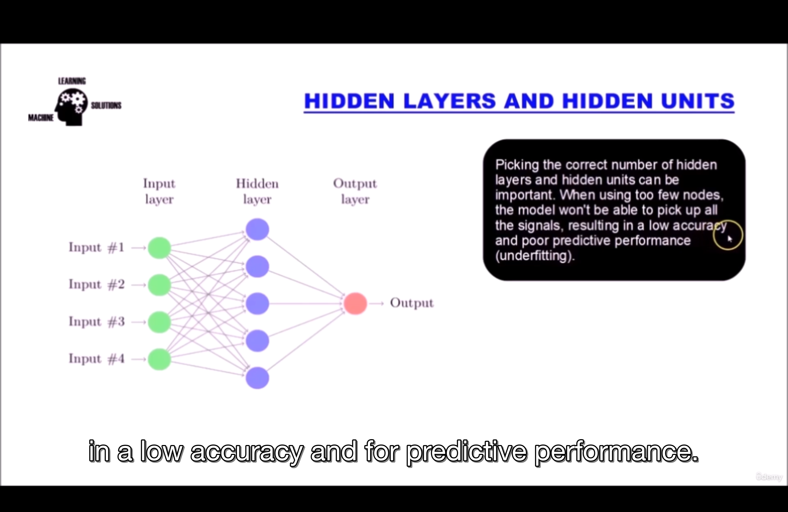
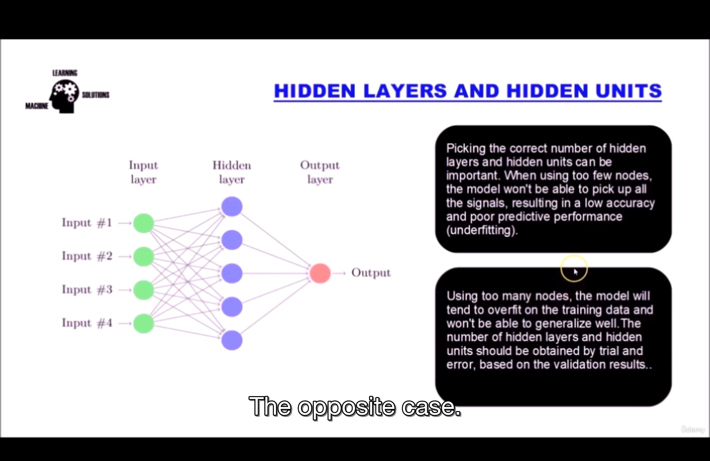
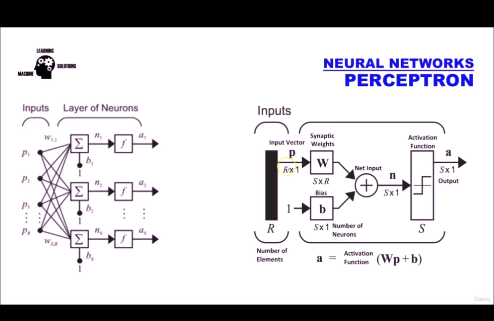
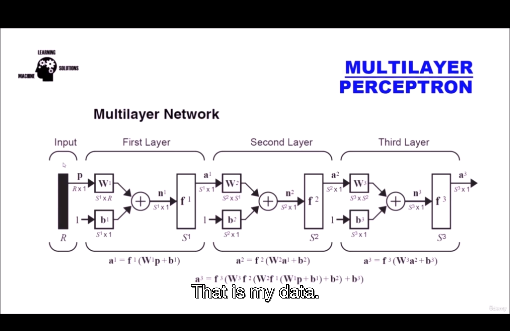
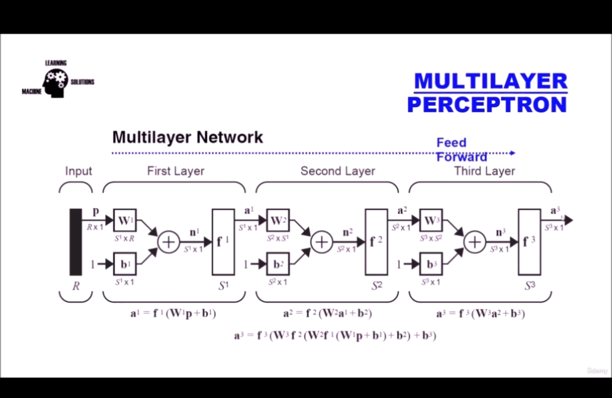
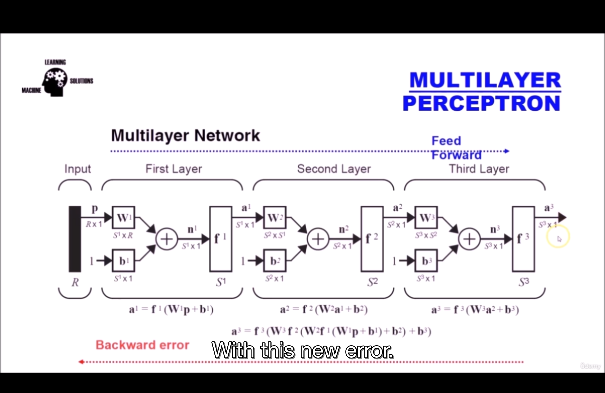
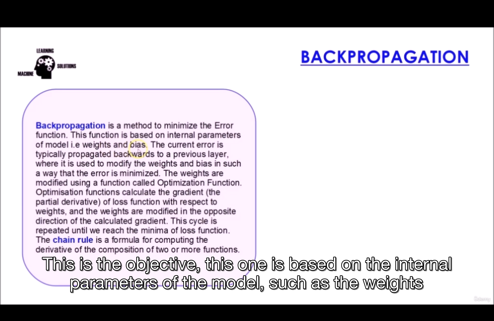
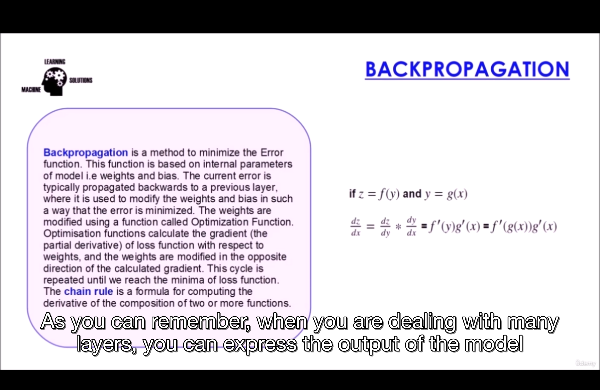
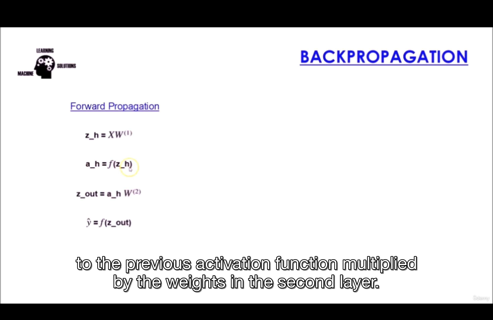
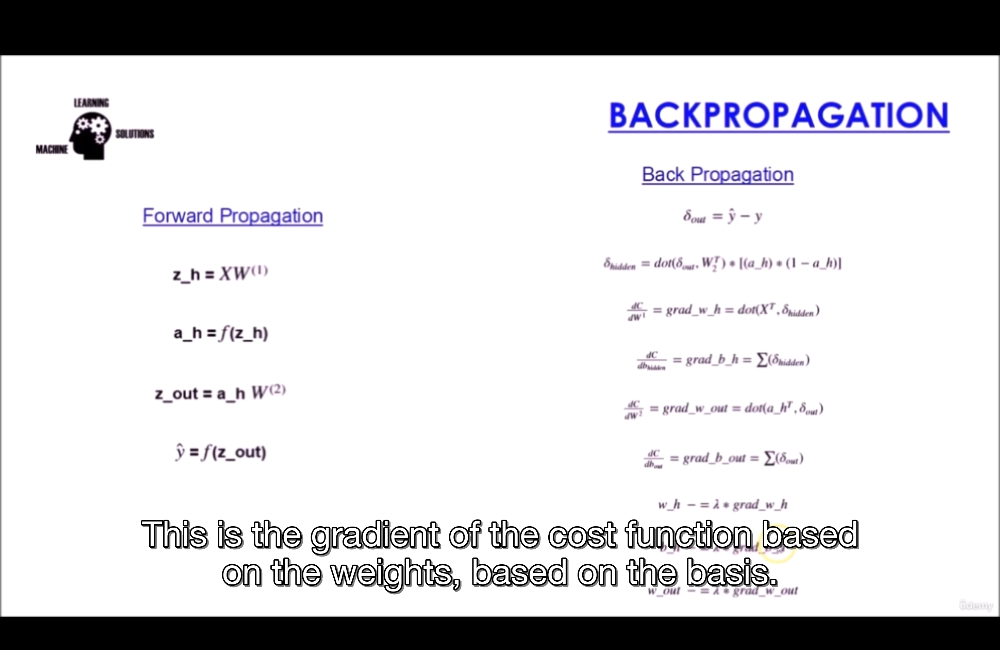
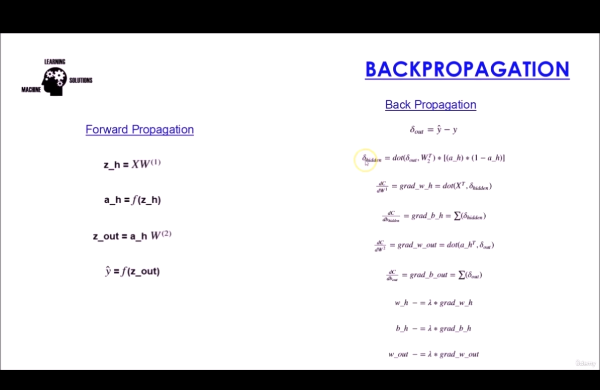

Deep Learning is a specific subfield of machine learning: a new take on learning representations from data that puts an emphasis on learning successive layers of increasingly meaningful representations. The term deep refers to there are many layers between the input and output, allowing the algorithm to use multiple processing layers, composed of multiple linear and non-linear transformations.

There are different architectures such as deep neural networks, deep belief networks and recurrent neural networks with applications in fields such as computer vision, speech recognition, natural language processing, etc.

Hello everybody, welcome back to the course. This is a chapter 2, in this chapter I'm going to make a review about the meaning of deep learning including the basic concepts and algorithms. This course is focused in the application of deep learning in computer vision field. Then, I strongly recommend you to have a solid background in Python programming, machine learning and deep learning concepts. So, let's start reviewing the concept of deep learning. What is deep learning? I can define deep learning as a specific subfield of machine learning. A new take on learning representation from data that puts an emphasis on learning successive layers on increasingly meaningful representations. The term "deep" refers to there are many layers between the input and output, allowing the algorithm to use multiple processing layers composed of multiple linear and non-linear transformations. It is something like this. In deep learning I have many layers, the layers we are talking about are hidden layers, so we have many hidden layers in deep learning models. I have an input, in this case is an image. These layers extract meaningful features of the data. The final layer is the output layer where is located the predicted class of my model. This image is an array, is a collection of numbers. So, after making some transformation of the data I can extract meaningful features of this image to classify this image according to the classes. In the final layer I have the output containing the predicted class, in this case the number 7, because the image is a handwriting digit that represents the number 7. So, my neural network will perform a prediction. This prediction is this class, the number 7. This is the basic idea in classification problems. There are different architectures such as deep neural networks, deep belief networks, convolutional neural networks, and many others. And the applications are in many fields such as computer vision, speech recognition, natural language processing, etc. So, in this course I'm going to focus the application of deep learning in computer vision field. Let's continue. Now I'm going to present you a representation of a deep learning model. This is my model, a neural net. This neural net receives input data. This input data has many features. The idea is this model can learn these features to make a prediction. The difference between the predictions and the true labels is an error. This error is calculated with a loss function. There are different loss functions that we can use. After selecting that loss function, I need to use an optimizer. That is an algorithm that performs the optimization of this loss function. The optimization in this case means to find the minimum value of this loss function. This optimizer computes new weights. I'm calculating a new error and the cycle continues until this error is a minimum value or when a specific number of cycles is reached. In this chapter I'm going to make a review of different loss functions and different optimizers. Let's continue. In deep learning we are dealing with many hidden layers, so let's check the importance of these hidden layers. This is a basic representation of a neural net. I have the input layer, the output layer, and a hidden layer. In deep learning I'm going to work with many hidden layers, but you need to take some considerations in the creation of hidden layers. Let's check them. Picking the correct of hidden layers and hidden units (units is about neurons) can be important. When using too few nodes, the model won't be able to pick up all the signals, resulting in a low accuracy and poor predictive performance. This problem is called underfitting. And using too many nodes, the opposite case, the model will tend to overfit on the training data and won't be able to generalize well. The number of hidden layers and hidden units should be obtained by trial and error based on the validation results. When you use too many layers the computational cost is also very high, so you need to find a balance between these two scenarios. Now let's continue checking some basic architectures in neural nets. Let's continue with the perceptron. In a perceptron I have the inputs, this is the input data, and I only have one layer of neurons. This layer of neurons performs a transformation using an activity function. This f represents an activity function. This a represents an output. This is the schema of logistic regression. This function in logistic regression is a sigmoid function. So let's see more detail in this representation. Ok, this is my vector of inputs. W represents the synaptic weights. We need to perform a linear equation. This equation is the multiplication of the weights by the input vector plus a bias. So the result is called the net input. This net input fits an activation function. After applying an activation function I have an output. This output is my prediction. This procedure can be represented in an equation. The output is the result to apply the activation function to this linear equation. This output will be compared to the true labels in a classification problem. There is no hidden layers in this model. Beyond perceptron I have a new model that is a multilayer perceptron. In this model I have many perceptron layers. For example I can have three layers. Each layer is a perceptron model. I have the inputs, that is my data. The first layer performs the transformation according to the perceptron model and this layer performs an output. This output is the input to the next layer, to the second layer in this case. So the process is the same. I'm calculating the net input to this activation function. The output of this function is the input to the third layer. I need to perform a new net input to this activation function in the third layer. This activation function will return a new output, that is the input to the next layer and so on. So when you have different layers I can express this output as a function of the previous activation functions in the previous layers. This expression is a recursive function and the same for the biases in the first layer, second layer and third layer. So what is the idea to optimize our model? First I need to propagate the error. I'm going to feed forward my neural net and I'm propagating the information to make a prediction in the last layer. When I have this predicted value I can compare this value with the real value. So the difference between the predicted value and the real value is an error. The next step that I need to do is to minimize this error. So how can I do that with a back propagation algorithm? I'm going to update all the weights on each layer starting in the last layer and following to the second layer to the first layer. After updating all weights in all layers I can perform again the feed forward propagation. So I'm going to retrieve a new error. With this new error I'm going to perform again the back propagation. I'm going to update all the weights in all layers. With these new weights I can perform again the feed forward. The cycle continues until the error is minimum or has reached a specific value. This is the basic idea. This configuration of multilayer perceptron is the default configuration that I'm going to use in this course. Now I'm going to make an overview of the back propagation algorithm. Back propagation. How it works. Back propagation is a method to minimize the error function. This is the objective. This function is based on internal parameters of the model such as the weights and the biases. The current error is typically propagated backwards to the previous layer where it is used to modify the weights and bias in such a way that the error is minimized. This is the key of this algorithm. The weights are modified using a function called optimization function. Optimization functions calculate the gradient that is the partial derivative of loss function with respect to the weights and the weights are modified in the opposite direction of the calculated gradient. The gradient of the cost function. Ok? The cost function is a function of the weights. This rule is called the gradient descent. This cycle is repeated until we reach the minima of loss function. Finally, the chain rule is a formula for computing the derivative of the composition of two or more functions. Something like this. I can express the derivative of a function based on the derivative of another function. As you can remember, when you are dealing with many layers, you can express the output of the model based on the previous activation functions and previous weights. So this chain rule is very useful to calculate the derivative of the cost function. So after applying the chain rule, you will be able to calculate the updating of the weights. You will have something like this. First, you need to start with the forward propagation. This is the net input of the first activation function. After that, you need to apply the activation function of this result. If you are working with two layers, you need to calculate the next activation function. That is equal to the previous activation function multiplied by the weights in the second layer. The final output is an activation function of this previous net input. In a simple way, the difference between this predicted value and the real value is our cost function. So applying the chain rule, you will be able to perform the back propagation. And you will have something like this. This is the back propagation. This is the expression of the error. The updating of the weights is in the opposite direction of the gradient. Due to that, you have this minus sign. This is the gradient of the cost function based on the weights, based on the biases. And this factor is the learning rate. So with this parameter, we can control the magnitude of the updating. So the new weight is the previous weight minus this parameter multiplied by the gradient. You don't need to develop or learn all of these equations. You only need to understand this concept of the updating of the weights. Ok, as I have taught you, the back propagation performs the updating of the weights using the gradient descent algorithm. So in the next lesson I'm going to make a review of the gradient descent algorithm. That is all for now. Review the content. See you in the next lesson. Bye bye.


2.   

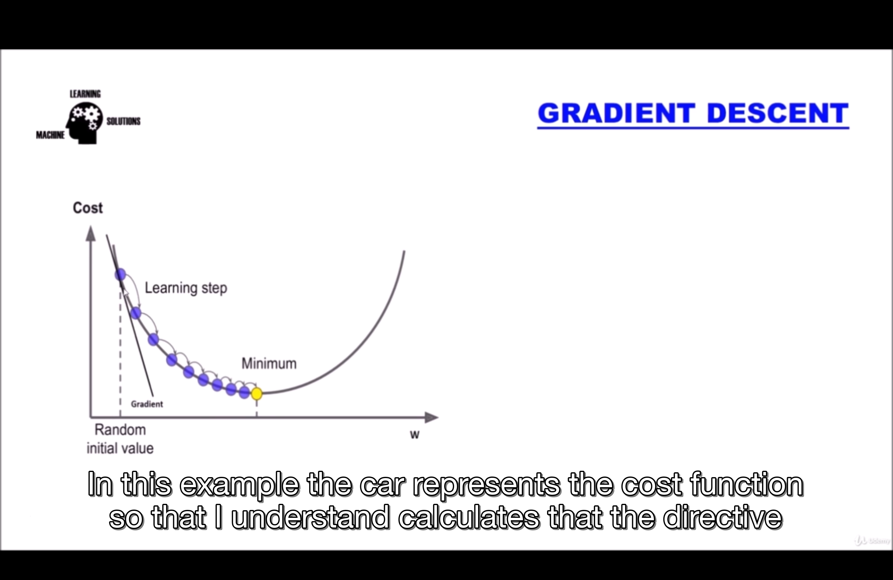
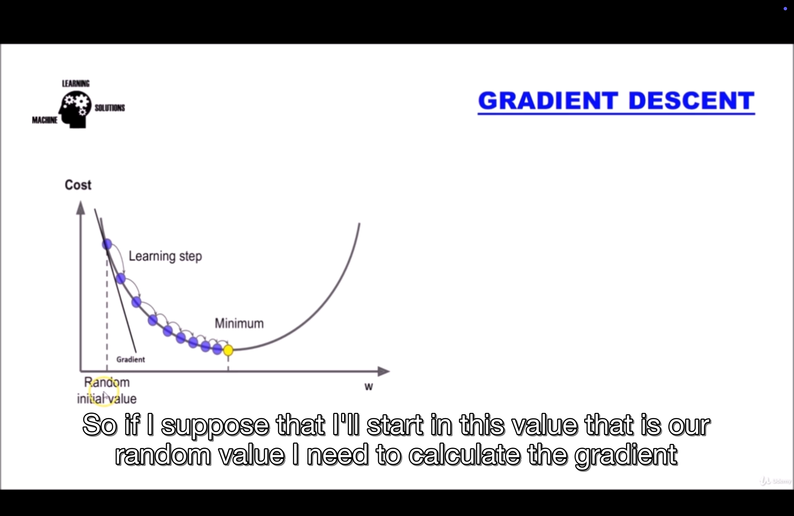
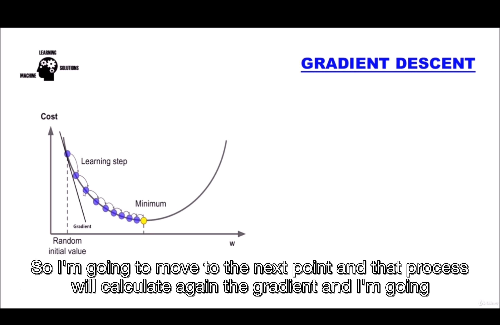
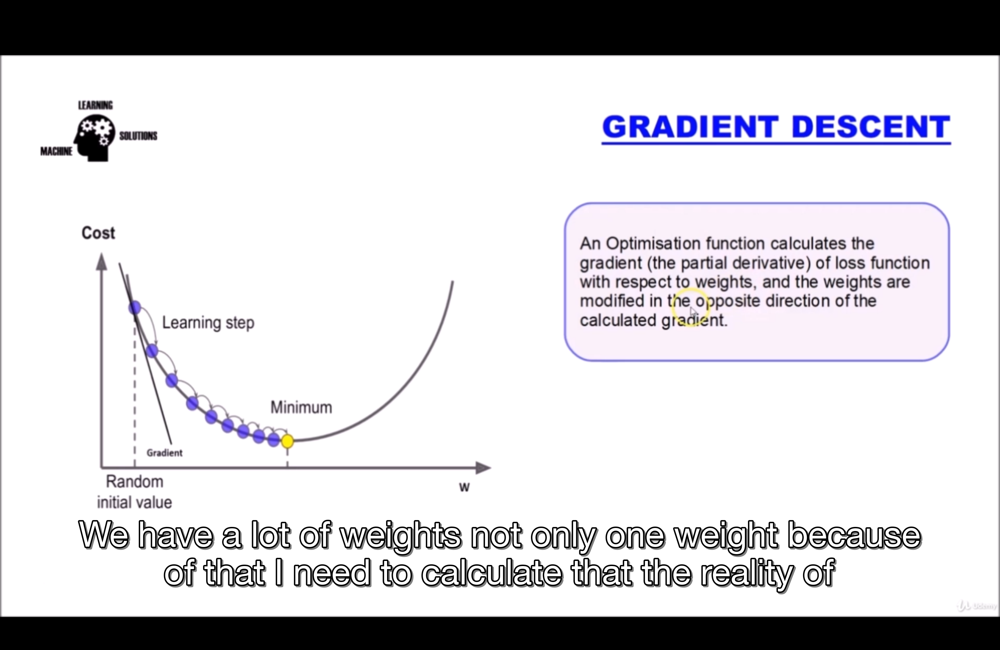
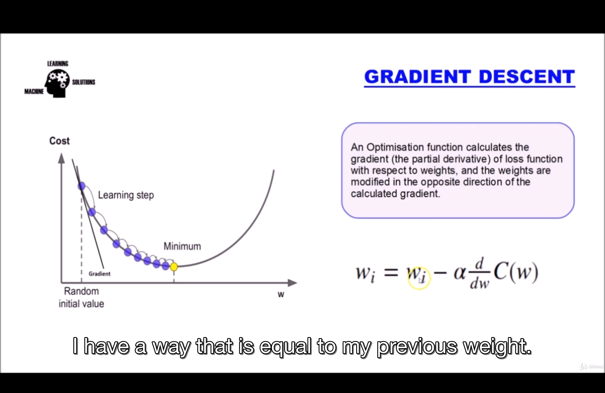
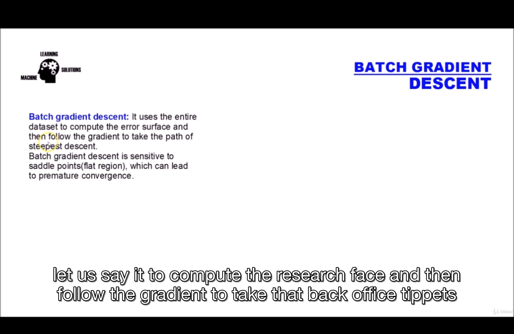
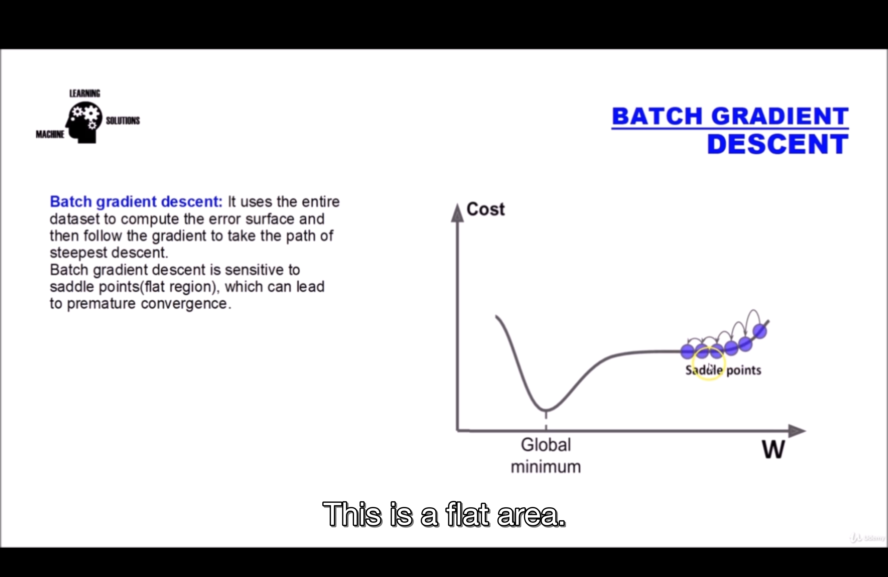
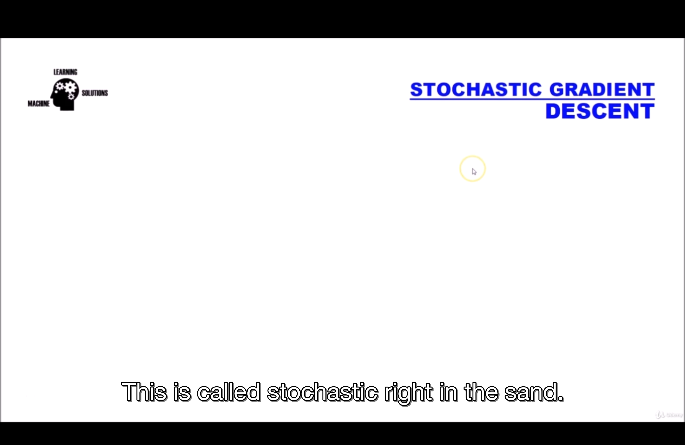
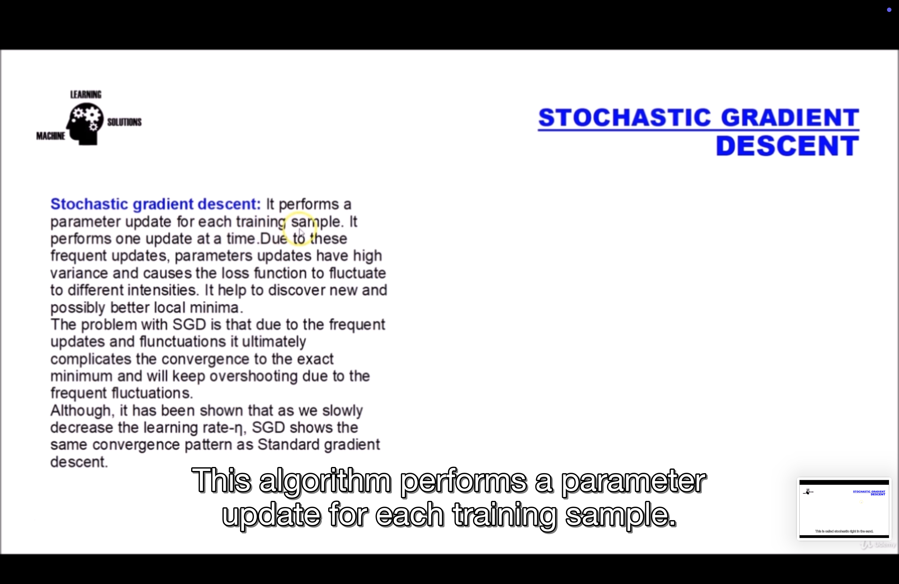
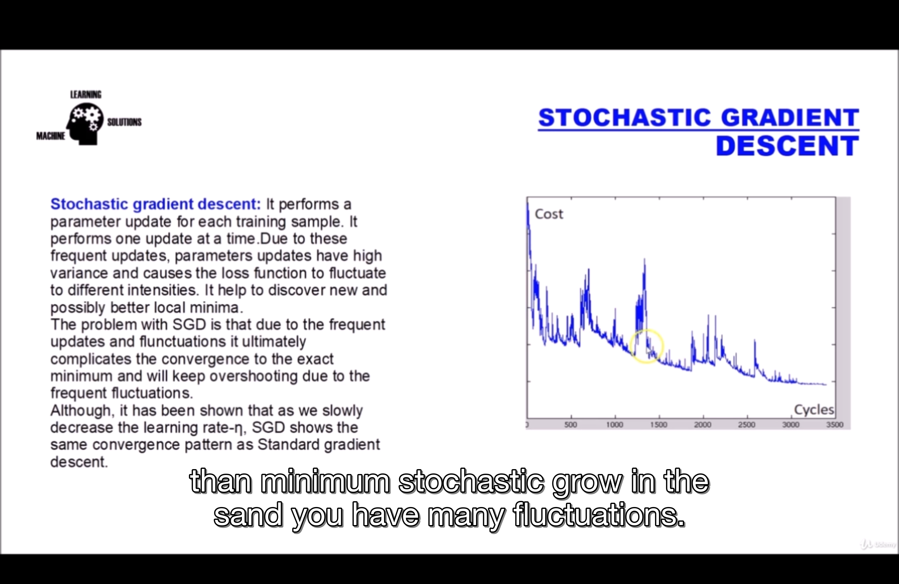
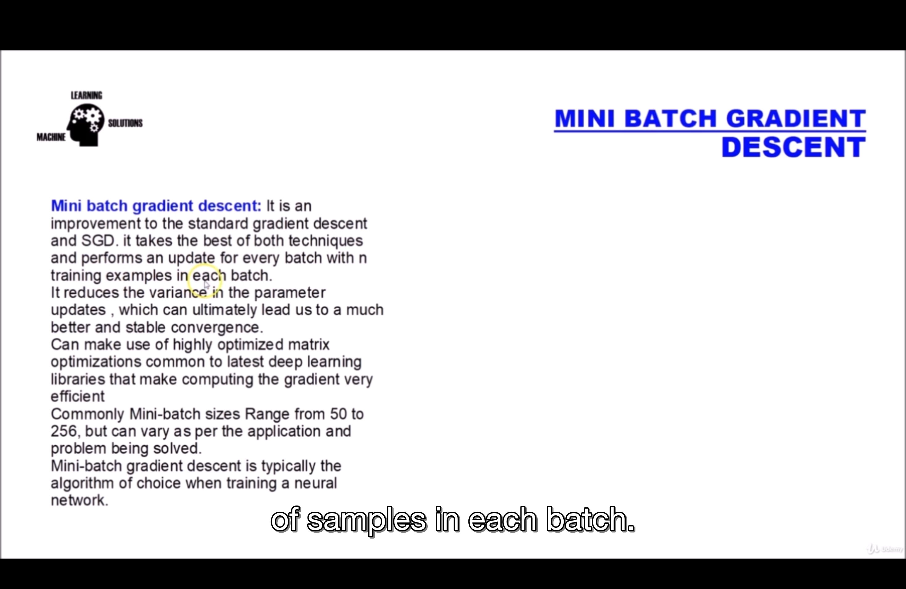
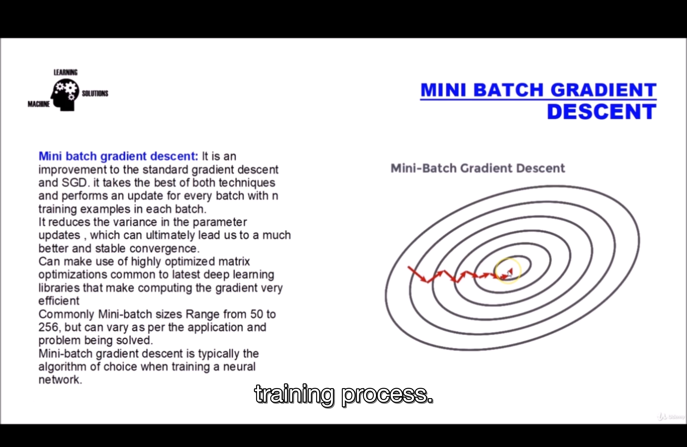

Hello everyone, welcome back to the course. In this lesson I'm going to make a review of the concept gradient descent. As I have mentioned before, to perform the backpropagation algorithm we need to use the gradient descent algorithm. So, let's see a graphical representation. In this example, this curve represents the cost function. So, the gradient descent calculates the derivative of this cost function we can start in any point. So, if I suppose that I start in this value, that is a random value, I need to calculate the gradient of the cost function in this value. In this case, the gradient is negative. So, the idea is to reach the minimum of this cost function, that is this yellow point. So, I need to go in the opposite direction of the gradient. So, in the next point I'm going to calculate the new gradient. In this case, I need to move to the opposite direction. So, I'm going to move to the next point and the process will calculate again the gradient and I'm going to move to the next point and so on until reach the minimum point. Each step of moving into the points is regulated with the learner rate. If I start on the right side, the gradient is positive. So, I need to move in the opposite direction until reach the minimum value. This is a basic example with only one weight, but as you can imagine our cost function is a function of many weights. An optimization function calculates the gradient, that is the partial derivative. In the real case, we have a lot of weights, not only one weight. Because of that, I need to calculate the derivative of the cost function based on each weight, that is called the partial derivative, and the weights are modified in the opposite direction of the calculated gradient. Okay, this is the idea. The formula is here. I have a weight that is equal to my previous weight minus this alpha represents the learner rate, that is the measure of each step in the update, and this is the derivative of the cost function. This cost function is based on weights, so this is the generalization of the gradient descent algorithm. This algorithm has some variants, let's check them. I'm going to start with batch gradient descent. In general, the approach is the same. It uses the entire dataset to compute the error surface and then follow the gradient to take the path of steepest descent. Batch gradient descent is sensitive to subtle points, it's a flat region, which can lead to premature conversions. It is something like this. This is a flat area, this is a representation of subtle points. When you are moving in a flat area, you are not improving the cost, you are stacked in an area. It is a representation taking in consideration only one weight, but in real cases, these points are in a high dimensional surface. This representation is useful to understand the problem, so we need to reach this minimum point, but this algorithm taking the whole dataset to calculate the gradient is sensitive to these subtle points, so we have the risk to get stacked in this flat region. Now, let's check another variant of gradient descent, this is called stochastic gradient descent. This algorithm performs a parameter update for each training sample. We are taking only one sample at a time. Due to these frequent updates, parameter updates have high variance and causes the loss function to fluctuate to different intensities. It helps to discover new and possible better local minima. The problem with ACD is that due to the frequent updates and fluctuations, it complicates the conversions to the exact minimum and will keep overshooting due to the frequent fluctuations. Although, it has been shown that as we slowly decrease the learning rate, ACD shows the same conversions pattern as standard gradient descent. So decreasing the learning rate, we can control this ACD algorithm, and performing that, we can reach in less time the minimum. In stochastic gradient descent, you have many fluctuations, but finally the algorithm converges to a minimum value. Now, let's see another variant of gradient descent, minibatch gradient descent. This algorithm is an improvement to the standard gradient descent and ACD. It takes the best of both techniques and performs an update for every batch with "end". "End" is a number of samples in each batch. We are extracting a number of samples of the total batch. It reduces the variance in the parameter updates. It's very good. So we can have a better and stable convergence. It's very useful in deep learning libraries for computing the gradient in an efficient way. The minibatch sizes are in a range from 50 to 256, but can vary as per the application and the problem being solved. You can try with different values. Minibatch gradient descent is typically the algorithm of choice when training a neural network. This is a representation that conversions is very fast and efficient. We don't have huge variance on the training process. We are going directly to the minimum. Ok, that is all for now. In the next lesson I'm going to make a review of different algorithms beyond gradient descent. There are more sophisticated models that we can use to optimize our cost function. Until then, enjoy deep learning. See you in the next class. Bye bye.


3.   

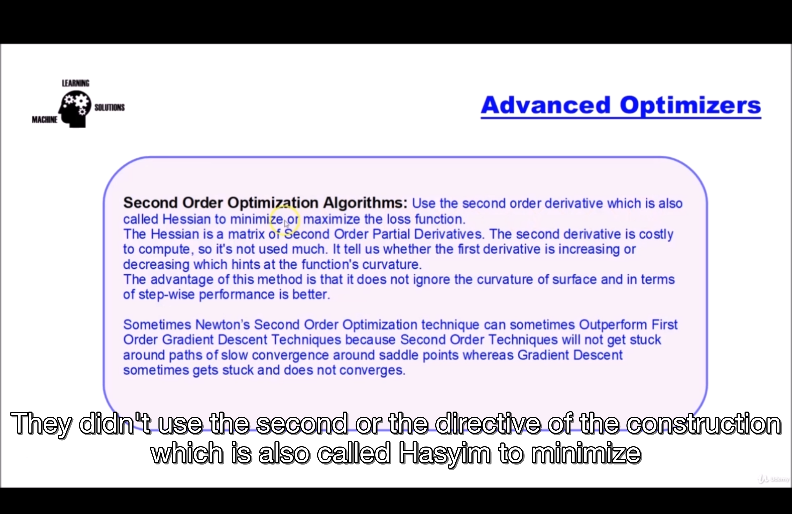
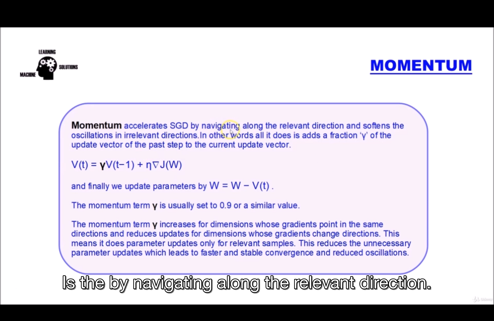  
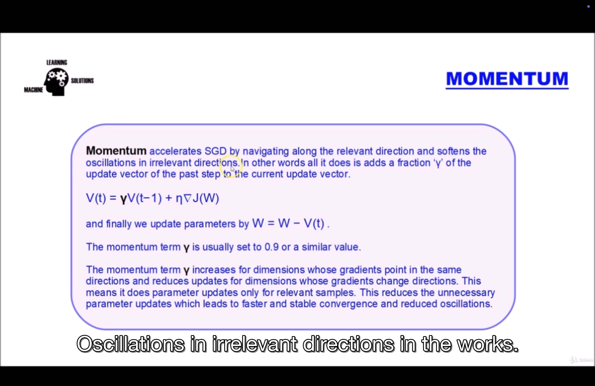
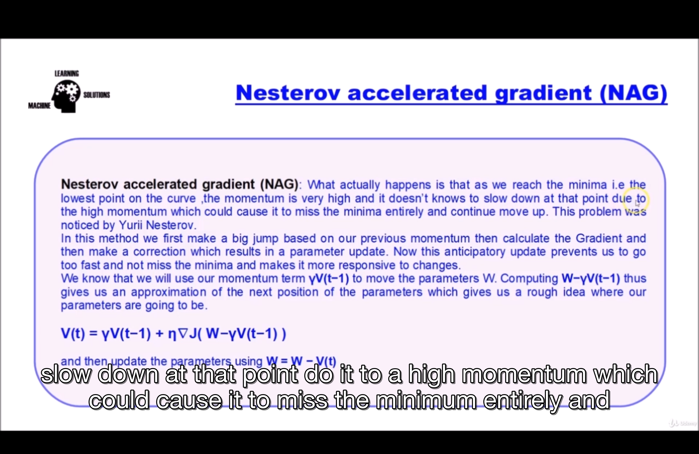
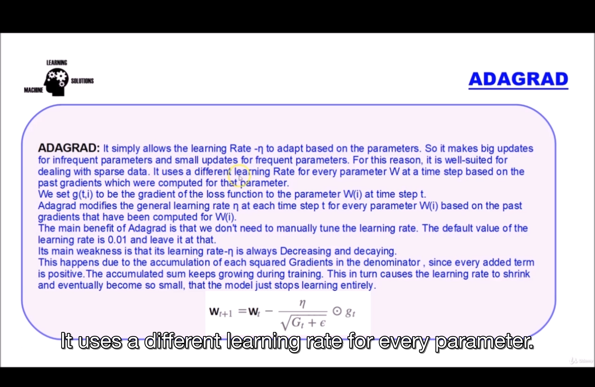
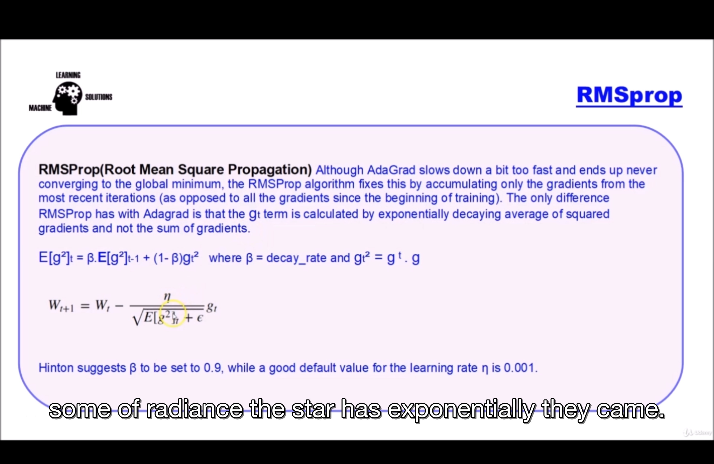
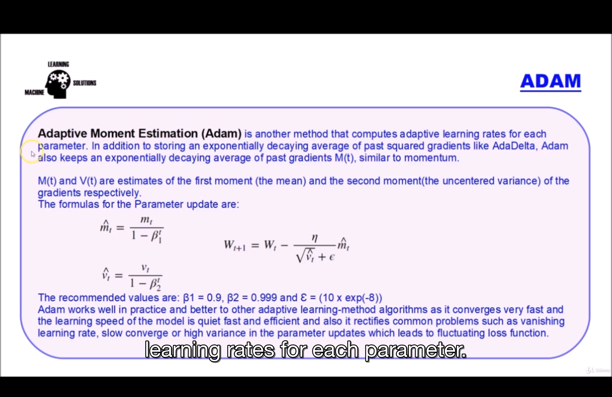
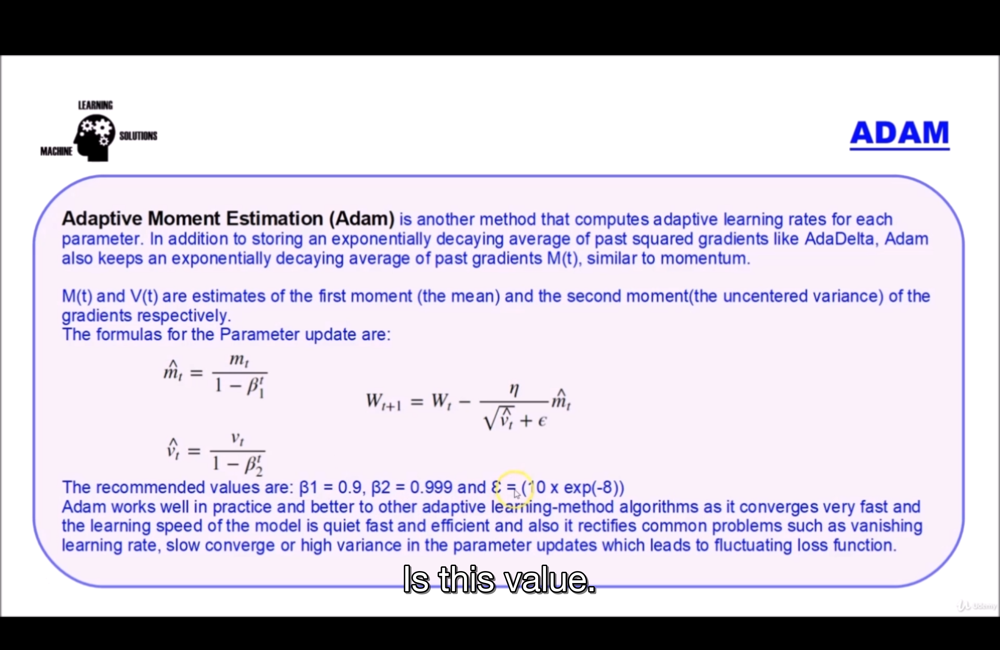

Hello guys, welcome back to the course. In this lesson I'm going to make a review of advanced optimizers beyond gradient descent. Let's start with second order optimizers. In second order optimization, the algorithm uses the second order derivative of the cost function, which is also called Hessian, to minimize or maximize the cost function or loss function. The Hessian is a matrix of second order partial derivatives. The travel is the second order derivative is costly to compute so it is not used much. It tells us whether the first derivative is increasing or decreasing, which hints at the function's curvature. It doesn't ignore the curvature of surface, the surface of the cost function and in terms of statewise performance is better. With the second order derivative we have the information of the curvature of the cost function. Sometimes Newton's second order optimization technique outperforms first order gradient descent techniques because second order techniques will not get stuck around paths of slow conversions around saddle points. This is because we have the information of the curvature of the surface. It's very clever, this algorithm, but the problem is about the computational cost because we need to calculate the second order derivative. Let's continue with more advanced optimizers. We need to find an algorithm to reach the minimum in an efficient way. Okay, what is momentum? Momentum accelerates SGD by navigating along the relevant direction, this is important, relevant direction, and sustains the oscillations in irrelevant directions. In other words, all it does is add a fraction that is represented with this gamma parameter of the update vector of the path step to the current update vector. This is the equation. This part is from SGD, this is the same, and it's the learning rate, this is the gradient. We are adding a term that keeps the information of the path values so we can update the parameters using the path values. Usually this term is set to 0.9. You can try with different values, but this is a recommendation. This term is called the momentum term. This concept is very similar like inertia in physics. So, the momentum term increases for dimensions whose gradients point in the same directions and reduces updates for dimensions whose gradients change directions. This means it does parameter updates only for relevant samples. This reduces the necessary parameter updates which leads to faster and stable conversions and reduced oscillations. This is because the inertia representation. Okay, let's see another one. Nested off accelerated gradient. I have a situation. What actually happens is that as we reach the minima, the lowest point of the curve, the momentum is very high and it doesn't notice to slow down at that point due to the high momentum which could cause it to miss the minimum entirely and continue move up. It's something when you are in a car with a high speed, if you need to stop in a close point because your high momentum, it is possible to pass the point to stop. This problem was noticed by Yuri Nesterov. In this method, we first make a bit jump based on our previous momentum then calculate the gradient and with this gradient, we can make a correction which results in a parameter update. So, this is a way to regulate the momentum. Now, this anticipatory update prevents us to go too fast and not miss the minima and makes it more responsive to changes. It's a more clever approach. We know that we will use our momentum term, that is that, and this is the value of the momentum in the past stage to move the weights. Computing this term does give us an approximation of the next position of the parameters, which give us a rough idea where our parameters are going to be. So, this is the expression, the update of the parameters of the weights is the same using the previous weights minus this term, and this term uses the information of the previous value. But now, let's see a different approach, AdaGrad. It simply allows the learning rate to adapt based on the parameters. This is another approach, the learning rate is going to adapt based on the parameters, so it makes big updates for infrequent parameters and small updates for frequent parameters. For this reason, it is suitable for dealing with sparse data, it uses a different learning rate for every parameter, w is the weight, at a time step based on the past gradients which were computed for that parameter. AdaGrad modifies the general learning rate at each time step tip for every parameter, w, based on the past gradients that have been computed for w. The main benefit of AdaGrad is that we don't need to manually tune the learning rate, automatically it's computed the learning rate based on past gradients. The default value of the learning rate is 0.01, the main weakness of this algorithm is the learning rate is always decreasing, because this term is continuously increasing. This learning process is good in the starting, but after training many cycles, this term will tend to be 0, so the learning process is stopped due to the accumulation of the gradients in the denominator. Now let's see another algorithm, RMSprop, let's see the definition. In this algorithm, root mean square propagation, we are improving the AdaGrad algorithm, we are fixing the accumulation of the gradients, taking only the gradients from the most recent iterations. To perform that, we need to calculate this GT term, but in this case it's calculated by exponentially decaying averages of squared gradients, and not the sum of gradients. This term has an exponentially decaying, we are introducing a new parameter beta that is equal to a decay rate, Hinton suggests beta set 2.9, and this term epsilon is a tiny value. This parameter prevents the zero division, because if this term is zero, the division of this term between zero is going to be infinite, so this term helps us with this infinite situation. Also Hinton suggests the learning rate is set to 0.001. Ok, it's very good, now let's see the ADAM algorithm. ADAM is Adaptive Moment Estimation, it's another method that computes adaptive learning rates for each parameter. In addition to storing an exponential decaying average of past squared gradients, ADAM also keeps an exponential decaying average of past gradients similar to momentum. We are creating new parameters that estimates the mean and the variance of the gradients. The formulas are the following, this parameter MT is this and this parameter BT is this. I have the same parameter as before to prevent the zero division, I'm also entering new beta parameters, the recommended values for beta 1 is 0.9, for beta 2 is this value and this is the recommended value for this parameter is a very tiny value. I can use the same learning value as before, ADAM works well in practice and better to other adaptive learning method algorithms, as it converges very fast and the learning speed of the model is quite fast and efficient and also it correctifies common problems such as vanishing learning rate, slow converge or high variance in the parameter updates which leads to fluctuating loss function. The idea to present you different algorithms for optimization is to have different tools for different problems. All of these algorithms work well in different situations, so you can try with many of them. In the last lesson of this chapter I'm going to perform a comparison between a stochastic gradient descent and this ADAM algorithm. Ok, that is all for now, if you want to dive deeper in these optimizers I have placed you in the reference a good paper from Sebastian Ruder, you can check it for more information. In the next lesson I'm going to explain you about loss functions, until then, enjoy deep learning. See you in the next lesson, bye bye!

4.  

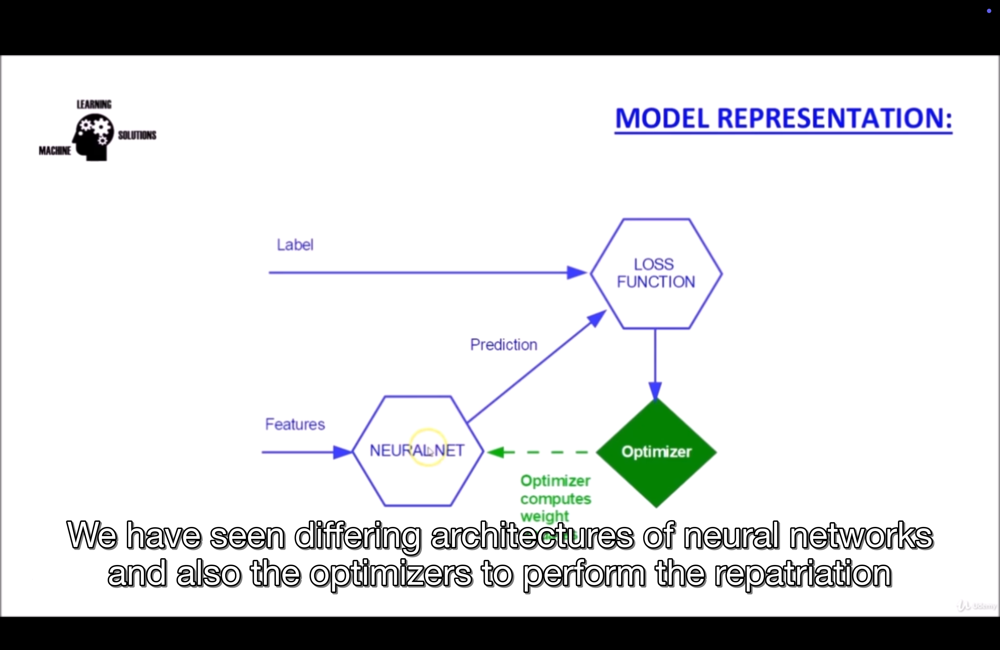
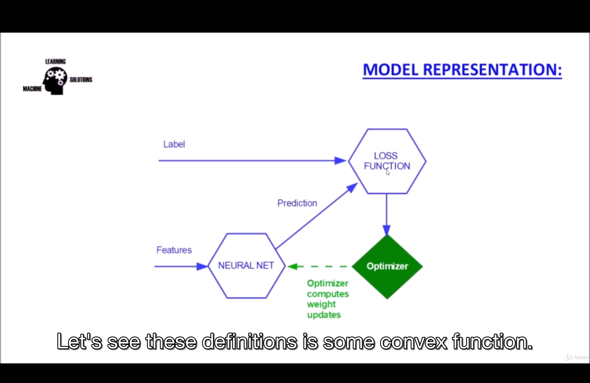
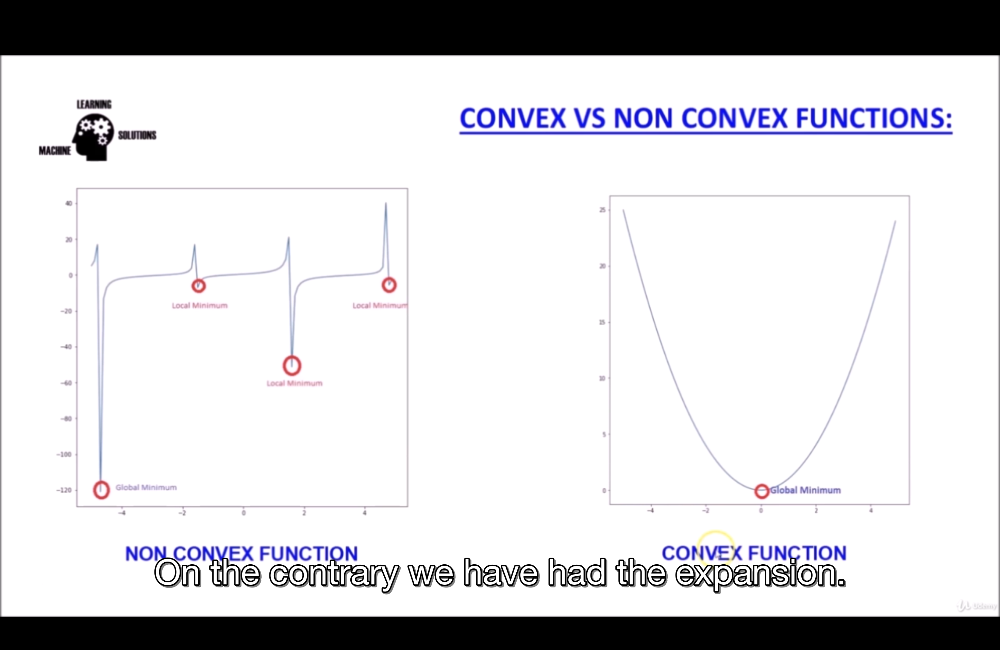
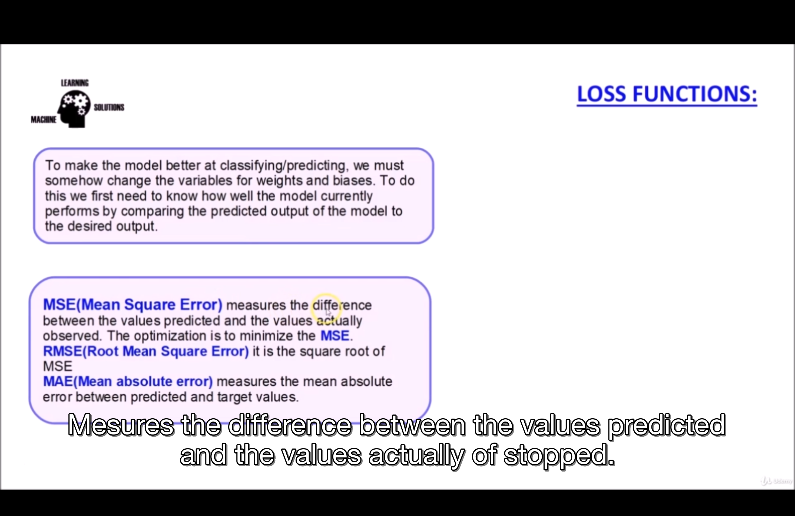
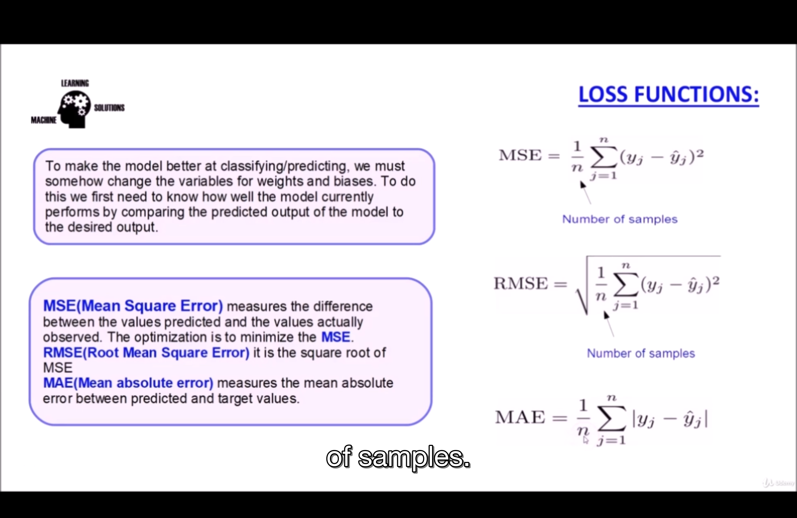
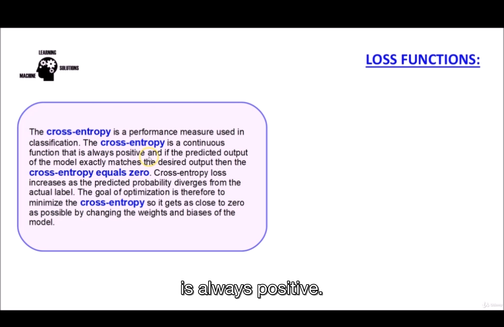
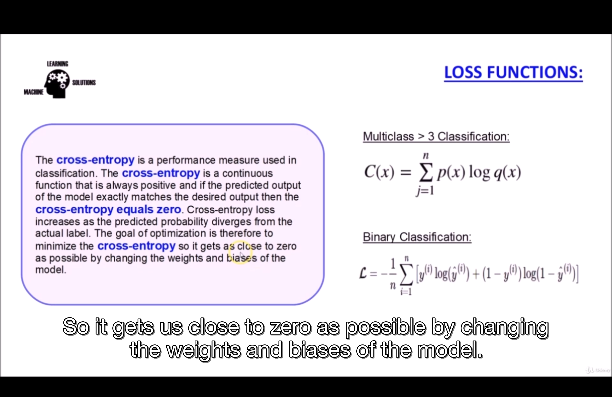
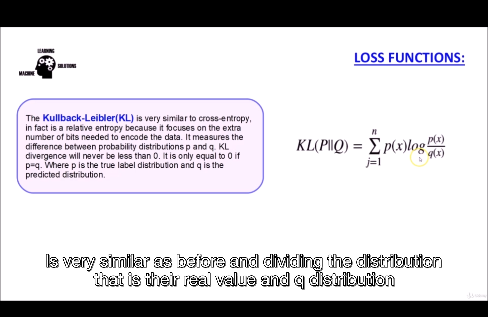
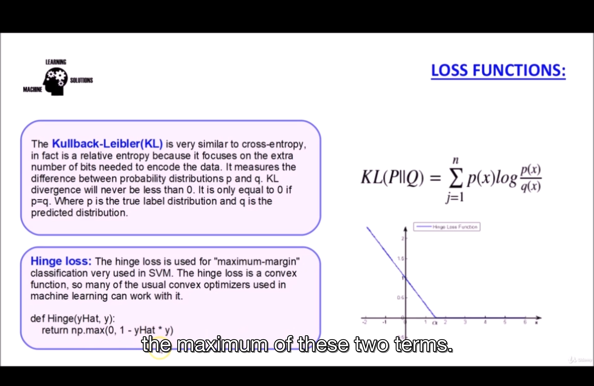


Hello guys, welcome back to the course, in this lesson I'm going to make a review of the main loss functions. In previous lessons we have seen different architectures of neural networks and also optimizers to perform the backpropagation algorithm, but these optimizers work with different loss functions, so we can have two different loss functions, a convex function or non-convex function. Let's see these definitions, what is a non-convex function? This is a non-convex function. In this situation we have different local minimums and I have one global minimum. The task of optimizer is to reach not the local minimum but the global minimum, so the idea is not to get stacked on any local minimum, the idea is to reach the global minimum. On the contrary, we have a convex function, this is a parabolic curve, we can identify a global minimum, there is only one global minimum, it's more easy to reach this global minimum, but we can apply different cost functions depending on your problem. We have cost functions for regression problems and cost functions for classification problems. So in regression you need to predict a numerical value and in classification you need to predict a specific class for the data. But what is the utility of loss functions? I have a situation, to make the model better at classifying or predicting we must somehow change the variables for weights and biases, we know that. To do this we first need to know how well the model currently performs by comparing the predicted output of the model to the desired output. So to perform this comparison between the predictions and the real values we need a loss function. It is not only the difference, in regression we have the following, min_square_error measures the difference between the values predicted and the values actually observed. We also have the root min_square_error, that is the square root of MSE. Finally, I have the min_absolute_error, that measures the min_absolute_error between predicted and target values. This is the formula for min_square_error, I need to calculate the difference between the real value and the predicted value, the square difference for all points of data and I'm dividing by the number of samples. Because of that, I have a measure of the min, the min of the square error. Next is the root min_square_error, that is the same formula as before, but applying the square root in the previous formula. Finally, the min_absolute_error, it is only the absolute value of the differences, divided into the number of samples. In all cases, I'm dividing into the number of samples, because I'm calculating a min value. Okay, these are the main loss functions in regression. Now let's see the loss functions in classification. First I have that cross entropy is a performance measure used in classification. That cross entropy is a continuous function that is always positive and if the predicted output of the model exactly matches the desired output then the cross entropy equals zero. Only positive values starting in zero when there is a match between the prediction and the target value. Cross entropy loss increases as the predicted probability diverges from the actual label, the value is higher when the difference is high, the goal of optimization is therefore to minimize the cross entropy so it gets as close to zero as possible by changing the weights and biases of the model. This is a formula, this is a cost function so when you increase this probability you need to reduce this other term and vice versa, the idea is to minimize the whole expression. If you have more than two classes you need to apply this expression, where p is the probability to find a specific class and q is the probability to not find this class. So p plus q is equal to one. You need to apply the multiplication of these two terms in all classes. In binary classification you need to use this formula where y hat is the predicted label and y is the true label. This term cross entropy was created in the information theory field by Claude Chanel and this term represents how much information we need to know and know value. This cause in information theory is about bits, bits of information that we need to know in uncertain values of the variables in a model. Ok, let's continue. The callback labeler is very similar to cross entropy, in fact is a relative entropy because it focuses on the extra number of bits needed to encode the data. It measures the difference between probability distributions p and q, KL divergence will never be less than zero, it's only equal to zero if p and q are equal, it's very similar as before, I'm dividing the p distribution, that is the real value and q distribution is the predicted value, I'm applying the logarithm of this division multiplied by the probability of the true label distribution. Due this operation of division I'm calculating the extra number of bits. Finally, the Hinge loss is very used in support vector machines. This Hinge loss is a convex function, this is the definition, it's the maximum between zero and one minus the predicted value multiplied by the true label. The graphical representation is this, the minimum value of this function is zero because I'm calculating the maximum of these two terms, so the result will be always positive for all given numbers. This is a convex function, but KL and cross entropy are non-convex functions. Ok, that is all for loss functions, in the next lesson I'm going to explain you how to deal with the overfitting problem using different approaches in regularization, until then review the concepts, see you in the next class, bye bye.

5.   

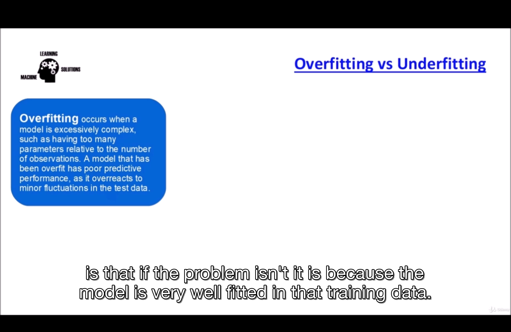
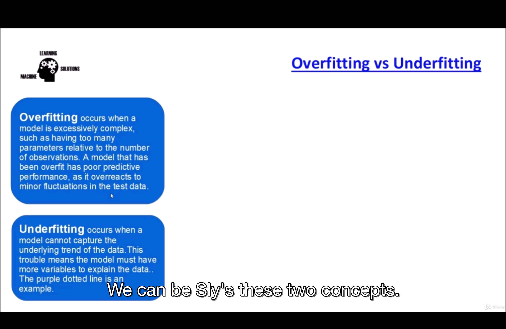
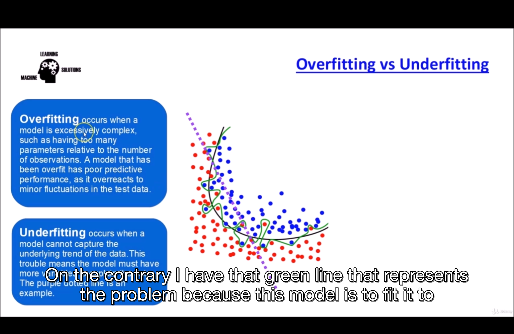
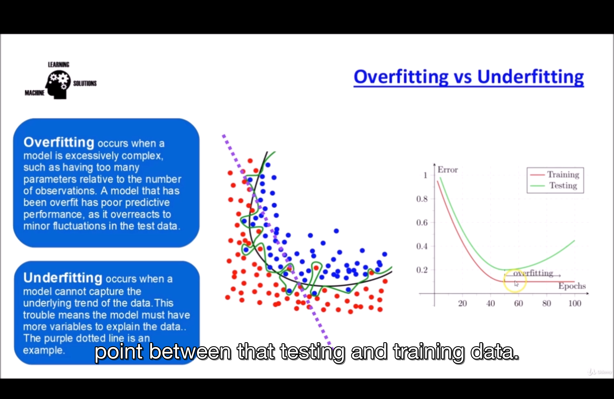
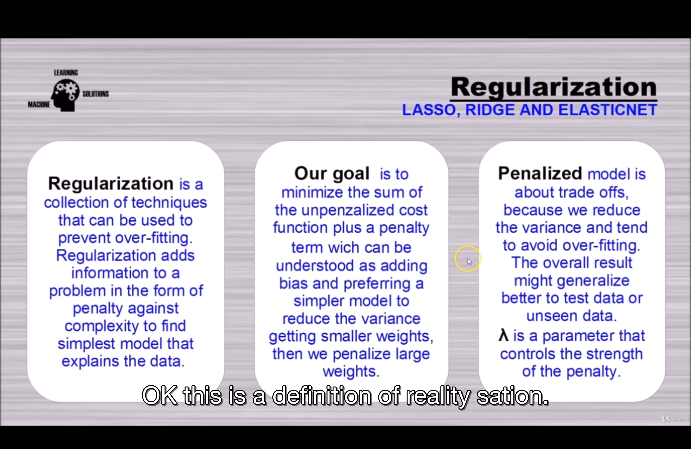
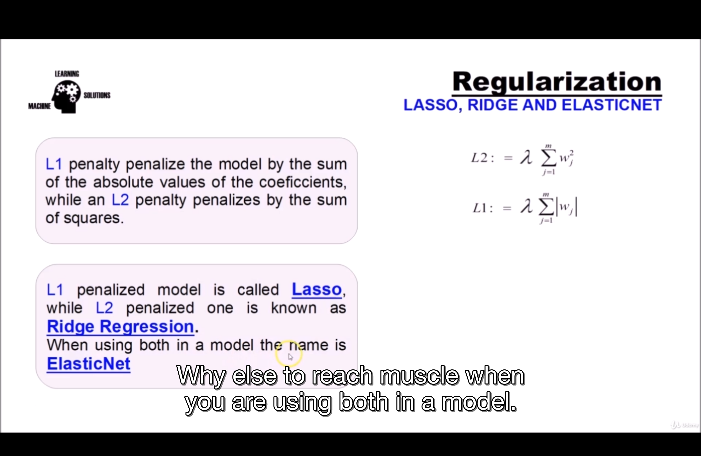
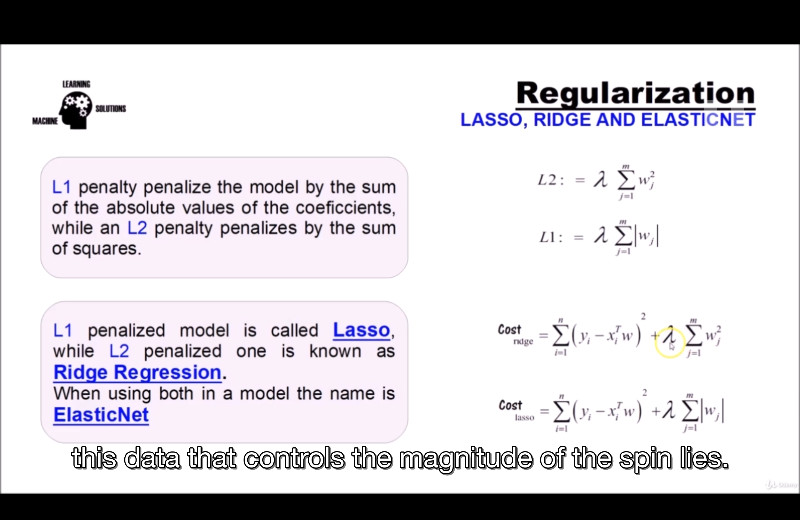


[Music] Hello guys, welcome back to the course. In this lesson I'm going to make a review of different regularization techniques, but I'm going to start reviewing the concept of overfitting and underfitting. Let's start! Overfitting occurs when a model is too complex. We have too many parameters relative to the number of observations. A model that has been overfit has poor predictive performance as it overreacts to the minor fluctuations in the test data. The problem is in the test data because the model is very well fitted in the training data. When you want to perform a prediction, the predictions are very poor and this is because we have too many parameters. The opposite problem is the underfitting problem and this occurs when a model cannot capture the underlying trend of the data. This trouble means the model must have more variables to explain the data. In the following graph we can visualize these two concepts. I have two classes, the red dots and the blue dots. The purple line is an example of the underfitting problem because this model is too simple. This model can perform the separability of the classes. On the contrary, I have the green line that represents the overfitting problem because this model is too fitted to some points of data so this model can perform good predictions for unseen data. And this model represented in this black line will perform better predictions because it performs better the separability of the classes for training and testing data. Finally, if you train your model when you have the overfitting problem after some epochs, the error is increasing at some point between the testing and training data. Ok, the most common problem in machine learning is the overfitting problem so we need some options to deal with this problem. The main approach to solve the overfitting problem is the regularization technique. So, let's start. I'm going to present you three different kinds of methods for regularization. What is regularization? I can define this term as a collection of techniques that can be used to prevent overfitting. Regularization adds information to a problem in the form of penalty against a complexity to find simplest models that explains the data. What is the goal? It's to minimize the sum of the unpenalized cost function plus a penalty term, which can be understood as adding bias and preferring a simpler model to reduce the variance, getting smaller weights. Then we penalize large weights. In machine learning, our goal is not to depend on specific weights, we need smaller weights. Finally, a penalized model is about trade-off because we reduce the variance and tend to avoid overfitting. The overall result might generalize better to test data or unseen data. And this lambda parameter is a parameter that controls the strength of the penalty. Okay, this is the definition of regularization. Now let's see three different techniques of regularization with lasso, ridge, and elastic net. L1 penalty penalizes the model by the sum of the absolute values of the coefficients, while L2 penalty penalizes by the sum of squares. These are the formulas. L2 calculates the squared sum of the weights. L1, the absolute value of the sum of the weights. L1 penalized model is called lasso, while L2 is the ridge model. When you are using both in a model, the name is elastic net. So the final formulas will be this. I'm calculating the difference between the target value minus the predicted value, the squared difference, and I'm adding a term. In this case, for ridge, calculating the squared sum of the weights, and for lasso, I'm calculating the absolute value of the sum of the weights. I'm applying this term that controls the magnitude of this penalized term. These approaches are very common in machine learning. Now let's see another approach, very useful in deep learning. Data augmentation. With this approach, we are preventing the overfitting problem. The idea here is to add information to our data. But how can we add this information? There are some techniques. Example, we are talking about images. So we can flip images horizontally and vertically. You need to apply this transformation in your current data. So you will generate more instances in your current data. You can also apply a rotation. One key thing to note about this operation is that image dimensions may not be preserved after rotation. So take care about this. Scale, the image can be scaled outward or inward. Crop, we're cropping a section of the original image and resizing this section to the original image size. Translation just involves moving the image along the x or y direction or both. Gaussian noise. Overfitting usually happens when your neural network tries to learn high-frequency features, patterns that occur a lot that maybe not be useful. So Gaussian noise, which has zero mean, essentially has data points in all frequencies, effectively distorting the high-frequency features. Let's see an example. This is an image of a cat. I'm applying different transformations of this image. Each transformation now will be a data. I have a picture of 250 by 200 pixels. In this example, I'm applying a rotation, a translation, I'm cropping the image, and if I want, I can apply a Gaussian noise. So this approach is to prevent overfitting. And there are more techniques, but the latest state-of-the-art regularization technique in deep learning is dropout. I'm going to explain you this technique in the next chapter when I will teach you about convolutional neural networks. Ok, that is all for now. In the next lesson, I'm going to explain you about activation functions. Until then, review the content. For any doubt or question, you can write me on qferns. See you in the next lesson. Bye bye!

6.   


Hello everyone, welcome back to the course. In this lesson I'm going to make a review of the main activation functions in neural nets. Ok, what is the utility of activation functions? Let's see again the basic idea in neural nets. We have inputs, these are the weights for each input, after that I need to calculate this function. This function calculates the inputs by the weights, the result is called net input. This result is the input of an activation function, and this activation function performs a transformation of the input, generating an output or an activation result. In some models if this value reaches a specific threshold, this function will return an activation value. In the other cases this function will not fire any signal, so the activation is zero. So the utility of this activation function is to make a transformation of the input signal, that is the net input. With this transformation we can represent nonlinear problems. Ok, there are different activation functions, but remember that I'm writing the same formula, this is a formula to update the weights. I have my previous weight minus the learning rate multiplied by the partial derivative of the cost function. This partial derivative is with respect to the weights, but this cost function, as you know, is a function that is based on these previous activation functions in different layers. So, it's very important when I apply this derivative, take in consideration the derivative of this activation function, because if this derivative tends to zero, the whole gradient will also tend to zero, so the weights can't be updated. On the contrary, we need higher values of this gradient, usually the highest value tends to be one, so with this value the learning process is fast. Remember, the learning process is the updating of the weights. Ok, you must take in consideration these important factors to select the correct activation function for your neural net. Now let's see the main activation functions that we can apply. Let's start with a simple activation function, that is the linear function. As the name implies, it is a straight line function where activation is proportional to input. The output is a range of activations because I have the whole range of numbers, but in this case we can apply the max value or the softmax function to decide the output value in a layer. The derivative that is very important as you know of this function is a constant, is equal to one, so the gradient has no relationship with the x values and the descent is going to be constant, a constant gradient. If there is an error in prediction, the changes made by backpropagation is constant and not depending on the change in the input delta. A delta is a variation in the backpropagation algorithm. Another trouble is each layer is activated by a linear function, so no matter how many layers we have, the final output it will be a linear function and the use of many layers with this linear function it is equal to have only one layer with a linear function. It is a replication. Let's see another function to represent nonlinear problems. We have the sigmoid function that is a function very used in classification problems. This is the shape of this function. In this case it is a nonlinear function. The output value is a range between zero to one. We don't have negative values in this function. The advantage is to have values between zero to one that can represent probabilities. If you see carefully, this function tends to bring the activations to either side of the curve above two and minus two, making clear distinctions on predictions. The gradient is high on this area, but there is a potential problem with this function because for values greater than two, the y values tend to respond very less to changes in the x values. So the gradient on this area in both sides are very small. If a gradient is very small the learning process is also very low. So this problem is called vanishing gradients because these gradients tend to be zero and the learning process is stacked. This function is very useful in classification problems. Now let's see another function, hyperbolic tangent or tang. This function is very similar to the sigmoid function, but in this case for negative values, the y values are also negative. So the range is between minus one and one. This function is very used in classification problems when you need to separate very well two classes, assigning one class to the number minus one and the other class to the value one. The gradient of this function is stronger than sigmoid because the derivatives are steeper. This area of this function is steeper, so the use depends on your requirement of gradient strength. It has the same problem as the sigmoid function that is the vanishing gradient on these areas, these flattened areas. Ok, let's continue with another function. In this case I have the reloop function. This function has the number zero for negative inputs. So reloop is a nonlinear function and helps in the sparsity of the activation. For instance, if we have a big neural network with a lot of neurons, using a sigmoid or tang will cause almost all activations will be processed to describe the output of a network. So in that case the activation is dense, too many neurons are working at the same time. This is costly. The ideal situation is to have a few neurons in the network to not activate and thereby making the activation sparse and efficient. So when you have these negative values, this part of this function will return zero. So there are some neurons that are not working and other neurons are working with the positive values. Reloop is less computationally expensive than tang and sigmoid, but it has a problem. The problem is about this area, the zero value, because of the horizontal line for negative values of x the gradient can go towards zero and the weights will not get adjusted during descent. This is called dying reloop problem. Additionally, the mean output is not zero. That is the case, a positive mean introduces a bias for the next layer, which can slow down the learning. If the mean value of activation is zero, we get a faster learning, because if the mean is around this point, the derivative of this function starts with the number one, so the learning process is faster. Ok, this function is very helpful in convolutional neural networks, transforming the input data. Many functions have advantages and also disadvantages, but the use of these functions depends on your problems. This function has some variants, let's see them. The leaky reloop. This is a variant, in this case instead to have the zero value for the negative inputs, we have a little slope in the negative values. Leaky reloop is when you use this slope, 0.01. For positive values in the input data, that function is the same as reloop, so the main idea to have this function for the negative value is to avoid the value of zero in the gradient, so we can continue with the learning process. Let's see another variant, eloop. It is based on reloop. In this case, the negative part of the input data is represented with an exponential function, with a limit in -1. This function, which speed up learning in deep neural networks and leads to higher classification accuracies, like reloop, also avoids a vanishing gradient because of this part of the function. However, this function is an improvement because it has a specific function on the negative values. With this part of this function, the mean of the activation is closer to zero. Zero means speed up learning, because they bring the gradient closer to the unit natural gradient, the value of one. So, this part balances the whole function, pushing the mean of the values closer to zero. Ok, these are the main activation functions. Now let's see a summary of these functions. These are the main functions. This is the shape of the function, the equation, and the derivative for each function. In the first case it's equal to one, in the second case it's a parabolic function, which has the maximum value in one. Take note, the derivative function is based on the original function. That is the same case in the tan, and in reloop the derivative is zero or one. Zero for the negative values, and one for positive values. This is a parametric reloop function. In the case of leaky reloop, we have set this alpha parameter in 0.01. That derivative is the value of this parameter for negative values, and one for positive values. Ok, that is all for theory. In the next lesson I'm going to perform a comparison between three important activation functions. We are going to see the behavior of this function in the learning process and the loss function. I'm going to perform the code in Keras. So, review the contents. See you in the next class. Bye bye!

7.   


[MUSIC PLAYING] Hello, guys. Welcome back to the course. In this lesson, I'm going to perform the code in Keras to compare different activation functions. OK, let's start in a new empty notebook. The first thing that I need to do is to set my TensorFlow session, because in my case, I'm using a GPU version of TensorFlow. If you are using a CPU version, you don't need this first step. These are the instructions. At this point, you know very well these instructions. Let's run this all. OK, there is a message using TensorFlow backend. I'm going to work with the handwriting digits that are set. First, I need to import the libraries. I'm going to need sequential to create my neural network, then to create a layer to underline categorical to make the transformation of the classes in categorical variables. Callback to save the history of the training process, the minutes data set, and NumPy. Let's run this all. Now, as you know, I need to create my data sets for training and testing. It's very easy. I only need to use the function loadUnderlineData. With this function, I'm creating four data sets for training and testing. I'm creating these four data sets for the features and the labels for training and testing. Let's run this all. After that, I need to make the standardization of the data. I'm creating new variables. I'm casting the values in flawed 32 bits and dividing all values by 255 to perform the standardization of the data in a range between 0 and 1. Let's run this all. Now, I need to perform the transformation of the labels in categorical variables. So I'm performing the one hot encoding labels for all values in the classes for training and testing and specifying the number of classes. In this case, we have numbers between 0 and 9. The final step in the transformation of the data before starting the creation of our neural network to convert our data in a flattened format. So I'm using NumPy to reshape the data. I'm specifying the new shape. For training, I have 60,000 instances and for testing, 10,000 instances. The shape is a flattened array containing 784 values in columns. Remember, our input data are images. With a resolution in 28 by 28 pixels, the multiplication of these two dimensions is this value. Let's run this all. Now, it's time to create our neural networks. I'm going to create three different models. One neural network using the sigma function. Another one using the reloop function. And at the final, using the eloop function. We are going to see the results in a graph. Let's start with the sigma function. OK, I'm creating a new neural network with this function. As you know, I need to create an instance. And with this instance, I can add different parts. I'm adding with this function add this part, dense. Dense is a layer. The first layer is the input layer. I'm specifying a number of neurons. The input dimension is 784. The activation function is sigmoid. I'm applying the same activation function in all layers. I have different layers with different numbers of neurons. But at the final, I have 10 neurons because I have 10 classes. My final activation function for classification is the softmax function. With this function, we can predict the probability of a specific value between 0 and 9. As you know, softmax is the default activation function in the last layer in neural networks when you are dealing with multi-class classification problems. The next step is to compile this model. I'm using this loss function, categorical cross entropy, because I'm working with classification. The optimizer SGD, stochastic gradient descent, you can change these values for others, and the matrix accuracy. Let's run this cell. Now is the turn of reloop. I'm going to perform the same steps. First, I'm creating the neural network, but using the reloop function on each layer. I have the same architecture as before. Let's run this cell. Now I need to compile this model. It is the same instruction as before. Let's run this cell. Finally, let's create the neural network to use the reloop function. It's very similar as before, but this time, I'm specifying the reloop function. Let's run this cell. After that, I need to compile the model. Take note, I'm creating different variables to store the content of each model. OK, let's run this cell. Now, if I need to record the training process, I need to create a callback class. It is the same as the previous lessons. I'm creating the class HistoryUnderlineLoss. That is an instance of the main class in callbacks. I'm defining two methods to calculate the losses and to store these losses in a list. OK, it is the same as before. Let's run this cell. Now I need to define some hyperparameters. The number of epochs in 20, the batch size in 256, and this time, I'm going to perform a different approach, creating a new variable, ValidationUnderlineSplit equal to 0.2. That represents the part 20% that the algorithm will take for testing, 80% for training. So I'm going to work with the training data, but I'm going to split this training data 80% for training and 20% for testing. Using this approach, I can calculate at the same time for training and testing the values for the losses and the accuracies. OK, let's run this cell. Now it's time to train our models. First, I'm creating a variable to store the history of this training. This variable is an instance of this class. That is history underlying loss. OK, this is my model. I'm using the function fit to perform the training and specify my training data, the number of epochs, the batch size. The callbacks is equal to this previous variable. And the validation split is a parameter that we can use to split the data for training and testing. This parameter is equal to my previous variable, validation underlying split in 20%, verbose 2 to see the results for training and testing at the same time. Let's run this cell. As you can see, we have 60,000 samples. 48,000 samples are for training. And for validation, 12,000 samples. As you can see, the loss is decreasing. The accuracy is very bad in this case. OK, this is a loss. And the accuracy for training and for testing. The last two values are for testing. The first two values are for training in 20 epochs. As you can see, we have poor results with this configuration using the sigmoid function. Let's continue training the model with the reloop function. This is the same approach as before. I'm using the model of reloop function. And all parameters are the same as before. Let's begin the training. I have the same splitting process. I'm starting in the epoch 1. I'm calculating the loss, the accuracy value for training, and for testing. As you can see, the accuracy is increasing heavily. It's a very good accuracy value. And the loss is decreasing. Very good. Now let's train our last model. This model is using the reloop function. Let's see the results. OK, the same splitting process as before. I'm starting in the epoch 1 and calculating the loss, the accuracy for training, and for testing. The results are increasing on accuracy and decreasing in the loss function. There are very good results for training and for testing. OK, I have the history of all values in the callbacks variables. So the final step is to plot this history. I'm using matplotlib, the instruction matplotlib inline, because I'm working in Jupyter. I'm using the function length to calculate the number of values in these files. And I'm creating a range of values using this number. This is for the x values. For the y values, I'm extracting the content of the losses for each model. I'm assigning a label. I'm creating a title. I'm creating a label for the x-axis and a legend, because I'm using these labels. Finally, I'm presenting the results. Let's see the results. OK, it's very good. As you can see, the sigma function is very bad in this case. The losses are very high and remain steady along the cycles. But relu function and elu function have good results. Both of them are good. The main difference is elu function converts very quickly to a lower value and remains steady along the cycles. Relu function takes some time to reach this minimum value. So for this model in particular, the winner is the elu function. If you can see, there are some noises along the cycles. This is because the use of a stochastic gradient descent. But you can try using another optimizer. OK, that is all for this lesson. If you want to dive deeper on elu function, I recommend you this reference. In the next lesson, I'm going to perform a different example trying to apply different concepts that I have taught you in this chapter. OK, until then, review the theory and practice a lot. See you soon. Bye-bye.

8.   

[MUSIC PLAYING] Hello, guys. Welcome back to the course. This is a practical lesson. I'm going to develop a new example to create a multilayer neural network using Keras. The idea is to put in practice many concepts that we have learned in this chapter. Let's start in a new empty notebook. As you know, the first thing that I need to do is to set my TensorFlow session to work with GPU kernel. If you are running your notebook in a CPU kernel, you don't need this first step. So these are instructions. You know very well these instructions. Let's run this out. After that, I need to import all Keras libraries. I'm going to need the minutes data set, the sequential function to create the neural network, then to create layers into this neural network. And this is new, regularizers. With this function, we can apply different regularization techniques, such as rich, lasso, or elastic net. After that, I'm importing a CD for stochastic gradient descent. This is optimizer that I'm going to use. Utils to perform the transformation of the label data into categorical data. Finally, NumPy. Let's run this out. Now I need to define some hyperparameters. I'm setting the batch size in 100. The number of inputs is 784. The number of classes is 10, because I'm working with the minutes data set. The number of epochs in 50. Now I'm going to create the data sets for training and testing. It's very simple. I need to use this function to load the data. And this expression will return these four data sets for training and testing. Let's run this out. Now I need to start the transformation of the data. I'm using the function reshape to transform my vectors. This is the number of instances. And in columns, I have the number of features that is equal to 784. This is a flattened format, because my images are 28 by 28 pixels. But with this reshaping process, I'm transforming this shape in a flattened format. Now I need to perform a transformation of the type. I'm casting all arrays into this format. Flow at 32 bits. Let's run this out. After that, I'm going to perform the normalization of this data. I need a scale between 0 and 1, so I'm dividing all values between 255. Let's run this out. After that, I need to transfer the label data into categorical variables. So in this point, I'm using the function utils and the function to_categorical, specifying the number of classes that I want to use. The result will be a one-hot encoding matrix. Let's run this out. So let's check the content on a specific value. I'm going to see the content of this variable that tests labels in the second value. Let's see the result. It's very good. It's an array containing 10 classes. And this number represents the index position of a specific class, in this case, with the number 2. Because I'm starting in 0, 1, and 2. The resource values are 0. This is a format in one-hot encoding matrix. OK, let's start creating our model. I'm using an instance of sequential function. I'm storing the content into this variable model. Let's run this out. Now, I need to create the first layer, that is the input layer. So I'm using my previous variable, the function @. I'm specifying a layer with this function, dense. Into this function, I need to specify the number of units, that is the number of neurons, the activation that I'm going to use. In this first layer, I use the sigma function. I'm specifying the input shape, that is the number of inputs. This variable is this, 784. And this time, I'm specifying a regularizer kernel. So I'm using an instance of this function, regularizers.l2. That is a rich regularization. I'm specifying the parameter of the regularization in 0.01. OK, let's run this out. As you know, regularization is to prevent the overfitting problem. Now, let's create another layer. In this case, it's a hiding layer. I'm specifying the function dense to create this new layer. I have the number of neurons in 128. The activation function in this case is reloop. And the regularizer that I'm going to use is the same, the rich regularizer with the same parameter. Let's run this out. Now, let's create another hiding layer that is the same as before with the same values, the same activation function, and the same regularizer. Let's run this out. Now, let's create the last layer that is the output layer. I'm using the same function, dense. But this time, the number of neurons is equal to the number of classes. I have 10 classes. So I'm using this variable and underlying classes. The activation function in the last layer is the softmax function. So let's run this out. OK, we have constructed our model. So we can get the information in a summary. I'm using this function, summary. This is the output shape for each layer and the number of parameters for each layer. There are a lot of parameters, as you can see. Now, it's time to compile the model. I'm going to start using stochastic gradient descent. But after that, I'm going to use Adam Optimizer. So I'm using the function compile. The loss function is categorical cross entropy. The optimizer is an instance of this function, SGD. You can also specify in quotes the name SGD. But this time, I'm taking another approach for your reference. Finally, metrics is equal to the accuracy. Let's run this out. Now, it's time to train our data. It's very easy. I need to use the function fit. I'm specifying the trained data for features and labels, the batch size, and the number of epochs. Let's start with the training. Very good. This is the loss, the accuracy score. The loss is decreasing. The accuracy is increasing. It takes some time if you're running under CPU. Very good. The accuracy is about 88%. There are 50 cycles. If you want, you can reduce this number in 20 or 10. Be patient. It takes a while. Accuracy is about 89%. It's very good. I hope we can reach about 90%. It's very close to 90%. But this is the final epoch, 89%. After the training process, we can evaluate our model with the testing data. So I need to specify this function evaluate. I'm using the test data for features and labels. I'm retrieving the content into this variable. So into this variable, I have the information of the loss and the accuracy. Let's check them. I only need to specify an index, 0 for the loss and 1 for the accuracy. Let's see the results. This is a loss. This is accuracy in the test data. It's very close to the accuracy in the training data. Remember, I'm performing this training process using a regularizer, the L2 or rich regularizer. Now I'm going to perform this example but using Adam. So I only need to repeat the compile process. In this case, I'm specifying the optimizer Adam. As you can see, I can write the name of optimizer in quotes, or I can use an instance of a function. The loss is the same. The matrix accuracy is the same. Let's run this up. Now we need to train again our model. The data sets are the same. The batch size and epochs are the same. Let's start the training. Very good. The training is running. This is the loss function, the accuracy. I expect better results with this optimizer. Adam is one of the best optimizers that we can use. This is about 89%. And we have only 14 epochs. Be patient. It takes a while. We are reaching 90%. It's very good. We have a higher accuracy than before. But remember, this is the training process. After that, we need to evaluate our model with the testing data. 91%. And the loss is decreasing. OK, this is the end. I have better results. So let's evaluate our model with the testing data. I'm retrieving the result into this variable. It's very good. 10,000 instances. Finally, let's see the content of this variable. I'm retrieving the content for the loss and the accuracy. It's very good. 91%. It's very good. 91%. It is very close to this accuracy in the training data. This result is better than using stochastic gradient descent. Adam is one of the best optimizers that we can use. For your homework, you can apply the callback function to save the history data on the training process. After that, you can plot all losses for these two optimizers and compare the results visually. OK, that is all for this lesson and for this chapter. If you want to have more information about Keras models, you can go to this reference. In the next chapter, I'm going to start with convolutional neural networks. That is one of the best tools in deep learning for computer vision. So until then, enjoy deep learning. See you in the next class. Bye-bye.

9.   


Hello everybody, welcome to a new chapter, this is a chapter 3. In this chapter I'm going to explain to you convolutional neural networks, or in short, confnets. What is this? Confnets are a special kind of deep neural networks, specially designed to extract features from the images in order to perform image classification. These feature extractions are also the base for object detection. In this chapter I'm going to start explaining to you the image fundamentals in computer vision, then we will review the fundamental blocks behind confnets, and finally I'm going to present you different powerful architectures. I'm going to review the theory and perform many practical applications, so let's start with the concepts of image fundamentals in computer vision. It is something like this, you know very well what is an image, but in computer vision images are represented in pixels. Let's see the definition. Every image is a set of pixels, an image is a multidimensional matrix, so imagine a grid into this image, each small square is a pixel, in this example I have 960 pixels in the white and 639 pixels in total, so this is the total number of pixels, so in a grayscale image, each pixel is a scalar value between 0 and 255, where 0 corresponds to black color and 255 is the white color. Values between 0 and 255 are varying shades of grey, where values closer to 0 are darker and values closer to 255 are lighter. Pixels in the RGB color space are no longer a scalar value like in a grayscale, because the pixels are represented by a list of three values, one value for the red color, one for green and one for blue, this is in short, red, green and blue. So we need to define the amount of red, green and blue in a single pixel. Each channel has values defined in the range 0 and 255, where 0 means no representation and 255 full representation of the color. When I refer channel, I'm referring to these primary colors, each channel is for each color. Ok, let's see this representation of the channels. That representation of the channels is something like this. For instance, I have a picture, this picture has 4 pixels in width and 4 pixels in height. There are 3 color channels, one for red, one for green and one for blue. These are the main colors, so the intensity of each primary color is represented with these numbers. When 0 represents no representation and 255 a full representation of the main color. In the minutes dataset we have seen only grayscale images, in that case we had only one matrix. But when you are dealing in color images you need to deal with 3 channels, each channel for a primary color. The notation is very similar with values between 0 and 255. Ok, let's continue with the RGB format. These are the main colors, red, blue and green. With these 3 main colors we can generate new colors. The RGB color space has an additive property, the more of each color is added the brighter the pixel becomes and closer to white. Adding red and green leads to yellow, red and green the intersection is the yellow color, adding red and blue the intersection is pink, adding red, blue and green the intersection is white, adding blue and green the intersection is light blue or turquoise. In this format we can define a RGB image as consisting of 3 independent matrices, each matrix for each channel with width and height values, one for each of the RGB components. The shape will be W, that is the width, by height by D, where D is the number of channels. For RGB color the format is D=3, because I'm dealing with 3 primary colors. Take note, in OpenCV the format is different, this library stores the pixel values in blue, green and red, a BGR format, so when you are working in OpenCV you need to make a transformation of this format from RGB to BGR. Ok, let's continue, these are good reference for RGB format, let's check the first one, this is the webpage, this is the red color, as you can see in RGB format I need to specify 3 values, this is red so the value is 255 for red, the full color in red, the resource values are 0, so this is a fundamental color, but I can play with different numbers, for example this 37 is close to 0, so it's a darker color, in the primary red color, if I use 0 this is black, 0 0 0 is black, I can play with different numbers, for example 201 in red, 155 in green and 202 in blue, this is something like a pink color or violet color. There are other formats that you can use, but in this course I'm working with RGB format. Now let's see another webpage in the reference, this is the webpage, you can access clicking on this option on the left side, there is a palette with different colors, if I select this I have this color and the values in RGB format, these are the values, if I select another one I have the new values, you can find different percentage of the selected color, this is the selected color in bold, but you can select different options, for example this or this or a lighter color, it's very helpful. Okay, let's come back to the presentation, now let's see the image coordinate system, in computer vision we need to use a coordinate system to represent the position of each pixel in the image, this is a representation, I have an image, I have values in the width, values in the height, an image is represented as a grid of pixels, the upper left corner corresponds to the reading point 0, 0, this is the reading point, as we move down and to the right both the x and y values increase, images are represented in NumPy arrays with shape, height, width and depth, depth is referring to the number of channels, the reason is the matrix notation, rows and columns, so each image is represented in a matrix notation, the number of rows in an image is this measure, the height, this is the number of rows and the number of columns represents the width of the image, in a grayscale format I only have these two dimensions, in the lower right corner this point, the total number of pixels are in width and in height, okay that is all for this lesson, in the next lesson I'm going to start explaining you the architecture of convolutional neural network for image classification, Until then, enjoy with deep learning, see you in the next class, bye bye.


10.    


Hello everyone, welcome to a new class. In this class I'm going to explain you the architecture of convolutional neural networks for image classification. Let's start with the concept of image classification. What is that? In this picture I have different objects, a bike, a car and an animal. If I present this picture what is the correct label for the animal, cat or dog? It is obvious that is a dog, but it is obvious because I'm human. But for machines it is not easy, this image is only numbers with a lot of pixels. So let's see the definition. Image classification is the task of assigning a label to an image from a predefined set of classes or categories. Our task is to analyze an input image and return a label that categorizes the image. The label is always from a predefined set of possible categories. Our model also assigns multiple labels to the image with probabilities, such as dog 99%, cat 1%, the sum of all probabilities is equal to 100%. So the purpose of this chapter is to perform image classification, and to do that I'm going to explain you a deep learning model that is convolutional neural network or in short ConvNet. Image classification is one important task in computer vision. So let's start, let's see the representation. This is a generic form of convolutional neural network. I have an input image, in this case it's a car. So I need to classify this image into a specific class. These are my classes, track, stop sign, a car or a boat. So my model will perform a classification assigning a specific probability to each class. In this case, the highest probability is the car class assigning 95%. In the rest of classes, the probability is very low. So my model will assign this label to this image. This is the task to perform. Let's see the definition. Convolutional neural networks are a special kind of multilayered neural networks. We have seen multilayered neural networks in the past chapters, now this is a variant. Like almost every other neural network, they are trained with a version of the backpropagation algorithm. The difference is in the architecture. Convolutional neural networks are designed to recognize visual patterns directly from pixel images with minimal pre-processing. They can recognize patterns with extreme variability, such as handwriting digits, characters, and with robustness to distortions and simple geometric transformations. This model was created by Mr. John LeCun. This is the father of a convolutional neural network. The first model has the name LENET. Ok, the difference in a convolutional neural network is the application of many layers that act as filters. And after applying these filters, we have input data to a common multilayered neural network. This fully connected layer is a multilayered neural network, but at the beginning we need to extract some features of this image, and to perform that we need to apply different filters, such as the convolutional layer, the pooling layer, and others. So the idea is to extract meaningful information of this image, and I can enter this information to a multilayered neural network to perform the classification as usual. So we are going to reduce the dimensionality of this image, extracting meaningful features to perform the classification in a multilayered neural network. The first layer performs the extraction of the meaningful information, and the last layer performs the classification using this meaningful information. Ok, this model has some terms that you need to learn. Let's check them. What elements are in ConvNets? First, the filter. The filter, kernel, or feature detector are the same terminology. It's a small matrix used for features detection. A typical filter on the first layer in a ConvNet might have a size 5 by 5 by 3. 3 is the number of channels in colored images. So what is this filter? In this first image, this square represents a filter. So with this filter I'm extracting information of a small area. This is a convolutional operation. Next, convulsed feature activation map or feature map is the output volume formed by sliding the filter over the image and computing the dot product. Next, receptive field is a local region of the input volume that has the same size as the filter. It's the local region where the filter is applied. Depth is the number of filters, in this case is referring to the number of channels, not this filter or feature detector. Depth column is the set of neurons that are all pointing to the same receptive field. Next, stride is an entire number and has the objective of producing smaller output volumes spatially. If a stride is equal to 2, the filter will shift by the amount of 2 pixels as it convulses around the input volume. Normally we set the stride in a way that the output volume is an integer and not a fraction. Common strides are 1 or 2 and common strides 3 or more. So the idea is to pass the filter or feature detector into the image but using a stride. We are moving this small window with a stride in 1 or 2. Zero padding. This operation adds zeros around the outside of the input volume so that the convolutions end up with the same number of outputs as inputs. If we don't use padding, the information at the borders will be lost after each conv layer, which will reduce the size of the volumes as well as the performance. So with this zero padding, we are preserving the information at the borders. Ok, next. Relu layer applies the relu function as activation function using the maximum number between zero and the linear function, which turns negative values to zeros. These layers doesn't change the size of the volume and there are no hyperparameters. This activation function is very used in convolutional neural networks. I'm going to explain to you in detail in the following lessons. Next, pull layer. This is another kind of layer in ConvNets. Performs a function to reduce the spatial dimensions of the input and the computational complexity of our model, and it also controls overfitting. It operates independently on every depth slice of the input. There are different functions such as max_pulling, average_pulling or l2_norm_pulling. However, max_pulling is the most used type of pulling, which only takes the most important part of the input volume, the value of the brightest pixel. Ok, that is all for this lesson. This lesson was only a general overview of the main components in ConvNets. In the next lesson I'm going to start explaining you the convolutional operation. Until then, review the content. See you in the next lesson. Bye bye.

11.  


Hello everyone, welcome back to the course. In this lesson I'm going to explain to you the convolution operation. As you can see, in the convolutional neural network architecture the convolution operation is the first step that we need to perform. So, let's see in detail this operation. Let's see the representation. In this example, this is our image. I have five pixels by five pixels. This small window with two pixels by two pixels is our convolution filter. This filter is applied to our main matrix. This matrix is a representation in numbers of our image. So, the idea is to apply this filter into this image performing the dot product between the filter and the receptive field. The receptive field, as you know, is the area with the same size of the filter but this area contains the information of the image. We need to perform this dot product along the width and in the height with a specific step. For instance, if I have these values and I start in the upper left corner the first operation that I need to do is to perform the dot product between this small filter and the values in the main matrix with the same shape as the filter. So, the dot product is the multiplication of these four values by these four values. The operation performs the multiplication in the same order multiplying each pair of numbers. Two by two, this is the expression, plus three by one, plus zero by one, and finally one by five. The result is twelve. This result, twelve, is the first number in the output matrix. The next step is to move this filter in a stride. In this case, if I apply a stride equal to one I'm moving this window in one pixel. So, in the second operation I need to take this area containing the numbers one, two, five, and three. After that I need to perform again the convolution operation multiplying the values of my filter by the numbers on this new region. So, the operation will be equal to two by one, two, three by two is six, plus two is eight, zero by five is zero, one by three is three, eight by three is eleven. You have the second number. So, in the next step you need to move again this filter one stride. You need to apply the convolution operation in this new area. The result is thirteen and finally the last step is to apply the operation in this last area. The result is also thirteen. When you end all columns you need to start in the next row. The stride in the y-axis is one. So, the new area is this one, five, two, and one. The operation is two by one is two, three by five is fifteen, fifteen plus two is seventeen, zero by two zero, one by one is one, seventeen plus one is eighteen. So, you need to move again your filter one stride to the right and so on until the end of the columns. After that you need to start again but moving your filter one stride in the y-axis repeating this operation until the end of the rows. So, performing all operations you will have a new output matrix. The initial matrix is five by five, the output matrix is four by four. Take note in computer vision because we are dealing with images or video the amount of data is very huge. So, with this operation I am extracting the main features of the data. Let's see the definition. We have a two by two convolutional filter operating in the input matrix five by five with stride one in the width and in the height. The result is four by four matrix, the output matrix. We can define the input volume that is equal to the width by the height by the number of channels. The hyperparameters that we need to set up is the number of filters, the stride in this example is equal to one but you can apply different numbers of a stride and the amount of zero padding. In this case we are applying zero padding because the filter fits in the main square in all cases. Finally, we can calculate the output volume size with these formulas. In this example the new dimension in the width is equal to the previous dimension in the width that is equal to five minus f is the size of the filter in this case is two. Five minus two is three plus two by p, p is zero padding so this term is zero. Three divided by s, s is the stride in this case is one. Three plus one is four, the number four in the width, if I apply the same in the height I will have the same number four so this is the output volume size, four by four. There are some variants in the convolution operation, let's see them. Delayed convolutions, what is that? Delayed convolutions introduce another parameter to convolutional layers called the deletion rate. This defines a spacing between the values in a kernel. Kernel or filter is the same. A three by three kernel with deletion rate of two will have the same field of view as five by five while only using nine parameters. This delivers a wider field of view at the same computational cost. They are very used in real time segmentation is used when you need a wide field of view and cannot afford multiple convolutions or larger kernels. Let's see the representation. This is the convolution operation. We have seen this case but now if I apply a deletion rate equal to we are separating the filters along the pixels. In two I have a filter but not in all regions. I'm separating the filters in two pixels. If I have a deletion in three we are separating the filters in a distance of three pixels so if I have this filter three by three I can perform a deletion three multiplying the value containing on these pixels by this filter in the same convolution operation as before but only taking these numbers on these pixels. Okay, we have seen the convolution operation but now let me illustrate you how the filters look like and present you the concept of sharing weights. Okay, let me present you an example of filters. These are 96 filters. Each small square is a filter. The size is 11 by 11. This example of filters was created by Krzyzewski. In this example we are going to apply this filter in an input image with the size 55 by 55. The size of this image is related with the number of neurons. The total of this multiplication is the number of neurons needed to represent the input image. So there is a concept related with the filters. That is the parameter sharing assumption. That is if detecting a horizontal edge is important at some location in the image it should be useful at some other location as well due to the translational invariant structure of images. There is therefore no need to relearn to detect a horizontal edge in the 55 by 55 distinct locations in the convolutional layer output volume. We are going to apply the same filter in the whole image. So each filter is specialized to detect a specific kind of feature in the input image. Now let's see more in detail the sharing weights. Let's see a representation. I have an input image with 227 by 227 by 3 input volume. So I am applying a convolution filter that is equal to 11 by 11 by 3. The same depth as the input image. I am specifying these hyperparameters for example stride=4 the filter size is 11 padding 0 and k is the number of filters 96 filters. As you know we can calculate the output volume with this formula. So applying this formula the output matrix is this 55 by 55 by 3. I am reducing the input data so in this case I am applying one filter but I have 96 filters. So this is the output volume for only one convolutional operation. In this part of the graph I am representing the filters filter 1 and filter k. So for each filter I am performing the convolution operation. So the output will be different matrices with a size 55 by 55 but each filter will be used on the entire image to extract a specific feature of the image. We have 96 filters so the total output volume will be 55 by 55 by 96 filters. These numbers acts as a weights because I am performing the dot product. So these weights are applied in a local dimension in 2D. We are sharing these weights for this input image. We have different filters to extract different features of this image. The concept of parameter sharing or weights sharing is used in convolutional layers to control the number of parameters. Unlike fully connected layers, each neuron in the conv layer will only has local connectivity to a local region of the whole image. We can reduce the number of parameters by making one reasonable assumption. That is, if one feature is useful to compute at some special position then it should also be useful to compute at a different position. Each filter convolves on the input image and creates a 55 by 55 matrix, 2D matrix. The K filters together create the output of the first convolutional layer which is 55 by 55 by K. K is the number of filters. Each of the 55 by 55 neurons for each depth slice of the output from the first convolutional layer use the same weights. These are the weights 11 by 11 by 3. The intuition here is that each filter represents a feature and it makes sense to apply the same filter for the entire image using the same weights. For example, if we want to detect horizontal edges in an image, we shouldn't have to learn how to detect the horizontal edges at every single one of the 55 by 55 distinct locations. With this wearing sharing we can use the learned feature detectors anywhere. So the general idea of sharing weights is to reduce the dimensionality of the data. So at the final we can sync this process of applying filters to extract for each filter a specific kind of feature. You'll need to create the filters. TensorFlow and Keras have a way to generate filters. You only need to specify the number of filters that you want to apply. Okay, that is all for now. In the next lesson I'm going to perform an example applying different kernels in an input image. Until then, enjoy deep learning. See you in the next class. Bye bye.

12.      


Hello everyone, welcome back to the course. In this lesson I'm going to perform different examples of applying the convolution operation using different kernels into an image. For this lesson I'm going to use this library, scikit-image. You can install this library using pip or conda. So, let's start in a new entity notebook. I'm going to use from cpy this function convolve2d. With this function we can perform the convolution operation. I also need this function coffee that contains an image of a coffee, color and finally my plotlib. Let's run this now. Ok, the first thing that I want to do is to visualize this image, the coffee image. I'm using matplotlib, the function intshow and into this function an instance of the coffee function. Let's see this picture, this is a cup of coffee. This image has 600 pixels in width and 400 pixels in height. You can perform this example using different images as you want. Now I want to convert this image in a grayscale format. To do that I'm using the function color and this function RGB to gray. I'm specifying an instance of the coffee function, the result is stored into this variable ing. After that I'm using matplotlib to visualize the image with the function intshow and specifying my previous variable and the cmap parameter in gray because I want to transform this colored image in a grayscale. I'm removing the axis and I'm presenting the results. This is a result, the same image as before but in a grayscale format, very good. Now I'm going to define different kernels. Each kernel has a specific purpose, for example I have three kernels for edge detection, two kernels for sharpening the image and one kernel for blurring the image. You can try with other kernels or changing some values. Ok, now let's see the application of the kernels starting with an edge detection kernel. It's very simple, I'm using the function convolve2d specifying my image, the kind of kernel that I want to apply and this parameter valid. After that I'm using matplotlib, the function intshow, my previous variable that contains the convolution operation and the representation in a cmap color space using the grayscale format. I'm removing the axis and finally I'm presenting the result. Let's see the result, very good. I'm going to zoom this image, as you can see the convolution operation in this case extracts only the edges of the input image. Now let's see the next kernel, the instructions are the same, I'm changing the kind of the kernel. Let's see the result, this is another variant, some diffuse. Finally let's see the last kernel for edge detection, let's see the result, it's very good, I have the edges of the input image. It's another variant of the same process. Now let's see how to sharpen an image, the instruction is the same, I'm changing the filter, let's see the result, it's very good, the output is an image more sharpened than before. Now let's try with the other kernel, this is another variant, let's see the result, it's different than before but the task is the same, I'm sharpening the image. Finally I'm going to apply a kernel for blurring this image. Okay, let's see the result, this is a blurred image, you can try with different values of the kernel, perhaps small values for blurring the image. Okay, the idea was to see the transformation of the image applying different kernels. As you can see the use of a kernel implies the extraction of a specific kind of feature from the input image. Okay, that is all for now, if you want more information about kernels you can check this reference. In the next lesson I'm going to explain you about the max pooling operation, until then Enjoy deep learning, see you in the next class, bye bye!

14.  


Hello everyone, welcome back to the course. This is a practical class. I'm going to review the Keras API for convolutional 2D layers. If you need more information about Keras API for these layers, you can browse on Google, write "conf2d" and you will find the corresponding conv2d layers in Keras. Actually, this is the latest version of TensorFlow. Just click on here. This is the path for using conv2d tf.keras.layers.conf2d. You can also find instructions for TensorFlow 1. And this is the content of this layer. You will find several parameters to configure. In this lesson I'm going to review most of them. The input shape must be generated in a tuple. This format is the common use format with the last value corresponding to the channels. So, the flag is "channels last". You will find some examples. And this is important, the content of all arguments in this layer. You can review in detail. And here, for input shape, you will find the common format, which is the number of batches at the beginning, the information of the rows and columns, and finally the information of the channels. In this case, the format is "channels last". But in case with the channels at the beginning, you will need to work with this format "channels first". For the output shape, it's the same, the batch shape at the beginning, the information of the features in rows and columns, and the last dimension, the filters. Then we work with 4D tensor in TensorFlow. Let's come back to the notebook. I'm going to create a new empty notebook for starting the examples. First, I'm going to import tensorflow.tf. After that, I'm going to need a model function. I need to write from tensorflow.keras.models import model. Very good. I'm going to start creating an input shape with a tuple. First, I need to include the number of batches. For instance, 1. The shape could be 28 by 28 by 3 channels. This is the format. Now I'm going to create a variable and I need to generate random numbers only for illustration. For instance, I can write tf.random.normal to generate values from a normal distribution. Here, I need to include the shape. This is the input shape variable. Very good. Now I'm ready to create a convolutional 2D layer. tf.keras.layers.here we are going to access to conv, in this case, 2D layer. The first argument is the number of filters. You can write filters equal to, for instance, 2. The next argument is the kernel size equal to. You can write this information with a single integer, for instance, 5. Or you can write the information for width and height in a tuple, but this short wait is more convenient. I can also include the strides. The default value is 1 for width and height. I can write deactivation. The command activation function for convolutional layers is reloop. And I need to include the input shape because this is the first layer that will receive the information of the input data. Input shape is equal to the previous variable input shape, but I only need the information since the index 1. Then I can include 1 and a colon. I'm indicating to extract the information since the index 1 to the end. Then this layer will be applied to the first variable x. Finally, I can print the shape. This is the result. One batch. The input shape has changed because we applied convolutions. And also take note the information of the filters. In the output volume is equal to these two filters after applying the convolution. We are reducing the output volume since the initial three channels to two channels. Here I didn't preserve the input shape because by default the padding is valid. Then the output volume will be 28 minus 5 divided by 1, which is the stride, plus 1. The result is 24. Now what happens if we apply a convolutional filter with the same size as the input? I can copy this and here the kernel size equal to the input shape 28. The result is an output volume with a size 1. One by one. The default value for padding is valid. Let's check it out. Here if I include padding equal to valid, the results are the same. 24 by 24 by 2 channels. But if I change this padding for same, we are filling pixels with zeros around the output volume. Here we can change same. Very good. Now we are preserving the input shape, which is 28 by 28. I can also include a deletion rate, for instance. I'm going to work by default with padding valid. And here I'm going to include deletion rate equal to 2. This defines a spacing between the values in a kernel. And we have a reduced output shape. Now I'm going to create a model using two convolutional 2D layers in order to visualize the transformations of the input data and the required number of parameters. I'm going to start copying these two lines. Now I'm going to create a variable model, which is equal to tensor flow, sequential, curly brackets and square brackets. Very good. Now I'm going to stack two conv2d layers. The first layer is equal to conv2d. Number of filters, for instance, one. Kernel size, for instance, three. Activation, reloop. Padding the default value, which is valid. Here I can include a name, for instance, conv2d1. I need to include the input shape because this is the first layer, which is equal to input shape since the index one to the next values. Very good. The next layer, for instance, the number of filters, two. The filter size, five. Activation, the same reloop. Name comes to the two. I don't need to include the input shape only at the beginning. Okay, this is my model. I can create an output variable, which is equal to the variable model and here I need to pass the information of the input data, which is the x variable. Now I can print the shape of the output, but how will be the shape? Very good. We convolve with only one channel, but this output, which is the input to the final conv2d layer, which has two channels, converts one channel in two channels. Then the output volume contains two channels. We can also see a reduction in the spatial dimensions for both height and width. We pass since 28 to 22. So the main idea here is we can change the information of the number of channels using convolutional 2D layers. This trick is very used in many confidence architectures. Okay, now we can browse into these layers for getting the weights. For instance, I can create a cycle for the model variable contains a function layers. I can extract the information of the layers into this variable layer. I can print a layer I can access to a name and I can also include the layer variable. This is the name of the layers, the same as here, and each layer is a conv2d object in TensorFlow, but we can access to this content to extract the information of the weights. For instance, I can use the variable model.layers and here I can access to each layer using the index position. For instance, the first layer contains the index zero and finally I can include the information of the weights. Very good, these are the weights with this shape, the weights and a bias. I can also access to the information of the bias index zero.bias.numpy. Very good, it's an array containing a zero, only one dimension, a value with flow at 32. There is another function for bias initializer, which is the first value assigned to this bias and as you can see, all biases start with zeros. You can also check the weight for the next layer. Here you need to consign the index one dot weights. That's it and this is the shape for these weights. The bias is also initialized with zeros. If you want to visualize all weights, you only need to write the model variable and the function weights. Very good. Finally, if you want to visualize your model containing the number of parameters to be trained and the output shape for each layer, you only need to use the variable model and the function summary. Here we have the layers and the number of parameters. For instance, 28 is the result for applying the input channels at this layer is three by the kernel size is three by three. So three by three by three is 27 plus one is 28 multiplied by the number of output channels. In this case, one. So the number of parameters is 28 and here in this second layer, the number of parameters is 52, which is equal to the number of input channels. Here is one multiplied by the kernel size five by five. So we have one by five by five, which is 25 plus one because we add the bias. So we have 26. 26 by the number of output channels in this case is two. So 26 by two, the result is 52. Very good. Finally, we have the number of total parameters, which is this sum 28 plus 52. You can also calculate the output shape for each layer using the formulas provided in the theoretical lessons. Okay, that's it for now. I recommend you to review the Keras API using different combination See you in the next class. Bye bye.

15.  

Hello everyone, welcome back to the course. This is a practical class. I'm going to review the Keras API for convolutional 2D layers. If you need more information about Keras API for these layers, you can browse on Google, write "conv2d" and you will find the corresponding conv2d layers in Keras. Actually, this is the latest version of TensorFlow. Just click on here. This is the path for using conv2d tf.keras.layers.conf2d. You can also find instructions for TensorFlow 1. And this is the content of this layer. You will find several parameters to configure. In this lesson I'm going to review most of them. The input shape must be generated in a tuple. This format is the common use format with the last value corresponding to the channels. So, the flag is "channels last". You will find some examples. And this is important, the content of all arguments in this layer. You can review in detail. And here, for input shape, you will find the common format, which is the number of batches at the beginning, the information of the rows and columns, and finally the information of the channels. In this case, the format is "channels last". But in case with the channels at the beginning, you will need to work with this format "channels first". For the output shape, it's the same, the batch shape at the beginning, the information of the features in rows and columns, and the last dimension, the filters. Then we work with 4D tensor in TensorFlow. Let's come back to the notebook. I'm going to create a new empty notebook for starting the examples. First, I'm going to import tensorflow.tf. After that, I'm going to need a model function. I need to write from tensorflow.keras.models import model. Very good. I'm going to start creating an input shape with a tuple. First, I need to include the number of batches. For instance, 1. The shape could be 28 by 28 by 3 channels. This is the format. Now I'm going to create a variable and I need to generate random numbers only for illustration. For instance, I can write tf.random.normal to generate values from a normal distribution. Here, I need to include the shape. This is the input shape variable. Very good. Now I'm ready to create a convolutional 2D layer. tf.keras.layers.here we are going to access to conv, in this case, 2D layer. The first argument is the number of filters. You can write filters equal to, for instance, 2. The next argument is the kernel size equal to. You can write this information with a single integer, for instance, 5. Or you can write the information for width and height in a tuple, but this short wait is more convenient. I can also include the strides. The default value is 1 for width and height. I can write deactivation. The command activation function for convolutional layers is reloop. And I need to include the input shape because this is the first layer that will receive the information of the input data. Input shape is equal to the previous variable input shape, but I only need the information since the index 1. Then I can include 1 and a colon. I'm indicating to extract the information since the index 1 to the end. Then this layer will be applied to the first variable x. Finally, I can print the shape. This is the result. One batch. The input shape has changed because we applied convolutions. And also take note the information of the filters. In the output volume is equal to these two filters after applying the convolution. We are reducing the output volume since the initial three channels to two channels. Here I didn't preserve the input shape because by default the padding is valid. Then the output volume will be 28 minus 5 divided by 1, which is the stride, plus 1. The result is 24. Now what happens if we apply a convolutional filter with the same size as the input? I can copy this and here the kernel size equal to the input shape 28. The result is an output volume with a size 1. One by one. The default value for padding is valid. Let's check it out. Here if I include padding equal to valid, the results are the same. 24 by 24 by 2 channels. But if I change this padding for same, we are filling pixels with zeros around the output volume. Here we can change same. Very good. Now we are preserving the input shape, which is 28 by 28. I can also include a deletion rate, for instance. I'm going to work by default with padding valid. And here I'm going to include deletion rate equal to 2. This defines a spacing between the values in a kernel. And we have a reduced output shape. Now I'm going to create a model using two convolutional 2D layers in order to visualize the transformations of the input data and the required number of parameters. I'm going to start copying these two lines. Now I'm going to create a variable model, which is equal to tensor flow, sequential, curly brackets and square brackets. Very good. Now I'm going to stack two conv2d layers. The first layer is equal to conv2d. Number of filters, for instance, one. Kernel size, for instance, three. Activation, reloop. Padding the default value, which is valid. Here I can include a name, for instance, conv2d1. I need to include the input shape because this is the first layer, which is equal to input shape since the index one to the next values. Very good. The next layer, for instance, the number of filters, two. The filter size, five. Activation, the same reloop. Name comes to the two. I don't need to include the input shape only at the beginning. Okay, this is my model. I can create an output variable, which is equal to the variable model and here I need to pass the information of the input data, which is the x variable. Now I can print the shape of the output, but how will be the shape? Very good. We convolve with only one channel, but this output, which is the input to the final conv2d layer, which has two channels, converts one channel in two channels. Then the output volume contains two channels. We can also see a reduction in the spatial dimensions for both height and width. We pass since 28 to 22. So the main idea here is we can change the information of the number of channels using convolutional 2D layers. This trick is very used in many confidence architectures. Okay, now we can browse into these layers for getting the weights. For instance, I can create a cycle for the model variable contains a function layers. I can extract the information of the layers into this variable layer. I can print a layer I can access to a name and I can also include the layer variable. This is the name of the layers, the same as here, and each layer is a conv2d object in TensorFlow, but we can access to this content to extract the information of the weights. For instance, I can use the variable model.layers and here I can access to each layer using the index position. For instance, the first layer contains the index zero and finally I can include the information of the weights. Very good, these are the weights with this shape, the weights and a bias. I can also access to the information of the bias index zero.bias.numpy. Very good, it's an array containing a zero, only one dimension, a value with flow at 32. There is another function for bias initializer, which is the first value assigned to this bias and as you can see, all biases start with zeros. You can also check the weight for the next layer. Here you need to consign the index one dot weights. That's it and this is the shape for these weights. The bias is also initialized with zeros. If you want to visualize all weights, you only need to write the model variable and the function weights. Very good. Finally, if you want to visualize your model containing the number of parameters to be trained and the output shape for each layer, you only need to use the variable model and the function summary. Here we have the layers and the number of parameters. For instance, 28 is the result for applying the input channels at this layer is three by the kernel size is three by three. So three by three by three is 27 plus one is 28 multiplied by the number of output channels. In this case, one. So the number of parameters is 28 and here in this second layer, the number of parameters is 52, which is equal to the number of input channels. Here is one multiplied by the kernel size five by five. So we have one by five by five, which is 25 plus one because we add the bias. So we have 26. 26 by the number of output channels in this case is two. So 26 by two, the result is 52. Very good. Finally, we have the number of total parameters, which is this sum 28 plus 52. You can also calculate the output shape for each layer using the formulas provided in the theoretical lessons. Okay, that's it for now. I recommend you to review the Keras API using different combination See you in the next class. Bye bye.

16.  


Hello guys, welcome back to the course. In this lesson I'm going to explain you about the pooling operations, in particular max pooling. In the previous lesson we have seen the convolution operation. With this layer we can extract the main features of the input image, applying different convolution filters. But as you know, the output volume of data is huge, so we need a new layer to reduce the dimensionality of the data. This new layer is the pooling layer. There are different kind of pooling operations, but the most common is the max pooling operation. So let's see it. Let's see an intuitive idea. In max pooling, as the name implies, we are taking the maximum numbers in a region. My original matrix has a size 8x8 pixels. I'm applying a filter 2x2, so I'm starting in the upper left corner. In max pooling we are going to take the maximum value. For example, if I represent the maximum value in a region with a darker color, this black color in this pixel is the highest value of this small region. The second value in order is this gray value, and the last value is the white color. So what is the highest value in this area? It's this color, the color black. So the representation of these four values is the color black. This is my output matrix. The first value represents this area. The second value behind the first is also a black color. This color represents all values of this second area, because the darker color is also a black color. In the third case is the same. So I have a black color that represents this area. In the last area, all colors are white. So the highest value of these colors is the same, the white color. In this case, I'm applying a stride equal to. I'm moving my filter in two pixels each time. So if I move my filter to the right in two pixels, I'm performing the operation in this area. What is the highest value of intensity in this area? It's the white color, because all pixels have the same color. So the representation is a pixel with a white color. The same for the rest areas, white, white, and white. If I move to the right two pixels, I have this area. What is the highest value? It's this gray color in two pixels. So the representation of this area is this gray color. In this area behind this, all pixels have the white color, so the representation is the white color. Behind this, I have again the gray color as the maximum color. The representation is in gray. Finally, I have four pixels with the white color. The representation is in a pixel with white color. In the final column, the highest intensity is in black. So the representation is a black color. Behind this area, I have four pixels in white. The representation is white. Behind this, I have two pixels in black, two pixels in white. The highest value is black. So the representation is in black. And finally, all pixels are in white. The representation is white. The output matrix will be a reduced matrix of the original matrix. But taking only the maximum values that represent meaningful features of the original image. Now let's see an example with numbers. For instance, I have this example. I have an image four by four pixels. I'm applying a kernel two by two, starting in the upper left corner. So I only need to identify what is the maximum value on each region. The maximum value of this region is the number five. So I will take this number representing this area. In the second area, the maximum number is the number five. In this third area, four, two, two, and six, the maximum number is six. In the last area, one, three, seven, and seven, the maximum number is seven. So the output matrix is two by two in this case and has the maximum numbers that represents the small areas applying a filter. OK, a pull layer has two hyper parameters. The filter size in this case is two by two and stride. In this case, I'm applying a stride equal to two. If the input has this shape, the pulling layer produces a volume of size with these parameters. We can calculate the output volume after applying this operation. W2 is the width in the output. That is equal to W1, that is the original width, in this case is four, minus F is the size of the filter, in this case is two, four minus two is two, divided into the stride. The stride in this case is two. I'm moving my filter in two pixels each time. So two divided by two is equal to one. One plus one is two. So the width of the output is two. The same operation in the height. In this case, the result is also two. And D is the number of channels that is equal in all cases. We are not performing a transformation in the number of channels, only in the width and height. So, this is the idea. It just keeps the maximum value of the internal zone it covers. OK, that is all for this lesson. In the next lesson, I'm going to explain to you about the reloop function. Until then, enjoy deep learning. See you in the next class. Bye bye.

17.   


[MUSIC PLAYING] Hello, everyone. Welcome back to the course. In this lesson, I'm going to explain to you about the relu function. We have seen the relu function. But in this class, I'm going to explain to you the utility of this function in ConvNets. This is a function. For negative values, this function returns the number 0. And for positive values, the function returns the identity function. In ConvNets, this function is applied after the convolution operation. Remember, the convolution operation is a linear transformation. But with this function, we can perform non-linear transformations. So reloop activations are the simplest non-linear activation function you can use, because there are other functions, but this is the simplest function that we can use. But why we need this simple function? Because the high volume of data will have a high volume of computations. So we need a function to not overload the computational tasks. The reloop layer allows the ConvNet to account for situations in which the relationship between the pixel value inputs and the ConvNet output is not linear. We can represent non-linear relationships with this function. Reloop results in much faster training for large networks. This is because we have a lower computational cost. This leaves the size of the volume unchanged. When you enter the information into this layer after the convolution operation, the output of this layer is the same size as the input. However, this simple solution is not always perfect, because reloop units can be fragile during training and can die. This is a dying problem in reloop function. For example, a large gradient flowing through a reloop neuron could cause the weights to update in such a way that the neuron will never activate on any data point again. If this happens, then the gradient flowing through the unit will forever be zero from that point. For example, you may find that as much as 40% of your network can be dead. Dead, in this case, is referring to the neurons that never activate across the entire training data set if the learning rate is set too high. But with a proper setting of the learning rate, this is less frequently an issue. Remember this formula. This is the updating of the weights using gradient descent. If this gradient is too high, the multiplication of this gradient by the learning rate is a term. If this term is too high, perhaps it's higher than the previous weight. So in this operation, that is a subtraction, the result can be negative. But if we have a negative value, the reloop function will return zero. So we have two situations to control-- the size of the gradient and the learning rate. If this learning rate is too high, the multiplication with the gradient will also be high. So perhaps we are producing negative weights. Because of that, the idea is to control this learning rate to avoid these negative expressions. As you know, there are other variants of the reloop function, for example, the leaky function or illoop function. But this function, because it's simplicity, is very used in confnets. So in conclusion, we are going to use this function because it's very simple to account in nonlinear situations. We have a lower computational cost than other activation functions. And also, we have a faster training in large networks. Finally, setting the appropriate value for the learning rate, we can avoid the dying problem in this reloop function. OK, that is all for this lesson. The next lesson, I'm going to explain to you about batch normalization. Until then, review the content. See you in the next class. Bye-bye.

18.  


Hello everyone, welcome to a new class, this time I'm going to explain you about batch normalization. What is this concept? Let's see it. Batch normalization is a technique for improving the performance and stability of neural networks. The idea is to normalize the inputs of each layer in such a way that they have a mean output activation of zero and a standard deviation of one. We are normalizing the data. This is analogous to how the inputs to networks are standardized. We know that normalizing the inputs to a network helps it learn. This is the idea. We are accelerating the process of learning, because a network is a series of layers where the output of one layer becomes the input to the next. We normalize the output of one layer before applying the activation function and then feed it into the following layer. This procedure has the following benefits. You can train faster because the converge is more quickly. Another benefit is to allow higher learning rates. Gradient descent works with small learning rates for the network to converge. As networks get deeper, gradients get smaller during backpropagation and require even more iterations. So with batch normalization we are increasing the speed of the training. Another benefit is to make weights easier to initialize and also simplifies the creation of deeper neural networks provides some extra regularization. In some cases work as well dropout. Dropout is a technique for regularization. I'm going to explain you this technique in the next lesson. Makes more activation functions viable. You can use more activation functions regulating the values going into each activation function. Nonlinearities that don't work well in deep networks tend to become viable again. This technique is very useful in convolutional neural networks. Now let's see a sebdo code in Keras to implement this technique. First I'm going to need this function, batch normalization from Keras. I'm going to create a new model with sequential. Using the modularity approach I only need to use the function add to my initial model. So I'm creating a layer with 64 neurons and to apply this technique I need to use an instance of this function, batch normalization. It is usual to define the activation function as a parameter into this function dense. But you need to apply this normalization function before the activation function. So in this case I'm avoiding to specify the activation in this first layer. After that I'm applying the batch normalization and after that I can use the activation function, in this case reloop. The next step could be to use a regularizer, in this case dropout. This is the first layer. I can define another layer with the same approach. I only need to specify the input shape in the first layer. This is a hidden layer, I'm specifying the number of neurons. After that I'm using the batch normalization to have the mean in zero and the standard deviation in one. After that I can use the activation function and the regularizer. This is the last layer specifying the number of neurons that is equal to the number of classes. I'm going to perform again the batch normalization and the last activation function in this case is softmax when you have more than two classes. Finally the same instructions as usual. I need to compile the model specifying a loss and optimizer and I need to use the function fit to train our model. The procedure is very similar as before, you only need to take care about the use of this batch normalization in the sequence. Take note, I'm using an instance of this function batch normalization without any parameter, but if you want to dive deeper you can check different parameters for this function. Let's jump to Keras and see this batch normalization. This is the webpage in Keras for batch normalization. As you can see there are many arguments that you can use, but in most cases it is enough to have an empty instance of this function. But you can apply different arguments such as the axis specifying the axis that should be normalized, a momentum term, the default momentum term is 0.99, an epsilon argument is a small flowat add to variance to avoid dividing by zero. This is the default value 0.001, center true, I can apply a scale of the data if I want and there are other parameters that you can apply. The output shape is the same shape as the input, this is important. Now let's see this batch normalization but in tensorflow. This is the webpage in tensorflow for batch normalization. The approach is very similar like in Keras, the normalization process is ruled with this equation, I'm subtracting the mean of the values and I'm dividing into the standard deviation. In this case, this gamma parameter is a scale parameter. And I can also use a beta parameter that is an offset. You can apply different arguments, x is the input tensor, the min is the min of the tensor, a variance, an offset parameter, a scale, a variance epsilon parameter, that is a small flowat number to avoid dividing by zero and a name if you want, this is optional. This function will return a normalized scaled offset tensor. Okay, that is all for this lesson, in the next lesson I'm going to explain you that dropout regularizer, until then, enjoy deep learning, see you in the next class, bye bye.

19.   


Hello everyone, welcome to a new class. In this class I'm going to explain you that dropout regularizer. We have seen different regularizers in the previous chapter to avoid overfitting, but dropout is the latest state-of-the-art regularizer that you can apply. Let's see the representation. As you know, in neural networks, all neurons are connected by weights between layers, so the information is flowing through the network passing for all neurons. There is a relationship between each neuron and the neurons in the next layer, so the approach in dropout is to set some neurons as an inactive. These neurons in red don't deliver any signal to the next layer, so the information flows only to the neurons that are active, in this case these neurons in white. So we are going to define a percentage of the total neurons to be inactive. With this algorithm we are preventing the overfitting problem very efficiently. This is the definition. In dropout, while training randomly, we only are keeping a neuron active with some probability p. p is a hyperparameter to be set. This forces the network to be accurate even in the absence of certain information. It prevents the network from becoming too dependent on any one of neurons. Dropout is one of the most effective regularization techniques for neural networks. Now let's see the implementation of dropout in Keras. Let's jump to the Keras webpage. This is a webpage in Keras for dropout regularizer. The implementation is very easy. The arguments that I need to set up is the rate is a flow at between 0 and 1, a fraction of the input units to drop, a noise shape is a 1D integer tensor representing the shape of the binary dropout mask that will be multiplied with the input, and I can also use a seed, a python integer to use a random seed. Ok, it's very easy. The main hyperparameter is the rate. Now, let's see the dropout implementation in tensorflow. This is the webpage in tensorflow for dropout regularizer. To implement this approach, I need to use tensorflow n.dropout. I have these arguments, x is the data, keep underlined prof is a scalar tensor with the same size as the input values, that represents the probability that each element is kept, is very similar to the rate parameter in Keras. I can also use other parameters, a noise seed and a name. This function will return a tensor of the same shape of x values. Using this probability outputs the input element scaled by 1 divided into this probability, otherwise outputs 0. The scaling is so that the expected sum isn't changed. Ok, that is all for this lesson. In the next lesson I'm going to explain you about the fully connected layers. Until then, enjoy deep learning. See you in the See you in the next class, bye bye.

20.  


Hello guys, welcome back to the course. In this lesson I'm going to explain you the fully connected layer. This is the last part in convolutional neural networks. After applying different filters, regularizers and activation functions, we need to present the information to a neural network to perform the classification. This neural network is called fully connected layer, because the input neurons of this neural network are connected with the input data that is the result of the previous layers. Let's see the definition. Fully connected layers is where the final decision is made. At this layer, the ConvNet returns the probability of a specific class. Connect every neuron in one layer to every neuron in another layer, so it's a common multilayer neural network. The last fully connected layer uses a softmax activation function for classifying the generated features of the input image into several classes based on the training data. Let's see the representation. For instance, I have an image with 227 pixels in height and in width with three channels. After applying many convolution layers, pooling layers, activation functions, batch normalization and regularizers, the output volume could be something like this, a 3D volume. So the total number of pixels in this case is a multiplication of these three dimensions. The result is 9216 pixels. We are connecting the input layer of this neural network to this input volume of data, but to perform this connection, we need to change the shape. We can deal with this 3D data, so we need to apply a transformation of this volume in a flattened array. This vector will contain 9216 values in only one column. So this new format will be the input to a fully connected layer. In this example, I have 4096 neurons that are connected to this input. After that, I have another layer with 4096 neurons. This is another hidden layer. And finally, I will have a layer to perform the classification using the softmax function. This last layer will have the number of neurons according to the number of classes. If I have 1000 classes, I'm going to need 1000 neurons. Ok, this is the idea. The connection between the previous layers and the fully connected layer. This connection is performed with a flattened array. So, let's see the implementation in Keras. This is the webpage in Keras, the flatten function. It's very easy, I need to use the flatten function. This is a parameter that a format, the default value is known. So you can use an instance, an empty instance, something like this, specifying the function. As you can see in this example, we are performing the convolution operation. After that, we need to transfer the data with this flatten function and after performing this operation, we can add to our model a new dense layer to create a fully connected layer to perform the final classification. It's very simple. So the fully connected layer is a dense function in Keras. Finally, let's see the implementation in tensorflow. This is the webpage for flatten layers. This is a description, flattens the input while maintaining the batch size. This function will return a flattened tensor with shape the batch size and k is the number of features in columns. Ok, after that, to perform the fully connected layer, you need to use this function, fully connected. This is a function, this is a common layer in a neural network. Fully connected creates a variable called weights representing a fully connected weight matrix which is multiplied by the inputs to produce a tensor of hiding units. You can apply a normalizer if you want. These are many parameters that you can use. Ok, with this lesson, our convolutional neural network is complete. We have seen many parts, so it's time to put in practice our theory. Since the next lesson, I'm going to perform different examples using tensorflow and Keras to implement convolutional neural networks. Until then, review the theory. For any questions and doubts, you can write me on QA forums. See you in the next class. Bye bye.

21.  


[MUSIC PLAYING] Hello, everyone. Welcome to a new class. In this class, I'm going to teach you how to load images in TensorFlow and also the pre-processing of these images and the creation of data sets for training and testing. I'm going to split the data in batches using Python generators. This way is more convenient to save memory because all the images are loaded in the system memory. So if we are working with generators, we use in memory only the size of the batches, not the complete data set. This is very helpful in massive data sets. For this lesson, I'm going to use a small data set only for illustration purposes. So let's start in a new empty notebook. Let's begin with the imports. I'm going to check the version of TensorFlow and Python Very good. These are the current versions. For this application, you don't need a special GPU support. So it's OK to run this code in CPU. Next, I'm going to need other libraries. I'm importing CV2, which is OpenCV, and I'm checking the version, 4.1. Very good. Next, I'm going to make a link between Google Collaboratory and Google Drive. Click on this link and enter your authorization code. Very good. I have some pictures in Google Drive that I'm going to retrieve in Google Colab. So I need to specify a path. This path is the location where are your images. In my case, this is the path. I'm going to start loading images in OpenCV. This is only for exploratory analysis and to check some properties of the pictures. First, I'm creating a variable that browse into this path, the train path. This is a location where are my images. I'm creating a cycle for browsing into this path that contains all images. So in this variable ing, I'm retrieving the name of each file contained into this folder. With the name of the images, I'm creating new paths using os_path_join containing the main path, which is the information of the main folder, but also the information of the name of each file contained into this folder. So we have the information of the image, and we have a format. This format is from OpenCV iron-read grayscale, which means I'm going to retrieve the image in grayscale format. With these parameters, I'm using from OpenCV the function iron-read to retrieve the information of each image. This function iron-read returns an array. So with this array, I'm passing this variable to the function iron_show from map_roll_lib to visualize the content of this array, specifying a CMAP style in gray because we are working with grayscale images. Finally, I'm using plt_show for showing the results. Very good. This picture contains a tree which is in grayscale format. If we want to check the size of this image, just use the function shape, 960 pixels in width and height. If you want to visualize this image but in an array format, just print this variable. Each number represents the intensity in the grayscale format in a range of values between 0 and 255. If we want to load this image but in color, you can write the same, changing this parameter from cv2 iron-read color. The rest is the same. Now we have the original picture. This image has three channels. So we can check this information. I'm going to run again the shape function. Now we have the same dimensions in width and height but consigning three channels, one for red, one for blue, and one for green, three color channels. OK, that's it for OpenCV. Now I'm going to start loading images in TensorFlow. I'm going to set some variables and specify the batch size in 5, and I'm going to normalize the size of the images that I'm going to load in 180 pixels. OK, we have some pictures in a folder. So I need to retrieve these pictures in TensorFlow. I'm going to create a new variable, for instance, trainDS, which is equal to tf.carus.utils. Here, you will find image dataset from directory. Open carry brackets. In order to use properly this function, you need to structure your data in folders. You need to create folders as the number of classes, every class in a different folder. Let's check the data. This is my Google Drive account, and this is the main path. In this main path, I have created two folders. These two folders contain the specific class. So in cars, we have pictures about cars. And in bus, we have pictures about bus. If you have more classes, you need to create more folders, each folder for a specific class. Into this folder, cars, I only have images about cars. It's a small dataset, only for illustration purposes. Let's come back to the code. The first parameter is the directory. So I need to consign the path, trainPath. Next, I'm going to consign the image size, which is equal to a tuple containing the image height and image width, label mode, which is equal to integers. I'm going to work with integers in the labels. So I need to work in the laws with the spares categorical cross-entropy, not categorical cross-entropy, because we don't have the label information in one hot encoding format. We can work with validation split parameter. I'm going to reserve 20% of the data for validation. We can also consign the subset parameter. In this case, it's equal to training. This data is for training. I can also specify color mode. In this case, it's RGB. In other cases, you can also work with grayscale. I can also set a seed parameter, for example, 2021. And finally, the batch size, which is equal to the batch size variable. I'm creating a Python generator, splitting the whole data in batches according to the batch size. The result is 12 files belonging to two classes, using 10 files for training. So I need to create the validation data set in the same way. I'm going to copy and paste. Here, val train_path is the same. It's the main path. And here, I need to change for validation. And the rest is the same. Found 12 files belonging to two classes, the same as before, and using two files for validation. Very good. We have the data. So we can check some properties. This train generator contains the information of the images and the labels. So we can browse into this variable, retrieving the information of the image and the label, and check the shape of these variables. Very good. We have two batches, because the batch size is five. And the total number of images, 10. So the first two lines is the information of the first batch. And the next lines is the information of the second batch. As you can see, each batch has a size in five. Next, our pictures are normalized in this size, 180. And finally, we have three channels, because I have specified RGB. We can also check the class names. I'm creating a new variable, which is equal to-- as you can see, every generator comes with different functions that we can use, in this case, class names. This information is taken from the folder's names. I can also visualize the information of one batch using the function take. I need to specify the number of batches that I'm going to retrieve. For illustration, one batch. This parameter known is about the number of batches. Next is the size of the image in height and width and the number of channels. And this known is about the number of batches in the labels. Finally, these are the types for images in flood32 and for labels on integers32. We can also visualize the images in Colab, browsing into these generators. I'm going to show the information of one batch using the function take. I'm retrieving the information of the image and the labels. Next, I'm creating a new cycle for showing five images in the batch. Using the function inshow from maplolip and the information of the image contained into this variable ing, I can visualize the image converting the NumPy array format in a format for visualization. Finally, I'm assigning a title using the information of class names variable specifying the label. Very good. These are the images in the specific format for height and width 180 pixels, three channels, two classes contained into this generator. This is for loading the data. But you are going to need to pre-process the data. So you need to make a rescaling of the data. I'm going to create a variable, which is equal to tf.keras.layers. And here I'm going to use rescaling. So I'm going to convert the pixel values in a scale between 0 to 1. So I need to set the scale parameter equal to-- as you must know, every pixel value has a range between 0 to 255. So dividing all pixel values between 255, we can achieve the range between 0 to 1. Very good. We can test this transformation. I'm going to use the map function for mapping every content in this generator. Now I need to specify a function for mapping. I'm going to create a lambda function. My variables are x and y, x for images and y for labels. I need this information in a tuple. I can use my norm layer applied to the x variable that contains the pictures. And the labels are the same. We don't need any transformation in the labels, only in the pictures. After this normalization, we can extract the information. So in a generator, I need to use the function next for showing the next batch, and also the function iter applied to the normalized data set. With these two functions, we are extracting the information for one batch. So if I need to check the information in only one image from this batch, for instance, the first image is equal to the variable that contains all images from this batch at the index 0. Finally, I need to check the minimum value and the maximum value of the pixels. That's it. Let's see the results. Very good. The minimum value is 0. The maximum value is 1. We have scaled our data set. OK, that's it for loading and pre-processing data in TensorFlow. You can also use another function, which is image data generator. But this function is very helpful in data augmentation. I'm going to explain to you the use of this function in the class about data augmentation. I'll see you in the next class. Bye-bye.

22.  

Hello everyone, welcome to a new class. This is a practical class. I'm going to put in practice the theory creating a Convnet to perform image classification. I'm going to work with CIFAR-10 dataset. The main idea here is to learn how to use the components of a COFnet using the Keras API. Let's begin in a new empty notebook. The first thing that you need to do is to go on edit, notebook settings, hardware accelerator, select GPU. We are going to train a dataset using GPU computing. Now I need some imports. I'm going to check the version of TensorFlow and also I have a command with a magic sign in order to enable TensorBoard. I'm going to present the results of the training in TensorBoard. Very good, this is the current version of TensorFlow in Google Collaboratory. The next step is to link Google Collaboratory to Google Drive. The idea is to save the model or the weights after training. So these weights will be stored in Google Drive. Just run this, click on this link, copy the authorization code, and paste it into this empty box. Now we have access to Google Drive account. You can check on this folder, G Drive, My Drive, Colab Notebooks, Discourse, Confidence, and so on. Now I need to import the data. I'm going to work with CIFAR-10 dataset from TensorFlow datasets. Then I need to prepare the datasets for train and test. We have two datasets containing features and labels. So this is equal to tf, which is the variable for TensorFlow, dot keras, dot datasets. And here we have different options. I'm going to select CIFAR-10, load data, curly brackets. That's it. Very good. Now we have the data. Next, the first thing that I need to do is to normalize the data, the features. I'm going to divide each value by 255 because we need the feature information in a scale value between 0 to 1. Same for the test data. We don't need to normalize the labels, only the features. Very good. Now we can check the shape of the data for the features and labels for the train dataset and the test dataset. We have 50,000 images for the train data. Each image has a resolution 32 by 32 pixels by three channels because this data is in RGB format. We have three channels, one for red, one for blue, and one for green. The labels are also 50,000 in one dimension. The test data, 10,000 images with the same shape, and the test labels are also 10,000 labels. Now, I'm going to present some images for the illustration. I'm going to need matplotlib. I'm going to create SAT plots with this variable. I'm going to show 10 images in a row. So, I'm going to browse into the dataset. I'm going to create a cycle form for extracting 10 images. Next, I'm going to work with information of the axis, taking the information of every index y. I can access to a function setaxisof in order to remove the axis. I'm going to use the same index information to present the image with the function inshow. Here, I need to consign the data, for instance, the train dataset with the information of the index. That's it. Very good. I have 10 images. This dataset contains 10 classes. Now, let's review the information of the labels. We need to check the format of these labels. I'm going to extract the first 10 labels. Very good. It's an array containing the information of the classes in numbers. This format is not one hot encoding format. It's numerical format with values between 0 to 9. 10 classes. So, we can work with this format. We only need to take care to select the corresponding loss. Now, I'm going to create a model using the sequential approach in Keras, which consists in stacking layers one after the other. It's the basic approach for constructing a CoughNet. I'm going to need some imports. I need sequential for including the layers. Then, I'm going to work with the main components in CoughNet, dense layers, flattened layers, convolutional 2D layers, max pooling 2D, batch normalization, and a regularizer, which is dropout. For creating the CoughNet, I'm going to create a function under the name GetModel. I don't need to pass an argument. Now, I'm going to create a model using the sequential function. Very good. The first layer that I'm going to include is a convolutional 2D layer. We need conv2d brackets. The first argument are the filters, for instance, 64. The next argument, kernel size, for instance, 3x3. The information of the padding, we can work with valid or same. With same, we preserve the input shape after the convolution operation. Then, I'm going to select same. Input shape, 32x32x3 channels. Activation relu, which is a common activation function in CoughNets. And we can assign a name. For instance, conv1. The next layer could be batch normalization. Next, I'm going to place another convolutional layer. I can copy this line. But here, I'm going to reduce the number of filters. I don't need to consign the input shape. This is only for the first layer, because this layer receives the information of the image. And here, I can set conv2. Very good. Now, I need another batch normalization layer. Very good. Next, I need to include a subsample layer, which is the max pooling layer. Max pooling 2D with a pool size equal to, for instance, 8x8. And with the name pool1. Now I'm going to include a regularization layer with dropout. The rate equal to 0.5. At this point, I'm going to flatten the information in order to connect the information of convolutions with the dense layers to perform the final classification. So, I'm going to need the flatten layer. Very good. I'm going to assign a name. For instance, flatten 1. Now, I need to include a dense layer. For instance, with 16 neurons, activation relu name dense1. Finally, the last layer, which is a dense layer with the neurons as the number of classes. For this example, 10 classes, activation, softmax, name, classification. Very good. This is the model. Now, I can compile the model. I need to set some hyperparameters, such as the optimizer. I'm going to create a variable and I'm going to use tensorflow optimizers. Here I can set different optimizers. For this example, I'm going to select Adam with a learning rate equal to 0.005. This is the initial learning rate. For the accuracy, I can set different metrics. For instance, I can use from tensorflow metrics, I need to use sparse categorical accuracy. This is because we are working with integers. If we have one hot encoding format in the labels, we need to use categorical accuracy, not sparse categorical accuracy. Very good. We can also select other metrics, like min absolute error, but for this example, I'm going to work with this. So, I can use the model and the function compile. Here, I need to consign the information of the optimizer, which is equal to the previous variable opt. I need to set the loss, in this case, sparse categorical cross entropy. The same point to consider, if we work with one hot encoding labels, this loss will be categorical cross entropy. Finally, metrics equal to ACC, the previous variable. Here, I can select more than one metric because it's a list, but in order to keep it simple, I'm going to work with this. Very good. After compiling the model, this function will return the model. Very good. Now, I'm going to create an instance of a model. Model is equal to the function get model with an empty value. If I need, I can fix this function to include a parameter. For instance, the input shape. Very good. Now, we can visualize the architecture of this model using the function summary. We have all layers, the final classification with 10 neurons as a number of classes. This is the number of parameters for each layer. Dropout, the pooling layer, and the flattened layer don't include any parameter to learn because they are only layers for transformation of the data. You can visualize the output shape for each layer. The first nonvalue is about the number of batches. About batch normalization layers, they have the same output as the input. This number 255 is because batch normalization requires four parameters. However, two of them are not trainable, which are the min and the variance. And the rest two are trainable, which are the gamma and beta weights. These parameters are applied over the last axis. In this case, 64 by 4 is equal to 256. And in this case, 32 by 4 is equal to 128. But the half of these parameters are not trainable. So the total number of non-trainable parameters is equal to the half of this number, which is 128, plus the half of this number, which is 64. 128 plus 64 is equal to 192. This is the total number of non-trainable parameters. And this is the total trainable parameters and the total number of parameters. On the other hand, it's very important to note that this model is not a recipe. You need to configure your model and your hyperparameters with a trial and error approach. You can include more regularization, but I always recommend you to include batch normalization layers to keep stable your model during training. This model is only for illustration purposes. In the rest of the course, we are going to see more complex models. Okay, that's it for now. I'm going to continue in the next lesson. Review the code. See you in the next class. Bye bye.

23.  

[MUSIC PLAYING] Hello, everyone. Welcome back to the course. I'm going to continue the last lesson for implementing an image classifier. We have constructed a basic model. Now we can add some checkpoints. I'm going to implement model checkpoint to save the best ways in the training, reduce learning rate on plateau, to use adaptive learning rates, and early stopping to stop the training process in case the evaluation loss doesn't improve over the epochs. OK, let's start with the imports. I'm going to need these three functions from Keras callbacks. I'm going to create a variable for early stopping, which is equal to the function early stopping. Here, I need to consign the number of epochs to weight. I need to use the patient parameter, for instance, equal to 5. Then I need to define a metric with the parameter monitor. I'm going to track the validation loss, and also I need to specify a mode. In this case, I'm interested to find the minimum value. Now I'm going to create another variable for reducing the learning rate in the training process. It's equal to reduce LR of plateau. First, I need to define a patient's parameter, equal to, for instance, 4. Next, the monitor parameter. I can set the same metric, validation loss, and finally, the factor of reduction. For instance, 10%. I'm going to reduce the learning rate in 10% if the validation loss doesn't improve over four epochs. Now I'm going to define a path, because I'm going to use this path to save the best weights in the training. This is my path. With this path, I'm going to save only the best weights, not the last weights. So I can define another variable, checkpoint best equal to model checkpoint. First, I need to define the file path. In this case, it's equal to the previous variable, checkpoint best path. For this application, I'm going to save only the weights, not the total model. Then I need to use save weights only equal to true. Next, I need to define the frequency for checking the weights. Next, I need to define a monitor parameter. I can use the same validation loss. Next, I'm going to save only the best weights with the parameter save best only. Finally, I can set the verbose parameter equal to 1 to show the results during training. Very good. Now I'm going to define a path for TensorBoard results. For instance, this path on data locks plus this information about the time, the current time with this format, year, month, date, hour, minute, and seconds. So in this way, I can check different training process over time. Now I need to define a TensorBoard callback. Is equal to tf keras callbacks dot TensorBoard. Now I need to define the lock dir, the directory where to save the training information. In this case, is equal to the previous variable lock dir. And also, I'm going to include the histogram frequency parameter equal to 1. Then I'm going to measure for each epoch. Finally, I can create a variable callbacks equal to a list containing these previous variables. Early stopping, learn and write reduction, checkpoint best, and TensorBoard callback. Very good. We have performed all callbacks in a single variable. Now we are ready for the training. I'm going to create a variable history equal to model dot fit. I need to pass the information of the features, the labels. I'm going to use validation data equal to a tuple containing the information of the test validation, epochs, for instance, 10, and callbacks, which is a list containing the variable callbacks. Very good. Now we can start the training process. Epoch number 1 of 10. The training process is started. This is a loss for training and the accuracy for training. The loss in validation and the accuracy in validation. It takes some time to finish this process because there are 50,000 samples. As you can see, the evaluation loss is improved in this epoch, but not in the epoch number 9. And finally, the evaluation loss is improved in the last epoch, saving the weights in this path. Very good. After the training, we can see the results in TensorBoard. But we need to point to a specific path where the weights are saved. So I need to use %cd and the path. I'm going to point to the data folder. Next, I can use tensorboard, double middle dash, logdir. And I need to consign the specific folder, logs. If you check here in your files, here is the logs. And this is the current running for these logs. I'm going to strike the formation of this folder. You will find the loss for training and validation. The learning rate is the same in this case for 10 epochs. This is the sparse categorical accuracy over the epochs for training and validation. This graph is for the evaluation loss or validation loss versus iterations and the sparse categorical accuracy over the epochs. Very good. There is also another way to save your weights using H5 extension. I'm going to define a path with the name of the file that will contain the weights, CIFAR10.h5. So it's very easy. I only need to use the model variable, .save. Here, file path equal to file path. That's it. After running this line, you will find this file in your data folder. Here, on logs, these are the weights. Using TensorBoard. And here, you will find the weights. But the last weights, not the best weights in this file, CIFAR10.h5. With this function, save, we're saving the last weights. But it is useful if you want to continue training your model for more epochs. You can load these weights and continue your training. If you don't want to use TensorBoard and you only need to plot the accuracy and the loss using my plotlib, you can use the following code. Here, I'm using the history variable that contains the information of the training. Then, using the function history, I need to specify the loss variable for training, the loss variable for validation, and also the accuracy, which is sparse categorical accuracy in the training, and val sparse categorical accuracy for validation. These are the results, very similar like in TensorBoard. As you can see, this model doesn't have an overfitting problem. The accuracy and the losses are very well fitted over the epochs. Now, it's time to evaluate the model. I'm going to create a function. The evaluation of the model is on the test data. I'm going to need the model variable and the test data. For features and labels, if I use the function evaluate in the model variable, it will return two variables, which are the loss and the accuracy. Very good. Here, I need to write the test data, verbose equals 0 to silence this process. Finally, I need to return the test loss and the test accuracy. Very good. Now, I'm going to use this function to present the results. I need to define the model and the data. I can print these variables. Very good. The loss is 0.94 and the accuracy is around 66%. It's quite good for only 10 epochs. We can also load the weights and find the best values. I'm going to create a new instance for the model. And now, this simple, I need to use the function load_weights, specifying the path. But the path for the best results. Now, we can calculate the loss and the accuracy. I can copy this line. And here, I need to fix for model 1. Finally, I can present the results. Copy these two lines. That's it. Very good. The same results as before. And this is because the best value was found in the last epoch. Finally, I'm going to perform predictions, showing the images with the labels and the categorical distributions for the predictions. First, I need to import NumPy. I'm going to create a variable to extract the number of test images. With the shape function, we can extract at the index 0 the information of the number of images. I'm going to create random numbers to extract random samples. Equal to NumPy random dot choice. Here, I need to pass the number of test images and the number of random values. For instance, 5. Now, with this index, I can extract the images randomly. I need to access to the x text data random, the previous variable, comma, if I include three dots and specifying to collect the rest of information. I can do the same for the labels. Very good. Now, I'm going to create a predictions variable. Equal to model one, predict random test images. Now, I'm going to define subplots. It's very important to note that this function, predict, returns a categorical distribution of the data. You will find different probabilities for each class. So in order to present the results, I'm going to create a grid, one column for the images, another column for the categorical distribution, and in rows, the number of samples. Here, five rows, two columns with this figure size. I'm setting the space. And now, I can browse into the predictions and the test data. I'm going to create a cycle four. I'm going to retrieve the information of the predictions, the images, and the labels in enumerate function, which returns an index stored into this first variable, i. Now, I need to concatenate all data sets. So I need to use the function zip. First argument, predictions data. Second argument, random test images. And finally, random test labels. Very good. First, I can use the information of the axis to present the images. The first value corresponds to a rows, which is this index. The second value is the columns, column 0, dot in show for showing the image. And here, I need to convert the information of the images in a NumPy array format. Now, I can remove the axis. I can include the information of the label with the text using these variable labels. This is for the first column. Now, in the second column, I'm going to show the distributions. I'm going to create a bar plot in the x-axis. I need to define the ticks, which is equal to the length of the variable prediction. And in the y-axis, I'm going to present the result of the prediction. I'm going to set the ticks for each value in the x-axis. Finally, I can set a title using this argmax function from NumPy. I can find the maximum value over the distribution, which is the final prediction. Finally, plt.show for showing the results. I'm very good. This is the class 0. The model prediction is the class 0 with the highest probability, class 1, model prediction, class 1 with the highest probability, class 0. And here, it's a misclassification. The model prediction is class 7, class 0, model prediction, class 0. And finally, class 4, and also with a prediction, class 4 with the highest probability. OK, that's it for this lesson. I recommend you to review the Keras API and practice creating your own models. See you in the next class. Bye-bye.

24.  


[MUSIC] >> Hello everyone. Welcome to a new class. This class is dedicated for data augmentation. What is this concept? It's a technique used to increase the amount of data by having a slightly modified copies of already existing data. For this course, data means images. So we are creating new data in addition to the original data. The goal for this technique is to act as a regularizer, helping to reduce the overfitting problem in your models. Then we can achieve better results in the predictions. We can perform this concept through different methods. Let me show you some of the popular methods. We can flip the images in horizontal and vertical. We can apply a rotation in clockwise or counterclockwise. We can scale the images, zoom in the image, or reducing the size of the image. We can crop the image, resizing the original size, and we can also apply a shifting in height or width. For instance, I have an example. This is an original image, a cat. We have here the original image and also we have eight new samples which are copies from the original, but with little changes. For example, here in the upper right corner, I have applied a rotation in a specific angle, and also I have shifting up this image. Below this image, I don't have any rotation, but I have shifting down the image and so on. With this technique, I'm creating new data samples. One important consideration is you don't need to use all of these methods at once. All depends about your data and your model architecture, but I recommend you to use one-by-one methods comparing the results. There are several methods that you can apply using Keras API. Then I'm going to perform a practical example using Google Collaboratory. Let's start in a new empty notebook. The first thing that you need to do is on Edit > Notebook Settings, select GPU on hardware accelerator. Click on Save. Next, I'm going to check the versions for TensorFlow and Python. These are the current versions. Very good. For this application, I'm going to make it simple. I'm going to work with a dataset from TensorFlow, the CIFAR-10 dataset. I need to create two sets of data. It's equal to TF Keras datasets, and here I'm going to select CIFAR-10. To load this dataset, I only need to use load data. Now we can check the shape of this data. Very good. We have 50,000 images for train data and 10,000 images for test data. All images have a size, 32 by 32 pixels and three channels. In labels, we have the same number of instances. Now I'm going to pre-process the labels because I'm going to work with one hot encoding format. In this dataset, we have 10 classes. So with this variable, I'm going to transform the labels. We need this function, two categorical. The first thing is to consign the data, in this case, the train data, and the second argument is a number of classes, which is the previous variable. We can do the same for the test labels. Very good. Now we can check the dimensionality of these new labels. Very good. Now we have our labels encoded in one hot encoding format, which consists in an array with 10 values. The same number as the number of classes. That's it for pre-processing. Now I can import a function for data augmentation. I'm going to need this function, ImageDataGenerator. So I can create a function using this ImageDataGenerator. This is my function and creating a new variable, which is an instance of ImageDataGenerator. The first step is to rescale the images. In a scale between zero to one. Because of that, I'm dividing all pixel values by 255. Next, I'm performing different augmentation techniques. For example, I have rotation range. This applies to clockwise and unclockwise. With shift range and height shift range, we displace the image in horizontal or vertical in a specific value. For this information, I need to consign fill mode because we are deforming the original shape of the image. Then we need to fill pixels in the new transformed images. This nearest parameter means we fill the new pixels according to the nearest pixel values. We also have brightness range between 0.2 and 0.8. Shear range is also a transformation of the image, deforming the image in a specific angle. In this case, 45 degrees. Horizontal flip for flipping the image in horizontal. The same for vertical. And zoom range is for zooming the original image in a specific ratio. If the ratio is higher than one, we are amplifying the image. And if the ratio is less than one, we are reducing the image. Okay, there are more properties that you can use, but you need to check the Keras API for more information. Finally, I'm returning this variable. Now I need to create generators for splitting the data in batches. This technique is more convenient because instead of loading all data in the memory, we only use a batch size in the memory, saving computational costs. I need generators for train and test. I'm creating new variables, generator with augmentation, which is an instance of this previous function. After that, I'm passing that train data containing images because I only need this data augmentation for the images, but not for the labels. I need to use the function fit. And finally, my train generator is equal to the previous variable. Using the function flow, we are loading the data in this generator, specifying the train variables for images and labels, the batch size, and a parameter shuffle true if you want to shuffle your data. The same for this generator. In order to illustrate the benefit of data augmentation, I'm going to create a data generator but without any augmentation. After that, I'm going to compare the training process with data augmentation and without this. The same as before, but now the instance of image data generator is only a rescaling. The rest of data augmentation is not consigned. Very good. The rest is the same. If you want to visualize the data with and without augmentation, you only need to use the function next because we are working with generators. With the next function, we are extracting a batch. And this next function returns the images and the labels so we can plot the results. Very good. We have the original images and the augmented images. Now we are ready to create our model. I'm going to need some imports and I'm going to create a simple model only for comparison. I'm creating a new function, get model, with an input parameter, which is the input shape. For this application, it's 32 by 32 by 3 channels. I'm performing the functional approach in Keras to construct our model, the first layer is an input layer that receives the information of this input shape parameter. After that, we create a convolutional 2D layer with 32 filters, the size of the filters in eight, the activation reloop, and the same to preserve the output as the same shape of the input. This convolutional 2D is applied to the previous layer. After that, we'll resume the data in max pooling 2D layer with a filter size in two, applied to the previous layer. Now I have another block consisting in the same layers, convolutional and max pooling 2D. After that, I'm reducing the dimensionality of the data using the flatten function, transforming the 3D data in one dimension, and passing this information to a dense layer with 16 neurons, activation reloop. And finally, I'm creating a softmax layer with neurons as the number of classes, so the output of this layer are probabilities. Then we create a model specifying the input layer and the output layer. Finally, I'm compiling the model, defining the optimizer, for this example ADAM, with this learning rate. The loss is categorical cross-entropy because we are working with one hot encoding format in the labels, and metrics is categorical accuracy. Finally, I'm returning the model. Now I'm going to create a models variable, which is an instance of this get model function. Let's check the summary report. Very good. We have all layers with the output shape and the number of parameters. I can also define a Keras callback for early stopping in the case the model can't improve the results. After that, I'm creating a new variable, which is train_steps_per_epoch equals to the image_generator.n, which is the number of samples divided by the batch size. This ratio represents the number of batches to be trained. Now we can create a history variable to record the training information. It's equal to model.fit. Don't use fit_generator because it's deprecated. You only need to use the function fit. You need to specify the images contained into the xtrain dataset, the labels for training, and now we have a parameter, steps_per_epoch, which is equal to the previous variable train_steps_per_epoch. I can also set validation data. It's equal to the test data for validation, the number of epochs, for instance 20, and finally a callback argument, a square brackets, I can write an instance, early stopping, curly brackets. I need to indicate the parameter to be monitored, for instance, I'm going to check the categorical accuracy in the validation dataset, and finally the patient argument equal to 5. That's it. We can start the training. Taking consideration, this training is not for augmented data. The process is somewhat slow because we are dealing with a massive dataset. Okay, let's check the final results. These are my final results. The accuracy in validation is about 49%, but in training is 65%, so there is a problem of overfitting. We have a huge difference between these two values. I'm going to plot these results. Basically, we retrieve the information of the history variable, the losses, and the curacies. As you can see, the losses are very far from each other and the same for the curacies. So now it's time to run the same model, but using data augmentation. The procedure is the same, but only replacing the model and consigning the augmented data. Here, for training, for tests, and creating a new history variable. The results are the following. We started with 27%, in validation, and in training, 23%. The results are very close, and at the final, are also very close. 41% in validation, 39% in training. If we plot these results with this, the losses for training and validation over the epochs are very close, and the curacies is the same. And we can achieve better results if we continue the training for more epochs. But the overfitting problem is very well controlled using these data augmentation techniques. That's it. If you need to make predictions, it's very simple. You only need to use the model variable, the function predict, passing into this function two arguments that test augmented data and the number of steps, which is the number of batches to be predicted. These are the predictions for one batch. Previously, I have selected the batch size in 10. These numbers represent probabilities because we are using at the final a softmax layer. So the specific prediction will be the maximum probability found for one class. This is a one-hot encoding format. For instance, in this first sample, the maximum probability is here at the index 1 with 24%. In the second sample is here also at the index 1 with 72%. And so on. OK, that's it for this application. I recommend you to review the references because you will find in the Keras API more detailed information about different pre-processing techniques and data augmentation procedures. OK, review the code and practice a lot. See you in the next class. Bye-bye.

25.  


Hello everyone, welcome to a new class. This is a practical class, I'm going to perform an application to detect COVID-19 in X-Ray pictures. For this application I'm going to construct a ConvNet model, but you can use the model as you want. Let's start checking the data. These are X-Ray images. These X-Ray images are from COVID. As you can see there are some congestion in the chest. You can also check the normal X-Ray pictures. These are the normal X-Ray pictures without any illness. There is no congestion in the chest. And finally we have another situation, we have viral pneumonia X-Ray pictures. As you can see there is also some congestion in the chest, but it's something different, the pattern. So we have three classes, normal X-Ray pictures, COVID-19 pictures and viral pneumonia pictures. The idea is to construct a model in order to classify these pictures according to a specific class. Let's start in a new empty notebook. Okay, here we go, the first thing that you need to check is on edit, notebook settings, hardware accelerator, select GPU, click on save. Now I'm going to import TensorFlow and check the version. This is the current version in Colab and the Python version. Very good. The next step is to make a link between Google Collaboratory and Google Drive. I'm going to store all pictures in Google Drive and retrieve all of them in Google Colab. Click on this link and enter your authorization code. That's it. Now you need to create two paths for pointing to a specific location where are located your images. In my case, these are the locations for train dataset and test dataset. Next, I'm going to select some hyper parameters. The batch size is 32 and I'm going to standardize the size of the images in 100 pixels for height and width. Next, it's time to retrieve the data in a generator. So I'm going to create a variable. I'm going to use tensorflow.keras pre-processing. For this example, I'm going to work with image dataset from directory. With this function, we're going to retrieve all data in this generator variable. Open your curly brackets. Here, the first variable is the directory or the path, train path. Now, I'm going to specify the image size. It's a tuple, image width, image height. The next parameter label mode, I'm going to select integer. So we're going to retrieve the labels on integer variables. Finally, the batch size equal to batch size variable. That's it. We have found it 251 files belonging to three classes. Now, we need to create a generator for validation. This validation dataset will be used in the training process. So here, we'll replace for val dataset and here in the path for test path and the rest is the same. Now, we have 66 files belonging to three classes. Very good. We can check the structure of these generators. For example, on trainDS, if we select prefetch and extract one batch, we got this. None is about the number of batches and this is the size of the images, 100 pixels in width and height and three channels. The next information, none is about the batches but corresponding to the labels. And finally, these are the types for the images flood32 and for the labels integers32. Next, I'm going to extract the information about the class names. Names equal to trainDS dot class names. I'm going to create another variable, num classes equal to the length of these class names. Finally, I'm going to present the results. Very good. These are the classes, COVID normal and viral pneumonia. We can visualize the data using the following code. I'm importing matplotlib, I'm using the validation dataset, taking one batch, extracting the images and the labels. Every batch contains images and labels. I'm creating subplots for showing all images in columns and rows. Next, I'm using inshow to visualize the images. Finally, I'm assigning a title and I'm removing the axis. Okay, we have viral pneumonia, COVID viral pneumonia, normal x-ray picture. Now, you can compare the differences between these x-ray pictures. Very good. Before starting in the creation of a model, we need to pre-process the data and also I'm going to include some data augmentation layers. The first step is to normalize the images in a scale between 0 and 1. As you must know, these images have pixel values between 0 and 255. Then, the idea is to normalize these values in a scale between 0 to 1. So, I'm going to create a layer, norm_layer, which is equal to tf.keras.layers.preprocessing.prescaling. We need to set the scale value 1./255. Very good. Now, I'm going to create two data augmentation layers in order to improve our results and to reduce the overfitting problem. For example, I'm going to create a zoom layer, which is equal to, and here I'm going to select random zoom. We need to set these parameters, height factor and width factor. We are randomly zooming the images in height and width. For height factor between 0.1 to 0.3 and the same for width factor. Finally, I'm going to create another data augmentation layer, which is a layer about random rotation. And here we select random rotation. We need to specify a factor. For instance, we can select 0.2. Ok, that's all for this step. Now we can create our model incorporating these layers. First, I'm going to make some imports. Now I'm going to create a function for the creation of a model. This is my function, get_model. This function requires as an input the number of classes that we already have. I'm creating a model using sequential, stacking different layers. First, we need to use the preprocessing layers, the normalization layer, the zooming layer and the rotation layer. Next, we need to enter this information to a convolutional 2D layer with 16 filters. This is the filter size in 5, padding same to preserve the size of the output after the convolution, activation and relook, max_pulling2D in order to stretch the information using the pulling size in 2 and strides in 1. Batch normalization, a dropout layer, and this is a block about these 4 layers. After this first block, I'm using another block with a convolutional 2D, max_pulling2D and dropout layer. After ending this block, I'm going to flatten the information because at this point I'm planning to perform the final classification. So, I'm entering the information to a dense layer with 256 neurons, the activation is relook, a final dropout layer and the final layer is a dense layer with neurons as the number of classes and the final activation is a softmax activation in order to predict the classes. Okay, this is the model, now we can use this model and compile the model. I'm going to set the optimizer equal to tfkeras.optimizers, I'm going to select ADAM and I need to set the learning rate, here I can set this initial value. I also need to set the loss, tfkeras losses, in this case I need to set not categorical cross entropy because this is for one hot encoding labels, in this example we are working with integers in the labels, so we need to set sparse categorical cross entropy, the first argument from logits equals to false, you need to set in false because we are working at the final with a softmax layer, so the output of this model are probabilities, if you don't have this last layer you need to set this parameter in true. We can also set another parameter, reduction, which is a parameter to determine the strategy for the loss calculation, for instance reduction is equal to, we have different options, for this example I'm going to set auto, very good, finally I'm going to consign metrics accuracy, that's it for compiling, finally I need to return the model, next I'm going to create an instance of this model, get model, I need to set the number of classes equal to the variable that contains the number of classes, very good, after creating the model we are ready to start the training, I'm going to store the training data in a history variable which is equal to model.fit, don't use the generator function, it's deprecated, you only need to use the fit function, I need to specify the train data, the validation data is equal to valds epochs equal to 50, you can set the number if you want, and that's it, let's start the training. The first epoch with a validation accuracy in 39%, something similar like in training, we are increasing the accuracy, let's see the final results, ok the training process is done, validation accuracy 89%, the training accuracy 85%, the overfitting problem is very well controlled, however these results are shown after I made a reset of the model, let's see, the change here in MaxPooling2D I have reset the strides in none in order to capture more data in the beginning layers, that's it, now I'm going to visualize the results for the training data, I'm going to use this code using the variable history specifying the losses and the accuracy for training and validation, very good, the losses are decreased over the epochs and the accuracy for training and validation are very close over the epochs, we near reach about 90%, now it's time to make predictions, I'm going to import this function image data generator, I'm creating a new instance of this function, this is another way to deal with images in generators, so we can create another variable, testds equals to the previous generator variable from directory now I need to set the following parameters, target size is the image height and image width, the batch size is equal to 1 because we are extracting only one batch each time, class mode is categorical, we are working with 3 classes, color mode RGB, shuffle false and acid, the same as before 66 images belonging to 3 classes, next I'm going to create a variable that contains the predictions, I'm using my trained model, the function predict, the test data and this steps parameter is about the number of predictions that I'm going to make, in this case for all images in this folder, that's it, these are the predictions for all images, the final step in this application is to show all predictions and the grand true labels, I'm going to create a pandas data frame in order to visualize better the results, first I'm extracting the information of the indices about the predicted classes, we can extract the information of the labels, the label names and after that we can retrieve the information of the predicted labels, we can also extract the name of the file names contained into the test folder and create a data frame with one column showing the file name and another column the predictions about the labels, let's see the results, this is the file name and these are the predictions, in many cases are the same, in some cases is a misclassification normal and the prediction is viral pneumonia, here another case normal viral pneumonia but in many cases the file name is the same as the predicted class, so in these cases the predictions are very well classified and that's it, in this example I have worked with the test data for validation but you can split your data in three folders, training, validation and test data, so the test data must be unseen to the model in order to perform the predictions, I have attached this dataset in the resources of this class, that's it for this lesson, I see you in the next class, bye bye!

26.  


Hello guys, welcome back again. In this lesson I'm going to perform a different approach. The idea here is to use a pre-trained model to classify images. There are very powerful pre-trained models to use with Keras. Let's check them. This is the webpage in Keras. These are the available models. All of these models are pre-trained. These models are for image classification, with weights trained on ImageNet. This is a famous dataset. Let's check the webpage of ImageNet. This is a webpage. It's an image database. You can explore the structure. This dataset contains different kinds of images, from animal, plant, activity, material, instrumentation, scene, food, and on the left you can split the information with many other kinds of subcategories. These are the images. The information is very huge on this dataset. So, there are many models previously trained with this dataset. These are the models, Xception, VGG16, VGG19, ResNet50, Inception, Version3, Inception, ResNet, Version2, MobileNet, TenseNet, NASnet, MobileNet, Version2. In this class I'm going to use the VGG16 model to classify an image. You can use any other of these models. You will find many instructions in the use of these models. Ok, let's start in a new empty notebook. This time I'm going to run the code in GPU. So, I need these instructions. If you are running in CPU, you don't need these instructions. So the next step that I need to do is to import the libraries. I need VGG16 from Keras application dot VGG16. I need images from Keras preprocessing and this function preprocess input to convert our data in a format to be used in VGG16. Finally, numpy. Now I need to download the model. I only need to perform this download process only once. In the second time, the model reads automatically the previous download. So, that is the case. I have previously downloaded this model. In the second time, I'm only reading the model. These weights are about 500MB, so it takes a while the first time to download these weights. You can find these weights in users. This is my LS Keras models. This is the model. I'm specifying image net to download the weights. After that, I can see the architecture of this model. I only need to apply the function summary. This is the model. As you can see, there are many convolutional layers, an input layer, two convolutional layers, a max pooling layer, another two convolutional layers, a new max pooling layer, next three convolutional layers, a max pooling layer, next again three convolutional layers, a max pooling layer, finally again three convolutional layers, a max pooling layer. So, there are a huge number of convolutional layers and max pooling layers. After that, the flattened layer that is usual, a fully connected layer, a second fully connected layer, and the final layer for classification. This model can recognize 1000 classes. The number of parameters is also very huge. Now, let me present you an image to perform the classification. First, I'm going to import an upload lip. My image is a dog, so I need to specify a path. This is a path in the pics folder, a picture with the name dog. I'm going to use the function image from Keras to visualize this image. This is a function image.load_imd and specifying the path that is this variable and the target size 224 in height and in width. Okay, I'm retrieving the image into this variable. Now, I can visualize the content of this variable. It's very simple, I'm creating a figure size. I'm using the function inshow to visualize this previous variable and removing the axis. Let's see the image. This is a dog. It's very cute. Now, I need to make a transformation of this image into an array. So, I'm using the function image and the function ing to array, specifying my previous variable ing. So, I have converted my image into an array. I can check the shape of this variable. It's very good. 224 by 224 in three channels is a color image. Now, as you know, if I need to work in a convolutional layer, I need to present the data in a 4D tensor. So, I need to perform a transformation of the shape. I'm going to create a 4D tensor. The first value is one, the second and the third value is the information of the height and width, and the last value is the information of the number of channels. After that, I need to use this function preprocess_underline_input from Keras to present this 4D tensor in the VGG16 model. Okay, let's check the shape of this new image. It's very good. One is the first one, 224, 224 and three channels. Now, we are ready to present this image to our model to perform a prediction. I need to use the model, the function predict and this previous variable that contains this image. I'm storing the result into this variable pred. If I want to read this prediction, it is not simple. There is a specific function to read this prediction. This is a function decode_predictions from Keras.applications.vgg16. Now, we can read this prediction. I'm using this function, but I'm specifying this previous variable that I want to read. I'm retrieving the top three high probabilities. I'm specifying the index zero to retrieve this content. Okay, this is the format. The first value is an index value to refer a specific object in the dataset. The second value is the name of the class and the third value is the probability for this specific class. In this case, the highest probability is for a beagle. This dog is a beagle, but I also have 6% of probability that this dog is an English fox hunt or 3% of probability that this dog is a walker hunt. As you can see, this model has classified this image not only as a dog, but even more, including the kind of a dog. It's very impressive. that is all for this lesson see you in the next class bye bye

27.  


Hello everybody, welcome to a new class. Today I'm going to present you one of the state of the art convnet model for image classification. Until now we have seen different convnets models but based on stacked structure, so these convnets have different layers but in a sequence, in a pattern, one after another. The original idea in the convnets model was to develop a network with the idea that the increase in the number of layers could improve the accuracy in these networks. Because in theory we can capture more features adding more layers. But the reality was different, the increasing in the number of layers in the stacked format didn't achieve better results. And this is because an intrinsic problem about deep neural networks, which is the vanishing gradient problem. So in rescue of that the art force presents a solution for this problem which is residual neural networks. Good, this is the structure of a residual neural network. As you can see this network contains blocks, each block with different convolution operations, one after another, but at this point nothing special. But the difference is about these connections, these aside connections. So I'm going to present you a quick overview of this model, if you want to dive deeper in the theory you can review the original paper for this model that I have included into this lesson. Ok, let's begin with the problem, the vanishing gradient problem. When you are constructing your neural network you can add more layers improving the results, but it works only at a certain point. If you trace your accuracy in respect to the number of layers your accuracy will be improved with few layers, but only in a certain point. And this is because the vanishing gradient problem. As you must know every cost function is a function of the weights in a network. You can see on the right side this representation, you also must know about back propagation, when you are trying to propagate the gradients in the network you need to calculate the derivative of the cost function in respect to the weights for all layers. So you need to take the partial derivative, which is the right side of this term, for all weights in all layers. At the beginning in the last layers the gradient is high, but when you are passing the gradient through the layers the initial layers could have a very small gradient. But it will have a function which is based on the previous layers, if some term tends to zero the whole term will tend to zero. So what is the meaning of a gradient tend to be zero? The meaning is that these weights cannot learn anymore. So if you add more layers increasing the depth of the network it's very sure that you will have this problem trying to propagate the gradients to the initial layers. But how can we fix this situation? One solution is the implementation of a residual connection, let's check it out. K.Ming Heh is the author for this solution, he proposed a residual block. But how it works? Let's see on the right side this graph. We have a layer, a weight layer, after that we can apply an activation function, it's very common in computer vision the use of redo function. After that we can have another weight layer, and these three layers are very common in every convolutional neural network. But the difference here is this operation, this plus sign, because in this proposal we are going to add the input feature map which is called the identity feature map. This value is added to the output of this weight layer. If this output is represented with a function, a function of the input, we are going to add this output to the original input. This operation is a sum operation. We are going to add two different feature maps, the input before this block and the output after this block. This connection is called the identity shortcut connection. We are creating another path and after this operation we can perform another activation function such as redo. But what is the purpose of this shortcut connection? How can this connection could solve the vanishing problem? Let's check it out. Let's see a representation. On this graph L1 represents a block. This block is composed with a convolutional 2D layer, a batch normalization layer and an activation function, a redo layer. For L2 is composed only with a convolutional 2D layer and a batch normalization layer. The layer A represents the activation, so we have the activation of a previous layer which is the input to this L1 block. With this activation we are going to create a shortcut connection. This input feature will be connected to this another block, the L2 block. So, if I want to represent the output of a layer, in this example I'm using the letter C. So, what is the output of the block L1? This output is denoted with L1+1 because it's the next step to the layer L. The calculation is a product of the weights at the point L+1 by the activation of the previous layer, in this case the activation on the layer L plus a bias in the layer L+1. A linear equation, so in deep learning to break the linearity of a linear equation we use an activation function such as relu. Applying relu to the previous term we can calculate the output of the layer L+1. Now, the output of the layer L2, or the block L2, will be calculated as the product of the weights L+2 by the activation which is the previous activation of the layer L+1 plus the bias in the current layer L2. This is the output, the same linear equation as before. Now, what is the output when we apply a residual connection in the layer L+2? The output will be the relu function of what terms? The output of this layer L2 plus what term? The initial input in the layer L. So, if we express this term, the output term, in terms of its components, we have this equation, the previous linear equation that we have calculated, plus the initial input feature map. Then, if we are performing backpropagation, the idea in every single machine learning algorithm is to control the overfitting problem trying to get small weights. So, if these weights tends to zero and the bias, which is another kind of weight, tends also to zero, the whole term will be tend to zero. The only remaining term will be the input term. So, in conclusion, the activation in the last layer, this output layer L+2, will be equal to the relu function of what? Of the initial term, the input feature map. So, what does it mean? It means when the network trying to learn in a specific layer in the depth, the learning in this layer is mainly based on a previous learning. This input feature map is generated in previous layers. So, in this way, we are linking previous knowledge of previous layers to the current layers and propagating this knowledge to the forward. So, in this way, we are assuring that the gradients won't tend to be zero. So, the way to avoid the vanishing problem is to assure the knowledge in the current layer with the knowledge of the previous layer. In this example, the activation in the layer L+2 is based in the activation in the previous input layer L. So, if the gradient is very tiny in this current layer L+2, we are assuring at least to learn about the previous activation layer. With this way, we are assuring that the whole network could learn properly, not only the last layers, but also the initial layers. But there is a situation. We are performing a sum operation. We are going to sum two different matrices. We need the same shape on both. In some cases could be the same, but in another cases they are not. So, we need a solution for fixing the shapes. We have two situations. We can perform the identity block, calculating the output when the input shape is equal to the shape of the shortcut connection. In this formula, this input term represents the output activation of the convolutional block. It represents the input to the concatenation function. Don't confuse about this term. In this case, it's easy. We can add these two matrices, but when the shapes are different, we need to perform a convolutional block. What is that? We only need to perform a convolutional 2D layer applied to the shortcut connection in order to change the shape of this shortcut connection. After this convolutional operation, we can perform the sum operation with the original input, which is the output of the convolutional block, to calculate the new output. And that's it. This is the main idea in residual networks. So, let's see the results when you apply this kind of networks, comparing the results with vanilla neural networks. These charts are taken from the original paper. You can find more details in the original paper. On the left side, we have a plain neural network with 18 layers marked on this light blue color. And on red, we have the results of a plain neural network with 34 layers. In vertical, we have the error. As you can see, the error is going down until some point. When you add more layers, the results won't be improved. When you apply residual networks, you can add more layers, but with better results. For example, if you apply a residual network with 18 layers, these are the results. But when you add more layers using these residual connections, for example, 34 layers, the results are improved. Now, the constraint of the number of layers is no longer more a limit. Okay, there are more advantages for this model. For example, we can apply a bottleneck design for the blocks. Let's check it out. On the left side, we have the base block, the same as before. We have the shortcut connection, convolutional layers, and a real layer. But on the right side, we have a special bottleneck design. For example, an input feature map containing 256 filters can be transferred in a lower dimension using lesser number of filters. In this example, 64. And to do that, we use a filter with a size one by one, setting up a specific number of filters, in this case, a lower quantity. This layer acts as a bottleneck, constraining the size of the parameters in a lower dimension. When you are working with one by one filter, you are preserving the shape of the input in 2D. But because the input feature map is a 3D tensor, the third dimension, which is composed with the number of filters, will change. In this case, since 256 to 64, we are reducing the number of filters. This is because we are going to perform an element-wise multiplication using the convolution operation. So, we are wrapping up the volume. The input volume, we are creating a bottleneck at the beginning. After that, we can apply a real activation. After that, another convolution operation, for example, with a filter 3x3, the same number of channels, 64. But finally, we are returning the original input shape. The final operation is the same as before, the sum operation. But what is the advantage of this method? It is the reduce of the number of parameters. Because if you are working with the full size of the number of parameters, the number of computations will grow in a huge amount, complicating the training process. So, doing this design, we can reduce the number of parameters and in consequence the number of computations accelerating the training process, but without reducing significantly the accuracy in the model. There are different implementations of these concepts, let's check it out. As you can see, there are different blocks on the left side and here in this column is the output size for each block. And we have different models, 18 layers, set it for layers until 152 layers. So, with this residual connections we can construct more deep neural networks. In the first designs, as you can see, we only have convolutional layers, but after this model with 50 layers, we are introducing the bottleneck design. These numbers represent the number of blocks. Finally, we have a softmax operation because we are performing image classification. And this last row is about the number of computations. Finally, let's see another improved model based on the original ResNet model. We have ResNets, how it works. In this graph we have the representation on the left side, we have the original ResNet model with a bottleneck design, but here on the right side we have this new structure. In this approach we have different branches, in total 32 branches. Each branch creates a path, but after ending each path we are going to concatenate the result of all of them. And after this concatenation we are going to add the initial input feature map, the same as the original shortcut connection, so the number of paths or branches is represented in a new hyperparameter with the name cardinality. And the experimentation with this new design is that when you increase the number of cardinality, so we are increasing the width of the network, not the depth of the network, you can achieve better results than increasing the depth of the network. So with this basic idea we can construct new models. Let's check it out. In this example there are three different equivalent models. Each layer is represented with the number of input channels, the convolutional filter and the number of output channels. So you can play with different topologies. Now let's check the results for applying different topologies comparing to the original ResNet model. Here on the left side appears the results for models with 50 layers in the original ResNet model and also in the new ResNext model. As you can see the results are better in ResNext models for training and validation. We can achieve lesser errors. The same on the right side, the evaluation contains models with 101 number of layers for the base model, for the ResNext model, in both cases for training and validation the new model achieves better results. This evaluation was performed using the ImageNet 1K dataset. Finally I'm going to present you another improvement of the ResNet model. This is DenseNet. In this approach every block of layers contains different layers but each layer is connected to the previous ones. So we are creating multi-identity mappings. We are linking the information between layers. So the first layer fits the information to the forward layers, the second layer fits information to the rest forward layers and so on. So the final layer receives the information from all previous layers. After that we apply a convolution operation, a pooling operation and we initiate another block with information of the previous dense block. You need to take in consideration that when you design a network it's very important to calculate the number of call parameters that are involved because we have a limit in the number of computations that we can perform. So if you create more connections you are adding more operations. With this basic configuration we can also construct different models with different number of layers. Let's check it out. For example there are topologies about 121 layers and also about 264 layers. These architectures were constructed to be applied for ImageNet dataset. For more information about this architecture you can review the original paper which is this. I have attached it in the resources of this lesson. There are combinations of these ideas constructing new architectures. Ok, that's all in the theory. In the next lesson I'm going to perform a practical example implementing a ResNet model with 50 layers. Until then, review the theory, see you soon. Bye bye.

28.  


Hello everybody, welcome to a new class. This is a practical class. We are going to use the ResNet-50 model for image classification using the C410 dataset. Previously, in the class about VGG16, we have used a Keras model but with the transfer learning approach using pre-trained weights based on ImageNet. So, in this lesson I'm going to present you another alternative. This time we are going to use pre-trained weights. We are going to use a ResNet-50 Keras model but training our own weights. The benefit of the Keras models is we don't need to create them since scratch. We can use a pre-defined model that Keras provides us. And also, we can include some other layers to this base model. So, let's see how to do it in a new empty notebook. Ok, the first recommendation is to review the tensorflow version and Keras that you are using for. This is the first step on each code that you want to run. In this case, I have implemented this code not in the recommended version for this course that is 1.10. Instead of that, I'm using version 1.13 in GPU and for this version, I need to use CUDA 10. In previous versions of tensorflow, for example version 1.10, I have used CUDA 9, not CUDA 10. So, depending the version of tensorflow, you need to use a specific version of CUDA. The procedure is the same as I have taught you in the first lessons. You only need to select the correct version of tensorflow and CUDA. If you have doubts about these instructions, you can go to the first lessons to see the details in the setup. I have updated these first lessons in order to avoid misunderstandings for the students. Ok, after saying that, the first step is this code. With this code, as you must know, is for running the GPU capabilities in tensorflow, using tensorflow backend. Next, I need to import the libraries, I need Keras, I need the CIFAR 10 dataset and also I need another functions for creating our model. I'm going to use an optimizer such as Adam, in this case I'm calling the Adam function because I'm going to set up a specific learning rate. And this is important, this is the model that I'm going to use, ResNet 50. I'm importing this model from Keras applications. There are several models that you can use from here. The final you will find the reference, where you can find all of these different models in Keras. I'm going to implement callbacks in the training for early stopping and finally I'm checking the version of Keras. It's important that you can run your code with versions higher than 2.2.0. In my case, this is the version. Many times the students are asking about errors or issues in the code. The main trouble is not the code because I already have tested it. The trouble is not to select the correct version of the programs. Okay, now I need to load my dataset. I'm creating a variable that contains the batch size, the number of classes. In this dataset is 10, the number of epochs, for example 10, but I recommend you to use values something like 100, but it takes a while, even in GPU computing. Now I'm loading the dataset, splitting the whole dataset in four datasets for training and testing for features and labels. Okay, I can print the content of these datasets. The whole dataset contains 50,000 for training, 10,000 for testing. The size of the images are 32 by 32 by 3 channels because these pictures are in RGB format. It's very common to use the procedure of scaling the data. So we are dividing the value of the pixels by 255, which is the maximum value. With this step, we are normalizing the data in a range between zero and one. Previously I have converted the data in fluid 32 bits. This is for the features. I need a transformation in the labels. We need data in one hot encoding format. So it's easy. I can use Keras, this function, to underline categorical, specifying the labels for training, for testing and the number of classes. With this information, we're creating a matrix, a sparse matrix containing zeros and ones. Okay, you can also apply other techniques such as the augmentation, but for this example, I'm going to keep it simple. So after that we are ready to create our model. I'm going to create a base model. This base model is based on Keras model, the ResNet50 Keras model. But now there is a difference. We have a weights parameter. In VGG16 example, we have used the weights about ImageNet, but this time we won't use it. Because of that, this parameter is set to none. Now we have another parameter include_top, false. What is the reason? I need to set this parameter in false because I'm planning to change the last layers in this predefined model of Keras. So I'm going to add different other layers, integrating the predefined model of Keras and new layers that I'm going to create. In addition, if I don't specify this parameter in false, the last layer in this predefined model is a layer about the ImageNet data set that contains 1000 classes. But for this example, because I'm using CIFAR-10, we need the last layer with a source max layer with only 10 classes. And this parameter is related to the number of classes, which is the last parameter classes. In this case, I always need to specify the number of classes when previously I have set this parameter in false. In the middle I have the input shape, which is the shape of the images. So I'm specifying to this model that the input will be images with this size. And that's it. I'm running this out. Don't worry about the warnings. After that, we are ready to create new layers and I'm going to add all of these layers to this previous base model and create a new variable that receives the output of this base model. I only need to use the function output. After that, taking this variable, I'm going to apply a global average pooling to the operation applied to this previous variable. The next step, I'm going to introduce a specific dropout, for example, 70%. You can change this hyper parameter as you want. Take note, I'm using the functional approach in Keras. Okay, finally, I need to use a dense layer to perform the classification. I need to use the number of classes to create the same number of neurons. The activation will be softmax and this layer is applied to this previous variable x. Now we have a new variable with the name Pret that receives the output of this softmax layer. With this variable, I'm going to create a new model. Because of that, I'm creating a new variable using an instance of the function model in Keras. And into this model, I'm specifying the inputs and the output. The inputs parameter is equal to the base model and with the function input of this model, I can retrieve the information of the input. And the output is only the last previous variable that I have created. So we have in this variable model, a new model, which is a concatenation between a predefined model in Keras and I have included more layers and I have adapted the last layer for my specific classification task. Again, don't worry about the warnings. Now we can check the model itself and here you will find the details. First, as you must know, the zero padding operation, the activation layer, the max pooling layer don't have any number of parameters to be trained because these operations only change the shape of the input feature map. Don't create any other parameter to be trained. On the contrary, convolution operations require different parameters to be trained. So you can check the output shape for this layer. This is the complete model. It's very large because we have different shortcuts and different blocks to be linked. And finally, this is the total number of parameters, 23 millions. And because this number is something high, it's very hard to train this kind of models. Now I need to specify an optimizer, in this case Adam, I'm specifying this learning rate. After that we can use the model and compile function. I need to specify optimizer, which is the same variable optimizer that I have here, the loss categorical cross entropy because we're training different classes, metrics I'm going to perform the accuracy value. Now before training our model, I'm going to implement the callbacks. In this case, something easy, the early stopping callback, which stop the process if the accuracy value is not improving after a specific number of epochs, in this case, 10 epochs. Now we are ready to define the training process. I'm going to create a variable to register the training process. I'm using the model, the function feed for the training, specifying the datasets for training in features, in labels, the batch size, the number of epochs, validation data, because the idea is to compare the results for training and validation, verbose one to present the results and callbacks the previous variable that I have created. Ok, before launch the training, I'm going to fix the number of epochs in 50 for illustrating more in detail the training process and I'm going to add a measure of time. So, let's start the training. Ok, we have 50,000 samples for training, 10,000 samples for validation, this is the epoch number one, you can take a coffee because it takes a while, I'm going to pause the video. Ok, the training is starting, we have the loss, the accuracy, this is on training, at the final we are going to get these measures bad for testing. As you can see, it takes a while, the training process for only one epoch, I'm going to pause the video. Ok, after ending the first epoch, as you can see, we have a very poor accuracy, only 16% for training and 28% in validation, we are going to expect a significantly increasing in the accuracy in the next steps. Ok, the model has done the epoch number 10, as you can see the accuracy increasing on every step, now we have an accuracy about 44% in training and 47% in validation. We still have more space for the improvement, so let's wait the next steps. Ok, finally these are the results for 50 epochs, as you can see the training time is about 2 hours and the model has achieved an accuracy value about 70% for training and about 60% in validation, but we can improve these results running more epochs, based on that I have trained the model using 100 epochs. Let's see the results. These are the results for 100 epochs, the total training time is about 4 hours but the model has achieved an accuracy value about 96% for training and about 61% for validation. These results are significantly better than before, there is only a concern about the overfitting problem because the values of the accuracies for training and testing aren't close, but you can try another alternative for improving these results, for example you can change this parameter of dropout or you can include another layer, you can also use another learning rate in Adam, I have also changed this parameter because with the default value of this parameter the training process didn't work properly, for instance you can try with a value 0.0001 which is a double of this value and compare the results. Finally, remember that the last layer must correspond to the number of classes that you are training, so you need to assure this final layer with the same shape as the number of classes. Now let's see the behavior of this model in the training. For the training dataset the accuracy value has grown up significantly until reached values near to 1, but on testing the accuracy values are limited to values near to 60%. Now let's compare the loss functions. It's very illustrative, about 40 epochs the loss function has decreased significantly for training dataset, but on the opposite the loss function for testing dataset has increased significantly making the difference more bigger for the rest of epochs. This value 40 represents an inflection point, so for this range we have an overfitting problem. Ok, you can play with this model changing the hyper parameters, adding more layers, or perhaps using different learning rates for a specific range of epochs. In addition, you can apply different other models that Keras provides us. In the reference of this lesson you will find a link for using different models in Keras. This is the webpage applications in Keras and these are the models. You can use all of them because there are pre-designed models. These accuracy values are based on ImageNet validation dataset. That's all for this lesson. Review the code. See you in the next class. Bye bye.

29.  

Hello everybody, welcome to a new class. This class is dedicated to another state-of-the-art CoVNet, which is Inception. ResNet and Inception are the base for more advanced developments in CoVNet, so we need to understand what is the approach of this Inception network. Let's see the structure of this network. At first sight it's so intimidating, but if you see carefully this is the input and this is the output. You need to read the structure from the right to the left and you will find a repeated pattern. This is a module, a module consisting in different convolutional filters. This module is repeated here and here and here and here and so on. So the idea is to understand the functionality of this convolutional module. This approach was designed to increase the size of the network not in depth but rather in white. Each layer is a white layer, but we have a lower number of layers in the depth. This is the paper where you can find more information about this Inception network. I have attached it in the resources of this lesson. Now let's review the components of this convolutional module. For this module we have two versions. The naive version or vanilla version and the Inception module with dimension reductions. So, what is the idea here? In naive version we have different convolutional filters applied in the white. This information is passing through each convolutional filter. We have different sizes in the filters. One by one, three by three and five by five. And finally a max pooling layer with a filter three by three. The idea here to pass this information for different convolutional filters is because each filter can capture different feature sizes. So we have three different sizes. In one by one we can capture small features, three by three medium features and five by five large features. Finally the use of pooling layer is to summarize the features. So the output of all of these filters is concatenated in only one output. So in this way we are summarizing the capture of different sizes in the features. Ok, this is the naive version but we have another proposal which is better for saving the computational cost. Now we have the same convolutional filters one by one, three by three, five by five. But we are including previous to each convolutional filter another convolutional filter. But this filter is something special. This filter is a convolutional filter with a size one by one. We have here, here and here these new convolutional filters. The idea to use one by one convolutional filter before applying the corresponding filter three by three or five by five is to reduce the dimensionality of the feature maps. So here in this convolutional filter we don't need another one by one convolutional filter because it would be redundant. But in these positions it has sense. We are reducing the dimensionality of the input feature map and this lower dimensionality is the input to the next convolutional filters. So in this way we are reducing the total number of parameters to be trained. This is the main idea of this trick. Now let's see an example of using the one by one filter. This is an example of inception module using the naive version. If you have an input feature map with this volume twenty eight by twenty eight by one hundred ninety two, you need to pass this volume through different filters. One by one, three by three with padding same to preserve the output volume size in 2D. The same with this filter five by five with padding same and finally a max pulling layer with padding same stride one. The stride is also one for these filters. So at the beginning in this filter one by one we can apply a different number of filters in the depth. Here we have one hundred ninety two but now we can apply a different size for example sixty four. If you are using this filter one by one the output in 2D will be the same as the input, in this case twenty eight by twenty eight. We only are affecting the depth. We are transforming one hundred ninety two to sixty four filters. This is an example. In the next convolutional filter three by three with padding same because we are using padding same we are preserving the information in 2D twenty eight by twenty eight. We are applying for this example one hundred twenty eight filters. The same for this five by five filter with padding same. We are preserving the information in 2D twenty eight by twenty eight and for this example we are applying thirty two filters. Finally in the max pulling layer because we are using a padding same we are preserving twenty eight by twenty eight and we are applying this number of filters, thirty two. So the output for all of these filters in 2D is the same, twenty eight by twenty eight. We only are affecting the depth of this input volume. The final depth will be the sum of this number of filters, sixty four plus twenty eight plus thirty two plus thirty two. The final output will be twenty eight by twenty eight by two hundred fifty six. So this output volume is the concatenation for the information extracted from different convolutional filters. Now let's see another example for using one by one filter but this time illustrating the use of one by one filter for reducing the number of parameters. What is this trick? When you use one by one convolutional filter you are performing a bottleneck effect. What is that? The goal here is to reduce the depth in the input volume size. So in this example we have an input volume size consisting in twenty eight by twenty eight by sixty filters. So if we are applying a one by one filter for example sixteen filters we need to match the size in the depth for this input feature map so that depth is sixty. So we need to create for each one by one filter this size one by one by sixty. How many filters we are going to apply? For this example sixteen. This match is because we are going to perform a dot product operation. We need to standardize the size of the vectors. So each filter will have this size. After performing the dot product operation for each of these sixteen filters you are changing the depth from sixty to sixteen because now we have sixteen filters. So this is the result. We have the same size in 2D because we are using one by one filter in 2D but we are only affecting the number of filters and this is a small size in the depth. The applying of this one by one filter as a bottleneck effect because we are reducing the dimensionality from the input constraining the information to a smaller size in the depth. The way to do that is to perform the dot product operation. That's it. Now let's see a comparison for calculation in the number of parameters with and without the use of this one by one convolutional filter. For example if we have this input volume twenty eight by twenty eight by sixty if we apply a convolutional filter five by five with the same thirty two filters the number of parameters to be trained will be twenty eight by twenty eight by these thirty two filters by the size of the filter. The size of the filter is five by five but each filter will have the size of the depth in the input feature map which is sixty. Performing this operation the total number of parameters to be trained is equal to thirty seven million. Ok this is the vanilla approach but if you use this trick using one by one filter previously to use this five by five filter we are going to have this. We have the same input feature map twenty eight by twenty eight by sixty but now we are going to apply a one by one convolutional filter sixteen filters it's an example after that we are going to perform the same convolutional five by five filter thirty two filters. Ok let's start the output of this first operation will be the size twenty eight by twenty eight by sixteen but each filter will has a size one by one by sixty so the result of this operation is this number. After that we are going to apply this five by five filter because we are using thirty two filters and padding the same we are preserving the information into the twenty eight by twenty eight applying these thirty two filters. This is the number multiplied by the size of the filter which is five by five but in this case the depth will be sixteen because this is the output volume of the previous operation. We have sixteen filters not sixty filters some in these two operations the total number of parameters to be trained is about ten million so the effect is the reduce of the number of parameters in a factor of three. This is the main idea for using the bottleneck effect with one by one filter. We are not increasing the accuracy of the model but we are reducing significantly the number of parameters to be trained and the computational cost. Finally the implementation of these concepts is a very popular network with the name google net let's check it out. Let's take a quick overview for this google net network. These are the layers in this case patch size is the size of the filter and also is consigned the stride. This is the output size as you must know the pulling operation it's only a transformation of the data but it doesn't contain any parameter to be trained because of that the depth is equal to zero when you see depth equal to one is referring to layers that don't have a split in the white on the contrary the number two in the depth is referring to layers that have a split in the white so we have the filters that we have seen previously one by one three by three and five by five the reduce option is when you apply previously one by one filter using the bottleneck effect and this structure is taking consideration the image net data set because in the last layer the softmax layer we have one thousand classes for one thousand objects to be detected and that's it there are different implementations using these ideas including a model that uses inception and resnet a combination of these two powerful approaches in the next lesson we are going to put in practice these ideas to construct an inception model using the functionality approach in Keras until then review the theory. See you in the next class. Bye bye!


30.  


[MUSIC PLAYING] Hello, everybody. Welcome to a new class. This is a practical lesson. We're going to perform an example on how to construct an Inception module using the functionality approach in Keras. For this example, we're going to use the CIFAR thing data set. The first thing that you need to know is the version of TensorFlow that you are going to use. Remember, this course uses TensorFlow version 1.10 or 1.11. But for this example, I'm going to use this version 1.13 in GPU. But it's the same if you use the recommended versions 1.10 or 1.11. If you have any doubt about the versions of the programs, as always, I recommend you to review the initial guidelines that you can find in the lesson number 2. OK, after saying that, I'm going to start in a new NT notebook. The idea in this example is to construct the Inception module. Only the module. We are not going to construct the whole GoogleNet network. Previously, in other lessons, we have seen how to use pre-designed models in Keras. But now, I'm going to illustrate you how to use the functionality approach in Keras to construct your own models. So let's start importing the instructions for running this code in GPU. If you don't have a GPU, you don't need these instructions. You can perform this example using only the CPU capability. But as you must know, the training process will take a longer time. OK, these are the instructions for running TensorFlow in GPU. Using TensorFlow backend. Perfect. Now, we need to import the libraries C14, which is the data set. This is an utility function from Keras. And these are the layers for constructing our module. We also need this function, model, because we are going to construct a model. We have two optimizers. In the training process, you can try with both. After that, we are going to use callbacks in Keras for stopping the training process in case the learning is stopped. And also, model checkpoint to save our model. And this is important. From Keras pre-processing image, we are going to use image data generator. In this example, I'm going to implement the concept of image data augmentation. Finally, Matplotlib for presenting the results. Now, we need to set up some hyperparameters. Some people ask me how to define these values in hyperparameters. The first reference is the papers, the papers from the authors. For example, in batch size, the original paper uses a batch size 128. But you must take in consideration the capabilities of your GPU. Because if you are increasing the batch size, you will need more memory size in the RAM in your GPU. If you don't have enough memory size, that training process will crash. So there is not a universal recipe. You need to perform a trial error process. This is the way to construct our models in deep learning. The number of epochs, 25. You can apply 150. This is only for this example, learning rate, the initial learning rate, and creating a parameter decay, because we are planning to reduce the learning rate along the epochs. This is made for stochastic gradient descent, SGD. Data augmentation is a flag parameter with a Boolean value in true if we are planning to use data augmentation, which is the case. And the number of classes is 10, because we are working with C410, which contains 10 classes. OK, let's import the data. It's very simple. We need to extract the data using this function, load_data. We have four data sets. We need to convert the features, because we are working with images, dividing the values by 255. We also need a conversion in flow at 32 bits. Very good. We also need a transformation of the labels in categorical data. So we are using the functionality in Keras with this function to underline categorical, specifying the train and test data for labels and the number of classes. We are transforming these labels in one hot encoding format. Very good. Now it's time to construct our model. First, we need to receive the data. Because of that, we are using the function input in Keras. But the images are with this resolution, 32 by 32 by three channels. Now we are going to connect this input with an inception module. I'm going to use the bottleneck trick using one by one convolutional filters. So we have three groups. The first group uses one by one convolutional filter, 64 filters, it's an example. But in same activation reloop, we always need an activation function because this is a way for dealing with non-linearities in deep learning. So this convolutional layer is applied to the input variable, which is this. This is the notation in the functionality approach in Keras. So this first layer acts as a bottleneck with a specific number of filters. After that, we are going to apply this filter three by three to the previous layer, which is group one, using padding same activation reloop. Now we have another group, which also receives the information of the input image, which is this variable. First, we are applying one by one filter for the bottleneck effect. After that, we apply a filter with a size five by five, padding same activation reloop, applied to the previous variable, group two. The final group for this small example is the use of max pooling layer with a size three by three, it strikes one, padding same, applied to the input image, the same as before. The result of this pooling layer is filtered with a convolutional filter with a size one by one, 64 filters, padding same activation reloop. This layer is applied to the previous variable, group three. Very good. For this example, I'm using the same number of filters. You can try with different numbers. These three groups represent our inception module. You can also add another branch with a convolutional layer containing only one by one filter, according to the module that we have seen in the theory. Let's run this all. Very good. The next step is to concatenate the output of all of these layers, all of these groups. To perform that, Keras has a function, concatenate. I'm creating a new variable output that uses concatenate, specifying the variables that we need to concatenate. Group one, two, and three. Axis three, because we are concatenating the results in the depth. Because when you use padding same, we are preserving the information in 2D. We are concatenating different input volumes, summing different depths. We have the output in a 3D volume. We need to flatten this 3D shape in 1D. So we're going to use the function flatten in Keras applied to this output. After flattening the output, we're going to connect this flattened structure to a dense layer containing 10 neurons, because we're performing the classification using a softmax layer for identifying 10 classes. Now we need to assemble the input and the output in a model. This is our variable. I'm using model in Keras. Specifying the inputs is represented for this variable, which contains the images. And the outputs, in this case, is the result for this last layer, the softmax layer. We have our model. We can see the details of our model using the function summary. As you can see, the max pooling layer don't have any parameters to be trained. The same for the concatenation function and the flattened layer, because we are only performing a transformation of the data. Only the parameters are applied to the filters. Very good. Total parameters to medium. Now we have our model. We need to define our optimizer for the training process. In this case, I'm going to use stochastic gradient descent. The learning rate is the initial parameter. Momentum, this is our recommendation value for this parameter. Decay is the initial hyperparameter. And this is another parameter in this function, Nesterov equal false. You can also try with ADAM using different learning rates. Now we need to compile our model. Specifying the loss, categorical cross entropy, because we are working with different classes. Optimizer, the previous variable for SGD. And metrics, accuracy. At this point, the idea is to use callbacks first. If you want to save our model, you can specify a name. And also, you need to specify a path. In this case, I'm going to save this file in the same location where it's located, this notebook. I'm using the model checkpoint function in Keras. Specifying the path, this parameter monitor is to trace the accuracy invalidation. Verbows is to present the results. And this parameter save best only equal true. Only the best values will be saved. We can also implement another callback. For example, early stopping. We're going to trace a loss invalidation. Mode minimum, minimum value, patient four. If the accuracy value is not improved after these four epochs, the training process will stop. And this is a final parameter, restore best weights to save the best weights. Finally, we define a variable which is a list containing these two variables for checkpoint and for early stopping. OK, we are almost ready. But we are going to need the functionality of the augmentation. So Keras provides a function to implement the augmentation. Very good. If the augmentation is false, the training process is performed as usual. Using the function feed, specifying the data sets, the batch size, the number of epochs, the validation data, and the callbacks. The same as usual. But on the contrary, if this flag, the augmentation is true, we're going to transfer the training process using a function which is image data generator. Now we're going to feed the model using this function. This function has different hyperparameters. The idea here is to transfer the images in the training. Altering the information of the images, splitting the images, reducing the size of the images, rotating the images, and so on. There are different ways to perform the augmentation. You can find more information about the use of these hyperparameters in Keras documentation. So it's very important to note that this function splits the data. And for each split, this function performs different transformations. OK? Now, if you are using this data augmentation technique in Keras, you need to redefine the function for the training. The first step is to use this variable, data gen, which is the result of this function, image data generator. And for this variable, we are going to apply data augmentation to the data that contains the features from the images. After that, we need to create a new variable for the training because we are planning to pass the information in a splitted mode, applying the augmentation for each splitted part. Very good. So we need to calculate these splitted parts. We are checking, in train generator variable, the number of samples using the notation dot and the variable n, which contains the total number of samples. The batch size is also retrieved using the function batch underline size applied to this variable x train generator. And now, this is important, step underline size train, the step size in the training. We need to divide the number of samples by the batch size. So in this way, we are splitting the whole data in small pieces. And for each piece, we are performing data augmentation. Very good. The number of samples, 50,000. The batch size, 32. The same result as before. And this is the number for a step size train. So now, we are ready to define our training process. We are going to use our model, but now, we need to use this function, feed underline generator. Specifying this variable x train generator validation data, the number of epochs per both one to present the results, steps per epoch, which is this previous variable that we have calculated. And callbacks, take into consideration the concept of generator. In a generator, we have a cycle. We are feeding a function with small pieces of the data, in this case, for performing the augmentation in the training. That's it. Let's begin the training. Very good. We are starting epoch number one. This is the loss and accuracy. OK. The initial results are for training, but after ending the first epoch, we have the results for validation. I'm going to pause the video to present the final results. Very good. This is the final result. The training process is stopped because the validation accuracy did not improve from this value. As you can see, this is the same message in the previous steps. And finally, we have achieved an accuracy value in the training, about 60%, and invalidation 64%, which is very good. Taking consideration, we are performing only one inception module. Now let's illustrate the results for the accuracy. I'm going to plot the accuracy for the training data set and also for validation. It's quite good. We are starting about 40%. We're ending about 65%. As you can see, it seems to converge both of them. We don't have an overfitting problem. Finally, I'm going to plot the loss for training and for validation. The same as before, the results are very similar. In both cases, the losses are decreasing, and both of them are converging along the epochs. So we don't have an overfitting problem. Very good. It's a small example, and that's it. As an alternative, you can also use the predefined models in Keras. For more information, review the reference. I see you in the next class. Bye-bye.


31.  


Hello everybody, welcome to chapter 4. This chapter is dedicated for image datasets. I'm going to start this chapter explaining you how to scrape images from the web, in order to create your own datasets. Then I will present you different public repositories containing images, you can easily access to millions of images by this way, and finally I'm going to present you an annotation tool which is very helpful to create datasets for object detection. The main idea is to collect images not only for classification, either for object detection. Ok, let's start with a powerful tool which is Selenium for web scraping in the next lesson. I'll see you in the next class. Bye bye.

32.   


Hello everybody, welcome to a new class, today I'm going to teach you how to scrape images from the web. There are different tools that you can apply for scrapping images, but some of them don't work properly, especially when you are trying to scrape images from Google, so I'm going to present you an alternative to do this. It's a powerful tool for automatic web scrapping, this tool is Selenium for Python, the function of Selenium is that it automates browsers, so it can perform different activities such as searching, scrolling and so on, all of them automatically. So let's start checking the web page of Selenium for Python, this is the web, the installation instructions are here, it's very simple, you only need to open your console, activate your environment and write "pip install selenium". For running Selenium you will also need a driver, there are different drivers according to different browsers, for example for Chrome, Edge, Firefox or Safari. In my case I'm using Chrome as a default browser, you only need to download the driver from this link and copy the path for this driver, this path will be a reference in the code, Selenium must know where is located this driver, and that's it, it's very simple the installation. You can also dive into this chapter, getting started, navigating, locating elements and many other interesting material, let's come back to the code. Ok, with this lesson I don't pretend to teach you everything about web scrapping, I'm only presenting you a tool, because we need data for training our models, this is a computer vision course, because of that we need pictures, one way to extract pictures is from the web, but you can also do it with other alternatives. Ok, I'm going to start in a new empty notebook, first I need to use some libraries, OS to browse into a folder, Selenium to perform the automation in the browser, web driver from Selenium which is the engine in Selenium and we need to specify the path where is located this program, time to measure the time process, image from PIO to process the images, the same for IO to process the bytes from the images and request which is a crawler, with this library we are retrieving the information from the web. Now we need a code for extracting the URLs according to a specific string that we are looking for. This is the code, first I need to specify the path, the path of the driver, in my case I have placed this driver into this route, you can see it here, this is a folder, Chrome driver win32 and this is the file, the current file, into this folder I have the driver, for Chrome in my case, that's it. Ok after that I'm creating a function, image_urls, this function will perform the automation for extracting the URLs in Google Chrome, so I need a criteria for what I'm looking for. So string is the criteria, the word what I'm looking for, max_links is the maximum number of URLs that I'm going to extract and driver is the reference of the driver that I'm using. After that I'm creating a function for the automation in scrolling, so the task of this function is to allow the loading of more images scrolling down the page of Google Chrome. To do that I'm going to receive the driver parameter, with this parameter driver I'm going to use a function, execute_script and with this instruction I'm performing the scrolling in this webpage but this scrolling is about the height of the page because I can also scroll in horizontal but I'm going to need scrolling down only in the height. For each instruction I'm going to make a pause, a pause about 2 seconds between each scrolling, this is because I need to assure the loading of the images between scrollings. After that I'm creating a variable that contains the main link for Google searches, in this case I'm looking for images and take note about these two curly braces, into these braces we have a variable, a parameter that we are looking for, this parameter is named by the letter Q and at the final I'm specifying with IMD that I want to look for images, this is the main link for searches. After that using my driver I can use the function get to search for all URLs that meet my criteria using the function format and for this parameter Q I'm specifying that I want to look for the string, this string that I'm receiving into this function. So until here I'm extracting the content from the web according to a specific criteria, I'm creating new variables for storing the URLs, the number of images and a counter, now because I'm specifying the maximum number of links that I want to retrieve I'm adding a condition while image count, this counter, the number of images is less than the maximum number of links that I want to retrieve while this condition is true I'm going to perform the scrolling of the page, this is the function, this function, after that using the driver I'm retrieving the images using this function, this function search for the specific CSS attributes in the HTML code in specific for this class ING I'm looking for images and images with this class, what kind of class, classes about CSS code but how do I know if this class is correct let's check it out in Chrome for example if I'm looking for cars I can write the word car press here and on images I'm going to select only images so I want to retrieve images in full size not in thumbnails for example this image I'm going to select inspect and here on the right side you will find the class ing.thisclass.q4luwd you can also see it here this is the name of the class that I'm looking for the same for the next image as you can see you will find the details in the upper left corner on the image about the corresponding class of that image so I'm looking for this class which is corresponding to CSS code you can also perform another kind of searches not only by CSS but in some cases it's more easy to do this way okay I'm extracting the images I'm calculating the number of images with the function length I'm printing the results the number of images after that I'm creating a new cycle a cycle for browsing into the results because this image is a thumbnail if I want to access to the image in full resolution I need to go here and make a click okay on the left I have the thumbnail and on the right I have the original image this is a resolution of the image so if I want to access to this content I need to select the specific class for this representation for this image I'm going to go to the inspect code and here on the right side I have the new class corresponding to this image which is entry BNCB this is a class that I need to refer for extracting this image in this whole size so I need to refer this class I'm performing the same instruction as before but now I'm retrieving the content of the full image for all links that I have retrieved so after that the idea is to retrieve the links the links because I need to download these images with this previous instruction I'm retrieving the images and the links so I need to create another loop another for loop looking for these results and in specific for the attribute source SRC because I want to retrieve into this variable image URLs the content of the links because this is a list I'm using the function add to add all links into this variable now I'm updating this counter because I have the whole list of the links is the number of links that I have retrieved is greater than the maximum number of links I'm going to break the code on the contrary else I'm going to print a message this message looking for more images because I don't still have the number of images that I want to retrieve I'm going to make a pause 30 seconds and I'm going to perform again this for look for extracting new images until we reach the maximum number of links that I want to retrieve so if I don't have enough images I need a way for loading more images due of that I need to make another search but in this case I'm going to use the same driver as before but finding elements with this class M Y E for QD if this result is true because I have found this specific class you can execute this code document query selector for this class and I need to make a click on this button this class is referring to a button let's check it out this is the previous web page for images if you look down at the final you will find this button show more results so I need to click here I'm going to make an inspection of this button select inspect and you will find a specific class which is this on the right input dot M Y E for QD which is the same class that I'm looking for so clicking on this button I'm going to load more images now the cycle will continue until the start because I'm loading more images I'm extracting new links I'm checking the number of links at the point where the number of links is higher than the maximum number of links this cycle will end finally I'm going to return the list containing all URLs from the images take note there are different instructions that we can indicate to the driver for executing you can specify for finding elements by paths by CSS selector or by different regular expressions that you can apply obviously you will need to know how to work with the DOM in HTML now we need a function for saving images the parameters here are the path the file name and the URL to retrieve the image itself I'm going to need the library request the function get specifying the URL and the function content using the library IO the function bytes IO and passing the image content and specifying a scale color RGB I'm also specifying the path where are going to save the images and using open open the file path the function WB because I'm going to write the information not only reading I need a writing so I'm going to use the function image from PIL and save specifying the format a quality parameter finally a message I'm saving the images based on URL I'm also specifying a path finally I'm going to load the driver it's easy I need to use web driver the function Chrome and I need to specify the path the path where is located this driver for this example I'm going to search on two words bus and cars here you can place the strings as you want this is the path for images the idea here is to create paths for each criteria for each string for example if I have here two criterias I'm going to create two paths one paths for each word so this is a code first I'm looking if this path exists if it doesn't I'm going to create a new path extracting the name of the search names after that using driver I'm going to get the main link of Google because the first step is to launch Chrome with this address and look here I'm specifying the use of the driver for finding elements with this class where is this class let's check it out so here in Chrome I'm going to look for car but in this bar if I inspected it I'm going to find the corresponding class GLFYF perfect is a class that I'm looking for and this is because the first step is a search for a specific word in conclusion take note you need to specify every step that Selenium with the driver needs to do after that because we are in a cycle a cycle for this cycle extracts the information of this list first I'm going to look for bass if a folder doesn't exist I'm going to create it after that I'm going to open Google and looking for the bar for searching after that I'm going to send keys with this function because I need to write in this bar the name what name this string bass after that I'm going to use my function image URLs for extracting the URLs in a specific number first I'm passing the name or the string that I want to collect images second I need to specify the maximum number of images that I want to retrieve in this case some example with five images and finally I need to specify the driver this driver the final step is the formatting for the name of the images because when you are retrieving the information of the image the name of the images contains different letters and numbers but they are not useful you need a formatting of these names when you are going to train your images in your deep learning models so it's easy I'm going to make a new cycle for with the function enumerate I'm looking for all links extracting the content of the link and also an index with this index and creating the format using this string format six numbers and the content of the index this format is on integers this is the way for formatting integers and applying the extension jpg finally I'm saving the images with this name specifying the path and the content of the link that I have into this variable because this is a cycle for we are going to create a new folder for the string bus a new folder for the cars into each folder I'm going to retrieve five images formatting the names with this format finally I'm going to close the driver with the function quit before running this code I'm going to clean this path for illustrating the creation of the new folders this is my base folder ing and here I have two folders I'm going to void all of them now I'm going to run the code as you can see a new window appears in chrome this window is looking for bus this is the string bus these are the images and here we have the messages now the looking is about cars we are extracting the images the links and downloading all the images that the driver founds and finally the page is closed okay these are the messages these are the links saved in all cases with specific names starting with zeros very good let's check it out here my main folder ing now I have two folders bus and cars for bus I have five images with the names under a format the same for cars five images and that's it this is the way for extracting images from the web in specific from google because you can also apply another code for extracting images for any other specific application and also you can improve this code as you want okay that's all in this lesson if you want to dive deeper in web scraping you can check the reference at the final of this lesson for any doubt or question you can contact me in qa forums I'll see you in the next class bye bye

33.  

https://storage.googleapis.com/openimages/web/download_v7.html
https://storage.googleapis.com/openimages/web/download_v7.html#download-fiftyone
https://voxel51.com/


    


[Music] Hello everyone, welcome to a new class. The main resource in computer vision for object detection or classification are the images. So, one of the best public repositories for images is Open Images Dataset version 6. This dataset was elaborated by Google. It's a massive dataset containing 600 categories. You will find images for classification, for object detection, and also for image segmentations. Let's take a quick overview. Here you can explore all categories, in this case it's showing this category, stapler, but this dataset is for image segmentation. Image segmentation consists to identify all pixels that belong to an object, represented in a characteristic color, but here you can change for detection the same category, but instead of marking all pixels we place a bounding box identifying the location where is this object into the picture. This is for detection and also you can select only the image for classification. On this drop button you can also select different datasets for training or for validation and test. If you click here on category you will find all 600 classes that belong to this dataset. For example, I can write bicycle and the result are three related categories, just bicycle, bicycle helmet, and bicycle wheel. So, for each category we also have subsets which are related to the main category. Now let's see another category, for example balloon, and here we have ball, balloon, baseball bat, baseball glove, cricket ball, and so on. Many different categories which are related with this keyword. On this another drop button options you will find different options for selecting in your dataset. Very good, but how can you collect this data in your local machine or in Colab? Go here on download, you will find this last version, version 6 of this dataset, scroll down. There are two main options to access this data, automatically using open source tool 51, and second manually downloading the images and raw annotation files. For this lesson I'm going to select the first one, download and visualize using 51. This open source tool was created by this group, Boxel 51, and you will find something like this when you open your dataset. You can visualize image segmentations, bounding boxes, the labels for different categories. This dataset contains cat and dogs. So let's go to this webpage, Boxel 51, to see the details. This is the main webpage for boxel51.com. You can review its introduction video. Now let's review this documentation on dogs. I'm going to present you the basics for loading and visualizing images using this 51 tool, but you can also check different links for environments, tutorials, recipes, user guide, and so on. You will find very powerful tools for analyzing the data and making predictions. So I'm going to continue in Google Collaboratory. This is the Colab file, you will find it in the resources for this lesson. I'm going to create a new empty Colab notebook. Ok, the first step is to check the versions of TensorFlow and Python. The current version of TensorFlow is 2.6 and Python 3.7. It's very good. Now we need to make a link between Google Collaboratory and Google Drive, because we are planning to store all data in Google Drive. Just write this, you will find a link. You only need to press here and enter the authorization code in this empty box. Very good. Now we need to install 51. It's very simple, we only need to write "pip install 51" and because we are running in Linux, we need to use the exclamation sign at the beginning. Ok, at the final I've got this. Don't worry about it, you only need to restart runtime. Click on yes. So now we are ready to check all available datasets in 51. We need this import and we can check all datasets with this function, list_zoo_datasets. And here we go, we get these datasets. For example, CIFAR-10, CIFAR-100, ImageNet, minutes, and in our case we are going to work with Open Images version 6. Very good. First, I'm planning to extract data for image classification. After that I'm going to present you a procedure for extracting data for object detection. Ok, I'm going to work with this function, load_zoo_datasets, specifying the dataset that I want to download, a path directory where to store this dataset, in this case I'm specifying the root folder which is in the virtual machine. I'm not planning to store this data in Google Drive because I'm planning to extract the whole content and after that I'm going to reduce this content according to the specific needs. On split you can use train, test or validation. Level types, we are going to collect data for classifications. In classes, if you have more than one class you need to use classes. If you have only one class you need to use the parameter class. In my case I'm planning to extract data for motorcycle and car. Max samples is the maximum number of samples to be collected, a seed parameter shuffled through in order to take randomly the data, and a dataset name, for example this. Very good. It's downloading 20 images. Where to find these images? You need to go here, upload, root 51, and this is the folder. Into this folder you will find the JSON file containing the information of the dataset and on validation you will find the data, the labels, and metadata files. The data contains all images, 20 images in this case. For example, you can click on here and you will find a motorcycle. Very good. For a proper visualization you can start a session using this function and specifying this previous dataset. That's it. After running this all you will find this dataset containing 20 samples for validation, negative labels, this number, positive labels, 157. Okay, as you can see we are getting pictures but containing different associated classes. For example, if we go here we have the previous image and you will find different associated classes. These classes are related with a motorcycle class. Also, bicycle and car is not present here in this picture because of that these classes are negative labels with a zero value. We have two of them and on positive we have 15, which are these 15 classes. So if we want to select the desired class just go here on motorcycle and now this is only one class motorcycle. Very good. If we want to have this dataset without these related classes you can create a new view, something like this. You need to write this import view field. I'm creating two different views, one for motorcycles and another one for cars. Specifying the previous dataset but I need to filter the labels, in this case the positive labels, trying to extract only the labels that contains the word motorcycle. The same for car. Just run this and now we can visualize the filtered data. For example, if I want to visualize the first one I need to run this command launch and on view parameter I need to specify this filtered dataset. I'm creating a new session. This is the new filtered data containing only motorcycles. It's quite good. If I want to export this data into Google Drive account, it's very simple. I can export in different directories for cars and for motorcycles. I only need to use the filtered dataset, the command export, specifying the path where we want to place this data. On dataset type I need to use image directory for retrieving only the images. You will find different types, for example all of these types, but for image specification you only need to select image directory. Very good. The same for motorcycle. Very good. Let's check this information. We go here. Now we need to select content, G drive, my drive, Colab, discourse, open images version 6, CLS for classification and we have two folders, one for car and one for motorcycles. These images are for car and for motorcycle are all of these. If you want to have the same number of images for car and motorcycle in order to have a balance for each class, here you only need to write this code twice, one for motorcycle, 20 images and another one for cars, 20 images. That's it. Now I'm going to extract images for object detection. In this case we need not only the images but also the banding boxes. So I'm planning to collect images for cars and motorcycles. I'm specifying the same dataset, another path for storing this new dataset, the same classes, the same number of images to be collected and in label types, detections. You will find this information, 20 images which are stored in this path. Very good. We can run again another session, this time specifying this new dataset. In object detection it's not a problem to have more than one class into an image. So for example here we have a motorcycle and also we have cars. As you can see we have the same situation, many other related classes are shown but we don't need them so we can generate a new view, extracting only the information about the desired classes. So I'm going to filter this data in the same way as before specifying the desired classes and also specifying the main class which is detections. Now we can run again the view, this is a new dataset. Very good. Now here in the previous image we only have the desired two classes, cars and motorcycle. I can also export this data, we can select different formats but for this course there are two main formats, one is YOLO version 4 so I only need to select here on types this YOLO version 4 dataset specifying a path. Just run this all, it's very good, 20 images are downloaded into this path. Let's check in detail this content. This is my Google Drive account, on open images version 6 we have the classification data and also we have the detection data. On detection now I have YOLO version 4 and into this folder we got this images.txt containing the path information for each image. You will need this information when you are running this object detection model YOLO version 4 and also you will need this file containing all classes. On data you will find all extracted images and each corresponding text annotations, the annotations about what, about the location where are all objects into a picture. If you open this file the first number is a number associated with a class and these numbers represent the coordinates of the bounding box. Very good. This is for this format, YOLO version 4. Let's come back to Colab. Another important format is TensorFlow records. This is the format tf_object_detection dataset. If you want to run this model in TensorFlow you will need your data in this specific format. So the same as before, just run this cell. Let's check this new information. Here you will find the new folder tf_object_detection and this is the new file. This file is needed for object detection in TensorFlow. Okay, that's it. Now you have data for object detection and also for classification. If you want more information about this powerful tool you will find these references at the final of this Colab notebook. If you have any questions or doubts you can contact me in QA forums or by email. I'll see you in the next class. Bye bye!

34.  

https://roboflow.com/


Hello everyone, welcome to a new class. This class is dedicated to an important tool for image preprocessing in computer vision as well as to get different datasets of images. The image preprocessing will be useful for image classification and object detection. The name of this powerful tool is RoboFlow. This is the webpage roboflow.com. With this tool you can upload images, you can also try annotations for creating bounding boxes in object detection, you can organize the images, you can also have the option for training and deploying your model. In this course I'm going to use this tool for uploading images, creating annotations and organize the images in a specific format for classification and also for object detection. Ok, let's begin. First you need to create an account on this button. It's very simple, you only need to consign your email and password. After that you can sign in. So let's do it. This is my workspace. You can create new projects on this plus sign. Currently I have two projects but first I'm going to make a quick overview on these public datasets. You will find different datasets. These are public datasets you can access without any payment. Many of them are for object detection. For example, if you go here on aquarium dataset, this is the number of images, this is a description of this dataset, these are the classes, the number of items per class. You can also explore these images on this button. If you want to export the images you will find different options. If you select Coco dataset you will get the pictures and a JSON file. There are several formats. This TXT format is very useful in YOLO which is an algorithm for object detection. You can also select CSV and other formats such as TensorFlow TF record which is used in TensorFlow object detection API. For this example I'm going to select Coco. You have two options, download a zip file into your computer or show download code. This second option is useful when you are working in Google Collaboratory. You can consign this code in order to retrieve this data through the web. But if you are planning to collect your data in your local machine you need to select this option. Click on continue. Very good. A new file is downloading in your system and this is only recommendations. There are several models that you can use for training. Some of them are writing in PyTorch but also you can find models in TensorFlow object detection. For example this efficient dataset. For this lesson I'm only interested in the data. Click on done. Let's explore this new file. After unzipping the file you will get these three folders containing data for testing, training and validation. You will also have these two TXT files containing information about this dataset. This dataset includes 638 images. Every object is annotated in Coco format. Very good. So we can explore these folders on this test dataset. You will find these images. This is one creature in an aquarium. You can also select this, another specimen in an aquarium. But if you need to get the information about the specific location of each creature in a picture you will need to explore this JSON file containing the notations. The notations are bounding boxes around a specific object. Let's take a look. This is the file. This annotation file is a dictionary containing different fields, information, licenses, categories, which are the classes. We have eight classes containing different creatures. We also have the information about images containing the name of the files. This is the last one. After that we have a field annotations. For every image we specify a specific ID in order to match the images with the notations. We have category ID, which is the specific class detected on that image and the specific location of this class into an image is the information of the bounding box. And you also have another information, for example, the area and segmentation. This is only for illustration, but we won't use this kind of format in this course. Mainly we are going to use TXT format and TF records. The main idea here is to collect the data, the pictures. Now we have the data so we can select another kind of formats for object detection. If we are working in TensorFlow object detection, we are going to need this specific format, TensorFlow TF record. Just click on here. We have a new window for exporting this data in this specific format. Select the same download as it file. Click on continue. A new exporting process is done. Click on this button done. A new file is downloading into your system. Let's check it out. After unzipping the file, I got this. Three folders containing the information in this specific format. TF record and also a label file. You can explore this file and you will find a dictionary containing the classes and the IDs for each class. This information is helpful when you're working in TensorFlow object detection API. As you can see, it's very easy to work with different formats. You only need to select the specific format and RoboFlow is in charge to create the specific format based on your data. Very good. Finally, let's try with another popular format, which is Yolo version 3 on Keras. The format is TXT. Just do the same. Click on continue. Click on done. A new file is downloading in your system. Very good. Let's check it out. After unzipping the file, we got this. Three folders as usual for test, training and validation. Let's dive into test folder and here we go. We have different pictures for testing and also we have two files, one containing the annotations and another one containing the information of the classes. These are the classes and this file contains the annotations. Very good. First is the name of the file. After that, the next four numbers is about the information of the bounding box. The next number is the class number, the ID that represents a class number. Next is another bounding box. This is the ID, class 0. Next four numbers, another bounding box. So, different objects are detected in this first picture. In the second picture, we only have detected one class, the class number 6, with this information about the bounding box and so on. Very good. As you can see, it's very simple to select a dataset and convert this dataset to a specific format for object detection. You can also download your images in COCO dataset and use these images for image classification. Finally, let's see how to upload your own data. So, how can we do that? Let's come back to workspace. Here create new project. On project name, select the name as you want. Project type, object detection, or you can select classification or another one. On annotation group, you select a label that represents your data. For this example, I'm going to select CD. Create project. And here, you can drag and drop your images and annotations. Previously, I have collected from another public dataset images and annotations. For instance, I have this, many pictures containing stop signs. So, for every picture, I have its annotation. Then it's very simple. I only need to select all of these images, drag and drop, all of them. Processing files. You have the information about annotated files and all images. Very good. In this case, all images are annotated. Okay. You can also select more files or select a specific folder in addition to this data. For example, click on here. I'm going to select this image only for illustration. Very good. Now we have one not annotated images. The last one. Here is the image. So, I need to create the annotations for this image. Just click on this image. You can create annotations with this tool, selecting with your mouse the specific bounding box around the object that you want to detect. Here is a suggested label name, but in this case, the class is stop sign. You need to place the class according to your project. Save and enter. Now we have a new bounding box around this object, specifying this class, stop sign. In the same way, if you only have pictures without annotations, you can use this tool for creating new annotations for every picture in your dataset. Very good. Let's come back. Now we have zero non annotated images, and now all images are annotated. We can finish the uploading process. You can split your data for training, validation, and testing. This is one option. You can also select only for training, only for validation, or only for testing. It's very common to use the first option. Click on continue. You can change the percentage for training, testing, and validation. Uploading files. Let's wait a moment. Very good. We have completed the uploading process. Now we have options for pre-processing. You can select auto-orient. You can click on edit and select the specific orientation of the images, but if you don't want this feature, you only need to click here. Resize. You can resize the images according to specific size. You can click on edit and select the specific size to stretch your images in width and height. Click on apply and that's it. If you don't want this pre-processing, you only need to click on this X button. Very good. Click on continue. Data augmentation. You can select different data augmentation techniques in order to improve your model. Click on add augmentation step. You can select different augmentations like flipping the images, rotating, cropping the images, and so on. Very good. If you don't need data augmentation, click on continue. And finally, the generate process. Click on generate. You can save your data with a specific name. You can start a training process selecting a specific model, but this is not our goal for this lesson. So, the final step is click on export and select the desired format for exporting your data. The same as we have seen. That's it. You will have a complete data set containing not only your images, but your annotations in a specific object detection format. I recommend you to check the documentation of this important tool. That's all for this lesson. I see you in the next class. Bye bye.

35.  

https://github.com/HumanSignal/labelImg


Hello everyone, welcome to a new class. If you are interested to create a dataset for object detection you are going to need not only the images but the annotations. These annotations contain the specific location of different objects into an image and also these annotations contain the specific class name or label. In order to perform this task I'm going to present you a tool which is label.img. You will need to have the images. With this tool you are going to construct your data creating annotations on every image. This is an example. In this picture there are several players. These players are identified with a banding box surrounding every object and for each banding box we need to assign a class, a specific label, that represents this object. In this example the class or label person is selected for these three objects. With this tool you can create annotations in different formats. For this course we are interested in YOLO and XML formats. So, let's take a quick overview. This is the repo in GitHub. You can find some examples. You can also find a procedure for installation. There are several options for Linux, Mac OS, Windows, creating a virtual environment. These are the dependencies for the installation in Windows. You will need these three programs. This is another option, Windows plus anaconda. And also you can get it using pip installer, finally the use on Docker. However, in my experience the easiest way to do that is to use an executable file. Let's check it out. On this webpage you can find different executable files for Windows and Linux. If you select the latest version, for example this, you only need to click here. A new file is downloading in your system so just unzip this file and you will get this. A folder containing data. These are predefined classes that come with this program. You can use them if you want or you can create your own classes. And this is the executable file. You only need to run this file clicking on this icon. The first step is to select an image directory. So, you need to go here on this open directory folder, click here. For instance, I have two folders containing images. You only need to select the specific folder that you want to use for creating annotations. Click on this button. Very good. On this right side you will see the content of this selected folder. There are several images about stop signs. So, how can you create an annotation? Here I'm interested to select this stop sign because this is an object that I want to detect. Then I need to click here on create regbox and now select with your mouse the specific banding box that covers this object. Here I have a small window in order to place the specific class. For example, my class could be a stop sign and these are different suggested classes that you can use. Click on ok and now we have this label assigned to this specific banding box. Very good. Click on next image. Click on yes. Here it's the same. Create regbox. Select the location of this stop sign. Now we have this label automatically. Click on ok. Normally you need to save. Before continue click on save and that's it. We are creating annotations, but what format we are using for? If you see here on the left, this is the default format Pascal VOC. It's an XML file. So, we can change the format for YOLO or we can continue with Pascal VOC. For example, I'm going to select another image. Here I can change the format and create a new regbox. Select the specific area. This is a stop sign. Click on ok. Very good. Click on save and that's it. If you see here, this is the current image illuminated on blue. Finally, I'm going to select another image. Click on regbox. Click on ok. Click on save. Very good. As you can see, it's very simple to create annotations into an image. If you have different objects into an image, you can select all of them creating one annotation. Let's see an example. I have selected another folder containing traffic lights. So, here I have two traffic lights. I only need to create this banding box around this object, but this time the label class is not a stop sign. I need to change the traffic light. Ok. I'm going to create another banding box. The class is the same. Very good. Finally, if I want to select the other class, for example, for this small sign, I can create an annotation and place the corresponding class stop sign. So, in this image I have detected two classes, traffic light and stop sign. There are three annotations for only one image. So, click on save. Very good. Now, let's see the results, the annotations. This is the folder containing the images for stop signs and here I have one annotated image and its annotation file. In this case, XML format. Let's check it out. This is the content of this file containing the file name, the path, the size of the image in three channels, segmented is for object segmentation which is not the case, the name of the object and these are the coordinates of the banding box containing the mean values and the maximum values of the banding box. Very good. This format is for Pascal VOC, but now I have another image and it's annotation but in YOLO format. Let's check it out. Very good. It's more simple. The first number contains the class ID or the label ID and the next four numbers are the information about the banding box. YOLO uses a scale between zero and one. This is a reason for these decimals. Finally, let's check the last example. This is a picture and this is the annotation in YOLO format. Let's check it out. Very good. 16 is the ID class for traffic lights and 15 is the ID class for stop signs. The rest are the coordinates for the banding boxes. And that's it. It's very simple to create annotations in different formats for object detection. I recommend you to practice with different datasets. That's it for this class. See you soon. Bye bye.

36.  


[MUSIC PLAYING] Hello, everyone. Welcome to Chapter 5. This chapter is dedicated for object detection. I'm going to start explaining to you the theory behind object detection, and then we will review the main algorithms for object detection, including pre-trained models using the transfer learning approach. In practical applications, I will present you TensorFlow object detection API to perform object detection using different state-of-the-art models that you can select through TensorFlow to perform object detection on images, videos, or live streaming by a webcam. And also, you will be able to train your own data sets. Finally, I will present you many of the latest state-of-the-art algorithms for object detection, such as YOLO. I will review the theory behind YOLO, and also I will teach you how to train your custom data sets in YOLO version 3 and version 4. Many practical applications are provided in this chapter, and also a concise review of the theory. Let's start with the first class about the concepts of object detection. I'll see you in the next class. Bye-bye.

37.  


Hello everyone, welcome to a new class. In this class I'm going to start explaining you the concept of object detection. What is this? The idea here is to identify objects into an image, specifying the specific location and according to a list of classes. For instance, on this image we have identified several objects with a bounding box surrounding each object and according to a list of classes. In this case, we have classes about persons, cars, traffic lights, stop signs and that's it. But we don't have classes about trees or buildings or publicity panels and so forth. So, in order to clear the concepts, let's see our representation. I have different scenarios. In classification, we assign a class to the whole image. We also have different scenario, which is classification plus localization. We identify a single object into an image, specifying the localization of this object with a bounding box surrounding the object. This is for single objects. But we also have another scenario, for instance object detection. The difference here is to detect multiple objects. Here I have found it three classes, cat, dog and duck and every object with a specific bounding box. Finally, there is another task, which is instance segmentation, that consists to identify every pixel that belongs to a specific class. Here we don't use bounding boxes, rather we apply mask. So let's continue with object detection. There are several methods to perform this task, but the main state-of-the-art algorithms use two different approaches, which are one stage method and two stage method. In one stage method, we pass the whole image once and the model outputs the classes and the bounding boxes. The idea here is to focus in the inference speed. However, two stage methods are focused in the accuracy. In two stage methods, we need to pass the whole image twice, one time for detecting the possible locations of the objects. And with this information, we need to pass again the whole image to detect the classes and the bounding boxes. With this method, we achieve a better accuracy, but we penalize the inference speed. So I can make a generalization in a schema. We have images, we need to fit these images to a target region selection. The idea here is to create possible regions where to find objects. These regions are also known as regions of interest. Then we pass this information to a neural network, which is a feature extractor. This network extracts the relevant features from the candidate regions in order to perform object classification, identifying a specific class. And we also pass the information to a bounding box regressor to determine the specific size and location of the bounding boxes. In every object detection algorithm, we need to perform these two tasks, classification and regression. That's it for this generalization. So I'm going to start explaining you the beginnings in object detection algorithms. Let's see a naive approach using ConfNet for object detection. If we have a picture, the idea is to identify this object, this card. So a naive approach consists in two divides this picture in different parts, and for each part we can run a ConfNet for classification. For instance, I have this. If I split this image in four parts, I can pass every part to a ConfNet. So only in this part I can find an object, but the problem here is about the sizes or the scale of the images and also the ratios. For instance, I have this. I also have a card here. I have divided the whole image in nine parts, but as you can see, this object is also a card, but this size is much larger than this. This card occupies six areas instead of only one. Then it would be very difficult to allocate a single banding box. And also the ratio is different. Here the ratio is about 1 by 1, but here the ratio is about 1.5 by 3. If we apply more regions, for example, 1000 regions, it would be very complicated to assign a banding box because for every specific region, the ConfNet will return a class and a banding box. So in order to solve this problem, there are better methods which are known as region-based CNN, or in short, R-CNN. I'm going to explain you these R-CNN methods in another lecture, but let's finish this lesson explaining you another approach, which is selective search. This is another method for object detection, which uses the concept of pixel clustering. Here I have a representation. We have three stages starting in the stage one. The idea here is to determine regions according to the pixel information. So we start merging pixels based in the notion of similarity. There are four similarity measures which are based on color, texture, size, and fill. It's an iterative algorithm. In this first step, we have several proposal regions. Because of that, here we have several banding boxes. In the next step, we have merged different small areas into larger ones proposing less banding boxes. In the step three, we again have merged the areas creating greater ones. Then we have less banding boxes than before. And that's it! This is all about the pixel information. If you are interested to dive deeper in this algorithm, you can review the original paper. Ok, that's it for this lesson. See you in the next class. Bye bye!

38.  


Hello everyone, welcome to a new class. In order to understand better the object detection algorithms and also to compare them in their results, we need to learn which metrics are applied in object detection. For instance, I have this information taken from the faster RCNN paper, so the idea is to compare which model is better. I have here two models, fast RCNN and faster RCNN. These results are based on COCO dataset, the backbone model is VGG16, these are the number of proposals, in fast RCNN is selected search 2000 proposals per image and in fast RCNN the proposals are made from RPN network, in this case only 300 proposals. Here we can see the comparison, invalidation and in the test dataset and these are the metrics. This MIP is the mean average precision metric, which is the most important metric in object detection. Here higher values are better performance, so in all metrics this faster RCNN model performs better than fast RCNN model. Ok, this is the idea, the comparison between models. Now, before diving into the concept of mean average precision, we need to review an important index, which is the Jaccard index. This Jaccard index in object detection is known as intersection over union or in short IOU. Let's see an illustration. This index is defined in object detection as the overlapping area between two boxes divided by the union of the areas of these two boxes. So here one box is represented as a grand true box and the another box is the predicted box. In object detection our goal is to predict bounding boxes very close to the grand true boxes. Here in this first scenario the locations and the sizes of the predicted box and the grand true box are enclosed, so this IOU metric is very poor with a value lesser than 0.5. Here we have a better situation, the predicted and the grand true box sound close and with a similar size, then the IOU metric is better than before with a good value and finally we have an excellent situation where the bounding boxes are very close in the localization and also in their sizes. We have an IOU value very close to 1, if bounding boxes match exactly this IOU metric is equal to 1. Keeping in mind this metric I'm going to present you the mean average precision. We have a situation to compare different models in their predictions, so how can we answer which model is better? As you know every model in object detection returns a class probability and also coordinates about the bounding boxes and here we can apply the curacy metric because it doesn't work properly for imbalanced datasets. So the first thing is to define a dataset, for instance very popular datasets are VOC 2007 or 2010 and the COCO dataset. These datasets are our base for comparison. Then this mean average precision metric was created to compare uniformly the models. This metric is based in two important metrics which are precision and recall. These are the formulas in any classification model, we have true positive, true negative, false positive and false negative values. So precision is equal to a ratio between the true object detections divided by the total number of predictions. We apply this metric for a specific class while recall ratio is equal to the total number of true object detections divided by the total number of objects. There is a trade-off between precision and recall, so in order to construct the mean average precision metric we need to define a threshold, the threshold applied to the IOU metric. If our IOU is higher than 0.5 it's considered true positive, on the contrary is false positive. For comparison we apply a threshold of 0.5 in the Pascal VOC dataset and different thresholds from 5% to 95% in the COCO dataset. So depending on this threshold we will find these values. These metrics are very important because there is a trade-off between precision and recall. So using these both metrics we can achieve more stable results. So let's see how to calculate the average precision in the VOC 2007 dataset. First I'm going to start with the average precision and after that I'm going to illustrate you how to determine the mean average precision. The dataset for reference is VOC 2007. For this dataset there is a procedure identifying the IOU metric setting the threshold for IOU in values higher than 0.5. So here we need to construct a graph plotting the precision and recall values. Recall on x-axis, precision on y-axis. To determine the average precision we need to take 11 values equally spaced from the recall x-axis. For every value in recall we find a specific value in precision, then we average all values for these 11 samples starting in 0 and ending in 1 and this is the average precision metric. Finally the mean average precision in this case is the mean for all of these average precision values but across all classes because we need to perform this calculation for each class. In this example the class is cut and the IOU threshold is 0.5. That's it. Finally let's see how to calculate the mean average precision for COCO dataset. The procedure for calculation is different. In this case we don't set only one value for a threshold then we use a range of IOU threshold values and calculate the mean average precision for each IOU taking the average at the final. This is the formula. Here these numbers represent the IOU threshold starting in 0.5 and ending in 0.95. Taking a step size in 0.05 we take the average of these mean average precision values. This is the standard notation AP for average precision a robot square brackets specifying the range of IOU values starting in 0.5 ending in 0.95 with a step size of 0.05. Another kind of notation for different IOUs is here. In this case with this IOU in 0.5 we can write average precision 50 and if this IOU is 0.75 we can write average precision 75. This metric is standard in the evaluation of object detection models. Remember this metric is for a specific dataset. The calculation is different. Now let's see another important metric which is mean average recall. This metric is based in the recall metric. It's another metric to compare the object detection algorithms. The average recall is calculated as the recalled average over different IOU metrics in a range between 0.5 to 1 but not taking discrete values like in average precision rather calculating the area under the recalled IOU curve which is expressed in the following equation 2 times by the integral between 0.5 to 1. The function is a recall function evaluated on each IOU value. In the COCO challenge this metric is evaluated per class very similar like in average precision. Finally the mean average recall will be the average of the different average recall across all classes where k is the number of classes. Very good. Finally let's see some variants for the mean average precision and mean average recall in the context of the COCO challenge. In this COCO challenge which is a dataset containing 80 classes we have the following variants. As you know in this COCO challenge the mean average precision is evaluated with different treasures. Not only one treasure like in Pascal VOC. So another variant in this challenge is to consider different object scales, different sizes in the objects. So here we consider mean average precision for small objects which have areas less than 32 by 32 pixels. We also consider mean average precision for medium objects with areas greater than 32 by 32 but less than 96 by 96 and also the mean average precision for large objects with areas greater than 96 by 96 pixels. For every variant we take the average over 10 IOU treasures starting in 0.5 and ending in 0.95. So in this way we can compare the ability of different models to detect objects with different sizes. We also have a variation for the mean average recall taking consideration the number of detections per image. So we have images containing one detection. We take the corresponding mean average recall metric. We also have images containing 10 detections as a maximum. We also have images containing 100 detections. This is also another way to compare the performance of different models about the number of detections. Finally we also have a variant about the mean average recall but taking consideration the scale of the objects. So we have the mean average recall for small objects with areas less than 32 by 32, medium objects with areas greater than 32 by 32 and less than 96 by 96 and finally large objects with areas greater than 96 by 96. The same like in mean average precision. As you can see every dataset challenge has its own metrics. Okay, that's it for this lesson. See you in the next class. Bye bye.

39.   


Hello everyone, welcome to a new class. In this class I'm going to start explaining you the RCNN algorithms. The first one is region-based convolutional neural network. Let's see a representation. The idea here is we have an image, so the first step is to determine the regions of interest, the possible locations of objects. To perform that we use the selective search algorithm proposing 2000 regions of interest. This huge amount of proposals is to identify objects of different sizes and ratios, but the computational cost is very high. After creating the regions of interest you will get regions of different sizes and different ratios, but we can't deal with different sizes and ratios. Because of that we need to warp these sizes in a specific size, because we need to pass this information to a coordinate and this coordinate needs a specific size in the input. So we perform feature structure on each region of interest, then we run 2000 times coordinates into a single image. Finally, in the last layers we perform classification using support vector machines for identifying a specific class and a bounding box regressor to determine the size and location of a bounding box. These values in the regressor are specified as offset values, because it's more easy to deal with the difference between the prediction and the ground-through box. This algorithm has some disadvantages. Let's see it. First, it's a high computational cost. This algorithm can be implemented in real time, because it takes around 47 seconds for each test image. The problem here is the number of proposals. We have 2000 per image. And also we don't have a way to improve the knowledge of our model, because the selection of the region of interest is in charge to the selected search algorithm. But this algorithm is a fixed algorithm, because no learning is happening here, so the accuracy in our model is only based in the confidence. Then if there is a bad candidate, the model can fix it and learn based on the errors. Okay, this is the first approach in RCNN. Now let's check a better algorithm, which is FastRCNN. It's very similar like the previous one, but with some key important changes. Let's check the architecture. In this first step, we have a different approach. Instead of passing the input image to a selected search algorithm, we pass the image to a confnet. So, after convolving the image, we have a feature map. And now, on these feature maps, we apply a proposal method, which is the selected search algorithm, to determine the region of interest. It's very important to take note about the size of these feature maps, because after applying this initial confnet, the original image is scaled down in a ratio. Now in this stage, we have different regions of interest with different sizes and ratios. So we need to normalize the sizes of these regions. To perform that, we apply the region of interest pooling layer. Let's see what is this about. First, it's very important to be clear about the region of interest projection. Let's see this representation. This is the original image in height and width. Into this image, we have detected a dock surrounding the object with a banding box. This is the location of the center of this banding box, and these are the sizes of this banding box. Very well. This is the input. So, after passing this image into a confnet, we obtain a feature map. The size of this feature map is based in a ratio. For instance, FastRCNN uses VGG16 as a confnet. This confnet has this specific ratio, 1 by 16. This ratio means that the original sizes are scaled down in a factor 1 divided by 16. Then, we can project the original information into the feature map, determining the new location in this feature map for the center of this banding box and also the new sizes. Then we have the feature maps containing the projection of the region of interest, but as you know, this region of interest has different sizes and ratios, so we need to normalize the sizes using the ROI pooling layer. So, let's see in detail this layer. Let's check an example. Here I have the input on this square red box. I have the region proposal. The idea is to divide this original region of proposal in roughly equal regions. The number of new regions is a parameter to be determined. For instance, if we divide the original region in 4 regions, this is a roughly approach. Now for each new region we apply max pooling operation, taking the highest number into each region. Then the output will be a feature map with a standard die size containing the main features. Now with this fixed size, we can pass this information to a fully connected layer. Let's come back to the model architecture. Okay, we are here at this step in the ROI pooling layer. We pass the information to fully connected layers, flatten this information previous to the final classification and regression. We apply a softmax layer to determine the specific class and we run a banding box regressor to determine the size and the location of the banding boxes. The remaining disadvantage of this method is the use of this selected search algorithm because it produces so many proposals. Okay, that's it for this fast RCNN model. There is a better algorithm based on this fast RCNN with the name faster RCNN. I will explain it in the next class. See you then, bye bye!

40.   


  


Hello everyone, welcome to a new class. This class is for one of the state-of-the-art algorithms in object detection. It's a two-stage algorithm with the name FasterArcCNN. It also needs a separately procedure to generate the written proposals. Let's see the architecture. So the first step is to feed this input image to a ConfNet, which is a pre-trained ConfNet based on ImageNet dataset. This procedure is similar to FasterArcCNN. Then we obtain a feature map, so at this level we have changes. Instead of running the selected search algorithm to produce the written proposals, it uses a special network which is called the written proposal network in order to produce the region of interest. This region proposal network performs a classification but not for the class label. Instead it predicts if there is an object or not. So the classification is for background or foreground. It's a binary classification. If the objectness score predicts the presence of an object, then a bounded box register predicts the size and the location of the bounded boxes. So the main change is here. Let's see in detail this region proposal network. One important change in this region proposal network is the anchor boxes, which are predefined bounded boxes in order to fit into different objects with different scales and ratios. In specific, this region proposal network uses 9 anchor boxes. These are the scales and aspect ratios. We have a ratio 2 by 1, 1 by 1, and 1 by 2 for different types of objects, in vertical or in horizontal. We apply these anchor boxes to the feature maps, moving the anchor as a sliding window, with a stride in 16. For instance, if we have a feature map with 38 by 56 pixels, into this feature map we are going to apply 9 anchors. And considering a stride of 16, the total number of proposals will be 1,192. Okay, let's continue with more details. So we apply the anchor boxes to the feature map, then the representation is a sliding window, something like this. We pass this sliding window with a stride of 16 over the feature map, and for each step we perform classification for detecting the presence of an object. So we are going to perform 9 times for every step, because we have 9 anchor boxes. Here it's a binary classification that returns 1 or 0. Because of that, there are 2k scores at the final classification layer, where k is the number of anchor boxes. And for variation it returns 4k coordinates, where k is also the number of anchor boxes. And the number 4 represents we need 4 values to determine the size and the location of a bounding box. The goal of RPN is to determine the presence of an object or not, selecting only regions which are highly probably to have objects. Take note this classification is not for the class labels, it's only to determine the presence of an object, no matter what class is this object, because the goal in this step is to produce proposals. Ok, let's come back to the model architecture. With this RPN network we have the proposals. Now we can fit these proposals to this ROI pooling layer, because we have the same situation like in Fast RCLN, we need to standardize the different sizes and ratios of these proposals. So, what is this ROI pooling layer? Let's start checking the ROI projection. After applying a covenant to an image we have this. This is the original image with this specific size, we have the center of this image and we have detected an object which is a dot with a bounding box colored in red. This bounding box has these measures. So, the effect of applying a covenant into an image is to reduce the original size into a smaller one, producing a feature map. This reduction in size is calculated by a ratio, in this case 1 divided by 16. This is because we apply in Fast RCLN a BGG16 covenant. So, the original sizes and locations are scaled in a factor 1 divided by 16. Now, in this feature map we project the original information about the bounding box. For instance, the center now is located here and the size of this bounding box is also rescaled in this new bounding box with this new size. After applying this ROI projection we can apply this ROI pooling layer. Let's see this layer in an example. I have this, which is an input image. The RPN network has generated this region proposal, so we need to standardize the size of this region proposal, but as we have different objects with different sizes and ratios, we are going to have different sizes and ratios in the region proposal. So, we need to pass this information in a standardized size because the next layers need the same size in the feature maps as an input. For instance, if we have this region proposal marked on red, we split this region in sub-regions. This number of new regions is a hyperparameter to be determined, but the idea is to divide in roughly the same areas. So, for this example I have divided the initial region proposal in 4 sub-regions and for each new region we perform the max pooling operation, so we take the maximum value for each region. And finally we produce a standard size in the output containing the main relevant features from the original region proposal. This standard size in faster R-CNN is 7 by 7. And that's it, let's come back to the model architecture. After applying this ROI pooling layer we are ready to perform the final classification for detecting a specific class and also a regression for predicting the specific location and the size of the banding box. Finally, let's see some final details into this faster R-CNN model. A more detailed architecture is here. We have an input image, the backbone is BGG network which is a feature extractor. This feature extractor produces a feature map, for instance with a size 60 by 40 and this is the output in the number of channels, 512. Into this feature map we apply the anchor boxes, 9 anchor boxes. After that we convolve the output, the output of this 3 by 3 convolutional filter is passed to two different convolutional filters, one for classification and the other one for regression. These are 1 by 1 convolutional filters because we are preserving the information in 2D. This filter produces 2 by k number of predictions for classification. Because k is the number of anchor boxes the number 2 is referred to the number of classes, it's a binary classification. We only determine the presence of an object and in regression it produces 4 by k number of predictions because 4 is the number of parameters needed to define a bounding box multiplied by k which is the number of anchor boxes. So this structure is the RPN network, it's passed to a non-max suppression layer. What is this? Because we have 9 anchor boxes we are going to have a large number of proposals, then we need a method to reduce these proposals. This is non-max suppression layer. Let's check it out. If we have an image with many proposals, for instance in this picture we have a dog with many bounding boxes to be applied so we need to discard many of them in order to have only one bounding box, for example here with this bounding box on green. With this method we take the bounding boxes with the highest confidence score and also discarding bounding boxes with an IOU value less than a threshold. Let's come back to the model architecture. Ok after reducing the number of proposals with this non-max suppression layer we have our final proposals. This information is passed to this ROI pooling layer. Now clearly we can see these two stages of the detection model. This image is passed twice to this backbone VGG network, first for the region proposal network and second for this FAS-RCNN network because FAS-RCNN uses the same network as FAS-RCNN, also this backbone is the same VGG16. After applying this backbone to the image we also have the same feature map, like in the region proposal network. But now we incorporate this feature map to the region proposals using this ROI pooling layer. This layer produces this output volume where N is the number of anchor boxes and 7 by 7 is the standard size that produces this ROI pooling layer. 512 is the same number of channels. And now because we have a normalized shape in the feature map we can pass this information to a fully connected layer, another fully connected layer and finally we can perform the classification according to a specific class producing N by Z predictions because N is the number of anchors and Z is the number of classes. Also at the final we have a fully connected layer that performs a banding box regression, producing N by Z by 4 values because N is the number of anchor boxes, Z is the number of classes and for every banding box we need 4 parameters. The outputs are predictions which are compared with the grand truth values and with a loss function we perform again the cycle, adjusting the weights for classification and for regression. If you want to dive deeper into this model I recommend you to review the original paper. That's it for this lesson, see you in the next class, bye bye!

41.  


Hello everyone, welcome to a new class. This class is dedicated for one state-of-the-art algorithm in object detection, the name SSD or Single Shot Detector. This algorithm is one stage of the detector, which means we only need to pass once the image to perform the localization and classification of the objects present in the image. This is a main difference with two-stage object detection algorithms like FASTER or CNN. In these algorithms we need to pass twice the image, one time for localization and another time for classification. So, the main idea to simplify this process in only one stage is to achieve better speed in the inference and also we can achieve very good performance in the mean average precision. So, let's dive into this model checking the architecture. This is the main architecture, we have two kinds of inputs, one architecture is for images with 300 pixels and the other architecture is for 500 pixels. The first step is to use a base network, which is a feature extractor. This base network is also called a backbone network, for SSD is VGG16. With some little changes, this backbone network is pre-trained on classification tasks, but to use this network in SSD we need to remove the last classification layers and add another layers to perform the classification and localization task. So, after passing the image to the backbone, we are going to have a feature map, but not only one feature map. We are going to create new extra feature layers with different resolutions because the idea is to capture different object sizes in the image, large objects and small objects. So, with these extra feature layers, we perform the localization and also the classification of the objects. To create these new extra feature layers, we perform convolution operations to this initial feature map. These convolution operations are one by one and three by three changing the number of channels. So, for each of these extra feature layers, we are going to predict detections. The number of detections is 8,072 boxes per class and this is a huge number. Because of that, we need to void many banding boxes using the non-maximum suppression technique. The name multibox is because we are going to have several boxes into these feature maps and perform the banding box regression for each banding box, but how can we make predictions using these feature maps? Let's see the concept of convolutional predictors. We need to focus on these extra feature layers because for each of these feature layers marked on red, we are going to make predictions. And the predictions are for the confidence, which is the probability to find an object with a specific class and also the localization of this object with a banding box. So, we are going to work with these feature maps, then let's see two of them. Here I have a representation of this feature map five by five. Then we can create a grid with five pixels on each dimension. And for each grid cell, we are going to make predictions. Taking consideration, we are using the information of this feature map, not the original image. So, this grid is for this feature map. Now let's see this feature map three by three. Now in this feature map, we have fewer cells than before. We only have nine cells. Then the size of each grid cell is greater than before. Each cell can map larger areas in the original image and also is responsible to find large objects. Now let's see how to calculate this number of detections. We start at this layer, which is the final output of the feature structure VGG16. Here we have a feature map, 38 by 38. And on this feature map, we are going to apply for each grid cell four default banding boxes. And this is the total number of predictions we are going to make. After that, we pass to this conf7 feature map, which has 19 by 19 pixels. And at this point, we are going to apply six anchor boxes. And this is the result. Then we pass to the next feature map, which is 10 by 10. We apply six anchor boxes. We calculate the total number. The next feature map, five by five by six anchor boxes. This is a total number. Next three by three by four boxes. This is a total number. And finally, the last feature map is a one by one feature map with four bonding boxes. Summing all of them, we have this number. Now let's dive into a roll of the feature maps, the small ones and the larger ones. Every feature map tracks different features from the original image. I have an example. Here we have two classes, the dog marked on red and a cat marked on blue. The cat is a small object and the dog is larger than the cat. For instance, in this picture, I have represented a feature map eight by eight pixels. This feature map tries to find smaller objects than this because here we have more grid cells, 64 grid cells. And in this feature map, we only have 16 grid cells. So this four by four feature map will try to find larger objects than this. This is because each grid cell is related to a specific area in the input image. Then greater grid cells covers large areas and small grid cells cover small areas in the input image. And as you can see, for each grid cell, we apply different anchor boxes with different ratios. So for each grid cell, we are going to predict the localization with the bounding box, determining the offset values about the center of the bounding box and also the differences in width and height. In addition, for each grid cell, we are going to calculate a confidence value, which is a probability that an object belongs to a specific class. If we have n classes, we calculate n plus one values because we add the probability that the object is a background. We incorporate the background as a class probability. And this is because we don't have a specific sigmoid classification to identify if there is an object or not. We directly calculate the probabilities of different classes. Then we add another class, which is the background class. So in conclusion, small feature maps tracks larger objects and larger feature maps tracks small objects. Okay, now let's see how it works, the cell activation. If we have two classes, one class a bicycle with a bounding box on blue and another class is a dog with a bounding box in red. So how can we determine which cell is in charge to detect the presence of an object? To perform this task, we identify the center of the bounding box. So the center for this blue bounding box is here marked on this blue dot and the center of this red bounding box is here marked on this red dot. So the next step is to identify in what cell this center is located. In this case is on this cell. And for this red center, this is the cell. So these two cells are in charge for detecting specific objects. Okay, these are the cell activations, but this is a feature map seven by seven with a specific number of channels, for instance, 512. In these channels, we have different spatial information about the image. Then we need to combine the whole volume of this feature map with convolutional filters in order to produce these activations. But how can we represent the activation? We need vectors, vectors that represent the information of the bounding box. Let's see it. We have something like this, the dog class, the bounding box, the center in red, and this is the cell activation. For each activation, we create a vector that contains the information of this bounding box. The first four fields are the coordinates of the bounding box, but using the offset values for the center of the bounding box, the offset values of the width and height. After that, we include the information of the class probabilities. For instance, if we have three classes to detect, we need to include three fields in the vector. Finally, the probability to find an object, which is the background probability, is another field to be included. Summarizing this vector, we start with the number five because we always need four values to determine the bounding box coordinates, and we also need one value for the background, and C is the number of classes. Each bounding box is represented in this array format, and taking consideration, the information is related to the center of the bounding box. On the other hand, many objects could share the same activated grid cell, so for each grid cell, we are going to need B bounding boxes. Then, if we apply B bounding boxes for each grid cell, we are going to have B by 5 plus C number of filters, and it's important to note that the spatial dimension of this feature map won't change because this information about the bounding boxes will be in the channel dimension. We affect only this dimension. Okay, we generate multiple bounding boxes. However, different objects could have different aspect ratios. For instance, this dog is about one by one, and this bicycle is about one by two. So, if eventually different objects could share the same grid cell, what kind of ratio we apply for this grid cell? A bounding box in horizontal or in vertical? So, in order to solve this question, this algorithm uses multi-box priors. The concept is very similar like anchor boxes in faster R-CNN. Let's check this concept. Multi-box priors are predefined bounding boxes with specific ratios to be applied. This algorithm specifies these aspect ratios, five different aspect ratios. Then, we are going to have B bounding boxes for each grid cell. However, it's a potential problem to generate so many bounding boxes for prediction, because we are going to have many of them with negative values. So, the initial solution is to use the IOU metric. Discarding bounding boxes with an IOU value less than 0.5. Remember, the IOU metric is calculated as the area of overlap divided by the area of the union. These areas are referred to the ground truthbox and the predicted bounding box. If we train this model with these priors, we can detect objects with different sizes. However, this metric is not enough to balance the data. We still have many bounding boxes with negative values. So, let's see how to tackle the imbalance training problem. We have an issue in the training process, the imbalance of the data. Most parts of the data are negative examples. Then, the solution to use non-maximum suppression. This technique consists to void different bounding boxes, which are classifying the same object, because we have different ratios, but at the final, we only need one prediction for each object. We keep the bounding boxes with the highest confidence score and also with an IOU metric higher than 0.5. Then, we select only the best bounding box for each object. Another technique is called hard negative mining, which consists to balance the number of negative predictions using only the false positives at each iteration, keeping a 3 by 1 ratio between negative to positive. So, we constantly include this false positive to the training data in order to force this model to learn from these missed predictions. Finally, there is a new approach, changing the loss function. It changes the arena's categorical cross-entropy loss, adding a scaling factor, focusing on hard examples during training. This loss is the focal loss. So, let's see what is the arena loss and the new focal loss. The total loss consists in two terms. One loss for the confidence in order to classify an object to a specific class and another loss about the localization of the object calculating the offset of the bounding boxes. The confidence loss is the categorical cross-entropy loss, which is also known as softmax loss. This is a mathematical term. This loss is calculated across all classes. The another loss is the localization loss, which is a loss calculated between the predicted box and the grand true box, and is defined as the smooth L1 loss. This is the mathematical term. The calculations of the offset are here for the center from x-coordinates and y-coordinates and the offsets for the width and height. We calculate the logarithm of this ratio, the division between these two terms, which are exponential terms. Then, the final loss is the sum of these two losses, but applying an alpha term, which is a hyperparameter, the mathematical expression is here, and this term n is the number of matched default boxes. If n is equal to zero, this term is also equal to zero. Finally, there is an improvement of this confidence loss, which is the focal loss. Let's see the representation. This is the cross-entropy loss for different classes, and this is the focal loss. We add this term with this gamma exponential parameter. If this gamma parameter is equal to zero, we have the original cross-entropy loss. With this parameter, we are reducing the losses for the well-classified examples, focusing on the negative predictions. Finally, the model also includes data augmentation techniques. In order to end this lesson, let's see some final considerations. This model is faster than faster R-CNN, and also has better mean-average precision in the highest resolution, with 512 pixels. And also, this model performs better than the initial YOLO model. YOLO is another state-of-the-art object detection model, which is also one stage of the detector, but this advantage is only for the first YOLO version. On the contrary, there are some issues in SSD, because similar categories are confused and also produce worse performance to detect smaller objects. This is because of the travel in the ratio between the spatial resolution and the low resolution in the final feature maps. They are too tiny to represent important features from the original image. One solution for this issue is to increase the resolution of the input image. This is a good algorithm, with a balance between mean-average precision and speed. You can run this algorithm in real time. I have attached the original paper for more information. That's it, see you in the next class. Bye bye!

42.  


[MUSIC PLAYING] Hello, everyone. Welcome to a new class. In this class, I'm going to present you a powerful tool to perform object detection using many state-of-the-art algorithms for object detection. This powerful tool is TensorFlow Object Detection API. Writing in TensorFlow, you can use TensorFlow 2 or TensorFlow 1. This is the web page in GitHub. The idea in this lesson is to perform object detection for images and also on videos. This is an example. In this picture, we can identify the location and the corresponding label class for persons and kites. In addition, you can see the percentage of confidence in the classification prediction. You can use different state-of-the-art models through this powerful tool. You only need to know how to install this tool in your local machine or in Colab and select the specific model that you want to run. Here at the beginning is the code. We are going to clone this code in Colab. As you can see, this application runs in TensorFlow 2 and 1. For this course, I'm going to make the implementation for TensorFlow 2. If you want to select a specific model in order to perform object detection, you need to go here, TensorFlow 2 Model Zoo. Click on this link. Let's check it out. This is TensorFlow 2 Detection Model Zoo. Here, you will find different pre-trained models. You can select different models according to the speed and the mean average precision metric based on COCO data set. This data set contains 80 classes. For example, on efficient debt, D0, this model is faster than D1, but the mean average precision is lower. If you want to select a model, you only need to click the model, right click on your mouse, save link as, and copy the name of the model. That's it. You will use this name in TensorFlow Object Detection API. Now, I'm going to create an empty notebook in Google Collaboratory. OK, the first thing that you need to do is go on Edit, Node Boot Settings, select GPU on Hardware Accelerator. Click on Save. Now, let's check the versions for TensorFlow and OpenCV. Very good. We have TensorFlow 2.6, Python 3.7, and OpenCV version 4.1.2. Now, I'm going to make a link between Google Collaboratory and Google Drive in order to store the data in Google Drive and work with this data in Google Collab. You only need to click here and enter the authorization code. Very good. We can check this link on these files-- G Drive, My Drive, Collab, Discourse, Object Detection, and TensorFlow 2 Object Detection API. Here on this folder, I have the code for this lesson, and also I have this new notebook. So into this folder, I'm going to clone the TensorFlow object detection repo. I need to point to this path. I'm starting with %cd and specifying the path. Now, we are here in this folder. So we are ready to clone the repo. For cloning a repo, you only need to start with the exclamation sign, GIT clone, and the web address. Now, as you can see, a new folder is created, the folder models. Just wait a moment. Very good. After cloning the repo, I need to make some imports. Just write this. Very good. All requirements are satisfied. OK, we have the repo, but we need to make some setup. You need to go to this specific folder, Research into Models. Models, Research, here at this level. And on this level, you need to run this file, Product, because you need to create protocols before installing TensorFlow object detection. Very good. You also need to create environment variables pointing to a specific path, in this case, in Models. And also, I need to consign this path. The final step is to build and install TensorFlow object detection. For this task, we are going to need a specific file. Where is located this file? You need to go on Research, Object Detection, on Packages. These are two versions, in this case, TensorFlow 2. And this is the file, the setup file. So you need to go to Models Research and copy this file, specifying the specific path, and place that copy using this dot sign at this level, Models Research. Very good. Now we're ready to complete the installation of TensorFlow object detection. First, we need to use build for building the packages. And finally, you need to use install to complete the installation. All dependencies are installing. You need to wait a moment. Very good. Finally, we can check the installation. I only need to use this file, model builder tf2. And many different tests will be running, run OK, run OK. And that's it. Run 24 tests. OK. Very good. We have completed the installation process. Now it's time to make some imports. I'm also going to need these functions from object detection dot utils. Now the following code is to avoid any issue in the memory. It's not a must, but you can take it as a recommendation. OK. We are ready to construct a function in order to load a model, a specific model from TensorFlow Zoo. This is a function. First, I'm starting with a model name. As I've shown you, you need the specific name of the model that you want to use. So this is the base URL. This URL is completed with a model name plus this extension, which is a compressed file extension. After that, we'll use this function, get file, in order to retrieve the model. I'm creating a new path. Finally, I'm loading the model using TensorFlow, the function save model dot load. We're also going to need all labels from the COCO data set. This is our reference in order to identify a specific class. So in this path, we are going to find MS COCO label map with this extension. Object detection data, data here, and this is the file. We can open it, and here you will find all labels from COCO data set. This is a display name, the ID, and the name of the label. So first, we are specifying the path, and second, we are creating a category index in order to retrieve these labels. Very good. Now we can select a specific model. For instance, we have three examples-- SSD with resnet 50, efficient debt T0, centernet resnet 101. For this example, I'm going to select the last one, and we are extracting this model. After getting the model, we can check some details. For example, the shape of the inputs. We use detection model signatures specifying serving default. If I want to check inputs, just write the function inputs. And here we go. We have inputs, which are tensors with this shape. We are working with images with three channels. None is related to the width and height in a picture, and one is related to the batch size. In the same way, we can check the output types. The same as before, but changing this function, output D types. These are the outputs from this model. We are going to retrieve information about detection boxes, detection classes, detection scores, which are the mean average precision, and the number of detections. We can also check the shape of these outputs, replacing the function for this one. We have for detection boxes 100. This is the maximum number of boxes to be detected in an image. Four, because we have information about the coordinates of the bounding boxes, detection classes, the maximum number to be detected, the same for the scores, and the number of detections with the scalar value. Now we need to construct a function to perform all the detection into an image. We take a model and an image as an input. We need to convert this image into an array. And after that, the conversion is between an array and a tensor shape in TensorFlow. We are creating a new axis in order to store the information of the batches. For running the inference, we need to use the model, the function signatures, as we have seen in the previous cells, specifying serving default. In the next line, we pass the information of the input tensor in order to retrieve the outputs. The outputs are in a dictionary format, a Python dictionary. So the number of detections is rounded on integers. Due to the information are in batches tensors, we need to convert these tensors in NumPy arrays and take the information of the first index at the position 0. Then we rebuild the output dictionary with the desired value, the same for detection classes. At the final, we are returning the output dictionary. OK, in order to visualize the results, we need to create a function, in this case, show inference peaks, in order to visualize the object detection in a picture. I am specifying the path where it's located, the images, and the model. First, we are loading the images using the path information. We are running the inference based on a model and also the image. We are generating an output dictionary. And using this dictionary, we can extract different information. We need to use this important function, visualize boxes and labels on image array, specifying the image, and also the fields that we want to retrieve from this output dictionary. In this case, detection boxes, detection classes, and detection scores. And also the category index, which is information about the label. Finally, we show the image, but with all detections. Now, I'm going to load some images. So I'm using path leaf, specifying a path. Very good. I have found it two images. Now, it's very easy. I just need to go through this path. Let's see the results. Very good. This is the first pitch. As you can see, this is one class, traffic light. This is the accuracy in the classification for this label. And as you can see, the model can identify many persons. Let's see another picture. Traffic light, traffic light, a car, a car, and a person. Here, you can also find traffic lights, traffic lights, traffic lights. It's quite good. You can also try with other models in order to practice with this powerful tool. Finally, let's see how to perform object detection using videos. I need to create a new function. For this task, I'm going to import OpenCV with CV2, and also this function from Google Colab Patches as an utility function. This is my function, run inference videos. We need to specify a model, the information from the video in this variable cap, the output path where we want to save the video, including the detections, and the frames per second that we want to run. So the first step is to retrieve the information from a video. I'm reading the information with this function read. We're retrieving two variables. One variable is a volume value, which is read, and image NP is information about the image. But I also want to save the information from the predictions into the video in a new video file. I'm creating this instance from OpenCV video writer underline 4cc. I'm specifying a format. After that, I'm using video writer, the output path where we want to store this new prediction, the previous variable that contains this instance, the frames per second, which is this variable, and the resolution of the output video. Now using this volume value, which is true when it's receiving frame information from a video, and is false on the contrary. We start creating our output dictionary, running the inference process. To do that, we call this function with previous function, specifying the model that we want to use. And also here, we specify the information of an image. This information from an image is captured from this line of code. After that, we use the same procedure as before, specifying the image and the fields that we want to retrieve from this output dictionary. Now we have the predictions into an image. And then we can use this out variable and the function write in order to record the image with the predictions. Because this is a while cycle, we need to read again the information from a video, calling again the cap variable and the function read. This cycle continues until we use one of these two options. If we cut this cycle, we need to release the resources. If you want to visualize the results in Colab, you can use this function cb2_underline_iven_show from Google Collaboratory instead of using OpenCV, because OpenCV makes to crash Google Collaboratory. But this line of code is not necessary, because we only want to save the final result in a video. And that's it. Now let's make an example. This is my output path, where a new file will be created after the detection process. I'm creating a new variable cap, specifying the path where is located the original video. So it's very easy. I only need to use this function run inference videos, specifying the model the same as before, the cap variable, which is this, and the output path. If you run this out, you need to wait a moment, and you will find in your desired path the new file. Let's check the results. In my case, it's on here of the detection videos. And these are three videos, one for each kind of model. So I'm going to show you the results from the model that I have used in this class, which is this, central net ResNet 101. Let's see the result. This is a video with the detections, a car, a car, persons, persons, car, car, car. This is on Miami City, persons. This is San Francisco, persons, persons, car, car, traffic light, car, car, a truck, a car, truck, person, person, truck, car, truck, person, person. It's quite good. Truck, truck, car. Remember, these detections are from COCO data set, containing 80 classes. If you want to detect a special class based on your own data, you can do it using TensorFlow audio detection. But this is a matter for another class. That's it for this lesson. I'll see you in the next class. Bye-bye.


43.  


[MUSIC PLAYING] Hello, everyone. Welcome to a new class. In this class, I'm going to perform a practical application using TensorFlow Object Detection API and Roboflow. The code for this lesson was writing in TensorFlow 2, the specific version 2.5. This is the code in Colab. You can run this all. And these are the versions. For TensorFlow 2.5 and for Python 3.7, I also recommend you to check on Edit, Notebook Settings, and select GPU option for hardware accelerator. Click on Save. OK, the idea here is to detect blood cells. These blood cells come in three flavors, red blood cells, white blood cells, and platelets. I'm going to use the BCCD data set. You can find this data set in the following repo. This is the address in GitHub, Shengang, BCCD data set. If you go here, BCCD, you will find the images and annotations. These annotations are in this format, XML. And on this folder, you will find the images. All images in this format, jpg. Very good. You can clone this data set accessing to this button code. Copy this address. Select a location. In my case, I have created a folder with this name. Into this folder, I'm going to place the images. Right click on your mouse and select Git Bash here. Enter this command, git clone, and paste the address. Hit on Enter, and you will get this folder, BCCD data set. Click here on Images. These are the images, every image with its annotation. This is the original data set. For this application, because we're working with TensorFlow object detection, we need to have the data from annotations in TF record files. So the easiest way to do that is to use RoboFlow. Just write RoboFlow on Google, and you will find this first link. You will need to create an account. Just enter your email and password. Click on this button, sign in, and enter your data. You will get something like this. This is my workspace in RoboFlow. You can use public data sets that comes with RoboFlow, or you can upload your own data. For this project, I'm going to upload the data, the previous data that we have collected along in the Chengan repo. But I'm going to make a little tour for your reference access into the public data sets. You can find different data sets. And here is the BCCD data set. On downloads, you will find two options-- raw images, 364 images, and data using augmentation techniques. This is the number of images. You can find the details for every class-- red blood cells, white blood cells, and platelets. This is the objective to identify every type of blood cell. For this application, I can use this data set, or I can upload the images. If you want to use this data set, you need to select fork data set. But I'm going to illustrate you a more generic way to do that, which is uploading your own images. So let's come back to the previous web page. We are here in WorkSpaces, select Create New Project. Enter a name, for example, BCCD. Object type, you can select different object types. In our case, it's object detection with bounding box. Annotation group, it can be cells BCCD. This is a label to represent this data set. Create project, very good. Now, we can drag and drop images and annotations on here. This is my folder containing all images and annotations. I'm going to select all files in this folder. Select all and drag and drop all of them. Very good. The blurring process is quite good. RawFlow is processing all files. RawFlow makes a quality control in your data. In this case, there are two affected files, 338 and 343. In this case, in both, we drop empty annotations that enclose zero pixels. The final data set won't consider these two images. Just click on Continue, and you will get all the images. Annotated images are 364, but also we have not annotated images. We can void both of them, or we can proceed to create annotations. If we press on the image, you will find an editor. This is very similar, like label.img. These are the classes, platelets. Just select the region that we want to represent. In this case, this is a white blood cell. These are the labels. Just select the corrected label, and a new annotation is created. This one, white blood cells with this banding box. This is only for demonstration. You can continue selecting more banding boxes and creating more annotations. Very good. Let's come back to the data set. Go here, All Images, and select Finish Uploading. You can select the percentage for training, for validation, and for testing. Validation is used when the training process is performed, and the test data set is used for inference after the training. So you can change the percentage as you want. You can split images between these three data sets, but also you can select here, or you can also use All Images for training, All Images for validation, or All Images for testing. Very good. Click on Continue. The uploading files is starting, and now we have three data sets-- training set, validation set, and testing set. You can review All Images for every kind of data set. Very good. Now we go here on the left data set. You will find the resume for All Images, the number of classes, the angle notated images-- only one-- training, validation, testing, the number of images. And now here we have different pre-processing options. We can use Auto-Orient. We can resize the size of the images-- in this case, stretching the image into this resolution. Or we can void these options, but also we can select different setups. In this case, this is original size, and the resize it is here with the resolution. You can select sizes as you want. For this example, I'm going to void this option. You can also select Add Pre-processing Step. As you can see, you can select different options, but for this example, it's not necessary to use them. Click on Continue. I didn't select any of these options in pre-processing. Now this is an option for data augmentation. If you want to increase the accuracy of your model, you can select Data Augmentation. And also, if you want to deal with the overfitting problem, it's very common to use these data augmentation techniques. Select on here if you want to select different data augmentations options-- crop, rotate, flipping the images, grayscale, and so on. In this case, I'm not going to use any of these options. Finally, you can generate your data set. Set that name. For example, this name, you can change the name as you want. Very good. You can also train your data, but for this example, we're going to use TensorFlow Object Detection learning the repo. So to finish this data set in TFRecord format, we need to select Export. And here, this is the desired format, TensorFlow TFRecord. This is for object detection, because if you are using another model for object detection, you will need to select different kinds of formats. For example, TXT format is used with YOLO. YOLO is another object detection model. It's one of the best. And you have different options, for example, CSV and so on. But for this example, I'm going to use TensorFlow TFRecord. You can download a zip file into your computer in your local machine, or you can generate a code using this code in Google Collaboratory. For example, if we download into your computer, click on Continue, and a new file is created in a zip format. Let's check it out. This is the file. These are three folders for training, test, and validation. If you go inside this folder, you will find the TFRecord file. You have not only the TFRecord file, but also this file. This file is a config file that we are going to need in TensorFlow object detection. Let's open it. It's a PBTXT file. It's a Python dictionary containing the details of the classes. Very good. The same information is on this data set, the TFRecord, and this config file. Very good. We have the images. We have the TFRecord files and also the config files. So we have everything to start our project in TensorFlow object detection. But I'm going to continue in the next class. OK, that's it for this lesson. I'll see you in the next one. Bye-bye.

44.   


[MUSIC PLAYING] Hello, everyone. Welcome to a new class. In this class, I'm going to continue the last class. I'm going to implement TensorFlow object detection for detecting blood cells. We already have the data set, the TF records, and the config files. Now we are in Colab, so we need to connect to Google Drive. Just run this cell, and here is the link you will need to copy the authorization code and enter it into this empty box. This is the code, very good, mounted at this path. So on the left side, now I have this folder, G Drive. On G Drive, I have My Drive, Colab Notebooks, Discourse, Object Detection. And this is a folder for this application in my case. If I want to point to this folder, I need to use this percentage and the corresponding path. Now we are here in this path, in this TensorFlow Object Detection folder, very good. The next step is to clone the TensorFlow Object Detection repo. Where is located the repo in GitHub? This is a repo for TensorFlow Object Detection, TensorFlow Object Detection API, in this case for TensorFlow 2. And also, you can run it in TensorFlow 1. But in this example, I'm going to perform this code in TensorFlow 2 running in Colab. Support for TensorFlow 2 and 1, very good. This application is based in transfer learning approach. We use pre-trained models in order to take advantage of this knowledge and train our custom data set. There are models for TensorFlow 2. And also, there are models for TensorFlow 1. So this is a repo for TensorFlow 2. This is for TensorFlow 1. And the models are here in this link, very good. Let's come back to Colab. For cloning the repo, we only need to use exclamation sign, git clone, and specify the web address. That's it. After that, we need to install some dependencies. Just write this code and run this cell. Remember, we are in Linux because we are working in Colab. After cloning the repo, we are going to have in the folder that previously we have selected-- in my case, this folder-- we are going to have the model folder. This model folder contains the repo for TensorFlow object detection. This is the folder. If you go on Google Drive, you will have this folder here. This is the file containing this code. And in my case, I have created two folders, one workspace and another one containing some scripts. On scripts, I have generate TFRecord, which is a Python utility file for generating TF records. In this application, we don't need it because we already have these TFRecord files. And partition data set is to make a partition between training and testing. But also, we have these partitions using RoboFlow. Remember, we have splitted all images in three different data sets for training, for validation, and for testing. This is only an alternative for you if you want to use them. Now, on workspace, I have created different folders-- vccd that contains the images and the splitted data sets for training, testing, and validation. On images, we have all images and annotations. To perform augmentation, we are going to need pre-trained models. So I have a folder containing pre-trained models. In this case, I'm going to use Faster R-CNN. In a moment, I will explain to you how to get it. I have another folder, models, that contains the results for the training process and exported models, which is another folder containing the models for inference. Finally, I have two utility files, one for training and this one for making the inference. I have organized these folders in this way. But you can do it without this folder. You can place all of these folders, including these two files, into the folder models. Just checking it-- models, research, object detection. And here, you can place different folders for the training, for the inference. And also here, there are the utility files. These are the files-- model_main, tf2, and exporter_main_v2. You only need to point to the correct path. Let's come back to the code. Environment setup-- every time you use this magic sign percentage and cd, you are locating in a specific path. In this case, models and research-- models, research. Now we are here. It's very important that you can take a word about your location, your path. So in this specific path, I'm going to run this instruction, because I need to create proto files. TensorFlow object detection needs these proto files. So I only need to run this file, prolog. Very good. After that, I need to import these libraries for browsing in different paths into the virtual machine, because I need to set environment variable in the virtual machine. I am specifying a Python path pointing to this path-- TensorFlow object detection and models. And also, I need to make a reference using the path and append commands to this folder into a models, the research folder. Very good. You only need to run this cell. That's it. The next step is to go to this path-- models, research. Models, research. And here, I need to make a copy. In Object Detection Packages, Object Detection, and go here, Packages. You will find two options, TensorFlow 2 and 1. In this case, I'm working in TensorFlow 2 and select Setup. I'm going to make a copy of this file and place it into a root of this path, specifying only a dot. I need this setup file, because I need to build and install TensorFlow object detection. After making this copy, I can run this file in this location we're working in research, running these commands-- python setup build and second, python setup install. With this running, we are going to get all necessary files for making the complete installation of TensorFlow object detection. And that's it, the installation. If we want to check if the installation has performed correctly, you only need to run this file-- model-builder-tf2-test. And this file is located in Object Detection and Builders. Object Detection, Builders, model-builder-tf2-test. If you are working in TensorFlow 1, select this file. Very good. Just run this cell, and you will find something like this. OK, run, OK, run, scroll down until the end. Very good. Run 24 tests. Perfect. Your installation is correct. OK, now we have this data set. This is the address in GitHub. After that, we need to have the TF record files. In the previous lesson, we have generated the TF record files, downloading a seed file in your local system. But now there is another alternative using the web page of row flow. This key is provided by row flow, so let's check it out. This is my data set. When you select Export, you have two options-- download in a seed file or show download code. Select here, continue, and you will find the complete command to place it in Colab in order to have the TF record files. This is the row URL if you are running in terminal. Go here, or in Jupyter, go here. Very good. Place your key here. A new file is created for flow.zip. You need to unzip this file for extracting the content. And finally, removing this file using this command rm. These are the details, the TF record files, and also the config files for every kind of data set. Very good. You can also use a Python code to generate TF records. In this case, you need to point to this path, the script folders I already have shown you, and run this file, generate tfrecord.py. You need to specify the location of your images for training, the config file for training, and finally, this is the path where we'll be located the train.record file. The same for tests. That's it. OK, previously to the training, you need to select an object detection model. There are several models that comes with TensorFlow object detection. This is the web page in GitHub where to find all different models. Let's check it out. TensorFlow 2 detection model 2. These are many state-of-the-art algorithms for object detection, EfficientNet. There are several architectures increasing the resolution, but you need to consider the speed and the mean average precision, which is the accuracy in the predictions. In the slower models, the accuracy is higher. In the fastest models, the accuracy is lower. But for this example, I'm going to select FasterRCNN. This is the speed, and this is the mean average precision. You only need to click here, right click on your mouse, save link. This is the file. Just save, and this model will be downloaded in your system. Very good. As you know, I have a workspace folder, so you need to go here, pre-train models. And here, this is my model, FasterRCNN with feature extractor, ResNet50. So if you enter here, this pipeline config file is very important. Make a copy of this file. You need to edit this file according to your custom data set. Open your text editor, in my case, Sublime. I have renamed it with this name, pipeline_bccd.config. So the first step is to change the number of classes. In this case, we have three different cells, blood cells. You will find these annotations update in the specific locations where you need to pay attention and put your own data. Very good. Scroll down. Here, batch size. Some models are very heavy for training, so it's very recommended to use small sizes in the batch size. The number of steps, I recommend you to use 10,000. You can change this number as you want. Now you need to specify where it located your pre-trained model in this location, fine-tuned checkpoint. In my case, this is a route. Here is the maximum number of boxes to detect on an image. You can constrain this number to a small one if you want. This flag, bflood16, is only for working in TPUs. We're working with TPUs. Then you need to set this flag in false. Now you need to specify the training path for your config file and also for your TF record file. The same for validation, the config file, and the TF record file. That's it in general. Very well. After you have edited this file, you need to go here on Models, in my case, Faster R-CNN, and place this new config file. You can also place this file in another location, but you need to be sure about the correct path because you are going to need the correct path in the training process. Very well. We have everything for starting the training. The first thing that I recommend you is to enable GPU dynamic memory allocation. In order to use the complete capability of your GPU. OK, in my case, for restarting the training, I need to go to this path because my running file, which is model_main_tf2, is located here in workspace. This is in my case. If you are placing this file in another location, you only need to select the correct path. For restarting the training, I need to use the command Python. This file, model_main_tf2, I need to select allocation for the training in Models and Faster R-CNN folder. Now I need to specify the location of my config file. After running this file, you will find something like this. And here is starting the training. This is the step 100. You will find the losses for classification, for localization, the objectness loss, regularization loss, the total loss, and the learning rate, which is adaptive. Depending on the results, the learning rate could change. In my case, I have performed this training process for 20,000 epochs. Very good. This is the step 20,000. And as you can see, the losses are very tiny. It's quite good. Now I need to run this file, the exported file, to save the content of the training. I need to consign the path where it's located, my pipeline vccd.config file. My trained checkpoint directory is here. And this output directory is where the new weights will be saved, in my case here in exported models and the name of the model. Very good. That's it. Now we can review the training process using TensorBoard. In my case, I need to go here into this path. I need to access to models and the folder that contains the trained model. These are the losses. As you can see, the loss has decreased continuously. This is the regularization loss, and this is the total loss. This is a learning rate, which is adaptive. Now it's time to make the inference. I need to specify where it's located, my saved model. I need to create this variable to store the location of the index, which contains the information of the labels. I specify in the path where it's located my config file. I'm creating a list, selecting two images for inference. And finally, running this code, we can visualize the results, identifying in banding boxes different cells. The same in this second image, a planet's red blood cell, and this here cell is a white blood cell. The results are very good. We have performed object detection in blood cells. OK, finally, these are the references for any doubt or question. You can write me in QF forums or contact me by email. I recommend you to try this code using your own data set. And that's it. I'll see you in the next class. Bye-bye.

45.   


Hello everyone, welcome to a new class. This class is dedicated for one state-of-the-art object detection algorithm, which is YOLO. That means You Only Look Once. The reason for this name is because YOLO is one stage object detector algorithm. It only needs to pass the image once to predict the localization of the bounding boxes and the classification of the objects. The main advantage of this algorithm is the speed at the inference, and the accuracy is not greater than SSD or faster RCNN, but is quite good. For this lesson I'm reviewing the first version of YOLO, but actually the latest version is 5. I'm going to start with the theoretical background since the initial version. The main idea here is to use a convolutional neural network, but removing the last classification layers and instead placing regression layers. The architecture was created to use in Pascal VOC dataset, which is a dataset that contains 20 classes. Let's begin checking the architecture. The architecture is inspired in Google LeNet. YOLO uses several convolutional layers to reduce dimensionality of the input image in a factor 1 divided by 32. There are several convolutional blocks using 1x1 and 3x3 convolutional layers. Remember, when you use 1x1 convolutional filter you are preserving the information of the spatial data, but changing the size of the number of channels, so it produces this feature map 7x7 by 1024 channels. This volume is flattened in a fully connected layer, and then we reshape this flattened format in a 3D volume with the sizes 7x7 that contains the spatial dimension reducing in a factor by 32 and in the channel dimension 30 channels. This channel dimension contains the information of the classes and the position of the boundary boxes. So, in these last two layers we apply linear activation functions, and in the previous layers we use leaky relu. In order to generate this output tensor, YOLO creates a grid into an image. So, let's see what is this grid. We create the grid into the input image. So, each cell has the same size in width and height, and for each grid cell we are going to predict one object, and also we are going to apply bounding boxes. For instance, in Pascal VOC the number of bounding boxes per cell is equal to 2. One bounding box is applied in horizontal shapes, something like this SUV, and the other bounding box is applied in vertical shapes like this person. Then the output tensor for each grid cell is equal to the number of cells in height and width, the same number, multiplied by the number of boxes for each grid cell, and each bounding box is multiplied by 5, because we are going to need 5 values to represent each bounding box. Finally, we add the number of classes to be detected. If the size of the grid is 7, the number of boxes per cell is 2, and the number of classes in Pascal VOC is equal to 20, the output volume following this formula is 7 by 7 by 30, which is the output value for the network. One important consideration is because every grid cell predicts only one object, YOLO has some limitations to detect small objects or objects that are too close each other. Another consideration is not all grid cells produce object detections, so let's see how to perform the localization of the objects. For instance, I have an image, I have a grid 7 by 7, and this is the object that I want to detect, a person. This object has a bounding box, then the idea is to determine the center of this bounding box, which is marked on this black dot. So, we need to ask in what grid cell this center point is located, here in the cell number 5. Then, this grid cell number 5 is responsible to detect this object. The rest of the cells have anti-values, so we create arrays containing the predictions, something like this. This Y array has the following items. The first one is the confidence factor, the probability to find an object. In the cases of the cells 1, 2, 3 and 4 we don't have an object, so the confidence score is 0. But in the case of the cell number 5 we have detected one object, then the confidence score is 1. The next attributes are the coordinates of the center of the bounding box and the next two are the height and width of the bounding box. Finally, we have the classes, the probability to find a specific class. So, in this middle array we have 0, which is the confidence score to find an object, and the rest of the values are filled with empty values. Then, we don't keep this array for calculating the loss. It doesn't matter this array, but the array that represents the cell number 5 is here, with a confidence score equal to 1, different coordinates for the center of the bounding box, different sizes in height and width, and the information of the classes. Here is the class number 2, which is detected, and the other classes are 0, because we didn't find the other classes. Every cell detects only one class, so the notation is one hot encoding format. The coordinates of the center of the bounding box are scaled in a range between 0 to 1 and the same for the height and width of the bounding box. These values are divided by the height and width of the total image. Very good. Now let's dive into the coordinate system, how to calculate these coordinates. The coordinate system is created in relation to each grid cell, not based on the entire image. Here, for this image, the zero point is here in the upper left corner. Then, we have an object, a dock, which is detected with this bounding box. The center of this bounding box is here, on this green dot, and these are the coordinates for this center, but related to this original zero point in the picture. Then, because this center point is located into this grid cell, we need to rescale these coordinates based on the coordinates of this grid cell, not based on the coordinates of the zero point of the image. So we need to identify the upper left corner for this grid cell, which is marked on this yellow dot with these coordinates. And also, we have absolute values for height and width for this bounding box, so rescaling this center and this dimension means to transfer these values in a scale between 0 to 1. This is a calculation for the new center. We have the coordinates of this center and we subtract the information of the upper left corner of this grid cell, and for width and height, we use the measure of the total image to normalize these values. In this case, 448 for height and width. And that's it. So, in conclusion, every bounding box will be represented in a tensor with these scale values and adding a confidence factor. If we have more than one box, for instance, two boxes in a grid cell, we can represent these bounding boxes in a tensor. Let's see it. For this example, I have three classes, car, pedestrian and dock. Then we need to encode the information of the bounding boxes in a tensor. For each grid cell, we apply b bounding boxes and for the Pascal VOC, which is the initial data set used in YOLO version 1, we use two bounding boxes, one in vertical and the other in horizontal, and also we apply a grid with a size of 7. Then, if this data set has 20 classes, the output will be a tensor 7x7x3. And the representation is here. We have a tensor containing the information of two bounding boxes. The first value is the confidence probability. The next four values are the coordinates of the center of the bounding box and the dimensions for height and width. As we have seen, these values are scaled in a range between 0 to 1. And finally, we include the information of the classes. We assign a field for each class. In this example, we have three classes, then we need three fields in the vector. If one box detects a car, the confidence value for detecting an object is equal to 1 and we assign the number 1 to the specific class, in this case the car class. In the second example, we also have detected an object, then the confidence score is equal to 1, but here this object is a pedestrian, then the class number 2 is assigned to 1. And the rest of the classes are 0. This process to convert the information of the bounding boxes in tensors is also known as encodings. Let's see our representation. The idea is to codify the information of the bounding boxes. I have an input image with this size in height, width and three channels. We pass this image into a convolutional neural network which acts as a feature extractor, reducing the dimensionality of the input image in a factor of 32. Then the output is a feature map. This feature map is 19 by 19. Then if we apply a grid with this size 19, the encoding for each grid cell is 19 by 19 by curly brackets 5 by 5. One 5 is because we need 5 values for each bounding box containing the information of the center and the dimensions and also the confidence score. And the other 5 is because we apply 5 bounding boxes for this example, each bounding box with a specific ratio. Finally, we add the number of classes. In CoCo dataset we have 80 classes. In Pascal VOC we have 20 classes. Then this is the whole idea of encodings. We input an image and we output tensors. Now let's dive into this confidence score. The confidence score represents the presence of an object. But how can we calculate it? We use the IOU metric. This metric is calculated as the area of overlap divided by the area of union. We apply this metric to the ground truth boxes and the predicted bounding box. Then if an IOU is higher than 0.5, we assign a confidence score equal to 1 because we have a high probability to find an object. But if the IOU metric is less than 0.5, which means we have a low probability to find an object, then we assign the confidence score equal to 0. So it's a binary score. Normally we can calculate the confidence score equal to the probability to find an object multiplied by the IOU metric. If this probability is equal to 1, the confidence score is equal to the IOU metric. And if this probability is equal to 0, the confidence score is equal to 0. This score is only for detecting the presence of an object. But here we are not specifying what kind of class this object belongs to. Then we also need to calculate class probabilities. Let's check it out. If there is an object, we need to assign this object to a specific class, calculating a probability. We create a class confidence score, which is the box confidence score multiplied by a conditional probability. Then we already have seen that the confidence score is the probability to find an object multiplied by the IOU metric. And the conditional class probability is the probability to find a class given an object. If we multiply these two terms, the class confidence score is equal to the probability to find a class multiplied by the IOU metric. If we don't have an object, we don't calculate the class confidence score. We calculate this class confidence score for each class, but not for each bounding box. Then for each cell, we calculate C class probabilities. And in total, we are going to have the number of cells by C class probabilities in the prediction. Here it's very important to note that for training, we need to pass the information of the grand truth boxes containing the information of the classes and the correct bounding boxes. Then we train the detection layers for learning the specific location of the bounding boxes and the classes. On the other hand, after applying the IOU metric, we still could have redundant bounding boxes, but we need only one bounding box for each object, no more. So the solution is to use the non-maximum suppression layer. If we have several bounding boxes trying to detect the same object, something like this, we need to discard many of them and select only the best bounding box. So the idea here is to filter the information of the bounding boxes sorting the confidence score. We filter with a threshold of 0.6. Lots of boxes are discard and for these selected bounding boxes, we calculate the IOU metric with values higher than 0.5. So with these two filters, we select the best bounding box. And that's it. Finally, we need to calculate the loss. Let's check it out. The total loss function for this model contains three terms. The localization loss measures the difference between the grand truth boxes and the predicted boxes. So the formulation is here. These first two lines are the components of this localization loss. Here we apply the sum of the square errors, the summing for all bounding boxes and for all grid cells, and only is applied if there is an object. This symbol 1 represents the presence of an object. And for these dimensions in width and height, we apply the square root of the values. This is because small deviations in large boxes matter less than in small boxes. And finally, we apply this term at the beginning of each sum, which is a regularizer in the loss. If we need to put more emphasis in the loss about the localization loss, we increase this term. The default value is 5. Very good. The next component of the total loss is the confidence loss. This is a loss based on the IOU metric between the grand truth boxes and the predicted boxes. This loss also has two terms which are here, one for detecting the presence of an object and this other term to detect the null presence of an object. This term is because in every image we have many grid cells do not contain any object, so this pushes the confidence score towards to zero, creating a disbalance in the gradient, and in consequence the model is unstable. So in order to solve this issue, we add this term that is applied to the null presence of an object, balancing the loss. So with this term we reduce this loss, that the default value is 0.5. Finally, the classification loss. If an object is detected, we need to calculate the probability of a specific class. So for this loss, we apply the sum of square errors for all classes evaluated on all grid cells, but only if there is an object on the grid cell. Finally, the total loss is the sum of these three losses. Finally, let's see some pros and cons of this model. The main advantage of this model is the speed. We can detect several objects in a picture and this high speed is evaluated in the inference time. This model can achieve 45 frames per second. The main disadvantage of this model is the accuracy, especially for groups of small objects. And this is UE, YOLO only takes one object per grid cell. This is the initial version of YOLO, there are some improvements in the YOLO version too, that I will review it in another lesson. That's all for now, see you in the next class, bye bye!


46.   


Hello everyone, welcome to a new class. This class is for YOLO version 2, which represents an upgrade from the initial version, YOLO version 1. The idea with this new version is to improve the accuracy results as well as the speed. So, let's start checking the main improvements. For this version we apply patch normalization instead dropout layers. This layer acts as a regularizer and increases the main average precision in 2%. The model also increases the input resolution for the classifier. The initial YOLO trains the classifier with this resolution 224 by 224, but in YOLO version 2 the resolution is doubled 448 pixels in height and width, trained for 10 epochs on ImageNet dataset. This high resolution in classification increases the main average precision in 4%. On the other hand, YOLO version 2 takes a different approach about the predictions of the Greek cells. Let's check it out. YOLO version 2 uses the approach of anchor boxes, which are predefined bounding boxes with specific ratios and measures. Let's start illustrating an issue in the approach of YOLO version 1. Here I have two objects, an SUV in horizontal and a person in vertical. As you can remember, we need to identify the center of each bounding box, the center of this person is marked on this yellow dot and the center of this SUV is marked on this blue dot. Then this Greek cell is responsible to detect these two objects. So, there is an issue in YOLO version 1, because each Greek cell in version 1 only can predict one class, then we can't predict more than one object. So, in order to solve this problem, YOLO version 2 uses anchor boxes per Greek cell and also takes a different approach in the predictions. We are going to predict based on these anchor boxes, not based on a Greek cell. Then with these anchor boxes, we can manage objects with different sizes and ratios for each Greek cell. In order to optimize the predictions, there is a new spatial dimension, let's see it. Here we are going to change the size of the grid. The idea is to locate the center point of the output feature map in a specific Greek cell, because the initial resolution 448 in height and width produces even Greek cells. We will produce an output feature map with a size 14 by 14, then it will be very complicated to assign the center point to a specific Greek cell. Let's see the representation. If the number of Greek cells is even, we have this situation, the center point, which is mainly responsible to identify large objects, will be here, but which is a responsible cell for this center? We have four candidates. It would be very complicated to assign a specific Greek cell. However, if we reduce this input resolution to this resolution 416 pixels, we are going to produce a 13 by 13 feature map. The Greek cell in size is an odd number and it's very easy to identify the cell which is responsible to the center point. These final sizes in the Greek cells occur because we have a downsample factor of 32, reducing the dimensionality of the input data to the output feature map. In addition, the new architecture removes one pooling layer to increase the default 7 by 7 feature map, increasing the output to 13 by 13 feature map. Now, per each Greek cell we are going to apply anchor boxes. Let's check it out. We are going to have k number of anchor boxes per Greek cell, something like this. Some anchor boxes are in vertical, others in horizontal. Here I have a square anchor box with a specific size. This is another square anchor box with a different size. So we need different sizes and ratios because in real life the shape of the objects are very close to one of these anchor boxes. For instance, pedestrians can fit better in vertical boxes and cars may fit better in horizontal anchor boxes. Then this version of YOLO uses five different anchor boxes and now the predictions are made for each anchor box and not for each Greek cell. So we are going to predict k number of anchor boxes. For this prediction we need to remove the fully connected layers which are present in the version 1 and work with the information of the anchor boxes. The main idea here is to change the approach from the cell level to the anchor box level. Then we are going to generate the confidence score which is the probability to find an object, the class predictions which is the probability that an object belongs to a specific class for each anchor box. In order to calculate the objectness score which is the probability to find an object this version of YOLO uses the same approach as the version 1 calculating the IOU metric. This metric is applied for the objectness score and also to calculate the class prediction which is a conditional probability. We are going to calculate a specific class only if we detect an object. So each banding box prediction will contain four parameters to identify the center of the banding box and the offset value in height and width related to the anchor box. There is also a confidence score and finally the information of the classes. YOLO version 2 output has a shape 13 by 13 because we apply a reducing factor in 32 multiplied by curly brackets, k is the number of anchor boxes by curly brackets, 1 is the objectness score plus 4 which is the number of parameters required to define a banding box and here is a change, plus 20 in this case the number of classes for Pascal VOC. So take note in this case the classes and the objectness score are calculated for every banding box. This is the main difference from the initial version of YOLO. In the initial version we stack the information of the banding boxes in only one tensor because the information of the classes is the same despite the banding boxes. For this example the final output is 13 by 13 by 125. These anchor boxes produce a small decrease in the accuracy but it increases the recall metric. Now let's see how to determine this k number. How many banding boxes we are going to apply per grid cell. YOLO version 2 uses a clustering algorithm to identify the best number of banding boxes. So we are going to apply the k-minx algorithm to identify the number of groups or clusters. Here we have the plot for COCO dataset and here we have the plot for Pascal VOC 2007. This is a representation of different banding boxes grouped by similarities. These shapes on black correspond to the Pascal VOC and these light blue shapes correspond to COCO dataset. And in order to calculate the best distances in the clusters the algorithm applies not the Euclidean distance rather a distance based on the IOU metric. This distance is calculated between the box and the centroid and is equal to 1 minus the IOU metric between the box and the centroid. After running four different clusters the best results were found when k is equal to 5. This is a reason why this algorithm uses five anchor boxes as default per grid cell. On the other hand we have a new coordinate system. This approach is called direct location prediction and is represented with this image. The initial travel with YOLO version 1 is there is no constraints on location predictions. Then the initial prediction of a banding box could be very far away from the grand true box. Then the idea to direct location prediction is to constrain the location of the predicted boxes. We use the offset values for height and width with respect to the grand true box and these values are constrained with a sigma function in order to produce values between 0 to 1. And we also constrain the confidence score with this sigma function because this is a probability with values in a range 0 to 1. And the calculation for the box confidence score is the same like in version 1. It's the probability to find an object multiplied for the IOU metric between the predicted banding box and the grand true box. In this new coordinate system the point of reference is not the center of the banding box, rather the top left corner of the anchor. Now let's see the concept of fine grained features. In YOLO version 1 we have the information of the output feature map to produce detections, but it suffers from detecting small objects because the final resolution is very poor and only can detect large objects. So in order to solve this issue we incorporate feature maps with higher resolution. So Dalgo-Riden uses a feature map with a size 26 by 26 with higher resolution than the final feature maps. The idea is to add this information with higher resolution with information of the last layer with low resolution. So in order to perform this concatenation we need to change the shape of this feature map. So we convert this 26 by 26 by 512 feature map into a feature map with a size 13 by 13 with 2048 channels. This is because this higher resolution has a double size in height and width. Then we have four times in the number of channels to preserve the volume of the data. The result is 13 by 13 by 2048. So we add the information of the last layer which is 13 by 13 the same spatial dimension and the number of channels here is 1024. Then if we have the same spatial dimension we can extract the information of the channels summing them in this third dimension producing in total 3072 channels. This kind of connection is also known as a residual connection. You can check it in the ResNet architecture. In YOLO version 2 this approach is called pass-through. So in conclusion the idea is to capture with this higher resolution small objects and with this low resolution large objects. This technique improves the mean average precision by 1%. YOLO version 2 has two main parts. One part is the feature extractor or backbone and the other part is the layers for object detection. The backbone is new here which is called darknet. This new feature extractor or backbone produces better results than VGG16 and the original backbone in version 1. The architecture is here. This is darknet 19 because it uses 19 convolutional layers with 6 max pooling layers. The convolutional filters are 3 by 3 for feature extraction and 1 by 1 for changing the channel size. This architecture is used for training in classification. After that we remove the final layer and train the network for object detection. So let's see the components of the training. Here we have two training steps. We need to perform training for classification using darknet 19 trained on ImageNet which has 1000 classes. The initial resolution is 224 by 200 by 24 and then doubles the resolution for 10 epochs. For the training time this algorithm uses data augmentation using random crops, rotation and so on. After the training on classification we need to train the detection layers. The final layer of darknet 19 is removed and replaced with 3 by 3 convolutional layer with 1024 filters. And after that 1 by 1 convolutional filter changing the number of the channel dimension in order to produce this feature map 13 by 13 by 125. As we have seen this number represents the information of the banding boxes. Finally YOLO version 2 uses a multiscale training approach changing the input dimension every 10 batches using image sizes by a factor of 32. For instance 320 by 352 and the largest resolution 608. With this technique we are forcing the network to detect objects at different scales. Finally let's see the accuracy and speed results in a comparison chart. YOLO version 2 has different competitors such as SSD and YOLO version 1. We have in horizontal the speed in frames per second and in vertical the mean average precision. For YOLO version 2 the base 1 outperforms in mean average precision to SSD 300 and the initial version of YOLO. Even more the results are better than faster R-CNN, SSD 512 and faster R-CNN plus ResNet. And in terms of speed there are several architectures with better speeds than the other competitors achieving good results in the mean average precision. This evaluation is for Pascal VOC 2007 dataset. If you need more information about this YOLO version 2 algorithm you can check in detail the original paper. That's That's all for now. See you in the next class. Bye bye.

47.  

https://pjreddie.com/darknet/yolo/
https://github.com/thtrieu/darkflow


Hello everyone, welcome back to the course. In this lesson I'm going to perform the implementation of YOLO for real-time object detection. I'm going to use the version 2 of YOLO. This is the webpage. This algorithm performs the real-time object detection very fast, between 40 to 40 frames per second on VOC 2007. The MAP score is 78.6%. It's a high accuracy and 48.1% of accuracy in COCO dataset. Okay, here are the models. CFD is to download the model and weights is to download the pre-trained weights. You can find different models trained in this dataset VOC 2007 + 2012. There are other models trained in COCO dataset. This is the mean average precision score. All values are very good and the frames per second for each model. After that, you can find how it works, the explanation, what is new in version 2, detection using a pre-trained model, that is the goal in this lesson. There is an example, a dog, a bicycle, and a car, very well identified. There is a threshold that is a parameter. If you set this threshold to zero, you will find all possible labels. Different kinds of labels are shown, but we need to set up this threshold in a specific value. This threshold is a confidence that the fault value is 0.25 or higher, tiny YOLO. It's very light and very fast, but it has less accuracy than the normal YOLO model. For implementing real-time detection on a webcam, I'm going to perform this in the next lesson. If you want to access to the old YOLO site, that is the version 1, this is the link. Ok, I'm going to implement YOLO for object detection on images. Ok, the first thing that I need to do is to download the YOLO model. I need to go to this webpage in GitHub. It's very easy, you need to select clone or download. If you have git, you can clone the address and paste it in a specific folder or you can download in a zip file. You have two options. This is the model, the complete model. After that, you will have something like this. This is a folder containing the YOLO model version 2 with the name dark-flow. I'm placing this model into this root. So, checking this model, you will find this folder "cfg" that contains all models. This is a default extension for different models in YOLO. To run YOLO, you will need not only the models, but the weights. If you go here on this bin folder, you will find all weights. You will need to locate all weights into this folder, the bin folder. Now, you need to create the new file into this main folder dark-flow. For instance, this is the file of this lesson. Let's jump to Jupyter notebook. This is the file in Jupyter notebook of the detection on images with YOLO. Let's start in a new empty notebook. The first step that I need to do is to import the libraries. CB2 is OpenCV and this is new. Remember, this file is contained into the dark folder. So, I can import the YOLO model. I'm using dark-flow.net.build. Import tfnet. This is the object that I need to access to the YOLO model. This function is an API of the YOLO model. After that, I need my plotlib. I'm using this flag "svg" and tensorflow. I'm running this code in a GPU kernel with the version 1.10 in tensorflow. So, I need some instructions to deal with the GPU kernel. I need to create an object using tensorflow, the function config.proto and this flag "25, the graphic card". After that, I need to configure this flag in true, allowing the growth in the memory. I'm creating a new session using this parameter config equal to this previous variable. And into this session, I'm specifying the options that I need to perform YOLO. I'm specifying with these parameter options, there is a dictionary, the model, where is located the model, I'm specifying the folder "cfg" and this model. After that, the root for the weights, that is, on this folder, the bin folder. This file contains the weights, the threshold in 0.1 and the GPU option 1.0. This number represents the use of 100% of the memory in the GPU card. You can set up this parameter in another value. Okay, I have the options, so I'm creating an instance of this function tf.net. In this instance, I'm specifying these options. So now we can run YOLO using the GPU card. It's very good. This is the structure of the YOLO model. As you can see, there are many convolutional layers, max pooling layers. I also have batch normalization, the leaky reload function for activation. The last layer has a linear activation function. This is the output volume. GPU mode with 100% usage. This is the time in this loading process. Okay, we have loaded the model. Now we need to load the image. For instance, I have an image. I'm going to use OpenCV to load this image and convert it in an array. I'm using OpenCV, the function I am read. I'm specifying a root and the type of the image in color. After that, in OpenCV, I need to make a transformation of the format from RGB to BGR. This is the instruction to make the transformation. This is a folder. Into this folder, I have different images. I'm going to load this image. Obviously this folder is into the main folder, dark flow. Now I'm going to check the shape of this image. It's very easy. I need to use the function shape. Okay, I have three channels, 406 pixels in height, 1720 pixels in width. Now I'm going to perform the object detection, making predictions with YOLO. It's very easy. I need to use this variable, that is the previous instance, tfnet, and the function return_predict. I'm specifying this previous variable. The result of this expression is stored into this variable. Very good. Let's see this variable. Okay, it's a list containing dictionaries. The structure of each dictionary has these keys. The label is the class, in this case person. The confidence is the probability to find this class. The top left corner, the bottom right corner of the banding box. There are the coordinates of X and Y. The next label is also a person, but I have a label handbag with this probability. There is another handbag. Person, person, person. There is a card label with this confidence. Remember I have set the threshold value in 0.1, so all values greater than 0.1 are shown. But if I set this threshold in 0.2, for instance, these values will not appear. Okay, this is the structure of this variable containing all possible objects detected in the picture. Now let's see a graphical representation of the object detection. So I'm using my plot lip and specifying the figure size. I'm browsing into this variable, extracting all results and creating new variables to extract the upper left corner, the bottom right corner from the banding boxes. So I'm specifying the keys and the values for X and Y. In the case of label, I need to use the key label. So I have the coordinates and the label. After that, I can use OpenCV to draw a rectangle into these coordinates. So I'm using the image, the value of the upper left corner, the value of the bottom right corner, the color in a tuple in RGB format. So I'm specifying a green color and finally the thickness of this line. I'm drawing a rectangle. After that, I can write a text. So I'm specifying the same image, the information of the label that is this variable. I'm going to place this image in the top left corner. This is a type of the font, italic. This is the size of the font. I'm specifying the color in white where all values are 255 and finally the thickness or line style. I'm drawing into this image a rectangle and I'm adding a text in the upper left corner of this rectangle. Finally, I'm using my plot lip to show this image. Okay, it's very good. All rectangles in green, the labels in white. This is a car. It is not a bird. There are many persons with a rectangle and the corresponding labels. So as you can see, there are many rectangles, but if I set the threshold in 0.2 or 0.3, many of the rectangles will disappear. Finally, I'm going to perform the same code, but applying on many images. So I'm going to perform object detection for all of these images into this folder. Okay, I need always to browse into the folders. I need to specify the root. With this variable, I have the folder that I want to access. After that, I need to create a path. This is a path, os.pad.join and the name of this folder. After that, I need to browse into this path. I need to perform a cycle four. I'm extracting all images from this path. Now, I need to use OpenCV to extract the content of the images. This is my variable ing. I'm using the same function as before, but this time I'm specifying the path. The path contains the information of the main folder that I want to browse and the information of each image that is contained into this variable image. After that, I need to set this parameter for retrieving the color images. The next step is to convert the formats in OpenCV from RGB to VGR. Next, I'm going to perform the predictions. This is the same as before. I'm using this function to predict the object detection on this image. Now to visualize the results, I need to create another cycle four to browse into this variable and extract the information of the labels and the position of the rectangles in the image. This is a cycle four and extracting the information from this variable into this variable with the name R. I'm retrieving into these three variables the position of the upper left corner, the bottom right corner and the label. After that, I'm drawing a rectangle using the previous image and the position of the rectangle. I'm drawing the rectangle in a green color and specifying a thickness. After that, I need to write a test, in this case in the upper left corner, specifying the image, the label, the type of the font, the size of the font, and the color of the font. Finally, the thickness or line type. Finally, I'm showing the results. Okay, in the left I have a dog, in the right I have a cow. It is not good. In this picture, I have many persons, very well classified, many kites, very well classified. I have the image of a city, many persons are identified, there is a bike label or something like this. I have also a motorbike. It is a laptop, a book, a dining table. It is not good, but there is a keyboard. It's okay. This is a cell phone and this is a mouse, not. It is a cup of coffee. It's not a mouse, but it's very good. There is another picture of the city, but it is the same picture as before. Okay, I have a dog. This is a cat, but there are another labels such as sofa and dining table. You can set up the threshold in a higher value to remove these banding boxes. The panda bear. Now, the next picture is this. I have a dog, a bicycle, a truck at the back. It's very good. There is a bird, it's okay. Zebra, a geography. There are horses, very well classified. A person, a horse, a dog. It's very good. These are traffic lights. They are very well identified. Okay, the results are quite good. Okay, the next step is to implement YOLO to perform real-time object detection. So, in the next lesson I'm going to try this on videos and welcome. Until then, enjoy deep learning. See you in the next class. Bye bye.

48.  

See section `Flowing the graph using flow` in https://github.com/thtrieu/darkflow.

Now, to detect objects in video, Run the command in terminal as:

```
uv sync
       
cd darkflow
../.venv/bin/python flow --model cfg/yolo.cfg --load bin/yolo.weights \
  --demo ../cars.mp4 --saveVideo --saveVideoPath ../videos_out/cars-yolov2.mp4 \
  --threshold 0.4 --gpu 0.8

```

Now, to detect objects using webcam, Run the command in 54.Deep-Learning-for-Computer-Vision-with-TensorFlow-2 folder and in terminal as:

```
.venv/bin/python yolov2_od_webcam.py
```


[MUSIC PLAYING] Hello, everyone. Welcome back to the course. In this lesson, I'm going to perform real-time object detection using videos and webcam. As you can see, I'm running YOLO in a video. This is New York City. I have many labels, persons, a bus, a traffic light, umbrella, traffic light, persons, a bus, umbrella, person, person, handbag, a car, a car, different persons, cars, handbag, a bird, very good, the vessels are quite good, persons, car, persons, this is Starbucks, this is a bus, a plant, parking meter, a bus, backpack, umbrella, traffic light, umbrella, umbrella, a car, traffic light, car, car. So this is idea in this lesson. First, I'm going to start implementing YOLO for object detection in a video. And after that, I'm going to implement YOLO in a webcam. So let's start. You can find the instructions here in the Darkflow repo. You can check the information for more explanation, dependencies, and many instructions. So let's start with the videos. I need to use this function, Flow. So I'm going to apply YOLO to a video. This is my folder, Darkflow. In this folder, I have this video, Miami. So I'm going to apply YOLO to this video. The first thing that I need to do is to open the Anaconda prompt. This is an instruction. I need to write Python, the function, Flow, to load the YOLO model. Double dash model, I'm specifying the model and the path where it's located. Double dash load to load the weights. This is the path into the bin folder. Double dash demo, the name of the video file that I want to apply the object detection. Double dash tape video, I'm going to record the new video performing the object detection. Double dash GPU, I'm applying 80% of the total memory to avoid any issue. So I can run this line. The model is loading. I'm using 80% of the total memory. This is a GPU card, GTX 1070. I'm running with this speed. This speed is in frames per second, 16 frames per second, 17. OK, my new file is created. You need some time to process the entire file. And that is all. Now we can check it out, the new file. This is a new file, video.abi. So let's see it. This is a file in Miami City. I have cars, persons, cars, a parking lot, persons, umbrella, traffic light, stop sign, umbrella, car, truck, umbrella. So as you can see, it's very good. You can try with different videos and different models of YOLO. You only need to take care about the match between the model and its corresponding weights. Each model has its own weights. Now I'm going to perform the object detection in a webcam. To do that, I'm going to create a new file in Subline Text. Let's start. I have a new file. This file is created into the DartFlow folder. The first state that I need to do is to import the libraries. I'm importing CV2, that is, OpenCV, the same object from YOLO, TFNet, NumPy, Time, and TensorFlow. After that, I need to set up the session in TensorFlow for the GPU card. These instructions are the same as the past lesson. I'm allowing the growth in the memory with this flag in true. I'm specifying my GPU card with this first statement. I'm creating a session using this config variable. After that, I need to create a dictionary with the options in YOLO. The first key is the model. I'm specifying the root and the name of the model that I want to load. The second key is load. I need to specify the root and the weights that I need to load, the threshold, in this case, 20%, and the GPU option in 100%. I'm going to use the total size of the memory of my GPU card. Finally, I need to create a variable that is an instance of this function, TFNet, using the options variable. That is solved for configuring the session. Now I'm going to create a new variable to represent different colors for all classes. I'm creating this variable colors. That is a list that contains a tuple. I'm creating three random numbers for red, green, and blue. These three numbers represent a color. So in total, I'm creating 10 colors. Now I'm going to capture the image from the webcam. I need to use video capture, open CV, and here I need to specify the index for the webcam. Zero is the default index. In my case, I need to use 1, that is a second device. The main device is 0, the second device is 1, and so on. I'm using this variable to set a size of the window that I'm going to show. This is a resolution in width and in height. Now I'm going to create an infinite loop to run the webcam. I'm performing the cycle while with this statement. It is an infinite loop. I'm creating a new variable that is an instance of the time function. The idea is to calculate the time because I'm going to show the frames per second. After that, I need to retrieve the image. It's simple. I need to use capture, that is this variable, the function read. This function will return two variables. The frame variable contains the image. And this variable read represents if any frame is captured. Otherwise, it's known or false. So I can use it to check if I'm retrieving images. If this condition is true, I'm creating a new variable that contains the prediction of yellow model applied to the frame. Now I need to browse into this variable looking for all objects and assign each object to a specific color. So I'm creating a new cycle for using the function zip. I'm adding the information of the results and the colors. So I'm retrieving this information into these variables. Now I need to extract the information of the result variable. So I'm using result. I need to extract the coordinates of the upper left corner, the bottom right corner of the bounding box, the information of the label, and the confidence score. Now I'm going to create a text to show the label and the confidence for each bounding box. So I'm using the function format, specifying the content of the label because I want to show the label and the value of the confidence. I'm normalizing this value by 100. Now I need to create the rectangle using OpenCV. cv2.rectangle. I'm specifying the frame, the upper left corner, the bottom right corner, the color that I want to use that is this variable that contains a random color, and the thickness of the line. After that, I can write the text in the upper left corner of the rectangle. So it's very simple, I need to use put text in OpenCV. I'm specifying the frame, the text that I want to write, the position, in this case the upper left corner, the type of the font. You can set up different types. I'm going to use this, italic. This is the size of the font. The color 0 represents black for RGB, and the thickness. OK, I have the frame with a rectangle and a text. Now I need to visualize the whole frame. So I'm using InShow to visualize the frame. You can specify a name in the window, in this case frame. Now I'm going to calculate the frames per second. I'm using the function time and this variable that represents the time at the beginning. I'm formatting the expression in FlowAdd with one decimal. I'm going to print the result by console. OK, we are almost ready. The final step is to create some statement to break this infinite loop. If you press the letter Q, you are breaking the cycle. Otherwise, the cycle is infinite. Finally, I need to release the resources, capture.release and cv2 destroy all windows. So you need to save this file, and that is all. This is a code to perform object detection using the webcam. Let's check it out. OK, you need to go to the dark flow folder where it's located this file. So after that, you only need to write Python and the name of the file. That is all. You only need to press Enter. I'm loading the model, the YOLO model, 100% usage. And this is the window. This is a bottle, a bottle of water. I have a cell phone. A mouse. This is a mouse. Very good. On the left side, you can see the frames per second, about 22, 23 frames per second. It's quite good. I think it's better than TensorFlow Object Detection API. So it's very nice, isn't it? OK, to close this application, you only need to press the letter Q. Very good. We have used YOLO to perform real time object detection. It's quite good. OK, that is all for this lesson. In the next lesson, I'm going to use YOLO, but using the transfer learning approach to train our own data. The idea is to use YOLO to identify our own objects. So until then, review the concepts. See you in the next class. Bye bye.

49.  

Run the command in terminal as:

```
cd 54.Deep-Learning-for-Computer-Vision-with-TensorFlow-2

.venv/bin/python yolov2_custom_object.py prepare
.venv/bin/python yolov2_custom_object.py train --epochs 300 --gpu 0.8
.venv/bin/python yolov2_custom_object.py video --load -1 --threshold 0.3
.venv/bin/python yolov2_custom_object.py cam  --load -1 --threshold 0.3

```


[MUSIC PLAYING] Hello, guys. Welcome back to the course. This is the final lesson in YOLO. In this lesson, I'm going to perform the training of YOLO using custom objects. As you know, the training of YOLO was performed using different large data sets. But you can reuse the model for training any custom object that you want. So I'm going to apply the concept of transfer learning. YOLO has a knowledge because it was training to detect some objects. So I'm going to use this knowledge to train new data. What kind of data? Something similar like the previous classes that YOLO has been trained. So in theory, all kind of objects. So the first thing that you need to do is to collect the data. For training, I recommend you at least 200 images. But if you can get 1,000 images, it's better. So let me show you my images. These are my images. I have a folder images in a train folder that is located in DartFlow. For instance, I want to train YOLO to recognize this R2D2 robot from Star Wars. First, I need to perform the scrapping of the web, collecting these images, or you can take pictures. I have used the code to rename all pictures with these names in a sequence. I have 200 pictures because I'm starting in zero. So I'm going to perform the object detection for only one class. You can do it for more classes if you want. But for each class, you need 200 images as a minimum. After that, you need to perform the annotations, selecting the regions with a bounding box where the object is located. So you can use image label or another application. All annotations must be stored in a different folder. I have in the train folder the folder for annotations. All of these are the files containing the annotations. I have 200 files, the same number as images. OK, I have the pictures and annotations. The next step is to download the model, the YOLO model, that I want to use. In this web page, you can download the weights and the CFG file. Let's check it out. This is the default web page of YOLO. The current version is 3. You can find different models in this column, CFG. You will find the models. You can download from here the model and from here the weights. The YOLO version 3 runs in Linux. So if you are in Windows, you can try installing a virtual machine and Linux as operating system. OK, this is the last web page, but you can also try with the previous page with YOLO version 2, you can also find these models, the CFG model and the weights. You have different options here. For this example, I'm going to use the YOLO version 2 model. OK, after downloading the model, you need to edit the model. So if you are working with this model, the YOLO VOC, you need to rename this file with a new name. For example, adding 1C for referring one class. After that, you need to edit this file in a text editor. This is a new file. You need to change filters. This is a formula to calculate the number of filters. You need to specify the number of classes. If you have one class, so 1 plus 5 is 6, 6 by 5 is 30. You need to replace the value with this new value. Let's check it out in the file. This is the file. In my case, I'm using the model version 2 of YOLO. I'm renaming this file with one class. So as you can see, there are many convolutional layers, but you need to go to the last layer. OK, in this field region, you need to set the classes, the number of classes. In my case, it's 1. And in the last convolutional layer, you need to fix the number of filters. In this case, it's 30. These are only two changes. That is all. After applying the changes, you need to save your file. The next step is to create the labels for our own objects. So we need to edit this file labels.txt in DartFlow with the label names. If I have three labels, I need to write one label per line. So let's check it out. This is the labels file in DartFlow containing the label of the object that I want to identify, R2D2. That is all. It's very simple. You don't need to specify anything else. Save your file. OK, we have everything to train our model. I need to write an expression. Just open an Akonda prompt. You need to run this into the DartFlow folder. You need to activate your environment. If you are using a GPU or CPU, you need to write this instruction. Python flow to load the YOLO model, double dash model, the route where it's located the model, and the name of the model. Double dash load the folder where it's located the weights. Double dash train, double dash annotation. I need to specify the folder where it's located all annotations. Double dash data set. So I need to specify the route where it's located the images. Double dash GPU, you can set up 80% to avoid any issue. And finally, double dash and the number of epochs that you want to perform. In my case, using one class, the YOLO version 2, 300 epochs, it takes about two hours or perhaps three hours to perform the whole training. OK, you will see something like this. There are information about the loss for each step and the average loss and the points where the epochs are finished. You will see the average loss is continuously decreasing along the steps. At the final, you will find this screen. This is the last step, 3,600 steps. And this is the average loss. It's very tiny, so it's good. If you don't have any issue, you will find this message. Training finished, exit. So we have performed the training of our model. Finally, we need to load our new model to perform the object detection in a webcam. I can use my previous file for object detection in a webcam, but in this case, I'm going to load my new model. I need to set up these options parameter, specifying my model, my new model. In the parameter load, I need to consign the number of steps 3,600. That corresponds to this last number. This is the last step in the training. The threshold, I recommend you 0.1 because I don't have too many images in the training. And the GPU, it could be 1 or 0.8. Finally, I need to activate my environment. I need to use Python and the name of this file to run our new YOLO model. So let's go to this file. OK, this is the file. I have made a copy of the YOLO webcam file. That is this. This time, I'm going to perform some changes. In these options, I need to specify the model. In this case, I'm using the version 2 of YOLO with this name for one class. The load parameter is 3,600. We don't need to specify a specific file for the weights. The threshold in 0.1 and the GPU option in 100%. I'm going to use the full memory size. The rest is the same, but now I'm going to set the window in a small size. You can use other values if you want. And because I have one class, I don't need to specify or create different colors for all classes. So I'm going to print the rectangle in a blue color. This is a blue color. The color of the text is white, all values in 255. The rest is the same. I'm calculating the frame rate. OK, that is all. You need to save your file. And now, you need to open your Anaconda prompt. OK, you need to go to the DartFlow folder. I'm running in a GPU kernel with TensorFlow 1.10. So you need to write Python at the name of the file and press Enter. OK, I'm loading the YOLO model version 2. In the final layer, I have this output. This is the number of filters in the last layer, 30, that we have calculated. OK, this is the object, R2T2. I have the banding box with a score higher than 10%. I can rotate the toy. In this frame, I have near to 95% in the confidence. It's very, very good. The object is very well identified. I'm zooming it. I'm far to the object, but it's still recognized. Mission accomplished, guys. You can try with more images, and the results will be better. On the left side, we have the frames per second. It's about 30 frames per second. It's flying. It's quite good. And that is all. You can apply this concept using YOLO to identify different kinds of objects. For example, pedestrians, cars, stop signs, traffic lights, or many objects in a line production. Applications are endless, so enjoy it. We are reaching the end of the course for any doubt or questions, you can write me on QA forums, or you can write me by email or in Twitter. I recommend you to learn the concepts before to practice the codes, OK? Bye-bye.

50.  


[MUSIC PLAYING] Hello, everyone. Welcome back to the course. I'm going to perform the training of YOLO using my ARM dataset back in Jupyter. Previously, I have explained to you how to use your ARM dataset for training YOLO. In that opportunity, I used Python files and the training process, writing commands in the console. Now, I'm going to present you the same procedure but using Jupyter. The idea is to see this procedure more clearly. We are going to need OpenCV for running this procedure. So let's make a recap of the installation. First, you need to go to your Anaconda folder. In my case, this is my Anaconda folder. Inside this folder, you need to download the OpenCV file. You can also get OpenCV plus the contrib files. This is my version of OpenCV. The current version is 3.4.5. Remember to get the version in Python 3.6. After that, you need to open your Anaconda prompt, something like this. You need to activate your environment. In my case, I'm working in a GPU environment, TensorFlow version 1.11. This is a route for my Anaconda installation. And into this folder, you need to write this expression-- pip install, and the name of the file. In this case, OpenCV Python, the version of Python. This is the extension for the installation with pip. W-H-O. So you only need to press Enter, and the installation will start. And that's all. It's very simple. OK, after the installation of OpenCV, you need to work with this file. This is a file for this class. You will find this class in a new chapter, chapter 7, containing bonus classes. This is a new folder, bonus classes. Into this folder, you will find the file for this lesson. One important recommendation is to copy this file to the DartFlow project. This is the folder, DartFlow. This folder is inside into the Anaconda folder. And here, this is the file with Jupyter extension. OK, now I can start. I'm going to create a new empty notebook. I need to import the libraries, map load lib, as usual, numpy. And this is important, OpenCV. You need CV2. One advantage to work with the DartFlow project is the capability to use an API using this function, tfnet. Now, with this function, tfnet, we have the complete model of DartFlow. We only need to work with this function. If everything is OK, you won't get any error. Now, I need to define some parameters for our model with this variable, option, which is a dictionary, and you're specifying different parameters. Model, I'm using the version 2 of YOLO with one class. This is the file, YOLO version 2, one class. Remember to fix the number of classes. In my case, I only have one class. I'm going to perform object detection with only one object. If you have more objects, you need to specify the number of classes according to the number of objects that you want to identify. And in this layer, convolutional, which is the last layer, you need to change the number of filters, which are according to the number of classes. Remember this slide. Filters, 30, is a result to apply one class, because if I have one class, plus 5 is 6, 6 by 5 is 30. This is a formula. And that's all here. Don't void the original model for YOLO. You only need to rename the original model with the name as you want. For this example, I'm going to use these weights. For YOLO version 2, I have uploaded these weights and the model in the lesson 51. You can check them. Now I have the model. I have the weights with this parameter load. Epoch is the number of epochs that I'm going to perform. GPU, 80%. This is a recommended value. Train through annotation. This is the route where your annotations are located. The same for the images. In my case, both of them are in the train folder. This is my train folder into the dark flow folder into an Akonda folder. I have the annotations folder and the images folder. You know very well how to perform the annotations on each image. These are the annotations in this format XML about the images. These are my images. I have selected images of this robot R2D2. But it's very important to note the format of the name. We need this kind of format with numbers. You need to normalize the names. I have previously told you how to do it. All pictures in JPG format, you can use PNG. It's not a problem. So we are ready with all requirements. We can launch our model with an instance of this function. I am specifying this previous variable with these parameters. OK, I'm loading the model. This is a YOLO version 2 model. Very good. Now we are ready for the training. I'm going to measure the time with this expression. I only need to use the function train. Let's start the process. Very good. 200 instances. The number of epochs, 100. This is the number of objects in the images, 235 R2D2. This is a label. Remember, I have a file containing this label. Very good. This is one epoch. It takes a while. So I'm going to pause the video. When you are training your model, you are creating checkpoints. This is a folder containing the checkpoints. There are some checkpoints. You will get more during the training process. This is a labels file in TXT format. You only need to consign the name of the class that you want to detect. You can change with the name as you want. If you have more classes, you need to write one name per line. We have a start in a loss 104. Now we are in the epoch 32. We have a loss 9.9. We are continuously decreasing the loss. I'm going to pause the video. Everything is going smoothly. Now we have in the epoch number 50, the loss is about 2.7. It's a small loss. It's very good. OK, we are reaching the end. This is a checkpoint at step 1,125, epoch 94. In the epoch 96, the loss is 0.73. It's a small value. Epoch 99, the loss is about 0.66. It's also a smaller loss than before. Epoch 100, checkpoint at the step 1,200. This is the last checkpoint. And this is the final loss, 0.68. The total training time, 47 minutes. OK, we have performed the training process. Now we have checkpoints. The last step is this number, 1,200. Now this is the folder containing the checkpoint files. This is the last number, the last step, 1,200. So the idea is to load the model using this last step. So you have two options. You can refer to this number, to this step, or you can use minus 1. With minus 1, I'm referring to the last step. Now I'm going to load the model. I need to define new options. The threshold is a limit, a limit in the confidence. In this case, 10%. Every object with a confidence higher than 10% will be classified with the label R2D2. Load, this is a point where the model will be loaded. The last point, the step, 1,200. GPU, 1.0. I'm going to use the total size of the memory in the GPU card. Now I'm going to create a new instance for loading our model. TFNet2, specifying these options. I'm loading the YOLO model. This time, the GPU is in 100 usage. This is a model that I'm loading with the last step. Now this function to load the last step of this model into this variable. Here you will find loading from. This is the last step. Now we can test our model. First, I'm going to take an object into an image. So I'm using this image that is contained into the images folder. I'm using OpenCV to read this image. I'm performing the conversion of the formats from VDR to RGB. This is the new image. And after that, I'm passing this image to the model to perform the prediction. I'm using return and the line predict, which is a function for prediction into this model TFNet2. Finally, this expression will return an output. Let's see this output. Very good. It's a dictionary containing a label, which is R2D2. The confidence factor or accuracy is 25%. It's greater than 0.1. It's OK. And these are the coordinates of the bounding box, the top left coordinates and bottom right coordinates. With these coordinates, we are identifying where it's located, this object, the robot R2D2. Let's see how it looks like the original image. I'm creating a graph with my plot leaf. I'm using the function inshow to visualize the image. OK, this is the original image. We have the TRIPIO R2D2 and look. So our model is able to identify where it's located R2D2 into this image. So the next step is to create a function for plotting the bounding box using the coordinates, these coordinates, and the label. OK, this is our function. It's very similar as before. I'm receiving an image. I'm receiving the predictions. Predictions is a dictionary. So I'm creating a copy of the original image, creating a new variable, new image. I'm browsing into this dictionary, extracting the coordinates to plot the bounding box. I'm also extracting the confidence factor, multiplying this value by 100, scaling the value in percentage. The label is the same. I'm retrieving the content of the label and I'm creating a string adding the information of the confidence, showing the results with two decimals. So we have the data. Now I'm going to use OpenCV to draw a rectangle to write a text using the image and using the values of the coordinates. The procedure is the same as the previous lesson. Now we can use my plotlib to visualize the same image but with the prediction. OK, I'm using this function for plotting the values of the prediction, the bounding box, the label, and the confidence. Let's see the results. It's very good. This is R2D2. This is a label, R2D2. This is a confidence factor. OK, to finish this lesson, I'm going to apply our model into a video. A YouTube video. To perform that, I need to import YouTube video from ipython.display. I'm going to visualize a video into this Jupyter notebook. This is a link of the video. Obviously, this video contains images of R2D2. It's the Oscars, Star Wars droids are the Oscars. We have three different droids and the idea is to identify R2D2. So let's do it. OK, to perform that, I'm going to need a library. I need puffy. This is an instruction. You need to run these instructions in your Anaconda prompt. After that, you will be able to import puffy. Now I'm going to take a different approach. I'm going to create a video recording the images but with the predictions. I'm going to draw different bounding boxes with different confidence and the labels around R2D2. You can also perform live streaming if you want. This is a route where it's located in this video in YouTube. I'm using puffy and I'm retrieving the content of this video into this variable using this function. After that, I can use OpenCV to capture the content of this variable. Now in this variable cap, we have the video. If this variable contains a video, we can proceed with the code. On the contrary, if we don't have a video, we are going to print this message. I'm setting the size of the video with these variables in width and height. I'm creating a video. Because of that, I'm going to use VideoWriter to create a video. This is a format of the video. I'm specifying the video size, the frames per second, and the name of the video that I want to create. After that, I'm going to pass the original video. I'm going to perform the prediction for each frame in the video. So I can use our function for plotting the bounding boxes. The idea is to draw the bounding boxes into a frame. After that, I'm going to pass the new frame to OpenCV to display the new frame. I can quit this process using the key q. Finally, I'm releasing the resources. OK, I'm reading the video. After that, I'm generating the new content with the bounding boxes, creating a new video. That's all. OK, this is the final result. This is the trip view. This is R2D2. As you can see, there is a bounding box into this robot. OK, they are very close because of that. It's not simple to identify this robot, but now it's quite good. R2D2, the confidence factor is high. OK, here we go again. We have, again, R2D2. It's quite good. You will find this file in your DartFlow folder. Very good. That's all for now. If you have any question or doubt, you can contact me in QF forums, review this lesson, and practice a lot. Keep in touch. Bye bye.

51.  


[MUSIC] >> Hello everybody. Welcome to a new class. I'm going to present you an implementation on how to train your custom dataset using YOLO version 3. We have seen the implementation in YOLO version 2. At the final, we're going to compare these two results. YOLO version 3 represents an advantage of the previous model. We have the same speed but we gain more accuracy. If you want to dive into the details of YOLO version 3 model, you can review the original paper I have attached in this lesson. This is the paper, YOLO version 3, an incremental improvement. As you can see in this chart, the pink starts represents the accuracy values on COCO dataset. If you read here, YOLO version 3 runs significantly faster than other detection methods. The results are comparable to other methods like RetinaNet-50 or RetinaNet-101, but the speed is greater than these methods. Here, you can review the new bounding box prediction. We have a new loss and we have a new feature extractor. In YOLO version 2, we had darknet with 19 convolutional layers, but now we have a new network with 53 convolutional layers. As you can see in this model, we don't have pooling layers. We only have convolutional layers and residual layers. The layers are connected in different stages. This model is also trained at different scales, and this is an advantage of the previous model because now the model learns objects in a large size, medium size, and tiny objects. Okay, you can review more in detail this paper, but now we're going to come back to a practical lesson. We are here. For this lesson, I'm going to use a powerful tool that is Google Collaboratory, or Google Colab in short. With this service, we can access to a powerful GPU, that is Tesla K80 GPU with 12 gigabytes of RAM. The runtime is limited to 12 hours. After that, you need to reconnect the notebook. This service is totally free. This notebook is very similar to Jupyter notebook. You can run the same commands, but in Colab, you need to know about Linux. All commands about the operating systems are in Linux. If you want to know more about Colab, you can check these links. The first thing that I need to do is to check on this menu edit, here, no dot settings, if I'm running in GPU, because there is another options like none. None represents CPU, but in this project, we need to use the GPU power. Runtime, Python 3, it's okay. Finally, if you want to use this tool, you need to have a Google account. In my case, I have a Google Drive account. The credentials are the same, like Gmail account. You can access to different products of Google with the same account. If you want to create a new Colab file, just enter in Google Drive, and press the right click of your mouse. Here is a new window, select more, and here you will have Google Colaboratory. And now we have a new file. Okay, let's come back to the original file. I don't pretend to explain you everything about Google Colab, so you need to have a previous knowledge about it, and you can review these two links, which are good references about the functionality of Google Colab. Okay, let's start. On the left side, I have table of contents, which are the headers, introduction, Google Drive. We also have snippet codes, if you want to run some of them. And here we have files. This is the structure of the folders. One of the main properties of Google Colab is you can link this notebook with your Google Drive. Then you can retrieve data and use this data for your models. I'm going to run every cell explaining the purpose of this code, cell by cell. Okay, the current version of TensorFlow is 2.x, but for this model, we need to run TensorFlow in previous versions, version 1.x. To do that, we need to use this magic sign, percentage, and this command, TensorFlow version, specifying 1.x. After that, we can import TensorFlow and check the version. We are running the first cell. This is the current version. We're going to use 1.15. Perfect. As you can see in this course, many projects run properly with previous versions of TensorFlow or other libraries. We don't need to use the latest versions of all programs. So my advice is always check the version of the programs that you are using. Okay, next we need to link the Google Drive account to this notebook. To do that, I need to import this function drive. I'm going to link my Google Drive account and all content in this account to this notebook. Using the function drive and the function mount, I need to specify the route. This is a default route when we want to access to the content of Google Drive, /content/gdrive. Let's run this. And here, it's a link. Just press here. You need to select an account. I'm going to select this account. Press on this button, Allow, and a security code is generated. Just press here to copy it. Come back here. Enter your authorization code. Paste it and hit Enter. Perfect. Mount it at this address. After that, we can check this link. Here, we have the structure of the data. Then you can refresh here. And now we have this folder, gdrive. In gdrive, we have my drive. Now we are connected to Google Drive. You can also check the content of a specific folder using this command in Linux. In this case, I need to use this magic sign. A exclamation sign. With this expression, we are going to retrieve the content of this darknet folder. Where is located this folder? In Colab, in my drive. My drive, Colab, darknet. This is the content of darknet. I'm going to run here. And the content is the same like this. Very good. Okay, when we are dealing in GPU, we need to use CUDA, and we need to check the version of CUDA we are using. I'm going to run here. We are using version 10. It's okay. With CUDA, we need to use another important library for GPU computing, which is QDNN. You need to download this QDNN version for CUDA 10. And here, you have the links. After downloading the file, you can use it. I have placed this installer in QDNN folder. This is a file for Linux. Then you can copy this file to the virtual machine. We are running this Colab file in a virtual machine. Then we use these commands, and we can run this out. Perfect. After that, we need to include this QDNN.h file to our local directory in the virtual machine. Okay, we have done the CUDA sync. Now we can clone the model. The original model is here in GitHub using the exclamation sign, the program GIT, the command clone. We can copy the original YOLO version 3 model. And this is a reference for you, which is another implementation. You can also use it. There are many implementations in GitHub about YOLO. In this example, I'm going to use the default implementation. After cloning this model, we need to go to the darknet folder. I use %cd, very similar like in Windows, and darknet to specify the route where I want to go. Okay, let's run this. Cloning into darknet. Now we are in darknet folder. We can check the content of darknet with the command ls and the exclamation sign at the beginning. And here we have the content of the model. Please note that this darknet folder is not this folder because this folder is on Google Drive. This is a folder that I have created, but the model, the original model, was created in a separated folder. This is a model that we have cloned previously. This is the content of the model. You can check using the command, or you can check visually accessing to this directory. Perfect. Now, inside this darknet folder, I need to install this library, vim. I need to run here. Perfect. We have installed the vim library. Now we can get the weights. We are using the transfer learning approach, so we need to use weights on the base. After that, we can train our custom dataset. When we are training our custom dataset, we are not starting since scratch. We are using pre-trained weights. So, YOLO version 3 has these weights. We only need to use the command in Linus, wget, specifying the route where it's located these weights. We are downloading the weights. Remember, we are working inside this darknet folder. Okay, it's done, and we have here the weights. Now, the next step is to edit some configurations of the makefile, because I'm going to use OpenCV and the options of the GPU computing. Where is this file? We can check it. Here is the makefile. Now we have edit this file. Okay, we need to come back to the previous route using cd double dot and slash. We can check the new location using ls. Now we are in the content directory. That is the route. In this directory, we have darknet, the model, gdrive to accessing the data from Google Drive, and sample data folder. Very good. In this location, we need to install these libraries. G++ and GCC. Let's run this cell. Perfect, it's done. Now I need to enter again to darknet directory, and here inside this directory, we need to run the makefile, because we are ready for building this model. So inside darknet, we use the command make, and let's run this cell. Don't be concerned about some annotations, it's okay. When we are running a cell, this circle is continuously moving, and new folders are created inside darknet folder. When you are building a model, you use a makefile. Okay, we have completed the building process. Now we have the complete model inside this darknet folder. So we can copy this compiled version of the model in Google Drive. We use this command cp for copy, and after that, I need to specify the route. I'm going to copy the whole content of darknet into this route in the bin folder in Google Drive. This is for backup. Every time when you want to run this code, you don't need to repeat the whole process. You can access to a compiled version of the model, where it's now located in Google Drive. Then you can copy the model from Google Drive to the virtual machine. Now we are using the same expression as before, specifying the source where it's located the model in Google Drive, and the destiny folder, in this case is darknet folder. This is a reference for you in the future runnings. Okay, at this point, we are ready. We have built our model, we have the weights, we have done the configuration of OpenCV, we have implemented CUDA and QDNN, so everything is okay. Now I'm going to need some utility functions. First, I need to use files from Google Colab. This function allows us to import files from your local host or computer directly to this notebook. Now we have three functions. The first function for showing images. We are using OpenCV and UploadLib for representing the images in a graphical way. We also have an upload function for uploading files to this notebook, and a download function if you want to download the content of a file in your local host, specifying a path. Perfect, we can start testing our model on images. For example, we can use a picture where it's contained in data folder. This is a model, darknet, this is data. In data, we have some pictures, for example, dog, eagle, giraffe. I'm going to use this image, person. So for running the model, we need to use the darknet file. In this case, this is darknet file. The function detect, specifying the route where it's located the model. All models in YOLO have CFG extension. If you see here, CFG, there are different models. And here we have YOLO version 3.CFG. This is a model that I'm going to use. Weights are located in the root of this folder in darknet. Here are the weights. And after that, the path of the picture. This picture is on data folder, and the name of the picture is person. So we can run this line. The model is loading, GPU count one. We have a GPU. When you run this model, we have the predictions. These are the predictions. Dog 99%, person 100%, horse 100%. But where are these predictions? The predictions are in a file with the name predictions. Here, predictions.jpg, an image containing the predictions. This file is in the root of darknet folder. So we can call our function, showing, specifying the name of the file. Let's run this. And perfect. We have three classes identified on this picture. We have done our first test in YOLO version 3. Now we're going to make a break. In the next lesson, I'm going to continue the implementation on how to train our custom dataset using this YOLO version 3 model. Review the code, take note about the configuration, and I'll see you in the next class. Bye bye.

52.  


[MUSIC PLAYING] Hello, everybody. I'm going to continue the past class. Previously, we have seen how to configure our system in Google Colab, including CUDA, QDNN, and OpenCV. We have built our model and tested it with this image. As you can see, the model has found three classes. Now, we are ready to construct our own model for object detection. So what requirements we need to train our custom data set? First, we need images. This is my folder containing all images in Google Drive. I'm going to import these images in the Colab notebook. Here, you will find the image and also the file containing the annotations. For every image, we need an annotation file in TXT format. I'm going to use the same images and annotations like in YOLO version 2. The idea here is to compare the results between YOLO version 2 and YOLO version 3. Then you can use the same annotation tool as before. You don't need the same size in the images. As you can see, the sizes are different because the YOLO model will crop the images in a standard size. How many images do I need? About 50 images per class. In my case, I have two classes because I'm going to detect two kinds of robots, R2D2 and Z3PO. Here, it's an image containing these two classes, R2D2 and Z3PO. Obviously, you can perform this example for any other kind of objects. OK, once you have the images, the next step is to define your own model based on YOLO model. This is my file containing the model, YOLO version 3-Robots.cfg. I also have this file in my Google Drive account. This is darknet in my Google Drive account, YOLO version 3-Robots.cfg. And this is the file. This is a standard size in the YOLO model for the images, 416 in width and height. You will need to go at the end. These are the convolutional layers. Remember, this is a new network with 53 convolutional layers. And here, on filters, you need to edit this value. How can I calculate this number? This is the number of classes plus 5 because we have 5 values for each bounding box, including the [INAUDIBLE] score, multiplied by 3. Here, I have two classes. 2 plus 5 is 7. 7 by 3 is 21. And finally here, you will need to define the number of classes, in my case, 2. So in this file, you only need to edit these two fields. Rename the file with the name as you want and save it in your Google Drive account. What else do I need? I need a train and test file containing the images for training and testing, but in TXT format. Let's check them. Here, in my Google Drive account, I have the train and test file. Train file containing all images, specifying the route, where are located, these images. And test file containing also the images for testing. OK, the next step, to define two files, a data file and a names file. Let's check them. First, this is the file, a data file. This is the data file containing the number of classes, the name of the train file in TXT format, the same for test file. And here, we have the file containing the names of the classes we are going to use. This is the file. And finally, a folder containing the backup of our model. Basically, this file is a config file. And what is the content of this file? This is a names file containing the name of the classes, R2D2 and C-Tripio. One line for this class. That's all. OK, we are almost ready. After that, we are going to need weights. In this case, we need pre-trained weights from DartNet. And here are the weights. You can find these weights in the YOLO repo. But also, I have attached it for your reference. OK, when we are performing the training, we need to save the weights. Because our model will learn for every step, the model saves the weights in a folder. What is this folder? The backup folder. The same as we have consigned in the data file. OK, at the beginning, we are going to use these weights, DartNet 53. But after about 200 epochs and more, the model will save the last weights in the training. So we are going to need these last weights, not the weights at the beginning. This information will be saved in the backup folder. OK, until here, everything is done. We have all requirements for training our custom data set in YOLO version 3. But now, we have two choices to perform that. First is to load all the requirements directly in the virtual machine. And the second approach is to make a reference to your Google Drive account for retrieving the data from Google Drive. My recommendation is to have the first approach. Because it's more stable in the training to load all data in the virtual machine directly, instead to work with the links to Google Drive account. Here, you have all instructions to copy the content of Google Drive, the source files, the model, the images, and rest of the requirements to our virtual machine. Here, in the first instruction, we are copying all images in the virtual machine. Here on the left, you have DartNet. On DartNet, you will have this folder, IMG, containing all the images. And here, you will find the images. It's more stable, this approach. OK. Here, we have the same approach. We are going to copy this file from Google Drive to our virtual machine. But in this folder, CFG, here you have CFG containing different models. Now, we are going to make the copy. And here, you will have the file. The same approach with the resource files, the training file, the text file, the data file, the names file, and also the initial weights. We are copying these files in the DartNet root folder. OK. And now, we are in this step. In my case, I already have done a pre-training process. So we have these weights, the last weights in the training. I'm going to use these weights and make a copy in the backup folder. But where is located this file? In my case, it's in the backup folder into this folder, DartNet, in Google Drive. But here, I have different weights for 1,000 steps, 2,000 steps, and the last weights. I'm going to use these last weights. So here is some backup. And I'm going to copy these last weights in this backup folder in the virtual machine. Remember, in the first training, you will need to work with these weights, DartNet 53. You can't use my last weights because these weights are based on my own model. This approach is to load all files in the virtual machine. But if you want to work with a link with your Google Drive, you can specify the roots, where it's located, these files, something like that. But now, I'm going to start the training. I need to run the detector file, specifying the train, the data file, the model file, and the weights. Let's start. First, I'm loading the model. And now, it's starting the training. These are the results, the loss, and the mean average precision starting in this step, 2,101. So my last weights are based in 2,100. As you can see, this is a small loss, only 0.11 in the loss. So try to run your model and achieves a same loss. With this kind of loss, your model will be very precise. OK, I'm going to stop the training because I already have my pre-trained weights. Just press here to interrupt the execution of this cell. OK, after training, what is the next step? It's to use our pre-trained model in a video. So I'm going to load the video containing the predictions of the YOLO version 2 model. Here, this is the video. And with this video, I'm going to run my new model comparing the predictions between YOLO version 2 and YOLO version 3. So I need to use the detector file, in this case, the function demo. Because in this case, I need to test the model, not to train. I need to specify the data file, the model file, where it's located, the weights. In this case, I'm going to use these weights with 2,000 steps. I can also use the last weights as before. And this is the file where I'm going to implement my new model, R2D2.avi. And I need to specify the output file, where the predictions are performed. Robots underline YOLO version 3.mp4. I can use this format, mp4. So let's run this cell. First, I'm loading the model. OK, all results containing the predictions will be stored in this file. Where it's located, this file, in the root. This is the file, robots underline YOLO version 3.mp4. So you can download this file here. And now we can see the results. Here you have the file. The sticker bounding boxes are from YOLO version 2. For example, it's a misclassification because a boy is classified as a robot in YOLO version 2. But here, this prediction, the thinner bounding box from YOLO version 3. As you can see, in many cases, it's more precise than YOLO version 2, which are in these blue bounding boxes. As you can see, YOLO version 3 is predicting two robots, C3PO and R2D2. And YOLO version 2, only R2D2. In conclusion, YOLO version 3 is more precise. Here we have the same results. And here, YOLO version 3 is detecting very well C3PO. Very good. Mission accomplished, guys. With this model, YOLO version 3 and Colab, you can use your own data set and perform this example. But what else you can do? You can construct your own model step by step since scratch. Because here, I'm using a model from GitHub. So if you want to construct your own model, I recommend you to use the Keras functional approach or PyTorch. PyTorch is very Pythonic. You can work with classes and functions, constructing your layers step by step. But this is a subject for another course. OK, finally, if you have questions or doubts, you can contact me in QA forums. Thanks for supporting the course with high ratings. Enjoy the course. I'll see you in the next class. Bye-bye.

53.  


Hello everybody, welcome to a new class. In this class I'm going to present you the latest state-of-the-art algorithm for object detection, which is YOLO version 4. This algorithm uses many of the latest discoveries in the computer vision field. As you know, any object detection algorithm has two important goals, the accuracy in the predictions and the speed. The speed is represented in frames per second. How many frames per second can we take for object detection? And the accuracy is mainly denoted with the mean average precision metric. The situation here is most of the object detection algorithms meet one of these two goals, but not both, so YOLO version 4 represents a great improvement in both goals. What is new in this version 4? We have a model that can be trained in a simple GPU and also incorporate many recent techniques in computer vision, which are called backup freebies and backup specials. The main purpose is to improve the results in the precision and also the speed of the model. This chart is on the paper if you want to dive deeper in the theory behind YOLO version 4, you can check the paper that I have attached in the resources for this lesson. Previously we have seen YOLO version 3, which represents an improvement of YOLO version 2. Now, this is the latest model, YOLO version 4. It has been released on April 2020 and as you can see in this chart, on vertical we have the average precision and in horizontal the frames per second, which is the speed. In both metrics we have very good results. This algorithm represents an improvement of the previous version, YOLO version 3, because the average precision and the frames per second are improved in factors 10% and 12% respectively. Ok, now I'm going to make a quick overview about the structure of the object detector, which is present in this model YOLO version 4. After that I'm going to review the main new techniques, this backup freebies and backup specials. So, let's start with the object detector structure. When I'm referring an object detector, I'm referring to the network, the network which is in charge for extracting features from the images to perform the final object detection. The structure is here, mainly there are two kinds, one stage detector and two stage detector. In one stage detector we extract the features passing the image only once. On the contrary, in two stage detector we need to use two networks for performing the detection, which is a case of faster RCNN. In this case we have the region proposal network for extracting the features, we propose different regions and for each region we apply the whole network for object detection, but YOLO has one stage detector. In one stage detector we have these four main blocks, the input for taking the information from the image, the backbone which is in charge for feature extraction, this is a case of YOLO version 3 with the network darknet 53, ResNet, VGG16, the family of ResNet models, so this backbone is a convolutional neural network specially designed for extracting features from the image. After this module we have the neck module, this block adds more layers with the proposal to detect more fine grained features. Remember one of the problems in YOLO is about to detect different sizes in the objects, in special tiny objects. The idea here is with these extra layers and with the special architecture we can deal with different scales in the features, which is a case of feature pyramid network or FPM. So in this module we can use different approaches, for the backbone, for the neck. Finally we have the final block, which is the head. In this block we are performing the location of the bounding boxes and the final classification. As you know in YOLO, including this last version, version 4, we use vectors containing the classification for the classes, the location of the bounding boxes and the size of the bounding boxes. So in conclusion, the modules backbone, neck and head are the same for many one stage detectors. The difference is about the specific technique or network we are going to use on every module. Now I am going to continue presenting you a quick overview of the main techniques behind YOLO version 4. I am going to start with back of freebies, which is a collection of different techniques. The idea with these techniques is to improve the accuracy. There are new techniques about the augmentation, random cropping, the block. For instance, mosaic is a new technique created by the authors of this version of YOLO. This is a representation of this technique. We create new training images consisting in four different images taken from the original training dataset and making a collage of these images. In this way, we are forcing the model to learn in different contexts at each time and helping us in the overfitting problem. In the same way we have catmix but taking only two images from the original dataset. These techniques are applied in the training process. Another important technique is drop block, which is similar to dropout. Previously we have seen dropout but now drop block represents an improvement of this vanilla version. For example, we have this picture of the dog. The image in B represents the approach in the regular dropout algorithm taking randomly different pixels from the images and removing them. But the approach in drop block is not to use a certain region of the pixels. So in this way we are forcing the model to learn specific features without some part of the information. So in this way we can achieve more accuracy and also to prevent the overfitting problem. Another important technique to achieve a better accuracy is about a new loss. This new loss is complete IOU. As we have seen in previous lessons, we have a metric. The main metric for object detection is IOU. But now we are going to apply IOU not only as a metric but as a loss, incorporating this metric in the loss. We have different situations. The green box is the target box, the red box is the predicted box. If this red box is far away from this green box and both don't have an intersection, we have an IOU score equal to zero. So in many cases we are going to add different zeros in the loss and this situation is a problem because we are not improving the learning, adding zeros in the loss. So, in order to solve this problem, it has been created different metrics as a losses. For instance, we have the IOU, but takes in consideration how far away is the predicted box to the target box. This loss helps when there is no intersection between these bounding boxes. But in these three situations this loss is the same because the predicted box is contained into the target box and also in order to solve these kind of situations it has been created another metric as a loss which is called distance IOU. This metric takes in consideration the distance between the center points from the target and predicted boxes. So, in this way we can measure how precise is our prediction in relation to our target box. So, as you can see, the metric is not the same in all cases. The best case is here because the centers are aligned, outputting the lowest value in the loss. But it is not enough because we are not measuring the aspect ratio and the overlapping area. Because of that, it has been created the complete IOU loss, which is also a metric, but it is used in the loss function. This loss incorporates different factors such as overlapping area, the distance between the center points and aspect ratio. So, it's an improvement to the vanilla IOU loss. In addition, using this kind of loss we can avoid the use of regularization factors in the loss. Ok, that's all for now, I'm going to make a break. In the next lesson I'm going to continue with the theory behind back-of-face shells. Review the theory and the paper. See you in the next class, bye bye!

54.  


Hello everybody, welcome to a new class. I'm going to continue with main techniques under the hood yellow version 4. In this lesson I'm going to explain you the techniques under the name bag of specials. These techniques have the purpose to increase the speed of the model and also to improve the accuracy. Some of them are used in the neck and in the backbone. But unlike bag of freebies, these techniques change the architecture of the network because we are going to add many layers and many special connections between them. The initial point to understand these techniques is the building block of feature pyramid networks. So let's see how it works. This architecture works in the neck, linking the backbone to the head. In the left side we have a standard convolutional network composed in different stages. Each layer here represents a stage and each stage has different convolutional layers and pooling layers. In this case we have different stages reducing the size of convolutional feature maps. In a structured button app the factor of reducing on each stage is the factor of two, applying pooling layers. So in the top we have strong semantic features but with low resolution because the size is tiny. And at the bottom we have the input which is the image. This shape is very similar to a pyramid. This is the reason for the name of this architecture. So this architecture offers us, for each stage, different scales. It is used in YOLO v3 but only this structure, the left side. But the complete building block is composed with another structure in parallel, linked by lateral connections. Very similar like in ResNet. Each lateral connection merges the feature maps from this button app structure and the feature maps from this structure which is a structure with a shape top-down but way, the inverse of this original structure, and producing different pyramid levels. But before merging these feature maps we need to scale these feature maps in a factor of two. Here is the representation because on left side we have used pooling layers dividing the shape in a factor of two. So we need to match the shapes between feature maps before applying the merging operation, that is in this case the sum operation. And also in the lateral connection we have a convolutional filter with a size 1x1 extracting the feature map in 2D. If you want to dive deeper in the effect of convolutional filter with a size 1x1 I recommend you to review the lesson about ResNet and also Inception. So the final prediction is applied in the head and we are going to have different predictions for different stages which represent different scales so we can detect different object sizes. The concept behind feature pyramid networks is very similar like ResNet but including the factor of the scales. If you want to dive deeper in the theory behind this building block you need to review this paper, feature pyramid networks for object detection. And that's it for this building block. Now I'm going to continue exploring these new techniques. I'm going to start with cross stage partial connection or CSP. What is this approach? Let's see this image. We have on A a regular approach, for example a DenseNet model. In DenseNet we have different layers with different connections based on the idea of residual networks. So we have a base layer, different blocks and a transition. This approach cross stage partial connection splits the base layer in two parts. One part is preserved and the other part continues with the same procedure passing this part to the dense block to the transition block but finally the output of this splitted part is added, is concatenated to the part one in a transition operation. The idea behind this is to reduce the computation in operations because a dense block contains many layers and many lateral connections. So if we split the information of the base layer we are performing less operations because we are going to apply this dense block not to the whole base layer but only in a part. Because of that this technique has a goal to increase the speed in the model rather than the accuracy. So if we have a feature extractor like darknet 53 which is present in YOLO version 3, now with this model we convert this regular network in CSP darknet 53 and this feature extractor could be present in the backbone of YOLO version 4. Now let's see another technique, this is pad aggregation network or PAN. In this illustration we have in the option A the regular pad aggregation network, the concept is the same like in ResNet, we perform addition linking the layers with connections but in YOLO version 4 the app force uses a different operation not an addition but concatenation. Remember this operation in linear algebra when you make a concatenation we are grouping in this case two feature maps. With this operation of aggregation we are adding more semantic information to the top layers. Now is the turn to the attention module. Attention mechanisms are present in different fields, for example in natural language processing the idea behind the attention modules is to focus on a specific part of the input. This illustration represents a convolutional block attention module, in computer vision the input is an image, in human vision if we want to pay attention in a specific object in a scene the human eye brings forward the object that we want to pay attention and blurs the remaining objects or the background. This effect is performed by the application of different filters so in the same way we need to use different filters to extract the information from the input on specific areas where is located the objects that we want to detect. To perform that in this building block we need two sub modules, the channel attention module and the spatial attention module. This is in short SAM, the input feature is an input feature map which is a 3D tensor so first we pass this information to the channel attention module which is in charge to locate the relevant channel between all channels which are present in this input volume. After that we perform the element wise multiplication with the input and this output is fit into the spatial attention module. This spatial attention module is in charge to locate the specific areas in the feature map which are related to the objects that we want to detect. After that we perform again an element wise multiplication to produce the final refined feature map which is a mask. In conclusion we split this 3D volume first analyzing the relevant channels and after that analyzing the specific areas in the spatial attention range related to the objects that we want to detect. We can see in detail these two sub modules. First in the channel attention module we split the input feature map which is a 3D tensor producing two different feature maps, one performing the max pooling operation and the other one performing the average pooling operation. These operations are performed in parallel, after that we pass by different convolutional layers, after that we perform the summing operation for these two feature maps and finally we pass this information to an activation function which is in this case the sigma function with values between zero and one. The final result is an output volume which is a channel attention. Here we have the information what is the relevant channel between all channels present in the input feature volume. So this is for the channel attention module and the spatial attention module is in charge to identify the specific location of the object that we want to detect. So in this case the input of this spatial attention module is a refined feature map because we are going to apply this channel attention mask to the input feature volume which is f. This refined feature map is decomposed in two channels, one performing the max pooling operation and the other one performing the average pooling operation. The output of these layers is feeding to one channel feature map. This feature map has in depth the dimension one. After that we apply the sigma function to produce the final spatial attention feature map. So in conclusion we need to generate different masks applying different convolutional filters and pooling layers for extracting the specific location which is related to the object that we want to detect. This spatial attention module in YOLO version 4 is modified with a new structure. At the top, in this option A, this is a regular sum module but in YOLO version 4 the affords have replaced this max pooling layer and average pooling layer for convolutional layers. The rest of the module is the same. If you want to dive deeper in the attention modules for computer vision you can review this paper for CBAM which is the short name for convolutional block attention module. Now we are going to see another important tool for improving the accuracy which is the Mish activation function. This is Mish activation function which is a family related to ReLU function. There are different functions very similar in the shapes such as ReLU soft+ switch activation function and this Mish activation function. On the left side we have the representation of these functions, on the right side we have the derivative of Mish and switch function. The idea to use this activation function is this negative part because in the positive range the results are the same but using this activation function we can deal in a better way with the negative values and mainly has a property to be non-monotonic function so when you have a monotonic function you always have a regular behavior increasing or decreasing the function but in order to accelerate the learning we need to represent eight different values positive and negative values so we need a non-monotonic nature in the function. The problem with ReLU is on the negative side we have a zero value but this curve helps us very well in the training process because it changes according to the values. This is the reason for this non-monotonic nature in this Mish activation function. In addition if you see here the first derivative is very important when you are performing gradient descent. This red line has higher values than this switch function. We need higher values because we need to accelerate the training process. If this derivative is higher is better for the training. This is the formula is the value multiplied by tan function applied to another function which is soft plus. Soft plus is this the logarithm of this expression and this function is applied in the backbone and also in the detector. So that's all in a quick overview about the theory behind YOLO version 4. There are more techniques for backup freebies and backup fascias but you can review them in the YOLO paper. Now it's time to put in practice this model in the next lesson developing a code in Google Collaboratory. Until then review theory and the paper. See you in the next class, bye bye!

55.  

Hello everybody, welcome to a new class. This class is dedicated to put in practice the theory I'm going to perform an example on how to train your own dataset using YOLO version 4. This implementation is on Collab, Google Collaboratory. The reason to use this tool is for supporting those students that don't have an available GPU card in their systems and also because it's very easy the implementation. We only need to pay attention to the configuration process. Depending on your location you can use these options for GPU using Google Collaboratory, Tesla K80 or Tesla T4. This last one has a higher amount in the RAM. The RAM time is limited to 12 hours. You have here two links for more information about Google Collaboratory. Remember we are accessing to a virtual environment running under Linux, not Windows, so we need instructions in Linux. And here we have the repo for YOLO version 4. You can clone the repo and paste it in your Google Drive account, which is my case. In YOLO version 4 I have used a different methodology. Here I have created in my Google Drive account different folders. One folder with the name Collab, into this folder another folder with the name Darknet version 4. You can create the folders as you want, but into this folder I have the repo with the name Darknet. I have another folder for QDNN, the specific version that we need to use for this version of YOLO. And also I have all iteration files that we need to implement this version of YOLO. One important thing to note is you need to construct your ARM dataset in the same way like in YOLO version 2 or YOLO version 3. The procedure is the same. You need the images and the annotations in TXT format. So in my case if you go here I have created a folder with the name ing and here I have all images and annotations. This is an annotation. You need to have all annotations in this format. TXT with the location of the bounding boxes in a scale between 0 and 1. The first number represents the class, the class of the object. You don't need a special format in the sizes for the images. For example here on this image we have two objects. So the annotation contains two lines, zero for one class and one for the other. You only need one folder containing all images. In my case I have 320 images. You only need to specify with a path the images for the training and for testing. You can place your images in the location as you want but you need to consign the exact path to access to this location. Another important consideration in the setup is the configuration of your makefile. Here because I have the repo it's very easy to edit this file so you need to be sure about the specific parameters included into this file. You will need these specific instructions with these values because we are going to use a GPU card we need this flag GPU=1, QDNN=1 and these values. You need to check if your makefile has these values. This is my makefile into the repo, open with text editor and here you will find the same flags as before. Very good. You need to be sure only for these initial instructions. You don't need to touch the rest of the code. Now you need to create a model. This model has an extension CFG. So I have the models here in this folder CFG. In my case I have created a different file with the name YOLOv4Robots because I'm going to perform the same example like in YOLOv3 and YOLOv2. So here you need to edit many lines in this file. Let's see all changes. You need to make a copy of this custom model with the name as you want. Second, in this new file you need to change these parameters. Max batches to classes is the number of classes. If you have three classes to detect you need to set 3 by 2000 equals 6000. This is a line, line 20. After that you need to change in the line 22 this range 0.8 by the max batches which is the previous variable and also this expression. In lines 8 and 9 it's recommended to set the network size in the width and height to this value for training. After training you can change this resolution to another values. After that in these lines you need to change the number of classes. 80 is because that the full implementation of YOLOv4Robots is for COCO dataset but in our case because we are performing a custom training you need to put the number of classes that you want to detect. Finally, in these lines you need to change this number of filters for the result of this expression which is based in the number of classes. If you have three you need to replace this variable 3 plus 5 is 8 by 3 so the total 24. Very good. That's it in this model file. So you can use the editor, this text editor that comes with Google Colab to perform the changes. It's very simple. Okay, another configuration file is the data file. Here I have my data file so I need to consign the path where it located the train and test files containing all the information for training and testing. You need to specify the number of classes in names this file with the names of the classes that you want to detect and the folder for backup. That's it. This path is related to the location where it's located the detector file that you are going to run. Okay, we also need a file containing the name of the labels. This is the file and it's the same file like in YOLO version 3. One name per line. In my case this is a name for class 0 and the name for class 1. Finally, you need to create two files specifying the information for training and for testing. These are the files in my case you can put in the location as you want but you need to consign the exact path to locate these files. For example, in this train file this is the path in my case. You can change or place this information in the location as you want and as you can see you only need to refer the location where it's located the images but for this implementation you won't need to upload all the images in the virtual machine. I already have all the images in my Google Drive account and also you need to specify the location for the images to be used in the testing process. This is the same. Very good. This is all about pre-configuration. Now I'm going to come back to the Colab file. Very good. First, you need to go here on notebook settings and check the use of GPU for hardware accelerator. Second, you need to connect. Very good. This is the status of your virtual machine. Now we can check the information about the GPU which is available in this virtual machine. With this instruction we have the information. This is the version of CUDA 10.1 and this is the model Tesla T4. I have 15 gigabytes of RAM in this case. Take note about this exclamation sign because we are running a command in Linux. After that we can link this Google Colab file to the Google Drive account. Okay, go to this link, select your account, allow. Very good. This is a link. You need to click here, copy this link and place this link here. Enter and that's it. Mount it at content/gdrive. If you go here on folders you will see this folder gdrive. This is the access to your Google Drive account. Plotting here we have my drive. In my case I have Colab, darknet version 4 and this is the repo darknet. Very good. Let's check the CUDA version. This is the version 10.1. So we need QDNN for this specific version of CUDA. The recommended version for this CUDA version in Linux is 7.6.5. So you need to download this version of QDNN and you have two options for making this download process. Very good. In my case I have this file which is the QDNN file located in this path. So extracting this file I need QDNN.h file. Only this file. I'm going to copy this file to the virtual machine using these instructions. Very good. Now I need to go to a specific location to perform different instructions. With this magic sign and cd command we are able to go to a specific path. This is a path. I need to go here into a repo and this is a path. Perfect. If you want to take a look of the content of this specific folder you can use ls. This is the content and it's the same content as we have seen here darknet and all of these folders and files are the same as you can see here. Very good. Before using our model from the repo we need to build the model. To do that we need to use the instruction make and because of that it's very important that you can previously edit your make file. Very good. Let's run this all. Perfect. That's it in configuration. Now I have the same utility functions like in YOLO version 3 for showing the images in the predictions and also functions for uploading and downloading files. Very good. Now we are ready to use the YOLO version 4 model to detect objects on an image. When you use by default the model of YOLO version 4 you are using a model which is pre-trained in cocoa data set and as you know this data set contains 80 classes. You need to use this instruction darknet detect. You need to specify the model weights. In this case YOLO version 4 weights the picture where you want to identify the classes and this parameter threshold is a threshold for a confidence factor. In this case 25% in the confidence any object with a lower confidence won't be detected. Let's run this all. Okay it's starting CUDA and QDNN GPU count 1. This is the version of OpenCV version 3. Okay the model is loaded and these are the confidence factors for the classes. The model has identified three classes; dog, person and horse. This prediction is located here on this file predictions. If you want to visualize this file you need to use the utility function I have created before. As you can see these three classes are very well identified. Now the next step is to train our custom data set. In this case we need to change the instruction detect for detector. The first time you need to use this instruction using this pre-trained weights from YOLO yolo.conf.137. You need to specify your data file, your model file and after performing the initial training if you want to use pre-trained weights after so many epochs just replace these initial weights to your last weights. After running this all you will have these values. The model will increase its accuracy after many epochs but it takes some time to have a good accuracy. I recommend you to run about 4000 or 5000 epochs. Let's see the results. For instance I have the situation for this step, 863 steps. On the left side the model will create the last weights for this specific step. This process is performed automatically and as you can see these are the losses for training and testing which are near to the value of 2. You have the number of hours left to complete the process. This process is about 5 or 6 hours. Very good, let's see another value. This is for 1335 steps and here the model has created automatically two files. Robots version 4 for 1000 steps and the last step for the weights. The loss for training and testing is reduced and near to 1. This is a result for 2000 steps. The loss is very tiny. Now I have another step. We have new files about 3000 steps, 4000 steps and the last weights. Finally these are the results for 4000 steps. These are the losses are very near to 0.5 which is a good result for object detection. I recommend you to achieve this value in the loss in order to have good accuracy in the predictions. Ok, after training you need to test your trained model in a video. In this case you need to use detector and the instruction demo. Specifying the same, the data file, the model file, the weights, in this case I'm using the last weights and the file, the video. In my case this is a format, you can use MP4 if you want and finally the output file name, in my case with the extension MP4. So after running this cell you will find all the results in the detection, including the information about the frames per second, identifying all classes and the results in the confidence factor. So when you perform the testing process the model will create a new file which is this robots version 4 MP4 containing all predictions into the video. For accessing this file you need to use the utility function download specifying the file. So running this utility function you will get the file and see the results. A final note is about the configuration in the model. At the beginning in this setup we have used a low resolution for the training but you can increase the resolution for detecting very small objects. This is in the case that you want to continue in the training using the last weights. Ok, finally let's see the results. I'm going to make the comparison between the results from YOLO version 2 and YOLO version 4. Ok, these are the results. Very well classified, C-3PO, R2D2, C-3P bounding boxes are about YOLO version 2, thinner bounding boxes YOLO version 4. Here it's a misclassification in YOLO version 2 but not in YOLO version 4. Very well classified, very good, YOLO version 4. But as you can see this Oscar statue is very similar to C-3PO so the model classifies this statue as C-3PO. Both have the same gold finish. Very good, very good, no class to detect here. And here as you can see the confidence factor is about 100% in both cases but in YOLO version 2 it's only about 18 or 19%. In this case it's higher, 23, 40, 50 but YOLO version 4 has higher accuracies. Very good. This example is very useful because the shapes are very different between these two classes so you can try with different objects as you want. Ok, one final consideration is the version of TensorFlow that we are using so let's check it out. Very good, it's version 2.3, the latest version of TensorFlow. For this implementation we don't need to change the version of TensorFlow, you can use the latest version. Ok, that's all in this application, I strongly recommend you to follow the instructions to avoid many issues and to save a lot of time. So, that's it, enjoy the course, I'll see you in the next class. Bye bye!

56.      

Hello everyone, this is the final class, I wanted to show you the results of object detection with YOLO version 4 applied to different videos. As you can see the results are excellent. You will find very precise detections for persons, traffic lights, cars, umbrellas, trucks, people walking, traffic lights, a mouse, keyboard, chair, laptop, and so on. But everything does not end here. What remains for you is to study and understand well the fundamentals exposed in the course and keep abreast of new algorithms that come out in a spiral of continuous improvement. Suggestions of new topics to be covered in the course, as well as doubts or ideas for improvement are welcome through the following means of contact. You and I forums, email or by Twitter. Don't forget to support the course with a good rating to guarantee updates and support to the students. That's all, see you soon, best regards!
