### 1. Introduction To the Course - Welcome to the PyTorch Primer

1. Welcome to PyTorch--- [ FreeCourseWeb.com ] ---
==================================================

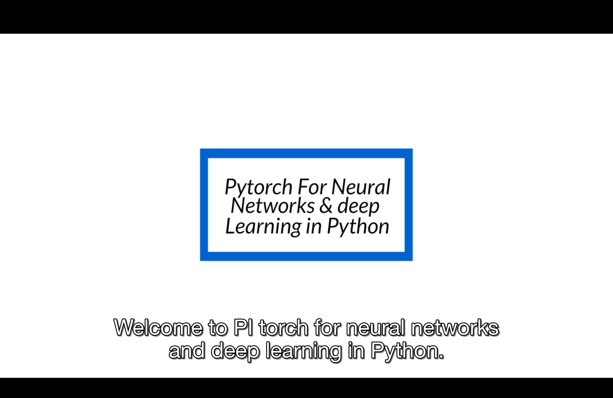
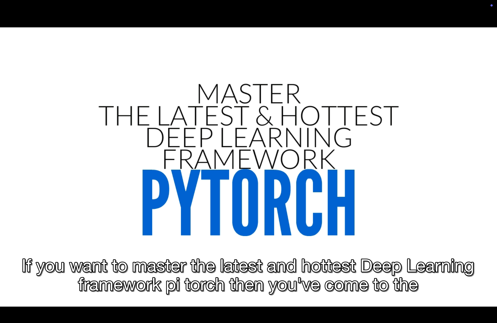
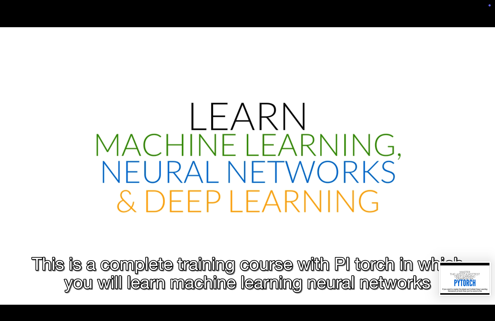

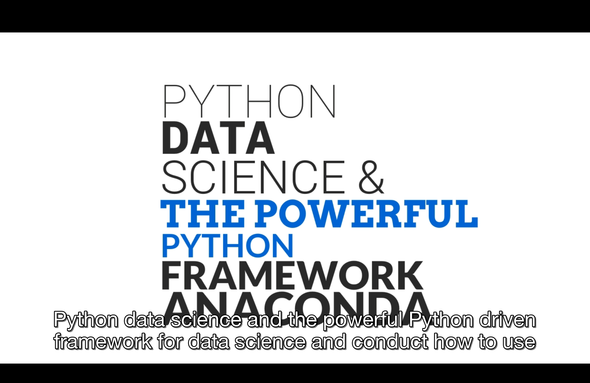

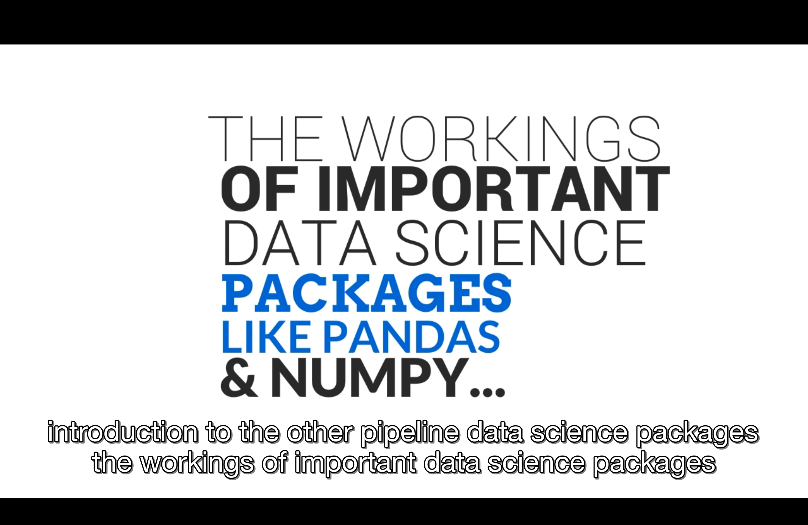

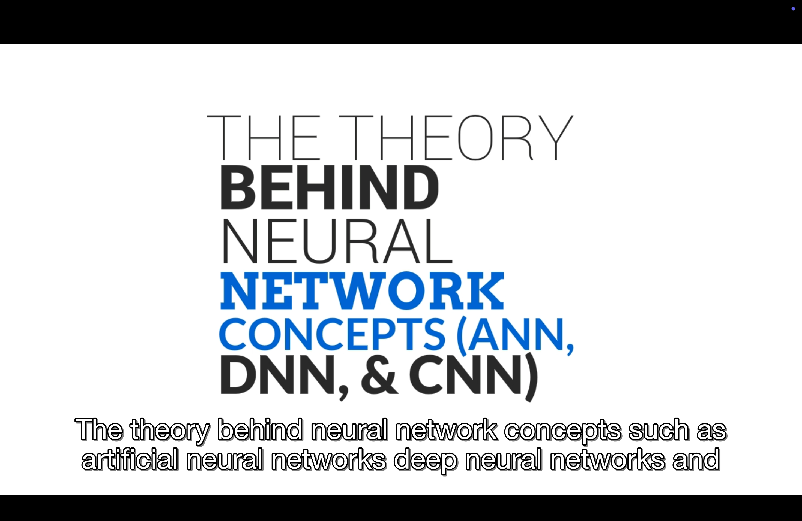
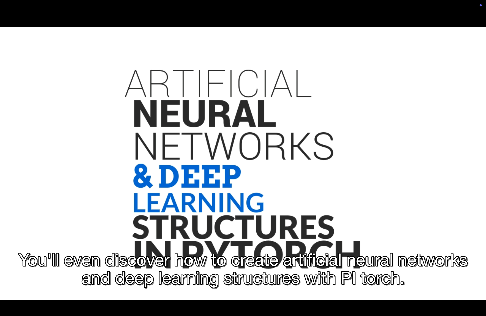
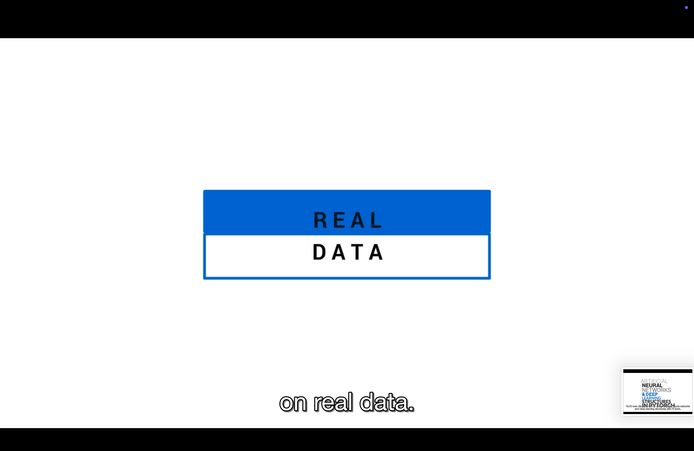

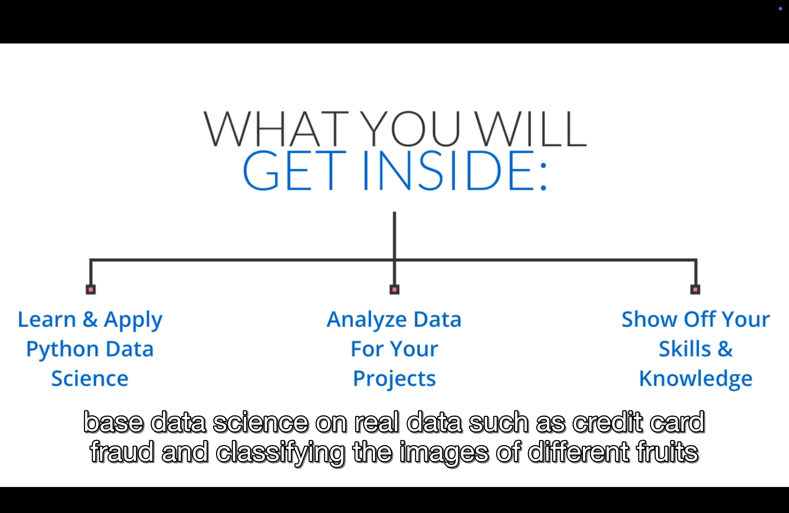

001 Introduction.en
===================

OK, so in this chapter, I'm going to start working with the Python data science environment Anaconda.

Welcome to PyTorch for Neural Networks and Deep Learning in Python. If you want to master the latest and hottest deep learning framework, PyTorch, then you've come to the right place. This is a complete training course in PyTorch, in which you will learn machine learning, neural networks and deep learning. The course is highly practical, which means you'll be able to learn and put your newly acquired knowledge into immediate application. Your instructor is Minerva Singh, a [unclear] bestselling instructor, an Oxford University MPhil graduate in Geography and Environment, and a PhD graduate from Cambridge University in Tropical Ecology and Conservation. Minerva has over six years of experience in analyzing real-life data from different sources using data science related techniques, and over the past few years she has produced multiple publications for international peer-reviewed journals.

Here's what this course will teach you: Anaconda, the powerful Python-driven framework for data science; how to use Jupyter notebooks for implementing data science techniques in Python; PyTorch installation, and a brief introduction to the other Python data science packages; the workings of important data science packages such as pandas and NumPy; the basics of PyTorch syntax and tensors; the basics of working with imagery data in Python.

The theory behind neural network concepts such as artificial neural networks, deep neural networks and convolutional neural networks. You'll even discover how to create artificial neural networks and deep learning structures with PyTorch. Unlike many of the other Python courses, inside this course you will actually learn how to use PyTorch on real data. The course is highly practical, and in it we use really easy to understand, hands-on methods to simplify and address difficult concepts.

After taking this course, you'll be able to easily use packages like NumPy, pandas and the Python Imaging Library to work with real data in Python, along with gaining fluency in PyTorch. Getting access to this course allows you to learn and apply Python-based data science on real data, such as credit card fraud and classifying the images of different fruits. Start analyzing data for your own projects, as well as impress potential employers with actual examples of your data science abilities.

Enrolling in this course doesn't just grant you access to the course itself, but you also get Minerva's continuous support with whatever you need. And on top of this, Minerva offers something that no other instructor provides: Minerva will cover any topics related to the course of your choice, if she hasn't already, at no extra charge. So go ahead and enroll in the course now, and we look forward to seeing you inside.

3. Get Started With the Python Data Science Environment Anaconda--- [ FreeCourseWeb.com ] ---
=============================================================================================

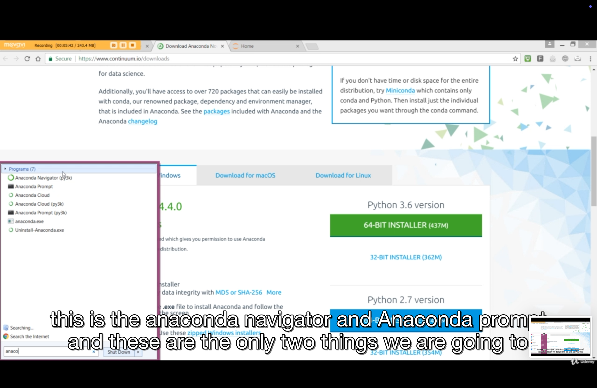

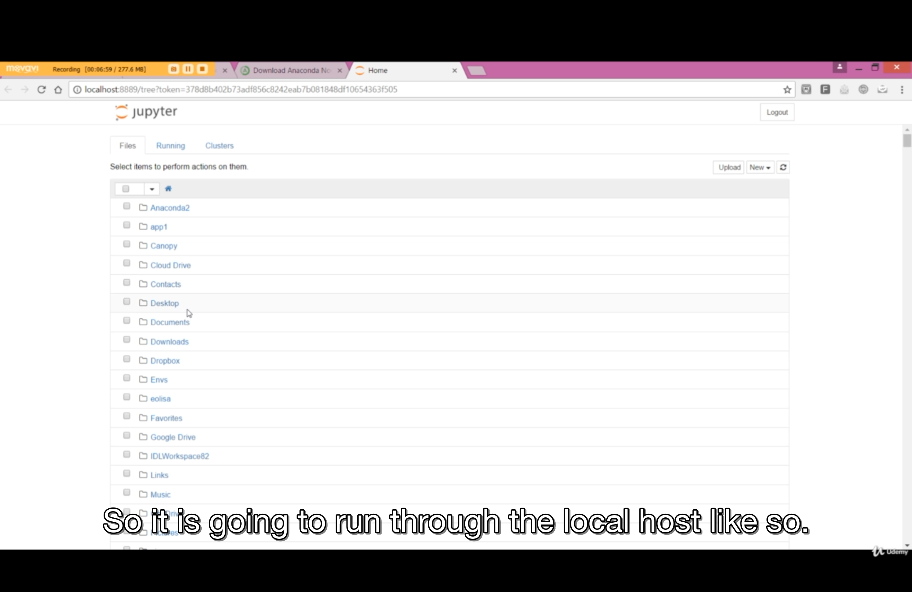

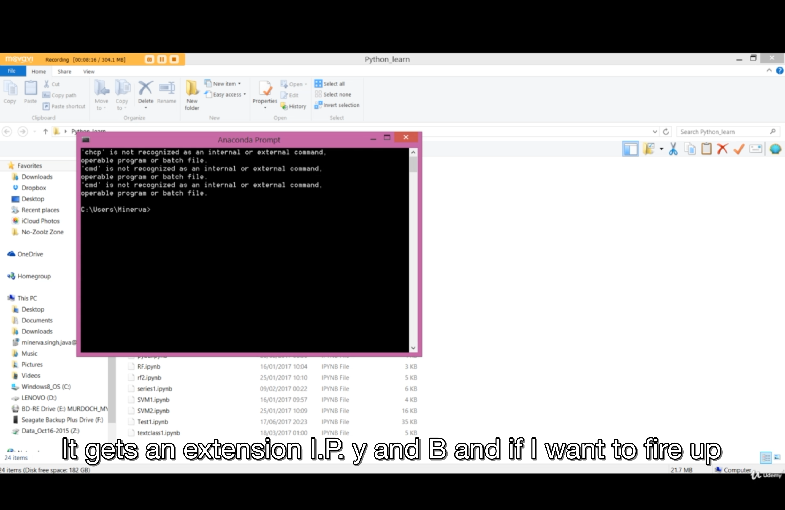
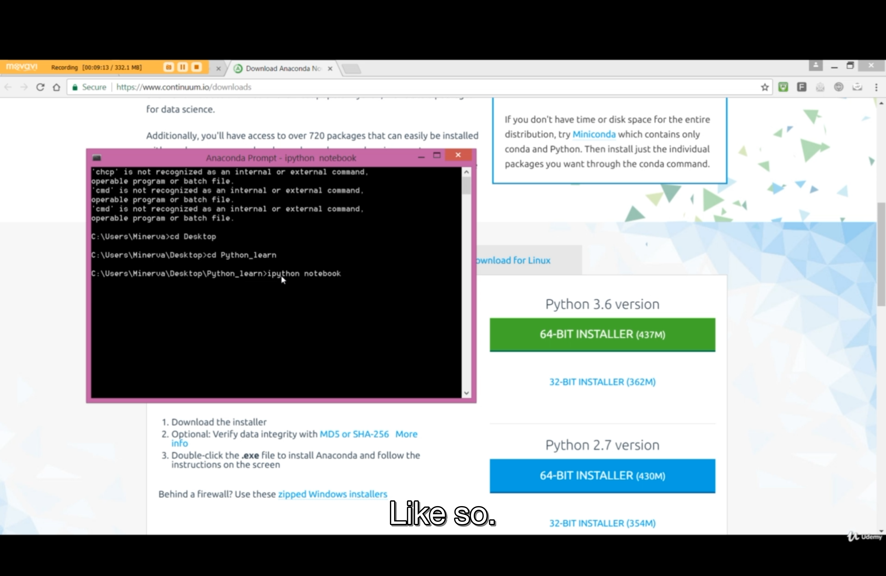

Welcome to this lecture on the Python data science tool that we are going to use. And before I start, just to quickly reiterate: Python is a general-purpose programming language, and it has been used for a wide variety of roles, ranging from programming to web development to scientific computations and data science. It is the data science capabilities of Python that we are going to focus on in this course, and for data science, several Python packages have been developed and are used, and we will be using them in this course.

They include packages like NumPy, SciPy and Matplotlib, to name a few. Now, when I say that I'm going to introduce you to the tool for Python data science, or a tool for carrying out data science in Python, it does not mean that we are going to work with the Python programming language per se. Of course, if you are acquainted with the Python programming language, good. But in case this is something you're not acquainted with, there's really no need to fret too much, because in this course, and for all your Python-driven data science analysis, what we are going to use is something known as Anaconda.

Now, the name Anaconda should conjure up the image of this: it's a large snake found in Latin America, in the Amazon rainforest. But that is not what we are going to focus on. Anaconda is an open-source Python and R distribution, and in this course we are just going to focus on the Python side of Anaconda. Anaconda provides us with the Python interpreter together with a list of Python packages, such as the packages mentioned above, and sometimes other related tools, such as editors, all in one.

And this makes Python one of the most widely used tools for data science applications. And when we have Anaconda on our system, we can implement algorithms relating to visualizations, to actual machine learning tools, statistical analysis, to reproducible research. So for Python-driven data science, Anaconda is the go-to tool that we are going to use in this course, and this is what I will suggest that you get familiar and comfortable with for your future analysis and applications as well.

So let's just go here, and once you go to Google, you can type in Anaconda, and surprisingly, the first entries that come up are not for the snake, but they are for "Download Anaconda Now", and essentially that is what we should do. We will open this link in a new tab, like so. And essentially we are going to download Anaconda. So if you don't have things like Python on your computer, or you're not acquainted with Python, just don't worry: we are going to work not with the Python programming language, but we are going to work in Anaconda, and that, as you can read here, is an open-source data science platform powered by Python, and within Anaconda we are going to get high-performance distributions of Python and some of the most popular Python packages.

And I've already mentioned their names, and we have access to all 720 packages that can be installed with something known as conda. In case that is not something you have encountered before, don't worry; that is something we are going to cover in the next lecture. In this lecture, let us just download Python Anaconda, if you don't have it on your system yet. And Anaconda is available for Windows, Apple and Linux, and you can download it for your own operating system.

There is the 64-bit installer and the 32-bit installer. In case you don't have this much space, you can work with Miniconda, but I heartily recommend installing Anaconda on your system. So you can download the installer and then carry on. I have the Python 2.7 version, but yes, you can go in for the Python 3.6 version, and this will be the default Python version for your computer as well. And just run the .exe, just run the installer once you download it, and follow the instructions.

I'm not going to do this, because it takes an awful lot of time and I already have Anaconda on my system, but just press this button for your operating system and carry on with the installation process in the default mode; just click on the downloaded installer and carry on. Once you do that, you will be able to access Anaconda on your system, and as you can see, I have something known as the Anaconda Prompt and the Anaconda Navigator on my system. In case you've just downloaded everything, you will have to search for things like so, and as you see, this is the Anaconda Navigator and Anaconda Prompt, and these are the only two things we are going to bother with. The Anaconda Navigator:

you can click on it, and I've already done so. Once it fires up, it is going to bring us to this Navigator, and these are the different tools that have been installed as a part of Anaconda. And it includes things like Jupyter, IPython, which is interactive Python, and RStudio, which deals with a completely different programming language. Now, out of all these, we are going to focus on working with Jupyter notebooks, and in case you don't know what they are, that's coming up in the next lecture.

And this is a web-based interactive computing notebook environment, and it is within this environment that we can carry out our analysis, record notes, put in comments, and essentially use this for producing reproducible research. So you can press on the Launch button. And once you do this, we come to this Jupyter. So it is going to run through the localhost, like so. And if I want to go into the system, because in this case we are going to work with Python, and I have Python 2, I'm going to click on Python 2, and this will fire up the Python notebook for me to work with.

And essentially this is the IDE, the integrated development environment, that we are going to work with, and it is within these notebooks that we are going to carry out our data science applications and analysis. But actually this is not the only way of firing up the data science tools that we will work with, so to speak. We can even go to the Anaconda Prompt, and this brings up a prompt like so, and this just brings me to my default C:\Users\Minerva. And this is very useful in situations when I have data and folders located in a given folder and I want to navigate to that particular folder.

And as you can see, .ipynb: these are the files that we have once we save a notebook. It gets the extension .ipynb. And if I want to fire up a notebook, because now we are going to start working with notebooks, I can navigate to the folder. So again, I encourage you to save all your data in a given folder, and in my case my folder is called python_learn, and this is the folder I have navigated to, and now I can actually open a new notebook from this folder.

Like so. So now, as you can see, this has loaded up a different set of files, and these files are the same as what we have in python_learn, the folder that I am working with, and as you can see over here, we have the different notebooks. Let me just open this notebook, and as you can see, I have indeed carried out some analysis, and that has been stored and saved in the notebook called BRCA 1, which has the extension .ipynb. And I also have the different datasets and the different folders located in here, and I can load up a new notebook for me to work with, like so.

So basically, by now you should have Anaconda loaded on your system, and before carrying on further, I would encourage you to install Anaconda on your own laptop or computer, download the data and make a default folder for it, and then navigate to a notebook, an empty notebook, like so, through your default folder, using the steps I have demonstrated. If things like IPython, Jupyter, because as you can see, Jupyter and all these things... if this sounds confusing to you, then what these things really are is something I'm going to cover in the next lecture.

4. Anaconda for Mac Users--- [ FreeCourseWeb.com ] ---
======================================================

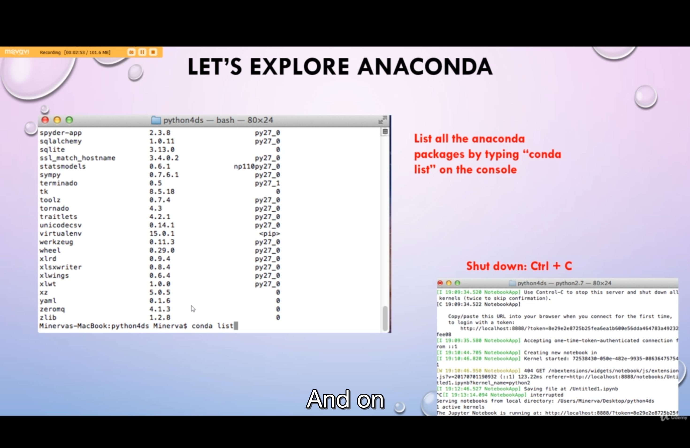
     

OK, before we discuss what IPython is all about, I'm going to just provide a couple of quick tips on installation for Mac users, because this course is going to be exclusively demonstrated on a Windows system. But obviously, if you have a Mac and you're able to execute these steps on your own operating system, then you should be able to carry on and carry out the other processing tasks in this course on your Mac system without any problems. So here goes. As I mentioned in the previous lecture, we go to the Anaconda website, continuum.io/downloads, and you can download Anaconda for your own operating system, which is the Apple system, and please select a version which sits with your version of the Mac, and 64-bit.

That's usually the case. And once the download is complete, in your downloads you will come across this particular thing: Anaconda MacOSX x86_64, because mine is a 64-bit system, so I downloaded the 64-bit. Now you can click on the Anaconda download and follow all the steps as they are. I don't have to take you through that, because it's just a question of clicking along and just waiting for Anaconda to install itself on your Mac, and after completing all the steps you should see the launcher symbol.

I have my launcher symbol on the desktop; it looks like this snake, and you should see it most probably on your desktop, like so. And now you fire up the Mac terminal as usual, and you can navigate your way into your working folder. So this is my working folder, Python for DS, and I navigated myself into that folder and typed in jupyter notebook at the console. So I've done that, jupyter notebook, and this will bring up localhost:8888, and I just ran some code, and as you can see, the code does seem to be working.

So in case you can get this fired up, this localhost, then you have installed Anaconda and your IPython notebook is working on your system, and you're good to carry on further. And again, on the console of your terminal, you can type in conda list, which will show you the list of packages installed with Anaconda. And unlike Windows, where we work with the Anaconda bash, or the Anaconda Prompt, we just continue to work with the terminal on Mac. So we don't use a separate prompt for this in the case of Mac operating systems.

So it's just a question of going into the terminal and firing up Anaconda, or, you know, exploring the packages that you have in Anaconda, and shutting down requires Control plus C. And with that we can shut down our notebook, and if you can carry out all these steps, then you're good to go with Anaconda on your Mac operating system. And now, in the next lecture, I'm going to take you through the details of the IPython notebook and acquaint you with some of the most common items that you should know about.

5. The iPython Environment--- [ FreeCourseWeb.com ] ---
=======================================================

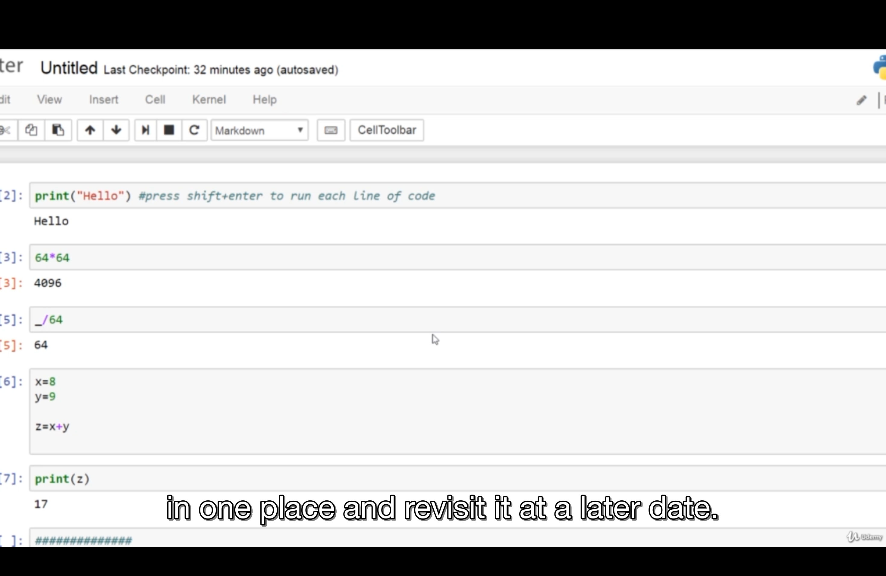
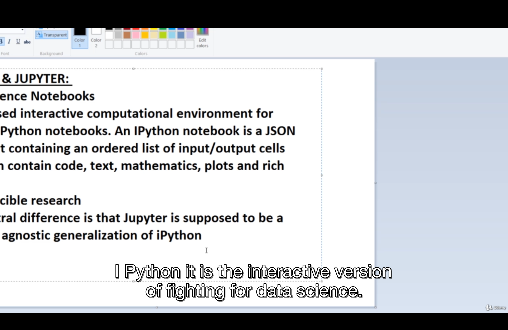
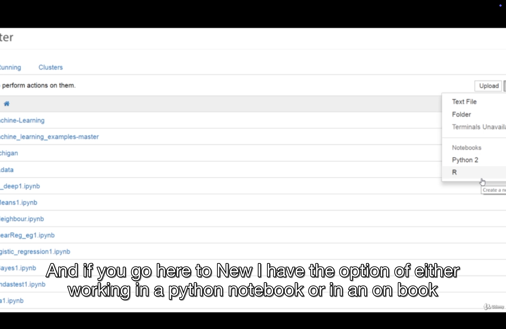
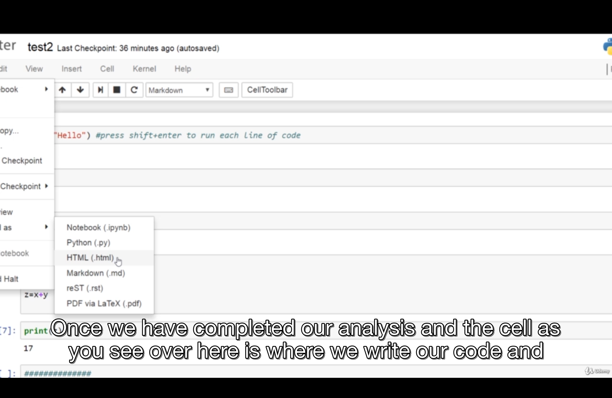
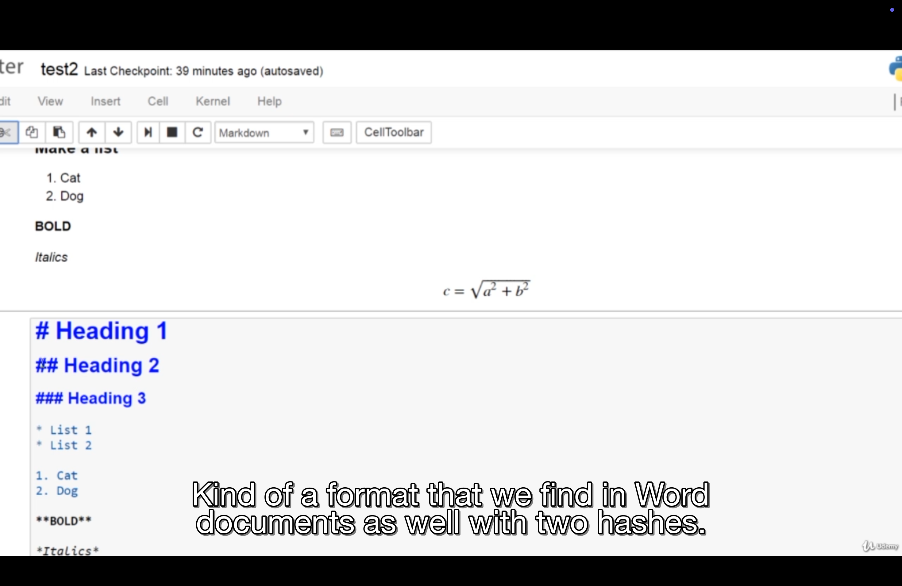
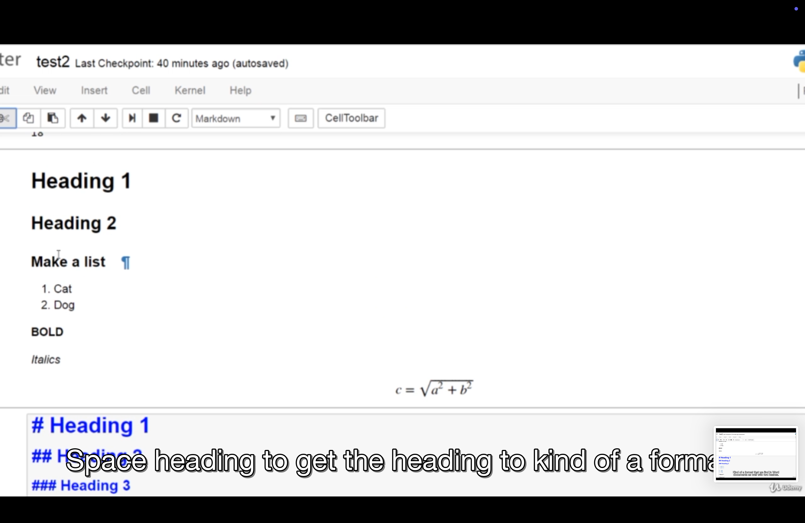
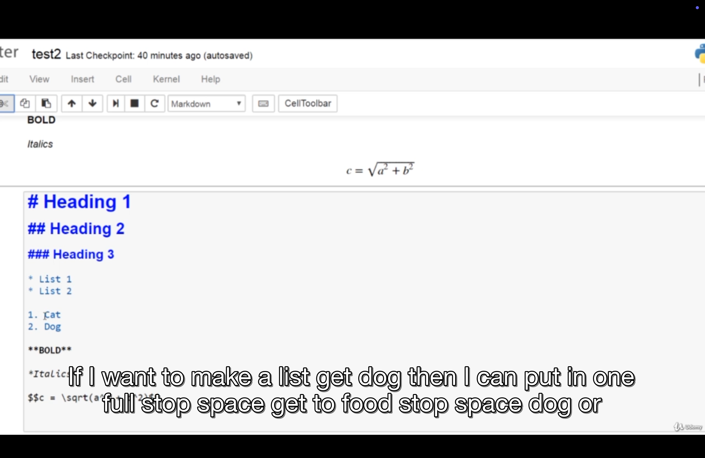
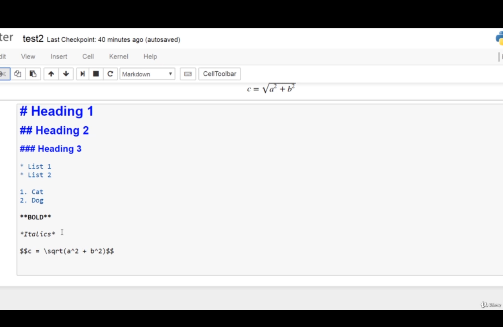

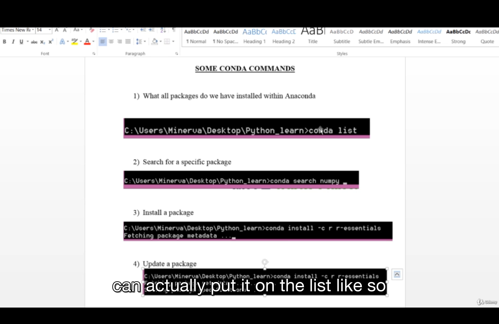
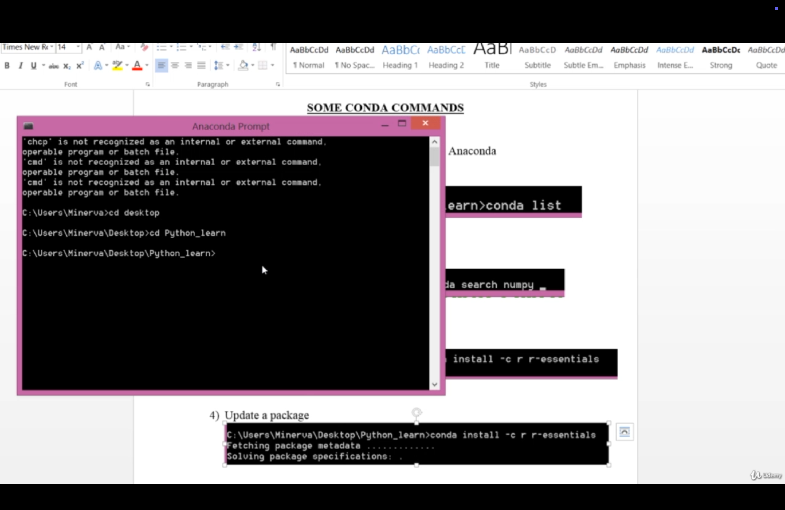

In this lecture I'm going to provide you with an introduction to the Python data science environment. And if you recall, we are going to work with the Python distribution Anaconda to carry out our data science tasks, and in the previous lecture I talked you through how you can install Anaconda on your own system. And if you've done that by now... and if you recall, I recommended that you follow the default steps recommended by the installer. So in my case I did the same, and my copy of Anaconda,

you can see it here, has been downloaded here in my Users folder. And if you're on a Windows system, it is going to be something similar for you, and you have to customize for Mac. The upshot is that by now Anaconda should have been installed in your default folder, the Users folder, or whatever you have on your own system. Once that is done, we can simply forget about this folder for all intents and purposes, because when we start working with Anaconda, what we do, and what you can see over here, is that I have navigated to my desktop, to a folder on my desktop, and we can navigate to any folder on any of our drives and work over there.

And that is exactly what I'm doing here. So as you can see, this is a folder I've navigated to, which is on my desktop, and this is where I'm working from, and it is recommended that you navigate yourself to your working folder as soon as you get started with the data analysis task, the way I have. And once we put in ipython notebook in the console, like so, ipython notebook, this is what is brought up for us. And as you can see, this is a Jupyter notebook which has been brought up.

It is untitled. It is being autosaved. I'm programming in Python 2. So when we start working with Anaconda, one of the first things that we face is: what is IPython, and what is Jupyter, and what are they doing for us? So just to talk you through: IPython and Jupyter, for all intents and purposes, for the purpose of this course and for almost all of your Python data science tasks, are the same thing. They are data science notebooks, and essentially they provide us with a web-based interactive computational environment for creating IPython notebooks. And by notebooks, or data science notebooks,

I mean it is a comprehensive way of storing your code, your plots, your text, your notes in one place. And essentially, as you can see, I've been working in this notebook, and what it does is it provides me with different cells, and when I run my code in these cells, I'm presented with the output, or whatever, and so on, and essentially I can add comments, you know, put a hash for comments, and carry out my data analysis, print out my results and so on. And this is what IPython, or Jupyter notebooks, let us do: essentially we can store all our analysis in one place and revisit it at a later date.

And this is very important. Data science notebooks come from the family of mathematics notebooks, and they're very useful for reproducible research. And the central difference between Jupyter and IPython is that Jupyter is language-agnostic, whereas IPython is the interactive version of Python for data science, and Jupyter is a more generalized version, and I'll just explain what I mean. So once we put in ipython notebook in the command line, if you recall, this is where we come to; essentially we come to my working folder.

And if you go here to New, I have the option of either working in a Python notebook or in an R notebook, which is a completely different programming language. And that is what Jupyter does for us: it offers the functionality and the ease of even working with R. We are not going to do this in this course, but for your knowledge, you should know that that is how Jupyter comes up: essentially you can work in Python 2, and Python 3 if you have installed Python 3, or R. But obviously we are going to work with Python, and as you can see, our notebooks are stored as .ipynb files, and we're going to do that right now.

This is my file. I'm going to Home. Home was brought up when I put in ipython notebook; New, Python 2 notebook, and that is how Untitled came up. Now I'm going to save it, and I'm going to give it a new name, nothing imaginative, but it's "test". Let's just see: now I have this test.ipynb, and this is active and running, because that's what it says, that it is active and running. And now I'm just going to talk you a little bit through what IPython and Jupyter do for us.

We can see File, Edit, View, Insert. Well, once we are done with our analysis, we have the option of downloading this as HTML, or as a notebook, or even as a Python script, or even PDF via LaTeX, but we can leave that alone, and HTML is one of the most common ways of downloading our notebooks once we have completed our analysis. And the cell, as you see over here, is where we write our code, and as you can see, we are in the Code mode: print, within brackets, quotation marks, "hello".

And we put the quotation marks because hello is a string, and if you don't know what strings are, don't worry: in this course you don't have to know anything about Python. Whatever you need to know about Python, those things we are going to learn as we go along, but just to tell you, that's how Jupyter notebooks work. I'm going to say "hello cat", and I'm going to run this cell, because we have to run the code in each of the cells to get an output. So you can either press Shift and Enter to run each line of code, or we can actually press this button here.

So this is what we get: hello cat. And we can perform mathematical operations: 64 times 64, and I'm going to run it: 4096. This particular symbol, the underscore, is going to allude to this cell over here. I'm going to divide it by 64. [unclear], and this is the result I get. So essentially I can even refer to the previous cell and carry out a simple mathematical computation. I can assign variables: x and y are variables which store the values of 8 and 9, which can be changed, and z is equal to x plus y.

I can run this. It will not show any results, because I've not printed my results, and we do need to use the print command when we want to print our results. And like so. And as you can see, this is getting updated, and if you want to add a comment the way I did, press Shift Enter, then we put in a hash, and this is a comment, and this is how most data science notebooks function and look. And we can even remove this particular cell, and now something has changed.

I am in something known as Markdown, and as you can see, I have a heading one, heading two, a list, and I've managed to put in a very simple formula. Now, this is the beauty of IPython or Jupyter notebooks: it allows us to add Markdown, and so, you know, I could even write a simple paragraph of text in my Markdown, but it is based on something called the LaTeX syntax. I'm not going to go into the details of what LaTeX is, but you should know a little bit about Markdown to help improve your own data science workflows.

So here goes. From the dropdown, you can easily change what the dropdown says, and we go to Markdown. With one hash followed by a space, we put in heading one, then we actually get the heading one kind of format that we find in Word documents as well. With two hashes, space, heading two, we get the heading two kind of format. Same with heading three. If I want to make a list, cat, dog, then I can put in one full stop, space, cat; two full stop, space, dog; or even the star symbol.

Space, list; star, list. For bold, I can put in two stars, put in the text that I want in bold, and that is going to be bold. If I want the text in italics, like so, I can put in one star, no space, text, another star, no space, and that is going to give me italics. I even have the option of putting in a LaTeX kind of formula. So if you can see, this is the formula c squared equals a squared plus b squared. If you want to put in any formula, we put in two dollar signs: c is equal to this particular \sqrt, square root, a squared plus b squared, and two dollar signs to close.

And obviously, if you don't know anything about LaTeX and putting in formulas, it's not very relevant, but this is just to show you the power of this Jupyter notebook and what it can really do for us. And I'm going to run it now, and then, as you can see, I have my list, heading one, heading two, formula, italics and so on, and I can even remove it by selecting Cut Cells. So this has been removed, and I can go back to the old Markdown, like so, and this is how we are going to carry on working with our notebooks.

Carry on doing the analysis, putting in Markdowns, putting in comments and so on, and ultimately even downloading it. But what happens when I want to close this, because now I've done my analysis and I need to go to bed? So in the case of a Windows system, I'm going to press Control and then C. You have to improvise for Mac: use the Mac symbol and C. And then this is done. My connection has been broken. [unclear] it is going to be saved.

"Connection failed" means that, OK, now we are ready to go home. We can even shut it down. Not that it is important, but yes, you can shut it down if you like. And that is that. Now I want to step back and teach you a little bit about some other terms that you need to know, such as conda. So as you know, Anaconda is a Python distribution, one of the most commonly used Python distributions for data science, and it comes with hundreds of pre-installed packages for scientific computations, mathematical analysis and data science.

Conda is Anaconda's package management system. I'm introducing conda right now because this is something we are going to encounter as we work our way through this course. It manages packages, libraries and environments. If we want to install a package, something which was not there with Anaconda, then we type in conda install package-name, and it is often the primary interface for package installation in Anaconda. And unlike pip, if you haven't heard of pip,

nothing to worry about: this is the package management system used in generic Python IDEs. Unlike pip, conda is language-agnostic, so basically we can install packages of other languages as well using Anaconda, and pip may be used for packages that cannot be installed using conda straightaway. So I'm going to spend some time introducing you to conda. I'm going to go back to the Anaconda Prompt. In case you get these kinds of warning symbols, you can ignore them, and I'm going to navigate my way to my folder.

Remember, we don't have to be in the default Anaconda folder, and we must navigate ourselves to our working folder. And these are some of the basic commands. So if I want to know what other packages are installed with my Anaconda, then I can actually put in conda list, like so, and these are the different packages installed with my Anaconda, starting with [unclear] and so on. I can even search, because there are hundreds of packages that come with my copy of Anaconda.

I can search whether I have a specific package installed on my system or not, say whether I have pandas on my system or not. These are things that we are going to work with further on. So let us see: conda search pandas. That's a very important Python package for data science. So yes, things like [unclear] and the different components of the pandas package have indeed been installed with my copy of Anaconda. If you want to install a package that wasn't there, then you can type in conda install

and again the package name, and you do have to look up the package name; it's going to be different for different packages. And we can even update packages using the command update. But essentially these are three of the most important commands that you need to be familiar with: listing, searching and installing a package. And we are going to install a few packages as we work our way through this course. So now you know how you can install packages, and they're going to be installed in the default Anaconda folder and so on. So by now, over the course of this lecture and the previous lecture, you should be able to open up IPython notebooks.

You should feel comfortable with that interface, and now you also know a bit about what the conda package management system is, and you can always read up here that this is the conda package, dependency and environment manager system, which is included in Anaconda. And if you are comfortable with the material covered so far, then yes, you're ready to carry on with the rest of the course. All the best.

6. Why PyTorch--- [ FreeCourseWeb.com ] ---
===========================================

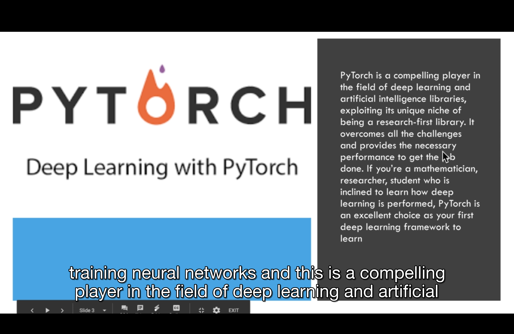

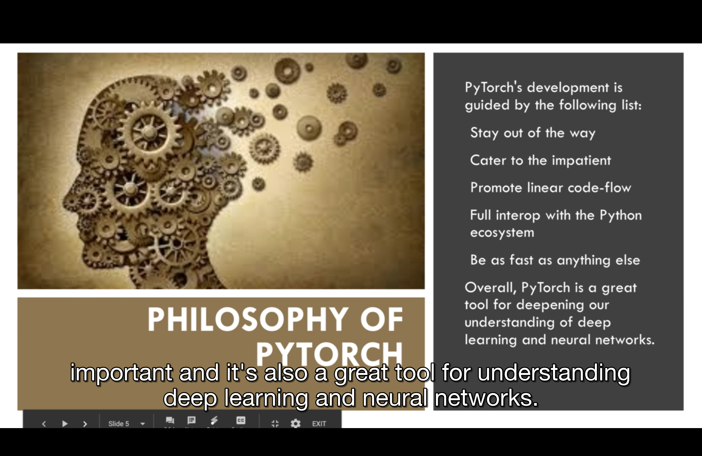
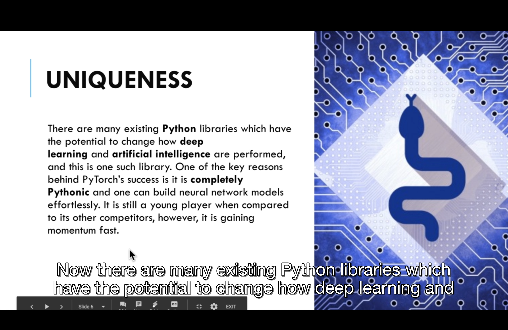
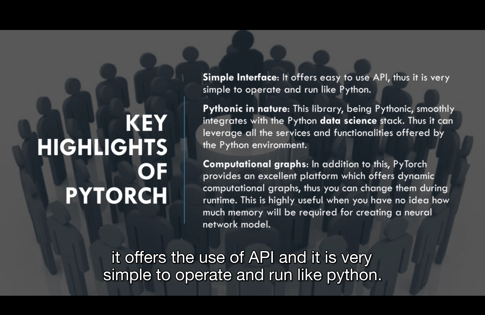

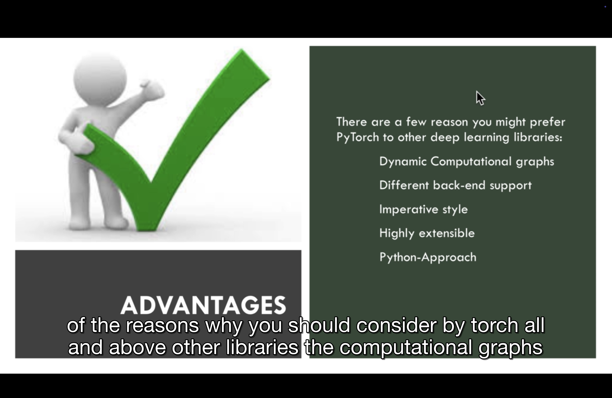
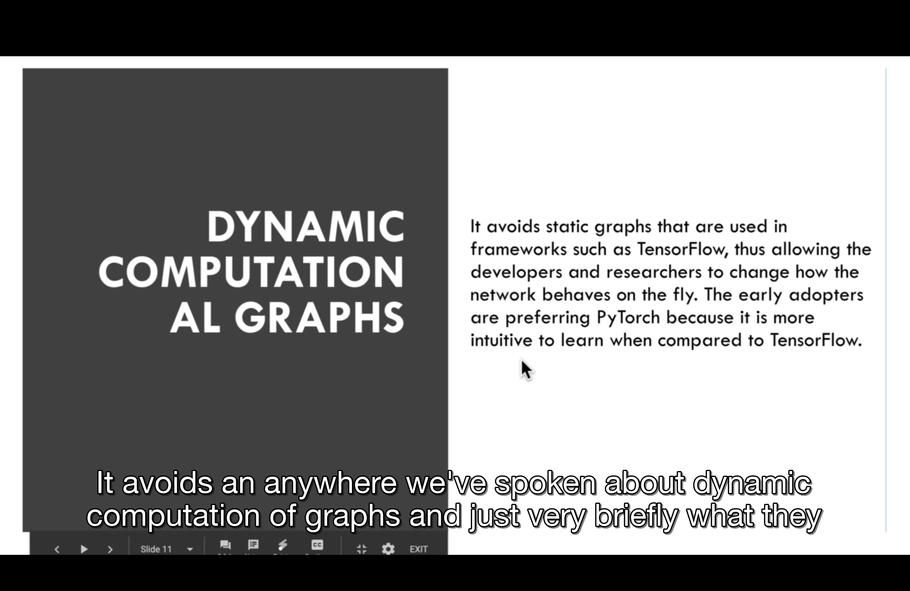

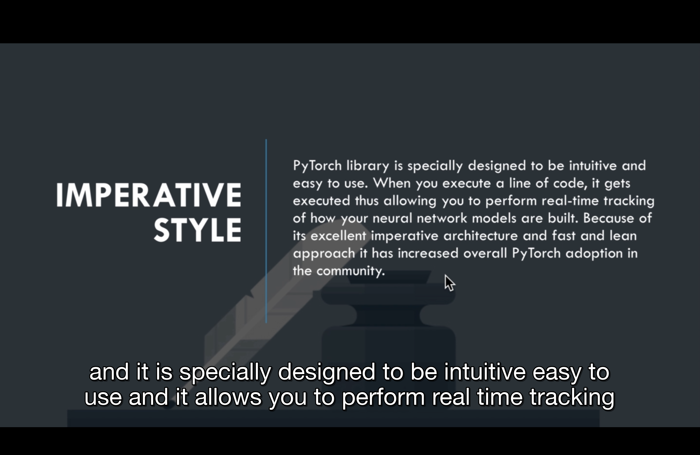

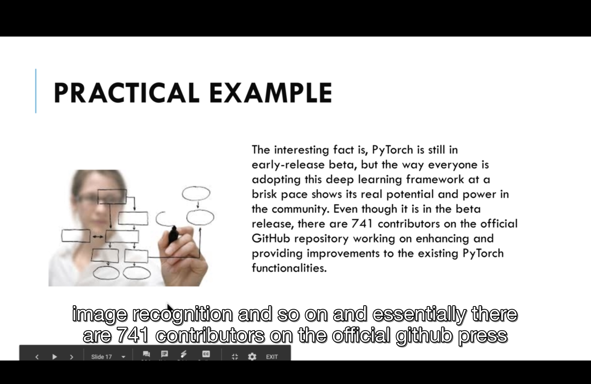

So now I'm going to cover why we should use PyTorch to carry out deep learning. And indeed you are in this course, and you must be... I mean, I assume that you are keen to learn PyTorch and implement deep learning models with PyTorch. But really, just before we move on to installing PyTorch on our systems, I think we are just quickly going to go over why we should even consider PyTorch in the first place. Just a second. So this is PyTorch, and this is the logo of PyTorch.

Maybe you've encountered this before. Now, PyTorch is a Python-based machine learning package, and obviously this is a Python-centric course, and by now you must have installed Python, and you must be having Python Anaconda, and you must be having the Jupyter notebooks running on your system, and in case you can't get your Jupyter notebooks running, then I suggest you step back and actually get them running first. But it is based on Torch, and Torch is an open-source machine learning package, and this uses the power of graphics processing units, and PyTorch is a preferred deep learning research platform, and it has two main features.

It has tensor computations, like NumPy, and NumPy, as you know, is an important Python package, and in case that's not something you are acquainted with, we are going to very briefly touch upon that in the coming lectures. But anyway, it provides GPU acceleration, it allows automatic differentiation for building and training neural networks, and this is a compelling player in the field of deep learning and artificial intelligence, because this is a research-first library, and it overcomes all the challenges and provides the necessary performance to get the job done.

And it doesn't matter what your background is. You could be a researcher or a student; PyTorch is an excellent choice, and in fact it can be a very good choice if you haven't explored other deep learning options before this. So Facebook launched PyTorch 1.0 with integration for Google Cloud, AWS and so on. The initial release of PyTorch was in October 2016, and before PyTorch was created, there was another framework called Torch, and this is a machine learning framework that had been around. The connection between PyTorch and this Lua version, because Torch is based on the Lua language, exists because many of the developers who maintain the Lua version are the individuals who created PyTorch, and Soumith Chintala is credited with bootstrapping the PyTorch project, and his reason for creating PyTorch is simple: basically, the Lua version is aging, and PyTorch is the Python version of Torch, and essentially, in order to use PyTorch, you don't have to learn the Lua programming language, and you're good to use Python. PyTorch's development philosophy is basically this: cater to the impatient, linear code flow, be completely compatible with Python, and that's very important. And it's also a great tool for understanding deep learning and neural networks.

Now, there are many existing Python libraries which have the potential to change how deep learning and artificial intelligence are performed, and this is one such library. And one of the key reasons that makes it so special is that it's completely Pythonic, and you can build your neural network models quite effortlessly, and sometimes, if you're not interested in tweaking the parameters and things like that, that's exactly what you need. It offers an easy-to-use API, and it is very simple to operate and run, like Python.

It's Pythonic, and it integrates very well with the Python data science stack. And remember, as we go further on in this course, you'll realize that in order to carry out deep learning applications, we'll need to interact with other Python packages, like NumPy, which I mentioned before, and so on. And it provides computational graphs, and it offers dynamic computational graphs, and you can change them during runtime, and this is something we'll explore later on. But essentially these are the key highlights of PyTorch, and these are the packages: torch,

this is the top-level PyTorch package and tensor library; torch.autograd, this supports all the differentiable tensor operations; torch.utils; and torchvision. torchvision we are going to work with a lot; it provides access to popular datasets, model architectures and image transformations for computer vision, and initially we'll find ourselves working a lot with this, just to get our hands dirty. The PyTorch community is growing, and more and more people are bringing PyTorch into their artificial intelligence research labs.

So if you master PyTorch, I think you're going to find a lot of community support, and these are some of the reasons why you should consider PyTorch over and above other libraries: the computational graphs, imperative style, backend support, Python approach (I think that really works for me), and highly extensible. [unclear]. We've spoken about dynamic computational graphs, and just very briefly what they do: whereas static graphs are used in things like TensorFlow, and if you have taken my previous courses related to TensorFlow, you know that TensorFlow and its graphs are quite painful, with the dynamic nature the developers and researchers are free to change how the network behaves on the fly.

So I think that's really very, very powerful, and certainly more flexible than TensorFlow. Different backend support: it has backends for CPU, GPU and other functional features, rather than just having a single backend. So it uses the TH tensor backend for CPU and THC for GPU, and so on. So if you just have a CPU, as I do and a lot of you do, then yes, we are going to use the CPU version without getting entangled with the other. And it is specially designed to be intuitive and easy to use, and it allows you to perform real-time tracking of how your neural network models are working, so that's a very good and very non-mathematical way of getting a handle on neural networks and their architecture.

It is highly extensible, because it's integrated with the C++ code, and it shares the C++ backend with the deep learning framework Torch. And it has a Python approach, so it is a native Python package by design, so you are not going to struggle an awful lot with the installation further on, and its functionalities are built on Python classes. So it's going to integrate with things like NumPy and so on. Some of the applications involve Pyro, a probabilistic programming language software built on it. And PyTorch is not limited to specific applications, and it has been used heavily by Facebook, Twitter and NVIDIA,

and it has been used in a number of research domains. We may not touch upon all of them, but they include NLP, natural language processing, machine translation, image recognition and so on, and essentially there are 741 contributors on the official GitHub repository, which makes it, as I said, quite a dynamic and happening community. Thank you. And just to let you know, in this course I'm mainly going to focus on the CPU implementation of PyTorch, and I think that's good for all intents and purposes, but in case you need to work with a GPU, then you can consider using the Google Colaboratory environment, and that's an online Python-driven workspace, and further on in this section I'll just teach you how to get started with Colaboratory, and if you don't want to buy a GPU and things like that, then Google Colaboratory can certainly be explored.

7. Install PyTorch--- [ FreeCourseWeb.com ] ---
===============================================

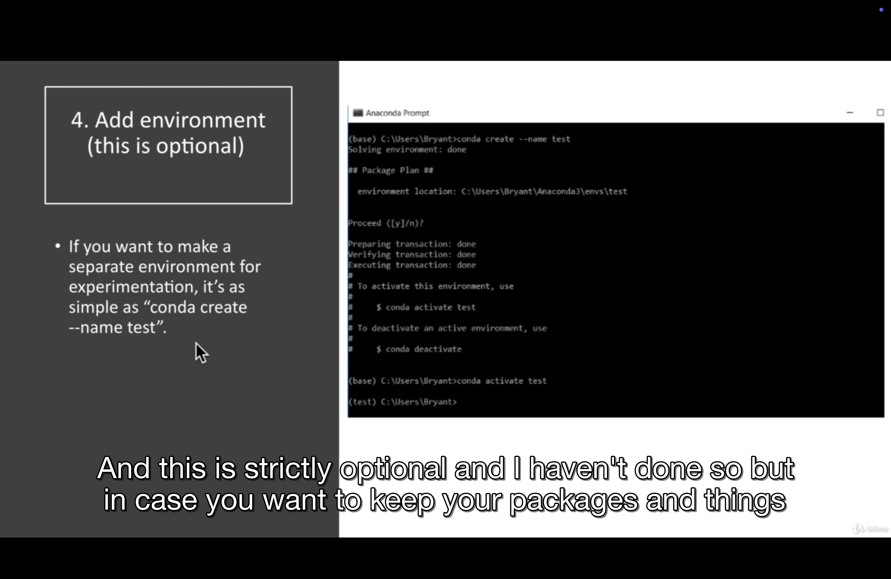
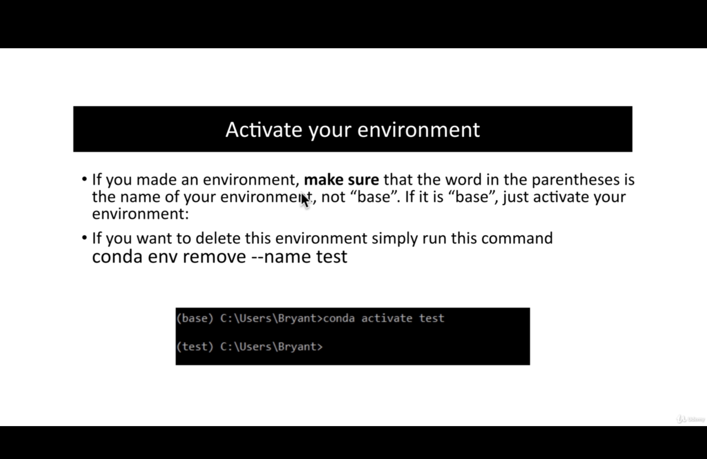

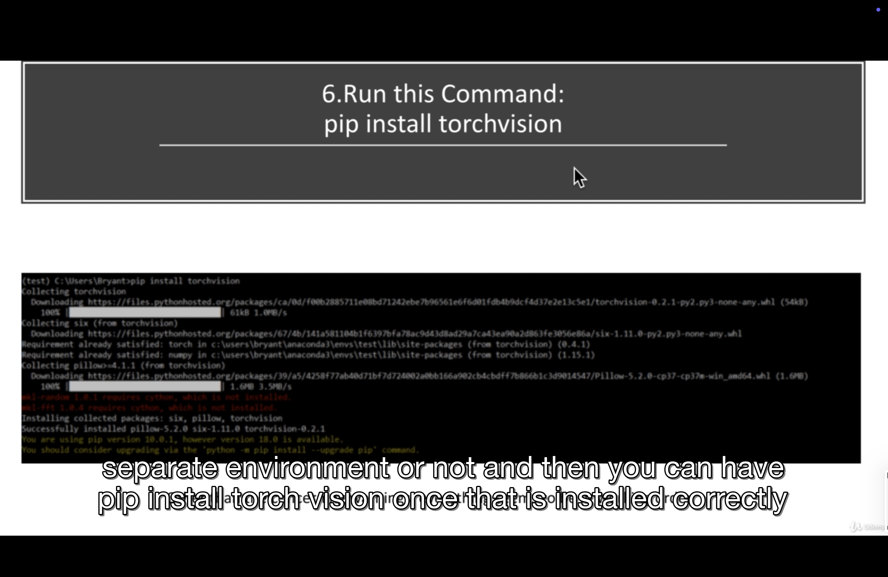

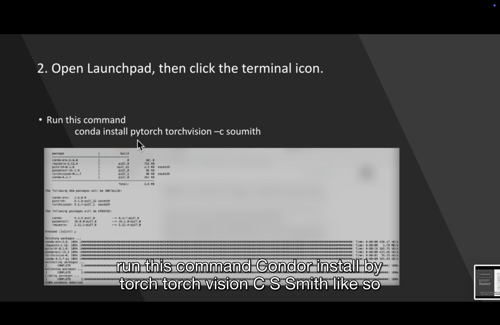
     

By now I hope, whatever system you're working on, you have Anaconda installed and things are up and running. I'm going to talk you through installing PyTorch. Remember, in this course we are mainly going to work with PyTorch. So I'm going to talk you through installing PyTorch on Windows 10, and the same procedure has to be followed on Mac. So once I finish this PowerPoint, I'll just briefly talk you through how I installed PyTorch on my Mac computer.

But let's just focus on these steps. So the first thing you have to do is to install Anaconda, and you can always find the installation instructions on the website. And it is advisable that you install Anaconda with Python 3.6 and not 2.7. Then you can navigate to the Anaconda Prompt, like so: if you're on a Windows computer, you go to the Start menu, Anaconda3 (64-bit), and then you can navigate to the Anaconda Prompt. So if you are working on a Windows computer, then you're going to have an Anaconda Prompt like so, and you can navigate to this one, and then you can install PyTorch from the Anaconda Prompt. And on Mac, if you have a Mac, we'll be doing the same thing, but using the terminal. Now, you can add an environment.

And this is strictly optional, and I haven't done so, but in case you want to keep your packages and things like that separate, then yes, you have the option of adding an environment, and then you can just say conda create --name test, so you can create an environment by the name test, and then you have to activate it by saying conda activate test. And again, if you want to remove it, then you can remove it. So basically this is the environment that we have created, conda activate test, and this is more important on Windows than on Mac, but there you are. Now, the most important thing is that you have to run this command: conda install pytorch -c pytorch, and this is what is going to install PyTorch on your system, in a separate environment or not. And then you can run pip install torchvision once that is installed correctly. And then, to install PyTorch with Anaconda on Mac, again you can install Anaconda, make sure you install 3.6 and not 2.7; on Launchpad, click the terminal icon, and then you can run this command: conda install pytorch torchvision -c soumith, like so. And this should quite easily install the whole of PyTorch on your Mac operating system, and once that is done, you are set to use PyTorch, whether you have Windows or Mac.

9. Further Installation Instructions for Mac--- [ FreeCourseWeb.com ] ---
=========================================================================

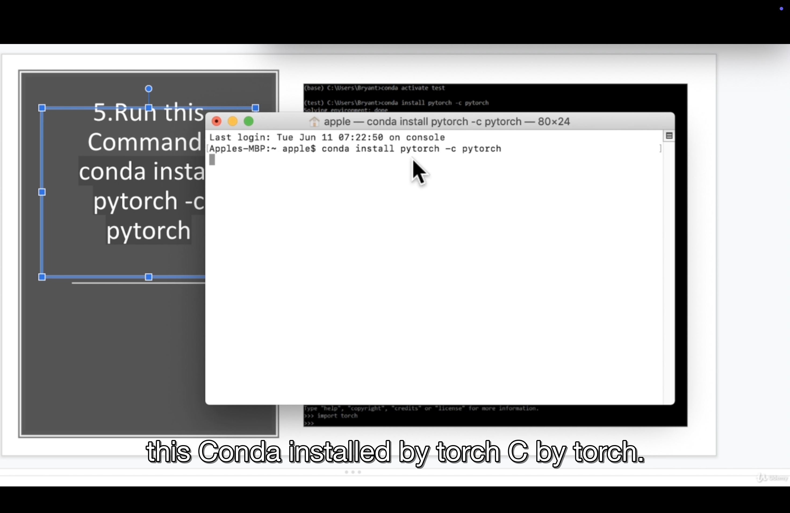
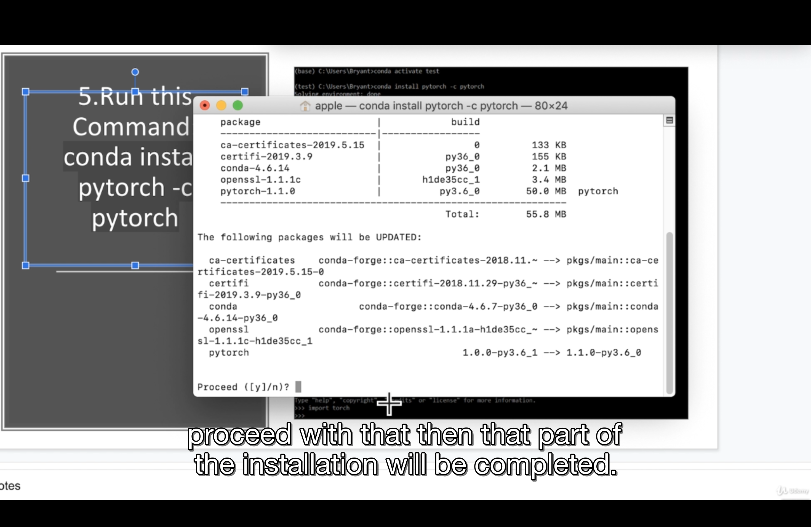

Now, this may sound a bit counterintuitive to you, but in case you run into problems installing PyTorch on your Mac using the previously described methods, then what you can do is try to use something like this: conda install pytorch -c pytorch. This is exactly what we did for the Windows installation, so you can try that, and once you've done that, you're going to get all of these, and then you're going to get this one: proceed, yes or no? And once you proceed with that, then that part of the installation will be completed.

And obviously we are not quite done yet. And after that, what you need to do is... I can bring that up, so let me just bring up my... After that, what you can do is pip3 install torchvision, again the same way as you did when you were trying to install the Windows version of PyTorch. And that too should work on Mac, and that should get your PyTorch up and running.

10. Working With CoLabs--- [ FreeCourseWeb.com ] ---
====================================================

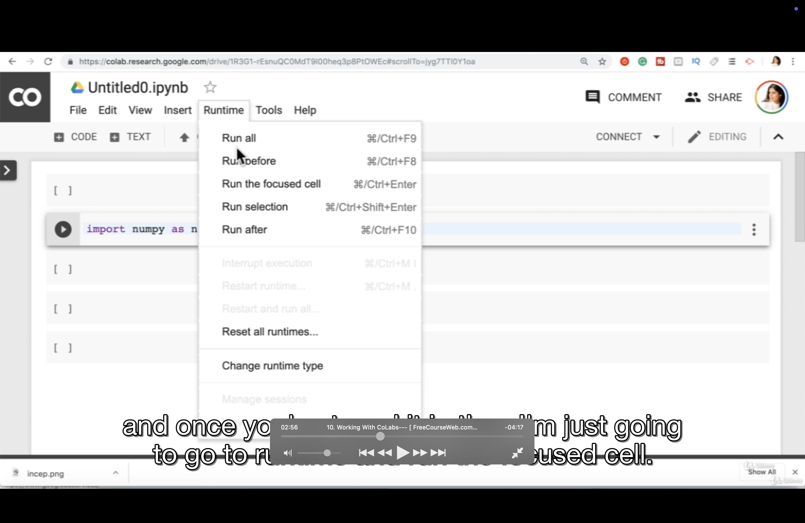

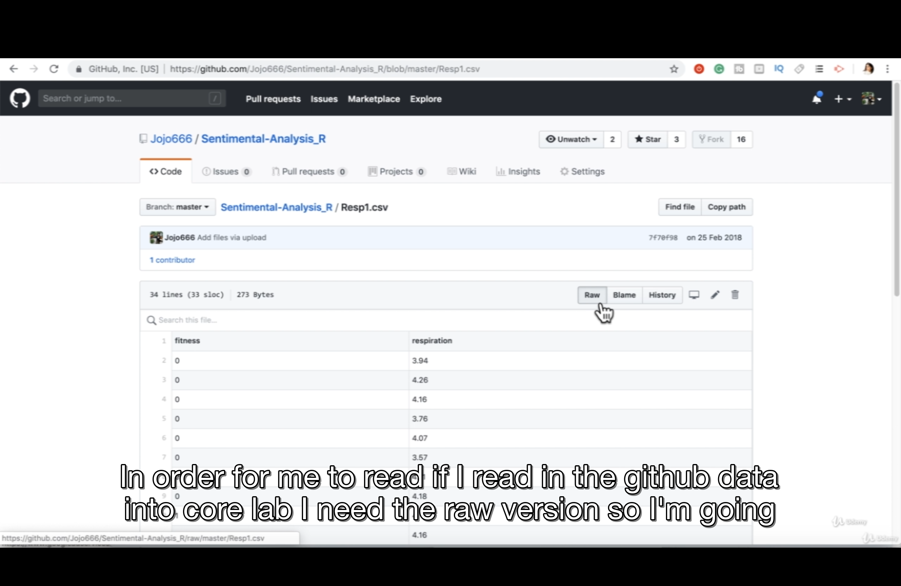

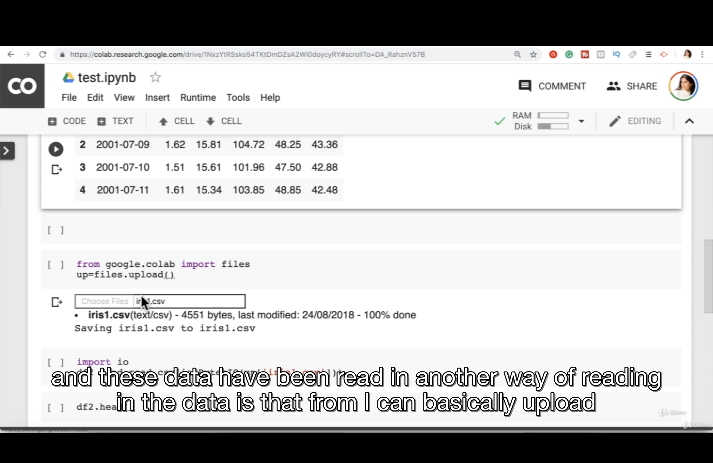

Now I'm going to introduce you to an online, cloud-based system for running your Jupyter notebooks. I've discovered, if you just go to Google and type in Colaboratory, this particular Colaboratory framework. I think it's pretty good if you want to run your Jupyter notebooks straight from your browser, and this does come in handy for people who work with Google Chromebooks and things like that. So now I'm going to introduce you to Colaboratory, and once you type this in, you can just click on the main menu.

It'll take you to this particular page, the welcome page, and I can cancel that. And the thing is, well, when you work with Colaboratory, what it does is that it creates a folder in your Drive. So basically, this is my Google Drive, and I have a folder by the name Colab Notebooks. And as you can see, I have a couple of Jupyter notebooks stored within my Drive, like so. So basically, once you go into Colaboratory, your Drive will end up with a Colab Notebooks folder, like so, and it's a yellow-colored folder, and I have a proper folder.

So I already ran a script in here, like so. And the thing is that if you want to open up your own script, you can just go to the welcome page, File, New Python 3 notebook or Python 2 notebook, depending on whether you want to work with Python 3 or Python 2. You can go in for it, and it should open up a new notebook for you. And as soon as a new notebook is opened, basically as soon as I created that new notebook, Untitled0.ipynb was created in my folder straight away.

And I can just change the font size. So on a Mac, if you do Control, or the Mac button, plus, then the font size will increase, and you can do the same and reduce the font size by pressing either the Apple button or the Control button, plus or minus, as you want to proceed. And the thing is that if you want to add more code cells, you can add them like this. Over here I'm just going to say import numpy as np, and once you've typed it in, I'm just going to go to Runtime and Run the focused cell.

So now it's running, running, running, and my NumPy has been read in. I can even add text cells, something like "test", and maybe I'll just make it bold: test. So basically it works exactly like a Jupyter notebook, and I can have my code, I can have text describing the code and so on. And I've already created a script, and a link to that has been provided, and you can see I was able to import all of these packages, including TensorFlow and Keras, which are the deep learning packages.

The other thing about Colab is that it can be a bit complicated to read in your own data, and there are two ways of doing it. Well, I'm just going to add some text to make things clear: "read in data from GitHub". By the way, a GitHub account is free to set up, and I think you may have encountered this before. So I create a variable, url. I go to my GitHub account, where I have my data uploaded. So yes, you can upload your data straight into GitHub, and, as you know, you may have seen this particular GitHub link of mine, because this is where I store a lot of the course data.

So assuming I want to read in [unclear].csv, yes, we want to click on it. Now, clicking on it by itself won't help me. In order for me to read the GitHub data into Colab, I need the raw version, so I'm going to click on Raw. Once I get to the Raw page, I'm going to copy this particular link, get back here, and I'm going to paste the link into the variable called url, like so, and then, again, Run the focused cell. And then df1, the variable, pd.read_csv(url); it's the same thing as before. And I think this did run: df1.head(), like so, and the data have been read in. Another way of reading in the data is that I can basically upload my CSV. So: from google.colab import files. I create a variable, uploaded = files.upload(), and once I run this, Run the focused cell, it's going to run, and then it tells me to choose the files that I want to upload into this notebook. So I'm going to upload my iris.csv file, and it says 0 percent done, then 100 percent done. I go here.

import io. I create another variable, df2 = pd.read_csv(...). This I can just type as it is: io.BytesIO, with a capital B and IO. This is the variable into which I uploaded my file, uploaded['iris.csv'], because that's the name of the file that I uploaded, and once I run this code, this particular file which I uploaded, iris.csv, is going to be stored as a pandas DataFrame, and that's what I want. So this was my file, and this is what I uploaded, and these are the two most common and simple ways of uploading your own data into Colab and the Colab notebook.

And once you do that, then you can use this Colab notebook the way you would use your own Jupyter notebook.

### 2. Introduction to Python Data Science Packages (Other Than PyTorch)

1. Python Packages for Data Science--- [ FreeCourseWeb.com ] ---
================================================================

 
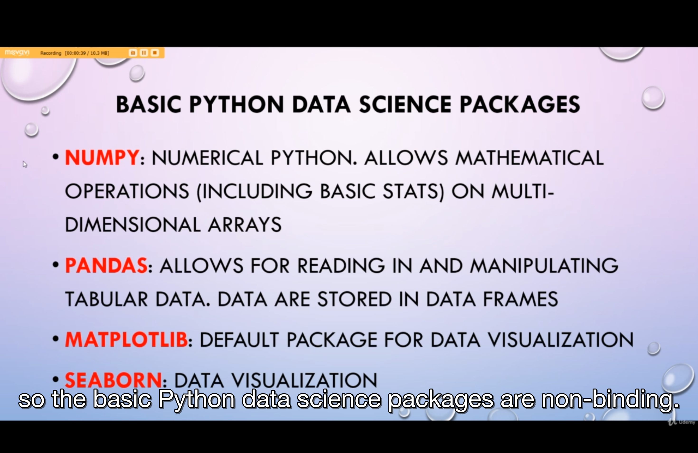
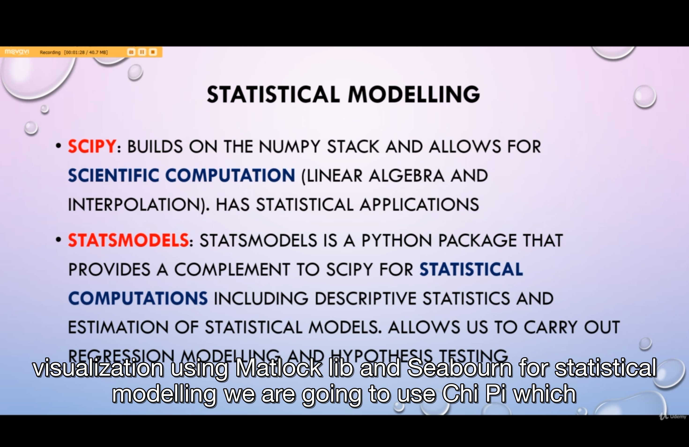
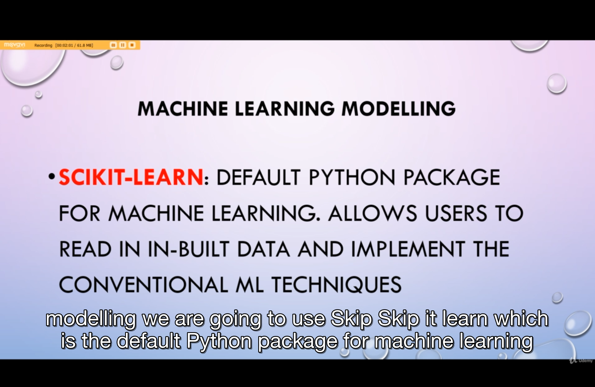
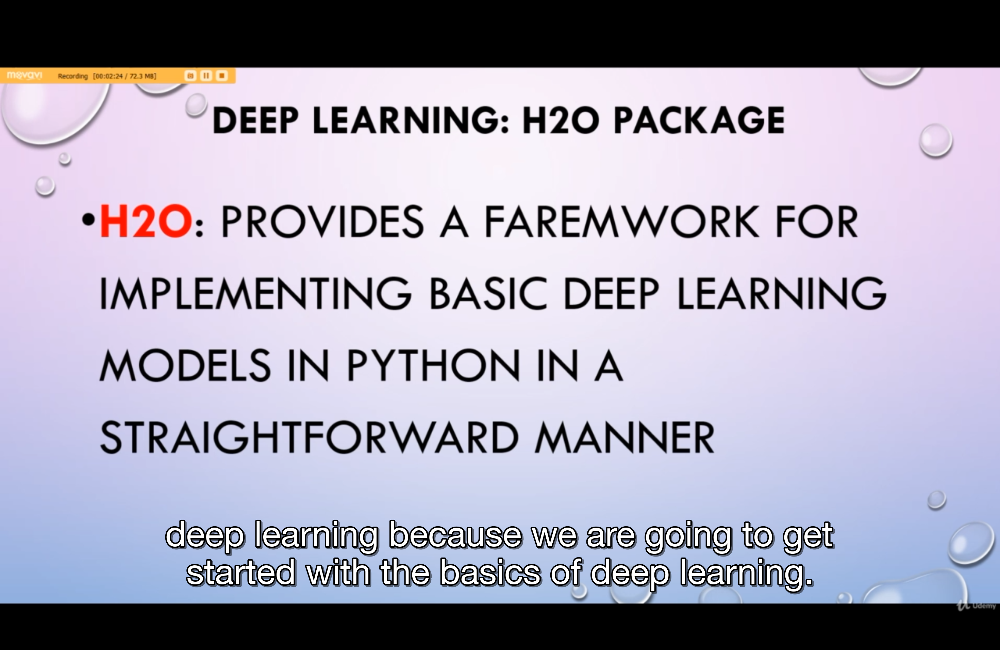

Python data science packages used in the course. I'll just talk you through some of the most common Python data science packages that we are going to use in this course. You should have most of these installed with your copy of Anaconda, and some of these we are going to install later. But the upshot is that, essentially, if you have all of these Python data science packages installed, and you can check whether they're installed or not, then you should be able to carry out some of the most common statistical, visualization and machine learning tasks easily. So the basic Python data science packages are: NumPy,

which stands for Numerical Python and allows for mathematical operations, including basic statistics, on multidimensional arrays; pandas, which allows for reading in and manipulating tabular data. Data are stored in DataFrames, and we are going to be using it a lot when we work with real-life data, and that is what we are going to do in this course: essentially work with real-life data. Matplotlib: this is the default package for data visualization in Python.

In addition to that, we have seaborn, which also allows for data visualization, and in the next couple of sections we are going to exhaustively deal with getting acquainted with NumPy, pandas, and data visualization using Matplotlib and seaborn. For statistical modelling, we are going to use SciPy, which is built on the NumPy stack and allows for scientific computation, and it has statistical capabilities as well. And for the actual statistical model building, we are going to use statsmodels, which is a Python package that provides a complement to SciPy for statistical computations, and with statsmodels we can compute descriptive statistics and carry out regression modelling and hypothesis testing. And for machine learning modelling, we are going to use scikit-learn, which is the default Python package for machine learning, and it allows users to read in inbuilt data and implement the conventional machine learning techniques, and we are going to have two sections devoted to this.

So, working with scikit-learn: you should have this installed on your system. Additionally, for deep learning, because we are going to get started with the basics of deep learning, I'm going to introduce you to the H2O package. Of all the available Python packages out there for deep learning, H2O is the most simple to get started with, and it provides the framework for implementing basic deep learning modules, and it's really quite straightforward.

And once you get acquainted and familiar with working with H2O and basic deep learning, you will be able to graduate to more complicated and better-known packages. So apart from H2O, you should have all the other packages installed with your copy of Anaconda, and over the next couple of sections we are going to get familiar with the most basic Python data science packages and then start building statistical and machine learning models.

So all the best, and hang in tight.

2. Introduction to Numpy--- [ FreeCourseWeb.com ] ---
=====================================================

See the notebook [here](./code_and_data/section2/lecture13_createNumpy.ipynb).

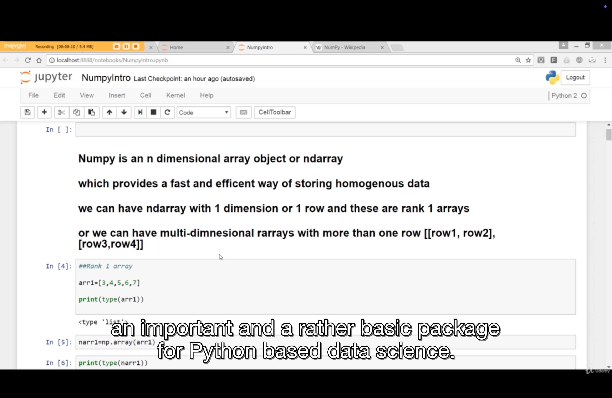
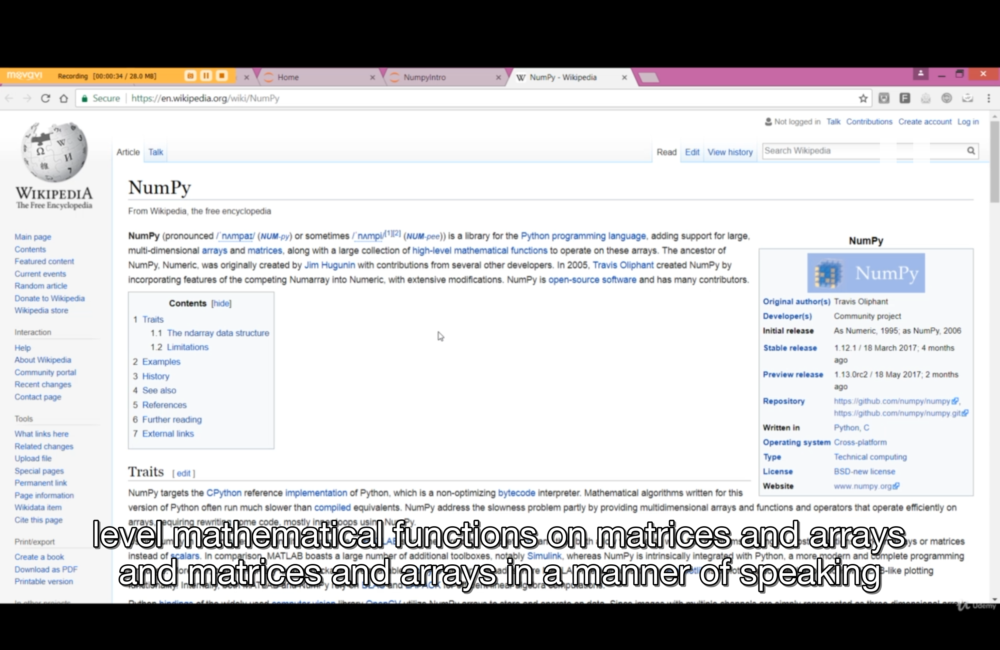

In this very brief lecture, I will provide you with a very brief introduction to NumPy, which is an important and a rather basic package for Python-based data science. And essentially, let us just look at the Wikipedia page of NumPy. NumPy stands for Numerical Python, and what it does is, as opposed to the conventional Python data structures, it has a lot of support for multidimensional arrays and matrices, and allows for implementing high-level mathematical functions on matrices and arrays. And matrices and arrays are, in a manner of speaking, a building block for data science, and the key thing about NumPy is that it provides us with an array, and that's a fast and efficient way of storing homogeneous data.

And this can be either rank 1 or rank 2, you know, one-dimensional or multidimensional, and there's a plethora of mathematical functions out there that we can implement on the arrays. But first I'm going to look at the importation conventions. Now that we are working with Jupyter, in the Anaconda system, all of these packages, things like NumPy and pandas, come installed, but we have to import them before we can use them. So when I say import numpy as np, it is going to import the NumPy package as np.

And whenever I want to use NumPy for something very NumPy-specific, I'll have to specify, you know, things like np.array or np.dot. So when I want to refer to NumPy-specific functionalities, I have to append this np to whichever function I'm alluding to. Otherwise it won't work. So np.eye: now, eye is a kind of NumPy function, and if I want to call it, then I have to say np.eye. And if, instead of import numpy as np, I just imported numpy, then instead of np I would have to specify numpy; instead of np, I'd have to specify the whole thing.

So that is why it's more convenient to say np.array, and we are going to use similar conventions throughout this course. So if I want to import pandas, which is another important data science library, I can either say import pandas or import pandas as pd, and this is just one of the most common ways of alluding to these specific data science packages. And as you can see over here, when I put in a very simple array, you know, it is of the type list, and this is because list is a very common Python data structure.

It is useful for a lot of operations, but it is frankly not conducive to data science. So when I say np.array, it becomes a numpy.ndarray object, and it is these numpy.ndarray objects that we are going to work with throughout this section, and see the different functions that we can implement on numpy.ndarray. And this includes everything from basic arithmetic operations to solving a system of linear equations to basic statistics.

So essentially, now you can go right ahead, import numpy as np, and we will get started from the next lecture onwards.

3. Create Numpy Arrays--- [ FreeCourseWeb.com ] ---
===================================================

In this lecture, I'm going to provide you with a very brief introduction to NumPy arrays and what we can do with them, and to begin with, how we go about creating NumPy arrays. We are going to work in this particular notebook called numpy intro, and that has already been provided to you. I suggest you type out all the code as I type along. The more practical applications of NumPy are going to follow further on in the course.

But right now it is just important to get the hang of what NumPy arrays are and what they can do for us, and that is what this section will focus on. In order to use NumPy, first we need to import the NumPy package, and we are going to import the NumPy package as np. And essentially NumPy is nice and allows us to use an n-dimensional array object, or ndarray, which provides a fast and efficient way of storing homogeneous data. And we can have an ndarray with one dimension, one row, and these are known as rank 1 arrays, or we can have multidimensional arrays, ndarrays with more than one row.

You know, we can have things like two-row or three-row arrays, and that's a very effective way of representing matrices. So first I'm going to show you how we go about creating np arrays, and especially rank one np arrays, and we can create these from ordinary lists as well. And just to demonstrate: basically this is a list stored in the variable l1. And essentially this is just one list, and I can take this one list and convert it into a rank one array, like so. So I'm going to use the inbuilt function called np.array, and because I've imported numpy as np, I'm going to put in np.array over here, and had I just put in import numpy, then I would have put in numpy.array here.

So let's just do this. Let's check its type by using the function type. So this is a numpy.ndarray, and it's a rank one array, because it just has one row, because, you know, I just put in one list. But we can even create a multidimensional ndarray. Let us just run it. And this is a rank two array, because, you know, we have two rows, and obviously this has four columns, and I can even make a bigger array than this, and remember, it's all going to be a homogeneous array. So as you can see, this is a multidimensional array with three rows and four columns, and I can make my multidimensional arrays as big as I'd like them to be.

And let us see what the dimensions of my array are. So over here I put in the name of my array, array3.shape. And when I call the function shape from NumPy, it tells me that this array has three rows and four columns. And I can even create some very specific kinds of arrays. See, if I want to create a two-by-two array of zeros... sorry, there was a problem with the brackets. I needed two brackets, and as you can see, I get two rows and two columns full of zeros. And obviously you might wonder what their purpose is.

But, you know, if we want to carry out linear algebraic operations, or carry out matrix manipulations, then the ability to create such customized arrays is very important and useful, and these are the kinds of manipulations that we do end up carrying out occasionally in data science operations. So it is important to know what more we can do with our arrays and how we can extend the scope of NumPy to create such specialized arrays. And again, this gives me an ndarray full of fives. So this is a two-by-two multidimensional array, a rank two array, but full of fives. And I can even create a two-by-two matrix where the diagonals are one and the other values are 0, and again these are the kinds of arrays that one may end up using in different applications.

So as you can see, in this case the diagonal is one, but the other values are zero, and it's a two-by-two array, which I can name, and let's see if I can just make it bigger. Let's just make it a four-by-four array, like so, so that all the diagonal values are one and all the other values are zero. And again, these are the kinds of things that do end up lending themselves to different matrix and linear algebra related computations. And right now we are just going to focus on looking at some of the functions that we can implement on NumPy-based arrays, and see how we can carry out mathematical operations on them, you know, things like indexing, subsetting, or even applying some statistical operations on these, and that is going to come up in the next couple of lectures.

4. Numpy Operations--- [ FreeCourseWeb.com ] ---
================================================

See the notebook [here](./code_and_data/section2/lecture14_op.ipynb).

In this lecture I'm going to introduce you to some of the most common and basic NumPy operations that there are. And essentially we are going to use these operations throughout the course in one form or the other. If you're rank new to Python and things like NumPy, these may sound a bit complicated to you, but I would still suggest that you run the code, and preferably run it as I demonstrate on the screen. And as we go along through the different topics, we are going to revisit these concepts in one form or the other.

So these things are all going to become clear as we go on further. So now let's just get started. And before that, I'll just quickly reiterate: in Python, the index starts from zero, left to right. And suppose this is my NumPy array, and I have B at location 1; then the positive index corresponding to B is zero. And we also have negative indices, which run to the negative of the largest number. So if I want to allude to B, I either allude to index zero or I allude to negative nine. And these are some of the operations that we carry out when we want to isolate, or subset, or index out a part of the NumPy array.

And what happens is that, this is my NumPy array a: when I provide a start index and an end index, the indexing will be done from the start index all the way through to the second last, to end minus one. And if I just specify this, then it is from start to the rest of the array. And, you know, these are items from the beginning through the second last, to end. And a, with a colon within the square brackets, is how we copy an array, OK.

This may sound fairly complicated, so don't worry, we are actually going to do that in practice. I've already created a simple list a, and I'm going to convert it into an np array by calling the function np.array, and I've already imported the NumPy package as np. So what I'm going to do is np.array, which turns my list into a NumPy array, and I can print out my np array. I can even print out the type, and this is a NumPy ndarray, and we can print its shape, and it tells me it's a rank one array with seven items. And now I want to print out an element at index 2. So let's just look at this figure again, and now look at the NumPy array.

What do you think should be printed out? I suggest you think about it for a couple of seconds. Let's just do it: eleven. Now, eleven, strictly speaking, in chronological order, eleven is at the third location: one, two, eleven. But when I specify two, I'm essentially referring to index two. So one is at index 0, two is at index 1, eleven is at index 2 and 6 is at index 3, and therefore I get eleven. Now I want to isolate an entire chunk, based on the start index one and the end index 5.

So it's going to print out the values from the start index, the value located at the start index, which is 1, and the value located at start index one is 2, because at start index 0 we have 1, and it is going to print all the way to the end-minus-one index location. So now, for the next couple of seconds, think what should be printed out, and preferably try to write it down or not. But anyway, this is what gets printed out: it's two, eleven, six, eight, and this is because it goes to index four: 0, 1, 2, 3, 4. And this is how we print out things, because when we specify the end index, the last digit that we get is the value at the n-minus-one index location. We can even use a step of two.

So I've done it. And as you can see, when we use a step of two, we start at 1, and then we move to 6, but after that we don't print out anything, because we have come to the end. We can even have a negative index, which will print out... actually, let us just print out the last item using negative one. And this is my last item here, and this is going to be... because what happens is that when we have a negative index, going all the way from minus seven, because I have seven items, minus seven all the way to minus one, then the last item in my NumPy array is the one located at negative seven, and that is what got printed out.

Now, if I want to print out a couple of digits from this NumPy array, what I'm going to do is I can specify: go from the smaller index to the larger index, minus seven to minus four. You know, based on this, over here we have minus nine. So with a seven-item NumPy array, our index 0 is going to be minus 7. If I had a 10-item NumPy array, my first item, the negative index of index zero, would be negative ten, and so on.

So I'm going to start with, say, negative 7, go all the way to minus 4, and it will only isolate numbers till negative 5, because in this case we move from start to end plus 1, and that is why we get one to eleven. So there you are. It does sound a bit complicated, and I would suggest writing out an array on your own and, you know, labeling the index numbers, and then running this code a couple of times on different NumPy arrays, trying different combinations and actually quizzing yourself, so that you'll get the hang of it.

You know, if there was minus 3, in this case we get this, because in this case we will isolate numbers till negative four, and negative four is larger than negative seven. So, you know, we are going from the smallest index we have, which is negative seven, and going up all the way to negative four. If we specify negative three, that's how we get values up to six. So this does sound complicated, and unless you are using NumPy on a daily basis, this is going to sort of trip you up, or hamstring you, in a way.

So I would suggest maybe even pausing the lecture and trying out a few combinations of your own, and certainly after we complete this lecture I would recommend trying out a few combinations of your own, writing out things and drawing indices, till you get the hang of it, before moving on. So now, items that start at one index and go all the way to the end. So now if I want to start from start index three, which is index number three, and that should contain... 0, 1, 2, 3, so from 6, that's where we are going to start from.

Because it's going to be index number three, and it goes all the way to the end. So in this case the end was included. And now if I want to start at index four and go all the way to end minus 1, then this is what I get, and the end is not included. And if you recall, this is how we create a copy of an array into b, and I get the same thing as before. And now I can concatenate two NumPy arrays, which means I can even join two NumPy arrays containing different numbers of items, as long as they contain numbers, because the thing with NumPy arrays is that they have to store the same type of values.

So if we have numbers in both x and y, and my NumPy array x has four numbers and y has three numbers, I can still concatenate them with np.concatenate: call the function concatenate and specify the package np. And when I print it, you can see I get 2, 6, 8, 4, and appended to that is 11, 8, 2. And let's quickly look at a couple of multidimensional array operations, and this is the multidimensional array that I'm working with, and you can see it here. And the thing with multidimensional arrays is that we have everything starting at row 0 and column 0, so the first cell is basically row zero and column zero. It's the same principle as before: Python indexing always starts from zero.

What happens when we want to print the first row? If I want to print the first row, then I am going to specify index zero, and this is how I get the first row. And now I want to print the third row. Then I have to specify index two, and that's how we get seven, eight, nine, which is basically, in chronological order, row three. Now if I want to print the contents of a cell where the row index is 0 and the column index is 1: so basically this is the row we are looking at, and this is the column, because both rows and columns start with 0.

So when I print this out, we get two. Let's just try out something else. Let's go to the second row and the fourth column. Now, before I run this, I would suggest that you ask yourself, and maybe quiz yourself, what exactly should be printed out. Remember, if this is row two, we are essentially going to move to the third row, and so on. It just doesn't work. Let's just try this, and we get nine, because this is at the third row: when I specify index 2, we move to the third row, and we move to the third column with index 2, and with index 3 we would move to the fourth column; since I did not have a fourth column, I got an error.

So obviously, if you go out of bounds, you will get an error. But specifying three here, because we use the scheme of row and column like so, takes us to the fourth column, column number four in chronological order, and that's what ultimately gets printed out. Now, say I want to replace this value of twelve with 14. Then obviously I search, I figure out which row it is, and this is the fourth row, the third index, and column 0, because it's the first column, then I specify 14.

So basically, for this particular cell I specified 14, and when I printed it out, it has been replaced with 14. And if I want to get the last row, two, eleven, eight, 10, I just specify negative one, because again this schema also applies for rows and columns, basically for multidimensional arrays. So the last row is actually negative one. And if I want the second last row, essentially I move up one, and this is what I get. And if I want to print a given set of rows and columns: for rows, it is going to print the rows from index 1 to index 3, and columns from index 2 to 4.

And this is what we get. So if you just compare this, let's just move up: when I specify one, we move to row one over here, and that's how we get the five and the 9, and then columns 2 to 4. And you can even try to draw this out, and this is what we ultimately get. Now, if we have np arrays which end up having two items each, like so, we can even concatenate them row-wise by saying np.concatenate, and this is what we end up getting.

So this is my array a, which is one, two, three, four. So we have the same number of columns, and we want to concatenate row-wise, which is the easiest way of doing it, with b, which would just contain 5 and 6. So this is how we can concatenate: by specifying this, 5 and 6 get added to the end of this particular np array a. And these are just some of the very common operations that we can carry out with NumPy, and I would recommend going over the lecture once more if things are not clear, and even making modifications to these NumPy arrays yourself and quizzing yourself as to what the answer may be, and then seeing what the answer is. Do that a couple of times, and things should become clearer.

And now we are going to move on to the next lecture.

5. Numpy for Basic Vector Arithmetric--- [ FreeCourseWeb.com ] ---
==================================================================

See the notebook [here](./code_and_data/section2/lecture15_arith.ipynb).

OK, now in this lecture I'm going to introduce you to a bit of vector arithmetic. And I've already created the NumPy arrays x and y using np.array, and that is because I imported numpy as np, and you can do the same. And we will start by creating very simple vectors. And if you remember, these are the rank one vectors that we had created in the previous lectures. And essentially we perform the basic vector arithmetic on these.

So the simplest vector arithmetic operation that we can perform is an addition operation, and I have specified x plus y, and this is how it works out. So this is my first vector, x, and my vector y. And now the addition is done element by element, like so. So the value at this location, a1, will be added to the value at this location, b1, and so on. The same goes for subtraction. And as you can see, this is the result I get: 3, 5, 7. 1 plus 2 is 3, 2 plus 3 is 5, 3 plus 4 is 7.

And we can also perform scalar addition, which is the act of adding a constant to a vector, and you can already see that I have my vector 1, 2, 3, and I want to add a scalar, which is 2 in this case. So what happens here is that 2 is going to be added individually to all the vector elements, which are numbers in this case, and that is how I get 3, 4, 5: 1 plus two is three, two plus two is four, three plus two is five. And the same thing happens when I subtract, x minus y.

So 1 minus 2, 2 minus 3, and so on, and let's just do it the other way around. Remember, it's going to be element by element there. And now, for multiplication, there are two ways of carrying out multiplication: the Hadamard product and the dot product. We discussed it in the previous lecture: the Hadamard product is basically how we get a vector at the end of our multiplication, and with the dot product we get a number, or a scalar, basically a scalar or a constant. And if we want to implement these in NumPy, the syntax is slightly different for them.

And I'm going to just show you: this is the Hadamard product. And as you can see, it does element-by-element multiplication, so one into two is two, two into three is six, and three into four is 12, the same output as the Hadamard product there. So here, for computing dot products, we ultimately get a scalar, 20, at the end. And now for division: again, it's element by element. So when two was divided by one, we end up getting... and so on, and all the numbers are reported as integers.

So we don't see the decimals, but essentially these are some of the most common arithmetic operations that we can perform on one-dimensional vectors. And now we are going to look at some of the arithmetic operations we can perform on matrices.

6. Numpy for Basic Matrix Arithmetic--- [ FreeCourseWeb.com ] ---
=================================================================

See the notebook [here](./code_and_data/section2/lecture16_matrix.ipynb).
  

OK, now over to matrix arithmetic. I've imported numpy as np, and I have two variables here, x and y, and I have created a matrix using np.matrix. And now this might seem different from what we had been doing in the previous lecture, and indeed this is different. Instead of creating an ndarray, I have created a matrix, of the matrix class. And if you see in the next line, it is numpy.matrixlib.defmatrix.matrix, and this is not an ndarray.

And while many of these matrix computations can be carried out on ndarrays, it is advisable to create matrices, which are strictly two-dimensional, as compared to the n-dimensional ndarrays, because the former, that is, NumPy matrices, provide a convenient notation for matrix multiplication, and they also allow us to carry out some matrix-arithmetic-specific tasks. So let us look at addition now. Addition is carried out on an element-by-element basis.

So as you can see in the second row, I have two matrices: a1, b1, c1, d1, and the second matrix with a2, b2, c2, d2. And addition, and even subtraction, are carried out element by element, so the element present in the first row and the first column of matrix 1 is added to the element present in the first row and first column of matrix 2, and so on. And this is essentially what NumPy has done for us: 1 plus 5 is 6, 2 plus 3 is 5, 3 plus 8 is 11, 4 plus 7 is eleven. In scalar addition, the scalar, or constant, is added to all the elements of the matrix.

So it's the same as what happens with the vector, but obviously a vector is a one-dimensional entity, whereas with a matrix we end up adding our constant, or scalar, to all the elements present in the matrix, the way you see: x plus three, one plus three, two plus three, and so on. And the same happens in the case of scalar multiplication: three was multiplied by all the elements of this particular matrix: 1 into 3, 2 into 3, 3 into 3, and so on. The subtraction is also done in an element-wise manner.

And you can see x minus y: one minus five is minus four, and so on. Now, multiplication can be a slightly complex affair. And I've created a very simple matrix, A: one, two, three, four, and this is a two-by-two matrix, which means it has two rows and two columns. And now I'm going to carry out matrix multiplication, a star a, and this is the output we get. You can compute this by hand, but in order to get this seven, the first row was multiplied by the first column and added: one into one plus two into three.

Then for this, the first row was multiplied by the second column, and that is how we get the 10, and so on. And for this particular element, we are going to multiply the second row by the first column, and so on. The way we did element-wise subtraction and addition, we can even do element-wise multiplication, so it is going to be np.multiply. And as you can see, it is going to be 1 into 1, then 2 into 2, 3 into 3, and so on. And we don't have to multiply the matrix with itself.

You know, we can have, say, a variable b with a different matrix, and then that multiplication would work. Here are some very specific matrix-arithmetic computations: inverse and transpose. Let's just look at transpose first: we flip the rows with the columns. And for that, I specify the variable storing my matrix, which is a, dot capital T, and this .T will flip the rows with the columns, because this is how you take the transpose. In order to take the inverse, from numpy.linalg we import inv, i-n-v.

And then we actually take the inverse by specifying inv(a), and we get the inverse of a matrix. And these are some of the very basic computations that can be performed very easily using NumPy. And this is not a course on matrix arithmetic, but should you need to explore matrix arithmetic in more detail, then NumPy is a tool for executing these computations.

7. PyTorch Basics What Is a Tensor--- [ FreeCourseWeb.com ] ---
===============================================================

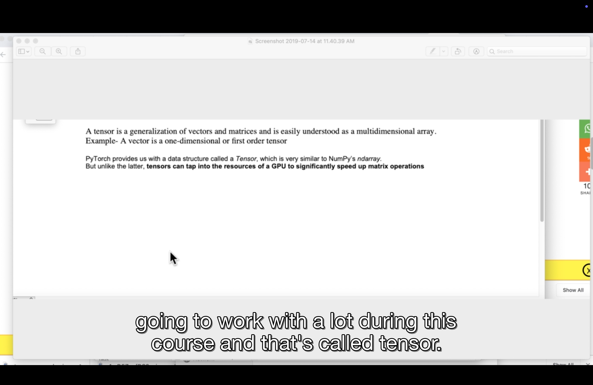
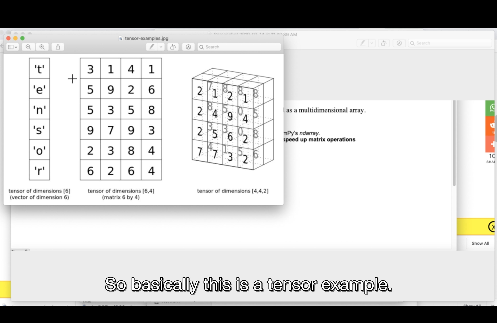
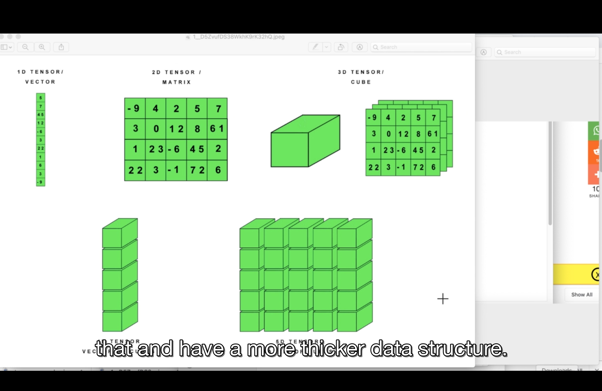


Now in this lecture I'm very briefly going to introduce you to an entity, a variable type, that we are going to work with a lot during this course, and that's called a tensor. Now, we worked with NumPy and NumPy arrays, and you already have a basic foundation for working with tensors, because NumPy arrays and tensors are really quite similar. So tensors are a generalization of vectors and matrices, and you can understand a tensor as a multidimensional array. So for example, a vector, which is one-dimensional, and we worked with those, is a first-order tensor, and so on.

And in this case I'm not too much interested in the physics definition of tensors, or the mathematical one, but for the purpose of PyTorch, we are provided with a data structure called a tensor, and that's very similar to NumPy's ndarray. But in this case the tensor can actually use the resources of a GPU to speed up the matrix computations. We won't work with a GPU, but in case that's something you are interested in exploring, then these tensors will come in very handy to work quickly.

So basically this is a tensor example. So what you see over here is a vector of dimension 6, because it's just a vector like this. So in the language of PyTorch tensors, this is a tensor of dimension 6. So now, instead of a vector, we have a six-by-four matrix, and this becomes a tensor, a six-by-four matrix, and we can even have a 3D tensor. So, you know, vectors and matrices are just restricted to one-dimensional or two-dimensional tensors; tensors allow us to generalize further.

So here we have a tensor of dimensions 4, 4, 2, so it's basically a 3D tensor, and we can indeed go beyond that and have a much thicker data structure. So this is a 1D tensor, which is basically a vector, which we encountered earlier on in the lectures. A 2D tensor is a matrix, and again, we have done some matrix computations before with NumPy, and that's what NumPy lets us do. But here we have a cube. So this is a 3D tensor. So once we start going beyond vectors and matrices, which NumPy is very good at working with, we encounter things like cubes, which is a 3D tensor; a 4D tensor, which becomes a vector of cubes; a 5D tensor, which is a matrix of cubes.

So as you can see, a tensor is a generalization of the concept of vectors and matrices that we encountered while working with NumPy.

8. Explore PyTorch Tensors and Numpy Arrays--- [ FreeCourseWeb.com ] ---
========================================================================

See the notebook [here](./code_and_data/section2/lecture17_tensor_array.ipynb).     

So now I'm just going to expand on the things that we discussed in the previous lecture, and in the previous lecture you were introduced to tensors, what they are and how they compare with NumPy. And now in this lecture we are just going to look at what NumPy arrays are and what torch tensors are, and how they're linked with each other. So this is a very brief lecture to get you comfortable with tensors. So you can import numpy as np and import torch.

Now we are going to create an array. This is a two-by-three array. I created a variable, array, and have created a two-by-three array, and I've passed my variable array into the function np.array, and that's stored in the variable first_array. And as you can see, this is of the class numpy.ndarray, and this is the shape: it's a two-by-three array, so two rows and three columns. And we can even convert this NumPy array, this numpy.ndarray class, to a PyTorch tensor.

So we create a variable, tensor, and we call the function torch.Tensor, with capital T. And we pass in the array, and as you can see, this is a tensor object, and it has a torch.Size; it has a size of two by three. And basically what we created over here in the variable array has now been converted to a tensor by using the function torch.Tensor. We can even create a ones matrix in both NumPy and torch. So in NumPy we do np.ones, a three-by-three matrix of ones with NumPy, and we can do the same with PyTorch by saying torch.ones, three by three. In the first case we get a NumPy array, three by three, populated with ones, and here we get a tensor, three by three, populated with ones. With random numbers, again, we can do the same thing: np.random.rand, three by three, and this will give me a three-by-three NumPy matrix, like so, and torch.rand, three by three, is going to give me a three-by-three tensor, like this.

Basically, OK, these numbers are different, because the function rand brings up different values every time, but essentially this is how we can create an array of random numbers and a tensor of random numbers. We can even carry out to-and-fro conversion. So we create an array with np.random.rand, and you can see this is an array of the class numpy.ndarray. We have the variable array, and we can convert it from NumPy to a tensor.

So we just say torch... we call the function torch.from_numpy, and we pass in the variable array, which contains the numpy.ndarray, and that's how we get this particular tensor, three by three. We can even convert back from tensor to NumPy, and for that we create a variable, tensor_to_numpy, we call the inbuilt function, and then we just say tensor.numpy(), and then we get this variable, this numpy.ndarray, three by three, and that has been converted from a tensor to NumPy.

So that's what it's doing: tensor to NumPy. And essentially they look pretty similar, and they obviously perform very similar functions, but with tensors we can latch on to the GPUs if we want to. But basically this is how NumPy arrays and tensors tie in with each other.

9. Some Basic PyTorch Tensor Operations--- [ FreeCourseWeb.com ] ---
====================================================================

See the notebook [here](./code_and_data/section2/lecture18_tensor_operations.ipynb).   

So now I'm going to quickly go over a couple of tensor operations. We did something similar with NumPy, and the logic is the same as we covered in the previous lecture. It's just that in this lecture we'll have a quick look at some of the mathematical operations that we can perform with tensors, and they're the same as what we do with arrays. So you can import numpy as np and import torch. Now we are going to create a ones tensor by calling the function torch.ones, and as you can see, it has created a four-by-four tensor.

So now I can resize it and flatten it, so I have everything in one line, by calling the function .view. OK: tensor.view(16).shape, tensor.view(16), and as you can see, I get one straight line of tensor. So I no longer have it as a four by four, and indeed I can even do it for an uneven matrix. So here I'll have to specify something like 12, because four into three is 12. So there. And we run it, and this is what we get: torch.Size, tensor.

We can carry out basic additions with our tensors. I create a tensor, t1, by saying torch.rand, and it creates a two-by-three tensor, and another two-by-three tensor here, under the variable t2, and we can add these by saying torch.add. So I use the torch.add function, and I pass t1 and t2 into it, and if you add them, you get this tensor, where 0.9385 and 0.2512 have been added together, and 0.87 and 0.43 have been added together.

So this is an element-wise addition. We can carry out subtraction. Again, I said t1.sub(t2), so basically this will give me t1 minus t2, and we can see the results. Sorry, t2 minus t1, and t1 minus t2. So yes, t1 subtract t2, and these are the results we get. We can even do it the other way around by saying t2 subtract t1, which is going to give me t2 minus t1, and this is going to carry out element-wise subtraction, the way we would do normally. Again, we can do element-wise multiplication by saying torch.mul, t1 into t2, and we get element-wise multiplication, and that's how we end up with three columns and two rows. We can do element-wise division: torch.div, t1, t2, which is t1 by t2. We can compute the mean, the average, of one of our tensors. So I said t1.mean(), which has given me the average; it took all the values and gave me the average, which is 0.73.

So these are some of the basic mathematical operations that we can implement on tensors. They're not very important, because this lecture is just to give you a feel of how we would implement some basic mathematical operations on tensors, as we would with NumPy.

### 3. Other Python Data Science Packages For Dealing With Data

1. Read in CSV data--- [ FreeCourseWeb.com ] ---
================================================

See the notebook [here](./code_and_data/section3/lecture20_readcsv.ipynb).

In this lecture I'm going to show you how you can read in a CSV file in Anaconda, and CSV is a flat file format. It stands for comma-separated values, and this is one of the most common ways of reading in data in Python. Indeed, most of the external data that we read in this course will be stored in the CSV form. And this is what ordinary comma-separated value files look like. So you take an Excel file, put in your data, and store it as .csv, and you get all your data.

So you have different columns; here we have two columns, in rest2.csv. And then you just read this in, and I'm going to show you how you can do that: import numpy as np and import pandas as pd. And once you do that, essentially we need these packages working in the background. So let us just look at the file. Now, the file is rest2.csv, and as you can see, I think you saw the name here, and it is present over here, so you can provide the entire name of the path.

The way I did, in the variable called file, like so, and then you can read it into the variable called df1, using the function pd.read_csv, and just provide this particular variable, and it will read in rest2.csv. And because we have imported pandas as pd, we specify pd.read_csv, because it is pandas which has all the provisions for reading in the different kinds of data.

So pd, pandas, has a function read_csv, and we are going to see the other functions that pandas offers us to read the other different data types further on in this section. So with that you can actually read it in. So let's just check that it has been read in. Now we can look at the first bits of the data using df1.head(), because df1 is a variable that stores the contents of the file rest2.csv, and there it has been read in.

Now, what you saw over here is a very standard CSV format, but what happens if your CSV is non-standard, like this? Now, you can see this is also a CSV file, because it has the extension .csv, but all the data, you know, they are not neatly ordered in columns like so, and what you see over here is that the data seem to be separated by semicolons. So if you want to read in these data... and it is always a good idea to look at your file first. Let us just try, actually.

Let me just comment out this code, and let's just try running this chunk now. Now, this is how the data have been read in, and it does not look very nice. So what you can do is pd.read_csv, of course, because it is a .csv file, and then specify the separator, which is a semicolon. Now, the difference is that when we don't specify any separator, it means the separator is a comma, which means that everything is separated by a comma.

So in this case, by default, we assume that all the data is separated by commas, but in this case, when it is not separated by commas and we have a semicolon, then we have to specify what the separator is, and in this case the separator is the semicolon. Now let us try to read it in, and there. Now this looks much better, because once we provide the separator, our data can be read in the way we read the previous CSV. We can also read in text files, and for that: there are situations in which our data may be stored as a .txt file, which this is.

And in those cases this is still a flat file format, but we have to provide the separator, which is the tab separator. So for most computers it has to be a backslash and t, which stands for tab. And obviously you can see what the tab character is for your system. But with this you can actually read it in, and it actually read this in. Let's just see there. Now these data are also read in, even though they were a .txt.

So essentially this is how we read in .txt and .csv files, and it is imperative to take care to know what the separators are. And in case your CSV file is an ordinary CSV file like this, then you don't have to worry about specifying any separators. And for all the .txt files, you should be good to specify the tab separator. And now, next, we are going to see how we can read in files which are in the Excel format.

2. Read in Excel data--- [ FreeCourseWeb.com ] ---
==================================================

See the notebook [here](./code_and_data/section3/lecture21_excel.ipynb).

In this lecture I'm going to show you how we can read in Excel files using the pandas package. And I've already imported pandas as pd. The Excel file that I want to work with is the Boston1.xlsx file, which is present in my present working directory, and it is advisable that you store your Excel files in your given working directories as well. Now, the one distinct advantage that Excel files offer us over CSV and other flat-format files is that we can have more than one sheet in a given xlsx file.

In this case, in our Boston1.xlsx file, which is the data relating to Boston house prices in the US, we just have one sheet, but there's always the scope of having more than one sheet in a given Excel file. And now let us just see how we are going to read in this Excel file and display the data. I have created a variable called file, and in that I have provided the file name, Boston1.xlsx, along with the complete path. So my file is stored in a given directory, which also happens to be my working directory, and which is stored on my F drive, so it is F drive, double slash, [unclear], double slash, course 6, and so on, all the way to Boston1.xlsx. This is enclosed within double quotes, and obviously, for your own operating systems and computers, you will have to work out which schema of slashes works for you. And one way of doing it is to import os and then put in os.getcwd(), the way I did. So the function .getcwd() comes from the package os, and that tells us which working directory we are in, and that also shows the kind of slashes that are being used, and I used the same in my file variable, the only difference being that I even put in the name of the xlsx file. And in order to load the spreadsheet, I called the ExcelFile function in the next line.

So I declared the variable x1 = pd.ExcelFile, with the pd alluding to pandas; it will load the spreadsheet. x1.sheet_names has printed out the names of the sheets; since I just have one sheet, it has printed out Sheet1. Now, in order to load a specific sheet into a DataFrame, I declared a variable called df1 = x1.parse, and remember, x1 is a variable storing the Excel file, and I pass in Sheet1, and the data of Sheet1 have been read into df1, the variable df1, and we can even see the head, .head(), and that shows us the first couple of records.

Now let me even try to have a Sheet2, and let us see what happens then. I've copied some data from Sheet1 into Sheet2, and now let me rerun the code. There: now, because I have Sheet1 and Sheet2, the sheet names have been printed out as Sheet1 and Sheet2, and now I can load either Sheet1 or Sheet2 into my DataFrame using the .parse function, and you can do the same with your own Excel files.

3. Basic Data Exploration With Pandas--- [ FreeCourseWeb.com ] ---
==================================================================

See the notebook [here](./code_and_data/section3/lecture22_pandas_preprop.ipynb)

Now I'm going to look at carrying out basic preprocessing of the data we read in, using pandas. And frankly, this is something you should be familiar with, because, as I mentioned in the course outline, it would be useful for the students to have some kind of Python data science experience. But in case you do not have any Python data science experience, I'm just going to briefly run you through some common Python preprocessing techniques and methods which you are likely to encounter when you work with your own data.

And by now you should be able to read in CSV files and Excel files using pandas. And with this lecture you'll be able to carry out the basic preprocessing you need before you carry out any kind of machine learning or data science analysis. So you can import pandas as pd and numpy as np. We're going to work with this file called Titanic_[unclear].csv. I'm going to call the function pd.read_csv,

as before, and I'm going to store the data in the variable titanic. We can look at the data, titanic.head(), and you can see the first seven rows, well, the first eight rows, 0 to 7. And indeed we can even say titanic.tail(), which will just show us the end of the data. So basically these are the last couple of rows of these data, which we get from tail, and you can see we have PassengerId, Survived, Pclass, Name, Sex, Age, Parch, Ticket and so on.

Now we can see the different data types: titanic.dtypes shows the data types, and we can see something like PassengerId is an integer data type, Age is float, Cabin is object, and so on. We can remove the columns that we don't want. So I don't want PassengerId. So for that I retain the variable titanic: titanic.drop. So in pandas, the function .drop allows us to drop the columns, and I specify the columns that I want to drop: PassengerId,

Name, Ticket, and indeed you can specify any other column name, and axis is equal to 1 means that it is the columns that we want to drop. And now when you look at the data, this is what we are left with: Survived, Pclass, Sex and so on. Now, the other challenge that we face when working with real-life data is that we tend to have NaNs. So something like NaN means "not a number", which means that no data values are available for this particular row, for this particular row, for this particular row and cell.

So in this scenario, carrying out any analysis becomes difficult, and errors get thrown up. So now the first thing we should see is: do we have NaNs? So I say "print columns with null values", and they're going to be listed one after the other. For titanic... so basically this is my DataFrame which stores my data. titanic.isnull() is going to see if a column has null values, and .sum() is actually going to sum up the total null values. So like so: the column Age has 177 null values, 687 null values for Cabin, and Embarked has two null values. We can even compute the percentage of missing data.

I say titanic.isnull().sum() divided by the length of titanic, and this means that in Age, 19.8 percent of the rows have null values, and in Cabin, 77 percent of the data have null values. Now we are going to make a copy of the DataFrame, and we are going to store the copy in the variable t2 = titanic.copy(deep=True), which will make an actual, complete copy of these data. We can drop all NaNs. So I create a variable, t2_drop = t2.dropna(). That's going to drop all the rows which have any NaN values. So obviously, in this case, the rows will be dropped for all the other columns, so, you know, we'll end up losing 77 percent of our data.

So anyway, in this case we don't get columns with null values, because no null values are left. But again, we could very easily end up with very little data. And now, once we drop the NaNs, we can compute basic summary statistics on our data, or at least on the quantitative data. Now, we can just decide to drop columns where, say, more than 50 percent of the rows have missing data. And for that I have Cabin: t2.head(), and indeed I can drop just Cabin by saying t2.drop('Cabin', inplace=True, axis=1).

And that's because this one has 77 percent of the data with missing rows. Now I'm going to create another copy, by saying titanic.copy(), and store the results in the variable t3: t3.head(). And I'm going to print all the columns with null values: t3.isnull().sum(). So basically it's the original DataFrame of titanic that we are working with. And now, if you don't want to carry out something like removing the rows with NaN values, because you may end up losing a lot of data, as we did in the first case, we can carry out basic data imputation, which means that we are actually going to replace the NaNs. So now the first example is Age.

Age is a quantitative variable. We can replace the missing age values with the average age value. So I create a variable, t3_imp_mean = t3['Age'], because this is the column I'm interested in, .fillna. So now we are going to use the function fillna instead of dropna, with t3['Age'].mean(). Now, basically, all the missing rows in the column Age will be replaced by the average age value, and indeed we can even use median values.

So I'm just going to say t3['Age'].fillna(t3['Age'].median()), because that's the column I'm interested in: .median() and, obviously, the empty round brackets. And as you can see, now I don't have any NaNs, because, well, the entire column has been printed out, but these have been replaced by the median age value. So basically what this does is it fills NaN ages with the median age value. The other column that we had which was full of NaN values was the Cabin column, and in Cabin we can run this, and essentially we are going to have null values.

And anyway, I can still run it. So anyway, we have Cabin with NaN values, and the Cabin values were qualitative. So in order to carry out data imputation here, we can count the qualitative variable: t3['Cabin'].value_counts(). And it's actually going to count which categories have what quantity. Now we can compute the mode, and the mode means we'll identify the most common value: cabin_mode. I created a variable, cabin_mode = t3['Cabin'].value_counts().index[0].

And this tells me that G6 is the most common value. So now I'm going to fill the missing values with the mode, which is the most common cabin value: t3['Cabin'].fillna(cabin_mode, inplace=True). All the NaNs will be replaced by G6. Now we have Age with 177, because of the new dataset, but anyway, for Cabin we have 0 missing values, because all missing values have been replaced by G6. And basically these are some of the most common data preprocessing tasks you have to undertake with most datasets before we move on to more advanced topics relating to actually doing something with the data.

### 4. Basic Statistical Analysis With PyTorch

1. Ordinary Least Squares (OLS) Regression- Theory--- [ FreeCourseWeb.com ] ---
===============================================================================


In this lecture I will introduce you to the theory of linear regression. Linear regression is used for modeling the quantitative dependency between variables. So we examine if there's any dependency between a given response variable y and the predictor, or explanatory, variable or variables x. Linear regression can help answer the question of if and how a change in x influences a change in y. And when I speak about linear regression, I'm just referring to models in which we have one y and one x, and when we have several x's, more than one x, then that is known as multiple linear regression, and essentially the same rationale applies to multiple linear regression as well.

So what we are trying to do is to model changes in y, or examine if and how changes happen in y as a function of x. So let us just look at this graph between sepal length on the x-axis and petal length on the y-axis. As you can see, they seem to be having a positive linear pattern of scattering. The linear aspect of this scattering is very important, and that is one of the most important and fundamental conditions of carrying out a linear regression: your x and y variables need to have a linear relationship between them.

So the scatter plot between them should be linear, like so, and that is something we will cover in more detail in the subsequent lectures. But essentially here is our x and y, and what linear regression will help us do is to explain the variation in petal length, which is the response variable, y, of the Versicolor species, on the basis of sepal length, the predictor variable. So we will be able to explain if the variation in sepal length can influence petal length in a meaningful, or a statistically significant, way or not.

So this is a simple linear regression equation, and it seeks to map the relation between the response variable y and the predictor variable x on the basis of a linear model, which is the equation of a straight line, y is equal to mx plus c. So essentially this is y, and we try to relate it to x by using the equation of a straight line, where a is the intercept and b is the slope. So y is the response variable, and it is your y_i, a response variable from your dataset, so it can be just any y variable in your dataset.

a is the intercept, and this is the value of y when x is equal to zero. So this is, in a way, a baseline condition. b is the slope of the regression, and this is very important, and this represents the change in y for every unit of x. So if a regression model does indicate that x does influence y, then b will tell us what the magnitude of that influence is. And e, this is the error. So this is the difference between the data point, or rather the response data point, and its predicted value. It is also known as the residual, or the error.

So this is how linear regression works. It tries to fit a best-fitting straight line to describe the relationship between y and x. So this is y, this is x, and these are the data points, and it tries to fit a straight line which it feels describes the relationship best. And so what you have over here are the actual, or observed, values of y, and the values of y which fall on the fitted line are known as predicted values, because when we are trying to fit a straight line, the straight line can't wriggle its way through all these points, so the best it can do is to put a line which is as close as possible to all the points.

So what you see not sitting on the line are your observed values, and what you have on the line is the predicted value, and by subtracting these you get the error, or residual, as we spoke of before. So line fitting is done on the basis of ordinary least squares, and the upshot is that ordinary least squares relies on minimizing the sum of squared errors. So this is the error term, and it is squared, so we square it for every point, and this is what I represent from 1 to n: essentially all your points are going to have some error term associated with them.

So we are going to square it, sum it up and then minimize it, and this minimizing is done with a view to fitting the best line. The null hypothesis of linear regression is that y is independent of x, or that the variation in y is not influenced by x. So, more formally, the null hypothesis indicates that the slope b is zero, so there is no quantitative dependency between y and x. And, as I mentioned, multiple linear regression involves one y and multiple x values. These are some formulas; you don't have to remember these, because you can just implement regression straight on in R. But it is just good to have some conceptual clarity, and I emphasize that, because having full conceptual clarity of what linear regression is, what it is telling you, what it is not telling you, interpreting the results and so on, is the single most important step you can take in understanding more detailed and advanced analysis, and essentially an understanding of linear regression will underpin most of the predictive analysis you

will encounter, either in this course as we go on, or in your own life when you work with real data. So, back to the lecture. In order to calculate the slope, we need these two variables, where SSx is the sum of squares. Now, x_i is a standard notation, and it alludes to a data point x. So this refers to the values of the response variables from one to n, the values of the predictor variables, the x variables, from one to n. x with a bar on top represents the mean of that given predictor variable, and we subtract, square and sum. The sum of products:

again, the same notation applies. We subtract the values of x from the mean predictor value, and the values of y from the mean y value, and that is the sum of products, and it measures the covariation between x and y. So we divide these and get the slope. Now, in order to evaluate the model, there are quite a few parameters out there, but the most common, and the first parameter that you will quote in your study, and you'll see quoted in every statistical linear regression model study, is R-squared, whose value typically varies from zero to one.

And this is used for evaluating model performance. We are advised to use adjusted R-squared in the case of multiple regression. So the closer your R-squared is to one, the better your fit. So when you see a line like this, we can say that this is a good fit. And R-squared is a variable that basically tells us the proportion of variation in y, the response variable, that your model is explaining. So if your R-squared is, say, 90 percent, then we can say that the model explains 90 percent of the variation in the value of y.

So there is a very strong relationship between the response variable and the model that we have created. And if it's close to zero, then our fit is bad. So the first thing we do is to look at the R-squared value and whether it is statistically significant or not, and for that we need the p to be less than 0.05. And now, if we want to evaluate how useful the model is, then we will look at things like the p-values of the slope and intercept to get the final regression equation, and if the p-value of the slope is less than 0.05, then we can say that the x variable, the predictor or the predictors, have a significant effect on y, and then the value of the coefficient acquires some meaning. So we can say that, you know, if there's going to be a one-unit change in x, and it is a statistically significant slope, then the change in y will be the value of the slope.

Now we will carry on and actually implement a linear regression in R, and then carry on further with interpreting these results.

2. OLS Linear Regression-Without PyTorch--- [ FreeCourseWeb.com ] ---
=====================================================================

See the notebook [here](./code_and_data/section4/Lecture24_Implement_OLS.ipynb).
       

So now we are actually going to start implementing linear regression using Python, and I would suggest that you import and read in all these packages: pandas as pd, numpy as np, scipy.stats, seaborn as sns. This is especially important, as we are going to use the inbuilt Iris dataset of this particular package. And the special thing is that I want you to get comfortable with carrying out statistical analysis, and subsequently machine learning, on a pandas DataFrame, because essentially that is what you have to do in real life, as opposed to working with inbuilt datasets which are not present in the DataFrame format, because working with those datasets will not equip you for handling pandas DataFrame types of data.

Then after that you can read in statsmodels.api as sm, and statsmodels is a very important package for statistical modeling in Python. And we are also going to use sklearn, and from there we import linear_model. I'll just briefly touch on what sklearn can do for us in terms of linear regression. But let's just get started with the data. So I read the data into the pandas DataFrame, so I've created a variable, iris, and I've read in the data, iris. Now suppose I want to predict the variation in petal width, y, as a function of the variation in petal length, x.

So in this case, y is my response variable, and my implicit assumption is that petal width depends on petal length, and I want to see what the relationship between them is. So this is my response. This is my predictor. Basically I want to use the predictor to predict my response variable, and I'll carry out linear regression. And I'm going to call sm.OLS, and this comes from the statsmodels package: sm.OLS(y, X). Whichever is my response variable, y, comes first, followed by X, which contains my predictor, and when we just have one X, the way we do in this situation, that is known as linear regression. And I'm going to get the results of the model, model.fit(), and then let's just get the summary.

So the dependent variable is the petal width; we already established that petal width and the response variable are the same thing. Since we just have one X, one predictor, I'm going to report R-squared, which is the same as adjusted R-squared. In this case, our R-squared is 0.967, and this means that this particular model, which is actually stored in the variable model, explains ninety-six point seven percent of the variation in petal width. So remember, that is how we interpret R-squared and adjusted R-squared.

And this particular number basically explains the variation in our y. So ninety-six point seven percent of the variation in y is explained by the model, and we will look at Prob, which is the probability, and if this is less than 0.05, which it is, the model is statistically significant, and I can therefore report it. And this is the coefficient of my petal length, the beta value, and this is 0.3365. I'm not going to discuss these right now.

That'll come later. But now, where is my intercept? So if I want the intercept, I'm going to again create my X, and now I'm going to use NumPy to add a constant row for the intercept. And it's a better model, so I'll again fit the model the same way. And as you can see, I have x1 as well, and I get the same things, things like adjusted R-squared, which is 0.927, which means that this model explains ninety-two point seven percent of the variation in petal width. The model is statistically significant, because the p-value is less than 0.05.

I will explain what the other things mean later on, but the upshot is that the x1, or the intercept value, has been produced, which is 0.41. Since the p is less than 0.05, it's just zero. And the slope value, 0.363, is also less than 0.05. We can say that both the intercept and the slope are statistically significant. So basically this is the relation. This is how we formalize the relationship between petal width and petal length:

0.41 minus 0.36 into petal length. So essentially, if I ever go out again into the field and measure petal length, then I will substitute it into this particular equation to get an estimate of the petal width. And yes, petal length and petal width are associated with each other. And essentially this is how we model the relationship between two variables using linear regression, and linear regression just produces the equation of a straight line which connects my response variable with the X.

But then what happens when I want to predict my y in terms of, say, more than one x? So, you know, previously I just took petal length. But now I want to explain the variation in y, petal width, in terms of petal length and sepal length. I can do that. Oh yeah, I'm going to create my predictors, and now I have two predictors, which makes it a multiple regression problem. So I have two predictors that have been created and stored in the variable capital X. Now, in order to get that constant, I call sm.add_constant(X).

I will not put the two over here, and this adds a constant row for the intercept. Then I'm going to call model = sm.OLS, for ordinary least squares, (y, X), results = model.fit(). And now this is what I get. Now, when I have more than one predictor, instead of R-squared I report adjusted R-squared, and this means that this particular model, this regression with two predictors, explains ninety-two point eight percent of the variation in petal width. And now this is the constant, the intercept, and petal length and sepal length.

These coefficients are the values of the slopes of petal length and sepal length. Since in this case, for the constant, my p-value is greater than 0.05, my intercept is non-significant, and when I want to create an equation, I will not report the intercept. But my betas, or the slope coefficients, are statistically significant, because they are both less than 0.05. Thus I will be reporting those, and essentially the most important thing...

Well, over here, again, adjusted R-squared: my overall p-value is less than 0.05, which makes my model statistically significant. And essentially this is how I can report an equation of the straight line when I have more than one predictor. Now, I can even use categorical variables, and my categorical variables are going to be the species. And as you can see over here, I've assigned numerical values to the different species over here: setosa is one, the others are zero, and so on.

So now my X is going to comprise petal length, sepal length, setosa, versicolor, virginica, and all of these are categorical variables which have numerical values assigned to them. I did that using pd.concat, and I already got the dummy variables. So basically, when we want to work with categorical variables, we end up doing dummy variable regression. So pd.get_dummies is basically going to assign numerical values to my categories, setosa, versicolor, virginica, and these are my dummy variables, in a manner of speaking, and then I'm going to concatenate all of them together, like so. So this is my DataFrame that I will work with now.

[unclear], the same thing, to get an intercept. Then I will do model = sm.OLS(y, X), and now, as you can see, the model is statistically significant. The p-value is less than 0.05. This is the adjusted R-squared, which is 0.944, and as you can see, these are the beta coefficients associated with my predictors. So the constant value is statistically significant, but sepal length is not, because p is greater than the required 0.05, and the same goes for versicolor.

But the other two categorical variables are statistically significant, which means that the species, or at least the fact that it is virginica or setosa, has a significant impact on determining petal width, whereas versicolor doesn't, and that is what it means. And I can just create the equation of a straight line using all of these coefficients, and I will only include the coefficients which are statistically significant. And then I can even fit a linear model using scikit-learn.

So I just fitted the first linear regression model by saying linear_model.LinearRegression(), and I defined the model and my results. I'm going to call model.fit(X, y), and these are the intercept and the coefficient values. And essentially sklearn is not the best thing to use for linear regression, but we are going to work a fair bit with sklearn in the next couple of sections. But yes, this is how we use statsmodels for carrying out linear regression, both linear regression and multiple linear regression, and actually using categorical variables, or dummy variables.

3. OLS Linear Regression From First Principles-Theory--- [ FreeCourseWeb.com ] ---
==================================================================================


 

So now in this lecture I'm going to introduce you to something known as gradient descent for linear regression. And essentially we are going to... let me just get back to my starting position. And essentially I'm going to introduce you to the idea of carrying out linear regression from first principles, and that is important because in doing so I'm going to introduce you to some terms that we are going to encounter a fair bit throughout this course.

So as you know, and as we discovered before, regression is useful when we want to explore the relationship between numerical input features and the target values, and the target values are usually the predicted variables, and the input features are usually the predictors; the target values are the response variables. And essentially with this we can get continuous-value output for unknown data. And suppose we have a dataset of house price and the size of the house: what regression can do is actually help establish a relationship between the size of the house, which is my predictor, and the response variable, y.

So how exactly the size of the house influences the price, and that's something we can assess using ordinary least squares regression, and we have already covered that previously. And this is what linear regression looks like: y, which is the dependent variable, or the outcome variable, or the response variable, and the x's are the independent variables. We also call them predictor or explanatory variables. And essentially we can model the relationship between the independent variable, something like the size of the house, and the dependent variable, the price, because price depends on the size. So in linear regression, the relationships are modeled using linear predictor functions

whose model parameters are estimated from the data. So if we have a scatter plot with some points on it, the objective is to draw a line through these points so that it is as close as possible to the points, so that we essentially minimize the error. So this line... you know, this is the point. So while this point lies on the line, this point doesn't, and the whole point of ordinary least squares regression is to minimize this error, because obviously a straight line won't go through every point.

So in simple linear regression, we have one independent variable, and that is used to predict the value of one dependent variable. And as you can see, this is the estimated line, and the difference between the value over here and the actual y value is the error, and we want to minimize that. So essentially this is how we fit the line, as we have seen before. And the easiest way of solving it is by introducing a constant, known as the bias, with its value as one.

And then we are going to... and basically this helps us develop a cost function for linear regression, which helps establish the relationship between y and x. So this equation, called the hypothesis function, is used to map input to output, and that's how the cost function comes into the picture. And, as discussed above, the cost function is something we are going to encounter a fair bit throughout this course. So the linear regression algorithm finds the relationship between the input features, the x's, and the output feature, and we want to fit the line to a dataset such that the prediction error is as small as possible.

But the question is: how do we measure this error to find out if the algorithm is giving the right predictions or not? And the answer is the cost function. Using the cost function, which is also known as the loss function, we can decide whether the parameters of our algorithm are good enough to make accurate predictions. And there are two kinds of linear regression cost functions, or loss functions, and I'm going to use these terms interchangeably: mean absolute error, or mean squared error. And mean squared error, or L2, is by far more common, and it measures the cost by taking the average squared difference between the actual output and the predicted output, and the cost is a single value which represents the current set of weights, or parameters.

And the idea is to make this cost, or the mean squared error, as small as possible. And so, the linear regression cost function: given our hypothesis, this is the line of the linear regression. So this is how we get the cost function, where n is the number of examples in the dataset, y is the actual label, and this is the predicted outcome, and we just subtract them, and we want to minimize the cost function, so the lower the value of the cost function, the more accuracy we get. And essentially we check the model cost, so this is the m value,

the b value, and x and y, and these two values help us develop the relationship between y and x, and this is how the cost function works. I'm not going to go into the mathematics of this, because this is something you can understand, and from this we can say that for m1 the error is minimum at 1, so m1 equal to 1 is the most appropriate value for the linear regression algorithm, because the error at this value is the lowest. So this is something we try to identify iteratively, like so, and wherever we get the lowest value of the cost,

that is the value, the m1 value, we go in for. So our goal will be to choose weights in such a way that our cost function is minimum, so minimum cost. And the idea is: how do we optimize our weights in order to minimize our cost function? And for that, we implement something known as the gradient descent algorithm, and with this we can optimize weights, and I'm going to cover this very briefly. So this is the equation of linear regression. These are the parameters I have.

This is my cost function, the difference between the predicted y and the actual y, and I want to minimize these values in a way to get the lowest cost function. And for that we are going to implement the gradient descent algorithm, to find the best set of parameters to minimize the cost and optimize it. So this algorithm optimizes the parameters to minimize the cost function. It works in an iterative manner, and the idea is to move in the direction of the steepest descent by taking the negative of the gradient of the cost function.

So essentially this is a cost function in a two-dimensional graph. You want to find the minimum cost. So we start at the top left corner, and we take a step in the negative gradient direction, and we have to save our new position, recalculate the new negative gradient to move further downhill, and we repeat the process till we reach the minimum point, or the local minimum, which will be the lowest cost function. And this is the mathematical equation for it. And to calculate gradient descent, we calculate partial derivatives with respect to the parameters and weights, and alpha is the learning rate, and the learning rate is something that we are going to encounter further on. Essentially the learning rate helps us decide the amount,

the kind of step we take. And it is also very important to do simultaneous updates in the loop. And I'm not going to talk about implementing this gradient descent algorithm, but, the learning rate: we perform gradient descent in steps, so, you know, we move step by step, recalculate and rethink, till we reach the local minimum, and the size of these steps is called the learning rate, alpha. And with a big step size, our gradient descent will converge more quickly, but we could overshoot the lowest point, and with a smaller step we can be more confident about finding the minimum point, but then there's the cost of convergence. So yes, typically we keep the alpha value, or the learning rate value, pretty low in order to move step by step. So again, we are trying to minimize this, so this is the gradient descent algorithm with partial derivatives.

And after each update, finding the new parameters, we'll update them, find a new cost function, and just continue according to our learning rate, and this is the gradient descent algorithm, and these are the partial derivatives we take, and we are going to repeat this till we converge at the local minimum. And for linear regression, the key is the derivative term, and the derivative of the cost function is shown here. I'm not going to talk through this mathematics, but essentially we use the power rule and chain rule to carry out the necessary computations, and within Python we have plenty of packages to do that for us. And basically the cost of linear regression has a bowl shape, known as a convex function, and this is ultimately how we get the cost of the linear function, like so. And in optimization is where it can be observed how gradient descent updates its parameter values and reaches the lowest value of loss.

So this is h(x), the current hypothesis, the current value; the size is x, and the price is y, and iteratively it is moving in a way to try and fit all the points, and simultaneously these parameters are getting updated. So ultimately this is how, depending on our learning rate, gradient descent will be computed with a view to minimizing the cost with respect to the parameters, which ultimately will help us derive a relationship between y and x. And with this, I'm not going to go any further, but these are some of the concepts, things like learning rate and gradient descent, and typically in Python, or PyTorch, we end up implementing the stochastic gradient descent algorithm.

So these are the things that we are going to encounter a fair bit throughout this course, and I am going to revisit these concepts more practically later on.

4. OLS Linear Regression From First Principles-Without PyTorch--- [ FreeCourseWeb.com ] ---
===========================================================================================

So now that you know what OLS regression is, we are going to work with toy data to begin with, and we are going to work through a simple linear regression problem in which we will have one response variable and one predictor variable. And we can import numpy as np, matplotlib.pyplot as plt. First we will create a dummy dataset: from sklearn import datasets as skds. So we are going to create X and y by using the function skds.make_regression, with n_samples 200, n_features one, because essentially we want one target variable and one predictor variable, and n_targets one. We add noise, and now we will reshape the NumPy array to have two dimensions, like so, and we can plot the figure.

This is strictly not necessary, but I'll just show you. So these are the x and y values, and it is quite a linear fit. So I assume I should get a strong linear regression model out of this, but we will see. The first thing: we will split the data into training and testing datasets, and remember, we will be doing this a lot, especially when we work with machine learning: from sklearn.model_selection import train_test_split. X_train, X_test, y_train, y_test = train_test_split(

X, y, test_size=0.3), because we want to set aside 30 percent of the data for testing. We are going to define the input parameters and variables: num_outputs = y_train.shape[1], 1, because we have one response variable; num_inputs = X_train.shape[1], again 1, because we just have one predictor. In this example we work with one predictor, and we are going to import tensorflow as tf. Essentially we seek to define this particular linear regression equation, y = W.x + b, W being the slope, plus b, which is the intercept. x_tensor = tf.placeholder, which is going to be of the type float32,

with shape [None, num_inputs], and then we'll have y_tensor = tf.placeholder, float32, shape [None, num_outputs]. This is the response variable. Now we will have the w and b: w = tf.Variable(tf.zeros([num_inputs, num_outputs])), and b = tf.Variable(tf.zeros([num_outputs])). And now we will define the regression model, which is going to be essentially the formula for y, by saying model is equal to tf.matmul(x_tensor, w), the x value times w, the slope, plus b.

So this is how we define this particular equation. Now we need to define the loss function, which will be the mean squared error, or the mean squared residuals. So remember, a residual is obtained by subtracting the actual response value from the predicted response value, or in this case model minus y_tensor, where model stores the predicted response variable value, and y_tensor has the actual y variable value. loss = tf.reduce_mean(

tf.square(model - y_tensor)), which is the mean squared error, and this is going to be the loss, or mean squared error. So we have the same formula for this. And now we are going to have the average y value, or the average value of the response variable, which we obtain by saying tf.reduce_mean(y_tensor). And from this we obtain something known as the total error, which is the total sum of squares, which is the actual y values, or the actual response variable values, minus the average value, and we square the result.

So this is what I have defined here: total_error = tf.reduce_sum, and remember, reduce_sum will actually take a cumulative sum, of tf.square, because we have to do the squaring, of y_tensor minus y_mean, y_tensor being the actual response variable value and y_mean being the mean value. Then we have something known as the unexplained error, and I'll just show you the formula here, where we have the sum of y minus y-regression squared for each data point; this is the predicted value of the response variable, and this is how we define the formula: tf.reduce_sum(tf.square(y_tensor - model)). And then with this we obtain R-squared, which is basically the goodness of fit: one minus SS-regression divided by SS-total, that is, one minus tf.div(unexplained_error, total_error).

Now we will define the optimizer function. This is the learning rate, and optimizer is equal to tf.train.GradientDescentOptimizer(learning_rate).minimize(loss). Gradient descent is an algorithm that minimizes functions, and the learning rate is the step we take per iteration. Now we train the model by setting num_epochs to eighteen hundred, which is the number of iterations to run the training for, and y_hat and w_hat and b_hat, well, these are the estimates of the slope and intercept that we want to obtain, and the initial values are zero. And then we define things like loss_epochs and mse_epochs and rs_epochs, because these are values which will be updated in every run: mse_score and rs_score are zero, because these are the initial values of R-squared and the mean squared error. And now we are going to run the session: with tf.Session() as tfs, and then tfs.run(tf.global_variables_initializer()), which will run the optimizer per loop for the training data, and then for every epoch, so for eighteen hundred times, remember, the number of epochs is equal to eighteen hundred, so eighteen hundred times over we are going to calculate and store the error in loss_val. And then essentially all of this code will be run in order to obtain the final values of w and b, which is what we want to obtain. I won't go through this code in detail, because further on we are going to see how we can run linear regression much quicker and more simply than this, but I just want you to be acquainted with implementing linear regression in TensorFlow using first principles, to essentially obtain this: y is equal to 76.28 x plus 0.029. And this is the mean squared error of this regression equation, and this is the R-squared, the goodness of fit, which tells me that this model explains ninety-three percent of the variation in y, which is the response variable, and 76 is the value of w, or the slope, and this is the intercept.

5. OLS Linear Regression From First Principles-With PyTorch--- [ FreeCourseWeb.com ] ---
========================================================================================

See the notebook [here](./code_and_data/section4/Lecture27_pytorch_test1.ipynb).

So now we are going to learn to implement ordinary least squares regression from first principles with PyTorch. And I'm going to give you a very basic, basically a toy, example, to just show you how we can set up ordinary least squares regression in PyTorch from first principles. So now you can import torch, import torch.optim as optim, torch.nn as nn, and then numpy as np, and matplotlib.pyplot as plt. Now the input size is going to be one, output size one, because essentially we are going to just have one x variable and one y variable, and obviously we are more likely to have more x variables with real data.

But this is a toy example. Now num_epochs, which is the number of epochs, we are going to set to 10,000, and the learning rate will be 0.001. So now we are going to create a training and a test dataset, x_train and y_train, and we are going to create a NumPy kind of dataset: x for the predictor, and y for the response variable. I create a variable, model = nn.Linear. So from here, nn, I call the function Linear, for ordinary least squares regression, with input_size, output_size, which refer to the size of the predictors and the response variable, which is one and one in this case. I'm going to define the loss function in terms of mean squared error.

Again, I want to collect it from the same package. You can even use [unclear], but mean squared error is just more robust. And then we are going to have gradient descent for the optimizer: optim.SGD, so stochastic gradient descent, with model.parameters() and the learning rate. And then, for epoch in range(num_epochs), we are going to iterate through the epochs. We are going to feed in the inputs, x_train, and we are going to convert with torch.from_numpy, so we are going to convert NumPy to a tensor, and the same for the targets. outputs = model(inputs); loss = criterion(outputs, targets).

Basically we are going to compare the output we obtain with the target. So basically we compare the predicted and actual y. optimizer.zero_grad(), loss.backward(), optimizer.step(), and so on till we reach the end. So for every 1,000 steps we print the results: so 1,000 out of 10,000, and this is the mean squared error loss, and we continue till here, and we can see the loss has declined. Now we are going to use this model to predict on our data: predicted = model(torch.from_numpy(x_train)).detach().numpy().

And now we are going to plot x_train versus y_train, which are our original data, and x_train comma predicted, and predicted is the predicted response variable, and that's something we had created before, which we obtained from here: predicted, which is the predicted y. And these are the predicted data. And as you can see, they do seem to be tying in quite closely. And anyway, this is just a toy example, so now you can see that this is how we would set up an ordinary least squares regression problem in PyTorch with first principles.

6. More OLS With PyTorch--- [ FreeCourseWeb.com ] ---
=====================================================

See the notebook [here](./code_and_data/section4/Lecture28_ols_cat.ipynb).

In the last lecture I quickly took you through a toy example in which we implemented ordinary least squares regression using PyTorch. And now we are going to implement ordinary least squares regression with real data, and by real data I mean the kind of data you have in CSV files, because the chances are, if you work with a regression problem, your data are more likely to be presented to you as a CSV rather than a NumPy array. And obviously in the last lecture I just quickly took you through the different steps.

But now I'm going to unpack the steps a little bit more. So you can import pandas as pd, numpy as np, and from torch.autograd import Variable. Now, this particular package is something you'll encounter a fair bit now and then. So basically the autograd package provides automatic differentiation for all operations on tensors. And if you remember the theory of ordinary least squares regression, then carrying out ordinary least squares regression and computing things like gradient descent, etc.,

that does need differentiation, or rather partial differentiation; that's taken care of by this particular package. And Variable, with a capital V, provides a wrapper for a tensor. So I've read in this particular dataset; actually, let me read these in. I read in this particular dataset, cat[unclear].csv, and I've stored these data in the variable called cat. cat.head(). And this is an ordinary pandas DataFrame, and it has data pertaining to the sex of the cat, the body weight and the height of the cat.

And by that I assume it's length. And obviously we can use ordinary least squares regression to derive a relationship between them. Right now I'm just going to isolate the numerical variables in the variable called cat2, and essentially this is how you select specific columns. So I'm interested in deriving a relationship between Bwt and Hwt, and in order to do so I specify the variable cat, square brackets, Bwt and Hwt, and these will be stored in the variable cat2. And I'm going to isolate the first column, like so. So I use the function .iloc, which can again be implemented on a pandas DataFrame.

And this is going to isolate the first column for me, and you'll see why I have done that. So this is the column Bwt of cat2, because in cat2, if I just show you what it is, the first column is Bwt and the second one is Hwt, and since in Python the indexing starts from 0: 0 and 1, this is 0 and this is one, and the data type is float64. So now, if we want to implement linear regression on these kinds of data, the first thing we have to do is to convert pandas columns to NumPy arrays.

So this is my variable x: x = cat2.iloc, and that isolated this particular column, Bwt, for me. So when I say .values, and I'm going to run that right now and print it, this has been converted to a NumPy ndarray. And similarly, I want Hwt to be y, the y variable, so I create a variable y = cat2.iloc, I specify one, which will essentially isolate the second column, because of the scheme that we follow, 0 and 1, .values, and it will convert the values of the second column to a NumPy ndarray.

So once I have converted my x and y to NumPy ndarrays, I can convert NumPy to a tensor, and by that I mean the PyTorch tensor. So x_np = np.array; I'm going to convert it to data type float32 and carry out reshaping, like so. And then x_tensor: I call the function Variable, because this is going to act as a wrapper, torch.from_numpy. So basically, from NumPy I am going to convert it to a torch kind of tensor, and put in this NumPy x, x_np. I'm going to do the same with the y.

So I get two variables, x_tensor and y_tensor, and then I can import torch.nn as nn, and nn stands for neural networks, and it may sound strange to you why I am talking about neural networks here, and we are going to work a lot with this package later on. But yes, we can call nn and use that to implement linear regression as well. So I define a class, LinearRegression(nn.Module). This has a super function, because it's def __init__(self, input_size, output_size):

super(LinearRegression, self).__init__(), which I called from nn.Module, to initialize; self.linear = nn.Linear(input_dim, output_dim), and that's what we are going to return. Now we can define the model. My input dimension is one, because I just have one predictor, and the output dimension is also one, because I just have one response variable: model = LinearRegression(input_dim, output_dim). Now we are going to calculate the mean squared error, which is our loss function, and I store the result in a variable, mse: mse = nn.MSELoss(), so I'm going to call MSELoss.

Now we are going to do optimization. So this is the learning rate, which I spoke about before, or alpha, and I've just set it at 0.02. And for the optimizer, we use the gradient descent function, or in this case the most common one is stochastic gradient descent: torch.optim.SGD(model.parameters(), ...), because it's the model parameters that we have to optimize, with this learning rate, so that we can identify the local minimum. So again, the things I covered in theory are things that you don't have to implement from first principles, and you can see all of this has been, in a way, implemented for you. To train the model: loss_list. We are going to go through 1,000 iterations, and indeed you can have as many iterations as you want, till you get the desired accuracy. for iteration in range(iteration_number): we are going to run this entire code 1,000 times; that's what the for loop does. So for these 1,000: optimizer.zero_grad(), because every time we just set it back to 0. Forward pass: results = model(x_tensor). So we are going to implement the linear regression, y = mx + c, and this is a linear regression model, and to that we feed the predictor variable. We are going to calculate the loss by comparing this particular result, which is going to give us the predicted y, so we will compare the predicted y with the actual response variable, and that will give us the loss. And this is the backpropagation algorithm: loss.backward(). Then we are going to update the parameters: optimizer.step(). Append the loss in a list: so loss_list, square brackets; basically this creates a vector, an empty list, and we are going to add our results here. And then we are going to print the loss for every fifteenth iteration; let's make it 50. OK, I need to run some of these code chunks again. So 0, fifty, and this is the loss we get at 0, and we have to minimize the loss, and we can see we are not getting a lot of minimization of our loss, and that's pretty constant.

So now we can just plot our data, and we can see that after the [unclear] iteration, the ability to reduce the loss is not particularly great, so maybe we don't need so many iterations. I create a variable, predicted, and I'm going to feed x_tensor through it, and now we can actually compare the predicted response variable with the actual response variable. So this is the original y, and this is the predicted y, and they're frankly quite far off, and ordinary least squares regression is not the best machine learning algorithm ever.

And the purpose of this lecture is actually to introduce you to some of the most common concepts, like loss functions and gradient descent, because these are things that we are going to encounter, and some of the packages that we saw here, especially the nn package, are things that we are going to encounter further on in this course.

7. Generalised Linear Models (GLMs)-Theory--- [ FreeCourseWeb.com ] ---
=======================================================================


In this lecture I will introduce you to generalized linear models, and in the next couple of lectures we will actually learn to implement them in R. And so far you've been dealing with regression models where we assume the error distribution, or the error structure, to be normally distributed, and if not, we tried to make it normal. But there are some situations in which we have to accept that we are going to have a non-normal error structure to begin with.

And that is when GLMs come into play. So we use GLMs in situations when the residuals are neither normally distributed nor can we make them normal, and in fact it is not even advisable to attempt to make them normal, because the kinds of issues we are trying to address with GLMs, and the kind of data we are trying to analyze, do not lend themselves to conventional linear regression modeling. GLMs are used in situations when we have data such as biological data and [unclear] that are typically not normal.

So that can include cases of proportions, when we are trying to examine things like infection rates and survival rates. In this case we should be examining these kinds of data using GLMs. For count data, say insects on a leaf, trees in a block again, or butterflies in a forest: all of these are regarded as count data, and it is a whole integer number. You know, you can have, say, a hundred butterflies in one forest and twenty-five butterflies in another forest.

And these are typically called count data, and we should model them using GLMs. And then we have binary responses, like alive/dead, presence/absence, and these data also lend themselves to GLMs. So this is a typical linear regression equation that we are familiar with, and what are GLMs and where do they fit in? These are a flexible generalization of ordinary linear regression, and essentially we can use these to explain non-normal response data using explanatory variables, the way we would in a conventional linear regression.

And in this case we try to understand what external influences, and external influences are represented using independent variables, drive the change in the response variable. And the implementation of GLMs requires the residuals to have an alternative distribution, and we can analyze the relationship between response and predictors with regression using GLMs. GLMs generalize linear regression by allowing the linear model, and you saw the linear model comprising all of the predictor variables and the coefficients, to be related to the response variable via a link function, and they account for non-normal error structures. The error structure of the variable y can come from the exponential family, and this can be considered within the GLM framework.

So the error structure can be normal, Poisson, binomial, gamma. The link function, or g, is the transformation of y used to linearize its values, and then the linear predictors, like so. So essentially this link function will linearize the value of y, and then the linear predictors, the x variables, will be regressed against the transformed response, like so. So this looks like a conventional linear regression model, but the only difference is that here we have a transformed response variable. And the common link functions:

Gaussian, and when we have Gaussian error structures we just carry out ordinary linear regression; Poisson; binomial. This is the link function that we use for carrying out the specific transformation of our response variable, and, if need be, for back-transformations, etc. And in case this feels a bit confusing to you, for all practical purposes, two of the most common GLMs are logistic regression, which is used in cases when the response variable is binary and the error structure is assumed to be binomial, and Poisson regression, which is used for count data, and the error structure is assumed to be Poisson. So in the subsequent lectures I will just show how you can implement these in R and go over the interpretation of the results.

8. Logistic Regression-Without PyTorch--- [ FreeCourseWeb.com ] ---
===================================================================


In this lecture I will introduce you to logistic regression, which is one of the most widely used applications of GLMs, so much so that many people end up using the terms logistic regression and GLM interchangeably. Logistic regression is carried out in situations when our response variable y is categorical. So when we have binary categorical variables, like yes or no, success or failure, 0 and 1, and the predictors are numerical. The null hypothesis is that the probability value of the nominal variable, or response variable, is not associated with the value of the measurement variable.

And essentially this is the formula that we use for the probability of y happening, that is, the probability of y being a success, or one. And this is the default mode of logistic regression, so the probability of y equaling one, or yes, or success, is computed as one divided by one plus e to the power minus alpha plus beta 1 x. And this, alpha plus beta 1 x, is what you find in the equation of linear regression as well, and we find the same thing over here in logistic regression.

I will not go into the mathematics of all this, because the upshot is that you only need to remember that if you want to compute the probability of y happening, assuming your y is a categorical variable, this is the formula you're going to use. Another important aspect of logistic regression is the logit. And essentially it stems from the fact that linear regression needs a linear relationship between x and y, but this condition is violated in cases when y is categorical, and that is why we end up doing logistic regression in the first place. And a logarithmic transformation is used for expressing the non-linear relation that now ensues in a linear way, and this is known as a logit, and essentially based on this is how this particular formula comes about.

Essentially we end up taking the log of y for a linear regression equation, and once we solve it, we end up with this. Another thing that we hear in the context of logistic regression, and this is something you may have to calculate for your data, is the odds, and odds are computed by taking the exponential of beta. Essentially this is the probability of success. So if you were to obtain the values of these parameters and so on, you could easily get the probability of success, and you can substitute that, like so: probability of success divided by probability of failure.

Or take the exponential, and that tells us, essentially, what our chances of succeeding are. And associated with that is something known as the odds ratio, which is the odds of success divided by the odds of failure. So we are x number of times likely to succeed, or x number of times likely to fail, depending on how you interpret that computation. So these are the other two things that you may obtain from your logistic regression once you have the probability of succeeding in the first place. And the assumptions of logistic regression are that there is a linear relationship between x and the logit of y,

there is independence of errors, and errors don't have to be normally distributed, and that is why we end up performing GLMs in the first place. And these are quintessentially the types of data we end up performing logistic regression on. We do associate logistic regression with categorical response variables, and that is true, but later on in this lecture I'm going to show you another case when we may not have strictly categorical variables. So this is the sigmoidal, S-shaped distribution that you need to bear in mind.

And when you have this sigmoidal kind of distribution in the data, then it's a good time to consider logistic regression.

9. Logistic Regression-With PyTorch--- [ FreeCourseWeb.com ] ---
================================================================

See the notebook [here](./code_and_data/section4/lecture31_py1.ipynb).

Now in this lecture I'm going to introduce you to carrying out logistic regression using PyTorch, and we are going to work with an inbuilt dataset called MNIST. So now, if you have installed PyTorch correctly, you should be able to import torch; from torch.autograd import Variable; import torchvision.transforms as transforms; import torchvision.datasets as dsets. And this is where you get the built-in datasets from. Now we are going to load the inbuilt dataset MNIST, so I've got two variables, train_dataset and test_dataset.

dsets: that's where my inbuilt datasets are: dsets.MNIST(root='./data', train=True, ...). I have an argument called transform; this is equal to transforms.ToTensor(), and download=True, which means I want to download these data. And transforms.ToTensor() is going to convert my data into tensors. So when we use inbuilt data, we are going to need to convert them to tensors, and we do something similar with the test dataset, like so, and all of these have now been downloaded for me.

I'm going to make my datasets iterable. So for that I have the variables train_loader and test_loader: torch.utils.data.DataLoader(train_dataset, shuffle=True) over here, and this will just allow us to iterate through these data. Now we are going to create a model class to define the architecture of logistic regression. So for that I define an actual Python class called LogisticRegression, and because I use the keyword class, it means this is an actual class, (torch.nn.Module).

And here I define an actual function, def __init__, and this is to initialize my model: super(LogisticRegression, self).__init__(); self.linear = torch.nn.Linear(input_dim, output_dim), because we are going to input something and then get an output. And then I create another definition: def forward(self, x): outputs = self.linear(x); return outputs. We can decide on the batch size, a hundred. We are going to have about three thousand iterations; epochs is the number of iterations divided by the length of the training dataset. The input dimension is 784, because this is how the MNIST data are: these are imagery kinds of data, pixels loaded into a flat format.

So in this case, the dimensions, I do know, are 784, and the output dimension is going to be 10, and this is because we have ten response variable classes, which vary from 0 to 9. That's why my output is going to be 10, and this is going to be my learning rate. So I define my model in the variable model: LogisticRegression(input_dim, output_dim). And then, in order to compute the losses, I define the criterion, to compute the softmax and cross entropy for the losses: criterion = torch.nn.CrossEntropyLoss(); optimizer = torch.optim.SGD(model.parameters(), ...), like so. Now I start from the first iteration, zero: for epoch in range(epochs):

so for each epoch, for i, (images, labels) in enumerate(train_loader): images = Variable, 28 by 28, because that is the pixel size; labels are the classes 0 to 9: labels = Variable(labels); optimizer.zero_grad(); outputs = model(images); loss = criterion(outputs, labels); loss.backward(). And then, essentially, for each of these we are going to compute the accuracy, like so. So we can see, well, by the time we have so many iterations, we get an actual accuracy of about 89 percent. And so this is a very brief example, and this is how we actually end up setting up logistic regression using PyTorch,

and in this case on an inbuilt dataset.

### 5. Introduction to Artificial Neural Networks (ANN)

1. Introduction to ANN--- [ FreeCourseWeb.com ] ---
===================================================


In this lecture I will provide you with a brief introduction to both artificial neural networks and basic deep neural networks. But first I'm going to talk about the principles that underpin artificial neural networks, because the very same principles feed into deep neural networks. So this is the biological basis of neural networks. The human brain is composed of billions of nerve cells called neurons, and they're connected to thousands of other cells by something known as axons. Stimuli from the external environment, or inputs from sensory organs, and that could mean something that we see, or receiving an injury, are accepted by dendrites, right over here.

These inputs that the dendrite receives create electrical impulses, and these electrical, or nerve, impulses travel through the neural network. The neuron can then send a message to the other neurons to handle the issue, or not send it forward. So the information transfer will happen if the nerve impulse is of a certain strength. So assume that you move your hand: maybe the information transfer may not go forward, because maybe the impulse is not sufficiently strong.

But suppose you break your hand or you break your arm; then you're going to feel some pain, and you may respond accordingly, because when you get hurt, or you receive such a massive injury, the information transfer would go forward, because that nerve impulse crosses a certain pain threshold. And this is the machine learning implementation. And as you can see, these are the inputs, and we assign weights to them, and essentially this is what every neuron comprises.

y is the value which is produced by a neuron, and it is produced by multiplying the weights with the inputs. And we pass it to something known as an activation function, and it is the activation function which checks the y value produced by the neuron and decides whether the outside connections should consider the neuron fired or not. So if we think about it in terms of a pain threshold, say, you might start shouting if you break your leg, because the act of breaking your leg, and the electrical impulse transfer that will happen after that, is certainly going to cross the pain threshold.

So the activation function will fire the neuron, and essentially at that point we can say that you're in pain. And there are different kinds of activation functions that we use, things like step functions or sigmoid functions, and there are also things like ReLU and hyperbolic functions, and different kinds of activation functions lend themselves to different kinds of problems. For instance, for classification purposes, we usually end up considering the sigmoid function, and it is this which will sort of check the y value produced by the neuron and decide whether this requires the neuron to be fired or not.

And this is the basic machine learning implementation of a biological neural network. Now, what we do in machine learning with neural networks is that neurons are connected in layers, so that one layer can communicate with other layers. So we have an input layer, we have one hidden layer, and we have an output layer. Layers other than the input layer and output layer are called the hidden layers, and in these neural networks we just have one hidden layer. So we are going to have an input layer, and anything besides this,

well, apart from the output, is considered to be a hidden layer. And this is the upshot about these artificial neural networks: that they just have one hidden layer, and the output layer. And basically these feed into each other, and the learning phase in an ANN is the task of adjusting the weights to minimize the error. So by default we have the input layer, and we assign weights to it, which are multiplied by the input values, and these weights are usually assigned randomly. They are passed to the hidden layer, and...

and it is in the hidden layer that the activation functions are fired. And then we get an output, and error minimization has to be carried out till the output the system produces is very close to the expected output, and this error minimization is done by backpropagation of error. So let us see. Now, this is the backpropagation algorithm, and this is a method for training the weights in a multilayer feedforward neural network. So what you saw previously was a multilayer feedforward neural network which comprised one input layer, one hidden layer and one output layer.

And with multilayer feedforward neural networks, we can have more than one hidden layer as well, and at that point they become deep neural networks, but that'll come up later. What the backpropagation algorithm does is it models a given function by modifying the internal weightings of the input signals to produce an expected output signal, and then the system is trained using a supervised learning method, where the error between the system's output and the known expected output is presented to the system to modify its internal state.

So we are going to go on changing the weights: every time we get the output, we will compare it to the expected output, and accordingly we will go on changing the weights till we minimize the gap between the expected output and the actual output, and there are different ways of doing it. And I'm not going to go into that right now, because that's not quite important at this stage, but now I will introduce you to the common artificial neural network algorithms that we are going to cover in this course.

And these are really quite powerful algorithms for different applications. So the most common one is the perceptron algorithm, and this is the simplest feedforward neural network. It does not contain any hidden layers, and it just contains a single layer of output nodes. And this is a linear classifier, but it is a very powerful linear classifier. It takes some inputs, like so, sums them up, applies an activation function and passes them to an output layer.

Then we have something known as multilayer perceptrons. And as you can see, this has one hidden layer, an input layer and an output layer. This class of networks consists of multiple layers of computational units, and they're interconnected in a feedforward way: each neuron in one layer has directed connections to the neurons of the subsequent layer. So again, each of these input neurons is connected to the different neurons in the hidden layer.

How many neurons you should have in your hidden layer is something that varies across different problems, and it's something that one can always test and experiment with. MLPs are very useful for non-linear data, because, except for the input nodes here, each node is a neuron that uses nonlinear activation functions, so they can be sigmoid functions, ReLU functions, hyperbolic functions and so on. And this also utilizes the backpropagation technique for error reduction.

Now I will just briefly introduce you to deep neural networks, in their basic implementation, because in this course we are just going to touch upon the most basic implementation of deep neural networks. Now, this is a simple feedforward network with many, and by many I mean two or more, hidden layers, and these extra layers allow for the modeling of complex data. And in this course we are actually going to start with basic deep neural networks using something known as H2O, which is a very powerful machine learning framework.

But in the next couple of lectures we are actually going to learn to implement some of the most common artificial neural network algorithms on different data, and also work through a small case study where we apply the MLP algorithm in conjunction with principal component analysis to work with a very large dataset. So all of that is coming up in the next couple of lectures.

2. PyTorch ANN Syntax--- [ FreeCourseWeb.com ] ---
==================================================

See the notebook [here](./code_and_data/section5/Lecture33_ann_syntax.ipynb)

In this lecture I'm going to unpack the syntax of PyTorch a little bit more. And so far we have been working with things like ordinary least squares regression with PyTorch, logistic regression, artificial neural networks and so on. And what I'm going to cover are things that we have already encountered before, but now in this lecture I'm going to unpack them. So you can import torch, torch.optim as optim. Now, this is the key thing; you must have encountered it a few times, and you must be wondering what this is about: import torch.nn as nn.

And now, this module, torch.nn, is the cornerstone of designing neural networks in PyTorch, and indeed it came into play when we were working with things like linear regression as well. But after this point, this is something that you'll encounter a lot, and this particular class can implement anything from a simple artificial neural network, which we encountered, all the way to deep neural networks, to convolutional neural networks, which will come further on in the course. Everything revolves around this package. The nn.Module class has two methods that we have to override, and we have already encountered those methods, but now we'll just unpack them a bit more.

The first is the init function, and every time we use this class, you've seen that we use this function, and this function is invoked when you create an instance of an nn.Module. And this is where we define the different parameters of a layer, such as filters, kernels, and that's something we'll do later on. In this example we're just going to keep it very simple, so you know how the init function works. And that is followed by the forward function, and this is how you define how your output is computed. And indeed, depending on the nature of the computations you're doing, we can have more functions beyond that, but these are the two most important methods that we end up encountering with nn.Module.

So now, in this example, we'll stick to multiplying the input by a number. We define the class, and I call it Example here, and I call nn.Module. And as soon as I call nn.Module, I have the init function, which, essentially, is going to be invoked every time we call nn.Module: def __init__(self, param): super().__init__(); self.param = param. And obviously this is just the syntax that you have to bear in mind. And now I'm going to define the forward function, or def, which stands for the definition of the function, and we just call it forward, (self, x), because we're just going to return a simple multiplication, applying a simple multiplication here: return x * self.param.

And obviously, depending on the nature of the problem, the forward function can contain a lot more arguments and parameters than what I am putting in here right now. But right now we are just doing a multiplication. Example, then set up the output of my object, and now we are going to just put in the tensor, and obviously we can create a tensor by saying torch.tensor. So now we can print the output, and basically this is how the forward function works, and the init defines the parameters.

These are just basic initialization parameters that we end up using. And in the forward function I just define a multiplication operation, and depending on the nature of the problem, we could indeed end up defining more complex operations in here. But right now we will just try to do a multiplication operation.

3. What Are Activation Functions Theory--- [ FreeCourseWeb.com ] ---
====================================================================


In this course, you have heard me mention activation functions a few times. Now we are going to briefly see what activation functions are and their role in neural networks. And specifically, I will introduce you to some of the most common activation functions that are usually used, so the terms that we use in this course are not unfamiliar to you. I'm not going to introduce any of the mathematics behind these activation functions, because you really don't need the mathematics when you are using the different activation functions.

Well, not per se, because these activation functions and the associated neural networks are implemented through the R packages. So it is a good idea to be acquainted with the terminology and know which activation function is suitable in which situation, rather than dwelling on the mathematical notation. So just to reiterate, this is an ordinary artificial neural network, and here is where you have an activation function. So we multiply the input by the weight and add the bias, and that is what is fed in here.

So an artificial neuron calculates the weighted sum of its inputs, like so, and it adds the bias, and then the activation function... so, you know, all of this is done. And then the activation function decides whether the artificial neuron, and this oblong is the artificial neuron which has the activation function, should be fired or not. The activation function checks the y value produced by a neuron and decides whether the outside connections should consider this neuron as fired or not, and this influences the output.

So now I'm going to introduce you to the different types of activation functions which are most commonly used. One of the most commonly used activation functions is the sigmoid activation function. It is a nonlinear activation function, and by far, because the problems that we typically address with artificial neural networks and deep learning are of a non-linear nature, mostly the activation functions are non-linear, and this allows for layer stacking. The activation remains within the bounds of 0 to 1.

So basically, very large or unnatural y values won't result in that neuron being fired. Now, the sigmoid-function-based activation function is especially used for models where we have to predict the probability as an output, and since probability exists between 0 and 1, it is a suitable idea to use the sigmoid function as an activation function. The only problem is that this can get your neural network stuck. Now, there's one more term that I'm going to introduce you to right now.

And this is something you will encounter a lot when we work with convolutional neural networks, and that is the softmax function. It is a more generalized logistic activation function, and it is used for multiclass classification. A very commonly used activation function is the tanh, hyperbolic tangent, activation function. And as you can see from the formula, it is a scaled sigmoid activation function, and it is nonlinear; its values can range from minus 1 to 1. And the advantage is that negative inputs will be mapped strongly negative, and zero inputs will be mapped near zero.

And the upshot is that this kind of activation function is useful when we want to carry out classification between two classes. So if we want to work with binary classification problems, then we can consider tanh, hyperbolic tangent. Then I come to something known as the rectified linear unit, ReLU. And you are going to see a lot of ReLU. It is one of the most popular activation functions at the minute, and it gives the output x if x is positive; otherwise it will be zero.

It is nonlinear. It looks like a linear system, but anyway, it is actually non-linear, and it varies from zero to infinity, and if you just look here closely, it is actually half-rectified. And this means that any negative input given to the ReLU activation function turns the value into zero immediately in the graph, like so. So any negative value will become a zero. But its limitation is that it should only be used within the hidden layers of a neural network model,

and not for output layers, and this is something that you are going to encounter when we work with convolutional neural networks. And when we work with output layers, it is a good idea to use ReLU within the hidden layers and the softmax function for classification problems. And in the output layer we can use a softmax function for classification. So these are among the most common activation functions that are used, and ReLU is absolutely indispensable, ReLU and softmax, when we work with convolutional neural networks.

4. More on Backpropagation--- [ FreeCourseWeb.com ] ---
=======================================================


In this lecture I'm going to talk a bit more about the backpropagation algorithm and neural networks. And by now you're already aware that backpropagation is something that we end up using whether we work with a single-hidden-layer artificial neural network or a deep neural network with multiple hidden layers. You've already seen how backpropagation was, in a way, being implemented to compute the error, and this is an iterative process. But I'm going to unpack the theory a bit more in this lecture.

So again, these are some of the things that you are already aware of, and I'm willing to provide a link to the PDF of this particular PowerPoint, but things like the cost function, etc., these are things that you already know. And now we are just going to see how they tie up together. So again, neural networks rely a lot on proper training, and a very fundamental part of this training is backpropagation, which was originally developed in the 1970s, and essentially it is a much faster approach to learning, and it just expanded the scope of neural networks in solving problems.

And it is the practice of fine-tuning the weights of neural networks based on the error rate, that is, the loss obtained in the previous epoch, or iteration. Neural networks work iteratively: we feed in the inputs, weights are usually assigned randomly, and that gets fed through an activation function. We've already discussed the theory of an activation function. And the output we get, we compare it with the actual output, and then we'll get a loss, and then essentially this will be fed back into the neural network, and proper tuning of the weights ensures lower error rates, and that's what we need in order to make our model more generalizable.

So this is a simple neural network. So we have one input neuron, one hidden layer neuron, which is here, and one output neuron. So basically, with each neuron we have a linear combination of inputs and weights, and that's something you already saw. So this is the input neuron, and we combine the random weights, and, as I said, the weights will be selected randomly, with the inputs, and we have a linear combination, which is in turn fed into the activation function, and then we obtain the output neuron. And it is easy to see that the forward propagation step is simply a series of functions, where the output of one feeds into the input of the next: input, linear combination of weights, activation function, and we get the output neuron. So we get the output a, and the target of the response variable is y. So the cost function, as we've discussed before, is simply the squared error between the actual and predicted values, and our goal is to evaluate our model's output with respect to the target output, which is y, in an attempt to minimize the difference between the two. So we want to minimize the cost function, and in order to minimize the difference between our neural network's output and the target output, we need to know how the model performance changes with respect to each parameter in our model. So we need to derive the relationship between our cost function and each weight, and then we update these weights in an iterative process using gradient descent, and again, gradient descent is something we've touched upon. So in order to find the relationship between a weight and the cost function, we have to look at this:

w3 is an input to z3 here. So w3 is an input to z3, z3 is an input to a3, and a3 is an input to J(theta). So when we are trying to compute a derivative of this sort, we can use the chain rule to solve it, and I'm not going to discuss the chain rule, because frankly this is a mathematical detail that you don't need to know. I'm just acquainting you with the terms, and all of these are built into PyTorch and other deep learning modules out there.

So we can just skip this, and obviously you'll have the PDF. So if you want to go over these mathematical equations in detail, that's something you can do. So now, when we have a more complex neural network, we have two neurons in our input layer, two neurons in one hidden layer, and then we'll get two neurons in our output layer, and essentially this is the kind of function that will follow, like so. So again, this is something I'm not going to discuss in detail, but the mean squared error as our cost function is like so.

So when we are training on multiple examples, which is most likely to be the case, we'll also need to perform a summation of the cost function over all training examples. I'm not going to discuss these in detail, because you don't have to know all of this mathematics, and many of these... and then we use [unclear] parameters to reduce the computational cost, and in PyTorch we do get the option of playing around with the L1 and L2 parameters. So what we have learned so far is a way to calculate all of the partial derivatives necessary for gradient descent, which is the partial derivative of the cost function, using matrix expressions. Partial derivative calculations start from the end and work their way back to the beginning, and then we develop this new term, which serves to represent all the partial derivatives that we would need to reuse later.

And then we progress backwards through the network. So backpropagation is simply a method for calculating the partial derivatives of the cost function with respect to all of the parameters. The actual optimization of parameters is done by gradient descent, or another more advanced optimization technique. Generally, we established that you can calculate the partial derivatives of layer 1 by combining the delta terms for the next layer forward with the activations of the current layer.

So this is forward propagation, and that's something that is quite intuitive, and you're already aware of this. And then we compute the delta terms, like so, and this term consists of all the partial derivatives that will be used again in calculating the parameters of layers further back. So this is the error term, and then we are going to compute the matrix, and this is a matrix of parameters which connects layer two to layer three. We send back the error terms in the exact same manner that we sent forward.

So now, with backpropagation, we are going to send back the error terms the way we went forward, and the only difference is that this time we are starting from the back, and we are feeding this error term back, layer by layer, backwards through the network, and that's backpropagation, which is the act of sending back our error. And then we are going to compute the delta matrix, like so, in our backpropagation, and for every layer except for the last, the error term is a linear combination of the parameters connecting to the next layer, moving through the network, and the error terms of that next layer.

And this is true for all hidden layers, since we don't compute an error term for the inputs, and this is the last layer calculation. So again, after we have calculated all the partial derivatives of the neural network, we can use gradient descent to update the weights. So basically this is all you need to know about backpropagation, and this is not something that you have to implement mathematically, at least when you work with practical data science,

and when you work with the common Python, or even R, deep learning data science packages.

5. Bringing Them Together--- [ FreeCourseWeb.com ] ---
=====================================================

See thr notebook [here](./code_and_data/section5/Lecture36_PutTogether1.ipynb)

In this lecture I'm going to create dummy code, and then essentially the idea is to let you see how the different parts of implementing an artificial neural network, or a deep learning neural network, come together, especially within a PyTorch framework. So we can import torch. Now I'm going to provide an input layer comprising a given number of neurons, a hidden layer, so we are just putting together a very simple artificial neural network and we just have one hidden layer, and the output, which is just going to be one. And now we are going to initialize the parameters, and eventually we'll have to define... because remember, with PyTorch everything is underpinned by tensors, so we define tensors for each parameter of each layer.

And we just have one hidden layer. Of course, if we have more than one hidden layer, then we define the parameters for all the hidden layers, and eventually we can, you know, even do it automatically in PyTorch anyway. So first of all, let me just create the tensors for the input and the output: x = torch.randn, and that's how we create... I'm just creating a dummy input tensor and an output tensor, one input, one output. And we also need tensors for the bias and the weights.

Here I'm going to create a bias for the hidden layer to begin with, again the same procedure, and we create a bias for the output layer. Now, the first thing that we do when we implement an artificial neural network, or deep neural network, is forward propagation. Let's just do forward propagation, and what this entails is that we are going to define z. We are going to assign random weights, because the whole point is that we start by assigning random weights and essentially combining them in a linear fashion:

inputs, bias, and this is what we pass. And we pass the z to an activation function, and obviously that is how the neural network proceeds forward, and right now we are just talking about moving forwards. So before going any further, I'll just mention that we also initialize tensor variables for the weights, so I have two variables, w1 and w2, and in w1 I define the weight of the hidden layer, the way I defined the bias of the hidden layer in b1: torch.randn(input, hidden).

These are the parameters over here, and then we define the weight of the output layer, like so. Now we are going to define a sigmoid activation function using PyTorch, and I'm defining sigmoid because sigmoid, as you know, is a very commonly used activation function. So I create a custom-made function by calling the keyword def: sigmoid_activation. I pass in z, because essentially it is this that we pass into the activation function, and it can be any activation function, and we are going to return this.

Now we are going to concentrate on the part about carrying out the activation. So first, let us just define the activation of the hidden layer, and then we are going to define the activation of the output layer, and before I do that, we will actually define the activation. So we are going to pass this z1 into the activation, the sigmoid activation function I defined earlier, and we define the activation of the output layer: torch.mm, I can carry out the multiplication between my inputs and the weights, or rather in this case a1, because it is this a1 which will be passed on here, and then we need the output, which we obtain after it has been passed through an activation layer,

the sigmoid activation layer. Loss: let's define the loss very simply: the predicted output will be subtracted from the actual output, which is y, so y minus the predicted. So now we come to the step of backpropagation, and I know I spent a lot of time talking through the theory and showing some extremely complicated mathematics to you. But the upshot about backpropagation is that it seeks to minimize the error in the output layer by making changes to the biases and weights, and these changes are computed using the derivatives of the error term, and how we do the derivatives,

I've discussed that, but it's unlikely that you would ever have to compute those derivatives by hand. Let me just define that. Now we are going to compute the derivative of the error term, and remember, the derivatives of the error terms are defined in terms of delta, or delta output. This is going to be the error term for the output, delta output. Now this is the error term for the hidden layer, and this is supposed to be the sigmoid delta. So once we compute the deltas, we are going to back-pass the changes to the previous layers: the output loss into delta output, [unclear], the output w2. And essentially this is how we start moving the error backwards through our neural network, and when we do that, we update the parameters.

And that is where alpha, or the learning rate, comes in, and indeed we can specify any value of the learning rate, and there are no hard and fast rules, and this is something that, in practical terms, we play around with when we build our actual neural networks. And then we will finally update the biases and the weights, w1 and w2, using this particular learning rate.

And this is an iterative process, and we typically run this code many times, or through many epochs, before we are finally able to get the lowest possible errors, and adjust our weights and biases in such a way as to get the lowest possible errors and the highest possible accuracy. And this is just toy code, but it just shows you how things like forward propagation, backpropagation and optimization actually come together in any artificial neural network, not just in PyTorch.

And these are the steps that we can implement through the different deep learning packages out there, including PyTorch.

6. Setting Up ANN Analysis With PyTorch--- [ FreeCourseWeb.com ] ---
====================================================================

See the notebook [here](./code_and_data/section5/Lecture37_ann_pyt1.ipynb)

So now in this lecture I'm just going to show you how to set up an artificial neural network problem using PyTorch, and this is a very basic example. And before we move on to other things, I'm going to use this lecture as a way of introducing you to some of the concepts that we have spoken about previously, and some of the concepts that we are going to cover further on in this course. So you can import pandas as pd, numpy as np; iris = pd.read_csv(

"Iris.csv"). These are the data. So we have the data for the sepal length, petal length, and we have three iris species. The first thing we can do is to replace factors with numbers. So it doesn't matter what the nature of your artificial neural network problem is: if you're working with artificial neural networks, or even DNNs, then the categories that you are trying to classify need to be numbers. So, you know, something like Iris-setosa won't work.

You'll have to convert it to one, two or three. So iris.loc, iris species. So in the species, I replaced Iris-setosa, under the column Species, with one. So this is what this chunk of code is doing: Iris-setosa gets replaced by one, versicolor by two and virginica by three. And as you can see, now in the Species column I have numbers, and what we need are numbers throughout. And before setting up the PyTorch problem, we have to change the pandas DataFrame to a NumPy array.

So I've created a variable, data_train_array = iris.values, and we are going to split everything into the training and target, the X and the y variables. So in the variable y_train we store the species, which are now in a numbers format, and the four columns which have the predictor data are my X_train, the predictors. We are going to set up the NN, and for that, first we are going to import torch, import torch.nn as nn, and from torch.autograd import Variable.

These are the hyperparameters. So we are going to have a learning rate of 0.01, number of epochs 500, and we are actually going to build a model. So we declare a class, Net. I call the function nn.Module, which contains my neural network parameters. I initialize a definition: super(Net, self).__init__(); self.fc1 = nn.Linear(4, hl), and we have 4 predictors, so I put in the value four here, and then nn.Linear(hl, 3), because we have three classes. And this is how we move forward.

So F.relu(self.fc1(x)). So basically x contains my predictors, and we are going to feed it through an activation function, the ReLU function, and what activation functions are is something I'm going to cover in the next lecture, but, as you can imagine, that ties in with the architecture of the neural network. So basically x will be fed in, and then we get that. So I create a variable, net, with a small n, is equal to capital Net, this class. So basically this is a variable to store the artificial neural network model.

And I want to choose the optimizer and the loss function: criterion = nn.CrossEntropyLoss(). And this is my optimizer, gradient descent, and this is the learning rate that we are going to use from here, 0.01. This is a very common learning rate. for epoch in range(num_epochs): so this is code we are going to run five hundred times. I create a variable X. I call the function Variable again; I had already imported Variable, like so, from torch.autograd import Variable, and as you know, this acts as a wrapper for tensors: torch.Tensor(X_train).

So I'm going to convert my predictors to float tensors; that's why I say .float(). And then I create the y variable, the response variable: torch.Tensor(y_train).long(). I'm going to keep them in the long format, because essentially here we have integer values. So this is good for storing the integer response variable; that's why .long(). Now I'm going to define a feedforward and backpropagation algorithm: optimizer.zero_grad(). We do that because we need to set the gradients to zero before doing backpropagation. out =

net(X): I'm going to feed in my predictors, which are now stored as tensors, compute the loss by using the cross entropy function, comparing the predicted y values with the actual response variables. Remember, capital Y stores the actual response variable. And then loss.backward(): this loss is going to be propagated backward, and so on, and we are going to do it 500 times. In the first epoch the loss is 1.974. Then it comes down to 0.79 and so on.

So this is basically how we set up a very basic artificial neural network, and in the next lecture we are going to look into the theory behind activation functions, because they essentially underpin artificial neural networks.

7. DNN Analysis with PyTorch--- [ FreeCourseWeb.com ] ---
=========================================================

See the notebook [here](./code_and_data/section5/Lecture38_DNN_iris.ipynb).

In this lecture I'm going to move ahead, and we are going to work with deep neural networks, and these are the data, the Iris dataset. You can see the data here. I'm going to import the data: iris = pd.read_csv("Iris.csv"), and these are the data. So we have the three different species, and they're categorized, and there are four quantitative predictor variables, and we have 150 rows and six columns, and this is what iris.shape tells us, the rows and columns.

Now, I don't need the Id column; it's really not useful for me. So the first thing we can do is to remove the Id column: iris.drop("Id"). So this is the column name that I want to drop; axis is equal to 1, so we are going to drop the column, like so; inplace=True. We specify inplace=True especially when we are removing just one column. And we can see how many data points we have for each class: print(iris["Species"].value_counts()), and as you can see, each species has 50 observations, and these are things that I covered earlier on.

So this is the basic cleanup that we give to our dataset. Now we are going to implement our machine learning model: from sklearn.model_selection import train_test_split; from sklearn.metrics import confusion_matrix, accuracy_score, which will let us evaluate how good or bad our model is. So X, and this is where we store the predictors: iris.iloc[:, 0:4]. So basically we are going to keep the first four columns, 0, 1, 2, 3, because when we say 4, it won't go up to 4, as predictors, and the final, the fourth column, which is going to be the species, because here the count begins from zero, is going to be the response variable:

iris.iloc[:, 4] for the response variable. Now the first thing, as we did in the previous lecture, is to convert the categories to numbers. So we can do it the way I did it back then, or: for i in range(len(y)): if y[i] is Iris-setosa, we set it to zero; Iris-versicolor to 1; and then what is left over, virginica, will be 2. So basically there are different ways of converting categories into numerical representation, and this is a second way of doing that.

So now we are going to normalize the X, so that all gradient steps converge faster. So even when you work with artificial neural networks or deep neural networks, it's a good idea to try and normalize your predictors. So: from sklearn.preprocessing import normalize; X = normalize(X). And what it does is basically it implements this formula: from each value of the predictor it is going to subtract the average of that predictor and divide by the standard deviation, and that's how normalization works.

y = np.array(y).astype(int), because 0, 1, 2 are all integers, and that's what we do. Now we are going to split our data, the entire dataset, into training and testing data: X_train, X_test, y_train, y_test, and I'm going to call the function train_test_split, passing X and y, X containing the predictors and y the response variable. The test size is 0.1, which means that I want to have 10 percent of the data for testing and 90 percent for training, and I specify random_state as one, to ensure that I end up selecting the same testing sample each time. And this is how things are. Now: from torch import optim; import torch; import torch.nn as nn. And this is where basically the magic happens. And now, because with deep neural networks we need to have two or more hidden layers, and with artificial neural networks we just have one,

now we are going to have a very simple deep neural network with two hidden layers and one output layer. So the architecture is going to be: the input layer is going to comprise four neurons, because we have four inputs, and the first hidden layer will have 27 neurons, and you can decide on any number you like; we could easily make it 25. The second hidden layer will have nine neurons, and the output layer is going to comprise three neurons, because it's three classes that we have, three categories that we are trying to classify. And then, for evaluating the loss during backpropagation, we'll use a negative log likelihood loss, and it is useful to train a classification problem with a number of classes, and we are going to use SGD for gradient descent optimization to update the weights.

So basically this is how we are going to work. model: I'm going to create a variable, model = nn.Sequential, and nn comes from here, because this is how I'm going to define my neural network, and then nn.Linear(4, 27), because we have four predictors and twenty-seven neurons in the first hidden layer; pass it to the activation function, ReLU (you already know what activation functions are): nn.ReLU(); nn.Linear again: these are the hidden layers' neurons in each of the layers, 27 for the first hidden layer, nine for the second one; again pass it into the activation function, ReLU; and then nn.Linear(9, 3), and you have 3 output classes; and then nn.LogSoftmax(dim=1). And this is the criterion for evaluating the loss: nn.NLLLoss(); and the optimizer: optim.SGD().

model.parameters(), and the learning rate of 0.03; you can change it to 0.01. And this is what our model looks like. We are going to define a predict function, in which we are going to feed in the model and the inputs, and it's going to predict an output for us: output = model(inputs); return output.data.numpy().argmax(axis=1). And then we are going to make torch tensors with the data and use those for training.

Like so: X_train = torch.from_numpy(X_train).float(); you've already seen that. These are going to be float variables, because these are the predictors. The same for test. So we converted them to NumPy, and now we are going to convert them to torch by saying torch.from_numpy(...).float(), and for y_train, because this is the response variable, we are going to retain that as .long(). epochs = 1000, batch_size = 15, number of batches 9.

And this is where we create lists for costs and test accuracies. for e in range(epochs): so for 1000 epochs, running_loss... for j in range(num_batches): we have nine batches, so we are going to iterate over nine batches. x_batch = X_train[...batch_size...]. And basically we are going to take a batch of data for training, and take only 15 entries, and that's what batch_size does in each run. In PyTorch we need to set the gradients to zero before starting, and that's what I did in the previous lecture: optimizer.zero_grad(); output = model(x_batch), and this is where we do the forward propagation. loss = criterion, which again I defined here, using the

negative log likelihood loss. So now that is something we are going to use for calculating the loss: criterion(output, y_batch), comparing it with y_batch, the response variable batch. loss.backward(): performing backward propagation. optimizer.step(): this is where we update the weights. running_loss: and we find the loss during this step. So again, we are going to create a variable, y_pred = predict(model, X_test). So we are going to implement the model that we created on the testing dataset, and for accuracy we are going to compare the testing response variable with the predicted response variable, and we can print the accuracies: costs.append(running_loss) and test_accs.append(accuracy). So again, we can see in the first couple of epochs our cost is high and the accuracy is low, and we continue, we continue.

So by the time we cross 200 epochs, the accuracy has gone up to 0.6, then 0.87, and then finally, by the time we cross 700, we get an accuracy of 1. So basically this is why we use so many epochs, because with every epoch the accuracy goes up, and we can see the training costs, and the training costs start coming down, and the test accuracy, this is how it increased. So after 800 epochs we get an accuracy greater than 0.9, and now we are going to predict y_pred, the predicted response variable, predicted on the testing predictors, and the accuracy equals 1.

It's unlikely that you'll get a hundred percent accuracy on your testing dataset, but it just goes to show how powerful deep neural networks can be.

8. More DNNs--- [ FreeCourseWeb.com ] ---
=========================================

See the notebook [here](./code_and_data/section5/Lecture39_small_iris_dataset.ipynb)

So now I'm going to continue with deep neural networks, and I'm going to show you another way of implementing deep neural networks. import numpy as np, import pandas as pd, and you can import all of these torch packages, including from torch.utils.data import TensorDataset, DataLoader. And this represents another way of reading in actual CSV data, and I'm going to touch upon that further on in this lecture. So we can import the data like so. I store my iris data in the variable dataset. Id,

these are the predictors, and this is the response variable, Species. Since we have things like Iris-setosa, we have to convert this to a numerical entity. So another way of doing it is by saying species is equal to {Iris-setosa: 0, versicolor: 1, virginica: 2}. So this is another way of assigning numerical values to quantitative factors. And dataset.species = [species[item] for item in dataset.species]: this is actually going to replace Iris-setosa with zero, versicolor with 1, and so on. And X:

now we are going to store these four predictors as our X variable, and species is going to be our response variable. We are going to normalize X: X is equal to normalize(X), and np.array(y), and we are going to convert it to int as before. Now we are going to split our data into training and testing datasets, X_train, X_test and so on, and we are going to split X and y using test_size 0.1, so 90 percent of the data for training, 10 percent for testing, and you can see how the split has taken place.

Now we are going to use DataLoader to convert NumPy arrays to tensors, because we have to convert NumPy arrays to tensors before using PyTorch. So again, torch.utils.data provides a way of loading data into the PyTorch model, and we are going to import TensorDataset and DataLoader, and DataLoader represents a Python iterable over a dataset. So I create two variables, train_loader and test_loader. I call the function DataLoader(TensorDataset(...)), and with torch.from_numpy it is going to be converted.

Basically we obtain a tensor dataset, so TensorDataset(torch.from_numpy(X_train), ... y_train), as before. So we do this for the training dataset, and then again we use the DataLoader for the testing dataset. We have the data loaders: train for the train_loader, validation for the test_loader. And indeed you can try to use this chunk of code for reading your own CSV data into PyTorch. class Classifier(nn.Module): I define my class, and before I go forward...

Basically I have three hidden layers: the first hidden layer with 227 neurons, then 94 neurons and 75 neurons, and we feed in the four predictors with a view to obtaining the classification into the three outputs. So nn.Linear(4, 227): four stands for the number of predictors, 227 are the neurons in the first hidden layer, and again the same here: 227 are the neurons in layer 1, 94 are the neurons in hidden layer 2, and 75 neurons in hidden layer 3.

And then we obtain 3 classes; that's why we have three. self.dropout = nn.Dropout. And def forward(self, x): so now this is where we do forward propagation, and we are going to feed our inputs and the hidden layer weights into activation functions, the ReLU activation functions. So this is the activation function for one: F.relu(self.fc1(x)), and so on. And then we finally obtain the output. Now we are going to use an Adam optimizer to optimize our network.

So first I create a variable, model = Classifier(); criterion = nn.NLLLoss(), and this is the negative log likelihood loss, which I spoke about. And here we can even use the Adam optimizer if we don't want to use SGD. And we have the Adam optimizer with model.parameters(), and this can be our learning rate, and we can have a greater learning rate or a lower learning rate. And this is what our model looks like. And then, essentially, we want to calculate how good the model is.

I create a function: def predict(model, inputs): output = model(inputs). And this is something we did before. And now we are going to perform forward and backward propagation: from torch.autograd import Variable. epochs: so we are going to have 2000 epochs, and we are going to iterate over all of them: for i, (features, labels) in enumerate(train_loader): we are going to take the features and wrap them in the class Variable, and the labels, and wrap them in the class Variable. Forward pass:

again, I set the gradients to zero. features.float(); outputs = model(features); loss = criterion(outputs, labels.long()), because labels are the response variables, and we always convert them to long; we did that before. loss.backward(): this is where we do the backward propagation, and optimizer.step(). So, train_loader: y_pred, the predicted response variable = predict(model, torch.from_numpy(X_train)). We are going to use the training data for predicting the labels and the accuracy.

We compare the actual training labels with the predicted labels, and then, throughout each of the epochs, we start with low accuracy, but eventually our accuracy becomes much higher, and this, mind you, is the training accuracy. And we can plot our accuracy and loss functions. So anyway, this is the training accuracy, and as you can see, it increased over the number of epochs, and by the time we had 2000 epochs, it crossed 80 percent accuracy.

And this is the training loss. Now we are going to evaluate the test accuracy. So I take my y_pred, the predicted labels: I call the function predict(model, torch.from_numpy(X_test)). I implement this model on the testing dataset, and I compare the predicted response variable with the actual labels present in the testing dataset, and it seems that the accuracy is only 73 percent in this case. In addition to the overall accuracy, we have other measures of accuracy as well, things like precision and recall, F1 score.

And if we want all of these, then we can do: from sklearn.metrics import classification_report; target_names; and then we actually print the classification report, where we compare the labels present in the testing dataset with the predicted labels, like so.

9. DNNs For Identifying Credit Card Fraud--- [ FreeCourseWeb.com ] ---
======================================================================

See the notebook [here](./code_and_data/section5/Lecture40_DeepNN_Creditcard_dataset.ipynb).

So far we have been working with the Iris dataset, and that's fine and dandy, and now you can implement both artificial neural networks and deep neural networks on the Iris dataset, and essentially you can follow the same scheme on any other machine learning classification type of problem. Now I'm going to move on to the credit card case study. And essentially this is a bigger dataset, and we will try to identify if a credit card fraud has occurred or not, based on a couple of variables, and we have a lot more variables in this situation.

So you can import all of these packages: import numpy as np, pandas as pd, and so on. And you can read in the data, creditcard.csv, and store it in the variable df. And since it's a CSV, I read it in with pd.read_csv. These are the predictors: Time, when the transaction took place, V1, V2, V3 and so on, all the way to Class, and Class is my predictor variable, which stands for whether that transaction was a fraud transaction or not.

And so this is basically a binary classification problem, zero and 1: zero means no fraud, one means yes, a fraud was detected. So now we'll just try to build a classifier, a deep neural network classifier, to identify fraud versus non-fraud. We can separate examples and labels: X is columns 1 to 29, because we'll just leave out the Time variable. These are the predictors, and in the final column we have the response variable, which is whether a fraud happened or not. from sklearn.preprocessing import normalize; capital X = normalize(X), so we are going to normalize the predictors.

That's always a good thing to do when we work with neural networks, I mean artificial neural networks and deep neural networks: just normalize. Then we are going to convert this to an array, y = np.array, and then to an integer, so that 0 and 1 essentially become int values. Now we are going to split our data into training and testing sets: X_train, X_test, y_train, y_test. I'm going to call the function train_test_split, and I'm going to do that from sklearn.model_selection import train_test_split.

And I'm going to have a test size of 0.1, which means 90 percent of the data for training and 10 percent for testing. And here you go, and these are the data. Now, essentially, what we have are NumPy arrays. So we read in a CSV file, which is one of the most common ways of reading in the data, and converted it to NumPy. In order to work with PyTorch, we need to have it as tensors. So we have created two variables, train_loader and test_loader. I call the function DataLoader(TensorDataset(torch.from_numpy(X_train), torch.from_numpy(y_train))), and we do the same here.

And this is how we get our train_loader and test_loader and convert them to tensors, and these are the data loaders, train and validation. So we assign them to train and validation. Now we will define our model. I call the class Classifier(nn.Module), and I have nn.Linear(28, 340): we have 28 predictors, therefore 28, then 340 and 220, because we have hidden layers with 340 and 220 neurons each, and then we have another hidden layer with 200 neurons, and 17 neurons, and then ultimately we get to this point of [unclear], because we have to predict two response classes; we just have two classes, 0 or 1. And in forward we define the functionality of each layer, ReLU as the activation function, and return x.

Now we define the classifier: model = Classifier(). We define the loss function, which is the nn loss, and the optimizer, the Adam optimizer, and we have a learning rate of 0.01, and this is a summary of our model. So we have input features 28, then 340; again, these are the neurons of the hidden layers, and we finally get output features 2, which is 0 or 1, whether a fraud happened or didn't happen. Again, we are going to compute the accuracies: def predict(model, inputs), and the output is going to be model(inputs), and we convert the same to NumPy. Now we have to do forward and backward propagation: from torch.autograd import Variable; losses, train accuracies; 40 epochs: for epoch in range(epochs): for features and labels in train_loader:

So the features we are going to wrap in the Variable function and store in the variable features. The labels are essentially the response variable; we are going to wrap them in the wrapper Variable and store them in labels. We set the gradients to 0: optimizer.zero_grad(); features.float(); outputs = model(features); loss: we have the criterion, we have defined the loss function. We obtain the outputs, the predicted ys, from the model, into which we fed the features, and in order to compute the loss, we compare the predicted outputs and the actual outputs. loss.backward():

this is where we do the backward propagation. Once we get this, the optimizer updates the weights. [unclear] y_pred, the predicted response variable = predict(model, ...): we implement the model on the training dataset to obtain the predictions, and here, for accuracy, we compare the training response variable with the predicted response variables. And ultimately we start with a loss, and we have a high training accuracy throughout.

With this, we can plot our training accuracy and loss function, and this is the training accuracy; it's almost a hundred percent, and the training loss is pretty low, and we can even plot them together, like so. I'm not going to discuss this code, because this is something you can do on your own. The key thing is that we want to build the model and get the test accuracy. So I have the predicted response variable, y_pred, which stands for the predicted response variable: predict the model on...

So basically we implement the model on the test predictors to get the predicted test response variable, which we compare with the actual test y: the predicted test y versus the actual. And the accuracy is 99 percent, so this particular model is very good for identifying fraud based on those 29 predictors. We can even go beyond overall accuracy. That's one of the most common ways of evaluating how good or bad the model is, but within Python there are other options for evaluating how good or bad your model is, and the theory of these metrics

I'm going to discuss, with the theoretical definitions, in the next lecture. But over here we'll just focus on how to obtain a more detailed classification report: from sklearn.metrics import classification_report. The target names are class 0 and class 1, because these are the classes that we are trying to classify. We print the classification report with y_test, y_pred and the target names. So basically we just see how the predicted responses compare to the actual test responses.

So we have a high level of precision, a high level of accuracy, F1, and essentially these are the kinds of other accuracy metrics we can get from the sklearn package.

10. An Explanation of Accuracy Metrics--- [ FreeCourseWeb.com ] ---
===================================================================


So I'm going to talk a bit more about confusion matrices and some of the measures of accuracy that we derive in the case of binary classification. And just keep in mind that in a lot of cases, a lot of these measures, and we are going to discuss them, only apply to binary classification problems. However, the confusion matrix that you're seeing over here will apply to multiclass classification problems as well. But anyway, let us just go through what these mean. TP stands for true positives, and these are the cases when the actual class of the data point was one.

So say we were trying to distinguish between 1 and 0. So the actual data point was 1, and it was also predicted as 1. So the true value was actually predicted as true, and then it becomes a true positive. The true negatives: a data point that was zero, or false, was also predicted as false. So basically zero was predicted as zero, and that becomes the true negative here. Then we have false positives. These are cases when the actual class was zero, but it was predicted as one.

So that's why you can see it's a false positive, because it was actually false, but the classifier decided it was true, so it comes here. Now, the false negative is exactly the other way around: the point was true, but it was predicted as false. So this becomes a false negative. And this is how we compute overall accuracy: the true positives and true negatives, these are the correct values, and we divide by all the values, and that is how we get the overall accuracy value.

And this is one of the most commonly used measures of accuracy, and indeed we use overall accuracy even with multiclass classification, as we will see further on. Now, specifically in the case of binary classifiers, we can also derive other measures of accuracy, namely precision. Say we assume a case in which we are trying to diagnose people with cancer. So one means they have cancer, and then we have zero when people have no cancer. So, taking that context, precision will tell us the proportion of patients that we diagnosed as having cancer who actually had cancer.

So we have the predicted positives, because both true positives and false positives will be predicted positives, and these will be taken in the denominator, and over here we will have the true positives, and true positives are the cases when one is predicted as one. But we will also include false positives, because those are predicted positives. And with this formula we get the precision of a binary classifier. And then we have something called recall, or sensitivity. It is a measure that tells us what proportion of patients that actually had cancer were diagnosed by the algorithm.

So basically it tells us how good or how bad our algorithm is at identifying the true positives, and with higher sensitivity, fewer actual cases of the disease go undetected. So in situations when we are trying to diagnose diseases, it is important to look at the recall and actually try to select a binary classifier with the highest recall. Additionally, we have measures like Cohen's kappa. Cohen's kappa is also used in the case of multiclass classification.

It is a measure of how well the classifier performed as compared to how well it could have performed simply by chance. So we want higher values of Cohen's kappa, because that's telling us that the classifier is actually quite good, and it's not giving chance predictions. Then we also have positive and negative predictive values, and these are the proportions of positive and negative results in our classification.

### 6. Neural Networks on Images

1. What Are Images--- [ FreeCourseWeb.com ] ---
===============================================


OK, now, before we move on, I'm just going to talk you through something very basic: what is an image? And you must be thinking this question is a no-brainer. In front of you is an image, and as you can see, it's a color image of a cat. So we can just see the image. This is a cat. It's got greenish eyes. It's a tabby cat, and it's sitting on a sofa. So at an instinctive level we all know what an image is. That is not the point. Now, the thing is that when we work with image processing, it is important that we know the scientific aspects of an image.

And I'm just going to talk you through that. An image basically comprises pixels, and pixels are subsamples of an image. So if this is my image, assuming the image of a cat, then it's going to comprise subunits like this, and these different subunits go to make up pixels like this. So this is a pixel. Now, a lot of the scientific underpinnings of image processing hark back to the era of 32-bit processors. And in order to render the different colors, as you can see, this is a color image with different colors and so on, that is dependent on something known as BPP, which is bits per pixel. And all of these images that you see are all RGB renderings. So in order to render color images on our screen, most computer monitors or LCDs make use of the RGB color scheme, which, as the name suggests: R stands for red, G for green, and B for blue.

So again... now, we don't just have three colors in the image. As you can see, the cat itself is a brownish cat, and you can see that. Now, where does this come from? The different color schemes come from bits per pixel, and bits per pixel decides how many colors can be rendered on the screen, and usually in most cases, and that's how the binary mathematics works, I'm not going to go into this, we can have a total of 256 colors, which can be used to render our images. So we have 256 colors, and therefore, in most cases, for most of the data we work with, the pixel values vary from 0 to 255.

And the different combinations of 0 to 255 go into defining the different colors, which ultimately can be used to render our images. So if all of this theory sounds a bit too scientific and theoretical to you, just remember that we only have 256 colors that we have access to in order to render our RGB, or color, images, and the pixel values, the values of the different pixels, vary from 0 to 255. So these are the different pixels.

Now, this is another pixel, and its values are going to vary from 0 to 255, and these different combinations will ultimately give us images like these. And these numerical quantities that I have discussed are going to come in handy as we start reading in the images and start rendering them and start playing around with them. And just remember that the color images that you mostly see on screen are all RGB renderings.

2. Read in Images in Python--- [ FreeCourseWeb.com ] ---
========================================================

See the notebook [here](./code_and_data/section6/Lecture43_Python_img_readin.ipynb)

So now that you know what images are, and hopefully you've read in all the packages, or you've been able to install all the packages that we need, I'm just going to move on to discussing and showing some ways of reading in different images. And you can import numpy as np, the PIL library, skimage and so on. And now I'm going to just show you a very simple way of reading in an image. I'm going to call the function Image, and this comes from the package PIL, because here I say from PIL import Image, with a capital I: Image.open. And I'll just take you to that particular folder, so you know what I'm talking about. So now I have a .jpg image, this image, and a couple of different images, and these are the ones I'll try to read. So I navigate to the folder which contains my images, and I specify the name of the image, which is IMG_4781.jpg. I want to just print some details about it: img.width, height, mode and format. So this is an RGB

image with this width and height, and this is the format, JPEG. Now I'm going to actually show this image, img.show(), by running it, and it won't do anything much; it doesn't display the image over here, but it just brought up a different window, and here you can see it has actually read in the image of my neighbor's cat, and it's quite a clear image. And we'll see later on that some of the other methods that we employ for reading in different images do not produce nearly such clear-cut images, but those are the different ways of reading in images. So there you are.

Now, we can even read in images with SciPy-based packages. Now, SciPy stands for Scientific Python, and we can read in an image using one of the packages based on SciPy. So we import imageio. I create a variable, img2 = imageio.imread. Again I specify the folder which contains my images and specify the name of the image. I can print the type, the shape and so on, and then I can say plt.imshow(img2) and plt.show(), and once I did that, you can see the image has been embedded over here.

And it's not very clear-cut, but again, the image has been read in, and it's embedded within my Jupyter notebook. Now, I can use a Matplotlib-based way of reading in my images. Again, I create a variable, img2. I call the function mpimg, and I call it from here: import matplotlib.image as mpimg; mpimg.imread. And again I specify the folder and the image name, like so, and it is going to read the image from disk as a NumPy ndarray, and again, NumPy is a very common Python-based library.

So print img2.shape, and again it prints out the details, and then I can specify the figsize and then plt.imshow(img2) and plt.show(), and as you can see, it just displays the image of my neighbor's cat, like so, and again I can manipulate these arguments to have a bigger image or a smaller one. Now, the thing is, we can read in multiple images from a folder. So just to remind you, this is the folder: we have a couple of files, .jpg, and the thing is, capitalization really matters in this case, and you're going to realize that.

So if you have images like this, .JPG and .jpg, then they are not exactly the same thing, not according to these procedures. But I'm going to try to read in these three .tif files: "read in multiple images from a folder". I import cv2, and I import glob. I create a variable, images = [cv2.imread(file) for file in glob.glob(...)], and then I specify the folder. This star means basically any file which has the extension .tif, and we have three of those. They are going to be read in, and once they're read in, I can just show them: plt.imshow(images[0]). Remember, in Python the index starts from zero.

So the first of the three images is stored at index zero, then the second image is stored at index 1. So I say plt.imshow(images[1]), and so on. Now, as you remember, we have images of different extensions in there, so we can read in files with different extensions. In the variable imdir, I specify the folder which stores my images. In the variable ext, I add the image formats; I have different image formats: .JPG, all caps, and .jpg, all small. So while they're both JPEG images, if I want to read in both of those, one of which is a capital .JPG and one a small .jpg,

I have to specify these different extensions. And then, of course, files = []: I just create an empty list for files; files.extend(glob.glob(imdir + '*.' + e) for e in ext). So it'll go into imdir, and the star means it will look for this kind of pattern, star-dot-extension, for e in ext, and then it is going to iterate and look for all of these extensions which come after this particular dot. images2 = [cv2.imread(file) for file in files], so plt.imshow(images2[0]). Again, this is the image of my neighbor's cat, my cat, and so on.

So these are some of the most common ways of reading in different images using the different Python packages that you installed.

3. Basic Image Conversions--- [ FreeCourseWeb.com ] ---
=======================================================

See the notebook [here](./code_and_data/section6/Lecture44_Basic%20Conversions.ipynb)

So now we are going to continue on from the previous lecture, and we are going to look at some basic image conversions that we can carry out. What I'm going to cover right now are things that we are going to revisit in more detail as the course progresses, but this is just a very basic warm-up of the things that we can do with images. So you know how to read in images, and you can import numpy as np and all of these packages, like so. Now, the first thing I'm going to do is to read in an image and convert it to a different form, because, you know, different forms of images have different qualities, and there are different ways of seeing those images,

and so on. So I create a variable, im. I call the function Image from PIL, .open, and I specify the image name, .jpg, and it is going to read the image into an Image object, which is from the PIL package. And I can create a NumPy ndarray from the Image object: again, im = np.array(im); plt.imshow(im). And essentially this is what my image looks like. And if I wanted, I could even read in the image like this, by using the function imread, which would produce a similar result.

Now, a very common operation that we carry out with images is that we convert RGB to grayscale, and this is a standard, part and parcel, of many image processing techniques, which we'll look at later on. But I create a variable, img_g. Then I call the function color.rgb2gray(im), and img_g is going to store my black-and-white, or grayscale, image. plt.subplot(1, 2, 1), and basically the subplots are different ways of representing the images.

This is my original image, im, and this is my grayscale image, img_g. Now, another way of representing RGB images is through HSV, which stands for hue, saturation, value: img_hsv = color.rgb2hsv(im), convert to HSV. And essentially, RGB to HSV is going to do what we wanted it to do: give us an HSV image. This is how we can visualize these data, and as you can see: hue, saturation and value. So basically this is what HSV images look like.

4. Why AI and Deep Learning--- [ FreeCourseWeb.com ] ---
========================================================


OK, now we are going to get started. But first I'm going to introduce you to a term that has been used quite commonly over the past couple of years, and this particular term has become popular and lost its popularity now and then over the course of the past few decades. And that word has a very particular ring to it, and that is artificial intelligence. Now, the term artificial intelligence itself conjures up a lot of images in one's mind, including images of computers taking over the world.

Indeed. When I was a young girl, we actually had a book chapter, or an English language chapter, related to artificial intelligence machines taking over the world. But what does artificial intelligence really mean? In its simplest form, it's simply the creation of intelligent machines, specifically designing machines or computer programs that can mimic human cognitive functioning, for example something like learning. Now, Professor Kaplan describes AI

as a system's ability to correctly interpret external data, to learn from such data, pretty much the way we people do, and to use those learnings to achieve specific goals and tasks through flexible adaptation. Modern-day AI was born in 1956 at Dartmouth College, when the computers of that day were taught to play games. Over the decades, interest in AI has risen and then declined sharply. Right now we are at a time where artificial intelligence is seeing a golden era, where people are applying artificial intelligence in a wide variety of fields, something no one thought was possible even five years ago, when I started my PhD.

So now, artificial intelligence: well, I was introduced to this term when I was in primary school, and this was a newspaper headline, I recall, and it went "Artificial intelligence is taking over the world", and then we had this particular image. This is the image of world chess champion Garry Kasparov and the chess game that he played with the IBM Deep Blue chess computer in the mid-1990s. IBM's Deep Blue computer stunned the world by becoming the first machine to beat a reigning world chess champion in a six-game match.

Kasparov had previously defeated Deep Blue in 1989, and IBM was initially accused of cheating, and yes, Mr. Kasparov too accused IBM of cheating. But as we know, that was the time when the power of artificial intelligence had been harnessed to do something quite spectacular. Two decades later, AI [unclear]. Now artificial intelligence is far more developed than it was all those years ago. Google's AlphaGo program, which used AI, defeated the world number one in the board game Go.

This is an East Asian board game, and this is far more complex than chess. Deep Blue's victory at chess showed that machines could rapidly process huge amounts of information the way we people do, but AlphaGo's triumph represents the development of real artificial intelligence: the ability of a machine to recognize patterns and learn the best way to respond to them. And that's a sort of human cognitive reasoning, day in and day out. And since the time we are born, most of us

learn to recognize some kinds of patterns, and then we respond to them. Now, some common terms that are tossed about, and that brings me to the meat of this lecture: artificial intelligence, deep learning, machine learning; how do they tie in together? Deep learning is a subset... well, artificial intelligence is an all-encompassing field, as you can see overhead, this red circle. Deep learning is a subset of machine learning. So within artificial intelligence we have machine learning, and overlapping with artificial intelligence is data science, and deep learning

falls fairly and squarely in machine learning. There are many people who use deep learning and artificial intelligence interchangeably, but that is a bit inaccurate, because what you have is that artificial intelligence contains machine learning, which in turn contains deep learning, and deep learning aims to mimic the activity in the neurons of the neocortex, which is the thinking part of the brain. Now, artificial intelligence again made waves in 2012, and it was in the same year as the AlphaGo victory.

It started recognizing cat videos: a neural network of 16,000 computer processors with one billion connections was allowed to browse YouTube. 10 million thumbnail images were taken from YouTube as training, and then it was tested to see whether this neural network could identify objects, and this artificial intelligence system managed to learn how to recognize a cat without any prior training. Cat videos are rather popular on YouTube, and just by processing all of this information, it could actually recognize a cat, and this is so powerful. But by now you must be wondering: why should I care about any of this?

Now I'm going to talk you through a couple of applications, some of the most common cutting-edge applications of artificial intelligence, to let you see how things like artificial intelligence and deep learning are powerful and important tools, especially in the image processing domain. A common AI application has been to detect cancer. Google's deep learning algorithm LYNA was taught to examine the images at different magnifications,

and that's how pathologists work. And this showed that LYNA was able to correctly distinguish a slide with cancer 99 percent of the time, and even in situations when the regions were too small to be detected by pathologists. More medical applications have included being able to detect skin cancer with an algorithm known as a convolutional neural network, and this algorithm had a 95 percent accuracy, as compared to the eighty-six point six percent accuracy that dermatologists can manage. And using this particular system,

malignant [unclear] could be detected with ninety-seven point seven four percent accuracy. So different deep learning applications are able to detect cancer with more accuracy than doctors and pathologists. In the financial field, artificial intelligence has been used for fraud detection and for stock trading, and basically for predicting the movement of currencies and equities. Another very interesting application of artificial intelligence is saving endangered species, and now artificial intelligence is being adopted in wildlife monitoring. Joint efforts from the University of Wyoming,

Auburn, Harvard University, Oxford, Minnesota and Uber AI Labs have resulted in an accurate method for automated animal identification from camera trap images. Deep learning was able to obtain ninety-six point six percent accuracy in terms of species identification, and deep neural networks could successfully identify, count and describe the animals in camera trap images, as you can see here. And essentially this can be very useful for monitoring endangered species, like lions in Africa, where it's difficult to track them manually.

5. Artificial Neural Networks (ANN) For Image Classification--- [ FreeCourseWeb.com ] ---
=========================================================================================


See the notebook [here](./code_and_data/section6/Lecture45_ANN-fruit.ipynb)

So now that you know how to read image data into Python and the Anaconda environment, we are going to learn to implement and classify images using artificial neural networks. And we are going to follow a very simple architecture. We are going to feed in 30,000 neurons, and that, you'll realize, is the size of the images that we feed in. The hidden layer is going to have 128 neurons, and indeed you can go with any number of neurons, and the output is going to comprise the different classes the images represent.

So I'm going to just get cracking: import torch, import numpy as np, matplotlib.pyplot as plt, from torch.autograd import Variable. And the first thing we are going to do is to load the dataset and transform it into tensors. So even when we work with neural networks and with imagery data, we still have to convert our images into tensors. So: from torchvision import datasets, transforms. And this is my folder. I have a folder called fruits-360, where my images are.

And as you can see, I have the training dataset, I have the testing dataset, and these are the different images. So what we have in the folder called Raspberry are the images of different raspberries out there. It turns out that the tomato is a fruit, and these are the different images of tomatoes, and this is what we seek to classify. So I say dataset = datasets.ImageFolder: the root is fruits-360/Training, because I want to read in my training data; transform = transforms.Compose. So I call the function transforms from here, .Compose, transforms.ToTensor(). I'm going to read in all of these images present in the training folder and transform the images.

We'll split the dataset 80/20, 20 percent for testing, and we are going to shuffle the dataset to distribute the train and test into random examples. So: from torch.utils.data.sampler import SubsetRandomSampler; split = int(0.8 * len(dataset)). So basically this is where we define, as you can see, the 80 percent split index; index_list = list(range(len(dataset))), and a random shuffle of the index list; train_idx, test_idx from index_list and split.

So basically now we are splitting the training and testing indices. Now we are going to create sampler objects using SubsetRandomSampler: train_sampler, I call the function SubsetRandomSampler, I put in train_idx; test_sampler = SubsetRandomSampler(test_idx). And I create iterator objects for the train and test datasets, the train_loader and test_loader, and again, this is something we have used before for loading in our data: torch.utils.data.DataLoader(dataset, batch_size=256, ...), and the sampler is going to be train_sampler, and we do the same for the test sampler. So we have this many examples for training and this many examples for testing. So the number of classes: we have 15 classes, and we get that by creating a variable, classes_num = len(train_loader.dataset.classes).

And these are the names of the classes, as you can see: Rambutan, Raspberry, Redcurrant and so on. And this is what my data look like. Now we are going to define the neural network, and I've just written a bit of the theory, and this is something we have been discussing throughout. But just to reiterate: the neural network architecture in Python can be defined in a class which inherits the properties from the base class Module, from the nn package. This inheritance from the nn.Module class allows us to implement, access and call a number of APIs easily.

And that's what we have been doing throughout. Our image has 100 by 100 by 3 dimensions, and three because it's an RGB image. So for all color images this parameter is always going to be three, and this is the pixel size, the height and the width of my images, and indeed this is something we can modify, but I think a hundred by hundred is a good-sized image to work with. And then we are going to flatten: as we proceed, we are going to flatten our input and then forward it to the neural network. I'm going to come to that later on. And we have 128 hidden layers and 15 in the output layer, because we have 15 classes, and that's what we have to classify.

So we are going to implement a very simple architecture, as you can see here: from torch import nn; import torch.nn.functional as F; class Model. So I define a class, Model, which inherits nn.Module: def __init__(self): super().__init__(). Now I'm going to define self.hidden = nn.Linear, and these are my input dimensions, and 128 is the number of neurons in the one hidden layer; self.output = nn.Linear(128, and then the number of classes).

And we already obtained that in the variable classes_num, and we have 15. And then we are going to define forward(self, x): x = self.hidden(x), and we are going to use the sigmoid activation function, like so; x = self.output(x); return x. model = Model(); print(model). And this is what we have: in the hidden layer we feed in the input dimensions, we have 128 neurons, and then from the 128 neurons we get the output features. We are going to define the loss function: from torch import optim; loss_function = nn.CrossEntropyLoss(); optimizer = optim.SGD(model.parameters(), lr=0.01, weight_decay=..., momentum=...), and we can just define these parameters as we like.

Now, as you know, the important steps are forward propagation, moving forward, the loss computation, backpropagation and updating the parameters, and that's what we are going to do. We create a list, loss_array. We are going to iterate over 50 epochs: for epoch in range(1, 50): for batch_idx, (data, target) in enumerate(train_loader): so we have the data and target, and we have wrapped them in Variable, which we get from PyTorch. We are going to resize the data, to flatten the data, because remember, when we work with imagery data we have to flatten our neurons. So that's why we use the function data.view(-1, 100*100*3). Then we set the gradients to zero before starting: optimizer.zero_grad(). Forward propagation: out = model(data), and data is what we feed in. The loss calculation we obtain from the loss function which we defined overhead, the cross entropy loss.

Now we compare the model output with the target response variable. We carry out the backward propagation by saying loss.backward(), and then we do the weight optimization by saying optimizer.step(). And essentially then we start iterating, and these are the losses that we obtain in each iteration, and the losses come down by the time we get to the forty-ninth epoch. And I have used %matplotlib inline to actually plot the loss. You don't have to do it, but this is just to visualize: plt.plot(loss_array); plt.title("Training loss"); plt.show(). And this is how the training loss proceeded.

Now we should test our model on the testing dataset: dataiter = iter(test_loader); data, labels = dataiter.next(). And I am going to say I have my data from the variable data and target from the variable target. Again I flatten my data by using data.view; output = model(data); pred = torch.max(output), and then we can yield predictions. So basically these are the actual and these are the predicted values, and it seems that I have a hundred percent accuracy. But again, we can run a test loop: test_loss, correct; for data, target in test_loader: data, target = Variable(data), Variable(target). And essentially I'm just going to run this chunk of code, and as you can see, I get a hundred percent accuracy, and indeed you can run this chunk of code for your own imagery data, should you want to use artificial neural networks to classify them.

6. Deep Neural Networks (DNN) For Image Classification--- [ FreeCourseWeb.com ] ---
===================================================================================

See the notebook [here](./code_and_data/section6/Lecture46_DNN-fruit.ipynb)

So now we are going to continue working with the previous fruits dataset, and instead of having a single-hidden-layer artificial neural network, now I'm going to use two hidden layers and implement a deep neural network. And before we continue, I'll just add a disclaimer, a warning: this deep neural network takes a very long time to train. So if you want to run this code, it's going to take a lot of time. So anyway, we'll start: import torch, import numpy as np, import matplotlib.pyplot as plt, from torch.autograd

import Variable, and so on. Now we are going to run the same steps as before. I'm not going to describe these steps in a lot of detail, because you should have done them by now. The first thing we do is data loading and preprocessing. So we are going to load the dataset, the fruits-360 images, and transform them into tensors: from torchvision import datasets, transforms. This is the dataset: datasets.ImageFolder. We point to the training folder, and then we transform, calling the function transforms.Compose(transforms.ToTensor()).

So we transform our images to tensors. Then we split the dataset into training and testing datasets, so we have an 80/20 ratio. We are going to do the same thing again: from torch.utils.data.sampler import SubsetRandomSampler; split = int(0.8 * len(dataset)). But again, we are going to shuffle and create sampler objects. I'm not going to describe this again in detail, but again we end up with 6,517 samples for training and 1,634 for testing. Now we are going to look at the number of classes, so we call the function len(train_loader.dataset.classes), and train_loader and test_loader are variables that we created here by using torch.utils.data.DataLoader. And we can print the class names, so we have a total of 15 classes that we want to classify.

These are the names, and we can show what they look like. And this is the neural network model. Again, our input images have a dimension of a hundred by hundred by three. We will flatten them eventually, and we are going to have two hidden layers with 200 neurons each. So this is my deep neural network model: from torch import nn; import torch.nn.functional as F. I define the class Model(nn.Module): def __init__(self): nn.Linear(100*100*3, 200):

the input dimensions and two hundred; then nn.Linear(200, 200): two hidden layers with two hundred neurons each; and then nn.Linear(200, classes_num), and these are the number of classes that we want to classify. forward: F.relu(self.fc1(x)), self.fc2, self.fc3 and log_softmax. So this is what our model is like, and it just differs from the previous one in the sense that we have another hidden layer with two hundred neurons.

We are going to define the loss function and optimizer again. This is SGD for optimization, and this is my loss function. We are going to train the model by carrying out forward propagation, loss computation, backpropagation and updating the parameters. So loss_array, epochs 50; again we are going to iterate over all of them. We carry out flattening by calling the function data.view(-1, 100*100*3). We set the gradients to zero before starting the forward propagation: out = model(data). We carry out the loss calculation by comparing the model output with the target variables, we carry out backpropagation, and we do weight optimization.

So over 50 epochs: this was the loss in epoch 1, and by the time we got to the forty-ninth epoch, after a couple of hours, this was my loss. So we can even visualize it. We don't have to do it, but anyway, we can see that this was the training loss, and we can carry out model testing. So we are going to iterate over the test_loader, again flatten these images and implement the same model on them, and we can run a test loop as before. So even with deep neural networks we get an accuracy of a hundred percent.

So it's the same code as before, but we just have one more hidden layer, which we defined over here. So if you work with image data, you can try to do it with the same code, but obviously have one more hidden layer, and we pass it through one more activation function in the same way.

### 7. Introduction to Artificial Intelligence (AI) and Deep Learning

1. What is CNN--- [ FreeCourseWeb.com ] ---
===========================================


So at long last we come to a section that a lot of you must have been waiting for, and that is the section on convolutional neural networks, or, as in some places, ConvNets, basically CNNs, which are deep learning for images. So just remember: convolutional neural networks, CNNs, are a set of techniques that we only use for carrying out the classification of imagery data. So this is not something we would use for a regression problem, for instance.

So if you have image data, imagery-type data, like the fashion CSV that we have been working with, which is essentially imagery-type data, then convolutional neural networks are a good bet. So what are convolutional neural networks? If you are interested in deep learning, you must have heard of them. So I'm not going to go into the details of all of this stuff, but it is a set of very powerful deep learning techniques which can help identify and differentiate between dogs and cats.

So here we have a dog, and here we have a cat, and essentially we can train algorithms to differentiate between these two. And as you can see, different items, things like cars, horses, person, dog, were also differentiated from each other with a very high level of accuracy. So basically CNNs are deep neural networks for images on steroids and coffee, because they're that powerful. That is why I say they are deep neural networks on steroids. And if we use MXNet, which we are going to use, MXNet, then it is going to be a case of having deep neural networks on both steroids and coffee.

So what's the big deal about building an algorithm, or algorithms, to classify images? Now, for human beings this is no big deal. We have been doing image classification since birth. So maybe you've seen six-month-old babies gurgling at their parents, and that is a form of image classification, or image identification, because even as infants, as babies, we can see and recognize our mothers. So human beings can easily distinguish between different objects. So here, this is a very detailed photo over here.

You can tell right away, without any training, that this is underwater photography, or over here we have corals. This is the deep ocean, and a coral. And we can see a prawn, and maybe the prawn is not very happy to see us, but we can see it's a prawn, with nice big tentacles and whatnot. So as human beings we can do it straight off the bat. We can quickly recognize patterns and generalize from prior knowledge. So maybe as a young child I saw what a prawn looked like.

So straightaway I can tell you that this is a prawn. And even if you didn't know what a prawn looks like, now you know what a prawn is, and in future you will be able to look at a similar prawn here, recognize a prawn, and adapt to different image environments. However, things like computers, or computer-powered objects such as drones, need to be trained to differentiate between different objects and to recognize visual patterns. So CNNs are biologically inspired variants of MLPs, and they try to mimic the visual cortex of the eye in order to carry out the kind of fine-scale classification that we saw

CNNs can do for us. So the basis of the CNN architecture is that it makes an explicit assumption that the inputs are images. So in the case of CNNs, as we are going to discover later on in the section, there is absolutely no compulsion to first extract all the pixels from your images. Indeed, we can feed images straight into our algorithm, because a CNN is prepared to accept and process images, and regular artificial neural networks and deep learning networks

are not that effective with images, especially with larger images. And unlike these, CNNs are based on having the neurons arranged in a 3D form. So this is the architecture of an ordinary deep neural network. So here we have two hidden layers, and with two hidden layers we know that this is a DNN. But in the case of CNNs, you can see that the neurons are arranged in a 3D form, which means that they have width, they have height and they have depth.

And that is what makes them such a good candidate for accepting images as inputs. So this is an example of a CNN architecture. In addition to having a fully connected layer, which we also have in deep neural networks and artificial neural networks, CNNs have something known as a convolution layer and a pooling layer. I am going to introduce you to these terms very shortly, but as you can see, we have worked with fully connected layers, and when we have two or more of these,

we have a deep neural network. So indeed a convolutional neural network will also have fully connected layers, but before that we are going to have steps to carry out things like convolution and pooling, and through these layers, you know, this is how the process moves. It literally moves on the assembly line through these layers. We perform the following functions related to image classification: convolution; non-linearity, or ReLU, that is why we say ReLU; pooling, or subsampling, so here we carried out pooling, subsampling; and classification through the fully connected layer.

So every time we do classification, it is going to be through a fully connected layer, as we have seen before, but we carry out all of these steps prior to the classification step, which makes CNNs very powerful. So step one is convolution. So the convolution step extracts features from the input image. So this is an input image, a nice input image. The convolution process preserves the spatial relationship between pixels by extracting features using small squares of input data.

So essentially we are going to extract features literally small square by small square. So imagine we have an image, a 32 by 32 by 3 array of pixel values. The convolution layer is a flashlight. So, you know, this is like a flashlight. This is our convolution layer that shines over the top of the image, say, and it'll cover a five-by-five area. Now, this flashlight is called a filter, or a neuron, or a kernel, and it is an array of numbers, and the region where it lands is a receptive field.

So as the filter slides... so this particular filter, or neuron, won't stay here. Then the receptive field will move here, then here, then here. So that is known as the filter sliding, or convolving. It multiplies the values in the filter with the original pixel values. So we carry out element-wise multiplication all throughout, using this particular filter, or neuron, which might be a five-by-five array or a three-by-three array.

I'm not going to discuss the mathematics of this; I just want you to understand what these terms are, so that you are acquainted with the background of CNNs. So what we get after this is a feature map, which means that basically, in a convolutional neural network, we looked at an image through a smaller window, a filter, with a view to extracting features. Here we put a flashlight, and then we got features, and then the features that we get are stored in a feature map, like so. So we are going to actually have a feature map like this, as we convolve over an image.

After that we move to the step of non-linearity, or ReLU, and this is used after the convolution operation. It is an element-wise operation. It is applied per pixel and replaces all the negative values in the feature map. And it introduces non-linearity into our convolutional neural network, because essentially in the real world we basically have non-linearity. We can use other activation functions, like tanh, hyperbolic tangent, or sigmoid, but ReLU is the recommended one.

So that is what we will stick to. After that comes pooling. Spatial pooling, or subsampling, reduces the dimensionality of each feature map, but it retains the most important information. So in the pooling step, we are carrying out dimensionality reduction. So remember, this is our rectified feature map. We have carried out convolution on it, we have implemented ReLU on it, and now with pooling we are actually going to reduce its dimensionality to this size.

So here's the input image: we do convolution and ReLU, we have the rectified feature maps, and on those we apply pooling, separately on each feature map, to basically carry out data reduction. And finally we come to the fully connected layer. Now, the fully connected layer here is the traditional multilayer perceptron. It uses a softmax activation function in the output layer. We can use other activation functions, but softmax is the best activation function, and that will always be used in the output of the fully connected layers.

And what we did in the previous step... so here we have two fully connected layers, with softmax as the activation function, where we do the actual classification. And this is no different from what we did with the artificial neural networks and the deep neural networks. The only difference is that before coming on to this step, we did things like convolution and pooling, and we represented the high-level features of the input image, and these high-level features in turn are used for classification, and that is what makes convolutional neural networks so powerful.

And now we are going to actually learn to implement these using MXNet.

2. Implement CNN on Imagery Data--- [ FreeCourseWeb.com ] ---
=============================================================

See the notebook [here](./code_and_data/section7/Lecture49_CNN_Model.ipynb).


Now we are going to continue to work with the previous imagery dataset, and that involves classifying the fruit images. And now we are going to work with convolutional neural networks, and you can read in all of these packages: import torch, numpy as np and so on. I'm going to carry out the same steps as before, loading the dataset and transforming it to tensors, and nothing's changed, so I'm not going to discuss these data in any more detail in this chunk.

As you know, we split the dataset into training and testing, so we have 6,517 for training and this many for testing. We have 15 classes to classify, and these are the kinds of images we are working with. Now we'll try to implement a convolutional neural network, and this is the architecture of my neural network. So I have the input layer, which is an RGB image, therefore we have three, and the pixel size is a hundred by hundred, and we are going to feed this into a convolutional layer of these particular dimensions, and then we feed it through a ReLU.

Then we go to the max pooling layer, another convolution layer, and these are the dimensions; max pooling, more convolution, max pooling, and ultimately the softmax layer. And then we obtain the 15 classes, or the classification, the image classifier which will help classify the 15 classes of images. And this is how the architecture of my convolutional neural network has been put together. So as you know, just to explain: Conv layer is the convolution layer.

ReLU is the activation function, and we have it at every stage. MaxPool is the pooling layer. FC stands for fully connected layer, and softmax is the activation function of the output layer, and usually in CNN problems we inevitably use softmax as the activation function. And we can use this formula to check the size of the layer for the given parameters. As you know, this is the input size: three channels, RGB, and 100 by 100 pixels. We have the first convolution layer, which expects three input channels, and it will convolve six filters of size three by nine by nine.

The padding is set to zero, and the stride is 1. So the output size becomes this. Basically, this is how we come up with the size of 92 by 92. Then we have the first max pooling layer, and we use a two-by-two kernel and a stride set to two, so basically with this we get this particular size, which you can see over here. Then we have the second convolution layer, which is going to expect six input channels and will convolve eight filters. We have eight filters, each of size six by seven by seven, and this is how we come up with 40, then the max pooling layer.

And basically, if you just go over this, this is how we came up with the different layer sizes. And finally we reach the second fully connected layer: the output of the first fully connected layer is connected to another fully connected layer, with 300 nodes, and it's right here, and we use the ReLU activation function. And finally the softmax: we have the softmax activation function for the output layer, and the fully connected layer uses softmax, and it's made up of 10 nodes, one for each category in the fruit dataset; we get 15 nodes in the output layer, and [unclear].

This particular architecture is available here as well. Now we can import torch.nn.functional as F, import torch.nn as nn; class Model(nn.Module). Now, this is how we are going to define the convolutional neural network in the language of PyTorch. So super().__init__(); conv: we put in three channels, the output is going to be six channels; and then we have the six channels, and the output is eight channels; and then we have the linear layer, eight into [unclear], 300; fc2, 300, because these are the node sizes, and the class numbers. In the forward function we define the activation function, which is the ReLU activation function, and then the max pooling layer, which uses a two-by-two filter, like so.

And finally we return F.log_softmax, and this is for the output layer. And here, x.view: we just carry out the flattening operation by using the minus one. We can print the model, and you can see the layers: Conv2d(3, 6, kernel_size 9 by 9). So basically, whatever I described before, this is how we put it together in a convolutional neural network using PyTorch syntax. And then we have import torch.optim; for the optimizer we use cross entropy loss, and we use the stochastic gradient descent optimizer, Adam, and this is our learning rate.

Now we are ready to train the model, and even with the convolutional neural network we are going to have forward propagation, loss computation, backpropagation. Loss arrays: we have 30 epochs, and we are going to iterate over all of them. And now we are going to carry out forward propagation: implement the model on the data, compute the loss, and we compare the model output with the target variables using the cross entropy function. With loss.backward() we do the backward propagation, then weight optimization. And basically these are the losses in the different epochs, and this is the training loss, like so. And then this is model testing; we again do the same stuff as we did before.

So we are going to use the test_loader, and again use Variable(data), Variable(target); feed in and loop over the variables data and target; output = model(...), and then essentially we have the actual labels and the predicted labels, like so, and we can compute the accuracy, and we get a hundred percent accuracy. So we have exactly the same steps as we did with the previous artificial neural networks and deep neural networks; all of it is the same. The only difference is how we define the convolutional neural network over here.

3. Implement CNN Using a Pre-Trained Model--- [ FreeCourseWeb.com ] ---
=======================================================================

See the notebook [here](./code_and_data/section7/Lecture52_CNN_Model(Resnet-34).ipynb)

OK, now I'm going to implement a transfer learning model on the previous data that we worked with, and those previous data pertained to the fruit images that we have been working with. And I'm going to work with the ResNet-34 model. And it's a huge model. I'm not even going to begin to start explaining this one, because covering the theory behind this is beyond the scope of this course, and essentially what you do need to know is that it's one of the most popular models.

And as you can see, it has a very complex and extensive architecture. So it's really very good for classifying real-life data. So if you feel the need to use a transfer learning model for your own work, then ResNet is a good model to consider. And I'm going to show you how we can implement this particular model using PyTorch, using the fruit images that we had been working with throughout. And I have just one disclaimer, a warning: it takes a very, very long time to run.

And in fact, I've been running this code since morning, and it's yet to be completed. So if you do decide to go in for the ResNet-34 model, or any other transfer learning model, just keep in mind that it could take a very, very long time, and indeed, if you can get your image processing task done using an alternative convolutional neural network, the way we did before, or even a deep neural network, then that is something you should try before jumping into transfer learning. Again, you can import torch, import numpy as np, import matplotlib.pyplot as plt, the same as before.

Now, our data loading and preprocessing is going to change a slight bit, because we are using a transfer learning model. We are going to load the dataset and resize the images to 224 size, because the ResNet model needs the images to have a size of 224, and indeed different transfer learning models are going to require images of different input sizes. Again, that's something you can read up on in their theory, and resize your images accordingly.

But I'm just going to show you. If you recall, we have RGB images, 100 pixels by 100 pixels. I'm just going to show you how we can resize the images and convert them to tensors in order to implement ResNet-34 in a PyTorch environment, and indeed you can modify it according to the transfer learning model you take. So I create a variable, dataset, with the path, as before: datasets.ImageFolder. I provide the link to the folder. I call the function transforms from here, .Compose, so transforms.Resize: I call the function Resize(224), so the input images from fruits-360 are going to be resized to 224, and I'm going to transform them to tensors.

So we put in these images, resize them to 224, as needed by ResNet, and then transform them to tensors. Now we are going to split the dataset into 80 percent training and 20 percent testing, as before, and we end up with 6,517 training samples and 1,630 testing. We have 15 classes, and that's what we want to classify, and this is our convolutional neural network. And I've just explained why: there are some problems that deep networks have, and that is the issue of the vanishing gradient, where the gradient shrinks to zero very quickly.

And essentially that hampers the learning. So ResNet uses an architecture in CNNs that adds previous information to the upcoming next layer by a new path, and with ResNets, gradients can flow directly through skip connections backwards, from the later layers to the initial filters. And ResNets have different sizes; we can use ResNet-34, and you can read about this by following this particular link. We have a 34-layer residual network: a seven-by-seven convolution, pooling, and this is how it just continues on and on, and for more details you can read here.

We can import a ready-made ResNet model from the torchvision library: import torchvision.models as models; models.resnet34. So it's inbuilt, and we just call that. The number of classes that we want to classify is equal to classes_num, and this variable has been described previously, over here: classes_num = len(train_loader.dataset.classes), and we have 15 classes. So essentially we are trying to classify 15 classes with ResNet-34, and this is what the model looks like.

So basically we have read that in, and this is the PyTorch implementation of this architecture; it's big. import torch.optim as optim. Again, we are now going to define the optimizer and loss function: import torch.nn as nn; criterion = nn.CrossEntropyLoss(). And we define the optimizer with this particular learning rate. We carry out the model training again. We do, as before, forward propagation, loss computation, backpropagation: loss arrays, epochs, for epoch in... and we'll just go with 10 epochs, because this takes a very long time.

Again we are going to run the same code as before. We put our data and target into these variables. We set our gradients to zero before starting. We carry out forward propagation: model_out = model(data), and data pertains to the data present in the variable train_loader. We carry out the loss calculation; loss.backward() does the backward propagation; weights optimization. And as you can see, we are up to 8 epochs, and there has been a sharp decline in the loss, and anyway, when I initially ran it, this is the training loss, so we see a sharp decline in the training loss. We can carry out the testing as before and check the accuracy of the model, and we get an accuracy of a hundred percent. And essentially this is how we can implement a transfer learning model on real-life imagery, provided we carry out a basic resizing operation on our image data first.

