1.    

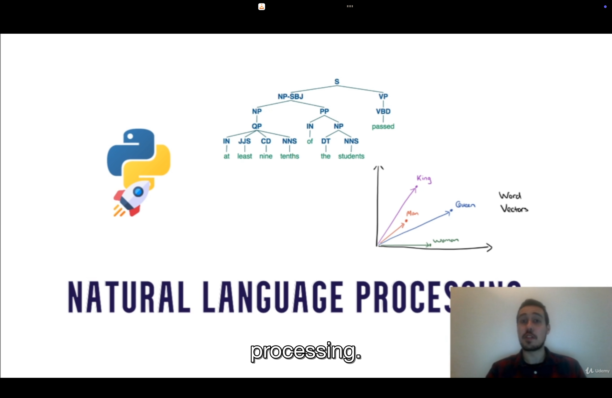
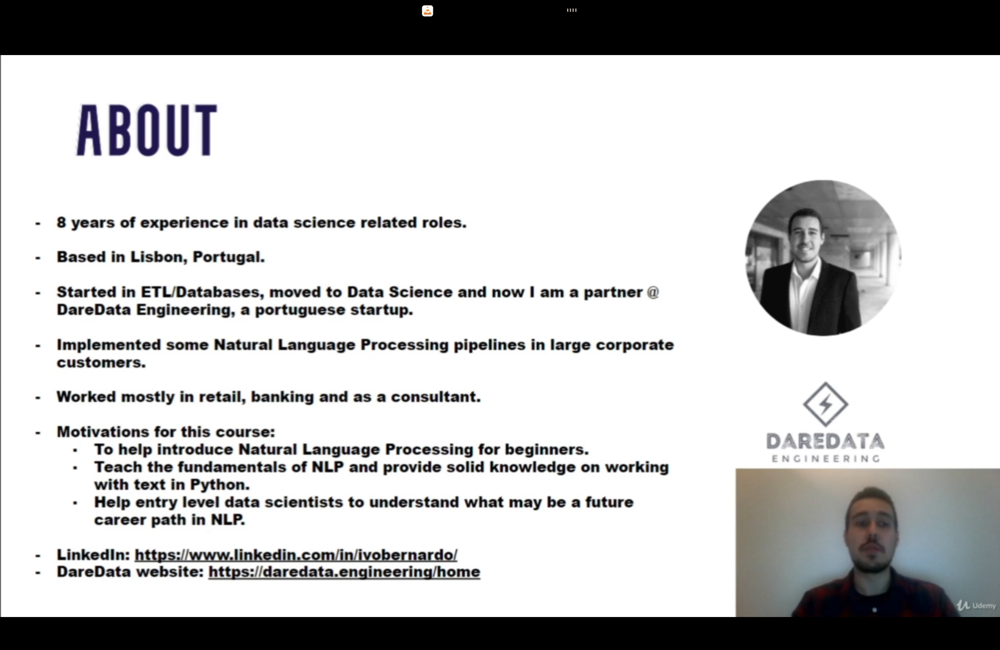
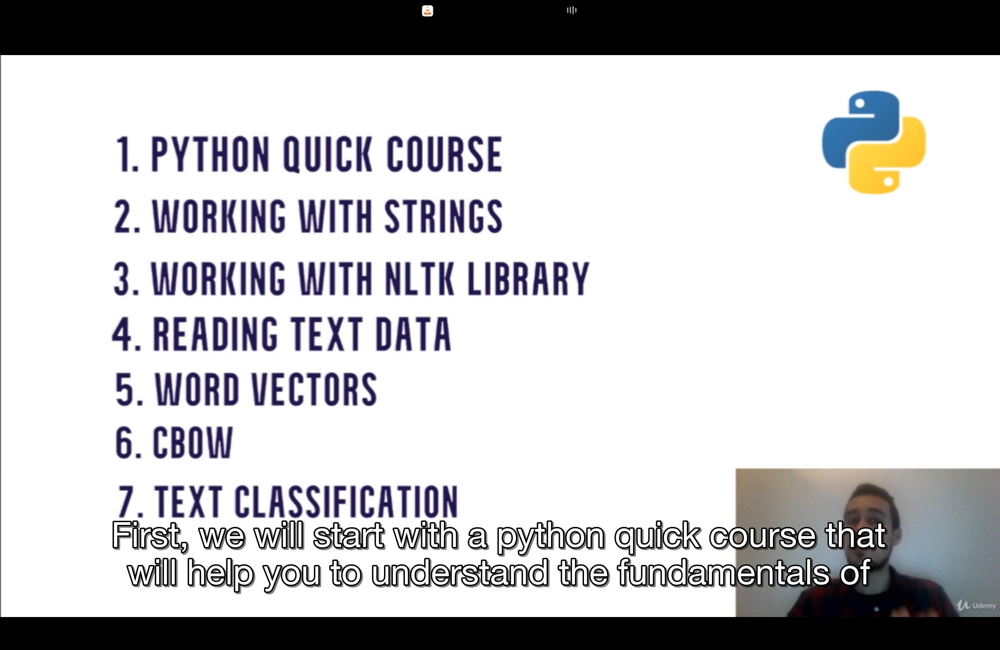
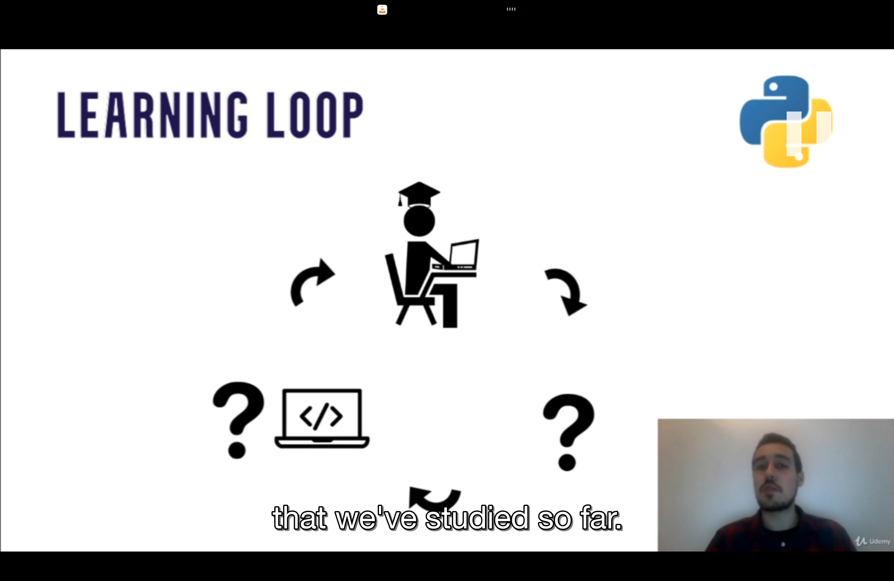
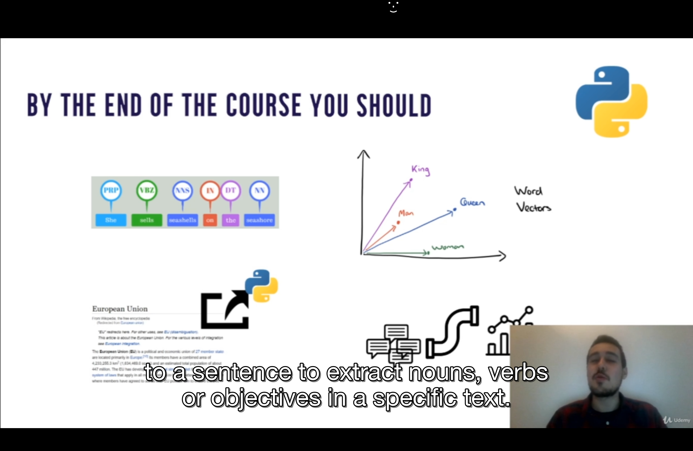

001 Introduction.en
===================

Hello, everyone, and welcome to this natural language processing course. Thank you for enrolling in this course. I hope you're excited to learn about all these new concepts about NLP, short for natural language processing. So here we are going to use Python as our coding language. A bit of context about myself: I'm a data scientist here in Portugal, based in Lisbon, Portugal, and I have around eight years of experience in data science related roles.

I've studied more on the ETL and the engineering side of things, and then I've moved to data science, and now I am a partner at DareData Engineering, which is a Portuguese startup focused on implementing machine learning and data science systems. Regarding natural language processing, I have implemented a couple of systems in large corporate customers, and also my master thesis was focused on text classification. Regarding sectors, I work mostly in retail and banking, and as a consultant, something that I do today, working for several customers, supporting them in their data initiatives.

So what were my main motivations for creating this course? First, I wanted to help introduce natural language processing for beginners. Natural language processing is a huge field and it has a lot of concepts attached to it. I've decided to provide this course for beginners because I think that these fundamentals that we will talk about will not go away in the next 10 or 20 years. I believe they are the fundamentals of natural language processing for the future.

And so they will give you a good base if you want to investigate further other natural language processing courses that have more advanced techniques or are more specialized in a subset of NLP techniques. And NLP is one of the most exciting subjects nowadays in data science, and the scientific advancements that have been done in this field particularly [unclear] forward a lot of initiatives such as text processing, translation, information retrieval and sentiment analysis or text classification.

Another motivation is that I want to help entry-level data scientists to understand what may be a future career path, because natural language processing is really funneling towards a specific career path for data scientists. There are people that are more generalist like I am, because I tend to do projects that have some concepts of NLP, have some concepts of more traditional data science, have some components of data engineering. But really, you can be an expert if you want.

And these fundamentals that we will study will also help you to understand if that's the path that you want to go forward. So here is my LinkedIn and also the DareData website. I'll leave them in the resources if you want to connect with me on LinkedIn or just check the website of my company. A bit about the course: I designed this course for beginners. First, we will start with a Python quick course that will help you to understand the fundamentals of the Python language.

So it will be just a crash course for you not to get lost around all the other sections, because we'll have [unclear] Python in this course. So this course will help you if you don't have any experience. If you have, you can skip this section. Then we are going to work with strings in Python. Strings, or characters, are really the raw material of natural language processing. And we will deal with the most important functions that we can call on strings, because we really have to master working with characters and strings if we want to be confident when working with text data.

After that, we'll spend a lot of time understanding the Natural Language Toolkit library, which is one of the most important libraries in Python regarding natural language processing. So the Natural Language Toolkit library already has a lot of functions and models pre-developed that we can use to understand a bit more about advanced concepts in NLP. We'll spend a lot of time understanding some of the most important functions of this library. Then, as most of the text that you will work on throughout your life as a data scientist or as an NLP practitioner will not come to you automatically, we'll understand a couple of things about gathering text data, such as reading data from websites using scrapers or reading data from external files. Then we'll approach an exciting concept, which is word vectors, which are one of the most important concepts in NLP and were a huge scientific advancement in this field.

In the past decade. We'll explore simple word vectors using co-occurrence matrices, and then we'll develop our own implementation of word vectors using a neural network, which is a more advanced model, and it's tied to the paper that was a breakthrough in this field in 2013. Finally, we are going to look at text representation, or how we can represent sentences as vectors and as mathematical representations, and look at text classification. Depending on the time that you will enroll in this course,

the last section, text classification, may already be available, because it's still in development, and also more sections might be available because I will be always updating this course with new material based on students' feedback. So how are you going to proceed in the course? Well, three important things. We'll have the long lectures where you will see me coding, and I expect that you follow along with the code on your system. Then you'll have quizzes about the things that we have learned in that section.

And finally, you'll have practical exercises to test the knowledge and intuition behind everything that we've studied so far. And most importantly, by the end of the course, you should be able to classify your own text. For example, classifying the part-of-speech tags in a specific text, being able to apply a POS tagger to a sentence to extract nouns, verbs or adjectives in a specific text. You will also understand the concept behind word vectors, and you'll be able to calculate your own word similarities.

Additionally, you will be able to extract text from a web page. For example, here we have a Wikipedia page that we will learn to extract directly into Python using scrapers. And finally, you will be able to build your own text pipeline, or your data pipeline based on textual data. These are some of the concepts that we will learn. But of course, we will learn many more, such as stemming, lemmatization, the concept of stop words, and text classification, as examples.

So now move forward to set up your environment. Check on the resources, the course materials. You'll be able to access all the course materials that you need for this course. You'll not need to pay anything to access these materials, of course. So this is all in Python, an open-source language, and just set up your environment to be able to go along in this lecture. So, again, thank you for enrolling in this course, and I'm excited to have you on board.

### 02 Installing Anaconda and Initial Setup

1.   

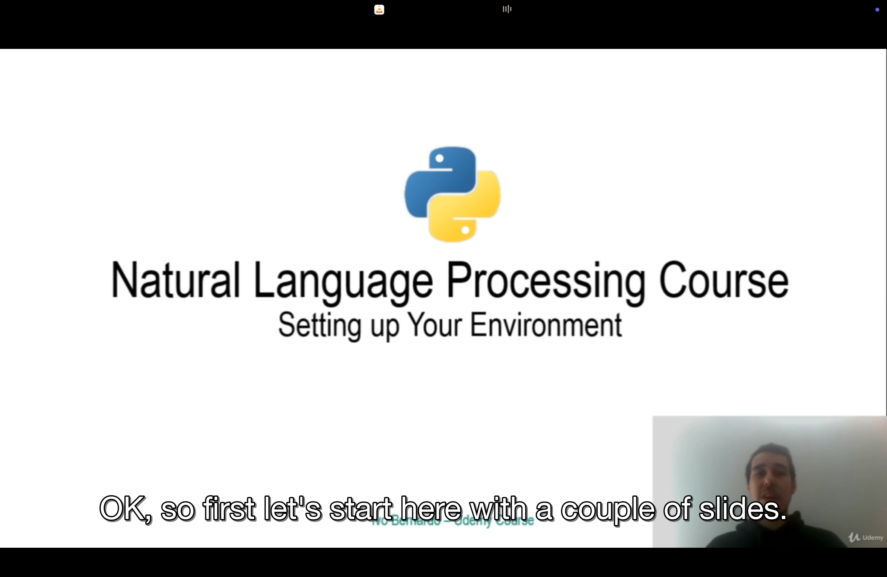
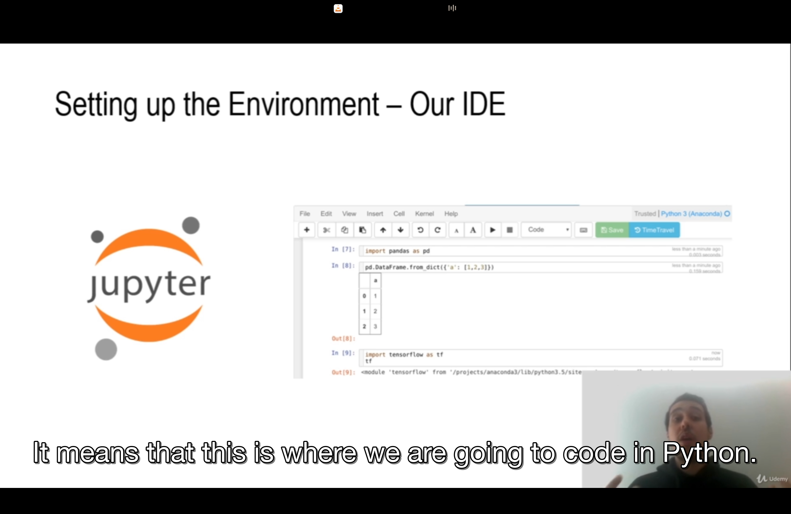
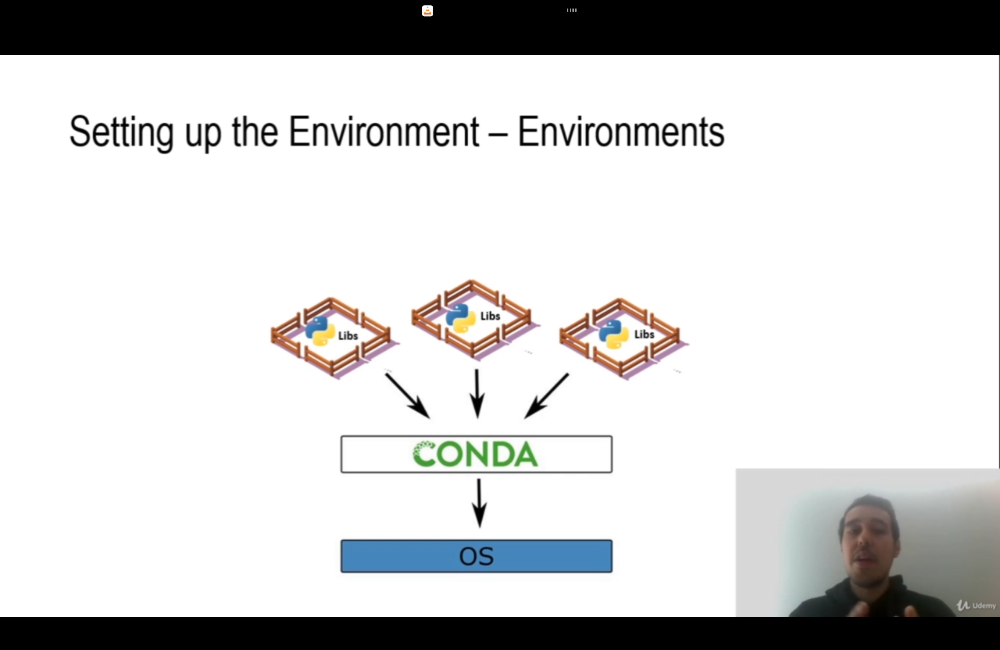

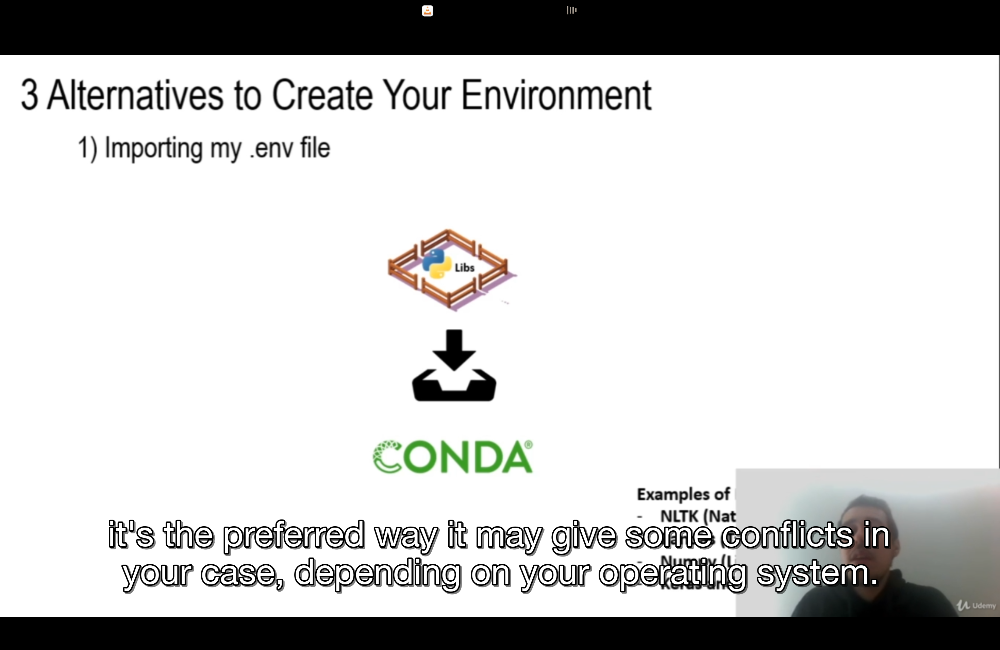
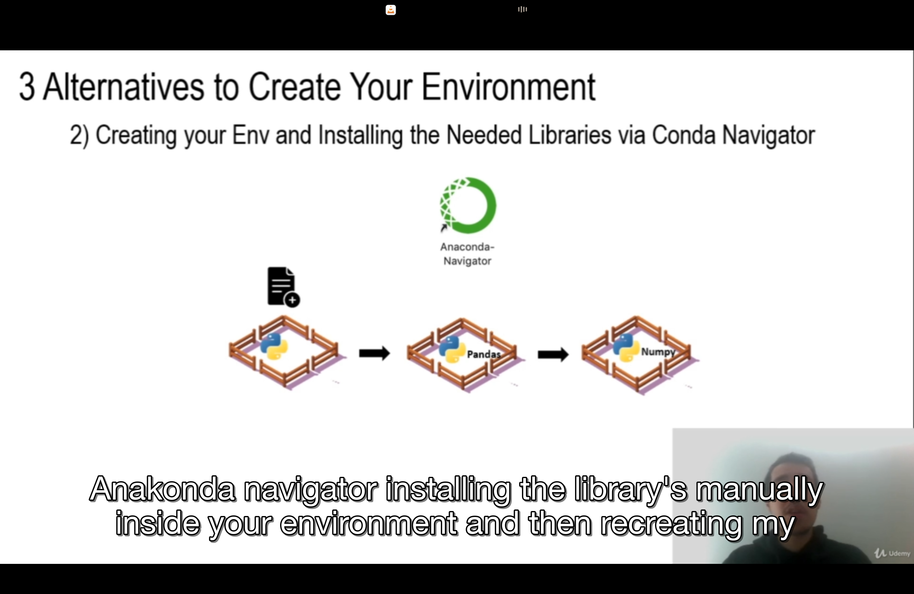
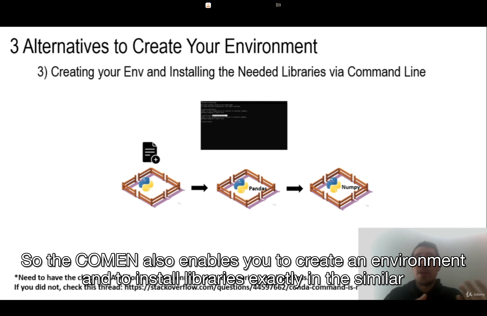
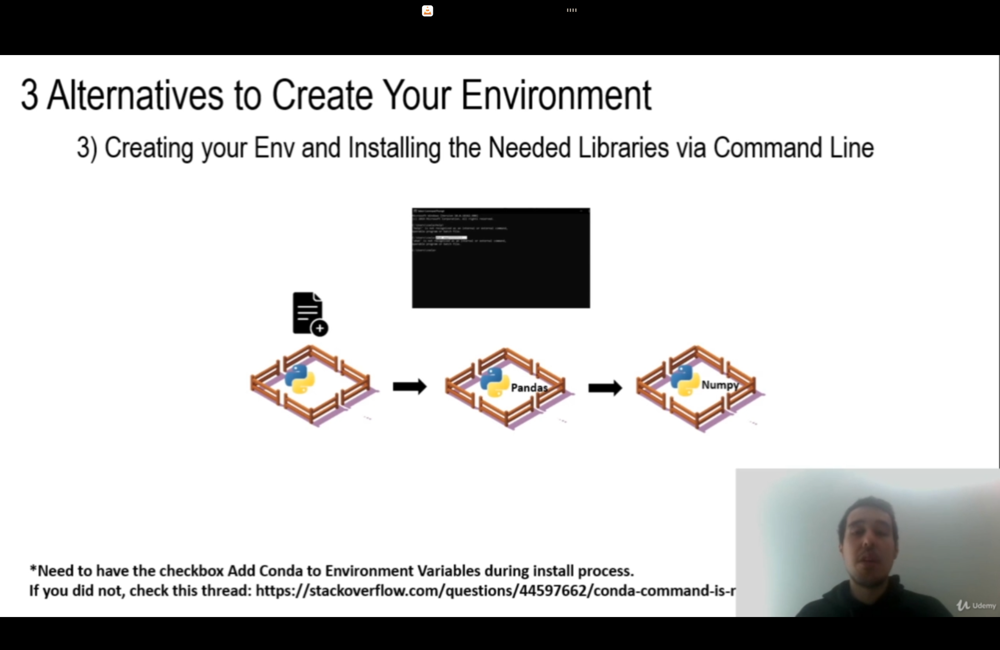
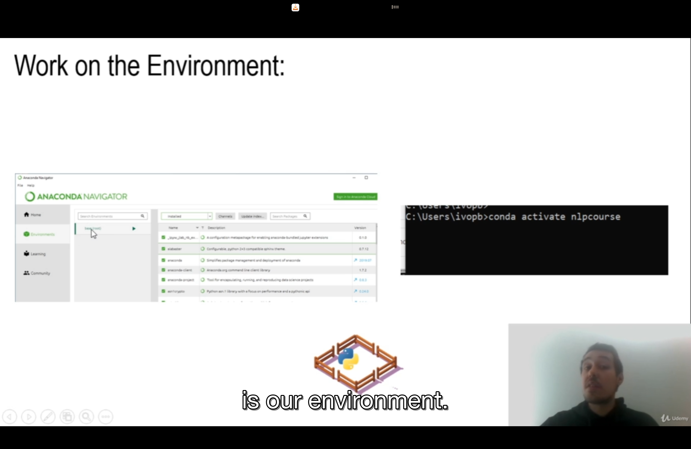
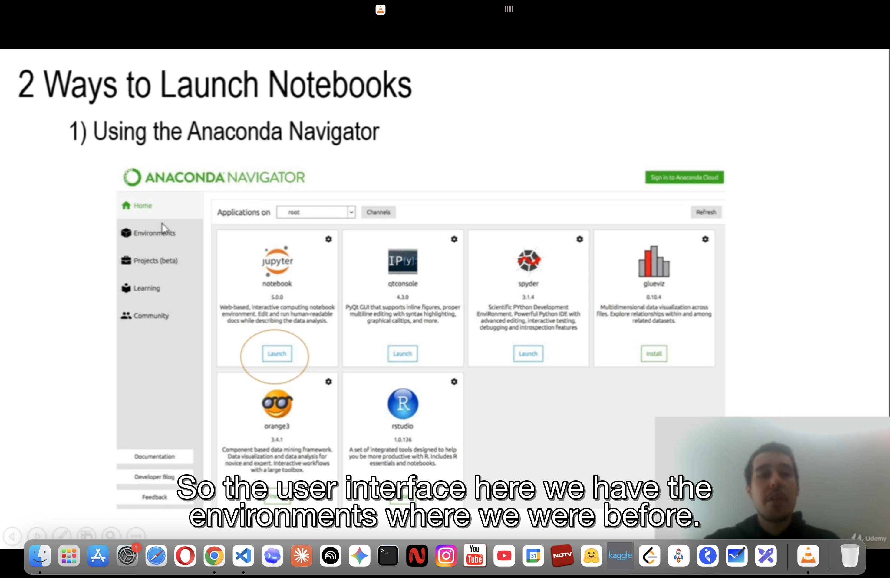
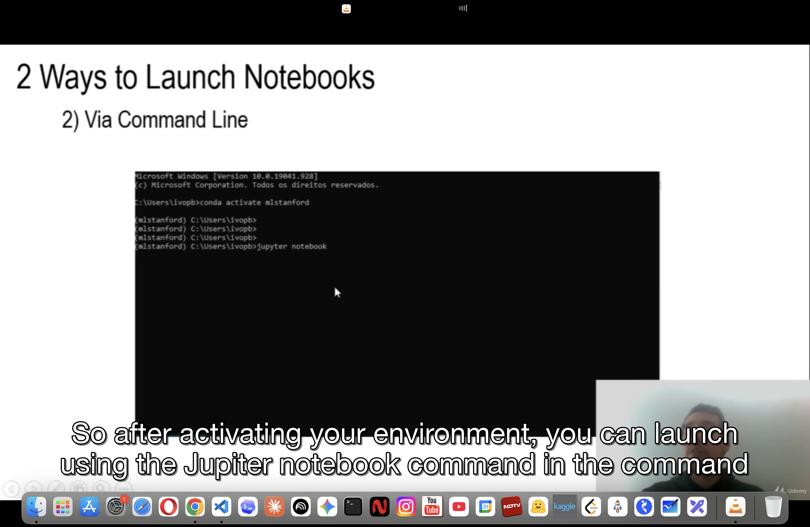
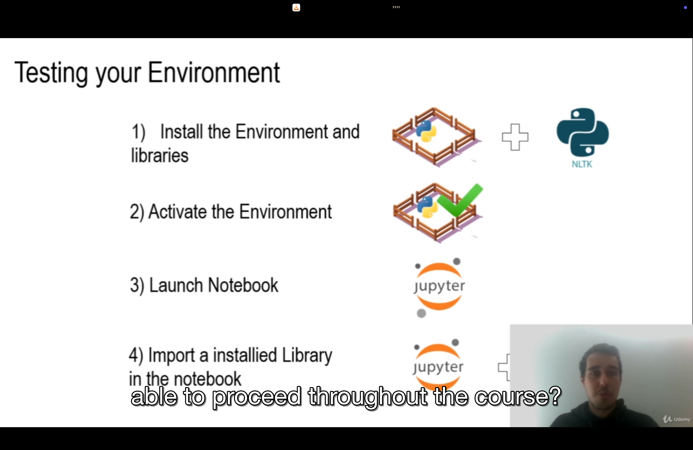

001 [Slides] - Setting up the Environment.en
============================================

And welcome to this natural language processing course. OK, so first let's start here with a couple of slides. So here we are going to speak a bit about the section, which will be the section where you will set up your environment for this course. This should be a quick lecture that will serve as an introduction for the section. If you think that you want only go to the practical part, you can skip this lecture. Although I think it's important that you stay to get familiar with the concepts that we are going to learn on this section.

OK, so let's talk a bit about our environment and how we are going to work on this course. So we are going to use a tool called Jupyter Notebooks, which will be our IDE. It means that this is where we are going to code in Python. So this is going to be our interpreter of Python code, and where we will see the results from our instructions throughout the course. Jupyter Notebooks is a really famous tool for sharing and also for developing Python code. Although it's not the best one for doing production and scaling things, it's in my opinion, the best one to teach because it enables me to write the code and also to mix the code with some comments that will be helpful throughout the course.

So we are going to use Jupyter notebooks and we are going to install it in our machine. Of course, if you have any other Python versions that you are working on your computer and you are aware of how to create environments in your computer by doing other courses, feel free to do it. This is my recommended one for beginners and for people that are new to Python. Yeah, so how you are going to work here in this course. Let me explain a bit about the environments.

So as Python is an open source language, you can download a lot of libraries from the Internet to use that code base throughout your code. But the thing is, as Python is open source versions of the libraries are always being updated by the community. And then we can have several conflicts between libraries. If you are working with different versions that depend on the libraries that you will be working on, don't worry about this too much. Just know that with Python you can, for example, download an external library that contains some functions that you can't use when you install Python.

The first time in general, best practice to deal with all these libraries is to keep them separated between each project or each course that you do so that you don't get many conflicts between the libraries that you will need. For example, I'm going to provide you with an environment that you can load to use in this course, but that doesn't mean that my environment is the best one for other courses that you do. So that's why we treat these environments like fences.

So think of environments like fences, where you package your libraries or the specific versions that I've used here [unclear], and you package those libraries all together so that you can use different versions throughout different python codes or even throughout different Python projects. So think of environments as this closed boundary fences or this closed boundary space where you can encapsulate all the functions that you need for a specific project, and then you can create another environment to use in another project.

For example, in another course. Here we are going to use Conda, which is a good package manager for beginners, because it's just point and click most of the times, except one of the solutions that I'm going to tell you. But this is a good package and environment manager for beginners. So we'll use that in this case. Again, if you are already familiar with other types of package managers, such as using virtualenv in Python, feel free to do it. This is, of course, my recommendation for beginners.

So as I've said, our environment manager will be Conda. If you already have it installed in your computer, you can use that install version to keep going throughout the course. During the course, I'll give you three alternatives to create your own environment. The first one will be to import the .yml file, which is exactly the environment that I've used, and it's the preferred way it may give some conflicts in your case, depending on your operating system.

That's something that I can't control. And that's why I have here also two other alternatives that you can go if this one fails. But again, this is the preferred one, because in this way you have exactly the same versions that I have of the libraries that I've used throughout the course. Examples of libraries that we will use are Natural Language Toolkit, a really good library for natural language processing. It's not spectacular in anything, but it's good for most of the things.

So it's really a generalist library. Then we'll use pandas, for example, to work with tabular data and DataFrames. NumPy to deal with linear algebra throughout the course. Also we'll use Keras and TensorFlow to do some neural networks training. As an example, these are not the only libraries that will use, but some of the most important ones are [unclear] scikit-learn, the library that enables us to train also other types of models that are not neural networks.

OK, so second way to deal with your environment and to create your environment is to create an environment from scratch using Anaconda Navigator, installing the libraries manually inside your environment and then recreating my environment, not from the file that I have, but from installing libraries, using this Anaconda Navigator. The downside of this one is that you may have slightly different versions than the ones that I've used in the course, and the results may change a bit depending on the version of the library that you're using, although the intuition is the same.

It's not super bad, and it is an alternative for you to proceed with the course. And being able to run the Python code that I've given you in the notebooks that I have provided. The third alternative is a bit more [unclear], a bit more advanced, which is using the command line with the conda command. So the command also enables you to create an environment and to install libraries exactly in the similar way as using the point and click from the Anaconda Navigator.

Although to use this conda command, you need to check the checkbox to add Conda to the environment variables during the installation process of the Anaconda distribution. Even so, if you didn't, there's an alternative. I've left the link here for you to be able to add the command to your environment variables so that you can run the commands on your Windows environment. It's important that if you have checked the checkbox during the installation process, you must know that that may enter in some conflict with some Python versions that you have in your computer.

So just be aware of that. If your computer is a Windows one, for example, clean of any Python version, That's probably not going to give you too many troubles. But if you are working on a Mac or Linux, which are a bit different in terms of how the operating systems work, you may have some troubles when you migrate or if you want to migrate to base Python in the future. So just be aware of that. Even so, this is also an alternative, using this conda command. Working on the environment

Basically, that's super simple. We just go to the environments in the Anaconda Navigator and then what we have right here, for example, is our environment. In this case, this is a standard environment that comes with an install process of the Anaconda distribution, which is the base one. And then you have the list of libraries that are in this base environment. This play button is super important because it tells you that you are working on this environment.

And when you launch notebooks from this environment, you'll be opening your notebook inside this environment, being able to access the libraries that are inside these environments. So imagine that if you have this play button, you are inside one of these fences that we have right here. And you are working with the libraries that are inside this fence and you can't access the libraries that are outside of the fence. And if you are outside of the fence, you can't access the libraries that are inside of the fence.

OK, so this is how you activate via the command line. And here in the Navigator, you just have to click on top of the library and you'll do exactly the same. This is just a command line alternative. OK, so two ways to launch notebooks. The first one is using the Anaconda UI. So the user interface here we have the environments where we were before. Now here at home after installing Jupyter Notebook. If you haven't, you can launch them using this button launch inside the home page of the Anaconda Navigator.

Of course, there's also a command to do it. So after activating your environment, you can launch using the jupyter notebook command in the command line, and this will launch you a Jupyter notebook and you'll be able to work on it just as if you have launched using the Anaconda Navigator, although with slight differences that we are going to explore throughout this section. OK, so testing your environment and this is really important is how are you certain that you will be able to proceed throughout the course?

Well, you have to install the environment in libraries. You have to activate the environment. You have to launch the notebook, and then you have to import a library or install a library in the notebook that you don't have in any other fence or any other environment. So, for example, here we have the NLTK library that I installed using only this environment or installing this only in this environment. And then I tested it using this environment only because if I was working on any other environment in some way, I wouldn't be able to import this library, NLTK.

Don't worry about this, will do it throughout the section and will go step by step or give alternatives for the three ways. If, for example, you can install it using just the first way, which is importing the environment. And let me return here. So import this .yml file that I've given in the course scripts go ahead and proceed because you are ready to test your environment then to continue with the course. OK, so I hope this was explicit, tried these alternatives throughout the section.

I've given three of them so that you are able to debug if something goes wrong with one of them. So you have three alternatives if you have some trouble and with a Google search, you can find the solution for setting up your environment, drop me a message, but please be sure that you are trying everything that you can on the three alternatives and also that you are checking on the Web first, because most of the problems that you will have, someone else will have also or with a high probability and you will find your solution.

This will enable you to proceed with the course without waiting for my response, which may be a couple of days. So it's better if you try to solve this on your own first and only as a last resort. You send me a message. So I'm excited to have you on this course. Let's go further and proceed so that you can start to code in Python and also start to learn the fundamentals of working with text in Python and be ready for more advanced natural language processing stuff.

2.   

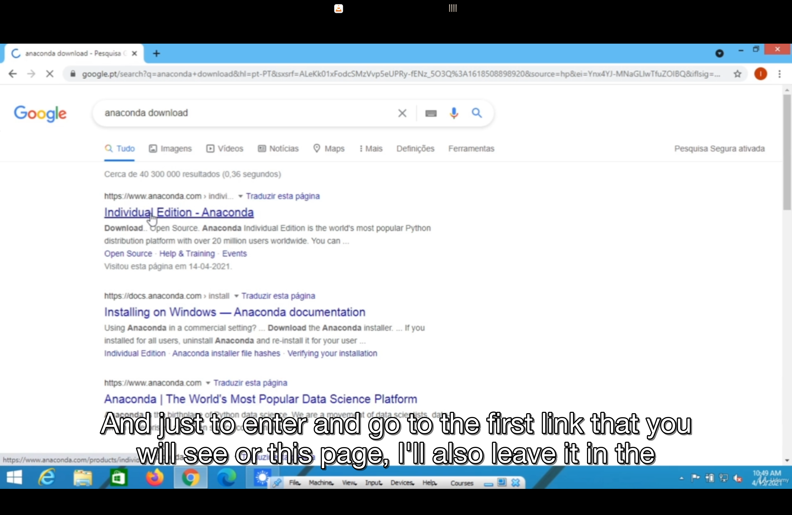

002 Installing the Anaconda Distribution.en
===========================================

Hi, everyone, and welcome again to this natural language processing course here in this lecture, we are going to do the setup that we need for the rest of the course. So we are going to use the Anaconda distribution, which is a distribution that lets us run notebooks on Python. And as we deal with a lot of notebooks throughout this course, we'll use that one here. If you are comfortable in using Python in other setting and installing libraries using pip or other package managers, be my guest.

I'll leave the requirements in, of course, materials. But if you are a beginner, just follow along this tutorial and you'll have your environment set up and ready for the course. So I'm going to use Anaconda and Jupyter notebooks just because it's easier for beginners or someone that doesn't have any knowledge in Python to start this course. So that's why it was the choice for this one. As we are dealing with a course for absolute beginners, I think that was the best choice regarding the potential audience that I will have in this course.

And also I'll use the principle of least knowledge and try to keep it like that throughout the course. We'll have a quick course on Python in the beginning of the course. For those of you that are not familiar with the language or having problems with Python, of course, we are not going to go too deep into the language, but we are going to scratch the surface on most of the important concepts so that you can follow along the rest of the course in terms of natural language processing.

OK, so let's start and install the Anaconda distribution, follow these steps so that you have the environment up and running in your system. OK, so I'm here in Google and what we are going to do here to install our software is to search for Anaconda download. We are going to follow along the install process in Windows, in Mac or Linux. It's really similar. You just have to install these distribution, although you can use Python native in Mac or Linux.

That's your choice if you are familiar with it. And just to enter and go to the first link that you will see or this page, I'll also leave it in the resources, but this page will have the Anaconda distribution for us ready to install. And now if you scroll down this page, you should have somewhere the Anaconda installer. So I'm using this version, Python 3.8. If you are on a more advanced version, there's no problem about it. You may have slightly different results from the ones that I have during the code-along lectures.

But as long as you understand intuition, that's fine. So I'm going to install the 64 bit version and I'll hit here and now the download should start. So as you can see, here is Anaconda downloading. Be wary that the download file has about five hundred megabytes of space. We will need this program for us to continue in the course of these Anaconda distribution will basically enable us to program in Python inside a notebook environment. If you have done other courses, probably you are familiar with this format, but this is also a good form to teach because it enables you to mix between code and comments and it enables you to write a structure on a specific file for the students to read.

So that's also a good pro here on the notebook format that we are going to use. As soon as the download finishes, you can click the download and this will open the file, the install process file, and will continue with that. But if you don't see it here in your bar, because that depends on your browser configuration, just go to your normal download folders where you download stuff from the Internet and in there you will find the file or this Anaconda setup file.

Here you just have to hit Next and then you can read the license. I've already read it, so I'll use I Agree. You can install for all users or just for me here. I'll use all users if you want all users. This will require admin privileges. So if you are not an admin, you won't be able to do this. But for me, as I'm an admin of this machine, I can continue forward and I'll install it in the default folder. You can install in any folder that you want, and then next you can add Anaconda3 to the system path, environment variable.

And it depends on the risks that you might be taking on adding this option. I know that I can take this option because of other install processes that I don't have on my computer. If you are not certain of that, don't add this checkbox. This will enable you to run a command line directly by calling the conda keyword. If you don't have this, you may have some problems. I'm going to add it, but be wary that you have if you have other python distributions in your computer, this may not be recommended.

So I'm going to use install and then I'll wait for the install process to finish. One of the cool things of Anaconda is that it already installs the most common python packages that we use in data science. For example, NumPy, you may have already heard about that, Matplotlib, which is a plotting library, and also, for example, scikit-learn, which is one of the most common machine learning libraries out there, and the Anaconda distribution already installed this in the environment.

We'll talk a bit about the environments, don't get confused. But this is just a good thing for you to know that if you install Python base, you will not have these libraries already available for you in most cases if this process takes up more than 10 minutes. Don't worry, because that's normal, depending on your system. And you'll see that the installing process will finish probably under 30 or 20 minutes. OK, so after the installation process finish, you can hit Next and then hit Next again and then you can leave this both checkboxes on or take them out.

This will take you to another menu. I'll take them out and hit Finish. OK, so now you should have access to Anaconda in your system. Let's try to open it. And if you go to your search in windows and if you are in windows, you can search Anaconda and you'll have this Anaconda Navigator. Hit it or open this program. And now we will see Anaconda and enter the Anaconda page. Also, if you want, you can watch this tutorial on the website, on the Anaconda website.

It can also help you if you have some further questions after this section. OK, after a while you'll have here then the software, Anaconda Navigator. Now in the next section, we are going to learn how to launch Jupyter Notebooks and also how to set up our own environment where we are going to work. So Python is an open source language and relies a lot on libraries that we will use and install to work with. So a lot of things that we will use will be code that has been developed by other people and we will use them in the concept of a library loading a library, which is really some external code that enable us to have some new development already available.

And that's one of the greatest powers of open source in this case of the Python language, that it's free and it's developed by people all around the world. So there are millions of contributors to the language that enable people to use their code for free. Given that, we'll install some certain libraries here. we are going to be restricted to probably 10 or 11 libraries that we are going to use other than Python, basically. But we will learn all about that in the next lecture where we are going to create here an environment because Python base and the base environment for Anaconda already has some preinstalled libraries, as we've seen during the process.

But we will want to create our own environment where we will only install the libraries that we need for this course. So this is also a best practice if you are aware of virtual environments and working with virtual environments. Be my guest. I'll leave the requirements for the course in the course materials. But if you are not, no worries will create an environment from scratch and will also import an environment that I've been using throughout the course so that we have approximately the same results when we run the same code.

So just to be clear, here we are on the base environment. So the base installation of Python with Anaconda Navigator, and there are a couple of libraries that we have here that are already preinstalled. So, for example, NumPy, which is one of the most common linear algebra libraries that we use in data science, is already installed in this Anaconda base environment. We'll create a new environment where we will install several of these libraries and also others, such as TensorFlow and also Keras, which are neural network libraries that we will need for this course.

But let's learn all about that in the next lecture.

3.   

003 3 Alternatives to Setup your Environment.en
===============================================

Hi, everyone, and welcome again to this course, so the next lecture's will be focused on three hypotheses to install and launch notebooks. So we'll have one way to install notebooks here via the Anaconda Navigator. So going to the environments and installing packages via the user interface, we'll have another method where we are going to go to the command line. So here, and we are going to install libraries via the command line. And then the final method will be to import environments using this import right here in the Anaconda Navigator, where we are going to import my environment, the same environment that I've used throughout the course.

All these three hypotheses are valid. You can use any one of them. Some of them may cause some troubles in some machines, hence, and giving three alternatives for you to set up the environment. My recommendation is that you see the three alternatives and you do the following. You start to try to import exactly my environment. If that doesn't work or you have an error by yourself, try to use then the Navigator to install libraries here on the search packages and to launch your notebooks that you see here using this environment.

And finally, if any of those solutions doesn't work for you, try the command line solution by following along that lecture that I've left in there. These three alternatives are supposed to cover all the bugs that you might find in your system. If not, then just drop a message saying, what is the trouble that you are finding? Make sure that you are really following all the steps in all the alternatives and only call for help if you are sure that you have tried all three alternatives and none of them work. Setting up Python and the Navigator and the notebooks may be a bit cumbersome depending on your machine, but I hope that these three alternatives will cover 99 percent of the troubles that you may have in setting up your environment.

So, again, pay attention to the next lecture because it will be important in setting up the environment so that we can start working on Python in this course and we start to learn the exciting new things that await us.

4.   

004 [1] - Creating an Environment and Installing Libraries via Anaconda.en
==========================================================================

Hi, everyone, and welcome again to this natural language processing course, so I am here on the Anaconda Navigator homepage, remember that you can get to this homepage by opening the Anaconda Navigator on your computer after installing it. Now, what I want to do is go here to environments hitting the menu on the left and here. What we are going to do is to do create a new environment. And I'm going to call it... I'm here in Python. I'm going to put here the version of Python.

I'll use 3.7. So if you can, also use this 3.7. I'm going to call this NLP_course, so you can call also this environment with this name or any name that you want, and I'll hit create and you see that your environment is being created. After that, you'll have your play button, and that means that we are working on this environment. So when the play button was here on the base (root), it means that we could access the libraries that were installed already on the base.

And now as we are creating a new environment, what happens is that we will only access certain packages or libraries. These terms will be intertwined that are already installed in this environment. So environments have completely different packages depending on what you install on each of them. That's actually the benefit of having environments so that you can isolate your development environment. Because imagine if you do another course on Python as an example that would require a specific version of a library because libraries have versions.

So libraries are being constantly updated with new code and with updates that make the library a bit better. Sometimes it may be important to use some specific version from the past that doesn't cause any conflict with other library that has already been developed. And by having the libraries isolated, you can also do the same for that other. Of course, if you need that in particular, also in your personal projects, it's good that you maintain your environment separated so that you can keep track of the different libraries that you are using for a specific project.

I've created NLP_course and now you have your play button. And I notice that we only have these libraries, 11 packages available while on base (root). You have many more packages available. Now, let's see how we can install libraries here in several ways. The first way that we are going to do is using these search packages right here where I'm hovering with my mouse and I will search one of the libraries that we will use, which will be the NLTK library.

As you notice, I wrote NLTK, nothing shows up. You just come here and select Not installed. And then some library will appear here. You can check the library and then here down below you can apply. As soon as you apply the install, packages will pop up and then it will search for the library that needs to install and also the dependencies of the library because some libraries depend on other libraries. This already does everything for you. And it's so easy, the library that you want to install, this case NLTK, and all the other libraries that you'll need for this case, I'm going to hit apply and it will be available in this environment.

This means that we can use import nltk inside this environment. You'll see what this means in a bit because we'll do throughout the course a lot of imports regarding libraries that we will need for our python programs and for our Python applications. OK, after the install process finishes, you'll see that you no longer have NLTK here, because now you'll have to go to Installed, and it's already installed in your environment. This means that now we can use NLTK inside our environment.

You can see in the course resources which packages I want you to install. Now, this has a small caveat, because if you install all the packages in this way, the packages that we want for the course, you can have slightly different results from mine if you are OK with that. That's not a problem for you. During the code-along, as long as you understand the intuition, this is a good method for you to install the library. OK, so in the next lecture, we are going to launch our first Jupyter notebook and also learn how to install libraries in there, because here, for example, I'm going to use this library as an example, which is the Wikipedia library.

If you go here to not installed, we don't have a library only called Wikipedia. We have this R Wikipedia [unclear], that's not the library that I'm targeting. And we'll see an alternative way also to install packages inside our environment.

5.   

005 [2] - Creating an Environment by Importing the YML File.en
==============================================================

Hi, everyone, and welcome to this course. OK, so now we are going to import an environment from a file that will let us import all the libraries that I've used throughout the course. In this case, the course that I'm talking about is the natural language processing course. So you can use those libraries also because I have the file in the course materials. So the file of the environment is this NLP_course.yml. So this file contains all the information about the libraries that we need have also left here a requirements.txt, for those of you that are already familiarized with how you work with requirements and how you can install these requirements using the package manager, for example, again, for beginners, let's try the YAML file.

So if you go here in the Anaconda Navigator in the environments, you just do import and then I'll call this NLP course, without the underscore that we have on the other environment, and I can select a file to import from. Let's open that. Going to navigate to the course materials folder, and then we have here this YAML, you just open it and then you hit Import and this will try to recreate your environment by itself. This process, depending on your system, may lead to some problems in some areas.

If it does, remember that you have other alternatives in this section. I believe that between one of the three, you will be able to have your own environment with the libraries. I've given these three hypotheses because that's the way for you to have a choice if some of them don't work, this is actually the best one, although I think it's important that you know how to install libraries by yourself. This is the one that will take exactly the same libraries that I've used in my environments.

So in the environment where I program the course and the results would be the same, for example, where we have some random parts, because for some algorithms, algorithms start on random points and that random may change from machine to machine. With these libraries, the probability that that will happen is lower, at least importing the same environment that I've used. What you'll see is that this will import the libraries and then when it finishes, you will have the environment available for you with all the libraries that we need for the course and you'll have a play button here means that you can work on that environment.

As we were launching notebooks, as we have learned here, going into home, launching here or even activating this environment, using the conda activate command on the command line.

6.  

006 Launching a Jupyter Notebook via Anaconda Navigator.en
==========================================================

Hi, everyone, and welcome back to this course, we have this NLP_course environment already activated. Now that we have this play button in the environment, we are working on this environment and this environment. Only now what we are going to do is going to home and we are going to install or hit install here on the notebook. So I don't know if it's located here or here. Depends on your Anaconda Navigator, but just hit Install on Jupyter Notebook, in this case a web-based interactive computing notebook environment that will be using this course is being installed in our environment and then we can launch notebooks and start to code immediately inside the notebooks.

So let's just wait a bit. This should take a couple of minutes and then we can access our notebooks. So if you during this process, you have a pop up from windows asking to execute [unclear], hit Yes. OK, so after completing the install process, you'll see that now Jupyter Notebook doesn't have an Install but has the Launch, and you can hit Launch. And this will trigger a web browser page where we can access our notebooks and where we can access our environment.

But have the opportunity then to code in Python. Just hit Launch. And after hitting Launch, you will be taken probably to this folder that has a lot of folders, for example, from your user in Windows or your home in Mac or Linux. And here you can create, for example, a notebook. We'll see in a minute how we can launch notebooks in a specific directory, for example, the course directory if you want. But if you have here the course directory on your user, you can navigate to the folder just like you do in any other explorer or Windows Explorer, for example, going to My Documents and then returning.

I just have to click here and then I'll be in the parent folder. So this is a normal explorer like you would expect in windows. So I'm going to open here just a notebook for us to check and then you can use New, Python 3, and you will be inside the environment where you have launched. You know, there are certain systems where this doesn't happen because of a bug in the Navigator. We'll also learn an alternative way to do this. Don't worry, we'll get there.

So here will now have access, for example, to our library NLTK that we have here that we have just installed and we can import libraries using this import. So import nltk. This will import our library that we want to work on. Now we can access the functions of these library. They are available for us and have been developed by other people. So we'll have a section just on introduction to Jupyter Notebook. Don't worry, this is an example of some code that we can run.

For example, one plus two and hitting run will have a result here. This interprets Python code so I can use also a "Hello world" classic, and then running this will give me an output. This is the output, the return from the cell. If I print, I'll also have some return. Of the string, although it's not the return of the cell, because this is a print statement. Don't worry, you will understand this in a bit. Now, you can work here around in Python and this will be extremely useful.

So another thing that we might want to do is to install libraries. You can also try to install this using pip install. As I'm writing here, for example, pip install wikipedia, you can run this command on your own and you'll see that you may install this. I'm not going to run it here because I want to install it in an alternate way that we will see using the command line. Next, you can also send command line commands using this exclamation mark here: !pip install wikipedia.

Again, I'm not going to run it, or else I'm going to install the library. But you can also try for yourself if you want, in this way, just running using the exclamation mark with pip or conda, first using conda to see if the package manager would find it in Conda. If not, you can use then pip install. And we'll see how you can activate environments using the command line and then how we can install libraries inside the environment using also the command line.

This will also be cool. Of course you don't need to, but it's also cool that you know, because it's an also an alternate way to work around with these packages and all these environments that we are working on right now.

7.  

007 [3] - Creating an Environment via Conda.en
==============================================

Hi, everyone, and welcome again to this course, so here we are going to learn how to create an environment via the command line. We are going to run the commands. And these commands are only enabled if you have selected during the installation to add Conda to your path through your environment variables. So that check that I said that may interfere with other Python installations that you may have in your computer. So if you've decided to go through this way, if you have other Python versions in your computer, this might interfere with those versions when you call commands.

But of course, this is a more advanced way to do it. If you are able to set up your environment and import the libraries that you have installed. And if in the future, when we start to import some libraries, you are able to import those libraries using one of the methods that we have seen before, then proceed with that only return to this method if you can't put your environment working Using the second method that I've shown you here, which is importing my environment or using the first method where we created an environment from scratch and started to import some libraries.

So only go through this option. If if none of those solutions work, you will only know if they are working. If you load my environment or install some packages in an environment that you are creating and then you launch a notebook and you can import that library inside the notebook. We'll explore that in the next lecture so that it's really explicit. But now let's do the following, which is coming here and doing CMD. So searching for the command prompt, open the command prompt, or the command line on Windows. In Mac or Linux,

Open the command line of those operating systems. And then if you have added the Python path, you can do the following, which is doing the command conda. If you type conda and you have all these options here, then that means that you can launch on the commands here in the command line. If not, if for some reason conda is not recognized. For example, if I use blah blah, I have blah blah is not recognized. So if conda is not recognized, that means that you don't have Conda in your environment variables and Windows doesn't recognize that.

So Windows doesn't recognize what Conda is because it doesn't have that reference. I'll leave also something in the resources. So if you didn't add Conda during the installation process, you can have it after the installation process. I'll leave a resource for that. But again, be wary that that might influence other Python installations. OK, so to create an environment using Conda here, you only have to do the following. So conda and then create and then you type two dashes and then you'll do name and you name your python environment.

I'll name it NLP_course_conda so that we know that this is the one that we are creating through the common way. And now I can use python==3.7. So this will tell which Python version I want to create my environment on your own enter and your environment is being created. So this is exactly the same thing as we have done in the Anaconda environment. We have a prompt saying if you want to proceed, click y and now we'll create our environment and Conda's creating our environment via the command line.

We'll just have to wait a bit and then we'll have this environment accessible just like any other environment in an Anaconda navigator, as we will see. And that's it simply is that now I'll go to Anaconda Navigator, and when you open Anaconda Navigator, if you go to the environments, will have this environment already accessible for us. So I'm here in my Anaconda Navigator and now if I hit Environments, I'll have here an environment called NLP_course_conda, which is exactly the one that I've created using the command line.

8.   

008 Installing Libraries via Conda.en
=====================================

So I'm going here for CMD in this case, which is the command line. Let me magnify this a bit and now here what we can do is then to activate our environment using a simple command, which is conda activate. Now, I think you will only be able to run this command if you have added Conda to your path during the installation. If you haven't, I'll leave a link in the resources to help you debug this command. Of course, I'm giving you several alternatives for you to set up your environment.

So just choose the one that you think it's better for you, the user interface. It's probably better for you to install some libraries, so you might not need to go here to the command line. Again, I'm giving several alternatives. This is one of them. So I'm going to use conda activate. This is exactly as going here for the user interface and clicking on the environment and NLP_course_conda. So I'm activating this environment on my command line. So I have here the environment.

Notice that this is different means that I'm already working in this environment. OK, now how can I install libraries here, just like I've shown you in the notebook where with the exclamation mark you were sending command line commands, it was as if you were writing in the command line here. You can also do the following. Let's do conda install wikipedia, which was the library that we wanted to install again because we didn't see the library here in the user interface from Anaconda.

Now let's see collecting package metadata. And if you check the result, there's an error because packages are not found. So sometimes packages are not found using conda because they are not indexed in this package manager. What you can do is then install using pip, which is another package manager. Don't need to worry about that. And then just call pip install wikipedia. Then you'll see that this will install the library, and the end of this return is "Successfully installed wikipedia".

Now, what you can do is also here you can run python, and then you can, for example, import wikipedia here. And this will lead to no error, although I'm in the command line, I'm I'm writing Python because I'm in Python interpreter not on the command line. So although it's the same window, it's not the same thing when tried to import blah blah. And this will give me ModuleNotFoundError because of course this library is not installed and it doesn't exist in my environment.

9.  

009 Launching a Jupyter Notebook via Conda.en
=============================================

Everyone, and welcome again to this course, so here we are going to learn how to launch a Jupyter notebook inside our environment using Conda. So I'll search for the command line in my Windows. Remember that you can search for a command line typing CMD and then opening the command prompt in your Windows. And this will open the command line. Here on the command line, Just activate the environment that you want. In this case, I'm going to activate NLP_course_conda. we've learned how to activate environments before here using the command line, and now we are inside our environment and here before accessing the Jupyter notebook to run on your environment, you have to install this library, which is conda install nb_conda.

So we are installing this library inside our environment already so that we can access this environment inside our Jupyter notebook. And we are not working on any other environment that doesn't have the libraries that we need to run this. And this will install this nb_conda library inside our environment. I have a typo in the library: nb, underscore, conda. Let's install it now. OK, so after nb_conda tries to install, then [unclear] you will hit

Yes. To proceed. This will tell the package manager that you really want to install this library and when the library finishes, then we will be able to open Jupyter notebooks and work on our environment. In this case, NLP_course_conda, the environment that we want to work. OK, so after nb_conda finishes, you can type jupyter notebook in the command line. And what will happen is that Jupyter will now open in the computer. So our browser will pop up and we will be inside our notebooks where we can work on.

And now a cool thing is that you can go here to new and you can open not in Python 3, as would happen if you went via the Anaconda Navigator notebooks, but here using the Conda environment, NLP_course_conda. And here you can click and you will open on that environment specifically and you'll be working on that environment, not on any other environment. And then you'll have access to all the libraries that we've installed in this environment specifically.

So to test that your environment is really working, test using the next lecture where I'll show you how you can understand if your environment is ready to go and ready to continue to the course where you will have access to all the libraries that you need so that we can continue forward. And you don't have any problem accessing libraries that are going to be a really crucial part of the whole course.

10.   

010 Testing if your environment is OK.en
========================================

Hello, everyone, and welcome again to this course, so only one thing missing now, which is how do you actually validate if your environment is OK and ready to use in the course? So we'll use a logic which is installing a library that's not installed in any environment or any other environment that you have on the environments here. And you can install this library using either the navigator or the commands that we have learned. That's your choice.

And depending on the choice that you've used, if you have loaded the environment, go to that environment that you have loaded using my YAML file, check one of the libraries that is there and is not in any of the other environments. For example, you may have here some library. There might be some library in there, such as the [unclear] library that you can use to test. Just make sure that in the environment that you are testing and that you will work on, you have that library only installed for that environment specifically.

So let's test that. I'm going to do the following. I'm going to my environment and to make sure I have here this environment NLP_course_conda, which is the one that I'm going to use, doesn't matter what's the origin of this environment. Doesn't matter how I installed it, but I'm going to go here and going to not install and I'm going to choose a random library here from this one or these huge lists that we have here. So as an example, I'm going to use this Dropbox Library and we are going to install this library on my environment.

And I am sure that this isn't available in any of the other environments that I have. This is really important for you to make the test and let's do it. So I'm going to apply I'm going to apply here and the library will be installed. Of course, Anaconda will look for the dependencies of this Library of Dropbox Library and after the library found the dependencies hit apply. This will install this library specifically on my NLP_course_conda. So it doesn't matter how you install this library in your environment, it can be either via the navigator or via the command line.

It really doesn't matter how you do it as long as you don't have this in any other environments to do this test, because this will make you sure that you are working on the environment that you want to work on the Dropbox Library installed. And now to make sure that you have installed this library in your environment, just go to Installed here under the dropdown and see that you have your Dropbox in the installed libraries. Now let's go to home and let's launch our Jupyter notebook using the navigator.

If you prefer, you can launch via the commands that I've shown you. Now, really important: make sure that in "Applications on" you have the environment Select the real environment that you want to test where you've put your library. So I'm going for NLP_course_conda. Now what I will do is launch my Jupyter notebook and I'll wait for my browser to pop up so that we can validate if we are really working on the environment that we want. OK, so the notebooks opened and now what I'm going to do is to go here to New and I'll open a Python

3. Why am I opening a Python 3? because I came through the navigator as I came through the Navigator. I will open the Python 3 because here supposedly I'll be working on my environment. This may depend on some configurations on your system or past Python versions that you have or have, so it might not be like that. Hence we also have here the Conda environment that we have created via the command line, if needed. But now let's go for Python 3, and this Python 3 should be located on the environment that I'm working right now.

NLP_course_conda. And let's see if that's true or not. And how can we validate if that's true or not? Well, we import the library that we have just installed, in this case the Dropbox Library. So if this command doesn't give a result ModuleNotFoundError, we are successfully working on this environment. Let's run this one. So as we run import Dropbox, you see that Python doesn't throw an error means that this library is install in my environment.

Now, let's see what will happen if I change an environment here in the notebook. I can change the environment by going to kernel and then change kernel and change to one of the kernels that I have here. You will see that right now, this Python 3 and this Conda one are exactly the same environment. Let's hit this one. The difference is that this is a reference. As you can see here is a reference to the Conda environment that I've created via the command line.

But this will also be OK with importing Dropbox's library. Now, if I go to my base environment, let me return here. So if I go to this base root environment that doesn't have the Dropbox Library available, let's see, conda root. So I'm now on my base library. I will run this command and I'll have another ModuleNotFoundError. So let's see. Let's wait for the kernel to start and then we'll run this command. You will see that this will lead to another ModuleNotFoundError, because I'm not on the environment that I'm trying to test.

So to make sure that you have set up everything correctly, just install a library that you don't have in any other environment and test that you can import that library inside Jupyter notebooks, inside the environments. If that runs successfully, that means that your code will work throughout the sections with the libraries that we are going to work on. So if this doesn't happen with the library that you have just installed in the Navigator or via conda, that means that your environment is not ready because you weren't able to set up your notebook to read your environment. [unclear] return and try to follow one of the other alternatives that I showed there.

You have three hypotheses in there, so try any one of them so that you can set up your environment and be able to work on the environment that you are on. So this is the way that you can test if you can proceed, because we are going to use certain libraries throughout the course and you must be able to work with those libraries inside Jupyter Notebook, or else you won't be able to run the scripts that we have for the course. So if you have tried everything and you are sure that nothing worked, do a simple Google search to see if you can solve the problem for your operating system.

Specifically, if all those options don't work, then feel free to drop me a message and I'll try to help you specifically for your case, but really make sure that you are trying all the options because otherwise you have to wait for my response to go forward with the course. And that's not the optimal solution. So first, try everything that I've provided here. And if that doesn't happen, do a quick Google search to see if you can solve the problem on your own.

If not, then I'll be here to help you so that you can proceed and go forward with the course, working on your environment and loading all the libraries that will need that. We can learn then all the concepts in this course.

11.  

011 Summary on Environment Setup.en
===================================

So we've covered most of the things that are important here, launching notebooks, understanding the concept of libraries and why we are installing libraries. Let me go through that concept again, just as a recap. Libraries are code that we can pick up from the Internet by the fact that Python is open source. So there are a lot of functions that we can use that people developed and contributed to the software so that the software can be better and can keep track of all the scientific advancements that are out there.

An example there is a library called Tweepy that extracts tweets from Twitter. This library wouldn't exist 20 years ago. So if some new social network shows up, then someone in the community will develop a library that you can download so that you can access that data more quickly than if you have to develop all the code by yourself, which will be, of course, a lot cumbersome. Another example, neural networks are always being improved. So the libraries that support those neural networks, even in terms of the science behind them or even improving the code in terms of execution time is always being updated on the library and the community is always developing for that library.

And that's one of the main reasons why people use open source, because you can get releases on new scientific advancements really quickly, because you have a great, great community supporting it. That's why we need libraries and that's why we are importing those libraries here, using these environments, because we want to keep our environments clean. We want to keep our environments separated from other projects that you might want to do in the future.

And this is a good way to do it by separating the environments here in Anaconda and then launching our notebooks on those environments in a separate way. Again, if you have a library installed on one environment, that doesn't mean that you can access that library in another environment because libraries are separated by the environment that you are using to always make sure that you are running the notebook on the environment that you want to work on and you have the library available.

OK, so I think we've covered mostly everything, you know, how to launch notebooks. You have the environment ready, so we are ready to start going next. We are going to have a quick course on Python because this is a course that's prepared for beginners. I think it's important that we have a small section just having an overview on Python. Of course, this is not a course that's focused on Python it's focused on NLP. Even so, I think it's important. If you are already familiar with Python, just check the lecture on that section where I speak about the exercises, the tutorial about the exercises, and you can skip the entire section because that will probably be a bit beginner for you.

So if you know Python, just skip the section on it entirely, except that tutorial lecture that you'll see near the end of the section and then we'll enter our NLP journey on learning a lot of things about strings and characters doing a lot of exciting stuff. So I hope to see you there and I'll see you in the next section.

1.   

001 [Slides] - Python Data Types and Libraries.en
=================================================

And welcome again to this natural language processing course. OK, so for those of you that are not experienced with Python or haven't worked with Python before, this section should help you on understanding the basics of the Python language so that you can proceed with the rest of the course without feeling too much overwhelmed. Of course, we are going to do some more advanced stuff, but even so, this will enable you to clear some concepts on your mind and also to develop the basics that you will need for the fundamentals of the course.

So if you are already proficient with Python and you already know the basics, you can skip this section, of course, and go straight to the natural language processing part. OK, so first let's get an overview of Jupyter notebooks, and here is an overall view of the notebooks. Let me start here. So here's the menu where you can do a couple of things with the notebooks, such as saving the notebook, inserting new cells or these blocks that we have here and other stuff here.

We have the button to execute the code or part of the code of a specific cell. And here in this box, we have the notebook cell. And this means a cell that we can execute as code or we can even write text on it. Here we have the environment we are working on. And as you can see here I am on the base environment, at least in this image. And here I have the run status for the cell itself. Next to this In, as you can see here, we have a number. If this number is an asterisk, means that the cell is running at the moment, as you can see here inside the cell.

This is python code that you can execute and everything that you will execute will be available for you in the environment or in this kernel, as one might call, which is an instance of python that is running on your computer. Every time you open a new notebook, a new instance will open up and you will be working on that instance that will be based on the environment that you have selected. Don't fret too much because we'll have a ton of time to explore Jupyter notebooks throughout the course.

OK, so let's start with some three Python data types, which are the most basic one in terms of how you manipulate stuff in Python. So the first one is integers, numbers that don't contain decimal point 0, 1, 2, 3, 4, 5, so on. And also the negative ones, minus one, minus two, minus three, minus four. We can perform mathematical operations in this data. And then we have the counterpart with the decimal point that's called the floats. The floats have these decimal point.

Basically, they are something like fractional numbers. Of course, they can also be integers. If you have 1.0, that will be considered the float. But mostly they are used for fractional numbers or fractional variables, such as one divided by two, which is 0.5. That will normally yield a float, which is this data type, a bit different from integer because it supports all those tiny values between, for example, zero and one. And we can perform also mathematical operations with them.

Of course, they are numbers just like any other number. And then we have one of the most important data types for this course, which are the strings or characters which are text, we are dealing with the natural language processing course here. This data type is extremely important because it's one of the raw materials of natural language processing. Of course, we cannot perform mathematical operations with them because they are characters. So let's see the basics.

I'm not using here the IDE of the Jupyter notebook to run code that we will do throughout the section here. I'm just having the python window or the Python command line for you to understand what I'm doing here. So, for example, if I use my number equals to one here. What I'm doing is an assignment in Python so that number one will be assigned to this my_number variable. And every time I want to call this one, I don't need to explicitly call one. I can call my_number, this variable itself, because in that way the my_number name has a reference to the number one.

And this is the same type of thing that we do to assign everything that we will speak throughout Python, if you want to assign a specific object to a name. You do this assignment using the equals sign. Then we have another thing here, which is calling the type on this my_number. Now, notice that here I have type and then this parentheses, this means that I'm calling a function and my_number is an argument of this function. What this function returns. This type is the class of the variable that you are using in the argument.

In this case, I passed my_number inside this type and I get a return, an integer, or in this case, the type of data that my_number is. If you return here, one should be considered integer and it is with this class int for integer. And let's do another assignment. For example, my_decimal_number equals to 0.1. If I call the type on my_decimal_number, Exactly in the same way as we are doing here, we get this class float, because we have here this decimal point in the 0.1.

Then we can also do the same for a string. How do I define. A string or a character, by using these single quotes or double quotes. You can also use double quotes, but the single quote defines that this should be treated as text, even if it has numbers. For example, if I have one, two, three enclosed in single quotes, Python will consider that a string or a character and not an integer, because I'm defining that using the single quotes, giving Python the idea that this will be a text and this should be treated as text.

OK, so these are the basics for data types. Let's go for Python libraries. Of course, I'm going a bit fast here in this first introduction because this is just a slides lecture. We'll have the opportunity to explore these concepts throughout this section. External libraries, we've already spoke about them during the setup of your environment, and libraries are basically external code base that we can use with functions and objects that are not readily available for us in Python.

They can be already preinstalled in your environment or you'll have to pick them up from the community or download them from other resources. As an example, the math and the string library are libraries that are already available in Python. But you have to import them to use them explicitly in your code. External ones, the most famous, for example, pandas, Keras, which is a neural networks one, and NumPy. These are all libraries that you need to install after installing, while these ones are already available.

When you install base python, although you can access them in your kernel immediately, this ones you have to install them to be able to use it in your environment. Now, this is how you import libraries when you want to use them using the command import, for example, import math. And then I can use this function square root from the library math. Notice that if I run this command here math.sqrt without importing this, this will yield an error because Python wouldn't understand what this sqrt function is, because it comes from the math module.

And I have to import the module to be able to access this function in my environment here. This function is super simple, is just calculating the square root of a number. In this case, I'm passing nine inside the function to get as a returning value here below three.

2.  

002 [Slides] - Objects and Control Flow.en
==========================================

OK, let's enter another realm of python objects, which may cause some confusion in the beginning, and the first Python object that we are going to explore is Python lists. So lists are mutable objects that we can use and access by index. So mutable means that the elements inside the object can be changed. We'll explore that throughout the practical lectures here. I'm just exemplifying what a list is. So all this is initiated using the square brackets and then you can pass the elements specifically inside list.

And in this case, this is a list that's called my list. Again, I'm doing an assignment. So these assignments are pretty cool because instead of having to type this list every time I wanted to do something with it, I can use this my_list name, which is, of course, much more practical and noticed now that we have here one, two, three, four, five, six elements inside this list. So we have created a list with six elements of integer type. Now, an important thing is that lists can be multi type.

You can have integers mixed with strings mixed with floats. Python will not convert this list to any other thing, will not convert the elements according to a specific type. So that's also pretty cool. And you can use this flexibility on lists to do many things. Another important concept in Python is that indexes start on zero. So think of it as an elevator. So elevator starts on zero. So the Python indexes. Here in the my_list object, which is a list, I can call with these square brackets the zero index and this will return the element one because it's this one.

So zero goes for the first position in my list. If I have one, this will go for the 20. In this case, the number 20, because that's the second element. And recall that every time you are accessing an element from a list, you will use this square brackets here with the index position of the element that you want to extract. I see another example. For example, my_list[3] will return the 14 because this is the fourth element of the list, index number three.

This might seem confusing at the beginning, but then it will be almost second nature when you deal with Python. Another example that we have here is that we can access multiple elements from this list using this slice. So the slice goes from the first element until the last element minus one. This minus one is important because instead of going from index number one until index number three, what you are doing is going from index number one to index number two.

So this excludes the last position or the last element of the position. And in this case, you extract here these 20 and 10 elements or the both of these elements using this slice right here. Another cool object is the set object that enables us to extract distinct elements from a list, for example, I have here on my list that repeats the integer one three times. And if I call the set on this list, I have as a return two elements. Notice that this has curly brackets because that's the representation of sets.

You can also convert it to a list after, but we'll explore that. But even so, notice that I have here the set of distinct elements from the list. In this case, I only have one and two because one is repeated three times. Another common python object that we use here in Python is the dictionary, which is a key value pair type of object or in the way that it's organized. You have, for example, here the curly brackets to define a dictionary, and then you have the following, which is key, two dots, value, then comma, new key, two dots, value and so on.

So dictionaries must have distinct keys. And in this case, here I am mapping the name of the month to the number of the month in the year. Notice that if I assign this dictionary to something, I can then call, for example, month_dict with this January inside and then I'll get as a return the value for this key January that is stored here. So this will make much more sense when you do it in practical examples. Don't fret too much about it. Just know that this is a data structure that's really cool here in Python because it enables us to map two objects.

In this case, a key with a value in the value in the key can be of any type, which means that it gives us a lot of flexibility, important attributes from dictionaries, the items that returns, the items of the dictionary, the values that returns, the list of values in the dictionary and the keys that returns the list of keys of the dictionary. Another important object is this tuple right here, which is this object that contains disparate elements that you can use.

For example, you have a list of tuples and then you can access the first. Using the element or the index element for getting the tuple, and then notice that this tuple is then similar to a dictionary, although it's not oriented to key, and it's a bit more difficult to access elements like that. But this is mostly how also dictionaries store values. Tuples are probably less use than lists and dictionaries. But even so, it's important that you understand that they exist in this way.

Another important concept in Python is the control flow. So control flows encompasses a lot of things in Python, but the most important ones for beginners are the for and while loops and if statements. Notice that I have here my list that has one, two, three, four elements with the integers one, two, three, four. And what I can do is to loop throughout this list, for example, using the following syntax for item in my_list. So every element in my list, I want to print my item squared.

So this element right here means squared means that I'm squaring the item. And in that case my list will be printed sequentially because I'm iterating first doing one squared, then doing two squared, which is four, then doing three squared, which is nine, and then doing four squared, which is 16. And this is extremely important and interesting in Python will have the time to practice control flow and also have some exercises for you to do based on control flow statements.

Just know that this right here is what we normally call a for loop. We iterate on a specific object until the object. And another cool thing is this while loop right here, the while loop is a bit different from the for. The main difference is that you have to initialize the element that you want to [unclear], and then you have to increment it or else you'll have some trouble because your loop may be infinite and it will never stop. And you'll notice that you never get to the end of your program.

We'll see an example of that during the practical lectures. But even so, notice here I'm doing i, which is equal to zero. And while i is less or equal than ten, I'm going to print the i and you can do this experiment on your own using python code and you will see how this will run until that element number 10 after that, this while loop will stop and your code will stop executing another important thing. Notice this space right here. This space is called indentation and Python controls the code by indentation, which is something not so explicit in other programming languages.

For example, in R, indentation is mostly not mandatory as it is in Python. So if you do the two dots here, when you initialize this loop and this code is here, you'll have an error because you have an indentation error. So when you have the two dots, you have to give a whitespace so that this gets encapsulated inside the while. Again, we'll have the opportunity to do this practically. Final part of the control loop is the if statement and the if statement allows you to evaluate your code similar to a tree.

So you have the node and you'll have to make some decisions on your code will go. For example, let's run this code. my_var is equal to 'hello'. If my_var is equal to, and this is the symbol for equality. This is assignment one equals assignment two equals. You are testing the equality between two things and the my_var is equal to 'hello', my code will print 'hi'. If not, else, my code will print 'please say hello'. So when I run this one, you'll notice that the output will be 'hi' because indeed my_var is equal to 'hello'.

So I'm evaluating my function from the start and then I'm doing if my_var is equal to 'hello', my code will go one way. If my_var is not equal to 'hello', it will go another way and it will output two different things. Or in this case it will print two different things.

3.  

003 [Slides] - Functions, Pandas and Numpy.en
=============================================

OK, another thing that will approach throughout this section is Python functions, which are super important because they enable you to reuse your code and not repeat stuff based on parameters and arguments. What I mean by this, for example, imagine you would want to develop a function that would take a name from someone and would print hello and the name of the person. Well, you can do this using this def keyword that enables you to define a function in Python here and defining the say_hi function that takes a name as an argument.

And then I'll print hello plus name. And here the name will be variable. In this case I don't have to repeat hello and several names, for example. Ten thousand lines of code. If I have ten thousand people to greet I can do it with this function. say_hi, because I've defined it here. Notice that when I do say_hi and call it with John inside, my function will output. Hello John. If you put any other name in here passed as a string, you'll get that hello plus that name that you have put in here.

Notice that here I'm presenting the results of the function, but you can also use return to manipulate the returning object of the function. That will be something that will explore also in the practical lectures. So two more things that we will explore in this section. NumPy. We'll have an overview on this library, which will be a really quick overview on arrays, which means this object right here similar to a list, but it has two differences. The data must be of the same type.

And also they are expandable to more dimensions. For example, two dimensions, three dimensions, four dimensions n dimensions that you want. Of course, more than three dimensions start to get a bit confusing. We are not going to go too deep into many dimensions in this course. But even so, this is an excellent library to know if you've already worked with arrays in R, for example, these arrays of NumPy are similar to how one would work with arrays in R. And finally, our two-dimensional version, or one of the most important libraries for data scientists in Python, which is the pandas library, that enables you to work with DataFrames, which are a data structure similar to a table, as an Excel sheet or as a SQL table if you are used to work with one of them.

So we have columns, you have rows and you have indexes for those columns and rows that you can access. And here you have the data inside the structure will explore a bit of this in this section and we'll use a lot of pandas in the course will have the opportunity to work with these tables throughout the course just to exemplify. You have two selector methods that we will explore: the iloc, that selects by index position, and the loc, that selects by index.

Don't get too confused about this because we'll have the opportunity to work with these methods here in this section. OK, so that's it for these slides lecture. Let's go forward and start to code because that's of course the most efficient way for us to learn all these concepts. This is not a python course. So I've kept this section a bit brief because we will be focusing ourselves on natural language processing and not on Python itself and how you can manipulate the objects, although this section is important because it will enable you to have a bird's eye view on how Python works, and it will help you to get more familiar with most of the concepts that we will use throughout the course.

So at the end of the section, you will also have exercises to practice and also to manipulate Python objects back and forth so that you are comfortable on proceeding with this natural language processing course.

4.  

004 Jupyter Notebook Overview.en
================================

And welcome to this course, so here we are going to have our first overview on our IDE, Jupyter Notebook. Here, Notebooks is where we are going to code along throughout this course and where you'll be able also to access the scripts and see what is prepared for you in the files. One of the most important things is that if you go to the folders that I have inside Jupyter Notebook through the menu that we've learned to launch before in the setup, you are able to visualize these Python files that are here.

So if you open the Python files, you will be able to see all the code and all the documents that I've prepared for you throughout the course. So just click open on any notebook that you see here and you will also have notebooks to do the exercises throughout the course. So just launch your notebook and then navigate through the notebook explorer until the path where you have the course materials and you will be able to check all the materials that we have for the course in the files that have these extensions, .ipynb.

So let's look at an empty notebook and get ourselves a bit familiar with what we have here. So first we have here the environment where our notebook is running. This means that this environment is the one that we are using on the notebook right now. You can change the environment by going to kernel change kernel if you have other environments available. If you have launched via the Anaconda Navigator with the environment activated, you may not have other environments available, but that's OK because you are already working on the environment that you want.

But if you use nb_conda through the command line, you may have other environments. So choose the one where you have the libraries that you want to use because otherwise you will not be able to do the import libraries as we've seen. So Jupyter Notebook is oriented to cells. We have this bit right here that's called the cell and that we can do multiple things on, such as code and also Markdown, or text. An example is that we can do, as we have seen, mathematical calculations one plus two.

And this interprets then python code, as we can see. So this is the output three from this calculation. But this is not some numerical calculation. This is indeed Python code. And this cell right here, as we will see, interprets Python code. In this course, we will see some instructions about Python that we will use inside these notebooks, other things that we can write text here, for example, hello, world, without having to be code. But in this case, you can't run this and notice that I can run in multiple ways.

I can run a cell, for example. Let me return here. I can run this cell using the run here or inside the cell. When I'm over in that cell or clicked on it, I can use shift enter and that will achieve the same result. Now, here I can move cells, for example, up and down. I can also cut, copy or paste cells that I want and I can add cells using this. Plus right here, as I've said, we have here text, written text. But if I run this cell as it is, it will lead to an error because Python is trying to interpret this code.

And as we will see, this is not how we pass text to Python. So if you want this text to be interpreted as text, right. As I have in my notebooks, as you can see here, you can come here where you see code and in a dropdown select markdown. So markdown will make you write everything that I want right here. I'll write, for example, and you'll see that this works. So no problem at all. Another cool thing here on these cells is that we can use headings, and to do headings, we can use two ways.

Either use markdown, start with the hashtag and write, for example, this is a heading and you can see that the text is different. You can also use different hash tags to raise the font or to lower the font of the heading. As you can see. Also you can do is to type some text. This is a heading two, and instead of code you use heading here, and this will convert that into a heading. But what it does really is just adding the hashtag to make this a heading. So every time we run Python code, for example, if I print this code, you have the return from that cell below.

If you assign something to an object, for example, I assign my_string, and name it, this is called... I'll not have a return here in the cell because I've saved my object in this case, this string into a variable, this variable can be accessed anywhere throughout the code using this term. So using my_string, I can then print this variable using an explicit print or just naming the variable and clicking shift enter or running the cell. If I don't print, I'll have an Out from the cell.

If I print, I don't have that Out because this is an explicit print statement. No big deal here. This doesn't have many practical differences. OK, so this is an overview on Jupyter Notebooks and this is a cool format, particularly to teach because it enables a teacher to pass text and also write some code that the text refers to. And it helps to structure a bit of the explanations throughout the notebooks. So I have several notebooks throughout this course that you can consult.

But what I really advise you is that you code along through the lectures, using your own notebooks and trying to get to the same results or at least to get the intuition behind my code. So let's continue, because this course will enable us then to take a look at the general features of Python programming and we'll learn them here inside Jupyter Notebooks, because, as you can see, our notebook is then interpreting Python code.

5.  

005 Python Integers, Floats and Strings.en
==========================================

Hi, everyone, and welcome again to this course, so here in this lecture, we are going to start to take a look into Python basic elements. So what are considered basic elements are four basic elements, which are strings, integers, floats and boolean variables. So these are four types of variables that are treated completely different in Python, the type of these objects. So these four elements are types. There are more types. But these, I think, are the four fundamental ones.

They dictate what methods or functions you can call on those objects. For example, I can't call a mean on a character because the mean of, for example, this is code does not exist. There is there isn't that concept of average of text. But if you have an integer or a float and also a boolean variable, because it may be treated as zeros or ones, you can call that method and the type of the object determines the methods that you can call methods or functions are sometimes intertwined in terms of their naming, but they are basically things or calculations or operations that you can do on a specific object.

Now, if you have programmed in R, this will be extremely familiar because R also has the same concept in terms of the type of the object determines the functions that we can call on that object. Let's start with integers. So integers are all these numbers that don't have commas. And if you check, for example, if I ran this code here, I get a return. This number, I can store this in a variable called my integer. And now if I call, for example, my integer, I'll see my integer here on the return from the cell.

Every time I'm running a cell, recall, I'm using Shift+Enter. If you are on Mac, I think it's Command+Enter. [unclear] I think it's Command+Enter. What we can do with integers is for example, doing multiplication. I can use Python as a calculator, for example, my_integer times five and this multiplies my number times five. So Python will behave like any calculator that you know, and this calculator will convey all the mathematical rules that, you know, for example, parentheses, if I use my_integer times five and then, for example, dividing this by one by two, what will have is that this calculation will be done and then this one by two will be done also with the parentheses [unclear].

If I ran this one, I have this value. But remember, this calculation is being done before this division that we have right here. OK, so how do I know if this is an integer type? And now notice that this came out with the decimal place. This means that the result from this calculation is the float. A float is a number with the decimal point that you can see when you return the object here on the console. Now, how do I know which type of object I am working on?

Well, for that you have the function type. So this type will let you know which type of object you are working with. For example, if I use type my_integer, this returns int int from integer type. But if I stored this calculation and remember that I'm storing objects using an equal, so my_float is equal to something. In R, for example, you can use the arrow; the arrow assignment doesn't work in Python. If I run this I'll have an error. So here only the equal is supported, and if I use the equal then what will have is that this type of my_float is then a float because it has a decimal point.

This is the main difference between floats and integers. So integers will only store numbers like zero, one, two, three, four and so on, while floats will store the 0.05 and infinitesimals, of course, between all those integer numbers. Now let's see more two types of elements. First one is the string. So I'll go for my_string and I'll call this hello, and of course, type of my_string is then str, from string. This means that this is string object, character object that for example, I can multiply times five, but what I'll have is the string multiplied five times and not exactly a numerical calculation.

So this is a character in Python. How do I define a character using single quotes around the object that I'm creating or double quotes? Exactly the same, as you will see, a string. Now, an important thing, I can have numbers inside strings that they can be treated as strings, for example, my_string_2 to be equal to ten. But now notice how 10 is between the quotes, and if I check out my_string_2, I have type str, not exactly a number here because the number is inside the quotes.

Last element will be the boolean value, which is this one type. I'm going to call it directly, True or False. And this is bool type. These are basically values that revolve around zeros or ones, and that will enable you to test some conditions as an example. Another cool thing is that we can convert elements back and forth. If I use, for example, int of True, this will return one. If I use str of True, this will return True, but as a word, not as a boolean value.

And if I use bool, which is a type of a boolean object on one, I'll have True. If I have zero, what will happen? I have False, which is exactly the two values that the bool type can take. So pretty simple. Converting elements back and forth here in Python base can be used with calling the type of the object that we want to convert to and calling inside as an argument what we want to convert to this type of object. Now notice one thing that I'm doing here, which is calling the function, so I'm using this int function and let's see the documentation of this function so the int function converts the specified value into an integer number.

And if you check it takes an X. So the X is an argument. And then what I can do inside this function is exactly specifying something that I want to convert into int. So this is the argument, this is the function. We will see this throughout the course, a lot of times calling arguments inside functions that we are working on. So functions are basically code that take some input, crunch something inside the function, using some kind of operation and then outputting something, a value, multiple values.

This depends on the construction of the function. So what's important is that you understand that when we use these parentheses and we have a key word before we are calling a function and then we pass the arguments inside the function. So these are basically functions that we use to convert data types. We'll also develop our own custom function and you'll see how that is done really easily using Python. Next, we are going to check another important concept here in Python, which is the concept of library and how we can use functions that come from specific libraries.

6.  

006 Python Libraries.en
=======================

Hi, everyone, and welcome to this course, a really important thing is that we are not locked on Python base. As Python is an open source language. We can pick up several libraries from the Internet that have been developed by the community and power up our Python based on that. What I'm going to do here is a simple explanation on how we call the library. But this library is already Python based, although it's not available by default and this is a math library.

To import a library is something super simple to do is to use import and then the name of the library. In this case I'm importing the math library, which is a library that has some mathematical operations that we can do. Now, how do I exactly use functions from this library? Nothing more simple than calling the library and then using a dot and calling the function that comes in this library and that enables us to do some kind of operation. For example, the logarithm I can use math.log, and then I'll call math.log on the value one and this will be zero.

So I can call other arguments, for example. Two hundred and this will give me the value of log for two hundred. I think this is a log base 10 by default. Let's see the documentation of this function. So actually the default is base E, but I can specify another base using a new argument. So this is the first argument and now we are going to go for the second argument. How do I know that this function takes two arguments? Well, looking at documentation, just search for the function and you find documentation immediately.

You can see that math log has X and base X is a number in this case, it's the value to calculate the logarithm for and then base notice that it's optional because I don't need to give this argument. And as this is optional, I could run the function without the second argument. I can't run it with no arguments, so I can't run it without an X, because that's a required argument. But I can run it without a base argument because the default is then log base e.

So here, if I use, for example, two, the value here will be different because I'm calculating the log base two, because I've given the argument that extra argument. So if I take this out, this will be using log base e. How exactly do I get the number E or the exponential if I want to fill it explicitly in the function? Well, we can rely on the library. A library does not only have functions, it may have stored values that we may want to access, for example, math.e will give me the value of the exponential so I can pass this math.e, for example, here to the second argument instead of two, and I'll have exactly the same value as expected because the default is indeed this math.e. Important:

How do I know which kinds of functions and objects do these libraries have you'll really get used to this, which is checking the documentation of the libraries that will help you to understand what types of methods, what types of objects and the arguments of each function that each library has. So if I go here, for example, to the official python documentation, I have here, all the functions that I can use with the math library that I've just imported, this is available for these libraries that are more specific to Python, but it's also available for other libraries that the community has developed.

And this is super common throughout open source. So it's a really good skill to have this question of knowing how to search in the documentation of libraries so that you can know how to read which elements, which arguments can pass to functions inside these libraries. OK, that's it. We've explored here a really quick example of a library. Next, we are going to see more python elements such as lists, which are really an example of the python element that we can use.

7.  

007 Python Lists and Sets.en
============================

Hello and welcome again to this course. So here in this lecture, we are going to deal with two types of objects that are really common in Python. The first object that we are going to learn about is lists so we can create here, I'll put here a heading, and I'll call it here my_list, which will be a list with elements one, two, three and four. Notice that I am creating this list using the square brackets right here. I'll run this code. And now if I check the type of this my_list, I have as a return list.

Each element in this list is an integer number, but I can also mix elements, for example, putting here an 'a' at the end of this list, running the list again and then checking the type of my_list, which continues to be a list. But now I have here a string element. Lists support multiple element types. So these elements continue to be integers and this element is a string in this list. We will deal with a lot of lists throughout the course. Lists are super flexible objects that enable us to store multiple elements in this format, and we can retrieve several elements from this format using indexes.

So I go to the my_list object and then use the square brackets as an index I can extract starting on zero because python indexes start on zero. That's important. And if you see the return from running the my_list element zero, we have a one. If I go to index, one will have two, because that's the second element of the list. And so on until the. Until the last element of the list, which is index three, in this case, it's the last element of the list. So index zero, index one, index two, index three.

In this case, it's the exactly as we see here to access different elements in the list. Let me create here my_list_of_integers, which should have one, two, three, four. And there is also this colon index, which is element four elements in my list. And you will see that this will give me exactly the same list. But now what I can do is multiply this element times four and I'll have each element of my list multiply times four in a new list. This is now a new list that was returned from this command here.

This is what one normally would call list comprehension. So iterating through each element on this list and doing some calculation, because if you go here and multiply this by four, you would not get the elements times four. You would get four times the elements that you have on that list in this case. One, two, three, four, repeated four times. Also, we can access multiple elements inside these indexes by providing slices. For example, if I want the first in this case from this one until the third element on my_list_of_integers, what I would pass is zero until the third element.

It seems that until the third element is weird because the third element is the four. But when we use slices, we'll go until this element minus one. So when I run this, I'll have a returning list with one, two, three. So lists are also mutable so I can change elements in the lists after I've created it. And if I use my element three, my_list_of_integers[3], and then rewrite with the element ten, if I now go and see my_list_of_integers, I'll have ten in the place of the four that I had before because I've rewritten the element on this python list.

Another object that is similar to lists is called the set object. Apart from differences in the types of how you access and other things is the question that set stores the distinct elements, for example, of a list. Let me write here a list with repeated values. This is also supported, for example. Seven times or seven elements with one, if I run a set on my list, what will have is just one value with the element one because that's the distinct value here on this list.

I'll have to run this again. And now my set will have two elements, because that's the set of elements that we have in our list. I can transform a set object to list again by passing a list function and then passing the set inside the list function. What I'm doing here is chaining some functions, one inside the other, so the set will be run first. In this case, the set of my list and then this function will run on the returning object of this function right here, which is the set object.

This is exactly the same as if I would save this set under my_set and then passing the my_set into the list and it would be exactly the same. But we were encapsulating functions in the same line of code in the previous example that I've shown you. OK, so we'll use lists and sets throughout the course to also have some examples to practice both of these objects in the exercises and will do more advanced examples throughout the course manipulating these types of objects.

8.   

008 Python Dictionaries and Tuples.en
=====================================

Hello, everyone, and welcome again to this course, so now we are going to speak a bit about dictionaries, which are another common type of object that we'll deal with during the course. And it's a really common object in Python. So dictionaries are a key value pair objects in this case in a dictionary will have a set of keys that can be mapped to a certain set of values. As an example, I'll define here the my_dict, and my_dict will contain the following.

For example, I'll map January to the month number that this month has in this case. January is one. February two, March is three, and April is four. I'll stop here. I think this is enough, and now if you check then my_dict, my_dict has this aspect of key value and this is a pair between key and values. And then you have a comma, another key, another value. Notice that with the curly braces, I'm starting a dictionary and everything that I put in will be considered as a key value pair with this format.

Another important thing, if I try to run this, what I'll have is that Jan is only assigned once, but if I change the value, then the last value of the dictionary will be assigned in this case. Now let me remove the duplicate Jan, and let's see the following. You can access elements from the dictionary by providing indexes similar to what we've done in the numerical indexes for lists and then passing inside the key. And for example, my_dict['Jan'] will return one, which is exactly the value that's mapped for this Jan key.

If I pass February, I'll have two and so on. Multiple properties of dictionaries, the keys, the keys. If you call the keys on a dictionary, you will get as a return the dictionary keys. If you call values, you'll get the values for the same dictionary. You can also call the items and the items will return as the key value pair in a tuple format. This takes me to the next object that we are going to speak, which is the tuple, and the tuples are this element right here that sometimes may be confused with a list. And I want to save that items here in my_tuple.

And notice that this my_tuple that we'll see here is dict_items; let's transform it into a list. So now notice that I have transformed my_tuple into a list. This is as a list where each element and I'm going to go for the first index is this element right here. If I check the type of this element that we are seeing on the console we have the element tuple. So tuples are commonly used also throughout Python, although not that common. Dictionaries, lists, sets are probably more used, I would say.

But even so, tuples also exist. They map values in pairs like this, probably similar to what you see in dictionaries, although they don't have the concept of key value pair here. We can also access with numerical indexes, for example, I'll use this tuple example. As we will see, we can access, for example, zero and we'll have January, which is the left hand side of the tuple. And then we can also access the second element, which is the right hand side of the tuple.

So tuples are then disparate elements that you sometimes might see. And if you extract items from a dictionary, let us review that again. They will come in tuple format. So this is a tuple format that we see here, Jan, tuple with one, Feb, tuple with two, and so on. OK, so these are also two common elements. Let's continue forward with our quick study on Python, and our overview on these types of objects.

9.  

009 Python Control Flow.en
==========================

Hi, everyone, and welcome again to this course we are going to talk about three of the most common ways to do control flow of your code in Python and I want to put this here, control flow. And let's start with the for loop. So the for loop is a way to iterate through a specific object. For example, I'm going to save my list with these elements 10, 20, 30 and 40. And now we've seen how with the list comprehension we can iterate through specifically. There's also another syntax to do this iteration, which is using a for.

And it goes as follows for element in my_list, I'll do something. Notice that the something will come after these two dots right here. So the two dots and the space that we have in indentation is something that really matters. By indentation I mean, this white space that's left here. So you control the functions and you define functions using indentation, and that's something that Python demands that you do. So, for example, if you do this for a loop and I'm going to do something which is just print every element of our list in an iterative way.

So first we'll print 10, and 20, then 30, then 40. I'll do it in this way for you to see the general look of the return. So we have first 10 and 20 and 30 and 40. If we do the following, which is instead of having this space, we put the code here. This will lead to an error an IndentationError because Python expects an indented block, and by indent we mean this space before the code that's running inside our for loop and now everything will be OK. So it doesn't matter what you write here in the first part of the for loop, it can be, for example, apples and you can print the apples here and it will work all the same.

But of course it helps if we have meaningful names, for example, for element in my_list. Well, my_list has elements, I'm going to call element. Now, I can also do another type of code here. I can do elements, for example, multiplying our element times 10 and this will print our result times 10. So every every element that we have in this list, times 10, because we are iterating through each specific object. Another cool thing to iterate lists with the for loop is to use the enumerate and I'm going to use it here.

And this is something that we'll use a lot of times throughout the course. And here what we do is not iterating through the element itself, but we also iterate on the index. So let's see if we print this. We have the index and then the returning object in this case, the element times. Then let me take out the times ten and then it will be easier for you to understand. So each pair index element is iterated on this for loop. So for example, the zero position is ten exactly as we have here.

The first position is 20. Remember that python indexes start on zero. And then the the third element, which is the second index, is this one, two for the index number, thirty for the element on that position. And then we have the last element, which is the index number three, the element forty. In this case, this enumerate enables you to iterate through both objects. Additionally, we can also iterate, for example, through dictionaries. I'm going to pick up the dictionary with the months that we have defined.

I'm going here to the my_dict. And what you can do is, for example, for element in my_dict.items() I want to print the element. So here what we are going to do is call the items that we already learned on the dictionary and then we are going to iterate through each element in the dictionary and print that element. Let's see. So you print the tuple that we've already seen one tuple at each time, in this case, one tuple for every element. So notice that what this for really does, as an example. I'll go here, I'll pass the list just for it to be [unclear].

And what's happening is this behind the scenes. Our print is doing this, but in a much more easy way. Right. Instead of imagine here we just have four elements in our dictionary. But if we had a hundred, we don't want to repeat this code a hundred times, that would be crazy. So the for loop helps us then to do this iteratively until the object ends. So now we can mix this with something which is I'm going to write here a new dictionary and this will be the if statement, which is another control flow that we can have here in Python.

And I'm going to do the following dictionary_values, which should store the following. So one False, two True, and let me put this as binary elements or boolean values, three True and four False. Now, what I'm going to do is iterate through these elements, so for element in dictionary_values.items(). I'm going to print the elements so we should have these values, one False, two True, three True, and four False. Now, I only want to print the indexes where this element is false.

So first, we need to access this element. Right. So if this is a tuple, we can access the right hand side of the tuple using the index one. So we have false, true, true, false. And now we can do something really cool, which is if our element is equal to false. Notice how I'm giving double equals. If you use R, this is exactly the same double equals equality. Single equals means assignment. So assigning something to an object. And now if my element is equal to false, I want to print my element.

Let's print the element. Notice I'm indenting the code again, because after these two dots you have to indent your code. That's something that's mandatory in Python. So let's run this and we only print one and four because those are the false elements that respect this condition of the if. We can do the following, which is else. else would give us the alternative if this condition is not respected. So here I'm going to print, for example, element is True.

And now, as you can see, we have one where we have a false then then we print element is true. Element is true in the next two iterations of the for loop and finally we have the element because the element is False. You can also have another condition here, which is the elif, although I am not going to code it here, it's a similar syntax, but you just have to type this elif, which is instead of catching all the exceptions that don't match this condition, you can add another condition.

For example, element[1] is equal to 100. Of course 100 is not considered in this dictionary. So this doesn't make sense. And I'll take it out because if it's not false, it has to be true given the dictionary that we have defined. So if statements are widely used across any programming language, these elements of control flow help you to define the way that your code flows throughout your program and throughout your script. And this is extremely useful in the context of Python.

Another control flow element that you might want to check is the while. And this while is really simple. What we have is, for example, I'm going to have here a count and I want to have a list. So my_list, one, two, three, four. And for example, while my count is less or less or equal, then the length of my list. Let's also check what this length has. So. Here, let me check the length, this length has the number of elements of my list, so this function length, well count is less or equal than the length of my list.

I want to print. "List still has elements to cover", because I've not reached the end of the list. I'm not iterating through the list. What I'm doing is iterating through a specific condition. So I'm seeing whether this count that's equal to zero is less or equal than four in this case, length of my list. If I run, this code will have an infinite loop, which is something that may happen with while loop. So let's run. This just never ends the print statement. So my code will run during a lot of time, maybe forever, until it blows out the memory of my computer or until I run out of battery, something analogous.

Now, if you want to stop a cell from running and cells are running, well, they have this asterisk here. You see in the square brackets in the in the cell, you can hit this stop right here. And this will interrupt the kernel in this case stopping the code. So what did exactly went wrong in this while loop? Well, I didn't increment the count and like the for loop that iterate through a specific object until it reaches the end of the object. The while may go on forever if you don't update some specific condition that you want to test.

So in this case, what I'll do is to update the count every time with one. So on the first pass count will be one at the end of the loop. On the second will be two on the third will be three on the fourth will be four and then a fifth it will be five. In that case, that will not respect this condition and this code will not execute again. Let's run this and the results. So we have here four elements let's take out the equals because to make sense, we only have four elements.

So there we go. Now we have four prints with "List still has elements to cover. Notice how that I must update the count so that this doesn't go on forever because I didn't update that element that I'm validating in the condition. So again, this control flow validates some specific condition and will execute the code that's inside after these two dots and indentation until the condition is not met. In this case, as Count was always in the past case, count was always zero.

Zero is always less than four. So it's a run on and on. But when I applied count incrementing one every time, there will be a certain time when the count will be equal to four and four is not less than four, so it is not less than four. The code stops and breaks because the condition has not been met. So this was an overview on control flow. I know this was really a quick overview. We'll have more examples like this throughout the course, but it's just important that you understand how for loops, if statements and while loops work that you are able to follow along all the examples that we will be doing in the course sections.

But this will help you get familiar with these concepts and not basically get lost during the explanations, because even if you don't understand some detail in implementations that I'll be doing, at least you know why these concepts are used and that will be much easier for you. Pick up the concept and also to do some research on your own on how the code that I'm giving you works or not. So that's the purpose of this quick course to give you some intuition behind most of the commands that we will do throughout the course.

10.   

010 Python Functions.en
=======================

Hi, everyone, and welcome again to this course. So here, let's talk about a really important concept in Python, which are functions. So functions are what enable you to reutilize code and also pass specific arguments to retrieve some results. For example, the len function that we see here is a function that runs some code in the background to obtain the length of some specific object. So let me write here a heading, as usual. And now what we will do is then to define our own functions.

For example, let's define a really dumb function, which is a function that always prints the same thing. So I'm going to write this same_thing. So what I'm doing here is the def, and def is what enables you to define some function named something. So the function that I'm defining is named same_thing. And now I have to pass the parentheses if I want to pass some arguments, if I'm not passing and arguments, I'll leave them empty. You'll see this in a bit.

Next, we have to provide two dots, and these two dots are familiar to you from the control flow. And then we provide an enter. And in this case we have to indent our code again. Now here we can write the code for our function as an example. I'm going to do the following return the following string. I always print the same thing. So return is what a specific function returns in this case, in this function, len, the function returns the size of the object that you have passed in the argument in our function that we are defining our function will always return the same thing, which is the sentence.

"I always print the same thing." Let's define this function and to define a function, just run the code where you have the def of the function. And now what you can do is call this function, as you call any other python function that, you know, using the parentheses. So if I call same_thing, the returning value is I always print the same thing so I can call it again. The function will always print the same thing. Now let's do something cool, which is making this print hello and our name.

So what we have to do and I'll change the name of our function here. def hello_person. And then here I can pass an argument that I'll call name. This argument is something that will be called every time someone wants to run this function. So I'm going to do here is do hello and then do the following, which is 'Hello'. And then I can concatenate strings using a plus. I'll go here for you to see that this is possible, for example, 'hello' + 'Ivo'. It will bring hello Ivo in the same string as a return.

So what I want to do is that this change, for example. Hello, John. Hello, [unclear], depending on the argument that the function has. So what I'll do is, for example, picking this up and returning this in the function. What is the thing that you change? I think you've probably picked it up is here we are not going to put Ivo, but going to put a name in this case. What you are going to do is print the sentence hello, plus the name of the person, also going to add an exclamation mark to make it more enthusiastic and define my hello_person function.

Now, what I can do is, for example, if I run this function providing no arguments, I'll have an error because the hello_person requires one argument. In this case, the name I'm not giving the name of the person I'm going to give here first the name John. Hello, John. And then I can run this again, changing the name, hello, Ivo. And this also works. I go here. Hello, Simon. It change and the returning value of our function changes. According to the argument that we are defining here is that our argument has the same name.

Now, another cool thing. We can also define a function, for example, square_it, that should take a number n, and we can return something like n squared. These two multiplication elements means that we are raising to the power of two. So if we are raising N to the power of two, this n will change according to the argument that we are passing to the square_it. This is how most functions work. They take arguments, do stuff here in the middle of the code. Of course, we can do, for example, the following, which is my_square, and then defining n squared, two, and then returning the square.

And I can do more things. For example, my square should be I don't want this as an integer. I want this in a string format and I'll rewrite the my_square again. And I can also call another name, my_square_str. So inside you can have all the code that you want inside the function. The scope of the function should be well defined by you when you design the function, because for example, if you want to test your function in some way, it's better to have a simple function that only does one thing.

There are functions, have a lot of lines of code that's completely normal. Don't worry about it. So let's run the square_it now with, for example, the number two. We should have as a return four in a string type format. And we have, as you can see, we have four enclosed by quotes. If I use type on the returning value, we have str. If I change this to ten, the returning value is now another element. It's not the four because of the argument, but it's ten squared in this case, ten times ten, which is indeed a hundred functions are super important in Python.

We are going to develop some functions throughout the course and I hope that this was a good overview for you to understand how you define a function, work inside the function, for example, using arguments as we use them. And you may have more arguments. For example, another argument, another argument, a, b, c, d, e. These arguments may be used inside the function. You don't have limits on the number of arguments that you want and then what you do is to return the value that you want from the function when you run the function with a specific set of arguments.

OK, so this was our overview and functions. You also have the opportunity of training this concept during the exercises, but let's go forward and finish this python quick course with two libraries that are super important, pandas and NumPy, which are one of the most important libraries when it comes to working with data.

11.  

011 Numpy Overview.en
=====================

Hi, everyone, and welcome again to this course, so we'll end this python quick course with two external libraries that are super important for data analysis, NumPy and pandas. This is also a good opportunity for you to test your environment, to check if you can load both of these libraries, if you don't have them installed, remember to install them in your environment. We are first starting with NumPy, the linear algebra library that enables us to create arrays, arrays are similar objects to lists, although they can be expanded to more dimensions, for example.

Let me start by loading the library. So import numpy. And here I can also do something else, which is using an alias for the library instead of every time I'm calling the library call numpy, I can use, for example... This is super common around data science and working on NumPy, is to call numpy as np, and then you don't have to write numpy every time you want to call some function from this library. You just call np, exactly the same. This is just an alias for this name.

So let me create our first array with just one element. Arrays have shapes, so the shape is the size or the dimensions of the array. If you have worked with arrays in R, this is super similar to that and these types of arrays have exactly the same type of properties. How do we see the shape of an array I'm going to call this my_array, and have it stored in my_array. We can call the dot shape to get the shape of the array. This is a one dimensional array because we've just given one dimension to this array only and that one dimension is only one element, which is the element.

One, I can also give more elements, one dimensional arrays that can do the following, which is one, two. And now my_array should have two elements on this first element right here. I can also have two dimensional arrays, for example, using a comma and then passing other elements, for example, three and four. And now I'll have to wrap all of this in some square brackets. And now my shape of the array is a two-dimensional array. As you can see, we now have four elements here.

So in theory, we can select the following rows and columns if we want, for example, all the rows and all the columns, we can select it in this way. So two dots, comma, two dots, and this will print, of course, the original array. Let's imagine we just want the first row of our array. Then in that case, instead of these two dots, we select index zero before the comma. We are selecting rows after the comma, we are selecting columns. So this will only print one and two, which is exactly the first row of our array.

So imagine as if this was a spreadsheet in Excel. And this is row one and this is row two. One and three are column one, two and four are column two. I can also call, for example, only the second column by accessing index one after the comma. Why after the comma? Because after the comma is columns. And why one? Because Python indexes, as you might remember, start on zero. So one means second column. Let's see. And we get the two and four, exactly the types of objects that we were expecting.

Now, Python arrays are really interesting to help us manipulate numerical data into several dimensions and they will be widely used throughout the course here. We are just having this first overview. So common way to create arrays is also initializing them to zeros. And if you use np.zeros and then pass the dimensions, for example, one, two, we'll have this array of shape. One row, two columns. I can also pass to two and I'll have an array with two rows, two columns, let's see it, the array of two rows, two columns.

Now, arrays don't only stop in two dimensions, I can have more dimensions, but that will lead to probably more confusion in terms of visualizing these arrays. But that's also possible. So this array has three dimensions. And if I go, for example, to two, this will reduce the number of columns. And the first argument controls the number of matrices, because I've added a new dimension. So if I put this five, we'll have five matrices because this is a third dimension.

If I put this at three we'll have three matrices, because this first element now controls the third dimension. And that's important, although in this course it will be rare if we go for three-dimensional matrices. So don't worry about that. Also, another common way to create arrays using NumPy, is np.ones, that instead of creating an array with elements at zero, it creates an array with elements as one. So if I use two three, then we'll have exactly the same array as we have here.

But instead of having elements of zero, we have elements as one. We can also change the elements of an array after the creation. I'll put here ones_array. And now as an example, I want to substitute the element from the second row and the second column. If I go here, that will be a one that's expected. The second is the next one. And here what I will do is change this element to be a ten. Now, if we go for our ones_array, let's see, we can see that element was changed and is now a ten.

That's also possible to modify array elements after creating the array. OK, so this was an overview on arrays. We've seen how we can create arrays using the array function in this case, this array. Remember that the arrays are multidimensional. So in lists we have one dimension only and lists have the property of being multi type here in arrays that doesn't exist. Arrays are only of one type in the case that we are seeing here. These arrays have only numerical values as are some lists.

You can go to two dimensions that doesn't exist in the concept of a list. And here in an array you can do this, which is selecting not only the first element in this case rows, but then also columns in the same way. In the next lecture we are going to check the pandas library, which is also another super important one, that will make our NumPy format a bit more easy to visualize.

12.   

012 Pandas Overview.en
======================

Hi, everyone, and welcome again to the course. OK, so one thing left in this python, quick course, which is the pandas library. The pandas library is really similar to working with tabular data. If you will work with tables in other systems, for example, R, Excel or SQL. This will be extremely familiar to you because in pandas we analyze data in two dimensions. So during the course, I always try to make the case of visualizing data in pandas format because it's always easier for beginners looking at the pandas data format, which is rows and columns, then in the array format that we see here.

Now what I'm going to do is to import pandas as pd, just like NumPy, as we've done before. I'm using pd as an alias to call pandas functions. So I'm going to run this. And now what we can do is call, for example, pandas DataFrame. The DataFrame is, apart from the Series, which is a single column, the most important format in pandas. So the DataFrame is a tabular format to enable us to manipulate data in a tabular way. So here we can pass, for example, a data argument in this data argument can be an array.

As an example, I'm going to pass here one of the arrays that we have created in this case, this np.ones with two elements. Let's visualize this one. And there you go. We have here, for example, this array in this format. These are the columns and these are the rows of our data frame. Now, let me do this a bit more explicitly, which is doing the following, changing the elements that we have an example here and putting here, one, two, and here three, four, so that we see different values here on our data frame.

Now, another cool argument for this is to use columns is equal to 'col1' and 'col2' and also we can use index is equal to index one, or 'row1' to keep it consistent, and 'row2'. Now notice that our rows have names and our columns have names. This is probably something that you are used to when you work with other types of data. If you've worked with Excel, this might seem really familiar because Excel is also a tabular way to work with data. Now, what I'm going to do is to save this in my_df.

Data frame. So I can now check my_df. And how do I access the elements of these data frame? Well, we can access in two ways using numerical indexes or using the indexes. And this is really cool. So my_df.iloc will access numerical indexes. And here I can select just like arrays, for example, using all the columns, all the rows. This will, of course, return me the entire data frame. I can also use, for example, the the index one. In this case, we are going to use the second row, second column, which is this element four. Let's see it, we have four.

That's exactly correct. How do you think we can access the entire values of column two? Well, what we have to do is instead of having zero one, we have all the rows, in this case, two dots, then the values for the col2 here on our data frame. We've seen that the numerical indexes work in data frames just like they work in the arrays. But now we can also use names, which is something interesting, with the .loc. Check that I'm not using the i before the loc.

This means that I'm going for names and not numerical indexes. For example, I want the row1 on the index. That's it. We have the value for col1 and col2. Or I can only call the col1 in this way, giving a comma and then passing col1 to the second value in our index, or in our loc index. How do I change elements. Well, that's simple. Just like we've done in array. We index the elements. For example, if I want to change this column, these two and four to something, I can also use a list.

For example, one hundred and two hundred. And now if I go to my_df, the values will change. The only thing that I need to guarantee is that the number of elements that I'm assigning to the change is exactly the same. I can change single elements. I can change two elements as I have them here, and that will change the content of my data frame so DataFrames are really cool for us to work with and visualize data. Most of the examples that we will do throughout the course will rely on data frames for viewing what we are doing in each step.

So we rely a lot on them, don't worry about it, will have a lot of examples where we'll use multiple arrays and multiple data frames to work with data and that will give you a good grasp on data frames and arrays throughout the course. OK, so this course was done. Again, this is not a course on understanding Python. We are just using this section to get familiar with concepts of Python that will be important throughout the course, but of course, have prepared some exercises for you, for you to be able to practice all the concepts that we have given in this section.

And also you can train the python language in notebook environment before you proceed to the rest of the course. The objective of this section is then to raise the likelihood that you understand all of the concepts throughout the course and that you are able to pick up most of the instructions that we will use and get the intuition behind all the commands that we will use in this course without having to feel overwhelmed. So have a go at the exercises and I'll see you in the next section.

13.  

013 Tutorial - How to Complete the Exercises.en
===============================================

Hello, everyone, and welcome again to this natural language processing course, so this is a tutorial on how you can complete the exercises on this course. So here we have an example notebook from the exercises that you have on the course folders. So you have several exercises per module and each exercise will have several questions that you have to answer using the things that we learned in each module. So, for instance, this is a question that we have declared a string with the word amazing string and store in a variable called amazing.

The questions will be in these comments, as you can see. And then if you check, you always have this your code here to answer the question, you can remove this one or write something below this code. It doesn't matter because this code will not run. But in this case, I'm going to delete it so that I know that this is the place where I have to complete the exercise and let's complete this exercise just to exemplify how we validate solutions. So in this case, the exercise asks us to create the string.

Amazing with this text inside. Amazing string. We have multiple exercises to do. For example, here we have more exercises that we should complete, but in this case, we are just going to complete the first one. I'm going to run this code and remember that you can run using the shift enter or the run here in the notebook after completing the exercise. What you can do is going to the validation cell that should be exactly below that exercise. And if you run that code, so the code that you have on the validation exercise, if the cell output is your code is correct, then you have passed the exercise with success.

There are certain rare cases where your code will be correct, but this cell will have some trouble, particularly in the assert that we'll see in the moment, because Python versions and library versions, particularly when we are working with more advanced libraries, may have some difference in this code. Don't worry, because if your solution matches or at least approximately matches what I've developed in the solutions, that's OK. And you can consider that you were OK and that you passed the exercise.

But those will, of course, be edge cases. OK, so what's important for you to understand in the evaluation is that these validations make two kinds of evaluations if the object exists or if the object is what I'm expecting in the solutions. So, for example, if I change this amazing string to something that's misspelled adding here and E and running this again and then going here and try to run it again, you'll see that we have an AssertionError, meaning that this assert and Python will point you to the assert

That's wrong. So in this case, this amazing is not what's expected. So you'd have to review your solution. Going here and putting the solution again, as it's expected in your code, will pass again. Another thing that might happen, and I'm going to restart the kernel, what I'm doing with this restart, it's as if I was closing a book and opened it again after restarting my computer, closing Anaconda, for example, I'll restart. And now, if instead of calling this amazing, I would call this amazing underscore one, I would see that if I tried to run this one, I have a different error because my validation says that.

Did you create the object? Amazing, because indeed, I did not create an amazing I've created an amazing one. While the exercise clearly stated that the name of the object should be amazing, so I should remove this one and run it again. OK, so to recap, you have two validations and one of those could fire if your solution is not correct, the question of the object existing and the question of the object being different from what is expected in the solutions.

OK, so you have several exercises per section where you can complete the code. And also accompanying this exercise exercises, you'll have the solutions. So if you're having some trouble with some of the exercises, it's OK to check the solutions, to unblock yourself and to continue going forward with this learning journey, because it's completely normal. If you can't complete all the exercises that I'm providing you, it's something that you are still exposing yourself to and that's totally OK.

Just really have a go with every notebook of exercises, because that's the way that you will probably learn faster. And doing practical code is also the best way to learn a new coding language or at least a new skill regarding coding. OK, so if you are having trouble with the exercises, return to this lecture and try to understand again how these validations work, because that will enable you to come up with the best possible solutions.

14.   

014 Python Quick Course - Exercises.en
======================================

Hello, everyone, and welcome to the Python quick course exercises. I hope that you have seen the tutorial on how to complete the exercises, just skim through the exercises in this section so that you are aware of what we are going to train on each one of them. The first exercise will focus on simple concepts that we have learned regarding data types and also some simple calculations relying on the math library that we learn. The second exercise will focus on list elements and also on set elements exercise three will focus on dictionaries and tuples, and it will help you to manipulate those types of objects that are really important here in Python.

The fourth exercise will focus on functions and how you can work with functions using Python. And finally, the fifth exercise will be focused on an overview on NumPy and pandas. So two of the most important libraries for data analysis in Python have a go at the exercises. And I hope that these exercises will make you familiar with the language at a point that you can keep track of the rest of the course and understand most of the concepts that we are learning throughout the course.

It's not expected that you'll leave this quick course as an expert, but it should give you a level of knowledge that will make you able to understand 70 percent of the commands that I'm going to do throughout the course. If there's some advanced command that you are not understanding, [unclear] on your own. And you'll see that with this knowledge, you will be able to consolidate most of the concepts that we will learn throughout this course.

Now, have a go at the exercises and train your python using these questions that I've prepared for you.

1.  

001 [Slides] - Basic Text Processing.en
=======================================

Hello, everyone, and welcome again to this Python natural language processing course. So here we are going to speak a bit about the raw material of natural language processing: strings. It might seem odd for you that when we speak about NLP, we start with a chapter that's so detailed on strings, but really one of the best and simple skills that you can learn when working with natural language processing is knowing how you can manipulate strings back and forth in Python.

That's why we are spending some time here on understanding the most important methods of strings in Python and how we can manipulate them in the best way possible. Of course, this is just a slide lecture, so if you want to skip these slides and go straight to the practical part, do it. But even so and again, I recommend that you stay so that you get more exposure and more context about the concepts that we will learn. Let's take a look here. We are defining an example_string. This example

string has assigned the word Europe. So from now on in Python, we can use this example_string to access the word Europe because we have assigned this word Europe then to this string right here. So some examples. We can go to strings like we go to any other python object or most python objects when it comes to indexes. For example, here I'm accessing the first letter of my example_string, which contains the letter E in this case, this first letter of the word Europe right here.

And we can access it using this square brackets, indexing the python object just like we do in other python objects, such as lists. You can use also slices, as we've done also in the Python crash course, for indexing strings. Here, from the first letter, first letter index number zero to the third letter in this case, index number three. And if you check this and if you check the return from this and if you check the return from this command, we have E-u-r, in this case, the first three letters of the word Europe.

So important property of strings, strings are immutable. That means that after creating some string, you can't change the elements by assigning something to a position. We'll explore that in practical lectures and you will understand more of these properties throughout the practical lectures. So another common thing that we do with strings is combining them into a single string. For example, if I have this string called string_1 that contains the word European and the second one, which is the string_2 that contains the word union, I can combine them by summing the strings, which is something that in other systems it's not possible, to sum, or to apply the operator sum to two strings.

Although of course you are not performing the mathematical operation. What you are doing here is doing concatenation. So you are joining the word European with the space and then with the word union. Here you are concatenating three pieces of text, the one that contains the word European, this space that we have right here, and then the string_2 that contains the word union using a plus, you can concatenate them the strings. You can also do string replication.

For example, if I multiply string_1 times four, I'll get the word European repeated for four times. This is not super common, but it's also a thing that you can do with operators on strings. Other than combining. You can also perform iterating on strings, which is something interesting. For example, I can have this word example, where I'm defining here, called 'coordination', and I can go for letter in my example_word. In this case, for each letter on my example_word, I can print a specific letter, and this would print me a letter each time it goes through the for loop.

So it means that I'm iterating on each element of this string. If you have a huge string, you would iterate on each letter or element of that huge string I've written here, letter in the loop. But it could be something completely different. For example, it could be for apples in example_word, print apples. It would do exactly the same because this is just a placeholder. And finishing and talking a bit about the important methods or functions that we can apply on strings and that we will explore in this section.

We will see the len method that is not only applied on strings, it's also applied on other important objects, but that extracts the size or the length of a specific string, in this case a sentence or any other python object. If it's a list, the length will return the number of items that list has. If it's a string, it will return the number of characters that that string has and noticed that the space, the white space, for example, in the middle of a sentence is considered a character.

We'll explore that also in the practical lectures. Then we have the casing methods, which are also handy to use: the upper, that makes all the letters in your sentence uppercase, the lower, that does the reverse, all the letters in your sentence as lowercase and the capitalized that turns your string into capitalized version means that the first letter becomes uppercase. There's the str method that you can apply to convert things into string. You also have the isalpha that enables you to test

if some string contains only letters from the alphabet or not, then other methods. Here, for example, the strip removes the leading and trailing blanks and the split that splits your sentence by a specific character. This might be interesting. For example, if you want to split a sentence by the white space, although that's not one of the best ways to split the sentence, as we will see, because we will use specific natural language libraries to do that, then we have the opposite or kind of the opposite, which is the join method that enables you to join.

For example, a list into a single sentence will use both of these methods a lot of time during the course. The split and the join method are really widely used to convert your sentence into tokenized version, and you'll understand that in the next sections and return to the written format that we are used to when reading strings. And then you have the count that counts the specific element and also the replace, which is really important because as you can't assign new elements to existing strings, you have to use this method to replace to get in the return a new string with the elements that you want to replace.

And you have the find method that finds you a specific character will go through all of these methods in more detail throughout this section. And this was a small introduction to manipulating strings. I didn't want to dwell too much on these examples here. What's important is that you go for the practical part and understand how to work around with strings in Python, because this element is indeed the raw material for natural language processing.

2.  

002 Manipulating Text Objects.en
================================

Hello, everyone. I'm excited to have you here and let's start our natural language processing course. Throughout this course, we will deal with a lot of things regarding text and regarding strings in Python. So it's important that we understand how strings work and how you treat strings in Python. So strings are representations of characters or text. And in natural language processing, of course, most of the things that we will deal with are text. Particularly, one of the main challenges in working with textual data is that a computer doesn't really understand text, as you and I do.

So we've explored some of these concepts in the Python basics course. Even so, let's go a bit further here with Python strings. OK, so I'm going to define this example_string as Europe. So after running this in Jupyter Notebook, I can run it using shift, enter or run it using the run command. We've also learned this in past lectures, but even so, let me repeat it again. And now with the example_string, We can print it just by typing the variable on Jupyter notebook or we can use the print command explicitly.

These are a bit different. Notice how the quotes disappear when I use print because print is a more pure python print, while when we run the code without the print, we are getting an output from the Jupyter notebook in output format. It's a bit different. Don't worry about it. It's just important that you understand that for some characters you will have some type of text. For example, when you have a new line, you'll probably have that new line represented as a backslash n, and when you print it without the print statement, you will see the backslash.

And when you print with the print statement, you will not see that backslash. And we'll speak about it in a couple of minutes. Don't worry about that. OK, so what I've done here is to store the word Europe inside an example_string so this variable can now be called in every part of my program. And I can manipulate this string, this Europe as I want, and I can use it later. So as I said, for a computer, this word doesn't really mean anything. It has no semantic.

This word is important because semantic means the overall logic structure of a word or how we convey this word in our language. For example, when we read Europe as humans, we may visualize the continent. So the continent, Europe, or you may even visualize the hard rock band with the one-hit wonder "The Final Countdown". It doesn't matter. You visualize something in your mind. If you know the word, then you can associate the word to something. But a computer doesn't really know what Europe means and doesn't really have a semantic relationship.

That's what we are going to try to do to give semantic relationships to a computer in this course. But on a simple string, it just stored this as zeros and ones as a binary representation. So I'm going to copy and paste a command that lets us see the binary representation of a string. Go pick it up if you need from the course notebooks, or otherwise Type it here. But there you go. So I'm not going to dwell too much into this function because it's not the focus right now.

But this basically, let's see how the computer is storing this variable ones and zeros. So Europe doesn't really mean anything. What the computer knows is that it should access all these ones and zeros to retrieve this representation of characters. Now, a cool thing is that, for example, let me write here Europe in lowercase and you will see that the representation of the binary string is completely different. Maybe for us humans, this doesn't make much difference.

Of course, if we are talking about the continent, it should be capitalized. They should be capitalized. Even so, for us, other than the grammatical difference, there's not much difference between Europe in uppercase and Europe in lowercase. For a computer it does. They are completely different strings because their binary representation is completely different. So as an example, let us see the binary representation of the letter A, so let's consider that the binary representation, it's this one.

And now let's see the binary representation of the letter A, but uppercase. as you can see, this one is different between the two. And this is enough for a computer to understand that these are two completely different letters, although they are, for a computer... For us, an a in lowercase and an A in uppercase are really similar. They convey the same sound. We know that they are both vowels. The difference is just that one is uppercase, the other is lowercase. For the computer,

it's as if this is as different as A and Z, of course, you can also argue that there's some proximity between these two binary strings. Even so, that's not taken into account when we are dealing with textual data in a computer. So now that we've understood. That computers may have some trouble in understanding our language because they don't understand the language the same way that we do. Let's check how we can access elements in a string, which is something that we do a lot of times.

Probably some of this that I'm going to talk about has been already referred to in the preparation course. So let's move forward. I'm going to recall my example_string right here, which is Europe. And if we want to access the first letter, we just need to use the index. So remember that on python indexes start on zero. So we start on the ground level, as some of you probably have already heard. So when indexes start on zero in these languages, we think that we are on the ground level.

We are going to pick up an elevator so the elevators do start on zero. And that's how it helps us to remember that index is on Python, start on the zero index. So the index zero and I'm going to run this one. And here we access the first letter of our string. We access that E that's in here from the Europe. So if I check the index number one, what will have is the second letter, which is the U. So this is how we access different characters in a specific word.

We can also access last elements. For example, using the minus with the minus one. We are going to access this E right here. The lowercase, because we are starting with our index, is from the last element of our string. If I use the example_string minus two, I access the P. So this is the P here. We can also access slices. So if I access from zero to two, I access the first two letters. Let's see, E-u are the first two, because when we apply a slice we go from n until t minus one, where n is the first index and t is the second index that we put.

We can also slice from the beginning or from the end. For example, I could if I have zero zero, I don't need to have zero zero. I can just leave it blank. And I access the first three letters. And the reverse. So if I want to access from the third letter until the end, in this case, the third position, not the third letter. Sorry. So the third position, fourth letter. We got the last three letters of our string. This is of course generalized for whole sentences, not only for single words.

One thing to bear in mind is that if I try to access some string that is outside of the scope of the sentence, then I'll have an error, because the string index in this case, the index that I'm trying to check, is out of the range. This means that this index does not exist in my sentence. So as Europe only has six letters, we can only access until the fifth element because remember, we start on the ground level. So if we go for six, you'll also have that error. Be really mindful about this out of range?

Because this is super common when we are programming in Python. And it's an error that sometimes takes us a lot to debug because we fail to understand the question of what's the maximum amount of characters in this case, the maximum amount of letters in our string or other python objects. Of course, because this error is generalisable for other python objects. OK, so another thing that's super important is that strings are immutable. What this really means is that you can't change a string after it has been created so you can change the elements.

After you've created the string, you can of course, reassign the element that you have created, but you cannot change it. What I mean by that is that, for example, if I go to my example string and I want to change my last letter, the e, to an a. Let's see that I'll have an error, because this object does not support item assignment means that it's immutable so you can't change it after it has been created. Of course, I can reassign the element itself, so I can go here and write Europa, and then I have Europa already stored in here.

This is what most of the functions that we're considering do. They don't change the string itself. They reassign the string to something. But you can't change the string. For example, in lists, You can do that after you create the list, the python list, you can change elements inside the list with no problem. But here in strings, you can't do that. So this is also important. Final thing, the string elements are stored in Python as str type objects. We can check it using the type function and these types are what determines what we can do on a string.

But for example, you can't apply a square root to a name that doesn't exist and that is determined by the type of the object. So if the type is a string, you can access the methods or functions of that type of object. And this type is what determines what you can do and what you cannot with your object. OK, so we've covered the basics in strings. Recapping, we've seen that strings are stored in a computer in binary numbers. So basically they are binary representations of letters.

Hence the computer does not understand in its core. What's the meaning of some specific word. We've also seen string indexes. How can we access the position of some string using python indexes? OK, let's continue then with our natural language processing adventure and I'll see you in the next lecture.

3.  

003 Combining Strings.en
========================

Hello, everyone, and welcome again to this natural language processing course. OK, so in this lecture, we are going to speak about string combination. We have here a heading, and now we are going to speak about string combination and what string combination really means. So, for example, imagine you would want to concatenate two strings. This is super common in NLP, for example, concatenating two sentences or two pieces of different text. Let's define here two strings and let's go with the most common example when we are learning something in programming the "hello world" example.

So we have here two strings different. I'm going to run this command and then I'm going to see string_1, I have the hello, and then string_2, I have the world. So it would be interesting for us to concatenate these strings and to see hello world in a single sentence. That's super easy in Python. We just have to use the plus sign when we want to concatenate different strings in other programming languages such as R, this is not supported. But here in Python, summing two numeric elements will lead to a numeric sum or to the computation of the sum of those two numbers with strings.

It combines both of the strings into a single one. So if I do the following, which is string_1 plus string_2, we'll have our hello world together. So string concatenation, this is super handy. So another thing is that we can combine any string that we want and the amount of strings that we want. For example, here I can add the space, and notice that I'm adding a space to my string_1 and then I can add another plus sign to combine also the string this space with the string_2, and now I have hello space world and that's it with string combination.

Basically when we want to combine the string, you just need to sum two different strings together. Another cool thing that we can also do in strings with these operators or these types of mathematical operators is the concept of string replication. For example, if I have the word good, I can multiply this word by four, and I will have four times the word good. Let's see. So there you go. So we have good, good, good and good all together. If we want to have a space, we can add a good space, and see that I'm also including this space in my string and running this again.

So this is super interesting because we can now also combine other things, for example. Very. And then plus I'm going to give you a space and now we have very good, good, good, good. It's almost as if we are treating strings as blocks and we can do some operations with those blocks, such as multiplying that block by four, which would give us four times that block, in that case, four times the word good. And then we can also add another block before that operation and then that block in this case, the words very would be appended or concatenated to this word.

Now, notice something, that is how these mathematical operators with strings are using the mathematical precedence rules because the multiplication is applied first and the summing of very good is applied last. If this wasn't the case, then we would have very good four times. And we can do that by wrapping this up in parentheses. And now we have very good. Very good. So these blocks of strings behave in the same way as mathematical precedence. So I hope this was clear.

Let's move forward with our character or string studying in Python.

4.  

004 Iterating Strings and Format Method.en
==========================================

OK, let's look at another thing, which is string iteration, so many times we want to do this particularly not in strings as a whole, but in lists. We'll want to iterate in lists that have characters, as we will do in our word tokenizers. Don't worry about this. We'll speak about it in the moment. But there's also a chance for us to iterate through each element in the string. For example, I'm going to write here a sentence that will be this is my sentence.

So there you go. And now but super interesting is that we can do the following, which is for letter in sentence, I can print my letter now. Notice that I'm doing a for loop on my string. And what you have is a letter that will be printed each time. So the first T, the H, the I, the S, then the space will see that in the console. So let's see it. There you go. So now we have this stacked sentence, almost. It's another way to visualize sentences. I don't think that most people will want to print just to read it in a vertical way.

But even so, what's interesting is that we can iterate, for example, through the sentence for a specific purpose. It doesn't matter also what we have here. We can have bananas and print the banana. So that will yield the same result. Notice that the same value that we have in the for element must be the one that's manipulated inside the for loop. This is also super common in for loops here in Python. This is just a placeholder. Normally you also see for i or for j in something which is coming from the mathematical world.

But even so, I prefer to use names that are specific to the object that we are iterating on. So I'm going to leave letter. Another cool thing that I want to show you on iterators is that we can iterate not only on the element, but also on the index, for example, for index letter. And now this is the supercool command enumerate, which is a command that will print not only the letter, but also the index of that letter. Let's see. So zero T, one H, two I, and so on.

So we have here the position of this sentence. Of course, if we access our sentence with this position, we would get this uppercase T. So this is also super interesting. What we can also learn here is the concept of formatting strings. This is something that's super used throughout Python. For example, we can use it in this way. So the letter on index and now I'm going to open these curly braces, is, and another curly braces, so we can do it in multiple ways, but I'm going to apply a method here called .format.

Now, what will go inside this format is what will substitute these brackets right here. So I would want that in this first element. I want the index to substitute these brackets. So I'm going to put index. And the second one is the letter. Now, let's print this one. This is super cool because we have: the letter on index zero is T, the letter on index one is H. Notice how these brackets being substituted by these variables that are coming from the for loop. We can do this in many other sentences and not only in the for.

For example, if I go here, we can do this one, which is hello, my name is and I'm going to put here the brackets, .format, and passing Ivo inside. Hello, my name is Ivo. If I pass here John, if I pass here [unclear], it changes because this one is tied to this one. This is not the only way that you'll see this applied. So there are multiple ways to do these formatting. Some other times you may see this, which is name. And then people use this as a key to point that this will be the name, that it's inside.

If I change this for surname, I'll have an error because in some way my format is expecting a surname. OK, so if I change this one, hello, my name is, and of course here it would make sense to have surname in here. OK, another thing that we can do with the Python iterators is, for example, I want to check if let me put here the enumerates, which is also handy. For index, letter in enumerate(sentence), if my letter is an e, I will print "Found an e on index", and I'll use the format, .format here, index. So, oops, I forgot the equality sign.

I had the assignment. Found an e on index 12, found an e on index 15 and found an e on index 18. We were iterating through the word. In this case, as we used the enumerate, that iterates not only through the letter but also through the index, we can access the index too, so cool, and then we would do a condition on these letters. So if my letter is an e, then we'll print something. OK, so recapping, remember that we can iterate on a string to treat one character at a time with a for loop.

And also we learned the format method on strings, which is something that we can use to substitute something inside the string with some variable. And that variable can also be an iterator right here. Play around with this format and play around with the for loop so that you really get the hang of it, because this is a really important concept in Python in general, the format and the loop getting familiar with it will benefit us from this point onwards.

OK, let's continue then with our NLP journey.

5.  

005 Testing if String is in Sentence.en
=======================================

Hello, everyone, and welcome again to this section on Working with Strings. OK, so in this one, we are going to check how we can test if a specific word is in a sentence. So that's really super simple here in Python. Imagine that we would have the sentence "I bought some apples". So if we want to test, if a specific word is in this sentence, we just need to do the following. For example, is there an 'apples' in my sentence? And this results in True. So it's simple as that.

We get true or false if a specific word is in our sentence. As an example, if we check for oranges in sentence, we have the output as False. Remember something that's really important here in testing. Python is not checking the word for itself. So if a part of the word that we have is indeed in the sentence Python will evaluate that to True. There are other advanced methods that we will use to check word by word. But even so, let's see what I mean with this caveat.

So imagine if we have Apple in sentence. We would have True, although we don't have the word apple in the sentence, we have the word apples. But as you need apple to write apples, because the only difference is that you have an extra s then that word apple is indeed in this string. And this is a caveat from this method that we are discussing. Another important thing is that, for example, if we have differences in the casing, so we have some of the letters uppercase that are not present in the sentence we'll have False because, and this is because this word apples, as we have seen, is not the same as these word apples, because different cases make the computer think that those are two different words.

But there's a thing that we can use around here, for example, using the method lower that will learn next to get around this inconvenience. But don't worry about this for a moment. Just know that what we are testing is that if a specific substring in this case, this substring is present on our text, this is our test. If something or some specific part of a text is indeed then in a larger portion of another text. So this was super simple. Let's move on and let's continue with more working with strings in Python.

I'll see you in the next lecture.

6.  

006 Escaping Characters.en
==========================

Hi, everyone, and welcome again to this section on working with strings, so in this section, we are going to talk a bit about escaping characters and common errors that will come when you work with strings in Python. So one of the things that you will probably deal with a lot is the following. Imagine that we would have the following sentence, which is this is someone's jacket. Look at something a bit weird, which is this text is highlighted [unclear] and this text is applied as black.

This has some meaning. It means that Python is only treating "this is someone" as text. It's not treating this "s jacket" as text, although this is not a real apostrophe. Sometimes you would see it written this way. So let's try to run this sentence and see what we will have. We'll have an error because Python can't interpret this "s jacket", thinking that this is some code that should be executed, but this shouldn't be interpreted, this code. So one of the most easy ways to go around this is to have an escaping character.

So the escaping character is this bar leaning to the left that will escape the next character, making it being treated as a string, specifically as a string and not as something inherently to the python language. That means that this apostrophe will no longer be used with its function of opening or closing strings. It will be used as pure text and having this bar leaning to the left before everything will escape that character. This is the meaning of escaping that character means this character will no longer have its function on the Python language like equals, for example, has a specific function like this bar that has that specific function of escaping characters.

Having this bar will escape the next character and you can also escape that by itself, as we will see in the future. But here, notice how as soon as I put this bar, all the text is red. That means that now everything is being interpreted as string. Let's see if I print this sentence. The magic thing is that that bar disappears because as it is being used as an escaping character, it will not be printed as part of the text because it's just being used on the definition of the sentence.

And it's not here. We have the correct string or the correct sentence when we print this sentence. Even with that character in there, of course, there are more things that you can do, for example, using different quotes. Let's see if I use this one, which is instead of using a single quote, we use double quotes and then Python will only close the string when it finds another double quote. And in that case, we can run this and we see that the sentence is OK.

Now, this is not super common because most of the times you will not define your text. As we will see throughout the course, you will read text from other systems, from websites, from different sources that are not related to you writing the text on your own. That's extremely rare, I would say. So this is more kind of a workaround, not probably a solution that will stick with you a lot of times depending on your applications and what you'll do with the string, you might do it.

Even so, it's not something super common and it's best that you understand the concept of escaping characters. So let's now define something super interesting that we will use, for example, when reading files, which is imagine that I have this path in my computer and you know that paths in computers start something like this. So C, colon, slash, Users, slash, my name, Ivo, for example. And now I can run this one and remember that I have a problem here because we have these bars leaning to the left that should escape.

characters. What Python is telling me is that these bars are being used for something else. I can escape the bars themselves by putting two bars. So a bar before the bar. And now if I check it, I'll have my path. Because I've escaped the purpose of this of this bar on the string, there's another way for us to make the whole text escape itself by using raw strings, raw strings, make all the text inside, being treated as text and ignoring all the parts of where it can be interpreted as something that has a function in Python code.

Let's see how we can define a string. For example, if I remove these bars again, I would have the error for the path defining a raw string. It's as simple as using an r before these single quotes, or the double quotes as you wish. But before defining the string you use this r and it will read everything inside as a raw string. Even so, it can't deal with this escape right here that we have in the end. So this is something that sometimes using a raw string may lead to some errors, but it's another technique that you can use to escape some characters.

But be mindful that if your last character is something that's reserved, this raw string will not be of use. For example, if I take out the raw string now and see that I've taken out my last bar here, I'll also have an error because the bar will try to decode this U from Users because this bar is used for that. But now if I use my r, as a raw string, [unclear]. So be mindful of these nuances of using the raw string, using the escape characters. And I hope that this was clear because this is a concept that sometimes it will take a while to enter into your routine, probably.

So don't worry about it. The concept is that sometimes when we define strings, we have to pay attention with the characters that we have inside because those characters are reserved to do something in the Python language. And depending on how reserve they are and what they do, we have to pay attention to them and escape them in some way with these errors. So having these bars that escape the next character in the sentence or having this raw string that depending on the application or the text that we have, may work on defining our string or not give us errors on the definition.

So this is something that happens sometimes in NLP, particularly when we work with text that comes from another sources that we don't control. So it's also something that's cool for us to know so that we understand how to work around these errors that probably give us some headaches if we don't understand these concepts of escaping characters. OK, so this is it for escaping characters and I'll see you in the next lecture.

7.  

007 Sentence Length, Conversions and Casing Methods.en
======================================================

Hello, everyone, and welcome again to this natural language processing course. OK, so we've seen a couple of things about strings and how we can work with strings in Python. Now, let's talk a bit about methods or also commonly called functions that we can use on Python that are specific to work with strings. Some of them are specific to string type objects and some of them are general to other types of objects. And you'll quickly notice that there's some difference on how we call each one of them, but every time will develop these methods or use these methods.

I'll point out if this is something that's general to strings only or if it's something that's general for other python objects, such as lists, dictionaries or others. OK, let's start with the really common method, which is the len method. So let's first define a sentence. My sentence will be "Lisbon is in Portugal". Now I can ask you, how many characters does this sentence have? Of course, we can count the number of letters and important. Remember that for a specific string, a space is a character.

So a space is something that is represented as a binary element. One of the methods to know that is just simple, the len method. So this is a general method that we can use on other objects such as lists. But running this on a sentence, let's see, will give us as an output the integer or a number that will tell us how many characters this sentence has in this case. "Lisbon is in Portugal" has twenty one characters or twenty one elements, because probably in your mind characters will be letters.

But look, if I remove the space and rerun it again, I have one less element in my sentence. OK, so this is one of the first methods that we learn when we are when we are working with strings. And it may be important for us to understand how long or how short a sentence is another pair of important methods. And these are only specific to strings. You'll see the difference when I call them or the upper and the lower method. So instead of using function in this case, as we use the len and pass something inside, these methods are called by calling the object first and then using a dot to call that function that will be applied to the object.

It's a bit of a difference. The difference is that this is specific to this class of objects that we are working here. Remember that the class of my object can be checked using the type of sentence, and in this case it's a str. So it's a string to finish our method call. Then we have to use open close parentheses to call this upper on our sentence. What this method does is to put everything in uppercase on our sentence and then remember that the uppercase letters are different from the lowercase ones in Python.

Remember that this sentence, "Lisbon is in Portugal", all uppercase is different for the computer as the sentence that we have right here. OK, the opposite method, as you would expect, is sentence.lower(), that will lowercase our entire sentence and put everything in lowercase. So all the letters in our sentence then end up being lowercase, even the ones that are capitalized here, such as Lisbon and Portugal. Another method. But this method, again, is a general one is the str method that enables us to convert something into a string.

For example, this one, two, three, four. This is a number for Python. If I call the type on this one, two, three, four. We see that this is an integer type, but I can convert this number using str on one, two, three, four. And this ends up being a string. Check Now, for example, that in the notebook output we have these single quotes around one, two, three, four. This means that this is being treated as a string at the moment. Of course, right now this conversion isn't stored in any place.

So I'm going to store it in num_conversion. And if I check the num_conversion, although I see here one, two, three, four, I can't do numerical calculations with this number. For example, num_conversion times five will give one, two, three, four, repeated five times as if I'm using some other word because this one, two, three, four. Although we humans see numbers in here, it's not a representation of numbers because we have converted it to string explicitly.

So as an example, if we try to multiply this num_conversion times num_conversion, we'll have an error because we can't multiply strings by strings. This is the same as if we are trying to multiply the word apple by the word apple. It doesn't make sense because in this case we are trying to multiply two words and that simply doesn't exist. But if we try to multiply num_conversion times a number, times two, we'll not have the return in calculation. As you can see, this num_conversion, although having numbers will always be treated as a string.

We can, of course, override this behavior, converting it back to integer. And now we have the calculation on our output. OK, the next lecture, we are going to continue with string methods.

8.   

008 Is Alpha, Strip and Split.en
================================

OK, so welcome again to this NLP course. Let's continue with studying more string methods. So here, one of the first methods that we are going to learn is the isalpha method. So if I put it here, just add a heading. So remember that we have our sentence. So let me print it on the console. So Lisbon is in Portugal. The isalpha method tests If something in your string or in your words contains only alphabet characters or characters that are part of the alphabet.

Let's see, what's the outcome of this method or this method on our sentence? It's false. And it might seem weird to you, but the thing is that the space is not considered something alpha. So if I write, for example, this sentence, Lisbon is in Portugal and now I call on this string isalpha. This will be true because everything that's inside is indeed the character from the alphabet. If I had, for example, [unclear], I'll have false because the one and two are not considered characters of the alphabet.

So this method will yield to false if only one of your strings or more, but it can be only one to give. This result is either a number or a space or punctuation or some other character that's not A to Z. So that doesn't exist in the alphabet, either lowercase or uppercase. Another really convenient method is the strip method that we use on strings. So this is a really nice method to remove trailing blanks and probably will have to deal with it sometimes during your NLP journey.

For example, if I have this word Lisbon and have a space in here and I'll save this in word_1, and if I have a word_2 that will have Lisbon without the space at the end and then I compare both of them, you'll see that these words are not equal, although for us humans they really seem equal. But the difference is that this last space here is something that makes our string or our binary representation of our string different from this one.

Hence, the computer thinks that these are two completely different strings. So one of the methods to remove these trailing blanks is the strip method. Again, this is a method only reserved for string type objects. If we run this word_1.strip(), that last one that we have here. So a whitespace at the end of the word disappears. And now if we compare this word_1.strip() with word_2, we'll have a true because indeed there's that extra white space was removed from our word.

So strip only removes trailing blanks. It doesn't remove blanks in the middle of the sentence. As an example, if I use "Lisbon is in Portugal", but check that I have leading and trailing blank so I have a white space before my first word and I have white space after my last word. If I apply strip, these spaces are removed. So the space between the words is not removed. With this method only leading and trailing blanks are removed. This is important that you understand another really cool method is the split method that will split our sentence using something that we pass as an argument.

So this is also something reserved for strings. But let's use here split. And now imagine the following, we have our sentence, right, so our sentence and imagine that I would like to have several elements of this sentence separated by the white spaces. So in this case, different words would be in different positions of a list. You can use the split if you call the split on a specific string and then provide something that you want to split the string by.

You'll get in return a list with each element being the elements that are a part there are divided by that element. So to make this a bit more explicit, imagine that we would want to divide this sentence by the "is" in this case. Let me print the sentence here. So print the sentence. This is right here. If we divide the sentence by "is", the sentence would be "Lisbon space", and then we would have "space in Portugal". And if I do that, then that that's what will happen. But look at something really interesting, which is Lisbon also has an "is" inside.

In that case, my sentence will also be separated by that "is". In that case, we have a list with three elements because my list will have n plus one elements of the element that I've passed to split my list by. Of course, this is not normally used. What you normally use is separate, for example, by space or even by commas. If you would have a long text that may sometimes also be used in an NLP context. OK, so now the cool thing is that, for example, if I write this in this sentence list, I can access elements of this list by index.

So the position zero has the word Lisbon and the position one as the word is and so on. If I use the position two, which in this case the third word would be "in", a word that's stored in my list and I can iterate through these lists and do whatever I want with it. This is it for this lecture. In the next lecture, we'll continue to explore more string methods.

9.  

009 Join and Capitalize.en
==========================

Hi, everyone, and welcome again to this section on Working with Strings. So we've already explored the split method, right? So now you are going to explore another method, which is the join method. Give it a title and let's go. The join method is the opposite of the split method. Well, in split, we use a specific character to break a sentence here. We'll use something to join a specific list. For example, they can have the following, which is a sentence_list: "this",

"is", "a", "sentence". And this will happen sometimes when we want to join words from a tokenized version of our sentence. We'll discuss this in the NLTK section. This is a common format for NLP applications, which is called the tokenization format, which is a format that we see strings divided by specific words or in specific words that are represented by elements in our lists. Now, I'll run this and I'll have this list. The join method is really easy. It just has a small catch, which is instead of applying join on the sentence, you apply join on the character that you want to join by.

So in this case, I'll want to join this sentence by a space and I can have space, .join, and then my sentence_list. I have as an output the string in this case, this string. This is a sentence that consists of these values tied together, separated by a space. If I put here a comma, my sentence or each element of my list will be joined into a single string separated by a comma. You can also apply join, although in NLP there's not much use for it on a specific string.

For example, if I use a comma, .join, and then this is my sentence passed as a string, not as a list, what will happen is that I'll have a returning string with a comma between each letter that I have in my example. So this is not that commonly used. But even so, it's also an option. Using the most commonly used is this one which is joining elements in the list into a single string, into a single sentence, using a specific character, and we can use that using this join method.

OK, the next method that we will learn is super simple, and it's called the capitalize method. And this method, as you might have guessed, capitalizes a specific letter on a sentence or capitalizes the first letter of the sentence putting that letter in uppercase. So if I have. This is my sentence and I apply .capitalize(), I'll have the returning string, this is my sentence. But in this case, this is the first of my letter is in upper case.

10.  

010 Replace, Count and Find.en
==============================

Another method that we can use is the count method, so the count method counts the specific occurrence of a specific character in a string. For example, I can use "Lisbon is in Portugal". This will be my sentence and now I can use sentence.count('i'), and in this case, what is returned by this count is the integer or the value that contains the number of times that this i appears in my sentence. Now, again, pay attention to this, which is, which is the case sensitive property of this function and of entire python with strings, as we have talked about, which is that the L uppercase is different from the l with the lower case.

So if I search for an uppercase L, the count will only return a value of one, although we can see that we have two L's in the sentence. We have the L uppercase and the l lowercase. Now, if I go for the lowercase, again only one. if we want to check both L's in our sentence or we change the sentence here, which is not practical, or we apply here the lower and then apply the count In that case, then the value will be two because the lower will lowercase my L from Lisbon, you can also count sentences, for example, sentences that count and I can use Portugal.

In that case I'll have as a return one. If I, for some case, duplicate here Portugal, I have two. The count finds two instances of Portugal. So you are not only restricted for single letters. OK, next we are going to talk about two methods that we haven't spoke about and we'll finish this part on working with strings. So the replace method is really important because it's widely used in NLP when we have to do some treatment on our strings or on the text that we acquire in some way.

For example, if I have a specific sentence where I have a typo and I'm going to pick up the sentence that we use last time and instead of having Lisbon is in Portugal, I'll have a typo here, which is "Lisbon is in Portugyl", using this y instead of the a. Remember that I can't switch the elements. So, for example, this letter, which I think is from this index, I can't change it on my sentence. So if I want to change it by an a, I have an error.

This is because strings are immutable in Python. You can't change them after the creation. What you can do is create a new string that is returned by a function and in that case you can rewrite the object, not changing the original object itself. So, for example, if I use sentence.replace. This is a method that is used to change things on our strings. For example, I want to change the y for the a. And there you go. We have as a return a new sentence, which is Lisbon is in Portugal.

So the y has been substituted by this a and remember and see that we have two arguments in here. First argument will be what we want to replace and the second will be what will replace the first argument that we have stated. Now, if I want to rewrite this sentence, I just I can just reassign it. And now I'll have the sentence as the real sentence that was corrected. But notice the following. I didn't change the original sentence. What I just did was using a method that returns a whole new string with the replace applied to the new string that came back is not the original string.

So this is not in lists. For example, when you use a list, you can use list that sort and the list itself changes. You can't do that with strings. So with strings you can replace them, of course, but you have to replace the object in it entirely, using, for example, a method or using something else. You can go here and write, Lisbon is in Portugal and only the last sentence will be available for you to use because it has replaced the first object. For example, here, another common thing that we can do with the sentence is replacing the spaces by nothing.

And in this case the space gets compressed. So this is an alternative to the strip that we have seen that basically trims the left and the right white spaces here. We can use this replace to take out the spaces that are in the middle of the sentence using then to replace. OK, let's go to our final method that we'll study here, which is the find method that's also widely used to find the first occurrence of something in a string. For example, if I want to check if there's something in my sentence, so my sentence is Lisbon, Portugal.

I can use find, and run Portugal, and this will return the first index of the occurrence in my sentence. So it's returning the index of the position. If you go here and check sentence[13], we'll get the P, which is where what I'm finding starts on the string. So this is another method that's important for us to understand or to check if some occurrence of something is in the sentence. Of course, this only returns the first occurrence of that, something that we are wanting to find.

So if we got a sentence and, for example, search or find for the y, which we have here three y's, one, two, three, the returning value will be the index number one, because that's the first y that the find finds in our sentence. OK, so I hope this was clear. Now have a go at the exercises because there will be really important for you to consolidate the knowledge that we've been gaining in this section. And after that you are entitled to work with strings and you can manipulate strings back and forth in Python.

And we are ready to continue on our NLP journey.

11.  

011 Working with Text - Exercises.en
====================================

Hello, everyone, and welcome to this working with strings exercises, so here we have four exercises to complete. Each exercise contains multiple questions. So the first exercise will focus on working with strings in general. In the second one will explore the concept of string combination and also a difficult exercise where we have to count the number of a specific letter in the exercise. Three, we'll explore some of the most famous methods that we've learned about strings.

And in exercise, four will also continue with our methods and also try some conversions. OK, so have a go at the exercises and if you are having trouble, check the accompanying solutions file that I've prepared for you and I'll see you in the next section.

1.  

001 [Slides] - NLTK Intro and Tokenizers.en
===========================================

Hello and welcome again to this natural language processing course, so here we are going to introduce some specific concept of natural language processing, in this case, the Natural Language Toolkit, NLTK. So the Natural Language Toolkit is one of the fundamentals of NLP in Python. It's not specifically good in doing anything, but it contains the most basic elements for you to proceed, with your pipeline in a good and practical manner.

Also, this library is really used to explain most of the concepts that we use in NLP, such as text normalization, such as tokenization, such as part-of-speech tagging and other concepts that we will explore here. Again, this is one of the oldest libraries used in NLP, and it contains a lot of methods that we can use and that are extremely important for us to understand how most of the techniques work. So small intro Natural Language Tool Kit was released in 2001.

It was a project by the Department of Computer and Information Science from the University of Pennsylvania. Most important features of this library is that we have POS tagging, for parts of speech. We have tokenization, we have stemming and lemmatization. Both of these are text normalization techniques. Let's start with tokenization and understanding of what we commonly call sentence tokenization, so the sentence tokenization means that when we have a specific text like this, this is extremely common in NLP.

We want to chunk this text into sentences. And for us as humans, it's kind of simple to do it just by reading the text, seeing the full stops. And we know that that sentence should stop there. For the computer, This may be a bit difficult and we'll see why in the practical lectures. But one of the most common issues when you do, for example, the splitting on the full stop is that you may find somewhere in your text a point that's being used as a decimal place for a number and that would basically ruin your approach.

And that's why you have this sentence tokenization available for you in NLTK, ready to use and ready to fit or ready to pass your text through the sentence tokenization to obtain the sentences separated in the text. Now, this is what we commonly call tokenization. Tokenization is a way of saying that we are dividing our text into smaller chunks in some way. In this case, we are producing sentence tokens where the sentence tokens altogether make our text.

And one of the most important things right now is that we are not going to train most of our models. So here we are just going to pick up the models that are off the shelf available for us because we don't get much gain on training our own sentence tokenizer, as this is of course, on the fundamentals. I think that just funneling on one of those concepts would take us, for example, four or five hours and we wouldn't have the return of you getting a broad view of everything regarding natural language processing.

So we are going to train our own models, of course, for example, in the word vectors and in the text classification. But here for these models, it doesn't make much sense to train our models. It's just important that you understand how these functions work on a high level here in the NLTK section we'll train our own POS tagger, but that will be just for exemplification and not to obtain a better performance of the ones that we have already available in NLTK, because those ones are pretty good and they have good performance when you apply them to your text.

So, for example, the one that we use in sentence tokenization as of the date where I'm recording this course, which is 2021, this uses an instance of a Punkt sentence tokenizer, which is a kind of model that checks the context of the sentence to understand how the punctuation works around in a sentence and where it should split the sentence when it applies its tokenizer. This is an instance of this sentence tokenizer that people already pre-trained on other text that we don't have available.

But we can pick up this trained model and apply it to our own text. We understand what training a model means throughout the course. From sentences, we can also go into smaller chunks of our text, which are the words, so we can do word tokenization, which is, for example, here in the sentence, Portugal would be word one, Portuguese here would be word two, until word n. And this is just a small paragraph and it doesn't even end in a small paragraph.

But you can split this text in several ways. We are also going to use a pre-trained version here on word tokenization that's already available for us from NLTK. There are several tokenizers that you can think of. One of the most simple ones is the white space based, that basically splits our sentence by the white spaces that sometimes may not be the best approach. And we'll see why during the practical lectures. Then we have punctuation based, which I think is a bit too aggressive because it takes out, for example, the apostrophes from the word might not be what we want for our text.

And then we have the default Treebank tokenizer, which is the one that we will use. That also takes into account the context of the word to split the sentence. We will see that with more detail in the practical lectures. We also have another one. We have here, for example, the tweet tokenizer that basically keeps the hashtags together because the hashtags on Twitter have their own meaning.

2.  

002 [Slides] - Text Normalization Techniques.en
===============================================

OK, so tokenization, we've covered those concepts, at least on a higher level. This is extremely important because most of the applications pass through some kind of tokenization, as you will see. So this is normally one of the first steps that you do when you apply in an NLP pipeline, at least in most of the tools. So let's proceed with normalization and what normalization means in this case in text. So, for example, stemming is a text normalization technique that helps you to reduce your words to similar prefixes.

For example, creating will be treated as creat, creation again will be treated as creat, create will also be treated as creat. And we have different stemmers: Porter, Snowball and Lancaster. The Porter and Snowball are kind of similar in terms of the aggressiveness of how they cut the word to their prefix. But Snowball is a more advanced version of Porter. Lancaster is really aggressive and it tends to overstem, which means that it cuts your words more aggressively than the others.

Again, we'll explore all of this during the practical lectures. You also have an article here that I'll leave in the resources, which is an article that I wrote and that you can access for free if you want to understand a bit more how stemming works in the background. It's just important that you understand the difference between the Porter, Snowball and Lancaster. Positive side of stemming: It reduces your vocabulary. You'll understand this also why this is important.

It saves space. Basically, you treat your words as smaller elements and you convey the meaning of the words between different conjugations. For example, between creation and creating. You convey the meaning of create for the semantics of the words creat, which would otherwise be considered different, as we've seen in the past section where these words are completely different from a computer, it doesn't even have the same meaning or morphological meaning, if I can say it in this way, for a computer.

So it's also one of the steps that enables a computer to treat both of these words as the same, or at least with the same type of meaning on the outside. Of course, most of these techniques have a downside. We lose information when we apply this normalization, as with any other normalization technique. For example, in numerical data, you can use the principal component analysis. If you are aware of that or if you have worked before with that type of data, you lose information from the original matrix, as we will see during the course.

Another technique that's commonly used for normalization is lemmatization. But lemmatization uses the context, and not only the prefix of the word, to create what we usually call the lemmas, which are the results of applying then our lemmatization. For example, the word is: there is no prefix [unclear] that would output be. But for lemmatization, you can do it because lemmatization understands that be is a conjugation of is. And are, that's exactly the same. You would have the be. And also for the word be.

Of course, the lemmatization, or the lemmatized version, is be, so three different conjugations of the verb would have exactly or be considered the same verb. Now how does exactly lemmatization do this? Well, it needs to have a part of speech tag that will speak about next. We'll get there in a minute. But the positive: it also reduces your vocabulary, saves some space. On the downside, you lose information and it needs parts of speech. So you need to give the function of that word in that specific text.

3.  

003 [Slides] - Part-of-Speech Tag and N-Grams.en
================================================

OK, now that I spoke about part of speech, it's important for us to understand what really is part of speech. Well, part of speech is a way for us to tag our sentence and give our words, the function or the objective that they have in that sentence. This is a commonly used example. For example, she sells seashells on the seashore and you have she is a personal pronoun. Sells is a verb in the present tense. Seashells is a plural noun, on is a preposition,

the is a determinant, and seashore is a singular noun. All of these words have their function on the sentence and that's how you understand how they relate to each other based on this part of speech. So the part-of-speech tags are really these tags right here that indicates the function of each word in a sentence. So we'll explore this concept in two ways. Well, again, the pre-trained model from NLTK, but we'll also train our own POS tagger based on a simple probabilistic model, which is really simple.

And I'll explain you in a bit. So the model is actually really interesting. It has a couple of variables regarding the context of the word. For example, what words precede that specific word? How many words are in the context of that word and other characteristics of the word in the sentence? They apply weights to those variables to obtain a final part of speech tag for that word. This may seem confusing for you at the moment, but we'll explore this concept in more detail in the word vector part, particularly neural networks.

This one is a really simple neural network that only has here [unclear]. This is what you call here an output. This doesn't have even hidden layers. So if neural networks have hidden layers, that's actually the origin of the term deep learning, which you might have heard of. But even so, this is just a simple neural network. That's actually the one that's used in the POS tagger that we load, in reality. So it's actually one that works, really. It had like over 90 percent accuracy when it was trained on new sentences.

Now that I spoke about, the accuracy will also talk about that. But imagine that, for example, what this model will do is that each time it gets a sentence, it will check the word. And based on the context of that word, which should be those variables right here. So I think there are like between 10 and 20. I'm not really sure about that. Variables that are considered for this simple perceptron. I'm going to leave in the resources the blog post, the original blog post that was written when this perceptron was developed.

And there you can understand a bit more about the training process and if you want to go a bit more deep into that. But what happens is that that word in that context will get a classification from the number of tags, the huge number of tags, you would have as an output, the element with the highest probability for that word. So here, for example, in seashells, you would pass this through the POS tagger that you have on NLTK, and the POS tagger would give you as an output the plural noun, because it understands that this word based on the context and the word itself, for example, it ends in an S that may be a good hint that it's a plural word, that it's a plural noun.

And given that, given the context and characteristics of the word, it will output the plural noun as the right part-of-speech tag for this word. when you build the model, the objective of the model is always to classify new data that your model didn't see. Let's make this a bit more clear with just a simple model that doesn't rely on neural networks for you to understand a bit about these concepts. So, for example, we are going to train our own probabilistic models using NLTK and using this concept of unigram.

I'll also explain it here. So let's consider this word, which is the word nail that can be used as a verb or it can be used as a noun. For example, he used to nail that concept. This is a verb to nail. It's easy to nail the idea. It's also used as a verb. I broke a nail. It's used as a noun because it's a nail, from parts of the finger. So imagine that this would be fed into a model. Not only the nail would have the real classification. So someone read the text and said this is used as a verb here.

And it does that for all the other words. So he is used as a [unclear] tag, and it would give the [unclear]; used would also be used as a verb; concept would be used as a noun. And for example, the idea would also be used as a noun. So after having all that, imagine that all these sentences were tagged, you can tell your model. For example, let's focus on nail. So how many times does the word nail in my text corpus? This is what you would usually call text corpus.

How many times does the word nail appear as a verb? And as you can see, we have two over three because our word appears three times. And it is classified as a verb Two times in this case, we would say that 66 percent of the times our word nail is classified as a verb, while it is classified as a noun only one third of the time. Now, this is not really a probabilistic model because we will give the maximum probability to a specific tag. And in this case, what's the maximum probability that we have here?

Well, it's the 66 percent. So if we have new sentences to tag. Imagine now that someone would give you a whole bunch of sentences and told you I need to tag the part of speech of every sentence that I have here and two of the sentences were, for example, this. I was able to nail the experiment. Then here you would classify as verb, because in your text corpus, when you saw the word nail, it was more probable that it was a verb than a noun. And you say, OK, this is a verb.

And then you got I painted a nail. And in this case, you would also say it's a verb because you've seen it with more likelihood in the training set. You can also call this training set because this is what you are basing your decisions on. And you would say that this is a verb, although here it's used as a noun. So it's, this is wrong. Now, in our sentences, in our new sentences, we have 50 percent accuracy. One is correct. The other is wrong. So in that case, it's simple.

One divided by two, we have 50 percent accuracy. Now, let's imagine something. One of the things that we could use to classify this as a verb was to look to the word before, because if we have 'to nail', then we are certain that the nail is a verb. If we don't have 'to' before, then probably it's going to be a noun. In that case, we can fall on the concept of bigrams. And what bigrams do is not only considering the word, but also considering the preceding word to do the classification.

In this case, how many times do I see the expression 'to nail'? I see two times and they are verbs 100 percent of the time. How many times do I see 'a nail'? Well, I see it one time and it is a noun if I pass my new sentences. Now, in the bigram example, I was able to nail the experiment or classify it as a verb because right now the 'a nail', I've seen it in the sentence and it was a noun, so I can consider it confidently as a noun. I've also updated these probabilities to make it a bit more explicit.

And let's see. So, for example, the 'to nail' appears as a verb in two of the two examples that we have here. So we have two examples where we see the expression 'to nail', and we say that nail then is a verb in this case, 100 percent of the times that we see that expression. In the case of the noun, we see 'a nail' only once. We see that the nail, when it's accompanied by an 'a', is 100 percent true being a noun, because that's what you have seen in the training data.

Of course, these these are also small examples. So if it's in a larger corpus or a larger text. This is not that clear. And on the downside, when you use bigrams in your text, what you mean is that you have to find exactly the combination of words to do the classification. You can use something called the backoff. And the backoff means that when you don't find the two words at the same time, then you will fall back on a model that was trained on only a single word in this case, this one.

Even so, it enables you to improve the accuracy of your model, because in this case, if you use this to nail, to classify as a verb and nail, to classify as a noun, we would get 100 percent accuracy in our part of speech tag for the word nail. Notice that this would only classify the word nail as the verb or a noun. The 'to' would not be classified, but related to the expression 'able to', and that 'a' would be classified related to the expression 'painted a'.

OK, so this is just a simple, simple model because it just counts, basically counts the number of times you have the occurrence of the word nail in this case to nail as a verb and the occurrence of the word nail with a nail as a noun and assigns the best tag that has the highest probability seen on this training data. This is, of course, not how most of the machine learning algorithms work. This is just a simple example of a trained model that we can use.

And of course, we will develop more advanced models throughout the course. So I've also talked a bit about the accuracy and how we can evaluate the model. We will do that related to accuracy. For example, how can we measure the performance of these POS taggers? Well, we have this sentence. For example, Game of Thrones is roughly based on the storylines of... And imagine that you would tag each of the words with their POS, with a specific POS tag, and then you would compare with the real words that you have to understand if this makes sense or not.

So in this case, imagine that you would fail on the word Thrones, on the word based, on the word storylines, and on the word of. And then you would see, for example, I failed four out of 10. In this case, I've got correct six out of 10. So I consider that my accuracy is 60 percent on unseen data, on data that the model didn't see. Now, you can also do this evaluation on training data. That's normally not the best idea, as we will see. OK, final concept that we will explore here in natural language toolkit is the concept of n-grams, which basically means how you group data. For example, a unigram, in this case patients as evidence of macular degeneration.

You can consider as a unigram each word by itself. This is the unigram approach. You can consider bigrams, which is this word paired with this word, and this word paired with this one, and this one with this one, and so on. You would get these pairs of words. you can go for trigrams, which means that you consider these three words at the same time and you can go for four-grams and five-grams and so on. So it could continue until the n-grams that you want.

That's the expression of n-grams. Of course, this also has its downsides, as we will see in the section where we will explore this. OK, so we spoke about a lot of concepts here throughout the lecture, but we will explore them again step by step in our next section on natural language toolkit. So it's really important that you understand or nail these concepts of not exactly how they work in the background, because that's not probably needed for your general pipelines, but mostly how they function in a pipeline.

So what's the impact of doing or not doing stemming? What's the impact of doing or not doing lemmatization, why they are needed and why they are used throughout NLP. So as soon as you get so as soon as you get familiar with these concepts, it will be easier for you to participate in discussions and also propose new solutions or new methods to approach problems that you are trying to solve. OK, so let's go forward for our practical part. I know this was a bit dense in terms of slides, so let's go and start to code because in that way it will be easier to learn all these concepts.

4.   

004 Natural Language Toolkit Introduction and Sentence Tokenizer.en
===================================================================

Hello, everyone, and welcome again to this natural language processing course. OK, so we started our NLTK section. NLTK stands for Natural Language Toolkit. It's one of the most widely used libraries in natural language processing. And here we are going to explore the most important functions that we can use in NLTK. OK, so we are going to start to pick up a text from Wikipedia from the European Union definition. OK, so first let's see the page from the library. And if you type NLTK, you'll get to this page that contains a lot of information regarding this NLTK library that we are going to work on right here.

So we have here several examples and we'll explore most of them here during this course. But you can also check also other important information, such as the news regarding library, such as the frequently asked questions or the wiki and other stuff. I think that after the section, you'll get a good overview on the library itself. But even so, you have here more documentation if you wish to check it. OK, so here we are going to start to import into Python a text that is from Wikipedia and the import that we are going to do here is really a copy paste from the web. Further down the line in the course, we'll learn how to read text data automatically using also scraping tools, but we'll get there.

Right now, I'm heading to the European Union Web page and we are going to pick up the first sentences or the first paragraphs of this European Union definition from Wikipedia. OK. Now, here in European Union Wikipedia page and I'm going to copy this first two paragraphs into Python, going to select it and just copy it. Now, let's go to our notebook. So here I'm going to store this in a variable called eu_definition. Now, notice something. When I paste this text in two lines, this will lead to some kind of trouble because this is a multiline text or a multiline string that I'm copying.

As you can check, this first sentence is read because it's being interpreted as string. But then this line right here is not because its color here in Jupyter is also black and green. It's being interpreted as code to get around this and to declare a multiline string. In Python, we have to use three single quotes or triple double quotes, instead of using just one to define the text. So if I define it in this way, I can now print the eu_definition and see this eu_definition that I just copied.

OK, first thing that's really important when doing a pipeline or a specific text process in Python is to understand the concept of tokens. So probably we want to split our text into bits. And the first thing that a human will do when reading a specific text is, for example, to separated by paragraphs or by phrases, considering, for example, here a phrase because this phrase conveys the meaning and then continuing forward, for example, until another full stop, which is this one seven million.

So you're probably thinking that we could use, for example, the split method to do this by trying to divide our sentences by the full stop. And let's see if this approach of splitting our sentence by a full stop will work using the split method that we've already learned. And if I go for our eu_definition, apply .split('.'), I'm applying this method that we learned with that will get in return a list with an element in this case that an element separated by this dot or by this full stop.

Now, if I go for the first sentence I have, the European Union is a political and economic union of 27 member states that are located primarily in Europe. It seems to make sense. So if you go here to Wikipedia, we see that it's the sentence. It seems to make sense. Now, the second sentence, let's see, is its members have a combined area of four million, two thousand thirty three, two hundred and fifty five. We don't know if it makes sense, but let's check again on our Wikipedia page.

So it's here and it gets cut on this dot that separates the decimal points. And this is the main problem of using a split method directly on this sentence, because the full stop or the dot doesn't always represent the full stop, doesn't always represent the thing that separates a sentence from one another. Now, that's indeed problematic because we can't use this method directly. But luckily, we have already something in the Natural Language Toolkit Library that we can pick up and apply to our sentence that will divide our sentence into specific bits.

And you are probably asking yourself, what does this method do? So this method that we are going to apply, which is sent_tokenize, will tokenize our texts into different sentences using a simple rule based model. So here in NLTK, we are going to train some models from scratch and others we are not going to do. Sentence or word tokenizers, for example, We are not going to go too much deep into them. It's just good that we have the intuition behind these models because honestly, in this stage that you are at the moment, there's not much of a gain for you to train your own tokenizer.

So let's just focus on the intuition behind the model. OK, first, let's apply this function and then we'll speak a bit about the model. So from nltk.tokenize, remember that we import this. You have to have the NLTK library installed in your computer, either through the environment that I've provided or installing by yourself in your environment. Import sent_tokenize, and I'll have this function sent_tokenize available for us to pass a text to the sentence tokenizer.

I'm going to pass eu_definition inside the sentence tokenizer and let's see the results. So the first result will check is the European Union is a political and economic union of 27 member states that are located primarily in Europe, exactly the same as we have then with the split method. Now, if I go for my second sentence, my sentence makes sense. So it's not split on this dot right here. Now, this function is a simple rule based model, just checks what's surrounding this dot.

So if it has numbers on both sides, probably it's not going to be a full stop. It's not going to be something to be considered to divide sentences. And this is a simple rule that this model is based on. There are other rules, but this is one of the most important ones. So we are going to check the source code of this library. I'm going to jump into that page. And this tokenizer then uses an instance of PunktSentenceTokenizer. PunktSentenceTokenizer uses then rules that stick around certain types of punctuation.

You can check this documentation also and read a bit how this model is applied. But again, we are not going to go too deep into it in this lecture because we are just starting our own journey. So it makes sense for us to start small and also check these methods that already have been developed by other people. So the model was already pre trained or was already verified on other texts. It's already a pretty good model that can then understand the beginning and the end of the sentence based on punctuation, words before the punctuation, words after punctuation.

It's also based on a simple bunch of heuristics that you can also check in here. But as you've seen, it's really pretty good and we can achieve then a really good separation of our sentences using this sent_tokenize module coming directly from NLTK. let's test other sentences. For example, this is the third one, which is the EU has developed an internal single market [unclear] to act as one. And here we should have this sentence, which makes sense. So the next sentence should be EU policies aim to ensure the free movement of people and it should go until regional development.

Let's see if that's happening. And it is it goes into the right sentence exactly as we want, don't forget this tokenizer then takes a look into the punctuation, takes a look at words before and after the punctuation to make its decision on where to split a specific sentence. OK, so we can store this in a specific object, for example, sentences, and then we can count also the number of sentences of this text, in this case 14. And this would be extremely interesting.

For example, for us to characterize some specific text. Imagine that you want to characterize the number of numbers present per sentence in your text. You could perform a sentence tokenizer first, and then you can pass different rules in your sentences and treat your sentences as different objects, as different strings and manipulate them back and forth, which is really cool. OK, so we've learned the first function of NLTK. You've got this small introduction to the Natural Language Toolkit Library.

Let's continue forward with more examples of this library that's really powerful and what it's one of the most essential libraries to know in natural language processing, because you'll certainly use this tokenizer, either sent or word tokenizer, a lot throughout your journey.

5.  

005 Word Tokenizer.en
=====================

Hello, everyone, and welcome again to this natural language processing course. So we've seen sentence tokenizers and how we can split our text into different sentences using a function from natural language toolkit. Now, what we are going to do is to further divide our text into different words. So, for example, for a sentence, we can divide that sentence into different words, given the text that we have on that sentence. There are multiple applications and multiple usages of word tokenizers.

We are going to use word tokenizers a lot throughout the course. So it's really a good first concept to understand. We are going to start on the first sentence of our tokenized version of the European Union definition. So recall that our sentences object is a list with an elements and these and elements are the sentences that were tokenized by our sentence tokenizer. So here this is the sentence that we want to break. So the European Union is a political and economic union of 27 member states that are located primarily in Europe.

We want to treat the words in this sentence as different elements. There are multiple ways for you to do this. One of the most simplest way is to use white spaces to divide the words. But there are certain cases where the wording itself would not be, well, isolated. For example, with a punctuation, we'll see that in this application. So let's break these sentences into tokens. So let's import the function that we will need to do our first word tokenizer example.

So from nltk.tokenize import word_tokenize. So the first part is exactly the same as our sent_tokenize. But then we are going to use word_tokenize, which is a new function that we are going to import from this library. In this case, the submodule tokenize from the Natural Language Toolkit Library. Remember, again, to install this library in your environment so that you are able to run this code with no problem at all. OK, let's go for our word_tokenize.

And as we've done before, we must pass some text in the argument of our tokenizer. In this case, what I'm going to pass is our sentences[0], because this is the first sentence that we have right here. And by passing, this will obtain a list with the different words in our sentence. Now, look, that this is extremely cool, which is, for example, the EU was divided not by the white space, but also the parentheses that we have here were divided from the sentence.

And this is really needed because in another example, imagine this Europe right here, that's here at the end of the sentence and has the full stop after the word. If we use the white space tokenizer that we are going to do next, "Europe." would be considered the word [unclear], as we can see in Python, if you just change something in the text, for example, Europe, that will not be equal in its binary representation as Europe without the dot, that doesn't make much sense for most natural language processing applications.

So this word_tokenize takes care of that for us. What this word_tokenize that is already developed in natural language toolkit does is doing some pattern matching and applying tokenizers based on that pattern matching one of the matching these, for example, a word that surrounded by parentheses should be divided and isolated from those parentheses. Another word is when you have a full stop, you should remove that full stop from the word in that tokenizer, in the tokens.

So this tokenizer is then called Treebank-based tokenizer. And if you go to the resources, you'll see that a link to the code base of this Treebank tokenizer. If you are curious about what's going on behind the scenes again here, we are going to rely on NLTK, because NLTK has already this function developed for us to train our own models throughout the course, of course. But for tokenizers, it doesn't make much sense to waste a lot of time for this task specifically.

And most of the people that are working with NLP already use these pre-trained versions from NLTK because they are really super good. So now imagine the following, which is I can pick up this sentence as an example and split this sentence on the whitespace. That will lead me to a new list tokenized version of our sentence. But based on the white spaces that that sentence has. Notice how now EU is with the parentheses that makes sense because there is no white space between the EU and the parentheses and between the EU and the parentheses.

This is something that the Treebank tokenizer can do, but the white space based can't because the white space is really something as simple as splitting the sentence on the white space that the sentence has now. Notice also the "Europe." that got together and then this will be treated as a single word. Now, let's compare another thing, which is comparing the size of these. So if you go here, len, we have 20 elements on this white space based tokenizer, and if we go for our Treebank, that comes from word_tokenize,

We have 23 generally, the white space base will have less elements than the Treebank one because, again, Treebank is a bit more aggressive on separating specific patterns. Now, let's jump to a summary that will let us understand other tokenizers that are out there. OK, so we've seen basically this one, white space based tokenization. This is a sentence that was [unclear] divided by this white space based. Then we have this default Treebank tokenizer, which is also interesting that we have here.

This is the one from the NLTK word_tokenize module. We also have another one that we will not cover extensively in this course, which are the punctuation-based tokenizer that's a bit more aggressive on punctuation, for example, on the apostrophes that we have here. It would isolate the apostrophes, not particularly a fan of this one. And then we have the tweet tokenizer, which is a combination between the Treebank and the white space one. The only thing that's cool is that it retains the hash tag because hash tags are really important things for tweets.

And then we have the MWE tokenizer, which is a bit more advanced in terms of connecting, for example, names. And we are not going to cover also that one in this course. We'll stick mainly to the Treebank tokenizer and the white space based one. Of course, we'll use the white space based one more for the question of simplicity and not having to import the NLTK library, but we'll continue forward with these two tokenizers. Just know that there are more tokenizers here.

If you want, you can investigate and also try them on your own. OK, one more thing before we go. Let's try our tokenizer on another sentence. For example, this one that has a reference. And then we have here some description regarding the population of Europe. Notice how we have this number. We have this reference right here. And let's try to run our word_tokenize on this one to see the result. So as you can see, again, the 10 was separated from the square brackets that are around this number.

And then we have, for example, the number that's tied together. This is also interesting. The other number that we have is also tied together. If we use the white space based tokenizer here with the split, this number would retain the parentheses on the left side. So here the Treebank was able to isolate this number. And then we have here the rest of the sentence that was tokenized then based on our word_tokenize that comes from NLTK. OK, I hope this was clear.

Next, we are going to use these tokenizers on a specific exercise, which is counting the number of numbers in a specific sentence. For example, this is an exercise that might give you how factual or how much data we consider the fact that having numbers in the text is considered data. And in that way, you may be able to extract, for example, in a specific text which sentences contain more data than others. So let's continue forward with our study on natural language processing.

6.  

006 Tokenizer Application and Cleaning Tokens.en
================================================

Hi, everyone, and welcome to this natural language processing course. OK, so we've tokenized our sentences using natural language toolkit. Here we are going to do a small exercise by picking up our tokens from a sentence and then trying to understand which of those tokens, in this case, the words are digits or not. So first we are going to use the isalpha method to understand here A couple of important things regarding the sentence. And then we are going to proceed to develop something that will tell us how many numbers does the sentence has.

So let's start by doing that, by cleaning our tokens. In this case, the words from our sentence objects first and going to our sentences. And I'm going to extract the first sentence in this case, the index number zero. And now notice here something really interesting. And I've run again our eu_definition sentence by providing an enter after defining the three single quotes to open the string in this case to define the string in Python. So as I've done that, I have here this new character, which is \n, and this is the new line character.

And it is something important that you understand in this context, particularly regarding cleaning tokens and also something that we will do next, which is cleaning punctuation from a sentence. See that if I return the sentence from the cell on Jupyter, I'll have this \n before the sentence itself, because I've given that space to the new line. It is interpreted by Python and stored by Python as the \n. And if I print the sentence, Now what you will see is that this sentence will be printed in the second line of the returning object.

Now this is interesting because when we apply a tokenizer to the sentence, this \n may be considered, depending on the tokenizer, on the tokenized object. So if I go for a word tokenizer and I try to tokenize the sentence, you will see that the word tokenizer by itself removes the \n, because the NLTK implementation already does it by itself. But if you do a white space based, in this case resorting to split, you'll have this \n here in the sentence and this can lead to some trouble.

We'll see how we can deal with that next. But one of the ways is then not to use a white space based, at least with the split implementation, and use the word tokenizer implementation, and use the word_tokenize function coming from NLTK. But let's continue forward then. First, we need to clean here the punctuation from our entire sentence. And that's all that will also be interesting for you to understand that this will not be clean because this is an escape character, as we've seen.

So the \n will not be cleaned even if you try to replace a slash. For example, if I go here and I try to replace this slash by nothing, you notice immediately that Python is giving me some kind of trouble because it's basically this has red meaning that this is being interpreted as string. This is because this is an escape character, as we have seen. So here I must, for example, pass two slashes and even so, the \n is not removed because this doesn't remove slashes that are being treated in the text as escape characters.

So this is important. Let's now then remove punctuation from our tokens. This is also commonly called the cleaning tokens or cleaning the tokens in our sentence. Let's remove the punctuation from each of our tokens. So I'm going to do this in a non optimized way. We are going to do it in another way using the translate and maketrans function in the future. Don't worry about it. This will be a more simple implementation, although not optimized. But it would be better for you to understand what happens behind the scenes.

So I'm going to import string, string.punctuation, and I don't need to install the library string because the library string is already available in Python. It is not immediately available in my environment, but I can import it just like the math library that's already preinstalled in Python, but it's not available as soon as you start the notebook. OK, so this string punctuation, as you can see, has all these elements that we see here. Now I'm going to do a double for loop, not the most optimized way to do it.

But we are going to iterate through each element that we have here, go for our sentences and remove every instance of these elements from our sentences itself. So what I'm going to do is first, let's see. So for p in string.punctuation, let's view this as a list because this is not a list originally, [unclear]. And as you can see, we have here all the elements we are iterating through, all the elements of punctuation that's possible that comes from this string module.

So now what we are going to do is to start the new words. So for word in, and I'll use the sentence.split(), and then I'll print the word. if you notice, I have all the words that we have from our tokens in this case from our white space based tokens, because we are using the split. But what I am going to do is then iterating again for a loop. So for p in string.punctuation, remember to pass your list. So here we are doing a double for loop.

Again, this is not the best way, but it's important for you to understand what happens behind the scenes. Let me print the word and p. so what we are going to do is check for every word that we have. If there is any instance of this punctuation in that word, if it is, we are going to remove it from that word. For example, in this case, there is a case here, which is EU, we are going to have a match here. So we're going to find this punctuation symbol here.

So what we need to do is that when we find it, we remove it by nothing, in this case, by an empty space to remove then this symbol from our word. So what I'm going to do is, for example, print word.replace of p by nothing, because we are trying to remove the p sign in this case, the punctuation element. And I'm going to write this again word = word.replace, and then I'm going to print our word. Then you see that for certain instances, we are going to remove the p that we are looking for.

Then the p is removed, and then the p on the other side. Let me make this a bit more explicit. The p on the other side is removed. As you can see first, this one is removed here. Then we find this p also on the other side of the EU and we remove it and that's it. So now we are filtering our tokens. What I can do is go outside this for loop and print the word here outside. So I'm leaving the for loop here. So I'm leaving this iterator and then I'm just going to have the word printed for the number of words that we have, but already cleaned from punctuation.

Let's see the European Union and here is the EU is a political and economic union that we also had the full stop after Europe, and that's also gone after removing the punctuation. Now, what we want to do is to produce a new sentence, for example, new sentence. It can be an empty list. And then we are going to new_sentence.append of our word. And in this way, we are appending this. Append, What it does is to pick up the object and add it to the last position of the list that we are trying to modify.

And there you go. We have here all the elements for our list. We can also join the new sentence using the syntax that we learn. And here is our sentence without punctuation at all. Now, one of the important things that I'm going to show with the method isalpha, although for our exercise, we are not going to rely on the isalpha, on the isdigit function, is that we can go and iterate throughout each word of our sentence and for word in the sentence and then test if our word isalpha, for example, if you notice all the words that we are expecting that are alpha, for example, economic only contains letters from the alphabet.

It's true and only contains letters from the alphabet is also true. Political, the same; a, the same. But 27 is not, as expected, and it's considered false. But now notice that "the", although we don't see that hidden \n that translates into a new line, it's considered false. So false because it has those special characters in there that we can see here with the print. So be really mindful when using isalpha because this is important. When you have those special characters, this may lead to some errors if you are relying on this isalpha function, although we are not going to use the isalpha in our final function.

It's a good way to understand that escaping characters may interfere with this isalpha. So what we can do is, for example, replace the \n, in this case the new line, and also replacing here this, and then test isalpha. And as you can see now, that is already true because again, we've replaced this and right here, this \n that represents a new line. OK, so we've cleaned the tokens. If you check, we have our new sentence and our new sentence contains a text without punctuation, except, of course, for the escaping character that we have here next.

We are going then to count the digits of our tokens so that we have here an example of a tokenizer application, a simple one that we can do when we divide our sentences into words.

7.  

007 Counting Frequency of Digits in Sentence.en
===============================================

Everyone, and welcome again to this course on natural language processing. OK, so we are continuing our study on application of NLTK, and here in this lecture We are going then to count the percentage of digits in a specific sentence. That might seem cumbersome, but it's actually really simple using an example of a tokenizer. So what I'm going to do here is implement a function that will use the NLTK tokenizer to tokenize our sentence. And then what we are going to do is to count, from those tokens, which fulfill the condition of being a number or not.

Recall that in the past lecture, we've learned how to take out punctuation and also dealing with the escaping characters that were remaining in the sentence when we apply the whitespace based tokenization. Now we are comfortable with understanding that concept. So we are going forward with the other tokenizer that we have learned, the Treebank tokenizer coming from the NLTK module. So again, we will need two libraries for this section, which will be the NLTK and also the string.

Again, this is not the best practice because these dependencies should be in the top of your code so that when someone reads your code, immediately understands what are the dependencies of that code. But in teaching, I prefer to have the imports in the middle of the code so that you can have a visual reference between the functions that we are doing and also the modules that they come from. I'm going to import these two libraries now. We are going to develop our function.

So let's start by thinking what's the object that we need? First, let me also give you the perspective on why we need to clean tokens in terms of the punctuation that maybe wasn't clear in the previous lecture. So imagine if we are counting the number of digits. This digit right here has punctuation between the value. So this is not a number in itself for Python because it has this commas and has this full stop. If I pass this into a variable, for example, this variable, and call the isdigit method.

This is a method really similar to isalpha. Instead of testing, if a specific string only contains characters from the alphabet, it validates if a string is a digit or not. And you'll see that if I run this in this way, I'll have a false. But if I remove, for example, the commas and the full stop, I'll have a true. So we will rely on this method to check if the token in our sentence is a number or not. So you're going to need to clean the punctuation first.

That's why we needed to do that in the lecture that we are going to do here. So let's start by defining our function. And I want to call it count_perc_numbers_in_sentence. And I'm going to pass a sentence now. I'm going to do proper documentation on this function and do a couple of things. One of the first is a docstring. A docstring should contain mainly three things: first, describing what your function does; arguments, a place where you explain what are the type and the function of the arguments that the function take and also a returning part where it explains what's the object that's returned from this function.

You may also see docstrings with other things, but these are the most important ones, at least when you begin to code in Python. So let's start by describing the function. So let me also use this underscore, and now: count the percentage of numbers in a sentence, and the sentence does not need to be tokenized. OK, let me also describe the tokenizer applied in the function: the Treebank tokenizer used in NLTK. OK, let's go for the arguments and the arguments that we will have in this case is the sentence that's a string.

So defining the type of the argument that I have now have a sentence to apply the count to. And then as a return, I'll have perc, which will be a float, and in this case, I'll have the percentage of tokens in the sentence that are numbers. Other good things that I can add to the function is using type hinting. Type hinting is also a cool method for us to give the reader what's the expected or the expected type of input and also the expected type of output.

In this case, this will be a float. So this is output and this characterizes the inputs or in this case, each argument. Let us then do the following. First, we'll need to use our nltk.tokenize.word_tokenize. And here I am passing the full path of the library. I could do this in the following way: as I've used import nltk, I have to call the path of the library from the root, nltk. If I used from nltk, in this case from nltk.tokenize import word_tokenize,

Right. I could use the word_tokenize immediately. OK, but here I'm going to pass the full path just for us to do in different ways. And in this case, now what I know, what I'm going to do is to pass the sentence. And let's see the print of this function. Again, what I'm doing here, defining a function, we've learned this in the Python crash course, but we are defining a function that expects an argument, in this case a sentence and will output something.

We are not outputting anything right now. We are just printing so the function doesn't return anything. We'll do that next. But let's call this function here and let us choose a sentence from our sentences. I'm going for the first one just to keep it simple. So here we have all the tokens in the sentence. Now let's see the second sentence. And in a second sentence, we have the problem of having here these characters that are basically separating decimal points and also other cases here in the number.

So we'll have to remove this first. Recall that we have the string punctuation, I'm going to call it. OK, string.punctuation, and I'm going to call here a list on this one, OK? And now for we know that, for example, we have two lists, one with the tokens, other with the punctuation. We can do our little trick, which is for word in the tokenized version of the sentence, we will want to iterate through p in the punctuation and remove, so word is equal to word.replace of p with nothing.

This is a throwback to the last lecture that we are doing here because we have already developed this. And then what we are going to do is to have a new sentence as an empty list and append our word to each element or to the end of the sentence. So I'm going to print the new sentence. Let's see the original and the new sentence after this process. So the original is this one, right? This tokenized version and the new one, it's the new sentence. Let's see them both, though.

As you can see, everything that only had punctuation disappears is basically empty and the rest. What's most important is this number. It became a number. So if we run isdigit on this one, we know that is going to be true. If it's going to be true, then we know that this is a digit and we can increment the count for digits in the tokens of the sentence. So now that we have the new sentence, what we can do is really simple and doing [unclear] this function.

And I'm going to add another one. This is not the most optimized way to do it. Probably I'm doing too much code for such a simple thing, but I'm going really slow to help you understand what we are doing in each step. Also, I could abstract all this code for another function. But for now, let's not make it more difficult than it should be. So I'm going to do all the code here inside this function. OK. So I'm going to do a for, and I'm going to call it token, so that it doesn't have the same name as above: for token in our new sentence.

And I'm going to do if token.isdigit(). And now this is also a cool thing in Python, which is you don't need to explicitly add the equals to true. Remember, in Python, double equals equality. One equals assignment, just like we have here. It's actually best practice to not have this explicit when we are comparing boolean variables or evaluating boolean variables. You can just have this one because if it is true, it evaluates to one and continues.

So if token.isdigit() is enough. So if my token is a digit, I want to do something. In this case I'll start my count to zero because before I see the sentence, of course I'm not going to assume that there is a number in there. So count equals to zero. And then what I'm going to do is to increment my count and plus equals is the same as having, for example, this count is equal to count plus one, exactly the same. So I have count plus equals one. And then what's happening here is that each time Python evaluates one of our tokens as a digit, it will add one to our count, meaning that each time it is a digit, for example, here it will add one, and then it will add here another, two, and then three and then four.

And we can confirm that we have four tokens of the sentence that are a digit. In this case. That seems correct. Let's test this using or printing this count in our function. Let's see. So the sentence then has four numbers, as we can see, can also validate the sentence here down below. Let's see the sentence or the first one in index zero only has one number. Let's see if it makes sense. And it does. Our function yields the correct result. Let's see another example.

For example, this index five, where we have one, two, three, four. Let's see if it makes sense. And it does for now. Let's see another one. This third one, which has how many digits we have one, two and three. Let's see if this makes sense. And it's three and we have three digits. So probably this function is well developed and it's matching our objective in this case, which is extracting this number. It's only one thing left which is doing the following return.

The count divided by the length of the sentence, which in this case is a number of tokens that we have in this sentence. And then this will not return an integer. It will return a float with the percentage of the tokens that are digits. OK, so as a final step, we just need to calculate this for every sentence that we have. So we'll have here counts_perc, and it will start as an empty dictionary. And now I'm going to iterate through each index and also sentence in what?

In enumerate of my sentences, of course. And then let me print the index and the sentence. This is the enumerate object, which is an object or a function that we will use a lot throughout the course let's see the outcome of this one. So we have the index of sentence zero is this one, sentence one is this one, sentence two is this one, and so on. So now what I can do is to create this first here and then assigning something to this index. In this case, the key of the dictionary.

And what we are going to do is, of course. Passing our sentence or in each case, each sentence in our function that we have already developed, let's run this and now we should have a dictionary that as a D contains the index of the sentence in our text or in our corpus and the percentage of numbers that that sentence has regarding the tokens that it has. So let's see. And there you go. OK, so now let me just do here a plot really quickly. Don't worry about this, but let me do this,

which should be interesting for us to see. For example, values, then add the DataFrame, then plot a bar in this case, and I think that this is cool. And now we have here a bar plot where, for example, in this axis, we have the sentence index, in this case sentence number one or zero one, two and so on, and the percentage of digits that that sentence has. And here we can see that the sentences with more digits are sentence indexed one and sentence index eleven.

So this is also a good way for us to characterize our text based on amount of numbers that it has. So it was really simple exercise, but it was also really cool. OK, so you've reached the end of this lecture, [unclear] a lot of things that we learned right now, such as sentence and word tokenizers, working with strings, calling methods and doing all this manipulation back and forth with lists and dictionaries, which is something really cool. And we started to understand how NLP could work in this context. As this is a course for beginners, we are really starting small,, just understanding the text object and all that.

Of course, we'll have more of stuff coming in subsequent sections. But I hope you are enjoying these lectures on understanding NLTK and also understanding how you can work with strings more efficiently. OK, so next lecture, we are going to continue with our NLTK study and I hope to see you there.

8.  

008 FreqDist NLTK Function.en
=============================

Hello, everyone, and welcome again to this lecture on the NLP course. So here we are going to see a really cool function on the Natural Language Toolkit Library, which is called the FreqDist function, that gives us the distribution of words in a specific text. So I'm going to start to import our NLTK here. And then I'm also going to import, as I'm going to go, from nltk.tokenize import word_tokenize. So I have on my system the EU definition that we have been working on throughout this section.

Now what I'm going to do is pretty simple. I'm just going to apply a word_tokenize to this EU definition directly. I'm not splitting it into sentence tokens and I'm doing the word_tokenize directly in this case. And then I'm going to do the following, which is giving here tokenized. Now, here we should have a version of all the tokens in our corpus, no matter what's the sentence that we are speaking about. OK, now let's do something cool, which is talking about this FreqDist function.

So the FreqDist function is really simple. We just have to go to nltk.probability.FreqDist. Let me also do something here. Instead of importing all the nltk, I'll import from nltk.probability import FreqDist. Also notice how this is FreqDist, and this FreqDist will generate a curious object. Let's pass our tokens inside a FreqDist, and as you can see what's really cool here, this is a dictionary in this case, this list, it's a dictionary that maps each token that we have on our corpus with a number.

The number is the number of times that this token in this case, for example, the comma, or the word the, or the word and, appear on our text. So that's really cool. Now, let me do something which is storing this in a FreqDist object that we call fdist. And now this fdist has some methods that are really cool, such as the most_common, for example, 30 words. And in this case, I get the most common 30 words in our whole text. Now, here's something really interesting, which is the punctuation and these words that are connectors in the text, such as the article the, and, of, in.

These are also commonly called stop words. We'll look at them in this section. But just pay attention how these words are normally the top words in any English text that we have. So it's super common that we have all these words on the top of the distribution. So, for example, the word EU appears 15 times in our small text. It's a small text that we have here. And the word and appears, of course, a lot of times because it really appears a lot in the English speech.

Now, these words are sometimes removed from certain texts, but we'll discuss that in the lecture of the stop words. What's curious is that if we ignore the stop words and the punctuation and all that, the first case that we have here that's not one of those is EU, which is indeed the European Union or the acronym for European Union that can characterize this text. This is a super simple way to characterize a specific text by counting the number of words, using this FreqDist from the NLTK package.

So we'll do some exercises when we extract data from the Web using this concept to see what the specific text talks about. But we'll get there in the meantime. Now, what's important is that you understand that this FreqDist is then this object that creates a distribution or counts the distribution of words or tokens inside our tokenized version. Now, notice that I had to give the tokenized version of our text to the FreqDist because with the original text, this will not work.

We can test that. If I do FreqDist and then apply, for example, directly to the definition, I have this problem, which is counting of the letters and the spaces, which seems odd. So what happens is that when we pass a sentence to the FreqDist, the string gets divided into a list, not as we want to. So we have to pass a tokenized version for this to make sense. So another thing that's common to do before applying FreqDist is to remove punctuation and also to put everything in lowercase.

We can do that really quickly with a lower method here going for eu_definition. Instead of tokenizing the eu_definition by itself, we tokenize the lower version. So everything is in lowercase and then applying our FreqDist again, the "the" is the most common word, because now the lowercase and the capitalized are counted together. So it's important that you remember that these representations, although the same word for us humans, they are different for the computer.

Again, we are revisiting this concept a lot of times throughout the course, because it's really a central theme in how we work with text in Python. Now, a challenge to you is to remove punctuation from this sentence and then apply the FreqDist function. And after removing the punctuation, you'll see that the words will make more sense. The top words will probably be EU, European, member, if we take out the stop words, but don't worry about the stop words from now.

Those are the words that characterize also these texts by the distribution. So the most common words really say something about the text itself, and that's super interesting. OK, so we'll stop here. And next, we are going to take a look into a really important concept in NLP, which is the concept of stemming and lemmatization. But we'll deal with that in the next lecture and we'll continue with our study on this very natural language toolkit.

9.  

009 Porter, Snowball and Lancaster Stemmers.en
==============================================

And welcome again to this natural language processing course. OK, so here we are going to speak about an important concept in natural language processing called stemming. Stemming is a way for us to get to the root of a specific word. Let us start with our EU definition that we have been working so far and see an example here that we have here, for example, the word members and the word member. Depending on your application, it may be interesting to consider both of these words as the same.

Remember that for a computer right now, members and member are completely different because they have different binary representations in the way that they are stored in the computer. So stemming will help us to do this, to get to the root of the word, for example, plural and singular of the same word will be stemmed into the same root, into the same member root and also other cases that we will see next that don't share exactly the same letters, but will be stemmed to the same root.

There isn't a one size fits all approach when it comes to stemming and lemmatization, which is something that we will discuss next. Some practitioners argue that stemming takes out information from your text, and that's correct. That's a fact, as soon as you reduce characters in your text, because that's indeed what you are doing. That may not be acceptable in a world where you have more computing power and also more powerful algorithms, although I argue that for more simpler models and for more baseline models, we'll discuss that in the future in this course.

But for model such as logistic regression, Naive Bayes, or models that have less capacity to deal with rare features such as neural networks, for example, stemming might be a good way to go, at least in those cases and in those examples. But of course, all of this depends on your NLP application, and you should always try to understand what the impact of stemming or not stemming a specific word, although again, this is still an ongoing discussion. I think that stemming is a good technique, particularly for reducing text and probably in the future will be used a bit less than what it is today, because the scientific developments will let you use the entire text.

But even so, it's a really relevant technique for you to learn. OK, so let's implement our stemmer and see examples of how words get stemmed. So we are going to study three types of stemmers: Lancaster, Snowball and Porter. So let me start with the last one, Porter. Porter Stemmer is one of the most widely used stemmers out there. And Porter Stemmer, what it does is basically checking common terminations of words in English and also remove most of the plurals from the words.

That's another rule that Porter has. So I'm going to jump to the base of the stemmer that you can also see in the resources. OK, so here is the source code for the Porter Stemmer. You can see here some of the rules that are being used throughout the stemmer, such as the combination of vowels and consonants that may lead to the word being stemmed. That's also another rule that is common here in this stemmer. We're not going to go too deep into these stemmers. It's just important that you understand the rationale behind them, because, of course, if you are not the researcher, probably you will be better off just using these stemmers off the shelf, just like with the tokenizers here in NLTK, because they are already really good.

You also have some really good comments of what happened when a specific word is stemmed. And we are also going to apply these rules in NLTK. OK, so here's what I'm going to do. I'm going from nltk.stem import our three stemmers: the Porter, the one that we've talked about. Now, let me explain a bit about the snowball. So the snowball is an improved version of the Porter Stemmer, and it also supports multi-language. So in the Snowball Stemmer, you can, for example, stem Spanish words, Portuguese words, French words, you name it.

Most of the languages are in there and you can stem them using the Snowball Stemmer. And there's also another one, which is the Lancaster Stemmer, which is a bit more aggressive than the other two. As we will see in some examples, it will cut more of the word. And it may be important, for example, for execution time or the space that your table... We'll see that when we do the text representation, the space of your table is important, but it's a bit too aggressive.

I like to lean more on the Porter or Snowball, even though Snowball is probably the preferred one, because it's an updated version of Porter. OK, so here is also a cool thing that I am doing, which is from nltk.stem. I can import several functions from this library just by using commas and I don't have to repeat the same code like this from nltk.stem import several times. Really, best practice is also to do this, which is just doing these spaces so that we can visualize a bit better and we don't have too many lines of code.

This is also best practice in writing Python code: don't try to go over 80 characters per line of code, it will make your code much easier to read and it will be a code more prepared to be a collaborative code so that people can go deep into your code and understand what you are doing. OK, I'm going to import these three different stemmers and I'm going to define them using this method, PorterStemmer, and defining an instance of my porter. I'll define an instance of Snowball and I'll also define an instance of my Lancaster.

So here what I'm doing is opening instances of these stemmers, and notice that I have an error when I run this because the Snowball asks me for a language. Now, what language do I want? Well, what I want is in English. So in this case now Snowball runs with no problem. OK, let's just start with the word. And to stem a word, we have to do the following call the instance of our stemmer, porter, and then call .stem. It's that simple. And now what we can do is just pass the word inside and let's see what the Porter algorithm will do to us in terms of the stemming.

And I'm going to use the word controversial. As you can see, the outcome is this word controversi, without the al at the end. This is interesting because there are other words that may derive from this word as a root, from controversi, that may have the same stem. So we consider them in the same text as the same word. That word will have more weight for the text. For example, when we apply a FreqDist, if we do FreqDist on stemmed words, controversial and controversy will be considered the same.

Now, let me go for Snowball for you to see the difference. So snowball.stem. We also have the same stem. This is normally called stem, or stemmed version of the word. It's a question of preference. You can call it whatever you want, I normally call it stem. So if you hear me call stem, know that I'm referring to the stemmed version of an original word. Now let's go for a Lancaster and you'll see something curious, which is here stem from the Lancaster: controvers.

As you can see, the i has fallen again because the Lancaster Stemmer is a bit more aggressive. It's important for you to understand this and notice how with this example we've also seen it. OK, so stemming is also commonly called suffix stripping, because what we are really doing is stripping some suffixes from the words and replacing them, sometimes replacing them from other things. For example, here, if I use controversy, as you will see, I have exactly the same stem as this one right here is that controversial and controversy will be the same word in our text because again, these words, the original ones are two different binary representations and the computer doesn't understand them like you and I do.

But if you stem the word, it will think and this is, of course, open to discussion. If you want to do that on your application, that these two words are the same. The verb and the noun will be considered the same word because although they are different, they also convey the same meaning, the words or a controversy as a subject or something that's controversial as an adjective, which also happens and gives that connotation to something that is controversial.

So it conveys normally the same meaning. But this, again, should be an option from the developer when it's developing the application. It's just important that you understand that these choices are available. Now, let's see, for example, the Snowball version of controversy. We have this and now let's see, for example, the Lancaster version of this controversy. Now, this is interesting. Lancaster doesn't have the same stem for controversy and for controversial.

So in some cases, some of the stems are better than others. In this case, the Lancaster was not performing very well. Certainly there are other words where Lancaster may make more sense than Porter and Snowball, but if you really want to be conservative, what you can do is do a pipeline where you only stem a word if the three stemmers arrive to the same conclusion. That can also be a hypothesis. OK, so let us test a couple more words for us to see. What's happening between all these stemmers and how they [unclear]. The following word will be something that we will stem.

And then I'll print all the three stemmers at the same time and we will see the difference between them. Let me do this. And here we'll have Snowball and here will have Lancaster. And our first word will be universal, for example. And let's see what's the stem for this word. In our case, all three arrive to the same conclusion. That's interesting. So we have universe. If I stem, for example, universe, I will also have the same stem too. In this case, these two words would be considered the same in our text, universal and universe.

Let's do more tests, for example extraordinaire. This is an interesting word, the same as you can see here. All three stemmers arrive to the same conclusion. And now notice something interesting. The stemmers also have their error, of course, because they are doing a bunch of rules to come to this conclusion. And if I go for, for example, extraordinary. What we have is that these are not the same between the Lancaster, again, more aggressive than the other two.

But also notice that here the last four letters, r-a-r-i, and here for extraordinaire, r-a-i-r. It seems the same stem, but it's not between these two words when we stem them. Now another common thing that happens is that the verbs that end with things such as running are stemmed towards the root verb. In this case, the verb run if I put drinking. So this is a common rule in all these stemmers. When we have this -ing termination, that's a common termination in English.

And in that case, what the stemmers do is cut that suffix immediately. So it's a really easy rule that it's easy to understand why these stemmers do that. OK, so in the next lecture we are going to apply a stemmer to the entire EU definition that we have on our side and we'll see the impact of doing that. Also keep in mind that every time you apply stemming or lemmatization, you are losing information from the original text. It's always important to have that in the back of your mind if your choice is to do stemming or lemmatization.

Just important that you know that you are losing information and that you are able to live with that, because for some of the applications, that will probably make sense.

10.  

010 Stemming Sentences.en
=========================

Hello and welcome again to this natural language processing course. OK, so here in this lecture, we are going to tokenize a sentence and then apply stemming to an entire sentence. This will also be done for you to understand the application of how we can stem a specific corpus. And again, we'll use our EU definition that we've been using until now. OK, so let me do the following. Let me import from nltk.tokenize, I'll import our word_tokenize, and then from nltk.stem I'll use the stemmers.

Let me put in this way. So our PorterStemmer, our SnowballStemmer, and also our LancasterStemmer. So, well, those are the three stemmers that we've learned so far. So let me do the following, which is for word in word_tokenize of our EU definition, We should be able to print the word that we have each token that is present on our word_tokenize. Instead of going for a for, I'm going to use a list comprehension here. And a list comprehension can be done in this way, word for word in the word_tokenize of our EU definition.

So here I'll use a list comprehension instead of doing the for. A list Comprehension enables me to do something to a specific element in the list. In this case, each token that is being produced in our list that's being tokenized Now I'll also lower this one, can also do that. So there you go. Have loaded everything. And now what I would like to do is then to do and let me define here the porter. So porter is equal to PorterStemmer. And then what I'll do is porter.stem(word) after running this command.

This list that I have right here will change. For example, states should become state because state is the stemmed version of the word states. If I run this one very well and I have a list with the stemmed version of the word. if you try this by yourself, you'll see that it doesn't make much sense for a human to read the sentence and let me do here stem_porter, and then assign this to this stem_porter. And I'll also join this to have a sentence. And if you read this, the European Union is a political and economic union of 27 member state that are locat primarili in Europ.

So it doesn't make much sense for a human to read this text. But remember here, what we are trying to do is to standardize some words, to have the same meaning for the computer, that as they are written differently, the computer can't read them as the same. That's the goal of stemming. Now, remember, every time we apply a stemmer, what we are doing is then to lose information. So we lose original information from the corpus or from the sentence that we are working on.

That's extremely relevant, extremely important. Always remember that when you apply stemming because as I've said, it's also an ongoing discussion of whether you should apply stemming or not. So be aware that this shouldn't be a default option. It may depend on the type of algorithm that you want. It may depend on your application. It may depend on your goal of building a natural language processing pipeline. So we have the stem_porter. I'm going to do exactly the same, but for the other one.

So here I'll have SnowballStemmer because I want to compare between them here. Snowball, and snowball stemmed, or stem_snowball, to keep the same rationale on the same format. [unclear] The Snowball, oops, I forgot the language. Remember that Snowball may be generalized for other languages. It's OK. And I'm also going to do is then the Lancaster, which should be our Lancaster Stemmer. We take out the language and then we apply the Lancaster here, stem_lancaster.

Now you can read this one. OK, so we have three different versions. For example, the Lancaster is even more difficult to read because remember that the Lancaster is more aggressive. So if you try to read the sentence, there has a couple of words that you probably don't even know how they were originated or something like that. You can also see that this is then the generated stemmed corpus. It's basically stemming every word of our sentence and then joining it together to form the corpus again.

But this time the words are not the original words, but the stemmed version of each word that we have in our text. Now, what I also like to do is to understand how much information I lose when I apply a specific stemmer. You can do this by comparing the text that was generated from the Stemmer with the original text. A simple way to do this is counting the characters of the original text and comparing it with a text originated by a stemmer. Of course, there are some stems that are not that direct, the letter is switched, and that doesn't count in the sum.

It's a good approximation just counting the characters. So let's do that for our tokenized version of the EU, so let's pick up this one and counting, for example, here. And I'm also going to join this after the tokenization that we have the same and I can check the length of our sentence. So we have two thousand and twenty two characters. Now let's see, for example, our Porter version, our stem_porter. Instead of doing this right here, what we will do is to pass then our stem_porter.

And as you can see, we have a thousand eight hundred and sixty one characters because we've lost information when we stem the text, then. The original text, the original_text is going to be this, and I'm going to say porter_count, and I can also generalize for the other stemmers. So stem_snowball, let me change here, the snowball_count. And also Lancaster, as expected, and here lancaster_count. OK, so now what we can do is to print, for example, porter_count divided by the original text.

This means that with Porter, we retain 92 percent of the original text, or roughly 92 percent. Of course, there may be some things that the letters were switched and are not considered in the simple approach. But even so, this is a good approach for you to understand how much text you are losing when you apply a stemmer. Now, if I go for the snowball, what we will have is that, again, the snowball is a bit similar to Porter, so there's not much difference, about one percentage point.

But now if I do the Lancaster, as we've seen, the difference is much higher. So we have 83 percent of the original information. So we have 17 percent of the information that gets lost during the stemming process with Lancaster. As I've said, Lancaster is more aggressive in how it cuts the words and how it reaches the root of the word. But these are roughly good numbers to have on your mind when you do a stemming, because in that way you understand how much of the original data that's in the characters at least represented in the characters you retain when you apply a stemmer, when you do a stemming. Always make this.

So when you do a stemmer, always apply this calculation so that you are aware of how much you are losing. As, for example, if you are losing 50 percent of the information, that's probably too much. And you shouldn't apply a stemmer in that case because it will cut half of your information from the text. OK, so we've seen how stemming works and we've seen stemmers. In the next lecture, what we're going to do is to see lemmatization, which is something similar to stemming, although it's something that needs to know the function of a word in a text, if it's a verb, an adverb or an adjective.

But we'll see that in the next lecture. So let's continue forward with our NLTK study.

11.  

011 WordNet Lemmatizer.en
=========================

Everyone, and welcome again to this natural language processing course. OK, so we spoke about stemmers and how we can stem a sentence. In the beginning of this section, I've also talked to you about lemmatization. So lemmatization is similar to stemming, although it has some specific differences regarding the arguments that we need to give to the lemmatization function. So the function of lemmatization is also to obtain the root of the word. But instead of just obtaining a grammatical root, meaning a suffix with the same letters as we've seen in the stemming sentences, lemmatization gets to the morphological root of the word, meaning some origin of the word in terms of its meaning.

Don't worry if this may seem confusing, because we'll do, of course, many practical examples to understand this. Let me do here a heading called Lemmatization, and I'll give it this heading. Now let me do something, which is from nltk.stem import PorterStemmer. I'll use Porter Stemmer to compare with the lemmatizer that we are going to do. Then from nltk.stem import WordNetLemmatizer. Let's run both of these and now we are going to compare what both of these will do to a specific word.

Now the main difference between stemming and lemmatization, apart from the meaning of the root that they get, is that the WordNet lemmatizer, or the lemmatization process, needs a part of speech tag. Don't worry about part of speech, because in the next lectures, we are going to pick up a model that NLTK already has pre-developed with part of speech. But we will also train our own part-of-speech taggers. And we will introduce the process of doing our own models using NLTK this time.

So we are going to do a probabilistic model, but that's in the next lectures. Now we are just going to focus on why we need part of speech tagging and what exactly does this acronym POS, for part of speech, really means. So I'm going to pass the word to our Porter Stemmer as an example. Going to pass the word am. So first, let me define our porter stemmer, just like we've done before. Right. So now we're also going to define our lemmer, which is WordNetLemmatizer.

So we have both of the instances defined. This is exactly as we've seen in the past. It's the same process that we've seen defining that instance for the stemmer or lemmatizer. Now we can pass a word inside the stemmer or the lemmatizer. I'm going to pass on our porter, I'm going to pass the word am. So the returning value from this function is am, because am will always be am. Now let's see what happens when we pass this to the lemmatizer. So if I pass this to the lemmer.lemmatize, let's see.

And this is exactly the same calling the instance and then passing a function, .lemmatize, and we pass am. The curious thing is that the returning value from this am is also going to be am. That seems weird, but now let's do a change, which is giving to this lemmatize a POS, so the part of speech. So am is a verb, right, from I am, You are, he is, she is, etc.. So I will pass this 'v' inside. We'll cover the landscape of POS tags next. But just notice now the difference.

Now we have a lemmatized version of the word am as be. So what happened here? Well, with the lemmatizer, and giving the lemmatizer the verb, the lemmatizer uses an instance of WordNet that contains metadata for a tree of words and verb relationships, for example, the verb be when it's conjugated may be am, may be is. If I change here to is, the root is exactly the same. If I change to are, the root is exactly the same. This doesn't happen with stemmers, because stemmers are extracting the suffix of some word, and in are there's no suffix called be.

So this would work in a stemmer if this word was be-are or whatever. That's not how the English language works. So that's why lemmatization is a bit different from stemming. If I don't give any POS tag, I won't be able to find what's the root of the word. But this is extremely interesting. So there are four POS tags that go in here in this WordNet lemmatizer: the a for adjective, the v that we've seen for verb, the n for noun, and also the r for adverb. So this is, of course, a disadvantage from the other, although depending on your NLP application, this might seem interesting.

Let's see more examples. For example, lemmer.lemmatize, and I'm going to do the word worse, and I'm going to pass here as a POS an adjective, and this returns a value, bad. So if I stem this word, let's try to stem it, porter.stem, and here we don't provide the POS. What we have is this stemmed version without the e at the end. Of course this is completely different between the stemmer and the lemmatizer. Now, let me go here. I can also say worst as an adjective, the superlative version, and that will also lead to bad.

Now, if I try to lemmatize, for example, bad with a noun, what you have is bad, because you can't lemmatize this word any further. OK, that's super cool. Let's do something interesting, which is defining, for example, this sentence, which is "this is bad, but that is worse". So imagine a common task in NLP is doing text classification and sentiment analysis, you might have heard of this already. This sentence clearly has some negative connotation.

If one of the features in your model and we'll get there in the future is that when the word bad is present in your sentence, that means that the specific sentence has a higher probability of being a negative sentence if you have two bads in the sentence, so that you have more emphasis for the word bad in the sentence, because worse arises from the lemma bad. So you need to lemmatize this whole sentence. That's what we are trying to do here. So we use lemmer.lemmatize for our word, for word in our tokenized sentence, so with a list comprehension here.

And of course, if I run this one, my words will not be transformed. Can you guess why? Well, because we didn't give the POS. And here, for simplifying, I'm going to try to lemmatize everything as an adjective. And now, as you have noticed, this sentence changed, because we'll have as tokens: this is bad, but that is bad. So two times the word bad, you would be emphasizing the bad word. And if the bad word is an important feature for your classification model, then you'd be giving more weight in this sentence.

Sometimes that's something that you want. Sometimes it is not. Again, depends on choice and your NLP application. OK, but it would be cumbersome. For example, let me go to our EU definition that we have been seeing. Could be cumbersome to read the entire text and say what's the function of every word in a text? If we would have to tag every word in a text to obtain the lemma, that would be extremely time consuming. Luckily, we have a pre-trained model in NLTK that we can use to classify our POS tags automatically and we'll learn that in the next lecture.

But this is the first time that we are also going to introduce a new concept in the course. So instead of only looking for models that are already available in NLTK, we are also going to train our own POS tagger in the subsequent lectures. So let's jump right into those concepts and learn about part of speech tagging. After doing that, we will be able to run a lemmatization in all the words that we have here in a big corpus, because, of course, if you would have to classify all the words here as nouns, verbs and adjectives, probably the lemmatization would not be of any use.

But luckily we can do that automatically. OK, so that's it for this lecture. I hope this was explicit. The difference between lemmatization and stemming. And let's continue forward with our case study.

12.  

012 Part-of-Speech (POS) Tagging.en
===================================

Hello, everyone, and welcome to this natural language processing course. OK, so we've seen the concept of lemmatization, right, and how lemmatization differs from stemming. And in lemmatization, We've seen that we need part-of-speech tagging, so we need to know the function of a specific word in a sentence. For example, if the word is a verb, is a noun, is an adjective or an adverb. Now here you're going to use NLTK to extract the POS tags from a specific sentence.

First, we are going to use pre-trained models in NLTK that are available for us, and then we are going to train our own first model in NLTK. So that model will be a probabilistic model and it will be a supervised learning model, meaning that we have to acquire text or get text that contains the real tags for a specific sentence that's also called annotated data. But we'll get there in the meantime. First, let's see the POS tagger that we have off the shelf available from NLTK.

So what I'm going to do here is to do import nltk directly. I'll have to access several functions from NLTK, so it's something to import the library at the highest level, in this case just using import nltk. And also I recall that we are working on this European Union definition for now. We are going to keep the same sentence in this section so that we have the same structure of sentence and we are working on the same text to apply a POS tagger, we first need our tokenized version of our sentence.

And in this case, I'm going to tokenize first into sentence tokens and then into word tokens. So I'm going to do sents_eu_definition. And here I'm going to pass nltk.tokenize.sent_tokenize. Recall that as I only have this import nltk on the higher level, I have to write all the path until the function that I want. In this case, it's the sent_tokenize, and inside, our EU definition. So let's see, we've already seen this. We have a list, then we have a list that contains all our sentences.

Let's see our first sentence in this case. And now I want to tokenize this sentence into further tokens. In this case, word tokens. I'm going to pass here word_tokens. And as you might imagine, I'm going to pass the nltk.tokenize.word_tokenize, and passing our sentence into this tokenizer. And now we have the word tokens of the first sentence in word token form. OK, so now that we have a tokenized version of our sentence, we can pass this sentence into something really cool, which is this nltk.pos_tag.

And this function will basically evaluate in our sentence the function of each word, for example, will have several words here. That will be adjectives, meaning words that are characterizing a noun will have nouns, will have verbs that mean an action, for example, is is a verb and will have also other POS tags that we will be able to access after classifying our sentence. We'll see next how we can develop our own. Now, just use this one, which is a pre trained one.

OK, and how exactly was this model trained, this POS tagger? Well, this model was trained using a simple neural network, a one neuron neural network. Don't worry about this because we'll explore the concept of neural networks throughout the word vectors section. I'm going to leave a blog post about how this model was trained. Next will train our own models, but our own models will be a bit more simple because we don't want to get ahead of ourselves. So neural networks are a more advanced concept also in machine learning and NLP.

So we'll get there, of course, in this course. But let's go step by step and understand how models work and how we can classify new words in more simple ways, using, for example, more simple probabilistic models. That's what we are going to do next. A neural network, what it does is picking up annotated data. Annotated data is basically data that has been tagged by hand. So humans read that data. And tag, for example, European in this case is a proper noun.

Union is a proper noun, is is a verb. And you fed this into the model and given the context of the word. So given the words before and the words after and the specific set of what is called features for that word, you try to predict what's the POS of a specific word. This may seem really confusing when you first get in contact with this concept. So don't worry, we'll explore everything in the word vector section because the concept of developing features based on context words will be done in there.

It's just for you to understand how these POS tags, or this POS tag model that is already pre-trained, was developed. OK, so now let's pass the word tokens inside this function. And what you have is a list or in this case a list of tuples with the word and the predicted POS tag. There can be some error, because all the models have error, of course. And I think that in this pre-trained model, the accuracy is around 93 percent, 93 percent of the text that you feed, 93 or 94, I don't recall right now.

It's in the blog post. You can check it also, around those numbers. So in 100 tags that you predict in your text. Ninety three of them will be indeed correct given the function. So let me run this. And now there you go. As you can see, we have here, for example, the "The" that has DT, which is a determinant, meaning that this word "The" is being predicted as a determinant in this POS tagger. If you check all the tags here that were predicted, given the word, and we'll see what these tags mean, you will see that most of them are indeed correct.

For example, union is a proper noun. European is a proper noun, and that makes sense. What's difficult here for the taggers, and why these taggers are so incredible, and this is one that is fully trained on NLTK, is that there are certain words, for example, sink, that can be used in both ways. So it can be used as to sink, so it should be a verb, and a verb is, for example, VB, but it can also be the object that is in the kitchen, the kitchen sink, which in that case it's a noun.

So it can be used in a text in both ways when it's exactly written in the same way. So how these POS taggers work: they don't only see the word, they also see the context words. And that's how the neural network that's here trained behind this POS tagger works. We'll deconstruct this, of course, in subsequent lectures. And don't worry, let's go forward now. We have. Here, a pair then between the word and the function that the word takes in the text, for example, we have proper nouns such as European and Union.

This is an NNP. And how exactly can we decode these tags that are available right here? Well, these tags are metadata from something called Penn Treebank POS tags. Let's go to the page where we have these tags. And as you can see, you have here then the tag and the description of the tag. In this case, what's the function of this word in a specific text? For example, remember, we had European Union tagged as NNP, and in that case, those two words are being used as proper nouns in our sentence.

This is a great step because with this information, we can now run a lemmatizer throughout the entire sentence and we'll see how we can do that. But imagine we also have verbs. We also have, for example, cardinal numbers, meaning that we have the number written in the middle of the text and that's extremely interesting. We can see that if I go here and instead of going for the first sentence, I'll go for the second. That had some numbers. You will see that here you have the CD, which means cardinal number.

If we go here, CD, cardinal number. It makes sense. And it is indeed something that we've seen in the past lectures that this is supposed to be a number. So that's supercool. Now we have here all these tags. You can check the tags also that we have here for specific words, and how those tags are here referred to on our Penn Treebank POS tags. There is also another way for you to check what these tags mean, which is using the NLTK library, using, for example, this nltk.help.upenn_tagset, and passing the tag inside, and it [unclear].

I had a typo here. It's not tag, it's help. Sorry. So here you can check more information about the tags themselves, for example, NN, and you know that's a noun. So and you can see here examples of words that are typically tagged as nouns. I can also check, for example, adjectives with this JJ. If I do the JJ, I'll see that this is an adjective and some examples of adjectives or some words that may be tagged as adjectives. And this is interesting because you can access more quickly what exactly the POS tag is, and some examples of that POS tag.

Now, depending on the way that you have installed NLTK, you may have trouble running this command. If you do, you just have to do an nltk.download('tagsets'), and by running this one NLTK will download some additional resources to make this command available to you. After running this one, you'll be able then to run this command that I'm passing here in this case, checking several examples. Let me also check the RB, which is an adverb. And you can see here some details about this POS tag.

In this case, these POS tags from the Penn Treebank, or from the Penn Treebank standardized way of looking at POS tags. OK, so these models are really cool. We can pick them up off the shelf from NLTK. Next, we are going to train our own first model. And you are probably thinking, why are POS tags interesting? Well, first, they enable lemmatization, as we have seen. That's a good usage. And then they may be used to further characterize your text.

For example, how many nouns has my text, how many verbs, how many adverbs? And that can be used for innumerous applications such as, for example, in text classification, using that as a feature for text classification or for other usages. They are also interesting for other NLP applications, such as Named Entity Recognition, which enables you to recognize some entities throughout your text. So that's also another usage for these POS tags. OK, now that we've explored this concept, we are going to continue with our study and let's go forward training our own first model in the next couple of lectures.

13.  

013 Training a POS Tagger from Scratch - Accessing Tagged Data from Brown Corpus.en
===================================================================================

Hello, everyone, and welcome again to this NLP course. In this lecture, we are going to train our own POS tagger. We've seen the pos_tag function that comes from NLTK. We've also spoke about how that POS tagger is already pre-trained on a data set using a simple Perceptron model. And the perceptron is a simple neural network that was pre-trained and then released under the NLTK library. OK, but what does it really mean to train a model? This is a really important concept in machine learning and data science, which is the concept of training a model using data.

So it goes basically like this. We pick up some data where we know how things have happened in the past or in text, when we know the real tags, and then we feed that data into some particular model. And by model, I mean that we have a lot of ways to model the world or to model the data that we want. In our example, we are going to use a probabilistic model, meaning that we are going to see a text where we have the real tags of some specific sentences.

So a human manually labeled those text, the person read the text and marked for each word. What was the real POS tag of that word? Then we pick up that data, feed it into a mathematical model, and we get as an output the POS tags for a new sentence that the model didn't see. There are several concepts that are important in machine learning and data science and training models. We'll talk about them throughout the course because we will still develop a lot of models during this course, namely classifying text in the form of sentiment analysis or even training our word vectors.

We'll see that in the future. Let's start then by training our own model, and [unclear] training our POS tagger. So let's start slow. We'll start by using a function that's called the UnigramTagger that we can use to train on a specific text. So from nltk.tag, I'm going to import our UnigramTagger. Now, you might be thinking, where are we going to find data that is already labeled in the concept of part of speech? Luckily, NLTK has these data sets available for us to use?

I'm going to use from nltk.corpus import brown, the Brown corpus. And this word should stick in your mind because you hear it a lot in the context of NLP. A corpus is basically data that has been collected for some specific purpose, and it might be labeled and in its context, we are going to use label data. There are some text in the Brown corpus that is not labeled, but here we are going to access the label content. So we'll explore about the Brown corpus in the section where we speak about acquiring data.

But here we are going to use a specific set, although you may know that the Brown corpus is something that has a lot of text grouped by categories. So we have data from news, we have data regarding government. We have even some books of science fiction that are inside this Brown corpus, [unclear] that is used for specific purposes. Right now, we are going to use the news tagged sentences. So we are going to pick up from this corpus some data that has some news from the past where we have in that news the real tags of part of speech for that text.

Again, a human had to read those texts and mark them with the reality. And that's what we are going to give our computer to understand. So our computer is going to learn those patterns. There are multiple ways to learn patterns. And here we are going to use a simple one, which is a probabilistic model. But let's go forward. So notice that I'm reading tagged sentences from the Brown corpus, and now I'm going to pass categories='news'. So I'm going to store this in sentences_pos.

Let's see. Let's see what this object has. So if I see it here, see that this has the same format as the POS tags that we've done before. So this one is right here. That's because this is already tag data. So The Fulton County Grand Jury said Friday an investigation of Atlanta's recent. So here we have some piece of news. And you'll notice that next to these words that I'm reading, we have the POS tag that corresponds to this word. And now what we are going to do is to train a model that will see, for example, for each word that we have here, for example, place if we checked in this corpus, how many times does the word place appears and what tag does that place word has?

But this model has limitations. So this probabilistic model, as an example, the word sink can be used as a verb or as a noun in a sentence. Let's imagine the following two sentences, which is someone is going to sink the ship. In this case, sink is used as a verb. So it's. The action that someone is going to do, but when we say someone is going to wash the sink, wash is the action is the verb and sink is now a noun. And that means that the same word can take two different parts of speech, depending on the context.

Now, this model is a bit simplistic, but even so, it's good for us to understand how these models are trained. So this model will take a look in the full news that we have right here. And let us check how many news we have here. Do we have four thousand six hundred and twenty three pieces of news? This probabilistic model that we are going to use will always categorize sink either as a verb or as a noun, depending on the times that sink will appear on this text with either verb or either as a noun.

So this model is simplistic. It just picks up the maximum class that the model will see in this text, meaning that if the word sink appears 10 times, six of them are as verbs, four of them are as nouns. The simple model will always classify new sentences that contain sink, and the words sink in it as a verb because verb is in the majority of the train data. This is a concept of picking up a training set, learning from that training set and then applying that model.

There are, of course, more advanced models, but this one is cool for us to understand what the POS tagger really does when we are training this model. OK, let's take a look into the first news. So it has twenty five words? I think so. I can also print the sentence, for example, doing a list comprehension. So. Word for word in sentences_pos[0]. Let's see. This will give us a list, and now I can [unclear] this into the news. So this is not a piece of news. This is sentences, actually.

So it is good to do that validation. What we have then is four thousand six hundred and twenty three sentences, OK? And we confirm that by looking at the first sentence. And obviously this wouldn't be a full news because it's just a paragraph. Here is the first sentence that we are just reading that's in this text. We can also print as an example all the POS tags associated. OK, so there you go. So these are the POS tags. Bear in mind that these POS tags right here are not according to the Penn Treebank POS tags, this is not relevant for now for our exercise.

Even so, there are some tags that don't match. For example, [unclear] doesn't exist in our Penn Treebank, and Penn Treebank is more used today than these tags that we have coming from this tag dimension in the Brown corpus. Even so, probably if you would train your own POS tagger today, it wouldn't be using this Brown corpus. This is just an experimentation that we are doing right now. Even so, the fact that they are different doesn't make a difference for us to train our POS tagger because we can evaluate the accuracy of our algorithm all the same, because we have these real tags right here that were used to train these data sets. Let's check, for example, other categories here in the Brown corpus.

I'll use the reviews and let me check here, reviews the results. So we have new text right here. And if we go for the length, let's see how many sentences we have in this corpus. So almost two thousand, which is fewer than the four thousand that we had or the four thousand and sixty something that we had in the news category in the Brown corpus Let's just run these news, because we'll use the news as we have more data.

14.  

014 Training a POS Tagger from Scratch - Unigram Tagger.en
==========================================================

Now, I want to tell you about a really important concept when training a model or an algorithm using machine learning or in this case, a probabilistic model. Sometimes people will intertwine between the two. So when we train the model, it's super important that we don't evaluate our algorithm or the performance of our model in the data that we train, because if we are giving data to an algorithm, the algorithm will find something most of the times. But you don't know if that's something that it found will be enough to generalize in the real world.

What I mean by this is that in our example, imagine that we train a tag on legal documents and then we want to apply that post tag that we have in the legal documents to Twitter messages. It probably would have bad accuracy because the type of the language is completely different. And in this concept of seeing if your algorithm is really generalizing for other data that it has not seen, it's also relevant for the same type of data. So imagine that you retain a post tag on legal documents.

I bet you don't have all the legal documents in the world in your training base. So in the data that you see the training model as probably that's the case, it's important that you test your algorithm on unseen data because that unseen data will tell you with more confidence how your algorithm will behave in the real world. And even after checking the unseen data, checking your performance on the unseen data, that doesn't mean that your algorithm will be good in the real world and that it won't degrade its performance.

This is a central concept in data science and algorithm training, so never, ever evaluate your model on your training data. So it's super important that you get this concept transposing that right here. There are some sentences that we want to leave out to evaluate our model. What I'm going to do is to leave out 20 percent of our sentences to be used only for the purpose of understanding the performance of our algorithm. So let's do the following. Let's pick up our sentences_pos, [unclear].

And this is a list so we can do the following. We can select everything from the first sentence. Until. the length of our sentences_pos times, I'm going to put, eighty percent. So let's see what this calculation has. So it has this number approximately three thousand and seven hundred, going to round this to an integer. And there you go. So let's put it here. So now what this means is that we are selecting almost the three thousand seven hundred approximately sentences and we are going to call this the train sentences, because this is what we are going to feed our algorithm now for the test sentences that I'm going to call the test sentences, which will be where we are going to evaluate our model we want.

Until the end, so what I'm doing is indexing with these two dots, starting on this index until the end of my corpus. So I'm going to run this and as you will see, our train sentences will contain approximately those three thousand and seven hundred examples. There you go. And our test sentences contain the rest. So it contains 20 percent of the whole value that we had in the original sentences_pos, in this case, nine hundred twenty five. So we'll train on this one, evaluate on this one training.

This tagger is super easy, using UnigramTagger. Recall that this is a function that comes from nltk.tag. And now we just have to pass our original data. So this tagger is ready to receive this format to train. So a list with tuples of word, POS tag. And let's see, I'm going to pass it here. train_sents. I'm going to call it unigram_model. So let's review what we are doing with this UnigramTagger. what we are training is from my corpus, please train a probabilistic model.

In this case, it's really a simple probabilistic model, which is give the tags to the word with the highest probability that you've seen in my training sentences. This brings also another problem, which is this tagger is a bit limited because it wants the word. So it really needs that word specifically, and it can't generalize based on the tags. There are other models that can pick up the tag, which is better, because if you haven't seen words in your text that you want to evaluate, which has a good probability, you would want to get the tag from that sentence, even if the word wasn't present in your training data.

But these classes from NLTK to train our UnigramTagger don't support that because this is a simple training process. And remember, here we are getting familiar with the process of training, some algorithm. OK, so we have our unigram_model, and now we can do the following, which is unigram_model.evaluate. this will basically score our test data. So we will pass our test sentences inside and this will give us the accuracy of our unigram tagger.

Let's see about 80 percent, which is a good accuracy. So on unseen data, we on unseen data, we have about eight in 10 that are OK. The other two are wrong either because the word doesn't exist and the POS tagger can't tag that because we have confounding words like the sink that I've told you before. OK, but really important. See that I'm evaluating on the test sentences because if I evaluate on the train sentences, I bet that it will be much higher. So 94 percent, of course, because we are using the data that we fed to our model as everything was based on these data.

Of course, it's going to have a better accuracy over this data because it's already seen it. So this model use that data to reach some conclusions so we can never, ever evaluate your algorithm on your training data, always evaluate in data that's unseen. Now, we can even make the case that these algorithms, 80 percent accuracy on this test set. But for other types of text, for example, it would almost sure have less accuracy because we are using a test set.

So a set where we are going to evaluate that has the same context. It's something that came from this Brown categories news corpus. It means that the text would probably have generally the same words, with some exceptions. So if you apply this to another type of category, for example, the reviews that we've seen before, this would probably have less accuracy. Let's test it. So I'm going to pick up this sentence and I'm going to pass a sentence, our test_sent_reviews.

So we'll pick up another category from the [unclear] and now let's evaluate our unigram_model on test_sent_reviews. So 75, as you've seen, we have less accuracy. And as language is in constant evolution. Probably these types of models that pick up the word and the specific word only will tend to degrade over time. And you have to keep training them with new tagged data, which is expensive, of course, because acquiring these tag data is not easy.

You have to have someone tagging the text and that's expensive. So now let's test our unigram tagger on a new sentence that we are going to have here. So I'm going to pass new sentence and saying someone is washing the sink and now we have to pass this, in a word, tokenized format. This is important. So I think that I still have the word_tokenize in my environment, but even so, I'm going to import it here. This is awful practice, which is importing libraries in the middle of the code.

But it's just a question of as we are programming along, I'm doing this for you to see what I'm doing in each step, but always import your libraries in the top of the code or in the top of notebook. OK, so from nltk.tokenize import word_tokenize. I'm doing it here just for us to have a visual relationship between what we are doing in each cell. OK, so now we have a new sentence and that's word-tokenized, new_sentence, "someone is washing the sink", and now we can apply the model that we have trained.

So the model that we've trained here with the UnigramTagger, using the following: unigram_tagger.tag, and pass our tokenized version inside. So as you see, we have some tags that are none because someone does not appear on our training set. And then we have a lot of errors here, like washing is none, sink is None. So on new data, this tagger that we've done is not behaving that well. And we only have two tags in here. We have the AT. Let's jump into the decode of these tags.

Remember, they are different from the pantry bank that we've seen. These ones are these sample tags that come from the Brown corpus. Let's then see what's the AT? It's an article. So it's the article the. And that's OK. And we also have this BEZ that is related only specifically to the IS because it's the word is it's also correct. But even so, our tagger only matched 50 percent of the sentence. The thought is also OK. We also have a tag for that, but we have three Nones in six, which means that in our case, only 50 percent accuracy.

Now, let's see as another example, another sentence, which is I am going to the super or the market. The market is a smaller word and it has more probability of showing up in that review, in that news that we've seen. So I'm going to tokenized this new sentence again. So, OK, now this is interesting, everything has tags. So that's cool. We have no Nones. Remember that none means that this word hasn't showed up in our training set in our text corpus that we fed to our model.

OK, so for example, we have here, BEM, let's see. Actually, the other print was not complete. So this BEM is for am, and it's OK. Then going is this VBG. Let's check it. So it's a present participle of lexical verb and it is because I am going and that's OK. So going; to has the POS TO; the is then an article that's OK and have market. That's a noun. So this sentence has higher accuracy than the one we've seen before. So this is super important for you to understand that one of the sentences was badly tagged, this one because the words weren't available in our training data set.

So they weren't available in our training dataset. We couldn't do a good tagging on this one. And but we could for the sentence. I am going to the market because probably the sentence is more related to our training set.

15.  

015 Training a POS Tagger from Scratch - Bigram Tagger.en
=========================================================

OK, but we don't need to stop at a unigram model. What I mean by this is that the unigram model picks up on a single word, so it's, for example, the single word, to predict [unclear] that we are going to assign in a new text. But imagine as the example that we've seen, we can have the sink and we can have to sink. If we look to both words in aggregation, we would be able to tell that this sink would be used as a noun and this "to sink" to be used as a verb.

And that's exactly what the bigram tagger, and bigram means, that we look at the two words together. So, for example, the sink to sink, instead of relying only on the single word to attribute the post, the bigram checks the two words at the same time. This has a problem because we would have to have every combination of two words to tag new pieces. Luckily, there's a trick that we can do and we'll see it in a minute. Now, let me just show you what bigrams really means.

So I'm going to the market. I'm going to pick up that sentence. And for this sentence, I'm going to [unclear] here. So we luckily have a good bigram generator in NLTK, which is nltk.bigrams, and I'm going to pass the sentence. So if you have this error, remember to import nltk. I'm going to import it here, because I didn't have nltk in my notebook, I only had the nltk.tokenize. I could also remove this specific import that we are doing and use the general import.

But it's easier to have this specific import than the general one. OK, now we can use the nltk.bigrams function that will pick up this sentence and apply the bigrams and we'll see what this Bigram is that we are speaking about. Again, don't forget to pass this in the word-tokenized version, because that's mostly the format that NLTK receives information either as tokenized words or tokenized sentences. OK, so this is a generator object going to store it in bigram_sent.

And now what we are going to do is bigram for bigram in bigram_sent, so using a list comprehension, and [unclear]. OK, so there you go. So we have here all the possible bigrams in this sentence: "I am", so the first two words, then we have "am going", which is the second and third word, then "going to", "to the", and "the market". So we have all the combinations of continuous bigrams that we can have in this sentence. This means that now our POS tagger, instead of looking at I am going to the market in a singular way, it will look for [unclear] both words.

And we will check when we score the data. If we have "I am", again, the probabilistic model tells us that the tags that we have on "I am" will be applied to a new "I am" that we are going to see in the future. So the difference is basically, instead of looking just at a single word, we would look at two words together. So at the so at the tags of the two words together, because that can define really what's the tag. In this example, the sink or to sink.

If you look at two words, you know that when you have "to sink", this will be a verb and the "to" will be another tag, and if we have "the sink", the "the" will be an article and that article will tell you that next to it will be a noun and not a verb. So this is really important downside of using this approach. If you don't have, for example, the market in any way on your text, the word market that you will pass will not be tagged because you don't have that information singularly.

Otherwise you would need to have the combination of both words in your training set. OK, so let's train our Bigram. I'm going to [unclear] here. I'm going to pick up this one again. Don't take this as an example, having imports all over the code. But as I'm talking at the same time that I'm explaining, it's good to have this as a visual reference. OK, so let's see our BigramTagger again, so we can use this, for example, bigram_model = BigramTagger, and then pass our training data.

Right. So we have here training data that we are going to pass, train_sents. OK, and our bigram_model, and now we can evaluate our bigram_model, just as we've done with our unigram model. let's see the evaluation. So it might be surprised that our accuracy is really bad, only eight percent. And this is because we are expecting to have the same words always together. And when we don't have all those words together, when we find in the evaluation set words that we could classify, but we don't have the same words together, we pass as none.

For example, if we had the market. But in our evaluation, we had market trends. As an example, this sentence, she's watching market trends, which could be something. It doesn't make much sense. But imagine that we had this and we don't have the article. The then market would not be classified because we are expecting to find the market. So if we only see the market in our training set, this market will be none because we don't have the "the", this probabilistic model will don't know how to behave when it doesn't find the two words in conjunction.

So we win on one side, but we lose on another. I know you're probably thinking, yes, why train on a bigram, because the bigram will [unclear] your model. But to do that, you have to use a thing called backoff, which means that when the bigram tagger can't find the two words together, we can back off on our unigram model. It's just a new argument on this function. And as a backoff, I'm going to use our unigram model. When we apply the bigram tagger and we don't find the two words together, we will rely on what we have or the information that we have from the unigram model.

Let's train the bigram again, and now let's evaluate our bigram model. Much better. So 66 percent. We are testing this on the reviews. Let's test it on the news so that we can compare with this one right here, which is the 80 percent. Let's see if we had better accuracy. Eighty one point [unclear] percent, which is a bit higher than what we have here on the 80 percent. Now, let's see if we have some difference in this. On our sentence.

I am going to the market, so I'm going to have here a new cell. And again, this code is better organized in the materials that you have. This is our code-along version. So let's see the following, which is applying not our unigram model, but our bigram model in the new sentence. Let's see. So actually, this Bigram doesn't change anything. I think in our sentence there is as you see, there are probably few sentences that will change with this example.

OK, there is also another class that I've left in the materials, which is the Trigram model. You can do the Trigram and backoff on a unigram or a bigram model. Try that for yourself because this lecture is getting a bit long and I think that we've understood the important concepts in this lecture. So things to retain training, a model, what does that really mean? Means picking up some tagged data with the real values that we want to train, in this case, the real POS tags of some sentence and then trying to train that model, in our case, a probabilistic model that would assign the tag to the most common tag that we've seen for that word in our sentence.

And before going, I want to leave this a bit more explicit. Let me pick up our training data, which is, for example, which we can use from the sentences_pos. So this doesn't have the division training and test, and let's iterate through each element. So for sentence in sentences_pos, now going to each of my words in sentence, because we are going through each element here. So we are going through each sentence that will finish somewhere. I think this one finishes around here.

So there you go. This is the first sentence we are going to each element that has the word and the real POS tag that was tagged. So we are going through this one. So if my word_tag[0], the first element, because we only want to check the real word, is equal to, let's see, "recent", I want to print my word_tag. So there, as you can see, all the recents are JJ. Let's see what JJ really means. JJ is basically general adjective. That means that when we are going to apply this POS tagger, based on our probabilistic model, we are going to classify the word recent as an adjective every time in a unigram model.

Of course, I'm talking about the unigram model. And then let me look at another word that might be here. For example, for example, the word thanks. Let's see how it is classified on our corpus. So as you can see, we have one, two, three, four, five NNS and one NNS-HL. That means that when we classify our word, we will most certainly classify that as NNS. You can also test that on your own and see different words in this corpus, this whole corpus, to see how your word will be classified.

Again, downside of this unigram probabilistic model that we are using does not generalize for unsign words. For example, I bet that Twitter is a word that's not on the Brown corpus. So as it's not in the Brown corpus, [unclear]. If we pass Twitter to our unigram model, it will come out as none. And this is relevant because Twitter is a relevant word today, given the world that we are right now and the Brown corpus is from the 60s or 70s. I'm not sure of the decade, but it's a corpus that wasn't available, particularly this text.

The news is not up to the text regarding today's language. So this is extremely relevant. It's a downside also of the unigram taggers. But what I wanted to understand is how we train the model. Then we've seen how we train our unigram probabilistic and bigram probabilistic model and the concept of evaluating our model on unseen data. Second, important concept of this class, the question of bigrams and trigrams. So this comes up a lot of times during NLP, for example.

Bigrams are super relevant for negation. This is not right. If you look word by word, the word right is there and you don't know what's the context of the word. But if you look at the Bigram, you'll know that there's the "not" negating that "right". You'll see how this might be relevant in subsequent modules that we will learn and in other stuff that we will train. OK, so I think this lecture is already a bit long, but as it was the first lecture where we train our own model and not only rely on off the shelf models that come in NLTK, I think it was important for us to go step by step and really understand the concepts.

So next, we are going to check some things that we can do with the POS tagger, namely counting the number of tags in a sentence and also proceed to lemmatization in a more automatic way.

16.  

016 Plotting the Frequency of Tags in a Sentence.en
===================================================

Hello, everyone, and welcome again to this natural language processing course, so we've learned about part-of-speech taggers. Now, a good thing is that, for example, in our definition of the European Union, we can check which tags are more frequent in our text here. We will fall back on the pos_tag function that comes in NLTK and leave our train models behind. OK, so I'm going to have here a new heading: checking frequency of tags. OK, I'm going to recover here.

My EU definition. That's in the beginning of this notebook. Don't forget to run it if you don't have it stored on your environment. And I'm going to take the entire sentence. So I'm going to tokenized first. So EU definition tokenized and I'm going to pass it on the word_tokenize. Also, if you don't have the word_tokenize in your environment, run it before. There you go. So we have all the words for this sentence in a list format or tokenized format, as we usually call it, in NLP.

OK, now let's rely on the POS tagger to categorize or tag all the parts of speech in this sentence there. So here we have nltk.pos_tag. Now I'll use this as tagged_eu_definition. OK, cool. Let's see. There you go. So we have this list of tuples we have here in NLTK, a function called the FreqDist that will tell you the frequency of some specific element in a sentence. In this case, we want to get the distribution for each tag on our sentence. So we are going to do the following: tag for tag, word, and check that I'm accessing the tuple now.

in tagged_eu_definition. Let's see this. So here we have the word count. So actually this has to be reversed. So word, tag. So now we know that we have 26 nouns, we have 18 adjectives, 16 determinants and 11 proper nouns. This is supercooled. So let me store this in an object. So this is now a FreqDist dictionary that tells us the count of each tag, not the word, in our sentence. And if you read really this instruction right here to understand what we are doing.

So we are picking up the tag for each word tag or the pair word, tag that we have in these tuples in our tagged_eu_definition, which is exactly this list of tuples. Let me show you an example of a couple here. It's this word, tag pair. OK, cool. Now, it would be interesting to plot this in a plot for us to check the relative difference between the noun and the last tag that we have in this list. And it's so simple as calling this FreqDist object and calling plot on it.

And we will see that we have here in this case, this line. We will make it a bar in a moment. This plot gives you then this line that enables you to see that the most frequent tag is noun, and the least frequent tags are these four right here. So the WDT, WRB, VBD and VBG, these two are, for example, verbs or specific instances of verbs. OK, so now let's turn this into a different make it a bit more easy so we can access this really quickly by turning it into a dictionary.

So if I turn it to a dictionary, I have here the counts of specific POS tags that I could access with the keys of this dictionary. So this is cool. And let me transform it into a data frame really quick by using, for example, the values will be this once in my index will be this one. I can also call here some columns by saying that I want to have count_pos as my column name. So let's see. Oh yeah, of course. Don't forget to import the pd, which is pandas.

So using the pd.DataFrame. And so here we have our POS tags. Now I'm going to store this in count_pos_tags. This is just for me to transform this plot, this line, into a bar plot, which is more meaningful, because line plots are preferred when we have time series or time dependent data. That's not the case in here, of course. OK, so let me do the following, which is sorting these values and I can do it using this sort_values method. So sort values by count_pos.

I have here the nouns with 26, which is the most common class, a reverse also. This order with ascending equals False, and then I can call the plot method that is connected to the pandas library so I can now give a kind equals bar and this will make me a bar plot. I'll also give it another color, for example, the dark green, just to make it different. OK, cool. Look at it, so now we have a bar plot with the most frequent part-of-speech tags that we have in this text, which is pretty relevant because we immediately see that this is a text with a lot of nouns, either tags that are categorized as general nouns or singular or proper nouns.

We have here, for example, commas and dots that were tagged in our POS tagger and we can check an overall view of the tags of our sentence. So as an example, this can be super interesting to extract some features in subsequent models that we will develop. For instance, what's the number of nouns that the sentence has? What's the number of verbs that the sentence contains and so on? OK, let's also refer to our nltk.help.upenn_tagset, which contains the descriptions of these POS tags.

So NNS is a noun, common, plural: undergraduates. So these are plural nouns, and these are singular nouns, so the singular NN. Can also check the differences between these two verbs here, VBD and VBG. Let's see. So VBD is a verb in the past tense and VBG is a verb in the present participle. So mostly the words that end in -ing. OK, so this is also and you remember this command when you don't recall because it's normal that you don't. These are a lot of tags, to check how this translates into of the relationships and to have some specific examples that make it easy for us to visualize.

What is the role of these part of speech tagging. OK, so we are almost at the end of exploring natural language toolkit. Next lecture. Let's take a look at lemmatization and see how we can pick up some information that comes from a POS tagger to better lemmatize a sentence.

17.   

017 Lemmatization and POS Tagging.en
====================================

Hi, everyone, and welcome again to this natural language processing course. OK, so let's continue with our NLTK library. Now we are going to pick up the result from the POS tag that we've applied to tokenized words, and use that to give us parameters in our lemmatization. OK, so we will compound three concepts here: tokenizing the word, getting the POS tag and then getting the lemma from this sentence. So I'm going to write here: Lemmatization with POS tag.

OK, let's continue that, I'm going to pick up the tokenized instance that we have from the definition. Remember that it's this one right here. So tagged EU definition. Now, if you recall in the lemmatization, we've seen, for example, that when we wanted to give a noun to the word, to lemmatize it in NLTK, we would give an n, not exactly an NNP. What this means is that we'll have to transform these POS tags into tags that are accepted by the lemmatization.

Let's do that with a simple function and this simple function will be this one. So pos_tag_to_wordnet, because those n's, r's and these are called WordNet tokens. So let's do that and call the function as it is. OK, do here some type hinting which is saying that this will be a string now giving here the string. Just this is more properly documentation of functions in Python, so: converts POS tag to a WordNet tag. OK, and now what I'm going to do is arguments: tag, a POS tag that was scored by NLTK, and returns: WordNet tag.

That's also a string, WordNet tag based on POS tag. OK, so what I'm doing here, this is called a docstring and this is the proper documentation of Python function. So you normally state what the function does or what your function does. You state the arguments and you state what the function returns, because normally a function takes some arguments, returns something. Here, what I'm doing is type hinting. So I'm hinting that this tag will be a string and that's what it will be in the background.

So it will be a python string. OK, now we'll do the following, which is if our tag starts with a J. We'll return 'a', because this is the POS. So all the J's that we have here, this JJ, should be 'a', because it's an adjective. So the lemmatization receives this 'a' instead of these J's, so they wouldn't be recognized by the lemmatizer. So we have to convert them. OK, elif tag starts with N, then we should return 'n'.

And this is pretty straightforward. So if our tag starts with an N, so the NNs, the NNPs, we should treat those as a noun. So when we pass that information to the WordNet lemmatizer, we should pass it as a noun, so the lemmatizer is able to pick up the root of that word and it will do that by knowing that that's a noun. OK, so if the V, we've got still to cover, so these are the verbs, also the same logic, and then finally, if it starts with an R, it should return an 'r', and this 'r' is the adverbs. OK, let us save this function and now let us test, for example, and see what will happen to our tags.

So for tag in tagged_eu_definition, we will print the tag[0], which is the word, then the [1], which is the POS tag, and then we can print our pos_tag_to_wordnet function that will return one of these, for example, depending on what the tag starts with. And what we'll do is pass here the tag[1]. And this case will pass each tag that we have right here. OK, let's see. So there you go. So the DT, the determinant, is not lemmatized. It will be returned as none then European Union.

And this is also OK, of course, punctuation will not be lemmatized. So that also makes sense. Then we have here some other stuff that will not be lemmatized, for example, the "and", the DT. Most of these words will not be lemmatized because they are stop words. We'll speak about them also in this section. But this is also important for you to understand that some of these words will not be lemmatized. And that's OK. Some of them will be, for example, this estimated will probably be lemmatized into estimate.

And let's continue and now we'll import from nltk.stem, remember, our WordNetLemmatizer. Start a new instance, and this is already a review on our lemmatizer lectures. And now let us do the following, which is lemmatized_sentence; it will start as empty. Now, for word in this one, so tagged_eu_definition, we are going to do the following: we will first try to get the wordnet_tag, which will be this function applied

to our tag. Let's see, so, and this should, we should call this word[1]. Let's print wordnet_tag. OK, so we have here a bunch of Nones, this is exactly the same order that we are seeing here and what we are going to do is so if this wordnet_tag is not a None, then we want to lemmatize our word. So we will do the following, which is lemmatizer.lemmatize, and we'll pass word[0], which will be the word. And then we can pass our wordnet_tag, which will be these r's, these n's and these v's and all that.

OK, so here we will print the lemmatized word. And if not so, it means that we don't have a word on that tag for this part of speech. We'll have this None. What we'll do is just print the normal word. So pass here word[0]. We should probably also give us a word. That's it. OK, I'll just run this one and see what will happen. So there's also something that we might want to do, which is to lower our word. Let me do that. So lower here and also lower it here.

There you go. So the European Union EU, be, you know, that is, of course, it's not be, should be is a political and economic union of 27 member state. So here this word was also lemmatized because instead of states, it's state and so on. Let us now then do the following, which is we can append this to our lemmatized sentence. So our lemmatized sentence will start as an empty list and then it will be incremental either with the original word. For example, the "the" was not lemmatized.

Why was it not lemmatized? Because we have here a none for that. Then let's check it. Here it is. So we didn't went through this control flow. It went to this one down here. So we can also append this word because when it is, none will put the original word when we can lemmatize, in this case here, what we can do is to put, for example, the be, that originally was an is, so a verb, and we passed the 'v' to have this lemmatized word, OK? Let's run this one now. We should have here a list with the words, and now we can print our lemmatized version, OK?

I hope you're not finding this confusing. I know that we are speaking of a lot of instructions here. Take your time understanding the code on the notebooks that I've provided and also repeat this lecture if you need to. We are already compounding on a lot of things that we have learned in the course. But don't worry if you feel that this is being a bit overwhelming because it's supposed to be it's a new skill that you are learning and that's completely fine.

OK. Let's see, here it is. So the European Union be a political and economic union of 27 member states that be located primarily in Europe, so of course, this is badly formed for humans. The sentence doesn't make any sense, and it's badly constructed. But even so, we've reduced our full sentence into a lemmatized version. So we've basically transformed all these words in this sentence into something that's more reduced in terms of information. Let's check, for example, again, that exercise of how much information we lose. For that matter, it's not that direct, because there are words that you lemmatize, for example, the is becoming a be.

The size of the sentence would be the same if you just lemmatize this word. Even so, it's an approximation. Let's treat it like that. So the entire sentence lemmatized. This is what I have. And if I see the EU definition, I think this is a string. The definition it is. So we don't need this join, and we can check the length of EU definition. So 1016, let us see how much we retain approximately 97 percent. So lemmatization is normally less aggressive than stemming as we have seen in the past.

But here, instead of us giving the post tags by reading the text ourselves, we classified those post tags before using NLTK, then transformed those POS tags into WordNet tags, and we could do the lemmatization automatically without relying on reading the text, because here we have a thousand characters, probably around two hundred or something words. But imagine in large texts where you have a million characters and a lot of words, that it would be of course cumbersome to mark and read and implement all the word net tokens that we would need to lemmatize our sentence.

OK, doing a full recap. What we have done is that the following we've tagged our EU definition with the part of speech, that then what we've done is convert those part-of-speech tags into WordNet tags, because the part-of-speech tags are more detailed than what the lemmatization process expects, because it expects these a, n, v and r. we've converted them using this simple function. And here you go. So this is the general view. OK, then what we have done is then calling the WordNet lemmatize again, going through our whole sentence, and lemmatized the word where it was possible, and used the original word when we didn't have a WordNet tag to feed our lemmatizer.

And then we end up with this final sentence that is a bit reduced and it gives a more general view of our text. Again, stemming and lemmatization are important concepts for some models. For others, it may not make sense. It depends on your application. We will see some cases where we will apply stemming or lemmatization, for example, when we are building features to classify our text. Well, mostly that will lead to better results, but it's tied to the models that we will use in those sections and to the application itself, as I said.

OK, so we are almost at the end of natural language toolkit library. We'll have just a couple of lectures and then we'll jump to another section in this NLP course.

18.  

018 Stop Words.en
=================

Hello, everyone, and welcome again to this natural language processing course. OK, so there are still two things that I would like to talk to you about in NLTK, Natural Language Toolkit library. One of them is the stop words concept that is not only specific of this library, but it's also a recurrent theme around the natural language processing pipeline. So removing or keeping stop words is a choice as most of the things that we will do in a natural language processing pipeline.

And they always depend on the application. For starters, most people assume that stop words must be out, but there are some other cases that maybe they can be kept on your text, particularly in more advanced models. But imagine this case where we want to describe a text by some keywords. For example, if we pick up some specific text, we want to identify what's the theme or what does that text talk about by the words that are most common on that text?

This is a technique that works pretty well when you need to identify what's the main purpose of a specific text. Let's now turn around our examples. We will not use the EU definition here. And we will use a quote from the book Lord of the Rings. OK, so first let me add my heading as usual, NLTK stop words. And I'm going to put it as a markdown. I have this on my notebook. Of course, I'm not expecting you to transcribe everything that's written here during the code-along.

So. So go to our notebooks in the course material and copy paste this quote of the book Lord of the Rings. I'm going to copy it. And as you see, we have here some specific quote about that dialogue, I think, between Gandalf, which is a character of the book and someone I know that most of you probably have seen the movie. So you know who Gandalf is. Now, if one would describe this text, one would probably do the following, which is we would remove probably the punctuation from our text.

Then we would tokenized our text and do the distribution of words of that text. We have already learned everything that I spoke so far. But even so, let's start with calling the tokenization. So from nltk.tokenize import word_tokenize. OK, cool. And now our tokenizer. We will want to pass this text, this quote from the Lord of the Rings. Not going to remove punctuation now for you also to see about the impact of punctuation on the tokenization. So I'm going to do word_tokenize of our Lord of the Rings quote. remember that this is a list with all the quotes or in this case, punctuation, words and all that in our sentence, going to apply this to the lower case of our sentence so that we don't discriminate between words being capitalized or non capitalized as an example.

OK, now we can call from nltk.probability import our FreqDist. Remember that this will give us the distribution of words in this text. Let's use the FreqDist. There you go. So now we can probably extract the most common. Remember that I'm chaining operations, kind of, because I'm applying here a lower, I'm applying a word_tokenize to that lower version, I'm applying the FreqDist here, and then I'm applying the most_common that I can access from this FreqDist returning object.

So Python is really cool on this one because we can chain all these operators without having to store these intermediary objects that we are using and expect to use this framework throughout the course because this is something that's really cool in the Python language. So now I'm going a bit fast here, but on purpose, I could store all these objects in something intermediary. But normally what you would do to make your pipeline robust is to chain a lot of operations in Python code.

So it's not expected that we store every object to each transformation that we do. And normally we would also do the following, which is using the indentation to make it a bit more meaningful for someone that reads the code in this way, you immediately understand that the FreqDist is being applied to something, in this case, a word_tokenize of this quote. And normally this is almost like an onion. We start in the lower layers knowing that this something is being applied to our Lord of the Rings quote, then we are tokenizing, then checking the FreqDist, and finally using a method to find the most common words.

OK, let's see the most common words. I'm going to extract the most common 15. So these 15 have the, a comma, to, in, that, one, ring. Ring is more specific to this text because this is the Lord of the Rings quote, of course. Then of, these quotes, there are some kind of special quotes, is, [unclear]. And so if you notice, all these words are super general in the English language. So if you probably wanted to characterize this text by saying that the most common five words are the, a comma, to, in and that, this can be applied to many, many texts, and to prove it, we are going to pick up another quote from Apple's annual report.

So things that speak about financial information, a text that is completely different, of course, from a quote of the Lord of the Rings fantasy book. So we would expect that these two texts are completely different. Again, I don't expect you to transcribe all the words that I'm going to post here. So let's copy this from the course material. OK, so there you go. I have here Apple annual report, and this is a quote from that annual report. And now I'm going to do the following, which is instead of using the Lord of the Rings quote here, I'm going to do the following for the Apple annual report that it's there again.

So notice how the first word is exactly the article. "The" for both texts, both Lord of the Rings and Apple's annual report. Then we have here stock and price. This is a bit better than the Lord of the Rings one. But even so, we have a comma. We have an "and". We have a "to". We have a [unclear]. We have "it". We also have this quote symbol. We have apostrophe s in this case, or just an s, "may", "future". So, again, there are a lot of words that don't characterize this text specifically.

And here I'll introduce the concept of stop words. The article the, for example, is the most common example of a stop word is something that's just so commonly used in the English language that it's used to connect sentences. And it doesn't really translate something about the text itself. Of course, if you want to generate a chatbot, it would be important that, you know, in the training data somewhere you have a "the", because that chatbot will have to use those words.

So so it's really important that you understand that all of this that we are doing here are choices. Removing stop words is a choice. Lemmatizing, stemming are also choices. OK, let's get the conversation and move on with the implementation. So what I'm going to do right now is remove the punctuation and also remove the stop words from our sentence. First, let's remove the punctuation. Let me show you a cool trick that we can use using translate so we can import string.

And remember that the last time that we remove punctuation, we've done a loop. So we loop throughout the sentence. Now we are going to use something that's a bit more easy, which is using a method called translate. And now this is super simple. For example, I'm going to use the Lord of the Rings quote and I can use .translate. And then I [unclear] something from the class str, from the general class, which is maketrans, and I'll do the following, which is quote quote, then comma, quote quote, and then string.punctuation.

So don't worry much about maketrans. Now what you need to know is that this command will substitute all the punctuation in a string, meaning that our punctuation in the sentence will be replaced by empty spaces. Again, don't worry about that because that's not the focus of this lecture at the moment. OK, as you can see, all the punctuation was rewritten except for the special quotes right here. We'll take care of them. So I'm going to rewrite into lord_of_the_rings_quote_clean.

And let me also do this so that we can see the full instruction. And then let's, for example, here do the following, which is replace these special quotes that we had here, I think I can pick it up also here. There is with nothing in this case, I'm going to chain to replace this and I just do this a bit more meaningful. OK, now I'm going to replace the other quote. Let me pick it up. I think it's this one that I still have to replace. There you go. And now we should only have text except the escaping characters, but that will be not considered.

So the new lines. OK, now if we do the following, which is word_tokenize, I'm going to tokenize the lower, I can do that immediately. OK, cool. Now we can do our FreqDist. And then I'm going to space this out. We can extract the most common. We still have all the stop words in here. Now let's remove them to remove punctuation. No more commas, no more dots. Let's remove them. The stop words, which are the focus of this lecture. So to access stop words, we can use from nltk.corpus import stopwords.

And now what we can do is that we need to download stop words from this function right here. This is a bit weird in NLTK, but that's how we do it. Let's see, which is stop_words_english, for example, is equal to stopwords.words('english'), and we pass here as an argument the language of the stop words that we want to access. Let's see stop words. So there you go. All: i, me, my, he, him. So everything that's used as connectors and articles and all that in a sentence can also, for example, receive support from another language, for example, Portuguese, which is my native language.

And I have here all the stop words for Portuguese. I know that probably will not understand some of these words, but they really are stop words in Portuguese. You can trust me on that check if your native language is available here in this stopwords. I think that some languages are not available, unfortunately, but most of them are. And you can check that. Let's continue with English ones. And now what we want to do is to remove all the instances of these words right in our sentence.

So I'm going to tokenize our Lord of the Rings clean, because it will be easier to remove things from a list if we have another list and not as a string so we can use word_tokenize of lord_of_the_rings_quote_clean and pass it as a token, OK? Now, we should have this in a list format, OK? Now let us also lower this one. I think it's better. OK, let's see. There you go. So now we can do the following, which is we want a new list where our word for word in.

Lord of the Rings token, right, so I cannot read this is exactly the same list. Now we want to add another condition, which is if the word. Is not in. our stop words, as simple as that. So as you can see that I, for example, let me return here, do the following, which is comment this one. And just checking this list, I can not read the fiery letters. Right. This is the first words of this text. If I filter the stop words, we have read, fiery, letters, said, Frodo. So I, can and not disappeared from the sentence because they are considered stop words.

Now, if not should be considered a stop word or not, that's open to discussion. But even so, in NLTK stop words, not is considered as a stop word. So again, remember that here we are using a list comprehension. So it's really important that you get the handle of these list comprehensions because they are really widely used in Python programming. OK, now do the following, which is so Lord of the Rings, quote, clean, token, no stop words, NSW, and let's run this one.

OK, so there you go. Now, if we apply the FreqDist. Let's see. And apply the most common. It makes much more sense. So if we see one ring said, of course, it's not that relevant, but even so Mordor, so Mordor is the homeland of the main villain in Lord of the Rings. So if you knew that you could immediately understand what this text was talking about, then you have Frodo, which is another example. So which is the main character of Lord of the Rings or one of the main characters.

So by removing the words, you are able to better understand what this text is about. And probably when we do natural language processing applications, there are certain cases where removing stop words is better. OK, now let's do our let's do our test, which is checking what words come out of that. Apple's annual reports so that we understand if removing this stop words really make a difference when analyzing these texts or at least the most common words in a specific text.

OK, so what I'm going to do is do exactly the same pipeline and being a bit lazy here, because I could set up a function to do this and just use a quote as an argument. But I'm being lazy here. Sorry about that. Again, it's just a question of a code-along notebook. So no worries about that. OK, I'm going to now substitute everything here so we should have Apple, quote, clean here. We should get the annual report. So Apple annual report. Try for yourself to do a function here so that we can pass the text as an argument and then you can pass our text through this pipeline, which is also cool.

OK, Apple quote clean. It's going here. I think it's going here. Here we can pass Apple quote clean token and here we pass the token and here also the same NSW. Let's run it. So I've just substituted in all the parts of our pipeline where we were naming the Lord of the Rings, quote, I substituted by an Apple annual report. OK, let's see now. Company Stock Price experienced substantial price volatility may continue. Makes sense. This is our clean sentence from the Apple's annual report and our final test.

Let's see if the FreqDist shows us, or at least the most common shows us words that relate to Apple's stock price or Apple's annual reports. So price stock company companies share experience volatility. So things that are more tied to the financial spectrum of analysis and not probably the "to", "I am", which are things that are more general. OK, so I hope this was clear and I hope that you understood what the benefit of removing stop words for some NLP applications.

There are some cases in the future where we will remove them, and this is an important concept for you to understand and to also know the impact of removing them or not. As with stemming and lemmatization, every time you do this choice, you lose information from your original text. So either that's good or that's bad depends on the application of natural language processing that you are doing. OK, so only a couple of concepts left. I know that you probably are eager to do the exercises, so let's go forward.

19.  

019 N-Grams.en
==============

Hello, everyone, and welcome again to this NLP course. So in this lecture, we are going to explore the concept of n-grams, so [unclear] here. So n-grams is a word that you'll hear a lot in NLP, because n-grams really translate in a way of grouping text or treating texts in a specific sentence or in a specific corpus. So you've seen our bigrams in our own POS tag training lecture. But even so, there are not only bigrams, there are trigrams and n-grams, for example.

So we don't stop at two words in conjunction. So let's start again with our Lord of the Rings quote, and I'm going to pick it up from a past lecture. So here it is. And I want to leave it here. OK, so let's now check our Lord of the Rings, quote, printing it. And here is a quote. OK, so when we are doing NLP applications, most of the applications by default treat words independently. So I cannot read the fiery are all treated as independent words. And when we are creating features or variables that we want, for example, to classify our text, we can treat them as different words.

So the fiery and the letters are not connected at all. But for some cases there are certain parts that we really want to consider two or three words together. Negation is the most easy example that I can give you when we say, for example, "I don't want". If we just look at the "want", you probably would think that that person wanted something. But if you have a don't before in the English language that "don't" is negating that "want". So if you look at the words independently, you just don't know what's the word that's before the "want" in a sentence.

Let's see if we have some negation right here in this sentence. And, for example, must not get it. If we look at the words individually, the "get" will be treated as a single word. But if we treat this as bigrams, which means that we have a continuous pair of words on our text as features, or as tokens. Imagine the tokenizer: our main tokenizer only treated one single word at a time. With word tokenizers, we can have these kinds of word tokenizers that don't treat a single word all the time, but treat multiple words.

And in this case, we will have one of those tokens that will contain the "not get". Let's see that by taking a look at the ngrams module from NLTK. So I'm going to [unclear] and I'm going to import the following: bigrams, trigrams and everygrams. What's the import that I'm doing here? So from the NLTK library, I'm importing three different modules, or three different classes, from inside the NLTK library. And just by giving a comma, the import knows that I want bigrams, that I want to import trigrams

and everygrams, and all of these three classes will be available for me in my environment. OK, let's run this one. As you've probably guessed, these bigrams and trigrams and everygrams receive a tokenized version of our sentence. So let's tokenized our sentence using our word_tokenize, and I'm going to import it here. You probably know this by heart. So from nltk.tokenize import word_tokenize. And let's do a tokenized version of our Lord of the Rings, quote, OK.

So this is our Lord of the Rings quote, It's tokenized, we didn't remove stop words and all that. That's not needed for this lecture. But even so, you can do it if you want to. Now, super simple to get the bigrams from this Lord of the Rings quote, we just need to pass the tokenized version of our sentence to the bigrams. And then we have here this generator object. Don't worry, because you can work with this generator object. But if you want to see it, you convert it to a list there.

So now what we have is then a list or a continuous list of the consecutive two words in our sentence. Imagine here, if you ignore, for example, the second element of these tuples right here. This is the sentence I cannot read, the fiery letters, said Frodo and so on. Now check that the second tuple that you have here is the next word. So instead of looking at the words individually, we will look at the words in conjunction. So this would be the fiery, fiery letters and then said Frodo will be treated as a bigram and this is what we commonly call bigrams.

You can also do. Trigrams, and in this case, we have three words instead of two. Also, there's one thing that we can do that I'm going to show you. So this is another choice that we may do when we are doing our NLP pipeline. So we may want to treat our words individually or we may want to treat our words as bigrams or trigrams. It really depends on our application. In terms of NLP, it's good that you know that you can choose one of them or even multiple.

You don't need to start. You don't need to choose one of them specifically in this case and to choose multiple. We may want to use everygrams. And everygrams is simple. We just pass the text tokenized version. We passed the first gram that we want and the last gram. So I'm going to have here until five-grams, features of five words all together. Let's see our list of everygrams. So as you can see, we have here the beginning of the list is single words because I chose the one gram, so single word.

And then we'll have here, from some point on, we have two words, then we'll have three somewhere to go. And then our list will continue until the fourth. And it went with the five, although we can't see it here because the list is not printed in full downside of this is that again, for the large text, this will take a lot of space. So here we've generated a thousand five hundred and five features or words from our text. Well, if we just use a one gram, we only have one fifth of the words as expected.

Be really mindful that as soon as we increment our n-grams, as soon as we ask for more n-grams and for longer text, these may be a bit cumbersome and it would be hard to manipulate these types of data. Hence, there is also a question of performance here. OK, so we've reached the end of our natural language toolkit, library exploration. We are ready to go forward and do a bit more advanced things and explore also other modules of natural language processing.

So now what I would like you to do is to do the exercises that I have left for you in this module. You can use either the Udemy platform or the notebooks that I've provided in the course notebooks, but really try them so that you can consolidate all this knowledge that you are gaining. And remember that natural language processing is a world by itself. So it's OK if you are not picking everything up on the first task, that's totally normal. What will make you really knowledgeable in NLP is the continuous exposure and continuous practice on everything that we are studying.

So don't worry, go for it for the exercises and I'll see you in the next section.

20.  

020 Natural Language Toolkit - Exercises.en
===========================================

Hi, everyone, and welcome to the NLTK exercises, you have several exercises that we have to complete and let's go through them in general so that I explain to you what you will learn and practice in each one of them. OK, so the first exercise will be centered, you probably guessed it, around tokenizers. Tokenizers will probably be the base for everything that we have done in this section. So we are going to train them in this exercise. The second exercise will focus on stemming and applying a specific stemmer to one sentence that I've prepared for you.

In the third exercise, we are going to train our own POS tagger, That will apply to our sentence in later questions. OK, so these exercises will help you to consolidate the knowledge on the Natural Language Toolkit Library. And after completing this, you will be ready to apply NLTK in your NLP pipeline.

1.  

001 Read Data from a CSV File - Using Pandas.en
===============================================

Hello, everyone, and welcome again to this NLP course. In this section, we are going to learn how to read several files or content from different sources. So as text is mostly unstructured data, it is important that we understand how we can load files and how we can read other formats of text into Python. After reading these files, we are able to perform most of the things that we have learned so far as an example using the NLTK library. So the first lectures will be dedicated to reading external files and we are going to learn how to read CSV, for comma separated values, and text files into Python.

It's not normal that you have text data in databases that you can consume via SQL or other source, but that also happens. So let's start to know how to consume files and external files into Python so that we can work on the text of those files, the things that we've already learned and with the things that we will learn throughout the course. First, we need to understand on our computer what's the file that we want to read. Our file is a file from a Kaggle competition, which is a machine learning competition website with different sources.

I'm going to jump straight into Kaggle so that we understand what data set we are going to work on. So we are going to work on this natural language processing with disaster tweets file that contains tweets from Twitter about some specific disaster. In this case, this was used in a classification problem that we will also learn in this course. But for now, we only want to load these tweets into Python so that we can visualize them in our environment. OK, so let's start to read our first CSV file here in Python.

So one of the things that is important for us to understand when we are reading files is the concept of absolute and relative paths. Absolute paths state the path as it is from the root of my computer. You understand this in a minute, relative paths will be stated from the directory where we are working on let's first use a relative path to understand how we can get our file. OK, so first, let's see this concept, which is the concept of checking the folders on the directory that we are working on.

So you can use this command exclamation mark and dir. This command will let you see, for example, here the files and folders of your environment or the folder where you are working on. The folder I'm working on right now, when I launch the Jupyter notebook, is the folder where this Jupyter notebook is located. You can also check that with import os and os.listdir. This will give you the files and folders of the folder where you are working on.

In this case, I have this folder right here, data. Let's check it in the Windows Explorer. OK, so data is here, as you can see. Here in data we have here Another text file that we will load next. What we have here, this is something that you want to load. Let's take a look at this file using notepad. OK, so this is not formatted as you would expect, but in this file, we have five columns. We have an id, a keyword, a location, a text and a target. And they are all separated by commas.

This means that we can read this file as a comma separated values file, or at least as a comma separate file, because we can manipulate the separator, as we will see. What we are targeting are these tweets right here? And we are interested in the tweets. For example, we have here this tweet that says all residents are asked to shelter in place, are being notified by officers. No other evacuation or shelter in place. Orders are expected. So this is a tweet that we might be interested to have in text, to work in NLP or to work in our python environment.

OK, but now that we have seen that we are on this directory, we can use the concept of relative path. The relative path that I'm going to write here is the following, which is using a dot and a slash, and this dot slash states that this is a relative path. So from now, Python will look from my directory where I'm working on onwards here. Now I can pass the folder because I'm inside this folder. So it's as if I'm here on Python and now I'll specify what the path is for my file in this case data, and then tweets_data.

csv. And in that case I have data/tweets_data.csv. So this is the relative path and now we need something which is let's put it here on the top of our script. We need to import pandas, and we also need to import csv, not for the pandas library, but for an alternate way that we will do next. Don't forget, if you don't have the pandas library installed in your environment, install it because we will need it throughout the course. Now, let's see what is the function that's super handy for us to use, which is the pd, and notice I'm using the alias that I gave here.

Right. pd.read_csv to read this CSV file and I can give a relative path, which is my path right here. So this is just a common string. And now reading this one, here it is. We have that file that we were seeing but in a pandas DataFrame format, and this is really, really cool because with this file we can manipulate it in many ways. We can check, for example, here, I'm going to store it in tweets_data. And now I can check, for example, the text, which is only the tweets, which was the column that we were interested.

Notice how the first row was used to give column names to this data frame. So this is super handy to use the pd.read_csv to read files because it reads immediately into a data frame format. Now I can access, for example, the third tweet using the index two. And then there it is. We have the tweet that we were reading as the third tweet in the file. Another thing that's important is that you can specify this argument, which is the sep. In our case, if you don't specify the sep argument, it will be read as a comma by default.

In our case, it's OK because our file is separated by commas. But there are other examples where your file is not separated by commas. For example, it might be separated by this symbol and here, if you load this one, it will give us an error because that's not the real separator of our file. The comma is. So we have to use a comma or nothing because the comma is the default on this function. This is just important for you to know if you have any other file that you want to load.

And it's not separated by commas, but by any other separator than comma separated. OK, we've used the relative path to read this file. You can also use the absolute path and let's do it. So the absolute path is different. It's a bit long. Let's give here this one just for us to understand how long it is so it doesn't start on the path where we are working on. If you are having trouble with relative paths and understanding this concept and using this to reach your file, don't worry about it.

Probably if you launch this using Anaconda, you will be in a completely different folder. That's OK. You can use the absolute path for this course. It's OK if you use an absolute path. Let's see how we can obtain that. So in Windows, one of the simplest ways to get the path from a file is to come here and the path of where this file is. Copy it, then go here to our notebook and paste it here. And I remember one thing, which is one bar leaning to the left is an escape bar, so it escapes the next character.

In this case it would escape this U. That's not what we want. What we want here is for it to be treated as a bar, because it's the bar that Windows supports for paths. So we have to escape the bar itself. Remember to escape the bar itself, use another bar. So we'll have to put two bars in every bar right here. OK, and now here also in data, as we are targeting a specific file, let's use tweets_data.csv. So now we have our absolute path and we can run it. The problem with using absolute paths is because this has here my name. If you are trying to put this path on your own, unless you have my username and you are storing it on Google Drive in this folder, you will have a problem.

So for in your case, you need to put here the path where you have this file, it's data. OK, let's try to read this again using an absolute path. And it worked all the same, so if you go here and see the file we have here, the same information in this case, the text, the location, keyword and so on. OK, so first example that we've used was using pandas to read these files. If you want to treat your data in a data frame, it's much easier and I recommend that you use this library to read.

2.  

002 Read Data from a CSV File - Using Python CSV.en
===================================================

But you can also use native Python to read your files. Let's see how to read some file using native Python and this will be used also for the txt. We have to do the following: with open, and then we give... I'm going to use the absolute path, but I could give the relative path. It would be the same. And then we have to use an argument called mode. In this case, it's read, because I want to read this file. If it was write, I would use a w. But in this case, I want to read the file.

So mode is equal to 'r'. Now I'm going to name it as csv_file, as an example, and then I'm going to do the following: csv_f, for example, will be equal to csv. Recall that this csv is already imported. Don't forget to import the csv right here to use the function that I'm going to use right now, which is the DictReader. What I can pass inside this DictReader is the csv_file right here. Now let's do an empty list, so file_data is equal to this empty list. For row in my csv_f,

I'll do the following: file_data.append, so I'll be appending something to this list, dict of my row. So I'll have a list of dictionaries in this file_data. OK, let's run it and we'll see it will have an error and you'll see why. So this is also important. We have this "'charmap' codec can't decode byte in position". Normally when you have these troubles, it's because of encodings. So encodings are something super specific to textual files into text data.

I'll leave a resource also about encodings in the resources for you to read a bit about encodings, because I think that that's not the core of this lecture. Just know that when you have these types of problems, decode error, for example, we can use encoding right here, which is encoding, and you can encode using UTF-8 or any encoding. This depends on the encoding of your file. Normally one would try UTF-8 because UTF-8 [unclear] some other characters that native Python doesn't have. Most problems come from special characters that are only supported in this and other encodings, but not the ones that are default, the default encoding that this argument has.

Don't worry about that. Just know that you may have some trouble with this decode error sometimes with some files. Just always remember to check the encoding because that will probably be the case. And we need to give the encoding to this function to read this file. We'll see that when we run this again, we will have no problem with this decodes and encodings. Now, if you go to file_data, we should have the list. And it's a big list where each row is a dictionary inside this lists.

So I'm going to go for the other tweet that we have, which is located here on the second index, third position. And we are going to extract our text and we can do it by calling the key of this dictionary and we get the text. There it is. It's exactly the same if we go here above to our tweets_data that we extracted, tweets_data, the text, and two. If you check, it's exactly the same. This is in pandas DataFrame format. This is in a list of dictionary format.

OK, that's it for reading CSVs. You'll probably load a lot of things during your time as a Python developer, and this is a skill that will enable you to work not only with NLP, but also general Python, because you'll probably load a lot of CSVs throughout your life. So doing a recap on this lecture, we can load CSVs using absolute and relative paths, and we can also use the pandas library's read_csv in this DataFrame format, or we can use Python native.

So we don't rely on the pandas library to load it. In either way, in this case, we arranged the rows as a list of dictionaries, but you can also arrange it in any other way. For example, a dictionary of dictionaries even or even a list of lists that really depends on how you want to manipulate your data. So normally one would rely on the pandas because it's just more easy and you have the pandas DataFrame format. But sometimes, for example, for the next files that we will see, which have a different extension, the TXT files, the Python native modules will be better to load the file or the text that we will want to load.

So I'll see you there in the next session where we will learn to load text files.

3.  

003 Read Data from a TXT File.en
================================

Hi, everyone, and welcome again to the section on reading external data. OK, so here we are going to explore text files. So what we are going to do is try to load a text file into Python so that we can work with this text file inside our environment. So let me give here a heading, so reading text files, I'm going to use markdown. So let's see the text file that we want to load into Python. The file that we are going to load is this movie review for a specific movie.

So we want to pick up all these text right here so that we can work with it in Python and use all the methods that we have learned so far on working with text. Let's see how we can do that using again, the pandas library and also Python Native Code. OK, so here I am using a relative path. So if you can use the relative path or if you are not able to load your file in this way, use the absolute path as we have learned. And I'm going to pass here my data and the name of the file that we want to load in this case.

This is the name of the file. So this txt file, and we'll then give this to our path. Let's try to load this data using the pd.read_csv function that we've used in the past, and now let's pass our relative path to this, and run. So we have a parse error because that is not indeed a comma separated file. If we go to notepad and check the file again, this is not a comma separated file at all. We don't have several columns divided by commas that we can load directly into Python.

So let's try another separator in this case, the tab separator, [unclear] the new line. So I'm going to give here sep is equal to \t, and running it. So probably we don't want to treat this text as a data frame because see that we have a row for each line of our text. That's not probably what we want to do. We want to consider that text as a whole. Hence using pandas on this one will not probably give you the best format. What you could do is to load this text as a whole into Python and then transform it into pandas.

But it's preferred that we would use Python Native Library to load this text. Let's see how so we can use the same logic. So with open and then we pass our relative path inside as file and then we can use file. But we'll see that we are not using the DictReader that we've used for CSV files, but the .read function that basically reads this file. And what we can do is to use it on a text. So also don't forget to add our mode as read because we want to read this file and now let's run this one.

Let's check what our text is. Cool. So now our text contains all the text in the entire review we have here, this new line that we see here. You can also print this text so that we see the new lines and the text as it is. As you've seen, this was super easy using Python Native Library. So using the pandas or these native library really depends on the orientation of your text. As this was a simple review with continuous words, and the file was a single text, using this Python Native Library was better.

In the other case where we had, for example, one row per tweet, so different texts it should be regarded independently, one from each other. It was better to use the pd.read_csv, in this case coming from the pandas library. It's also best practice after reading the file to use file.close() to close the connection to the file. If I do it again, that's also OK. But now my connection to my file is close. It's just a general best practice when you use file, dot read or when we use this open method to open files.

OK, now a cool thing and let's check it is that this is a string type. So if we check this text from the review, we have a string type, which is exactly a thing that enables us to do a lot of things with this text. For example, I'm going to import from nltk.tokenize import word_tokenize. OK, that's it. And now word_tokenize, and I'm going to tokenize our text. And now we were able to tokenize this review, just like we have done in the past.

Lecture's with completely different data or at least data that we've defined inside our script here. We went to pick up a text file from outside of our system, read it into Python, and then we are able to work it as any other text. And we can also use, for example, our FreqDist from NLTK. And then using this on this one, we can do all those methods that we have learned so far. That will give us the top words in this case. Notice how most of these words are indeed stop words.

We've already talked about that also. OK, so we've read two different file types from our system into our Jupyter notebooks. And we are able to work these files in any way that we want because now we can access tokenizers. We can access NLTK functions. We can access string functions on this text, as we could also do with the pandas format that we had before in the CSV lecture. So probably use these functions a lot to load the external files into Python throughout the rest of the course.

So it's also important that we understand these concepts as a whole because we will probably load a lot of files throughout your life working in Python. OK, so that's it for reading text files and I'll see you in the next lecture.

4.  

004 Scraping a Web Page using Requests and BeautifulSoup - Wikipedia Example.en
===============================================================================

Everyone, and welcome again to this natural language processing course. OK, so we are going to continue to extract data from outside sources. We've already talked about external files, how we can read CSV and TXT files. But here we are going to learn a new concept which is extracting data from the web. So here we are going to extract something from a Wikipedia page directly into Python. As you remember in the past, when we were working with European Union definition coming from the Wikipedia, we copy and pasted that information into Python, which is, of course, is not something that one would do in scale.

So if you want to extract several texts from the Wikipedia, you wouldn't expect that someone is copying and pasting that text directly into Python so that it can be analyzed in an NLP pipeline. But luckily, we have several libraries in Python that can be used to extract that text. Let's start with the Wikipedia page from a book called Nineteen Eighty Four, which is one of the most famous books in fiction and also one of the most sold books of all time.

OK, so here am I in the nineteen eighty four page. And if you see this is a really big page with a lot of information about the book and all the details of the plot and also of the characters. So if one would want to get, for example, this first part of the text, as we have seen automatically into Python, how would one do it? Well, we can rely on two libraries in Python called requests and Beautiful Soup that will give us immediate access to these data.

So I'm going to import requests here in Python and also from bs4, which is the Beautiful Soup library, import the function BeautifulSoup. OK, requests is a Python native library. Well, bs4 isn't, so probably you would need to install bs4 in your environment before continuing with this lecture. Going to run this one and it was executed. So I have the functions of the libraries now available in my environment. Let me go and pick up the URL from 1984, this Wikipedia URL, and then doing the following: requests.get, and I'll pass the URL to this request.

[unclear] right here, response. OK, so what we are doing here is an HTTP request to this page. So we are asking for information from this page and if everything is OK, we should have as a response a two hundred and we have so two hundred is an HTTP code that will tell you that you could access this page and everything was OK. So here on the Wikipedia, again, you have lists of HTTP status codes that you can check also for yourself by searching on the web.

And you see here different codes, mostly the ones that we will see throughout the lecture. This these two hundred meaning OK, and also the 404. That's the not found that I'm going to do right now. So far, not found. I can try a page that doesn't exist, for example, 1984, with several 4s in the end. So if I copy and paste this in my browser, I will not have anything. And Wikipedia will tell me that that it doesn't have an article with this name. So if I also do that here, so calling requests.get on this URL.

I get a 404 in this case and not found, as we can see here on this list of HTTP codes in the Wikipedia. OK, I'm going to put my correct URL so we have the two hundred. OK, so now we can see the content of this response with the response.content. OK, so you'll have here a lot of HTML code and this may confuse you a bit. Don't worry, because we'll cover the basics right now. But of course this is not a course focused on HTML and web scraping. So we are just going to scratch the basics here, going to invite you to try for yourself to execute some of the things that we are going to learn here.

Bear in mind that we are just going to scratch the surface on these themes here because this deserves a course all by itself. OK, so this code that we see right here is exactly the same code that let me return to my 1984 page. We see when we hit inspect on our Web page so you can go to inspect by hitting the right click on the Web page on any Web page. And then I have here in Portuguese, if you have in English, it should be inspect, page or inspect. And here and let me zoom in on this code.

We have here all these tags, so these h2 and these p's that we'll understand in a minute. So if we hover through certain parts of the code, we'll see what parts of the Web page we are referring to. In this case, this div ID body content refers to the content of the Web page. OK, let's see how we can extract all these elements in Python. So here is the HTML code. This reflects what we saw here on the Web page. And now let us do something with this response.content.

So this is where Beautiful Soup will enter. We'll start with BeautifulSoup. And then we'll pass our content inside, so the content from our HTTP request then will pass this 'html.parser' and save this in an object, soup. Now, this is a more primitive version of our HTML, gets a bit more organized and we can see it here. Now, how can we find elements on this object? Well, soup has two methods, or the soup objects have two methods that are really cool, which is the find and the find_all.

For example, here we have this p that we've seen before. This means paragraph, as you can see. So here, for example, this is a paragraph. This is another if you see when I hover throughout these paragraphs, the paragraph changes in Web page. So what I'm referring to in the Web page so we can find these anchors and this is called HTML tags, so the p. We can find them using .find in the soup object. In this case, I'm going to use a p. So this find finds the first instance of every tag. As you can see, we have multiple p's in here.

So as we have multiple p's, the find will only give you the first. And that's not what we want. So there is another method, that's cool, which is the find_all, that returns a list with every element that matches this condition or this anchor right here. In the next lecture we'll see how we can find, for example, by I.D. and by class. But let's reserve that for the next lecture. OK, so here we could find them these paragraphs, as you can see. So if I store this list into paragraphs_orwell,

I can, for example, access different paragraphs and this third paragraph, index number two is "The story takes place in an imagined future", for example. And let me close this one and go to my Web page. Is this paragraph right here? It's exactly the same as we have extracted here. We have these anchors. We'll learn how to get rid of these anchors in future sections using regular expressions. So you can see that we have these anchors, but all the text that we want is here and that's super cool.

So we access this paragraph, we can access this one, 1984 has become a classic literary example. So if we go here to our paragraphs_orwell, to the next one, it contains the text. And this was super easy. Using this soup.find_all, for example, we can also check other anchors such as h1, which are headings. And this will give us the heading of the page, in this case 1984, which is this heading right here. I don't know if we have second headings. Let's see. We have so there are second headings such as contents.

There are these right here. So content background. The title should also be a secondary heading. So background and title. Then we have plot, which is the next heading of the page, this plot, and we were able to access them with this h2 anchor. So if we inspect the webpage, let's inspect it again. We should have these anchors, h2. So also h2 are some headings, or an anchor that refers to second headings. This page right here, this page right here, w3schools.com/tags/default, gives you the multiple tags that we have in HTML and there are really a lot of things in it.

We are not going to cover every one of them. But let's check our P, for example, that defines the paragraph, which is the one that we've searched in our text, mostly in NLP we'll be interested in the p's because that will contain written text that we will use for everything that we want in natural language processing, which revolves, of course, around the written text. So it's normal that we want to search for p's in our HTML text. So another method that's really cool from the soup object is get_text, which gets all the text in a specific Web page.

So if I do print on the get_text, I'll have all my texts organized and you can almost read the Wikipedia in here. So by doing this request and then going through all these texts that if you check it, it doesn't have those anchors in the middle of the text as we've extracted here in our paragraphs. So this method get_text does this automatically, as we will see in the next lecture, this method works well for Wikipedia, but for some other pages, such as Yahoo!

Finance that will check in the next lecture is not that great because it's a commercial page. It has more text than the text that is referred in the headline. So it's a bit different than this method doesn't work so well. And now one of the cool things is that we can, for example, I'll store this in orwell_text. And we can do everything that we know about NLTK, for example, import nltk, and now we can do nltk.FreqDist, and we can even pass a tokenizer here, which is the nltk.tokenize.word_tokenize.

This is a review on everything we've done. And we get the most common 10 words of these texts, of course, punctuation and stop words. So let's do something just for fun, which is removing our stop words. And we'll do that using from nltk.corpus import stopwords, and then sw_eng is equal to stopwords.words('english'). I'm going a bit fast now. This is review from what we've done until now. So from orwell_text, what we are going to do is going to do the following:

tokenized_orwell_text = nltk.tokenize.word_tokenize(orwell_text). Let me remove this one and let's do the following, which is removing our... orwell_text_no_stop_words is equal to word for word in our tokenized_orwell_text if word not in our stop words. And there's also the following, which is lower this text. There you go, orwell_text_no_stop_words should contain no stop words and it doesn't seem to contain them.

OK, now the FreqDist will probably give us some punctuation, but it will give us more meaningful stuff. Let's extract the most common 20 words and also don't forget to reference nltk. And there you go. So the good thing is that the first words, apart from all the punctuation right here are Orwell, which is indeed the main purpose of this text. And then nineteen eighty four, the name of the book. And then we have a party. This party doesn't mean a party, it's a political party because that's one of the main central themes in the book.

Then we have Winston, which is the main character in this book, 1984 in numbers, which is again the name of the book War, because they live in a permanent state of war. So this is really interesting because we were able to extract data from Wikipedia automatically and categorize this text based on the most common words. So we know exactly what this text talks about by extracting it from Wikipedia and passing it here in an NLP pipeline, removing the stop words and checking the most frequent words.

OK, this was our first experiment with extracting data from the web. Next, we are going to continue with more experiments and not only extracting things from this anchor, or from this tag, the HTML tag, but also to explore how we can extract something by class. As an example, this class here and also by these IDs, for example, that we have here. And we'll learn how to do that with, again, a combination of requests and Beautiful Soup.

5.  

005 Scraping a Web Page using Requests and BeautifulSoup - Yahoo Finance Example.en
===================================================================================

Hello, everyone, and welcome again to this natural language processing course. OK, continuing with our exploration on getting data from the Web, let's go to a completely different website that not only contains the text that we want, like the 1984 Wikipedia page, but a page that is located in Yahoo! Finance. It has news about Apple paying a fine and will want to extract that piece of news. This is something super common in NLP, extracting pieces of news and then extracting, for example, the sentiment of that piece of news.

We'll do that in the text classification, although with different type of text. This is a common pipeline that one would do in natural language processing, extracting news from a website. So I'm going to jump right into Yahoo! Finance so that we can check which text we want to extract with the requests library. OK, so here's the piece of the text. This was extracted from Reuters. And you can see that this is a specific piece of news that tells that the federal jury in Texas said that Apple must pay about 300 million to PMC for infringing a patent associated with digital rights management.

So what we want to do here is to pick up these piece of text from the news. Let's see how we can do that. And in the meantime, we'll also learn how to use the find method that we've already looked at to find something by a class or by an ID in a webpage in the middle of the HTML code. OK, then let me define the Yahoo Finance. URL. Remember that we can take the URL right here from the header and then passing it as a string to Python. So this is my URL and I will want to use our requests.get.

If you don't have requests loaded in your environment, load it before to use this function, and then passing our URL, and then passing it into a variable [unclear], for Yahoo finance. OK, response equals to two hundred means that we could retrieve some data from this Yahoo Finance page. And now let's pass our BeautifulSoup, our content, and don't forget that we have to pass the content, and then the 'html.parser', and use yf_soup. So this is a review from what we've done in the last lecture, somewhere in the middle of these lines, we should have the text that we are interested.

OK, before looking at the text, let's try to extract the paragraphs using our yf_soup.find_all and passing our p anchor. So as you can see, our p anchor is indeed targeting the text. This is exactly the first paragraph of our text and this is the second one. Now we can extract this is a list so we can use the indexes to extract different indexes of our list. And this is exactly the piece of news that we want. So that's cool. The problem is that this site is a commercial website, so you have more texts in the website.

As you can see, that doesn't relate to the news itself. And that's probably something that you would have to control with your scraper, with the way that you are scraping the website. Let's see how the get_text method behaves in this case. So if you use yf_soup.get_text and then use this method. Let's check it. There you go. So as you can see, this not only has the text, this method was really cool for Wikipedia because Wikipedia is not a commercial website.

So the text indeed is related to what you are seeing as it doesn't have any interest that you basically walk around the website, click on a bunch of links, because that's important for the website. But commercial websites mostly have. So you have more text, you have more links, you have overall more noise to find the signal that you want being the signal, the piece of news that we want to extract. So the real news is indeed somewhere hidden in here, in this part. With the get_text method, we are not so lucky because we extract a lot of things that really don't matter to what we are trying to do, which is extracting this

"US jury tells Apple to pay" a specific fine. So the get_text is not a one size fits all. So for some types of websites, it works best, particularly non-commercial websites. For other types of websites that have more links and more texts and more snippets of the news, it's probably worse to use. So we'll have to use other methods to extract the text itself. So here, then I would like to introduce you the concept of finding something by an ID and by a class.

So here with the find_all, we can use this yf_soup. Let me inspect it also. So remember that we can inspect our code of the website here. Now these are the p's, as we have seen. So these are paragraphs what we have here. For example, one of the cool things that we can do is that we should have a class somewhere along these lines. We've got the caas-body. It's a class that seems to encompass all the piece of news. So all the text, it contains all these texts here, everything below, as soon as I move the mouse to the top of this part of the HTML.

So let's see how we can extract something using a class. So to extract something in beautiful soup, using a class, nothing more easy than doing class_, because class is a reserved word in Python, so we have to do class_ is equal to the name of the class that we want to extract, in this case caas-body. And let's see. And there you go. It seems that this is indeed the piece of news that we want to check, if you check it. We have still some anchors, of course, some HTML anchors, but there are other methods to remove these anchors right here in the text in between.

We'll talk about them in a section that will be available in the future. But even so, as you can see, this is really interesting because using this class, we could obtain something specific to the piece of text. So this ends in "Editing by" [unclear], and the piece of news ends with the text. As you can see here, where I'm hovering with my mouse, we've seen that this is a class. Let's find, just for fun, other classes here in this scraper. So we would like, for example, to get the header as a class.

So this caas-header. Let's see if we can find this one on our soup object. So going here for our soup, remember that I'm using find_all, so we will always retrieve a list. If I use find, I'll get the first instance of that list, but with find_all I'll get the list with all the elements. So instead of caas-body, we'll use caas-header, and then you will have the header of our piece of news. So if you only want the headline of the news, as you can see here, this is a specific headline.

We have two ways to do this. So the first one is to use this class that we have right here. See that this header that we have here, this area right here is wrapped around this class. So we have here class_ equals to this class. Let's see if we extract this class, what we will have. So we only have that header, that specific header. Now, we can also do another thing because we are seeing here. So we have these h1 anchors. Let's see what will come out with h1, this HTML anchor.

So it's exactly the same, but it's a shorter version, so multiple ways to do the same thing as you can see. So we've done using a class and using the header. Here, what we have as an extra is the anchor of the class. So in this case, we don't have that. I just have to get rid of this anchor and also this anchor for us to target text right here. But there's still a common search that we haven't done, which is the search by ID. Let's see again our HTML code and see if we can find an ID that we want to search.

So these XML tags, they may have classes, but they may also have IDs that are targeted throughout the text we will see here. And normally they are highlighted in orange, just like the class or the rel. So attributes of the anchor or the HTML tag. So these attributes, for example, the attribute of this div tag is an ID caas-content-body. We can find this ID using something similar to what we've done with the class. Let's see. So if you use on our soup.find_all, if instead of using the anchor we use id, we can pass the name of our ID to find this ID on our HTML page.

In this case, this is our ID, and we can get or grab this ID and put it here. Let's check it. There you go. So we found this ID and everything that's inside this anchor. Don't forget that if we get everything that's inside this anchor, if I collapse, this will basically get everything that's inside or all the code that's inside this anchor using our soup.find_all. And if there are multiple instances of this ID, it is not that common... There are multiple instances by tag and class,

there may be, and probably there are more than by ID, The result will then be a list with the different elements that we have found. OK, so this was a general view on scraping. Sometimes there are certain scrapers that don't work as we expect. So we have seen that there are certain degrees of difficulty on extracting text from pages. Wikipedia was a bit more easy. We used get_text and we could extract the text to do some NLP pipeline. Here, It's a bit more difficult.

We could extract the text using the p's. For example, the p's was, I think, the best solution because we only have to get rid of these tags for each element in our list. As an example, let's do that really quickly, which is getting this here and using the following. So text, or news_piece, I'm going to use news_piece, and then Checking this, so this is our piece of news that we see here, although you see that we have here a lot of paragraphs that we are not interested in.

So I'm going to do here a manual thing that will not be the best thing that we can do when we are doing a scraping pipeline. But don't worry, because we'll understand more automatic ways of replacing these anchors in the future. OK, so OK, so let's see where our news ends in these paragraphs [unclear]. So probably we should go until the eighth index. Let's review. So it ends here. We can also remove this part of reporting because we are only interested in the piece of the news itself.

We can use seven. There you go. So now we have here our piece of news, and now we could rewrite our news_piece object, because we are only interested in this one. So instead of going through a list comprehension, let's do this with a for loop so that we don't get too much confused with a list comprehension that we have two methods applied. So for index, news in enumerate(news_piece). First, let's do the following, which is checking what will have in each news.

Woops, had a typo here. There you go. So we have here every string we can confirm that this is a string or not. Let's see. Why am I saying this? Because this is still a bs4.element.Tag. So this is a specific tag coming from this class. So this is a specific element. So we still can treat this text as text. What we can do is to convert this into a string. So if you sometimes have some trouble with this, and you can't apply string methods to things that you are going to scrape from a Web page and then pass through Beautiful Soup, don't worry, that's normal.

And check the type of the elements that you are manipulating because probably they are still related to the classes of that library. Now, if we do this, we are able to, for example, to replace or to replace on our text here, substituting the anchor by nothing. For example, you'll see that this piece will disappear. There you go. So just for us to be really clear here, if I remove the conversion from the string and apply the replace directly on this news, this will not work because because this news is not a string.

It's a Beautiful Soup tag. And you can't apply this method .replace that we've learned on string methods to these types of objects. So objects are characterized by being Beautiful Soup, something really simple, just convert it to string to be able to do this. OK, so no worries. OK, so let's do here the following, which is news_no_anchor. And do this, and then we can do it again. I'm going to repeat myself a bit, but it's just for you to understand step by step, do the replace on this second anchor

Right here by nothing. OK. Then we can print our news_no_anchor, and as you can see, we should have our piece of news without anchors in the middle. And now I'm going to do is doing something that one shouldn't do. But it's just for this case, just for instruction, which is rewriting the original list with the news_no_anchor. OK. And there you go. So now we have here our piece of news almost in a sentence tokenized format, and then what we can do is, for example, to have this piece of news is to join our piece of news into a single file or text file.

Now, we can work around this file just like we've done in multiple lectures, and we can use this method to scrape a bunch of news. Of course, we did here a manual step, which is finding where the news did end and that may change from news to news. There are several tactics that we will discuss in the future on how we can work around it. And probably you can think of several ways to work around that. You can also, for example, use this body to remove that, and then replacing these classes and these divs altogether so that you only get the final text.

OK, so let's move on and check another example where we'll try to scrape a website that will basically not let us do that. And it will be good for you to understand that not all websites are equal. And that scraping is not so simple as I've shown you here, because I've chosen these websites before. There are other certain websites that you will not be able to scrape and that probably you'll have to acquire data in another way.

6.  

006 Scraping a Web Page - Errors in Request.en
==============================================

Hello, everyone, and welcome again to this course. So, small parentheses here in our scraping web pages and learning how to retrieve text data from the Web. There are certain websites that will give you some trouble when you are scraping as an example, will try to scrape my LinkedIn profile and see what we will have and if we can extract text from that data. So I have here the URL for my LinkedIn that we will visit. And as you can see, we have here my summary and we also have here some examples of my experience in multiple companies and what I've done in multiple companies.

Let's see if we can extract this using what we've learned so far, the requests library and the beautiful soup library. OK, so here we'll do our LinkedIn data and we'll use requests that get and pass our URL. Let's check what's the response? It's nine nine nine. So this is the status code [unclear]. If you try to debug why this is happening, you're probably really confused because this 999 does not relate with any 404 or any 200 that we've seen on the Wikipedia page.

And if you search for 999 on that Wikipedia page on HTTP status codes, you will not find this 999. What this means is that some websites try to block scraping on purpose. There's some legal debate out there if they can do that or not, and even some legal debate if scrapers are legal or not as of 2021. But responsible scraping is still something legal. By responsible, I mean that you don't do a lot of requests to a website because you can have impact on the performance of the website.

That's mostly the meaning of responsible. But some websites don't like their data to be scraped. LinkedIn is one of those websites. So if you see, for example, the content of this linkedin_data. We got this weird JavaScript code that basically tells you that you can't access that data. So using requests made it not possible for us to scrape this data. There are, of course, other techniques that you can use, for example, using other libraries such as Selenium, that we'll not approach in this course, but in scraping you'll probably approach all those other libraries that don't work as requests do.

But doing this simple scraping on some websites will lead to errors, and these errors will prevent you from getting the text from those websites. It's important that you understand this because probably you may do some requests to some website and you will not be able to get data from that website. And this is one of the main reasons, and probably one of the common ones is that websites deny that you make these requests in some way so that you are able to work with their data.

So even if the data is here, when we visit this website via browser, so we type this into a browser and we can check all the text that we might want to scrape if we use the requests, library, notice that the URL is exactly the same. So this URL matches the URL that we were seeing. We see that we can't scrape that. Try this with your LinkedIn to see if you can scrape some data from LinkedIn. I bet that you'll have this response 999, and then you can't work with the data from this website.

And like LinkedIn, there are multiple websites out there that will block you when you try to use requests to access that data.

7.  

007 Scraping a Web Page using Specific Libraries.en
===================================================

OK, let's wrap up this question of extracting data from the web, saying that for some specific websites, for example, Wikipedia, there are already libraries that have been constructed that let us extract data in a more meaningful way because they are already constructed with all these scrapers that will get the text much easier. For example, in Python, there's a specific library that lets you access, that lets you navigate the Wikipedia pages in a cleaner way than what we've done with the requests and Beautiful Soup.

That's basically our way of trying to extract all the websites. There are libraries that there are already optimized for some specific websites such as Wikipedia, which is a website that a lot of people try to scrape to obtain some data. So the library that we need to install is Wikipedia. If you don't have it in your environment, install it before this lecture so that we can proceed. OK, I'm going to import this library, Wikipedia. So this is another alternate way.

And of course, you will not have these libraries already constructed for a lot of websites, some others you will have the most common ones, such as Wikipedia now using Wikipedia. What's really cool is that we can use the following function, which is wikipedia.summary, as an example, and let's extract 1984. And if you check this name matches the name of the article in Wikipedia that we see here, and this is that simple with this library, if we do wikipedia.summary, we get the summary of 1984 and you get the text immediately.

So without going through all those [unclear] paragraphs and all that, or even using get_text on the Beautiful Soup object. But again, this is specific for Wikipedia. And of course, you won't be able to do this wikipedia.summary to extract data, for example, from Twitter or from Yahoo! Finance, as we've seen. OK, we can do also other cool things. So this Wikipedia library has a lot of stuff we can do. Page, for example, that gives us the full page and then we can put it for page is equal to wikipedia.page, and then we can access the content, for example, of this page.

And we'll have everything that's written in that page, just like we've done with the get_text. But even so, this has more stuff that we can explore. Try to call this [unclear] here. For example, you can extract the title, we can extract the summary again, as we have seen. And another thing is that you can even extract, for example, the links. So all the links that we see in the Wikipedia page are here. And that's super interesting because we can build a lot of things here.

For example, link analysis between which pages share links with other pages. That's really cool. But notice that what we have done here is used a specific library, which is this Wikipedia library that enables you to extract text in a more specific way from Wikipedia. And this is an alternate way to use our requests and Beautiful Soup. It's just cool that you understand that there are certain pages that you can extract using then specific libraries that were already built by the open source community.

8.  

008 Reading Text Data - Exercises.en
====================================

Hello, everyone, and welcome to these exercises on importing text data. OK, so let's see what types of exercises are waiting for you in this section. So the first exercise revolves around reading a file. In this case, we are going to retrieve a text from a file that's stored in the directory of this notebook and try to work around it using the NLTK library and accessing some text data inside of file. In this exercise, we are going to use two ways to load the file, using pandas and using the csv library that comes with Python.

The second exercise is focused on retrieving data from the web. We are going to retrieve data using the requests library and then extracting some information from the Web page, as we've learned in this section. Also here we are going to perform some tokenization on the text and also do some exercises on our soup objects. The final exercise also revolves around extracting data from the Web. But in this case, we are going to extract information or the most common words from a Web page, and we are going to do a small NLP pipeline on this exercise.

OK, so have a go at the exercises. Remember, if you are having trouble, you have the accompanying solutions in the same folder, in the course directory.

1.  

001 Introduction to Word Vectors.en
===================================

Hello, everyone, and welcome again to this NLP course. So we've entered a whole new world on NLP. In this chapter, we are going to explore how we can transform words or the concept of words and sentences into numbers that will make sense mathematically for a computer. So at the moment, we've been working with strings. We've been manipulating a couple of things. We've been always trying to represent our strings as text. And we know that the computer stores that text as binary representations of the string.

But that doesn't really mean anything about the logical or semantics of a specific word. As an example, we humans would know the difference or the similarity between two words just by knowing the meaning and having the visual representation of that word in our minds. For a computer that's not that simple, because words are just representations in binary elements. An example would be if I would ask you, what's the similarity between a banana and an orange?

You would know that they are two fruits and they belong to that huge category of fruit. You'd probably know that they might be together in a sentence and they probably substitute each other in a specific sentence, such as "I ate a banana" or "I ate an orange". That concept of when words co-occur together or when they substitute themselves in a specific sentence is what we are mostly interested in when we want to represent a specific semantic logic of the word.

So you have an extremely complex human brain and we can visualize this relationship like how can we relate a banana and an orange and how they would substitute each other in a specific sentence. So what we are going to do in this section is trying to represent both words as numbers and numbers that make sense mathematically and sentences as numbers so that we can continue with our study in NLP. This is a really important step in NLP, and it's really important that you understand these concepts.

So take your time to understand them. Don't rush through the materials. And don't worry if you can't pick the examples that I'm going to show you at the first glance, because this will definitely take time. OK, so let's start first with our studying on how we can represent words as numbers.

2.  

002 Binary Word Vectors.en
==========================

So I'm going to write here a heading saying simple word vectors because representing words as numbers. It's really what we are going to call word vectors. Vectors are representations in mathematical space. A vector can be something as simple as a car going from point A to point B. And if, for example, we have another car that crosses that car in the road, we would say that that vector or the vector that the other car generated, they are perpendicular vectors.

So we would assume that both of those cars are going in opposite directions or at least in directions that are perpendicular to each other. If we have another car that would do another similar vector, we would say that that car would probably go in parallel with the first car that we have seen. Don't worry too much about the visualization of a vector because we'll go through all these examples on this section. So first, let us do the following, which is having this list of sentences that convey kind of the same information.

So it contains the similar structure, which is a subject in this case, I, he, she, they. Then a verb that relates with the noun that we'll have, which will always be a fruit. For example, I bought a pear, I eat a banana, I ate a banana. In this case, the verb is in the past. Then I carry a banana and so on. So the structure of the sentence is always the same subject, verb and noun. OK, let us run this code and you can pick up this code from the course materials because these are just similar sentences represented as a list.

OK, first thing, when we develop some kind of word vector, we should build our vocabulary. What's a vocabulary? Every single distinct word that we have here inside this list. In this case, we already know how to work this. So I want to join this list by a space and then I have what it's usually called the bag of words, or a bag of different words that we have here. OK, I'm going to use also a lower on this one just to keep the same, just to keep the same casing across words.

Although I think that the casing is always the same throughout different parts. It's important that we have this. So I want to call here the bag of words. OK, now we want to get the distinct elements of this bag of words so we can split this bag of words again using .split and we have this bag of words. But instead of having for example, this is in the sentence format, we have it in a continuous word format. Now, what we want to do and this is a list to get the distinct elements of a list, we can use this python function.

That's really cool, which is the set. So this is the full words, or the full vocabulary, that we have in the sentences that we are exploring. So to do a recap, this is the distinct set of words that we have on our list. So as an example, even though banana appears multiple times in this sentence here, it's just represented once. And I'm going to call this vocab and I also want this vocab to have a list format and not the set format. So I'll convert it back into a list and I'll look at the difference.

The only difference is that this is a list format and not a set format that was sorted. So I'm going to sort through the list using vocab.sort. Lists are mutable. So when I call this method on the list itself, the list that I have stored is changed. So I don't need to reassign this object to anything. OK, so here we have the distinct words. Now imagine that you would want to give a vector or a list of numbers that would represent this word in a sentence.

And based on that vector, we would want to understand if a word is similar to one another, I'm going to use mostly pandas, the DataFrame format here, because the DataFrame in two dimensions, it's normally easier for beginners than the NumPy format, which is an array format and it's more mathematical. So I'm going to use the pandas, which might not be the most efficient for now, but at least for explanation. I think it is. If you are familiar with NumPy format and with NumPy syntax, you can use NumPy as you want.

OK, so now let's do the following, which is creating here a thing, which is a pd.DataFrame, just for us to visualize something. So first I'm going to install here or load here several libraries that I'll need. I'll need the pandas. I'll also need NumPy to create some auxiliaries, although we are not going to see them. And that's it for now. If needed, I'll import more libraries in the future. Let us visualize then. For example, this vocab will be our index and also we want to build here an identity matrix.

Don't worry about this that I'm doing that will be of the size of my vocabulary. So don't worry about this part, because this basically builds a diagonal matrix with ones on the diagonal and zeros on all the other elements, which is what I want to show you right now. And the len of vocabulary, because this is the size of this matrix. Now, let's run this one there. OK, so now we have here a vector. For example, this a is represented by this vector one, zero, zero, zero.

And so on. And the ate is represented by zero, one, zero, zero, and so on. So we have this one or zero. And imagine that this all these combinations of numbers is a vector because it really is. But now if you want to check what's the vector that's nearest this a, we would probably get to ate, and a and ate are really not that related. So we wouldn't say that these are similar words and the same for, for example, cherry and carry, although they seem similar in terms of the syntax, they really convey different meanings.

So cherry is a fruit and carry is a verb to carry, for example, that represents to carry something which is probably really different from cherry, as you would expect. Now, the really bad thing is that this is ordered alphabetically and we don't know how to order these words because from their syntax, you can't really order these words to be similar. For example, pear, cherry and banana should be similar because they are all fruits, so they should be grouped in their vectors.

So this representation of zeros and ones should make them similar to each other. And this is really important. They should be similar, this representation of zeros and ones. So their vector should be similar for us to consider that they would be similar words. We'll see how we can approximate vectors in the future. But get this concept in your mind, which is how am I going to create a vector? So how am I going to think of a vector that can represent the context of this word and how this word appears as substitutes as, for example, pear and cherry, that's what we are going to do here in this section.

3.  

003 Word Co-Occurence Matrices.en
=================================

So a really important concept in natural language processing is that you can represent the word by its company, so you can represent the word based on the words that are around that word. Because imagine we have here in this one, he bought a banana. So bought, banana. And then we have, for example, bought a pear. So these neighbors are similar: a pear, or bought a, and also we have here bought a banana again. And for example, imagine this carry. The carry is surrounded by they and by cherry. Ate is surrounded by they and a banana. Ate is surrounded by they and a pear.

So they are surrounded by similar words. They enter in the sentence in the same place. And that's super interesting because you can characterize, for example, this by the words that surround this word. For example, instead of having this, we can have the ate a cherry, because you also have ate around they and a, and the same goes for other words. For example, we bought a pear, to be... we bought a banana, similar to what we have in this sentence. So this concept is super, super important, which is a word can be characterized by the neighbors that that word has.

Let's see how we can implement this and see how this makes a lot of sense. OK, so first let's import nltk, because we are going to start to use some NLTK stuff in here, and now let's do something cool, which is [unclear] our sentence. So remember that we have here sentences, so we are going to tokenize them word by word so we know how to do that right now. Let's go forward and see how instead of having these zeros and ones right here that don't really make any sense.

Let's try to come up with a vector that should be able to represent how that word is represented by their neighbors. So we need to build this, which is here. We should have the number of times a is surrounded by the word a, ate, banana, bought, carry, and so on. Let me give here couple of names for you to understand this concept. OK, so for example, a, we would like to have if ate or banana appear around the word a in any of our sentences.

We'd like to have counts on that. So how many times does the word a appear with banana on its neighbors in a sentence? So banana is the next word or is the previous word, and we will have here counts for every time that happens in our sentence. So first we need to tokenize each sentence that we have with a word tokenizer because we want to have what's the position of the next and of the previous word. For that, we need to have our sentences in word-tokenized format.

So what I'm going to do is doing the for loop. I'm not doing a list comprehension because it's better to visualize this for a loop than the list comprehension if you are not used to the list comprehension format, although it's better. And I recommend that if you can do a list comprehension and if you already know how to work with them, use a list comprehension. OK, so first sentence in our sentences. First, let's visualize our sentence. Right, so we have this one.

I bought a pear, I eat a banana and I ate a banana and so on. First, let's lowercase all our sentences. OK, now we want to do an nltk.tokenize.word_tokenize on this sentence. And now we should have a list with the tokenized version of our sentences. So this is really cool to me, which is we are already compounding on a lot of things that we learned in the course. We used string methods. We used tokenizers and we used for, and we used an iteration on lists.

So several concepts that we are layering, one on top of each other that give us a lot of confidence to do this stuff. OK, so I'm going to use this in a tokenized_sent and store it here, and now I'm going to open here tokenized_sents as an empty list, and then use tokenized_sents.append our tokenized_sent. OK, now we should have a list of tokenized versions of our sentences. That's exactly what we have and this is exactly what we need. So now we need to iterate through each word on our sentences and check the neighbors who we are looking for word co-occurrence.

So how many times does the word bought co-occur with the word I in the same sentence as an example? Let's look at this sentence right here. I went to the market and bought oranges. Let's check the word co-occurrences in a fixed window of size one. What this means is that we are only going to look to the neighbors of our word. For example, in the market, we are going to check what words are in the neighborhood in this case, the and the word and. OK, so if we pick up this example only and of course, with multiple sentences, we are going to increment even more.

But now let's check this sentence. And again, the sentence is just illustration. It's not part of a real example. So as an example, oranges co-occurs with the word bought, as you can see. So we have zero... Oranges and the, they are not near. We only have a one in the bought. Notice how this is different from this vector that we are representing here where the one is on a specific word or in the word itself. So we are representing this as a vector of ones and zeros.

Well, here it's also ones and zeros, of course, but it's different because, for example, there are some words as an example, bought will have two ones. We'll have the ones in the neighboring words, and and oranges. Let's see bought. We have a one in and, and then also we have one in oranges. So this matrix really is a co-occurrence matrix is what we call this type of matrix, which is how many times does a specific word appear in the window size. In this case, our window size is one because it's only the word before and the word after.

But as you can imagine, for larger portions of text, we can use a window of two of two words. So the two words before and the two words after. And how many times does that word co-occur, or appears in a neighbor of that word in specific, let's create an empty version of this matrix for our examples of our sentences in this case. First, I'm going to need the vocab size, which is the number of words that we have here in the rows and in the columns. And I can use the length on the vocab to get the vocab size.

So in this case, we have 15 words in our examples. I'm just going to use a NumPy representation, again, don't worry, because we'll visualize in this format and we'll use vocab size, in this case, a 15 by 15 matrix. There you go. So it's exactly these numbers right here. So the vectors remember that each of these elements is a word vector. In this case, this will be the word vector that will be produced for the first word in our vocab, and the first word in our vocab

is the a word. So we have here the examples that we want. I'm going to call this word_cooccurrences. OK, cool. Now, let's cut this lecture here, and when we return, we will develop or fill these elements inside our matrix and it will be a bit tough because we'll do multiple for loop so that we can go step by step, that we can do our matrix, in this case, incrementing for each sentence that we have on our examples.

4.  

004 Filling Co-Occurence Matrix.en
==================================

Hello again, and I hope you're ready. This code will be something that will probably make us navigate throughout several dimensions. Don't worry, what's important is that you understand how we are going to fill these elements in this matrix right here. Remember that this will be the co-occurrence matrix in this case that we have here, for our real examples of our sentences. OK, so what I'm going to do is first define the number of neighbors that we want to see.

So we want one neighbor only because we will always check in our sentences the word before and the word after each word. So I'm going to start by going for each word. Index, I want to put i, in enumerate of our vocab, so let's see what this says. So this will be zero a, one ate, two banana. It will help map this index, will help map the row of our table. Let me put this in the pd.DataFrame format for you to visualize a bit better, OK? And let me put here [unclear]

index is equal to vocab and columns are equal to vocab. OK, so that zero in this case, the zero a will help us map this row right here, because indeed the the row number zero, or the first row in our table, is the a. Now we need to go through the column. So we need to iterate in each column, in this case for j. And I'm going to iterate through this again, for j, per_word in enumerate vocab. Again, it's as if we are now in each row going through each of the column.

So we will, first of all, do this. Then we'll do this, then all of this, this, this, and so on. Then we'll return here and do the same in our for loop. And now we need to iterate through each of our sentences. Right. Because we have multiple sentences in our examples here. We have multiple sentences. So what we are going to need to do is for each position, sentence in my enumerate of tokenized sentences. We are now going then through each sentence now that we are in a sentence, what we need to do, we need to go through each word in our sentence for word_index, word_sentence in enumerate(sentence). We're going to do the following, which is if our word is equal to our word_sentence in this case, remember that the word comes here.

So if this word matches something in my sentence, I want to check which words are in the neighborhood of that word. And I also have to check if this word index is less than zero, because if it is, then my first position will be zero because, of course, it's my first word. Imagine here. In I, I don't have a neighbor before to look at, right, because this is the first word in my sentence or else our first position, because we are not in the in the beginning of the sentence is going to be the word index

minus the neighbors, because we are going to check [unclear], we are going to check only one neighbor before. And the same is true for if we are in the final part of the sentence. So we first if our word is the last one in the sentence, we can only look at the previous neighbor. OK, so if our word index... And here I should add also minus neighbors, I forgot, because of course the word index will not be less than zero any times. So I have to take out one to the word index because the first position of the index is zero.

Then if the neighbor is one, I'm going to have a minus one. In this case, the minus one in the index is not what we want to look for then the opposite, which is if the word index neighbors is greater than the length of the sentence. So we are overflowing the sentence again, don't worry about it, because this is just an implementation that we are going through to fill this matrix right here. OK, then our last position that we want to check it will be equal to the length of the sentence because it will be the last position available or else we want to check the last position.

is equal to our word index plus neighbors plus one, because remember, our indexes in Python go to n minus one, so we need to increment one here. So now iterating through our neighbor, that will be in the sentence. Remember, we are going through the sentence also. And we start in the first position of our sentence and go until the last position that is available for our word that we are checking. We want to check the following: if my neighbor is equal to the per_word, in this case, if my neighbor is equal to this per_word that I'm trying to compare, then what we are going to do is going for our co-occurrence matrix,

in this case these word_cooccurrences, and the i, which is the row, and j, which is the column, will be plus equal one. One will be incrementing these words co-occurrence every time, every time that we check for our word. Remember that we are always in our word. Always in our word. Every time we find co-occurrences, we will add one, every time we find the co-occurring word in the neighborhood. So let's run this one. And oops, I have tokenized_sentences, should be tokenized_sents.

And now if we check our word_cooccurrences, there you go. So we have here different values, as you can see. So if I turn this into a pd.DataFrame again, and let me do word_cooccurrences, and then index is equal to vocab and columns is also equal to vocab, words that you're... finishing this off. OK, cool, this vector that we have with co-occurrences and this vector has here a small bug that we'll correct in a minute, which is something that I'm going to do.

[unclear] not in the implementation so that I don't confuse you anymore with this nested for loops. Of course, this implementation that I've done right here, it's an implementation that's not optimized as it should be. But I prefer to do it in a not optimized way for you to understand where we're at at each point. And again, don't fret too much the implementation itself. Focus on the question of the vectors that we have produced. For example, ate co-occurs seven times in the sentence with a, and doesn't co-occur with banana, doesn't co-occur with bought, co-occurs with he one time and co-occurs with I two times.

So this is super interesting how for each word that we have in our vocabulary, we have different vectors here. So another thing that we are going to do here is to correct the main diagonal of this matrix, which is this a, a, because obviously a does not co-occur with a 19 times. So here we are looking at the entire neighbors, but we are not excluding the word itself. And that's why we have here this co-occurrence. So for this example, I'm going to go here,

so for i in range, zero until the end of word_cooccurrences. And we'll have the following, which will be every element, so every index of our matrix, what we are going to do is do the following, which is changing the i element, in this case the zero zero,, which will be this one and the one one, which will be this one to zero so that we can have those co-occurrences of words with single words. Of course, this is just an example that we are going to do because, well, it can happen that for a specific large neighborhood that some words may co-occur [with themselves].

So that's something that might happen. And this is just that in our example, they don't co-occur, and we know that. Now, let me define the pd.DataFrame here and rewrite our word_cooccurrences. OK, we have our vectors that represent our words and notice how different these vectors are because these vectors take into account which words co-occur together in the sentence with these vectors that we have here. Let me go there so you can see how different they are, because this is just one in zero vector that represents the word in itself, doesn't really take into account what's the context of this word in a specific sentence,

but just this word, as we are seeing. But this matrix right here, it does take and as you will see in the next lecture, this matrix will help us in extracting the most similar words by comparing the values of these elements of this vector with the other vectors that we have in our sentence. And that will almost seem like magic. That's super interesting. And that will help us to understand that really what defines the word is the neighboring words and the context that that words appear in specific sentences.

And you'll see that with such a small base of text as we have here, which are like really a few sentences, we can extract such a powerful concept using this concept of word vector. And of course, we'll develop more word vectors in this section using also machine learning. So I hope you're as excited as I am.

5.  

005 Visualizing Word Vectors.en
===============================

Hi, everyone. And we're back in this NLP course. OK, so we have now these vectors for each word. Now, it would be interesting for us to visualize vectors and also to help us understand how do we measure the similarity between each vector that we have here. So using matplotlib, which is a visualization library in Python, let's draw a couple of vectors, understand the impact of having inverse vectors or vectors that point towards different directions.

And let's see how we can measure similarities between words. We'll try also to use real examples from our matrix that we've just calculated. OK, so first I'm going to import matplotlib.pyplot as plt. Now I'm going to have here an array example that will be an example of arrays or two arrays that we are going to draw in our graph. So let me go here and we are going to draw something in two dimensions. So this array, or vector, has 15 dimensions because we have 15 words.

I'm just going to pick two of those words for you to understand the real difference between a specific word vector and other words vector. So let me, for example, have pick up the banana, the banana and cherry, and I'm going to pick up, for example, the a, so the first value of the vector. That is the co-occurrence of both of these words with the word A in the neighborhood or in the next neighbor of a sentence. I'm going to pick up also the value for, I think, probably ate.

So the second value of our vector, and that will be good for us to understand the difference between the values. So let's see. I'm going to go to our word_cooccurrences just for us to visualize this and index the following. So we would need to use a .loc here, pick up the banana and the cherry. on the rows. So if we do this in this way, we would bring every value of our word vector, but now I want to only pick up the first two so and so what I'm going to do add a comma and then selecting a and ate.

OK, this is just for us to visualize, for example, nine and three. So I'm going to have here an np.array with these values. I have to have the array in this format. So the first two values have to be zero because of how we are drawing these values. Don't worry about it. So I'm going to do this is the vector for banana. The real values are the last two elements of this array. So this ones ignore them because they are only needed for the way that we are going to draw vectors in matplotlib and then I'm going to have the same zero zero. This is again something that doesn't belong to the elements.

And then here we go with three for cherry, and zero for our ate. So in that case, this is our array example that we are going to draw in matplotlib. Now I'm going to put here a snippet of code for us to draw our vectors in two dimensions. Don't worry about the code. I'm going to copy paste from what we have in the course materials because it's not important that you understand how I'm coming up with these values. It's just important for us to look at the plot that we are going to produce.

So I have here the code to plot our array example. Let's see what will happen when we run this code. Now, this is an extremely clear example. So what happens here is imagine that this vector, the green one is the vector for the cherry so it has less length than the vector for banana, that continues this red one right here. What happens is that these two vectors are one on top of the other. So if these two vectors are one on top of the other, one distance that we will consider is the cosine distance.

That distance will tell us that that these vectors are extremely similar. Let's see other different values for other different words that we have in our example, as an example, let's pick up a completely different word. So we expect that banana and cherry are similar because they are two fruits. But let's, for example, pick another different value. For example, carry, and use the value for they, that's the value of the subject that's in the neighborhood of the carry in most of our sentences.

So here we go for carry and here we select they. And so these are the values: banana, a, banana, they, from the co-occurrence matrix, and then carry, a, and carry, they. So I'll keep the nine zero and here I'll put four and three. OK, now let's put these two vectors, see how different these vectors are. So these lines on this plane. Right. So one of the lines, the line for carry, which is the green one, is going for the top. It's starting to become perpendicular to this vector with the banana.

And this is extremely useful and extremely cool because it tells us that this value, for example, this vector right here is different from the vector banana. And here we are in two dimensions to simplify. But as you've seen, we have 15 dimensions in our examples, which is a really high dimensional space, and we can't really visualize it. But with two dimensions, we can almost see the difference between the word carry, which is the word represented by this green line right here by the word banana, because notice that banana is always zero right on the Y axis, because that's the value that we have here is zero.

And it goes until the nine on the x axis. So it goes right around here. And then we have the four three, which is the other word, four and three. So the carry on the x axis, it's here four and then the Y axis, it goes until three. So imagine these lines are a plot from the origin, which is the zero zero until that element right there. So this is also interesting. If I check the following, instead of having these lines drawn right here, if I use a scatter.

So here are my points and I'm going to change, for example, the colors for red and green. So banana is the red one zero nine as we have here, or in this case, nine zero, because X comes first and then the green one is the carry four on the X axis, three on the Y axis. So notice at these values that come from our co-occurrence matrix convey information about the words. Now let's check another pair of words and you'll see that those words will be near, for example, the.

I'm going to select here instead of going for the banana and the Kerry, I'm going for banana and pear. I'll change here on my example. Instead of putting the four three, of the seven zero, which are the values for the pear. I'm also going to import seaborn and set the style. Style is equal to 'ticks', because matplotlib is giving me a bit of trouble to plot the axis. It's now notice if we look at this nine and seven, we have here the pear. So the pear is this green point, which is on the seven and the x axis zero on the y axis and the red, which is the banana in this case, that is nine.

Let me return here to our nine. So nine on the co-occurrence with the a, and zero on the word they. And these are more similar words, one to each other. Now that we have this concept, let's see a couple of examples of how we can calculate different vectors. And what does that really mean in terms of similarity of those vectors?

6.  

006 Similarity between Words - Cosine.en
========================================

OK, so let's think, for example, in another vector, which will be the following five, two and then the exact opposite vector minus five, minus two. Let's see this vector plotted as two vectors, as we have seen in the example before. OK, so let's plot these two arrays again and look at this. So this is extremely interesting, which is this red one is our first vector. So it's this array that we have right here. And this is considered one vector. Then this green one is the opposite vector.

So when we put the last two elements is negative, the array goes to the opposite side. The similarity between both of these vectors can be calculated using cosine similarity. So we'll see the cosine similarity between our words in a minute. Now let's visualize something that will help us understand what the cosine similarity is. So the cosine similarity is based on the cosine distance. So the less the cosine distance there is on some specific vectors. In this case, we have here vectors

one and two. The less distance, the more similarity these vectors have. And this is tied to what we've seen between the banana vector, the cherry, the pear and the carry vector. Well, the banana vector and the cherry vector were one on top of the other. For example. Their similarity would be one because the this angle, the distance between the angle of the two vectors was zero. In that case, the similarity is one. This is also tied to what we have seen in our co-occurrence matrix.

So if we think that each co-occurrence matrix produces a vector for each word, then we know that when we calculate the cosine distances between the vectors produced, that will give us the information of how similar and how far apart those words are in terms of meaning semantic and logic. So let's see how we can calculate this cosine distance quickly in Python. So we have these two vectors. So by the logic, the angle between these two vectors would be something like this, as I'm doing with my mouse.

OK, so we are going to use a new library here, which is from sklearn.metrics.pairwise we are going to import cosine_similarity. And this sklearn, which is short for scikit-learn, is a machine learning library from Python that's really commonly used and it's probably one of the most used libraries in Python, and it's really a part of the data science toolkit now at this cosine similarity that we are importing here is exactly what I've told you.

So given two vectors, this function gives us the similarity between those two vectors. So let's run this one. And now I'm going to pick up my example. Let's see the example. Now, notice, I only want to pass the real values here and not the origin values, because these origin values were really just to plot the vector here so that the vector would know that it has to start on the origin. So the point zero zero. So what I'm going to do is I want to select all the rows, but I only want to select from the second column onwards, let's see the cosine similarity between our vectors.

This is going to give me a pairwise cosine similarity. So it will be a matrix that will be a mirror matrix because the bottom part will be equal to the top part as we only have two cases. Then this is the similarity between our first between our first vector. So the red and the red vector itself. Of course, the similarity with the vector with itself will be one because they are the same and this will be the same value because it will be the similarity of the second vector with the second vector itself, which will also be one, or this one will be the values that we are interested, because this means that we are looking at the cosine similarity between the red and the green vector.

And as you can see and let me probably just hide the other values here, so I'm going to do is going for zero and one. As you can see, the cosine similarity between the two values is minus one. This means that these words are super spread apart. So this is super interesting. Now, let's visualize other vectors that we've seen in our examples. For example, we've seen and let me return to our examples and I'll pick up these word_cooccurrences to get some real examples.

Again, let me place them here and now. Instead of looking at banana and pear, I'll look for she and they, which should be similar words, and extract ate and cherry. So there you go. As you can see, these vectors are also the same for these two words, which is super cool. So if we plot, for example, these two and zero and two and zero and plotted, we'll have these two vectors that are one on top of each other. We can't even see both because they are one on top of each other.

But if I check the cosine similarity now between my example, the cosine similarity is one, because of course, these vectors are equal and the words that they convey are then equal. OK, so let's do a couple more examples for us to really understand this concept. Let's select some random values here. For example, five two, five minus two. This is also a good example, which will give us these two vectors that have this angle between them. And let's see the cosine similarity between these two vectors.

Then I'm going to go here and it's 0.72, because they are still a bit similar. But even so, they don't have they don't have the same similarity as vectors that are equal, of course, because they still have an angle here between them. Do something which is going for five, four here. And see what will happen to our angle, so in this case, our angle widens, right? So we should have less similarity between the values that we have on our vectors. Let's see that.

And we have 0.49. What means is that as soon as these vectors are spread apart, so the angle between them is wider and wider and wider, there's less similarity between these two vectors. And now I want you to visualize in the context of NLP that each one of these lines is a word representation. And in our case, this word representation is the co-occurrence matrix. This is super important because the co-occurrence matrix is just a mathematical representation of how that word is in the context of our sentences.

So they really can be lines and they really can be something that we can represent mathematically and then calculate a similarity based on that mathematical properties. So on the property of these two vectors, of course, here for simplification, I'm using two dimensions, which is just two variables, the X and the Y, which of course we are using as two arbitrary words here that we are choosing, or two arbitrary values of co-occurrence from our matrix.

But when we calculate the real values, we will use all 15 words. So 15 values. But it would be difficult for us to visualize, of course, all those 15 dimensions in this space right here. OK, so as a recap, let's see different examples. So as we've seen, we can generate the opposite one by having one vector and multiplying, for example, the vector by minus one, which will give us all the elements. But negative in this case, we have these five minus two.

I'm going to give minus five two, which should be the completely opposite one. Right. So this similarity and let's calculate it here is then minus one, because they are completely different, one from each other. And now let me do completely perpendicular ones, which are easier if I do the following. So zero five and then five zero. So one vector goes here on the Y axis. The other goes on the x axis. And the similarity of these vectors, when we have a 90 degree angle, it's zero.

So there's negative similarity, which is completely opposite directions. There's no similarity, at least as value of zero. And there's positive similarity, which means that the angle is completely closed. In this case, the vector is one on top of the other. That's what we are going to see now with the last example, which we already covered with the banana and cherry example. So here we can see the [unclear]. We've seen that. And this is the cosine similarity of one.

And now you'll see when we develop more advanced word vectors that this concept of similarity will work kind of as follows. So positive similarities such as banana and cherry, they are similar words that are provided in the same context, in this case, fruits, no similarity or similarity of zero. In this case, perpendicular angle between the word vectors will have words that are completely unrelated to each other. So as an example, book and banana probably are not that related.

Now, in the case of opposite word vectors, in this case, vectors that point to completely different parts of the space, or the two-dimensional space, that we have seen. Here are words that convey opposite information, for example, like and dislike, and that will be something that will probably have a negative similarity because those are opposite words. OK, I hope this was clear on understanding the concept of vectors, so what do vectors really mean and how visualize them will help us to extract word similarities between our words.

So now what we are going to do is to calculate this cosine similarity for the entire base that we have of vocabulary. And we'll see how this will make a lot of sense, because when we extract the most similar words and by most similar, I mean the words that have highest cosine similarity, then we will extract words that are probably substituted to one another in their meaning.

7.  

007 Word Similarities from Co-Occurence Matrix.en
=================================================

Hello, everyone, and welcome again on this lecture on word vectors. Based on our co-occurrence matrices, we are going to extract the most similar words using cosine distance. So I'm going to write here a heading, finding similar words using cosine. OK, so checking our word_cooccurrences again, remember that we have this. So ate has the word a on its neighbor of one, the one meaning the word before and after, about seven times, and the word banana about nine times and so on.

The same rationale applies for the rest of the rows. Remember that we've done this using those nested for loops. We could also develop this using an algorithm called word to integer. But we've not done that approach right here. There are some cases or probably other materials that you will learn that will have those translations between word integers, which will be probably a bit more optimized than the for loops that we've done. It's a bit easier to understand for beginners.

OK, so let's go forward. Now that we have our word_cooccurrences, let's calculate our cosine similarity on this word_cooccurrences. So recall that the cosine similarity is something that comes from this sklearn.metrics.pairwise. Load it into your environment if you haven't yet. I'll also leave the formula for cosine similarity in the course folders. So check it if you want to have a better grasp at the mathematics behind this formula. OK, so let's run this on our word_cooccurrences.

OK, so we have this in array format going to transform it again into a DataFrame, for us to have the index names, which should be vocab, and the columns. So here we have the pairwise similarity between each word. So now we can build, for example, the following similarity matrix between our words. Now let's define here a function which is retrieve_most_similar_words, and we'll pass an n to this. So as an example, let's extract the banana. So these are the similarities for the word banana.

Now, if we sort the values because these are similarities, and I want the ascending equals False, there you go. So notice the first words that are most similar to banana: cherry, pear. And then we have [unclear], let's ignore them, because the most similar ones are really cherry and pear. So other fruits that we have in this table. And this is really cool. Just a bunch of sentences. We could extract words that are other fruits to this banana word using just this concept of vectors and similarity.

Now let's do the following, which is extract from one, because we don't want the own word banana. Of course, it's the most similar word to banana. So we are expecting that. Let's extract from the one on words so only from the second row of the series, of this pandas Series, and then extracting it until n plus one, and n will come from this formula. So I'm going to do here the following, which is this. And also here I'll have a word. And I'll pass the word into here in this parameter, and I think it's OK.

So now let's try to run this function. So banana, most similar two words, cherry and pear. That's cool. Now, let's try another one. So cherry: cherry and pear again. So we have a bug, because we don't want cherry in here. Let's see how we can take care of that. So I'm doing this also at the same time as you for you to understand how we are debugging this almost live. So if we have our word is equal to cherry, very well. So we have banana first, because banana indeed also has the same cosine similarity, the same cosine similarity.

The top ones are ordered alphabetically. So in that case, what we are going to do is to subset first the similarity matrix. So similarity_matrix, we'll do this subset. If we take this out, check the subset. Let us now go for a subset_similarity_matrix and do the following, which is doing a .loc, and then removing the index different than cherry. Oops, a typo, sorry. [unclear] Now we can subset this one here, and also write this one again.

OK, so this should go into our function, let me go here into a function, use this subset similarity matrix instead of using this one now sort_values ascending equals to False again. And now we want from the beginning to n plus one. Let's see. And here we have, so retrieve_most_similar_words, cherry. We should also here, instead of going [unclear] for cherry, use the word, and now it should generalize for other words also. So most similar words to cherry, top two in this case. I want to remove this.

I want top two, banana and pear. Now, what are the most similar words to pear? Banana and cherry. And if I go for banana, we should expect cherry and pear. Let's see, for example, they. There you go. So the most similar words are other pronouns, I and she. If we go for I, we have they and she. So now let's check the verbs, eat. So most similar word, ate. So eat, with another tense, bought, which is also another verb. Let's see the most similar words to bought. It is banana and cherry.

So we are having some error on the word bought. But that also happens, of course, because we have a really low training base. So this example was just extracted from a few sentences. But we've reached the end of this concept of word vectors for now. To recap, we've learned a ton of new concepts here. We've learned the concept of word similarities using cosine distance. We've learned the concept of word co-occurrences, and we've learned what vectors really are and how we can come up with our first word vectors.

So this is the most simple way to come up with word vectors. But there are more advanced ways of coming up with these mathematical representations or those lines. Always think of those lines that we've drawn in the past lecture because those lines are really the visual representation of what the word vector really is. And in the next lecture, we are going to start to develop our own machine learning model using word vectors and do an implementation of something that it's usually called a continuous bag of words model, which is really similar to what we've done here.

But instead of looking for co-occurrences, we are going to use an advanced training process that will let us extract more meaningful word vectors.

8.  

008 Word Vectors - Exercises.en
===============================

Hi, everyone, and welcome again to the exercises. OK, so in this word vectors intuition, there's only a single exercise with several steps. So I expect that this exercise will take you some time because you will have to manipulate a bit arrays back and forth in this exercise. That's what you are going to do, using only a single sentence that I have already put here for your use. So you're going to use this sentence and then you will construct a co-occurrence matrix that will be based on the sentence.

And this exercise will revolve around that concept where you will build your first word vector.

1.  

001 Continuous Bag of Words Model (CBOW) Introduction.en
========================================================

Hi, everyone, and welcome again to this NLP course. So we've seen what word vectors really mean. We've grasped the concept of how we can compare two different word vectors. And in this section, we are going to train a more advanced word vectors or another word that you are going to learn now, which is word embeddings model. So the approach that we have done is kind of cool and it's kind of simple. But there have been more advances in natural language processing lately, at least during the last seven or eight years, that shed new light on how to create better word embeddings, or word vectors.

One of those ways is to use what's sometimes called a continuous bag of words model. So this continuous bag of words model, what it really does is trying to predict a specific word, given the context words. So remember that what we have done in the last lecture is checking the co-occurrence matrix. What this model does is that by trying to predict which word is in the center of a specific context, the model can store during the training process its own word vectors.

So the mathematical representation of words, it's a bit better than the one that we have seen before to really understand how we can predict something, given some set of features or some set of variables. If you are familiar with other algorithms or other data science techniques, this will not be new to you. I'll try to go slow so that we understand each step throughout this word embedding [unclear]. OK, let's start with a simple sentence. So before going for the sentence, what I'm going to do is similar to what is done in the paper "Efficient Estimation of word representations in Vector Space".

So this is a paper from 2013, from a team from Google that really have done a lot of research on these models. And the one that we are going to implement here is this model architecture that's down here, the continuous bag of words model, which is CBOW. I'm going to leave this paper on the resources for you to understand a bit more of the science behind what we are going to do from this lecture going forward. OK, so my sentence will be the following.

I went to the library because I want to read. If I would ask you, for example, if I remove this because here and you would just have these blanks, there are a lot of game shows actually with this kind of approach. But you would probably think I went to the library, something I want to read. One of your first tries would probably be to try the word because. Well, because that word really fits into this sentence. What we are going to do here is to pick up the words that surround a specific word and try to predict, given those words, what's the word that we will have to use between that context window?

Remember that in the past lectures we've used the context window one, so we only used library and I for the co-occurrence matrix. Now we are going to use the context window of two, in this case, two words before and two words after. So let's print our sentence, confirming it's OK. So I went to the library because I want to read. Let me write here again import nltk, just in case. We run this one again. OK, as usual, let's tokenize our sentence in word-tokenized format.

So nltk.tokenize.word_tokenize. OK, now our tokenized sentence should be completed. There you go. Let's also put it on lower so that all the sentences with the same casing first let's produce the following for each word. Let's produce the context window. So in this case, I will have a context window went and to, went will have a context window I, to, the, to will have the context window I went to the library. So in that case I'm going to iterate for each word in tokenized sentence.

I'm going to name our neighbors. This is similar to what we've done in the past lecture. But here, instead of having a neighbor, one, we have neighbors equals to two and we are going to also do the index and do the enumerate. OK, then, continuing forward now, for example, start is equal to index minus neighbors. [unclear] we can do this: if start is less than zero. This is a bit different from the implementation we've done before, but it serves the same purpose.

So if start is less than zero means that we are on minus one or minus two and we don't have previous neighbors to the word I, we are going to use start is equal to zero, enforce start to be zero. Our end will be the length of the tokenized sentence. Plus, neighbors, and if the end is bigger than the tokenized sentence, we are going to put the end as our length tokenized sentence Looks like we go here and use the function correctly. OK, so now we should have, for example, if we go for word, start and end, we should have our indexes. End is always ten, so something is not right here.

OK, got it. Instead of being the length, it's index. and now that's it. So for I we are going to extract zero from zero to two. So I, went, to. For went, we are going to extract zero to three. So I, went, to, the. Let's [unclear], for example, the, we are going to extract the first index to the fifth index in this case went to the library because that seems reasonable and it represents so it represents the word that we want to try to predict with the context of the words that surround that word for two neighbors.

OK, so we can also represent that in using the following. So tokenized sentence. And it should go from the start until the end plus one. And so here we have then the context window, the context of the word. We still include the word, but we will take it out. And it makes complete sense. We have here all the words and the context words in the sentence, OK, for this model where our context is equal to four neighbors. So when we retrieve two words from... two, we retrieve the middle word, which is the to.

We should have four words. So the words that are incomplete, the I, went, the second to, and the read, will not be entering our training process. So what we will do is, for example, here we should do the following, which is I'm going to open here a dictionary with training data that will start empty. And then I'm going to use training data words to update this dictionary. Let me put it as nothing for now. And I'm going to do the following, which is our training data should be tokenized, so training.

So context, or word_context, should be tokenized sentence from start right until the index of my word, plus the tokenized sentence from that index plus one until the end plus one. let me do here a couple of operations to make this easier to read. OK, let me validate this one. I have here these parentheses should be square brackets because we are indexing and also here, it should be a sentence. OK, let's run. Now let's print our word context. There you go.

So I want to... and I want to also print the word. So I went to, exactly, this is the context, went to, I to the. So the context, we've just removed the middle word. So in this case, the own word that doesn't belong, of course, to the context, because this is the word we are going to try to predict, given that the word that we are trying to predict, we don't want to use the own word to predict itself. That doesn't make sense. So here's what I'm going to do is if my word context.

Right. So this part right here. Or the length of my word context is less than four, then I'm going to pass, because I don't want to log this. Or even better, let me do here a bit better, which is if the length is equal to four, then we are going to log this in our dictionary. training_data[word] will be given the word context. So let's see our training data. There you go. So now we have to, the context; the, the context; library, the context; because, the context.

OK, so I think that's it for this lecture. Next, we are going to continue to develop this training data and to train our continuous bag of words model to extract our word vectors.

2.  

002 CBOW - Creating Vocab and Binary Word Arrays.en
===================================================

Hi, everyone, and welcome again to this natural language processing course. OK, so let's continue our study regarding word embeddings. So now we are going to create our vocabulary. Our vocab short for vocabulary will consist of a dictionary that will map our words into a specific index. So let's do that really quickly. OK, so taking a look at our tokenized sentence, we can extract the distinct words or the vocabulary using the set function. As we've talked about, this basically yields a distinct, or a list of distinct elements.

Now, we want this in a list format list and name it vocab. I'm also going to sort my vocab after creating the list so the vocab has all the distinct words ordered alphabetically. OK, so now let's turn this into a dictionary, because that will be interesting. So vocab_dict is equal to an empty dictionary and now we are going for element in vocab. We will have a vocab_dict, but we also use enumerate because I want to have a map between the word and the index and you'll understand this in a minute.

So vocab_dict[element] is equal to index. Let's see our dictionary. And it should contain as a key the word and then an incremented index where we map the index of our word to our vocab. In this case, we know that because, for example, is in index zero of our vocab and so on for the rest of the words. So this dictionary map, word to index where with a specific word we know, what's the position of that word in our vocab list? OK, so now let's see an example from the course scripts about how we are going to generate our training data.

Imagine the following, which is the word to. We want to predict, in this case, the word to, given its context. So I, went, the, library. This is the context of this word to, because to goes here between these two words, went and the. And the same for this the that we have here: went, to, library, because is the context and the word that we want to predict is the word between the first index or second word and third word. Now, as we spoke about in the past sections, words are nothing, or in strings

mathematically they are nothing, for Python. We need to translate these lists into something that's meaningful and like we have done in the past section where we've seen some simple word vectors looking at co-occurrences. Here, We are going to represent the word given its context mathematically. So as we have an array, or an array of ones and zeros, as an example, this array right here, this represents a word. So what if we pick up the four arrays for the words of the context?

So the array I, the array went, the array for the, and the array for library, average them, and say that that array, the average of those four arrays will be the array that will consist of the context of the array to. In this case, the array to is this one. So now we should [unclear] between the concept of the word and the array that represents that word. So here are the four vectors that we are going to consider. So the I is the vector zero, one, and five zeros. Went is the vector that has only one in the last element.

And notice how the size of these arrays is the size of your vocabulary. The, that has a one in this position and library that has one in the third position or the second index. If we crunch all these four arrays into one, summing all the elements element-wise, So the first element would be zero, the second would be one, the third would be one. Because we have one here, the fourth will be zero. The fifth will be one because we have one here on the. The sixth will be zero, and the last one will be one because we have one on went. We'll get a vector that we can divide by four, because that's the number of context words that we have, and we'll have this vector.

So this basically will be one divided by four, and we'll have 0.25 for each position of the context. So let's build this in code. OK, first thing that I'm going to do is to use vocab arrays and represent each of our words in the vocab as ones and zeros. So for index, word in our enumerate(vocab_dict). OK, so I'm going to use the dictionary. And remember, the dictionary has single words. We are going to extract the column index of our words.

So we are going to pick up vocab_dict[word]. Of course, you could pick it up just with the index because the column index will always be the same as the index and I'm putting this a bit more explicit so that you can see this visual relationship between the word and its index. Now, the cool thing is that we can build an array, for example, if we know that the word because it's in a position zero or index zero. In this case, the first position, what we can do first is building up a NumPy array of zeros,

so that will only have zeros, that will have one row and the len of our vocab. With np.zeros you can create that. Let's check. So here, let's print this one here. We will have these eight arrays. This should get a one here and should represent the word because, because that's our first word. And then everything is zero and the same for all the other words in our vocab. We will see in the next lecture how we can do this a bit more easy with the NumPy identity function.

But even so, we'll use this one for now. OK, so let me give here a binary_word. And now what we want to do is to set as one the element of each word. In this case, for example, if I change here in the binary_word, I'll index everything from the rows and my column index. So in this case, the column index, I can set it up to one because I'll change the column that I'll have according to the index that that word takes on the vocab and that will produce this beautiful array.

Let's see one zero until the end. That represents the word because this one represents the word I. This one represents the word library. OK, so let us now do the following, which is picking up our vocab_arrays and update our dictionary. So vocab_arrays[word], and then setting up binary_word equal to this element on our dictionary. Now, if we go to our dictionary, we'll have as a key the word and then the array that represents that word as a value. OK, there you go.

So because is represented by this array, I is represented by this, library by this array, and so on. And now we need to create two things. Let me do a break here, because next we are going to speak about training a model using a target, a lot of times called supervised learning. So we are going to use some features in this case. The features will be the context of the word, and the target will be the word that we want to predict in this case, the word that belongs here in the context.

3.  

003 CBOW - Building Features and Target Variable.en
===================================================

Hi, everyone, and welcome again to this NLP course. Let's continue with our training of our word embeddings. OK, so now we need to create two things: a matrix X, that is the features. So this matrix will contain the features, or the variables that represent the context of a word. And the target, in this case, a vector that will represent the target word. So let's do that and then we'll discuss a bit of how we can train models using Python. OK, so first, let's define our word size, which is the length of our vocab.

And this will represent the size of our arrays. Either the feature array, when I mean feature, remember that the features are the representations of the context of the word and then the target that should define the amount of rows that we have in our features and target array. I'll have training_size. And now recall that we have this training data that is equal to that. So we have one, two, three, four, five, six examples of words that we want to pass through our training algorithm.

So we want our algorithm to learn that to should go between these words, that the should go between these words, library should go between these words and so on. So in that case, our training_data.items, we can do it this way, is the length of our training size. So I'm going to put here so our matrix of features and target will be a six by eight matrix. Let's define that. Let's create empty values for our target, that from now on I'll call y. This is also super common in supervised learning and machine learning and the features or the things that will be weighted on our algorithm will be called X.

And here what we are going to do is to equal them, so we use this syntax to use less code. So np.zeros will be equal to training_size by word_size. OK, let's create this. Now, if you check our X, there you have here a matrix that will take here all the vectors that represent the context of our first training example. Let me go there again, training data, our first example, which is the word to that has as its context I, went, the, library. So in this case, you will have the features or that vector that will be averaged throughout the four words that we know that are the context of the target.

In that case, will be a vector of ones and zeros, depending on the target that we want to predict. Now, what we are going to do is for each element that we have, train, in enumerate. You probably noticed that I use enumerate a lot, but it's really handy. And it's really interesting for us to also understand the concept between the index and the value. So training_data.items. What you have, for example, is this index, train, to have each train example that we have and the index of that training example and now we can do the following.

So our word to predict we know that's coming from the train element. So if we print this one here, our training or our words coming from the train should be our target word, to, the word that we want to predict. Now, as we have the word and the word can be used to pick up the array that represents that word, we can do the following, which is, we already know our y, so we can go for our index in our matrix y, in which case the first element will be represented by this index.

And what we can do is to go to vocab_arrays and then use the word. In this case, the word will pick up the array that represents our target word. So we really don't want to predict the word because we really want to predict this array. That's the representation of the word, because that's really important that you understand, which is we are not really predicting words. We are predicting arrays that are representations of words on our vocabulary.

So if we had ten thousand words on our vocab, we would have arrays of size 10000 that would be used in our training as target. OK, now let's see what will happen to our y as soon as we run this one. So this will loop throughout every word. And as you can see, our Y gets updated with the binary element represented by the target word. This is on position six. Then if we go to our vocab on the sixth position, we should have the target word. Let's check it.

So if we go to our vocab and position, this case five, we'll have the word to. Let's see our first training example from our training data. We are indeed predicting the word to. So what we really want to do is to predict this array in our training table. So our method, and what we are going to use here, is going to predict this array. We can do the same for the X, but the X is a bit tricky, as you might recall, because the X will have to average four different vectors of the word neighbors.

So in that case, in that case, I'm going to create an empty auxiliary array, and then I'll use np.zeros and pass one and pass our vocab size, in this case word_size. OK, so this will always be empty and what will do is increment values to this array for each neighbor. So I'm going to write here neighborhood, and write the train index one. So if I print out the neighborhood, you'll see that we have all the neighbors in our sentence.

But with words, we know that we can get the respective arrays so we can access this dictionary to get the arrays that represent those words. So I'm going to for neighbor in neighborhood, I'm going to increment to our x_array. So I'm going to do equals to my x_array, so the values that I have in there, and I'll add from my vocab_arrays the neighbor, in this case. If I print the array at the end of each word, notice that we have here a bunch of zeros and ones. As we've seen in the last example, we have here four ones, because these are the sum of all the context words that will predict that word in specific. Notice how the context is always different.

We don't have an example or a feature example that is equal to one another. Now, a transformation that one would normally do to these vectors is to use the final x_array and divide it by the number of neighbors. In this case, let's pick up the variable that has that, let's see here, neighbors. So here what we can do is the neighbors times two, which is the number of context words. That's the difference. Then they have the 0.25. And this was applied for the entire matrix.

We can now pick up our X because our X is always empty and do the same as we have done for our y. So index to our x_array. And now what we have is in our y... Now, a small detail that I forgot, which is when we assign things like this, for example, in arrays, this means that every time we change, every time we change the array, one of the arrays, the other will also be changed. So I forgot about that when I was writing this code. So let me separate the definition of X and Y and now running this again.

Now we'll have the real values. Let's check our Y so our Y is then the target. So based on these X, let me go for X variable. So based on this context, we want to find the optimum weights that will predict this target word right here. And then we can do the inverse. We can check with the prediction, we can check what's the word that is represented by this binary vector in our dictionary. But I hope this was clear to you. So here we built two things. The target, which is this y that we have, with an array of zeros and ones, and then the features, which is this X. Let's see if you know what the y is, given this was a simple example.

I don't expect you to know that by hand. So don't worry if you know if you didn't know the real target. So the real word. You could look at this matrix and immediately know that the word that is between those middle words is the word, in this case, the word to, because in our training data, we have this to. So now imagine the following. When you read this sentence, I went, the library, you probably would know that here it makes sense to have a to, because next to the went

should be I went somewhere or I went to someplace. In this case, it makes sense because it connects to the the that's after that to. That's not in here. So you as a human can read that, but the computer can't. So what we have just translated is exactly that rationale. But to matrices. So when the computer sees this array, in this case the first row of this matrix, it immediately has to understand that this array should be the one that should be there in the same way that we think.

So instead of thinking linguistically and semantically as we do, a computer thinks logically and mathematically, but the inference is the same, although, of course with the difference of how humans think and how computers think. OK, so now let's move forward and let's understand how we can train our model and make the computer assign the correct weights to this vector so that it understands that as soon as it sees something, it should predict, for example, this word vector.

4.  

004 CBOW - Accuracy of Random Model and Training Process.en
===========================================================

Hi, everyone, and welcome to this lecture on natural language processing course. OK, so now we are going to understand how computer really learns. Imagine the following. Let's return to our example here, the X and the y, and imagine that we would throw an arbitrary value to these X. So, for example, every column here would be multiplied by something different. We would do this randomly. So we're going to do it here down below for you to understand.

And if we would do the following, which is let me copy our X array to x_copy just for us to visualize what we are going to do here. OK, so in this x_copy, we can do the following, which is for element in x_copy. Let's print our elements. I'm going to... our shape is here, and I'm going to iterate for each element in our shape. So in this case, I'll have zero, one, two, three, four here, until eight. There you go. Or until seven, because, of course, indexes go until n minus one.

And now we can select different columns of our X, for example, using this index. So every row and then the element so in the first pass will have this array that represents this array vertically. So the columns, this matrix, then the second one is this is the next column and so on. Imagine that we would like to arbitrarily assign weights to this column so each column will have a specific weight. And let me do that using the random library I want to import random, and then random.randint.

And I'm going to put something in between, for example, one and ten. And this will generate me a different random number as I run multiple times. Now imagine that will do the following, which is our x_copy will be equal to our x_copy, in this case, times a random number generated between one and ten. Let's see the result. In our x_copy we'll have all these numbers completely different, right. So this is not the same as our X, as you can see here, which was something that only had the 0.25 values.

Now this is what we call random initialization. Imagine that instead of predicting words, we would be predicting something like the value of a car or the value of a house. And this first column would be number of bedrooms. The second would be the area. The third would be the proximity to the sea and so on. So we have different characteristics of that house. And that would explain, or at least partially would explain the value of the house. We are doing exactly the same here, but with words.

If you imagine that every column that we have right here characterize our target word. And these really characterize because this is the context vector for each of our words, we just assign this randomly to basically gave the same weight to the column for all the rows and different weights by column. Imagine now that a simple thing would be an algorithm that would do the following. So pick up the largest value now that you have and predict the word, given the maximum value that you have for each one.

So if I go here and go for x_copy[1]. So if we would say that the word that is predicted is the word where the value is the maximum, then in this case we would predict the word with the one here and zero all the rest. I'm going to np.array and do the following: one, zero, zero, zero, zero, zero. Now let's see vocab_arrays. What's the word that matches this array in this case? I'm missing a zero, actually, so this is better, what's the word that we have in our vocabulary that matches this prediction?

Well, it's the because. OK, let's do the exercise starting on the first one. So here is x_copy and we are going for the first one. So what's the maximum value that we have in this vector? Is this 2.25? So in this case, I would have an array like this as an output: zero, zero, one, zero, zero, zero, and I think we have all the elements. Now we can go to our vocab_arrays, right, vocab_arrays, and check what's the word that matches this array. So it's the second one, right?

This guy that we have here. OK, now what we are going to do, understand if this makes any sense in our training data. So we are trying to predict I, went, I, the, library. So this is clearly wrong, right? We are predicting the word I when we should predict the word to in this case. Let's mark here. First example is wrong. OK, let's go for our second example, so if we go to our second example, because as you can see, that this array matches the array that defines that word.

In this case, let's see if this makes any sense. Went, to, because, library. Because, again, doesn't make any sense. Let's pick this up and saying that our second example is also wrong. Now, let's continue with this exercise here. What's the maximum value? I think it's this one the I again. So let's see, I, and representing this array, that should be the I. The word that we want to predict is library. So, again, it doesn't make any sense. And let's also flag this as wrong.

And now let's continue the third example also predicts I, which is this word right here, and if we see. And if we check, we want to predict the word because. In this case, for example, is also wrong. Let's continue almost at the end. This one predicts the word because. So this is it. So here we want to predict the word I. Again, fifth example is wrong. So you're probably thinking our algorithm sucks, and it really sucked because it had an error in everything.

So every element that we tried to predict, we got it wrong. We mostly predicted I and because, and that's not correct. Now enters the part of training an algorithm. So most algorithms, at least when we start from scratch, start on this random allocation, just randomly allocate values to each column, giving different weights. For instance, returning to our example of the house, imagine that you would give a huge weight to the fact that the house has a garage or not.

Probably that's not the thing that's going to impact with more weight. The price of the house. Probably the location is going to be the thing that will impact more the price of the house. So that would clearly be wrong. And in that case, your model has to understand that that's wrong, as we have done here. And we know that the algorithm is clearly wrong. We could go here and spend the entire night just running random experiments and try to get to a matrix that would generate random weights that would by miracle end up on the values that we want.

So that would end up predicting all the center words regarding its context. Luckily, we don't have to do that. We have algorithms to do that for us. So most algorithms learn by doing gradient descent. So instead of doing random trials, a lot of the time with algorithms really do is to initialize randomly and then use a concept called gradient descent on the error that we have done. So the gradient means that the algorithm knows where it should go to get a better accuracy on the target.

In our case, to better predict the target word, because of all the landscape that we have. So imagine all the landscape of weights that we could try that are almost infinite. There is a specific minimum or might be more minimums of errors that the perfect weights would yield. In this case. Our first example, we weren't able to find those weights in a random initialization, but most algorithms are able to get there with the specific training process. It then depends on the algorithm.

It depends on the way that the algorithm assigns weights, and it depends on how the algorithm is able to assign these weights to each variable and produce a function, because that's what most algorithms do that will enable the algorithm to understand what is the outcome for a specific set of X or a specific set of features. In this case, imagine that this weight is a random weight for one of the columns of our context vector returning here. So the columns of our context vector and that you have all the possibilities of the weight of that vector throughout the space of that of that weight.

So you can multiply that by one, by two by four, by ten by one hundred. You have a huge number of possibilities. Luckly, algorithms can find that minimum, in this case, the minimum of the error. And this cost is normally what you would call error. So in our case, what's interesting to us is that we want the minimum error and maximum accuracy. So we want to find the point where the optimization of those weights brings the maximum accuracy. So we have the correct predicted word given its context.

And this is how most algorithms will learn. We are going to use one that probably you have heard a lot, which is called neural networks. The neural networks are an advanced model or mainly a model that enables you to solve a problem that's non-linear, which is something that more simple algorithms don't do. For example, let's see a simple algorithm that draws a line in this case, a simple line that is used to predict something but linearly. So there you go.

So given a set of X, imagine that you only have one variable and a given y a given value. Imagine that this would be the price of the house and this would be the size of the house, because probably it's something that's linear. Of course, it depends on location, but imagine that this would be for a single location. Now, as soon as the house gets bigger on this x axis, the price of the house is also higher. So this line is possible to do linearly. So you can do this with a single line.

There's no problem between there's no problem between assigning a house to a specific price, because you would have somewhere between your prediction for a new house that would fall on this red line and the true value of some house. But that's an error that one can live with. In this case, in this problem that we are seeing here, which is a regression problem, different from a classification problem that we are dealing with, the error in this case is the difference between the blue points and the red line.

This is just a simple example of a simple algorithm. But this algorithm can't handle problems that are non-linear. For example, if your problem would divide between two different lines, if we had this line and we had one that would end up going here when I'm hovering with my mouse, your line would probably be going through the middle or a bit more weighted here or here. That's not the correct solution. And this more simple algorithms, particularly with just one variable, of course, you can do other feature engineering or in this case, changing the variables to represent that relationship.

Most linear algorithms wouldn't be able to handle that. But continuous bag of words, models, which are the ones that we are developing in this section using neural networks and neural networks, have this way of working with the data. So instead of looking at linear relationships, the fact that you have here something in between this case, your output and your input enables you to manipulate the relationship in a non-linear way, something that simple linear models can't.

And you'll understand how we are going to train these neural network, but think that this is each variable. So here we have nodes for each variable and then each variable can get different weights depending on the next node so they can get different weights, something that for a linear regression, they can't. They can have different weights. In this case here we can have two different weights. For example, imagine for some cases we would multiply our column by one and for other cases we'd multiply it by two.

This is the power of neural networks and that's why we use neural networks in word vector problems. So what we're going to do is to pass our data through a neural network and in the end we'll have a prediction for the word that we want for a specific context. So just notice the difference between if we use a linear algorithm and if we use a neural network. Neural networks have more details than what I'm explaining here. But as we are focused on NLP, and in the context of word embeddings, I'm not going to explain it thoroughly, but you have a lot of documentation also in the implementation of the neural networks that we are going to do.

Just know that this is a more advanced model than simple models and that the way that the weights are calculated is also done to escape the non-linearity problem, not only to escape these non-linearity problem, but that's one of the reasons why neural networks are more powerful. Sometimes with neural networks, you also lose explainability, of understanding how a variable is influencing your outcome. Because here we have only two nodes. But you can have n nodes, you can have 100 nodes, you can have them.

So the explainability of your results is more difficult. Now that we scratched the surface on how a model works and how a model is trained, and the concept of how it picks up the predictions and checks the predictions with the real target, compare them and then understands if the algorithm is right or wrong, we can move forward and start to train our neural network to get our final word embeddings, or our word vectors. That's what we want to extract. Now, the thing of extracting the embeddings from neural networks almost seems like magic, but we will see that in the next lecture.

5.  

005 CBOW - Training the Neural Network.en
=========================================

Everyone, and welcome again to this NLP course. In this lecture, We are going to train our neural network and obtain the embedding that represent each word. OK, so we are going to use the Keras library, which is a library that is an API on TensorFlow. And TensorFlow is a well-known API to work with neural networks. So if you don't have TensorFlow and Keras installed in your system, install them, because if you are coding along, you are going to need these libraries to run the training process.

The results that you will have can be different than mine. That's OK. It's just important that you understand how the training process works and how we retrieve embeddings from the neural network. So I'm going to need, from keras.models, we are going to import Sequential, and then from keras.layers, we are going to import Dense. So these two imports will help us to build our neural network. Neural networks may have different architectures, for example, different hidden layers.

This is from where the term deep learning comes from, because deep learning takes us to several hidden layers in a neural network, different numbers of neurons here inside the hidden layer. So here we are going also to build the sequential model because there are sometimes some neural networks that instead of going sequentially from going from the inputs until the output directly, they train themselves in between the nodes such as recurrent neural networks.

So here we are going to use a sequential, which is really the same model that is used in a continuous bag of words model. OK, so first let's create our model and call this sequential. So here we are creating a placeholder for our model and we will start to add layers. So we'll start basically to add each layer continuously in our model. And we can do that using model.add. And now the layer that we want to have is a dense layer and we can do the following, which is stating the output and stating the input dimension of our layer.

So for output, we put four because that's the word size that we have and we are just producing simple word vectors with four elements. In the next lecture we'll add more elements to this layer, so the hidden layer of our model. For now we are just having four nodes, and the more nodes you have, probably the better you'll perform on your training data, but that doesn't mean that your algorithm will be good for the testing data or the real world. For now, let's do this.

Our input, as you would expect, is the number of columns in our arrays in this case. One, two, three, four, five, six, seven, eight. So we can use the length of our vocab. Right. Or the vocab size, as you wish, because this length of the vocab is the number of words, in this case eight. And then what we will also do is to provide an activation. So this is something specifically to neural networks, don't worry about it is just a concept of what's the activation that makes your weight fire because the weight might be fired according to a different threshold.

And this is the function that characterized that threshold. It can be, for example, a function such as if my weight multiplied by the variable is over 0.5, I consider this one. If not, I'll consider it zero. There are different functions here. We are going to use the rectified linear function, which is this function right here that you can see here. And this function basically takes a value of zero and to a specific threshold, and then it assumes other values in a linear way.

So this is the ReLU function. It's a really common function used in neural network activations. So making it a bit more meaningful. These neurons may be activated for the output depending on a specific function. In this case, we'll use the ReLU function. But now we have our hidden layer, right. We've added our hidden layer. So this add will have these nodes. Now, what we have to do is to have our final node. And our final node will have as input, as you would expect, four, because that's the output dimension of the previous layer and our output will be the vocab because we will have a vector as output, of course, of the size of the words so that we can know based on this, what's the word that's more probably an output of that context.

And now the activation is a softmax. This activation basically compresses all your numbers between zero and one in your array, making it a bit more interpretable. And this is a common activation for outputs of classification where you don't have only ones and zeros according to a binary variable. If you have like an array that's multi classification as we have here, because we want to classify between eight different words. Normally one would use a softmax activation.

So we have an input layer, which is the beginning. Then we have a hidden layer. You don't need to add the input layer and then we have an output layer, which is this one. And now we can do one thing which is compiling our model. So model.compile and will do the following. We'll use as a loss categorical cross entropy. This is a common loss function that's used to optimize categorical targets. So if the target is binary or multiclass, as we have here, this is a common one.

Our optimizer will be Adam. This is also an optimizer that you can use to do that gradient descent. So that concept of finding the optimum or the optimum loss. Loss is also commonly intertwined with cost. These terms are practically the same. And then we have this optimizer, which is an Adam optimizer, which is an optimizer used in these neural networks to find the optimum cost, in this case, the optimum cost that will translate probably in the maximum accuracy.

Our metrics will use accuracy because we want to visualize our accuracy in each training step. OK, so we have our model compiled now. We only have to fit our model and I'm going to use model.fit. And in a neural network, the same training example can pass multiple times throughout the neural network. While the neural net is learning. That's what it's usually called an epoch. In neural networks. You can train for one hundred epochs, a thousand epochs, 20,000 epochs.

Of course, more epochs would also relate to more time in training your model here. What I'm going to do is model.fit. I'm going to fit the X. So in this case, our features, as you will see here, remember, the features that characterize the context of that word, and I want to have our y, in this case. The Y is the word that is predicted and I'm going to use X Y and I'm also going to train our network for 500 epochs. Then this will take a bit to run. It will take some time to generate our weights or optimal weights and our embeddings.

And also the output. I'm going to fast-forward the training process so that we can visualize and interpret the results. OK, so our model just finished and as you can see, our accuracy started on thirty three percent. So our network was able to classify correctly 33 percent of our training base. But if you go down here and our loss is always going down, our accuracy is on 50 percent. If you train this model for more epochs and as our loss is continuing to go down, you would probably get to 100 percent accuracy.

But of course, we are evaluating our model on our training set, and probably the model would find weights that would perfectly fit our training examples that would not happen in the real world, as we will see in the next couple of sections. But now let's then pick up our neural network that has stored some weights. If I go here in our model and now we can do the following, which is providing our features and get as an output our prediction. So if I use model.predict and pass my features, I get these arrays and these arrays are basically the values that we will use to generate the predicted word for a specific context.

So I'm going to store these predictions. And if you are curious, you would know that these predictions has exactly the same shape as our y. Right? So our predictions are six rows, eight columns, and our y is also the same. And now we can compare between both. And that's exactly what the algorithm is doing in this accuracy. It checks if the word that is predicted is the same word that is expected in the y. So now let's do the following, which is in these predictions, we are going to do binary prediction.

So we are going to do predictions_binary is equal to predictions, and for pred in predictions_binary, we are going to do what we talked about in the past. So assign one to the maximum value of this array right here and assign zero to the rest, so that we can map this array with the real array, or the real word that has this array and is represented by that array. So in this case, what we are going to do is predicted is equal to pred.argmax.

And then let me also use my favorite function, almost the enumerate, then do the following, which is our pred, our predictions_binary, will always be zero for the index, in this case, and all the columns will always be zero, and then our predictions_binary[index, predicted] is equal to one, because this predicted has the argmax. The argmax gives you the index for each of these rows of the maximum value. So if I run this, my predictions_binary should now be an array of zeros and ones there.

So now let's see if this makes any sense. So picking up our first training data, remember training data and this context, I went to the library. We should be predicting to. So if I pick vocab_arrays, right, the word that's predicted in the first example is this one here. So, and it's to. Now, our weights are calibrated to predict the real word because our neural network was able to find the optimum weights to predict the sentence. Let's see another example.

The second one is went to the library. should predict the the. In this case, it predicts I. So it's not correct. The second example is not correct. Now, let's see. The third example, which is to, the, because, I, should predict the word library. Let's see what's the third word here? It's library. This one is correct. Now the fourth one we have the, library, I, want. So we should be predicting because, and we are predicting again to. So that's also wrong. The library, because I, want, to is predicting this one, which is the I, then it's correct.

And the last one because I want to, it's also not correct because we are predicting the library and not the want. Probably if you put these epochs to a thousand or two thousand, the neural network would be able to predict everything. But this accuracy matches the accuracy that we are seeing here. So the neural network was able to predict three of our training examples and three, hence we have 50 percent accuracy. Try to run these for more epochs so that you can see more accuracy.

Of course, we are only doing this in a sentence. And next, we are going to do this in more sentences and also in larger text and then visualizing those embeddings. But you're probably asking, OK, so we are predicting the word. That's cool. But where exactly are our word vectors? So are these our word vectors that we are predicting in the end? The answer is no. So this is almost a magical part of word vectors, which is the vectors, the vectors that represent the word are stored in the middle layers.

So here in between these layers of the neural network and you can use the arrays that are stored between these weights of each variable in this case, something that will generate the weights to represent our words similar to what we've done with co-occurrences. But in this case, we are letting a machine learn those embeddings, or those vectors, by the neural network. We'll treat those vectors in the next lecture. But in the other lectures where we are going to train this on a larger corpus, you will see that they will make a lot of sense.

It's something that's really cool because this was discovered in 2013. So it's something super recent and it's a great advancement in terms of knowledge of NLP and we will see that in the next couple of lectures.

6.  

006 CBOW - Obtaining Word Vectors (Embeddings).en
=================================================

Hello, everyone, and welcome again to this natural language processing course, so we have trained our model and now with this model that we have trained, we can retrieve word vectors. Let us again visualize the concept of the neural network and visualize the architecture. So this is another way of visualizing a single neuron. What I want you to focus on is these WS right here. So this WS are the weights. And what we are really learning on each layer of the neural network is this W1, W2 until the n,

where n is the number of columns that we have. This y hat right here is the final prediction that we had after running our neural network and using the .predict method. But if we are really learning these weights, remember that our neural network really had a hidden layer in this case. This architecture does not have any hidden layer, just has a sum function across all the nodes times, the weights of the first layer. But in our case, we have another layer that will generate and there will be weights generated between the first layer and the hidden layer and weights generated between the hidden layer and the final output layer.

So that's really where the magic is, because while our training process is going forward, these weights right here, the weights that are generated by this neural network are the word embeddings. Each layer generates its own word embedding and its own word vector, because this layer will have the size of the vocab that we have. So for each word on our vocab, a vector will be generated across our weights. Let's see how we can retrieve these weights in Python and in the neural network that we have trained.

So if we go for our model, remember that this model is a Keras model, so a neural network that we've trained, a sequential one that runs from the input until the output in this case, until the prediction and the model that we have trained using here the model.fit. Remember that when we call .fit, we are asking the computer to train this model on these data, the X and the Y, in this case, the y again is the target word and the X are the features.

So given that these model generated a weight, we can extract the weight by accessing the get_weights method on the model. I'm going to store it in weights. Weights will contain different weights. So let's check the first example, so this example right here, I'll check the first set of weights and this weight, if I go to our continuous bag of words model, these are the weights that are generated from this layer to this layer. So the weights that are applied on this array right here, and that will be multiplied to each value of the variable.

But let's then visualize this right here. So if I use pd.DataFrame, just to visualize this in the DataFrame format, check that this is exactly the number of our vocab, which is extremely interesting. We would put here index is equal to and let me see what our vocab list so I can pass it here. So this is the embedding or the vector that characterizes the word because and this is supercool because now the weights that are generated in our neural network represent the word and the columns are the values that represent this array for the word because. So, for example, with more data, we'll actually use more columns here, as we'll see in the next lecture.

But now notice how we have embeddings for the words because for the word I, for the library, read and so on. So these are the embeddings for each of these words. Now, if I go here, we will also have another pair of weights. So we have this pair of weights, one. Don't worry, because these are the biases and this is super specific to neural networks, so will not dwell too much into them right now. But if you go to weights, too, you will see that this is exactly another set of weights.

In this case, this set of weights has a different shape. It has a four by eight, but we can transpose it using the T to put these weights in the same format as the weights above. So I'll use this. And now we are extracting another set of embeddings for the same words. But now these embeddings that we have extracted are the things that are generated in this case from the hidden layer to the output layer. Now something that's really commonly done is to pick up both of the weights and divide them by two.

So the embedding of the word or the word embedding extracted will be the sum of both weights divided by two. And here we have our final embeddings. So I'm going to pass this here, and I'm going to use an index, our vocab just for visualization. So here are the final embeddings of our words. We combine both layers, combine the first set of weights and the second set of weights from the hidden to the output layer divided them by two so that we average both embeddings, and then we obtain the final word embeddings.

Notice how these values are different from the ones that we found before using the co-occurrence matrix. It has been proven that these embeddings really perform well. So of course this is a simple example with only one sentence, and probably our cosine similarity between these words would not be great. But in the next lecture we will compound our learnings and train these word embeddings on a big Wikipedia text that will give us much more context with these words, and then we will visualize the similarity between our words.

OK, we've done a lot during this section. Don't worry if you are feeling a bit lost because we have explored a lot of concepts during this section. We've explored training process, neural networks, weights, linear models, errors, cost functions and honestly, most of it was on the surface. So will be exposed to these concepts more during the course, particularly during the next couple of sections. So this will consolidate a bit more. Don't be overwhelmed with all these concepts.

Run the code by yourself. And I think that also regarding this part of the embeddings and training models, it will be a bit more explicit when we finally visualize our word similarities in the next lecture. And it will be easier to understand this concept of grabbing weights from the hidden layers of the neural network and how these weights represent the embeddings of the words.

7.  

007 Pre-Processing Wikipedia Data for CBOW Model.en
===================================================

Hi, everyone, and welcome to this lecture on the NLP course. OK, so let's jump right into training our own CBOW on real text and not on a simple sentence as we've done before. And we'll do this by extracting some text from the Wikipedia. So we'll use the Wikipedia library now as it is easier to extract data and we'll get three pages. So I'll use page Europe, and we'll extract wikipedia.page('Europe'). Also, wikipedia.page('Africa'). And also wikipedia.page('America').

OK, now let's join all this data into our training base using the following, so we'll just sum the content of each page. So this is all review of what we've done in a past section, which is here page Africa also, and now training_base. Let's run this into a single string variable. In this case, this will be a really large text. Now, let's see the size of our training base. It has almost two hundred and fifty thousand letters. So by words, we should have a reasonable amount of words.

We'll see that in a minute. Let's just look at the top of our text. So training_base, to print the first one hundred characters. And we have here a description for Europe. Europe is a continent located in the Northern Hemisphere and so on. OK, so we have your text that we acquired from Wikipedia and we want to train our word embeddings on this text and on these words that we have here so that we retrieve some meaning for the words. OK, first, let's do the following, which is from this will remove punctuation altogether because we don't want to get embeddings for punctuation.

So I'm going to extract them from here using training_base, and I'll use again the maketrans and translate. So I'm doing this with indentation so that I don't have code that overflows here the cell in Jupyter Notebook. This is normally preferred when you are doing code, according to some linters, [unclear] to follow specific guidelines. I tend to follow the Flake8 guideline, which is a guideline that recommends that you don't have more than more than 80 characters in each line of code.

So something around here or here probably it makes your code also a bit easier to read because it would avoid someone just to go back and forth looking for what's the instructions on the code. And in this way, we can immediately understand that on the training base we are applying translate and we encapsulate all the methods here below. So don't get confused in terms of code. It's exactly the same, but syntactically, this is just the best practice that some people use.

OK, now here I am going to use str.maketrans here. It's this, and we'll use these arguments and string.punctuation. I think I didn't import string, so I'll import it here. This is definitely not best practice, as we already spoke about, which is importing things in the middle of the code. And I think that this will remove my punctuation. Let me check here the first two hundred letters. I don't think there's any punctuation here, and I think that's correct.

So let's go forward with just remove the punctuation with this maketrans and applying this line of code that removes punctuation from our sentence or from our corpus. OK, now I'm going from nltk.tokenize, I'm going to import word_tokenize. So I am not going to sent_tokenize our words. And I want to treat all our text as a huge bag of words. This makes me join more things as part of a context because all our text is considered as a single, long, really long sentence.

This is a choice. I'm going to choose to go in this way. But if you want, you can try to check the sentence tokenizer, because doing the sentence tokenizer, what you'll do is that the beginning of the sentence or the words that are in the beginning of the sentence and in the final, they will not be considered because they don't have enough context with a single bag of words model that considers all the text together. That's not the case because you consider that the word that starts a specific sentence has the context of the end of the sentence before.

Again, this is a choice and that's how we are going forward in this model. Let me word_tokenize. I'm going to word_tokenize our training_base, right, so training_base, and do .lower(). So I'll use training_tokenized. And now if we go here, we should have a list of all the words that we have in this text, one of the things that I would also like to do. Let's check the size. We have about thirty eight thousand words and there may be repeated. So that's possible.

What we can do now is to have a set of our words, to see the distinct words of. This corpus, so five thousand four hundred and seventy one, this will be, although we will still remove stop words. These are the distinct words that we should generate vectors for, but after removing stop words we'll generate for a bit less. Now, what I'm going to do is to remove stop words from this example. So what I'm going to do is from nltk.corpus import stopwords.

Let me call here sw, will be stopwords.words, and again, I want English words. Let us visualize this stop words: i, me, myself, we, ours, everything we've seen until now. OK, now we're going for our training_tokenized, and let's do the following, which is word for word in our training_tokenized if word not in our sw. In this case, I'm going to put here training_tokenized_no_sw, for no stop words. Let's see our vocab now. So set of our training_tokenized_no_sw, we can do here some arithmetic.

So removing this, we removed a hundred and eight words. So we'll keep going forward. So keep going forward with no stop words in this case. This is the text that we have after removing the stop words. Of course here, for this example, we are not going to apply stemming or lemmatization, because we really want to see the word in itself as a whole. And we want to produce embeddings for the word as a whole and not for the lemma of a specific word, or even for a stemmed version of the word. It doesn't make much sense in this example that we are doing for some others.

It may be. Another thing that I want to do is to remove words that are not alpha, so remove words that have numbers or that have weird characters that are not considered part of the alphabet. So what I'm going to do is pass here curated_words, I'm going to say curated_words, giving this name just because, and then for word in our training_tokenized, if our word.isalpha(), we will append the word into our curated_words. There you go. And now here we should have a few elements.

We have four thousand eight hundred and twenty one single words. In this case. This is the size of our vocabulary. Now we can say that we will generate embeddings for each of the words in this vocabulary, in this case will generate almost 5000 embeddings, or word vectors. So I'm going to build our vocab now with the list, set of our curated_words. And there you go. So now we have this vocab, it's also sorted and now we have this vocab, as you can see, with all the distinct words that we have on our three Wikipedia articles that we've just scraped.

8.  

008 Building Features and Target for Wikipedia Data.en
======================================================

Now, we've done a different example in the past lecture, which was extracting the index, going for the word index to generate the vector of ones and zeros that represent the word. Luckily, there's a more simple way to do that using np.identity, which is something that we've also done in the beginning of the course. But now we will do it again. I also prefer to go back and forth between the approaches because it's important that we understand that there are multiple ways to do the same thing.

Some of them are more optimized than others. In this case, this np.identity will generate a matrix of ones in the main diagonal. And in that case, if I pass, for example, an identity of the vocab, we'll have this matrix that will have the shape of our vocab and we will only have one, for example, here on the first vector will only have one on the first position. So indeed, this is really what represents the array that we want to predict for the first words in our vocab.

Let's see which one is which is the AA in this case so we can build our arrays in this way. I'm going to build vocab_arrays, and then we can put here... Or even better, let me go for vocab_representations, and then what we can do is going for vocab_arrays, which will be an empty dictionary. So for word, or for index, word in enumerate of our vocab, what we'll do is to assign to this vocab_arrays[word], so in this case the word, and then we will say that our vocab_representations will be that index.

So if I go here and, for example, extract the zero, that's somewhere in this array, we'll have a one here that will represent the word Europe. So if we go, for example, let's be a bit more explicit, going for the last words of our vocab. Let me extract the last. Word of our vocab, which is this Chinese character that has a one here on the final element, this is also super interesting because we can have both languages. So multiple languages in the text and probably the words that will be more connected in terms of similarity will be the words that are translations or words that are similar and convey the same meaning in two different languages.

That's also interesting. I don't think there will be many of these characters in the text. So the vectors that we extract for these examples will probably not be that meaningful. But even so, they are also here in our corpus because we extracted these characters from the Wikipedia. They are probably there in the Wikipedia somewhere in the page. OK, let us look then at our vocab_arrays just for you to understand how we are going here. So we have one array for each word, exactly what we want, because we want to pick up again the arrays for the target and also for the words in the context, because this word actually will be the target in some case, will be the central word in a specific case, and it will be part of a context of another word that will contain this word in its neighborhood. Let's define now a function, which is retrieve_word_neighbors, will take a sentence, which will be the text, and neighbors, which will be the number of neighbors that we want to extract.

I'm going to start with the following: word_keys_sentence is equal to this, then context_words, it will be equal to this. Now, going for index, word in the enumerate of our sentence, we'll do the following, which is start is equal to the index minus the neighbors, and the finish will be equal to the index plus the neighbors. this is super similar to what we've done in the last lecture. So what we are doing here is really to extract the context of the word, given its neighbors.

And we know that for specific index, we'll have to pick up the start of the context and the finish of the context, which will be this one, in this case, minus neighbors, plus neighbors, to extract a specific window of words. Now let's do the following, which is neighbor_words should be equal to the sentence of the start until the finish plus one. And we're giving plus one because, again, index is going until n minus one. So now I'm going to generate the context, which will be word_context.

Now we'll do the following. So on the neighbor_words we'll extract everything until the number of neighbors. So we'll stop at the word and then we'll incrementals or add something for these words from the neighbors plus one until the end. OK, don't worry about it. We'll visualize this in a bit. But now what we want to check is if our word_context is or contains all the elements that we want. Remember when we had only three neighbors because the word was at the start or at the end of a sentence?

We didn't want to consider that in our case. Of course, that's not going to be much meaningful because we are only going to exclude the beginning and the end of the corpus because we are not considering the sentences independent from each other. So here what we're going to do is if the end of the context is greater than neighbors times two. So neighbors to the left, neighbors to the right, what we will do is word_keys_sentence will append the word. And then our context_words will append

our word_context, and I think we can return and let's see, return our word_keys_sentence and our context_words. OK. Now let's test this, and we go for our curated_words. So this is the entire list of our words. Then pass this into a retrieve_word_neighbors and pass, for example, here, neighbors two. Probably have a mistake here. Let's see, neighbor words should be called neighbor_words. OK, now let's see. OK, so we have here two lists. Let me name these two lists word_keys and also context_window.

So if I go for the word, this two, I have northern in my context window. In the same place I should have located, entirely, northern, [unclear] the word that should be predicted, hemisphere, mostly. This is correct. So if we go one step to the right, so it disappears. So we'll have entirely, which will go here, northern, which is a center word that we can see here. We'll go here and then hemisphere should be the center word. Let's confirm that, hemisphere, and now check in this hemisphere here, mostly is on position n minus one, and then the [unclear], which is the new context.

So everything is OK. We got our word_keys and our context windows just fine. Let's see how many examples we have in our word_keys. So len word_keys, we have about twenty two thousand three hundred and eighty four examples. In this case, these are the training examples for our words. So this is something new, which is our words will be repeated in the training process and that's OK. We are going to consider that there are some words that are surrounded by different context, but that's OK.

We are going to enter as different training examples depending on the context that that word takes on the training base. OK, so now let's build our X and Y. In this case, X features Y is the target because we have the words, we have the context. Again, we have to turn this into arrays that can be fed into our neural network so that the neural network can match the array that will be generated by this context into the target word, in this case to the center word that will be generated.

I'm going to first do the following: train_words_size. It will be equal to the length of our word_keys. And then we also want our vocab size, which will be the length of our vocab. Let's see. So here we should have twenty two thousand three eight four. And here we should have approximately five thousand. So four thousand eight hundred twenty one makes sense. Let's now generate our y, which will start at zero with the following shape, which is train_words_size in the rows and then vocab_size in the columns, and our X will be exactly the same.

And now we have to let's see. So we have these three now let us fill our arrays with values in this case, depending on the context and depending on the target. So I'm going to define neighbors equals two and then for index, element in enumerate of our word_keys. So for each word, we are going to put our index based on this, almost the same as in the past exercise with only one sentence. Now we are doing it for more examples. We are going to do here, y[index] is going to be our... and we have to pick up our vocab

arrays. Let's go for our vocab_arrays. We have to pick up our vocab_arrays with that element. Let me put this as well, because here you have each word. So let us visualize this and let me print the first 10 examples. You'll have, for example, a word, and then we'll have this vocab_arrays depending on that word. Let's read this. So they have located, entirely, northern, hemisphere, mostly, so on. And that's represented here by this array and this array. Again, somewhere along these three dots or in the middle of this array, you'll know that there's the one that represents this word, and this will be updated on our y.

We can see that here in this preview. But you can believe that somewhere between these three that we have, then that one, that value one, that is the value that's contemplated for this word specifically. So now I'm going to take this out as we have visualized it and I'm going to take the print, so y is done. Now we have the X. In this case, before the X, we have to build our x_array, because our x_array is where we are going to increment each word and then divide it by four, averaging it across multiple elements.

So it's going to be equal to np.zeros of one and then vocab_size. OK, now let's do the following: so for neighbor in our context_window, And here we should go for the index because we want to only check the context window of this training example in specific. So for neighbor in context_window, we'll update our x_array with the value, the vocab_arrays of our neighbor, and then we can update our X with this array divided by the neighbors times two, in this case these neighbors right here, this case dividing this array that has been accumulated with ones based on the context.

So to run this and now we have our y and our X. It should take a bit. But we have here our y and X with the values that we want and now we are ready to train our neural network with more examples.

9.  

009 Fitting Neural Network on Wikipedia Data.en
===============================================

What I'm going to do from keras.models import, here it's in lower case, import the Sequential, and then from keras.layers we are going to import Dense, so that we can build our architecture. The architecture that we are going to do is exactly the same as we have done before with only one change. So I have copy pasted the architecture that we had before. This is exactly the same as we have done in the past example of just change the number of hidden layer nodes so that we have larger vectors.

So the larger this value, the value that will be of output of the first layer and input in the second layer, of course, and the hidden layer. So the more values are generated for our embedding arrays. So if in the past example, if you only have four columns in those embeddings here, we are going to have 40 because we have neighbors times 20. That's something that will also help us to then combine our arrays or at least to verify the similarity between our words.

OK, so we've built our model architecture. Now we can fit our model on our training. Now an important part, remember that we never evaluate our algorithm on our training sets, although for word vectors, this is not super meaningful. I think that's important that we get this concept [unclear] of training an algorithm and validating it in the sample that the algorithm hasn't seen or that the neural network hasn't seen. We've done this in the past when we've trained our own POS taggers and we'll do it again.

Although here is we are interested in those representations of words in between the layers, and we are not really interested in the outcome. So in predicting central words, our endgame is to get those representations of the words that are stored between the neural network. It's not that important that we have a test set, but even some way to do it here also because on most classification problems that you will do throughout your life as a data scientist, you have to do this.

So it makes sense for us to also apply the same rationale here in this training process. So one could do this randomly. So selecting random training examples and let's look at our training examples. We have this X each X is an array of features that consists of our words. We could do this randomly. So splitting, for example, 80 percent of our sample would go to the training process, 20 percent of the sample would go to the test sample. So the test sample, that the algorithm will never, ever use to optimize those weights to make it even more explicit when you are doing the gradient descent or when the neural network is doing this, if we don't feed data to the training process, the process of comparing the final center word with the prediction of our algorithm will never be done if the data does not belong to the training data.

So so the model will never use other than the training data to calibrate those weights, which means that when you evaluate this on a new test set or a new data that the algorithm didn't see, you can test the generalization of your algorithm and you can test how well your algorithm will work in the real world. We'll explore this again in the classification part. Then instead of doing this randomly, then let's do this continuously. Because of memory constraints, you may have some problems with the NumPy arrays that we are creating if we would replicate these arrays again.

So what I'm going to do is extremely simple. I want to see, for example, in the shape of our array. What's the 80 percent of this value and let me round it, because if you run this in another time, you can have other words. So also if you have slightly different results here, because if you are picking up the data from Wikipedia at the time that you are doing this course, it may be different from the time that I am doing it. The Wikipedia pages might have been edited.

And in that case you have more or less words in there and then the results will change a bit. Don't worry about that. OK, so as an example, we have a training example, about 22000 training examples. Let's consider only about eighty thousand of those examples as training data. The rest will be outside of this training data and we'll evaluate our model then on the test set During the training process I'll also split this 80 percent. So this is almost eighteen thousand into two parts into 80 and 20 percent again.

And in this way, we will have three different sets, one that we will visualize during the training process of 20 percent of the data of these seventy thousand, another 20 percent of the original data that will consist of the out of sample and, of course, the training data that we will use. Let's do that then. So this will be our final training index that we call it in this way. And let's see what it has. So it has this seventeen thousand. If you go for the X and select from the beginning until the final training index, we will have our first arrays.

Our first rows of these arrays, the matrix. And then if we check the length, then we have them the eighty thousand approximately examples that will be used to train. OK, so now we are going to call model.fit as we have seen and we have to pass here. Several arguments are going to pass our X, but of course I'm only going to pass until the final_training_index, right. And then I'm going to pass the corresponding y also. So the y and the X, this must match, of course, because one row of these X matches, the row of these Y, each row of X means each array that represents the context, each row of Y means array that represents the center word that we are predicting.

Now what we can do is then epochs. I'm going to run this for one hundred epochs and speed up training. I'm going to use batch size. Is equal to a hundred or so epochs. This is basically the number of times your algorithm will see each training example. So one epoch is one pass on the entire training set. In this case, the algorithm will see and try to optimize based on seeing one time each training example. In this case, our 80000 examples, our algorithm will see

basically the epochs times the number of examples, the number of examples, about one million and eight hundred thousand rows, even though they are of course replicated a hundred times one for each epoch for the batch that you give the algorithm, it will speed up a bit of our calculations at the expense of not finding the minimum of the error, although in the problem that we have here, that's not too problematic. So I've used this to speed up our training a bit and now I'm going to fit well.

So going to do another thing, which is this validation split just for us to visualize our error in the training and testing sets, because for each epoch, our error will be updated because our algorithm is finding the best weights for our problem. So let's put here 20 percent of the validation. Split means that from these eighty thousand about let's see. 20 percent will be used only for validation during the training process, not at the end, which is the one that we left out.

So this will be done inside the training process. OK, let us then run this neural network. It should take a while to run. I'll fast forward until the end of the training process for us to analyze the results and see the performance of our neural network.

10.  

010 Performance of the Neural Network.en
========================================

So our model just finished training and as you can see, we have about the data that the model didn't see about 82 percent of accuracy, which means that in about 10 central words, we are correctly predicting eight center words. That's a really good accuracy. Let's see the history of our accuracy throughout our epochs. So I've also named my model history. And by assigning the fit process to some object, in this case a history object, I can access its history attribute. Know that you can name here whatever you want, can be abc.

This is only to store the fit process. In this case, this model.fit, and then we can access the attributes and here we can access. For example, I want to check the accuracy for my training process, which is this series and I wanted to import here, let me put it here matplotlib so that we can plot this. So matplotlib.pyplot as plt, and now I can do plt.plot of this accuracy. Gives me a nice line of the accuracy of our training, and here we have the number of epochs. Now I can also plot in orange our validation accuracy.

And here, let me have the color. This one, and there you go. So as you can see, they are really tied together. This is generally a good fit. So a good evolution of neural networks training. And notice that here we have the number of epochs. So here we are going to our 100th epoch, which is our last one, of course, and here is the accuracy. So our model could go near the solution or at least an optimum solution as the epochs go by. And as it saw the training examples several times, it could get to the optimum weights, Notice these curves for the accuracy and for the training set are normally good curves of a healthy model.

So it's not a model that has a lot of overfit. If it's a model that has a lot of overfit means that these blue curves would be extremely different from this orange curve. So probably this orange curve will do something like this, as I'm doing with my mouse, means that your model would not generalize. Well, OK, let's do the following: model.predict on the holdout set that we've never fed to the model, because this validation set that we see here is being used, at least internally, to check the history of the model and the history of each epoch.

But we have a test set that [unclear]. The model didn't even consider it in the drawing of these curves, or at least in the underlying accuracies, in the calculation of the underlying accuracies, which is let me recall, it's the final training index, right. Is almost 80000. So if we go for X from this example until the end, we will get the prediction for each center word for these examples so we can check them here, these examples.

Should be... let me go here, X len. So there are about five thousand or four thousand and a half examples. Now let's do also here something, which is predictions, and now we'll again do the following. These arrays that have values that are not zeros and ones and we will select for the maximum value in each of these arrays, will select that as one, because that's the word that's predicted. For index, element in enumerate of our predictions, what we'll do is to use predicted is equal to element.argmax.

Again, this element.argmax gives me the index of the maximum value for each array, for each row in this case. And then we go for our predictions for our index, in this case for our rows, I put everything to zero. And then in our column, in our predicted column, we'll put a one in this case. Let's run this. And now we should have these vectors of zeros and ones. Of course, here we can't see all the elements of the array, because this is a really large array with a lot of columns.

So we don't see them all here. But you can trust that somewhere in between those three dots or in the elements that we don't see here, there is a one. Now, I'm also curious and I'm going to import from sklearn.metrics import accuracy_score. And I have a typo here. And I'm also curious to understand what's the accuracy score between these predictions that we have generated between our y and our y from our final_training_index until the end, so we can check this and we can have our accuracy score for the test set, so set that was never seen in any way during our training process, and that's eighty six percent, which is a really good accuracy normal again for these word vectors, as this is not the final goal and the final goal is to get our embeddings from the middle layer.

This is not extremely important. And normally when you create word vectors, you normally would like to have all the data available to create those embeddings. Even so, it's also important that you understand that your embeddings have some quality, in the accuracy between two different sets. Although if you would like to put your embeddings into production in some way, you can, after doing this validation, combine both data sets and extract embeddings with the full corpus.

Even so, it's important that you understand this concept between training and test set. OK, so in the next lecture we are going to print our predictions that we have generated with this y right here, because we know that in this y each row is a word. So it's an array that represents a word and we can predict, given a context, a specific word, and we are going to extract the embedding from our neural network and the ones that are stored between the hidden layers of our neural network.

And then we can finally compute word similarities, to compute similar words between word embeddings that we have extracted from Wikipedia text.

11.  

011 Predicting a Word Given a Context.en
========================================

Hello, everyone, and welcome again to this NLP course. OK, so doing a checkpoint on what we have done so far, so we have obtained data from Wikipedia. We've built a large corpus. We've removed stop words and also punctuation from our sentences. And then we've created our training and target base, the X's and the y's. So the X is the vector that represents the context words, and the y is the vector that represents the center word. Trained our neural network.

We've validated our neural network data here to visualize our accuracy throughout the test sample that was included in the training process, although not used to optimize the weights. And then we've checked our accuracy on another sample that we've defined before of 20 percent of our examples. And we've validated that we have about eighty six percent accuracy, which is a really good model. One exercise that you can do to also validate the model is to extract other Wikipedia data that is not probably correlated with continents.

For example, extracting Wikipedia page from a band or from a movie and understanding the word vectors that we have calculated here have the same accuracy on that data. I'll bet that it will be less because the context is different. So this is also important. So now let's continue to visualize what our model predicts when we give a certain context. So when we give a certain vector or a context vector, what's the center word that is predicted as we removed stop words and punctuation?

This will not make sense out loud because the words that we will predict will be without the stop words that are important to connect the text. They are the glue that connect different words and stop words are really important for the speech. So let's define here a function which will be a function called print_prediction that will receive the context. So our context will receive an index that we will use to map that context to get a specific example.

Now let me extract the context index. So let us now understand what this context window has. So if I go for print_prediction(context_index), I'll do the following. So I'll have this and then I can provide the context, which should be our context window. So if I go here I have a specific context window, then I can have a specific index in this case, for example, 20, and then I'll have a prediction vector. Now, as a prediction vector only has a test sample. So in this case, not prediction vector, it's predictions, so only has this approximately 4500 examples.

I'll use them here. So at the moment we are only printing the context window. So ocean, west, sea, [unclear]. We want to know from our sample what's the middle word or what's the word that will be predicted here between these contexts. So between the west and the sea, there's a specific word that is predicted on our example. So what we can do is the following going for our index, word in vocab_arrays.values. And of course, this has to be an enumerate. We can check where our prediction vector in this case prediction vector is equal to the array that comes in this word.

Let me rename this as array, because indeed this is not a word, and let us visualize our vocab_arrays again. So it's an array that we want to match, and we want to check. We can use np.array_equal, which is a function that will compare both of your arrays. And if the arrays are equal in this case, if our prediction array from this example is equal to our array that comes from this loop right here, then what we'll do is to print on our vocab the index of that word, and this will print the word that is predicted for this context.

So what I can do is, for example, I can store this in a predicted_word. Remove these prints right here and then print below our context in print the predicted word. Now let's see if this is correct. So we have here some problem, which is the predicted word is not correct, because the predictions has all the arrays right now. If we go here, our predictions has all [unclear]. We only want to pick the array that's coming from this context. So we only want to go also from the final training example until the end so that we match.

In this context, though, we have to match the number of elements that we have in there. And sorry, it's final training index. And as you can see, here we should have those approximately 4000 and a half. And now what we should do is in these predictions, we can get the predicted word. Is equal to our predictions vector with the same index that's coming through the function. So and here what we want is not this it's predicted, but because we only want the word that's predicted for this context that's stored on index that comes here from the function.

Now, let me pick up the final training index. Is it here? And hopefully we'll have the correct results. So what's interesting is that this context was never used in the training process. So we have the context: among, current, immigrants, US. And then, I don't know if this is related to US or us, and the central word predicted is living. that is seems interesting, but if we go one index higher, we should have this window will go to the left. So current to go here, immigrants will go here, US or us will go here, and we'll have a new word, and the predicted word, if everything is OK and this example is correct, should be immigrants.

So this model is finding the correct word given the context for this specific example. Now, what's interesting is that these examples that we are seeing right here never went through the training process. So the training process really never optimized its weight based on these examples. And that's super cool. So let's see more examples. For example, 150, we have [unclear] Alaska and then 20 native languages. Let's see if we go for one hundred fifty one if the predicted word is native.

And it is. So that's also interesting because we are really being able to find what's the predicted word, given the context. So we've seen that our model has a good accuracy. So at least eighty six percent of accuracy on the test set is really good.

12.  

012 Retrieving Word Embeddings and Word Similarities.en
=======================================================

And now let's go for the final part, which is the most interesting part and the end goal of this whole process, which is extracting the word vectors, and I remember we have our model, which is a Keras model, and we can get weights from our model. We should have four as a length because we'll have the weights from the bias. That's not important for now and for the second weight that will derive our word embeddings. So now let's get our first example, this one, which I'm storing in a DataFrame.

This should be the weight for the specific words. And I can also have, for example, index is equal to vocab. Now we have the embeddings. We should have 40 columns, which is a number of neurons that we've set up on that hidden layer. And now I'm going to call this layer_1. So the first weight. And now I should also get the layer_2. Remember that we have to transpose those second layers, the second model. So if I go here, I'll have to transpose them so that they have the same shape.

If I extract the shape now, I have the same shape. So I'll have to do .T. And then we'll have layer_2, which is this one, which is another representation of our words, are the embeddings stored in the middle layers of the neural network. And what we can do is go for layer_1 plus layer_2 and then divide by two, and I'll use combined_layers, a DataFrame that should have then these combined layers. OK, and now that we have our word embeddings, our word representations, right, these are word representations, we are able to compute, going from sklearn.metrics.pairwise import cosine_similarity.

Then we apply the cosine_similarity to our combined layers and we should have the pairwise distances between each word. This is super cool. So let's do distances. And in this cosine similarity, I'll also turn this again to a data frame just for you to visualize it, and I'm going to give indexes equal to vocab columns are equal to vocab because this is a pairwise distance. So if we check it, we have the pairwise distances. Of course, we have ones on the diagonal because the cosine similarity between a word in itself will be one, because that's the same vector Now what's cool is that we can now do most similar words, so we can go here.

For example, I'm going to pick up a word, for example, abandoned, to see a word. Abandoned. And then I'm going to distances.loc where we want our word. So here we'll extract everything for our word, then we can sort the values for this series and go, for example, ascending equals to false so that we have the top ones and then extract, for example, from the first until the twenty one. So I think that in this way we get the first 20 words that we just check this exactly 20 words that are more similar to this word abandoned.

Now I'm going to develop this as a function, so get_most_similar_words. I'll also want to get the least similar words, which are the vectors or the word vectors and the words that are positioned on the opposite side of the similarity. So what I'll do is this. This will be the most similar or similar words. And let me do this, this should be a word here is function and then how else to do this? Similar words. Let me pass this here and then what I can do is that this can have a true and go from the zero, because here the own word will not be present until the 20th index.

I can return similar words and least similar words. OK, now let me just confirm that this function is OK. So similar words, with similar, everything's OK. Only here should be similar words. Now let's get most and this should be at most least similar words to match with what we are doing here in the function now USA. Now check this out. The most similar word to USA is America, because sometimes people with because sometimes people would refer to the USA as America.

There are also other interesting words here. For example, money, which is another curious part. Let's see the least similar words. So Nazism, fascism, which is interesting because indeed America at least has been one of the few countries in the Western world that never has passed through a dictatorship, at least through these types of regimes, than we have. Other words that may seem that they are not related to America or to USA. That's interesting. You also have God is the most similar word, but that's interesting.

Now, let's check another word, for example, Spanish to see what we have. So you have here's something really cool, which is you have this decade. Maybe it doesn't make sense, but then we have Conquistadores, we have Portuguese, which is what I am. So it's interesting because we are neighbors from the Spanish. Then we have one which is a Spanish name. We have several things that make a lot of sense. So the least of words, at least in these letters, don't seem to have so much quality as the words that have similarity.

So here we have overtaking enjoy playing secular. I don't see this as opposite words in terms of similarity, but it does appear as correlated with the word Spanish. OK, this is really interesting. After developing this, you can spend here a lot of time to evaluate the quality of your word vectors. There's also this qualitative evaluation on the word vectors, not only the question of if your word vectors can generalize in predicting other words that we have, then, but also the qualitative metrics of the word vectors are also really important.

Now I'm going for other things. Let me go. We had the word plague here, so let me look for the word plague. And we have devastating, leprosy also as the most similar words, which make a lot of sense epidemics, which is another thing that makes a lot of sense. We have here Puerto Spanish. This don't make a lot of sense. I'm not aware if Spanish people or Puerto Rican people, we're able to we're able to not have the plague. I don't think that's that's correct.

So it doesn't make much sense. But even so, let's continue to find other word vectors or the other similarity. What I want you to understand is that by doing this simple exercise, going for Wikipedia, extracting the text from Wikipedia training our word embeddings with a really simple model. This was just a hidden layer model that was super easy to get these most and least similar words using the neural networks and this concept of word vectors now that are a bit different and are more optimized, at least statistically.

And the co-occurrence matrix that we have, because that co-occurrence matrix can have more failures than this question of trying to generalize, to find the middle word and then having these arrays that are stored in the hidden layers of the neural network. Let's find more examples. So I would like to have sorry for bringing Portugal, but I would like to understand. So Portugal, we have Belgium, Netherlands, Spain, Brittania, Serbia, which is super interesting because the most similar words to Portugal in this corpus are other European countries.

And that makes a lot of sense. Let's see the least similar words. So variety, I don't know if this makes sense. And then we have closure's strike coverage glasses and legislation convention. Probably some of these have more deep meanings that I'm finding right now. But even so, the value for the least similarity is low is like zero that 44 of negative cosine similarity, which is, of course, has less strength than the zero that seventy 75 that we have here on the other European countries.

And this also translates on the quality of the solution for most similar words, at least similar. As you can see, the least similar sometimes don't make a lot of sense. Other things that I would like to try a democracy. Let's see. Again, this makes a lot of sense of democracy. Most similar words, transparency, parliamentary enforcement, representative [unclear] property, republic, preference, crime seems a bit odd, but even so, things related to democracy, at least to the more aggressive values to.

I would say that the ratio could be if it's racial equality, it would be more specific to democracy, not so racism related to democracy. But even so, the most similar words make a lot of sense. Noticed that they are not only synonyms, so they are values, at least here, transparency, enforcement, they are values of the democracy itself. And of course, our solution is not perfect. For example, if I search for the word Mars, which is interesting, the embeddings are more related to Bruno Mars, which is the singer.

And then we have Katy Perry, Beyonce, Aguilera, Christina Aguilera, Lady Gaga, which is interesting because it's not conveying from our vectors, the Mars is not conveying the planet Mars, but more pop stars by the name Bruno Mars, because that's what's represented in our text, in the text that we've extracted. So this is interesting because these words depend the vectors that we extract for these ambiguous words on text that we train these words on as a last example.

So this is something weird, which is from dogs. We got hamburgers, which makes sense. So the hamburgers are coming not from the dog, the animal, but more from the hot dog. So this is also something that we might consider on our text to treat our text. Not a single words, but as bigrams in some cases, this would be an extra step that we would take before doing our word vectors. So we finish this example on word vectors. I hope this was clear to you and that you understood.

What's the impact of having these word vectors? How can we train them? How can we extract them from the middle layers of the neural network and how different they are from other simpler approaches that we've done before? So the first approach that we have done for word vectors was to extract co-occurrence matrices for us to understand how we can substitute one word from another. Here in these examples, What we have done was to train a model, train our model, although our end goal of the model was not what we wanted.

That's something that we learn in the next section, which will will which what will be interesting is the prediction of our model and not the weights of the model itself. So that's not the end goal of doing classification, but on doing word vectors, What we are interested in is then the weights that are stored in the middle layer of the neural network before finishing this chapter on word vectors, I think that we developed a lot in this because they are really important in the context of NLP. It's really important that we understand this concept of having words as arrays or vectors or embeddings, or whatever you want to call them.

It's important that you understand the concept of why. We need to have these words represented mathematically and not in the words itself. Next, we are just going to visualize a library, which is the Gensim library that contains already pre trained word vectors, just like we have done in NLTK, where we've picked up some already pre-trained examples such as tokenizers. But we didn't train them on our own because the return on time, on going through all of that, just to understand how they function and the underlying processes would not be so good in this case.

We first use the training process. We understood it deeply because it's an important concept in NLP. In the next lecture, we're going to pick up some pre-trained word vectors using this Gensim library that already has some pre trained model ready for us to use. And we'll use that in the context of visualizing word vectors and how we can visualize this in a two dimensional space.

13.  

013 Word2Vec.en
===============

Hi, everyone, and welcome again to this NLP course. So let's enter our final chapter on word vectors. We've talked a lot about this concept until now. We trained our embeddings in our own acquired text, so the Wikipedia text, and now we are going to check word embeddings that are already pre-trained in this Gensim library, just like in NLTK, where we can pick up some pre train models on other data that we don't have. We can also pick up pre train word vectors from this Gensim library.

That's what we are going to do here. So first, let's import the libraries that we will need in this couple of lectures and then we'll retrieve our word embeddings. And also here we are going to visualize them in two dimensions, just like we have done before. But now using these big word embeddings, and we'll see how we can visualize them in two dimensions. OK, so let's first start to import from gensim.models, you have to import... This is where we are going to pick up our arrays, in this case our word

embeddings. Ignore this warning here. There is no problem with it. This is the library that contains some pre trained word vectors and also some ways to train our own word vectors. But for now we are only interested in getting already pre train word vectors. Then we are going to need import numpy as np, because we are going to need NumPy, and we are going to import matplotlib.pyplot as plt. I'll also import seaborn because I'll need seaborn for some plots, and there you go.

Now we are going to get vectors that will train on Google News and we have here the details going to leave a link in the resources so that you can also check this. But these vectors were trained on a lot of Google News and we have three million vectors that we can access using these libraries API so we can access these vectors without having to train them, because imagine that we would have to train these three million vectors on our machine. This wasn't trained on people's computers.

This was trained on probably much more powerful servers. It would be a bit difficult for you to train these embeddings in your computers, so you are going to pick them up already pre train. So we are not going to get the original data. We are not going to develop our X's and our y's. We are going to get immediately the vectors in this case, those weights that are stored in the hidden layers of the neural network. So with this code that I'm going to show you, we can pick up those weights automatically for each word in the vocab.

And this is also a limited vocab. So there are certain words that you will not find here. But for the words that are available, we can extract them really quickly. So I'm going to ask you to do gensim.downloader, and let's call it api, and then api.load. Then we are going to write word2vec-google-news-300. Then I'm going to call this our word2vec_model. OK, so this is also important. This is going to download approximately two gigabytes of data. So if you are charged by megabyte, refrain yourself from doing this because you will be charged from those two gigabytes of data.

If that's not a problem for you, then you are OK with coding along in this lecture. Now, we'll have to wait a bit because the data is being downloaded into our environment and then we can use this word2vec_model to extract embeddings. OK, so the download just finished, and we have this model available on our environment. OK, so another important point is that I think that Google didn't really disclose if this was a CBOW or a skip-gram model. So CBOW was what we've done in our lectures.

Skip-gram model is the opposite. So it's predicting the context given the target word. we haven't really dealt too much with it here. We just understood CBOW. I think it's enough for us to understand the concept of word vectors. But even so, Google isn't really disclosing if this is a CBOW or a skip-gram, at least this is my general knowledge at the moment. So as this is proprietary, that's not super disclosed in terms of what's the model that trained here.

But we don't need to know that because these are word embeddings and we can visualize them anyway. OK, so let's go forward. OK, so as you can see, this is a Gensim model. In this case, the KeyedVectors. You don't need to understand that, but it's just a question of this is then a model that's already pre trained for us to pick up some data. I'm going to use the index_to_key, which is something that enables us to retrieve some words from the vocabulary.

Let me extract one until the fifth word or in this case, until the fourth word. Let me start on zero so that I have five then there. So these are the first five words of the vocab of this text. Let's see more examples. For example. Twenty five, which will let us see more words on these vocab. So you have asterisks. So you have some punctuation here and you have for example, I think. there's "The" here in upper case and there's a "the" here in lower case, so they will be treated probably as different words.

As you can see, the vocab contains that this word is different. So if you check, for example, the length of this object to refer to this one, we have three million because that's the number of vectors that we have here in this training base. At least we can extract word vectors for these three million words. In this case, these are the first twenty five. And here we see different words that we can extract embeddings to. But for you to know we have three million, which makes sense.

This is also what we see in the documentation. OK, so let's start to extract our embeddings. So first embedding, for example, the word nature and this is just a key value pair. So I use the word model. I open a square bracket and then I pass the word inside and I can obtain in return a vector, in this case, a really long one. I think this has three hundred columns. Let's see. Exactly. So and you know what this means, right, right now, because you know that if we have three hundred columns here, it means that this was the number of nodes in the hidden layer of the neural network where this model was trained on.

So we've already got some knowledge here on what this really means in terms of [unclear], in the context of word vectors. With this knowledge, we probably can do some really cool things. So let's use the concept of similarity, which we can access really quickly with this word2vec_model. The API is already thought around working with this similarity with the word vectors, because it's just as simple as calling the similarity function on this word model.

So we don't have to build all these functions from scratch as we've done before. But it was important for us to do that so that we can visualize what's happening behind all these functions. Now we know that when we extract the similarity, I think that here cosine is used. So it's also a cosine distance when you extract the similarity between these words. This means that we are comparing both of those words or both of those vectors in space and getting the most similar words.

And let me check if this is then a similar cosine distance. Let us see that in the documentation. OK, so I'm here in the documentation of word2vec, at least from the API that we are using. And as you can see, the most similar words if we don't pass an argument, are using the default cosine similarity. So we are confident that that's the same similarity that we are used to and we can proceed also with examples. So this is also important. Most of the things that you will do, you can find in the documentation.

So it's important that you get the skill of checking the documentation, search for the documentation, and in Google you'll get all the documentation regarding the libraries that you are using. You'll find the answers as you know the concepts or you know the core concepts you probably don't have to know in your head or in your mind immediately if that's using cosine or Euclidean, for example, in Euclidean distance or another type of distance. What's important is that you understand how you can check which distance.

You know, that's a distance that's being used there and you can check in documentation. What's the one that is being used in default and then you can proceed. OK, so now we know that we are using cosine let's see the similarity between America and Europe, and we have a cosine similarity of about 0.66. So now if I go, for example, America, Asia. The cosine similarity is a bit lower, this seems to embody in some way cultural differences because Europe and America have more cultural similarities between each other, which is something interesting.

For example, let us also check one thing that I like to check is checking political and economic systems and some countries, for example, communism, Russia and capitalism, Russia. You'll see that. Let me print both. Sorry about that. And let's see, so we have higher similarity between communism and Russia, lower similarity between capitalism and Russia. Now if we do the same, but for the USA and we run this one, we have more similarity for capitalism in the USA and less similarity for communism in the USA, as it is expected, because because both of these countries are then the standard or at least the or at least were the standard in the last century of what communism and capitalism represent in terms of political and economic systems.

It's a good example which is checking China, which maybe would be [unclear], and we have more leaned on the communism than on a capitalism side, which I guess is fair, although you can argue the opposite nowadays. But I think that seems fair. Of course, your word vectors, as we have seen, depends on the context they have been trained on, as we've seen in the past, examples having the Mars, or checking the most similar words that are related to Mars. We would get pop stars because of Bruno Mars, not planets, as we probably expect.

But there's also things of pop culture that get ingrained in our vectors. For example, if I check Leonardo and Oscars. And if you follow movies and the movie industry, you'll know that Leonardo had some trials before winning an Oscar finally. So it was and this was trained on news. So I bet that there are some news that speak about that. And if I try another name, for example, Ben, from Ben Stiller, which is not I don't like it or not, is not an actor, that it's not considered many times in the two to go to the Oscars.

At least this might also be related that the name Leonardo is less common than Ben in our news. So it might be relatable. But if you check Leonardo and Oscars has a higher similarity than Ben and Oscars. So this is also an interesting concept here. So another concept that I would like to do now in another theme would be football, for example, Messi and Barcelona. And you know that there is Messi. And then there's Cristiano Ronaldo. Let's see the similarity between both.

So even though the similarity between Ronaldo and Barcelona is high because they both convey the same topic, football, Messi and Barcelona. Of course, there are similarities because Messi plays in Barcelona. Ronaldo never played in Barcelona. Now, the similarity between Messi and Ronaldo, for example, it's also interesting. Let's see. So it's a really high similarity because they are normally mentioned together. Let me try, for example, Hamilton from from the F1.

So completely different sports from Messi. And as you can see, the similarity is really lower. going for technology. And as an example, let's check Apple and Mac, and then Apple and PC. So [unclear] similarity between Apple and Mac, 0.48 between Apple and PC. So it's really interesting for us to understand that the relative difference that we have in both similarities convey this meaning of different industries in this case. So that's also super interesting on how our relative differences between these similarities will help us then to visualise different concepts and similarities between words with these word vectors that are, of course, better than the ones that we have trained before because they use much more data.

OK, so next we are going to do a really cool trick, which is doing some calculations with our vectors and this will be really interesting and obtaining a new vector in this space that wasn't trained in this model to get some interesting concepts from these vectors.

14.  

014 Word2Vec - Operations with Vectors.en
=========================================

OK, so now that we have seen a couple of similarities between words, we can produce some interesting examples using the concept of calculations or simple arithmetic on the part of our vectors. This was something really interesting that came out of these word vectors, or at least one. This paper was originally developed and you'll see how neat this is because this is something really cool. Let me read to you a bit of the code, at least lots to understand the calculation that we are going to do in this case.

For example, the vector of king. Imagine that this is the vector of king. Sorry about that this year. So this is a vector of king, right? So this is the vector that represents the word king in our corpus. So even if you believe it or not, if you sum, for example, the vector of woman, and take out the vector of man, you will get approximately, so approx, the vector of queen, or at least the vector that this will produce will have as the most similar one, the word queen.

And this is supercool. Let's see how we can check that in the word2vec. So first, let me compute this calculation, so we'll have word2vec king minus word2vec man, plus word2vec woman. Let me. Change this calculation to match the formula that I have above, if you switch all these factors, that would yield the same result. And now let me pick up the model. So the model is this one and let's do that. So here is a vector. So it's a new vector that was calculated.

This was not trained, or did not come from the training example. And if you check, for example, the similarity between this vector and all the three million words, the highest similarity of all those vectors would be the vector for the word queen. And this is really, really cool. It almost seems like magic, but it really happens. Of course, this is also then with the trick or at least with the specific trick, because you exclude all the own words.

So exclude the king, the woman and the man vector from those calculations in comparison. And I think that King in itself has more similarity than Queen. But even so, it's it's still a really cool thing. So let's check that. And we could check that using the similarity really quickly. So the similarity really enables us to do this rationale super quickly. So if I pick up our model and I do most similar, I can do the following, which is in a positive. I can pass a list.

And this list will contain king and woman because that's on the positive of our equation. Right? This equation that we have here and then I can pass a negative is equal to, and then man because we are going to subtract the concept of man from this vector. OK, now let's run this. Be wary that this may cause some trouble with memory in your computer. You may get errors of lack of memory. So what I would advise you is that if you are able to close all the programs that you have opened in your computer, restart the kernel here, do restart here on the kernel, and then run everything top to bottom to see if you have space.

If not, unfortunately, I think that you may have some trouble running this code as it is, because these are a lot of things. But even so, you can visualize what I'm doing here and you can also learn in that way. Or you can try to find the model here, a model that's not as big as this model from Google News or with less vectors during the execution. I actually had to do that myself. So I had to close a bunch of programs that I had here in Windows so that this command was able to also be run.

And if that happens, just follow along these lectures, because here we are visualizing most of the important stuff. OK, so what this command is doing is then computing. Let's go for our equation. It's computing this equation. So getting the vector or the most similar words to these vectors. So king plus vector of woman minus vector of man, which should represent queen. And this also semantically has some meaning. Right. So if I have a king because king is to man as queen is to woman and this is an interesting relationship and you can find other types of relationships that will also test here using this formula.

And this is really, really cool in terms of advancements of natural language processing. Of course, it's also important for you to understand that your word vectors may extract biased conclusions depending on your text. For example, if you extract things from a fake news, you will get fake news embeddings or you will get things that can be really harmful to society by extracting those vectors. So be really wary that that might happen depending on the text that you train your data.

So if you have text that is factual and that is not biased, which is something that's really difficult to have, but if not, one has to be really wary of how to deploy these systems. OK, so there we know we have here the return of our word vectors and of our calculation, as you can see, the first word that comes with highest similarity is the word queen. Then we have the word monarch, the word princess, and also then crown prince, prince, kings and all that.

But the word queen is the most similar to this calculation right here. Let's do other examples. For example, I want to know and I can have the following as positive. Spain and England, for example. I'll take out London from this calculation. Let me put it here, England and Spain and then on negative, London. So I expect to have Madrid from this calculation because I'm going for England, subtracting the capital and then adding another country. So let's see the most similar. It is Madrid.

You also have here Ronaldo, Portugal and so on. But there's another also related to football because some of the news may contain all these data. But even so, the most similar vector is indeed Madrid, which is the capital of Spain, then that conveys this relationship. We can also don't have any calculation. For example, we can have only most similar to two words that we sum. As an example, if we get Messi and Real Madrid, will get the most similar word, Ronaldo, which is from Cristiano Ronaldo.

So it also makes sense. It's super interesting to have these calculations. Another example, so hands and feet and then subtract, let's see, subtract, for example, finger and see what this will give, OK, sorry, negative. OK, so we have [unclear] that represent four, foot. This is also cool. Let me go for hand, foot and finger. And we have feet also which is, which is like from hand. I'm extracting finger and then I'm having foot. This doesn't make that much sense.

But it's also interesting to see for example, from Ronaldo we subtract football and then we add basketball. Let's see what this will yield yields, Shaq, LeBron, Kobe. So it's super cool that these relationships really do work only with word embeddings. So all that we are extracting here, all these concepts are coming from our concept of having those pre trained or those pre optimized weights in the middle layers of the neural network. That's really cool.

OK, there are also another argument that I would like to add here. I'll use car, for example, which is the topn, so that we only retrieve, for example, top three. We can retrieve the top three most similar words to car, in this case, vehicle, cars and SUV. We'll see in the next lecture how we can visualize these word embeddings for each word and get them some context of how we can cluster these words together for multiple applications.

15.  

015 Word2Vec - Word Clustering.en
=================================

Hi, everyone, and welcome again to this NLP course. So here we are on our final lecture on word vectors, and here we are going to visualize our word vectors in two dimensions. OK, so here we are going to use a technique called principal components analysis that will reduce our word vectors into two dimensions so that we can visualize them instead of having let me go here, for example, for our word2vec_model. And the word car, as an example, this has 300 dimensions, so we can't visualize them, of course, and what we will do then is to use this PCA

technique, which is a technique that with some loss of information, crunches several dimensions into the number of dimensions that we want. And we'll use two dimensions in this case. Of course, this makes us lose information. But here, for our example, we are not too worried about that. OK, so from sklearn.decomposition I'm going to import PCA, then I'm going to define here, OK. So this is something that I can apply with the fit_transform. Don't worry about the syntax, because we'll explore this fit and transform in the next section.

So don't worry about it. This is just a way for us to reduce then our word vectors into two dimensions. OK, and before doing fit_transform, what I'll do is provide here an X where we'll do the following. So we'll have our word2vec car, and then I'm going to give a completely different word, sort of like banana, as an example. Run this X, let's take a look at it. So this is basically a list of two arrays that we are going to visualize. And now what I'm going to do is to apply PCA.fit_transform.

And let me pass here the number of components which in this case, which will be equal to two, because that's a number of dimensions that we want to have to visualize this in two dimensions, of course, and make it easier to visualize and pass the X inside. And as you can see, we have here, then there are vectors or examples of the first car and then the banana are crunched into two different vectors in this case with the different information. I could also do np.array this time, instead of having a list, just to keep it in an array format.

But the result is the same as if we feed the list to this PCA. OK, so here is the vector now, the compressed vector. So this is important. We have a vector that has less dimensions than the original vector of car and it is compressed into two dimensions. And this one is the vector for banana. Now I'm going to define a function and this function will map our vectors in two dimensional space and we will be able then to visualize how different these vectors are in this two dimensional space and the concept of car and banana will be completely far apart.

I'm not going to do the pure vector visualization. I'm going to visualize them as points and I'm going to tag that point in space so that we can have a label for each point. But imagine that that point is the vector from the origin, which is approximately the same of what we are doing here. OK, so it's arrays. I'm going to define here a function, vector_points, that I'm going to get word_embeddings as the first argument, which will be our word embeddings, our arrays, this array that we are passing here, in this case, our compressed embedding.

Then I'll also pass here vectors_name, which should contain the name of each of the points that we want to plot in our two-dimensional plot. And I'm going to do the following. X is equal to this, but don't worry about all these details. We are just doing some matplotlib here and manipulating a bit of matplotlib so that we can visualize this. Going to do a scatterplot, and the scatterplot will contain in the x axis the position of both examples. So I'm going to have here, for example, X_transform.

Let's check this X_transform, and let me go for this X_transform and then do the following, which is all the rows and the first column. So I'll have the X elements of both of the array. So here you should have this first column and this will go into our X axis and then we'll put something in the Y axis, which will be, of course, the Y values of both of these arrays. OK, I'll also set this grid equal to True, and which equal to 'both'. I'm going to use seaborn despine, ax is equal to ax and offset is equal to zero.

This is something that's just for us to visualize the grid and the axis, to have more of a grid in this case so that we can map our points. And then I'm going to write plt.title, word vectors representation in 2D. OK, let me run this as this, so word_embeddings will be X_transform, and then vectors_name will be something, blah, blah, so something empty. And as you can see, these are two word vectors. In this case, the word vectors representation in two of these words.

And as you can see, they are completely different in terms of the space. So one of these is banana, the other is car. Let us do here an annotation. I want to pick up the values from the course materials that will enable us to have here, instead of these blue dots, the dots attached with the name of the word that we are looking. So the vector that we are. OK, so here it is. We just have to give here a vector name. We have in the first, it's car, the second, banana. So here I am going to pass a list with that information.

Car and banana checking. We also have to change here for [unclear], and then we can run this code again. And as you can see, we have now a tag. So this is the word banana is here in the space and this is the word car that is here in this 2D representation. So they are a bit far apart. Of course, this is a relative difference. So let's have more values so that we can visualize clustering. And this case will visualize that around the word car. We'll have other words related to vehicles, for example, vehicles and bike and SUV, and here will have other fruits that will be near this banana word.

So I'm going to pick up this X. And instead of having only this X, I'm going to add more values, in this case, more vectors, and I'm going to add the following one. So I'm going to have a couple of them here actually. I'm going to have bike, going to have truck, and I'm going to have Apple. So this one, we should expect that it is near the banana word in this case. And now what I'm going to do is to transform on this one, and to keep the names there. It is really simple, and now I'm going to call this one

so X_transform. And I'm going to change this for car, banana, and add here SUV, bike, truck and also apple. OK, let's visualize this. So this is super cool. As you can see, we have here near these points. Now, of course, this was transformed again. So it's not just a question of adding new new values, but we are doing this trick right here of compressing the space of our vectors. Instead of having 300 dimensions, you only have two. The vectors might change when we have more values, and that's normal with this technique.

Okay. Even so, we can check that after compressing these vectors, we see that the car, truck and SUV are here near each other and the banana and apple are here near each other. The bike is up here, which is also interesting. Is not that related to car, truck and SUV, Probably because it can also relate to non motorized vehicle, which is the bicycle. And that's really interesting. Now, let me have another word here that really doesn't correlate with this, for example, chair.

And let's see where the chair will end and use chair. Here and let's see if this will make any sense. And as you can see, the chair now is really up here and not even related to any of the vectors that we have. So a completely new word that doesn't fit the group, or [unclear] the group of words that we have already here in our array. So let me add, for example, desk and desk should be near. I would expect this chair. Let's see if this is right. I haven't tested it.

So let's see. And it is it is almost on top of the chair. Let's add more fruits to see if the fruit will go, for example, plum, and also I would say orange. Now, let's see where this will land. I expect that the plum will be more near the banana and the orange will be a bit far apart. Let's see. That actually didn't happen. So our values changed a bit again, this is completely normal because of the PCA that we are doing here, where this compressing [unclear] some parameters that are based on the arrays that you've had.

And that's why these values may change, because you are compressing information. No worries about that. What's interesting is that we can visualize then the words together. And it's interesting because banana, apple and orange are here, bike, truck, SUV, and then the other one, which is car, is here; desk and chair; and plum is near banana or an apple even so, it's more separated than what I thought it would be. Now, let me add a color, for example, because orange might also be a color and let's see if this will change.

Let me add green and see if this will change the logic of our clustering in this case. What I see and as you can see, green is more near orange, although it's a bit separated as far apart from an apple, but it's more near orange than other things that we have here. If I add red to this one, what we'll have is then a green and a red cluster with the colors, because that's something you're also considering here. And as you can see, red and green are already near each other.

They're getting a bit near the fruits, which is something not optimal. But even so, we are also compressing our space in two dimensions. So it's interesting to see that losing so much information on relationships between the words, in two dimensions. [unclear] That's really interesting for us to understand. We are seeing here an example of word clustering happening in real time. And this is one of the applications of word vectors and one of the most common applications in word vectors that we have out there.

And there are also other applications of these word vectors. For example, translation, for example, in document or information retrieval from documents, because if someone searches for a word, we want to check which words are in that document that relate to the word that someone search for. And this is also really interesting and enables you then to map the key, or searches, to specific documents or to specific words or streams that you want to convey in terms of meaning.

And these are one of the most common applications. This concept of word vectors is really a central concept in NLP, and it has been one of the key concepts in understanding this relationship between what is the meaning and how we can feed this relationship into a computer. So I hope that this was clear to you and now have a go at the exercises and develop your own word vectors in the exercises that I've prepared for you. And I hope that by doing that, you'll also be able to technically develop this technique and have this knowledge for the future and for your NLP projects.

16.  

016 Continuous Bag of Words Implementation - Exercises.en
=========================================================

Hi, everyone, and welcome again to this course. So in this exercise, we are going to explore the concept of the continuous bag of words model. And here you are going to train how to develop your own word vectors and how to extract them from the hidden layers of a neural network. So the first part consists of tokenizing some specific text, building a sentence, building the vocab and also exploring other concepts that we have seen. The second exercise, and it's important that you run this code first to the code here in the top so that you achieve the similar results to what I have in the validations.

This doesn't guarantee that you achieve the same results because of operating system dependencies. But even so, if you have similar code and you have some problem with the validation in this case, no worries. Consider that your exercise is correct. So in this exercise, you will train your own neural network and also build your first architecture on the continuous bag of words model. You'll also extract then embeddings for specific words and also store the embedding for a specific word in an np.array that I'll use to validate your exercise later.

So have a go at these exercises, because this is really the exciting part of these word vectors where you are going to train your first model and also train your first instance of word vectors.

1.  

001 Binary Vectorizer.en
========================

Everyone, and welcome again to this natural language processing course, so we have seen how we can transform words into vectors and how we can convey the relationship between words using mathematical and numerical representations of words. Here we are going to do something a bit different. So word vectors try to convey the meaning of some words into mathematical vectors. But there are more simple ways to transform, for example, documents into vectors that are widely used throughout NLP.

Here we are going to do a more simple approach is to do that and notice that what we will do here is also mathematical representation, but doesn't take into account the meaning of the words. It doesn't take into account really how the words relate to each other in terms of the semantic and in terms of neighbors and context, as we have done before. But these techniques that I'm going to show you now are also super common to build features into a classification model, for example, or to try to do some supervised learning using text data.

So that's a start then, to know how we can do this text representation in a simple way, using tweets. We are going to use the tweets database that we have in our computer in CSV format, from the Kaggle challenge disaster tweets that we also approached in this course. So what I'm going to do is to import a couple of libraries that will be important for us, should be NumPy, pandas, and an additional one, which is sklearn.feature_extraction, or from sklearn.feature_extraction

.text import CountVectorizer. OK, now let's pick up our file, and our file is here in the text representation folder, data. So we are going to have to pick up the file, the tweets_data.csv from this data folder, and I'm going to use... I want to use tweets is equal to pd.read_csv and passing the data. And I'm going to use tweets_data.csv. OK. Now these are tweets and we know that our target text is here on this text. So if I go here, I have the text of the tweets and we know, for example, if I go for this one that we have here, some text from a specific tweet regarding possibility or not, this was the challenge in Kaggle, of being a disaster or not.

I'm also going to put this option from pandas so that we see all the columns because it will be relevant for this lecture. Now, one of the things that I'm going to do is go for these tweets.text[1] for this first tweet, and for the... First one, I think, so the second tweet, because this is index number one and the sixth tweet, if you check both of these tweets, they both talk about forest fires. So one of the easiest ways for us to represent these tweets into numbers would be to extract our vocab.

So the set of distinct words from both of these tweets and then represent those words as columns using ones and zeros when the word is present on a specific tweet or not. We see that the only column that we would have with ones on both rows for these tweets would be fire, because fire is the only word that's shared between these tweets. So let's implement this really quickly and you see that how easy this is. So first of all, let's build our vocab and our vocab will consist of these two tweets will start really small and simple.

And then I'm going to pass here the tweets on this case, this tweet also, I'm going to split these tweets, with a white space based tokenizer here, for simplicity. And then I'm going to do a set and a list also of the set so that I can sort it here, vocab.sort. And then here we should have the distinct words on these tweets, not removing any punctuation, doing any preprocessing here just for the question of simplicity. So we have here, for example, Sask, [unclear].

But [unclear], and we have here all the words that belong to both of these tweets. OK, so to both of these tweets in conjunction. So how many words do we have here? We have about, let's see, twenty four words knowing that these are twenty four distinct words because we should have twenty five as fire is repeated two times. Now what we can do is to have an array with the length of this vocab so I can go for an np.array, or np.zeros, to have an array of zeros represented with the one,

so one row for a specific tweet, using the length of the vocab to have twenty five zeros that can be triggered into ones if that word is present on the tweet or not. Now let me also add another row because we have two tweets. So in this case, it's this representation. Now, let's visualize this in the DataFrame format, which I think is easier for beginners. And here to do columns is equal to vocab. So you can see we have a column with the name of our vocab example.

The word fire that we have here should have ones for both of the tweets because both tweets have the word fire in it. Then we have rocket fire, fired, wildfires, California and all that. Those will have the values if they are present in the tweets or not, for example, in this one will have forest will have Canada. So Canada will have one for this tweet and zero for the other, because here in this one, we don't have any Canada. The same goes for California in reverse.

So here we have one and here we have zeros. I'm going to pick up my code, which is just an assignment by position, from the course material so that you don't have to see me do this, which is a bit boring, just assigning ones to certain positions. OK, so I have here the binary_words_one, I'm creating just for one row, and let's visualize it now in a DataFrame format, this array, binary_words_one. And let's see. OK, so as you can see, you can check this is that the words that have one are the words that are present in our first tweet, in this case in this "Forest fire near La Ronge..."

OK. And now let's replicate this for our words two. What I can do is to build an array, words_two here, for our second tweet, which will be a conditional, because except for fire, the tweet is the inverse. So ones where this tweet is zero, and zero where this tweet is one. I want to do np.where words_one is equal to zero, I have one, else, I'll have zero. And then what I'll do is to put this 20th position of this column to one. So the column that has fire is one because it's the only one that's present in both tweets.

So [unclear]. OK. Now let's visualize this array. As you can see, this is almost the mimic of the first tweet of the array that represents the first tweet except for the word that's repeated. So I can position the arrays one on top of the other and I'll do it this way. I have to close this here, [unclear], and there you go, both of the arrays. I can now pass this into a DataFrame format for us to visualize it. OK, there you go. Here, as you can see, we have both of those tweets, they are just the opposite.

So zero one zero one except again for this fire, just one on both tweets. Now, this is the most simple representation of sentences that we can think of. For example, some of these words might be important for us to classify the sentiment of a specific tweet and that's represented in this approach. So this is an extremely valid approach. It is widely used in NLP applications out there, and it's one of the most simple ways to represent these documents into vectors that are simple and are also effective.

Most of the times there are ways to transform word vectors that we spoke about in the past, but they are outside of the scope of this course. It's a bit more advanced that one of the most simple ways to do that is just to pick up the word vectors from each word that you have in your text and then averaging all those elements into one. That's the most simpler approach. There are more advanced ways to do that. Fortunately, we don't need to do this by hands for every element that we have here, because we have these available with this CountVectorizer that we imported really quickly.

So let's implement that. OK, so I'm going to define here cv, and then defining a CountVectorizer, and now notice, I'm defining the object, the object CountVectorizer right here. And I'm going to pass an argument which is binary is equal to True. Now here, so this CountVectorizer, most of the things coming from scikit-learn, or sklearn for short, follow the same rule, which is you pick up an object and then you fit or transform the data based on an object. So what we do here is to use the following method, fit_transform.

What this will do is to generate the zeros and ones for our corpus, for the data that we give to this function, and then it will transform the data based on that. Hence we are doing here the fit_transform. You can only fit on this data, fit on a set of data, for example, and then transform other data that you want without using the same step here. It's more convenient to use them to fit and transform at the same time. So I'm going to pass here, from these tweets, to pass the text, the first 10 tweets.

And now we have here's something curious, which is this result, 10 by 98 matrix. So I'm not going to go too deep into sparse matrices here. Just know that it's a compressed format to store arrays or data frames or tabular data instead of storing all the elements and reserving space for non information, for example, zeroes, sparse matrices are a bit more efficient to do that. And in that way they can compress the information that is available, saving a lot of space.

And you might be asking why does this CountVectorizer return a sparse matrix? Well, that's tied to the number of columns that we create each time we run, one of these types of CountVectorizers. Normally they will lead to some problems if we try to pass this into a dense format or into a data frame format, as we will see, because they will eat a lot of memory from your RAM. And of course, if you are working on the server or something that's really powerful, that's not much of a problem.

Even so, when you save space, you are normally optimizing in some way of your processes. And why does this create so much data? Because as soon as you add another element or another document or in this case tweet, you'll add more vocabulary. As you'll be having more vocab, you'll have more columns. So check this out. Only with 10 tweets. We have ninety eight columns. So in this array we already have 98 columns for comparison, when we ran our word vectors or when we pick up our word vectors from word2vec, which is a really mature library, we only had 300 columns in our arrays of word vectors, so only with 10 tweets having 98, this scales really fast.

Let's see, with 100 tweets, we have six hundred seventy one columns because of our vocab. And if we check the full base, if you run the full base here, we have twenty one thousand columns. So this is a really high dimensional space. Normally there are some ways to go around this will learn them in a minute. But that's why we have this representation as sparse format and I want to keep the 10 tweets here, and then I'm going to do here something cool, which is you can transform this into an array format using .todense.

And now we have the dense matrix format. This is a matrix, but it's also the same. This is a NumPy structure, as we will see if I do type. This is a matrix. So it's the format that we are already acquainted with. Now let's just pass it to pd.DataFrame. And then, to get the vocab that was generated in the cv, I can get the cv.get_feature_names and I'll assign this to the columns that we have. Now, I can close this DataFrame and we'll have all the columns that were generated, noticed something curious, all in lower case and some patterns were excluded.

No weird hashtags, no the dots and no single punctuation. And this is something that's common in this CountVectorizer, because these are things that are already configured in this CountVectorizer. It's normally better to just accept all these options of reducing text for regularization. But even so, you can manipulate them or overwrite them by looking at the documentation. So, for example, we have here the lowercase, default equals True. If you have it equals False,

that will make your vectorizer case sensitive, in that case. So we have here several arguments that you can manipulate, check them on your own. I think we have, you know, the documentation. It's enough. Also, another thing that we have here is the ngram_range. So if you use, for example, ngram_range anywhere in here, and I want to use in this vectorizer ngram_range from one to two, this will produce more elements because it will not only produce the single words, it's going to produce the combination of words, as you can see here.

So we have by, and then by officers, we have building and we have building across. So those bigrams that we've already studied. And of course, as you increment more n-grams, you will have more columns and more dimensions. I'm going to return this to the original format. Now, the thing of raising more elements can be controlled with another argument, which is the min_df, which is a really important argument. For example, here there are a lot of rare words.

If I go here, let me store this in some place, using test_series, and then I go here and check, for example, the sum where the axis is equal to zero. I have some words. For example, uprate only shows up in one single tweet. As soon as you increment this for more tweets, there are words that only appear in a single tweet and don't have much usage for this corpus. So what this min_df does is that you can provide the number of tweets, in this case, the number of elements in the corpus that you want to have as a threshold.

So if you set up 20, you only have in the final DataFrame, in the final columns of this matrix right here, the words that are present in the X amount of tweets, for example, if I use 20, only have the words that are present in twenty tweets, I can also pass a float. In this case, if I pass, for example, 0.1, what we will have is that we will get as a return the elements that are present in at least 10 percent of the tweets there are in this space.

So I'm going to use this 0.01, one percent. I think it's fair. And then I'm going to do fit_transform on our whole training base, our tweets.text. And as you will see, this generated one hundred and fifty. If you lower this threshold, you'll have more columns. If you raise the threshold, you'll have fewer columns. For example, only ten words are present in at least ten percent of the tweets. I bet that these are stop words, of course. So if I go for cv.get_feature_names, I can have it, [unclear].

So indeed only stop words because those are the most common ones. Now, as you can see, this min_df is extremely useful to remove high dimensionality in this space and this is relevant. But of course these are hyper parameters that you can do. Most of the things that you will develop throughout your life in NLP or data science are related to hyper parameters, which are things that the algorithm doesn't learn. So any algorithm has these fine-tunings that you may need to do.

For example, min_df here on the fit_transform of the CountVectorizer, or the number of neurons in the hidden layer of the neural network, as you've seen, and those are commonly referred to as hyper parameters. OK, what else have we seen here? We have a bunch of zeros and ones. If a specific word appears twice in a tweet, it will only be counted as one. So to have the same representation as a word that appears once, of course, there's another way that we can go around that using the CountVectorizer, and we'll learn it next.

2.  

002 Count Vectorizer.en
=======================

Hi, everyone, and welcome again to this lecture. OK, so here what I'm going to do is that we are going for a pure count vectorizer, calling it pure because the count vectorizer counts. So I'm calling it pure because of that. Before we have done a binary vectorizer, which is an implementation of the CountVectorizer that considers the presence or absence of a word in a specific sentence. Now, the count vectorizer is a bit different and really counts the number of times a word appeared in the sentence.

This will be really fast because it is really fast. We've learned most of the things that we need for this, and I'm going to pick up the CountVectorizer that we've tried before. And this CountVectorizer will only change here and will set the binary equals to false, which is actually the default argument. If you don't give anything to this CountVectorizer, in the scikit-learn documentation, you can check what's the default by going to the argument. And you can see here in the argument they will have a default equals to false.

This is the argument that is set. If you don't specify anything when you define the function. OK, so I'm going to... cv now will be cv_counts, just change it, and I'm going to pass it with a fit_transform to our tweets.text, and the first hundred. I think that's enough. Then I want to pass this into a... [unclear] inside a DataFrame. Again, here our columns should be our cv_counts.get_feature_names, as we've learned, which will pick up the vocab.

OK, so somewhere in these lines we should have some bunch of twos and threes and we can search them. And I'm going to store this into test_count, and we can search them by going, for example, I bet that the word what should have somewhere a two. It has, on number 11. So the index is 11. And now if we go here for our tweets.text, and then we go for position eleven, we should have here what twice. So I live in Tampa. What am I going to do?

What am I going to do [unclear]? [Swear word.] But as you can see, we have here two whats, one and two whats, and they were counted as two in this approach with this CountVectorizer. Let me check in another example. Why should also... Unfortunately not. Who, also not. So I'm going to raise this to two thousand tweets here. We should have some representation. OK, for example, here in this one, we have three times the word who let's see who, who and who. So this was counted three times and it is represented in our CountVectorizer.

OK, so everything that we learned, min_df, the other arguments, are available for this one. Everything is transposed to this example. The only difference that we have right here is that instead of counting a word as zeros or ones, we are counting indeed the occurrence of a word in a specific sentence. This depends on your application. For example, if you are building a text classification pipeline, you can probably test the two approaches and see which one will have a higher accuracy.

OK, but these two approaches never really seem to take into account the fact that the word is more present in a specific document or not. And so, as we've seen, stop words will probably have the highest values in these approaches, which is sometimes not optimal. There is another way for us to do this representation of text or of sentences into specific vectors using a concept called term frequency inverse document frequency. We'll check that in the next lecture.

And it is commonly called TF-IDF. You'll probably hear this a lot during your life in NLP or working with NLP, and we'll check that concept in the next lecture.

3.  

003 TF-IDF.en
=============

Hello, everyone, and welcome again to this NLP course. So here we'll explore this concept of TF-IDF. TF-IDF seems a bit scary at the beginning when you look at the formula, but it's really not. It's super simple to understand. And I hope that during this lecture you'll get the intuition behind it. First, let's look at the formula of the TF-IDF, and one of the ways to convey this formula. You may see some other formulas that derive from this formula that may have small changes, but even so, the intuition is always the same.

Behind the concept of the TF-IDF is to score in a specific document words that are more rare in the whole corpus and that occur more frequently on the document, better than other words that are more common throughout the document. As an example, the word the should have a low TF-IDF score for all the tweets that we have on our base, if the word the is present in all the tweets and it probably is present with some relevance in our tweets. So this tactic really weighs

what's the [unclear] word, if I can call it in this way, of a specific tweet or of a specific document? Let's implement this bit by bit. So the first part is the number of occurrences of the word i in the tweet. I'm always referring to the word tweet because this is the corpus that we are working with. But you can translate this to book to sentence to page to document whatever you want, as long as it has text and then this will multiply. This term will multiply for the log of the number of documents that you have divided by the number of documents that contain the word that you are checking and you check that the more rare the word is across all your documents, the higher this value will be.

Let's check that in code and implement that really quickly. OK, so I'm again on the tweets and I'll go for the tweets, texts and access this "Forest fire near La Ronge Sask. Canada". So I'm going to use as a base the first 10 tweets, our tweets.text, just as simplification. Now let us go for the word fire. What's the TF-IDF value for the word fire if we had this tweet as a target, and our base would be these 10 tweets? Let's start with the first part of the formula that should be this bit right here.

So I want the number of occurrences of fire in this tweet. This is just one. Right, because fire is only present one time in my documents. Now, second part we can have I'll import math here, and then I'm going to have math.log, and then I'm going to have a division here. First part is the length of my corpus, in this case, 10. Now, the second part or the denominator is the number of times fire appears in my tweets. So I'll see from all the tweets. I'll go here and I'll do a cool thing, which is .str.contains.

And here what I'm trying to check is if fire is contained on these tweets. So fire is present. If I sum all of this in five tweets. So here I'll have five tweets. Now I can multiply this and the TF-IDF score for the word fire is 0.69. What would happen if the word fire was less present on my corpus? If the word fire only appeared in two tweets, my TF-IDF score would immediately be higher. This conveys the meaning that the word fire for this tweet will be extremely relevant because it's present here and it's not present in the rest of the corpus.

Weighing in some way more for this tweet than the other words that are more present in the rest of the corpus. This is interesting. Now, another way to raise the score is, of course, if the word fire would appear three times in my document, it would even make this word more relevant to this tweet in specific. It was that easy. So this is the TF-IDF implementation. Sometimes it seems more complicated than that. It's really that simple. So you can manipulate here, for example, if we have more documents, a hundred documents our TF-IDF is even higher because the word is even more rare in our corpus, as our corpus is not 10 documents now and it's a hundred.

So you can manipulate this formula back and forth. You'll understand that the two sides will mimic the importance of a specific word for a specific tweet or for a specific document in a corpus. Now, again, we don't need to do this by ourself. We have an implementation in sklearn that's really cool, which is from sklearn.feature_extraction.text import TfidfVectorizer. [unclear] OK, so this tfidf, created here, is created exactly in the same way as we've created the past example with the CountVectorizer. The only difference is that we use this Tfidf

Vectorizer. Now, I'm going to also use the fit_transform on our tweets, in this case on the tweets.text, and I want to pass the first 10 tweets. Again, this is returned as a sparse matrix. I'm going to pass this to dense, and I'm going to pass this TF-IDF matrix, and then we are going to visualize this again. This is not new, as a DataFrame, for visualization purposes. So columns are equal to our tfidf, we again have this cool get_feature_names that enables us to get the vocab.

So there you go. And as you can see, one curious thing is that the TfidfVectorizer approach is normalized and we don't have values higher than one. So this TF IDF implementation in particular is normalized because this is proven a lot of times that it's better to have these values normalized between zeros and ones. And that's what this implementation does. Again, one thing, you can use the min_df here. I'm going to pass, for example, 0.005. Of course, as the score is directly tied with the relevance of the word in a specific tweet of the presence or rarity of a word in a specific tweet.

If you put a too high threshold, your TF-IDF scores will be a bit weird. Even so, let's use 0.005 here as a min_df. And I'm going to pass all our tweets instead of only this one. So if you run this and have all our training base, as you can see now, I would like to know, for example, on the word accident, if I go here and take out the word accident and sort the values which tweets have this highest score. So the tweet ninety-four, let's see it.

And as you can see, what happens is that this word accident is one of the three words that's in this tweet. So it has a lot of relevance. This is not considered in our formula that we've seen before behind the intuition, but it's something that also this implementation of sklearn does, which is there's also this normalization between when the tweet is smaller. So we have fewer words in your document and this word appears with relevance. It's also weighted and this is because there's also this normalization happening in the background so that it gives a bit more weight to these tweets.

For example, if I go here to this one, which should have more words than this one, and it has five words, so it gets a lower score and that's the only thing that changes. If I go here for, for example, 91, let's see, this has more words than the other one. So it has a lower TF-IDF score and there you go. So just understand that the formula and the intuition was a simplistic version of what we have done. But and the implementation of it is just a bit different in terms of that implementation.

And you can check in documentation, for example, that we have a normalization during the process, which is default. We have inverse document frequency reweighting, which is True, which is also set to True. We have the smooth_idf, which is also another hyper parameter of this implementation that might change a bit of the values that we see there. But even so, the intuition remains the same. And that's what's important. So also this TfidfVectorizer is a bit optimized in terms of its implementation, and it has then a few choices when it has been developed.

OK, so to recap this section, this was a really fast section. We've checked count vectorizer. We've checked binary representation in terms of binary vectorizer, and we've checked TF-IDF. This is also a lighter section on this course, because the word vectors were really a dense section in terms of working with text. So this one was a bit more light and a bit more easy to understand, I think, because the concepts are also pretty straightforward when we look at them in terms of how to transform these sentences into columns.

Now, what we've developed, you can be fed to supervised learning model as an example. Or can be fed to an application, for example, to compare between similarity in terms of words, how are two documents together and in terms of the words that they have present? That's also super relevant and something that you can extract using, for example, cosine similarity on this TF-IDF matrix. So I hope this was clear and now have a go at the exercises that I've prepared for you so that you can finish the concepts behind text representation and how we can represent this collection of documents, in this case, collection of tweets into a matrix and into an array, getting our numerical representation of these words.

4.  

004 Text Representation - Exercises.en
======================================

Hi, everyone, and welcome to this text representation exercises, so as you have expected, I had some exercises ready for you to consolidate the knowledge that we have learned on this section. So these are simple exercises will be loading some data into Python. And then what we will do is to train here on exercise one of the vectorizers that we have learned, either binary vectorizers or count vectorizers. The second exercise will revolve around TF-IDF.

So the term frequency inverse document frequency that we have learned in the last section, we will construct our TF-IDF score on our own, and then we will also train a TfidfVectorizer object that we have learned in the past lecture. So have a go at these exercises and I hope that these exercises will give you a good grasp on the text representation and how we can represent the text as numeric data that we can use further for other algorithms.

1.  

001 Intro to Text Classification.en
===================================

Hello, everyone, and welcome to this section on the natural language processing course. OK, so we've covered a lot of ground regarding NLP and we're still missing a great concept. That's text classification. You've probably heard about sentiment analysis. It's one of the most widely used applications in natural language processing, and it bases itself on text classification. For example, if I have a sentence saying I love something, normally we would assign that sentence as humans with a positive connotation.

We know that that person loves something. Probably he's happy about that. Or at least we convey that the meaning of loving something translates into some kind of happiness. So one of the most common usages of NLP applications is to classify text as positive or negative text. And that happens for a lot of applications in customer reviews, for example, you are interested in them understanding if that customer review is positive or negative, because if it's really negative, you want to act upon that review really fast.

So here in this lecture, what we are going to learn is how we can classify text based on the text itself. So we've seen text representation and how we can represent sentences or corpus into vectors by using either the CountVectorizer or the TfidfVectorizer, that we can rely on those concepts to build our own text classification pipeline. So we are going to use multiple models here. We've already seen neural networks and we've roughly touched the concept of training a neural network.

Here we are also going to approach more simple models such as logistic regression and also Naive Bayes. But first, before developing our model, let's develop a bit of the intuition of what it means to classify text as more examples for text classification. You may also have, for example, if an email is spam or not, if a text falls into specific categories, or if, for example, an email should fall automatically into specific categories based on the text.

Think of Gmail's headings, for example. You have the heading Promotions, you have the heading Primary and you also have the heading Social. So to categorize these emails, probably you have some text classification happening in the background so that the email can be categorized based on that. OK, let's develop some intuition first and then we'll go forward to train our model and develop our own classification. So here we are going to use data from movie reviews and we have reviews for movies for positive and negative reviews for specific movies.

And we are going to use that data to train our model. Remember, every time someone says that they're going to train the model, they need that data indicating some specific class. This is also commonly called supervised learning. So when we are speaking about supervised learning, we are pointing to a target, a specific target that we know the ground truth of the target. In this case, we are going to load positive reviews, negative reviews, but we can only develop that model because we already know which reviews in the past were positive and negative.

OK, let's go forward for this lecture. We are going to need a lot of libraries going to import them as we are going so that you are visually referring to the libraries that we need.

2.  

002 Loading Positive and Negative Movie Reviews.en
==================================================

OK, first I'm going to import os. We have files, I'm going to show you what are the files that we are going to load here into Python. OK, so here in the data folder, inside our course scripts, we have the pos and neg folders. The pos ones are positive reviews of movie reviews. The neg ones are negative movie reviews. Let's see an example of both of them. So this, for example, this is a negative review to some movie and you can see immediately that is negative if you read the text and then you can see, for example, sounds like a good movie, does it not?

Asks the reviewer. And then it says after the first 15 minutes, it quickly becomes apparent that is not. So it's clearly a negative review to this movie. And we are going to load all the files that we have in this folder, in this case, this negative folder, and having them available for us to train our model. The same happens with the positive files. Let's see one of these. So as you can see, we have here also another review. And this is clearly a positive, as you can read here, for example, in this sentence "written and directed by Alan Alda, Betsy's Wedding is a vibrant slice of life, mixing a few dramatic moments into a big bowl of whimsical humor".

So it's clearly positive. The person that viewed this movie like the movie and the review says so, so we can classify this as a positive review. Now, we have also the same folder with the positive ones. So let's load all these files into Python. What's cool is that this section culminates on the knowledge that we've been doing so far. So we'll have to load text, we'll have to transform sentences into text representation and also have to use some models to train.

So that's really the cool part. And also during the section, we'll build our own NLP pipeline based on all the choices that we have to do, such as stemming, such as removing stop words or not. But first, let's get the intuition for these models. So I'm going to do the following, which is I can use this os.listdir to list all the files in that directory, and that's what I'm going to do. So I'm going here and I'm going for the data/pos. And as you can see, we have here all the names of the files for the positive files.

So I'm going to call list_files, pos_files. Because of the time that the model may take, I'll run only a thousand positive files. So do not confuse this pos with POS from parts of speech. I'm going to name these positive files. And also here I'm going to do the same for the negative files. But instead of looking in the data/pos, I want to go for the data/neg, because the neg folder contains the negative files. Remember that you have to have this file structure, data and then pos, to be able to load these files inside your notebook and your notebook must be in the same level of this data folder right here.

My notebook, the one that I'm working on, is called Text Classification Sandbox, where I teach these lectures and then I have a data. The notebook must be inside the same folder where the data folder is so that you can run this command with no hassle. OK, I'm going to run this one. And now we should have a list in this case with each file name. This means that now we can iterate through these lists and read all the files into Python. What I wanted to do is, for example, develop here a function called get_reviews.

And what I'm also going to do is to pass here a directory and then I'm going to pass a list of files. So I'm going to pass the data/pos and then I want to pass the list of files separately. I could also pass, for example, the directory and get the files inside the function. But I prefer to do things a bit more slowly also for everyone to catch up with. No problem. And I'll do something, which is files should be an empty list. And then what we are going to do is for file in our list of files.

So we are iterating through every file that we have in this directory. We are going to open our data. We already know this also. So what I'm going to do is the directory plus the file, because in this case, what we will have is this directory and then we are going to pass the file name so that that file will be read. And I also want to pass this in 'r', r means read mode. So we also covered this in the loading data into Python section. Now, what I'm going to do is files.append and I'll pass f.read().

So what I'm doing is passing for each file and passing the file that I want to read here from this directory plus file. And then I want to do f.close() and return the files. In this case, I'll have a list with every review that we have, at least in the first thousand files, as we've said here now, running this get_reviews, going to here call positive_files_text, and I'm going to do the following, which is calling the get_reviews function, passing data/pos,

And then passing our list of positive files, and now here we should have a list with the length of a thousand, a thousand elements, because indeed we have a thousand files here inside this list, positive_files_text. Let's see our first review. So there you go. You have here all the lines for the first review. Let me print it so that we can see the new lines. And there you go. We can see everything in here. Right. So here we have one review. If I go for the second review, I should have a completely different review here.

But all positive, I'm going to do the same for the negative ones. And then I'll do here negative_files_text, get the data from the neg folder, and then passing the negative files. So now I have positive files on one side, negative files on one side, where positive files, we have a list with all the reviews from the folder and on the negative we have the list with all the reviews from the folder. You can check for yourself some of these reviews. Check then that you have here more positive reviews on these positive files, text and on the negative files text.

You have more negative reviews. You can read some of the reviews just to know that this indeed matches. OK, so we have acquired our text. Next, we are going to do some preprocessing this first phase. We will do preprocessing without doing any choice or comparing the model quality with those choices that will be for subsequent lectures here. We are just going to assume that we want our text as lower. We want to remove punctuation and other pre-process that we have already learned.

So I'll see in the next lecture where we will prepare our text and also get more intuition on this classification example.

3.  

003 Pre-Processing Text for Text Classification.en
==================================================

Everyone, and welcome again to this natural language processing course now that you have acquired a text. I'm going to pre-process our texts and first thing that we are going to do is then to lower our text. So what I'm going to go here, for example, I'm going to pass this positive text to call it lower or I can even keep the same name. I think it's more efficient and then text.lower() for text in my positive files. I'm using a list comprehension here, I also do the same for the negative files text.

So we've covered everything that we are doing here throughout the course, and I hope that everything that I'm doing here rings a bell because that means that you are really compounding all the knowledge that we are doing OK. Next step in our preprocessing is then to remove punctuation from our text. So what I'm going to do here is doing positive files, text, and then I'm going to use let me open this list comprehension and then passing, for example, text.translate, and then pass str.maketrans,

And then the three arguments that we need to remove the punctuation, we've also seen this already and now what we are going to do is for text in positive_files_text. OK, so this should remove all the punctuation that we have. I'm also going to need the string library. There you go. So let me run this one. And now we should have our text with no punctuation whatsoever. We should have no punctuation at all in our text. OK, now what I'm also going to do is do the same for the negative files.

So now we should also remove the files here. We will do a function that will take any text next. So I'm repeating code here on purpose. Next step is to remove the stop words from our text. We want to remove them. So I'm going to do here remove stop words. Also just to give a heading and start to separating all our pipeline to be also coherent. Let me put here remove punctuation, although of course the notebooks that I've provided you in the course materials are more organized than this one.

So this is just a question of us to visually see what we are doing in each step and we are going to need from nltk.corpus import stopwords. And I'm going to call stop words here. sw is equal to stopwords.words('english'). So we'll have here all the stop words that we will need and that will want to remove from our text before removing stop words. We need to do something that we also learned, which is tokenizing. So here I'm also going to import from nltk.tokenize import word_tokenize.

Now what we can do is word_tokenize of our text, for text in our positive files, and here we'll pass positive_files_token. We're also going to do the same. Let me let me do the same for the negative files token and here we should go for negative files text and now we should have is a list of lists. Right. Because each element inside our list will be a tokenized version of that review. If I go here, I now should have a list with all the text that we have in that review, but in this case, tokenized.

OK, now let me do remove stop words. I'll pass the tokenized list. I'll also pass the stop words. So stop_words_file, and we are going to do list_files_no_stop. It should be the returning object in this case with no stop words. And we are going for file in... each file that we have, we'll open a review_no_stop_words. So here we are now on the review level, and for word in our file, we are going to, if our word is not in the stop words, right, then I'll want to append the word to my review_no_stop_words, meaning that I'm discarding every word that's present on our stop words file.

You can also do this with a list comprehension here inside, so try it on your own so that you are jumping from list comprehension format here and also to the for loop format that we are doing here. OK, now what I'm going to do is on our list_files_no_stop, We can append our review that has already been curated, or at least it should be a bit curated with no stop words and we can return. this list_files_no_stop. Everything should be fine, and now what I'm going to do is positive_files_token_no_sw,

just to change a bit of the name and I'm going to go remove stop words. And what we should pass is then our positive_files_token here. And the second argument should be the stop words. [unclear] want to pass it here. So now everything should be OK. And now let's confirm that this is really happening. So I'm going to join this here in the sentence. And I want to see the original file. It should be the positive files that we have right here.

Positive files, text. Go down here and just check, for example, we have here from that should be a stop word. So films adapted comic books. No, from the from was removed because it is indeed a stop word. OK, cool. Let's do the same for our negative files. So instead of positive we will have negative files token and here negative files token. So negative_files_token_no_stop_words should be the negative reviews and contain the negative reviews with no stop words attached.

OK, so we preprocessed our text by removing the stop words, doing some tokenization, removing punctuation and loading our text. So we are ready to develop some intuition on how we can classify new sentences or new reviews, because that's the real model that we want to develop into positive or negative. So in the next lecture, we are going to answer a couple of questions. How exactly would you think that's a good approach? If we would have a new sentence?

How can we classify automatically what characterizes a positive or the negative review? I'll leave that as food for thought for the next lecture. So let's continue forward with this NLP course.

4.  

004 Log Ratio Intuition and Word Influence.en
=============================================

Everyone, and welcome again to this natural language processing course and to this text classification section. OK, so one of the first things that we might do here on text classification to understand if a specific review or specific text is positive or negative is to look at the words of that text. For example, if a text refers multiple times the word good, it may be with more probability text that's leaning on the positive side if it has the word bad.

A lot of times maybe we should expect that that word is negative. Of course, things aren't that straightforward, but we're going to have these rational then based on our data to see if this makes sense or not. So let's do the following. Let's count all the words that we have in the negative files and all the words that we have in the positive files. And let's explore that. The most common words for each of the files that we have. First, we need to have a common list.

So our tokens are now separated by several lists inside our big list. Let me check this one. So we have here the first one is the tokenized version of our first text. Then if we go for the first index, we have another review tokenized. So what we want is to combine all these lists that we have until the last one with the words so that we have a single big list with every word. We can do that really quickly by iterating through our list and then combining all the list elements that we have in our lists I want to call that flat_list_positive because indeed we are flattening our list into a single one.

And then what I can do is, for example, items for sublist in our positive file. So it's going to go here, positive_files, so no stop words. And then what I'm going to do is for item in sublist. This may seem confusing, but what we are doing is first item for each sublist in this case, each review that we have here. And then we are iterating again on those reviews in this case for each word in our sublist. Let me do this a bit more explicit, so word for review in our sublist, and then for each word in our review.

OK, let's run this one. Now, this should have a length of about three hundred and seventy four thousand. This means that this is the number of words that all our thousand reviews have. So really a huge number of words. So let's look at the first ten words. And notice that this isn't the set. It's super important, it's not the set, meaning that the words are not distinct in this case. And as they are not distinct, if we do, for example, a FreqDist, what we will have then is the number of times a specific word appears in our text.

So I'm also curious to understand that let me just do the flat_list_negative, to do the same and to flatten our reviews, in this case the tokens from our reviews. OK, that's done now we can pass this to nltk.FreqDist. Let's import nltk here at the beginning, because I think that I didn't import the NLTK library in the first level, so the higher level of the library. And now if I do FreqDist of flat_list_positive, and go for our FreqDist in this case, let me extract also the most common 30 words.

Now these are the words that we have that are more common in our positive list. So, of course, the first word is film. This is indeed a film and movie review database. So it's expected. And then we have one, movie, like, story, films. We have the word good. This is interesting. We have the word best also as one of the most relevant. We have the word great. So these are normally words that one would associate with positive feelings. But what's interesting is that, well, film is probably one of the most recurrent words in the negative files.

Let's see if that's the case and running this most common for negative files. And as you can see, we have film and movie also with the same relevance. Well, this means that probably this word doesn't move the needle for positive or negative reviews. This is a movie database. So both positive and negative files should indeed have roughly the same proportion for the both of these words. Notice that here we also have the word good, meaning that the word good is not a good one to classify reviews into positive or negative.

This is interesting because it goes against our prior prejudice on this word. And it's not that straightforward to consider this word as a good predictor of if a specific sentence is positive or not. How exactly can we know which words should move the needle to the positive or to the negative review? Well, there's a simple way for us to do that. Let us calculate that using a logarithm between the ratio of the words, don't worry, this will be simple. So I'm going to build the DataFrame first.

I'm going to build the positive frequency. I want to visualize this in the DataFrame format. And I'm going to pass this dictionary, nltk.FreqDist. But if I pass this nltk.FreqDist .values, what I'll have is dict_values, Then with the occurrence of a specific word, I want to pass this. I can pass as index, not the values, but the keys of the dictionary. And then I want to pass this as columns, word_count_positive.

And of course, I forgot about the previous data frame. And before doing that, I have to import, of course, pandas, because I didn't do it. OK. OK, there you go. Let's go for positive_freq. OK, now if I sort the values of my data frame. See that now what we have is indeed something really similar to what we have here in this most common, for example, in the positive we have four, eight, five, five times the word film appears. And here in this data frame, we are going to see that, for example, look film, we have exactly the same numbers.

We are just seeing the same information in this DataFrame format. OK, I want to pass word_count_positive here and sort the values. There you go. So we have here the most common words for the positive side. Now, what I'm going to do is also the negative side. So which words are more present in our negative reviews and probably you're seeing where this is going. OK, so removing all the positives, you're doing exactly the same, but for the negative words.

And now what we can do is to combine these DataFrames, and we can combine these DataFrames using the command join, because we are going to combine by index. So what I'm going to do is using join and I'm going to pass positive_freq.join with the negative_freq. What I'll have is a returning object with the word and then the count in the positive side, and the count in the negative side, now or at least in the negative reviews, as you can see, films, these are really tight numbers.

So we have one. So we have 1200 and we have nine thousand. On the negative side, they are roughly similar. Of course, it seems that we have like 300 words that will not that will not move the needle to any of the sides, as you will see, because we have words there are indeed more relevant for the positive side than for the negative side. Now also do something which is fill the nulls with zero so that when the word only appears on one side, in this case, for example, this positive side then will have a zero when it was null. And I'm going to call this word_sentiment. So a really common way to calculate how the words convey the information regarding a classification model.

So positive or negative, we can do, for example, here this ratio and this ratio will be super simple. So it will be a log. I'm using log so that I have normalized values. So here I'm going to do import numpy as np, and then I can calculate this log, and then I'm going to do the following: word_sentiment, and I'm going to pick up from our word_sentiment the positive and then dividing it by the negative. So the log will [unclear] for us to have negative values for words that are more lean to the negative side and positive values when we have words that lean more to the positive side.

And I'm going to go for this ratio. And now what I can do and it's really cool is that I can sort the values if you check this by its ratio. And I also want to leave out words that appear less than 50 times in combined, or combined 50 times between the reviews. So let's do those filters here using a data frame. So I'm going to do word_sentiment.loc and then word_sentiment. I want several conditions first. This has to be greater than zero. Then on a negative side, I also want greater than zero.

Of course, this is just for analysis and I'll put this ampersand so that we have the conditions and then I'll want that positive and the negative. This one plus this one was the positive. I must have more than 50 or in this case, more equal than 50, so more than 49. Now I'll close this and I'll take out the [unclear] and that's it. So just check that you don't have any ampersand left here. I'll run this one. And as you can see, we have here the words that respect that condition.

word_sentiment_filtered. And sorry, it's a typo, and now I can do then this ratio and checking the words. OK, now what's super cool is that, for example, let me sort these values by ratio and let me first see the positive side. So ascending equals to false. And now we'll extract the top 20 words. Now notice, the words that are more associated on the positive reviews than on the negative ones are mulan, so from the movie Mulan in this database, probably there were people that really liked the movie.

Then we have damon, probably from Matt Damon. That's also interesting. Then we have scorsese, truman, probably from The Truman Show. And this is interesting because this is giving us words of movies that were really well classified in terms of the reviews. So people really like those movies. And this is really interesting because we also have here other words, for example, wonderfully and outstanding. There are words that give a better connotation to the reviews themselves.

This is also something interesting, because in this database that we have, as it is only related to movies, we are also finding words that are translated to the general quality of the movies. So the general accepted quality, of course, this is ultra subjective, but even so, have more positive reviews for those movies and that means that those words will count for the review. One of the ways is that, for example, to remove this effect or this effect of having here the names of the directors, the names of the actors or of the movie title itself is to remove this altogether.

If you have that information, like you remove stop words, you try to remove the information from the people that participate in the film. And now notice that here we are speaking more about things related to the things that we are trying to analyze. We are discussing details about movies. This is super important because probably when you train a text classification on a specific set of text, depending on the text that you are trained on, the text classifier may not be good.

For another example, for example, training a text classifier on movies may not generalize on news. It doesn't make much sense because it will have almost with certainty less performance. OK, now we've seen here that we have some interesting words. For example, delightful, fantastic. Those are words indeed that are more on the positive side than on the negative side. Check this ratio. So this ratio is interesting because it tells us that the word, for example, wonderfully appears almost seven times we have the log ratio of two appears almost seven times in the positive text, then in the negative reviews.

That's interesting. Now, let's do the same for the opposite, which is just seeing the words that appear a lot on a negative. So first we have here seagal, that probably comes from Steven Seagal. So this is not good for Mr. Seagal. And we have here, for example, wasted, lame, poorly, waste, worst, ridiculous, awful and unfunny. So all adjectives that indeed translate to bad experience in the movie. And this is really cool. Now notice how on the negative side, we have probably better results here in this case because we have adjectives that would generally be written in worse reviews.

And this may also lead to some indication that on the negative reviews, people focus themselves on the film itself and how awful the experience was. And on the positive ones, we had slightly different results. We had more actors, we had more directors. So probably in this database, when people give more positive reviews that they tend themselves to give emphasis to the directors and to the people that participated and created that movie. And that's also cool.

So this is an intuition of how we are going to check how we build the classification model, so how we are going to jump from this into a train model that we can then use on any sentence that we want, for example, a model that we can pass sentence to. And the model will output the probability of that sentence being positive or negative, given its words. So we are not going to use these features directly, although you can for example, you can pick up the words of all the text and sum these ratios altogether to get to a final score.

You can do that. That's possible. But we are just doing this for intuition. So understanding that there are some words that are probably going to be more important for the positive or for the negative reviews. And we can use these words as features to predict something just like we've done our training in terms of the word vectors. We can also pass features into a model, in this case, these words, so that the model learns that these words are important for our text, and the weights that it will give to a specific word will convey more or less this odds ratio that we have here, although it's not that.

Right, it's roughly the same behavior in terms of intuition, because notice, if we find the word seagal in a specific review, we are expecting that that review is indeed negative. And our model, the model that we are going to train in this case, a logistic regression, will indeed give more weight to the negative side or it will assign a higher probability of that review being negative if it contains the word seagal, because in the examples that we fed the classification model every time the classification model saw the word seagal, excluding one example, we saw that the review was negative.

So this is exactly the same situation. What we do then is to provide a classification model with features in text representation format, as we've seen in the past section, and then the model will be able to learn based on that features, if it should classify new text as positive or as negative. How it will classify as positive or negative depends on the weights of each word that will lead to the negative side. In this case, these words will give more emphasis to the negative side.

And these words let me return here, will then give the model more emphasis for the positive side. Hence, if you write, for example, a review saying mulan, [unclear], damon and outstanding, your model will give 100 percent probability that that review is positive. But if you write seagal, worst, lame, your model will give almost 100 percent certainty that the review will be negative.

5.  

005 Stemming and Vectorizing the Reviews.en
===========================================

Hi, everyone, and welcome again to this natural language processing course. OK, so we've preprocessed our text and now are going to prepare our text representation so that we can train the models with our array format or in this case, having our corpus or each review in an array format. I'm also going to apply normalization and the normalization that I'm going to apply is a Snowball stemmer. So let's tackle the stemming phase and then we'll do a binary transformation with a vectorizer so that we have our text representation ready to go into our model.

So let me go for nltk.stem import SnowballStemmer, and then define our stemmer as SnowballStemmer. And recall that this Snowball takes the argument language. OK, recall now that we have our positive and negative reviews, in this case, these movie reviews, I'm going to pick them up again. For example, this positive_files_token_no_sw. This is the returning object that we are going now to stem. We are going to stem every word from this list. And also we are going to then do our text representation in an array format.

First, let me define here a stem_sentence that should take a tokenized sentence in this case and that will take also a stemmer. In this case, my stemmer will be the snowball. Also define this name snowball so that I can pass it in the argument, and then I'm going to do stem_sent is equal to nothing. And for word in the tokenized sentence, we are going to stem: stem_word is equal to our stemmer, right, that comes from the argument, .stem, and pass the word.

And then what we can do is stem_sent.append the stemmed version of our word, and then we can return our stem_sent. So this is cool. Let's run this function and see, for example, here the first one, and pass the first review in tokenized format with the preprocessing that we have, then this is important and now pass as the second argument snowball. We should get in the return the stemmed version. Look, film, adapt, comic, book, plenti, [unclear] the stemmed version of the word plenty, as you can see here on the original phrase.

So the film, for example, films was turned into film, as you can see, by applying the stemmer then to our sentence. What we have to do now is to do, for example, stem_positive_files. It will be something empty, and for review in our positive_files_token, we will stem here, doing this exactly at the same time, or at least let me put, for example, stem_review, and we do this a bit more slowly instead of taking the position zero, of course, we will take the review.

So we stem the review. And then what we will do is to do the following stem_positive_files.append our stem_review. Of course, we will have a thousand reviews in the stem_positive_files, but in this case, what we will have is the stemmed version of all the reviews that we have in our base. And in that case, what we'll have then is, for each index in the stem_positive_files, we have our stemmed review, pre-processed. Now I'm going to also do the following, which is I want to have, instead of having the stem in a list format, I'll have it in a text format, because this text format, or the joined format, is what's going to go into my vectorizer that I'm going to do next.

So I'm going to stem_review, and I'm going to pass this in this way. I'll rewrite the object, the join of stem_review, then I'll [unclear] review, so you'll see the difference. If I do this, the returning object, each index will not have a list. It will have a string with the review, of course, unintelligible for a human because it is the stemmed version. But even so, it normalized the text for a machine learning model that we are going to develop next. So you can see here is our full review, completely different, of course, from the original review, because we've done a lot of pre processing, but all those steps were part of our pipeline.

If you go here for the one or the indexed one in this case, second, you have also the same thing, all the stemmed versions of the words of this review. Notice how we are treating here this as a bag of words. And probably when you go for more n-grams, you don't deal with this as a simple bag of words, because you consider two words together. But also know that when you consider bigrams, you're raising the amount or the length of your vocabulary. Don't forget about that.

OK, I'm going to do this now for the negative files also. So here, negative. I'm going to pass negative here, and then I can do negative_files.append. Seems reasonable. Let's run this one now. Let's also check that both of these objects have a thousand reviews, a thousand reviews on the positive and a thousand reviews on the negative. OK, we have our stemmed versions. Let's go for the text representation. Then first, let me put this in pd.DataFrame format. So stem_negative_files, I'll pass this into the DataFrame.

And my columns will be called sentence, and I also do the same for the positive files. And there you go, so stem... You don't need to do this, but of course, as you know, I like to put things in this format because it's easier for visualization purposes. There you go. So we have each line is a review. The index zero is the first review that we have, of course, in this unintelligible and normalized way, using a stemmer and all the other reviews that we have here.

And now what we can do and we've also learned is to do our from sklearn.feature_extraction.text import CountVectorizer. So now I want to define our CV with a binary equals to true. So this is really cool because we are almost sequentially going throughout the course except for the word vectors. But I think we are going sequentially throughout all the concepts that we've learned here to reach this text classification example with a really good knowledge instead of me just telling you, hey, we are going to do vectorization here,

we are going to do the stemming, we are going to do the preprocessing, without explaining all of those concepts done in the past lectures. It would be really easy for you to get lost in all of these concepts. But I think that in this way we are going step by step explaining each step and also going deeply into each one of these steps, such as text representation, such as stemming, such as lemmatization, that we do not use here, but is another normalization technique.

And let's go for our fit_transform. Remember that when we are applying fit_transform, we are applying this CountVectorizer for the ones and zeros in our vocab. In this case, what you also need to do is to append all the values. So this must be a unique data frame so that you consider the full vocabulary of positive and negative reviews in the same vectorizer. And you have to consider that. Let me also do that before. So if we do this, basically what we have is two thousand rows because we have on one side the negative the positive reviews, on the other side, the negative ones.

I'm going to write this full reviews and here I'm going to also reset the index. This is just so that the index doesn't repeat itself, because here we will have two indexes number zero coming from the first table, from the positive ones and the negative table. And by doing this, I drop those indexes and reset all these values here just so that we can access the values by index for the full reviews. Now, if you go here, this should go into the one thousand 1999 index.

So first thousand reviews, positive ones, the last thousand negative ones, because that's the order that they've entered in this append. These have been basically stacked, two identical tables, one on top of the other. It's what we are doing because we are stacking the positive reviews, the thousand positive reviews on top of the thousand negative reviews. OK, now we can pass these full reviews into our vectorizer, or into our fit_transform. And then what I'm going to do is to pass this into a dense format.

Just for us to visualize this and I'm going to pass here this inside inside this data frame, and then what we are trying to do is to pass as columns, you might already know this, which is the get feature names so that we have the feature names coming from a text representation. And I want to call this X_full. You'll understand why I'm calling this X_full in a minute. Now, this should have as a shape, uh, probably two thousand rows and a lot of columns. And now I have a problem it doesn't have because here I didn't pass that sentence.

I pass the full data frame and this will lead to an error. I should have the amount that I was expecting. [unclear] would have thirty one thousand columns, which is really high. I'm also going to do something I want to add here the min_df, giving some threshold, so that you lower the number of columns and lower the dimensionality of our text and notice that these columns are already with the normalization of the stemming applied. If you didn't apply stemming, you'd probably have double or triple the columns.

So you can see how these text pipelines may scale up real fast and get out of control. So I want to put here I want only words that appear in 0.005 [unclear] of my base. And let's see how much do we get to six thousand two hundred and ten really high dimensional space. But even so, a bit better than thirty something thousand. And that's why I've applied this argument right here. OK. So we have our X, which means we have our features. What this means is that our algorithm is going to learn if a specific review is positive or negative based on these words.

So if we look at this table with the X, you'll see that we have here a bunch of words, basically all the words that we've considered in our reviews. So if I go, for example, for our worst, I should have some reviews that have the word worst, others don't. Here, where we have a one, basically means that this review right here must have this word worst somewhere written in the review. So this review right here, if we go for our negative files, let me pick up the original file.

So the original reviews, if we go somewhere for this review, which should be positioned in the minus five index, I can also go from the index is from the last one going upwards using the negative. So negative five means I'm going negative one negative two negative three negative four negative five here. It doesn't start at negative zero. It's It's also a difference between these negative indexes and the indexes that we use. But let's see if we have then the word worst in this review and let me see.

And there it is. So now, [unclear] release, this year is clearly the worst. It's a negative review. It has this word. And as we can see, we have that in our features means that our model is going to learn when it finds the word worst, probably to have to give some more weight or more probability that our review is negative. Let's see how we can do that. And next, we are going then to develop an intuition behind all these weights, just as we've seen in the neural network models, the differences in the neural network models.

We were using those weights as word vectors and not probably interested in the target that came out from that model here. It will be different for us. The target is everything. So we are going to predict something. And our main interest in this application is then to find the correct prediction. And we don't really want to store the weights in some way we can store them. Of course, they are important for interpretability. But even so, what we are most interested in is in the outcome of the probability of a specific review being negative or positive.

So let's see that in the next lecture. And we are going then to develop our intuition behind it, to train this more simple model called the logistic regression.

6.  

006 Logistic Regression Intuition and Training Process.en
=========================================================

And welcome again to this natural language processing course. OK, so here we are going to develop our first intuition on text classification. So these are most of the widely used models throughout machine learning. They are the most simple and also one of the most explainable because they are linear as they are linear for every set of inputs. They'll have always the same output as you have these linearity characteristic. It will be easier for you to develop the interpretability behind these models.

So two big problems that can be solved using these regressions, in this case the linear or the logistic, the linear one is, for example, continuous variables. Imagine that this axis is a house price and this is the area of the house in square feet. So imagine that as the house gets bigger, it also gets pricier. And that's represented by this line right here. This is not super important right now because we are not dealing with this problem. We are dealing with a classification problem and the classification problem can be solved with this element,

logistic regression. Logistic regression is then a classifier that can separate between two classes, such as ones and zeros. In this case, it can separate between positive and negative reviews. So imagine, for example, that this axis is the word, the occurrence of the word great in a review and the Y axis is the occurrence of the word best. So as soon as best and great are more present on the review, it's more probable that the result is positive. And let's consider positive these squares right here.

And on the contrary, if you have those words appearing less times in your review, then there is less probability that they are positive. Hence they will be negative as we are doing or dealing with the binary classification. So, of course, this is just a toy example, it's not the reality that we are going to develop and this would be an example if our model had two features, of course, our model has, as we've seen, 6000 features. So it's impossible to visualize in our minds.

But imagine that our model only had two words to classify if the review was positive or negative. That's what we are trying to achieve here. So downside of these models, for example, logistic for classification, it can't solve problems like this in a good way. For example, if you have the classes separated in this way, the logistic regression will have a hard time to draw a simple line between all these examples. There's no chance in two dimensions in these two dimensions, only that the logistic regression can draw a line that will perfectly separate the positive from the negative classes.

This is only possible with a hyperplane, or dealing with more advanced stuff, but this algorithm, logistic regression, can't do that. Even so, it's an extremely good and powerful algorithm due to its simplicity and also the way that you can generalize pretty well for other examples that your algorithm didn't see. So why exactly do these models work? We'll do that in a minute in a practical lecture. But even so, you can read also the notebook that I've provided you.

Let's imagine the following. Let me just zoom this out a bit. Imagine, for example, that this is the value of the weight. And let's imagine that this is the weight that you give to the feature of the word worst. Don't worry about this. I'll explain. We'll see that in a minute. But imagine that in the classification example, the loss, what we call the loss is the error of your classification. So imagine that you give a specific weight randomly to that feature worst and your classification error will be here on the starting point.

So you have a lot of error given the weight or the all the possible weights that that word can have to classify your target to classify the review as positive or negative. How these algorithms learn is that they are trying to descend in some way to this point, at some point where the weight will minimize the error that you will have with your classification. So they work iteratively. They will understand that they are making errors on the prediction, given the weights, and then they will try to adjust the weights for each of the features in this case, for each of our 6000 features, that it gets the best possible weights for its classification so that when you pass a new sentence on this algorithm, the probability that you are going to have on that sentence, being positive or not, is going to be the best one found on the training examples.

Of course, this may not happen so easily, and it's hard to make an algorithm generalize for several texts, as we will see. But this is the intuition behind the training of the algorithm. So imagine that you only have a feature or a variable. You give a weight to that variable, and then you iteratively try to find what's the best point, or weight, for that variable to get the minimum error possible. So to get your algorithm to fail less and less, in this case, to be able to predict the target that you want to predict.

In our case, in our practical example, what we are doing is trying to predict the sentiment of a specific movie review. OK, and that's approximately how these algorithms work and learn. They assign weights to try to find the best way to minimize the error. And then they go forward when they reach that point of convergence, meaning that they found the minimum possible with the variables that they have. Of course, remember, this algorithm only is able to deal with those linearly separable classes and this may not happen.

On your example, of course, for the six thousand dimension example, I don't think that that might be a problem. Always think that logistic regression solves classification problems where the target is either binary or multiclass, because we could have, for example, three classes where we have positive, negative and neutral reviews. We could also have that in this case. That's not the example that we have. But logistic regression will solve those types of problems, classification problems.

OK, let's go forward and try to get more intuition around this playing with the data, because that's certainly a better way for us to learn these concepts than having me dwell too much on logistic regression and classification models.

7.  

007 Sigmoid Function and One Feature Prediction.en
==================================================

Hello, everyone, and welcome again to this natural language processing course. OK, so here we are going to develop the intuition behind training our model. Remember that in the past lecture, we've seen how models learn. We have the weights that we return to the picture. So we have the weights for a specific variable. And that weight or the weights for all the variables that we'll have will generate a loss. In this case, the loss means that our model has a lot of error and here our model has little error.

That means that here is the optimum point for our model to be at. In that case, the weight should be around here in this. Imagine that this would go from one to 10. Our perfect weight would be around five. Let's see what this means by coding, using the features that we already have in text representation. OK, so first, let's recall here our X. Remember that our X_full is, in this case, the appended DataFrame with two thousand rows, one thousand positive reviews, one thousand negative reviews, and then we have as columns the word or the presence or absence of the word in that review.

So the review zero should have as ones all the words that are present in that review. If we have an X in this case, the features, we need the target. And what's the target? Well, I'm going to consider the target one and zero in this case, what we can do and knowing that our reviews are sorted by positive and negative. And let me return here to our append so we have the positive, then we have appended the negative ones to the positive reviews. Means that the first thousand are positive and the last thousand of our tables are negative.

In that case, what we can do is do a y, our y. Let me first show you here with np.ones. If we use np.ones(1000), we'll have a thousand elements with one, and I can do np.append over np.ones with np.zeros of the same length. And in that case I'll have a single array with ones and zeros, where the first thousand elements are one, for positive; the last thousand elements will be zero, for negative. And this will be our target. So we want to understand if we can classify our text, our first thousand reviews as ones, this is our target, and if we can classify the last thousand elements as zeros, because they are indeed negative and this will be called our y. let's see the shape of our Y, for example here.

Pass this to a DataFrame with y, and our columns will be called, for example, target_sentiment, for positive and negative. [unclear] here, the square brackets. And there you go. It's as if we have this target_sentiment: first thousand rows one, last thousand rows zero. So this is what we commonly call the target in a supervised learning model. When we fit our model to this data, what we want is to understand the patterns of our X features that will better predict our final Y in this case, if the review is positive or negative, as we can see here, let's do a thought experiment.

Then let's imagine that our model only had one feature and that feature would be this worst column. As we can see, we have here the worst column. Let's imagine that our weight, a random weight, returning here, a weight that we start somewhere, and we just start it at 1.2. Imagine that this was point zero, and we have to start somewhere around here. And I want to multiply our weight by 1.2. In this case, the values that have zero will be zero, and the values that have one are going to be 1.2, because that's one times 1.2.

And this will happen for all the reviews that have worst in its text. So all the reviews that have worst in its text will have the value 1.2. OK, so as you can see, we have here the element one thousand and ninety five has worst in its review, as we have seen. If we go here, for example, this one, [unclear], for instance, on the first thirty rows, we have here other reviews. For example, the review number twenty one must have the word worst written in that review.

You can check for yourself. If that's the case, I'm positively sure that it will be OK. Now we have this review. So if you just have one variable in this case, this can be the output of our model. But this seems a bit odd, right? Because if we are expecting that our target is between zero and one, we should also expect that. Target is between zero and one, and this is where enters the concept of the sigmoid function. So in this case, in the logistic regression, the weights times the variable is output.

In that case, if we have multiple variables, we'll see another example with more than one variable next. But in this model, for one variable or for multiple variables, what you have to do is to pass the returning value from the weights times the variable in this formula, which is this formula that I'm going to show you right now. So the sigmoid function basically is this function of one over one, plus the letter E, in this case, the Euler's number raised to the power of minus Z, where Z is the resulting value from the weight that you have assigned to the variable times the value of the variable itself.

In this case, the 1.2 that we assign as a weight, times one, that will be 1.2. And as you can see, the sigmoid function is always between zero and one, and it behaves as we should expect in the probability. So the higher the value, the more probable we assign this example to class one, the smaller the value, the more probability we assign to the fact that it belongs to class zero. OK, so this is what we call the sigmoid function. Let's now pass our examples through this formula.

So if you have these values, I'm going to call here result, or experiment_one, and here what we can do now is to pass this through our sigmoid function. And I want to import the math module and it is math.e. If we check the formula, we have one over one plus the math.e, and we raise the experiment, and remember that something missing here, which is this is minus the value of the experiment in this case. Remember that the experiment that we check also here, for example, the first 30 of the experiment has this value,

now 1.2 for the reviews that have the word worst, we are only using one feature. And now let me do something which is, for example, which is then running this with the minus here. And as you notice now, the value I'm going to also print here our first 30 examples. And as you notice this value for review number twenty one in this case, the review that has the word worst is high. So we are saying that this review is more probable to be a positive review.

As we have seen, the word worst is more assigned to negative reviews, and that will be reflected when we check the accuracy of our model.

8.  

008 Gradient Descent Intuition by Adjusting Weights.en
======================================================

Now that we have the result, for example, right here result we can do the following, which is when something is higher than 50 percent, we will say that that example is a positive review. So these values that have the 0.76 [unclear] will be examples as one. So if I use np.where my result is higher than 0.5, I'm going to say that this is a positive review or else I'm going to say that it's a negative review. Now, you can see here the first 30, but I'm going to extract them.

So we have a one right here. This one is exactly the review number twenty one. So after passing it through the sigmoid, we have a value of final value and that value will then be related to the output of our model. We are really just developing a classification model here. So if the value of the returning sigmoid, passing, the value of the weights, remember the variable times the weight, or else, if that value is higher than 0.5, we assign it to a positive side.

If not, we assign it to a negative side. OK, and now. Let me say that this is our y_pred. This is what we normally call the prediction value for our y. So now let's see the following, which is we have a real y. So we have the real target, right. Remember, we have here which reviews are positive and which reviews are negative. So now let us compare both of these arrays. If we check, for example, examples where the y is equal to the y_pred. We know that our model is flagging correctly the sentiment of the review, either positive or negative.

Of course, we have here a lot of zeros in our prediction. For example, in the first 30 that we are predicting are probably doing things a bit wrong. So if I go here, as you can see, we have all once these are all positive reviews and we are only flagging one review as positive. So this happens because we only have one variable, only one variable is being flagged. And that leads to some problems, of course, because that variable alone can't do much. But that's why we also have six thousand variables in this model.

It will have its downsides, of course, but that will help in doing much better classification. I've also used this greater than 0.5 on purpose. You can do also greater or equal than, and then you'd assign ones where things were on the threshold exactly between being a negative or a positive review. You can also do that, but you will see that the results are approximately the same because you have the same problem on the other side, or in this case, in the negative reviews here.

As we are seeing, we have a lot of trouble understanding what's a positive review. Now, if I compare both of these arrays, I can do the following so I can sum these values. And then I know that I've correctly flagged eight hundred and forty nine reviews. I can divide this by two thousand, which is the number of examples that I have. And this is my classification accuracy and this relates to my loss function. So the higher my accuracy, the lower my loss function. Means that I want my model to be at the lowest point of my loss function.

And that model will normally that's not the direct what will normally output the highest accuracy possible. There may be some other classifications around the optimum point that may have slightly better accuracy, but generally it will be one of the highest accuracy that is possible to obtain with the variables that you are giving. OK, but normally that's the case. OK, so now we see that we have 42.45 percent of accuracy. That's really bad generally.

And why it's really bad? Well, because we could classify everything as positive and we would have 50 percent accuracy. That's why our model is really bad at the moment. But on a positive side, let's try to improve this model. So first, what I'm going to do is doing an experiment two. And instead of assigning a positive weight to the worst feature, I'm going to assign a negative weight. Already know that this word has negative log ratio, right.

As we've seen before. So I know that this word should pick up my review and bring it to the negative side and let's see that. So experiment_two. Now let us pass this through the sigmoid, with this result_two. Instead of passing experiment, we are going to pass result_two. OK. So now notice that our review, for example, the thirty review that we have here. has 23 percent probability of being a positive review. Now, we can also pass this through our examples to our new predictions, for y_pred_two, where I'm going to keep the same rationale.

But instead of result, we are going for result_two, and now we have a new y_pred_two. Now let's compare the real y, so the real classifications that we have for ones and zeros, with this y_pred_two, and now we have 50 percent accuracy. That's better, but it's almost random. But even so, we could improve our model just by tweaking this weight. So what we have done really is going around. Let me return here to my example of the gradient descent. What we did is going for a lower loss and a higher accuracy?

But imagine that we've just gone from a point like this into a point like this just by adjusting the weight from being positive to negative. This is exactly what's happening in the background when we train our logistic regression, just like we've done here manually. When we do .fit, that's what happens mathematically, recurring to the concept of derivatives. And this is a mathematical concept that basically computes something that's tangent to this point.

What the algorithm is able to do is to descend towards the minimum loss. And of course, we've done this manually. Now we'll do something which is adding another variable and you'll see that this variable, as we know, some variables that lean to the positive side, given the odds ratio, we can also tweak our algorithm a bit and improve a bit of our accuracy. See that we have here the word_sentiment that we've seen before. We're going to give a weight to the word, for example, damon.

So I'm going to pick also this feature and now you'll see how simple this is. So our experiment three, instead of just using the feature for worst, I'm going to sum this value for the feature of damon, and I'm going to multiply them by two, a new weight that I'm giving to another variable. Now, what's interesting is that I'm giving two different weights to two different variables, and that is completely possible going here for experiment_three. And now in our experiment_three, if we sort the values, we'll have some reviews with the value.

two, because these are the reviews that must have the word damon. And these reviews with negative 1.2 will be the reviews that have the word worst. And the lowest... Is there some review with 0.8? That means that it's a review that contains both worst and damon. Let's see that, because that will basically be the one times minus 1.2, and one for the damon feature times two. So experiment_three is equal to 0.8. And then I can.

Also sort the values. No, there's no review that contains both words, so let's skip that. OK, now I'm going for. Remember, passing this in our sigmoid here, and I'm going to go for result_three, and this result_three now has different values. it must have a positive value for the reviews that contain the word Damon. It must have less than 0.50 value for the reviews that have the word worst. And let's see if that's the case. There you go. So we have here 88 percent for reviews because that's the resulting value from the sigmoid that comes from this formula right here.

And this value is assigned to the reviews that have the word Damon in it. Now that we have our sigmoid, you know what to do. We can do this one, so y_pred_three, and now we can compare the y_pred_three with a real classification, and you'll see that we will bump our accuracy a bit. There you go. So we've bumped our accuracy to 51 percent in this approach, adding another variable, this is the variable with the word damon. we're able to push our accuracy a bit higher, lowering our loss.

So adding these variable added information to our model. And this is extremely important to understand that this concept of adjusting here, the weights. So this was just a manual experiment on how the model work in the background. Next, we are going to train our logistic regression. That will do, of course, this for us, because doing this for the six thousand features will take us an eternity. So luckily, we have also the logistic regression model in sklearn that helps us to train this model.

9.  

009 Train and Test Split.en
===========================

Everyone, and welcome again to this natural language processing course. OK, so we are ready to train our model. We already have all the concepts that we need. So let's go forward before training. Let's also separate some of our training base into different data. Why am I doing this? Well, this is basically to guarantee that we are evaluating our model in some data that the model never saw. This is an extremely important concept in machine learning, in data science, and it is called basically model evaluation.

Ideally, you would even have a training, a test and a validation sets or three completely different sets, one to evaluate the training process and another one to evaluate in a completely different data set that I would even recommend. That doesn't even come from the same type, or be from the same type of text. But even so here, it will be sufficient for us to use only two data sets. The training one, the one that is fed to the training model and is use to compute the weights and the test set, which will be one where we will evaluate the model.

This is extremely important because you want your algorithm and your NLP classification model to be able to generalize in the real world. When you do an algorithm, what you really want is that your model serves some future data. For example, if you want to evaluate new reviews that someone will give you, you will not know the type of that review beforehand. So you want to have good accuracy on data that your model never seen, because if you only work with data in the past, believe me, that your model will find something that will give you a good result.

But this is an extremely important concept in machine learning. Never, ever evaluate your model on the training set. We've already discussed this in other sections, but I really think that it's really important that we focus on it again. So what I'm going to do here is then for X_full, I'm going to do the following, which is going from the first until the fiftieth review. So this will take out the first 50 reviews that are all positive. And I'm going to take out, I'm going to append the last, in this case from the 1950

until the last review. so let me just confirm that this has indeed 50 reviews this way and from the thousand nine hundred and fifty and it looks like we have 50 reviews and these are negative reviews. This is just for our test set to contain both classes. That's also important. Don't only use one class to evaluate the model, of course. So I'm going to do this and I'm going to call this X_test. This will be data that our model, our training process will never see.

So to optimize the weights, the model will never look at this data. It's as if this data or these reviews never existed. OK, and I'm going here for y's, and I'm going to do exactly the same to our y's. Should be exactly the same logic. OK, I'm missing the thousand here. Oh, yes. And this is not this is DataFrame format, but our y's are in NumPy format. So I'm going to use np.append instead of pandas append, or at least DataFrame.append.

This is the format for this and this is the format for appending. In that case. Let's see, this must have a hundred elements. It has. And this also it must have a hundred elements and number of columns. Now let's see if I sum this one. If I have fifty elements, that's cool. That means that I have fifty reviews. In this case with the target is one fifty reviews with the target as zero There you go. Now let's do X_train, and the train is the opposite. So what I want to do is going from the fifty until the one thousand and nine hundred and fifty and I'm going to do the same for the y_train.

OK, so here y and now these elements should have one thousand nine hundred elements. That's correct. And y_train. That's also correct.

10.  

010 Fitting and Evaluating Model.en
===================================

Remember when we have done our fit_transform using the CountVectorizer from sklearn. To train a model, or a logistic regression model? We do exactly the same. So I'm going to do from sklearn.linear_model import LogisticRegression. OK, now, just like the CountVectorizer, we have to define the instance, and I'm going to put logreg, will be the name of my model. I'm going to call LogisticRegression here. Now what we can do is then this is a model, it's a model that has a few parameters by default that we are going to accept for now and now I'm going to do the important part, .fit.

Notice that I'm not doing fit_transform. I'm doing .fit, because indeed we don't want to transform anything. We just want to fit this model. Then we can predict a new variable. And that will be based on the model.predict, similar to what we've done in the neural networks. And I'm going to pass the X_train and the y_train. What I'm saying to this model is please try to fit some model using the features that you have in the X_train to predict the y_train.

In this case, the text representation of the words of the reviews to predict the class of that review, if it's positive or negative, will run this one. And [unclear], don't worry about this one. It's no big hassle for now. OK, now we can do something really cool. Let's do logreg.predict. And here I can pass a set of features that the weights will be automatically multiplied by the values of the features. So if I pass my X_train, I'll have in the return ones and zeros.

These ones and zeros are the class that was predicted given this feature and I'm going to call this y_new. So what we have here now is the new classification and we can compare this classification from the training set with the real target. This is an array. And let's check our y. For example, we have here, we can compare both, but I want to use also a method from scikit-learn that's really cool, which is from sklearn.metrics I'm going to import accuracy_score.

So this accuracy_score, what it does is comparing both of your arrays, the predicted array and the real array, and then returning the value of how many of those examples did our model get right. And then I'm going for accuracy_score. First, we need to pass our y_train. Remember that the y_train contains the real values, in this case, the real class of that review and passing our y_new. And in this case we have 100 percent accuracy. This is almost certainly something that tells us that our model is in overfit, which means that our model was able to learn the patterns of our training data so well that it just adjusts that well to that training data.

When we try to do this in the test, that means the set that the model never saw, we can do, for example, y_pred_test, and pass here X_test. I'm positively sure that this accuracy score for the test set that the model never used to optimize its weights is lower. Let's see that. So y_test vs y_pred_test, and as you can see, we have eighty six percent of accuracy. So 14 percentage points difference between the training accuracy and the test accuracy [unclear] test set accuracy is really good.

This difference may mean that your model may drift much easier in the future, meaning that as your weights are still tied to the training set, when you start to apply this new data throughout the future. So if you use this in new reviews that you have throughout the year or in the next year or the next two years, the probability that this model will degrade a bit is higher than a model that doesn't contain overfit. It's not that simple. It may have some other constraints.

It may have some other parameters that contribute to that. But overfit is one of the highest ones that will degrade a model going forward.

11.  

011 Model Regularization.en
===========================

So we can solve this using something called regularization, regularization is something that you can use in a logistic regression, for example, so that your model tries to generalize a bit better, not get too much excited with the training data. Let's call it in this way. So what your model will do is that it will penalize some of the weights that it's learning, to control for this overfit. So it's trying to avoid to be so perfect in a training set, knowing that by doing so, it'll probably have a higher [unclear] in the test set.

So how can we do that? Well, here I'm going to do logreg_reg, and here I'm going to pass a parameter called penalty is equal to 'l2', and a C, which will be... This is basically just parameters of regularization that I'm using, but what happens is that the C, the lower the value of the C, the more regularization you are applying to your model, meaning the less extreme you are trying your model to be. So it's as if you are moderating your model using this parameter.

Let's see the impact. So I'm going to do logreg_reg, and here I'm going to do a fit, of course. So let's fit here, and [unclear]. It's L2. Sorry about that. I didn't confirm the argument first and how it's supposed to work and our process works. Now what I'm going to do is also to do a prediction or in this case a Y new based on my new regularized regression. Exactly in the same data. And I want the accuracy score and you'll see that will be lower than 100 percent.

As you can see, this algorithm now scores 88 percent on the training data. Well, let's see the results on the testing data in this case. If I go here and will predict based on this, what we will have then is having this accuracy of our y_pred_test. Is 85 percent, so even lower, this seems that your model is worse and it may be, but the difference between the training and the testing that probably makes your model a bit better going to the future because you're not in such a big overfit.

So when you have a big difference between the training and the test set, again, it's normally some yellow flag or at least an orange flag that you should look at before putting your model into production. Although the test set accuracy is less when you regularize normally with the delta between the train and test set accuracy being lower, that would mean that your model should be a bit more stable, at least theoretically. OK, that's it. This was our training of the model.

12.  

012 Obtaining the Weights_Coefficients of Regression.en
=======================================================

Hello, everyone, and welcome again to this natural language processing course. Let's continue forward and see how we can access the weights that were trained in our model so our coefficients can be accessed. And I'm going to use the logreg_reg, in this case my fitted logistic regression. you have to fit this model first so that you are able to access the coefficients. In this case, the coefficients are also the weights that we spoke about. So I'm going for

.coef_, and in this case, these coefficients are then the weights that are applied to each word, and I can do something good, which is passing this into a DataFrame, and then giving as columns the weight, in this case, the weight of the regression of our model. And then I'm going to give as index the variables in this case going for the X test, I can use the X test and using the columns from this model. And also let me then transpose this so that we have the same shape, [unclear], and I'm going to do this, which is passing these to weights.

Now let's sort the weights. In this case, weights.sort_values by weights_regression, and [unclear] what contributes to the positive side: the word perfect, the word life, the word great, the word perform, the word many. And I want to use here the ascending. equals to False, and .head will be equal to, probably, 40. The word portray, best, [unclear], and remember that we also stemmed these words. So that's why we have these stems: [unclear], excel, hilari, enjoy.

So these are all positive words that are weighing a specific sentence to being positive or a specific review. We don't have here many names of the actors as we've seen in the odds ratio. And why does that happen? Because these words that we are seeing here probably are more present in specific examples as we have a bigger sample size and we are using the binary vectorizer. These words are then the words that lead to the positive side that are more present in different reviews.

In our case, if we don't use a binary vectorizer, we'll probably have here more words related to the actors and to the actresses, because in that case, in the odds ratio, we counted the number of words taking into account how many times they appeared in the reviews in the positive or negative. But we didn't use a set, remember? We didn't use the distinct words. Now here, as we are doing a binary vectorizer, we are just counting the presence or the absence of the word.

So try for yourself to do the CountVectorizer without the binary text representation and you'll see how here the weights are a bit different. If I go for ascending equals to true, you have here bad. We have the worst. Remember, the worst word was one of our examples. Even in our hardcoded example was the word that was pushing the reviews to the negative side, because when this word is present, then it's more probable is a bad one. But what I find super interesting is that the word that has the most negative word is the word bad.

So we are really trying to find bad reviews or reviews that the movie is bad and that that is giving us that because it's giving us that the that the word that has the highest negative weight in this case that will push your review to being a class of zero or a negative review is exactly the word bad. So this is super cool. I hope this made sense now that we've seen the weights that we get from our model. Let me just go through them again a bit more slowly to what we are doing is going for our regression, extracting our coefficients.

So the coefficients is equal to weights, exactly the same thing. And then what we are seeing is what word is that coefficient applying to? That's what we are doing right here. And know that the words, of course, that we are speaking here are the stems and not real words because we've applied stemming to our sentence. OK, I hope this was clear and this made a lot of sense in your mind of how we can do text classification. Our final exercise would be to do a bit of a fun exercise of passing text to our classifier and seeing if a classifier is then saying that that that that sentence is negative or positive according to the words that we will provide.

OK, I'll see you in the next. Let's put our classification model to the test.

13.  

013 Predicting New Sentences Sentiment.en
=========================================

Everyone, and welcome again to this natural language processing course. OK, let's put our classification model to the test and I'm going to do something which is first I'm going to write here our pipeline with the sentence, so def pass_sentence_pipeline. And I have to put some arguments that I'll do in a minute, so what I want to do is to do something, for example, the sentence "I hate this". I hope that this is a negative sentence. Right. Now what I have to do is to pass this through our pipeline.

And to do this, we have to do several things that we've done until now. So we have to remove punctuation. We have to remove stop words. We have to remove all that. I'm going to do that here in this pass_sentence_pipeline. Doing this just in a function will be enough for now. Remember that when you want to pass something through your developed algorithm, you have to apply exactly the same preprocessing that you have then in your training data. That's crucial to have good results.

And that's where I'm also going to apply this preprocessing step here on this lecture. OK, so first I want to pick up this code from the beginning, and I want to do the following, which is sentence.translate. This will [unclear], and pass here sentence. This is going to remove punctuation from our sentence. So I'm not going to comment this code, this is just the sandbox one for us to visualize the result from our model and then I should have accessible here the stop words,

so this sw. I want to pass stop words here, and split my sentence, or... and I'm going to... We should have also the nltk word_tokenize, so tokenize my sentence. And then I want to do the following, which is word for word in my word-tokenized sentence, right, if word not in my stop words. I'm using a list comprehension. let's see if this makes sense. Until now, I'm going to run this one. And this is real life coding. So probably there may be some bug in here I'm going to call this sentence, sentence_example, and here sentence_example_nsw.

And it's not for now, it's making sense. So this was removed because this is a stop word. I also have to do something here, which is lowering our sentence there. So we only have the word hate for now, because the other two are stop words. So I'll have something more. So "I hate this. This movie was really awful. I never want to see it again." Hate, movie, really, awful, never, want. Makes sense. OK, so we have our tokenized version of our sentence's one thing left, right, we do pass here our stemmer, in this case our stem object. And our stem object,

it's called now snowball, I think. Yes, snowball, it is. So I want to pass here stem_object, this should be the third argument on our function and I'm going to do sentence will be equal to stem_object.stem of word, for word in our sentence, and then I'll return our sentence, let me call this sentence tokens so that it's a little more explicit. And now we have tokenized version and now I need something, which is my cv object. What's the cv object?

The object is the CountVectorizer, because now I can't do a fit_transform, because this is not training data. This is new data that I'm passing that isn't even in the process of the training or testing and evaluating the model. It's new data that I just want to obtain the probability of this sentence being positive or negative. So what I'm going to do is in this cv object I'll have to transform, not fit, only transform, based on what I've done in the training. I want to pass to transform, I'm going to pass the sentence tokens.

I'm going to call this then text represent a sentence or something a bit more meaningful. Sorry, binary sentence. OK, returning this now, I can run this one, and what I can do is then I have to pick up I think it's cv that I've called, and it is, it's a CountVectorizer. So I'm going to pass this cv right here. There you go. I can also pass this in a dense format, in this case, the todense. Then here we have multiple arrays, for example. This is not something that we want to do.

And this means that I'll have to join it here to have a full sentence and not in tokens format, of course. And also, I'll have to pass this in a pandas Series format here. So if I do this one, I'll have here then only one row. This is the row that represents our sentence in text representation. OK, so we've done that with this function. So now what we can do is something really cool is storing this in my example_to_predict. and after having this sentence, let's review it.

So after having the array that represents my sentence just in the same format as we have them in the training set, what I'm going to do is to present to you a new method so that if we go here to the predict, so to predict already gives you the prediction of ones and zeros. But you also have another method, which is called predict_proba, and this will give you the probability. So let's then pass my example to predict here and recall our sentence.

I hate this. This movie was really awful. I never want to see it again. I'm going to pass this into predict_proba. So this gives us both predictions, the probability of being zero and the probability of being one. So this review is definitely more lean to the negative side, as you can see. And these are tiny values because our review is really small. So we've just written a bunch of words if we start to write more words because our reviews typically are not that small.

Right. So if I started to write here something different, let me put here. And more negative stuff, for example, I never want to see it again. The actors were bad. The cast was bad. The script was the worst. It took my life away. I lost. Thousand. I lost two hours to watch this and I'll never forget it. OK, so I'm adding more words, right? I'm adding more words and of course, negative words about the movie. Now, I'm going to predict this. You will see that will have a negative probability even higher.

So I have fifty six percent probability that this review is negative because our training base, as you can see each review and let me show you a review again, for example, in this review right here has a lot of text. So our model will be better for the text that is similar in size. But even so, with even few text, it was able to understand that my sentence, for example, if I say I hate this and it is bad, of course my probability will be lower in terms of the probability that my sentence assigns to the negative side because it only gives like fifty two percent probability.

But even so, my model is able to do so and is able to bring me a bit, even if it's just a bit to the negative side, because I have those words in there. This is why it's important that when you train a specific model for a specific usage, the text size is normally the same, or at least it's the same type of language. For example, you wouldn't use this data to train something to score sentiment on tweets. It wouldn't make much sense because the two types of text are completely different in their size and also in their expected vocabulary.

Let's see now a positive example. So just to recap, this is the probability of the review being negative. This is the probability of the review being positive. If you sum these two values, you'll have one, or one hundred percent, because that's the space of probability that we have. Either review is positive or negative. And in this case, as this value is higher, we will predict that this review should be negative. Now, let me write something a bit more positive.

I love this. It was amazing. And let us pass this on my example_to_predict. And let's see, I'm expecting that this value on the right hand side, the probability of being positive is higher. And as you can see, it is although as we've seen, these values will always be tiny as the text is also small. But even with this small signal that we are giving to our model, our model is then being able to predict correctly what side it should lean on when it has more positive sentences or negative sentences.

So try it on your own with your own sentences to see how the model that you've built is behaving and trying to predict the class of a specific sentence. And I hope this was clear and helpful. For new sentences, we have to repeat our NLP pipeline. It's really important that you don't skip any step on the pipeline when you are applying your model to new sentences, because the data that you have to feed that model has to be exactly the same format as you have trained the model.

So this is extremely important. Hope you have enjoyed this section. It was extremely interesting to see these examples of how we train a model, how we can build a text classification algorithm. And we are not only stuck in positive or negative examples for targets, we can build the same model for spam classifiers, for categorization of text and for many other usages. And text classification is one of the widely used examples throughout the industry to really get some power out of text data.

1.  

001 Thank you!.en
=================

And that's it. We've reached the end of the course. I hope that you've understood most of the fundamentals that we studied in this course, and these NLP fundamentals will give you a good base to understand if being an NLP practitioner is really a good career path for you. Also, with this knowledge, you will be able to participate in NLP projects by yourself and you'll be able to understand what are all these concepts that most people in NLP talk about.

I hope that you have enjoyed the course. If you are able to provide me some feedback on the Google [unclear] that I've given in the previous lecture and also leave your review and feedback so that I can improve the materials a bit further and make this course also a bit better. Thank you for sticking around until the end and congratulations for finishing this course.
